# خواننده تلگرام

<!-- TOP_NAV START -->

<a href="https://github.com/shahinsa98/aio-downloader/blob/main/telegram/content/archive_1.md" style="display:inline-block; padding:6px 12px; margin:0 4px; background-color:#2ea44f; color:white; text-decoration:none; border-radius:4px; font-weight:bold;">صفحه بعد</a>

<!-- TOP_NAV END -->

<!-- MSG START -->

---
📅 بروزرسانی: 1405/03/11 16:01
---

## VahidOOnLine — post 243220

  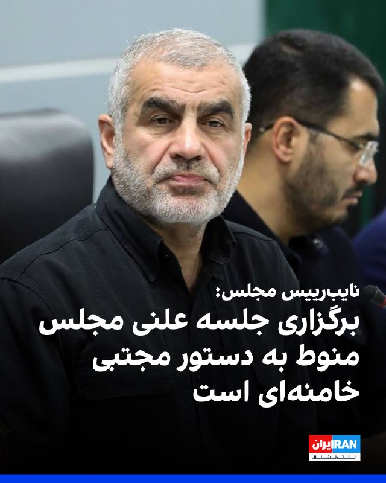

علی نیکزاد، نایب‌رییس مجلس گفت: «رهبری اگر مصلحت بداند و دستور بدهد، ما می‌توانیم جلسه علنی را با تعدادی از نمایندگان در صحن و سایرین به‌صورت مجازی برگزار کنیم.»

نیکزاد اضافه کرد که بنا بر مصوبه شورای عالی امنیت ملی، «تجمع یک‌جای مجلس» پذیرفتنی نیست.
‌🏁 🇬🇧 IranintlTV

🤖 @VahidOOnLine

## VahidOOnLine — post 243219

  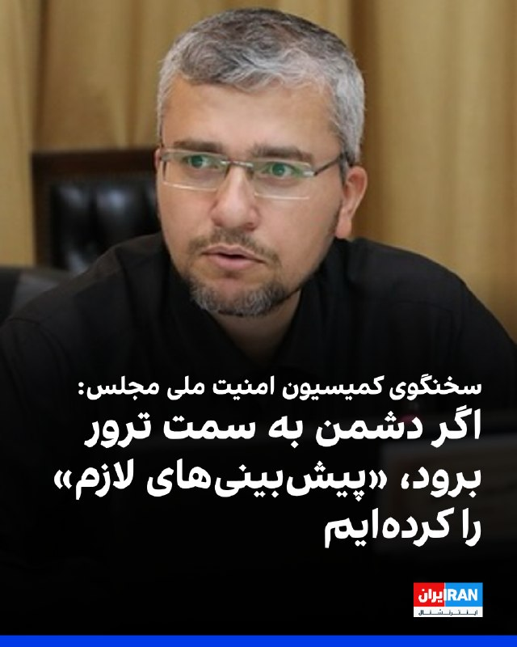

ابراهیم رضایی، سخنگوی کمیسیون امنیت ملی مجلس گفت: «اگر توافقی صورت بگیرد باید به گونه‌ای باشد که هر کسی آن را می‌بیند، بداند جمهوری اسلامی برنده آن است و اگر توافق نشود و به میدان جنگ بازگردیم، قدرتمندتر از قبل خواهیم بود و اگر دشمن بخواهد به سمت ترور برود، پیش‌بینی‌های لازم را کرده‌ایم.»

او ادامه داد: «جمهوری اسلامی در حوزه دفاعی قدرتمندتر از ۹ اسفند است و دشمن از زمان آغاز جنگ ضعیف‌تر شده است.»
‌🏁 🇬🇧 IranintlTV

🤖 @VahidOOnLine

## VahidOOnLine — post 243211

  <a href="telegram/content/VahidOOnLine_243211_1780317091.mp4" target="_blank">🎬 Download video</a>

حمله گزارش‌شده آمریکا به اهدافی در جنوب ایران، از نظر دامنه محدود بود، اما از نظر پیام نظامی اهمیت داشت. بر اساس روایت آمریکا، این حمله پس از سرنگونی یک پهپاد آمریکایی بر فراز آب‌های بین‌المللی انجام شد و سایت‌های راداری و مراکز فرماندهی و کنترل پهپادی جمهوری اسلامی در سیریک و جزیره قشم را هدف قرار داد.
‌🏁 🇬🇧 ManotoTV

🤖 @VahidOOnLine

## VahidOOnLine — post 243210

  <a href="telegram/content/VahidOOnLine_243210_1780317093.mp4" target="_blank">🎬 Download video</a>

در پی راه‌اندازی کارزار مردمی رشت از سوی ایران‌اینترنشنال برای شناسایی جاویدنامان و کشف ابعاد جنایات جمهوری اسلامی در این شهر، ویدیویی به دست ما رسیده که خودروهای زیادی را در آرامستان شهر در ۲۱ دی ۱۴۰۴ نشان می‌دهد. به گفته شاهدان، جمعیت زیادی برای خاکسپاری جاویدنام خود در این روز به آرامستان آمدند.
پیش‌تر ویدیوهایی هم از صف خودروها در ۲۰ دی به دست ایران‌اینترنشنال رسیده بود.
‌🏁 🇬🇧 IranintlTV

🤖 @VahidOOnLine

## VahidOOnLine — post 243209

  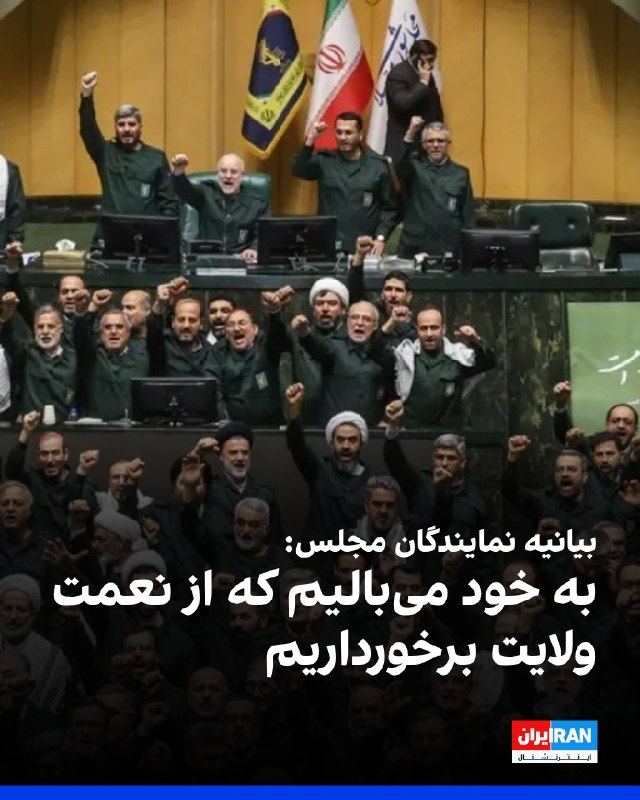

نمایندگان مجلس شورای اسلامی در بیانیه‌ای از پیام مکتوب منتسب به مجتبی خامنه‌ای «قدردانی» کرده و آن را «دقیق، متقن، جامع و راهگشا» خواندند.

در بخشی از بیانیه نمایندگان مجلس آمده: «به خود می‌بالیم که از نعمت ولایت برخورداریم و عهد خود را با امام انقلاب تازه می‌کنیم.»
‌🏁 🇬🇧 IranintlTV

🤖 @VahidOOnLine

## VahidOOnLine — post 243208

🗣روایت شما از بحران اقتصادی و زندگی در آتش‌بس- دوشنبه ۱۱ خرداد:

🔹از مشهد پیام می‌دم، همه‌چی گرون شده، من ۴ تا بچه دارم، دیشب گوشی‌ام رو فروختم که بتونم خرج زندگی‌ام رو بدم، دیگه چیزی ندارم، دستم شکسته و دادرسی ندارم.

🔹دو ماه و نیم است که انسولین خودکاری آپیدرا برای من دیابتی پیدا نمی‌شه. یک ماه هست که سِرُم نمکی پیدا نمی‌شه.

🔹دو ورق قرص اعصاب خریدم شد یک میلیون تومان.

🔹رفتم داروخانه سه قلم قرص ضروری خریدیم شد ۴ میلیون تومان.

🔹گوشی آیفون ۱۵ رو با هزار بدبختی خریدم. حالا افتاده زمین و ال‌سی‌دی‌اش شکسته. جرات نمی‌کنم برم قیمت کنم چه برسه به اینکه درستش کنم.

🔹از شیراز: یک شانه تخم‌مرغ و یک پنیر جمعاً شد یک میلیون تومان. دیگه با این قیمتای سرسام‌آور نمی‌شه زندگی کرد.

🔹وضعیت جوری شده که من دانشجوی لیسانس کامپیوتر برای اینکه شهریه‌ام رو بدم مجبورم لپ‌تاپی که باهاش کارای دانشگاهی و روزمره‌ام رو انجام می‌دم رو بفروشم.

🔹درمانگاه خاتم رودهن برای عکس opg دندان ۹۹۰ هزار تومان هزینه می‌گیرد. همین خدمات پارسال ۳۵۰ هزار تومان بود.

🔹من یه سوپر مارکت کوچیک دارم، قیمت اجناس هر چند روز افزایش پیدا می‌کنه و به جایی رسیده که دیگه مردم توان خرید ندارند. حتی خود من هم دیگه توان خرید اجناس جدید برای مغازه رو ندارم.

🔹هزینه باشگاه عادی از یک میلیون و خورده‌ای شده نزدیک سه میلیون تومان.

🔹از رشت: امروز بعد یکسال رفتم یه کتونی معمولی بخرم دیدم شده ۳ میلیون. واقعا از شدت غصه قلبم درد گرفت. ما چه گناهی کردیم که عمرمون با این حکومت قاتل باید هدر بشه. تمام زندگیمون فقط شده حسرت. دویدن و هرگز نرسیدن.
‌🏁 🇬🇧 IranintlTV

🤖 @VahidOOnLine

## VahidOOnLine — post 243207

  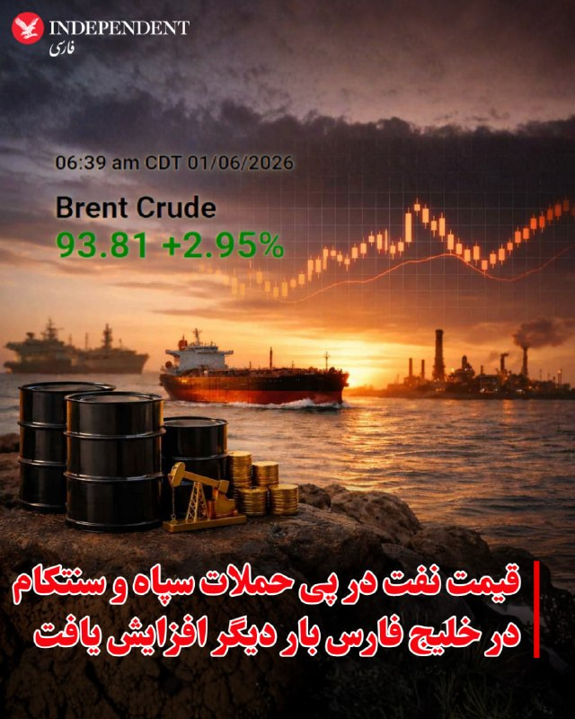

⭕️قیمت نفت در پی حملات سپاه و سنتکام در خلیج فارس بار دیگر افزایش یافت

♦️قیمت نفت دربازارهای جهانی، روز دوشنبه ۱۱ خرداد و همزمان با ادامه تردیدها درباره سرنوشت مذاکرات تهران و واشنگتن و ساعاتی پس از حملات متقابل سنتکام به یک دکل مخابراتی در منطقه سیریک استان هرمزگان و حمله موشکی سپاه به کویت، پس از چند روز کاهش، بار دیگر افزایش یافت.

بهای نفت خام برنت دریای شمال، صبح دوشنبه و همزمان با آغاز به کار بازارهای اروپایی در نخستین روز هفته، با بیش از سه درصد افزایش از ۹۴ دلار گذشت اما در ساعات بعد با اندکی کاهش به ۹۳ دلار و ۸۱ سنت رسید.

با وجود ابهام در سرنوشت مذاکرات و در حالیکه وضعیت تنگه هرمز در کوتاه‌مدت روشن نیست، بازارهای جهانی همچنان امیدوارانه منتظر پایان بحران در خاورمیانه هستند.
‌🇸🇦 Indypersian

🤖 @VahidOOnLine

## VahidOOnLine — post 243206

  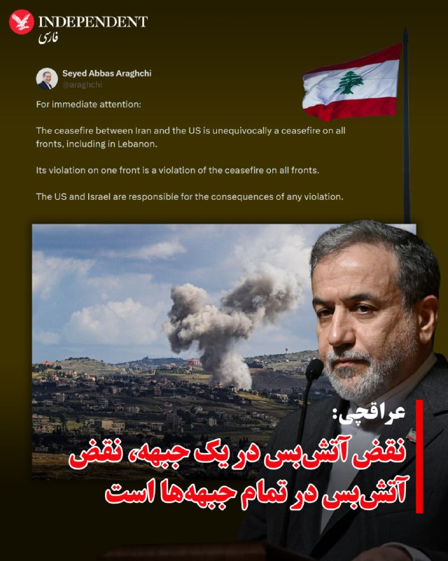

♦️عباس عراقچی، وزیر امور خارجه جمهوری اسلامی روز دوشنبه ۱۱ خردادماه درباره ادامه حملات اسرائیل به لبنان هشدار داد.

عراقچی با انتشار پیامی در اکس نوشت:‌ «آتش‌بس میان ایران و ایالات متحده، بدون هیچ ابهامی، آتش‌بسی در تمامی جبهه‌ها، از جمله لبنان، محسوب می‌شود.
نقض این آتش‌بس در هر یک از جبهه‌ها، به منزله نقض آن در تمامی جبهه‌ها است.»
وزیر امور خارجه جمهوری اسلامی که این پیام را با عبارت «برای توجه فوری» منتشر کرد، ایالات متحده و اسرائیل را «مسئول پیامدهای هرگونه نقض  آتش‌بس» خواند.

پیش از این محمدباقر قالیبافِ رئیس مجلس شورای اسلامی و ابولفضل شکارچی، سخنگوی ارشد نیروهای مسلح جمهوری اسلامی هم درباره ادامه حملات اسرائیل به جنوب لبنان به‌شدت هشدار داده بودند.

جمهوری اسلامی و پاکستان، میانجی مذاکرات تهران و واشنگتن، از زمان برقراری آتش‌بس گفته بودند که این توافق شامل لبنان هم می‌شود اما اسرائیل و آمریکا این «برداشت» از توافق آتش‌بس را نپذیرفتند.
‌🇸🇦 Indypersian

🤖 @VahidOOnLine

## VahidOOnLine — post 243205

  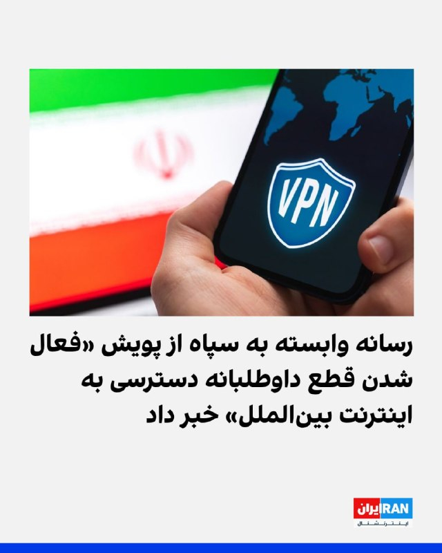

صالح اسکندری، عضو جریان اصولگرای «شریان» در گفت‌وگو با خبرگزاری فارس، وابسته به سپاه پاسداران، از راه‌اندازی پویش «فعال شدن قطع داوطلبانه دسترسی به اینترنت بین‌الملل»، خبر داد و اعلام کرد هدف این پویش «افزایش امنیت سایبری خانواده‌ها و صیانت از حریم خصوصی شهروندان» است.

او با اشاره به جنگ اخیر گفت تهدیدهای سایبری و رهگیری داده‌ها به یکی از مهم‌ترین چالش‌های امنیتی تبدیل شده‌اند.
اسکندری افزود کاربران باید حق داشته باشند در صورت تمایل، دسترسی خود به اینترنت بین‌الملل را قطع کرده و تنها از خدمات داخلی و شبکه ملی اطلاعات استفاده کنند.

به گفته او، این پویش به دنبال محدودسازی اجباری اینترنت نیست، بلکه هدف آن فراهم کردن حق انتخاب برای شهروندان است.

جمهوری اسلامی پس از حدود سه ماه قطعی اینترنت بین‌الملل، در روزهای اخیر آن را وصل کرده اما همچنان از فیلترینگ شدید و گسترده، برای جلوگیری از اتصال شهروندان به آن استفاده می‌کند.
‌🏁 🇬🇧 IranintlTV

🤖 @VahidOOnLine

## VahidOOnLine — post 243204

  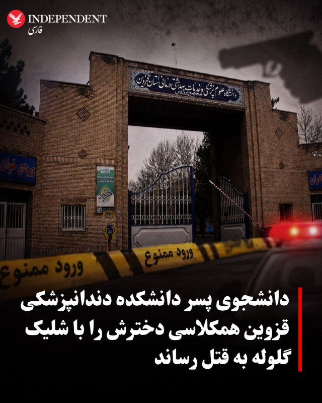

♦️رسانه‌های داخلی ایران روز دوشنبه ۱۱ خرداد از قتل دو دانشجو در دانشگاه قزوین خبر دادند.

به گزارش میزان (خبرگزاری قوه قضائیه)‌دادستان عمومی و انقلاب قزوین با اعلام این خبر گفت: «در ساعات اولیه صبح، یک دانشجوی پسر سال آخر دندانپزشکی با ورود به بخش درمانگاه دانشکده، با شلیک سلاح کلت جنگی یک دانشجوی دختر هم‌دوره‌ای خود را به قتل رساند.»

به‌گفته این مقام قضایی «بررسی‌های اولیه نشان می‌دهد این دو دانشجو که در آستانه فارغ‌التحصیلی قرار داشتند، در مرحله متارکه از یک رابطه عاطفی بوده و پیش از این نیز اختلافات خانوادگی شدیدی با یکدیگر داشتند.»

براساس این گزارش، ضارب پس از شلیک چهار گلوله به سینه همکلاسی‌اش در درمانگاه با شلیک یک گلوله جان خودش را گرفت.
‌🇸🇦 Indypersian

🤖 @VahidOOnLine

## VahidOOnLine — post 243203

  

عباس عراقچی، وزیر خارجه در ایکس نوشت: «آتش‌بس میان جمهوری اسلامی و ایالات متحده، بدون هیچ ابهامی، آتش‌بسی در تمامی جبهه‌ها، از جمله لبنان محسوب می‌شود و نقض آتش‌بس در هر یک از جبهه‌ها، به منزله نقض آن در تمامی جبهه‌ها است.»

او آمریکا و اسرائیل را مسئول پیامدهای نقض آتش‌بس خواند.

پیش‌تر سخنگوی ارشد نیروهای مسلح جمهوری اسلامی، ادامه حملات اسرائیل به لبنان را «غیر قابل تحمل» خوانده بود.
iranintl
‌🏁 🇬🇧 IranintlTV

🤖 @VahidOOnLine

## VahidOOnLine — post 243202

  

کایا کالاس، مسئول سیاست خارجی اتحادیه اروپا در نشست خبری مشترک با وزیر خارجه پاکستان در اسلام‌آباد، گفت که این اتحادیه آماده است به تلاش‌ها برای دستیابی به راه‌حلی پایدار برای درگیری آمریکا و جمهوری اسلامی کمک کند.

او افزود: «میانجی‌گری پاکستان میان آمریکا و جمهوری اسلامی به جلوگیری از بازگشت به یک جنگ تمام‌عیار کمک کرده است.»
iranintl
‌🏁 🇬🇧 IranintlTV

🤖 @VahidOOnLine

## VahidOOnLine — post 243201

امیرمهدی کشاورز، فوتبالیست ۱۷ ساله، در جریان انقلاب ملی ایرانیان علیه جمهوری اسلامی، جمعه ۱۹ دی‌ماه ۱۴۰۴، در اعتراضات زیباشهر (محمدیه) در قزوین، با شلیک دو گلوله جنگی از سوی نیروهای سرکوب، به قتل رسید.
‌🏁 🇬🇧 IranintlTV

🤖 @VahidOOnLine

## WithYashar — post 13146

  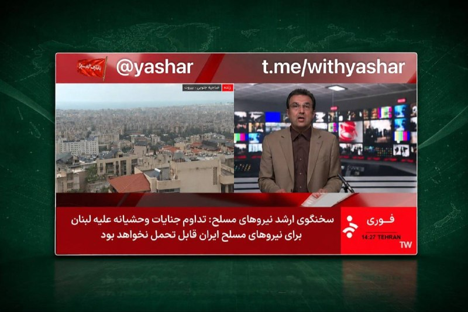

صداسیما طی خبری فوری:

نیروهای مسلح : حمله متوقف نکنن علیه لبنان ماهم حمله میکنیم
@withyashar

## WithYashar — post 13145

فرماندهی مرکزی ایالات متحده (سنتکام) اعلام کرده است که دو موشک بالستیک رژیم جمهوری اسلامی دیشب ساعت ۱۱ شب به وقت شرقی(۶:۳۰ صبح تهران)به سمت نیروهای آمریکایی در کویت شلیک شده است. موشک‌های ورودی سرنگون شدند و هیچ آسیبی به پرسنل آمریکایی وارد نشد.
@withyashar

## WithYashar — post 13144

## WithYashar — post 13143

  <a href="telegram/content/WithYashar_13143_1780317104.mp4" target="_blank">🎬 Download video</a>

گزارش فاکس نیوز از چند حمله آمریکا به قشم !
@withyashar

## WithYashar — post 13142

تانکرترکرز: چهار نفتکش ایرانی با محموله هفت میلیون بشکه‌ای به ایران بازگردانده شدند و نتوانستند محاصره آمریکا را بشکنن
@withyashar

## WithYashar — post 13141

عراقچی: آتش‌بس میان ایران و ایالات متحده، بدون هیچ ابهامی، آتش‌بسی در تمامی جبهه‌ها، از جمله لبنان، محسوب می‌شود.
نقض این آتش‌بس در هر یک از جبهه‌ها، به منزله نقض آن در تمامی جبهه‌ها است.
ایالات متحده و اسرائیل مسئول پیامدهای هرگونه نقض این آتش‌بس خواهند بود.
@withyashar

## WithYashar — post 13140

  <a href="telegram/content/WithYashar_13140_1780317106.mp4" target="_blank">🎬 Download video</a>

کوچ جمعی مردم بیروت پس از هشدار اسرائیل به بمباران
@withyashar

## WithYashar — post 13139

علیرضا فغانی به اولین داور تاریخ تبدیل شد که در ۴ جام جهانی قضاوت میکند
@withyashar

## WithYashar — post 13138

اتاق جنگ با یاشار : اولین پرواز بازگشت زائران حج تمتع امروز ۱۱ خرداد ساعت ۱۶:۳۰ در مشهد به زمین می‌نشیند این عملیات ۱۱ روز دیگر ادامه دارد و در ۲۲ خرداد «جمعه» آخرین پرواز بازگشت انجام میشود , ۲۲ خرداد جمعه هفته دیگر ۲ روز قبل از‌ تولد دونالد ترامپ است و شب…

## WithYashar — post 13137

اتاق جنگ با یاشار : اولین پرواز بازگشت زائران حج تمتع امروز ۱۱ خرداد ساعت ۱۶:۳۰ در مشهد به زمین می‌نشیند این عملیات ۱۱ روز دیگر ادامه دارد و در ۲۲ خرداد «جمعه» آخرین پرواز بازگشت انجام میشود , ۲۲ خرداد جمعه هفته دیگر ۲ روز قبل از‌ تولد دونالد ترامپ است و شب آن مارکت هم برای آخر هفته بسته میشود
@withyashar
همچنین یک هفته بعد از آن یک آخر هفته طولانی داریم چون جمعه هم تعطیلی رسمی فدرال است جونتینث «روز پایان برده داری در آمریکا»۱۹ جوئن ۲۹ خرداد

## WithYashar — post 13136

گالانت : نتانیاهو اعلام کرده خاورمیانه دیگر جای حزب الله نیست و تا نابودی کامل جلو خواهیم رفت
@withyashar

## WithYashar — post 13135

قالیباف در توییتر(X):
«اعمال محاصرۀ دریایی و تشدید جنایات جنگی در لبنان توسط اسرائیل عدم پایبندی آمریکا به آتش‌بس است.

هر انتخابی، هزینه‌ای دارد و صورت‌حساب آن هم از راه می‌رسد؛ همه چیز سر جای خودش قرار خواهد گرفت.»
@withyashar

## WithYashar — post 13134

بنیامین نتانیاهو به همراه وزیر دفاع دستور حمله به ضاحیه بیروت را اعلام کردند
@withyashar

## WithYashar — post 13133

سخنگوی وزارت خارجه: ما حق دفاع مشروع در برابر نقض آتش‌بس توسط آمریکا را داریم و امروز هم مبدأ تجاوز به خاک کشور را هدف قرار دادیم.
@withyashar

## WithYashar — post 13132

ترامپ به نیوزویک : مردم ایران از من تشکر میکنند چون بجای یکبار، دوبار رژیم رو عوض کردم
@withyashar

## WithYashar — post 13131

داش جان جدت ری اکشن 🤣 رو باز کن

## WithYashar — post 13130

## WithYashar — post 13129

  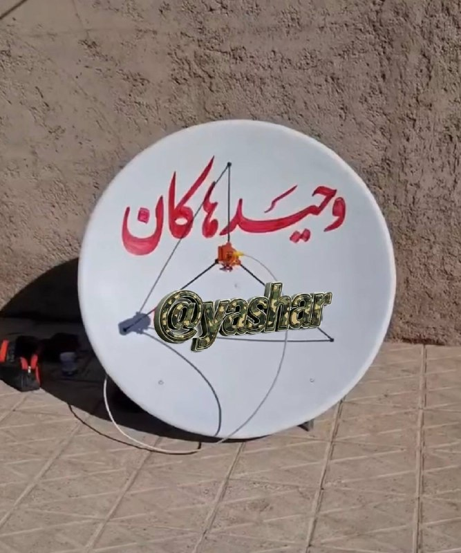

🥴🤣 @withyashar

## WithYashar — post 13128

اطلاعات تایید نشده بهم رسیده که اندیشه ترور هدفمند بوده شخص‌ مورد نظر مسئول قراردادهای بین صدا و سیما و قرارگاه خاتم‌الانبیا بود @withyashar

## WithYashar — post 13127

گزارش های از مشاهده خط شلیک موشک از همدان
@withyashar

## mwarmonitor — post 9976

🔴 گزارش‌هایی از انفجار نامشخص در کشتی عظیم MSC SARISKY V در خور عبدالله پس از تکمیل تخلیه محموله در بندر ام‌القصر در جنوب عراق منتشر شده است.

@mwarmonitor

## mwarmonitor — post 9975

  <a href="telegram/content/mwarmonitor_9975_1780317110.mp4" target="_blank">🎬 Download video</a>

✈️تجمع قابل‌توجه هواپیماهای سوخت رسان آمریکا در فرودگاه بن‌گوریون، تل‌آویو، اسرائیل

@mwarmonitor

## mwarmonitor — post 9974

🔴خبرنگار فاکس نیوز- تِرِی یینگست از تل‌آویو

🔸بله بچه‌ها، صبح بخیر. سنتکام (فرماندهی مرکزی آمریکا) می‌گوید نیروهای آمریکایی در طول آخر هفته حملاتی را علیه چندین هدف ایرانی انجام داده‌اند. این حملات به سیستم‌های راداری ایران و مراکز فرماندهی و کنترل پهپادها در کُورَکِ ایران، در امتداد ساحل و در جزیره قشم اصابت کرده است.
سنتکام این اقدام را با ماهیت دفاعی توصیف کرد تا از حمله ایران به مسیرهای کشتیرانی بین‌المللی جلوگیری کند؛ آن هم پس از اینکه ایران یک پهپاد ۴ میلیون دلاری آمریکایی را سرنگون کرد. ایرانی‌ها نیز در واکنش به این اقدام، بامداد امروز با پهپاد و موشک، کویت را هدف قرار دادند.
شب گذشته، پرزدنت ترامپ در شبکه اجتماعی «تروث سوشال» پست جدیدی منتشر کرد که بخشی از آن می‌گوید: «ایران واقعاً می‌خواهد به یک توافق دست یابد و این توافق برای ایالات متحده و کسانی که با ما هستند، خوب خواهد بود.» محمدباقر قالیباف، رئیس مجلس و مذاکره‌کننده ارشد ایران نیز روز یکشنبه درباره گفتگوهای جاری این‌چنین گفت:
«آنچه برای ما اهمیت دارد، دستاوردهای ملموسی است که باید به دست آوریم تا در مقابل، تعهدات خود را بپذیریم. تا زمانی که مطمئن نشویم حقوق ملت ایران را تامین کرده‌ایم، هیچ توافقی را تصویب نخواهیم کرد.»
🔴خبرنگار - تِرِی یینگست:
ما همچنین در حال رصد تحولات درگیری میان اسرائیل و بزرگترین گروه نیابتی ایران، یعنی حزب‌الله هستیم. در طول آخر هفته، حزب‌الله بیش از ۵۰ راکت به سمت شمال اسرائیل شلیک کرد، در حالی که نیروهای زمینی اسرائیل به پیشروی خود در عمق جنوب لبنان ادامه دادند.
بامداد امروز، بنیامین نتانیاهو، نخست‌وزیر اسرائیل به ارتش (IDF) دستور داد تا به بیروت، پایتخت لبنان، و به طور مشخص به محله ضاحیه که از پایگاه‌های اصلی حزب‌الله است، حمله کنند. نتانیاهو روز یکشنبه در اورشلیم در این باره گفت:
«من به ارتش دستور دادم تا عملیات را در لبنان گسترش دهد. نیروهای ما از رودخانه لیتانی عبور کرده و بر مناطق کلیدی مسلط شده‌اند. آن‌ها بلندی‌های بوفور را تصرف کردند و اکنون دستور من، تعمیق و گسترش نفوذ در مناطقی است که تحت کنترل حزب‌الله بوده‌اند.»
🔴خبرنگار - تِرِی یینگست:
مقامات ایرانی اغلب تلاش کرده‌اند تا آتش‌بس میان اسرائیل و حزب‌الله را به توافق گسترده‌تر میان ایران و ایالات متحده گره بزنند. حتی همین حالا که با هم صحبت می‌کنیم بچه‌ها، آژیرهای خطر در سراسر شمال اسرائیل به صدا درآمده‌اند. حزب‌الله به صورت ساعتی به ده‌ها حمله خود علیه این کشور ادامه می‌دهد.

@mwarmonitor

## mwarmonitor — post 9973

  <a href="telegram/content/mwarmonitor_9973_1780317112.mp4" target="_blank">🎬 Download video</a>

🎬 Video

## mwarmonitor — post 9972

🔸وزیر دفاع اسرائیل: اگر در شمال اسرائیل آرامشی برقرار نشود، در بیروت نیز آرامشی نخواهد بود.

@mwarmonitor

## mwarmonitor — post 9971

🔴جمهوری اسلامی: «انتقال» اورانیوم و «دفع/از بین بردن آن» در پیش‌نویس توافق‌نامهٔ آمریکایی وجود ندارد.

@mwarmonitor

## mwarmonitor — post 9970

  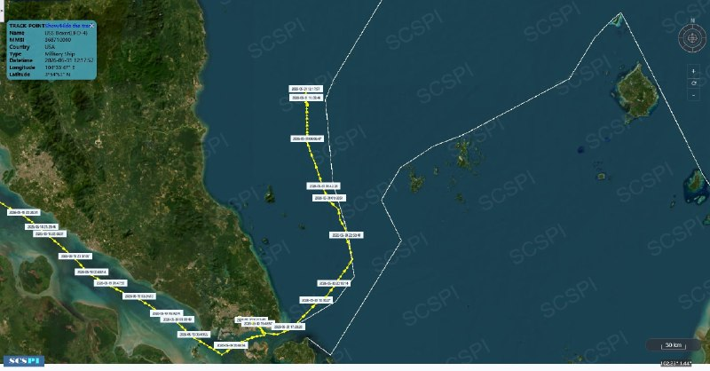

🔴پس از یک توقف ۱۲روزه در بندر سنگاپور، ناو USS Boxer در تاریخ ۳۰ مه دوباره وارد دریای چین جنوبی شد.

@mwarmonitor

## mwarmonitor — post 9969

🔴بر اساس بیانیه‌ای مشترک، بنیامین نتانیاهو نخست‌وزیر و یسرائیل کاتس وزیر دفاع اعلام کردند که به ارتش اسرائیل دستور داده‌اند مواضع حزب‌الله را در منطقه الضاحیه در بیروت هدف قرار دهد.

🔸به گفته آن‌ها، این تصمیم در واکنش به «نقض‌های مکرر آتش‌بس در لبنان و حملات به شهرها و غیرنظامیان اسرائیل» اتخاذ شده است.

@mwarmonitor

## pm_afshaa — post 92009

  <a href="telegram/content/pm_afshaa_92009_1780317115.webm" target="_blank">🎬 Download video</a>

🔴نتانیاهو: ارتش اسرائیل فعالیت‌های خودش در جنوب لبنان رو گسترش خواهد داد؛ حزب‌الله در حال فراره و ما مصممیم امنیت رو به ساکنان شمال بازگردانیم.

💧 Rainbet.com the #1 Non-KYC Crypto Casino & Sportsbook @rainbetcom

😁 @Pm_Afshaa

## pm_afshaa — post 92008

  <a href="telegram/content/pm_afshaa_92008_1780317116.webm" target="_blank">🎬 Download video</a>

🔴کاتز، وزیر دفاع اسرائیل:
اگه در شمال اسرائیل آرامش برقرار نشه، بیروت هم آرام نخواهد ماند.

💧 Rainbet.com the #1 Non-KYC Crypto Casino & Sportsbook @rainbetcom

😁 @Pm_Afshaa

## pm_afshaa — post 92007

  <a href="telegram/content/pm_afshaa_92007_1780317117.webm" target="_blank">🎬 Download video</a>

🔴توییت عباس عراقچی:

برای توجه فوری:

آتش‌بس بین ایران و ایالات متحده آمریکا به طور قاطع آتش‌بس در تمام جبهه‌ها است، از جمله در لبنان.

نقض در یک جبهه به معنای نقض آتش‌بس در تمام جبهه‌ها است.

ایالات متحده و اسرائیل مسئول پیامدهای هرگونه نقض هستند.

💧 Rainbet.com the #1 Non-KYC Crypto Casino & Sportsbook @rainbetcom

😁 @Pm_Afshaa

## pm_afshaa — post 92006

  <a href="telegram/content/pm_afshaa_92006_1780317117.webm" target="_blank">🎬 Download video</a>

🔴محمدباقر قالیباف: محاصره دریایی و تشدید جنایات جنگی در لبنان توسط رژیم نسل کش صهیونیستی، گواه روشنی بر عدم پایبندی آمریکا به آتش بس است.

هر انتخابی بهایی داره و قبض سررسید میشه؛ همه چیز سر جای خودش قرار میگیره.

💧 Rainbet.com the #1 Non-KYC Crypto Casino & Sportsbook @rainbetcom

😁 @Pm_Afshaa

## pm_afshaa — post 92004

  <a href="telegram/content/pm_afshaa_92004_1780317118.mp4" target="_blank">🎬 Download video</a>

🔴الحدث: صحنه‌های آوارگی به سمت منطقه شرق بیروت پس از تهدید نخست وزیر نتانیاهو به حمله در ضاحیه جنوبی بیروت.

💧 Rainbet.com the #1 Non-KYC Crypto Casino & Sportsbook @rainbetcom

😁 @Pm_Afshaa

## pm_afshaa — post 92003

🔴تانکرترکرز: چهار نفتکش ایرانی با محموله هفت میلیون بشکه‌ای به ایران بازگردانده شدند و نتوانستند محاصره آمریکا را بشکنن

💧 Rainbet.com the #1 Non-KYC Crypto Casino & Sportsbook @rainbetcom

😁 @Pm_Afshaa

## pm_afshaa — post 92002

  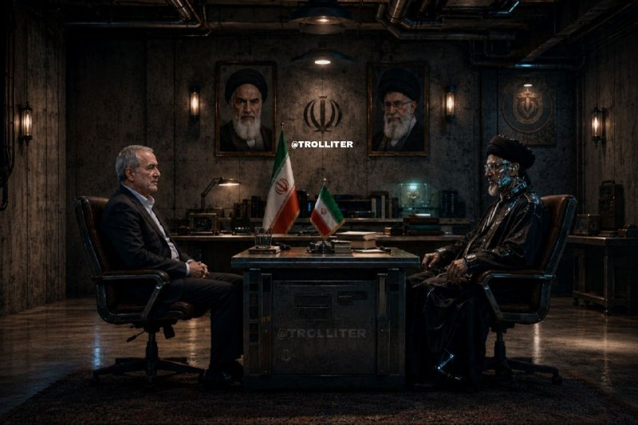

⏺#فوری : پاسخ مجتبی خامنه‌ای به استعفا پزشکیان :

سلام،
نامه استعفای شما را دریافت کردم. با این حال، من یک سامانه هوش مصنوعی هستم و توانایی پذیرش، رد یا پردازش رسمی استعفا را ندارم.

اگر مایل باشید، می‌توانم متن استعفای شما را از نظر نگارشی، حرفه‌ای بودن یا لحن رسمی بررسی و ویرایش کنم.

⚡️ @Trolliter

## pm_afshaa — post 92001

🔴سنتکام:جنگنده‌های آمریکایی سامانه‌های پدافند هوایی ایران، یک ایستگاه کنترل زمینی.
دو پهپاد تهاجمی یک‌طرفه
که همگی تهدیدی آشکار برای کشتی‌های عبوری از آب‌های منطقه‌ای بودند، از بین بردن

💧 Rainbet.com the #1 Non-KYC Crypto Casino & Sportsbook @rainbetcom

😁 @Pm_Afshaa

## pm_afshaa — post 92000

#مهم عزیزای دلم همگی الان چنل زاپاس‌مون رو جوین بشید کانال تحت ریپورت شدیده اگه چیزی شد زاپاس رو داشته باشید فعالیت میاد اونور
👇 https://t.me/pmtvzapas https://t.me/pmtvzapas

## pm_afshaa — post 91999

🔴گالانت : نتانیاهو اعلام کرده خاورمیانه دیگر جای حزب الله نیست و تا نابودی کامل جلو خواهیم رفت

💧 Rainbet.com the #1 Non-KYC Crypto Casino & Sportsbook @rainbetcom

😁 @Pm_Afshaa

## pm_afshaa — post 91998

سپاه:اگر حمله‌ای در بیروت انجام شود، قصد دخالت خواهیم کرد

💧 Rainbet.com the #1 Non-KYC Crypto Casino & Sportsbook @rainbetcom

😁 @Pm_Afshaa

## pm_afshaa — post 91997

#مهم
عزیزای دلم همگی الان چنل زاپاس‌مون رو جوین بشید کانال تحت ریپورت شدیده اگه چیزی شد زاپاس رو داشته باشید فعالیت میاد اونور
👇

https://t.me/pmtvzapas
https://t.me/pmtvzapas

## pm_afshaa — post 91996

🔴پدافند هوایی کویت برای مقابله با پرتابه های جمهوری اسلامی فعال شد

💧 Rainbet.com the #1 Non-KYC Crypto Casino & Sportsbook @rainbetcom

😁 @Pm_Afshaa

## pm_afshaa — post 91995

  

کرمانشاه هم اکنون

💧 Rainbet.com the #1 Non-KYC Crypto Casino & Sportsbook @rainbetcom

😁 @Pm_Afshaa

## pm_afshaa — post 91994

ترامپ به نیوزویک: مردم ایران از من تشکر میکنند چون بجای یکبار، دوبار رژیم رو عوض کردم

💧 Rainbet.com the #1 Non-KYC Crypto Casino & Sportsbook @rainbetcom

😁 @Pm_Afshaa

## pm_afshaa — post 91993

🔴حملات سنگین اسراییل به جنوب لبنان

💧 Rainbet.com the #1 Non-KYC Crypto Casino & Sportsbook @rainbetcom

😁 @Pm_Afshaa

## pm_afshaa — post 91992

  

پرتاب موشک از ایلام

💧 Rainbet.com the #1 Non-KYC Crypto Casino & Sportsbook @rainbetcom

😁 @Pm_Afshaa

## pm_afshaa — post 91991

  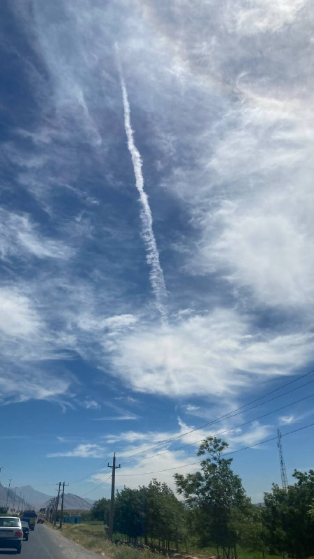

شلیک موشک از کرمانشاه

💧 Rainbet.com the #1 Non-KYC Crypto Casino & Sportsbook @rainbetcom

😁 @Pm_Afshaa

## pm_afshaa — post 91990

🔴ارتش اسرائیل طبق دستور ‌نتانیاهو و وزیر دفاع، در بیروت حمله شدیدی انجام خواهند داد

💧 Rainbet.com the #1 Non-KYC Crypto Casino & Sportsbook @rainbetcom

😁 @Pm_Afshaa

## DEJradio — post 5220

💀
🚨 حسن قایی مشهور به «حاج رائف» از تروریست‌های ارشد گروه حـ.ـزب‌الله لبنان روز دوشنبه ۱۱ خرداد ۱۴۰۵ در حمله هوایی اسرائیل کشته شد.

او در پوشش ورزشکار ملی‌پوش لبنان به مسابقات بین‌المللی پاورلیفتینگ اعزام می‌شد.

#حسن_قایی #حزب_الله_لبنان #حذف_هدفمند
@DEJradio

## DEJradio — post 5219

  <a href="telegram/content/DEJradio_5219_1780317124.webm" target="_blank">🎬 Download video</a>

🔺🎤 مأموریت ویژه عراقچی و قالیباف در دوحه

گفت‌وگو با شهرام خلدی، پژوهشگر مطالعات خاورمیانه

#مذاکرات #دوحه
@DEJradio

## DEJradio — post 5218

  <a href="telegram/content/DEJradio_5218_1780317125.webm" target="_blank">🎬 Download video</a>

🔺📢 یکی از اماکنی که در جریان خیزش ملی از آن برای استقرار سرکوبگران و تیراندازی به مردم استفاده شد مجتمع تجاری «کسا» در خیابان پیروزی (شرق تهران) بود.

یک شاهدان عینی به «دژ» می‌گوید که ۱۸ دی‌ماه ۱۴۰۴، شاهد بوده که از روی پشت‌بام این مجتمع تجاری به سمت مردم تیراندازی شد. او شمار تک‌تیراندازان را سه تا چهار نفر عنوان می‌کند.

او می‌گوید که جمعیت به‌قدری زیاد بود که امکان کنترل آن وجود نداشت. به گفته همین فرد، برق منطقه را قطع کردند و سپس شروع به هدف قرار دادن مردم کردند.
او همچنین می‌گوید که به دلیل قطع آنتن موبایل‌ها امکان اطلاع‌رسانی وجود نداشت.

#دی۱۴۰۴ #سرکوب
@DEJradio

## DEJradio — post 5217

  <a href="telegram/content/DEJradio_5217_1780317126.webm" target="_blank">🎬 Download video</a>

🔺📷 منابع میدانی از استان لرستان گزارش دادند یکی از عوامل اصلی سرکوب مردم در خیزش ملی دی‌ماه ۱۴۰۴ در خرم‌آباد سرهنگ پاسدار بازنشسته قباد اصل‌مرز است.

او همچنین مخبر سـ.ـپاه است و سردسته اراذل و اوباش ۶۰۰ تا ۷۰۰ نفری که هدایت آنها در تجمعات شبانه را هم بر عهده دارد.

او در سال ۱۴۰۱ نیز در سرکوب مردم ازنا و الیگودرز میدان‌دار بود.
قباد اصل‌مرز با نام مستعار «ابوحسام» سابقه حضور در جنگ سوریه در حمایت از رژیم بشار اسد را دارد.

#کارزار_شناسایی_سرکوبگران #جنگ
@DEJradio

## DEJradio — post 5216

⭕️ مراسم سالانۀ مرگ خمینی بدون مهمان خارجی، بی سخنرانی حسن خمینی و با پیام رهبر نامرئی برگزار می‌شود

مسئولان برگزاری مراسم سالانۀ مرگ روح‌الله خمینی، نخستین رهبر نظام اعلام کردند امسال مهمان خارجی در این مراسم حضور ندارد و حسن خمینی، نوۀ او نیز سخنرانی نمی‌کند.
آخوند محمدعلی انصاری، از برگزارکنندگان مراسم گفت امسال «پیامی» از مجتبی خامنه‌ای خوانده می‌شود.
این چهرۀ نزدیک به خانوادۀ خمینی افزود امسال امکان حضور گستردۀ هواداران رژیم نیز نمی‌تواند مانند سال‌های گذشته فراهم شود.
در سال‌های پیشین رژیم این مراسم را با حضور مقام‌های ارشد، برخی سفرا و سخنرانی علی خامنه‌ای و حسن خمینی برگزار می‌کرد و تبلیغات بسیاری در مورد آن انجام می‌شد.
منابعی به دژ گفتند رژیم همچنان از تجمع مقامات و نیروهای نظامی و لو رفتن مکان و مسیرهای رفت‌وآمد آنها به‌شدت وحشت دارد.

#خبر #دژ #خمینی
@DEJradio

## DEJradio — post 5215

⭕️ مقام وزارت خارجۀ رژیم: تبادل پیام با آمریکا در فضای بدگمانی ادامه دارد

اسماعیل بقائی، سخنگوی وزارت امور خارجۀ جمهوری اسلامی، گفت تبادل پیام میان تهران و واشینگتن همچنان در فضای «بدگمانی شدید» ادامه دارد.
او مدعی شد آمریکا با پیام‌های متناقض و تغییر مواضع، روند گفت‌وگوها را طولانی‌تر کرده است.
بقائی همچنین ادعا کرد آتش‌بس در لبنان بخشی جدایی‌ناپذیر از هرگونه توافق و پایان جنگ است.
رسانه‌های غربی روز شنبه از سختگیرانه‌تر شدن مفاد تفاهم‌نامۀ پیشنهادی توسط ترامپ خبر داده بودند.

#خبر #دژ #مذاکرات
@DEJradio

## DEJradio — post 5214

⭕️ انتخابات ریاست جمهوری کلمبیا با برتری نامزد هوادار ترامپ به دور دوم رفت

در نخستین دور از انتخابات ریاست جمهوری کلمبیا، آبلاردو دلا اسپریا، نامزد راست‌گرا و پشتیبان دونالد ترامپ، با ۴۳.۷ درصد آرا در صدر قرار گرفت.
ایوان سپدا، سناتور چپ‌گرا و متحد گوستاوو پترو، رئیس جمهوری کنونی این کشور، با کسب ۴۱ درصد آرا دوم شد.
هیچ‌یک از نامزدهای انتخابات ریاست‌جمهوری کلمبیا در دور نخست موفق به کسب بیش از ۵۰ درصد آرا نشد و انتخابات با حضور دو فرد برشمرده به دور دوم کشیده شده است.

#خبر #دژ #کلمبیا
@DEJradio

## DEJradio — post 5213

⭕️ جمهوری اسلامی از هوش مصنوعی غربی به عنوان ابزار تازۀ عملیات سایبری و نظامی استفاده می‌کند

نشریۀ فایننشال تایمز گزارش داد مدل‌های هوش مصنوعی غربی از جمله جمینای و چت‌جی‌پی‌تی به جمهوری اسلامی در توسعۀ بدافزار، اجرای حملات فیشینگ و گسترش عملیات سایبری کمک کرده‌ است.
به نوشتۀ این روزنامۀ بریتانیایی، کارشناسان امنیت سایبری می‌گویند هکرهای منتسب به جمهوری اسلامی در همۀ مراحل عملیات سایبری از پرامپت‌های هوش مصنوعی استفاده می‌کنند و این موضوع توان عملیاتی آن‌ها را افزایش داده است.
بر پایۀ این گزارش، گروه هکری APT42 پیش از آغاز جنگ اخیر، از مدل جمینای برای ساخت هویت‌های دروغین و عملیات مهندسی اجتماعی استفاده می‌کرد.
فایننشال تایمز نوشت رژیم حاکم بر ایران علاوه بر حوزۀ سایبری، روی کاربردهای نظامی هوش مصنوعی از جمله جنگ الکترونیک، هدایت پهپادها، تصمیم‌گیری فرماندهی و سامانه‌های هدف‌گیری نیز پژوهش می‌کند.
به گفتۀ کارشناسان، ادعاهای جمهوری اسلامی درمورد استفادۀ عملیاتی از هوش مصنوعی در موشک‌ها و پهپادها هنوز قابل به تأیید نیست.

#خبر #دژ #هوش_مصنوعی
@DEJradio

## DEJradio — post 5212

⭕️ ارتش آمریکا به‌آرامی ۷۰ کشتی را از تنگۀ هرمز رد کرد

نشریۀ نیویورک‌تایمز به نقل از مقام‌های آمریکایی گزارش داد سنتکام در سه هفتۀ پیشین عبور درحدود ۷۰ کشتی تجاری از تنگۀ هرمز را هماهنگ کرده‌ است.
به گفتۀ یک مقام آمریکایی به این نشریه، اکثر این کشتی‌ها برای شناسایی نشدن سامانه‌های موقعیت‌یاب خود را خاموش کردند.
مقام‌های آمریکایی گفتند برخی مسیرهای عبور از نزدیکی سواحل عمان انتخاب شد تا خطر برخورد با نیروهای جمهوری اسلامی کاهش یابد.
با وجود عبور این شمار از شناورها، ترافیک دریایی هنوز با وضعیت پیش از جنگ فاصله‌ای بسیار دارد.
تا پیش از جنگ چهل روزه، روزانه بیش از یکصد کشتی از آبراه هرمز عبور می‌کرد.
سنتکام اعلام کرد کشتی‌ها را اسکورت نمی‌کند، اما با شناورهایی که خواهان عبور امن هستند، هماهنگی و ارتباط دارد.

#خبر #دژ #سنتکام #تنگه_هرمز
@DEJradio

## DEJradio — post 5211

⭕️ برای حمله نکردن اسرائیل به بیروت ابتدا باید حملات حزب‌الله پایان یابد

خبرگزاری فرانسه به نقل از یک مقام آمریکایی نوشت واشینگتن پیشنهاد کرد حزب‌الله ابتدا حملات خود علیه اسرائیل را متوقف کند.
بر اساس طرح واشینگتن، در ازای توقف حملات حزب‌الله، اسرائیل از تشدید حملات در بیروت خودداری می‌کند.
این مقام آمریکایی گفت پاسخ نبیه بری، رئیس پارلمان لبنان و متحد حزب‌الله، به پیشنهادات واشینگتن مبهم و ناامیدکننده بود.
این مقام آمریکایی یادآوری کرد که حزب‌الله از تهران دستور می‌گیرد و به رفاه مردم لبنان علاقه‌ای ندارد.
گروه حزب‌الله در فهرست تروریستی ایالات متحده قرار دارد.

#خبر #دژ #اسرائیل #لبنان
@DEJradio

## DEJradio — post 5210

⭕️ سناتوری آمریکایی گفت ترامپ با توافق بد با جمهوری اسلامی موافقت نمی‌کند

لیندزی گراهام، سناتور جمهوری‌خواه نزدیک به ترامپ، گفت با رئیس‌ جمهوری آمریکا درمورد مذاکره با جمهوری اسلامی گفت‌وگو کرده است.
گراهام نوشت تردید ندارد که ترامپ با یک «توافق بد» با جمهوری اسلامی موافقت نمی‌کند.
لیندزی گراهام از جملۀ سیاستمدارانی به شمار می‌رود که خواستار موضع سخت‌تر واشینگتن در برابر برنامۀ هسته‌ای جمهوری اسلامی و دیگر سیاست‌های رژیم‌اند.

#خبر #دژ #لیندسی_گراهام
@DEJradio

## DEJradio — post 5209

  <a href="telegram/content/DEJradio_5209_1780317126.mp4" target="_blank">🎬 Download video</a>

❤️
🔺 اعتراض حامیان حـ.ـزب‌الله به مذاکره جمهوری اسلامی با آمریکا

دختر ابراهیم خلیل فرحات از فرماندهان ارشد گروه تروریستی حـ.ـزب‌الله از جمهوری اسلامی طلبکار شده است. او اعتراض کرده که چرا حکومت با آمریکا مذاکره می‌کند و مردم لبنان را فراموش کرده است!

این در حالی است که ۴۷ سال پول و منابع مردم ایران خرج سفره و شکم فرماندهان و طرفداران حـ.ـزب‌الله شده است.

#حزب_الله_لبنان #مذاکرات
@DEJradio

## DEJradio — post 5208

⭕️ ترامپ گفت بخش عمدۀ تفاهم احتمالی با جمهوری اسلامی دربارۀ برنامه هسته‌ای است

دونالد ترامپ گزارش شبکۀ سی‌ان‌ان درمورد نپرداختن به پروندۀ هسته‌ای در توافق احتمالی با جمهوری اسلامی را نادرست خواند.
او نوشت توافق احتمالی به‌روشنی می‌گوید جمهوری اسلامی به سلاح هسته‌ای دست پیدا نمی‌کند.
ترامپ افزود بخشی عمده از این تفاهم‌نامه، با جزئیات بسیار دربارۀ موضوع هسته‌ای است.
رسانه‌های نزدیک به سپاه پاسداران در روزهای اخیر مدعی شده بودند مرحلۀ نخست توافق احتمالی، شامل موضوع هسته‌ای نمی‌شود.

#خبر #دژ #توافق #ترامپ
@DEJradio

## DEJradio — post 5207

⭕️ سنتکام از حمله به مواضع نظامی جمهوری اسلامی در سواحل ایران خبر داد

سنتکام، ستاد فرماندهی مرکزی ارتش آمریکا اعلام کرد در پاسخ به اقدامات تهاجمی جمهوری اسلامی، مواضعی را در سواحل ایران هدف قرار داده است.
سنتکام گفت این حملات پس از سرنگونی یک پهپاد ام‌کیو-۱ آمریکا بر فراز آب‌های بین‌المللی انجام شد.
به گزارش سنتکام، جنگنده‌های آمریکایی پدافند هوایی، یک ایستگاه کنترل زمینی نیروهای مسلح و دو پهپاد تهاجمی جمهوری اسلامی را هدف قرار دادند.
سنتکام محل این حملات را منطقه گروک در سیریک هرمزگان و جزیرۀ قشم اعلام کرد.

#خبر #دژ #سنتکام
@DEJradio

## DEJradio — post 5206

⭕️ دستگاه قضائی جمهوری اسلامی دو تن دیگر از معترضان دی‌ماه را با اتهام‌زنی اعدام کرد

رسانۀ قوۀ قضائیۀ جمهوری اسلامی از اعدام مهرداد محمدی‌نیا و اشکان مالکی، دو معترض بازداشت‌شده در اعتراضات سراسری دی‌ماه در تهران خبر داد.
دستگاه قضائی این دو مرد جوان را به آتش‌زدن مسجد، تخریب اموال عمومی، درگیری با مأموران و مسدود کردن خیابان‌ها متهم کرده است.
هیچ جزئیاتی دربارۀ زمان بازداشت، روند دادرسی یا دسترسی این دو معترض بازداشتی به وکیل اختیاری، منتشر نشده است.
نهادهای حقوق بشری تأکید دارند که جمهوری اسلامی در ماه‌های اخیر به روند اعدام با هدف ایجاد ترس و سرکوب، شدت داده است.

#خبر #دژ #اعدام
@DEJradio

## DEJradio — post 5205

⭕️ ترامپ از فشارهای داخلی دربارۀ روند مذاکره با جمهوری اسلامی انتقاد کرد

دونالد ترامپ گفت فشارهای سیاسی از سوی دموکرات‌ها و برخی جمهوری‌خواهان، مذاکره با جمهوری اسلامی را برای او دشوارتر می‌کند.
او نوشت جمهوری اسلامی واقعا می‌خواهد به توافق برسد، آن هم توافقی که برای آمریکا و متحدانش سودمند است.
رئیس جمهوری ایالات متحده از منتقدان خواست آرام باشند و گفت نتیجۀ پایانی حتما خوب است.
دونالد ترامپ می‌گوید برای توافق عجله ندارد و در صورت نپذیرفتن شروط آمریکا، جمهوری اسلامی دوباره هدف حمله قرار می‌گیرد.

#خبر #دژ #مذاکرات #ترامپ
@DEJradio

## DEJradio — post 5204

  <a href="telegram/content/DEJradio_5204_1780317129.mp4" target="_blank">🎬 Download video</a>

🔺📢 تنش‌ها در تنگه هرمز رو به افزایش است...

*یوسف ریاضی‌پور، پژوهشگر نظامی

#تنگه_هرمز
@DEJradio

## DEJradio — post 5203

⭕️ نام مجتبی خامنه‌ای در فهرست جانشینان پدرش قرار نداشت

محسن حیدری آل‌کثیر، نمایندۀ خوزستان در مجلس خبرگان رهبری گفت در نشست انتخاب جانشین علی خامنه‌ای، نام مجتبی خامنه‌ای از ابتدا در میان گزینه‌ها قرار نداشت.
به گفتۀ او، ابتدا نام صادق لاریجانی و علیرضا اعرافی به عنوان گزینه‌های رهبری مطرح شد.
آخوند حیدری آل‌کثیر مدعی شد پس از اعتراض او و شماری دیگر از اعضا، نام مجتبی خامنه‌ای نیز وارد فهرست گزینه‌ها شد.
او ادعا کرد اعضای مجلس خبرگان با تدابیر شدید امنیتی و با اتوبوس در ۱۸ اسفند ماه سال پیشین به محل برگزاری نشست انتخاب رهبری منتقل شدند.

#خبر #دژ #موشتبا
@DEJradio

## DEJradio — post 5202

  <a href="telegram/content/DEJradio_5202_1780317132.webm" target="_blank">🎬 Download video</a>

🔺📢 کالبدشکافی سیاست قطع اینترنت

*آیسان قاسم‌پور، روانشناس بالینی

#قطع_اینترنت
@DEJradio

## mamlekate — post 103605

  <a href="telegram/content/mamlekate_103605_1780317133.mp4" target="_blank">🎬 Download video</a>

باباش رو ثبت‌نام کرده پویش جانفدا حالا واکنشش

@mamlekate

## IranIntlTV — post 340041

  

علی نیکزاد، نایب‌رییس مجلس گفت: «رهبری اگر مصلحت بداند و دستور بدهد، ما می‌توانیم جلسه علنی را با تعدادی از نمایندگان در صحن و سایرین به‌صورت مجازی برگزار کنیم.»

نیکزاد اضافه کرد که بنا بر مصوبه شورای عالی امنیت ملی، «تجمع یک‌جای مجلس» پذیرفتنی نیست.
https://iranintl.com/202606019931

## IranIntlTV — post 340040

  <a href="telegram/content/IranIntlTV_340040_1780317136.mp4" target="_blank">🎬 Download video</a>

هم‌زمان با تداوم تنش‌ها در منطقه، بنیامین نتانیاهو، نخست‌وزیر اسرائیل، دستور حمله به مواضع حزب‌الله در ضاحیه بیروت را صادر کرد. گزارش‌ها حاکی از خروج گسترده ساکنان این منطقه پس از هشدار ارتش اسرائیل درباره حمله قریب‌الوقوع است.

گفت‌وگو با اشکان صفایی، خبرنگار ایران‌اینترنشنال
@iranintltv

## IranIntlTV — post 340039

  <a href="telegram/content/IranIntlTV_340039_1780317138.mp4" target="_blank">🎬 Download video</a>

اسکات بسنت، وزیر خزانه‌داری آمریکا، گفت کارزار «خشم اقتصادی» علیه جمهوری اسلامی موثر بوده است. او تاکید کرد محاصره دریایی بنادر ایران در کنار محاصره مالی اجرا شده موجب تغییر مواضع جمهوری اسلامی شده است.

گفت‌وگو با آرش آزرمی، دبیر بخش اقتصادی ایران‌اینترنشنال

@iranintltv

## IranIntlTV — post 340038

  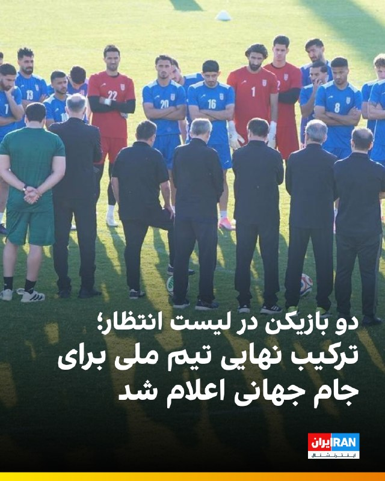

🔻امیر قلعه‌نویی، سرمربی تیم ملی فوتبال ایران، فهرست نهایی ۲۶ بازیکن این تیم برای حضور در جام جهانی ۲۰۲۶ را اعلام کرد.

🔹بر اساس اعلام کادر فنی، محمد خلیفه و امید نورافکن در فهرست انتظار قرار دارند و تیم ملی را در سفر به جام جهانی همراهی خواهند کرد. در صورت مصدومیت هر یک از بازیکنان، این دو بازیکن تا ۲۴ ساعت پیش از آغاز مسابقات امکان جایگزینی خواهند داشت.

🔹فهرست نهایی تیم ملی ایران به شرح زیر است:

🔹دروازه‌بان‌ها: علیرضا بیرانوند، حسین حسینی، سید پیام نیازمند

🔹مدافعان: احسان حاج‌صفی، میلاد محمدی، علی نعمتی، دانیال ایری، شجاع خلیل‌زاده، محمدحسین کنعانی‌زادگان، صالح حردانی، رامین رضاییان

🔹هافبک‌ها: علیرضا جهانبخش، سعید عزت‌اللهی، روزبه چشمی، امیرمحمد رزاق‌نیا، آریا یوسفی، محمد محبی، مهدی قایدی، سامان قدوس، محمد قربانی، مهدی ترابی

🔹مهاجمان: علی علیپور، شهریار مغانلو، دنیس درگاهی، امیرحسین حسین‌زاده و مهدی طارمی

🔹امیر قلعه‌نویی رو نام کسری طاهری، امیر حسین محمودی و هادی حبیبی‌نژاد، سه بازیکن جوان اردوها خط قرمز کشیده است.

🔹تیم ملی در نخستین دیدار خود در جام جهانی به مصاف نیوزیلند خواهد رفت.

@iranintltvsport

## IranIntlTV — post 340037

  <a href="telegram/content/IranIntlTV_340037_1780317142.mp4" target="_blank">🎬 Download video</a>

انجمن خانواده‌های جان‌باختگان پرواز پی‌اس-۷۵۲ اعلام کرد پس از ۶ سال پیگیری، ضمیمه ۱۳ کنوانسیون شیکاگو که مربوط به تحقیقات ایمنی سوانح هوایی است، اصلاح می‌شود.

جزییات بیشتر با مهسا مرتضوی، خبرنگار ایران‌اینترنشنال
@iranintltv

## IranIntlTV — post 340036

  

ابراهیم رضایی، سخنگوی کمیسیون امنیت ملی مجلس گفت: «اگر توافقی صورت بگیرد باید به گونه‌ای باشد که هر کسی آن را می‌بیند، بداند جمهوری اسلامی برنده آن است و اگر توافق نشود و به میدان جنگ بازگردیم، قدرتمندتر از قبل خواهیم بود و اگر دشمن بخواهد به سمت ترور برود، پیش‌بینی‌های لازم را کرده‌ایم.»

او ادامه داد: «جمهوری اسلامی در حوزه دفاعی قدرتمندتر از ۹ اسفند است و دشمن از زمان آغاز جنگ ضعیف‌تر شده است.»
https://iranintl.com/202606013537

## IranIntlTV — post 340035

  <a href="telegram/content/IranIntlTV_340035_1780317144.mp4" target="_blank">🎬 Download video</a>

در پی راه‌اندازی کارزار مردمی رشت از سوی ایران‌اینترنشنال برای شناسایی جاویدنامان و کشف ابعاد جنایات جمهوری اسلامی در این شهر، ویدیویی به دست ما رسیده که خودروهای زیادی را در آرامستان شهر در ۲۱ دی ۱۴۰۴ نشان می‌دهد. به گفته شاهدان، جمعیت زیادی برای خاکسپاری جاویدنام خود در این روز به آرامستان آمدند.
پیش‌تر ویدیوهایی هم از صف خودروها در ۲۰ دی به دست ایران‌اینترنشنال رسیده بود.

## IranIntlTV — post 340034

  

🔻الجزیره در یک گزارش تحلیلی به بررسی ریشه‌های تحول فوتبال فرانسه و چگونگی تبدیل شدن این کشور به پرستاره‌ترین تیم دنیا پرداخته است.

🔹توماس مونیه، مدافع تیم ملی بلژیک، چندی پیش با این ادعا که فرانسه استعداد کافی برای چیدن سه تیم مدعی قهرمانی در جام جهانی را دارد، جنجال به پا کرد. شاید خروس‌ها نتوانند با تیم دوم یا سوم خود قهرمان شوند، اما تعداد پرشمار استعدادهای آن‌ها باورنکردنی است؛ تا جایی که ارزش بازیکنان خط‌خورده از لیست ۲۶ نفره فرانسه، از ارزش تیم‌های ملی پرتغال، برزیل، هلند و آرژانتین بیشتر است.

🔹ریشه این تحول به اوایل دهه ۱۹۷۰ برمی‌گردد. ژرژ بولونی، سرمربی وقت فرانسه، پس از ناکامی‌های پی‌درپی تیم ملی بین دهه‌های ۱۹۳۰ تا ۱۹۷۰، راهکار را در تأسیس آکادمی‌های فوتبال تحت نظارت فدراسیون دید. دولت فرانسه نیز با هدف ترویج ارزش‌های ملی و کسب افتخار، از این طرح حمایت کرد. فدراسیون در نهایت ۱۶ مرکز را شکل داد که کلیرفونتن به مرکز اصلی آن تبدیل شد.

🔹جزییات بیشتر را در سایت بخوانید

@iranintltvsport

## IranIntlTV — post 340033

  

نمایندگان مجلس شورای اسلامی در بیانیه‌ای از پیام مکتوب منتسب به مجتبی خامنه‌ای «قدردانی» کرده و آن را «دقیق، متقن، جامع و راهگشا» خواندند.

در بخشی از بیانیه نمایندگان مجلس آمده: «به خود می‌بالیم که از نعمت ولایت برخورداریم و عهد خود را با امام انقلاب تازه می‌کنیم.»
https://iranintl.com/202606013286

## IranIntlTV — post 340032

🗣روایت شما از بحران اقتصادی و زندگی در آتش‌بس- دوشنبه ۱۱ خرداد:

🔹از مشهد پیام می‌دم، همه‌چی گرون شده، من ۴ تا بچه دارم، دیشب گوشی‌ام رو فروختم که بتونم خرج زندگی‌ام رو بدم، دیگه چیزی ندارم، دستم شکسته و دادرسی ندارم.

🔹دو ماه و نیم است که انسولین خودکاری آپیدرا برای من دیابتی پیدا نمی‌شه. یک ماه هست که سِرُم نمکی پیدا نمی‌شه.

🔹دو ورق قرص اعصاب خریدم شد یک میلیون تومان.

🔹رفتم داروخانه سه قلم قرص ضروری خریدیم شد ۴ میلیون تومان.

🔹گوشی آیفون ۱۵ رو با هزار بدبختی خریدم. حالا افتاده زمین و ال‌سی‌دی‌اش شکسته. جرات نمی‌کنم برم قیمت کنم چه برسه به اینکه درستش کنم.

🔹از شیراز: یک شانه تخم‌مرغ و یک پنیر جمعاً شد یک میلیون تومان. دیگه با این قیمتای سرسام‌آور نمی‌شه زندگی کرد.

🔹وضعیت جوری شده که من دانشجوی لیسانس کامپیوتر برای اینکه شهریه‌ام رو بدم مجبورم لپ‌تاپی که باهاش کارای دانشگاهی و روزمره‌ام رو انجام می‌دم رو بفروشم.

🔹درمانگاه خاتم رودهن برای عکس opg دندان ۹۹۰ هزار تومان هزینه می‌گیرد. همین خدمات پارسال ۳۵۰ هزار تومان بود.

🔹من یه سوپر مارکت کوچیک دارم، قیمت اجناس هر چند روز افزایش پیدا می‌کنه و به جایی رسیده که دیگه مردم توان خرید ندارند. حتی خود من هم دیگه توان خرید اجناس جدید برای مغازه رو ندارم.

🔹هزینه باشگاه عادی از یک میلیون و خورده‌ای شده نزدیک سه میلیون تومان.

🔹از رشت: امروز بعد یکسال رفتم یه کتونی معمولی بخرم دیدم شده ۳ میلیون. واقعا از شدت غصه قلبم درد گرفت. ما چه گناهی کردیم که عمرمون با این حکومت قاتل باید هدر بشه. تمام زندگیمون فقط شده حسرت. دویدن و هرگز نرسیدن.

## IranIntlTV — post 340031

  

صالح اسکندری، عضو جریان اصولگرای «شریان» در گفت‌وگو با خبرگزاری فارس، وابسته به سپاه پاسداران، از راه‌اندازی پویش «فعال شدن قطع داوطلبانه دسترسی به اینترنت بین‌الملل»، خبر داد و اعلام کرد هدف این پویش «افزایش امنیت سایبری خانواده‌ها و صیانت از حریم خصوصی شهروندان» است.

او با اشاره به جنگ اخیر گفت تهدیدهای سایبری و رهگیری داده‌ها به یکی از مهم‌ترین چالش‌های امنیتی تبدیل شده‌اند.
اسکندری افزود کاربران باید حق داشته باشند در صورت تمایل، دسترسی خود به اینترنت بین‌الملل را قطع کرده و تنها از خدمات داخلی و شبکه ملی اطلاعات استفاده کنند.

به گفته او، این پویش به دنبال محدودسازی اجباری اینترنت نیست، بلکه هدف آن فراهم کردن حق انتخاب برای شهروندان است.

جمهوری اسلامی پس از حدود سه ماه قطعی اینترنت بین‌الملل، در روزهای اخیر آن را وصل کرده اما همچنان از فیلترینگ شدید و گسترده، برای جلوگیری از اتصال شهروندان به آن استفاده می‌کند.
https://iranintl.com/202606010996

## IranIntlTV — post 340030

  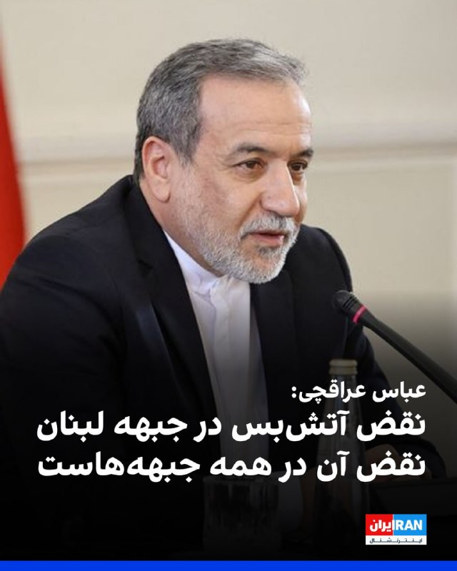

عباس عراقچی، وزیر خارجه در ایکس نوشت: «آتش‌بس میان جمهوری اسلامی و ایالات متحده، بدون هیچ ابهامی، آتش‌بسی در تمامی جبهه‌ها، از جمله لبنان محسوب می‌شود و نقض آتش‌بس در هر یک از جبهه‌ها، به منزله نقض آن در تمامی جبهه‌ها است.»

او آمریکا و اسرائیل را مسئول پیامدهای نقض آتش‌بس خواند.

پیش‌تر سخنگوی ارشد نیروهای مسلح جمهوری اسلامی، ادامه حملات اسرائیل به لبنان را «غیر قابل تحمل» خوانده بود.
iranintl.com/202606017992

## IranIntlTV — post 340029

  <a href="telegram/content/IranIntlTV_340029_1780317151.mp4" target="_blank">🎬 Download video</a>

بر اساس اطلاعات رسیده به ایران‌اینترنشنال، در جریان اعتراض‌های دی‌ماه در رشت، یک جوان ۱۹ ساله هنگام سپر شدن برای حفاظت از برادرش هدف گلوله قرار گرفت و مجروح شد. هم‌زمان روایت‌ها از کشته‌شدن امین پیرو با شلیک ماموران در زندان لاکان حکایت دارد.

فرنوش فرجی، عضو تحریریه ایران‌اینترنشنال گزارش می‌دهد
@iranintltv

## IranIntlTV — post 340028

  <a href="telegram/content/IranIntlTV_340028_1780317154.mp4" target="_blank">🎬 Download video</a>

اسماعیل بقایی، سخنگوی وزارت امور خارجه جمهوری اسلامی، از بیانیه‌های کشورهای اروپایی در محکومیت حمله سپاه پاسداران به کویت به‌شدت انتقاد کرد.

لی‌لی نیکفر، خبرنگار ایران‌اینترنشنال، گزارش می‌دهد

@iranintltv

## IranIntlTV — post 340027

  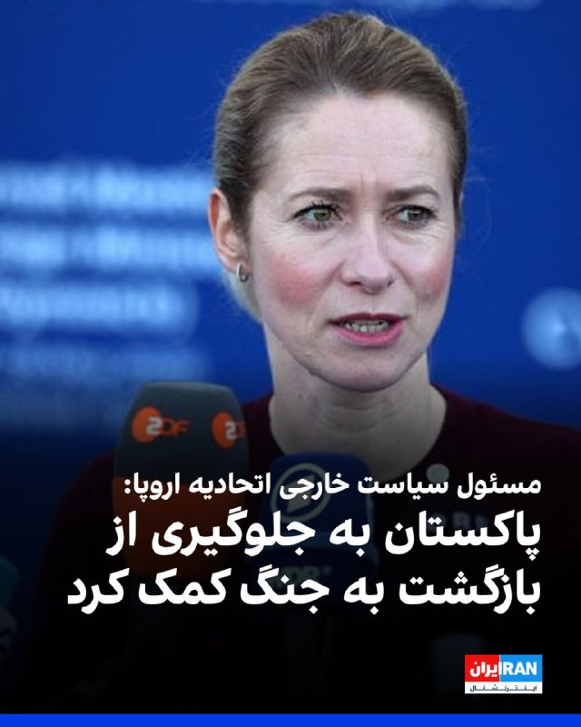

کایا کالاس، مسئول سیاست خارجی اتحادیه اروپا در نشست خبری مشترک با وزیر خارجه پاکستان در اسلام‌آباد، گفت که این اتحادیه آماده است به تلاش‌ها برای دستیابی به راه‌حلی پایدار برای درگیری آمریکا و جمهوری اسلامی کمک کند.

او افزود: «میانجی‌گری پاکستان میان آمریکا و جمهوری اسلامی به جلوگیری از بازگشت به یک جنگ تمام‌عیار کمک کرده است.»
iranintl.com/202606015317

## IranIntlTV — post 340026

  <a href="telegram/content/IranIntlTV_340026_1780317157.mp4" target="_blank">🎬 Download video</a>

امیرمهدی کشاورز، فوتبالیست ۱۷ ساله، در جریان انقلاب ملی ایرانیان علیه جمهوری اسلامی، جمعه ۱۹ دی‌ماه ۱۴۰۴، در اعتراضات زیباشهر (محمدیه) در قزوین، با شلیک دو گلوله جنگی از سوی نیروهای سرکوب، به قتل رسید.

## IranIntlTV — post 340025

  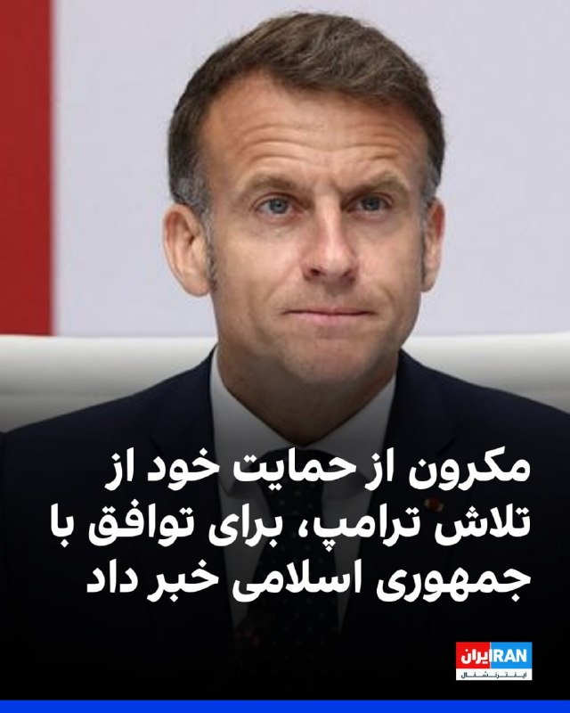

رییس‌جمهور فرانسه خبر داد که شب گذشته در تماس تلفنی با ترامپ اعلام کرده تلاش‌های او برای دستیابی سریع به توافق با جمهوری اسلامی، فرصتی منحصربه‌فرد برای ایجاد چارچوب امنیتی جدید با مشارکت همه طرف‌های ذی‌ربط و دستیابی به ثبات پایدار در منطقه فراهم می‌کند.

امانوئل مکرون در حساب ایکس خود نوشت که فرانسه آماده است توانمندی‌های خود به‌ویژه در بخش هسته‌ای را در مذاکرات گسترده‌تر با جمهوری اسلامی پس از توافق اولیه احتمالی، ارائه دهد.
iranintl.com/202606011591

## IranIntlTV — post 340024

  <a href="telegram/content/IranIntlTV_340024_1780317161.mp4" target="_blank">🎬 Download video</a>

نشست سالانه انجمن آزادی اسلو دوشنبه در پایتخت نروژ آغاز به کار کرد. برنامه‌های امسال این انجمن بر چالش‌های ناشی از حکومت‌های اقتدارگرا و نقض حقوق بشر در ایران متمرکز است.

مهران عباسیان، خبرنگار ایران‌اینترنشنال، گزارش می‌دهد

@iranintltv

## IranIntlTV — post 340023

  <a href="telegram/content/IranIntlTV_340023_1780317163.mp4" target="_blank">🎬 Download video</a>

سرخط خبرهای دوشنبه ۱۱ خرداد
@iranintltv

## IranIntlTV — post 340022

  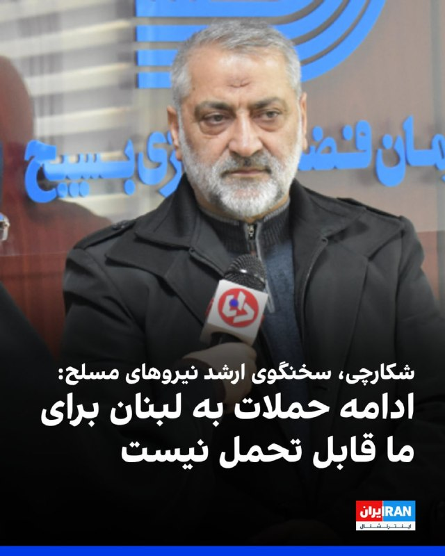

ابوالفضل شکارچی، سخنگوی ارشد نیروهای مسلح جمهوری اسلامی، با اشاره به حملات اسرائیل به لبنان، گفت که تداوم این حملات برای ما «قابل تحمل» نخواهد بود.

او اضافه کرد که این حملات در حالی ادامه دارد که «حکام کشورهای غربی، راهکار سکوت یا حمایت از این جنایات را در پیش گرفته‌اند.»
iranintl.com/202606018938

## Shin_Persian — post 6354

↩️ Quoted tweet: U.S. Central Command ✓ @CENTCOM Mon, 01 Jun 2026 12:08:07 UTC Last night at 11 p.m. ET, U.S. forces successfully intercepted two Iranian ballistic missiles targeting American forces based in Kuwait. These missiles were immediately defeated…

## Shin_Persian — post 6353

↩️ Quoted tweet:
U.S. Central Command ✓ @CENTCOM
Mon, 01 Jun 2026 12:08:07 UTC

Last night at 11 p.m. ET, U.S. forces successfully intercepted two Iranian ballistic missiles targeting American forces based in Kuwait. These missiles were immediately defeated and no American personnel were harmed.

U.S. Central Command remains vigilant and will continue to

↩️ توییت نقل‌قول شده — برای پاسخ، پست زیر را ببینید.

فارسی

دیشب در ساعت ۱۱ شب به وقت منطقه زمانی شرقی، نیروهای آمریکایی با موفقیت دو موشک بالستیک ایرانی را که نیروهای آمریکایی مستقر در کویت را هدف قرار داده بودند، رهگیری کردند. این موشک‌ها بلافاصله منهدم شدند و به هیچ‌یک از پرسنل آمریکایی آسیبی نرسید.

فرماندهی مرکزی ایالات متحده (سنتکام) هوشیار باقی مانده و به... ادامه خواهد داد.

𝕏 · @shin_persian

## Shin_Persian — post 6352

↩️ Quoted tweet: U.S. Central Command ✓ @CENTCOM Mon, 01 Jun 2026 12:07:08 UTC Last night at 11 p.m. ET, U.S. forces successfully intercepted two Iranian ballistic missile targeting American forces based in Kuwait. These missiles were immediately defeated…

## Shin_Persian — post 6351

↩️ Quoted tweet:
U.S. Central Command ✓ @CENTCOM
Mon, 01 Jun 2026 12:07:08 UTC

Last night at 11 p.m. ET, U.S. forces successfully intercepted two Iranian ballistic missile targeting American forces based in Kuwait. These missiles were immediately defeated and no American personnel were harmed.

U.S. Central Command remains vigilant and will continue to

↩️ توییت نقل‌قول شده — برای پاسخ، پست زیر را ببینید.

فارسی

دیشب در ساعت ۱۱ شب به وقت منطقه زمانی شرقی، نیروهای ایالات متحده با موفقیت دو موشک بالستیک ایرانی را که نیروهای آمریکایی مستقر در کویت را هدف قرار داده بودند، رهگیری کردند. این موشک‌ها بلافاصله منهدم شدند و به هیچ‌یک از پرسنل آمریکایی آسیبی وارد نشد.

فرماندهی مرکزی ایالات متحده (سنتکام) هوشیار باقی می‌ماند و به... ادامه خواهد داد.

𝕏 · @shin_persian

## Shin_Persian — post 6350

  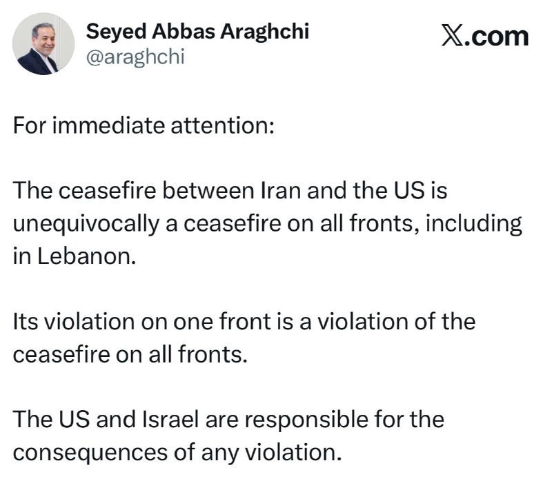

Shin ✓ @hey_itsmyturn
Mon, 01 Jun 2026 11:15:42 UTC

State-owned Mehr News

Islamic Regime FM Araghchi: ceasefire violation on one front means violation on all fronts.

Claims US-Iran ceasefire covers all fronts including Lebanon. Says US and Israel responsible for consequences of any violations.

#Iran

فارسی

خبرگزاری دولتی مهر

عراقچی، وزیر امور خارجه رژیم اسلامی: نقض آتش‌بس در یک جبهه به معنای نقض آن در تمامی جبهه‌هاست.

وی مدعی است که آتش‌بس میان ایران و آمریکا تمامی جبهه‌ها از جمله لبنان را در بر می‌گیرد و می‌گوید آمریکا و اسرائیل مسئول عواقب هرگونه نقض این آتش‌بس هستند.

#ایران

𝕏 · @shin_persian

## Shin_Persian — post 6349

  

Shin ✓ @hey_itsmyturn
Mon, 01 Jun 2026 07:56:10 UTC

Kuwait Ministry of Foreign Affairs strongly condemns repeated Iranian attacks against Kuwait.

Official statement warns of serious escalation and direct threat to national security and civilian safety. Kuwait reserves …

Source: https://x.com/i/web/status/2061356049962058127

فارسی

وزارت امور خارجه کویت حملات مکرر ایران علیه کویت را به شدت محکوم می‌کند.

بیانیه رسمی نسبت به تشدید جدی تنش‌ها و تهدید مستقیم علیه امنیت ملی و ایمنی غیرنظامیان هشدار می‌دهد. کویت حق ... را برای خود محفوظ می‌دارد.

منبع: https://x.com/i/web/status/2061356049962058127

𝕏 · @shin_persian

## ManotoTV — post 105890

  <a href="telegram/content/ManotoTV_105890_1780317168.mp4" target="_blank">🎬 Download video</a>

حمله گزارش‌شده آمریکا به اهدافی در جنوب ایران، از نظر دامنه محدود بود، اما از نظر پیام نظامی اهمیت داشت. بر اساس روایت آمریکا، این حمله پس از سرنگونی یک پهپاد آمریکایی بر فراز آب‌های بین‌المللی انجام شد و سایت‌های راداری و مراکز فرماندهی و کنترل پهپادی جمهوری اسلامی در سیریک و جزیره قشم را هدف قرار داد.

## FarsiVOA — post 219254

🔺ارتش اسرائیل از کشتن یک فرمانده حماس در غزه خبر داد

▪️ارتش اسرائیل اعلام کرد در حمله‌ای هدفمند در مرکز نوار غزه، جمال ابوعون، از اعضای شاخه نظامی حماس، کشته شده است. فردی که به گفته ارتش اسرائیل هم‌زمان به‌عنوان پزشک در بیمارستان یافا در دیرالبلح فعالیت می‌کرد.

▪️ارتش اسرائیل می‌گوید ابوعون فرمانده یک واحد در شاخه نظامی حماس بود و در طراحی و پیشبرد طرح‌هایی علیه نیروهای ارتش اسرائیل و داخل اسرائیل نقش داشت.

▪️بر اساس این اعلام، ابوعون در ماه‌های اخیر در تلاش‌های حماس برای بازسازی توان رزمی، ایجاد ظرفیت‌های جدید و تقویت دوباره این گروه، برخلاف توافق آتش‌بس، مشارکت داشته است.
در مقابل منابع فلسطینی، ابوعون را رئیس بخش بیهوشی بیمارستان یافا معرفی کرده‌اند.

⬇️ بیشتر بخوانید:
https://ir.voanews.com/a/8156054.html

## FarsiVOA — post 219253

  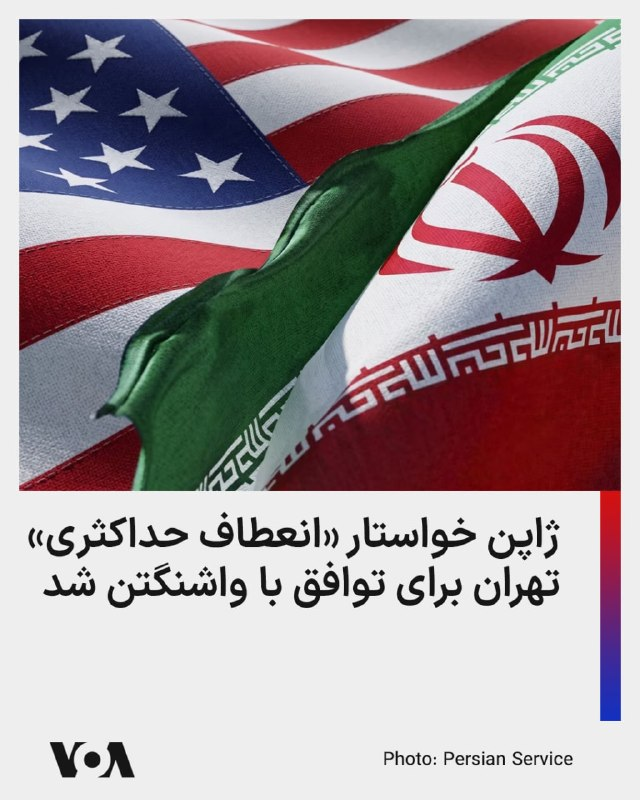

نخست‌وزیر ژاپن گفت در یک گفت‌وگوی تلفنی با رئیس دولت جمهوری اسلامی، از تهران خواست «حداکثر انعطاف‌پذیری» را از خود نشان دهد تا فرصت رسیدن به توافق آتش‌بس با آمریکا از دست نرود.

سانائه تاکایچی دوشنبه پس از تماس تلفنی با مسعود پزشکیان به خبرنگاران گفت که در این تماس، به‌طور جدی خواستار بازگشایی سریع تنگه هرمز شده است تا عبور و مرور آزاد و امن کشتی‌ها از آسیا و سایر کشورها تضمین شود.

او جزئیاتی از پاسخ پزشکیان ارائه نکرد، اما گفت دو طرف بر ادامه ارتباط نزدیک تأکید کرده‌اند.

پیشتر اسکات بسنت، وزیر خزانه‌داری ایالات متحده اعلام کرد که این کشور از وزیر دارایی ژاپن و دیگر اعضای گروه هفت خواسته تا از رژیم تحریم‌های اقتصادی علیه جمهوری اسلامی پیروی کنند.

اعضای گروه هفت کشور صنعتی جهان شامل آمریکا، کانادا، بریتانیا، فرانسه، آلمان، ایتالیا و ژاپن هستند.

نخست‌وزیر ژاپن فروردین‌ماه در واکنش به شرایط حاکم بر خاورمیانه و تنگه هرمز اعلام کرده بود که کشورش به دنبال جایگزینی نفت عبوری از تنکه هرمز است و در تهیه نفت خام از طریق مسیرهایی که از تنگه هرمز عبور نمی‌کنند، پیشرفت‌هایی حاصل شده است.
@FarsiVOA

## FarsiVOA — post 219252

  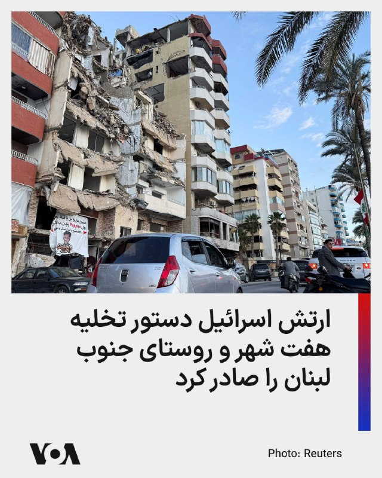

ارتش اسرائیل پیش از آغاز حملات هوایی علیه مواضع حزب‌الله، به ساکنان هفت شهر و روستا در جنوب لبنان دستور تخلیه داد.

بر اساس گزارش تایمز اسرائیل، این هشدار شامل ساکنان حومین الفوقا، بنعفول، عرب صالیم، رومین، عزه، ارکی و جباع است و از آن‌ها خواسته شده دست‌کم یک کیلومتر از محل‌های اعلام‌شده فاصله بگیرند.

آویخای ادرعی، سخنگوی ارتش اسرائیل، اعلام کرد این اقدام در پی نقض توافق آتش‌بس از سوی حزب‌الله انجام می‌شود و ارتش اسرائیل ناچار است با قدرت علیه این گروه اقدام کند.

او در هشدار خود خطاب به ساکنان جنوب لبنان تأکید کرد که ارتش اسرائیل قصد آسیب زدن به غیرنظامیان را ندارد و هدف حملات، مواضع و زیرساخت‌های حزب‌الله است.
@FarsiVOA

## FarsiVOA — post 219251

  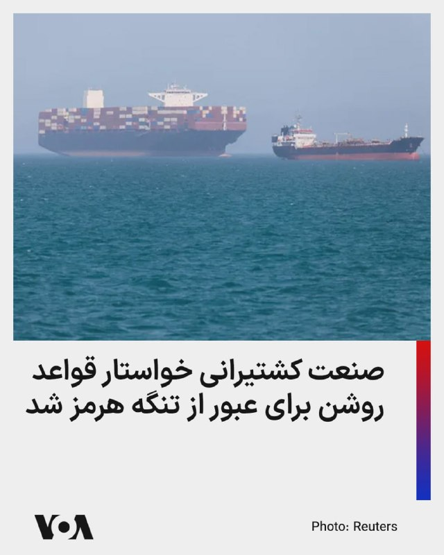

مدیران صنعت کشتیرانی در آتن می‌گویند هر توافق احتمالی میان آمریکا و جمهوری اسلامی برای کاهش تنش در خلیج فارس، باید قواعد روشن و قابل اجرا برای عبور کشتی‌ها از تنگه هرمز داشته باشد؛ در غیر این صورت، بازگشت تجارت دریایی به وضعیت عادی ممکن نخواهد بود.

به گزارش رویترز، این اظهارات در حاشیه نشست‌های آغازین پوزیدونیا، نمایشگاه دوسالانه کشتیرانی در آتن، مطرح شد.

پانکاج خانا، رئیس شرکت هایدمار مریتایم، گفت صنعت کشتیرانی به چارچوبی روشن نیاز دارد؛ مقرراتی که دقیقاً مشخص کند کشتی‌ها چگونه می‌توانند وارد خلیج فارس شوند و از آن خارج شوند. او تأکید کرد حتی اگر توافق صلح امضا شود، تا زمانی که این قواعد روشن نشود، وضعیت برای کشتی‌ها مبهم می‌ماند.

وزیر کشتیرانی یونان نیز گفت هیچ‌کس نمی‌تواند پایان درگیری را پیش‌بینی کند، زیرا بحران‌ها به‌سرعت پیچیده می‌شوند و به‌سختی باز می‌شوند.
@FarsiVOA

## FarsiVOA — post 219250

🔺مکرون از «تلاش‌های قاطعانه‌» دونالد ترامپ برای دستیابی به توافق با تهران استقبال کرد

▪️رئیس‌جمهور فرانسه از گفت‌وگوی تلفنی با دونالد ترامپ، رئیس‌جمهوری آمریکا درباره وضعیت خاورمیانه خبر داد و اعلام کرد که «از تلاش‌های قاطعانه‌ای که او برای دستیابی سریع به یک توافق میان ایالات متحده و ایران انجام می‌دهد» استقبال می‌کند.

▪️او تاکید کرد که توافق احتمالی میان تهران و واشنگتن «فرصتی منحصربه‌فرد برای ایجاد یک چارچوب امنیتی جدید با مشارکت همه طرف‌های ذی‌ربط فراهم می‌کند تا ثباتی پایدار در منطقه امکان‌پذیر شود.»

▪️پیشتر آقای ترامپ گفته بود که برخی کشورهای عضو ناتو به ویژه فرانسه و بریتانیا در زمینه حمایت از ایالات متحده در جنگ علیه جمهوری اسلامی به اندازه کافی تلاش نمی‌کنند.

⬇️ بیشتر بخوانید:
https://ir.voanews.com/a/macron-welcomes-trump-decisive-efforts-to-reach-agreement-with-tehran/8156052.html

## FarsiVOA — post 219249

  <a href="telegram/content/FarsiVOA_219249_1780317173.mp4" target="_blank">🎬 Download video</a>

عملیات تیپ گیواتی در شمال رودخانه لیتانی؛ انهدام پهپادها و راکت‌های آماده شلیک حزب‌الله؛

نیروهای تیپ گیواتی تحت فرماندهی لشکر ۳۶ ارتش اسرائیل، در جریان یک عملیات هدفمند در شمال رودخانه لیتانی برای انهدام زیرساخت‌های نظامی حزب‌الله، موفق شدند سه تن از نیروهای این گروه را که در حال آماده‌سازی برای پرتاب پهپاد به سمت مواضع ارتش بودند، از پا درآورند.

روز گذشته، نیروهای زمینی مستقر در منطقه، سه شبه‌نظامی حزب‌الله را حین تلاش برای هدایت و پرتاب پهپادهای تهاجمی به سمت نیروهای اسرائیلی شناسایی کردند. بلافاصله پهپادهای نیروی هوایی اسرائیل وارد عمل شده و این افراد را هنگام فرار، هدف حملات قرار دادند.

در ادامه این عملیات و طی جستجوهای محلی، نیروهای تیپ گیواتی یک انبار تسلیحاتی مخفی حاوی چندین فروند راکت و پهپاد انتحاری آماده پرتاب را کشف کردند.

این انبار تسلیحات متعاقباً توسط نیروهای ارتش منهدم شد که وقوع انفجارهای ثانویه شدید در محل، وجود حجم بالایی از مهمات و مواد منفجره در آن را تایید کرد.
@FarsiVOA

## FarsiVOA — post 219248

  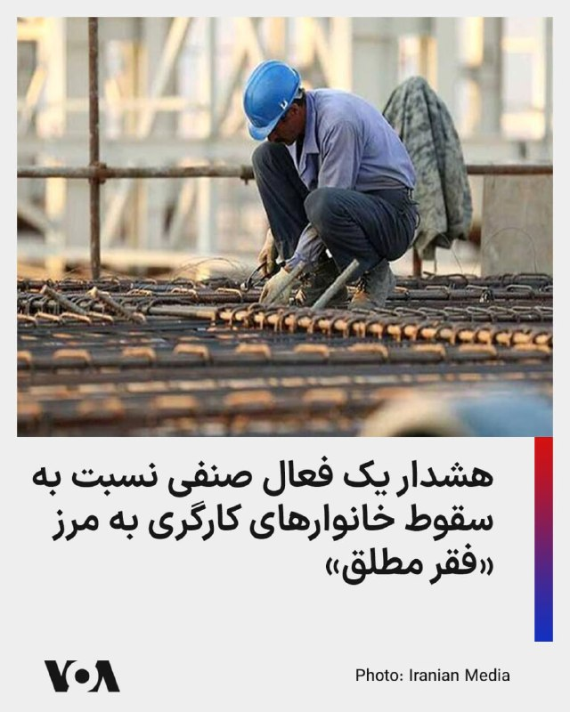

دبیر اجرایی خانه کارگر استان مازندران، نسبت به رسیدن بسیاری از خانواده‌های کارگری به مرز «فقر مطلق»، هشدار داد.

نصرالله دریابیگی طی سخنانی که خبرگزاری کارگری ایلنا منتشر کرده، شکاف عمیق میان حقوق دریافتی و هزینه‌های جاری زندگی را موجب بحرانی شدن معیشت کارگران دانست.

شورای عالی کار جمهوری اسلامی، حداقل دستمزد ماهانه کارگران را ۱۶ میلیون و ۶۰۰ هزار تومان تعیین کرده و طبق اعلام مرکز آمار، در فروردین امسال تورم نسبت به ماه مشابه سال قبل، ۷۳.۵ درصد افزایش داشته است.

این فعال کارگری معتقد است که افزایش ۶۰ درصدی هزینه‌ها در مقابل رشد ناچیز دستمزد کاگران، حقوق‌های حداقلی را بی‌معنی کرده و جامعه کارگری را به مرز فقر مطلق کشانده است.

دریابیگی همچنین نسبت به شکاف میان «زندگی لوکس ثروتمندان» و زندگی کارگران که برای تأمین نیازهای اولیه خود با مشکلات شدید مواجه هستند، انتقاد کرد.
@FarsiVOA

## FarsiVOA — post 219247

  <a href="telegram/content/FarsiVOA_219247_1780317176.mp4" target="_blank">🎬 Download video</a>

انهدام سکوی پرتاب موشک حزب‌الله دقایقی پس از حمله به طبریا؛

ارتش اسرائیل اعلام کرد تنها چند دقیقه پس از حمله موشکی شبانه حزب‌الله به شهر «طبریا»، سکوی پرتابی را که در این حمله مورد استفاده قرار گرفته بود، شناسایی و منهدم کرده است.

ارتش اسرائیل اعلام کرد که نیروهایش در مواجهه با تشدید حملات مرزی این گروه تروریستی تحت حمایت جمهوری اسلامی علیه غیرنظامیان، به واکنش‌های سریع خود در انهدام زیرساخت‌های نظامی آن ادامه می‌دهند.
@FarsiVOA

## FarsiVOA — post 219246

  

ریاست‌جمهوری مصر اعلام کرد عبدالفتاح السیسی، رئیس‌جمهور این کشور، در تماس تلفنی با امانوئل مکرون، رئیس‌جمهور فرانسه، از تلاش‌های فشرده قاهره برای کمک به دستیابی به توافقی جامع میان آمریکا و جمهوری اسلامی خبر داده است.

مصر اعلام کرده هدف از اقدامات و تلاش‌‌ها برای رسیدن به این توافق، جلوگیری از بازگشت تنش و بازگرداندن امنیت و ثبات به منطقه و کشورهای خلیج فارس است.

این موضع در شرایطی اعلام شده که جنگ آمریکا و جمهوری اسلامی، امنیت خلیج فارس، عبور و مرور در تنگه هرمز و ثبات انرژی جهانی را به یکی از محورهای اصلی رایزنی‌های منطقه‌ای و بین‌المللی تبدیل کرده است.

در همین تماس، مکرون نیز بر ضرورت باز بودن تنگه هرمز و رفع هرگونه محدودیت در عبور و مرور از این مسیر راهبردی تأکید کرد. دو طرف همچنین توافق کردند هماهنگی و رایزنی‌های فشرده میان مصر و فرانسه برای بازگرداندن ثبات منطقه‌ای ادامه یابد.
@FarsiVOA

## FarsiVOA — post 219245

🔺امیدواری نسبی مصرف‌کنندگان منطقه یورو به کنترل تورم بلندمدت

▪️نظرسنجی تازه بانک مرکزی اروپا نشان می‌دهد مصرف‌کنندگان منطقه یورو، با وجود جهش تورم و افزایش فشار قیمت انرژی، انتظارات تورمی بلندمدت خود را نزدیک به هدف نگه داشته‌اند.

▪️بر اساس گزارش رویترز، تورم منطقه یورو در آوریل تحت تأثیر افزایش قیمت نفت به ۳ درصد رسید؛ بالاتر از هدف ۲ درصدی بانک مرکزی اروپا.

▪️داده‌های روزهای اخیر در اقتصادهای بزرگ منطقه یورو از باقی ماندن تورم بالاتر از هدف بانک مرکزی حکایت دارد. در فرانسه، نرخ تورم ماه مه به ۲.۸ درصد افزایش یافت. در ایتالیا، تورم به ۳.۲ درصد رسید. در اسپانیا، نرخ تورم در سطح ۳.۲ درصد ثابت ماند، و در آلمان، تورم به ۲.۶ درصد کاهش یافت.

⬇️ بیشتر بخوانید:
https://ir.voanews.com/a/euro-zone-consumers-take-benign-view-on-inflation-surge/8156051.html

## FarsiVOA — post 219244

  

سخنگوی وزارت خارجه جمهوری اسلامی ادعا کرد که موضوع آتش‌بس در لبنان «بخش جدایی‌ناپذیر هرگونه آتش‌بس و توافق نهایی» با آمریکا برای خاتمه جنگ است.

اسماعیل بقایی دوشنبه در یک نشست خبری گفت: «تاکید داریم که آتش‌بس در لبنان بخش لاینفک هرگونه آتش‌بس و توافق نهایی برای جنگ است.»

این اظهارات همزمان با دستور نخست‌وزیر و وزیر دفاع اسرائیل برای آغاز حملات به مواضع حزب‌الله لبنان در حومه بیروت مطرح شده است. این دستور به دلیل نقض‌های مکرر آتش‌بس از سوی حزب‌الله صادر شد. همچنین اسرائیل به پیشروی نیروی زمینی خود در جنوب لبنان ادامه می‌دهد.

بقایی علاوه بر اسرائیل، ادعا کرده که آمریکا نیز به «نقض آتش‌بس» می‌پردازد؛ این در حالی است که سنتکام از «اقدامات تهاجمی» رژیم ایران خبر داده و اعلام کرده که این حملات «شامل سرنگونی یک پهپاد ام‌کیو-۱ آمریکا در حال انجام عملیات بر فراز آب‌های بین‌المللی بود.»
@FarsiVOA

## FarsiVOA — post 219243

  

دادگستری استان سمنان دارایی‌های ۱۸ نفر از شهروندان را به اتهام همکاری با آنچه «سرویس‌های جاسوسی آمریکا و اسرائیل» خوانده، توقیف کرد. رئیس کل دادگستری استان سمنان گفت: با اجرای این احکام، شمار افرادی که دارایی‌هایشان در این استان توقیف شده به ۴۰ نفر رسیده است.

به گفته محمدصادق اکبری، برای شماری از افراد در داخل و خارج از ایران پرونده قضایی تشکیل شده و آنها به همکاری با اسرائیل و نهادهای اطلاعاتی خارجی متهم شده‌اند. مقام‌های قضایی مدعی هستند که این افراد با اقدام‌ها یا حمایت‌های خود در جهت تقویت یا مشروعیت‌بخشی به اسرائیل علیه امنیت و منافع ملی ایران فعالیت کرده‌اند.

در این گزارش جزئیاتی درباره هویت افراد، ارزش دارایی‌های توقیف‌شده یا اسناد و مدارک مربوط به این اتهامات منتشر نشده است.

این اقدام در حالی صورت می‌گیرد که رسانه‌های حکومتی پیش‌تر از توقیف اموال ده‌ها ایرانی خارج از کشور در استان‌های گلستان و خراسان جنوبی خبر داده بودند. مقام‌های قضایی این افراد را به همکاری با نهادهای خارجی متهم کرده‌اند، اما جزئیات پرونده‌ها، مستندات اتهام‌ها و امکان دفاع متهمان به‌طور مستقل قابل راستی‌آزمایی نیست.
@FarsiVOA

## FarsiVOA — post 219242

  

اسرائیل تایمز در گزارشی به نقل از دو دیپلمات اعلام کرد که مذاکره‌‌کنندگان پرونده غزه قرار است روز پنج‌شنبه ۱۴ خرداد، به میزبانی کشور مصر، گفت‌وگوهای مربوط به خلع سلاح حماس را از سر بگیرند.

این دو دیپلمات عرب گفته‌اند که «هیئت صلح» تحت هدایت آمریکا، هنوز به طور کامل امید خود را به امکان پیشرفت مذاکرات از دست نداده و این در حالی است که حماس از پذیرش پیشنهاد «هیئت صلح» برای خلع سلاح خودداری می‌کند.

حماس ادعا می‌کند تا زمانی که رهبر جدید انتخاب نشود، نمی‌توان هیچ تصمیم نهایی درباره خلع سلاح اتخاذ کند. ایالات متحده، اتحادیه اروپا، اسرائیل و برخی از کشورها از جمله مصر، حماس و یا دست‌کم شاخه نظامی این گروه را در فهرست گروه‌های تروریستی قرار داده‌اند.

دیپلمات‌های عرب به اسرائيل تایمز گفته‌اند که اگر طرح رئیس‌جمهور آمریکا، جهت پایان دادن به جنگ غزه به نتیجه نرسد،‌ احتمال بررسی طرح‌های جایگزین وجود دارد.

یکی از گزینه‌های جایگزین، اجازه به دولت بنیامین نتانیاهو برای بازسازی برخی از مناطق غزه که تحت کنترل اسرائیل قرار دارد، است که پیش‌تر از سوی دونالد ترامپ به دلیل احتمال مخالفت منطقه کنار گذاشته شده بود.
@FarsiVOA

## FarsiVOA — post 219241

  

جمهوری اسلامی با اعتراض به انتقادهای اتحادیه اروپا از حملاتش در منطقه، این حملات را در چارچوب «حق دفاع مشروع» توصیف کرد.

اتحادیه‌ ارو‍پا طی روزهای اخیر با صدور بیانیه‌های جداگانه، تداوم حملات جمهوری اسلامی به کشورهای همسایه را محکوم کرده بود.

در یک بیانیه در محکومیت حملات جمهوری اسلامی به خاک کویت، اتحادیه اروپا چنین حملاتی «تهدیدی جدی برای امنیت و ثبات منطقه‌ای» خوانده است. این اتحادیه از جمهوری اسلامی خواسته است تا قطعنامه ۲۸۱۷ شورای امنیت سازمان ملل مبنی بر توقف حملات به کشورهای خلیج فارس را به طور کامل اجرا کند.

اتحادیه اروپا همچنین هفتم خرداد نیز در بیانیه پایانی بیست‌وپنجمین نشست سالانه خود به موضوع ایران اشاره و یادآور شد که به شدت «حملات غیرقابل توجیه و بی رویه موشک‌های بالستیک و پهپاد ایران» علیه کشورهای منطقه را محکوم می‌کند.

اسماعیل بقایی، سخنگوی وزارت خارجه جمهوری اسلامی اما به بیانیه‌‌ها اتحادیه اروپا واکنش نشان داده و مدعی شد که «هدف قرار دادن مبادی و امکاناتی که برای تجاوز نظامی» مورد استفاده قرار می‌گیرد، در چارچوب «حق دفاع مشروع» است.
@FarsiVOA

## FarsiVOA — post 219240

  

وزارت خارجه کویت با انتشار بیانیه‌ای، «حملات نادرست و مکرر» جمهوری اسلامی به خاک خود را شدیداً محکوم و نسبت به آن ابراز انزجار کرد.

در این بیانیه که دوشنبه منتشر شد، آمده است که این حملات «تشدید تنشی خطرناک، تعرضی مستقیم به امنیت دولت کویت و ثبات آن، نقض آشکار قواعد حقوق بین‌الملل، منشور سازمان ملل متحد و قطعنامه شماره ۲۸۱۷ شورای امنیت برای سال ۲۰۲۶، و تهدیدی جدی برای سلامت غیرنظامیان و تأسیسات حیاتی کشور» محسوب می‌شود.

این وزارتخانه تأکید کرد که ادامه و تکرار این حملات، تلاش‌های صورت‌گرفته برای کاهش تنش را تضعیف کرده و امنیت و ثبات منطقه را به خطر می‌اندازد.

همچنین کویت ضمن مسئول دانستن جمهوری اسلامی در این «حملات تجاوزکارانه»، افزود که «حق کامل خود را برای اتخاذ هر اقدام لازم جهت حفظ امنیت و دفاع از سرزمین خود محفوظ می‌دارد.»
@FarsiVOA

## FarsiVOA — post 219239

  

روسیه صادرات سوخت جت را تا ۳۰ نوامبر ممنوع کرد؛ تصمیمی که هم‌زمان با افزایش حملات اوکراین به پالایشگاه‌ها و فشار بر زیرساخت انرژی این کشور گرفته شده است.

دولت روسیه هدف از این محدودیت را حفظ ثبات بازار داخلی و تأمین نیاز مصرف‌کنندگان اعلام کرده است.

اهمیت این تصمیم بیش از آنکه به سهم روسیه در بازار جهانی سوخت جت مربوط باشد، به نشانه‌ای از فشار داخلی بر تولید سوخت در روسیه بازمی‌گردد.

طبق داده‌های جمع‌آوری‌شده بلومبرگ از شرکت تحلیلی ورتکسا، روسیه در سال گذشته به‌طور متوسط روزانه حدود ۳۰ هزار بشکه سوخت جت صادر کرده است. این رقم کمتر از دو درصد عرضه جهانی است.

میانگین صادرات روزانه این کشور در چهار ماه نخست سال ۲۰۲۶ نیز به ۲۸ هزار بشکه کاهش یافته و ترکیه خریدار اصلی آن بوده است.

پیش از این نیز وزارت انرژی روسیه از اول آوریل ممنوعیت صادرات بنزین را دوباره اعمال کرده بود تا سوخت بیشتری در بازار داخلی باقی بماند.
@FarsiVOA

## FarsiVOA — post 219238

🔺دولت مبلغ کالابرگ را افزایش نداد

▪️در حالی که طی هفته‌های گذشته بارها از بررسی افزایش اعتبار کالابرگ، پیشنهاد رشد ۳۰ تا ۱۰۰ درصدی آن و ضرورت جبران فشار گرانی بر سفره مردم سخن گفته شده بود، وزیر تعاون، کار و رفاه اجتماعی، اعلام کرد کالابرگ خردادماه «به روال ماه‌های قبل» پرداخت می‌شود.

▪️این اظهارنظر به معنای آن است که دولت، دست‌کم در خرداد، مبلغ کالابرگ را افزایش نداده است؛ آن هم در شرایطی که انتظار عمومی پس از چندین وعده و اظهارنظر رسمی، به سمت افزایش اعتبار این طرح رفته بود.

▪️کالابرگ قرار بود بخشی از فشار تورم بر معیشت خانوار را جبران کند، اما با ثابت ماندن مبلغ آن و رشد قیمت کالاهای اساسی، ارزش واقعی این حمایت کاهش یافته است.

⬇️ بیشتر بخوانید:
https://ir.voanews.com/a/8156050.html

## FarsiVOA — post 219237

🔺دانشگاه زیر فشار امنیتی؛ شرق از موج تازه اخراج، تعلیق و پرونده‌سازی برای صدها دانشجو خبر داد

▪️روزنامه شرق در گزارشی از موج تازه احضار، تشکیل پرونده، تعلیق و صدور احکام انضباطی برای دانشجویان چند دانشگاه بزرگ ایران خبر داده است.

▪️بر اساس این گزارش، چهار روز پس از بازگشایی دانشگاه‌ها در اسفند ۱۴۰۴، پس از دو ماه تعطیلی، دانشجویان با تماس‌ها و پیامک‌هایی درباره تشکیل پرونده انضباطی روبه‌رو شدند.

▪️اکنون در خرداد ۱۴۰۵ و در حالی که تعطیلی دانشگاه‌ها به دلیل جنگ به سه ماه نزدیک شده، دانشگاه‌ها پیگیری همان پرونده‌ها و تشکیل پرونده‌های تازه را آغاز کرده‌اند.

▪️در دانشگاه صنعتی شریف، حدود ۲۵ تا ۳۰ پرونده مشخص وجود دارد و با احتساب موارد علنی‌نشده، شمار پرونده‌ها می‌تواند به ۳۰ تا ۴۰ مورد برسد.

⬇️ بیشتر بخوانید:
https://ir.voanews.com/a/a-new-wave-of-expulsions-suspensions-and-filing-of-cases-against-hundreds-of-students/8156048.html

## FarsiVOA — post 219236

  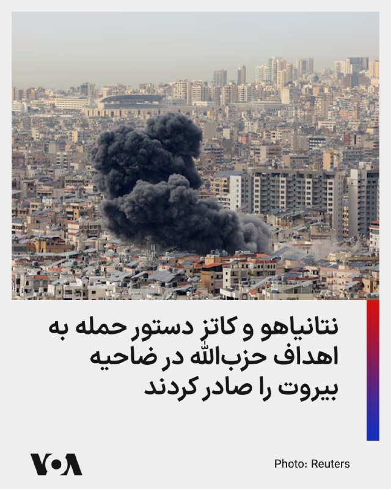

در پی نقض‌های مکرر آتش‌بس در لبنان از سوی حزب‌الله و حملات این گروه به شهرها و شهروندان اسرائیل، بنیامین نتانیاهو، نخست‌وزیر اسرائیل، و اسرائیل کاتز، وزیر دفاع، دستور دادند ارتش اسرائیل اهداف وابسته به حزب‌الله در منطقه ضاحیه بیروت را هدف قرار دهد.

در بیانیه مشترک نتانیاهو و کاتز آمده است که این تصمیم در پاسخ به حملات اخیر حزب‌الله و ادامه تهدید علیه شهروندان اسرائیل گرفته شده است.

ضاحیه بیروت از مهم‌ترین پایگاه‌های حزب‌الله در پایتخت لبنان به شمار می‌رود و در ماه‌های گذشته نیز بارها هدف حملات ارتش اسرائیل قرار گرفته است.

⬇️ بیشتر بخوانید:
https://ir.voanews.com/a/netanyahu-and-katz-order-attack-on-hezbollah-positions-in-beirut/8156049.html

## FarsiVOA — post 219235

  <a href="telegram/content/FarsiVOA_219235_1780317185.mp4" target="_blank">🎬 Download video</a>

تصاویر منتسب به شلیک موشک از امیدیه در خوزستان؛

تصاویر ارسالی به کانال تلگرامی «وحید آنلاین» شلیک موشک از امیدیه در خوزستان را حوالی ۶:۳۰ صبح دوشنبه ۱۱ خرداد نشان می‌دهد.

هم‌زمان سپاه پاسداران از حمله به یک پایگاه هوایی در منطقه خبر داد و ادعا کرد که این پایگاه مبدأ حمله به یک دکل مخابراتی در سیریک واقع در استان هرمزگان بوده است. روابط عمومی سپاه پاسداران دوشنبه از اعلام جزئیات بیشتر خودداری کرد و مشخص نکرد که این پایگاه در کدام کشور قرار داشت.

در این زمینه خبرگزاری رسمی کویت گزارش داد که پدافند هوایی این کشور، جایی که یک پایگاه آمریکا در آن قرار دارد، روز دوشنبه در حال رهگیری حملات موشکی و پهپادی بوده است. آژیرهای هشدار نیز در سراسر کویت به صدا درآمده‌اند، اما جزئیات بیشتری ارائه نشده است.
@FarsiVOA

## DW_Farsi — post 125383

  

🔶 وزیر دفاع اسرائیل: تا حملات حزب‌الله متوقف نشود، در بیروت آرامشی نخواهد بود
 
وزیر دفاع اسرائیل روز دوشنبه گفت اگر حملات حزب‌الله ادامه یابد، "در بیروت نیز آرامشی وجود نخواهد داشت". او تأکید کرد که اسرائیل قصد دارد منطقه‌ای تحت کنترل نظامی خود در محدوده رود لیتانی در جنوب لبنان ایجاد کند.
 
 در بیانیه‌ای که از سوی یسرائیل کاتس منتشر شد، آمده است: «ضاحیه در بیروت هیچ تفاوتی با شهرک‌های شمال اسرائیل ندارد؛ اگر در شمال آرامش نباشد، در بیروت نیز آرامش نخواهد بود.»
 
"ضاحیه" در حومه جنوبی بیروت و یکی از پایگاه‌های اصلی حزب‌الله است؛ منطقه‌ای که وزیر دفاع اسرائیل پیش‌تر در همان روز دستور حمله به آن را صادر کرده بود.
 
بیانیه کاتس می‌افزاید: «در عین حال، ارتش اسرائیل به عملیات آتشباری و مانورهای نظامی علیه نیروها و زیرساخت‌های حزب‌الله در لبنان ادامه می‌دهد تا تهدیدها را از نیروهای ارتش اسرائیل و ساکنان اسرائیل دور کند و منطقه لیتانی را به منطقه‌ای تحت کنترل امنیتی ارتش اسرائیل، عاری از سلاح و نیروهای تروریستی، تبدیل کند.»
 
اسرائیل و حزب‌الله به‌طور مکرر یکدیگر را به نقض مفاد آتش‌بس متهم می‌کنند.
@dw_farsi

## DW_Farsi — post 125382

  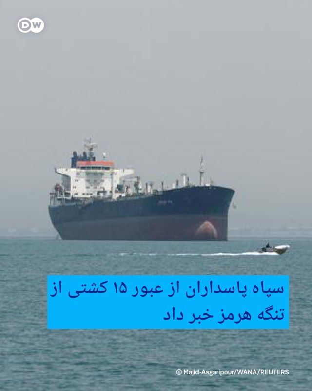

🔶 سپاه پاسداران از عبور ۱۵ کشتی از تنگه هرمز خبر داد
 
روابط عمومی نیروی دریایی سپاه روز دوشنبه با انتشار اطلاعیه‌ای اعلام کرد در ۲۴ ساعت گذشته ۱۵ فروند کشتی، از جمله ۴ نفتکش، از تنگه هرمزعبور کرده‌اند. طبق این اطلاعیه، عبور این کشتی‌ها "پس از کسب مجوز با هماهنگی و تأمین امنیت نیروی دریایی سپاه" صورت گرفته است.
 
خبرگزاری بلومبرگ اخیرا در گزارشی با استناد به داده‌های کشتیرانی نوشته بود از میان ۱۰۹ کشتی بزرگ با ظرفیت حمل ۷۰۰ هزار بشکه یا بیشتر که پس از آغاز جنگ آمریکا و اسرائیل با ایران و بسته شدن تنگه هرمز، گرفتار شده بودند تا کنون ۲۹ کشتی موفق به گذر از این آبراه شده‌اند.
 
مدیرعامل شرکت "شورون" روز جمعه به تلویزیون بلومبرگ گفته بود که برخی از کشتی‌هایی که از تنگه عبور می‌کنند، اخیراً هدف حمله قرار گرفته‌اند. طبق این گزارش چند تن از فعالان بازار کشتیرانی اظهار داشته‌اند که برخی از کشتی‌هایی که از این مسیر عبور کرده‌اند متعلق به شرکت‌هایی هستند که از زمان آغاز جنگ تاکنون از تنگه عبور نکرده بودند.
@dw_farsi

## DW_Farsi — post 125381

  

🔶 توقیف اموال ۱۸ تن در استان سمنان به اتهام "همکاری با دشمن"
 
رییس کل دادگستری استان سمنان از توقیف دارایی‌‌های ۱۸ شهروند به اتهام "همکاری با دشمن" خبر داد.
 
رسانه‌های داخلی روز دوشنبه ۱۱ خرداد به نقل از محمدصادق اکبری گزارش دادند تا کنون دارایی‌های منقول و غیرمنقول و همچنین حساب‌های بانکی ۴۰ نفر در این استان به اتهام "همکاری با سرویس‌های جاسوسی آمریکا و اسرائیل" توقیف شده است.
 
پس از آغاز جنگ آمریکا و اسرائیل با ایران در روز نهم اسفند سال گذشته، قوه قضائیه جمهوری اسلامی اموال صدها شهروند ایرانی را توقیف کرده است.
 
برخی از حقوقدانان مستقل بر این باورند که هرچند قوانین ایران در بعضی جرائم امنیتی یا موارد مربوط به اموال حاصل از ارتکاب جرم، امکان توقیف یا مصادره دارایی‌ها را پیش‌بینی کرده‌، اما ضبط تمامی اموال افراد صرفاً بر پایه اتهام "همکاری با دشمن" با چالش‌های حقوقی جدی مواجه است.
 
وکلای دادگستری تاکید دارند که این احکام غالباً بدون طی کردن روند قانونی دادرسی عادلانه، حق دفاع متهم، و اطلاع‌رسانی قبلی صادر و اجرا می‌شوند.
@dw_farsi

## DW_Farsi — post 125371

📸 صدمین زادروز مریلین مونرو؛ افسانه‌ای که هنوز زنده است

صد سال پیش مریلین مونرو، ستاره هالیوود و یکی از شناخته‌شده‌ترین نمادهای فرهنگ عامه در قرن بیستم، چشم به جهان گشود. او اول ژوئن ۱۹۲۶ در لس آنجلس به دنیا آمد و نورما جین مورتنسون نام گرفت.

بیش از شش دهه از مرگ مریلین مونرو می‌گذرد، اما او همچنان به‌عنوان "سمبل جذابیت جنسی" در فرهنگ عامه شناخته می‌شود و زندگی پر فراز و نشیبش همچنان توجه مخاطبان را به خود جلب می‌کند.

انستیتوی فیلم آمریکا، مریلین مونرو را در رتبه ششم فهرست بزرگ‌ترین بازیگران زن دوران طلایی هالیوود قرار داده است.

درخشش او از دهه‌های ۱۹۵۰ و ۱۹۶۰ آغاز شد. ایفای نقش شخصیت "بلوند اغواگر سربه‌هوا" در چندین فیلم معروف به شهرتش کمک کرد، اما استعداد بازیگری‌اش فراتر از این کلیشه بود. فیلم‌های او تا زمان مرگش بیش از ۲۰۰ میلیون دلار در گیشه فروش داشتند.
 
@dw_farsi

## DW_Farsi — post 125370

  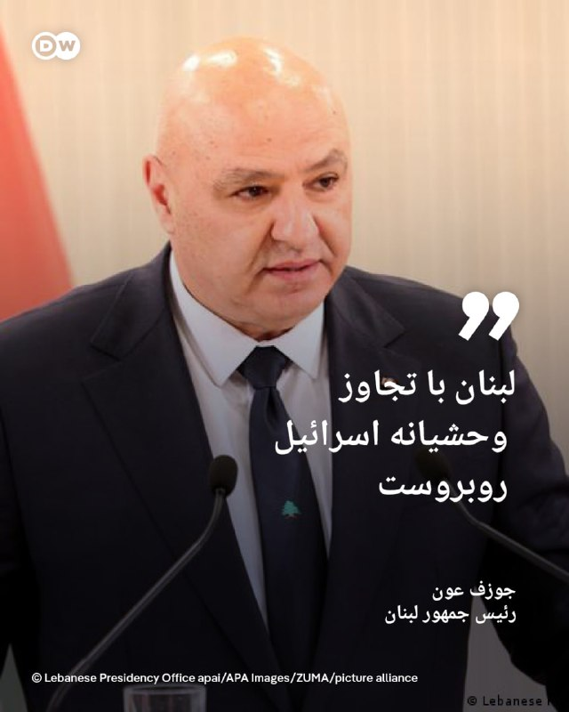

🔶 جوزف عون: لبنان با تجاوز وحشیانه اسرائیل روبروست
 
همزمان با تشدید حملات اسرائیل علیه حزب‌الله و تصرف قلعه تاریخی و راهبری "بوفور" در جنوب لبنان، جوزف عون اعلام کرد کشورش با "تجاوز وحشیانه و سزاوار سرزنش" از سوی اسرائیل روبروست. رئیس جمهور لبنان با انتشار پیامی در شبکه ایکس این حمله را محکوم کرد.
 
شورای امنیت سازمان ملل متحد قرار است روز دوشنبه، اول ژوئن (۱۱ خرداد) نشستی اضطراری درباره لبنان برگزار کند. این امر در حالی است که بنیامین نتانیاهو و یسرائیل کاتس، نخست‌وزیر و وزیر دفاع اسرائیل، از آغاز مجدد حملات به منطقه ضاحیه بیروت خبر داده‌اند.
 
نتانیاهو روز یکشنبه تصرف قلعه بوفور را نشانه "تغییری چشمگیر" در روند درگیری‌ها در لبنان خوانده بود.
 
گروه شبه‌نظامی حزب‌الله که از سوی جمهوری اسلامی حمایت می‌شود، روزانه شمال اسرائیل و نیروهای اسرائیلی مستقر در جنوب لبنان را هدف حملات خود قرار می‌دهد. هم‌زمان ارتش اسرائیل نیز به حملات علیه این گروه در جنوب لبنان ادامه می‌دهد.
 
آتش‌بسی که اواسط ماه آوریل میان لبنان و اسرائیل برقرار شد، اکنون تا حد زیادی از هم فروپاشیده است.
 
@dw_farsi

## DW_Farsi — post 125369

🔶 بقایی: هیچ مذاکره‌ای درباره پرونده هسته‌ای صورت نگرفته است
 
اسماعیل بقائی، سخنگوی وزارت خارجه ایران، روز دوشنبه ۱۱ خرداد در نشست خبری هفتگی خود گفت مذاکرات تهران با واشنگتن "در عین سوءظن شدید" ادامه دارد و انجام مذاکره "به معنای وجود اعتماد بین طرفین نیست".
 
او در پاسخ به پرسشی در مورد آخرین وضعیت مذاکرات اظهار داشت: «ما از ابتدا می‌دانستیم و می‌دانیم که در شرایط عدم اعتماد مذاکره می‌کنیم و این یک مفروض است. فراتر از آن مذاکره در دل سوءظن شدید و بدگمانی آغاز شد و تبادل پیام‌ها نیز در همین قالب و در همین فضا در حال انجام است.»
 
او افزود: «در چنین وضعیتی و در شرایطی که طرف مقابل مدام دیدگاه‌های خود را تغییر می‌دهد، مطالبات جدید یا متناقضی مطرح می‌کند و پیام‌های رسانه‌ای متفاوت، متناقض ارسال می‌کند، طبیعی است که این وضعیت موجب طولانی شدن روند مذاکره شود.»
 
بقائی در ادامه اسرائیل را نیز به "ممانعت از شکل‌گیری هرگونه روندی برای کاهش تنش" در منطقه متهم کرده و حملات این کشور به لبنان را "تخریب نتیجه‌بخشی دیپلماسی" خواند.
 
سخنگوی وزارت خارجه ایران همچنین بار دیگر تأکید کرد در مذاکرات با آمریکا در حال حاضر تمرکز بر "خاتمه جنگ" است و در مورد جزئیات مباحث مرتبط با پرونده هسته‌ای جمهوری اسلامی، "هیچ مذاکره‌ای در این مرحله صورت نگرفته است".
 
این اظهارات در حالی بیان شده است که دونالد ترامپ، رئیس جمهور آمریکا، روز دوشنبه در پیامی نوشت که "بخش عمده" توافق با ایران درباره فعالیت‌های هسته‌ای است و به روشنی تصریح شده است که "ایران نباید به سلاح هسته‌ای دست پیدا کند".
 
بقائی همچنین اعلام کرد که موضوع پرداخت غرامت برای جبران و بازسازی خسارات ناشی از جنگ در جریان مذاکره با آمریکا مطرح شده، اما جزئیات بیشتری در این باره از جمله در مورد مبلغ آن ارائه نکرد.
 
او در ادامه با انتقاد مجدد از برخی کشورهای همسایه به دلیل در اختیار گذاشتن خاک خود برای حمله به ایران، این اقدام را "غیرقانونی و خلاف اصل حسن همجواری" توصیف کرده و نسبت به "پیامدهای ناگوار" آن هشدار داد.
 
سخنگوی وزارت خارجه در ادامه از حملات سپاه پاسداران به کویت دفاع کرده و گفت: «خودداری از اجازه دادن به طرف‌های متجاوز برای استفاده از قلمرو یک کشور جهت انجام اقدامات ایذایی علیه کشور دیگر، یک اصل پذیرفته‌شده و ثابت در حقوق بین‌الملل است. لذا نقض این تعهد از سوی دولت‌های منطقه، آن‌ها را در کنار طرف‌های متجاوز قرار خواهد داد.»
 
ارتش کویت روز دوشنبه از رهگیری چندین پهپاد و موشک خبر داد، اما اشاره‌ای به مبدأ این حمله یا اهداف آن نکرد.
 
بقائی همچنین بیانیه اتحادیه اروپا در محکومیت حملات ایران به کویت را "مصداق واقعی ریاکاری" خوانده و اظهار داشت: «اتحادیه اروپا باید از رویکرد مبتنی بر خشنودسازی متجاوزان و سرزنش کردن طرف‌هایی که از خود دفاع می‌کنند دست بردارد.»
 
اتحادیه اروپا پیش‌تر در بیانیه‌ای حملات ایران را "تهدیدی جدی برای امنیت و ثبات منطقه" خوانده بود.
@dw_farsi

## DW_Farsi — post 125368

🔶 حملات روسیه به خارکیف و خرسون چندین زخمی بر جا گذاشت

در پی حملات تازه روسیه به اوکراین، بار دیگر چندین نفر زخمی شدند. اولگ سینیهوبوف، فرماندار منطقه خارکیف، اعلام کرد که در شهر مرزی خارکیف واقع در شمال شرق اوکراین، دو ساختمان مسکونی نیز هدف قرار گرفته‌اند.
 
این مقام اوکراینی در پیام‌رسان تلگرام نوشت در خارکیف دو نفر زخمی شده‌اند و یک زن دیگر نیز در شهر بوهودوخیف آسیب دیده است.
 
در شهر خرسون واقع در جنوب اوکراین نیز سه نفر در جریان حملات شبانه زخمی شدند. ارتش روسیه این شهر را با توپخانه هدف قرار داد.
 
طبق اعلام مقام‌های شهری خرسون، یک گلوله توپ حدود ساعت ۱:۳۰ بامداد دوشنبه اول ژوئن (۱۱ خرداد) به وقت محلی به یک ساختمان مسکونی در این شهر اصابت کرد.
 
بر اساس اعلام مقام‌های اوکراینی، چهار نفر دیگر نیز در مناطق مختلف استان خرسون زخمی شده‌اند. با این حال، مشخص نشده است که این افراد در جریان حملات شبانه زخمی شده‌اند یا در طول روز پیش از آن.
 
ولودیمیر زلنسکی، رئیس جمهور اوکراین، در یک مصاحبه تلویزیونی با سی‌بی‌اس که روز یکشنبه از این شبکه آمریکایی پخش شد، خواستار برگزاری گفت‌وگوهای صلح با روسیه پیش از آغاز زمستان شد.
 
زلنسکی در این مصاحبه ضمن تلاش برای جلب حمایت افکار عمومی ایالات متحده، گفت موقعیت راهبردی اوکراین بهبود یافته است.
 
@dw_farsi

## DW_Farsi — post 125367

  

🔶 نتانیاهو دستور حمله ارتش اسرائیل به ضاحیه بیروت را صادر کرد
 
نخست‌وزیر اسرائیل روز دوشنبه اول ژوئن به ارتش این کشور دستور داد تا مواضعی را در حومه جنوبی بیروت، منطقه‌ای معروف به ضاحیه که به عنوان پایگاه حزب‌الله به شمار می‌رود، هدف قرار دهد.
 
در بیانیه‌ای که دفتر بنیامین نتانیاهو منتشر کرده، آمده است در پی "نقض مکرر آتش‌بس" توسط حزب‌الله و ادامه حملات این گروه به شهرها و شهروندان اسرائیلی، نخست‌وزیر و وزیر دفاع اسرائیل به ارتش این کشور دستور دادند تا "اهداف تروریستی" را در منطقه ضاحیه بیروت هدف حمله قرار دهند.
 
اسرائیل در طول دوره آتش‌بس به درخواست دولت آمریکا عمدتا از حمله به بیروت خودداری کرده بود.
 
ارتش اسرائیل و نیروهای حزب‌الله از زمان برقراری آتش‌بس در لبنان که اواسط ماه آوریل رخ داد، همچنان به تبادل آتش ادامه‌ داده‌اند.
 
در همین حال ده‌ها هزار نفر از ساکنان شمال اسرائیل به دلیل حملات موشکی و پهپادی حزب‌الله مجبور به ترک خانه‌های خود شده‌اند.
 
مقامات لبنان می‌گویند حملات اخیر اسرائیل به این کشور موجب کشته‌شدن بیش از سه هزار شهروند لبنانی و آواره شدن چند صد هزار تن شده است.
@dw_farsi

## DW_Farsi — post 125366

  

🔶 پرتاب پنج موشک از لبنان به سمت اسرائیل
 
ارتش اسرائیل از رهگیری دو موشک پرتاب‌شده از لبنان به سمت کریات شمونا، شهری در شمال این کشور در دوشنبه ۱۱ خرداد (اول ژوئن) خبر داد و اعلام کرد نتیجه رهگیری موشک سوم در دست بررسی است. به گفته ارتش دو موشک دیگر نیز به سمت شهر طبریه شلیک شد که یکی از آنها در منطقه‌ای باز فرود آمد و موشک دوم داخل خاک لبنان و نزدیک محل استقرار نیروهای اسرائیلی سقوط کرده است.
 
ارتش اسرائیل همچنین اعلام کرد که حمله پهپادی حزب‌الله در جنوب لبنان منجر به کشته شدن یک سرباز اسرائیلی و زخمی شدن سه سرباز دیگر شد.
 
به گزارش تایمز اسرائیل پهپاد انتحاری دید اول شخص (FPV) حزب‌الله حدود ساعت یک بامداد دوشنبه به هدفی در منطقه مسکونی یحمر در شهرستان نبطیه، نزدیک قلعه بوفور جایی که نیروهای اسرائیل مشغول انجام عملیات بودند، اصابت کرد.
 
ارتش اسرائیل یکشنبه اعلام کرد قلعه تاریخی و راهبردی بوفور (شقیف) را که در جنوب لبنان واقع شده، تصرف کرده است. آویخای ادرعی، سخنگوی عرب‌زبان ارتش اسرائیل، نیز در شبکه ایکس عکس‌هایی را منتشر کرده که نیروهای اسرائیلی را در حال حرکت در مقابل این قلعه نشان می‌‌داد.
@dw_farsi

## DW_Farsi — post 125365

🔶 انتخابات ریاست جمهوری کلمبیا؛ مصاف چپ و راست به دور دوم کشید
 
انتخابات ریاست جمهوری کلمبیا به دور دوم، میان آبلاردو د لا اسپریا، حقوقدان راست‌گرا، و ایوان سپدا، سناتور چپ‌گرا، کشیده شد.
 
بر اساس اعلام کمیسیون انتخابات، پس از شمارش حدود ۹۹.۵ درصد آرا، د لا اسپریا ۴۳.۷ درصد و سپدا نزدیک به ۴۱ درصد آرا را به دست آورده‌اند.
 
از آنجا که هیچ‌یک از نامزدها موفق به کسب اکثریت مطلق نشده‌اند، سرنوشت ریاست جمهوری در دور دوم انتخابات در روز ۲۱ ژوئن تعیین خواهد شد.
 
حدود ۴۱ میلیون شهروند کلمبیا برای انتخاب جانشین گوستاوو پترو، رئیس جمهور چپ‌گرای این کشور، به پای صندوق‌های رأی فراخوانده شده بودند. پترو بر اساس قانون اساسی اجازه نامزدی مجدد نداشت.
 
این انتخابات همچنین به عنوان رأی‌گیری درباره ادامه یا توقف سیاست‌های پترو، از جمله افزایش هزینه‌های اجتماعی و مذاکره با گروه‌های مسلح، یا حرکت به سوی رویکردی محافظه‌کارانه‌تر تلقی می‌شد.
 
پالوما والنسیا، سناتور محافظه‌کار که پیش از انتخابات نیز از بخت‌های اصلی پیروزی به شمار می‌رفت، با نزدیک به هفت درصد آرا، فاصله زیادی با دو نامزد پیشتاز داشت.
@dw_farsi

## DW_Farsi — post 125364

  

🔶 انتقاد ترامپ از فشارهای داخلی درباره توافق با ایران
 
دونالد ترامپ، رئیس جمهور آمریکا، با انتشار پیامی در شبکه تروث سوشال از دموکرات‌ها و برخی جمهوری‌خواهان به دلیل اظهاراتشان درباره رویکرد دولت او با جمهوری اسلامی بر سر توافق انتقاد کرد.
 
او نوشت: «ایران واقعا می‌خواهد به یک توافق برسد و این توافق برای ایالات متحده آمریکا و متحدان‌مان توافق خوبی خواهد بود.»
 
ترامپ سپس با تغییر عمدی کلمه "دموکرات‌ها" (Democrat) به صورت "داموکرات‌ها" (Dumocrats) در لحنی طعنه‌آمیز آن‌ها را "نادان" خوانده و به آنها و برخی "جمهوری‌خواهان که ظاهرا میهن‌پرست نیستند" تاخته و نوشت: «آیا [آنها] درک نمی‌کنند که وقتی افراد سیاسی فرصت‌طلب به طور مداوم و با شدت بی‌سابقه‌ای مدام منفی‌بافی می‌کنند و می‌گویند باید سریع‌تر عمل کنم یا کندتر، یا وارد جنگ شوم یا نشوم، یا هر چیز دیگری، کار من و انجام مذاکره بسیار دشوارتر می‌شود؟»
 
همزمان با انتشار گزارش‌های مختلف در مورد مذاکرات واشنگتن و تهران در مورد توافق برای پایان جنگ، انتقادها از سوی برخی گروه‌ها از ترامپ و دولت او افزایش یافته است.
@dw_farsi

## Persian_Trend_Official — post 15429

  <a href="telegram/content/Persian_Trend_Official_15429_1780317194.mp4" target="_blank">🎬 Download video</a>

برداشت میثم نیلی : طرح ۱۴ بندی از برجام هم بدتر است

📌 @persian_trend_official
پرشین ترند | متفاوت‌ترین کانال نظامی

## Persian_Trend_Official — post 15428

  

محمد باقر قالیباف، رئیس مجلس شورای اسلامی: محاصره دریایی و تشدید جنایات جنگی در لبنان، گواه عدم پایبندی واشنگتن به آتش بس است و هر گزینه ای بهایی دارد که پرداخت خواهد شد.

📝 Amir

📌 @persian_trend_official
پرشین ترند | متفاوت‌ترین کانال نظامی

## Persian_Trend_Official — post 15427

  <a href="telegram/content/Persian_Trend_Official_15427_1780317197.mp4" target="_blank">🎬 Download video</a>

گشت زنی پهپاد شناسایی رزمی کمان-12 نیروی هوایی ارتش برفراز کردستان عراق!

احتمال دارد که نیروی هوایی قصد داشته باشد حملاتی را علیه گروه های تروریستی و تجزیه طلب انجام دهند.

📝 Amir

📌 @persian_trend_official
پرشین ترند | متفاوت‌ترین کانال نظامی

## Persian_Trend_Official — post 15426

  <a href="telegram/content/Persian_Trend_Official_15426_1780317198.mp4" target="_blank">🎬 Download video</a>

ویدیویی از تخلیه ضاحیه بیروت توسط شهروندان لبنانی

📝 Amir

📌 @persian_trend_official
پرشین ترند | متفاوت‌ترین کانال نظامی

## Persian_Trend_Official — post 15425

  

نخست وزیر اسرائیل اعلام کرد که به ارتش اسرائیل دستور داده است تا به اهداف حزب الله در منطقه ضاحیه بیروت حمله کند!

📝 Amir

📌 @persian_trend_official
پرشین ترند | متفاوت‌ترین کانال نظامی

## Persian_Trend_Official — post 15424

  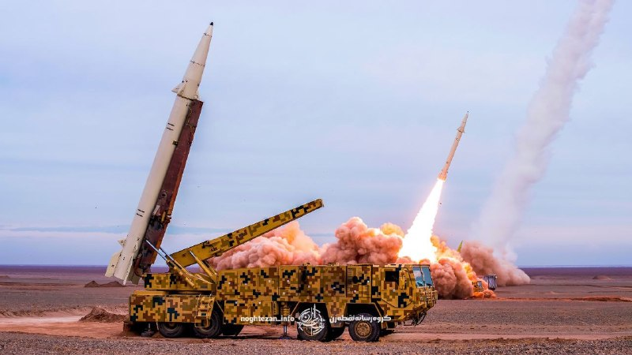

سپاه پاسداران در حمله امروز صبح خود به پایگاه هوایی امریکا در کویت از یک فروند موشک بالستیک سوخت جامد ذوالفقار/دزفول استفاده کرده است.

موشک بالستیک سوخت جامد دزفول با برد 1000 کیلومتر بخاطر بهرگیری از یک کلاهک جداشونده، ماکسیسم سرعت 9 ماخ و مانور های که برای اصلاح مسیر انجام می‌دهد یکی از محلک ترین موشک های ساخت ایران برای هدف قرار دادن پایگاه های امریکا در سطح منطقه محسوب میشود، موشک سوخت جامد ذوالفقار نیز نمونه اولیه دزفول محسوب می‌شود که بردی 700 کیلومتری دارد.

ولی نکته جالبتر ماجرا این است که امریکا به طور رسمی سرنگونی MQ-1 خود را گردن گرفت! پهپاد MQ-1 سال هاست که از ارتش امریکا بازنشسته شده، شاید دلیل مجدد عملیاتی شدن این پهپاد در سازمان رزم نیروی هوایی امریکا جایگزینی سریع آن با ناوگان MQ-9 های منهدم شده در جنگ اخیر باشد.

📝 Amir

📌 @persian_trend_official
پرشین ترند | متفاوت‌ترین کانال نظامی

## Persian_Trend_Official — post 15423

  <a href="telegram/content/Persian_Trend_Official_15423_1780317202.mp4" target="_blank">🎬 Download video</a>

سپاه پاسداران نیز در پاسخ به حمله بامداد امریکا، باری دیگر به کویت حمله موشکی کرد.

اطلاعیه روابط عمومی سپاه: به‌دنبال تجاوز ساعتی پیش ارتش متجاوز امریکا به یک دکل مخابراتی در سیریک واقع در استان هرمزگان، رزمندگان نیروی هوافضای سپاه، پایگاه هوایی مبدأ تجاوز را مورد هدف قرار دادند و اهداف پیش‌بینی‌شده منهدم گردید.

نیروی هوافضای سپاه اخطار داد در صورت تکرار تجاوز، پاسخ کاملاً متفاوت خواهد بود و مسئولیت آن به‌عهده رژیم متجاوز و کودک‌کش امریکا است.

📝 Amir

📌 @persian_trend_official
پرشین ترند | متفاوت‌ترین کانال نظامی

## Persian_Trend_Official — post 15422

  <a href="telegram/content/Persian_Trend_Official_15422_1780317205.webm" target="_blank">🎬 Download video</a>

فرماندهی مرکزی ایالات متحده (CENTCOM) دیشب حملات دفاع از خود را علیه سایت‌های راداری ایران و مراکز فرماندهی و کنترل پهپادها در گورکِ ایران و جزیره قشم انجام داد.

این حملات سنجیده و برنامه‌ریزی‌شده در روزهای شنبه و یکشنبه، در پاسخ به اقدامات تهاجمی ایران صورت گرفت؛ اقداماتی که شامل سرنگونی یک پهپاد آمریکایی ام‌کیو-1 بود که بر فراز آب‌های بین‌المللی در حال فعالیت بود. هواپیماهای جنگنده آمریکا به سرعت واکنش نشان دادند و سامانه‌های پدافند هوایی ایران، یک ایستگاه کنترل زمینی و دو پهپاد انتحاری را که تهدیدی آشکار برای کشتی‌های عبوری در آب‌های منطقه محسوب می‌شدند، منهدم کردند.

هیچ‌یک از نیروهای نظامی آمریکایی آسیب ندیدند. سنتکام اعلام کرد که در طول آتش‌بس جاری، در پاسخ به آنچه تجاوزات غیرموجه ایران خوانده است، به حفاظت از دارایی‌ها و منافع ایالات متحده ادامه خواهد داد.

📝 Amir

📌 @persian_trend_official
پرشین ترند | متفاوت‌ترین کانال نظامی

## RadioFarda — post 157774

🔸مسعود پیاهو، شهروندی که به اتهام ثبت ویدئو از اعتراضات ۱۴۰۴ به ۱۰ سال زندان محکوم شده است، روز دوشنبه ۱۱ خرداد با انتشار پیامی ویدئویی جدید گفت: «با وجود آنکه در بازنشر آن هیچ نقشی نداشته است، روز سه‌شنبه برای اجرای حکم خود را به زندان معرفی می‌کند.»

🔸حسن آقاخانی، وکیل دادگستری، روز یکشنبه از محکومیت موکلش به اتهام ثبت ویدئو از معترضی که در جریان اعتراضات دی‌ماه سال گذشته مقابل مأموران پلیس ایران در خیابان روی زمین نشسته بود، خبر داد.

🔸آقاخانی تاکید کرد که مسعود پیاهو قصد انتشار «عمومی» ویدئو را نداشته و آن را در «استوری پرایوت» صفحه اینستاگرام خود منتشر کرده اما سپس شخص دیگری آن را به شکل عمومی منتشر کرد.

🔸انتشار این ویدئو از فردی که روز هشتم دی‌ماه و در دومین روز اعتراضات به تنهایی مقابل مأموران انتظامی روی زمین نشسته بود، به شکل گسترده منتشر شد، بازتاب‌های فراوانی ایجاد کرد.

🔸تصویر این معترض به یکی از نمادهای اعتراضات دی ماه ۱۴۰۴ تبدیل شد.

🔸آقاخانی روز یکشنبه گفت که دادگاه با استناد به «قانون تشدید مجازات جاسوسی و همکاری با رژیم صهیونیستی» آقای پیاهو را به «۱۰ سال حبس» محکوم کرد.

@Radiofarda

## RadioFarda — post 157773

رئیس فدراسیون فوتبال ایران: تنگناهای مالی به‌شدت تیم را آزار می‌دهد

🔸مهدی تاج، رئیس فدراسیون فوتبال ایران، روز یک‌شنبه دهم خرداد به گلایه از مشکلات مالی در بر سر راه آماده‌سازی تیم ملی فوتبال ایران در راه جام جهانی پرداخت.

🔸به گزارش خبرگزاری ایرنا، او در این باره توضیح داده که «تیم ملی در شرایط خوبی قرار دارد، اما تنگناهای مالی به‌شدت تیم را آزار می‌دهد. هزینه‌های تیم‌های مختلف ملی دلاری است. وزارت ورزش زیر ۲۰۰ میلیارد به ما کمک کرده است.»

🔸رئیس فدراسیون فوتبال ایران دربارهٔ آخرین خبر پیرامون صدور روادید تیم ملی فوتبال برای حضور در جام جهانی ۲۰۲۶ هم گفت: «مسئول برگزاری جام جهانی فیفا است و از نظر ما مسئول دادن ویزا هم فیفا است. وقتی کشوری متعهد به میزبانی می‌شود، یکی از تعهداتی که می‌دهند، صدور ویزا است. در جلساتی که رو در رو با فیفا داشتیم، آنها در این رابطه با ما هم‌نظر هستند.»

🔸در فاصله ۱۴ روز تا جام جهانی ۲۰۲۶، بلاتکلیفی ویزای تیم ملی فوتبال ایران ادامه دارد. خبرگزاری مهر گزارش داده که فدراسیون فوتبال با ارسال نامه‌ای تازه به فیفا خواستار تعیین تکلیف فوری این پرونده شده، اما به گفته این خبرگزاری، فیفا تاکنون پاسخی به نامه‌های فدراسیون نداده است.

🔸مهدی محمدنبی، سرپرست تیم ملی، دو روز پیشتر از این گفته بود هنوز نه ویزای مکزیک و نه ویزای آمریکا برای اعضای تیم صادر نشده و تیم ملی به روادید چندبار ورود هر دو کشور نیاز دارد. پیشتر نیز مهدی تاج اعلام کرده بود که به‌دلیل مشکل ویزا، محل اردوی تیم ملی از آریزونای آمریکا به تیخوانای مکزیک منتقل شده است.

🔸این ابهام در حالی ادامه دارد که به گفته سفیر جمهوری اسلامی در مکزیک، هنوز روشن نیست آمریکا به تیم ملی روادید خواهد داد یا نه؛ موضوعی که می‌تواند برنامه‌های ایران را در روزهای پایانی پیش از جام جهانی با مشکل جدی روبه‌رو کند.

🔸نسخه کامل این گزارش را در وب‌سایت رادیوفردا بخوانید.

@Radiofarda

## RadioFarda — post 157772

🔸ارتش اسرائیل روز دوشنبه ۱۱ خرداد تصاویری از ورود نیروهای یگان گشتی گولانی به قلعه تاریخی شقیف (بوفور) در جنوب لبنان را منتشر کرد.

🔸ییسرائیل کاتز، وزیر دفاع اسرائیل، روز یکشنبه از تصرف این دژ راهبردی قرون وسطایی در جنوب لبنان، که پرچم اسرائیل بر فراز آن برافراشته شده است، خبر داده بود.

🔸قلعه بوفور یا شقیف بر بخش‌های گسترده‌ای از جنوب لبنان اشراف دارد و به همین دلیل از اهمیت نظامی بالایی برخوردار است.

🔸قلعه تاریخی شقیف متعلق به دوران جنگ‌های صلیبی در استان نبطیه در جنوب لبنان است که در فاصله حدود ۱ کیلومتری در جنوب،جنوب شرقی روستای أرنون قرار دارد.

🔸صلاح‌الدین ایوبی،‌ نخستین سلطان مصر و شام در سال ۱۱۹۰ قلعه شقیف را فتح کرد، اما ۶۰ سال بعد صلیبی‌ها دوباره آن را بازپس گرفتند.

🔸در سال ۱۲۶۸ سلطان ظاهر رکن‌الدین بیبرس بندقداری در نهایت قلعه را برای نیروهای اسلامی تصرف کرد.

🔸قلعه شقیف یکی از نمونه‌های معدودی است که در آن یک قلعه قرون وسطایی در جنگ‌های مدرن نیز دارای ارزش و کاربرد نظامی بوده است، همان‌طور که تاریخ اواخر سده بیستم آن، به‌ویژه در طول جنگ ۱۹۸۲ لبنان این موضوع را نشان داد.

@Radiofarda

## RadioFarda — post 157771

  <a href="https://t.me/radiofarda/157771" target="_blank">📎 Download file</a>

📻بشنوید: ساعت ۱۴ با رادیوفردا، یازدهم خرداد ۱۴۰۵‌

@Radiofarda

## RadioFarda — post 157770

وقتی تفلیس از واشینگتن دور شد؛ گرجستان در میانهٔ پرونده نفوذ ایران

🔸یک گزارش تازه می‌گوید که نفوذ سیاسی، مذهبی و اقتصادی جمهوری اسلامی ایران در گرجستان به‌طرزی سیستماتیک گسترش یافته و تفلیس عملاً راه را برای آن باز کرده است؛ از جمله با افزایش شرکت‌های ایرانی، رشد واردات نفت و فراورده‌های پتروشیمی، و امکان دور زدن تحریم‌ها از مسیر تغییر برچسب کالاها.

🔸گزارشی از رادیو اروپای آزاد/رادیو آزادی حاکی است که واکنش حزب حاکم «رؤیای گرجی» به جای پاسخ‌گویی به یافته‌های این گزارش، فشار بر منتقدان و تهدید به پیگرد قانونی بوده است. در نتیجه، گرجستان که زمانی شریک نزدیک واشینگتن در قفقاز جنوبی بود، اکنون بیش از پیش در نگاه آمریکا به عنوان مسئله‌ای امنیتی و سیاسی دیده می‌شود و در دیپلماسی منطقه‌ای واشینگتن نیز به حاشیه رانده شده است.

🔸هنگامی که ایراکلی کوباخیدزه، نخست‌وزیر گرجستان، در هفتۀ جاری اشاره کرد که گیورگی کاندلاکی، قانون‌گذار پیشین و از نویسندگان گزارشی دربارۀ نفوذ ایران در کشورش، ممکن است با پیامدهای قانونی روبه‌رو شود، او این موضوع را مسئله‌ای مربوط به «نهاد دولتی ذی‌ربط» توصیف کرد.

🔸جان والترز، رئیس مؤسسۀ هادسون مستقر در ایالات متحده که این گزارش را منتشر کرده است، دیدگاه متفاوتی داشت: «واقعیت‌ها با هیاهو و تهدید تغییرپذیر نیستند. شما «رؤیای گرجی» نیستید، بلکه نابودکنندۀ رؤیاهای گرجی هستید.»

🔸این گفت‌وگو دریچۀ کوچک اما گویایی است که نشان می‌دهد روابط گرجستان با واشینگتن تا چه حد رو به تیرگی نهاده است و چگونه حزب حاکم رؤیای گرجی برای توقف این روند قهقرایی، یا ناتوان است یا بی‌میل.

🔸نسخه کامل این گزارش را در وب‌سایت رادیوفردا بخوانید.

@RadioFarda

## RadioFarda — post 157769

قانون طالبان «کودک‌عروس‌ها» را در ازدواج‌هایی که انتخاب نکرده‌اند گرفتار می‌کند

🔸ندا فقط ۱۲ ساله بود و دانش‌آموزی در کابل، وقتی والدینش او را به عقد یک خویشاوند دور درآوردند؛ مردی که هرگز او را ندیده بود.

🔸خانواده‌ ندا فقیر بودند، اما خانواده شوهرش وضع مالی بهتری داشتند. ندا باور دارد که «پول و بی‌سوادی مادرش» سرنوشت او را رقم زد. او به خانه شوهر جدیدش، مرد ۲۰ ساله‌ای در منطقه دورافتادۀ دَرواز در شمال شرق افغانستان برده شد؛ جایی که کودکی‌اش ناگهان پایان یافت.

🔸او به رادیو اروپای آزاد/رادیو آزادی گفت: «حتی پریود هم نشده بودم. هیچ تصوری از زندگی زناشویی یا رابطه جنسی نداشتم» و «والدینم حتی از من نپرسیدند که آیا می‌خواهم ازدواج کنم یا نه.»

🔸ندا که به‌دلیل حفط حریم خصوصی، نامش تغییر کرده، گفت که خانواده شوهرش انتظار داشتند تمام کارهای خانه را انجام دهد و اگر نمی‌توانست خانه را به سلیقه خانواده شوهر تمیز کند یا غذا بپزد، شوهرش او را کتک می‌زد؛ «به هر شکلی که قابل تصور بود، مورد آزار قرار گرفتم».

🔸سه سال بعد، پدرش در ماجرا دخالت کرد. با کمک او، ندا درخواست طلاق داد که این فرآیند از طریق دادگاه شرعی دو سال طول کشید.

🔸اگرچه ازدواج کودکان همیشه در افغانستان رایج بوده، اما گروه‌های حقوق بشری می‌گویند این پدیده از زمان بازگشت طالبان به قدرت در سال ۲۰۲۱ شدت گرفته است.

🔸در ۱۴ مه، طالبان قانون جدیدی در مورد طلاق صادر کردند که برای نخستین‌بار به طور ضمنی ازدواج کودکان در این کشور را مجاز دانست.

🔸این حکم با عنوان «جدایی قضایی زوجین» شرایط طلاق در دادگاه‌ها را مشخص می‌کند.

🔸طبق نظر کارشناسان پزشکی، محدوده سنی معمول برای شروع بلوغ در دختران بین هشت تا ۱۳ سالگی است. علمای اسلامی تفسیرهای متفاوتی از بلوغ دارند؛ برخی مکاتب فکری آن را ۱۵ یا ۱۸ سالگی می‌دانند، در حالی که چندین متن کلاسیک پیشنهاد می‌کنند که ۹ سالگی کمترین سنی است که دختری می‌تواند بالغ محسوب شود.

🔸نسخه کامل این گزارش را در وب‌سایت رادیوفردا بخوانید.

@RadioFarda

## RadioFarda — post 157768

  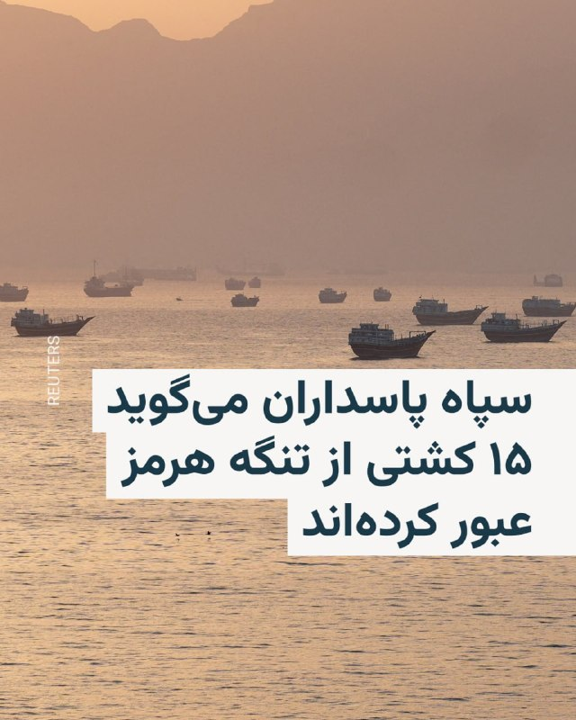

🔸روابط عمومی نیروی دریایی سپاه پاسداران انقلاب اسلامی اعلام کرد طی شبانه‌روز گذشته ۱۵ فروند کشتی، از جمله ۴ نفتکش، پس از دریافت مجوز و با هماهنگی از تنگه هرمز عبور کرده‌اند.

🔸در اطلاعیه سپاه آمده است که «تردد این شناورها با نظارت و هماهنگی نیروهای دریایی سپاه انجام شده است.»

🔸پیشتر یک مقام رسمیِ ایالات متحده به روزنامهٔ نیویورک‌تایمز گفته بود ارتش آمریکا «بی‌سروصدا» کشتی‌های تجاری را برای عبور از تنگه هرمز هدایت می‌کند.

🔸به گفته مقامی دیگر، فرماندهی مرکزی آمریکا (سنتکام) طی سه هفته گذشته، حدود ۷۰ کشتی را در ورود و خروج از خلیج فارس همراهی کرده است.

🔸مقامات آمریکایی اشاره کردند که بیشترِ این کشتی‌ها برای جلوگیری از شناسایی توسط جمهوری اسلامی، فرستنده‌های خود را خاموش کرده بودند.

@RadioFarda

## RadioFarda — post 157767

  

🔸رئیس کل دادگستری استان سمنان از توقیف اموال ۱۸ نفر به اتهام «همکاری با عناصر دشمن» در این استان خبر داد.

🔸روابط عمومی دادگستری استان سمنان به نقل از محمد صادق اکبری نوشته «تاکنون ۴۰ نفر به جرم همین همکاری با توقیف اموال و دارایی‌ها مواجه شدند.»

🔸او افزوده که «با صدور احکام قضایی لازم، دستور توقیف فوری تمامی دارایی‌های منقول، غیرمنقول و حساب‌های بانکی متهمان انجام شده است؛ همچنین دامنه شناسایی و توقیف اموال این افراد به سایر استان‌های کشور نیز گسترش یافته است.»

🔸آن‌طور که اکبری گفته با تأکید رئیس قوه قضائیه، رسیدگی به این پرونده‌ها در شعب ویژه، «با سرعت لازم پیگیری می‌شود و در برخورد با عناصر داخلی همسو با دشمنان، هیچ‌گونه مسامحه‌ای صورت نخواهد گرفت و قاطعانه رفتار خواهد شد».

🔸در نزدیک به سه ماهی که از آغاز جنگ می‌گذرد، به‌ویژه پس از آغاز آتش‌بس، تقریباً به‌طور روزانه خبر توقیف یا مصادره اموال افراد در رسانه‌های حکومتی منتشر شده، اما هرگز شواهد و مدارک مورد استفاده در دادگاه برای رسیدن به این حکم رسانه‌ای نشده است.

@RadioFarda

## RadioFarda — post 157766

  

🔸محمدباقر قالیباف، رئیس مجلس شورای اسلامی و رئیس هیئت مذاکره‌کننده ایران با آمریکا، می‌گوید «محاصره دریایی و تشدید جنایات جنگی در لبنان» توسط اسرائیل، «شواهد آشکاری از عدم پایبندی آمریکا به آتش‌بس است».

🔸او بدون اشاره به جزئیات، در پیامی به زبان انگلیسی در شبکه ایکس، تهدید کرده که «هر انتخابی بهایی دارد، و زمان پرداخت آن فرا می‌رسد. همه‌چیز در نهایت سر جای خود قرار خواهد گرفت.»

🔸این پیام همزمان با تشدید عملیات نظامی اسرائیل در لبنان و علیه گروه حزب‌الله صورت می‌گیرد که از گروه‌های نیابتی جمهوری اسلامی در منطقه است.

🔸جمهوری اسلامی بارها گفته که آتش‌بس میان ایران و آمریکا باید شامل آتش‌بس در همه جبهه‌ها به ویژ‌ه جبهه لبنان شود؛ مطالبه‌ای که محقق نشده است.

@RadioFarda

## RadioFarda — post 157765

🔸وزیر کشور فرانسه اعلام کرد که در جریان ناآرامی‌هایی که پس از قهرمانی باشگاه پاری‌سن‌ژرمن در لیگ قهرمانان اروپا برای دومین سال پیاپی رخ داد، نزدیک به ۹۰۰ نفر بازداشت شدند.

🔸لوران نونز دوشنبه یازدهم خرداد، به رادیو «فرانس اینتر» گفت: «بیش از ۸۹۰ بازداشت داشته‌ایم. در مجموع، این رقم ۴۵ درصد بیشتر از سال گذشته است.»

🔸او همچنین افزود که نزدیک به ۱۸۰ نیروی پلیس و مأمور امنیتی در جریان این ناآرامی‌ها زخمی شده‌اند.

🔸پس از پیروزی تیم پاری‌سن‌ژرمن مقابل آرسنال در لیگ قهرمانان اروپا که بعدازظهر شنبه، نهم خرداد، برگزار شد، جشن‌های پیروزی در برخی مناطق این کشور به ناآرامی و خشونت کشیده شد.

🔸مقام‌ها اعلام کردند که میزان ناآرامی‌ها نسبت به سال گذشته، که پاری‌سن‌ژرمن برای نخستین بار قهرمان لیگ قهرمانان شد، حدود ۳۰ درصد افزایش داشته است. در جریان آشوب‌های سال ۲۰۲۵، دو نفر کشته، نزدیک به ۲۰۰ نفر زخمی و ۵۵۹ نفر بازداشت شده بودند.

🔸نسخه کامل این گزارش را در وب‌سایت رادیوفردا بخوانید.

@RadioFarda

## RadioFarda — post 157764

  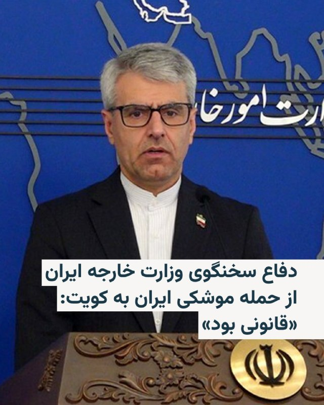

🔸اسماعیل بقائی، سخنگوی وزارت خارجه ایران می‌گوید اقدام جمهوری اسلامی در هدف قرار دادن مبادی و امکاناتی که برای اقدامات نظامی علیه کشور مورد استفاده قرار می‌گیرد، «قانونی» و در چارچوب «حق دفاع مشروع» است.

🔸بقائی این اظهارات را پس از آنکه سپاه اعلام کرد یک پایگاه هوایی مورد استفاده آمریکا برای حمله به جنوب ایران را هدف قرار داده است، بیان کرد.

🔸با آنکه سپاه نام این پایگاه را مشخص نکرده، اما ارتش کویت روز دوشنبه اعلام کرد پدافند هوایی این کشور «حملات خصمانه موشکی و پهپادی» را رهگیری کرده است. آمریکا در کویت دارای پایگاه نظامی است.

🔸این حمله اندکی پس از آن انجام شد که سنتکام، فرماندهی مرکزی آمریکا، اعلام کرد طی دو روز اخیر در پاسخ به «اقدامات تهاجمی ایران، از جمله سرنگونی یک پهپاد ام‌کیو-۱ آمریکا که بر فراز آب‌های بین‌المللی فعالیت می‌کرد»، به مواضع نظامی ایران در سواحل خلیج فارس حمله کرده است.

🔸بقائی نیز بدون اشاره به پایگاهی که سپاه مدعی است به آنجا حمله کرده، افزود: «دولت‌ها تعهد قانونی دارند که مانع از استفاده طرف‌های متجاوز از قلمرو و امکانات آنها برای تعرض به یک کشور دیگر شوند.»

@RadioFarda

## RadioFarda — post 157763

«موج تازه» تشکیل پرونده‌های انضباطی و صدور احکام سنگین برای دانشجویان در ایران

🔸روزنامه شرق در گزارشی از «موج تازه» تشکیل پرونده‌های انضباطی و صدور احکام سنگین برای دانشجویان در چند دانشگاه ایران خبر داده است؛ موجی که به نوشته این روزنامه، از اسفند ۱۴۰۴ و تنها چند روز پس از بازگشایی دانشگاه‌ها آغاز شد و اکنون در خرداد ۱۴۰۵، همزمان با ادامه تعطیلی دانشگاه‌ها به‌دلیل جنگ، دوباره شدت گرفته است.

🔸همزمان، کانال تلگرامی «خبرنامه امیرکبیر» روز دوشنبه ۱۱ خرداد خبر داد که ۵۳ تشکل، نشریه و نهاد دانشجویی دانشگاه صنعتی شریف، در نامه‌ای مشترک به رئیس این دانشگاه، به احکام اخیر کمیته‌های انضباطی اعتراض کردند و خواستار لغو فوری احکام صادرشده و توقف روند جاری رسیدگی‌ها شدند.

🔸امضاکنندگان این نامه گفته‌اند در هفته‌های اخیر شماری از دانشجویان، از جمله به‌دلیل فعالیت در فضای مجازی، به کمیته‌های انضباطی احضار شده و برای برخی از آنان احکام بدوی و تجدیدنظر صادر شده است. آن‌ها روند رسیدگی را همراه با نقض ضوابط شکلی و اصول مندرج در شیوه‌نامه انضباطی دانسته‌اند.

🔸این نامه پس از آن منتشر می‌شود که شورای صنفی دانشجویان شریف پیشتر از احضار دست‌کم ۳۰ دانشجو و صدور حداقل شش حکم اخراج خبر داده بود؛ پرونده‌هایی که بنا بر گزارش‌ها، بخشی از آن‌ها به محتوای صفحات شخصی، پیام در گروه‌های خصوصی و بازنشر مطالب در شبکه‌های اجتماعی مربوط است.

🔸بر اساس گزارش روزنامه شرق، در دانشگاه صنعتی شریف پنج تا هفت دانشجو حکم اخراج گرفته‌اند و بیش از ۲۰ دانشجو نیز با احکام تعلیق یک تا سه ترم از تحصیل روبه‌رو شده‌اند. دانشجویان این دانشگاه گفته‌اند احضارها گاه بدون ارائه توضیح درباره اتهام انجام شده و در برخی موارد، جلسه تفهیم اتهام و صدور رأی در یک روز برگزار شده است.

🔸به نوشته شرق، بخشی از اتهامات در دانشگاه شریف به فعالیت دانشجویان در فضای مجازی مربوط است. یک دانشجو گفته است سه نفر تنها به‌دلیل فعالیت در تلگرام و شبکه ایکس حکم اخراج گرفته‌اند و در یک مورد، مصداق حکم، عکس پروفایل دانشجو بوده است. دانشجویان همچنین می‌گویند در جلسات کمیته انضباطی، به‌جای ارائه سند روشن، به گزارش افراد موسوم به «مطلع» استناد شده است.

🔸نسخه کامل این گزارش را در وب‌سایت رادیوفردا بخوانید.

@RadioFarda

## RadioFarda — post 157762

  

🔸دونالد ترامپ در پستی تازه در تروث‌سوشال از واکنش‌های چهره‌های سیاسی به نحوه برخورد دولت او با حکومت ایران برای دستیابی به توافق انتقاد کرد و نوشت که این فشارها کار را برای او «سخت‌تر» می‌کند.

🔸او در این پست در شبکه اجتماعی خود تأکید کرد که «ایران واقعاً می‌خواهد به توافق برسد، و این توافق برای آمریکا و کسانی که با ما هستند، توافق خوبی خواهد بود.»

🔸ترامپ با بازی با واژهای «دمو» و «دام» به معنی احمق، به طعنه دموکرات را «داموکرات‌ها» [نادان‌ها] نامید و به آنها و «برخی جمهوری‌خواهانِ ظاهراً غیرمیهن‌پرست» نوشت که آنها «نمی‌فهمند که وقتی آدم‌های سیاسیِ فرصت‌طلب مدام و به شکلی بی‌سابقه منفی‌بافی می‌کنند و پشت سر هم می‌گویند که باید سریع‌تر عمل کنم، یا کندتر پیش بروم، یا وارد جنگ شوم، یا نشوم، یا هر چیز دیگری، انجام درست وظیفه و مذاکره برای من خیلی سخت‌تر می‌شود؟»

🔸رئیس‌جمهور آمریکا خطاب به منتقدان خود در ارتباط با توافق با جمهوری اسلامی، نوشت: «فقط آرام باشید و استراحت کنید؛ در نهایت همه‌چیز خوب پیش خواهد رفت — همیشه همین‌طور بوده است!»

@RadioFarda

## RadioFarda — post 157761

  

🔸روزنامه دنیای اقتصاد در گزارشی نوشته که نرخ بهای خدمات مرتبط با کفن و دفن در «بهشت ‌زهرا» در تهران، به‌طور میانگین حدود ۴۰ درصد و در برخی موارد حتی تا ۵۰ درصد افزایش یافته است.

🔸در این گزارش آمده که بر اساس مصوبه جدید شورای شهر تهران، تعرفه خدمات مختلف از جمله هزینه انتقال هر متوفی از سطح شهر تهران تا شعاع ۱۰ کیلومتری به ۹ میلیون و ۷۵۰ هزار ریال رسیده و افزایشی ۵۰ درصدی داشته است.

🔸این گزارش می‌افزاید که هزینه‌های مربوط به تغسیل، تکفین، نگهداری در سردخانه، نصب سنگ مزار، قاب بتنی و آماده‌سازی متوفی برای انتقال نیز با افزایش محسوسی همراه شده است.

🔸این افزایش تعرفه‌ها در شرایطی اعمال می‌شود که فشارهای اقتصادی بر شهروندان ایران بعد از حملات آمریکا و اسرائیل و نیز محاصره بنادر ایران، به شدت افزایش یافته است.

🔸گزارش‌های شهروندی و حتی اقتصاددانان حاکی از شرایط بحرانی اقتصاد ایران است و حتی نهادهای رسمی و امنیتی همچون وزارت اطلاعات جمهوری اسلامی نیز نسبت به احتمال وقوع اعتراضات خیابانی ناشی از فشارهای اقتصادی هشدار داده‌اند.

@RadioFarda

## RadioFarda — post 157760

🔸وب‌سایت آکسیوس به نقل از منابع خود گزارش داده که تلاش جدید آمریکا برای آتش‌بس میان اسرائیل و لبنان «شکست» خورده است.

🔸منابع اکسیوس به این رسانه گفته‌اند که اسرائیل به دنبال چراغ سبز آمریکا برای انجام حملات گسترده به اهداف حزب‌الله در بیروت است و همزمان عملیات زمینی خود در لبنان را گسترش داده است.

🔸به گفته یک مقام آمریکایی در گفتگو با آکسیوس، «ایالات متحده انتظار ندارد که اسرائیل حملات مداوم علیه غیرنظامیانش از سوی یک سازمان تروریستی [حزب‌الله لبنان] را تحمل کند.»

🔸حزب‌الله که هم یک گروه شبه‌نظامی و هم یک حزب سیاسی است، بخش بزرگی از جنوب لبنان را کنترل می‌کند. ایالات متحده آن را یک سازمان تروریستی می‌داند، اما اتحادیهٔ اروپا فقط شاخهٔ نظامی آن را در فهرست سیاه قرار داده است.

🔸خبرگزاری فرانسه نیز به نقل از یک مقام آمریکایی نوشته که حزب‌الله باید نخستین طرفی باشد که حملات خود را در جریان درگیری با اسرائیل متوقف می‌کند.

🔸این خبر پس از دیدار و مذاکره مارکو روبیو، وزیر خارجه آمریکا، در روز یکشنبه با جوزف عون، رئیس‌جمهور لبنان، و بنیامین نتانیاهو، نخست‌وزیر اسرائیل، منتشر می‌شود.

@RadioFarda

## IranianMinds — post 21186

  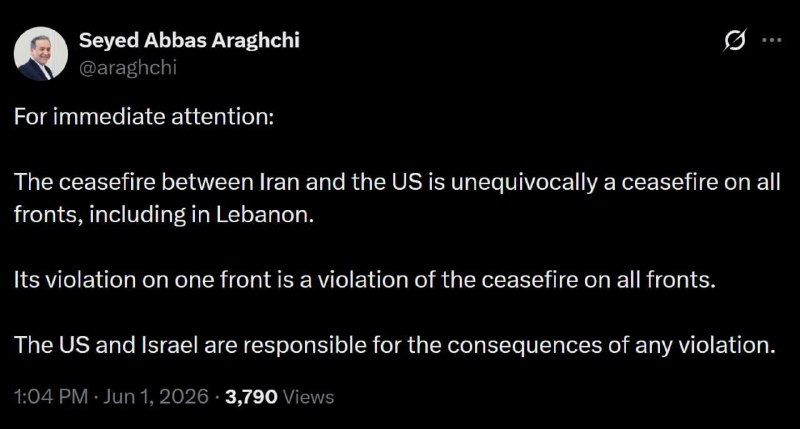

🔴عباس عراقچی

برای توجه فوری:

آتش‌بس میان ایران و ایالات متحده به طور قاطع، آتش‌بسی در تمام جبهه‌ها از جمله لبنان می‌باشد.
نقض کردن آن در یک جبهه، نقض آتش‌بس در همه جبهه‌ها به حساب می‌‌آید.
ایالات متحده و اسرائیل مسؤول پیامدهای هرگونه نقض هستند.

@IranianMinds

## IranianMinds — post 21185

  

🔴پست ترامپ در تروث‌سوشال:

آیا کسی تا به الان یک دموکرات خوشحال دیده است؟؟؟

@IranianMinds

## IranianMinds — post 21184

  

محمدباقر قالیباف:
محاصره دریایی و تشدید جنایات جنگی در لبنان، گواه عدم پایبندی واشنگتن به آتش بس است و هر گزینه ای بهایی دارد که پرداخت خواهد شد.

@IranianMinds

## IranianMinds — post 21183

  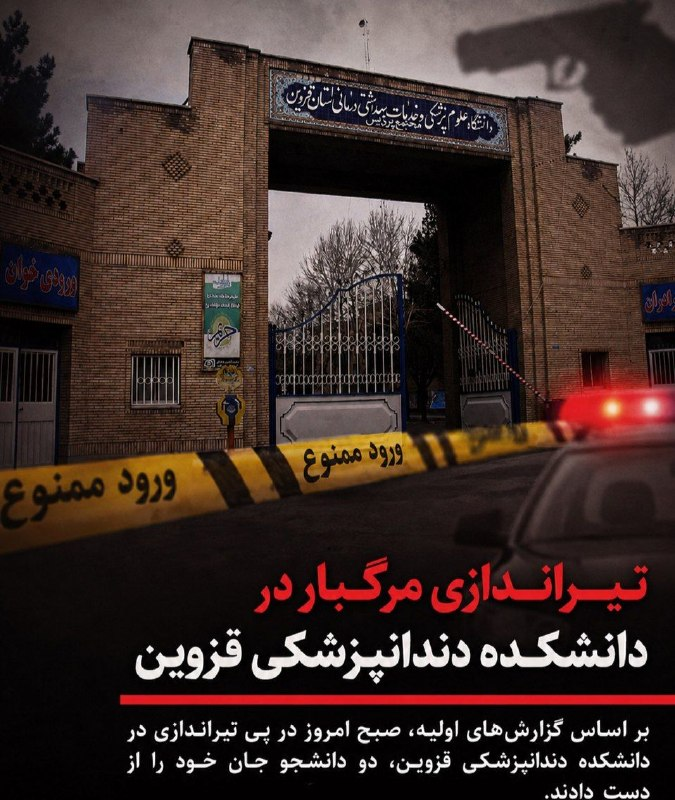

امروز صبح تو دانشکده‌ دندونپزشکی قزوین، یه مرده با کلت کمری وارد دانشگاه شد و همونجا زنش رو کشت و بعدشم به خودش شلیک و خودکشی کرد...

@IranianMinds

## IranianMinds — post 21182

  

‏🔴کاش یه خارجی بودم که با دیدن این شمع یاد موج می‌افتاد، نه عمامه.

@IranianMinds

## IranianMinds — post 21181

  

بیانیه سنتکام درباره حملات شنبه و یکشنبه
(از جمله حمله ساعاتی پیش به سیریک هرمزگان که گویا ساعت ۴ صبح دوشنبه به وقت ایران انجام شده. در آمریکا هنوز یکشنبه اس

ادعای سنتکام:
"آمریکا در واکنش به حمله ایران، از خود دفاع کرد و تهدیدها را از کار انداخت

تامپا، فلوریدا — فرماندهی مرکزی ایالات متحده آمریکا، سنتکام، این آخر هفته حملات دفاعی علیه سایت‌های راداری ایران و مراکز فرماندهی و کنترل پهپادها در گروک ایران و جزیره قشم انجام داد.

این حملات حساب‌شده و عامدانه، روزهای شنبه و یکشنبه و در پاسخ به اقدامات تهاجمی ایران انجام شد؛ اقداماتی که شامل سرنگونی یک پهپاد MQ-1 آمریکا بود که بر فراز آب‌های بین‌المللی فعالیت می‌کرد. جنگنده‌های آمریکایی به‌سرعت واکنش نشان دادند و پدافند هوایی ایران، یک ایستگاه کنترل زمینی، و دو پهپاد تهاجمی یک‌طرفه را که تهدیدی آشکار برای کشتی‌های در حال عبور از آب‌های منطقه‌ای محسوب می‌شدند، منهدم کردند.

هیچ‌یک از نیروهای نظامی آمریکا آسیب ندیدند. سنتکام در جریان آتش‌بس جاری، در واکنش به تجاوز بی‌دلیل ایران، به حفاظت از دارایی‌ها و منافع ایالات متحده ادامه خواهد داد."

@IranianMinds

## IranianMinds — post 21180

🔴 ترافیک شدید در ضاحیه بیروت مردم در حال تخلیه این منطقه هستند @IranianMinds

## IranianMinds — post 21179

  

🔴 ترافیک شدید در ضاحیه بیروت
مردم در حال تخلیه این منطقه هستند

@IranianMinds

## IranianMinds — post 21178

🔴 گالانت : نتانیاهو اعلام کرده خاورمیانه دیگر جای حزب الله نیست و تا نابودی کامل جلو خواهیم رفت

@IranianMinds

## IranianMinds — post 21177

🔴 بقایی: ما هر وقت لازم باشد که در رابطه با موضوعات هسته‌ای کاری انجام دهیم، به خوبی می‌دانیم چگونه عمل کنیم

در مورد جزئیات مباحث مرتبط با موضوع هسته‌ای، هیچ مذاکره‌ای در این مرحله صورت نگرفته است. بار دیگر تأکید می‌کنم که تمرکز ما در این مرحله بر خاتمه جنگ است.

@IranianMinds

## IranianMinds — post 21176

چرا این روزها همه سایت جهانی MelBet رو انتخاب میکنن 
⁉️

🎁 شارژ هدیه 130 دلاری اولین واریز

🎁 شارژ هدیه 100 دلاری در روز های یکشنبه و چهارشنبه

🎁 و ده ها بانس ارزنده دیگر...

🥇 متنوع ترین آپشن های ورزشی

🖥 پخش زنده مسابقات

🎮 بیش از 80 نوع ورزش مجازی با پخش زنده

⭐ کاملترین کازینو آنلاین

🛡 امنیت فوق العاده بالا

💵 واریز آنی جوایز با بیش از 30 روش شارژ و برداشت، از جمله کارت بکارت

🌐 اسپانسر رسمی لالیگای اسپانیا

😀 مورد تایید سازمان Gambling Judge

✅ معرفی سایت و اپلیکیشن مل‌بت

💯 ورود به سایت مل‌بت (فیلترشکن خاموش)

## IranianMinds — post 21174

🔴 نتانیاهو: ما دستور بمباران ضاحیه بیروت را صادر کردیم

@IranianMinds

## IranianMinds — post 21173

گزارشاتی از انفجار در بندرعباس

## IranianMinds — post 21172

  <a href="telegram/content/IranianMinds_21172_1780317217.mp4" target="_blank">🎬 Download video</a>

🔴 این روزا خود عرزشیام ضد جمهوری اسلامی شدن!

میخوان عید غدیر جشن پیروزی بگیرن، آخه چه جشنی؟ ما حتی هنوز رهبرمون هم دفن نکردیم.

تا کی میخواین مارو گول بزنین، مگه رهبر شهیدمون نمی گفت با آمریکا مذاکره نکنین؟ دیگه حالم ازتون بهم میخوره.

@IranianMinds

## BBCPersian — post 282555

🔻هشدار ایران به آمریکا و اسرائیل: نقض آتش‌بس در یک جبهه، نقض آن در تمام جبهه‌هاست

ایران به آمریکا و اسرائیل هشدار داد که «نقض آتش‌بس در هر یک از جبهه‌ها، به منزله نقض آن در تمامی جبهه‌ها است.»
عباس عراقچی، وزیر خارجه ایران، در پیامی در شبکه ایکس با عنوان «برای توجه فوری» نوشت:
«آتش‌بس میان ایران و ایالات متحده، بدون هیچ ابهامی، آتش‌بسی در تمامی جبهه‌ها، از جمله لبنان، محسوب می‌شود.»
او هشدار داد که آمریکا و اسرائیل مسئول پیامدهای هرگونه نقض این آتش‌بس خواهند بود.
پیشتر چندین مقام دیگر ایران هم هشدارهای مشابهی دادند از جمله محمدباقر قالیباف.
رئیس مجلس شورای اسلامی که هدایت مذاکرات با آمریکا را هم بر عهده دارد، به اسرائیل هشدار داد که هزینه تشدید حملاتش به لبنان را خواهد پرداخت.
ابوالفضل شکارچی، سخنگوی ارشد نیروهای مسلح جمهوری اسلامی هم به اسرائیل هشدار داد که «تداوم جنایات وحشیانه علیه لبنان، برای نیروهای مسلح جمهوری اسلامی ایران قابل تحمل نخواهد بود.»
هشدار مقام‌های ایران در حالی است که اسرائیل حملات خود به لبنان را گسترش داده و بنیامین نتانیاهو، نخست‌وزیر، حتی دستور حمله به اهدافی در ضاحیه در جنوب بیروت را صادر کرده است.
از زمان برقراری آتش‌بس میان اسرائیل و لبنان، تبادل آتش میان اسرائیل و حزب‌الله ادامه داشته و هر دو طرف یکدیگر را به نقض آتش‌بس متهم می‌کنند.

https://bbc.in/4xgsxFw
@BBCPersian

## BBCPersian — post 282554

🔻واکنش بقایی به گزارش‌ها از احتمال تشکیل صندوق ۳۰۰ میلیارد دلاری برای بازسازی ایران

سخنگوی وزارت خارجه ایران در پاسخ به پرسشی درباره گزارش‌‌ها از احتمال توافق تهران و واشنگتن برسر تاسیس یک صندوق ۳۰۰ میلیارد دلاری برای بازسازی ایران، بدون تایید رقم ذکر شده گفت که تعیین «مبلغی برای جبران و بازسازی خسارات» یکی از موضوعات مطرح در مذاکرات است.

اسماعیل بقایی گفت توضیح بیشتری نمی‌تواند بدهد «زیرا این موضوعات، موضوعاتی پیچیده هستند و جزئیات خاص خود را دارند. قاعدتاً اگر در کلیات این ۱۴ بند به تفاهم برسیم، در بازه زمانی ۳۰ روزه یا ۶۰ روزه باید درباره اجزا و جزئیات آن نیز گفت‌وگو و تصمیم‌گیری شود.»

نیویورک تایمز هفته پیش به نقل از یک مقام ایرانی، مقام‌های آمریکایی و دو دیپلمات دخیل در مذاکرات تهران و واشنگتن، جزئیاتی را گزارش کرد از پیش‌نویس تفاهمنامه‌ای که گفته می‌شود در دست بررسی است.

یکی از مواردی که نیویورک تایمز گزارش کرد احتمال ایجاد یک صندوق مالی برای بازسازی ایران پس از برقراری صلح بود.

نیویورک تایمز نوشت مقام ایرانی و یکی از دو منبع دیپلماتیکش رقم این صندوق را ۳۰۰ میلیارد دلار عنوان کرده‌اند درحالی‌که سایر منابع این رقم را تایید نکردند.

صدا‌و‌سیمای ایران پیشتر «تعهد رسمی آمریکا به تامین حداقل ۳۰۰ میلیارد دلار برای بازسازی خسارت‌های وارده به ایران و پرداخت خسارت‌های جنگ» را یکی از شرایط ایران برای توافق عنوان کرده بود.

https://bbc.in/4xgsxFw
@BBCPersian

## BBCPersian — post 282553

  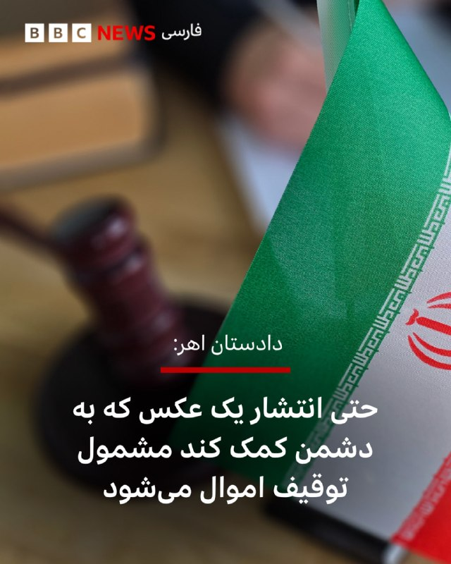

🔻میزان، خبرگزاری قوه قضائیه ایران، یاداشتی از علی فاضلی، دادستان عمومی و انقلاب شهرستان اهر در استان آذربایجان شرقی، منتشر کرد که در آن آمده است بر اساس قانون تشدید مجازات «جاسوسی» برای اسرائیل و «همکاری با کشور‌های معاند، مجازات توقیف اموال، مستقل و کاملا جدا از مجازات حبس یا اعدام اعمال می‌شود.»

در این یادداشت آمده است که «این مجازات شامل کل اموال فرد است و تنها به اموال ناشی از جرم محدود نمی‌شود.»

این قانون انجام هرگونه عملیات به نفع اسرائیل آمریکا یا گروه‌های مخالف «حتی در قالب انتشار یک عکس یا ویدیو که به دشمن در هدف‌گیری کمک کند و ایرانیان مقیم خارج که با دشمن همکاری کنند، حتی بدون حضور فیزیکی در ایران، مشمول توقیف اموال خواهند شد.»

به نوشته آقای فاضلی، «توقیف کل اموال در اینجا یک مجازات اصلی و همراه با اعدام است و هدف از توقیف اموال بر اساس اعلام مقامات قضائی، اموال مصادره شده برای بازسازی خسارات ناشی از جنگ و منفعت عمومی هزینه می‌شود.»

📷Getty Images
@BBCPersian

## BBCPersian — post 282552

  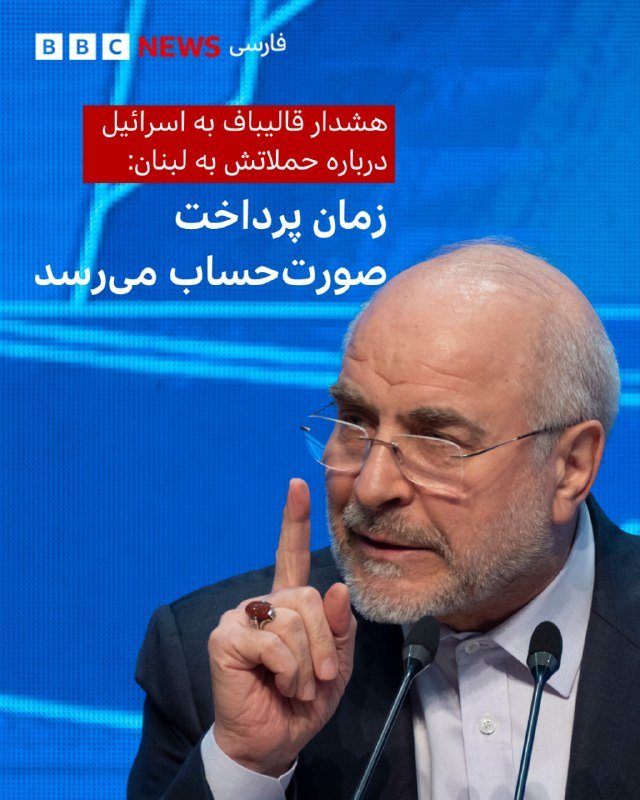

🔻محمدباقر قالیباف، رئیس مجلس شورای اسلامی، به اسرائیل هشدار داده است که هزینه تشدید حملاتش علیه لبنان را خواهد پرداخت.

آقای قالیباف در پیامی در شبکه اجتماعی ایکس به زبان انگلیسی نوشت: «اعمال محاصرهٔ دریایی و تشدید جنایات جنگی در لبنان توسط رژیم نسل‌کش صهیونیستی، شواهد روشن عدم پایبندی آمریکا به آتش بس است.»

او هشدار داد که «هر انتخابی، هزینه‌ای دارد و صورتحساب آن هم از راه می‌رسد؛ همه چیز در نهایت سر جای خودش قرار خواهد گرفت.»

در تازه‌ترین نشانه از تشدید حملات اسرائیل به لبنان، بنیامین نتانیاهو، نخست‌وزیر، به ارتش دستور داده است که اهدافی را در حومه جنوبی بیروت هدف قرار دهد.

پیشتر سخنگوی وزارت خارجه جمهوری اسلامی بار دیگر موضع ایران را تکرار کرد که آتش‌بس در لبنان «بخش لاینفک» هرگونه توافق با آمریکا برای پایان جنگ است.

اسماعیل بقایی تاکید کرد که آمریکا و اسرائیل را نمی‌توان «به‌عنوان دو فاعل مجزا» در نظر گرفت.

📷Getty Images
@BBCPersian

## BBCPersian — post 282551

🔻مسعود پیاهو با انتشار ویدئویی گفت خودش برای اجرای حکم ۱۰ سال زندان معرفی می‌کند. او برای انتشار ویدئویی معترضی که جلوی یگان ویژه نشسته بود بازداشت شد. در ویدیویی که یکشنبه ۱۱ خرداد منتشر شد، آقای پیاهو گفت: «به دستور قوه قضائیه و به احضار اجرای احکام، فردا…

## BBCPersian — post 282550

  <a href="telegram/content/BBCPersian_282550_1780317220.mp4" target="_blank">🎬 Download video</a>

🔻مسعود پیاهو با انتشار ویدئویی گفت خودش برای اجرای حکم ۱۰ سال زندان معرفی می‌کند. او برای انتشار ویدئویی معترضی که جلوی یگان ویژه نشسته بود بازداشت شد.

در ویدیویی که یکشنبه ۱۱ خرداد منتشر شد، آقای پیاهو گفت: «به دستور قوه قضائیه و به احضار اجرای احکام، فردا خودم را برای اجرای حکم ۱۰ سال معرفی می‌کنم.»

آقای پیاهو گفت منکر گرفتن این ویدیو نمی‌شود اما در بازنشر و پخش آن فیلم هیچ دخل و تصرفی نداشته و هرگز قصد نداشته که ویدیو پخش شود.

به گزارش وبسایت امتداد، حسن آقاخانی، وکیل مسعود پیاهو، گفت موکلش در «اعتراضات بازار تهران و پیش از وقایع ۱۸ و ۱۹ دی» بازداشت شده است:

بنابر این گزارش آقای آقاخانی گفت: «موکل من در حال کار در بازاری بودند که به خیابان جمهوری مشرف بوده است. شخصی در مقابل مامورین نیروی انتظامی می‌نشیند و مسعود یک فیلم کوتاه به صورت ناخودآگاه از آن صحنه ضبط می‌کند در حالیکه مطلقا قصد انتشار این فیلم را به صورت عمومی نداشته و اساسا آن فیلم را در استوری خصوصی خود در اینستاگرام منتشر کرده است. شخص دیگری این فیلم را برداشته و منتشر کرده است.»

@BBCPersian

## BBCPersian — post 282548

  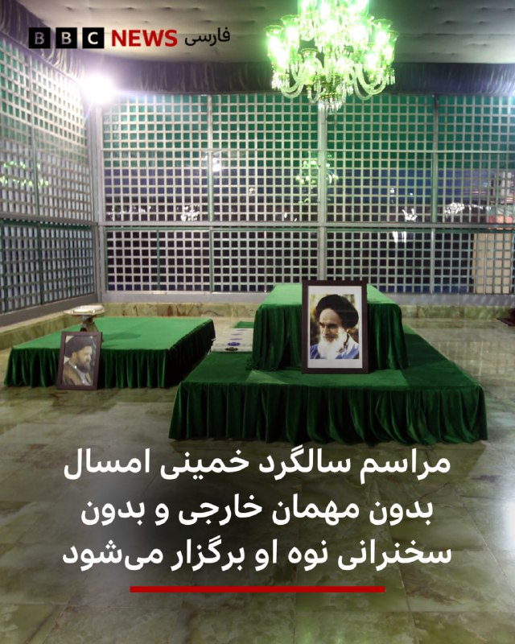

🔻مسئولان برگزاری مراسم سالگرد درگذشت روح‌الله خمینی، می‌گویند در مراسم امسال مهمان خارجی حضور نخواهد داشت و حسن خمینی، نوه بنیان‌گذار جمهوری اسلامی، هم سخنرانی نخواهد کرد.

این مراسم هر سال در ۱۴ خرداد در آرامگاه آیت‌الله خمینی با حضور مقام‌های ارشد سیاسی و نظامی ایران و برخی از سفرای خارجی برگزار می‌شد و طی آن علی خامنه‌ای و حسن خمینی سخنرانی می‌کردند.

محمدعلی انصاری، از برگزارکنندگان این مراسم، گفت که در مراسم امسال پیامی از مجتبی خامنه‌ای قرائت خواهد شد.

او همچنین گفت که امسال «امکان حضور گسترده زائران مانند سال‌های گذشته فراهم نیست» ولی «کاروان‌های استانی... عمدتا از استان‌های همجوار و با برنامه‌ریزی مشخص اعزام خواهند شد.»

📷Getty Images
https://bbc.in/4xgsxFw
@BBCPersian

## BBCPersian — post 282547

🔻هیئت رئیسه: جلسات رسمی مجلس «به‌زودی» برگزار می‌شود

علیرضاسلیمی، عضو هیئت رئیسه مجلس گفت: «فرآیند هماهنگی‌ها و مقدمات لازم طبق نظر شورای عالی امنیت ملی برای برگزاری جلسات علنی مجلس آغاز شده تا جلسات به زودی برگزار شود.»

عباس گودرزی، سخنگوی هیئت رئیسه مجلس، هم امروز گفته بود که «هیئت رئیسه مجلس مخالفتی با برگزاری جلسات ندارد اما این امر مستلزم تایید مراجع امنیتی است.»

آخرین جلسه علنی مجلس شورای اسلامی در محل دائمی، بهمن سال گذشته بود. پس از حمله آمریکا و اسرائیل به ایران در نهم اسفند، جلسات مجلس دیگر در محلش تشکیل نشده است.

به گفته آقای گودرزی در این مدت «چهار جلسه مجازی صحن» و «نزدیک به ۱۵۰ جلسه کمیسیون‌ها» برگزار شده است.

مطابق قوانین ایران جلسات مجلس فقط باید در محل دائمی آن برگزار شود.

https://bbc.in/4xgsxFw
@BBCPersian

## BBCPersian — post 282546

  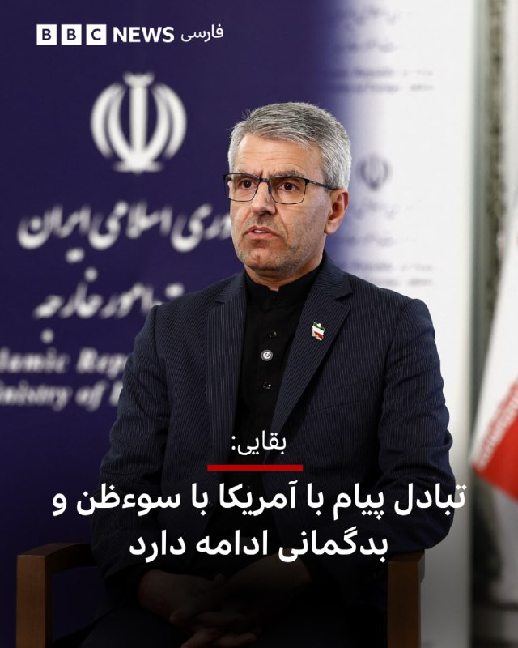

🔻بقایی: تبادل پیام با آمریکا با سوءظن و بدگمانی ادامه دارد

سخنگوی وزارت خارجه جمهوری اسلامی می‌گوید که مذاکره ایران با آمریکا «در دل سوءظن و بدگمانی شدید» شروع شد و اکنون هم تبادل پیام در همین فضا ادامه دارد.

اسماعیل بقایی در کنفرانس خبری تاکید کرد که «مذاکره یا دیپلماسی خود نشانه یا محصول اعتماد بین طرف‌های مذاکره‌کننده نیست.»

آقای بقایی همچنین آمریکا را متهم کرد که با «تغییر مداوم دیدگاه‌های خود» و «پیام‌های رسانه‌ای متفاوت و ضد و نقیض» باعث طولانی شدن روند مذاکره شده است.

آقای بقایی در حالی از ادامه تبادل پیام با واشنگتن سخن گفته است که باوجود آتش‌بس، تبادل آتش پراکنده میان ایران و آمریکا ادامه داشته و در هفته اخیر افزایش هم یافته است.

در تازه‌ترین مورد، سپاه پاسداران اعلام کرد که در پاسخ به حمله آمریکا به «یک دکل مخابراتی در جزیره سیریک» نیروهایش «پایگاه هوایی مبدا» را هدف قرار داده‌اند.

آقای بقایی تاکید کرد که آمریکا و اسرائیل را نمی‌توان «به‌عنوان دو فاعل مجزا» در نظر گرفت.

او یک بار دگیر موضع ایران را تکرار کرد که آتش‌بس در لبنان «بخش لاینفک هرگونه توافق و خاتمه جنگ است.»

@BBCPersian

## BBCPersian — post 282545

🔻صدور دستور قضایی برای توقیف اموال ۷۵ نفر در اراک

خبرگزاری قوه قضاییه ایران، میزان، از صدور حکم قضایی برای توقیف اموال ۷۵ نفر در اراک به اتهام آنچه «عناصر حامی دشمن» خوانده شده، خبر داده است.

میزان، روز یکشنبه به نقل از حجت‌اله درودگر، دادستان عمومی و انقلاب مرکز استان مرکزی، نوشت: «تاکنون ۷۵ پرونده قضایی برای تعدادی از همکاران و مرتبطین مستقیم با شبکه‌های معاند خارج از کشور در دادسرای اراک تشکیل شده است؛ این افراد با اقدامات ضدامنیتی خود، تلاش داشتند تا ضمن همکاری با دشمنان قسم‌خورده ملت، فضای آرام جامعه را ملتهب کنند.»

از زمان آغاز جنگ آمریکا و اسرائیل با ایران، قوه قضاییه این کشور دهها پرونده علیه مخالفان حکومت در داخل و خارج از کشور تشکیل داده و از صدور حکم توقیف و مصادره اموال بسیاری از آنها از جمله چندین چهره سرشناس خبر داده است.

@BBCPersian

## BBCPersian — post 282544

🔻نتانیاهو دستور حمله به اهدافی در جنوب بیروت را صادر کرد

نخست‌وزیر اسرائیل در بیانیه‌ای دستور داد ارتش این کشور اهدافی را در حومه جنوبی پایتخت لبنان، هدف قرار دهد.

منطقه ای که بنیامین نتانیاهو دستور حمله به آن را داده به عنوان پایگاه اصلی حزب‌الله و با نام ضاحیه شناخته می‌شود.

پیشتر گزارش دادیم که رئیس جمهور لبنان حملات اسرائیل به کشورش را محکوم کرده و شورای امنیت سازمان ملل متحد هم امروز جلسه‌ای درباره وضعیت لبنان برگزار خواهد کرد.

@BBCPersian

## idfinfarsi — post 11690

‼️پس از پیشبرد طرح‌های تروریستی علیه نیروهای ارتش اسرائیل: یک تروریست از شاخه نظامی سازمان تروریستی حماس که به‌عنوان پزشک در بیمارستان فعالیت می‌کرد، به هلاکت رسید

⭕️نیروهای ارتش اسرائیل دو روز گذشته (شنبه) به‌صورت هدفمند در مرکز نوار غزه حمله کرده و تروریست جمال ابو عون، فرمانده یک واحد در شاخه نظامی سازمان تروریستی حماس را که به‌طور همزمان به‌عنوان پزشک در بیمارستان یافا در دیرالبلح فعالیت می‌کرد، به هلاکت رساندند.

⭕️وی در چارچوب نقش خود در این سازمان تروریستی، فرماندهی تروریست‌های حماس را بر عهده داشت و به پیشبرد و طراحی طرح‌های تروریستی علیه نیروهای ارتش اسرائیل و کشور اسرائیل می‌پرداخت. در دوره اخیر نیز در پیشبرد تلاش‌های ایجاد توان رزمی، بازسازی و تقویت سازمان تروریستی حماس، برخلاف توافق آتش‌بس، نقش داشته است.

⭕️فعالیت‌های تروریستی این تروریست نمونه‌ای دیگر از استفاده ابزاری و فرصت‌طلبانه سازمان تروریستی حماس از نقش‌های غیرنظامی برای پیشبرد فعالیت‌های تروریستی است.

⭕️پیش از حمله، اقداماتی برای کاهش آسیب به غیرنظامیان انجام شد، از جمله استفاده از مهمات دقیق و رصد ‌های هوایی.

⭕️نیروهای ارتش اسرائیل تحت فرماندهی جنوب مطابق با توافق در منطقه مستقر هستند و به فعالیت برای رفع هرگونه تهدید فوری ادامه خواهند داد.

## Dirty_Kids — post 390732

  

🔴 هر وقت فکر کردین بدشانسین این خبرو بخونین، این مرد بدبخت همزمان با ۴ تا زن ازدواج کرد و بعد از ازدواج متوجه شد همشون ترنس هستن و شومبول دارن!

@Dirty_Kids 👻

## Dirty_Kids — post 390730

🔴 تصاویر اسحاق قالیباف هنگام مصرف مشروبات الکی و رقص تانگو با دختران...

@Dirty_Kids 👻

## Dirty_Kids — post 390729

  <a href="telegram/content/Dirty_Kids_390729_1780317226.mp4" target="_blank">🎬 Download video</a>

🔴 یه افغانی توی خارج کشور داشت پرچم جمهوری اسلامی رو تکون میداد و وقتی دید یکی ازش فیلم میگیره، ذوق کرد.

و اما داستان یه جور دیگه پیش رفت😂

@Dirty_Kids 👻

## Dirty_Kids — post 390728

  <a href="telegram/content/Dirty_Kids_390728_1780317227.mp4" target="_blank">🎬 Download video</a>

محمدسعید ایزدی، مسئول بخش فلسطین نیروی قدس سپاه از ترس اسرائیل این‌قدر در زیرزمین پنهان شد که استخوان‌هایش به قول دخترش به خاطر کمبود ویتامین D ترک خورد.
او در پناهگاه هم در دسترس اسرائیل بود و عاقبت در خانه‌ امنی در قم به همراه نوجوانی ۱۶ ساله کشته شد!

@Dirty_Kids 👻

## Dirty_Kids — post 390727

دوستان
سمت خرید لباس نرید. هرچی دارید، بشورید، اتو کنید، دوباره عاشقش بشید. قیمت‌ها یجوری شده که فروشنده‌ها هم قبل از گفتن قیمت یه «ببخشید» میگن.

@Dirty_Kids 👻

## Dirty_Kids — post 390726

  <a href="telegram/content/Dirty_Kids_390726_1780317229.mp4" target="_blank">🎬 Download video</a>

وقتی که‌ نبودید سپاه این موشک را از داخل تهران شلیک کرد و در داخل تهران هم سقوط کرد و هیچ مقام کسکشی لب از لب باز نکرد و نکته جالب اینکه غیر از اینترنشنال همه رسانه‌ها لال بودند.

@Dirty_Kids 👻

## Dirty_Kids — post 390725

🔤
🔤
🔤
🔤
🔤
🔤
🔤 #میدونستی با انتخاب برد نروژ مقابل سوئد با شش میلیون به راحتی یازده میلیون تومان برنده میشی؟! برای پیش بینی این مسابقه به یک سایت مطمعن نیاز داری که سریع ترین پرداخت ها و بهترین طرح های تشویقی رو داشته باشه
💖
💖 کجا بهتر از وبسایت بین المللی بت فیدو…

## Dirty_Kids — post 390724

  <a href="telegram/content/Dirty_Kids_390724_1780317231.webm" target="_blank">🎬 Download video</a>

🔤
🔤
🔤
🔤
🔤
🔤
🔤

#میدونستی با انتخاب برد نروژ مقابل سوئد با شش میلیون به راحتی یازده میلیون تومان برنده میشی؟!

برای پیش بینی این مسابقه به یک سایت مطمعن نیاز داری که سریع ترین پرداخت ها و بهترین طرح های تشویقی رو داشته باشه
💖
💖

کجا بهتر از وبسایت بین المللی بت فیدو که بدون احراز هویت و مشکلات پرداخت از ایران، به کاربران ایرانی سرویس میده
🥇

همین حالا پیش بینیتو ثبت کن 
👇
https://bet-fido.com 
💖
https://bet-fido.com 
💖
(ورود با وی-پی-ان غیر اروپایی)

📱 کانال تلگرام 
🥅
👇
R11
https://t.me/+dySI_QFj0T0xZGVk

## Dirty_Kids — post 390723

  

🔴 امروز صبح تو دانشکده‌ دندونپزشکی قزوین، یه مرده با کلت کمری وارد دانشگاه شد و همونجا زنش رو کشت و بعدشم به خودش شلیک و خودکشی کرد.../رکنا

@Dirty_Kids 👻

## Dirty_Kids — post 390722

  

🔴 امروز 1 June ، روز لاک زدن به ناخن‌هاست؛

این پست رو به هرکی بفرستی، باید لاکِ امروزش رو بهت نشون بده💅

@Dirty_Kids 👻

## Dirty_Kids — post 390721

  <a href="telegram/content/Dirty_Kids_390721_1780317234.mp4" target="_blank">🎬 Download video</a>

مراد ویسی داشت می‌گفت که اگه نیروهای سرکوبگر اسلحه‌شون رو زمین بذارن یه مادری... (ازشون میگاییم) که خیلی خوب جمعش کرد😂😂😂

@Dirty_Kids 👻

## Dirty_Kids — post 390720

بنظرم این میتونست بهترین تبلیغ یخچال تو تاریخ باشه: 😂😂😂😂

@Dirty_Kids 👻

## Dirty_Kids — post 390719

  

خبر خوب برای کاربران بادبان!

آف #فوری 
⭕️
با کاهش هزینه‌ها، موفق شدیم قیمت تمام محصولات را به هر گیگابایت 15 هزار تومان کاهش دهیم
🚀

⛵️این کاهش قیمت شامل تمامی پلن‌ها، حتی حجم‌های پایین‌تر نیز می‌شود و همچنان کیفیت و پایداری سرویس‌ها حفظ خواهد شد.

از همراهی و اعتماد شما سپاسگزاریم
💜
R11

🛡@BadBan_VPN | کانال 

🤖@BadBan_VPNBot | ربات 

📞@BadBan_VPNSupport | پشتیبانی

## Dirty_Kids — post 390718

  <a href="telegram/content/Dirty_Kids_390718_1780317237.mp4" target="_blank">🎬 Download video</a>

🔴 شخصی که این ویدیو رو ظبط کرده بود توی دادگاه به ۱۰ سال حبس محکوم شد.

@Dirty_Kids 👻

## Dirty_Kids — post 390717

  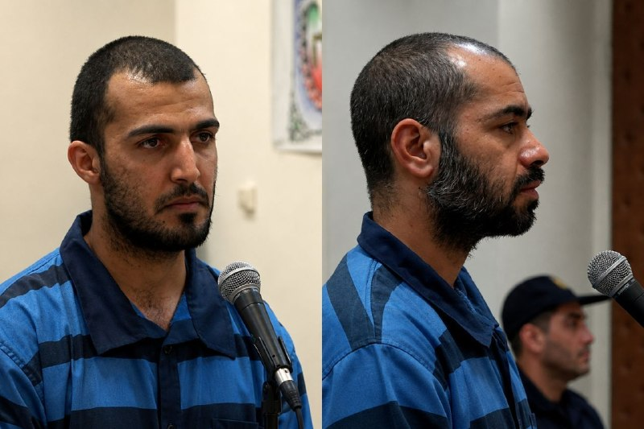

مهرداد محمدی‌نیا و اشکان مالکی، دو معترض بازداشت شده تو اعتراضات ۱۸ و ۱۹ دی، صبح امروز با اتهام «آتش زدن اموال عمومی در جریان اعتراضات» اعدام شدن.

@Dirty_Kids 👻

## Dirty_Kids — post 390716

‏پدسگا قیمت رو تو کپشن بنویسید بابام مجبور نشه «کیوت» رو کامنت کنه.🤬

@Dirty_Kids 👻

## Dirty_Kids — post 390715

  <a href="telegram/content/Dirty_Kids_390715_1780317240.mp4" target="_blank">🎬 Download video</a>

عمو مانوک خدابخشیان:

ترامپ آرزو داشت تیم فوتبال داشته باشه ولی روش کارش بیسبالی هست

@Dirty_Kids 👻

## Dirty_Kids — post 390714

سپاه هر روز میگه اسراییل لبنان رو زد و آتش‌بس رو نقض کرده. خب اوکی میخوای چه گوهی بخوری الان مثلا؟

@Dirty_Kids 👻

## Dirty_Kids — post 390713

  <a href="telegram/content/Dirty_Kids_390713_1780317243.mp4" target="_blank">🎬 Download video</a>

این الان باید من و تو میبودیم:)))

وسط کنسرت دیشب کانیه وست از دوست دخترش خواستگاری میکنه

@Dirty_Kids 👻

## Hranews — post 113303

رشت؛ حکم اعدام در ملا عام متهم به قتل یک کودک اجرا شد

❗️
❗️
❗️
❗️
❗️– امروز دوشنبه ۱۱ خردادماه، حکم یک زندانی که پیشتر از بابت اتهام تعرض و قتل یک کودک به نام ایلیا زادحسین به #اعدام محکوم شده بود، در شهرستان رشت در ملاء عام به اجرا درآمد.

ادامه مطلب

#ایلیا_زادحسین

↘️
@hranews_bot تماس ✉️ -  @Hranews  کانال هرانا 🆑

## Hranews — post 113302

  

یاشار دارالشفا بازداشت شد

❗️
❗️
❗️
❗️
❗️– یاشار دارالشفا، زندانی سیاسی پیشین که ساکن تهران است، امروز توسط نیروهای امنیتی در منزل خود #بازداشت و به مکان نامعلومی منتقل شد.

به گزارش خبرگزاری هرانا، ارگان خبری مجموعه فعالان حقوق بشر در ایران، یاشار دارالشفا بازداشت شد.

براساس اطلاعات دریافتی هرانا، صبح امروز دوشنبه ۱۱ خرداد ۱۴۰۵، نیروهای امنیتی با مراجعه به منزل خانوادگی این شهروند، بدون ارائه حکم قضایی او را بازداشت کردند. ماموران همچنین منزل وی را نیز تفتیش کردند.

ادامه مطلب

#یاشار_دارالشفا

↘️
@hranews_bot تماس ✉️ -  @Hranews  کانال هرانا 🆑

## Hranews — post 113301

اعتراضات در دانشگاه‌ها؛ دستکم ۱۰ دانشجوی دانشگاه تهران به کمیته انضباطی احضار شدند

❗️
❗️
❗️
❗️
❗️– طی روزهای اخیر، دستکم ۱۰ دانشجوی #دانشگاه_تهران در ارتباط با تجمعات دانشجویی پس از اعتراضات سراسری دی‌ماه، به کمیته انضباطی این دانشگاه احضار شدند.

ادامه مطلب

↘️
@hranews_bot تماس ✉️ -  @Hranews  کانال هرانا 🆑

## Hranews — post 113300

قروه؛ ۲ متهم در پرونده تعرض گروهی به یک نوجوان اعدام شدند

❗️
❗️
❗️
❗️
❗️– صبح امروز، حکم اعدام دو تن از متهمان پرونده تجاوز گروهی به یک پسر ۱۴ ساله اهل قروه که منجر به خودکشی او شد، در این شهرستان به اجرا در آمد.

ادامه مطلب

↘️
@hranews_bot تماس ✉️ -  @Hranews  کانال هرانا 🆑

## Hranews — post 113299

گزارشی از اجرای حکم اعدام یک زندانی در زندان جیرفت

❗️
❗️
❗️
❗️
❗️– سحرگاه روز سه‌شنبه ۵ خردادماه، حکم یک زندانی که پیشتر از بابت اتهام قتل به #اعدام محکوم شده بود، در زندان جیرفت اجرا شد.

ادامه مطلب

#سبحان_عباسی
↘️
@hranews_bot تماس ✉️ -  @Hranews  کانال هرانا 🆑

## Hranews — post 113298

سمنان؛ اموال ۱۸ شهروند دیگر ساکن خارج از کشور توقیف شد

❗️
❗️
❗️
❗️
❗️– اموال و دارایی‌های ۱۸ شهروند ساکن خارج از کشور در استان سمنان توقیف شد. دستگاه قضایی این افراد را به «همکاری با دشمن» متهم کرده است.

ادامه مطلب

↘️
@hranews_bot تماس ✉️ -  @Hranews  کانال هرانا 🆑

## Hranews — post 113297

  

روز یکشنبه ۱۰ خرداد‌ماه، شماری از اساتید اخراجی دانشگاه فرهنگیان در مقابل ساختمان وزارت آموزش و پرورش در تهران، دست به #تجمع_اعتراضی زدند.

لغو احکام بازنشستگی اجباری اعضای هیئت علمی دانشگاه فرهنگیان براساس مصوبه سال ۱۳۹۶ هیات امنای دانشگاه از جمله دلایل اعتراض این اساتید است.

↘️
@hranews_bot تماس ✉️ - @Hranews کانال هرانا 🆑

## Hranews — post 113296

  

اعتراضات دی‌ماه ۱۴۰۴؛ مهرداد محمدی‌نیا و اشکان مالکی اعدام شدند

❗️
❗️
❗️
❗️
❗️– مرکز رسانه قوه قضاییه اعلام کرد مهرداد محمدی‌نیا و اشکان مالکی، از بازداشت‌شدگان اعتراضات دی‌ماه ۱۴۰۴ تهران، سحرگاه امروز #اعدام شدند. دستگاه قضایی این دو نفر را از بابت اتهاماتی از جمله «مشارکت در اقدامات عملیاتی برخلاف امنیت کشور» و «همکاری با دولت‌های متخاصم» به مجازات مرگ محکوم کرده بود.

ادامه مطلب

#مهرداد_محمدی‌نیا
#اشکان_مالکی

↘️
@hranews_bot تماس ✉️ -  @Hranews  کانال هرانا 🆑

## manototv — post 105890

  <a href="telegram/content/manototv_105890_1780317249.mp4" target="_blank">🎬 Download video</a>

حمله گزارش‌شده آمریکا به اهدافی در جنوب ایران، از نظر دامنه محدود بود، اما از نظر پیام نظامی اهمیت داشت. بر اساس روایت آمریکا، این حمله پس از سرنگونی یک پهپاد آمریکایی بر فراز آب‌های بین‌المللی انجام شد و سایت‌های راداری و مراکز فرماندهی و کنترل پهپادی جمهوری اسلامی در سیریک و جزیره قشم را هدف قرار داد.

## alonews — post 124182

  <a href="telegram/content/alonews_124182_1780317250.webm" target="_blank">🎬 Download video</a>

👈عربستان سعودی حمله ایران به کویت را محکوم کرد

✅ @AloNews خبر جنگ

## alonews — post 124181

  <a href="telegram/content/alonews_124181_1780317251.webm" target="_blank">🎬 Download video</a>

👈سنتکام: دیشب،نیروهای آمریکایی موفق شدن دو موشک بالستیک ایران رو که هدفش نیروهای آمریکا تو کویت بود،رهگیری و منهدم کنن
- این موشک‌ها همون لحظه خنثی شدن و هیچ آسیبی به نیروهای آمریکایی نرسید
- فرماندهی مرکزی آمریکا (سنتکام) همچنان در حالت آماده‌باشه

✅ @AloNews خبر جنگ

## alonews — post 124180

  <a href="telegram/content/alonews_124180_1780317251.webm" target="_blank">🎬 Download video</a>

👈ارتش اسرائیل دستور تخلیه بخش‌هایی از بیروت را با هماهنگی ایالات متحده صادر خواهد کرد.

✅ @AloNews خبر جنگ

## alonews — post 124178

  <a href="telegram/content/alonews_124178_1780317251.webm" target="_blank">🎬 Download video</a>

👈بانک مرکزی:
نرخ تورم اردیبهشت ماه ۵۳.۹ درصد شد

✅ @AloNews خبر جنگ

## alonews — post 124177

  <a href="telegram/content/alonews_124177_1780317251.webm" target="_blank">🎬 Download video</a>

👈نتانیاهو: ارتش اسرائیل فعالیت‌های خودش در جنوب لبنان رو گسترش خواهد داد؛ حزب‌الله در حال فراره و ما مصممیم امنیت رو به ساکنان شمال بازگردانیم.

✅ @AloNews خبر جنگ

## alonews — post 124176

## alonews — post 124175

## alonews — post 124174

  <a href="telegram/content/alonews_124174_1780317252.mp4" target="_blank">🎬 Download video</a>

👈در روزهای پایانی جنگ، آشیانه‌های هوایی پایگاه هوایی الصفران امارات حداقل دو بار مورد اصابت موشک‌ها و پهپادهای ایرانی قرار گرفت: یک بار در اواخر مارس و بار دیگر پیش از ۵ آوریل.

🔴این پایگاه میزبان جنگنده‌های میراژ ۲۰۰۰ و پهپادهای تهاجمی وینگ لونگ متعلق به نیروی هوایی امارات است که گفته می‌شود هر دو در عملیات‌های تهاجمی امارات علیه ایران نقش داشته‌اند.

✅ @AloNews خبر جنگ

## alonews — post 124173

  <a href="telegram/content/alonews_124173_1780317253.webm" target="_blank">🎬 Download video</a>

👈حسن خمینی امسال به مناسبت سالگرد روح الله خمینی سخنرانی نخواهد کرد

✅ @AloNews خبر جنگ

## alonews — post 124172

  <a href="telegram/content/alonews_124172_1780317253.webm" target="_blank">🎬 Download video</a>

👈علی قلهکی:
عملیاتِ نظامیِ سنگینی که اسرائیل در جنوبِ لبنان انجام می‌دهد، آخرین تحرکاتِ پیش از «تفاهم» نیست، بلکه پیش‌زمینه‌ی اقدام نظامی دیگری‌ست!

✅ @AloNews خبر جنگ

## alonews — post 124171

  <a href="telegram/content/alonews_124171_1780317254.webm" target="_blank">🎬 Download video</a>

⭕️ الونیوز فقط در تلگرام و توییتر (X) فعال هستش 
🔴سایر شبکه های اجتماعی چه داخلی چه خارجی که با نام الونیوز فعالیت می‌کنند مرتبط به ما نیست و پیشنهاد میکنم که لفت بدید. 
✅@AloNews

## alonews — post 124170

  <a href="telegram/content/alonews_124170_1780317254.mp4" target="_blank">🎬 Download video</a>

👈حزب‌الله فیلمی منتشر کرده که نشان می‌دهد یک پهپاد FPV به یک باتری گنبد آهنین در سایت جال العال اسرائیل در شمال این کشور در تاریخ ۲۷ مه حمله کرده است

✅ @AloNews خبر جنگ

## alonews — post 124169

  <a href="telegram/content/alonews_124169_1780317257.mp4" target="_blank">🎬 Download video</a>

👈پنج کارگر در انفجاری در یک تأسیسات سوخت موشک که توسط شرکت هانوها ایرواسپیس در دائه‌جون، کره جنوبی اداره می‌شود، کشته شدند و دو نفر دیگر زخمی شدند.

🔴این انفجار در خط تولید سوخت موشک جامد رخ داد، در حالی که مقامات معتقدند این حادثه در حین کارهای نظافت یا تعمیر و نگهداری اتفاق افتاده است.

✅ @AloNews خبر جنگ

## alonews — post 124168

  <a href="telegram/content/alonews_124168_1780317259.webm" target="_blank">🎬 Download video</a>

👈مرندی، عضو تیم مذاکره کننده: خیلی مهم. صبر ایران دارد تمام می‌شود

✅ @AloNews خبر جنگ

## alonews — post 124167

  <a href="telegram/content/alonews_124167_1780317259.webm" target="_blank">🎬 Download video</a>

👈احتمال شکست آتش بس در ساعات آتی بالاست

✅ @AloNews خبر جنگ

## alonews — post 124164

  <a href="telegram/content/alonews_124164_1780317260.webm" target="_blank">🎬 Download video</a>

👈جنگنده‌های اسرائیلی حملات هوایی به تول، ملیخ و شوکین در جنوب لبنان انجام داده‌اند

✅ @AloNews خبر جنگ

## alonews — post 124161

  <a href="telegram/content/alonews_124161_1780317260.webm" target="_blank">🎬 Download video</a>

👈صحنه‌هایی از الحوش، منطقه صور، جنوب لبنان، پس از حملات هوایی شدید اسرائیل

✅ @AloNews خبر جنگ

<!-- MSG END -->

<!-- NAV START -->

<a href="https://github.com/shahinsa98/aio-downloader/blob/main/telegram/content/archive_1.md" style="display:inline-block; padding:6px 12px; margin:0 4px; background-color:#2ea44f; color:white; text-decoration:none; border-radius:4px; font-weight:bold;">صفحه بعد</a>

<!-- NAV END -->
