# خواننده تلگرام

<!-- TOP_NAV START -->

<a href="https://github.com/shahinsa98/aio-downloader/blob/main/telegram/content/archive_1.md" style="display:inline-block; padding:6px 12px; margin:0 4px; background-color:#2ea44f; color:white; text-decoration:none; border-radius:4px; font-weight:bold;">صفحه بعد</a>

<!-- TOP_NAV END -->

<!-- MSG START -->

---
📅 بروزرسانی: 1405/02/28 20:50
---

## VahidOOnLine — post 240832

  

♦️اسکات بسنت، وزیر خزانه‌داری آمریکا، روز دوشنبه ۲۸ اردیبهشت ماه اعلام کرد واشنگتن یک مجوز عمومی موقت سی روزه صادر کرده است تا آسیب‌پذیرترین کشورها بتوانند به‌طور موقت به نفت روسیه که در دریا سرگردان مانده، دسترسی پیدا کنند.
بسنت در پیامی در شبکه اجتماعی ایکس نوشت این تمدید، انعطاف بیشتری فراهم می‌کند و آمریکا با این کشورها برای ارائه مجوزهای اختصاصی در صورت نیاز همکاری خواهد کرد. او افزود این مجوز عمومی به تثبیت بازار فیزیکی نفت خام کمک می‌کند و باعث می‌شود نفت به کشورهایی برسد که بیشترین آسیب‌پذیری را در حوزه انرژی دارند.
ایالات متحده پیشتر در پی افزایش بهای نفت در اثر جنگ در خلیج فارس، تحریم نفت رسیه را برای سی روز لغو کرده بود. این معافیت یک‌ماهه پیش از این با هدف جبران کمبود عرضه نفت و کنترل قیمت‌های جهانی پس از انسداد تنگه هرمز توسط جمهوری اسلامی، به کشورهایی مانند هند اعطا شده بود.
‌🇸🇦 Indypersian

🤖 @VahidOOnLine

## VahidOOnLine — post 240831

  

♦️خبرنگار شبکه سی‌ان‌بی‌سی روز دوشنبه ۲۸ اردیبهشت‌ماه در شبکه اجتماعی اکس به نقل از یک مقام آمریکایی گزارش داد ادعای رسانه‌های حکومتی جمهوری اسلامی مبنی بر موافقت واشنگتن با لغو تحریم‌های نفتی تهران در جریان مذاکرات، نادرست است.

این در حالی است که پیش‌تر رسانه‌های حکومتی جمهوری اسلامی از موافقت ایالات متحده برای لغو برخی تحریم‌های نفتی علیه ایران در طول مذاکرات خبر داده بودند. همزمان آکسیوس به نقل از یک مقام آمریکایی نوشت: «هیچ کاهش تحریمی بدون اقدام متقابل ایران رایگان اتفاق نخواهد افتاد.»

رسانه آکسیوس عصر دوشنبه گزارش داده بود کاخ سفید پیشنهاد جدید تهران را برای دستیابی به توافق کافی نمی‌داند و معتقد است پیشرفت قابل‌توجهی در مذاکرات حاصل نشده است.
‌🇸🇦 Indypersian

🤖 @VahidOOnLine

## VahidOOnLine — post 240830

  <a href="telegram/content/VahidOOnLine_240830_1779124844.mp4" target="_blank">🎬 Download video</a>

مستند «تمرین‌هایی برای یک انقلاب» ساخته پگاه آهنگرانی، در حاشیه جشنواره فیلم کن، جایزه ویژه هیئت داوران رویداد مستند «گلدن گلوبز» را با همکاری بنیاد «آرتمیس رایزینگ» دریافت کرد؛ رویدادی که با همکاری بخش «کن داکس»، مجله ورایتی و بازار فیلم کن برگزار می‌شود.
این برنامه به مستندهای اجتماعی و سیاسی اختصاص دارد و برگزارکنندگان آن می‌گویند هدفش حمایت از فیلم‌سازی مستند، به‌عنوان ابزاری برای شکل دادن به روایت‌ها و گفت‌وگوهای جهانی، است.
‌🏁 🇬🇧 IranintlTV

🤖 @VahidOOnLine

## VahidOOnLine — post 240829

  

اسکات بسنت، وزیر خزانه‌داری ایالات متحده، دوشنبه گفت که آمریکا در حال صدور یک مجوز عمومی ۳۰ روزه برای فراهم کردن دسترسی موقت به آن بخش از نفت روسیه‌ است که در دریا سرگردان مانده است.

بسنت در شبکه ایکس نوشت: «این تمدید، انعطاف‌پذیری بیشتری فراهم خواهد کرد و ما با این کشورها همکاری خواهیم کرد تا در صورت نیاز، مجوزهای مشخص صادر کنیم.»

او افزود: «این مجوز عمومی به ثبات بازار فیزیکی نفت خام کمک خواهد کرد و اطمینان می‌دهد که نفت به آسیب‌پذیرترین کشورهای از نظر انرژی برسد.»
‌🏁 🇬🇧 IranintlTV

🤖 @VahidOOnLine

## VahidOOnLine — post 240828

  <a href="telegram/content/VahidOOnLine_240828_1779124847.mp4" target="_blank">🎬 Download video</a>

‌
نهاد« مدیریت آبراه خلیج فارس» با راه‌اندازی حساب کاربری در شبکه ایکس اعلام کرد عبور کشتی‌ها از تنگه هرمز بدون دریافت مجوز از این نهاد «غیرقانونی» خواهد بود.

این نهاد که با نام PGSA معرفی شده، در بیانیه‌ای نوشت تردد در محدوده‌های تعیین‌شده در تنگه هرمز باید با هماهنگی کامل با نیروهای مسلح و مقام‌های جمهوری اسلامی انجام شود.

در این بیانیه آمده است: «عبور بدون مجوز، غیرقانونی تلقی خواهد شد.»
‌🏁 🇬🇧 ManotoTV

🤖 @VahidOOnLine

## VahidOOnLine — post 240827

  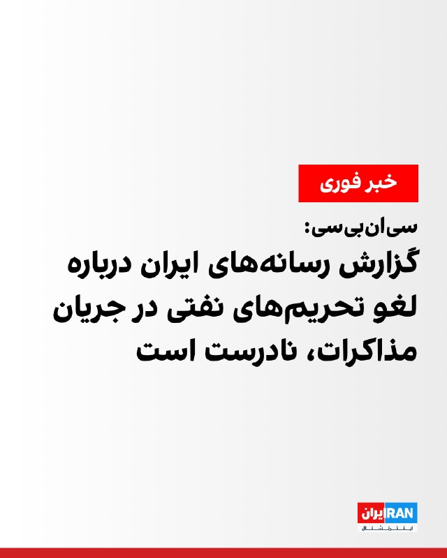

خبرنگار سی‌ان‌بی‌سی، به نقل از یک مقام آمریکایی در شبکه ایکس نوشت گزارش رسانه‌های ایران مبنی بر این‌که آمریکا در حالی که مذاکرات ادامه دارد با لغو تحریم‌های نفتی موافقت کرده، نادرست است.

پیش‌تر خبرگزاری تسنیم وابسته به سپاه پاسداران، به نقل از یک منبع ناشناس نزدیک به تیم مذاکره‌کننده جمهوری اسلامی گزارش داد که آمریکا با تعلیق تحریم‌های صادرات نفت ایران در طول مذاکرات موافقت کرده است.

این منبع آگاه گفت: «آمریکایی‌ها برخلاف متون پیشین خود، در متن جدید پذیرفته‌اند که در طول دوره مذاکره، تحریم‌های نفتی ایران را ویو (Waive) کنند.»

این خبرگزاری افزود: «"ویو کردن" تحریم‌ها به معنای معافیت یا اسقاط موقت تحریم‌هاست.»
‌🏁 🇬🇧 IranintlTV

🤖 @VahidOOnLine

## VahidOOnLine — post 240826

  

♦️دونالد ترامپ، رئیس‌جمهوری آمریکا، روز دوشنبه ۲۸ اردیبهشت‌ماه، در گفتگو با شبکه العربیه گفت ایالات متحده در حال انجام «کاری بزرگ» است و افزود که «پیروزی در راه است.»

ترامپ جزئیات بیشتری درباره منظور خود ارائه نکرد، اما این اظهارات در حالی مطرح می‌شود که تنش‌ها میان آمریکا و جمهوری اسلامی و مذاکرات مربوط به جنگ و تنگه هرمز ادامه دارد.
‌🇸🇦 Indypersian

🤖 @VahidOOnLine

## VahidOOnLine — post 240825

  

دونالد ترامپ به العربیه گفت: «ما در حال انجام کاری بزرگ هستیم و پیروزی در راه است.»

او پیش‌تر در تروث سوشال نوشت حتی اگر جمهوری اسلامی کاملا تسلیم شود و شکست خود را بپذیرد، رسانه‌هایی مانند نیویورک تایمز، وال‌استریت ژورنال و سی‌ان‌ان آن را پیروزی تهران جلوه خواهند داد.
او افزود رسانه‌های جعلی و دموکرات‌ها «کاملا راه خود را گم کرده‌اند و دیوانه شده‌اند.»

‌🏁 🇬🇧 IranintlTV

🤖 @VahidOOnLine

## VahidOOnLine — post 240824

  

سازمان عملیات تجارت دریایی بریتانیا اعلام کرد که در روزهای ۲۶ و ۲۷ اردیبهشت هیچ حادثه‌ای در خلیج فارس و دریای عمان گزارش نشده است.

با این حال، وضعیت امنیتی منطقه همچنان ناپایدار است و تهدید علیه کشتیرانی تجاری ادامه دارد.
‌🏁 🇬🇧 IranintlTV

🤖 @VahidOOnLine

## VahidOOnLine — post 240823

  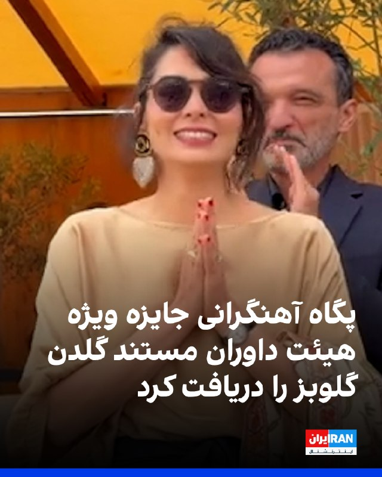

مستند «تمرین‌هایی برای یک انقلاب» ساخته پگاه آهنگرانی در حاشیه جشنواره فیلم کن، جایزه ویژه هیئت داوران رویداد مستند «گلدن گلوبز» با همکاری بنیاد «آرتمیس رایزینگ» را دریافت کرد؛ رویدادی که با همکاری بخش «کن داکس»، مجله ورایتی و بازار فیلم کن برگزار می‌شود.

این برنامه به مستندهای اجتماعی و سیاسی اختصاص دارد و برگزارکنندگان آن می‌گویند هدفش حمایت از فیلمسازی مستند به‌عنوان ابزاری برای شکل دادن به روایت‌ها و گفت‌وگوهای جهانی است.
‌🏁 🇬🇧 IranintlTV

🤖 @VahidOOnLine

## VahidOOnLine — post 240822

  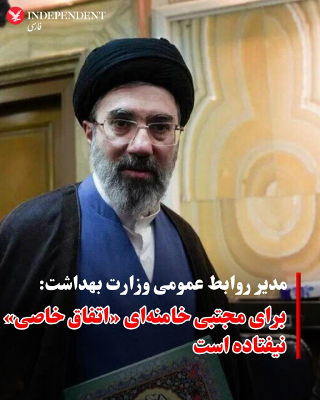

♦️حسین کرمان‌پور، مدیر مرکز روابط عمومی و اطلاع‌رسانی وزارت بهداشت، روز دوشنبه در یک گردهمایی دولتی اعلام کرد در جریان بمباران پاستور در روز دهم اسفند ماه، « اتفاق خاصی» برای مجتبی خامنه‌ای نیفتاده و او «جانباز یا قطع عضو» نشده است.
کرمان‌پور گفت: «دوستان شنیده‌اند و بارها نیز گفته‌ایم. اقدامات لازم انجام شد. خوشبختانه اتفاق خاصی برای رهبر انقلاب نیفتاده بود. فردی که در محل چنین حادثه‌ای باشد، طبیعتا چندین زخم بر روی بدن خود خواهد داشت.
این مقام وزارت بهداشت بدون اشاره به اخبار مبنی بر سوختی و قطع عضو رهبر جدید جمهوری اسلامی ادامه داد: «این زخم‌ها نیز زخم‌هایی نبود که بخواهد چهره رهبر انقلاب را مخدوش کند یا اینکه همانند امام شهید ما جانبازی بگیرند یا قطع عضو داشته باشند.»

کرمان‌پور در ادامه ادعاهای خود گفت: «چند تا بخیه در محل جراحات زده شد. بخشی که همانجا تصمیم گرفته شد که بخیه زده شود روی پای ایشان بود.»

پیشتر، روزنامه نیویورک تایمز با استناد به گزارش تحقیقی فرناز فصیحی اعلام کرده بود، مجتبی خامنه‌ای در پی آسیب‌دیدگی جدی از ناحیه پا در انتظار دریافت پای مصنوعی است و به دلیل سوختگی‌های شدید، در تکلم نیز با دشواری جدی روبه‌روست؛ وضعیتی که باعث شده او عملا در مخفی‌گاه و به دور از دید عموم، تنها از طریق پیام‌های کتبی با دنیای بیرون در ارتباط باشد.
‌🇸🇦 Indypersian

🤖 @VahidOOnLine

## VahidOOnLine — post 240821

  

اکسیوس به نقل از یک مقام ارشد آمریکایی و یک منبع مطلع گزارش داد تهران پیشنهاد تازه‌ای برای توافق به‌منظور پایان جنگ ارائه کرده، اما کاخ سفید این پیشنهاد را پیشرفت معناداری نمی‌داند و آن را برای دستیابی به توافق کافی ارزیابی نکرده است.

به گفته مقام‌های آمریکایی، دونالد ترامپ همچنان خواهان توافق برای پایان جنگ است، اما به‌دلیل رد بسیاری از خواسته‌های واشینگتن از سوی تهران و خودداری جمهوری اسلامی از ارائه امتیازهای قابل‌توجه در برنامه هسته‌ای، گزینه ازسرگیری حملات نظامی را نیز بررسی می‌کند.
‌🏁 🇬🇧 IranintlTV

🤖 @VahidOOnLine

## VahidOOnLine — post 240820

  

♦️رسانه آکسیوس به نقل از یک مقام آمریکایی گزارش کرد، اگر تهران مواضع خود را در مذاکرات تغییر ندهد، واشنگتن ناچار خواهد شد گفتگوها را «از طریق بمب‌ها» ادامه دهد.

آکسیوس به نقل از این مقام کاخ سفید که نامش فاش نشده نوشت زمان آن رسیده که طرف ایرانی چیزی فراتر از امتیازهای نمادین روی میز بگذارند: «ما به گفتگویی واقعی، جدی و جزئی‌نگر درباره برنامه هسته‌ای نیاز داریم. اگر چنین چیزی اتفاق نیفتد، گفتگو از طریق بمب‌ها انجام خواهد شد و این تأسف‌بار خواهد بود.»

مقام آمریکایی به آکسیوس گفت، ارائه پیشنهاد متقابل تازه از سوی ایران، با وجود تغییرات محدود در آن، نشان می‌دهد تهران نسبت به احتمال اقدام نظامی بیشتر از سوی آمریکا نگران است. او گفت فشار اکنون بر ایران است تا پاسخی ارائه دهد که بتواند مسیر مذاکرات را تغییر دهد.

به گفته این مقام آمریکایی، ارائه پیشنهاد متقابل تازه از سوی ایران، با وجود تغییرات محدود، نشان می‌دهد تهران نسبت به احتمال اقدامات نظامی بیشتر از سوی آمریکا نگران است.
‌🇸🇦 Indypersian

🤖 @VahidOOnLine

## VahidOOnLine — post 240819

  <a href="telegram/content/VahidOOnLine_240819_1779124852.mp4" target="_blank">🎬 Download video</a>

♦️محسن نقوی، وزیر کشور پاکستان، عصر دوشنبه ۲۸ اردیبهشت‌ماه در تهران با عباس عراقچی، وزیر خارجه جمهوری اسلامی، دیدار و گفتگو کرد.

بر اساس گزارش رسمی رسانه‌های ایران، دو طرف درباره روابط دوجانبه، تحولات منطقه‌ای و گسترش همکاری‌های مرزی گفتگو کردند. همچنین اسکندر مومنی، وزیر کشور جمهوری اسلامی و محسن نقوی بر تقویت روابط دو کشور و توسعه مبادلات مرزی تاکید کردند.

در این دیدار درباره اوضاع منطقه نیز بحث و تبادل نظر شد. این دومین دیدار مقام‌های ارشد دو کشور در دو روز گذشته است.

وزیر کشور پاکستان در سفر خود به تهران با مسعود پزشکیان، رئیس‌جمهوری اسلامی ایران، و محمدباقر قالیباف، رئیس مجلس شورای اسلامی نیز دیدار کرده است.
‌🇸🇦 Indypersian

🤖 @VahidOOnLine

## VahidOOnLine — post 240818

  

♦️ رسانه آکسیوس، روز دوشنبه ۲۸ اردیبهشت ماه، به نقل از یک مقام ارشد آمریکایی و یک منبع آگاه گزارش داد واشنگتن پیشنهاد به‌روز شده‌ تهران برای توافق پایان جنگ را دریافت کرده است، اما کاخ سفید معتقد است این پیشنهاد، «پیشرفت معناداری نیست و برای یک توافق کافی نیست».
بر اساس این گزارش، نسخه جدید شامل توضیحات بیشتری درباره تعهد ایران به دنبال نکردن سلاح هسته‌ای است، اما همچنان فاقد تعهدات مشخص درباره توقف غنی‌سازی اورانیوم یا واگذاری ذخایر کنونی اورانیوم با غنای بالا است: «این پیشنهاد جدید شامل کلمات بیشتری در مورد تعهد ایران به عدم پیگیری سلاح هسته‌ای است، اما هیچ تعهد دقیقی در مورد تعلیق غنی‌سازی اورانیوم یا تحویل ذخایر موجود اورانیوم با غنای بالا ارائه نمی‌دهد.»
در حالی که رسانه‌های حکومتی جمهوری اسلامی از موافقت ایالات متحده برای لغو برخی تحریم‌های نفتی علیه ایران در طول مذاکرات گزارش داده‌اند، آکسیوس به نقل از مقام آمریکایی نوشت: «هیچ کاهش تحریمی بدون اقدام متقابل ایران «رایگان» اتفاق نخواهد افتاد.»
آکسیوس همچنین نوشت کاخ سفید این پیشنهاد را برای دستیابی به توافق کافی نمی‌داند و معتقد است پیشرفت قابل‌توجهی در مذاکرات حاصل نشده است.
‌🇸🇦 Indypersian

🤖 @VahidOOnLine

## VahidOOnLine — post 240817

  <a href="telegram/content/VahidOOnLine_240817_1779124853.mp4" target="_blank">🎬 Download video</a>

تماسی از ایران:
«خانواده‌های بچه‌های دربند رو برای کمک‌رساندن دریابیم»
‌🏁 🇬🇧 ManotoTV

🤖 @VahidOOnLine

## VahidOOnLine — post 240816

  <a href="telegram/content/VahidOOnLine_240816_1779124855.mp4" target="_blank">🎬 Download video</a>

عفو بین‌الملل اعلام کرد شمار اعدام‌ها در جهان در سال ۲۰۲۵ به بالاترین سطح ثبت‌شده در ۴۴ سال گذشته رسیده و ایران با ثبت دست‌کم ۲۱۵۹ اعدام، عامل اصلی این افزایش بوده است.

بر اساس گزارش سالانه این سازمان، در مجموع دست‌کم ۲۷۰۷ نفر در ۱۷ کشور اعدام شده‌اند؛ آماری که نسبت به سال ۲۰۲۴ حدود ۷۸ درصد افزایش نشان می‌دهد.

عفو بین‌الملل اعلام کرد شمار اعدام‌ها در ایران بیش از دو برابر سال گذشته شده و ایران پس از چین، که آمار رسمی اعدام‌هایش منتشر نمی‌شود، در صدر کشورهای مجری اعدام قرار دارد.

در این گزارش آمده است عربستان سعودی با دست‌کم ۳۵۶ اعدام در رتبه بعدی قرار گرفته و بخش قابل توجهی از این احکام به جرایم مرتبط با مواد مخدر مربوط بوده است.

بر اساس این گزارش، آمریکا نیز شمار اعدام‌های خود را از ۲۵ مورد در سال ۲۰۲۴ به ۴۷ مورد در سال ۲۰۲۵ افزایش داده است. شمار اعدام‌ها در مصر، سنگاپور و کویت نیز نسبت به سال قبل افزایش یافته است.

عفو بین‌الملل همچنین اعلام کرد چین، مصر، جمهوری اسلامی، عراق، کره شمالی، عربستان سعودی، سومالی، آمریکا، ویتنام و یمن در پنج سال گذشته به‌طور مداوم اعدام انجام داده‌اند.
‌🏁 🇬🇧 ManotoTV

🤖 @VahidOOnLine

## VahidOOnLine — post 240815

  

مدیر مرکز روابط عمومی و اطلاع‌رسانی وزارت بهداشت درباره وضعیت مجتبی خامنه‌ای گفت: «اتفاق خاصی برای او رخ نداده بود و صرفا چند زخم برداشته بودند.»
این مقام وزارت بهداشت تاکید کرد: «زخم‌ها از نوعی نبودند که چهره ایشان را مخدوش کنند» و اضافه کرد مجتبی خامنه‌ای جانباز نشده و قطع عضو نداشته و تنها در محل جراحت روی پای او چند بخیه زده شده است.
‌🏁 🇬🇧 IranintlTV

🤖 @VahidOOnLine

## VahidOOnLine — post 240814

  

دونالد ترامپ، رییس‌جمهور آمریکا در پستی در شبکه اجتماعی تروث سوشال از برخی رسانه‌ها و دموکرات‌ها در زمینه جنگ علیه جمهوری اسلامی انتقاد کرد.

او نوشت: «اگر ایران تسلیم شود، اعتراف کند که نیروی دریایی‌اش نابود شده و در کف دریا آرام گرفته است، و نیروی هوایی‌اش دیگر در میان ما نیست، و اگر کل ارتش آن‌ها در حالی که سلاح‌ها را زمین گذاشته و دست‌ها را بالا برده‌اند از تهران خارج شوند و هر کدام با فریاد "من تسلیم می‌شوم، من تسلیم می‌شوم" پرچم سفید تسلیم را به شدت تکان دهند، و اگر تمام رهبری باقی‌مانده آن‌ها همه «اسناد تسلیم» لازم را امضا کنند و شکست خود را در برابر قدرت و نیروی عظیم ایالات متحده باشکوه بپذیرند، آن‌وقت روزنامه شکست‌خورده نیویورک تایمز، چاینا استریت ژورنال (همان وال‌استریت ژورنال!)، سی‌ان‌انِ فاسد و اکنون بی‌اهمیت، و همه اعضای دیگر رسانه‌های اخبار جعلی (فیک نیوز)، تیتر خواهند زد که ایران یک پیروزی استادانه و درخشان بر ایالات متحده آمریکا داشته و اصلاً حتی نزدیک هم نبوده است.»

ترامپ افزود: «دموکرات‌های احمق و رسانه‌ها کاملا راه خود را گم کرده‌اند. آن‌ها کاملا دیوانه شده‌اند!!!»
‌🏁 🇬🇧 IranintlTV

🤖 @VahidOOnLine

## VahidOOnLine — post 240813

  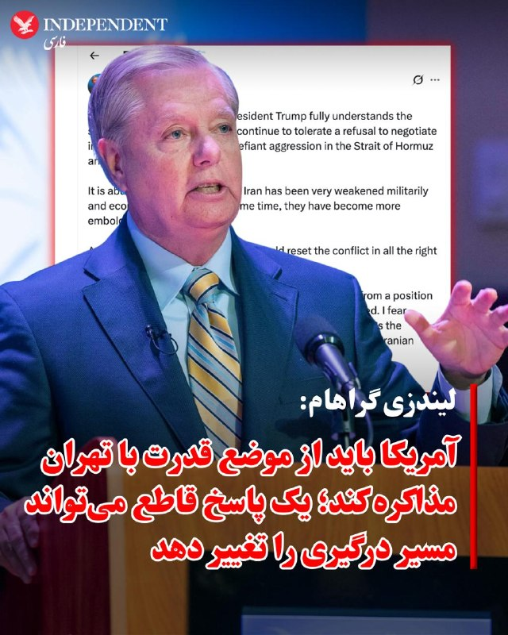

♦️لیندزی گراهام، سناتور جمهوری‌خواه آمریکا، روز دوشنبه ۲۸ اردیبهشت‌ماه در پیامی در شبکه اجتماعی اکس نوشت جمهوری اسلامی با وجود تضعیف شدید نظامی و اقتصادی، «جسورتر و پرخاشگرتر» شده است.

او نوشت اطمینان دارد دونالد ترامپ وضعیت جمهوری اسلامی را به‌خوبی درک می‌کند و دیگر «امتناع از مذاکره با حسن نیت» و اقدامات جمهوری اسلامی در تنگه هرمز و منطقه را تحمل نخواهد کرد.

گراهام افزود: «برای من کاملا روشن است که جمهوری اسلامی از نظر نظامی و اقتصادی بسیار ضعیف شده، اما همزمان جسورتر و پرخاشگرتر هم شده است.»

این سناتور آمریکایی تاکید کرد آمریکا باید از «موضع قدرت و تسلط» با جمهوری اسلامی مذاکره کند و گفت یک «پاسخ کوتاه اما قاطع» می‌تواند مسیر درگیری را تغییر دهد.
‌🇸🇦 Indypersian

🤖 @VahidOOnLine

## WithYashar — post 11566

  

شاخص سفارش کوبیده در اطراف منزل شاهزاده در‌ حومه شهر واشنگتون و در بین پادشاهی و مشروطه خواهان آنجا بالا رفته
@withyashar

## WithYashar — post 11565

ترامپ به نیویورک پست : ایران می‌دونه که به زودی چه اتفاقی براش میوفته، هیچ امتیازی داده نخواهد شد
@withyashar

## WithYashar — post 11564

  <a href="telegram/content/WithYashar_11564_1779124858.mp4" target="_blank">🎬 Download video</a>

داماد صداسیمایی تروریستس : مهریه زنم پهپاده
@withyashar

## WithYashar — post 11562

واشنگتن پست:

اسرائیل منتظر چراغ سبز آمریکا برای شروع عملیات است
@withyashar

## WithYashar — post 11561

آکسیوس: بمب‌ها مذاکره خواهند کرد
@withyashar

## WithYashar — post 11560

یک مقام آمریکایی به سی‌ان‌بی‌سی:

اظهارات رسانه‌های ایرانی مبنی بر موافقت واشنگتن با لغو تحریم‌های نفتی کذب است، هیچ تحریمی لغو نخواهد شد
@withyashar

## WithYashar — post 11559

منابع «العربیه»:

وزیر کشور پاکستان بعد از آخرین تلاش‌هایش، تهران را ترک کرد.
@withyashar

## WithYashar — post 11558

تری یینگست، خبرنگار فاکس نیوز‌ : ما تو آستانه بازگشت به عملیات‌های رزمی تمام‌عیار هستیم
@withyashar

## WithYashar — post 11557

رسانه های عبری:

ترامپ‌ امشب دستور بمباران را صادر میکند
@withyashar

## WithYashar — post 11556

🚨🚨🚨🚨🚨🚨🚨🚨
رویترز: آمریکا پیشنهاد جدید ایران را رد کرد
@withyashar

## WithYashar — post 11555

  

علی‌ آقا عشقه ، چقدر راحت و خاکی‌ کانکت شدیم… بد یه عده … چی بگم… درست میشه اونم … در آخر هر چیزی فقط‌ مردمن که مهم هستند🙌🏾❤️‍🩹
@withyashar

## WithYashar — post 11554

کمی‌پیش ستون عظیم دود از جنوب تهران، دوربین به سمت : بزرگراه یادگار عمام، جنوب @withyashar

## WithYashar — post 11553

  

کمی‌پیش ستون عظیم دود از جنوب تهران، دوربین به سمت : بزرگراه یادگار عمام، جنوب
@withyashar

## WithYashar — post 11552

تسنیم به نقل از منبعی نزدیک به تیم مذاکره‌کننده ایران:

ایران بر لزوم پرداخت غرامت از سوی آمریکا به دلیل جنگ، اصرار جدی دارد.
واشنگتن باید درک کند که پایان دادن به جنگ، در ازای تعهدات هسته‌ای نخواهد بود.
@withyashar

## WithYashar — post 11551

  

ترامپ در تروث : اگر ایران تسلیم شود، بپذیرد که نیروی دریایی‌اش از بین رفته و در کف دریا آرمیده است، و نیروی هوایی‌اش دیگر همراه ما نیست، و اگر تمام ارتش آن از تهران خارج شود در حالی که سلاح‌ها را زمین گذاشته و دست‌ها را بالا برده‌اند و هر کدام فریاد می‌زنند «تسلیم می‌شوم، تسلیم می‌شوم» و با شتاب پرچم سفید را تکان می‌دهند، و اگر تمام رهبری باقی‌مانده آن همه اسناد لازمِ تسلیم را امضا کنند و شکست خود را در برابر قدرت و نیروی عظیم ایالات متحده آمریکا بپذیرند، آنگاه نیویورک تایمزِ شکست‌خورده، وال‌استریت ژورنال چین (وال‌استریت ژورنال!)، سی‌ان‌ان فاسد و اکنون بی‌اعتبار، و همه اعضای دیگر رسانه‌های جعلی، تیتر خواهند زد که ایران پیروزی‌ای استادانه و درخشان بر ایالات متحده آمریکا به دست آورده است؛ در حالی که اصلاً رقابت نزدیک هم نبوده است.

دموکرات‌ها و رسانه‌ها کاملاً راه خود را گم کرده‌اند. آن‌ها کاملاً دیوانه شده‌اند!!!
@withyashar

## WithYashar — post 11550

کانال ۱۳ تلویزیون اسرائیل: نتانیاهو برای دومین بار در ۲۴ ساعت گذشته با کابینه امنیتی تشکیل جلسه داد
@withyashar

## WithYashar — post 11549

رئیس‌جمهور کوبا: هر حمله نظامی به کوبا به حمام خون و عواقب غیرقابل پیش‌بینی منجر می‌شود
@withyashar

## WithYashar — post 11548

کی‌یر استارمر : من قصد ندارم کنار بکشم، باید به مردمی که به من رای دادند خدمت کنم!
@withyashar

## mwarmonitor — post 9262

🇺🇸«رئیس‌جمهور ترامپ به من گفت که پس از دریافت تازه‌ترین پاسخ ناامیدکننده ایران در مذاکرات توافق صلح، «به هیچ‌گونه امتیازدهی به تهران» باز نیست — و در هشداری نگران‌کننده افزود که ایران می‌داند «به‌زودی چه اتفاقی قرار است بیفتد.»

New York post

@mwarmonitor

## mwarmonitor — post 9261

  

🇫🇷🇦🇪نیروی فرانسوی مستقر در امارات متحده عربی تصاویری از یک رزمایش مشترک منتشر کرده است که در آن جنگنده‌های رافال فرانسوی به‌همراه جنگنده‌های میراژ اماراتی و یک هواپیمای سوخت‌رسان شرکت دارند.

@mwarmonitor

## mwarmonitor — post 9260

🇺🇸وزارت خزانه‌داری آمریکا در حال صدور یک مجوز عمومی موقت ۳۰روزه است تا به آسیب‌پذیرترین کشورها اجازه دهد به‌طور موقت به نفت روسیه‌ای که هم‌اکنون در دریا سرگردان مانده دسترسی پیدا کنند.

🔸این تمدید، انعطاف‌پذیری بیشتری فراهم می‌کند و ما با این کشورها همکاری خواهیم کرد تا در صورت نیاز مجوزهای اختصاصی صادر شود. این مجوز عمومی به تثبیت بازار فیزیکی نفت خام کمک می‌کند و تضمین می‌کند که نفت به دست کشورهایی برسد که بیشترین آسیب‌پذیری انرژی را دارند.

🔸همچنین با کاهش توان چین برای انباشت نفت ارزان‌قیمت، به هدایت مجدد عرضه موجود به کشورهایی که بیشترین نیاز را دارند کمک خواهد کرد.

@mwarmonitor

## mwarmonitor — post 9259

📝 دیدن این تصاویر تهوع‌آور بر فراز برج‌های تهران، آن هم در کشوری که توده‌ی مردمش زیر خط فقر مطلق برای یک تکه نان شب سگ‌دو می‌زنند، هیچ چیز جز یک وقاحت آشکار و سادیسم اجتماعی نیست. این لاشخورهای مرفهی که به لطف رانت و وابستگی، جیب‌هایشان از پول این ملت مغبون…

## mwarmonitor — post 9258

  <a href="telegram/content/mwarmonitor_9258_1779124862.mp4" target="_blank">🎬 Download video</a>

📝 دیدن این تصاویر تهوع‌آور بر فراز برج‌های تهران، آن هم در کشوری که توده‌ی مردمش زیر خط فقر مطلق برای یک تکه نان شب سگ‌دو می‌زنند، هیچ چیز جز یک وقاحت آشکار و سادیسم اجتماعی نیست. این لاشخورهای مرفهی که به لطف رانت و وابستگی، جیب‌هایشان از پول این ملت مغبون پر شده، با فیلترشکن‌های نجومی و اکانت‌های پرو که هزینه‌اش دستمزد ماهانه‌ی یک کارگر است، سیرکِ رذالت و بی‌عاری خود را به نمایش می‌گذارند تا عقده‌های حقارتشان را با لایک‌های مجازی تسکین دهند.

🔸ورزش کردن و شاد بودن بهانه‌ی کثیفی است برای توجیه این بی‌شرفی مفرط؛ این تصاویر، استوری کردنِ صلح و آرامش نیست، رسماً تف کردن به صورت مردمی است که زیر بار تورم کمرشان شکسته است. جامعه‌ی ما امروز از چند سو مورد هجوم این جانوران قرار گرفته است: یک طرف آن ارزشی‌های جیره‌خوار با پرچم‌گردانی و عربده‌کشی‌های شبانه، طرف دیگر تفنگ‌به‌دستانِ رسانه‌ای که بذر وحشت می‌کارند، و در این میان، این روسپی‌های مدرنِ حکومتی که با بی‌شرمیِ تمام روی زخم مردم نمک می‌پاشند.

@mwarmonitor

## mwarmonitor — post 9257

🇺🇸🇨🇳رئیس‌جمهور ترامپ می‌گوید گفت‌وگوها با رئیس‌جمهور چین، شی جین‌پینگ، به توافق‌های جدیدی منجر شده که هدف آن‌ها «صلح و رفاه» میان آمریکا و چین است.

🔸از جمله توافق‌های گزارش‌شده: چین ۲۰۰ فروند هواپیمای بوئینگ خریداری خواهد کرد، طی سه سال آینده بیش از ۱۷ میلیارد دلار محصولات کشاورزی آمریکا را می‌خرد، مجوز فعالیت بیش از ۴۰۰ مرکز آمریکایی تولید گوشت گاو تمدید می‌شود و واردات گوشت مرغ از برخی ایالت‌های آمریکا از سر گرفته خواهد شد.

@mwarmonitor

## mwarmonitor — post 9255

🇺🇸🇮🇷 رویترز: آمریکا پیشنهاد جدید ایران را رد کرد.

@mwarmonitor

## mwarmonitor — post 9254

🚨 آمریکا جدیدترین پیشنهاد صلح ایران را رد کرد، پیش از جلسه روز سه‌شنبه در «اتاق وضعیت» (Situation Room). بلومبرگ

@mwarmonitor

## mwarmonitor — post 9253

🔴ایران پیشنهاد جدیدی ارائه داد؛ مقام ارشد آمریکایی: این پیشنهاد کافی نیست و خطر ازسرگیری جنگ را به همراه دارد

📝نویسنده: باراک راوید (AXIOS)

🔰ایران پیشنهاد به‌روزشده‌ای را برای دستیابی به توافقی جهت پایان دادن به جنگ ارائه کرده است، اما یک مقام ارشد آمریکایی و یک منبع آگاه از این موضوع به «آکسیوس» گفتند که کاخ سفید معتقد است این پیشنهاد پیشرفت معناداری به‌شمار نمی‌رود و برای دستیابی به توافق کافی نیست.

📌چرا این موضوع اهمیت دارد؟
مقامات آمریکایی می‌گویند پرزیدنت ترامپ خواهان توافقی برای پایان دادن به جنگ است، اما به دلیل رد بسیاری از خواسته‌های او از سوی ایران و امتناع این کشور از دادن امتیازات معنادار در برنامه هسته‌ای خود، در حال بررسی گزینه ازسرگیری جنگ است.

🔸به گفته دو مقام آمریکایی، انتظار می‌رود ترامپ روز سه‌شنبه تیم امنیت ملی خود را در «اتاق وضعیت» (Situation Room) کاخ سفید برای بررسی گزینه‌های نظامی تشکیل دهد.

🔹یک مقام ارشد آمریکایی گفت اگر ایران موضع خود را تغییر ندهد، ایالات متحده مجبور خواهد شد مذاکرات را «از طریق بمب‌ها» ادامه دهد.

🔸ترامپ روز یکشنبه در یک تماس تلفنی با آکسیوس (پیش از آنکه آمریکا پیشنهاد جدید ایران را دریافت کند) گفت: «زمان در حال از دست رفتن است» و اگر ایران انعطاف نشان ندهد، «ضربات بسیار سخت‌تری دریافت خواهند کرد.»

📌جزئیات بیشتر
این مقام ارشد آمریکایی گفت که پیش‌نویس پیشنهادیِ متقابل ایران، که یکشنبه‌شب از طریق میانجی‌های پاکستانی به دست آمریکا رسیده، تنها حاوی بهبودهای جزئی و نمادین نسبت به نسخه قبلی است.

🔸مسئله هسته‌ای: پیشنهاد جدید شامل عبارات و کلمات بیشتری درباره تعهد ایران به عدم تلاش برای دستیابی به سلاح هسته‌ای است، اما هیچ تعهد دقیقی درباره تعلیق غنی‌سازی اورانیوم یا تحویل ذخایر موجود اورانیوم با غنای بالا در آن دیده نمی‌شود.
مسئله تحریم‌ها: در حالی که رسانه‌های دولتی ایران گزارش دادند که آمریکا موافقت کرده است در طول مذاکرات برخی از تحریم‌های نفتی ایران را لغو کند، این مقام آمریکایی گفت که هیچ‌گونه لغو تحریمی «به صورت رایگان» و بدون اقدام متقابل از سوی ایران رخ نخواهد داد.

🔹اظهارات مقامات
این مقام ارشد آمریکایی گفت:
«ما واقعاً پیشرفت زیادی نداشته‌ایم. امروز در موقعیت بسیار حساسی قرار داریم. اکنون فشار روی آن‌هاست تا پاسخ مناسبی بدهند.»

🔰او در ادامه افزود:
«زمان آن رسیده که ایرانی‌ها امتیاز واقعی روی میز بگذارند. ما به یک گفتگوی واقعی، محکم و دقیق [در مورد برنامه هسته‌ای] نیاز داریم. اگر قرار نباشد این اتفاق بیفتد، ما از طریق بمب‌ها گفتگو خواهیم کرد که این مایه تاسف خواهد بود.»

📌پشت پرده
به گفته این مقام ارشد آمریکایی، ایالات متحده و ایران در حال حاضر مذاکرات مستقیمی روی متن و محتوای توافق ندارند، بلکه در حال انجام گفتگوهای غیرمستقیم هستند تا به یک اجماع درباره شکل و ساختار این مذاکرات دست یابند.
این مقام آمریکایی مدعی شد همین که ایران با وجود تغییرات بسیار ناچیز، پیشنهاد متقابل جدیدی ارائه کرده است، نشان می‌دهد ایرانی‌ها نگران اقدامات نظامی بیشتر از سوی ایالات متحده هستند. در مقابل، ایرانی‌ها مدت‌هاست ادعا می‌کنند این ترامپ است که برای توافق دستپاچه و عجول است و زمان به نفع آن‌ها (ایران) پیش می‌رود.

@mwarmonitor

## mwarmonitor — post 9252

  

🇺🇸ملوانان نیروی دریایی آمریکا در مرکز اطلاعات رزمی (CIC) ناو USS Delbert D. Black (DDG 119) در حال نگهبانی هستند، در حالی که این ناو در حال عبور از دریای عرب است و از «محاصره دریایی آمریکا علیه ایران» پشتیبانی می‌کند.

🔸طبق گزارش، تا ۱۸ مه، نیروهای فرماندهی مرکزی آمریکا (CENTCOM) مسیر ۸۴ کشتی تجاری را تغییر داده‌اند و ۴ فروند را از کار انداخته‌اند.

@mwarmonitor

## mwarmonitor — post 9251

اگر ایران تسلیم شود، اعتراف کند که نیروی دریایی‌اش نابود شده و در کف دریا آرام گرفته است، و نیروی هوایی‌اش دیگر در میان ما نیست، و اگر تمام ارتش آن‌ها با دست‌های بالا رفته و سلاح‌های زمین‌گذاشته از تهران خارج شوند و هر کدام در حالی که پرچم سفید نمادین را به شدت تکان می‌دهند فریاد بزنند «من تسلیم می‌شوم، من تسلیم می‌شوم»، و اگر تمام رهبران باقی‌مانده آن‌ها همه «اسناد تسلیم» لازم را امضا کنند و شکست خود را در برابر قدرت و نیروی عظیم ایالات متحده باشکوه آمریکا بپذیرند، [باز هم] «نیویورک تایمز در حال سقوط»، «چاینا استریت ژورنال (همان وال استریت ژورنال!)»، «سی‌ان‌انِ فاسد و اکنون بی‌اهمیت» و همه اعضای دیگر رسانه‌های اخبار جعلی، تیتر خواهند زد که ایران یک پیروزی استادانه و درخشان بر ایالات متحده آمریکا داشته است و [این رقابت] حتی نزدیک هم نبود. دموکرات‌ها و رسانه‌ها کاملاً راه خود را گم کرده‌اند. آن‌ها کاملاً دیوانه شده‌اند!!!

رئیس‌جمهور دونالد جی ترامپ (DJT)

@mwarmonitor

## FoxNewsTwitter — post 341880

  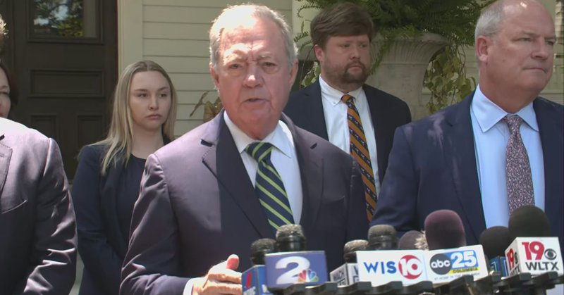

Fox News (Twitter/X)

WATCH LIVE: Alex Murdaugh's defense team holds press conference
https://twitter.com/i/broadcasts/1AxRnaOoBmrxl

## FoxNewsTwitter — post 341879

  <a href="telegram/content/FoxNewsTwitter_341879_1779124865.mp4" target="_blank">🎬 Download video</a>

Fox News (Twitter/X)

WATCH: Secretary Hegseth leads the re-enlistment of 190 soldiers at Fort Campbell.

The ceremony brought hundreds together as troops raised their right hands and committed to another chapter of service to the country.

## FoxNewsTwitter — post 341878

  <a href="telegram/content/FoxNewsTwitter_341878_1779124867.mp4" target="_blank">🎬 Download video</a>

Fox News (Twitter/X)

A chaotic teen takeover turns violent inside a Washington, D.C. Chipotle.

The group of teens can be seen throwing punches and hurling restaurant chairs and stools at one another as innocent bystanders huddle for safety in a corner of the restaurant.

The incident comes just days after U.S. Attorney Jeanine Pirro vowed to punish parents with jail time or fines for allowing their kids to take part in these mobs.

Chipotle reacting to the violent incident, saying, “We have zero tolerance for guests who behave recklessly in our restaurants and put others at risk.... We are actively supporting local law enforcement in their investigation of the incident.”

## FoxNewsTwitter — post 341877

  

Fox News (Twitter/X)

NEW: President Trump says talks with Chinese President Xi Jinping resulted in new agreements aimed at “peace and prosperity” between the U.S. and China.

Among the reported deals: China will buy 200 Boeing jets, purchase $17B+ in U.S. agricultural products over the next three years, renew listings for 400+ American beef facilities, and resume poultry imports from certain U.S. states.

## FoxNewsTwitter — post 341876

  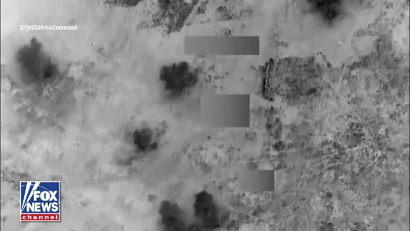

Fox News (Twitter/X)

NEW: U.S. Africa Command and Nigerian forces carry out a series of kinetic strikes against ISIS fighters in Northeastern Nigeria.

The strikes took place on May 17th, targeting ISIS militants without harming any U.S. or Nigerian forces.

## FoxNewsTwitter — post 341875

  <a href="telegram/content/FoxNewsTwitter_341875_1779124870.mp4" target="_blank">🎬 Download video</a>

Fox News (Twitter/X)

NEW VIDEO: Cameras inside the courtroom capture the moment New York State Supreme Court Judge Gregory Carro announces that some key pieces of evidence seized from Luigi Mangione’s backpack during his arrest at a Pennsylvania McDonald's are inadmissible at trial, while some of it can still be shown to jurors, including the suspected murder weapon.

## FoxNewsTwitter — post 341874

  <a href="telegram/content/FoxNewsTwitter_341874_1779124872.mp4" target="_blank">🎬 Download video</a>

Fox News (Twitter/X)

HAPPENING NOW: Former Epstein prison guard Tova Noel arrives at the House Oversight Committee’s closed-door transcribed interview.

The Metropolitan Correctional Center prison guard was on duty the night Jeffrey Epstein died in 2019 and believes she was the last person to see him alive at the facility.

Lawmakers are expected to question her about her actions during that shift and the prison’s security protocols as part of the ongoing congressional investigation into Epstein’s death.

## FoxNewsTwitter — post 341873

  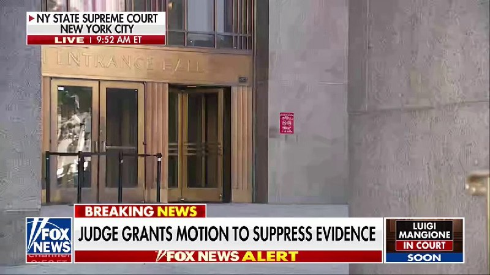

Fox News (Twitter/X)

BREAKING: Luigi Mangione scoring a partial victory in court as a judge rules that evidence recovered from the alleged UnitedHealthcare CEO killer’s backpack at a McDonald’s must be suppressed.

According to the ruling, that evidence includes a loaded gun magazine, a cellphone, a passport, a wallet, and a computer chip investigators allegedly recovered during the search at that time.

However, this ruling does not suppress the gun that police say was used to kill Brian Thompson, which was recovered from Mangione's backpack at a different time, from being entered as evidence.

@EricShawnTV breaks down the latest.

## pm_afshaa — post 90969

🔴واشنگتن پست:اسرائیل منتظر چراغ سبز آمریکا برای شروع عملیات است

💧 Rainbet.com the #1 Non-KYC Crypto Casino & Sportsbook @rainbetcom

😁 @Pm_Afshaa

## pm_afshaa — post 90968

🔴العربیه: وزیر کشور پاکستان بعد از رد آخرین پیشنهاد ایران توسط آمریکا، دقایقی پیش ایران رو ترک کرد

💧 Rainbet.com the #1 Non-KYC Crypto Casino & Sportsbook @rainbetcom

😁 @Pm_Afshaa

## pm_afshaa — post 90967

  

یینگست، خبرنگار فاکس‌ نیوز: ما تو آستانه بازگشت به عملیات‌های رزمی تمام‌عیار هستیم

💧 Rainbet.com the #1 Non-KYC Crypto Casino & Sportsbook @rainbetcom

😁 @Pm_Afshaa

## pm_afshaa — post 90966

⭕️رسانه های عبری : ترامپ‌ امشب دستور بمباران را صادر میکند

💧 Rainbet.com the #1 Non-KYC Crypto Casino & Sportsbook @rainbetcom

😁 @Pm_Afshaa

## pm_afshaa — post 90965

یه حسی بهم میگه امشب میزننن...

## pm_afshaa — post 90964

  <a href="telegram/content/pm_afshaa_90964_1779124874.webm" target="_blank">🎬 Download video</a>

🔴آکسیوس: آمریکا پیشنهاد امروز ایران رو هم ناکافی دانست و کاملا ردش کرد؛ طبق گفته مقام آمریکایی در نقطه بسیار حساسی هستیم! 
💧 Rainbet.com the #1 Non-KYC Crypto Casino & Sportsbook @rainbetcom 
😁 @Pm_Afshaa

## pm_afshaa — post 90963

🔴اسرائیل هیوم: وزارت دفاع از نتانیاهو خواسته بودجه ارتش را 14میلیارد دلار افزایش دهد

💧 Rainbet.com the #1 Non-KYC Crypto Casino & Sportsbook @rainbetcom

😁 @Pm_Afshaa

## pm_afshaa — post 90962

  <a href="telegram/content/pm_afshaa_90962_1779124875.webm" target="_blank">🎬 Download video</a>

🔴رویترز: آمریکا پیشنهاد جدید ایران رو رد کرد.

💧 Rainbet.com the #1 Non-KYC Crypto Casino & Sportsbook @rainbetcom

😁 @Pm_Afshaa

## pm_afshaa — post 90961

  <a href="telegram/content/pm_afshaa_90961_1779124875.webm" target="_blank">🎬 Download video</a>

🔴تسنیم: ایران یه پیشنهاد 14 بندی اصلاح شده به پاکستان داد تا به آمریکا برسونه و اونا هم بررسیش کنن و جواب بدن. 
😁 @Pm_Afshaa

## pm_afshaa — post 90960

  <a href="telegram/content/pm_afshaa_90960_1779124876.webm" target="_blank">🎬 Download video</a>

🔴پست جدید ترامپ:

اگر ایران تسلیم شود، اعتراف کند که نیروی دریایی‌شان از بین رفته و در ته دریا است، و نیروی هوایی‌شان دیگر با ما نیست، و اگر کل ارتش‌شان از تهران خارج شود، سلاح‌ها را رها کرده و دست‌ها را بالا ببرند، هر کدام فریاد بزنند «من تسلیم می‌شوم، من تسلیم می‌شوم» در حالی که پرچم سفید نماینده را به شدت تکان می‌دهند، و اگر تمام رهبران باقی‌مانده‌شان همه «اسناد تسلیم» لازم را امضا کنند و شکست خود را در برابر قدرت و نیروی عظیم و باشکوه ایالات متحده آمریکا بپذیرند، روزنامه‌های در حال سقوط نیویورک تایمز، وال استریت ژورنال چین (WSJ!)، سی‌ان‌ان فاسد و اکنون بی‌اهمیت، و همه اعضای دیگر رسانه‌های خبری جعلی، تیتر خواهند زد که ایران پیروزی استادانه و درخشانی بر ایالات متحده آمریکا داشته است، حتی نزدیک هم نبود. دموکرات‌ها و رسانه‌ها کاملاً راه خود را گم کرده‌اند. آنها کاملاً دیوانه شده‌اند!!!

💧 Rainbet.com the #1 Non-KYC Crypto Casino & Sportsbook @rainbetcom

😁 @Pm_Afshaa

## pm_afshaa — post 90959

  <a href="telegram/content/pm_afshaa_90959_1779124876.webm" target="_blank">🎬 Download video</a>

🔴تسنیم: ایران یه پیشنهاد 14 بندی اصلاح شده به پاکستان داد تا به آمریکا برسونه و اونا هم بررسیش کنن و جواب بدن. 
😁 @Pm_Afshaa

## pm_afshaa — post 90958

  <a href="telegram/content/pm_afshaa_90958_1779124877.webm" target="_blank">🎬 Download video</a>

🔴کان نیوز: نتانیاهو امروز جلسه امنیتی محدودی با مقامات ارشد دفاعی و چند وزیر درباره ایران برگزار خواهد کرد.

💧 Rainbet.com the #1 Non-KYC Crypto Casino & Sportsbook @rainbetcom

😁 @Pm_Afshaa

## pm_afshaa — post 90956

🔴رئیس‌جمهور کوبا: هر حمله نظامی به کوبا به حمام خون و عواقب غیرقابل پیش‌بینی منجر می‌شود

💧 Rainbet.com the #1 Non-KYC Crypto Casino & Sportsbook @rainbetcom

😁 @Pm_Afshaa

## DEJradio — post 4709

  <a href="telegram/content/DEJradio_4709_1779124878.mp4" target="_blank">🎬 Download video</a>

👑🎥 مراسم یادبود سامان دل‌آرام؛ "از خون جوانان وطن لاله دمیده"

#خون_جوانان_وطن #دی۱۴۰۴
@DEJradio

## DEJradio — post 4708

  <a href="telegram/content/DEJradio_4708_1779124879.webm" target="_blank">🎬 Download video</a>

🔺🎤 خشم سیاسی و مرگ روابط

گفت‌وگو با دکتر مصطفی میررمضانی

#خشم_سیاسی #حکومت_آخوندی
@DEJradio

## DEJradio — post 4707

  <a href="telegram/content/DEJradio_4707_1779124880.webm" target="_blank">🎬 Download video</a>

👑
🔺 شاهزاده رضا پهلوی: «فرض کنید همین نمونه سیلیکون ولی را بشود در بلوچستان پیاده کرد. چرا که نه!»

نشست آینده تکنولوژی در ایران
سان‌فرانسیسکو، ۲۶ اردیبهشت ۲۵۸۵/۱۴۰۵

#شاهزاده_رضا_پهلوی #سیستان_بلوچستان

@DEJradio

## DEJradio — post 4706

  <a href="telegram/content/DEJradio_4706_1779124880.mp4" target="_blank">🎬 Download video</a>

🚨
🔸 اشتباه محاسباتی همون جاییی که یک نقشه به‌ظاهر هوشمندانه، به یک شکست مفتضحانه ختم می‌شه!

پس پیش از آغاز یک حمله فقط دیدنِ حرکت‌های خودت کافی نیست؛ باید زنجیره‌ی واکنش‌های حریف رو هم دقیق حساب کنی!♟🧠

اما در دنیایی سیال و پر از فاکتورهای ناشناخته این محاسبه واقعا چطور ممکنه؟

در قسمت هفتم از «تمام‌رخ» می‌ریم سراغ قهرمان اشتباهات محاسباتی:
حکومت آخوندی ⚠️

#تمام_رخ #حکومت_آخوندی
@DEJradio

## DEJradio — post 4705

  <a href="telegram/content/DEJradio_4705_1779124882.mp4" target="_blank">🎬 Download video</a>

🤡
🔺 “مهریه خانمم پهپاد شاهد است!

در ادامه تبلیغات صدا و سیما برای بازارگرمی تجمعات شبانه و سازماندهی رزمی هوادارانش، با تبلیغ جفت‌گیری و صیغه، داماد حکومتی، روی آنتن زنده تلویزیون میگوید «مهریه خانمم پهپاد شاهده که ایشالا بخوره تو قلب تل‌آویو».

#صیغه #صداوسیما
@DEJradio

## DEJradio — post 4704

  <a href="telegram/content/DEJradio_4704_1779124884.mp4" target="_blank">🎬 Download video</a>

🔺🎥 پیام یک شهروند از تهران:
رژیم مردم رو انداخته به زباله‌گردی

یک شهروند از تهران با ارسال ویدیویی محله شمشیری تهران، می‌گوید رژیم ما رو انداخته به زباله‌گردی، نه عزت داریم نه احترام.

#زباله_گردی #تهران
@DEJradio

## DEJradio — post 4703

  <a href="telegram/content/DEJradio_4703_1779124886.mp4" target="_blank">🎬 Download video</a>

🤡
🔺 آمستردام؛ "مزدورای بدردنخور رژیم پرچم گرفتن دستشون"

یک از ایرانیان میهن‌دوست ساکن آمستردام با ارسال ودیدیویی از تجمع حامیان نظام می‌گوید: مزدورای بدردنخور حامی رژیم پرچم گرفتن دستشون"

#آمستردام #تجمعات_حکومتی
@DEJradio

## DEJradio — post 4702

  <a href="telegram/content/DEJradio_4702_1779124888.mp4" target="_blank">🎬 Download video</a>

🔺📢 پیام یک شهروند از نقده:
بانک‌ها زودتر موعود می‌بندند و عابر بانک‌ها کار نمی‌کنند

«ساکن شهرستان نقده در استان آذربایجان غربی هستم و این فیلم کوتاه رو براتون می‌فرستم.

امروز مشاهده کردم که این بانک هم مثل خیلی از بانک‌های دیگه زودتر از موعد درها رو به روی مراجعین بسته. چند شخص بازنشسته الان مدتی طولانی منتظر هستند ولی نه از باجه و نه از عابر بانک نمیتونن حقوقشون رو دریافت کنن.

این حکومت ضدملی با فساد و جنگ افروزی‌هاش اقتصاد و معاش مردم رو نابود کرده!»

#آذربایجان_غربی #ورشکستگی_اقتصادی
@DEJradio

## DEJradio — post 4701

  <a href="telegram/content/DEJradio_4701_1779124889.mp4" target="_blank">🎬 Download video</a>

🔺🎥 تصاویر منتشر شده از فراز تنگه هرمز از نگاه یک هواپیمای مسافربری.

#تنگه_هرمز
@DEJradio

## DEJradio — post 4700

  <a href="telegram/content/DEJradio_4700_1779124891.mp4" target="_blank">🎬 Download video</a>

🔺📢 یک شهروند از ورامین:
امیدوارم هرچه زودتر از دست مستبده رها بشیم

یک شهروند ساکن ورامین [جنوب تهران] با ارسال این ویدیو نوشت: «ما در کشوری غنی از منابع طبیعی و با نیروی انسانی سخت‌کوش زندگی می‌کنیم ولی جمهوری اسلامی با جنگ افروزی‌هاش اقتصاد کشور رو نابود و ملت رو به فقر و گرسنگی رسونده. امیدوارم هر چه زودتر از دست این حکومت فاسد و مستبد رها بشیم تا اقتصاد کشور و معاش مردم نجات پیدا کنه!»

#اقتصاد_ایران #تورم
@DEJradio

## mamlekate — post 103554

📝 ۲۸ اردیبهشت؛ روز خیام؛
فیلسوف، دانشمند و شاعری که خرد و آزادی را ستود

@mamlekate

## mamlekate — post 103553

📝 رسانه‌های آمریکایی: ترامپ روز شنبه با مشاوران ارشد امنیت ملی خود درباره ایران جلسه گذاشت؛ سه‌شنبه نیز جلسه دیگری دارد

سایت خبری آکسیوس روز یک‌شنبه ۲۷ اردیبهشت گزارش داد که دونالد ترامپ، رئیس‌جمهوری آمریکا قرار است روز سه‌شنبه در «اتاق وضعیت» کاخ سفید با مشاوران ارشد امنیت ملی خود جلسه‌ای درباره ایران برگزار کند.

📝 ترامپ می‌گوید اگر ایران خیلی سریع توافق نکند، چیزی از آن باقی نخواهد ماند

ترامپ با انتشار چند تصویر مختلف گرافیکی که حاکی از هدف قرار دادن ایران و نیز آغاز دوباره جنگ با فشاردادن یک دکمه توسط او بود، تهدیدات خود علیه جمهوری اسلامی را تکرار کرد.

📝 گزارش‌ها از شروط ایران و آمریکا برای ازسرگیری مذاکرات

📝 رویترز: پاکستان «پیشنهاد اصلاح‌شده» تهران برای پایان درگیری را به واشنگتن تحویل داد

📝 آمریکا پیشنهاد تازه ایران برای پایان جنگ را کافی نمی‌داند

📝 تشدید محاصره نفتی ایران؛ ازدحام بی‌سابقه نفتکش‌ها در اطراف جزیره خارگ

در حالی که محاصره دریایی آمریکا علیه بنادر جمهوری اسلامی ایران ادامه دارد، تصاویر ماهواره‌ای از تجمع حدود ۲۳ نفتکش در نزدیکی جزیره خارگ، مهم‌ترین پایانه صادرات نفت ایران حکایت دارد، که بزرگ‌ترین تجمع شناورها در این منطقه از زمان آغاز این محاصره است.

📝 گزارش کاخ سفید از دستاوردهای سفر ترامپ به پکن؛ چین و آمریکا توافق کردند جمهوری اسلامی نباید در تنگه هرمز عوارض بگیرد

کاخ سفید، توضیحاتی درباره دستاوردهای سفر دونالد ترامپ، رئيس‌جمهوری آمریکا به چین و دیدارش با شی جین‌پینگ، رئيس‌جمهوری این کشور، منتشر کرد.

@mamlekate

## mamlekate — post 103552

  

سلام. من هیچ درخواستی برا اینترنت طبقاتی پرو ندادم. نه پروانه کسب دارم نه کارمندم. کلا اینترنتو بستن تا به اسم پرو گرونش کنن

@mamlekate

## mamlekate — post 103551

  <a href="telegram/content/mamlekate_103551_1779124893.mp4" target="_blank">🎬 Download video</a>

📞 این آموزش همگانی استفاده از تیربار تو صداوسیما دیگه کار موساده چون این یکی کلاش نیست اینو تو پایگاه به مزدورای خودشون میتونن آموزش بدن.

@mamlekate

## mamlekate — post 103550

  

💎 الو
سلام مملکته
این پیامو دارم می‌دم به همراه کلی فحش چون دیگه هیچ کاری از دستم برنمیاد و واقعا عصبی هستم، این ساعتی که تنظیم کردم و نصفه بیدار شدم به خاطر بنزین هست. لعنت به قبر اول و اخرشون، لعنت به مرده و زنده‌شون با این مملکتشون که زندگی برای مردم نذاشتن، این مدت دیگه از بس فحش دادم به اینا خسته شدم.
دیگه حتی خواب هم از مردم گرفتن، روز که مثل سگ داریم برای یه لقمه نون میدویم، الان کار به جایی رسیده باید ساعت بذاریم نصفه شب بریم توی صف بنزین و دیگه خواب شب هم نداشته باشیم.

📝 جیره‌بندی بنزین در ایران؛مسیر هموار شکل‌گیری بازار سیاه سوخت

در حالی که مقامات از مدیریت مصرف سخن می‌گویند، شواهد از سهمیه‌بندی پنهان، شکل‌گیری بازار سیاه و افت شدید کیفیت سوخت حکایت دارد؛ بحرانی زیرساختی که پیوند ناگسستنی سیاست خارجی و معیشت جامعه را عیان‌تر از همیشه می‌کند.

@mamlekate

## VahidOnline — post 75541

وب‌سایت اکسیوس، روز دوشنبه ۲۸ اردیبهشت ۱۴۰۵ به نقل از یک مقام ارشد آمریکایی و یک منبع آگاه گزارش داد که تهران پیشنهاد تازه‌ای برای توافق ارایه کرده، اما کاخ سفید آن را «پیشرفت معنادار» ندانسته و برای دستیابی به توافق کافی نمی‌داند.

به گفته مقام ارشد آمریکایی، اگر ایران موضع خود را تغییر ندهد، مذاکرات «از طریق بمب‌ها» ادامه خواهد یافت.

بر اساس گزارش اکسیوس، مقام‌های آمریکایی می‌گویند دونالد ترامپ خواهان دستیابی به توافقی برای پایان جنگ است، اما هم‌زمان به دلیل رد بسیاری از خواسته‌های واشنگتن از سوی ایران و خودداری تهران از ارایه امتیازهای قابل‌توجه در برنامه هسته‌ای، گزینه ازسرگیری حملات را نیز بررسی می‌کند.

دو مقام آمریکایی گفته‌اند ترامپ قرار است روز سه‌شنبه نشست تیم ارشد امنیت ملی خود را در اتاق وضعیت کاخ سفید برگزار کند تا گزینه‌های نظامی را بررسی کند.

آکسیوس گزارش داده پیشنهاد تازه ایران که شامگاه یک‌شنبه از طریق میانجی‌گران پاکستانی به آمریکا منتقل شده، تنها تغییرات محدودی نسبت به نسخه قبلی دارد.
بر اساس این گزارش، در پیشنهاد جدید، توضیحات بیشتری درباره تعهد ایران به نساختن سلاح هسته‌ای آمده، اما هیچ تعهد مشخصی درباره توقف غنی‌سازی اورانیوم یا تحویل ذخایر اورانیوم با غنای بالا ارایه نشده است.

در حالی که رسانه‌های دولتی ایران گزارش داده بودند آمریکا در جریان مذاکرات با لغو برخی تحریم‌های نفتی موافقت کرده، مقام آمریکایی به آکسیوس گفته است هیچ کاهش تحریمی «رایگان» و بدون اقدام متقابل از سوی ایران انجام نخواهد شد.

این مقام آمریکایی همچنین گفته است: «ما واقعا پیشرفت زیادی نداشته‌ایم. اکنون در نقطه بسیار حساسی قرار داریم و فشار بر ایران است تا به شکل درستی پاسخ دهد.»

او افزوده است: «زمان آن رسیده که ایرانی‌ها امتیاز واقعی بدهند. ما به گفت‌وگوهای جدی، دقیق و جزیی درباره برنامه هسته‌ای نیاز داریم. اگر این اتفاق رخ ندهد، گفت‌وگو از طریق بمب‌ها انجام خواهد شد و این مایه تاسف است.»

در ادامه این گزارش آمده است که ایران و آمریکا هنوز مذاکرات مستقیم درباره جزییات توافق ندارند و گفت‌وگوها به‌صورت غیرمستقیم برای رسیدن به چارچوبی مشترک ادامه دارد.
این مقام آمریکایی مدعی شده که ارایه پیشنهاد تازه از سوی ایران، با وجود تغییرات اندک، نشان می‌دهد تهران نگران اقدام نظامی بیشتر آمریکا است.
در مقابل، مقام‌های ایرانی همواره تاکید کرده‌اند که این ترامپ است که برای دستیابی به توافق عجله دارد و زمان به سود ایران پیش می‌رود.
@VahidHeadline

📡 @VahidOnline

## VahidOnline — post 75540

  

پست ترامپ، ترجمه ماشین:
اگر ایران تسلیم شود، اعتراف کند که نیروی دریایی‌اش از بین رفته و در قعر دریا آرمیده است، و نیروی هوایی‌اش دیگر در میان ما نیست، و اگر تمام ارتشش از تهران خارج شود، سلاح‌ها را زمین بیندازد و دست‌ها را بالا بگیرد، هرکدام فریاد بزنند «تسلیمم، تسلیمم» و در حالی‌ که پرچم سفیدِ نمادین را دیوانه‌وار تکان می‌دهند، و اگر تمام رهبران باقی‌مانده‌اش همه «اسناد تسلیم» لازم را امضا کنند و شکست خود را در برابر قدرت و نیروی عظیم ایالات متحده باشکوه آمریکا بپذیرند، نیویورک تایمزِ رو به افول، چاینا استریت ژورنال (وال‌استریت ژورنال!)، سی‌ان‌انِ فاسد و اکنون بی‌اهمیت، و همه دیگر اعضای رسانه‌های اخبار جعلی، تیتر خواهند زد که ایران پیروزی‌ای استادانه و درخشان بر ایالات متحده آمریکا به دست آورد و حتی رقابت نزدیکی هم نبود.

دموکرات‌های احمق و رسانه‌ها کاملاً راه خود را گم کرده‌اند. آن‌ها کاملاً دیوانه شده‌اند!!!

پرزیدنت دونالد جی ترامپ
realDonaldTrump

📡 @VahidOnline

## VahidOnline — post 75539

  

مدیر مرکز روابط عمومی وزارت بهداشت جمهوری اسلامی، روز دوشنبه ۲۸ اردیبهشت مدعی شد که در حمله اسراییل به بیت خامنه‌ای «اتفاق خاصی» برای مجتبی خامنه‌ای نیفتاده و زخم‌های او نه چهره‌اش را مخدوش کرده و نه به قطع عضو انجامیده است.
@VahidHeadline

📡 @VahidOnline

## VahidOnline — post 75538

  

فردریش مرتس گفت که «ما حملات هوایی تازه ایران به امارات و دیگر شرکا را به‌شدت محکوم می‌کنیم.»

صدر‌اعظم آلمان در شبکه اجتماعی ایکس، حمله به «تاسیسات هسته‌ای» را تهدیدی برای ایمنی مردم سراسر منطقه خواند.

امارات متحده دیروز گفت که در حمله پهپادی، ژانراتور برق بیرون محوطه نیروگاه هسته‌ای براکه در نزدیکی ابوظبی آتش گرفته است. امارات در بیانیه‌هایش نامی از کشوری نبرد و فقط گفت پهپاد از «مرز غربی» وارد شده بود.

آقای مرتس در این پست نوشت که «ایران باید وارد مذاکره جدی با آمریکا شود، از تهدید همسایگان خود دست بردارد و تنگه هرمز را بدون هیچ محدودیتی مجددا باز کند.»

اظهارات آقای مرتس درباره مذاکرات ایران و آمریکا اخیرا به تنش لفظی او با دونالد ترامپ منجر شد. او گفته بود مذاکره‌کنندگان ایران آمریکا را «تحقیر» کرده‌اند.
@VahidHeadline

📡 @VahidOnline

## kianmeli1 — post 87465

🔴ترامپ در مورد ایران به «العربیه»: کار با عظمتی انجام می‌دهیم و پیروزی پیش روی ما است.
https://t.me/kianmeli1

## kianmeli1 — post 87464

🔴طبق گزارش‌ها، جزیره خارک ایران حداقل ۱۰ روز است که هیچ نفتکشی بارگیری نشده است.
https://t.me/kianmeli1

## kianmeli1 — post 87463

  

🔴کاخ سفید:
آخرین پیشنهاد ایران که امروز ارائه شد نیز به دلیل ناکافی‌ بودن به صورت کامل رد شد،
دیگر بمب ها مذاکره خواهند کرد.
https://t.me/kianmeli1

## IranIntlTV — post 337817

  <a href="telegram/content/IranIntlTV_337817_1779124897.mp4" target="_blank">🎬 Download video</a>

کانال ۱۲ اسرائیل گزارش داد انتظار می‌رود دونالد ترامپ ظرف ۲۴ ساعت آینده درباره اقدام نظامی احتمالی علیه جمهوری اسلامی تصمیم‌گیری کند.

گفت‌وگو با فرزین ندیمی، پژوهش‌گر امور دفاعی و امنیتی
@iranintltv

## IranIntlTV — post 337816

  <a href="telegram/content/IranIntlTV_337816_1779124899.mp4" target="_blank">🎬 Download video</a>

کانال ۱۳ اسرائیل گزارش داد هدف حمله احتمالی آمریکا، آسیب به حکومت ایران و بازگرداندن جمهوری اسلامی به میز مذاکره از موضع ضعف است.

این در حالی است که دونالد ترامپ در ابتدای جنگ پیشین با جمهوری اسلامی بر تغییر رژیم تاکید کرده بود.

گفت‌وگو با نجات بهرامی، تحلیل‌گر سیاسی
@iranintltv

## IranIntlTV — post 337815

  <a href="telegram/content/IranIntlTV_337815_1779124900.mp4" target="_blank">🎬 Download video</a>

مستند «تمرین‌هایی برای یک انقلاب» ساخته پگاه آهنگرانی، در حاشیه جشنواره فیلم کن، جایزه ویژه هیئت داوران رویداد مستند «گلدن گلوبز» را با همکاری بنیاد «آرتمیس رایزینگ» دریافت کرد؛ رویدادی که با همکاری بخش «کن داکس»، مجله ورایتی و بازار فیلم کن برگزار می‌شود.
این برنامه به مستندهای اجتماعی و سیاسی اختصاص دارد و برگزارکنندگان آن می‌گویند هدفش حمایت از فیلم‌سازی مستند، به‌عنوان ابزاری برای شکل دادن به روایت‌ها و گفت‌وگوهای جهانی، است.

## IranIntlTV — post 337814

  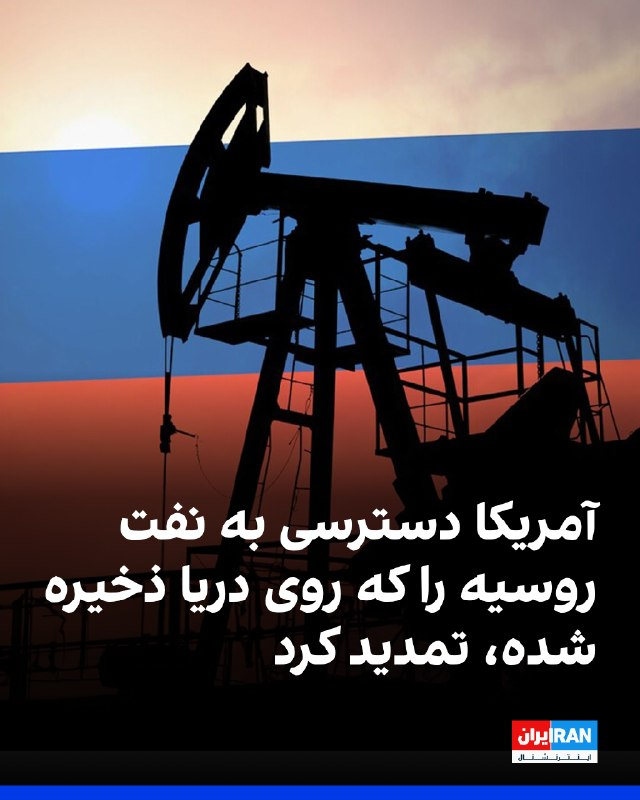

اسکات بسنت، وزیر خزانه‌داری ایالات متحده، دوشنبه گفت که آمریکا در حال صدور یک مجوز عمومی ۳۰ روزه برای فراهم کردن دسترسی موقت به آن بخش از نفت روسیه‌ است که در دریا سرگردان مانده است.

بسنت در شبکه ایکس نوشت: «این تمدید، انعطاف‌پذیری بیشتری فراهم خواهد کرد و ما با این کشورها همکاری خواهیم کرد تا در صورت نیاز، مجوزهای مشخص صادر کنیم.»

او افزود: «این مجوز عمومی به ثبات بازار فیزیکی نفت خام کمک خواهد کرد و اطمینان می‌دهد که نفت به آسیب‌پذیرترین کشورهای از نظر انرژی برسد.»
https://iranintl.com/202605188532

## IranIntlTV — post 337813

  <a href="https://t.me/IranintlTV/337813" target="_blank">📎 Download file</a>

🎧نسخه صوتی اخبار شبانگاهی | دوشنبه ۲۸ اردیبهشت
@iranintlTV

## IranIntlTV — post 337812

  

خبرنگار سی‌ان‌بی‌سی، به نقل از یک مقام آمریکایی در شبکه ایکس نوشت گزارش رسانه‌های ایران مبنی بر این‌که آمریکا در حالی که مذاکرات ادامه دارد با لغو تحریم‌های نفتی موافقت کرده، نادرست است.

پیش‌تر خبرگزاری تسنیم وابسته به سپاه پاسداران، به نقل از یک منبع ناشناس نزدیک به تیم مذاکره‌کننده جمهوری اسلامی گزارش داد که آمریکا با تعلیق تحریم‌های صادرات نفت ایران در طول مذاکرات موافقت کرده است.

این منبع آگاه گفت: «آمریکایی‌ها برخلاف متون پیشین خود، در متن جدید پذیرفته‌اند که در طول دوره مذاکره، تحریم‌های نفتی ایران را ویو (Waive) کنند.»

این خبرگزاری افزود: «"ویو کردن" تحریم‌ها به معنای معافیت یا اسقاط موقت تحریم‌هاست.»
https://iranintl.com/202605186046

## IranIntlTV — post 337811

  <a href="telegram/content/IranIntlTV_337811_1779124903.mp4" target="_blank">🎬 Download video</a>

تیتر اول با نیوشا صارمی، دوشنبه ۲۸ اردیبهشت
@iranintltv

## IranIntlTV — post 337810

  

دونالد ترامپ به العربیه گفت: «ما در حال انجام کاری بزرگ هستیم و پیروزی در راه است.»

او پیش‌تر در تروث سوشال نوشت حتی اگر جمهوری اسلامی کاملا تسلیم شود و شکست خود را بپذیرد، رسانه‌هایی مانند نیویورک تایمز، وال‌استریت ژورنال و سی‌ان‌ان آن را پیروزی تهران جلوه خواهند داد.
او افزود رسانه‌های جعلی و دموکرات‌ها «کاملا راه خود را گم کرده‌اند و دیوانه شده‌اند.»

https://iranintl.com/202605180267

## IranIntlTV — post 337809

  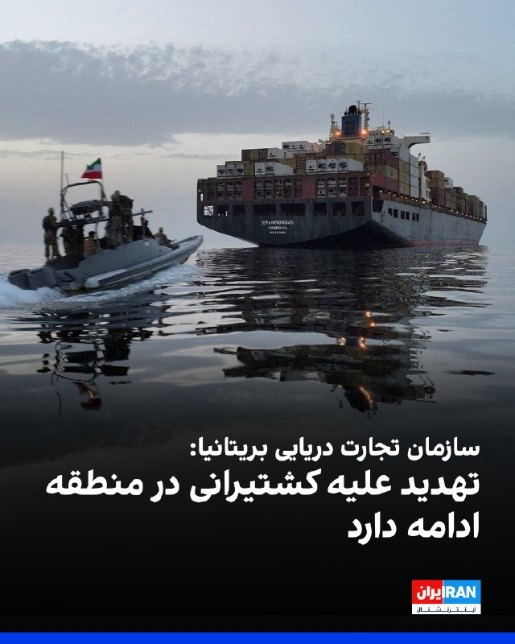

سازمان عملیات تجارت دریایی بریتانیا اعلام کرد که در روزهای ۲۶ و ۲۷ اردیبهشت هیچ حادثه‌ای در خلیج فارس و دریای عمان گزارش نشده است.

با این حال، وضعیت امنیتی منطقه همچنان ناپایدار است و تهدید علیه کشتیرانی تجاری ادامه دارد.
https://iranintl.com/202605183328

## IranIntlTV — post 337808

  <a href="telegram/content/IranIntlTV_337808_1779124906.mp4" target="_blank">🎬 Download video</a>

صبح دوشنبه مسعود پزشکیان گفت در پی محاصره دریایی از سوی آمریکا، صادرات نفت ایران متوقف شده است. ساعتی پس از انتشار این اظهارات، رسانه‌های دولتی از جمله ایرنا اقدام به حذف صحبت‌های پزشکیان از خروجی خود کردند.

گفت‌وگو با جمشید برزگر، روزنامه‌نگار و تحلیل‌گر سیاسی
@iranintltv

## IranIntlTV — post 337807

  

مستند «تمرین‌هایی برای یک انقلاب» ساخته پگاه آهنگرانی در حاشیه جشنواره فیلم کن، جایزه ویژه هیئت داوران رویداد مستند «گلدن گلوبز» با همکاری بنیاد «آرتمیس رایزینگ» را دریافت کرد؛ رویدادی که با همکاری بخش «کن داکس»، مجله ورایتی و بازار فیلم کن برگزار می‌شود.

این برنامه به مستندهای اجتماعی و سیاسی اختصاص دارد و برگزارکنندگان آن می‌گویند هدفش حمایت از فیلمسازی مستند به‌عنوان ابزاری برای شکل دادن به روایت‌ها و گفت‌وگوهای جهانی است.
https://iranintl.com/202605180953

## IranIntlTV — post 337806

  <a href="telegram/content/IranIntlTV_337806_1779124908.mp4" target="_blank">🎬 Download video</a>

همزمان با ارسال تازه‌ترین پیشنهاد تهران، یک مقام ارشد جمهوری اسلامی به رویترز گفت آمریکا درباره فعالیت‌های هسته‌ای محدود تهران انعطاف نشان داده. اما سی‌ان‌ان خبر داد پنتاگون گزینه‌های نظامی مختلف علیه ایران را روی میز گذاشته و ترامپ سه‌شنبه تصمیم می‌گیرد.
گزارشی از مجتبا پورمحسن
@iranintltv

## IranIntlTV — post 337805

  <a href="telegram/content/IranIntlTV_337805_1779124910.mp4" target="_blank">🎬 Download video</a>

یک شهروند با ارسال پیامی به ایران‌اینترنشنال می‌گوید به دلیل قطعی اینترنت، حدود سه ماه است که بیکار شده است.

## IranIntlTV — post 337804

  

اکسیوس به نقل از یک مقام ارشد آمریکایی و یک منبع مطلع گزارش داد تهران پیشنهاد تازه‌ای برای توافق به‌منظور پایان جنگ ارائه کرده، اما کاخ سفید این پیشنهاد را پیشرفت معناداری نمی‌داند و آن را برای دستیابی به توافق کافی ارزیابی نکرده است.

به گفته مقام‌های آمریکایی، دونالد ترامپ همچنان خواهان توافق برای پایان جنگ است، اما به‌دلیل رد بسیاری از خواسته‌های واشینگتن از سوی تهران و خودداری جمهوری اسلامی از ارائه امتیازهای قابل‌توجه در برنامه هسته‌ای، گزینه ازسرگیری حملات نظامی را نیز بررسی می‌کند.
https://iranintl.com/202605182409

## IranIntlTV — post 337803

  

مدیر مرکز روابط عمومی و اطلاع‌رسانی وزارت بهداشت درباره وضعیت مجتبی خامنه‌ای گفت: «اتفاق خاصی برای او رخ نداده بود و صرفا چند زخم برداشته بودند.»
این مقام وزارت بهداشت تاکید کرد: «زخم‌ها از نوعی نبودند که چهره ایشان را مخدوش کنند» و اضافه کرد مجتبی خامنه‌ای جانباز نشده و قطع عضو نداشته و تنها در محل جراحت روی پای او چند بخیه زده شده است.
https://iranintl.com/202605189680

## IranIntlTV — post 337802

  

دونالد ترامپ، رییس‌جمهور آمریکا در پستی در شبکه اجتماعی تروث سوشال از برخی رسانه‌ها و دموکرات‌ها در زمینه جنگ علیه جمهوری اسلامی انتقاد کرد.

او نوشت: «اگر ایران تسلیم شود، اعتراف کند که نیروی دریایی‌اش نابود شده و در کف دریا آرام گرفته است، و نیروی هوایی‌اش دیگر در میان ما نیست، و اگر کل ارتش آن‌ها در حالی که سلاح‌ها را زمین گذاشته و دست‌ها را بالا برده‌اند از تهران خارج شوند و هر کدام با فریاد "من تسلیم می‌شوم، من تسلیم می‌شوم" پرچم سفید تسلیم را به شدت تکان دهند، و اگر تمام رهبری باقی‌مانده آن‌ها همه «اسناد تسلیم» لازم را امضا کنند و شکست خود را در برابر قدرت و نیروی عظیم ایالات متحده باشکوه بپذیرند، آن‌وقت روزنامه شکست‌خورده نیویورک تایمز، چاینا استریت ژورنال (همان وال‌استریت ژورنال!)، سی‌ان‌انِ فاسد و اکنون بی‌اهمیت، و همه اعضای دیگر رسانه‌های اخبار جعلی (فیک نیوز)، تیتر خواهند زد که ایران یک پیروزی استادانه و درخشان بر ایالات متحده آمریکا داشته و اصلاً حتی نزدیک هم نبوده است.»

ترامپ افزود: «دموکرات‌های احمق و رسانه‌ها کاملا راه خود را گم کرده‌اند. آن‌ها کاملا دیوانه شده‌اند!!!»
https://iranintl.com/20

## IranIntlTV — post 337801

  <a href="telegram/content/IranIntlTV_337801_1779124913.mp4" target="_blank">🎬 Download video</a>

مجله آتلانتیک در مقاله‌ای تحلیلی، نحوه حکمرانی جمهوری اسلامی و امارات را با یکدیگر مقایسه کرده است. این مقایسه فقط به سیاست محدود نمی‌شود و در آن اقتصاد، کیفیت زندگی و آینده مردم نیز بررسی شده است.

مهدی بیگی، عضو تحریریه ایران‌اینترنشنال، در «پیوست» امروز نگاهی دارد به آنچه آتلانتیک آن را «نبرد شاهین و لاشخور» نامیده است.
@iranintltv

## IranIntlTV — post 337800

  <a href="telegram/content/IranIntlTV_337800_1779124915.mp4" target="_blank">🎬 Download video</a>

یک دانش‌آموز با ارسال پیامی به ایران‌اینترنشنال می‌گوید: «نمی‌دانم باید امتحانات رو چکار کنم. یک اینترنت داخلی داریم که آن هم کار نمی‌کند تا بتوانیم درس بخوانیم.»

## IranIntlTV — post 337799

  <a href="telegram/content/IranIntlTV_337799_1779124917.mp4" target="_blank">🎬 Download video</a>

در میانه تلاش‌های میانجی‌گرانه پاکستان برای انتقال پیام‌ها میان جمهوری اسلامی و آمریکا، دونالد ترامپ به مجله فورچون گفت مقام‌های جمهوری اسلامی برای امضای توافق «بی‌تاب» هستند.

گفت‌وگو با سمیرا قرایی و بابک اسحاقی، خبرنگاران ایران‌اینترنشنال
@iranintltv

## IranIntlTV — post 337798

  <a href="telegram/content/IranIntlTV_337798_1779124918.mp4" target="_blank">🎬 Download video</a>

آژانس رسمی همکاری پلیس در اتحادیه اروپا اعلام کرد در یک عملیات هماهنگ، شبکه تبلیغاتی آنلاین مرتبط با سپاه پاسداران را هدف قرار داده است. یوروپل گزارش داد در جریان تحقیقات درباره این شبکه، محتوایی شامل ویدیوهای تولیدشده با هوش مصنوعی، پیام‌های تبلیغاتی و فراخوان‌هایی برای انتقام‌گیری از کشته شدن علی خامنه‌ای شناسایی شده است.

علی حسن‌پور، خبرنگار ایران‌اینترنشنال، گزارش می‌دهد
@iranintltv

## Shin_Persian — post 6065

📦 mhrv-rs v1.9.30 released

• Make the Full mode CodeFull.gs path a little lighter

Files (Android APKs, Windows, macOS, Linux, OpenWRT) on the files channel:

👉 v1.9.30 — all files with SHA-256

Channel:
https://t.me/mhrv_rs
or: https://t.me/+R1OyoHX2boA1ZDgx

#v1930

## Shin_Persian — post 6064

  <a href="telegram/content/Shin_Persian_6064_1779124920.mp4" target="_blank">🎬 Download video</a>

U.S. Central Command ✓ @CENTCOM
Mon, 18 May 2026 17:00:05 UTC

CENTCOM continues to strictly enforce the U.S. blockade against Iranian ports. U.S. forces have now redirected 85 commercial vessels to ensure full compliance.

فارسی

سنتکام (ستاد فرماندهی مرکزی ایالات متحده) به اجرای دقیق محاصره ایالات متحده علیه بنادر ایران ادامه می‌دهد. نیروهای آمریکایی اکنون جهت حرکت ۸۵ کشتی تجاری را برای تضمین پایبندی کامل تغییر داده‌اند.

𝕏 · @shin_persian

## Shin_Persian — post 6063

Shin ✓ @hey_itsmyturn
Mon, 18 May 2026 14:45:44 UTC

President Trump @POTUS:
"If Iran surrenders, admits their Navy is gone and resting at the bottom of the sea, and their Air Force is no longer with us, and if their entire Military walks out of Tehran, weapons dropped and hands held high, each shouting “I surrender, I surrender” while wildly waving the representative White Flag, and if their entire remaining Leadership signs all necessary “Documents of Surrender,” and admit their defeat to the great power and force of the magnificent U.S.A., The Failing New York Times, The China Street Journal (WSJ!), Corrupt and now Irrelevant CNN, and all other members of the Fake News Media, will headline that Iran had a Masterful and Brilliant Victory over The United States of America, it wasn’t even close. The Dumacrats and Media have totally lost their way. They have gone absolutely CRAZY!!! President DJT"

فارسی

رئیس‌جمهور ترامپ @POTUS:

«اگر ایران تسلیم شود، اعتراف کند که نیروی دریایی‌شان نابود شده و در کف دریا آرمیده است، و نیروی هوایی‌شان دیگر در میان ما نیست، و اگر تمام نظامیانشان از تهران خارج شوند، در حالی که سلاح‌ها را زمین گذاشته و دست‌ها را بالا برده‌اند و هر یک فریاد می‌زنند "من تسلیم هستم، من تسلیم هستم" و همزمان پرچم سفیدِ نشان‌دهنده تسلیم را دیوانه‌وار تکان می‌دهند، و اگر تمام رهبریِ باقی‌مانده آن‌ها همه "اسناد تسلیم" لازم را امضا کنند، و شکست خود را در برابر قدرت و نیروی عظیم ایالات متحده (USA) باشکوه بپذیرند، نیویورک تایمزِ در حال شکست، چاینا استریت ژورنال (وال استریت ژورنال!)، سی‌ان‌انِ فاسد و حالا بی‌ارزش، و تمام دیگر اعضای رسانه‌های اخبار جعلی، تیتر خواهند زد که ایران پیروزی مقتدرانه و درخشانی بر ایالات متحده آمریکا داشته است و [شکست آمریکا] حتی نزدیک هم نبوده است. دموکرات‌ها و رسانه‌ها کاملاً راه خود را گم کرده‌اند. آن‌ها مطلقاً دیوانه شده‌اند!!! رئیس‌جمهور دی.جی.تی»

𝕏 · @shin_persian

## ManotoTV — post 105602

  <a href="telegram/content/ManotoTV_105602_1779124922.mp4" target="_blank">🎬 Download video</a>

‌
نهاد« مدیریت آبراه خلیج فارس» با راه‌اندازی حساب کاربری در شبکه ایکس اعلام کرد عبور کشتی‌ها از تنگه هرمز بدون دریافت مجوز از این نهاد «غیرقانونی» خواهد بود.

این نهاد که با نام PGSA معرفی شده، در بیانیه‌ای نوشت تردد در محدوده‌های تعیین‌شده در تنگه هرمز باید با هماهنگی کامل با نیروهای مسلح و مقام‌های جمهوری اسلامی انجام شود.

در این بیانیه آمده است: «عبور بدون مجوز، غیرقانونی تلقی خواهد شد.»

## ManotoTV — post 105601

  <a href="telegram/content/ManotoTV_105601_1779124922.mp4" target="_blank">🎬 Download video</a>

تماسی از ایران:
«خانواده‌های بچه‌های دربند رو برای کمک‌رساندن دریابیم»

## ManotoTV — post 105600

  <a href="telegram/content/ManotoTV_105600_1779124924.mp4" target="_blank">🎬 Download video</a>

عفو بین‌الملل اعلام کرد شمار اعدام‌ها در جهان در سال ۲۰۲۵ به بالاترین سطح ثبت‌شده در ۴۴ سال گذشته رسیده و ایران با ثبت دست‌کم ۲۱۵۹ اعدام، عامل اصلی این افزایش بوده است.

بر اساس گزارش سالانه این سازمان، در مجموع دست‌کم ۲۷۰۷ نفر در ۱۷ کشور اعدام شده‌اند؛ آماری که نسبت به سال ۲۰۲۴ حدود ۷۸ درصد افزایش نشان می‌دهد.

عفو بین‌الملل اعلام کرد شمار اعدام‌ها در ایران بیش از دو برابر سال گذشته شده و ایران پس از چین، که آمار رسمی اعدام‌هایش منتشر نمی‌شود، در صدر کشورهای مجری اعدام قرار دارد.

در این گزارش آمده است عربستان سعودی با دست‌کم ۳۵۶ اعدام در رتبه بعدی قرار گرفته و بخش قابل توجهی از این احکام به جرایم مرتبط با مواد مخدر مربوط بوده است.

بر اساس این گزارش، آمریکا نیز شمار اعدام‌های خود را از ۲۵ مورد در سال ۲۰۲۴ به ۴۷ مورد در سال ۲۰۲۵ افزایش داده است. شمار اعدام‌ها در مصر، سنگاپور و کویت نیز نسبت به سال قبل افزایش یافته است.

عفو بین‌الملل همچنین اعلام کرد چین، مصر، جمهوری اسلامی، عراق، کره شمالی، عربستان سعودی، سومالی، آمریکا، ویتنام و یمن در پنج سال گذشته به‌طور مداوم اعدام انجام داده‌اند.

## ManotoTV — post 105599

  <a href="telegram/content/ManotoTV_105599_1779124925.mp4" target="_blank">🎬 Download video</a>

با تهدید «حق تیر داریم» مانع برگزاری مراسم زادروز بهار شاه‌مهری شدند

بر اساس ویدیوی ارسالی به منوتو، نیروهای حکومتی با تهدید خانواده بهار شاه‌مهری و گفتن جمله «ما حق تیر داریم»، اجازه برگزاری مراسم زادروز این جاویدنام را در ۱۹ اردیبهشت ندادند.

بهار شاه‌مهری، نوجوان ۱۷ ساله اهل نیشابور، غروب ۱۹ دی‌ماه ۱۴۰۴ در جریان انقلاب شیر و خورشید ایران، در کوچه‌ای خلوت از پشت سر هدف شلیک مستقیم تک‌تیرانداز نیروهای سرکوبگر جمهوری اسلامی قرار گرفت و جان باخت.

به گفته نزدیکان او، چند روز پیش از سالروز تولد بهار، اعضای خانواده‌اش بازداشت و بازجویی شدند و مسیرهای منتهی به مزار او در روز تولدش بسته شد تا از برگزاری مراسم جلوگیری شود.

همچنین گزارش شده است که سنگ مزار بهار شاه‌مهری روز دوم فروردین ۱۴۰۶ شکسته شده بود.
این فشارها بخشی از روند گسترده‌تر سرکوب خانواده‌های جان‌باختگان است؛ حتی بعد از کشتن، از گل گذاشتن و تولد گرفتن هم می‌ترسند. عجب شجاعتی، حکومت با سنگ قبر می‌جنگد.

## ManotoTV — post 105598

  <a href="telegram/content/ManotoTV_105598_1779124927.mp4" target="_blank">🎬 Download video</a>

دونالد ترامپ، رئیس‌جمهوری آمریکا، در پیامی در تروث‌سوشال ، رسانه‌های آمریکایی را متهم کرد که حتی در صورت «تسلیم کامل ایران» نیز آن را به‌عنوان پیروزی توصیف خواهند کرد.

ترامپ در این پیام نوشت اگر جمهوری اسلامی شکست خود را بپذیرد، نیروهای نظامی‌اش تسلیم شوند و رهبرانش «اسناد تسلیم» را امضا کنند، باز هم رسانه‌هایی چون نیویورک‌تایمز، وال‌استریت ژورنال و سی‌ان‌ان این اتفاق را «پیروزی ایران» جلوه خواهند داد.

او با اشاره به نابودی نیروی دریایی و نیروی هوایی ایران نوشت: «اگر ایران تسلیم شود، بپذیرد که نیروی دریایی‌اش در کف دریا نابود شده و نیروی هوایی‌اش دیگر وجود ندارد، و اگر نیروهای نظامی‌اش با دست‌های بالا و پرچم سفید از تهران خارج شوند، باز هم رسانه‌های فیک‌نیوز خواهند گفت ایران پیروزی درخشانی مقابل آمریکا به دست آورده است.»

ترامپ همچنین رسانه‌های جریان اصلی آمریکا را «فاسد» و «بی‌اهمیت» توصیف کرد و نوشت: «دموکرات‌ها و رسانه‌ها کاملا راه خود را گم کرده‌اند. آن‌ها کاملا دیوانه شده‌اند.»

## FarsiVOA — post 218077

گفت‌و‌گو با یاسین اهوازی، کارشناس مسائل خاورمیانه، درباره تشدید اقدامات بی‌ثبات‌کننده رژیم ایران با ادامه حملات به کشورهای منطقه

## FarsiVOA — post 218076

گفت‌و‌گو با آرش حسن‌نیا، روزنامه‌نگار اقتصادی، درباره تشدید بحران‌های معیشتی مردم در پی افزایش روزانه قیمت‌ها در ایران

## FarsiVOA — post 218075

در گفت‌وگو با مهرداد خوانساری، دیپلمات پیشین ایران در سازمان ملل متحد، به هشدار صریح دونالد ترامپ، بررسی گزینه‌های نظامی آمریکا، پایان عملیات «خشم حماسی»، و استراتژی جدید آمریکا و چین بر بازگشایی تنگه هرمز پرداختیم و پرسیدیم جمهوری اسلامی در این مرحله چه گزینه‌ای برای بقا دارد؟

## FarsiVOA — post 218074

🔺محکومیت گسترده حمله پهپادی به عربستان سعودی از خاک عراق

▪️حمله پهپادی به عربستان سعودی از داخل خاک عراق در شامگاه یکشنبه ۲۷ اردبیهشت، با واکنش‌های گسترده منطقه‌ای رو‌به‌رو شده است و چندین کشور ضمن محکوم کردن این حملات، با عربستان سعودی اعلام همبستگی کرده‌اند.

⬇️ بیشتر بخوانید:

https://ir.voanews.com/a/drones-attack-saudi-arabia-iran-proxy/8151209.html/?nocach=1

## FarsiVOA — post 218073

  <a href="telegram/content/FarsiVOA_218073_1779124927.mp4" target="_blank">🎬 Download video</a>

در روزهای اخیر در چند برنامه زنده صداوسیمای جمهوری اسلامی، استفاده از ابزار جنگی آموزش داده شد و مجریان با در دست گرفتن اسلحه ظاهر شدند.

این بار مجری مسلح و کارشناس برنامه به تصاویر بنیامین نتانیاهو و دونالد ترامپ تیراندازی کردند.

این تصاویر، واکنش‌های گسترده‌ای را درباره عادی‌سازی خشونت و ترویج فضای امنیتی در ایران برانگیخته است.

## FarsiVOA — post 218072

در گفت‌وگو با حسن هاشمیان، همکار صدای آمریکا، به روند خلع سلاح شدن برخی گروه‌های شبه‌نظامی وابسته به رژیم ایران پرداختیم.

## FarsiVOA — post 218071

🔺جمهوری اسلامی در مقابل مردم ایران؛ سرکوب و برخورد با مخالفان در دستورکار روزانه قوه قضائیه

▪️جمهوری اسلامی که در ماه‌های گذشته و به ویژه پس از اعتراضات دی و عملیات نظامی آمریکا و اسرائیل علیه رژیم، سرکوب را شدت بخشیده است، همه روزه احکام تازه‌ای را علیه مخالفان خود صادر می‌کند.

⬇️ بیشتر بخوانید:

https://ir.voanews.com/a/iran-protests-jale-mohseni-ejei-rules/8150913.html/?nocach=1

## FarsiVOA — post 218070

🔺نرگس محمدی از بیمارستان مرخص شد؛ هشدار درباره نیاز به فیزیوتراپی در بیمارستان

▪️بنیاد نرگس روز دوشنبه ۲۸ اردیبهشت، از ترخیص نرگس محمدی از بیمارستان پارس تهران خبر داد و اعلام کرد این زندانی سیاسی باید دست‌کم به‌مدت یک ماه هر روز با مراجعه به بیمارستان، تحت فیزیوتراپی قرار بگیرد.

⬇️ بیشتر بخوانید:

https://ir.voanews.com/a/narges-mohammadi-jale-hospital-/8151229.html/?nocach=1

## FarsiVOA — post 218069

🔺دیدگاه | داستان‌سرایان پسامرگ خامنه‌ای؛ هدف مجیزگویی، نتیجه تخریب

◾️روند قصه‌گویی افراد از دیدار و بده‌بستان با علی خامنه‌ای، رهبر پیشین جمهوری اسلامی، بعد از مرگ او، همچنان ادامه دارد. گاه شتاب این قصه‌ها که روشن نیست کدام‌شان و چه قدر از هر کدام، برساخته ذهن آدم‌ها است و چند درصدشان به واقع روی داده‌، چنان زیاد می‌شود که ممکن است این روزها بسیاری از آنها از دستمان در رفته باشد

⬇️ بیشتر بخوانید:

https://ir.voanews.com/a/ali-khamenei-posthumous-miraculous/8150892.html

## FarsiVOA — post 218068

  <a href="telegram/content/FarsiVOA_218068_1779124929.mp4" target="_blank">🎬 Download video</a>

اگرچه جهان به روزنامه‌نگاری مستقل در ایران احترام می‌گذارد اما روزنامه‌نگاران ایرانی نه فقط از سوی جمهوری اسلامی سرکوب می‌شوند که هدف حملات برخی گروه‌های مخالف حکومت هم هستند. آیا این شرایط توانسته روایتگریِ روزنامه‌نگاران را متوقف کند؟

## FarsiVOA — post 218067

  <a href="telegram/content/FarsiVOA_218067_1779124930.mp4" target="_blank">🎬 Download video</a>

از نمایش پهپاد صورتی رنگ در تجمع‌های شبانه حکومتی تا پهپاد در عقدنامه ازدواج؛ در ادامه تبلیغات دوران آتش‌بس جمهوری اسلامی و تلاش برای مدیریت محتوا در اوج تنش، یک عروس و داماد حامی حکومت در برنامه صداوسیما اعلام کردند مهریه عروس یک «پهپاد شاهد» تعیین شده است.

این نوع محتوای تبلیغاتی شامل حضور زنان بی‌حجاب و نمایش تسلیحات جنگی در تجمع‌های شبانه‌ طرفداران حکومت، مجریان مسلح در صداوسیما، معرفی ابزار جنگ به عنوان مهریه و تلاش برای عادی‌سازی خشونت و ترویج فضای امنیتی در ایران واکنش‌های کاربران را در این باره برانگیخته است که چگونه جمهوری اسلامی از فاجعه جنگ برای خود تبلیغات درست می‌کند.

## FarsiVOA — post 218066

پگاه آهنگرانی با «تمرین‌هایی برای یک انقلاب» برنده جایزه ویژه هیئت داوران گلدن گلوب شد. این جایزه، که برای دومین سال متوالی در کن اهدا می‌شود، از فیلمسازانی تقدیر می‌کند که اثرشان روایتگری استثنایی و سهمی معنادار در سینمای مستند داشته باشد، به‌ویژه آثاری که به مسائل فوری جهانی و اجتماعی می‌پردازند.امسال جایزه «گلدن گلوب» به کارگردان فیلم «گراندزوِل» اهدا شد.

## FarsiVOA — post 218065

  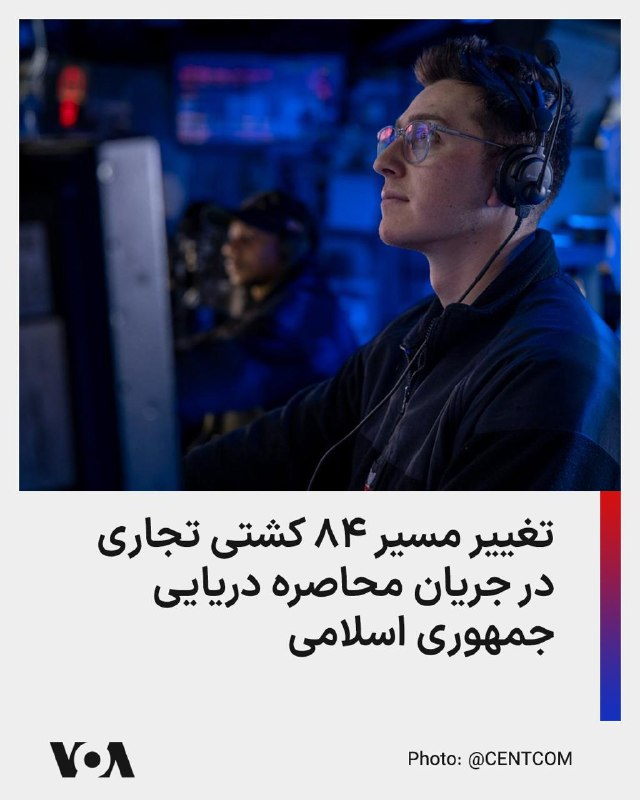

«یواس‌اس دلبرت دی. بلک» هنگام عبور از دریای عرب در حمایت از عملیات دریایی آمریکا علیه حوثی‌های مورد حمایت جمهوری اسلامی ایران در حال انجام ماموریت هستند.

سنتکام اعلام کرد تا روز ۲۸ اردیبهشت، نیروهای این فرماندهی مسیر ۸۴ کشتی تجاری را تغییر داده‌اند و چهار هدف را نیز از کار انداخته‌اند.

@FarsiVOA

## FarsiVOA — post 218064

🔺انتقاد پرزیدنت ترامپ از رویکرد برخی رسانه‌ها در رابطه با عملیات نظامی علیه رژیم ایران

▪️دونالد ترامپ، رئیس جمهوری ایالات متحده، روز دوشنبه ۲۸ اردیبهشت در پیامی در شبکه «تروت سوشال» ضمن تاکید دوباره بر شکست نظامی رژیم ایران، نوشت که رسانه‌های منتقد دولت او حتی در صورت تسلیم کامل جمهوری اسلامی نیز واقعیت را وارونه جلوه خواهند داد.

⬇️ بیشتر بخوانید:

https://ir.voanews.com/a/president-trump-truth-social-criticism-of-media-coverage-of-iran-war/8151224.html/?nocach=1

## FarsiVOA — post 218063

عراق دوباره در کانون تنش؛ حمله پهپادی به عربستان سعودی و بازگشت پرونده پهپادهای عراقی

## FarsiVOA — post 218062

نت‌بلاکس اعلام کرد خاموشی اینترنت در ایران وارد روز هشتادم شده و از مرز ۱۸۹۶ ساعت گذشته است. هم‌زمان رسانه‌های داخلی از ممنوعیت تبلیغ و فروش «اینترنت پرو» خبر دادند.

به گفته نت‌بلاکس، نهاد ناظر بر اختلالات اینترنت، هم‌زمان با قطع دسترسی گسترده کاربران ایرانی به اینترنت جهانی، محتوای حامی جمهوری اسلامی در شبکه‌های اجتماعی افزایش یافته است.

نت‌بلاکس همچنین نوشت برخی ایرانیانی که برای دریافت دسترسی ویژه یا قرار گرفتن در «فهرست سفید» اقدام کرده‌اند، می‌گویند از آنها خواسته شده برای حفظ این دسترسی، سهمیه‌ای از پست‌های تبلیغاتی روزانه منتشر کنند؛ روندی که به گفته این نهاد، با هوش مصنوعی کنترل می‌شود.

گزارش کامل را در وب‌سایت صدای آمریکا بخوانید.

@FarsiVOA

## FarsiVOA — post 218061

🔺کشته شدن یک فرمانده جهاد اسلامی در حمله ارتش اسرائیل به بقاع

▪️ارتش اسرائیل روز دوشنبه ۲۸ اردیبهشت، از کشته شدن وائل محمود عبدالحلیم، از فرماندهان جهاد اسلامی فلسطینی، در منطقه بقاع لبنان خبر داد.

⬇️ بیشتر بخوانید:

https://ir.voanews.com/a/palestinian-islamic-jihad-commander-israel-army-killed/8151197.html/?nocach=1

## DW_Farsi — post 124851

  

🔶 ادعای تازه در باره وضعیت مجتبی خامنه‌ای: «جراحات مختصر او بهبود یافته است»

حسین کرمان‌پور، مدیر مرکز روابط عمومی و اطلاع‌رسانی وزارت بهداشت، روز دوشنبه، ۲۸ اردیبهشت در گردهمایی روابط عمومی‌های دستگاه‌های اجرایی کشور با طرح این موضوع که مجتبی خامنه‌ای مجروح را در پی حمله آمریکا و اسرائیل به بیت پدرش به بیمارستان سینا بردند، مدعی شد که او جراحات مختصری داشته و حالا در سلامت کامل است: « خوشبختانه اتفاق خاصی برای رهبر انقلاب نیفتاده بود. فردی که در محل چنین حادثه‌ای باشد، طبیعتا چندین زخم بر روی بدن خود خواهد داشت. این زخم‌ها نیز زخم‌هایی نبود که بخواهد چهره رهبر انقلاب را مخدوش کند یا اینکه قطع عضو داشته باشند. اصلا اینگونه نیست. چند تا بخیه در محل جراحات زده شد. بخشی که همانجا تصمیم گرفته شد که بخیه زده شود روی پای ایشان بود.»

کرمان‌پور در ادامه می‌گوید که در پی انتقال مجتبی خامنه‌ای"به این فکر افتادیم که چگونه باید روایت‌سازی کنیم. همه جای دنیا در حال ساختن روایت بودند. برای ما کار خیلی سختی بود". ا و جزئیات بیشتری شرح نمی‌دهد که روایت برای چه می‌بایست تولید می‌شد و قراربود چه چیزی به مردم اطلاع داده شود یا از آنها پنهان نگه داشته شود.

حدود ده روز پیش مظاهر حسینی، مسئول دیدارهای دفتر علی خامنه‌ای، رهبر سابق جمهوری اسلامی، روایتی کمی متفاوت از وضعیت جراحات مجتبی خامنه‌ای بر اثر "موج انفجار" ارائه کرد و گفت که زمانی که مجتبی خامنه‌ای در حال بالا رفتن از پله‌ها بوده، بر اثر شلیک موشک "بین راه به زمین می‌افتد و کشکک پا و کمرش آسیب می‌بیند. کمر او در این ایام خوب شده و پا هم به زودی خوب خواهد شد".

@dw_farsi

## DW_Farsi — post 124850

  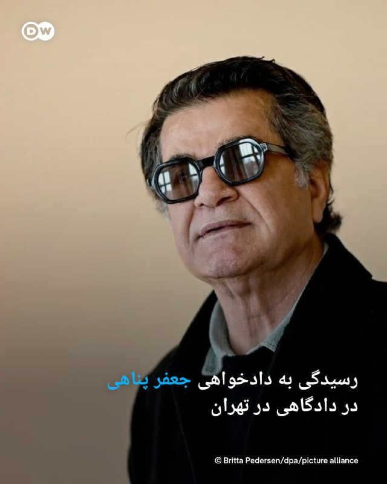

🔶 رسیدگی به دادخواهی جعفر پناهی در دادگاهی در تهران

روز چهارشنبه ۳۰ اردیبهشت، شعبه ۲۶ دادگاه انقلاب اسلامی تهران به ریاست قاضی ایمان افشاری، به پرونده جعفر پناهی رسیدگی خواهد کرد.

به گزارش خبرگزاری ایسنا پناهی که سال گذشته به‌صورت غیابی به اتهام "تبلیغ علیه نظام" به یک سال زندان محکوم شده بود، در شعبه‌ای از دادگاه انقلاب تهران حاضر خواهد شد.

پناهی به رغم خطر بازداشت و زندانی‌ شدن روز ۱۰ فروردین امسال به ایران بازگشت.

بر اساس گزارش ایسنا، جلسه رسیدگی پس از آن برگزار می‌شود که وکلای پناهی به حکم غیابی اعتراض و درخواست تجدیدنظر کرده‌اند. ریاست جلسه را ایمان افشاری، قاضی شناخته‌شده دادگاه‌های انقلاب که به صدور احکام سختگیرانه علیه مخالفان مشهور است، بر عهده خواهد داشت. اتحادیه اروپا افشاری را تحریم کرده است.

جعفر پناهی سال گذشته برای فیلم "یک تصادف ساده" نخل طلای جشنواره کن را دریافت کرد و نامزد جایزه اسکار نیز شد. او در آذرماه گذشته به‌صورت غیابی به یک سال زندان و همچنین دو سال ممنوعیت خروج از کشور محکوم شد.

پناهی پیش‌تر نیز در ایران زندانی شده بود؛ یک بار در سال ۱۳۹۹ به مدت نزدیک سه ماه و بار دیگر در سال‌ ۱۴۰۱ حدود هفت ماه در زندان بود. مقام‌های جمهوری اسلامی همچنین سال‌ها او را با ممنوعیت فیلمسازی و ممنوع‌الخروجی روبه‌رو کرده بودند.

@dw_farsi

## DW_Farsi — post 124849

  

🔶 تعلیق تحریم‌های نفتی ایران در جریان مذاکرات؟ ادعای تسنیم، تکذیب آکسیوس

خبرگزاری تسنیم، نزدیک به سپاه پاسداران، به نقل از یک منبع نزدیک به تیم مذاکره‌کننده ایران مدعی شد که "آمریکا در متن جدید خود اسقاط تحریم‌های نفتی ایران را پذیرفته است".

بنا بر این خبر، "آمریکایی‌ها برخلاف متون پیشین خود، در متن جدید پذیرفته‌اند که در طول دوره مذاکره، تحریم‌های نفتی ایران را Waive کنند". "ویو" کردن تحریم‌ها به معنای معافیت یا اسقاط موقت تحریم‌هاست.

ایران تاکید دارد که لغو همه‌ تحریم‌های ایران باید جزو تعهدات آمریکا باشد. آمریکا اما اسقاطی اوفک را تا زمان تفاهم نهایی مطرح کرده است.

منبع مورد استناد تسنیم همچنین گفته است که "با وجود برخی وعده‌ها، اختلاف درباره بازگشت پول‌های بلوکه شده وجود دارد".

در همین رابطه خبرگزاری رویترز به نقل از یک منبع ایرانی خبر داد که ایالات متحده در مذاکرات جاری، از جمله در مورد بحث هسته‌ای، انعطاف‌ پذیری نشان داده است.

@dw_farsi

## DW_Farsi — post 124848

  

🔶 محمد عوده به عنوان رهبر حماس در غزه معرفی شد

سازمان تروریستی حماس محمد عوده را به‌عنوان جانشین عزالدین حداد و رهبر این گروه در نوار غزه منصوب کرد.

بر اساس گزارش پایگاه خبری سعودی الشرق الاوسط، محمد عوده، رئیس دستگاه اطلاعاتی حماس، به‌عنوان جانشین عزالدین حداد و رهبر این گروه در نوار غزه و فرمانده شاخه نظامی آن منصوب شده است.

عزالدین حداد روز جمعه در یک حمله اسرائیل کشته شد.

گفته می‌شود عوده که در زمان حملات ۷ اکتبر ۲۰۲۳ رئیس اطلاعات نظامی گردان‌های القسام بود، رابطه نزدیکی با حداد داشته و پس از ترور رهبران پیشین، محمد ضیف و محمد سنوار، برای بازسازی "ساختار سازمانی" حماس با او همکاری کرده است.

الشرق الاوسط به نقل از یک منبع آگاه گزارش داده است که عوده پس از کشته شدن سنوار در ماه مه سال گذشته، ابتدا برای رهبری گردان‌های القسام پیشنهاد شده بود، اما این مسئولیت را نپذیرفت.

طبق این گزارش، عوده مأمور جمع‌آوری اطلاعات درباره پایگاه‌های ارتش اسرائیل در نزدیکی مرز غزه و همچنین نقاط ضعف لشکر غزه پیش از حملات ۷ اکتبر بوده است.

پیش‌تر روزنامه اسرائیلی هیوم نوشته بود که محمد عوده، "فرمانده کهنه‌کار حماس که از ترور جان سالم به در برد، نباید مشکلی برای انتصاب به سمت فرماندهی داشته باشد".

طبق همین گزارش "عوده که گاهی به عنوان فرمانده تیپ در شاخه نظامی خدمت کرده از لحاظ تئوری گزینه ایده‌آلی برای فرماندهی قسام است".

@dw_farsi

## DW_Farsi — post 124847

🔶 هزینه ده میلیارد یورویی دولت آلمان برای تقویت دفاع غیرنظامی

به گزارش روزنامه بیلد، الکساندر دوبرینت، وزیر کشور آلمان، در حال برنامه‌ریزی برای اجرای یک برنامه چند میلیارد یورویی جهت توسعه حفاظت از مردم و دفاع غیرنظامی است.

این روزنامه آلمانی، به نقل از پیش‌نویس مصوبه کابینه گزارش داده است که برای این منظور ۱۰ میلیارد یورو اختصاص داده خواهد شد. این بودجه از جمله قرار است برای تجهیزات اضافی، ساختمان‌ها، نیروی انسانی و فناوری، از جمله برای سازمان امداد فنی آلمان، هزینه شود.

الکساندر دوبرینت به این روزنامه گفت: «ما در زمینه حفاظت از جمعیت و دفاع غیرنظامی در حال تقویت توان خود هستیم.» به گفته این وزیر سوسیال مسیحی، هدف "اتخاذ موضعی قاطع در برابر تهدیدات هیبریدی" و نیز "حمایت پیگیرانه از نیروهای داوطلب" است.

بر این اساس، قرار است در وزارت کشور آلمان یک واحد جدید با عنوان "فرماندهی دفاع غیرنظامی" ایجاد شود. این واحد همچنین مسئول هماهنگی همکاری با ارتش آلمان در صورت بروز تهدیدهای احتمالی خواهد بود.

@dw_farsi

## DW_Farsi — post 124846

🔶 اعزام اسکادران جنگنده و هزاران سرباز پاکستانی به عربستان

پاکستان در گرماگرم میانجی‌گری میان آمریکا و ایران به تقویت بی‌سابقه همکاری نظامی خود با عربستان پرداخته است. اسلام‌آباد در چارچوب یک پیمان دفاعی مشترک، ۸ هزار نیروی نظامی، یک اسکادران جنگنده و یک سامانه پدافند هوایی به عربستان سعودی اعزام کرده است.

خبرگزاری رویترز در گزارشی اختصاصی از ابعاد گسترده  همکاری‌های نظامی پاکستان و عربستان که بر مبنای توافقی در شهریور گذشته به اجرا درآمده است خبر داده است.

مضمون گزارش رویترز که "توسط سه مقام امنیتی و دو منبع دولتی تأیید شده" از جمله این است که نیروهای اعزام‌شده به عربستان  یک یگان "قابل‌توجه و آماده عملیات رزمی" هستند که هدف آن حمایت از ارتش عربستان در صورت حملات بیشتر به این کشور است.

جزئیات کامل توافق دفاعی که سال گذشته امضا شد محرمانه است، اما دو طرف پیش‌تر گفته‌اند که این توافق، پاکستان و عربستان را ملزم می‌کند در صورت حمله به یکی از آن‌ها، از یکدیگر دفاع کنند. خواجه آصف، وزیر دفاع پاکستان، پیش‌تر تلویحاً گفته بود که این توافق عربستان را زیر "چتر هسته‌ای" پاکستان قرار می‌دهد.

@dw_farsi

## DW_Farsi — post 124844

🔶 اعتراض به غول رسانه‌ای؛ بینوش و ۶۰۰ سینماگر در فهرست سیاه

در فرانسه این روزها نبردی فرهنگی بر سر سینمای ملی در جریان است. اوایل هفته و همزمان با افتتاح جشنواره فیلم کن، بیش از ۶۰۰ فعال حوزه سینما از طریق روزنامه "لیبراسیون" طوماری علیه ونسان بولوره، سرمایه‌دار راستگرا، امضا کردند. بولوره طی سال‌های گذشته امپراتوری رسانه‌ای گسترده‌ای ایجاد کرده که تا شرکت بزرگ سرگرمی کانال پلاس (Canal+) نیز امتداد یافته است.

در میان امضاکنندگان نام‌های شناخته‌شده‌ای همچون ژولیت بینوش و آدل انل از میان بازیگران، و نیز کارگردانانی مانند ریموند دپاردون و دومینیک مول دیده می‌شود. در این بیانیه آمده است: «اگر سینمای فرانسه را به دست یک مالک راست‌افراطی بسپاریم، نه تنها خطر همگن‌سازی فیلم‌ها را می‌پذیریم، بلکه با خطر تصرف فاشیستی تخیل جمعی نیز روبه‌رو خواهیم شد.»

اکنون مدیران کانال پلاس واکنش نشان داده‌اند. ماکسیم سعدا، مدیرعامل این شرکت، اعلام کرد که کانال پلاس در آینده دیگر با هنرمندانی که بیانیه علیه بولوره را امضا کرده‌اند همکاری نخواهد کرد. او گفت این طومار در حق کارکنان کانال پلاس که به گفته او، همواره برای استقلال در کار خود کوشیده‌اند، ناعادلانه است.

@dw_farsi

## DW_Farsi — post 124843

  

🔶 سازمان بین‌المللی کار: جنگ خاورمیانه می‌تواند میلیون‌ها شغل را از بین ببرد

سازمان بین‌المللی کار هشدار داد جنگ خاورمیانه می‌تواند در سال‌های ۲۰۲۶ و ۲۰۲۷ میلیون‌ها شغل را در جهان از بین ببرد و موجب کاهش دستمزدهای واقعی شود. به گفته این نهاد وابسته به سازمان ملل، پیامدهای این بحران بسیار فراتر از منطقه تحت درگیری خواهد بود.

این سازمان روز دوشنبه ۱۸ مه در گزارشی اعلام کرد افزایش بهای انرژی، اختلال در حمل‌ونقل، فشار بر زنجیره‌های تامین، کاهش گردشگری و افت تقاضا برای نیروی کار مهاجر، اقتصاد کشورهای مختلف را تحت تاثیر قرار داده است.

سازمان بین‌المللی کار در این گزارش پیش‌بینی کرده اگر قیمت نفت حدود ۵۰ درصد بالاتر از میانگین پیش از آغاز حملات آمریکا و اسرائیل به ایران در ۲۸ فوریه باقی بماند، میزان ساعات کار در جهان در سال ۲۰۲۶ حدود نیم درصد و در سال ۲۰۲۷ حدود ۱.۱ درصد کاهش خواهد یافت.

به گفته این نهاد، این کاهش معادل از بین رفتن ۱۴ میلیون شغل تمام‌وقت در سال جاری و ۴۳ میلیون شغل در سال ۲۰۲۷ میلادی است. همچنین نرخ بیکاری جهانی در سال ۲۰۲۶ حدود ۱.۰ درصد و در سال ۲۰۲۷ حدود ۵.۰ درصد افزایش خواهد یافت.

در گزارش سازمان بین‌المللی کار آمده است که درآمد واقعی نیروی کار نیز کاهش خواهد یافت؛ به‌طوری‌که دستمزدهای واقعی در سال جاری ۱.۱ درصد و در سال ۲۰۲۷ حدود سه درصد افت می‌کند.

@dw_farsi

## Persian_Trend_Official — post 14429

  

📰پرزیدنت ترامپ به العربیه :
کار با عظمتی انجام می‌دهیم، و پیروزی پیش روی ماست.

🦁Phantom
🦁

✍@persian_trend_official
پرشین ترند | متفاوت‌ترین کانال نظامی

## Persian_Trend_Official — post 14428

کانال رسمی پرشین ترند pinned «ساعت 21 لایو رو آغاز میکنم»

## Persian_Trend_Official — post 14427

ساعت 21 لایو رو آغاز میکنم

## Persian_Trend_Official — post 14426

  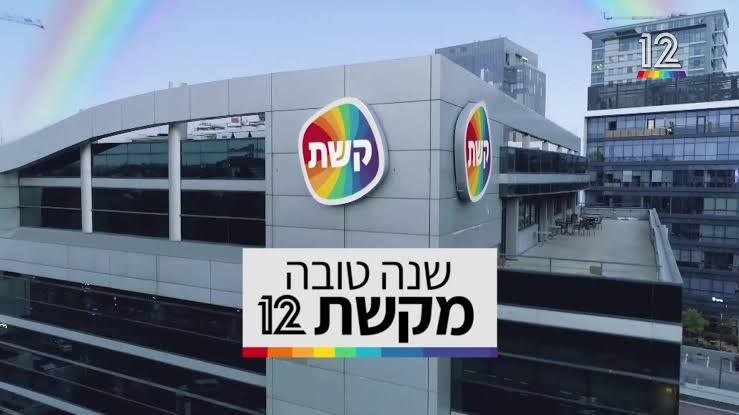

کانال ۱۲ اسرائیل:

ایران تنها چند روز، نه هفته‌ها، فرصت دارد تا چیزی به رئیس‌جمهور ترامپ ارائه دهد که بن‌بست را بشکند.

رئیس‌جمهور ترامپ تمایل دارد اقدام نظامی انجام دهد مگر اینکه ظرف چند روز چیزی از ایران دریافت کند.

🦁Phantom
🦁

✍persian_trend_official
پرشین ترند | متفاوت‌ترین کانال نظامی

## Persian_Trend_Official — post 14425

  <a href="telegram/content/Persian_Trend_Official_14425_1779124936.webm" target="_blank">🎬 Download video</a>

وقتی یک مستندسازِ ورشکستهٔ سیاسی، سناریوی«ترور شخصیت دکتر #روحانی»را برای دیده‌شدن کارگردانی می‌کند،دیگر مستندساز نیست؛کاسبِ التهاب است. اتهام‌زنی با این ادبیات،نه شجاعت است نه افشاگری؛سقوط اخلاقیِ کسی‌ است که روزی تاریخ شفاهی می‌ساخت و امروز برای دیده‌شدن، تاریخ را تحریف می‌کند.

کامبیز مهدیزاده داماد حسن روحانی !

📌 @persian_trend_official
پرشین ترند | متفاوت‌ترین کانال نظامی

## Persian_Trend_Official — post 14424

  <a href="telegram/content/Persian_Trend_Official_14424_1779124937.webm" target="_blank">🎬 Download video</a>

❤️ اگر از مخاطبان پرشین ترند هستید و تلگرام پرمیوم دارید،
با بوست کردن کانال کمک بزرگی به رشد و دیده‌شدن بیشتر پرشین ترند می‌کنید.
این بوست‌ها باعث می‌شود امکانات بیشتری برای انتشار محتوا، استوری و قابلیت‌های ویژه کانال فعال شود و در شرایط فعلی، به ادامه پوشش سریع و تحلیل‌های روزانه کمک زیادی می‌کند.
🙏 اگر مایل بودید، از طریق لینک زیر کانال را بوست کنید:
https://t.me/boost/persian_trend_official
📌 @persian_trend_official
پرشین ترند | متفاوت‌ترین کانال نظامی

## Persian_Trend_Official — post 14423

  <a href="telegram/content/Persian_Trend_Official_14423_1779124937.webm" target="_blank">🎬 Download video</a>

🇮🇷ایران از شرکت‌های بزرگ فناوری آمریکا از جمله گوگل، مایکروسافت، متا و آمازون درخواست دریافت هزینه مجوز برای «کابل‌های اینترنت زیرآبی» واقع در تنگه هرمز و خلیج فارس کرده است.

🐣
🪙
🛒
🖥
🖥

🇮🇷سپاه پاسداران تهدید کرده است که در صورت عدم رعایت مقررات محلی توسط این شرکت‌ها، ترافیک را محدود خواهد کرد که ممکن است «اتصال داده‌ها بین اروپا، آسیا و خاورمیانه را مختل کند».

کابل‌های عبوری از تنگه هرمز و دریای سرخ ۱۷٪ از ترافیک جهانی را حمل می‌کنند.

🦁Phantom
🦁

🌏@persian_trend_official
پرشین ترند | متفاوت‌ترین کانال نظامی

## Persian_Trend_Official — post 14422

  <a href="telegram/content/Persian_Trend_Official_14422_1779124938.webm" target="_blank">🎬 Download video</a>

📌توی این روزا که بازار فروش vpn داغه
یه تیم که پشتیبانی خوبی داشته باشه و خدماتش گارانتی داشته باشه کم پیدا میشه

تراست vpn همه اینارو داره و من با خیال راحت معرفیش می‌کنم

همین الان برای خرید بهشون پیام بدین

@trusstvpnn_admin
@trusstvpnn_admin
@trusstvpnn_admin

## Persian_Trend_Official — post 14421

*هنوز جنگ تموم نشده

## Persian_Trend_Official — post 14420

  <a href="telegram/content/Persian_Trend_Official_14420_1779124938.webm" target="_blank">🎬 Download video</a>

هیچوقت قبل از تموم شدن ماجرا خوشحالی نکنید ! 📌 @persian_trend_official پرشین ترند | متفاوت‌ترین کانال نظامی

## Persian_Trend_Official — post 14419

  <a href="telegram/content/Persian_Trend_Official_14419_1779124938.mp4" target="_blank">🎬 Download video</a>

هیچوقت قبل از تموم شدن ماجرا خوشحالی نکنید !

📌 @persian_trend_official
پرشین ترند | متفاوت‌ترین کانال نظامی

## Persian_Trend_Official — post 14418

پست کنایه آمیز پرزیدنت ترامپ : اگر ایران تسلیم شود، اعتراف کند که نیروی دریایی‌اش نابود شده و در کف دریا آرمیده است، و نیروی هوایی‌اش دیگر وجود ندارد، و اگر تمام ارتش آن با انداختن سلاح‌ها و بالا بردن دست‌ها از تهران خارج شود و هر کدام فریاد بزنند «من تسلیم…

## Persian_Trend_Official — post 14417

  

پست کنایه آمیز پرزیدنت ترامپ :
اگر ایران تسلیم شود، اعتراف کند که نیروی دریایی‌اش نابود شده و در کف دریا آرمیده است، و نیروی هوایی‌اش دیگر وجود ندارد، و اگر تمام ارتش آن با انداختن سلاح‌ها و بالا بردن دست‌ها از تهران خارج شود و هر کدام فریاد بزنند «من تسلیم می‌شوم، من تسلیم می‌شوم» در حالی که دیوانه‌وار پرچم سفید را تکان می‌دهند، و اگر تمام رهبران باقی‌مانده‌شان همه «اسناد تسلیم» لازم را امضا کنند و شکست خود را در برابر قدرت و نیروی عظیم و باشکوه ایالات متحده آمریکا بپذیرند، نیویورک تایمزِ شکست‌خورده، وال‌استریت ژورنالِ چینی (WSJ!)، سی‌ان‌انِ فاسد و حالا بی‌ربط، و تمام دیگر اعضای رسانه‌های اخبار جعلی تیتر خواهند زد که ایران یک پیروزی استادانه و درخشان بر ایالات متحده آمریکا به دست آورده است؛ حتی نزدیک هم نبود. دموکرات‌ها و رسانه‌ها کاملاً راه خود را گم کرده‌اند. آن‌ها کاملاً دیوانه شده‌اند!!!!

رئیس‌جمهور Donald John Trump

## Persian_Trend_Official — post 14416

  <a href="telegram/content/Persian_Trend_Official_14416_1779124941.webm" target="_blank">🎬 Download video</a>

💥
💥
💥

📰:کاخ سفید پیشنهاد تجدیدنظر شده ایران برای پایان دادن به درگیری جاری را رد کرده و آن را ناکافی دانسته است.

🇮🇷
🇺🇸مقامات آمریکایی هشدار داده‌اند که اگر تهران در برنامه هسته‌ای خود امتیازات عمده‌ای ندهد، ممکن است اقدامات نظامی از سر گرفته شود. (منبع Axios)

🦁Phantom
🦁

✉️@persian_trend_official
پرشین ترند | متفاوت‌ترین کانال نظامی

## Persian_Trend_Official — post 14415

  <a href="telegram/content/Persian_Trend_Official_14415_1779124941.webm" target="_blank">🎬 Download video</a>

⚠️ هشدار مهم!

یه تکنیک جدید هکرها پیدا شده که دارن از کپچا استفاده می‌کنن برای نفوذ به گوشی و کامپیوترت!

🔴 چطور کار می‌کنه؟

وقتی می‌خوای وارد یه سایت بشی، یه صفحه شبیه کپچای معمولی (با لوگوی Cloudflare) باز می‌شه. بعد ازت می‌خواد:
• کلیدهای Win + R رو فشار بدی
• یه دستور آماده رو پیست کنی
• اینتر بزنی

نتیجه؟ 🔥
بدون اینکه بفهمی، تروجان و جاسوس‌افزار روی سیستمت نصب می‌شه و اطلاعاتت به سرقت می‌ره!

📈 آمار ترسناک:
موارد این نوع حمله امسال ۵۶۳ درصد افزایش یافته!

✅ چطور تشخیص بدی؟
کپچای واقعی هیچ‌وقت ازت نمی‌خواد وارد Run ویندوز بشی یا دستوری اجرا کنی. هرچیزی غیر از انتخاب تصویر = تقلبی!

👆 مراقب باشید، به دوستاتون هم بگید!

📝 Nick

📌 @persian_trend_official
پرشین ترند | متفاوت‌ترین کانال نظامی

## RadioFarda — post 157318

  <a href="https://t.me/radiofarda/157318" target="_blank">📎 Download file</a>

📻بشنوید: ایستگاه ۱۹ با رادیوفردا، ۲۸ اردیبهشت ۱۴۰۵

@RadioFarda

## RadioFarda — post 157317

سامانه‌های دفاعی عراق «هیچ پهپادی را در مسیر عربستان شناسایی نکردند»

🔸در پی انتشار خبری از ورود سه پهپاد به حریم هوایی عربستان سعودی، وزارت امور خارجه عراق روز دوشنبه اعلام کرد که سامانه‌های دفاعی این کشور هیچ پهپادی را در مسیر عربستان شناسایی و رهگیری نکرده‌اند.

🔸عربستان سعودی روز یکشنبه ۲۷ اردیبهشت اعلام کرد سه پهپاد را که از حریم هوایی عراق وارد این کشور شده بودند، رهگیری و منهدم کرده است.

🔸ترکی مالکی، سخنگوی وزارت دفاع عربستان، گفت این پهپادها روز یکشنبه وارد حریم هوایی عربستان شدند که نیروی دفاعی این کشور موفق به رهگیری و نابودی آن‌ها شد.

🔸سخنگوی وزارت دفاع عربستان تأکید کرد وزارت دفاع این‌ کشور حق پاسخ‌گویی در زمان و مکان مناسب را برای خود محفوظ می‌داند.

🔸در پاسخ به این خبر، دولت عراق می‌گوید روند تحقیق در این باره را آغاز کرده است.

🔸وزارت خارجه عراق هم روز دوشنبه ضمن اشاره به این که هیچ پهپادی در فضای عراق شناسایی نشده از ریاض خواست «اطلاعات مربوطه» را در اختیار بغداد بگذارد تا «از آن برای تضمین تقویت امنیت و ثبات در دو کشور دوست و برادر استفاده شود».

@RadioFarda

## RadioFarda — post 157316

فرماندار سقز ادعای خبرگزاری سپاه درباره حمله پژاک به یک معدن را دروغ خواند

🔸ساعاتی پس از آن که خبرگزاری فارس، نزدیک به سپاه پاسداران، مدعی حمله گروه کرد پژاک، حیات آزاد کردستان، به یک معدن در حوالی شهر سقز شد، فرماندار این شهر خبر را «کذب» خواند.

🔸خبرگزاری فارس صبح دوشنبه بدون اشاره به نام منبع یا منابع خبر خود نوشت: «حوالی ساعت یک بامداد امروز [دوشنبه] گروهک تروریستی پژاک با ۳ خودرو به معدن میرگه نقشینه در سقز حمله کرد. تروریست‌ها ابتدا دست‌وپای هردو نگهبان معدن را بستند و تلفن همراه آن‌ها را خاموش کردند، سپس اقدام به آتش‌ زدن تجهیزات معدن کردند.»

🔸حال ضیاالدین نعمانی، فرماندار سقز، به رسانه‌ها گفته است که «ادعای وقوع حمله تروریستی به این معدن صحت ندارد».

🔸نعمانی در ادامه چنین توضیح داده است: «سال گذشته نیز اتفاقی مشابه در معدن قلقله رخ داده بود که شباهت زیادی به حادثه اخیر دارد و به نظر می‌رسد این اقدامات با هدف باج‌خواهی و تعرض به معادن انجام شده باشد.»

@RadioFarda

## RadioFarda — post 157315

🔸مدیر مرکز روابط عمومی و اطلاع‌رسانی وزارت بهداشت جمهوری اسلامی روز دوشنبه ادعا کرد که در حمله اسرائیل به بیت خامنه‌ای «اتفاق خاصی» برای مجتبی خامنه‌ای نیفتاده است. 🔸در روز ۹ اسفندماه سال گذشته که حمله اسرائیل به بیت علی خامنه‌ای در مرکز تهران جان او و ده‌ها…

## RadioFarda — post 157314

  

🔸مدیر مرکز روابط عمومی و اطلاع‌رسانی وزارت بهداشت جمهوری اسلامی روز دوشنبه ادعا کرد که در حمله اسرائیل به بیت خامنه‌ای «اتفاق خاصی» برای مجتبی خامنه‌ای نیفتاده است.

🔸در روز ۹ اسفندماه سال گذشته که حمله اسرائیل به بیت علی خامنه‌ای در مرکز تهران جان او و ده‌ها مقام ارشد حکومت را گرفت، مجتبی خامنه‌ای نیز در این محل حضور داشت و به‌شدت آسیب دید، اما به گفته حکومت زنده ماند.

🔸در بیش از دو ماه گذشته که نام او به عنوان رهبر سوم جمهوری اسلامی اعلام شد، نه فایلی صوتی از او منتشر شده و نه ویدئویی که تصویری تازه از او نشان دهد؛ این در حالی است که در و دیوار شهرها در کشور از عکس او پوشیده شده و حامیان حکومت گه‌گاه عکسی ساخته‌شده با هوش مصنوعی هم از او منتشر می‌کنند.

🔸با این همه خبرگزاری ایسنا به نقل از حسین کرمانپور نوشته است: «خوشبختانه اتفاق خاصی برای رهبر انقلاب نیفتاده بود. فردی که در محل چنین حادثه‌ای باشد، طبیعتا چندین زخم بر روی بدن خود خواهد داشت. این زخم‌ها نیز زخم‌هایی نبود که بخواهد چهره رهبر انقلاب را مخدوش کند یا اینکه همانند امام شهید ما جانبازی بگیرند یا قطع عضو داشته باشند.»

@RadioFarda

## IranianMinds — post 20356

  

🔴 کانال ۱۲ اسرائیل : آمریکا پیشنهاد جدید و بازنگری شده ایران را رد کرده است. @IranianMinds

## IranianMinds — post 20355

🔴 کانال ۱۲ اسرائیل :

آمریکا پیشنهاد جدید و بازنگری شده ایران را رد کرده است.

@IranianMinds

## IranianMinds — post 20354

ما و جمهوری اسلامی، دوتا هستیم و یکی نخواهیم شد.
سعی بر این است که توسط ابزاری چون “ وحشت از لولوی خارجی ( دشمن ) “ مردم و حکومت را یکی و یکپارچه کنند.
بله وطن ، پایگاه و خانه ای مشترک و کارخانه ای وحدت ساز است اما نه بین مردم و حکومت. ما و این حکومت، هیچ وجه اشتراکی باهم نداریم.
ما و رژیم جمهوری اسلامی، دوتا ایم.

## IranianMinds — post 20353

  

🔴وزیر خزانه‌داری ایالات متحده، مجوزی ۳۰ روزه صادر کرد که به کشورهای آسیب‌پذیر اجازه می‌دهد نفت روسیه‌ای را که در دریا سرگردان مانده است خریداری کنند.
@IranianMinds

## IranianMinds — post 20352

  <a href="telegram/content/IranianMinds_20352_1779124943.mp4" target="_blank">🎬 Download video</a>

🔴افغانی هستی؟
بله.
پس،،،،، ننت😂😂😂

@IranianMinds

## IranianMinds — post 20350

🔴 العربیه: وزیر کشور پاکستان بعد از رد آخرین پیشنهاد ایران توسط آمریکا، دقایقی پیش ایران رو ترک کرد!

@IranianMinds

## IranianMinds — post 20349

🔴ترامپ به العربیه:

کار با عظمتی انجام می‌دهیم و پیروزی پیش روی ما است.

@IranianMinds

## IranianMinds — post 20348

🔴رویترز هم تأیید کرده که پیشنهاد جدید و آخر جمهوری اسلامی توسط آمریکا رد شده.

@IranianMinds

## IranianMinds — post 20347

🔴 مقامات رژیم :

پالایشگاه و زیرساخت‌های پتروشیمی آسیب‌دیده در منطقه پارس جنوبی طی حدود دو سال بازسازی خواهند شد و انتظار می‌رود حدود نیمی از ظرفیت آن‌ها پیش از زمستان احیا شود.

مقام‌ها گفته‌اند این تأسیسات با فناوری ارتقایافته و ظرفیت تولید بالاتر دوباره به مدار بازخواهند گشت.

@IranianMinds

## IranianMinds — post 20346

🔴روزنامه ایران:

از وقتی اینترنت تو ایران قطع شده فروش سیمکارت عراقی زیاد شده؛
چون این سیمکارتا تا 2کیلومتری داخل ایران جواب میدن و مردم تو شهرهای مرزی با عراق میرن سیمکارت عراقی میخرن و میرن 2 کیلومتری مرز تا کارشونو انجام بدن.

@IranianMinds

## IranianMinds — post 20345

  <a href="telegram/content/IranianMinds_20345_1779124944.webm" target="_blank">🎬 Download video</a>

💥 با هر ثبت نام 
🅰️
🅰️
🅰️ هزار تومن جایزه بگیرید

✔️ میتونید شرط‌بندی کنید و بونوس را به موجودی واقعی تبدیل کنید

⚽️  پوشش کامل مسابقات ورزشی 

💯  پیش‌بینی با بهترین ضرایب 

⭐️ تجربه سریع و حرفه‌ای

💰پرداخت مستقیم و سریع بدون واسطه، بدون دردسر، واریز و برداشت در سریع‌ترین زمان ممکن

☑️ کانال تلگرام: 

➡️ @winro_io  

🎁 هدیه خود را با ثبت نام در سایت دریافت کنید: 

➡️ Winro.io
G28
سایت اصلی در روزهای آینده بازگشایی خواهد شد A
💎

## IranianMinds — post 20344

🔴 فوری - آکسیوس به نقل از مقامات آمریکایی:

آخرین پیشنهاد ایران توسط آمریکا رد شد.
این پیشنهاد حتی چیزی نزدیک به خواسته های آمریکا برای رسیدن به یک توافق نیست.

@IranianMinds

## IranianMinds — post 20343

🔴 فوری - یک مقام آمریکایی :

آمریکا مجبور است مذاکرات را از طریق بمب ها ادامه دهد

@IranianMinds

## IranianMinds — post 20342

  

🔴ترامپ:
«اگر ایران تسلیم شود، اعتراف کند که نیروی دریایی‌اش از بین رفته و در ته دریا است، و نیروی هوایی‌اش دیگر با ما نیست، و اگر کل ارتش‌شان از تهران خارج شود، سلاح‌ها را رها کرده و دست‌ها را بالا ببرند، هر کدام فریاد بزنند «من تسلیم می‌شوم، من تسلیم می‌شوم» در حالی که پرچم سفید نماینده را به شدت تکان می‌دهند، و اگر تمام رهبران باقی‌مانده‌شان همه «اسناد تسلیم» لازم را امضا کنند و شکست خود را در برابر قدرت و نیروی بزرگ و باشکوه ایالات متحده آمریکا بپذیرند، روزنامه‌های در حال سقوط نیویورک تایمز، وال استریت ژورنال چین (WSJ!)، سی‌ان‌ان فاسد و اکنون بی‌اهمیت، و همه اعضای دیگر رسانه‌های خبری جعلی، تیتر خواهند زد که ایران پیروزی استادانه و درخشانی بر ایالات متحده آمریکا داشته است، حتی نزدیک هم نبود. دموکرات‌ها و رسانه‌ها کاملاً راه خود را گم کرده‌اند. آنها کاملاً دیوانه شده‌اند!!!» رئیس‌جمهور دی‌جی‌تی

@IranianMinds

## IranianMinds — post 20341

🔴منبع آمریکایی به الجزیره:

صبر رئیس‌جمهور ترامپ به دلیل عدم پیشرفت در پرونده ایران، رو به پایان است.

@IranianMinds

## BBCPersian — post 281387

  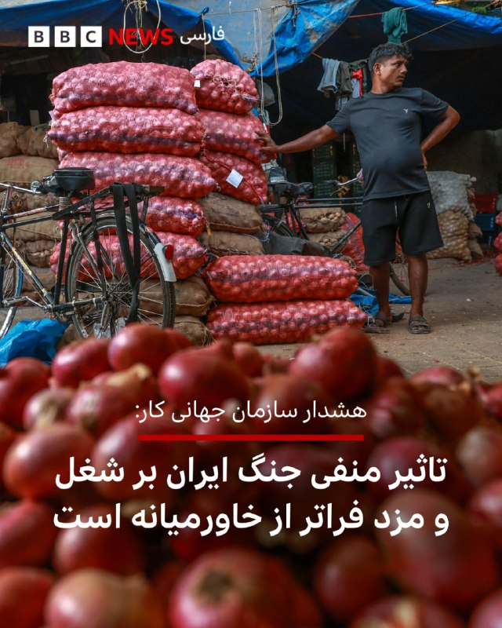

🔻سازمان جهانی کار وابسته به سازمان ملل متحد هشدار داد که جنگ در خاورمیانه بر دستمزدها و شرایط کاری تاثیر منفی خواهد داشت و این تاثیر بسیار فراتر از مناطق درگیر جنگ خواهد بود. سازمان جهانی کار اعلام کرد که خاورمیانه و کشورهای حوزه خلیج فارس و منطقه آسیا و اقیانوسیه بیشترین آسیب را خواهند دید که می‌تواند از دوران همه‌گیری کرونا بدتر باشد.

سانگ هورن لی،‌ اقتصاددان ارشد سازمان جهانی کار و نویسنده این گزارش، گفت: «بحران خاورمیانه، فراتر از خسارت انسانی،‌ یک اختلال کوتاه مدت نیست و می‌تواند اثرات طولانی‌مدت داشته باشد که به‌تدریج به تغییر شکل بازارهای کار منجر شود.»

سازمان جهانی کار در گزارشی که امروز منتشر کرد، پیش‌بینی کرد که این جنگ ممکن است به قیمت از دست رفتن میلیون‌ها شغل تمام شود و دنیا شاهد کاهش دستمزد در ادامه امسال و سال آینده میلادی خواهد بود به‌ویژه برای مهاجرانی که به کشورهای خودشان پول می‌فرستند از جمله در جنوب و جنوب شرقی آسیا.

ادامه خبر را از لینک زیر در وبسایت بی‌بی‌سی فارسی بخوانید.

📷 EPA
https://bbc.in/4diJ6bZ
@BBCPersian

## BBCPersian — post 281386

🔻اتحادیه اروپا برخی تحریم‌های سوریه را لغو کرد اما تحریم‌های مرتبط با حکومت اسد را برقرار نگه داشت
اتحادیه اروپا تحریم‌ها علیه افراد و نهادهای مرتبط با حکومت سابق سوریه به رهبری بشار اسد را برای یک سال دیگر تمدید کرد اما همزمان به برخی از تحریم‌های حکومت فعلی سوریه، پایان داد.

رفع تحریم‌ها شامل هفت نهاد سوری است، از جمله وزارتخانه‌های دفاع و کشور.

اتحادیه اروپا اعلام کرده که این تصمیم با هدف تقویت تعامل اتحادیه اروپا با سوریه انجام شده است.

اتحادیه اروپا یک سال پیش تمامی تحریم‌های اقتصادی علیه سوریه را با هدف «حمایت از گذار مسالمت‌آمیز و فراگیر این کشور، بهبود وضعیت اجتماعی-اقتصادی و بازسازی» لغو کرد و تحریم‌های مرتبط با حکومت بشار اسد را برقرار نگه داشت.

اتحادیه اروپا در بیانیه‌ای گفت که «بر این باور است که شبکه‌های وابسته به رژیم پیشین اسد همچنان نفوذ خود را حفظ کرده‌اند و خطر تضعیف روند گذار سیاسی و مانع‌تراشی در مسیر آشتی ملی و پاسخ‌گویی را به همراه دارند.»

اتحادیه اروپا اولین بار در سال ۲۰۱۱ و در واکنش به سرکوب خشونت‌آمیز غیرنظامیان از سوی حکومت اسد، تحریم‌هایی را علیه سوریه اعمال کرده بود.

https://bbc.in/4ukERmj
@BBCPersian

## BBCPersian — post 281385

  

🔻استاندار خراسان جنوبی از افزایش شدید میزان واردات از افغانستان به ایران از زمان آغاز جنگ آمریکا و اسرائیل با ایران خبر داد.

به گزارش ایرنا، محمدرضا هاشمی گفت که از ابتدای جنگ اخیر میزان واردات از افغانستان به خراسان جنوبی از مسیر گذرگاه مرزی ماهیرود به فراه «۸۴۶ درصد» و از نظر ارزش دلاری ۴۴۱ درصد افزایش داشته است.

به گزارش بی‌بی‌سی دری، به گفته وزارت صنعت و تجارت حکومت طالبان، «پنبه، پیاز، انجیر، زعفران، نوشابه، گیاه‌های طبی و مواد معدنی» از مهمترین اقلام صادراتی افغانستان به ایران است و در مقابل، «نفت و گاز، مواد ساختمانی، فرش، مواد خوراکی، وسایل الکترونیک و انواع شوینده‌ها» از مهمترین کالاهای صادراتی ایران به افغانستان است.

حسین زارعی،‌ مدیرعامل منطقه ویژه اقتصادی خراسان جنوبی، هم به خبرگزاری ایرنا گفت که خدمات مرزی قبلا تا ساعت ۱۶ انجام می‌شد اما با افزایش حجم مراجعه و فعالیت‌ تجاری،‌ ساعت کار خدمات مرزی به ساعت ۱۰ حتی ۱۱ شب افزایش پیدا کرد و همین باعث افزایش قابل توجه میزان صادرات و واردات شده است.

📷 AFP via Getty Images
https://bbc.in/4uOLJbc
@BBCPersian

## BBCPersian — post 281384

یکی از این منابع گفت که پاکستان همچنین دو اسکادران پهپاد ارسال کرده است. هر پنج منبع به رویترز گفتند که ۸۰۰۰ سرباز در عربستان مستقر شدند و وعده داده شده است که در صورت نیاز تعداد بیشتری اعزام شود. به گفته این منابع، سیستم دفاع هوایی چینی اچ‌‌کیو-۹ هم به این کشور ارسال شده است.
بر اساس این گزارش، مسئولیت اداره تجهیزات بر عهده پرسنل پاکستانی است اما عربستان سعودی هزینه آن را می‌پردازد.
شهریور ماه گذشته، پاکستان و عربستان سعودی از امضای یک پیمان دفاعی خبر داده بودند که بر اساس آن، هرگونه تجاوز علیه هر یک از دو کشور به‌عنوان اقدامی خصمانه علیه هر دو تلقی می‌شود. در مقابل قرار شد که عربستان سعودی به پاکستان که یک قدرت هسته‌ای است، نفت ارزان و کمک مالی دهد.
افزایش همکاری نظامی پاکستان و عربستان در حالی است که اسلام‌آباد در جنگ آمریکا و اسرائیل با ایران نقش میانجی را بر عهده داشته است.

@BBCPersian

## BBCPersian — post 281383

  

🔻خبرگزاری رویترز به نقل از دو منبع می‌گوید که پاکستان در چارچوب پیمان دفاعی خود با ریاض، ۸۰۰۰ نیرو،‌ یک اسکادران هواپیمای جنگی و یک سامانه پدافند هوایی در عربستان مستقر کرده است.

پیشتر وزارت دفاع عربستان بدون اشاره به جزئیات، استقرار شماری جنگنده و نیروی پاکستان در چارچوب توافق دو کشور را اعلام کرده بود اما حالا رویترز برای اولین بار جزییات بیشتری ارائه کرده است.

رویترز در گزارش اختصاصی خود، از سه مقام امنیتی و دو منبع دولتی نقل کرده است که نیروی مستقر شده دارای قابلیت رزمی است و هدف از اعزام آن، دفاع از عربستان در صورت حملات بیشتر به آن کشور است.

رویترز می‌گوید که وزارت خارجه و دفتر مطبوعاتی ارتش پاکستان و دفتر رسانه‌ای دولت عربستان سعودی به درخواست این خبرگزاری برای اظهارنظر پاسخی ندادند.

به گفته این منابع، هواپیماهای جنگی شامل حدود ۱۶ هواپیماست که عمدتا از جنگنده‌های «جی‌اف-۱۷» است که مشترکا با چین ساخته شده‌اند؛ این هواپیماها اوایل ماه آویل به پاکستان فرستاده شده بودند.

📷 AFP via Getty Images
https://bbc.in/49G1IjH
@BBCPersian

## BBCPersian — post 281382

🔻ایران: طرح خاصی درباره پیمان عدم تعرض از کشورهای منطقه دریافت نکردیم
ایران گزارش‌های اخیر درباره پیشنهاد عربستان سعودی برای امضای توافق منع تعرض را تکذیب کرد.

اسماعیل بقایی، سخنگوی وزارت خارجه ایران، در پاسخ به سوالی در این باره گفت: «نمی‌توانم بگویم طرح خاصی مطرح شده است.»

در روزهای اخیر گزارش‌هایی، از جمله در روزنامه آمریکایی وال‌استریت جورنال، منتشر شده بود که می‌گفت عربستان سعودی پیشنهاد امضای یک پیمان عدم تعرض بین ایران و کشورهای منطقه را مطرح کرده است.

ایران در جنگ با اسرائیل و آمریکا که نهم اسفند (۲۸ فوریه) آغاز شد، برخی اهداف در کشورهای منطقه را با موشک و پهپاد هدف قرار داد.

https://bbc.in/3R7PVV9
@BBCPersian

## BBCPersian — post 281381

  

🔻‌روسیه و بلاروس امروز رزمایش مشترک هسته‌ای برگزار کردند. به گفته وزارت دفاع بلاروس، در رزمایش امروز «تحویل مهمات هسته‌ای و آماده‌سازی برای استفاده از آن» تمرین می‌شود.

این وزارتخانه تاکید کرد که این آموزش از پیش برنامه‌ریزی شده است و «علیه کشورهای ثالث نیست و تهدیدی برای امنیت منطقه محسوب نمی‌شود.» نیروی هوایی و یگان‌های موشکی در این رزمایش شرکت داشتند.

این اولین رزمایش هسته‌ای مشترک دو کشور نیست؛ در دو سال گذشته دو کشور هر سال یک رزمایش هسته‌ای مشترک داشته‌اند.

روسیه سال گذشته موشک «اورشنیک»، جدیدترین موشک هایپرسونیک با قابلیت حمل کلاهک هسته‌‌ای، را در بلاروس مستقر کرد و تنش با ائتلاف کشورهای غربی را وارد مرحله‌ای حساس‌تر کرد.

وزارت دفاع بلاروس امروز گفت: «در جریان این رزمایش، برنامه‌ریزی این است که موضوعات مربوط به تحویل مهمات هسته‌ای و آماده‌سازی برای استفاده از آنها در همکاری با طرف روسی تمرین شود.»

ادامه خبر را از لینک زیر در وبسایت بی‌بی‌سی فارسی بخوانید.

شرح تصویر: عکسی که ارتش روسیه از رزمایش مشترک با بلاروس در سال ۲۰۲۴ منتشر کرد
📷 Russian Defense Ministry
https://bbc.in/4uSiQLf
@BBCPersian

## Dirty_Kids — post 389694

  

به بابات بگو هرکی صحبت از خایه کرد اشکال نداره ولی تو یکی گوه نخور…

@Dirty_Kids 👻

## Dirty_Kids — post 389693

  

چجوری تو هوای روشن پیتزا میخورین؟!
بابا یه سری غذاها مال روشناییه یه سریاش مال تاریکی.

@Dirty_Kids 👻

## Dirty_Kids — post 389692

  <a href="telegram/content/Dirty_Kids_389692_1779124949.mp4" target="_blank">🎬 Download video</a>

انتقاد تند همشهری به سریال «تهران کنارت»

بچه جون بزرگترات مجوز دادن چون اوضاع‌ خیته، اسکل تو خیابون مجوز عرقخوری هم دادن به پرستوهاتون:))))

به خودتم مجوز دادن که بیای انتقاد کنی که مثلا قشر خرمذهبی رو راضی کنی و همچنین این فیلم‌رو وایرال کنی ذهن‌هارو منحرف کنی از فلاکت مملکت

ولی این وسط توئیت سوگند عالی بود، ندیده بودم

@Dirty_Kids 👻

## Dirty_Kids — post 389691

✖️ سایت بین المللی bet120x 
✖️  
👍دارای مجوز رسمی Gambling Judge سوئد
👍       
💳شارژ حساب از طریق ارز و یووچر و پرمیوم ووچر 
💳تسویه حساب دلاری سریع 💊بیمه شرط میکس 
⚠️فروش شرط 
🔔ویرایش شرط                    
3️⃣
2️⃣ 
🎁20%هدیه واریز از طریق ارز و ووچر ┅━━━━━━━━━━━…

## Dirty_Kids — post 389690

  

✖️ سایت بین المللی bet120x 
✖️

 
👍دارای مجوز رسمی Gambling Judge سوئد
👍
     

💳شارژ حساب از طریق ارز و یووچر و پرمیوم ووچر

💳تسویه حساب دلاری سریع
💊بیمه شرط میکس

⚠️فروش شرط

🔔ویرایش شرط                    
3️⃣
2️⃣

🎁20%هدیه واریز از طریق ارز و ووچر
┅━━━━━━━━━━━

🎁 10%برگشت باخت به صورت روزانه

🎁 10%برگشت باخت به صورت هفتگی

🎁10%برگشت باخت به صورت ماهانه

💻ادرس ورود به سایت:
https://bet120x.com/fa/?btag=971470
➖➖➖➖➖
   
👈 آموزش واریز و برداشت دلاری
👉

🔪کانال اطلاع رسانی:
👇

✈️https://t.me/+1Wv5nGY_a54xNzlk

## Dirty_Kids — post 389689

  <a href="telegram/content/Dirty_Kids_389689_1779124951.mp4" target="_blank">🎬 Download video</a>

حکومتی‌ها پرچم مبارزه با امریکا رو بلند میکنن ولی تا خشتک امریکایی هستن و کمک به اقتصاد امریکا میکنن

@Dirty_Kids 👻

## Dirty_Kids — post 389688

  

شورتش کو :))))))
#تراپی

@Dirty_Kids 👻

## Dirty_Kids — post 389687

  

🌪وقتی اینترنت طوفانیه... کافیه بادبان ها رو بکشی تا

⚫️با بالاترین کیفیت ممکن
⚡️ 

⚫️100 هزار تومان شارژ هدیه 
🎁

⚫️پایین ترین قیمت گیگی 250
🌐 

⚫️و ارائه پورسانت %10 در ازای هر معرفی
💼

بتونی یه اتصال پایدار با پشتیبانی 24 ساعته داشته باشی
🚀

بادبان راهتو باز می‌کنه
⛵️

G28

🛡@BadBan_VPN | کانال 

🤖@BadBan_VPNBot | ربات 

📞@BadBan_VPNSupport | پشتیبانی

## Dirty_Kids — post 389686

🔴 باراک راوید خبرنگار ارشد آکسیوس | axios:

یه مقام ارشد آمریکایی به من گفته که پیشنهاد جدید ایران به آمریکا کافی نیست و خطر شروع دوباره‌ی جنگ رو به همراه داره.

اگر جمهوری اسلامی موضع خودشو تغییر نده، آمریکا مجبوره مذاکرات رو از طریق بمب ادامه بده.

@Dirty_Kids 👻

## Dirty_Kids — post 389685

  

🔴 پست جدید شیر کارد به استخوان رسیده‌ی خدا در تروث‌سوشال در خصوص فیک‌نیوزهایی که کله‌ی شیر خدا رو کیری می‌کنن:

«حتی اگه رژیم شیعه‌سانان پدرخراب رافضی تسلیم شن و اعتراف کنن که نیروی دریایی‌‌شون [یا خدا شروع کرد خاطره گفتن] نابود شده و کف دریا جا خوش کرده، و بگه که نیروی هوایی‌‌شون دیگه وجود خارجی نداره و اگه تمام ارتش‌شون سلاح‌ها رو زمین بذارن و دست‌ها رو بالا ببرند، در حالی که پرچم سفید تسلیم رو به شدت تکون می‌دن و همگی ضجه‌بزنن «ما پدرخرابا تسلیمم، ما پدرقحبه‌ها تسلیمم» و از تهران بیرون برن؛

و اگه تمام رهبران مادرخراب باقی‌مانده‌شون پای تمام اسناد تسلیم رو امضا کنند و شکست‌شون رو در برابر قدرت عظیم و ارتش باشکوه ایالات متحده آمریکا بپذیرند،

باز هم روزنامه‌ی ورشکسته نیویورک تایمز و چاینا استریت ژورنال[ وال استریت ژورنال] و شبکه‌ی فاسد و الان دیگه مسشر سی‌ان‌ان و بقیه‌ی اعضای رسانه‌های دروغ‌پرداز، تیتر خواهند زد: رژیم قحبه‌ی روافض به یک پیروزی مقتدرانه و درخشان در برابر ایالات متحده آمریکا دست پیدا کرد و آمریکا حتی به گرد پاشونم هم نرسید».

دموکرات‌های قرمساق احمق و رسانه‌های قرمدنگ‌شون کاملاً مسیرشون رو گم کردن.

این پدرقحبه‌ها رسماً کسخل و دیوونه شدن.

رئيس‌جمهور دی‌جی‌تی، یل کارد به استخوان رسیده‌ی خاک‌سفید»

@Dirty_Kids 👻

## Dirty_Kids — post 389684

  <a href="telegram/content/Dirty_Kids_389684_1779124954.mp4" target="_blank">🎬 Download video</a>

احمد ایران‌دوست، بازیگر:
«مشروب می‌خورم، کلاب می‌رم، اون‌ور که هستم با شهناز تهرانی می‌رقصم، این‌ور که میام دست‌بوس حاج قاسم‌ام، نمی‌خوره بهم؟»

+ با همین فرمون جلو برن تو صداسیما خودشون شعار میدن #جاویدشاه

@Dirty_Kids 👻

## Dirty_Kids — post 389683

  <a href="telegram/content/Dirty_Kids_389683_1779124956.mp4" target="_blank">🎬 Download video</a>

جمهوری‌اسهالی مثل سگ از حمله زمینی ارتش آمریکا ترسیده و داره تو مساجد به حکومتی‌ها آموزش کار با اسلحه رو آموزش میده!

+ اینا اولین سرباز آمریکایی رو ببینن میرینن به خودشون و فرار میکنن😂😂

@Dirty_Kids 👻

## Dirty_Kids — post 389680

  

یک ن‍ــــــــه بزرگ به کیف.

@Dirty_Kids 👻

## Hranews — post 113018

گزارشی از معوقات مزدی کارگران معدن زغال‌سنگ هشونی کرمان

❗️
❗️
❗️
❗️
❗️– جمعی از #کارگران معدن زغال‌سنگ هشونی کرمان از عدم دریافت دستمزد و معوقات مزدی فروردین‌ماه خود خبر دادند.

ادامه مطلب

↘️
@hranews_bot تماس ✉️ - @Hranews کانال هرانا 🆑

## Hranews — post 113017

  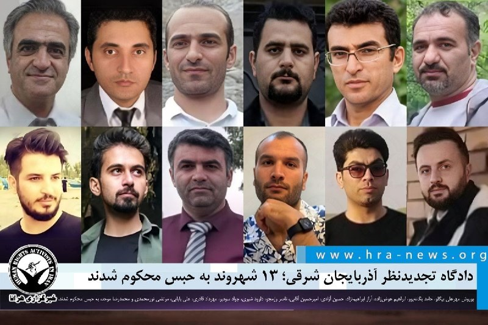

با حکم دادگاه تجدیدنظر استان آذربایجان شرقی؛ ۱۳ شهروند به حبس محکوم شدند

❗️
❗️
❗️
❗️
❗️– با حکم دادگاه تجدیدنظر استان آذربایجان شرقی، یوروش مهرعلی بیگلو، حامد یگانه‌پور، ابراهیم عوض‌زاده، آراز ابراهیم‌نژاد، حسین آزادی، امیرحسین آقایی، ناصر رزمجو، داوود شیری، جواد سودبر، مهرداد قادری، علی بابایی، مرتضی نورمحمدی و محمدرضا موحد، فعالان ترک (آذربایجانی)، مجموعا به ۸۱ سال و پنج ماه حبس محکوم شدند.

به گزارش خبرگزاری هرانا، ارگان خبری مجموعه فعالان حقوق بشر در ایران، رأی دادگاه تجدیدنظر استان آذربایجان شرقی به وکیل مدافع متهمان ابلاغ شده است.

این حکم روز شنبه ۲۶ اردیبهشت ماه توسط #دادگاه_تجدیدنظر استان آذربایجان شرقی، به وکیل این افراد ابلاغ شده است. طبق رای صادره، این افراد مجموعا به ۸۱ سال و پنج ماه حبس محکوم شدند.
شرح عناوین اتهامی هر یک از متهمان به همراه میزان محکومیت قطعی صادره به شرح زیر است:

ادامه مطلب

↘️
@hranews_bot تماس ✉️ -  @Hranews  کانال هرانا 🆑

## manototv — post 105602

  <a href="telegram/content/manototv_105602_1779124959.mp4" target="_blank">🎬 Download video</a>

‌
نهاد« مدیریت آبراه خلیج فارس» با راه‌اندازی حساب کاربری در شبکه ایکس اعلام کرد عبور کشتی‌ها از تنگه هرمز بدون دریافت مجوز از این نهاد «غیرقانونی» خواهد بود.

این نهاد که با نام PGSA معرفی شده، در بیانیه‌ای نوشت تردد در محدوده‌های تعیین‌شده در تنگه هرمز باید با هماهنگی کامل با نیروهای مسلح و مقام‌های جمهوری اسلامی انجام شود.

در این بیانیه آمده است: «عبور بدون مجوز، غیرقانونی تلقی خواهد شد.»

## manototv — post 105601

  <a href="telegram/content/manototv_105601_1779124959.mp4" target="_blank">🎬 Download video</a>

تماسی از ایران:
«خانواده‌های بچه‌های دربند رو برای کمک‌رساندن دریابیم»

## manototv — post 105600

  <a href="telegram/content/manototv_105600_1779124961.mp4" target="_blank">🎬 Download video</a>

عفو بین‌الملل اعلام کرد شمار اعدام‌ها در جهان در سال ۲۰۲۵ به بالاترین سطح ثبت‌شده در ۴۴ سال گذشته رسیده و ایران با ثبت دست‌کم ۲۱۵۹ اعدام، عامل اصلی این افزایش بوده است.

بر اساس گزارش سالانه این سازمان، در مجموع دست‌کم ۲۷۰۷ نفر در ۱۷ کشور اعدام شده‌اند؛ آماری که نسبت به سال ۲۰۲۴ حدود ۷۸ درصد افزایش نشان می‌دهد.

عفو بین‌الملل اعلام کرد شمار اعدام‌ها در ایران بیش از دو برابر سال گذشته شده و ایران پس از چین، که آمار رسمی اعدام‌هایش منتشر نمی‌شود، در صدر کشورهای مجری اعدام قرار دارد.

در این گزارش آمده است عربستان سعودی با دست‌کم ۳۵۶ اعدام در رتبه بعدی قرار گرفته و بخش قابل توجهی از این احکام به جرایم مرتبط با مواد مخدر مربوط بوده است.

بر اساس این گزارش، آمریکا نیز شمار اعدام‌های خود را از ۲۵ مورد در سال ۲۰۲۴ به ۴۷ مورد در سال ۲۰۲۵ افزایش داده است. شمار اعدام‌ها در مصر، سنگاپور و کویت نیز نسبت به سال قبل افزایش یافته است.

عفو بین‌الملل همچنین اعلام کرد چین، مصر، جمهوری اسلامی، عراق، کره شمالی، عربستان سعودی، سومالی، آمریکا، ویتنام و یمن در پنج سال گذشته به‌طور مداوم اعدام انجام داده‌اند.

## manototv — post 105599

  <a href="telegram/content/manototv_105599_1779124962.mp4" target="_blank">🎬 Download video</a>

با تهدید «حق تیر داریم» مانع برگزاری مراسم زادروز بهار شاه‌مهری شدند

بر اساس ویدیوی ارسالی به منوتو، نیروهای حکومتی با تهدید خانواده بهار شاه‌مهری و گفتن جمله «ما حق تیر داریم»، اجازه برگزاری مراسم زادروز این جاویدنام را در ۱۹ اردیبهشت ندادند.

بهار شاه‌مهری، نوجوان ۱۷ ساله اهل نیشابور، غروب ۱۹ دی‌ماه ۱۴۰۴ در جریان انقلاب شیر و خورشید ایران، در کوچه‌ای خلوت از پشت سر هدف شلیک مستقیم تک‌تیرانداز نیروهای سرکوبگر جمهوری اسلامی قرار گرفت و جان باخت.

به گفته نزدیکان او، چند روز پیش از سالروز تولد بهار، اعضای خانواده‌اش بازداشت و بازجویی شدند و مسیرهای منتهی به مزار او در روز تولدش بسته شد تا از برگزاری مراسم جلوگیری شود.

همچنین گزارش شده است که سنگ مزار بهار شاه‌مهری روز دوم فروردین ۱۴۰۶ شکسته شده بود.
این فشارها بخشی از روند گسترده‌تر سرکوب خانواده‌های جان‌باختگان است؛ حتی بعد از کشتن، از گل گذاشتن و تولد گرفتن هم می‌ترسند. عجب شجاعتی، حکومت با سنگ قبر می‌جنگد.

## manototv — post 105598

  <a href="telegram/content/manototv_105598_1779124964.mp4" target="_blank">🎬 Download video</a>

دونالد ترامپ، رئیس‌جمهوری آمریکا، در پیامی در تروث‌سوشال ، رسانه‌های آمریکایی را متهم کرد که حتی در صورت «تسلیم کامل ایران» نیز آن را به‌عنوان پیروزی توصیف خواهند کرد.

ترامپ در این پیام نوشت اگر جمهوری اسلامی شکست خود را بپذیرد، نیروهای نظامی‌اش تسلیم شوند و رهبرانش «اسناد تسلیم» را امضا کنند، باز هم رسانه‌هایی چون نیویورک‌تایمز، وال‌استریت ژورنال و سی‌ان‌ان این اتفاق را «پیروزی ایران» جلوه خواهند داد.

او با اشاره به نابودی نیروی دریایی و نیروی هوایی ایران نوشت: «اگر ایران تسلیم شود، بپذیرد که نیروی دریایی‌اش در کف دریا نابود شده و نیروی هوایی‌اش دیگر وجود ندارد، و اگر نیروهای نظامی‌اش با دست‌های بالا و پرچم سفید از تهران خارج شوند، باز هم رسانه‌های فیک‌نیوز خواهند گفت ایران پیروزی درخشانی مقابل آمریکا به دست آورده است.»

ترامپ همچنین رسانه‌های جریان اصلی آمریکا را «فاسد» و «بی‌اهمیت» توصیف کرد و نوشت: «دموکرات‌ها و رسانه‌ها کاملا راه خود را گم کرده‌اند. آن‌ها کاملا دیوانه شده‌اند.»

## alonews — post 120922

  <a href="telegram/content/alonews_120922_1779124964.webm" target="_blank">🎬 Download video</a>

👈ترامپ: از دست تهران «کلافه» نیستم

✅ @AloNews خبر جنگ

## alonews — post 120921

  <a href="telegram/content/alonews_120921_1779124964.webm" target="_blank">🎬 Download video</a>

👈وقتی از ترامپ در مورد ادعای منابع منطقه‌ای مبنی بر اینکه ایران سعی دارد در هر دو موضوع هسته‌ای و بازگشایی تنگه هرمز، واشنگتن را «خسته کند»، سوال شد، ترامپ گفت: «این را نشنیده‌ام».

🔴او گفت: «نمی‌توانم در این مورد با شما صحبت کنم.»

🔴ترامپ افزود «این یک مذاکره است. من نمی‌خواهم احمق باشم.»

✅ @AloNews خبر جنگ

## alonews — post 120920

  <a href="telegram/content/alonews_120920_1779124964.webm" target="_blank">🎬 Download video</a>

👈وقتی از ترامپ در مورد اظهار نظر جمعه‌اش مبنی بر اینکه حاضر است مهلت ۲۰ ساله برای غنی‌سازی اورانیوم ایران را بپذیرد، سوال شد، ترامپ در میان صحبت ادعا کرد: «من الان اماده پذیرش هیچ چیزی نیستم.»

✅ @AloNews خبر جنگ

## alonews — post 120919

  <a href="telegram/content/alonews_120919_1779124965.webm" target="_blank">🎬 Download video</a>

👈ترامپ به نیویورک پست : ایران می‌دونه که به زودی چه اتفاقی براش میوفته، هیچ امتیازی داده نخواهد شد

✅ @AloNews خبر جنگ

## alonews — post 120918

  <a href="telegram/content/alonews_120918_1779124965.webm" target="_blank">🎬 Download video</a>

👈سنتکام: تا الان 85کشتی تجاری رو برگردوندیم

✅ @AloNews خبر جنگ

## alonews — post 120917

  <a href="telegram/content/alonews_120917_1779124965.webm" target="_blank">🎬 Download video</a>

👈شاخص صف پمپ بنزین تو ایران رفت بالا

✅ @AloNews خبر جنگ

## alonews — post 120916

  <a href="telegram/content/alonews_120916_1779124965.webm" target="_blank">🎬 Download video</a>

👈آخرین قیمت نفت ۱۱۱.۱۰ دلار

✅ @AloNews خبر جنگ

## alonews — post 120915

  <a href="telegram/content/alonews_120915_1779124965.webm" target="_blank">🎬 Download video</a>

👈وزیر خزانه داری آمریکا: مجوز موقت 30 روزه برای خرید نفت روسیه صادر شد

✅ @AloNews خبر جنگ

## alonews — post 120914

  <a href="telegram/content/alonews_120914_1779124966.webm" target="_blank">🎬 Download video</a>

👈آکسیوس: بمب‌ها مذاکره خواهند کرد

✅ @AloNews خبر جنگ

## alonews — post 120913

  <a href="telegram/content/alonews_120913_1779124966.webm" target="_blank">🎬 Download video</a>

👈جلسه کابینه امنیتی اسرائیل، با نتانیاهو دقایقی پیش شروع شد

✅ @AloNews خبر جنگ

## alonews — post 120912

  <a href="telegram/content/alonews_120912_1779124966.webm" target="_blank">🎬 Download video</a>

👈تری یینگست، خبرنگار فاکس‌ :
- ما تو آستانه بازگشت به عملیات‌های رزمی تمام‌عیار هستیم

✅ @AloNews خبر جنگ

## alonews — post 120911

  <a href="telegram/content/alonews_120911_1779124966.webm" target="_blank">🎬 Download video</a>

👈وزیر کشور پاکستان که در سفری دو روزه برای آخرین میانجیگری میان ایران و آمریکا به تهران سفر کرده بود، پس از رد آخرین پیشنهاد ایران توسط آمریکا، دقایقی پیش تهران را ترک کرد.

✅ @AloNews خبر جنگ

## alonews — post 120910

  <a href="telegram/content/alonews_120910_1779124966.webm" target="_blank">🎬 Download video</a>

🔴فوری / کاخ سفید: آخرین پیشنهاد ایران که امروز ارائه شد نیز به دلیل ناکافی‌ بودن به صورت کامل رد شد، دیگر بمب ها مذاکره خواهند کرد

✅ @AloNews خبر جنگ

## alonews — post 120909

  <a href="telegram/content/alonews_120909_1779124966.webm" target="_blank">🎬 Download video</a>

👈طبق گزارش‌ها، جزیره خارک ایران حداقل ۱۰ روز است که هیچ نفتکشی بارگیری نشده است

✅ @AloNews خبر جنگ

## alonews — post 120908

  <a href="telegram/content/alonews_120908_1779124967.webm" target="_blank">🎬 Download video</a>

👈ترامپ به العربیه : داریم کارو خوب پیش می‌بریم، پیروزی هم تو راهه

✅ @AloNews خبر جنگ

## alonews — post 120907

  <a href="telegram/content/alonews_120907_1779124967.webm" target="_blank">🎬 Download video</a>

👈کیر:به هیچ عنوان استعفا نمیدم

✅ @AloNews خبر جنگ

## alonews — post 120906

  <a href="telegram/content/alonews_120906_1779124967.webm" target="_blank">🎬 Download video</a>

👈وزارت بهداشت لبنان اعلام کرد که از آغاز حمله اسرائیل در ۲ مارس تاکنون، ۳٬۰۲۰ نفر شهید و ۹٬۲۷۳ نفر دیگر زخمی شده‌اند

✅ @AloNews خبر جنگ

## alonews — post 120905

❤️امروز فقط با گیگی 159 تومن کانفیگ اختصاصی خودت رو بخر
❤️ 
🤩
🤩
🤩
🤩
🤩
🤩
🤩
🤩
🤩
🤩
🤩
🤩 ساب
✅ ضریب
❌ ضمانت بازگشت وجه
✅ پشتیبانی مادام
✅ پس دیگه معطل هیچی نباش و بدون واسطه خرید کن
😁 خرید مستقیم از ربات: @manageuser_robot پرداخت ریالی فعال هست 
‼️ پشتیبانی درصورت بروز هرگونه…

## alonews — post 120904

  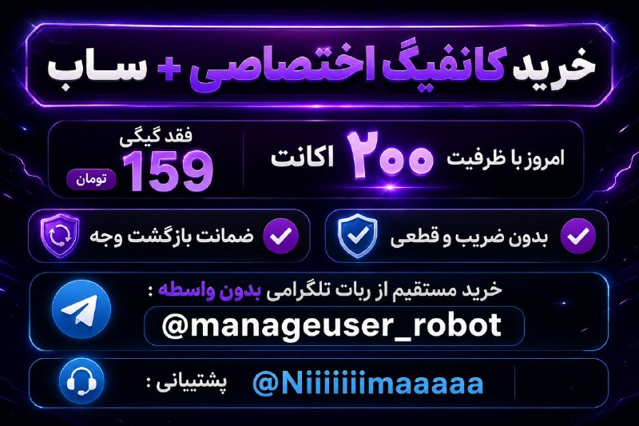

❤️امروز فقط با گیگی 159 تومن کانفیگ اختصاصی خودت رو بخر
❤️

🤩
🤩
🤩
🤩
🤩
🤩
🤩
🤩
🤩
🤩
🤩
🤩
ساب
✅
ضریب
❌
ضمانت بازگشت وجه
✅
پشتیبانی مادام
✅
پس دیگه معطل هیچی نباش و بدون واسطه خرید کن
😁

خرید مستقیم از ربات:
@manageuser_robot
پرداخت ریالی فعال هست 
‼️

پشتیبانی درصورت بروز هرگونه مشکل:
@Niiiiiimaaaaa

## alonews — post 120903

  <a href="telegram/content/alonews_120903_1779124968.webm" target="_blank">🎬 Download video</a>

👈عکس‌ها و ویدیوهای دریافتی از فرودگاه بین‌المللی تل‌آویو نشان می‌دهد که حدود ۴۰ تا ۵۰ فروند تانکر هوایی (هواپیمای سوخت‌رسان) نیروی هوایی آمریکا در محوطه پارکینگ فرودگاه حضور دارند.

🔴در چند هفته گذشته، حدود ۲۰ هواپیمای نظامی در فرودگاه اسرائیل مشاهده شده بود

✅ @AloNews خبر جنگ

<!-- MSG END -->

<!-- NAV START -->

<a href="https://github.com/shahinsa98/aio-downloader/blob/main/telegram/content/archive_1.md" style="display:inline-block; padding:6px 12px; margin:0 4px; background-color:#2ea44f; color:white; text-decoration:none; border-radius:4px; font-weight:bold;">صفحه بعد</a>

<!-- NAV END -->
