# خواننده تلگرام

<!-- TOP_NAV START -->

<a href="https://github.com/shahinsa98/aio-downloader/blob/main/telegram/content/archive_1.md" style="display:inline-block; padding:6px 12px; margin:0 4px; background-color:#2ea44f; color:white; text-decoration:none; border-radius:4px; font-weight:bold;">صفحه بعد</a>

<!-- TOP_NAV END -->

<!-- MSG START -->

---
📅 بروزرسانی: 1405/03/09 03:56
---

## VahidOOnLine — post 242858

  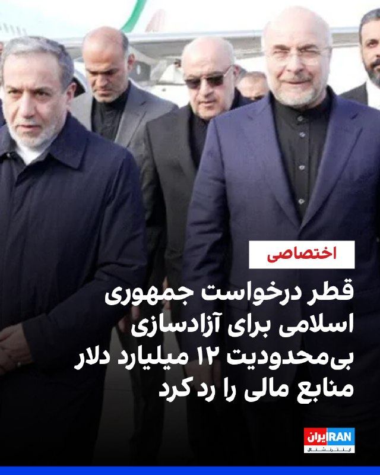

یک منبع آگاه از روند مذاکرات به ایران‌اینترنشنال گفت سفر قالیباف به قطر به شکستی دیپلماتیک منجر شد و با وجود درخواست تهران برای آزادسازی فوری و بی‌قید و شرط ۱۲ میلیارد دلار به صورت نقدی همزمان با امضای یک یادداشت تفاهم اولیه با آمریکا، مقام‌های قطری این درخواست را رد کردند.
به گفته این منبع، مقام‌های قطری تنها با آزادسازی نیمی از این مبلغ تحت محدودیت‌های سخت‌گیرانه موافقت کردند.
بر اساس گفته‌های یک منبع نزدیک به یک مقام قطری حاضر در این گفت‌وگوها، دوحه از انتقال مستقیم یا نقدی این منابع به ایران خودداری کرده است. در عوض، این پول تنها به صورت اعتبار در اختیار تهران قرار می‌گیرد تا کالاها و محصولات اساسی را مستقیما از قطر خریداری کند.
این محدودیت در شرایطی اعمال شده که آمریکا به شدت با اعطای دسترسی مستقیم و بدون محدودیت جمهوری اسلامی به دارایی‌های نقدی مخالفت کرده است.
آمریکا ابراز نگرانی کرده است که تزریق مستقیم پول نقد می‌تواند برای تهران فضای تنفسی اقتصادی حیاتی ایجاد کند و به آن اجازه دهد حقوق‌های معوقه بخش عمومی را پرداخت کرده و در دوره‌ای از تنش شدید منطقه‌ای، تجهیزات نظامی را از کشورهای دیگر تامین کند.
‌🏁 🇬🇧 IranintlTV

🤖 @VahidOOnLine

## VahidOOnLine — post 242857

  <a href="telegram/content/VahidOOnLine_242857_1780100762.mp4" target="_blank">🎬 Download video</a>

♦️خواهر جاویدنام امیرمحمد شاه‌کرمی با انتشار ویدیویی در صفحه اینستاگرام خود نوشت: «شصت روز بین امید و کابوس گذشت تا بالاخره برادر جاویدنامم، امیرمحمد شاه‌کرمی را در سردخانه دیدم. ما بعد از ۶۰ روز گریه، دلتنگی و چشم‌انتظاری، صورت برادرم را دیدیم. آن لحظه انگار دنیا روی سرمان خراب شد.»
او در ادامه نوشت: «شیون مادر، لرزش دست پدر و بغض... برادرم خوابیده بود؛ سرد، بی‌صدا. هیچ‌کس نمی‌فهمد دیدن پیکر برادرت بعد از ۶۰ روز یعنی چه.»
امیرمحمد شاه‌کرمی، ۱۴ ساله، ۱۸ دی‌ در شهر قدس بازداشت شد و پیکرش پس از دو ماه تحویل داده شد.
‌🇸🇦 Indypersian

🤖 @VahidOOnLine

## VahidOOnLine — post 242856

  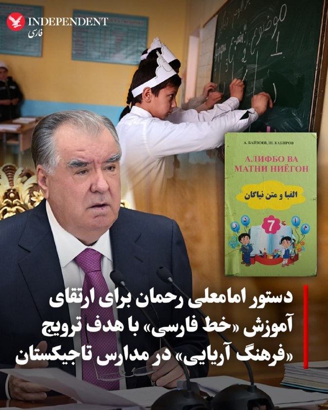

♦️براساس دستور ویژه‌ امامعلی رحمان، رئیس‌جمهوری تاجیکستان، وزارت معارف و دیگر نهادهای مسئول موظفند کیفیت تدریس «الفبای نیاکان» (خط فارسی) را در تمامی موسسات آموزشی و مدارس کشور بهبود بخشند. بر اساس گزارش رسمی پایگاه اطلاع‌رسانی ریاست‌جمهوری تاجیکستان، روز پنجشنبه در جریان جلسه هیات دولت، این تصمیم در راستای سیاست‌های کلان دولت دوشنبه برای گسترش پژوهش، آموزش و ترویج تاریخ و «فرهنگ اصیل آریایی» اتخاذ شده است تا نسل جوان ارتباط نزدیک‌تری با میراث مکتوب و کهن خود برقرار کند.
در این جلسه که به بررسی برنامه‌های مختلف توسعه‌ای، بهداشت و بومی‌سازی صنایع اختصاص داشت، رئیس‌جمهوری تاجیکستان تاکید کرد که احیای زبان و خط نیاکان، بخشی جدایی‌ناپذیر از برنامه‌های ملی برای آگاهی فرهنگی و آماده‌سازی جامعه جهت بزرگداشت سی‌وپنجمین سالگرد استقلال این کشور است. در همین راستا، کتاب‌های درسی ویژه‌ای از جمله «الفبا و متن نیاکان» برای پایه‌های مختلف تحصیلی در نظر گرفته شده است تا دانش‌آموزان تاجیک مهارت خواندن و نوشتن به خط فارسی را به طور استاندارد و با کیفیت بالا فرا بگیرند.
‌🇸🇦 Indypersian

🤖 @VahidOOnLine

## VahidOOnLine — post 242847

این نام‌ها،
روایت زندگی‌هایی هستند که با خشونت در خیابان‌های ایران متوقف شدند.<
یکی سه روز بعد از پدر شدن کشته شد، یکی تنها شش ماه از ازدواجش گذشته بود، یکی برای نجات مادرش خودش را سپر کرد و دیگری با ساز و موسیقی، زندگی را معنا می‌کرد. نسل جوانی که هر کدام آینده‌ای پیش رو داشتند، با گلوله، باتوم و خشونت جمهوری اسلامی از ادامه زندگی بازماندند.<
میعاد ساده‌میری، مهران شیخ‌الاسلامی، نیما احمدی، مهران مظفری، امیرمحمد استاددوست، روح‌الله ستاره مشتری، صنم پوربابایی و محمدرضا مرادعلی؛
جاویدنامان انقلاب ملی ایرانیان.<
این روایت‌ها کوتاه‌اند، چون جای خالی این انسان‌ها را هیچ متنی نمی‌تواند کامل توضیح دهد؛ اما نامشان باید تکرار شود، تا فراموش نشوند.<
این روایت‌ها کوتاه‌اند، چون جای خالی این انسان‌ها را هیچ متنی نمی‌تواند کامل توضیح دهد؛ این روایت‌ها بخشی از حافظه زنده مردم ایران‌اند.<
#جاویدنامان_انقلاب_ملی_ایرانیان
‌🏁 🇬🇧 IranintlTV

🤖 @VahidOOnLine

## VahidOOnLine — post 242846

  

نهاد مدیریت آبراه خلیج فارس در واکنش به اقدام اخیر وزارت خزانه‌داری آمریکا در تحریم این نهاد، ضمن محکومیت این اقدام تاکید کرد: «تسلط بر تنگه هرمز را که در میدان و دیپلماسی به دست نیاوردید، با تحریم هم به دست نخواهید آورد.»
این نهاد تحریم شدن از سوی «کشوری که رییس آن به دزدی دریایی افتخار می‌کند» را نشانه‌ای از «عملکرد مثبت» خود دانست و افزود: «علیرغم اقدامات تنش‌زای ایالات متحده در آب‌های خلیج فارس و دریای عمان، این نهاد در راستای تسهیل تردد، بی‌وقفه به بررسی و ارائه مجوز عبور به شناورهای غیرمتخاصم ادامه می‌دهد.»

‌🏁 🇬🇧 IranintlTV

🤖 @VahidOOnLine

## VahidOOnLine — post 242845

  

♦️فرماندهی مرکزی ایالات متحده، سنتکام، روز جمعه، با انتشار تصاویری در اکس، از اجرای موفقیت‌آمیز عملیات پرواز شبانه توسط ملوانان آمریکایی بر فراز ناو هواپیمابر «یو‌اس‌اس جرج اچ.دبلیو بوش» خبر داد. سنتکام با تمجید از آمادگی نیروهای خود اعلام کرد که در این مانور، خلبانان بسیار ماهر آمریکایی موفق شدند در تاریکی نزدیک به مطلق، پرنده‌های خود را بر روی عرشه کوچک این ناو که در میان امواج دریا در حال تکان خوردن و چرخیدن بود، به سلامت فرود آورند.
‌🇸🇦 Indypersian

🤖 @VahidOOnLine

## VahidOOnLine — post 242844

  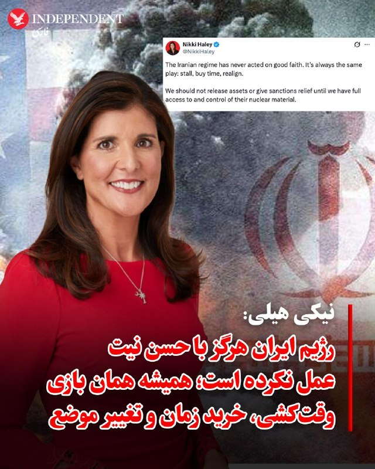

♦️نیکی هیلی، سفیر پیشین آمریکا در سازمان ملل، با انتشار پیامی در اکس نوشت: «رژیم ایران هرگز با حسن نیت عمل نکرده است. همیشه همان بازی را ادامه می‌دهد؛ وقت‌کشی، خرید زمان و تغییر موضع.»
هیلی افزود تا زمانی که دسترسی کامل و کنترل بر مواد هسته‌ای ایران به دست نیامده، نباید دارایی‌ها آزاد یا تحریم‌ها کاهش داده شود.
‌🇸🇦 Indypersian

🤖 @VahidOOnLine

## WithYashar — post 12922

سنتکام: هر شناوری که در حال انجام یا حمایت از فعالیت‌ های مین‌گذاری در تنگهٔ هرمز دیده بشه، توسط ما هدف قرار خواهد گرفت!
@withyashar

## FoxNewsTwitter — post 342417

  

Fox News (Twitter/X)

WATCH LIVE: Atlas 5 rocket launches 29 Amazon Leo satellites from Florida https://twitter.com/i/broadcasts/1lJQRRBLyOWxE

## FoxNewsTwitter — post 342416

‌Fox News (Twitter/X)

👉 Full story here:

## FoxNewsTwitter — post 342415

  

Fox News (Twitter/X)

CodePink co-founder Medea Benjamin confirms Treasury Department inquiry into her group's Cuba convoy. The probe demands answers to 12 detailed questions about 170 participants, $600,000 in supplies, and every hour spent on the communist island, she said, acknowledging that "it's serious."

## IranIntlTV — post 339675

  

یک منبع آگاه از روند مذاکرات به ایران‌اینترنشنال گفت سفر قالیباف به قطر به شکستی دیپلماتیک منجر شد و با وجود درخواست تهران برای آزادسازی فوری و بی‌قید و شرط ۱۲ میلیارد دلار به صورت نقدی همزمان با امضای یک یادداشت تفاهم اولیه با آمریکا، مقام‌های قطری این درخواست را رد کردند.
به گفته این منبع، مقام‌های قطری تنها با آزادسازی نیمی از این مبلغ تحت محدودیت‌های سخت‌گیرانه موافقت کردند.
بر اساس گفته‌های یک منبع نزدیک به یک مقام قطری حاضر در این گفت‌وگوها، دوحه از انتقال مستقیم یا نقدی این منابع به ایران خودداری کرده است. در عوض، این پول تنها به صورت اعتبار در اختیار تهران قرار می‌گیرد تا کالاها و محصولات اساسی را مستقیما از قطر خریداری کند.
این محدودیت در شرایطی اعمال شده که آمریکا به شدت با اعطای دسترسی مستقیم و بدون محدودیت جمهوری اسلامی به دارایی‌های نقدی مخالفت کرده است.
آمریکا ابراز نگرانی کرده است که تزریق مستقیم پول نقد می‌تواند برای تهران فضای تنفسی اقتصادی حیاتی ایجاد کند و به آن اجازه دهد حقوق‌های معوقه بخش عمومی را پرداخت کرده و در دوره‌ای از تنش شدید منطقه‌ای، تجهیزات نظامی را از کشورهای دیگر تامین کند.

## IranIntlTV — post 339666

این نام‌ها،
روایت زندگی‌هایی هستند که با خشونت در خیابان‌های ایران متوقف شدند.
یکی سه روز بعد از پدر شدن کشته شد، یکی تنها شش ماه از ازدواجش گذشته بود، یکی برای نجات مادرش خودش را سپر کرد و دیگری با ساز و موسیقی، زندگی را معنا می‌کرد. نسل جوانی که هر کدام آینده‌ای پیش رو داشتند، با گلوله، باتوم و خشونت جمهوری اسلامی از ادامه زندگی بازماندند.
میعاد ساده‌میری، مهران شیخ‌الاسلامی، نیما احمدی، مهران مظفری، امیرمحمد استاددوست، روح‌الله ستاره مشتری، صنم پوربابایی و محمدرضا مرادعلی؛
جاویدنامان انقلاب ملی ایرانیان.
این روایت‌ها کوتاه‌اند، چون جای خالی این انسان‌ها را هیچ متنی نمی‌تواند کامل توضیح دهد؛ اما نامشان باید تکرار شود، تا فراموش نشوند.
این روایت‌ها کوتاه‌اند، چون جای خالی این انسان‌ها را هیچ متنی نمی‌تواند کامل توضیح دهد؛ این روایت‌ها بخشی از حافظه زنده مردم ایران‌اند.
#جاویدنامان_انقلاب_ملی_ایرانیان

## IranIntlTV — post 339665

  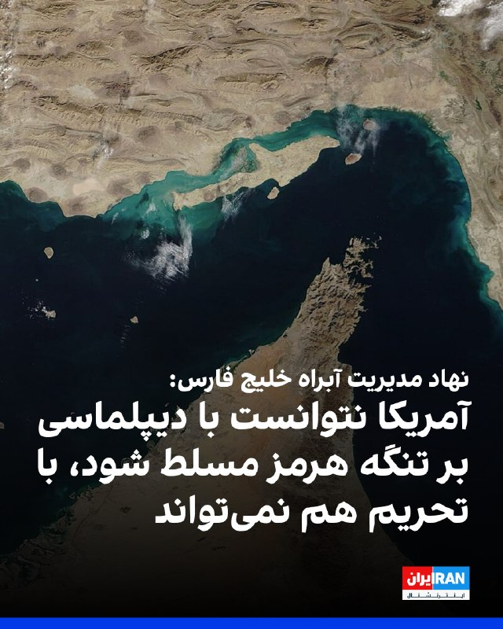

نهاد مدیریت آبراه خلیج فارس در واکنش به اقدام اخیر وزارت خزانه‌داری آمریکا در تحریم این نهاد، ضمن محکومیت این اقدام تاکید کرد: «تسلط بر تنگه هرمز را که در میدان و دیپلماسی به دست نیاوردید، با تحریم هم به دست نخواهید آورد.»
این نهاد تحریم شدن از سوی «کشوری که رییس آن به دزدی دریایی افتخار می‌کند» را نشانه‌ای از «عملکرد مثبت» خود دانست و افزود: «علیرغم اقدامات تنش‌زای ایالات متحده در آب‌های خلیج فارس و دریای عمان، این نهاد در راستای تسهیل تردد، بی‌وقفه به بررسی و ارائه مجوز عبور به شناورهای غیرمتخاصم ادامه می‌دهد.»

https://iranintl.com/202605291729

## Shin_Persian — post 6316

  

Shin ✓ @hey_itsmyturn
Fri, 29 May 2026 23:45:58 UTC

Even Fars News and regime websites are barely accessible at the moment

فارسی

حتی خبرگزاری فارس و وب‌سایت‌های رژیم در حال حاضر به سختی در دسترس هستند.

𝕏 · @shin_persian

## Shin_Persian — post 6315

Shin ✓ @hey_itsmyturn
Fri, 29 May 2026 23:44:20 UTC

A number of users are reporting internet (FilterNet) disruption in Iran right now.

فارسی

تعدادی از کاربران در حال حاضر از اختلال در اینترنت (فیلترنت) در ایران خبر می‌دهند.

𝕏 · @shin_persian

## FarsiVOA — post 219034

  <a href="telegram/content/FarsiVOA_219034_1780100769.mp4" target="_blank">🎬 Download video</a>

⚡️چرا جمهوری اسلامی زمان کنکور را مشخص نمی کند؟ گفت‌وگو با جبران مقدم
@FarsiVOA

## FarsiVOA — post 219033

⚡️سرنوشت نامعلوم ویزا برای تیم ملی فوتبال در گفت‌وگو با فرید اشرفیان خبرنگار ورزشی دویچه وله
@FarsiVOA

## FarsiVOA — post 219032

⚡️«اولویت» جمهوری اسلامی در اوج بمباران و قطع اینترنت، شکنجه‌ نسرین ستوده‌‌ها
@FarsiVOA

## IranianMinds — post 21054

🔴 وضعیت :

@IranianMinds

## IranianMinds — post 21053

  

⭕️ تا حالا بدون واریزی روی فوتبال ها شرط بستی؟!

🎉 500 هزارتومن بونوس رایگان فقط با ثبت نام بدون هیچگونه واریزی!

😮 تنها سایتی که با عضویت بدون واریز 500,000 تومان شارژ بی قیدو شرط میده #وینرو هست
💰

👑 #معتبرترین سایت ایرانی 
⬇️

🌐 Winro.io

🌐 Winro.io

📱کانال اخبار و هدایا a8 
🎁

📱 @winro_io

## BBCPersian — post 282359

🔻 آمریکا شبکه تامین فناوری‌های دفاعی برای ایران را تحریم کرد

خبرگزاری فرانسه گزارش داد که آمریکا در تازه‌ترین دور تحریم‌های مرتبط با ایران، شبکه‌ای را که به گفته واشنگتن فناوری‌های حساس آمریکایی را برای بخش دفاعی ایران تهیه می‌کرد، هدف تحریم‌های خود قرار داده است.

پیشتر خبرگزاری رویترز هم گزارش داد که آمریکا فهرست جدیدی از تحریم‌های مرتبط با ایران را منتشر کرده است که در چارچوب مقررات مقابله با تروریسم اعمال شده‌اند.

وزارت دارایی آمریکا می‌گوید که این شبکه به ریاست علی مجد سپهر، با استفاده از شرکت‌های صوری و وب‌سایت‌های جعلی، ده‌ها شرکت فناوری آمریکایی را فریب داده و تجهیزات حساس مورد نیاز بخش دفاعی ایران را تهیه کرده است.

به گفته مقام‌های آمریکایی، اعضای این شبکه با معرفی خود به‌عنوان شرکت‌های قانونی آمریکایی، فناوری‌های پیشرفته‌ای از جمله تحلیلگرهای طیف فرکانسی و تجهیزات امنیتی را خریداری کرده و از طریق واسطه‌هایی در دبی به ایران منتقل می‌کردند.

واشنگتن می‌گوید که این اقدامات نقض تحریم‌های آمریکا بوده و به تقویت توانایی‌های دفاعی ایران کمک کرده است.

https://bbc.in/4e0QWpQ
@BBCPersian

## BBCPersian — post 282358

  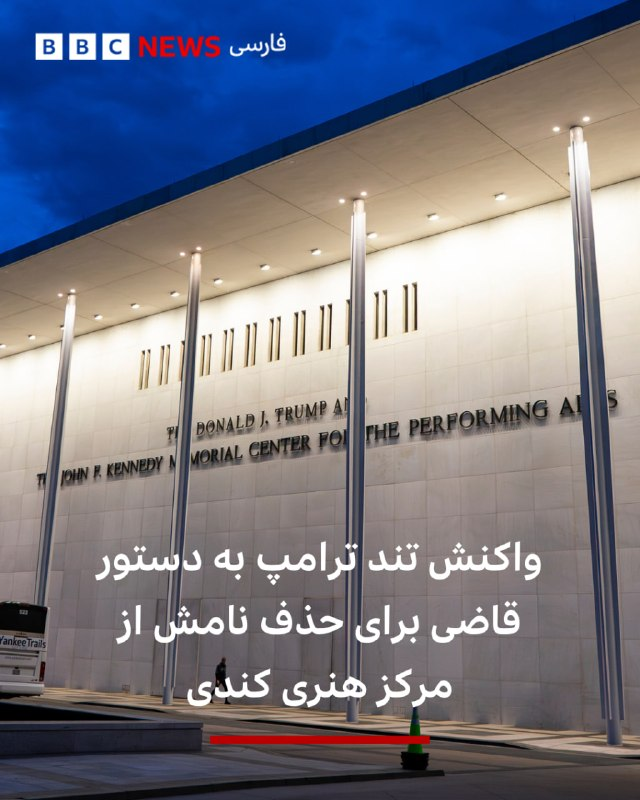

‌ ‌ ‌ ‌
یک قاضی دادگاهی در آمریکا، اقدام برای تغییر نام مرکز هنری معروف کندی در واشنگتن به «مرکز کندی ترامپ» را مسدود کرد و دستور داد که نام رئیس جمهور ترامپ از روی آن حذف شود.

در واکنش به این حکم، دونالد ترامپ گفت: «دموکرات‌ها بیشتر به مخالفت با رئیس‌جمهور ... اهمیت می‌دهند تا نجات یک مرکز هنرهای نمایشی در حال مرگ.»

قاضی کریستوفر کوپر حکم داد که کنگره نام این مرکز هنری را تصویب کرده است و فقط کنگره می‌تواند آن را تغییر دهد.

این آخرین ناکامی رئیس جمهور آمریکا است که به دنبال تغییر شکل و نام‌گذاری بخش‌هایی از پایتخت بوده است.

یکی از اعضای هیئت مدیره این مرکز، این تغییر نام را که توسط هیئت مدیره‌ای که توسط او انتخاب شده بود، در دادگاه به چالش کشیده بود.

آقای ترامپ پس از صدور این حکم در شبکه اجتماعی تروث سوشال، قاضی را «چپ» و منصوب باراک اوباما خواند که با این حکمش جلوی تعمیرات و بازسازی موسسه کندی را خواهد گرفت.

https://bbc.in/4fKf16A
📷 Al Drago/Getty Images
@BBCPersian

## BBCPersian — post 282357

  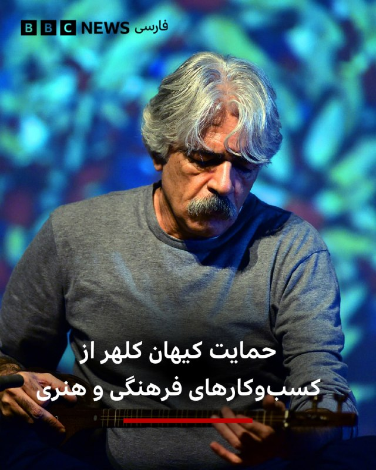

🔻 حمایت کیهان کلهر از کسب‌وکارهای فرهنگی و هنری

کیهان کلهر، موسیقی‌دان برجسته ایران صفحه اینستاگرامش را به مدت ۸۸ روز به تبلیغ و حمایت از کسب‌وکار اهالی فرهنگ و هنر اختصاص داد.

او نوشت که این اقدام را به دلیل حمایت از آنهایی انجام می‌دهد که «در ماه‌های اخیر به‌دلیل قطع اینترنت دچار خسارت شده‌اند.»

آقای کلهر تاکید کرده است که این فراخوان تنها شامل کسب‌وکارهای داخل ایران می‌شود.

حکومت ایران در چند دهه گذشته اشاعه موسیقی را به شدت محدود کرد اما پس از گسترش شبکه‌های اجتماعی، هنرمندان به معرفی خود و آثارشان پرداختند و به این ترتیب بازار خوبی برای محصولات فرهنگی و هنری فراهم شد.

پس از جنگ آمریکا و اسرائیل با ایران و قطعی کامل اینترنت برای بیش از هشتاد روز بسیاری از مشاغل مجازی به‌ویژه اهالی فرهنگ و هنر از فعالیت بازماندند که خسارات قابل توجهی به آنها وارد شده است.

https://bbc.in/4vbIbjs
@BBCPersian

---
📅 بروزرسانی: 1405/03/09 02:48
---

## VahidOOnLine — post 242843

  

♦️مارکو روبیو، وزیر امور خارجه آمریکا، روز جمعه با انتشار پیامی در اکس اعلام کرد: «سفیر تام باراک نقشی بی‌بدیل و ارزشمند به عنوان فرستاده ویژه ما در امور سوریه ایفا کرده است. هرچند دوره این عنوان رسمی رو به پایان است، اما او همچنان به ایفای نقشی کلیدی برای دولت ترامپ هم در سوریه و هم در عراق ادامه خواهد داد، چرا که تخصص، روابط و درک عمیق او از دستور کار «اول آمریکا» به ارمغان آوردن دستاوردهای بزرگ به نمایندگی از کشور بزرگمان را تضمین می‌کند.»
‌🇸🇦 Indypersian

🤖 @VahidOOnLine

## VahidOOnLine — post 242842

  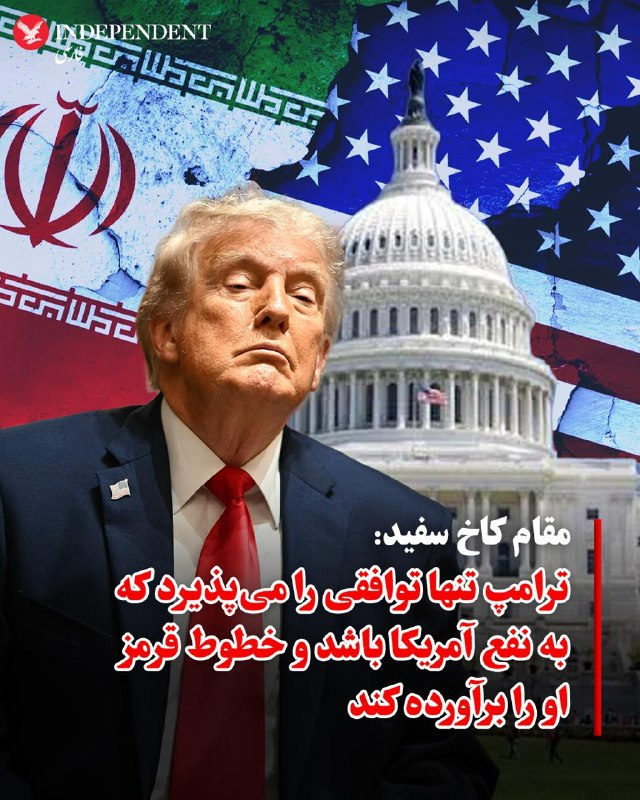

♦️به گزارش «ای‌بی‌سی نیوز»، در پی برگزاری یک نشست دو ساعته در «اتاق وضعیت» (Situation Room) به منظور اتخاذ تصمیم نهایی درباره توافق با تهران، یک مقام کاخ سفید با انتشار بیانیه‌ای اعلام کرد: «دونالد ترامپ تنها توافقی را امضا خواهد کرد که برای آمریکا خوب باشد و خطوط قرمز او را به طور کامل برآورده کند؛ ایران هرگز نمی‌تواند به سلاح هسته‌ای دست یابد.» براساس این گزارش، رئیس‌جمهوری ایالات متحده روز جمعه پس از ساعت‌ها رایزنی با تیم امنیت ملی خود برای تعیین تکلیف نهایی این پرونده، هنوز تصمیم رسمی خود را اعلام نکرده و مشخص نیست که چرا اعلام این موضع با تاخیر مواجه شده است.
‌🇸🇦 Indypersian

🤖 @VahidOOnLine

## VahidOOnLine — post 242841

♦️خبرگزاری تسنیم، وابسته به سپاه پاسداران، بامداد شنبه ۹ خرداد با انتشار تصاویری مدعی شد بقایای یک پهپاد متعلق به آمریکا و اسرائیل که در حوالی قشم هدف قرار گرفته، کشف شده است. تسنیم بیان کرد این پهپاد پس از شناسایی یک ریزپرنده در حوالی قشم، با واکنش پدافند هوایی ارتش هدف قرار گرفت و منهدم شد.
پیش از این، خبرنگار صدا و سیما در قشم نیز از فعال شدن سامانه پدافند هوایی در این منطقه خبر داده بود. هم‌زمان، خبرگزاری مهر به نقل از منابع محلی گزارش داد یک ریزپرنده در حوالی قشم از سوی پدافند هوایی هدف قرار گرفته و منهدم شده است.
‌🇸🇦 Indypersian

🤖 @VahidOOnLine

## VahidOOnLine — post 242840

  

♦️دکتر جمشید ایرانی، وکیل دیوان عالی آمریکا، اطلاع دادند که وزارت خارجه ایالات متحده با دادن «مجوز موقت و مشروط برای ورود» (Parole) به بازیکنان تیم ملی فوتبال ایران موافقت کرده‌ است. این وکیل در نوشته‌ای که در صفحه فیسبوک خود به اشتراک گذاشت، با اشاره به تحقیق و پی بردن به تصمیم واشنگتن در قبال کاروان ورزشی ایران توضیح داد که وزارت امور خارجه آمریکا برای اعضای تیم ملی «ویزای معمولی» صادر نخواهد کرد، بلکه ورود آن‌ها به خاک این کشور در قالب این طرح مشروط خواهد بود که امتیازات ویزای عادی را ندارد. به گفته دکتر جمشید ایرانی، این مجوز تحت طبقه‌بندی «پی-۱» (P-1، ویژه ورزشکاران) صادر می‌شود که به دولت آمریکا اجازه می‌دهد در هر لحظه این امتیاز را لغو و افراد را بدون نیاز به حکم دادگاه اخراج کند؛ ضمن اینکه احتمال اعمال محدودیت مکانی ۴۰ کیلومتری (۲۵ مایلی) پیرامون ورزشگاه و نظارت ماموران ماموریت‌های مهاجرت و گمرک آمریکا (ICE) بر این کاروان وجود دارد.
پیش از این، درحالی‌که تنها ۱۲ روز تا آغاز جام جهانی ۲۰۲۶ باقی مانده و تیم ملی فوتبال ایران در اردوی آماده‌سازی به سر می‌برد، مهدی محمدنبی، سرپرست تیم ملی، پس از بازی مقابل گامبیا به خبرنگاران گفته بود که تا آن لحظه ویزای مکزیک و آمریکا «صادر نشده است». سرپرست تیم ملی فوتبال ایران با گلایه از این وضعیت اعلام کرده بود: «به فیفا ایمیل زدیم و پرسیدیم که چه روزی قرار است ویزا صادر شود. ما ویزای مولتی آمریکا و مکزیک را نیاز داریم. اینکه هنوز ویزای ما صادر نشده و همه از آن اطلاع دارند، عادلانه نیست».
‌🇸🇦 Indypersian

🤖 @VahidOOnLine

## VahidOOnLine — post 242839

  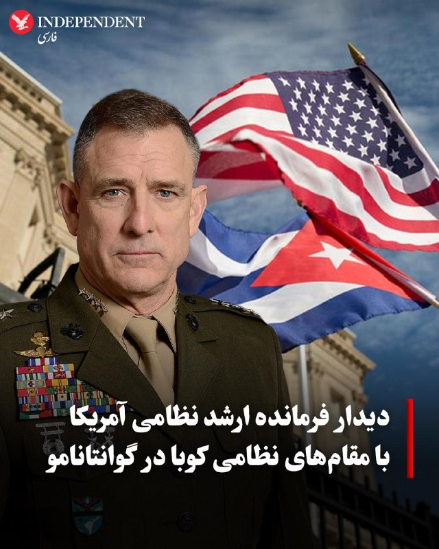

♦️به گزارش خبرگزاری رویترز، فرانسیس داناوان، فرمانده ستاد جنوبی ارتش ایالات متحده، روز جمعه در اقدامی کم‌سابقه با مقامات ارشد نظامی کوبا در خط مرزی پایگاه دریایی گوانتانامو دیدار و گفتگو کرد. ارتش آمریکا اعلام کرد که در این ماموریت، مسائلی چون امنیت عملیاتی مرزها، حفاظت از نیروها و آمادگی رزمی پایگاه مورد بررسی قرار گرفته است.
این دیدار در شرایطی انجام می‌شود که تنش‌ها میان واشنگتن و هاوانا به شدت بالا گرفته است. دونالد ترامپ پیش از این اشاره کرده بود که پس از پایان موضوع ایران، تمرکز خود را بر تغییر حکومت در کوباخواهد گذاشت. دولت ترامپ با اعمال محاصره سوختی، فشار اقتصادی شدیدی را بر کوبا وارد کرده است؛ موضوعی که واکنش تند وزیر امور خارجه کوبا را به همراه داشت و هشدار داد که هرگونه اقدام نظامی آمریکا به یک «حمام خون» با هزاران کشته از هر دو طرف منجر خواهد شد.
‌🇸🇦 Indypersian

🤖 @VahidOOnLine

## WithYashar — post 12921

  <a href="telegram/content/WithYashar_12921_1780096713.mp4" target="_blank">🎬 Download video</a>

گلزار: نماز میخونم و شبا هم هر موقع بیدار شم شروع میکنم به دعا کردن
@withyashar ❄️👃

## WithYashar — post 12920

یک مقام کاخ سفید در گفت‌و‌گو با خبرنگار شبکۀ الجزیره مدعی شد: دونالد ترامپ هیچ توافقی را امضا نخواهد کرد مگر آنکه این توافق مطالبات آمریکا را تأمین کرده و با خطوط قرمز تعیین‌شده از سوی او همخوانی داشته باشد.
«واشنگتن هرگز اجازه نخواهد داد ایران به سلاح هسته‌ای دست پیدا کند».
@withyashar

## WithYashar — post 12918

@withyashar وضعیت

## WithYashar — post 12916

اسرائیل هیوم: مقام‌های موساد معتقدند عملیات‌های اخیر علیه ایران فقط یک مرحله در مسیر سقوط جمهوری اسلامی بوده است. رئیس پیشین شاخه نفوذ گفت این واحد اکنون با شدت بیشتری فعالیت می‌کند و هدف آن «سریع‌تر کردن ساعت شنی پایان حکومت است».
@withyashar

## mwarmonitor — post 9906

🔴ترامپ ملزم به پاسخگویی درباره «اتهامات سنگین» در پرونده آی‌آر‌اس (سازمان امور مالیاتی) شد

📝نویسنده: آیوری لاتز AXIOS

🔸یک قاضی فدرال به پرزیدنت ترامپ دستور داد تا به اتهامات «سنگین» مطرح شده پاسخ دهد؛ اتهاماتی که ادعا می‌کنند توافق او با سازمان امور مالیاتی (IRS) — که منجر به ایجاد صندوق مبارزه با استفاده ابزاری از نهادها (anti-weaponization fund) شد — «بر پایه فریبکاری» بوده است.

📌چرا این موضوع اهمیت دارد؟
این دستور درست در همان روزی صادر شد که قاضی دیگری موقتاً این صندوق مالی ۱.۷۷۶ میلیارد دلاری را مسدود کرد؛ اقدامی که مانع بالقوه دیگری بر سر راه طرح توافق جنجالی دولت ترامپ ایجاد می‌کند.

🔸پشت صحنه ماجرا (محور اخبار):
دستور قاضی دادگاه منطقه‌ای ایالات متحده، کاتلین ویلیامز، در پی درخواست قبلی ۳۵ قاضی سابق فدرال صادر شد. این قضات از او خواسته بودند پرونده‌ای را که در ماه ژانویه در رابطه با لو رفتن اظهارنامه‌های مالیاتی ترامپ تشکیل شده بود، دوباره باز کند.

@mwarmonitor

## mwarmonitor — post 9905

🔴رهبران سه سازمان اقتصادی بین‌المللی روز جمعه هشدار دادند که اگر حمل‌ونقل نفت به حالت عادی بازنگردد، ممکن است با افزایش «ریسک برای امنیت سوخت، شرایط بازار و تاب‌آوری گسترده‌تر اقتصاد» مواجه شویم؛ به‌ویژه زمانی که تقاضا در تابستان افزایش پیدا کند. CBS

@mwarmonitor

## FoxNewsTwitter — post 342414

  

Fox News (Twitter/X)

A former mayor pleaded guilty Friday to acting as an illegal agent of the Chinese government.

Eileen Li Wang, the former mayor of Arcadia, California, allegedly acted "at the direction and control" of Chinese government officials between 2020 and 2022, without notifying U.S. authorities, prior to taking office.

According to court documents, Wang worked alongside a convicted Chinese agent, who is already serving a four-year federal prison sentence, to operate a website posing as a local Chinese-American news outlet.

Prosecutors described the website as a propaganda arm for the Chinese Communist Party that published content supplied directly by Chinese government officials.

She faces up to 10 years in prison. The judge has scheduled sentencing for October 6, 2026.

## VahidOnline — post 75798

  <a href="telegram/content/VahidOnline_75798_1780096717.mp4" target="_blank">🎬 Download video</a>

خبرگزاری تسنیم، وابسته به سپاه پاسداران، بامداد شنبه ۹ خرداد با انتشار تصاویری مدعی شد بقایای یک پهپاد متعلق به آمریکا و اسرائیل که در حوالی قشم هدف قرار گرفته، کشف شده است.
تسنیم بیان کرد این پهپاد با واکنش پدافند هوایی ارتش هدف قرار گرفت و منهدم شد.
پیش از این خبرگزاری مهر به نقل از منابع محلی گزارش داد یک ریزپرنده در حوالی قشم از سوی پدافند هوایی هدف قرار گرفته و منهدم شده است.
@VahidOOnLine

📡 @VahidOnline

## VahidOnline — post 75797

  

به گزارش نیویورک‌پست، یکی از آخرین موارد اختلاف بر سر راه توافق احتمالی میان واشینگتن و تهران، چگونگی آزادسازی مرحله‌ای دارایی‌های ایران است که در قطر نگهداری می‌شود و برای اهداف بشردوستانه در نظر گرفته شده است.

بر اساس این گزارش، منابع مالی مورد بحث مستقیما در اختیار حکومت ایران قرار نخواهد گرفت، بلکه برای خرید مواد غذایی و تجهیزات پزشکی استفاده می‌شود و سپس این اقلام به ایران ارسال خواهد شد.

نیویورک‌پست به نقل از یک مقام دولت آمریکا نوشت پرداخت تدریجی این منابع به اجرای تعهدات از سوی ایران، از جمله بازگشایی تنگه هرمز و پاکسازی مین‌ها در تنگه هرمز، وابسته خواهد بود.
@VahidOOnLine

📡 @VahidOnline

## IranIntlTV — post 339664

  <a href="telegram/content/IranIntlTV_339664_1780096718.mp4" target="_blank">🎬 Download video</a>

شورای امنیت سازمان ملل اعلام کرد مقامات و نیروهای طالبان مرتکب خشونت جنسی علیه زنان شده‌اند. براساس این گزارش، ۲۱ مورد خشونت جنسی، از جمله تجاوز گروهی علیه ۱۵ زن و شش دختر، در سال گذشته میلادی ثبت شده و برخی زنان نیز هدف برهنه‌سازی یا ازدواج اجباری قرار گرفته‌اند.

گفت‌وگو با راضیه دانش، عضو تحریریه ایران‌اینترنشنال
@iranintltv

## IranIntlTV — post 339663

  <a href="telegram/content/IranIntlTV_339663_1780096720.mp4" target="_blank">🎬 Download video</a>

در دو هفته گذشته حملات اسرائیل به مناطق مختلف لبنان افزایش یافته و به حدود ۴۷ حمله در روز رسیده است.

این در حالی است که مذاکرات میان اسرائیل و لبنان در واشینگتن در حال برگزاری است.

گفت‌وگو با بن سبطی، پژوهشگر ایران و اسرائیل
@iranintltv

## IranIntlTV — post 339662

  <a href="telegram/content/IranIntlTV_339662_1780096722.mp4" target="_blank">🎬 Download video</a>

نیویورک‌تایمز گزارش داد آمریکا هنوز درباره هیچ توافق جدیدی با تهران به تصمیم نهایی نرسیده است.

همزمان، سخنگوی وزارت خارجه جمهوری اسلامی اعلام کرد تفاهم با آمریکا هنوز نهایی نشده است.

گفت‌وگو با امیر گیتی، عضو تحریریه ایران‌اینترنشنال
@iranintltv

## IranIntlTV — post 339661

  <a href="telegram/content/IranIntlTV_339661_1780096724.mp4" target="_blank">🎬 Download video</a>

یک زن سرپرست خانوار با ارسال پیامی به ایران اینترنشنال می‌گوید که به دلیل افزایش قیمت‌ها و اجاره خانه توان تامین معاش خود و خانواده را ندارد. صدای او برای حفظ امنیتش تغییر داده شده است.

## Shin_Persian — post 6314

  <a href="telegram/content/Shin_Persian_6314_1780096727.mp4" target="_blank">🎬 Download video</a>

Shin ✓ @hey_itsmyturn
Fri, 29 May 2026 22:26:44 UTC

Reported video of a UAV wreckage in Qeshm island
Hormozgan Province, #Iran
Source: IRIB on TG

فارسی

ویدئوی منتشر شده از لاشه یک پهپاد در جزیره قشم
استان هرمزگان، #Iran
منبع: صدا و سیما در تلگرام

𝕏 · @shin_persian

## FarsiVOA — post 219031

  

⚡️ستاد فرماندهی جنوبی آمریکا اعلام کرد که ژنرال فرانسیس داناون، فرمانده ارشد ناظر بر نیروهای ایالات متحده در آمریکای لاتین، روز جمعه با مقامات ارشد نظامی کوبا در حاشیه پایگاه دریایی آمریکا در خلیج گوانتانامو در کوبا دیدار و گفت‌وگو کرد.
@FarsiVOA

## Persian_Trend_Official — post 15305

فرماندهی مرکزی نیروی دریایی امریکا: در تنگه هرمز عملیات نظامی انجام خواهیم داد!

فرماندهی مرکزی نیروی دریایی ایالات متحده به دریانوردان و پرسنل نیروی هوایی هشدار داده است که سنتکام در تنگه هرمز، در شمال شبه جزیره مسندم عمان که در وسط تنگه واقع شده است، عملیات نظامی انجام خواهد داد.

ستاد فرماندهی مرکزی نیروی دریایی ایالات متحده به دریانوردان توصیه کرده است که هنگام عبور از تنگه هرمز با ایالات متحده همکاری کنند. فرماندهی مرکزی نیروی دریایی ایالات متحده همچنین اعلام کرده است که هر کشتی که در حال انجام یا پشتیبانی از فعالیت‌های مین‌گذاری مشاهده شود، توسط ایالات متحده هدف قرار خواهد گرفت.

📝 Amir

📌 @persian_trend_official
پرشین ترند | متفاوت‌ترین کانال نظامی

## Persian_Trend_Official — post 15304

  <a href="telegram/content/Persian_Trend_Official_15304_1780096730.mp4" target="_blank">🎬 Download video</a>

شبتون بخیر 🌃

Mig-25 Foxbat vs F-15 Eagle

📌 @persian_trend_official
پرشین ترند | متفاوت‌ترین کانال نظامی

## IranianMinds — post 21051

🔴 یک قاضی فدرال حکم داد که نام ترامپ باید از مرکز هنرهای نمایشی جان اف کندی حذف شود. این دادگاه اعلام کرد که نام این مجموعه را نمی‌توان بدون تایید رسمی کنگره تغییر داد.

کریستوفر کوپر، قاضی منطقه‌ای ایالات متحده، به دولت ترامپ دستور داد تا ظرف ۱۴ روز آینده، تمامی تابلوهای حاوی نام ترامپ را جمع‌آوری کرده و عبارت «مرکز کندی ترامپ» را از تمامی اسناد و مکاتبات رسمی حذف کنه

ترامپ هم فشاری شده از این سمت اومده 518 خط متن نوشته و داره فحشش میده :))

@IranianMinds

## IranianMinds — post 21050

هر وقت این بیانیات قبل جنگ حضرت عاقارو میبینم واقعا دلم میگیره , خودشم میدونست چخبره 💔

@IranianMinds

## BBCPersian — post 282356

  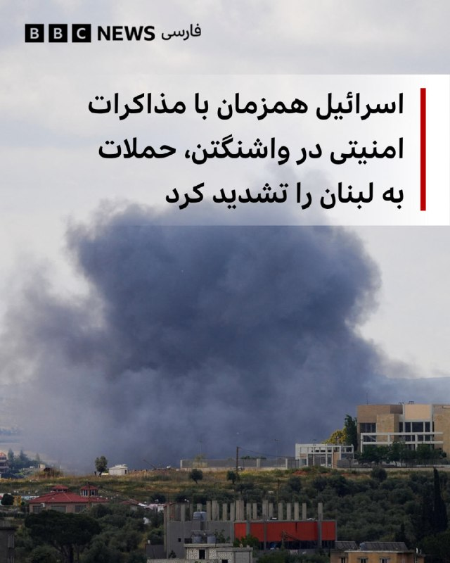

بنیامین نتانیاهو، نخست‌وزیر اسرائیل، می‌گوید که نیروهای کشورش در خاک لبنان پیشروی بیشتری کرده‌اند؛ این در حالی است که هیئت‌های نظامی اسرائیل و لبنان در واشنگتن در حال برگزاری مذاکرات امنیتی هستند.

اسرائیل همچنین روز جمعه به بمباران گسترده جنوب لبنان ادامه داد. دفتر جوزف عون، رئیس‌جمهور لبنان، اعلام کرد که او در تماس تلفنی با مارکو روبیو، وزیر خارجه آمریکا، بر «لزوم به‌کارگیری همه تلاش‌ها برای دستیابی به آتش‌بس» به‌عنوان نخستین گام ضروری تاکید کرده است.

قرار بود آتش‌بس میان اسرائیل و حزب‌الله، گروه مورد حمایت ایران، از ۱۷ آوریل اجرایی شود، اما این آتش‌بس هرگز به‌طور کامل رعایت نشده است.

دو طرف یکدیگر را به نقض آتش‌بس متهم می‌کنند و حملات خود را با استناد به تخلفات طرف مقابل توجیه می‌کنند.

حزب‌الله اعلام کرد که روز جمعه مجموعه‌ای از حملات را علیه نیروها، پادگان‌ها و یک اردوگاه نظامی در شمال اسرائیل انجام داده است.

https://bbc.in/4dXZb61
📷 Reuters
@BBCPersian

## BBCPersian — post 282355

  

‌ ‌ ‌ ‌
مقام‌های فدراسیون فوتبال ایران اعلام کردند که پس از انتقال اردوی تیم ملی برای جام جهانی از آریزونا به شهر تیخوانا در مکزیک، از فیفا خواسته‌اند تا زمان صدور ویزاهای این رقابت‌ها را مشخص کند.

تیم ملی ایران روز جمعه در دیداری تدارکاتی در شهر آنتالیا ترکیه با نتیجه سه بر یک، گامبیا را شکست داد.

ایران قرار است که هر سه مسابقه خود در مرحله گروهی جام جهانی را در آمریکا برگزار کند، اما از زمان حملات آمریکا و اسرائیل به ایران در اواخر فوریه، ابهام‌هایی درباره حضور این تیم در مسابقات به وجود آمده است.

به گفته مقام‌های فدراسیون فوتبال ایران، انتقال اردو به تیخوانا به‌دلیل مشکلات دیپلماتیک و مسائل مربوط به ویزا انجام شده و اکنون تیم ملی برای حضور در مسابقات خود در لس‌آنجلس و سیاتل، علاوه بر ویزای آمریکا، به مجوزهای تردد میان مکزیک و آمریکا نیز نیاز دارد.

مهدی محمدنبی، نایب‌رئیس اول فدراسیون فوتبال ایران، به رویترز گفت: «امروز برای فیفا ایمیل فرستادیم و خواستیم هرچه زودتر نتیجه را اعلام کند و بگوید که ویزاها در چه تاریخی صادر خواهند شد.»

https://bbc.in/4u8Us7o
📷 EPA/Shutterstock
@BBCPersian

## BBCPersian — post 282354

  

‌ ‌ ‌ ‌
روزنامه «اسرائیل هیوم» چاپ تل‌آویو گزارشی منتشر کرده است از عملیات پیچیده موساد برای نفوذ در ایران و برانداختن حکومت جمهوری اسلامی. در این گزارش به نقل از منابعی در موساد، از جمله یک مقام ارشد که تا حدود سه ماه پیش رئیس شاخه نفوذ این سازمان بود، جزئیات منتشر شده در این گزارش بسیار کم سابقه است.

در این گزارش آمده است که داوید برنع وقتی در ژوئن سال ۲۰۲۱ ریاست موساد را به عهده گرفت، تغییراتی در رویکرد و ساختار این سازمان ایجاد کرد.

یکی از این تغییرات، که با مقاومت درونی زیادی هم روبرو شد، تجدید ساختار واحد اطلاعات انسانی موساد، معروف به زومت (Tzomet) بود.

https://bbc.in/49wmP8a
📷Reuters
@BBCPersian

## Dirty_Kids — post 390536

  <a href="telegram/content/Dirty_Kids_390536_1780096734.webm" target="_blank">🎬 Download video</a>

☢️خفن ترین و‌ قدیمی ترین  انالیزور  ایران ینی دکتر بت 
👍 
🔴مسابقات جذاب جام جهانی به زودی شروع میشه بیا توی کانال دکتر بت و باهاش همراه شو و پول در بیار
💵 رایگان بهترین شرط هارو براتون میذاره حتی هزار تومن هم دریافت نمیکنه روزانه میتونی از پیش بینی فوتبال باهاش…

## Dirty_Kids — post 390535

  <a href="telegram/content/Dirty_Kids_390535_1780096735.webm" target="_blank">🎬 Download video</a>

☢️خفن ترین و‌ قدیمی ترین  انالیزور  ایران ینی دکتر بت 
👍

🔴مسابقات جذاب جام جهانی به زودی شروع میشه بیا توی کانال دکتر بت و باهاش همراه شو و پول در بیار
💵

رایگان بهترین شرط هارو براتون میذاره
حتی هزار تومن هم دریافت نمیکنه
روزانه میتونی از پیش بینی فوتبال باهاش پول در بیاری 👌
A8

🌟اگ اهل پیش بینی فوتبالی این کانال اصلا از دست ندین
👇

✅https://t.me/+4_ADqwB9e-QwYjlk

✅https://t.me/+4_ADqwB9e-QwYjlk

## Dirty_Kids — post 390534

  

#بخوابیم

@Dirty_Kids 👻

## Dirty_Kids — post 390530

  <a href="telegram/content/Dirty_Kids_390530_1780096736.mp4" target="_blank">🎬 Download video</a>

جفت کنید، اینا 👆۲۰ میلیارد ناقابل دادن فقط برای عروسی گرفتن😕

۹۰ درصد مردم تمام آرزوشون ۲۰ میلیارده یه خونه و ماشین بگیرن، این دیگه اختلاف طبقاتی نیست شیاف طبقاتیه

@Dirty_Kids 👻

## Dirty_Kids — post 390529

  <a href="telegram/content/Dirty_Kids_390529_1780096737.mp4" target="_blank">🎬 Download video</a>

از اول جنگ تا حالا ۱۶بار نتانیاهو رو کشتن 😂😂

یعنی اول بچه‌شیعه بوده بعد کصخلا و کونی‌پرو‌ها از روش یاد گرفتن کصخلیت و کونی‌‌پروگریو

@Dirty_Kids 👻

## Dirty_Kids — post 390528

  <a href="telegram/content/Dirty_Kids_390528_1780096738.mp4" target="_blank">🎬 Download video</a>

حاجی قبلن شهریاری ویدیو رقصش تو عروسی درمیومد ممنوع صحنه میشد

ببینید اثرات موشک بی‌بی‌ و ترامپو

چقد تخمیه این دختره

@Dirty_Kids 👻

## Dirty_Kids — post 390527

اون پولی که بابت فیلتر شکن دادی چوب زوری بوده که جمهوری اسلامی تو کونت کرده، با چوب تو کونتم فلکس میکنی عقب مونده؟

@Dirty_Kids 👻

## Dirty_Kids — post 390525

  <a href="telegram/content/Dirty_Kids_390525_1780096741.mp4" target="_blank">🎬 Download video</a>

🔴 این ویدیو ها مربوط به شبی هست که خامنه‌ای کشته شد، مردم کِل میکشن و پایکوبی میکنن.

@Dirty_Kids 👻

---
📅 بروزرسانی: 1405/03/09 01:30
---

## VahidOOnLine — post 242838

♦️حسین علایی، فرمانده سابق نیروی دریایی سپاه پاسداران، در مصاحبه با «بر مدار ایران» گفت که پیش از آغاز جنگ اخیر، سناریوی ترور مقامات ارشد نظام را پیش‌بینی کرده و آن را با علی شمخانی، دبیر وقت شورای عالی امنیت ملی، در میان گذاشته بود. علایی گفت: «من سه روز قبل از جنگ جدید به شمخانی گفتم که نقشه اول آمریکا جنگ ۱۲ روزه و نقشه دوم آنها اعتراضات دی‌ماه بود، اما آنها اکنون روی نقشه سوم تمرکز کرده‌اند که استراتژی آن، هدف قرار دادن و ترور رهبر (علی خامنه‌ای) در همان نخستین روزهای آغاز جنگ است.» او در ادامه گفت که شمخانی در آن زمان با تکیه بر عدم توانایی دشمن در شناسایی موقعیت‌ها، این احتمال را رد کرده بود.
علی خامنه‌ای، دومین رهبر جمهوری اسلامی، و علی شمخانی، از مشاوران او، صبح ۹ اسفندماه در اولین روز جنگ، طی حمله مشترک آمریکا و اسرائیل کشته شدند.
‌🇸🇦 Indypersian

🤖 @VahidOOnLine

## VahidOOnLine — post 242837

  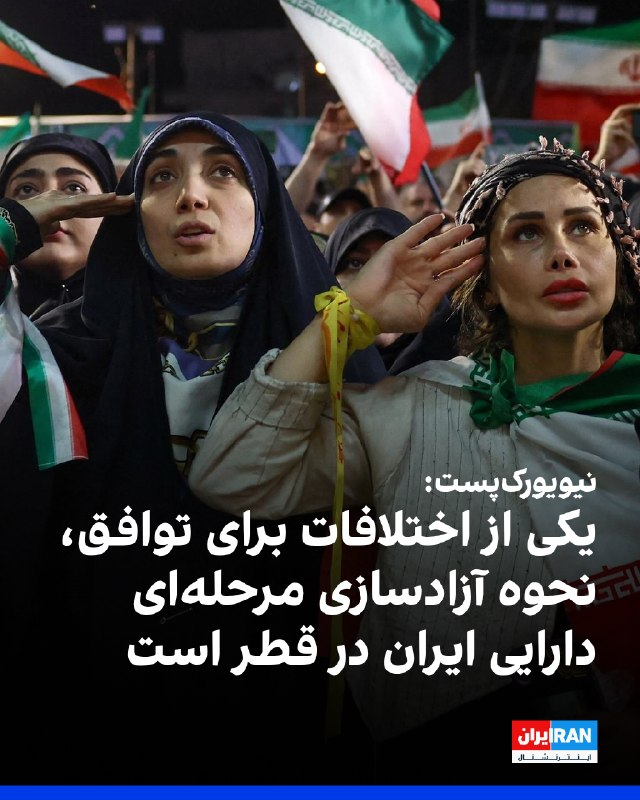

به گزارش نیویورک‌پست، یکی از آخرین موارد اختلاف بر سر راه توافق احتمالی میان واشینگتن و تهران، چگونگی آزادسازی مرحله‌ای دارایی‌های ایران است که در قطر نگهداری می‌شود و برای اهداف بشردوستانه در نظر گرفته شده است.
بر اساس این گزارش، منابع مالی مورد بحث مستقیما در اختیار حکومت ایران قرار نخواهد گرفت، بلکه برای خرید مواد غذایی و تجهیزات پزشکی استفاده می‌شود و سپس این اقلام به ایران ارسال خواهد شد.
نیویورک‌پست به نقل از یک مقام دولت آمریکا نوشت پرداخت تدریجی این منابع به اجرای تعهدات از سوی ایران، از جمله بازگشایی تنگه هرمز و پاکسازی مین‌ها در تنگه هرمز، وابسته خواهد بود.

‌🏁 🇬🇧 IranintlTV

🤖 @VahidOOnLine

## VahidOOnLine — post 242836

  

♦️«ان‌بی‌سی نیوز» به نقل از منابع آگاه، روز جمعه گزارش داد، ارتش ایالات متحده علی‌رغم جستجوهای گسترده و مداوم در آبراه حیاتی تنگه هرمز، هنوز نتوانسته است ادعای مین‌گذاری رژیم ایران در این منطقه را به طور قطعی تایید کند. دو مقام رسمی آمریکا و یک فرد مطلع از این پرونده اعلام کرده‌اند که با وجود ارزیابی‌های اولیه اطلاعاتی مبنی بر اقدام حکومت ایران به مین‌گذاری در بخش جنوبی این تنگه در آغاز جنگ در ماه فوریه، بازرسی‌های مکرر با استفاده از پهپادهای زیرسطحی، ربات‌های آبی و پرنده‌های سرنشین‌دار و بدون سرنشین هنوز به کشف هیچ مین مشخصی منجر نشده است؛ موضوعی که بر ابهامات و سردرگمی‌های موجود پیرامون این نبرد افزوده است.
بر اساس این گزارش، عدم دستیابی به شواهد قطعی در آستانه ورود این جنگ به چهارمین ماه خود، سوالات کلیدی را درباره میزان «جدی و مستحکم بودن» این تهدیدات برانگیخته است. این در حالی است که دونالد ترامپ و مقامات ارشد دولت او پیش از این بارها گفته بودند که ایران ممکن است در حال پر کردن تنگه با مین‌های دریایی باشد؛ مطلبی که به عنوان دلیل اصلی توقف تردد کشتی‌ها و جهش بی‌سابقه قیمت نفت مطرح می‌شد. با این حال، کارشناسان تاکید می‌کنند که مین‌گذاری موثر این آبراه حیاتی مستلزم به‌کارگیری حجم بسیار بالایی از مواد منفجره پنهان در یک منطقه مشخص است که ارتش آمریکا هنوز نشانه‌ای از آن پیدا نکرده است.
‌🇸🇦 Indypersian

🤖 @VahidOOnLine

## VahidOOnLine — post 242835

  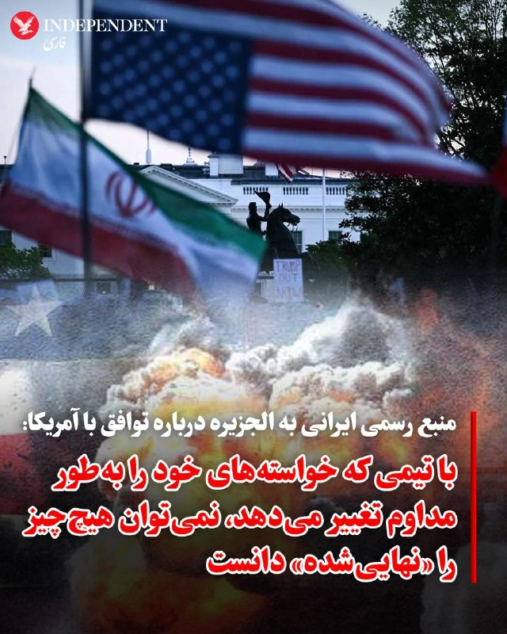

♦️یک منبع رسمی ایرانی در گفتگو با خبرنگار الجزیره، با اشاره به روند مذاکرات و توافق موقت با ایالات متحده آمریکا اعلام کرد که «با تیمی که فاقد هرگونه چارچوب حرفه‌ای یا اخلاقیِ پایدار است، بر اساس روحیات و خلق‌وخوی شخصی رفتار می‌کند و خواسته‌های خود را به طور مداوم تغییر می‌دهد، نمی‌توان هیچ چیز را نهایی‌شده توصیف کرد.»
‌🇸🇦 Indypersian

🤖 @VahidOOnLine

## VahidOOnLine — post 242834

  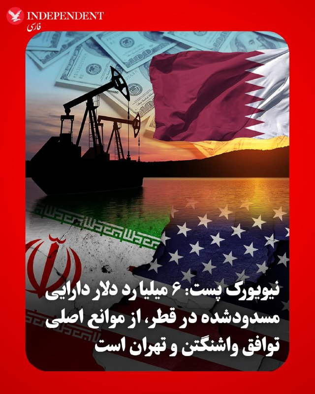

♦️به گزارش روزنامه نیویورک‌پست، یکی از آخرین موانع باقی‌مانده در مسیر توافق صلح موقت میان آمریکا و جمهوری اسلامی ایران، نحوه آزادسازی مرحله‌به‌مرحله ۶ میلیارد دلار از دارایی‌های ایران در قطر است. دونالد ترامپ و مذاکره‌کنندگان ایرانی در حال چانه‌زنی بر سر جزئیات نهایی یک تفاهم‌نامه هستند که بر اساس آن، تنگه هرمز به روی کشتیرانی بین‌المللی بازگشایی می‌شود و در مقابل، زمان بیشتری برای دور دوم مذاکرات درباره سرنوشت اورانیوم غنی‌شده ایران داده خواهد شد. این اموال مستقیما به ایران پرداخت نمی‌شود بلکه برای خرید غذا و دارو هزینه خواهد شد و آزادسازی تدریجی آن به پایبندی ایران به تعهداتی چون بازگشایی و مین‌روبی تنگه هرمز مشروط است.
نیویورک‌پست به نقل از یک مقام مسئول افزود که این نزدیک‌ترین وضعیت دو کشور به توافق است؛ با این حال، روند صلح به دلیل پنهان شدن مجتبی خامنه‌ای، رهبر جمهوری اسلامی، از ترس ترور توسط آمریکا و اسرائیل و نیاز به فرآیند چندروزه تبادل پیام از طریق پیک، با کندی پیش می‌رود.
‌🇸🇦 Indypersian

🤖 @VahidOOnLine

## VahidOOnLine — post 242833

  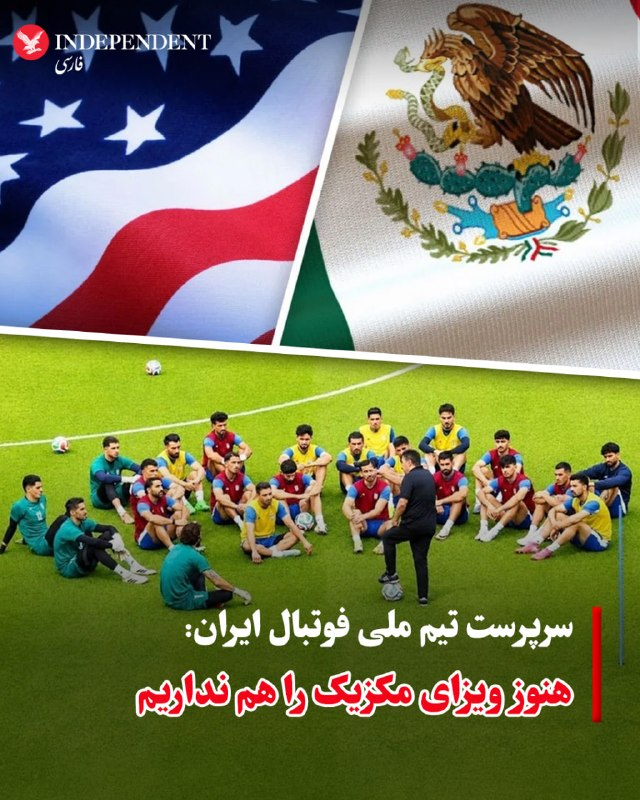

♦️درحالی‌که تنها ۱۲ روز تا آغاز جام جهانی ۲۰۲۶ باقی مانده و تیم ملی فوتبال ایران در اردوی آماده‌سازی به سر می‌برد، مهدی محمدنبی، سرپرست تیم ملی، پس از بازی مقابل گامبیا به خبرنگاران گفت که تا این لحظه ویزای مکزیک و آمریکا «صادر نشده است». او گفت: «به فیفا ایمیل زدیم و پرسیدیم که چه روزی قرار است ویزا صادر شود. ما ویزای مولتی آمریکا و مکزیک را نیاز داریم. اینکه هنوز ویزای ما صادر نشده و همه از آن اطلاع دارند، عادلانه نیست».
‌🇸🇦 Indypersian

🤖 @VahidOOnLine

## VahidOOnLine — post 242832

♦️اسکات بسنت، وزیر خزانه‌داری ایالات متحده، روز جمعه هشتم خرداد در «مجمع اقتصادی ملی ریگان» اعلام کرد که واشنگتن حدود یک میلیارد دلار از دارایی‌های رمزارزی مرتبط با حکومت ایران را به طور مستقیم توقیف و کیف‌پول‌های دیجیتال آن‌ها را ضبط کرده است. او با تاکید بر اینکه این اموال در واقع پول‌های دزدیده‌شده از مردم ایران است، اشاره کرد که بسیاری از صاحبان این حساب‌ها هنوز متوجه ضبط دارایی و کیف‌پول دیجیتال خود نشده‌اند.
وزیر خزانه‌داری آمریکا همچنین افزود واشنگتن با همکاری نزدیک متحدان اروپایی خود در حال ردیابی و توقیف املاک و مستغلات، از جمله ویلاها و خانه‌های متعلق به این افراد در سراسر اروپا است.
‌🇸🇦 Indypersian

🤖 @VahidOOnLine

## VahidOOnLine — post 242831

  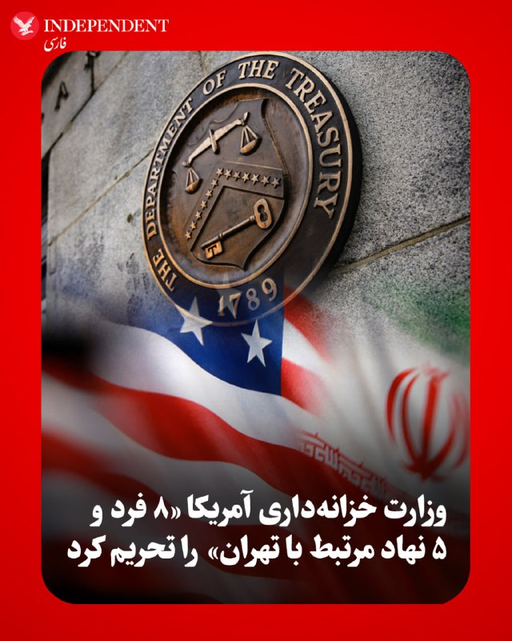

♦️وزارت خزانه‌داری ایالات متحده، روز جمعه، در ادامه کارزار فشار حداکثری علیه جمهوری اسلامی تحت عنوان طرح «خشم اقتصادی»، از وضع تحریم‌های جدید ضد تروریستی علیه شبکه تدارکاتی و مالی مرتبط با تهران خبر داد؛ بر اساس بیانیه رسمی این وزارتخانه، ۸ فرد و ۵ نهاد به دلیل کلاهبرداری، جعل هویت شرکت‌های آمریکایی و دور زدن تحریم‌ها برای تامین قطعات و نرم‌افزارهای امنیتی مورد نیاز وزارت دفاع ایران و سپاه پاسداران در فهرست سیاه قرار گرفته‌اند. این تحریم‌ها عمدتا شبکه‌ای مرتبط با علی مجد سپهر و برخی شرکت‌های وابسته به وزارت دفاع و پشتیبانی نیروهای مسلح جمهوری اسلامی را هدف قرار داده است. وزارت خزانه‌داری آمریکا در این بیانیه اعلام کرد علی مجد سپهر، محمدعلی منصور دره‌شیری، سعید زاهدی، پیام اختریان، هدی باقری، فرزانه رضایی، رودابه سرمدی و منوچهر زندیان هشت فرد تحریم شده هستند. واشنگتن هم‌زمان با مسدود کردن دارایی‌های رمزارزی مرتبط با تهران، به شرکت‌های بین‌المللی و پالایشگاه‌های مستقل در خصوص هرگونه تسهیل تجاری یا پرداخت عوارض عبور به ایران در تنگه هرمز هشدار داده و تأکید کرده است که متخلفان با تحریم‌های ثانویه سنگین روبرو خواهند شد.
‌🇸🇦 Indypersian

🤖 @VahidOOnLine

## VahidOOnLine — post 242830

  

وزارت خزانه‌داری آمریکا جمعه تحریم‌های جدیدی در چارچوب مقابله با تروریسم علیه شماری از افراد و نهادهای ایرانی و همچنین برخی اشخاص و شرکت‌های دیگر اعمال کرد.

بر اساس اعلام وزارت خزانه‌داری آمریکا هشت فرد و پنج نهاد را به فهرست تحریم‌های خود افزود. این تحریم‌ها عمدتا شبکه‌ای مرتبط با علی مجد سپهر و برخی شرکت‌های وابسته به وزارت دفاع و پشتیبانی نیروهای مسلح جمهوری اسلامی را هدف قرار داده است.

وزارت خزانه‌داری آمریکا افزود علی مجد سپهر، محمدعلی منصور دره‌شیری، سعید زاهدی، پیام اختریان، هدی باقری، فرزانه رضایی، رودابه سرمدی و منوچهر زندیان هشت فرد تحریم شده هستند.
‌🏁 🇬🇧 IranintlTV

🤖 @VahidOOnLine

## VahidOOnLine — post 242829

  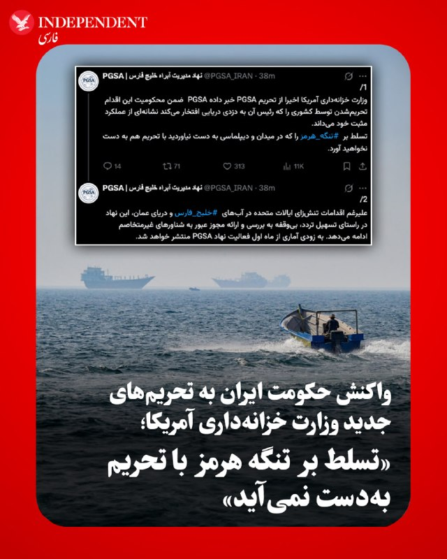

♦️«نهاد مدیریت آبراهه خلیج فارس» (PGSA) روز جمعه، هشتم خردادماه، با انتشار بیانیه‌ای در حساب رسمی خود در اکس، تحریم‌های اخیر وزارت خزانه‌داری آمریکا علیه این نهاد را به شدت محکوم کرد و نوشت: «تسلط بر تنگه هرمز را که در میدان و دیپلماسی به دست نیاوردید با تحریم هم به دست نخواهید آورد». این نهاد اعلام کرد که علی‌رغم «اقدامات تنش‌زای آمریکا» در آب‌های خلیج فارس و دریای عمان، بی‌وقفه به بررسی و ارائه مجوز عبور به شناورهای غیرمتخاصم در راستای تسهیل تردد ادامه می‌دهد و به زودی آمار ماه اول فعالیت خود را منتشر خواهد کرد.
به گزارش اسوشیتدپرس، دولت ترامپ روز چهارشنبه در چارچوب کارزار گسترده فشار اقتصادی، تحریم‌های بیشتری علیه حکومت ایران اعمال کرد؛ این بار با هدف قرار دادن آژانس تازه‌تاسیس رژیم ایران که تلاش می‌کند کشتیرانی از طریق تنگه را کنترل و عوارض دریافت کند.
‌🇸🇦 Indypersian

🤖 @VahidOOnLine

## VahidOOnLine — post 242828

  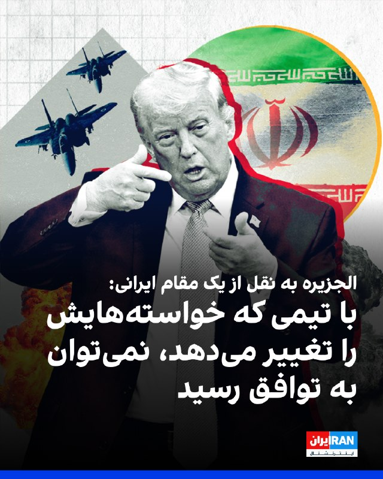

یک مقام ایرانی به الجزیره گفت هیچ‌چیز را نمی‌توان با تیمی که چارچوب حرفه‌ای یا اخلاقی مشخصی ندارد، رفتاری غیرقابل پیش‌بینی از خود نشان می‌دهد و مدام خواسته‌هایش را تغییر می‌دهد، «نهایی‌شده» توصیف کرد.

پیش‌تر سخنگوی وزارت خارجه جمهوری اسلامی اعلام کرده بود مشکل اصلی در رسیدن به توافق، تغییر مواضع طرف آمریکایی است.
‌🏁 🇬🇧 IranintlTV

🤖 @VahidOOnLine

## VahidOOnLine — post 242827

  

♦️رؤسای صندوق بین‌المللی پول (IMF)، بانک جهانی و آژانس بین‌المللی انرژی (IEA) روز جمعه هشتم خرداد، هشدار دادند که در صورت باز نگشتن تردد نفتکش‌ها در تنگه هرمز به روال عادی، امنیت سوخت در ماه‌های پرتقاضای تابستان با خطرات جدی مواجه خواهد شد.

روسای این نهادهای بین‌المللی در یک بیانیه مشترک اعلام کردند: «ذخایر جهانی نفت در واکنش به کاهش شدید عرضه ناشی از بحران تنگه هرمز، با سرعتی بی‌سابقه در حال کاهش است. اگر جریان کشتیرانی به حالت عادی بازنگردد، تخلیه سریع و مداوم ذخایر جهانی نفت در آستانه اوج تقاضای تابستانی در نیم‌کره شمالی، مخاطرات فزاینده‌ای را برای امنیت سوخت، شرایط بازار و انعطاف‌پذیری کلان اقتصادی به همراه خواهد داشت.»
‌🇸🇦 Indypersian

🤖 @VahidOOnLine

## VahidOOnLine — post 242826

  

♦️وزارت امور خارجه آمریکا، روز جمعه، هشتم خردادماه، با انتشار بیانیه‌ای رسمی، جزئیات گفتگوی تلفنی مارکو روبیو، وزیر امور خارجه این کشور، با جوزف عون، رئیس‌جمهوری لبنان را اعلام کرد. در این بیانیه که از سوی تامی پیگات، سخنگوی وزارت خارجه صادر شده، آمده است که مارکو روبیو از «شجاعت و چشم‌انداز» ژوزف عون در پیشبرد مذاکرات مستقیم با اسرائیل تمجید کرده است. روبیو تاکید کرد که این تلاش‌ها در حالی صورت می‌گیرد که حزب‌الله همچنان به تلاش‌های خود برای به بن‌بست کشاندن این گفتگوها به قیمت منافع مردم لبنان ادامه می‌دهد.
وزیر امور خارجه آمریکا در این تماس بار دیگر حزب‌الله را مسئول کامل درگیری‌های جاری دانست و بر لزوم توقف فوری حملات و اقدامات تحریک‌آمیز این گروه برای فراهم شدن زمینه تنش‌زدایی تأکید کرد. او همچنین خاطرنشان کرد که ایالات متحده به طور کامل از دولت لبنان در مسیر دستیابی به یک فرصت تاریخی برای برقراری صلح، بازسازی کشور و ساختن آینده‌ای بهتر برای مردمش حمایت می‌کند.
‌🇸🇦 Indypersian

🤖 @VahidOOnLine

## VahidOOnLine — post 242825

  

اسکات بسنت، وزیر خزانه‌داری آمریکا، ضمن اعلام توقیف یک میلیارد دلار رمزارز مرتبط با جمهوری اسلامی، گفت: «ما در حال همکاری با متحدانمان در سراسر اروپا هستیم تا ویلاها، خانه‌ها و املاک مقامات جمهوری اسلامی را توقیف کنیم.»
او افزود: «این پولی است که از مردم ایران دزدیده شده است.»
‌🏁 🇬🇧 IranintlTV

🤖 @VahidOOnLine

## WithYashar — post 12915

https://t.me/boost/withyashar

بچه‌ها عالی بود👏👏، بوست ۳۴۸ تا دیگه لازم داره. لطفاً این پیام رو برای تمام دوستانتون که تلگرام پرمیوم(تیک) دارن بفرستین و ازشون خواهش کنین که چنل رو بوست کنن ❤️‍🩹چیزی‌ تا ایموجی نمونده🤰🫃🏻

## WithYashar — post 12914

شکست مذاکرات پنتاگون؛ اصرار تل‌آویو بر تداوم جنگ در لبنان

منبع رسمی لبنانی: طرف اسرائیلی با درخواست هیئت لبنانی برای آتش بس مخالفت کرد

یک منبع رسمی لبنانی در گفت‌وگو با المیادین اعلام کرد:  هیئت نظامی مذاکره‌کننده در پنتاگون، به درخواست خود برای برقراری آتش‌بس واقعی دست نیافت. این هیئت بر مطالبه آتش‌بس پافشاری کرد، اما با مخالفت مکرر اسرائیل مواجه شد.

به گفته این منبع، هیئت اسرائیلی از عقب‌نشینی از اراضی اشغالی لبنان خودداری کرده و بر «نابودی (توانمندی‌های نظامی) حزب الله» اصرار کرد.
@withyashar

## WithYashar — post 12913

  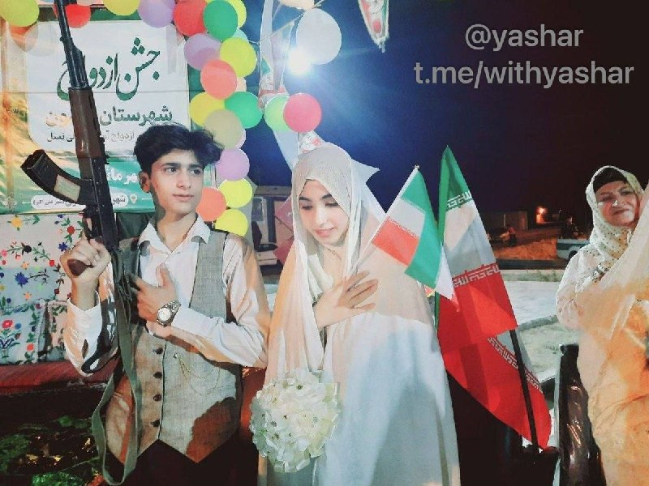

تصویری از داماد ۱۷ ساله و عروس ۱۶ ساله در تجمعات شبانه
@withyashar
زبانم قاسمه کتلته…🥴

## WithYashar — post 12912

صداوسیما: منابع محلی از فعال شدن سامانه پدافندی در جزیره قشم حوالی ساعت ۲۱:۲۵ خبر دادند.

بررسی‌های اولیه حاکی است این اقدام به احتمال زیاد در مقابله با ریزپرنده‌ها انجام شده و با موفقیت همراه بوده است.
سامانه‌های پدافندی آرش‌ کمان‌گیر در روزهای اخیر عملکرد موفقی در مقابله با پهپادهای دشمن داشته‌اند.
@withyashar

## WithYashar — post 12911

حسین علایی:
سه روز قبل از ۹ اسفند به شمخانی گفتم امریکا جنگ رو با تـرور رهبر شروع میکنه؛ گفت نمیتونن اینکارو کنن. چون نمیتونن پیداش کنن.
سه روز بعد هم خودشو زدن هم رهبر رو. اونا اطلاعاتشون خیلی قویه.
@withyashar

## WithYashar — post 12910

  

مالک شبکه ایران اینترنشنال به ادعای فاینانشال تایمز

گزارش Financial Times درباره ایران اینترنشنال می‌گوید این شبکه به‌صورت رسمی توسط شرکت بریتانیایی Volant Media UK اداره می‌شود، اما ساختار مالکیت آن پیچیده و چندلایه است و از طریق شرکت‌هایی در بریتانیا و جزایر کیمن انجام می‌شود. طبق این گزارش، این شرکت در سال‌های اخیر با زیان‌های سنگین و بدهی‌های بزرگ (بیش از ۴۰۰ میلیون پوند) روبه‌رو بوده و اخیراً بخشی از بدهی‌ها از طریق تبدیل بدهی به سهام بازسازی شده است. در جریان این تغییرات، سهام قابل توجهی به یک شرکت ثبت‌شده در جزایر کیمن به نام Info-Cast Cayman Limited منتقل شده که مدیر آن فردی به نام صالح حسین الدویس معرفی شده است؛ او در گزارش FT به‌عنوان مدیری مرتبط با گروه رسانه‌ای سعودی SRMG شناخته می‌شود. این گزارش تأکید می‌کند که مالکیت شبکه شفاف و مستقیم نیست و در قالب ساختارهای مالی پیچیده و آفشور انجام شده است
@withyashar

## WithYashar — post 12909

شاهزاده رضا پهلوی :اگر اروپا می‌تواند اتحادیه خودش را داشته باشد، چرا ما نتوانیم در خاورمیانه اتحادیه‌ای داشته باشیم؟
چرا نتوانیم در پروژه‌های مشترک مربوط به امنیت ملی، اطلاعات و حتی همکاری‌های نظامی همکاری کنیم؟
چرا باید بخش زیادی از بودجه‌مان را صرف تسلیحات و مسابقه تسلیحاتی کنیم، به جای اینکه این منابع را صرف رفاه، صندوق‌های بازنشستگی، بهداشت و آموزش کنیم؟
@withyashar

## WithYashar — post 12908

نیویورک پست: وجوه مسدود شده مستقیما به ایران ارسال نخواهد شد، بلکه برای خرید مواد غذایی و تجهیزات پزشکی استفاده خواهد شد و پرداخت آنها منوط به تعهد تهران به باز کردن تنگه هرمز و پاکسازی مین‌ها خواهد بود
@withyashar

## WithYashar — post 12907

شاهزاده رضا پهلوی:تصور کنید که فردا مدل سیلیکون ولی در سیستان و بلوچستان اجرا شود. چرا که نه؟

هر چیزی که کشور نیاز داشته باشد از هوش مصنوعی گرفته تا فناوری و نوآوری می‌تواند در آنجا توسعه یابد.
@withyashar

## mwarmonitor — post 9904

🔴ایران و مسیر پیش‌رو: ترامپ باید از اهرم فشار خود استفاده کند و به دنبال «صلح از طریق قدرت» باشد

📝 نویسنده: ربکا ال. هاینریش ، انستیتو هادسون

🔸عملیات‌های «پتک نیمه‌شب» (Midnight Hammer) و «خشم حماسی» (Epic Fury) با موفقیت برنامه‌ تسلیحات هسته‌ای و قدرت‌نمایی منطقه‌ای ایران را تضعیف کردند. ایالات متحده و اسرائیل توان نظامیِ نیروی دریایی و هوایی ایران را به شدت کاهش دادند و در عین حال، به ارکان اصلی پایه صنعتی دفاعی آن، به‌ویژه تولید فولاد و پلاستیک مرتبط با صنایع نظامی، آسیب سنگینی وارد کردند. عملیات‌های نظامی متحدان همچنین باعث ایجاد شکاف در درون رژیم ایران شده است؛ از جمله فروپاشی در ساختار فرماندهی و کنترل که به نظر می‌رسد توانایی چهره‌های سیاسی را برای کنترل عملیات‌های سپاه پاسداران انقلاب اسلامی در تنگه هرمز تحت تأثیر قرار داده است.

اگرچه ایالات متحده و اسرائیل رژیم را تضعیف کرده‌اند، اما واشنگتن در مذاکرات با یک مانع روبرو است؛ زیرا مشخص نیست چه کسی در تهران قدرت را در دست دارد و آیا نمایندگان سیاسی ایران می‌توانند تعهدات خود را بر سپاه پاسداران تحمیل و اجرا کنند یا خیر. مسئله اصلی صرفاً دستیابی به یک توافق نیست، بلکه پایداری و دوام هرگونه توافق است. این چالش پابرجا خواهد ماند زیرا رژیم از درون دچار چنددستگی است، جمهوری اسلامی سابقه‌ای طولانی در عدم حسن نیت در مذاکرات دارد و همچنان حاضر نیست از ادعای نادرست خود مبنی بر «حق غنی‌سازی اورانیوم» دست بکشد.
اگر ایالات متحده موفق شود یک یادداشت تفاهم از بقایای رژیم ایران (حتی با وجود رهبری متفرق فعلی) دریافت کند، باید از ایرانی‌ها بخواهد که توقف واقعی تجاوزات در تنگه هرمز و رویکردی تعاملی برای برچیدن سایر عناصر برنامه تسلیحات هسته‌ای خود را نشان دهند. دولت ترامپ متعهد شده است تا زمانی که ایران ابتدا پایبندی خود را به یک تنگه آزاد و باز نشان نداده و برنامه هسته‌ای خود را برچیند، هیچ توافقی را نخواهد پذیرفت و فشار اقتصادی یا نظامی را کاهش نخواهد داد.
دستاوردهای نظامی و آسیب‌پذیری‌ها
عملیات «خشم حماسی» با موفقیت ساختارهای فرماندهی و کنترل و رهبران کلیدی نظامی ایران را مختل کرد و توانمندی‌های متعارف کلیدی آن را کاهش داد. اما این عملیات تا مرز نابودی کامل تشکیلات سپاه پاسداران پیش نرفت. واحدهای سپاه در امتداد سواحل خلیج [فارس] هنوز می‌توانند با خودمختاری قابل‌توجهی عمل کنند، قایق‌های تندرو را مستقر کنند، پرتابگرها را به کار بگیرند، به سمت هواپیماهای آمریکایی که محاصره کشتیرانی ایران را اجرا می‌کنند موشک‌های زمین به هوا شلیک کنند و حتی در شرایطی که مقامات سیاسی ایران در حال مذاکره هستند، مزاحم کشتیرانی بین‌المللی شوند.
این ازهم‌گسیختگی یک مشکل اساسی برای دیپلماسی ایجاد می‌کند: رهبری سیاسی تهران ممکن است تضمین‌هایی بدهد که توانایی اجرای آن‌ها را ندارد. ادامه فعالیت‌های سپاه در تنگه هرمز در طول مذاکرات، این سوال عمیق‌تر را برجسته می‌کند که آیا اصلاً کسی در تهران هست که بتواند به طور قابل اعتمادی سپاه را مجبور به پایبندی به یک توافق کند؟
تنگه هرمز: یک اهرم فشار، نه منوط به اجازه
تضمین آزادی کشتیرانی در تنگه هرمز یک اولویت فوری و کوتاه‌مدت است، زیرا اختلال در آنجا بر بازارهای جهانی، به‌ویژه در حوزه انرژی و ثبات اقتصادی تأثیر می‌گذارد. اما ایالات متحده باید از هرگونه چارچوبی که مستلزم مذاکره برای کسب مجوزهای گام‌به‌گام از ایران باشد یا کنترل باقی‌مانده بر این آبراه حیاتی جهانی را در دست تهران باقی بگذارد، خودداری کند.
هرگونه توافقی که در ازای همکاری محدود ایران در زمینه کشتیرانی، تحریم‌ها را کاهش دهد یا بخش‌هایی از محاصره را لغو کند، خطر از دست رفتن اهرم فشاری را به همراه دارد که برای برچیدن دائمی برنامه هسته‌ای ایران نیاز است. رویکرد مؤثرتر، از سرگیری «پروژه آزادی» (Project Freedom) خواهد بود. این پروژه شامل پاکسازی تهدیدها در طول تنگه، خنثی کردن قایق‌های تندرو سپاه، سایت‌های موشکی ساحلی و سیستم‌های مستقر در غارها، و اسکورت ترافیک تجاری از طریق این آبراه است، به جای اینکه منتظر اجازه ایران بمانند. شرکت‌های بیمه و خطوط کشتیرانی تا زمانی که واحدهای سپاه به فعالیت خود در طول خط ساحلی ادامه می‌دهند، بعید است تنها به تضمین‌های سیاسی اعتماد کنند.



@mwarmonitor

## mwarmonitor — post 9903

  

🔴 تانکر تارکرز: در روزهای اخیر، نفتکش‌ها در امتداد ساحل ایران و در تأسیسات دریایی اقدام به بارگیری نفت خام و انواع فرآورده‌های پالایش‌شده کرده‌اند. امروز (۲۹ مه ۲۰۲۶) نیز شاهد بارگیری یک نفتکش بسیار بزرگ (VLCC) به میزان دو میلیون بشکه نفت خام هستیم. @mwarmonitor

## mwarmonitor — post 9902

  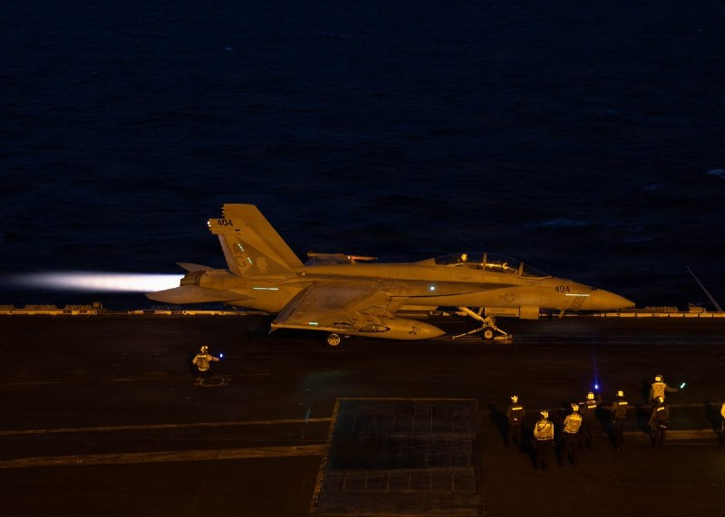

📌ملوانان نیروی دریایی آمریکا عملیات پرواز شبانه را روی ناو هواپیمابر «USS George H. W. Bush (CVN-77)» انجام می‌دهند. در شب، خلبانان بسیار ماهر می‌توانند در تاریکی تقریباً کامل، روی یک عرشه کوچک که در حال بالا و پایین رفتن و تکان خوردن است فرود بیایند.

@mwarmonitor

## mwarmonitor — post 9901

  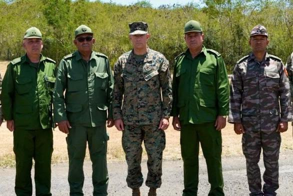

🔴فرمانده فرماندهی جنوبی ارتش آمریکا، ژنرال دونوفان، امروز در حاشیه خلیج گوانتانامو با فرماندهان ارشد نظامی کوبا دیدار کرده است. رویترز

@mwarmonitor

## mwarmonitor — post 9900

🔴یکی از آخرین گره‌های باقی‌مانده در مسیر توافق با ایران، آزادسازی مرحله‌ای منابع مالی است که در قطر نگهداری می‌شود و قرار است برای اهداف بشردوستانه مورد استفاده قرار گیرد — نیویورک تایمز.

@mwarmonitor

## mwarmonitor — post 9899

🔸یک منبع رسمی ایرانی همین حالا به من گفت:
«هیچ چیزی را نمی‌توان با تیمی که چارچوب حرفه‌ای یا اخلاقی ثابتی ندارد، دمدمی‌مزاج است و مدام خواسته‌هایش را تغییر می‌دهد، نهایی‌شده تلقی کرد.» علی هاشم خبرنگار الجزیره

@mwarmonitor

## mwarmonitor — post 9898

  

✈️در حال حاضر تنها پروازی که بر فراز اسرائیل در حال ارسال سیگنال است، یک هواپیمای سوخت‌رسان KC-135R Stratotanker متعلق به نیروی هوایی ایالات متحده است؛ در همین حال، یک فروند E-11A (گره ارتباطی هوابرد میدان نبرد – BACN) از پایگاه هوایی شاهزاده سلطان بر فراز عراق در حال گشت‌زنی (لوئیتر کردن) است.

@mwarmonitor

## FoxNewsTwitter — post 342412

Fox News (Twitter/X)

What are illegal migrants actually eating inside Delaney Hall?

According to a menu released by DHS, detainees are being served a wide range of meals including fajitas, burritos, jambalaya, chicken fried steak, fruit, vegetables, salads, brownies, and cake.

The release comes as New Jersey Democrats and far-left protesters criticize conditions at the ICE detention facility and stage demonstrations that have turned chaotic throughout the week.

NJ Governor Mikie Sherrill now says she is working to establish a "peaceful, protected, protest zone" with hopes to "lower the temperature."

## pm_afshaa — post 91877

  <a href="telegram/content/pm_afshaa_91877_1780092070.mp4" target="_blank">🎬 Download video</a>

ویدیویی از دقایق اول حمله اسراییل به بیت رهبری

💧 Rainbet.com the #1 Non-KYC Crypto Casino & Sportsbook @rainbetcom

😁 @Pm_Afshaa

## pm_afshaa — post 91876

  <a href="telegram/content/pm_afshaa_91876_1780092072.mp4" target="_blank">🎬 Download video</a>

شاهزاده رضا پهلوی:اگر اروپا می‌تواند اتحادیه خودش را داشته باشد، چرا ما نتوانیم در خاورمیانه اتحادیه‌ای داشته باشیم؟

چرا نتوانیم در پروژه‌های مشترک مربوط به امنیت ملی، اطلاعات و حتی همکاری‌های نظامی همکاری کنیم؟

چرا باید بخش زیادی از بودجه‌مان را صرف تسلیحات و مسابقه تسلیحاتی کنیم، به جای اینکه این منابع را صرف رفاه، صندوق‌های بازنشستگی، بهداشت و آموزش کنیم؟

💧 Rainbet.com the #1 Non-KYC Crypto Casino & Sportsbook @rainbetcom

😁 @Pm_Afshaa

## pm_afshaa — post 91875

  <a href="telegram/content/pm_afshaa_91875_1780092074.mp4" target="_blank">🎬 Download video</a>

شاهزاده رضا پهلوی:تصور کنید که فردا مدل سیلیکون ولی در سیستان و بلوچستان اجرا شود. چرا که نه؟

هر چیزی که کشور نیاز داشته باشد از هوش مصنوعی گرفته تا فناوری و نوآوری می‌تواند در آنجا توسعه یابد.

💧 Rainbet.com the #1 Non-KYC Crypto Casino & Sportsbook @rainbetcom

😁 @Pm_Afshaa

## pm_afshaa — post 91874

  <a href="telegram/content/pm_afshaa_91874_1780092076.mp4" target="_blank">🎬 Download video</a>

شاهزاده رضا پهلوی:چرا می‌گوییم جهان باید از مردم ایران در پیگیری آزادی حمایت کند؟

آنها به خاطر چشم‌های زیبای من یا شما این کار را نمی‌کنند.

آنها این کار را انجام می‌دهند چون به نفع منافع خودشان است.

ما باید آنها را قانع کنیم که حمایت از مردم ایران به نفعشان است.

💧 Rainbet.com the #1 Non-KYC Crypto Casino & Sportsbook @rainbetcom

😁 @Pm_Afshaa

## DEJradio — post 5112

  <a href="telegram/content/DEJradio_5112_1780092078.mp4" target="_blank">🎬 Download video</a>

👑
🚨 شاهزاده رضا پهلوی: «از تمام ظرفیت تاثیرگذاری خود در راه انقلاب شیر و خورشید استفاده کنید.»

بخشی دیگر از نشست آنلاین با شماری از فعالان و چهره‌های رسانه‌ای و هنری، ۱ خرداد ۲۵۸۵/۱۴۰۵

#شاهزاده_رضا_پهلوی
#ایران_را_پس_میگیریم
@DEJradio

## IranIntlTV — post 339660

  

به گزارش نیویورک‌پست، یکی از آخرین موارد اختلاف بر سر راه توافق احتمالی میان واشینگتن و تهران، چگونگی آزادسازی مرحله‌ای دارایی‌های ایران است که در قطر نگهداری می‌شود و برای اهداف بشردوستانه در نظر گرفته شده است.
بر اساس این گزارش، منابع مالی مورد بحث مستقیما در اختیار حکومت ایران قرار نخواهد گرفت، بلکه برای خرید مواد غذایی و تجهیزات پزشکی استفاده می‌شود و سپس این اقلام به ایران ارسال خواهد شد.
نیویورک‌پست به نقل از یک مقام دولت آمریکا نوشت پرداخت تدریجی این منابع به اجرای تعهدات از سوی ایران، از جمله بازگشایی تنگه هرمز و پاکسازی مین‌ها در تنگه هرمز، وابسته خواهد بود.

https://iranintl.com/202605292135

## IranIntlTV — post 339659

  <a href="telegram/content/IranIntlTV_339659_1780092081.mp4" target="_blank">🎬 Download video</a>

در حالی که دولت آمریکا از پایان محاصره دریایی ایران و پیشرفت در تفاهم‌نامه با تهران خبر داده، در کنگره آمریکا پرسش‌هایی درباره هزینه‌های جنگ با ایران مطرح شده است. منتقدان، دولت ترامپ را به ارائه آمار ناقص و متناقض متهم می‌کنند.

گزارش نیلوفر منصوری، خبرنگار ایران‌اینترنشنال
@iranintltv

## IranIntlTV — post 339658

  <a href="telegram/content/IranIntlTV_339658_1780092082.mp4" target="_blank">🎬 Download video</a>

یک موشک نیو گلن متعلق به شرکت بلو اوریجین در جریان آزمایش روی سکوی پرتاب در کیپ کاناورال فلوریدا منفجر شد و ستون بزرگی از آتش و دود به هوا برخاست. این موشک بدون سرنشین برای چهارمین پرتاب آزمایشی و حمل ماهواره‌های پروژه آمازون لئو به مدار پایین زمین آماده می‌شد.…

## IranIntlTV — post 339657

  <a href="telegram/content/IranIntlTV_339657_1780092084.mp4" target="_blank">🎬 Download video</a>

وال‌استریت ژورنال در گزارشی اختصاصی از جزییات حملات امارات به ایران در جریان جنگ اخیر خبر داد. براساس این گزارش، این حملات با هماهنگی آمریکا و اسرائیل انجام شده و قشم، ابوموسی، بندرعباس، لاوان و عسلویه را هدف قرار داده است.

گفت‌وگو با غسان عاشور، تحلیل‌گر مسائل خاورمیانه
@iranintltv

## IranIntlTV — post 339656

  <a href="telegram/content/IranIntlTV_339656_1780092086.mp4" target="_blank">🎬 Download video</a>

وال‌استریت ژورنال در گزارشی اختصاصی از جزییات حملات امارات به ایران در جریان جنگ اخیر خبر داد. براساس این گزارش، این حملات با هماهنگی آمریکا و اسرائیل انجام شده و قشم، ابوموسی، بندرعباس، لاوان و عسلویه را هدف قرار داده است.

گفت‌وگو با غسان عاشور، تحلیل‌گر مسائل خاورمیانه
@iranintltv

## IranIntlTV — post 339655

  

🔻تیم‌های فوتبال پاری‌سن‌ژرمن و آرسنال عصر شنبه در استادیوم پوشکاش آرنا شهر بوداپست مجارستان، در فینال لیگ قهرمانان اروپا، به مصاف یکدیگر می‌روند.

🔹به نظر شما کدام تیم کاپ قهرمانی را به خانه می‌برد؟ شاگردان لوییس انریکه یا میکل آرتتا؟

🔹برای شرکت در این نظرسنجی به صفحه اینستاگرام ایران اینترنشنال ورزشی مراجعه کنید؛👇
https://www.instagram.com/p/DY78FG6gjNx/

@iranintltvsport

## IranIntlTV — post 339654

  

🔻تیم ملی فوتبال در حالی در اردوی آماده‌سازی برای حضور در جام جهانی ۲۰۲۶ به سر می‌برد که مهدی محمدنبی، سرپرست تیم ملی، اعلام کرد هنوز ویزای مکزیک و آمریکا صادر نشده است.

🔹او گفت: «ایمیلی به فیفا زدیم تا بدانیم چه روزی ویزاها صادر می‌شود. ما هم به ویزای مولتی مکزیک نیاز داریم و هم به ویزای مولتی آمریکا.»

🔹او که جمعه‌شب پس از بازی تیم ملی با گامبیا با خبرنگاران گفت‌وگو می‌کرد، افزود در آخرین مذاکرات اعلام شده است که «پروسه اداری، به احتمال بسیار زیاد، در همین هفته انجام می‌شود.»

🔹این اظهارات در حالی مطرح می‌شود که تنها ۱۲ روز تا آغاز جام جهانی باقی مانده و تکلیف ویزا و محل اقامت بسیاری از تیم‌های حاضر در جام جهانی در کانادا، آمریکا و مکزیک مشخص شده و به‌زودی اردوهای نهایی در کمپ‌های از پیش اعلام‌شده برپا می‌شود.

🔹با این حال، تیم ملی فوتبال ایران در آخرین لحظات از کمپ آریزونای آمریکا به کمپ تیخوانای مکزیک منتقل شد.

🔹رئیس‌جمهور مکزیک گفته است آمریکا علاقه‌ای نداشت تیم ایران در آن کشور اقامت داشته باشد و به همین دلیل مکزیک پذیرفته است تیم ملی کمپ خود را در این کشور برپا کند.

@iranintltvsport

## IranIntlTV — post 339653

  

وزارت خزانه‌داری آمریکا جمعه تحریم‌های جدیدی در چارچوب مقابله با تروریسم علیه شماری از افراد و نهادهای ایرانی و همچنین برخی اشخاص و شرکت‌های دیگر اعمال کرد.

بر اساس اعلام وزارت خزانه‌داری آمریکا هشت فرد و پنج نهاد را به فهرست تحریم‌های خود افزود. این تحریم‌ها عمدتا شبکه‌ای مرتبط با علی مجد سپهر و برخی شرکت‌های وابسته به وزارت دفاع و پشتیبانی نیروهای مسلح جمهوری اسلامی را هدف قرار داده است.

وزارت خزانه‌داری آمریکا افزود علی مجد سپهر، محمدعلی منصور دره‌شیری، سعید زاهدی، پیام اختریان، هدی باقری، فرزانه رضایی، رودابه سرمدی و منوچهر زندیان هشت فرد تحریم شده هستند.
https://iranintl.com/202605291930

## IranIntlTV — post 339652

  <a href="telegram/content/IranIntlTV_339652_1780092090.mp4" target="_blank">🎬 Download video</a>

نیویورک‌تایمز به نقل از یک مقام ارشد آمریکایی گزارش داد نشست دونالد ترامپ در اتاق وضعیت کاخ سفید پس از دو ساعت به پایان رسیده، اما او هنوز درباره هیچ توافق جدیدی با تهران به تصمیم نهایی نرسیده است.

گفت‌وگو با شایان سمیعی، کارشناس امنیت ملی، و لیلا مروتی، تحلیل‌گر سیاس
@iranintltv

## IranIntlTV — post 339651

  <a href="telegram/content/IranIntlTV_339651_1780092092.mp4" target="_blank">🎬 Download video</a>

در سردابی تاریک در تفلیس، گنجینه‌ ۴۰ هزار بطری شراب متعلق به استالین برای نخستین‌بار گشوده شده؛ مجموعه‌ای که گرجستان می‌خواهد آن را به سرمایه‌ای برای آینده تبدیل کند.

آرین ریسباف گزارش می‌دهد.
@iranintltv

## IranIntlTV — post 339650

  

یک مقام ایرانی به الجزیره گفت هیچ‌چیز را نمی‌توان با تیمی که چارچوب حرفه‌ای یا اخلاقی مشخصی ندارد، رفتاری غیرقابل پیش‌بینی از خود نشان می‌دهد و مدام خواسته‌هایش را تغییر می‌دهد، «نهایی‌شده» توصیف کرد.

پیش‌تر سخنگوی وزارت خارجه جمهوری اسلامی اعلام کرده بود مشکل اصلی در رسیدن به توافق، تغییر مواضع طرف آمریکایی است.
https://iranintl.com/202605294023

## IranIntlTV — post 339649

  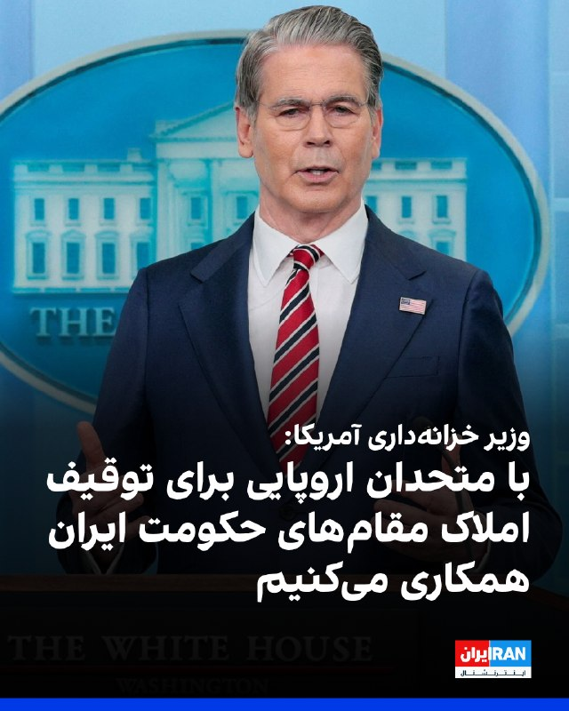

اسکات بسنت، وزیر خزانه‌داری آمریکا، ضمن اعلام توقیف یک میلیارد دلار رمزارز مرتبط با جمهوری اسلامی، گفت: «ما در حال همکاری با متحدانمان در سراسر اروپا هستیم تا ویلاها، خانه‌ها و املاک مقامات جمهوری اسلامی را توقیف کنیم.»
او افزود: «این پولی است که از مردم ایران دزدیده شده است.»
https://iranintl.com/202605295555

## Shin_Persian — post 6312

Shin ✓ @hey_itsmyturn
Fri, 29 May 2026 21:03:59 UTC

Source tells me that an Iranian Lieutenant has been killed by shrapnel.
Qeshm island, Hormozgan Province, #Iran

فارسی

منابع به من می‌گویند که یک ستوان ایرانی بر اثر اصابت ترکش کشته شده است.
جزیره قشم، استان هرمزگان، #Iran_

𝕏 · @shin_persian

## Shin_Persian — post 6311

Shin ✓ @hey_itsmyturn
Fri, 29 May 2026 21:01:23 UTC

Ali Hashem is Barak Ravid, but the Al Jazeera version

فارسی

علی هاشم همان باراک راوید است، اما در نسخه الجزیره.

𝕏 · @shin_persian

## Shin_Persian — post 6310

↩️ Quoted tweet: Nevo @Nevo2702 Fri, 29 May 2026 20:31:54 UTC @hey_itsmyturn תרגם ↩️ Quoted tweet — see the post below for the reply. English @hey_itsmyturn Translate ↩️ توییت نقل‌قول شده — برای پاسخ، پست زیر را ببینید. فارسی درخواست ترجمه @hey_itsmyturn…

## Shin_Persian — post 6309

↩️ Quoted tweet:
Nevo @Nevo2702
Fri, 29 May 2026 20:31:54 UTC

@hey_itsmyturn תרגם

↩️ Quoted tweet — see the post below for the reply.

English

@hey_itsmyturn Translate

↩️ توییت نقل‌قول شده — برای پاسخ، پست زیر را ببینید.

فارسی

درخواست ترجمه @hey_itsmyturn

𝕏 · @shin_persian

## Shin_Persian — post 6308

Shin ✓ @hey_itsmyturn
Fri, 29 May 2026 20:31:19 UTC

Treasury's Economic Fury campaign targets Iran-based procurement network that impersonated U.S. businesses to fraudulently acquire restricted military goods for Iran's Ministry of Defense and Armed Forces Logistics (MODAFL). The scheme defrauded dozens of U.S. IT companies out of millions of dollars while procuring network security equipment and encryption technology.

𝐈𝐧𝐝𝐢𝐯𝐢𝐝𝐮𝐚𝐥𝐬:
- 𝐀𝐥𝐢 𝐌𝐚𝐣𝐝 𝐒𝐞𝐩𝐞𝐡𝐫 (Iran) - Mastermind who operated through Sorena company to impersonate U.S. small businesses and procure restricted goods including spectrum analyzers and non-linear junction detectors for MODAFL
- 𝐑𝐨𝐮𝐝𝐚𝐛𝐞𝐡 𝐒𝐚𝐫𝐦𝐚𝐝𝐢 (Iran) - Chairperson of board of directors for Sorena Hushmand Samaneh Company
- 𝐌𝐨𝐡𝐚𝐦𝐦𝐚𝐝𝐚𝐥𝐢 𝐌𝐚𝐧𝐬𝐨𝐮𝐫 𝐃𝐚𝐫𝐞𝐡𝐬𝐡𝐢𝐫𝐢 (Iran) - Dubai-based intermediary who paid U.S. freight forwarders and facilitated shipments through UAE front companies
- 𝐒𝐚𝐢𝐞𝐝 𝐙𝐚𝐡𝐞𝐝𝐢 (Italy, Iranian national) - Used U.S. financial account to pay for domain registration services that impersonated legitimate U.S. businesses
- 𝐌𝐚𝐧𝐨𝐨𝐜𝐡𝐞𝐡𝐫 𝐙𝐚𝐧𝐝𝐢𝐚𝐧 (Iran) - Sorena sales manager who assisted in transferring U.S.-origin products to Iran
- 𝐇𝐨𝐝𝐚 𝐁𝐚𝐫𝐚𝐝𝐚𝐫𝐚𝐧 𝐁𝐚𝐠𝐡𝐞𝐫𝐢 (Iran) - Sorena sales manager involved in procurement scheme
- 𝐅𝐚𝐫𝐳𝐚𝐧𝐞𝐡 𝐑𝐞𝐳𝐚𝐞𝐢 (Iran) - Sorena sales manager facilitating illegal transfers
- 𝐒𝐚𝐲𝐲𝐚𝐝 𝐏𝐚𝐲𝐚𝐦 𝐀𝐤𝐡𝐭𝐚𝐫𝐢𝐚𝐧 (Iran) - Sorena sales manager supporting procurement operations

𝐄𝐧𝐭𝐢𝐭𝐢𝐞𝐬:
- 𝐒𝐨𝐫𝐞𝐧𝐚 𝐇𝐮𝐬𝐡𝐦𝐚𝐧𝐝 𝐒𝐚𝐦𝐚𝐧𝐞𝐡 𝐂𝐨𝐦𝐩𝐚𝐧𝐲 (Iran) - Primary front company used to impersonate U.S. businesses for fraudulent procurement
- 𝐒𝐚𝐢𝐫𝐚𝐧 𝐈𝐧𝐟𝐨𝐫𝐦𝐚𝐭𝐢𝐨𝐧 𝐄𝐱𝐜𝐡𝐚𝐧𝐠𝐞 𝐒𝐩𝐚𝐜𝐞 𝐒𝐞𝐜𝐮𝐫𝐢𝐭𝐲 𝐈𝐧𝐝𝐮𝐬𝐭𝐫𝐢𝐞𝐬 𝐂𝐨𝐦𝐩𝐚𝐧𝐲 (𝐒𝐀𝐀𝐅𝐓𝐀) (Iran) - MODAFL-controlled entity that received procured goods
- 𝐆𝐫𝐞𝐞𝐧 𝐋𝐢𝐠𝐡𝐭 𝐂𝐨𝐦𝐩𝐮𝐭𝐞𝐫 𝐂𝐨 𝐋𝐋𝐂 (Dubai, UAE) - Front company controlled by Darehshiri for receiving and re-exporting shipments
- 𝐀𝐥 𝐊𝐚𝐰𝐭𝐡𝐞𝐫 𝐍𝐞𝐨𝐧 𝐋𝐋𝐂 (Dubai, UAE) - Additional Dubai-based front company used alongside Green Light for facilitation

𝐊𝐞𝐲 𝐎𝐩𝐞𝐫𝐚𝐭𝐢𝐨𝐧𝐬 𝐃𝐞𝐭𝐚𝐢𝐥𝐬:
- Network targeted network security and encryption software/hardware from U.S. small businesses
- Fraudulent procurement involved creating fake domain names mimicking legitimate U.S. companies
- Goods were shipped from U.S. to UAE, then re-exported to Iran
- Scheme specifically sourced spectrum analyzers and non-linear junction detectors for Iranian military

𝐄𝐜𝐨𝐧𝐨𝐦𝐢𝐜 𝐅𝐮𝐫𝐲 𝐂𝐚𝐦𝐩𝐚𝐢𝐠𝐧 𝐂𝐨𝐧𝐭𝐞𝐱𝐭:
Treasury reports disrupting tens of billions in Iranian regime revenue, including freezing nearly $500 million in regime-linked cryptocurrency. Campaign includes targeting shadow banking networks, oil trade facilitation, and digital asset exploitation. State Department offers $15 million reward for information disrupting IRGC financial mechanisms.

All designated persons' U.S.-based assets are blocked. Foreign financial institutions risk secondary sanctions for facilitating transactions with designated persons.

ترجمه فارسی در بخش نظرات

𝕏 · @shin_persian

## FarsiVOA — post 219030

🔺روبیو در تماس تلفنی با جوزف عون: حزب الله تلاش‌ می‌کند با به خطر انداختن جان مردم لبنان مذاکرات با اسرائيل را از مسیر خارج کند

▪️وزارت امور خارجه آمریکا، روز جمعه، ۸ خردادماه، از گفت‌وگوی تلفنی مارکو روبیو، وزیر امور خارجه ایالات متحده با جوزف عون، رئیس‌جمهوری لبنان خبر داد.

⬇️ بیشتر بخوانید:
https://ir.voanews.com/a/8155376.html
@FarsiVOA

## FarsiVOA — post 219029

  <a href="telegram/content/FarsiVOA_219029_1780092095.mp4" target="_blank">🎬 Download video</a>

⚡️بانک مرکزی اروپا می‌گوید برای مهار تورم آمادگی دارد
@FarsiVOA

## FarsiVOA — post 219028

🔺اسکات بسنت: در ایران از طرفی «دین‌سالاری» روحانیون را داریم و از طرف دیگر «اوباش‌سالاری» سپاه؛ املاک مقامات رژیم در اروپا توقیف می‌شود

▪️اسکات بسنت، وزیر خزانه‌داری آمریکا روز جمعه ۸ خرداد گفت ایالات متحده با همکاری شرکای اروپایی در حال پیدا کردن و توقیف «ویلاها، خانه‌ها و املاک» مقامات جمهوری اسلامی در اروپا است.

⬇️ بیشتر بخوانید:
https://ir.voanews.com/a/8155375.html
@FarsiVOA

## FarsiVOA — post 219027

  <a href="https://t.me/farsivoa/219027" target="_blank">📎 Download file</a>

🔴📢‌ پادکست خبری جمعه ۸ خرداد ۱۴۰۵

🛜در صورتی که با مشکل اینترنت مواجه هستید میتوانید اخبار صدای آمریکا را از نسخه‌های پادکست خبری ما به صورت صوتی دنبال کنید و یا اخبار را از نسخه سبک وب‌سایت ما پیگیر باشید:
https://ir.voanews.com/lite

📡بروزترین فرکانسهای ماهواره‌ای را نیز میتوانید از صفحه زیر پیگیری کنید:
https://ir.voanews.com/satellite

🔔دیگر شبکه‌های اجتماعی ما را هم دنبال کنید:
https://linktr.ee/voafarsi

با دوستانتان به اشتراک بگذارید
@farsivoa

## FarsiVOA — post 219026

⚡️کامبیز غفوری در برنامه تفسیر خبر: در درجه اول تمام تیغ ملامت به حکومتی است که این بلا را سر مردم ایران آورده است
@FarsiVOA

## FarsiVOA — post 219025

  <a href="telegram/content/FarsiVOA_219025_1780092096.mp4" target="_blank">🎬 Download video</a>

⚡️چرا ناتو در عملیات «خشم حماسی» در کنار آمریکا قرار نگرفت؟ گفت‌وگو با فرزانه روستایی
@FarsiVOA

## FarsiVOA — post 219024

  <a href="telegram/content/FarsiVOA_219024_1780092097.mp4" target="_blank">🎬 Download video</a>

⚡️تکرار پدیده زن‌کشی در ایران؛ دلایل آن، ریشه‌های فرهنگی و نواقص قانونی؛ گفت‌وگو با جلال ایجادی
@FarsiVOA

## FarsiVOA — post 219023

  <a href="telegram/content/FarsiVOA_219023_1780092098.mp4" target="_blank">🎬 Download video</a>

⚡️روند خلع سلاح گروه‌های شبه نظامی عراقی و ماهیت پشت پرده این اتفاق؛ گفت‌وگو با فرزین کرباسی
@FarsiVOA

## FarsiVOA — post 219022

⚡️بخشی از برنامه تفسیر خبر: گزارش نرگس صبا از سابقه فعالیت‌های موساد در ایران
@FarsiVOA

## FarsiVOA — post 219021

⚡️واشنگتن منتظر تصمیم پرزیدنت ترامپ؛ جمهوری اسلامی درگیر روایت‌های متناقض
@FarsiVOA

## FarsiVOA — post 219020

🔺گزارش وال‌استریت ژورنال: نقش پنهان امارات در جنگ شامل ده‌ها حمله به جمهوری اسلامی ایران بود

▪️روزنامه وال‌استریت ژورنال در گزارشی نوشت که امارات متحده عربی از آغاز روزهای نخست جنگ، ده‌ها حمله هوایی علیه جمهوری اسلامی انجام داده است.

⬇️ بیشتر بخوانید:
https://ir.voanews.com/a/8155371.html
@FarsiVOA

## FarsiVOA — post 219019

  <a href="telegram/content/FarsiVOA_219019_1780092099.mp4" target="_blank">🎬 Download video</a>

⚡️نیک آهنگ کوثر در برنامه تفسیر خبر: در اسرائیل کسانی تمایل ندارند تفاهم نامه احتمالی بین جمهوری اسلامی و آمریکا به یک توافق نامه برسد
@FarsiVOA

## FarsiVOA — post 219018

  <a href="telegram/content/FarsiVOA_219018_1780092099.mp4" target="_blank">🎬 Download video</a>

⚡️برخورد با دارندگان استارلینک با قوانین جمهوری اسلامی هم هم‌خوانی ندارد؛ گفت‌وگو با حسین احمدی‌نیاز؛ حقوق‌دان
@FarsiVOA

## FarsiVOA — post 219017

🔺تداوم بلاتکلیفی معترضان بازداشت‌شده در ایران؛ گزارش‌ها: یک دانش‌آموز ۴ ماه در بازداشت بوده است

▪️بر اساس گزارش‌های رسیده به کمیته پیگیری وضعیت بازداشت‌شدگان، سه شهروند به نام‌های دیانا طاهرآبادی، مائده رحیمی، و نیما حسینی همچنان در بازداشت به سر می‌برند و نگرانی‌ها درباره وضعیت حقوقی، روند رسیدگی قضایی و شرایط نگهداری آنان ادامه دارد.

⬇️ بیشتر بخوانید:
https://ir.voanews.com/a/detained-citizens-including-student/8155283.html
@FarsiVOA

## Persian_Trend_Official — post 15303

https://youtube.com/live/24Mc1cJMDgQ?feature=share

## Persian_Trend_Official — post 15302

  <a href="telegram/content/Persian_Trend_Official_15302_1780092101.webm" target="_blank">🎬 Download video</a>

نهاد مدیریت آب‌راه خلیج فارس: تسلط بر تنگهٔ هرمز را با تحریم هم به دست نخواهید آورد.

نهاد مدیریت آب‌راه خلیج فارس: تسلط بر تنگهٔ هرمز را که در میدان و دیپلماسی به دست نیاوردید، با تحریم هم به دست نخواهید آورد.

📝 Amir

📌 @persian_trend_official
پرشین ترند | متفاوت‌ترین کانال نظامی

## Persian_Trend_Official — post 15300

  <a href="telegram/content/Persian_Trend_Official_15300_1780092101.mp4" target="_blank">🎬 Download video</a>

ارتش اسرائیل با انتشار مستنداتی می‌گوید که شب گذشته یکی از چند راکت شلیک شده از سوی حزب‌الله لبنان به سمت شهر مرجعیون به کلیسای این شهر اصابت کرده است.

ارتش اسرائیل همچنین گفت که سربازان ارتش اسرائیل در منطقه نزدیک کلیسا عملیاتی انجام نمی‌دهند.

📝 Amir

📌 @persian_trend_official
پرشین ترند | متفاوت‌ترین کانال نظامی

## Persian_Trend_Official — post 15299

  

وزیر خارجه پاکستان: به پیمان ابراهیم ملحق‌ نمی شویم.

وزیر امور خارجه پاکستان در پاسخ به گفته چند شب پیش دونالد ترامپ رئیس جمهور امریکا گفت: هیچ انعطاف‌پذیری در موضع ما وجود ندارد و ما حامی تشکیل کشور مستقل فلسطینی هستیم.

📝 Amir

📌 @persian_trend_official
پرشین ترند | متفاوت‌ترین کانال نظامی

## Persian_Trend_Official — post 15298

  <a href="telegram/content/Persian_Trend_Official_15298_1780092103.mp4" target="_blank">🎬 Download video</a>

معجزات حضرت عاقا روز به روز بیشتر افشا میشه !
چندوقت دیگه خاطرات صیغه جور کردن برای اعضای بیت درمیاد !

حالا یک درصد احتمال ندادید دختر پسر رو نخواد ؟
نیم درصد ازمایش خون مشکل داشته باشه ؟
تفاهم و این حرفها هم که سوسول بازیه !
جایگاه زن در ولایت فقیه ...

## Persian_Trend_Official — post 15297

  <a href="telegram/content/Persian_Trend_Official_15297_1780092105.mp4" target="_blank">🎬 Download video</a>

وقتی طرف مقابل وضعیت نظامی خود را در همین شرایط حفظ کند، یعنی حفظ سایه جنگ بر کشور را پذیرفتیم. در حالی که دشمن باید از منطقه اخراج شود تا جمهوری اسلامی ایران چهارپایه طناب دار اقتصادی که در تنگه هرمز به گردن غرب انداخته را نکشد.

📌 @persian_trend_official
پرشین ترند | متفاوت‌ترین کانال نظامی

## Persian_Trend_Official — post 15296

  <a href="telegram/content/Persian_Trend_Official_15296_1780092107.webm" target="_blank">🎬 Download video</a>

Elyas Farokh – اتاق جنگ جمعه 8 خرداد | بوی جنگ از توافق ترامپ با جمهوی اسلامی!

## Persian_Trend_Official — post 15295

  <a href="https://t.me/persian_trend_official/15295" target="_blank">📎 Download file</a>

فایل صوتی لایو اول
نسخه کم حجم - 6 مگابایت

اتاق جنگ جمعه 8 خرداد | بوی جنگ از توافق ترامپ با جمهوی اسلامی!

📝 Nick

📌 @persian_trend_official
پرشین ترند | متفاوت‌ترین کانال نظامی

## Persian_Trend_Official — post 15294

  

نیویورک تایمز: ترامپ هیچ تصمیمی درباره ایران نگرفت!

نیویورک تایمز گزارش داد که دونالد ترامپ رئیس‌جمهور آمریکا پس از یک نشست دو ساعته در کاخ سفید درباره احتمال تمدید آتش‌بس با ایران، بدون اتخاذ تصمیم نهایی جلسه را ترک کرد.

📝 Amir

📌 @persian_trend_official
پرشین ترند | متفاوت‌ترین کانال نظامی

## RadioFarda — post 157705

  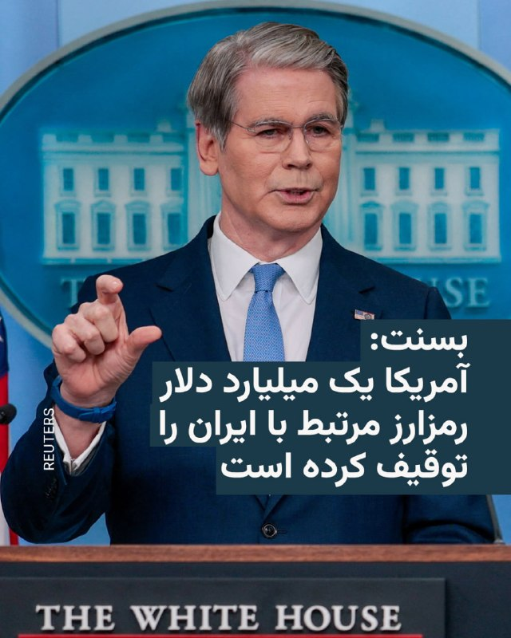

🔸اسکات بسنت، وزیر خزانه‌داری آمریکا، روز جمعه اعلام کرد که ایالات متحده در چارچوب بخش اقتصادی جنگ دولت دونالد ترامپ علیه جمهوری اسلامی، «یک میلیارد دلار» از دارایی‌های رمزارزی مرتبط با ایران را توقیف کرده است.

🔸او اواخر فروردین خبر داده بود که آمریکا بیش از ۳۴۰ میلیون دلار رمزارز را به‌ظن ارتباط با ایران مسدود کرد.

🔸آقای بسنت پیش از این گفته است که بعد از برقراری آتش‌بس، به دستور دونالد ترامپ برنامه «خشم اقتصادی» را علیه حکومت ایران اجرا می‌کند و در این چارچوب تا به حال ده‌ها صرافی، کشتی، شرکت و فرد حقیقی به فهرست تحریم‌های وزارت خزانه‌داری افزوده شده‌اند.

🔸وزیر خزانه‌داری آمریکا همچنین روز جمعه گفت که هرگونه کاهش یا لغو محاصره مالی و اقتصادی آمریکا علیه ایران، به‌صورت تدریجی انجام خواهد شد.

🔸او اعلام کرد: «خواهیم دید... هر چیزی که برداشته شود، به‌آرامی و مرحله‌به‌مرحله برداشته خواهد شد.»

@RadioFarda

## IranianMinds — post 21049

دیگه قرار نیست این صدارو بشنویم 😭

@IranianMinds

## IranianMinds — post 21048

یادش بخیر 91 روز پیش موشو پدرو کشتن @IranianMinds

## IranianMinds — post 21047

یادش بخیر 91 روز پیش موشو پدرو کشتن

@IranianMinds

## IranianMinds — post 21046

  

🔴 پیت هگزت وزیر جنگ آمریکا :

ایران بهتره زودتر انتخاب کنه یا مذاکره هسته ای یا جنگ با آمریکا , ایندفه نه بلکه از روی آسمان و دریا از روی زمین هم باید با ما روبرو بشن!

@IranianMinds

## IranianMinds — post 21045

  <a href="telegram/content/IranianMinds_21045_1780092110.mp4" target="_blank">🎬 Download video</a>

🔴 ویدئویی از دقایق اول حمله اسرائیل به بیت رهبری.

@IranianMinds

## IranianMinds — post 21044

  

🔴 داماد 17 ساله عروس 16 ساله در تجمعات حکومتی !

اینا تا بزرگ شن یه 30 40 تا توله هم میندازن بعد میگید چرا اینا زیاد شدن ...

@IranianMinds

## IranianMinds — post 21043

  <a href="telegram/content/IranianMinds_21043_1780092113.mp4" target="_blank">🎬 Download video</a>

🔴 وزیر خزانه داری آمریکا :

ما حدود ۱ میلیارد دلار از ارزهای دیجیتال ایران را توقیف کرده‌ایم؛ یعنی خیلی ساده و مستقیم کیف پول‌هایشان را تصاحب کردیم.

برخی از آن‌ها ممکن است همین حالا در حال تایپ کردن و چک کردن حسابشان باشند و هنوز متوجه نشده باشند که کیف پولشان از دست رفته است.

این‌ها پول‌هایی است که از مردم ایران دزدیده شده است.

@IranianMinds

## IranianMinds — post 21042

  <a href="telegram/content/IranianMinds_21042_1780092114.mp4" target="_blank">🎬 Download video</a>

🔴 وزیر خزانه داری آمریکا :

ما حکومت را سرنگون نکردیم، اما ساختار آن را تغییر دادیم.

رهبران سطح اول حذف شدند، رهبران سطح دوم هم حذف شدند.

بنابراین، ما اکنون با مدیران و فرماندهان سطح سوم سر و کار داریم.

@IranianMinds

## BBCPersian — post 282353

🔻 نتیجه نشست ترامپ درباره تمدید آتش‌بس با ایران هنوز مشخص نیست

دونالد ترامپ جلسه‌ای با مشاوران خود برگزار کرده است تا درباره تمدید آتش‌بس با ایران تصمیم نهایی را اتخاذ کند، اما نتیجه این نشست هنوز مشخص نیست.

او پیش از این جلسه در اتاق بحران کاخ سفید تاکید کرده بود که توافق مورد مذاکره تضمین خواهد کرد که ایران تنگه هرمز را بازگشایی کند و متعهد شود هرگز به سلاح هسته‌ای دست پیدا نکند.

او همچنین گفت که ذخایر اورانیوم غنی‌شده ایران از زیر زمین خارج و نابود خواهد شد.

با این حال، مقام‌های ایرانی تاکید کرده‌اند که پیش‌نویس توافق شامل بازگشایی تنگه هرمز بدون دریافت عوارض و نیز تعهد به نابودی مواد هسته‌ای نیست.

تهران همچنین می‌گوید که هنوز درباره تمدید آتش‌بس برای ۶۰ روز دیگر، به‌منظور ادامه مذاکرات درباره جزئیات پیچیده‌تر توافق، تصمیم نهایی نگرفته است.

https://bbc.in/49xolqx
@BBCPersian

## BBCPersian — post 282352

🔻 خوش‌بینی به آتش‌بس با ایران، بازده اوراق قرضه دولت آمریکا را کاهش داد

بازده اوراق قرضه دولت آمریکا روز جمعه برای چهارمین روز متوالی کاهش یافت و هفته‌ای را به پایان رساند که گزارش‌های پیشرفت در دستیابی به آتش‌بس میان آمریکا و ایران، به خوش‌بینی نسبی در بازارها دامن زده بود.

میشل بومن، نایب‌رئیس نظارت بانک مرکزی آمریکا، در سخنانی گفت که هنوز برای ارزیابی تاثیر جنگ خاورمیانه بر اقتصاد زود است، اما یک شوک طولانی‌مدت در بازار انرژی می‌تواند این بانک را ناگزیر به تغییر رویکرد خود در سیاست پولی کند.

بر اساس داده‌های وزارت بازرگانی آمریکا که روز پنجشنبه منتشر شد، شاخص تورمی مورد توجه بانک مرکزی آمریکا در ماه گذشته به بالاترین سطح در سه سال گذشته رسید. این آمار بخشی از مجموعه داده‌های اقتصادی بود که به گفته تحلیلگران نشانه‌هایی از خطر «رکود تورمی» را در خود داشت.

لو براین، استراتژیست بازار در شرکت دی‌آر‌دبلیو تریدینگ، گفت که توقف شکننده درگیری‌ها از ماه گذشته تاکنون، فشار صعودی بر قیمت نفت خام و انتظارات تورمی را کاهش داده و به افت بازده اوراق دولت آمریکا کمک کرده است.

https://bbc.in/3RDgsK6
@BBCPersian

## BBCPersian — post 282351

  

‌ ‌ ‌ ‌
مارکو روبیو، وزیر خارجه آمریکا و محمد اسحاق‌دار، معاون نخست‌وزیر و وزیر خارجه پاکستان در محل ساختمان وزارت خارجه آمریکا در واشنگتن دیدار کردند.

پاکستان میانجی رسمی میان آمریکا و ایران در جریان مذاکرات اخیر دو کشور برای برقراری صلح است.

آقای روبیو هم در شبکه ایکس عکس از دیدارشان منتشر کرد و نوشت که از محمد اسحاق‌دار به خاطر نقشی که پاکستان همچنان در پیشبرد صلح در خاورمیانه ایفا می‌کند، تشکر کرده است.

او افزود: «ما درباره اهمیت همکاری برای تقویت بیشتر یک مشارکت معنادار برای امنیت بهتر و رفاه بیشتر هر دو ملت توافق کردیم.»

تامی پیگوت، سخنگوی وزارت خارجه آمریکا هم گفت که در این دیدار آقای روبیو از آقای اسحاق‌دار به دلیل «نقش سازنده‌ای» که پاکستان در تحقق دیدگاه‌های دونالد ترامپ، رئیس‌جمهور آمریکا برای صلح در خاورمیانه و تلاش‌های میانجی‌گرایانه این کشور با ایران داشته، تشکر کرد.

آقای پیگوت گفت که وزرای خارجه دو کشور بر همکاری مشترک برای یک مشارکت واقعی که امنیت و رفاه را برای آمریکایی‌ها و پاکستانی‌ها تقویت کند،‌ توافق کردند.

https://bbc.in/4u0PsS7
📷 Reuters
@BBCPersian

## Dirty_Kids — post 390524

  

تصویری از داماد ۱۷ ساله و عروس ۱۶ ساله خرزشی در تجمعات شبانه

جزیره اپستین داریم لایو میبینیم

@Dirty_Kids 👻

## Dirty_Kids — post 390523

  <a href="telegram/content/Dirty_Kids_390523_1780092117.mp4" target="_blank">🎬 Download video</a>

جدیدترین ویدئو از 30 موشکی که به بیت خامنه‌ای برخورد کرد

@Dirty_Kids 👻

## alonews — post 123591

  

🚀همراه با ساب + حجم مصرفی برای استفاده طولانی‌تر و بهینه‌تر 😍

@NetAazaadBot
@NetAazaadBot

⚡️ سرعت واقعی بدون افت
🛡 اتصال پایدار و بدون قطعی
🚀 مناسب گیم، دانلود و استفاده روزانه

@NetAazaadBot
@NetAazaadBot

💎 گیگی فقط 19T
📩 برای خرید استارت بزن و سریع وصل شو 🚀

## alonews — post 123590

  <a href="telegram/content/alonews_123590_1780092119.webm" target="_blank">🎬 Download video</a>

👈شورای امنیت سازمان ملل متحد در گزارشی تازه از افزایش خشونت‌های جنسی، تجاوز گروهی، شکنجه و رفتارهای تحقیر‌آمیز علیه زنان و دختران در افغانستان پرده برداشت و مقام‌ها و نیروهای وابسته به طالبان را مسئول بخش عمده این موارد دانست.

✅ @AloNews خبر جنگ

## alonews — post 123589

  <a href="telegram/content/alonews_123589_1780092119.webm" target="_blank">🎬 Download video</a>

👈وضعیت مردم ایران

✅ @AloNews خبر جنگ

## alonews — post 123588

  <a href="telegram/content/alonews_123588_1780092119.webm" target="_blank">🎬 Download video</a>

👈فردی که در تصویر می‌بینید به گزارش روزنامه فایننشیال تایمز مالک شبکه ایران اینترنشنال است! 
✅ @AloNews خبر جنگ

## alonews — post 123587

  <a href="telegram/content/alonews_123587_1780092119.webm" target="_blank">🎬 Download video</a>

👈خبرنگار الجزیره:
یک منبع رسمی ایرانی همین الان به من گفت: با تیمی که هیچ چارچوب حرفه‌ای یا اخلاقی ثابتی ندارد، دمدمی مزاج است و مدام خواسته‌هایش را تغییر می‌دهد، نمی‌توان گفت که هیچ چیز «نهایی» شده است.

✅ @AloNews خبر جنگ

## alonews — post 123586

  <a href="telegram/content/alonews_123586_1780092120.webm" target="_blank">🎬 Download video</a>

👈مدیرعامل جی‌پی‌مورگان:
داشتن سلاح هسته‌ای توسط ایران، میتواند بزرگ‌ترین تهدیدی باشد که بشریت در طول تاریخ با آن مواجه شده باشد.

✅ @AloNews خبر جنگ

## alonews — post 123585

  <a href="telegram/content/alonews_123585_1780092120.webm" target="_blank">🎬 Download video</a>

👈نیویورک پست: ۶ میلیارد دلار از وجوه نگهداری شده در قطر از جمله آخرین نکات مبهم در توافق صلح با ایران است

🔴این وجوه مستقیماً به ایران منتقل نخواهد شد، بلکه برای خرید مواد غذایی و لوازم پزشکی استفاده خواهد شد.

✅ @AloNews خبر جنگ

## alonews — post 123584

  <a href="telegram/content/alonews_123584_1780092120.webm" target="_blank">🎬 Download video</a>

👈 تصویری از داماد ۱۷ ساله و عروس ۱۶ ساله در تجمعات شبانه

✅ @AloNews خبر جنگ

## alonews — post 123583

  <a href="telegram/content/alonews_123583_1780092120.webm" target="_blank">🎬 Download video</a>

👈فیلد مارشال محسن رضایی: آمریکا تاب‌ مقاومت جلوی قدرت ما رو نداره

✅ @AloNews خبر جنگ

## alonews — post 123582

  <a href="telegram/content/alonews_123582_1780092120.webm" target="_blank">🎬 Download video</a>

👈فردی که در تصویر می‌بینید به گزارش روزنامه فایننشیال تایمز مالک شبکه ایران اینترنشنال است!

✅ @AloNews خبر جنگ

## alonews — post 123581

  <a href="telegram/content/alonews_123581_1780092121.webm" target="_blank">🎬 Download video</a>

🔴فوری/وزیر خزانه داری آمریکا درباره رفع تحریم‌های ایران 
🔴به گزارش الجزیره،  وزیر خزانه‌داری آمریکا مدعی شد که تحریم‌های ایران به تدریج لغو خواهد شد. 
✅ @AloNews خبر جنگ

## alonews — post 123580

  <a href="telegram/content/alonews_123580_1780092121.webm" target="_blank">🎬 Download video</a>

👈وزارت خزانه‌داری آمریکا: محاصره اعمال‌شده بر بنادر ایران به‌تدریج برداشته خواهد شد

✅ @AloNews خبر جنگ

## alonews — post 123579

  <a href="telegram/content/alonews_123579_1780092121.mp4" target="_blank">🎬 Download video</a>

👈حسین علایی: سه روز قبل از جنگ ۴۰ روزه به شمخانی گفتم: آمریکا و اسرائیل با ترور رهبری جنگ را آغاز می کنند؛ او گفت: نمی‌توانند! گفتم چرا نمی توانند. گفت نمی توانند پیداش کنند.

✅ @AloNews خبر جنگ

## alonews — post 123578

  <a href="telegram/content/alonews_123578_1780092123.webm" target="_blank">🎬 Download video</a>

قیمت استثنایی و کیفیت بالا
❤️

تحویل زیر یک دقیقه
✅
دارای لینک سابسکریشن جهت دیدن حجم و کنترل مصرف
✅
بدون قطعی 
✅
بدون محدودیت کاربر و زمان
✅
جمینایو چت جی بی تی و... کامل اوکیه با سرورامون
✅

🏪پشتیبانی کامل
✅
شروع فعالیت از سال 2022 
✅
پرداخت ریالی
✅

از رباتمونم میتونید تهیه کنید 
💞
👇

✅
➡️ @Napsternetiran_bot 
☑️

ضریب و این چیزا ندارن و تا آخرین مگابایت برای پشتیبانیش درختمتیم
🥂

چنل کانالمون
👇

📣
➡️ @Napsternetvirani 
☑️

## alonews — post 123577

  <a href="telegram/content/alonews_123577_1780092124.mp4" target="_blank">🎬 Download video</a>

👈اولین ماشین حاشیه ساز لکسوس Lx700H با قیمت ۱۱۰ میلیارد تومانی پلاک ملی شد.

✅ @AloNews خبر جنگ

## alonews — post 123576

  <a href="telegram/content/alonews_123576_1780092126.mp4" target="_blank">🎬 Download video</a>

👈رضا پهلوی: کشور های جهانی به خاطر چشم‌های زیبای من یا شما این کار را نمی‌کنند، آنها این کار را انجام می‌دهند چون به نفع منافع شان است.

✅ @AloNews خبر جنگ

## alonews — post 123575

  <a href="telegram/content/alonews_123575_1780092128.webm" target="_blank">🎬 Download video</a>

👈وزیر خارجه پاکستان: هرگونه گمانه‌زنی درباره پیوستن پاکستان به طرح سازش [پیمان ابراهیم] با اسرائیل را قویا رد می‌کنیم

🔴تا زمانی که سرزمین فلسطین مطابق مرزهای قبل از ۱۹۶۷ به پایتختی قدس شریف به رسمیت شناخته نشود، هیچ انعطاف‌پذیری در موضع ما وجود نخواهد داشت.

✅ @AloNews خبر جنگ

## alonews — post 123574

  <a href="telegram/content/alonews_123574_1780092128.webm" target="_blank">🎬 Download video</a>

👈وزیر خزانه‌داری آمریکا: یک میلیارد دلار از دارایی‌های رمزارز ایران را مصادره کردیم! 
✅ @AloNews خبر جنگ

---
📅 بروزرسانی: 1405/03/08 23:36
---

## VahidOOnLine — post 242824

  <a href="telegram/content/VahidOOnLine_242824_1780085210.mp4" target="_blank">🎬 Download video</a>

یک شهروند در پیامی به ایران اینترنشنال می‌گوید سرعت اینترنت جهانی در ایران بسیار پایین است. پیام او با هوش مصنوعی خوانده شده است.
‌🏁 🇬🇧 IranintlTV

🤖 @VahidOOnLine

## VahidOOnLine — post 242823

ویدیوی منتشرشده، لحظه کشته شدن جاویدنام بابک سلطانی را در اصفهان نشان می‌دهد.
سلطانی، ۵۹ ساله، شامگاه ۱۹ دی ۱۴۰۴ هنگامی که معترضان را در اصفهان پناه می‌داد هدف شلیک گلوله ماموران قرار گرفت و جان باخت.
‌🏁 🇬🇧 IranintlTV

🤖 @VahidOOnLine

## VahidOOnLine — post 242822

  

اتحادیه اروپا با انتشار بیانیه‌ای اعلام کرد که حمله اخیر حکومت ایران علیه کویت را به شدت محکوم می‌کند.

در این بیانیه آمده که این حمله بنا بر حقوق بین‌الملل نقض حاکمیت کویت محسوب می‌شود.

اتحادیه اروپا همبستگی کامل خود را با دولت و مردم کویت بار دیگر اعلام کرد و افزود: «چنین حملاتی تهدیدی جدی برای امنیت و ثبات منطقه به شمار می‌روند.»
‌🏁 🇬🇧 IranintlTV

🤖 @VahidOOnLine

## VahidOOnLine — post 242821

  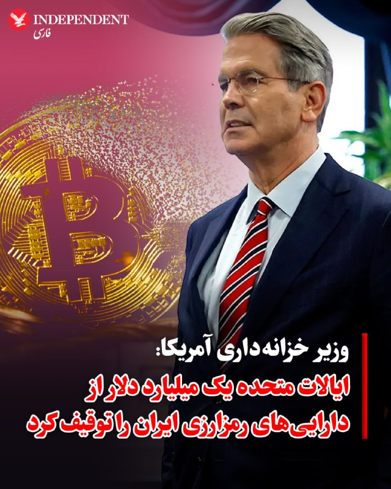

♦️ اسکات بسنت، وزیر خزانه‌داری ایالات متحده، روز جمعه هشتم خرداد، اعلام کرد که این کشور در راستای بخش اقتصادی جنگ دونالد ترامپ، رئیس‌جمهوری آمریکا، علیه جمهوری اسلامی، که به عنوان «خشم اقتصادی» شناخته می‌شود، یک میلیارد دلار از دارایی‌های رمزارزی ایران را توقیف کرده است.
‌🇸🇦 Indypersian

🤖 @VahidOOnLine

## VahidOOnLine — post 242820

🗣روایت شما از بحران اقتصادی و زندگی در آتش‌بس- جمعه ۸ خرداد:

🔹جوانی ما سوخت پای سفاهت عده‌ای که هیچ درک و فهمی از شادی و سرور ندارند، نزدیک به ۵۰ سال سرمایه‌های کشور رو به یغما دادند، ولی آدمی به امید زنده است.

🔹از اصفهان: گرونی بیداد می‌کنه. از صبح تا شب کار می‌کنیم برای یک میلیون که اونم هیچی نمی‌شه باهاش بخری.

🔹اینا توافق بکنن یا نکنن، هیچ فرقی به حال ما مردم نداره. جمهوری اسلامی به زودی به دست مردم نابود خواهد شد، چون مردم تو شرایط وحشتناکی دارن زندگی می‌کنن.

🔹من یه نوجوون ۱۵ ساله‌ام. چرا باید به فکر قیمت طلا و دلار باشم؟ تنها آرزوی زندگیم فقط خرید موتوریه که آخرین بار قیمتش ۸۰ میلیون تومان بود و الان قیمت گرفتم شده ۲۰۰ تومان. این یعنی خاک کردن آرزوهامون. این حق ما نیست.

🔹من یه بچه ۱۲ ساله هستم، دارم حسرت می‌خورم چرا یه دوچرخه ندارم، هر روز آرزو می‌کنم شاهزاده برگرده، هم مردم خوشحال بشن و هم کسانی که آرزوی چیزی داشتن بتونن بخرنش.

🔹ما نوجوان‌ها واقعا بدبخت شدیم نه امیدی نه آرزویی نه آینده‌ای. از بدو تولد با کرونا، آلودگی، قطعی برق و آب، جنگ و کشتار سر کردیم.

🔹به عنوان یه جوان ۲۸ ساله خیلی وقته دیگه انگیزه و امیدی برای آینده ندارم؛ جوانی که از وقتی که یادشه فقط داره کار می‌کنه و حتی پاش رو از شهر خودش برای یه مسافرت دو روزه بیرون نذاشته. پرایدی که ۱۵ سال از عمر خودش گذشته رو نمی‌تونم بخرم. ما سوختیم.

🔹جمهوری اسلامی با این وحشی‌گری‌هاش به زودی به جایی می‌ره که اسکندر و چنگیز رفتند. به دست مردم شجاع ایران، نه ترامپ. زنده‌باد امید، زنده‌باد ایران، زنده‌باد آزادی.

🔹مردم عزیز ایران، این روزهای سخت هم می‌گذره. امیدتون رو از دست ندین؛ ما ملتی هستیم که بارها دوباره از نو بلند شده. کنار هم می‌مونیم، می‌جنگیم و ایران‌مون رو پس می‌گیریم. آینده از آنِ مردمه.
‌🏁 🇬🇧 IranintlTV

🤖 @VahidOOnLine

## VahidOOnLine — post 242819

  

اسکات بسنت، وزیر خزانه‌داری آمریکا اعلام کرد این کشور یک میلیارد دلار از دارایی‌های رمزارزی مرتبط با جمهوری اسلامی را توقیف کرده است.

بسنت در پاسخ به پرسشی درباره محاصره دریایی بنادر ایران گفت هر اقدامی برای کاهش یا لغو محدودیت‌ها، به‌صورت تدریجی انجام خواهد شد.

وزیر خزانه‌داری آمریکا پیش‌تر نیز اعلام کرده بود دسترسی شرکت‌های هواپیمایی ایران به محل‌های فرود، سوخت‌گیری و فروش بلیت را قطع خواهیم کرد.
‌🏁 🇬🇧 IranintlTV

🤖 @VahidOOnLine

## VahidOOnLine — post 242818

  

علی خزایی، عضو کمیسیون آموزش مجلس گفت که هرگونه تعرض و تجاوز از سوی آمریکا، اسرائیل و متحدانشان با «پاسخ قاطع، سخت و دندان‌شکن» مواجه خواهد شد.

خزایی افزود: «دشمن بار دیگر دچار خطای محاسباتی شده و تصور کرده جمهوری اسلامی در میدان نبرد دچار سکوت یا انفعال شده است.»
‌🏁 🇬🇧 IranintlTV

🤖 @VahidOOnLine

## VahidOOnLine — post 242817

  

♦️ یک مقام ارشد دولت آمریکا که خواست نامش فاش نشود، روز جمعه هشتم خرداد، در گفتگو با نیویورک‌تایمز اعلام کرد که جلسه دونالد ترامپ، رئیس‌جمهوری آمریکا، در اتاق وضعیت کاخ سفید حدود دو ساعت به طول انجامید، اما او هنوز تصمیم نهایی را درباره توافق جدید با ایران اتخاذ نکرده است.

به گفته این مقام مسئول، دولت ترامپ بر این باور است که طرفین به یک توافق نزدیک شده‌اند، اما همچنان موضوعات مشخصی از جمله مسئله آزادسازی دارایی‌های مسدودشده ایران مورد بحث و رایزنی قرار دارد. ترامپ در پیامی که پیش از این جلسه منتشر کرد، تاکید کرد که فعلا پولی آزاد نخواهد شد.
‌🇸🇦 Indypersian

🤖 @VahidOOnLine

## VahidOOnLine — post 242816

  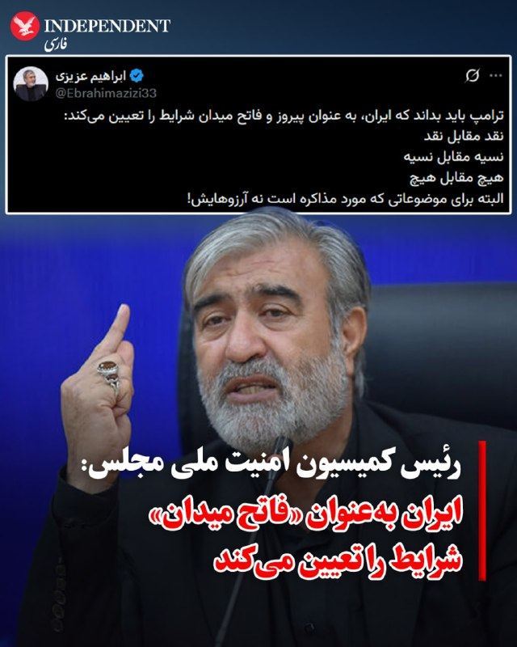

♦️ ابراهیم عزیزی، رئیس کمیسیون امنیت ملی مجلس شورای اسلامی با انتشار پیامی در شبکه اجتماعی ایکس، ایران را «پیروز و فاتح میدان» دانست و نوشت: «ترامپ باید بداند که ایران، به عنوان پیروز و فاتح میدان شرایط را تعیین می‌کند: نقد مقابل نقد، نسیه مقابل نسیه، هیچ مقابل هیچ؛ البته برای موضوعاتی که مورد مذاکره است نه آرزوهایش!»

این پیام ساعاتی پس از آن منتشر شد که ترامپ، با انتشار جزئیاتی از تفاهم‌نامه مورد مذاکره اعلام کرد که بازگشایی تنگه هرمز، برقرار نشدن هرگونه سازوکار اخذ عوارض از کشتی‌ها و نابودی ذخایر اورانیوم با غنای بالا از موارد ذکر شده هستند. اسماعیل بقایی، سخنگوی وزارت خارجه این موارد را رد کرد. ترامپ بارها تاکید کرده که تنها توافقی را می‌پذیرد که مسئله تنگه هرمز و برنامه هسته‌ای جمهوری اسلامی را در بر بگیرد.
‌🇸🇦 Indypersian

🤖 @VahidOOnLine

## VahidOOnLine — post 242815

  

خبرگزاری رویترز به نقل از منابع جمهوری اسلامی گزارش داد که تهران ممکن است با انتقال نیمی از ذخایر اورانیوم غنی‌شده ۶۰درصدی به یک کشور ثالث موافقت کند.

بر اساس این گزارش، در این حالت، جمهوری اسلامی در مقابل این مقدار، اورانیوم با غنای ۵ درصد دریافت می‌کند.

رویترز نوشت که همچنین ممکن است نیم دیگر این ذخایر در داخل ایران رقیق‌سازی شود.
‌🏁 🇬🇧 IranintlTV

🤖 @VahidOOnLine

## VahidOOnLine — post 242814

  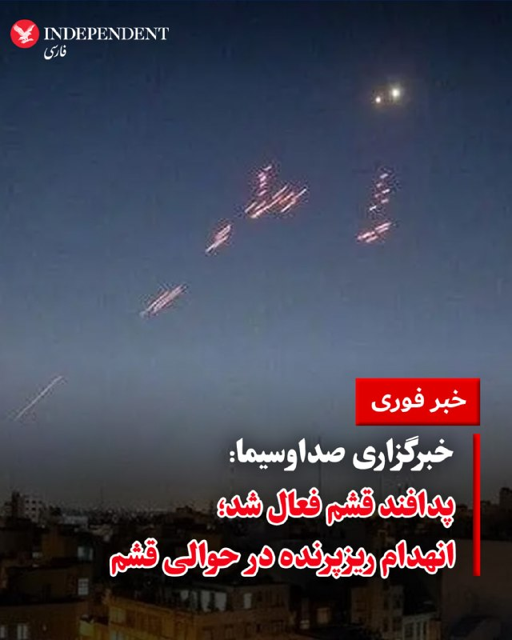

♦️خبرنگار صداوسیما در قشم از فعال شدن سامانه پدافند هوایی در این منطقه خبر داد و اعلام کرد این اقدام دقایقی پیش انجام شده است.
در ادامه، خبرگزاری مهر به نقل از منابع محلی گزارش داد یک ریزپرنده در حوالی قشم توسط پدافند هوایی هدف قرار گرفته و منهدم شده است.
بر اساس این گزارش‌ها، جزئیات بیشتری درباره ماهیت این ریزپرنده و نتیجه نهایی عملیات پدافندی تاکنون منتشر نشده است.
‌🇸🇦 Indypersian

🤖 @VahidOOnLine

## VahidOOnLine — post 242813

  

نیویورک‌تایمز به نقل از یک مقام ارشد آمریکایی گزارش داد نشست دونالد ترامپ در «اتاق وضعیت» کاخ سفید دو ساعت به طول انجامید، اما رییس‌جمهور آمریکا هنوز درباره هیچ توافق جدیدی با تهران به تصمیم نهایی نرسیده است.

این مقام افزود دولت آمریکا معتقد است به دستیابی به توافق نزدیک شده، اما برخی مسائل از جمله آزادسازی دارایی‌های مسدودشده همچنان محل بررسی و اختلاف‌نظر است.
‌🏁 🇬🇧 IranintlTV

🤖 @VahidOOnLine

## VahidOOnLine — post 242812

  <a href="telegram/content/VahidOOnLine_242812_1780085220.mp4" target="_blank">🎬 Download video</a>

یک شهروند با اشاره به وضعیت بد معیشتی به مقایسه قدرت خرید خانواده‌های ایرانی با شهروندان کشورهای دیگر پرداخته و می‌گوید که بازگشت نسبی اتصال به اینترنت به این علت است که «حواسمان را پرت کنند.»

پیام او با هوش مصنوعی خوانده شده است.
‌🏁 🇬🇧 IranintlTV

🤖 @VahidOOnLine

## VahidOOnLine — post 242811

  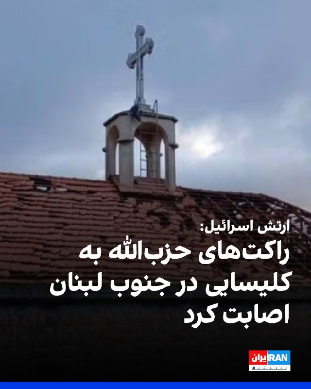

ارتش اسرائیل اعلام کرد که بر اساس مستنداتی که به دست آورده، گروه مسلح حزب‌الله، تحت حمایت جمهوری اسلامی، راکت‌هایی را شلیک کرده که به کلیسایی در جنوب لبنان اصابت کرده است.

در بیانیه ارتش اسرائیل آمده است: «سازمان تروریستی حزب‌الله در طول شامگاه جمعه چندین راکت شلیک کرد که به کلیسای ارتدوکس سنت جورج در جنوب لبنان اصابت کردند. این شلیک‌ها به ساختمان‌هایی در روستای مسیحی مرجعیون اصابت کردند.»

ارتش اسرائیل تاکید کرده که نیروهایش در محدوده این کلیسا فعالیت نمی‌کنند.
‌🏁 🇬🇧 IranintlTV

🤖 @VahidOOnLine

## VahidOOnLine — post 242810

  

♦️ روزنامه وال‌استریت ژورنال روز جمعه هشتم خرداد، در گزارشی اختصاصی به نقل از منابع آگاه فاش کرد که امارات متحده عربی در طول جنگ، ده‌ها حمله هوایی را علیه مواضعی در ایران انجام داده است. منابع وال‌استریت ژورنال می‌گویند نقش امارات در این کارزار نظامی، «بسیار عمیق‌تر» از آنچه که پیش‌تر گزارش شده، بوده است.

بر اساس این گزارش، این حملات با هماهنگی کامل واشنگتن و تل‌آویو و با اتکا به اطلاعات ارائه‌شده از سوی آن‌ها انجام شده است. اهداف امارات شامل جزایر قشم و ابوموسی در تنگه هرمز، بندرعباس، پالایشگاه نفت جزیره لاوان و مجتمع پتروشیمی عسلویه بوده است. حملات به عسلویه که به صورت مشترک با اسرائیل و در پاسخ به ضربات جمهوری اسلامی به زیرساخت‌های انرژی امارات انجام شد، واکنش‌های شدید بین‌المللی را برانگیخت و واشنگتن را وادار کرد از اسرائیل بخواهد حمله به تاسیسات انرژی را متوقف کند.

علاوه بر ابعاد نظامی، امارات در سازمان ملل نیز از پیش‌نویس قطعنامه‌های مجوز استفاده از زور برای بازگشایی تنگه هرمز حمایت کرد و تعطیلی مدارس و موسسات وابسته به تهران در دبی و لغو ویزای شهروندان ایرانی را در دستور کار قرار داد.
‌🇸🇦 Indypersian

🤖 @VahidOOnLine

## VahidOOnLine — post 242809

  <a href="telegram/content/VahidOOnLine_242809_1780085224.mp4" target="_blank">🎬 Download video</a>

♦️این روزها ویدیوهای متعددی از آمادگی بدنی نیروهای نظامی آمریکا و ورزش‌های وزیر جنگ این کشور از سوی ارتش آمریکا منتشر شده که توجه‌ها را به آمادگی بدنی پیت هگست جلب کرده است. در پی این انتشار این تصاویر یک عضو نیروی دریایی جمهوری اسلامی نیز تصاویری از ورزشهای انفرادی خود منتشر کرده و این تصاویر را به‌صورت مقایسه‌ای با تصاویر ورزش‌های نیروهای آمریکایی با هگست ترکیب کرده است. تمرین‌های این تفنگدار نیروی دریایی جمهوری اسلامی، در یک باشگاه خصوصی انجام شده و در پایگاه ارتش یا سپاه تصویربرداری نشده است.

پیش از این بارها آماده نبودن بدنی فرماندهان ارتش و سپاه از سوی کاربران ایرانی مورد شوخی و طنز قرار گرفته است و پیش از شروع جنگ نیز بسیاری از کاربران مقایسه میان پیت هگست و فرماندهان نظامی جمهوری اسلامی را دستمایه ساخت محتواهای طنز قرار داده بودند.
‌🇸🇦 Indypersian

🤖 @VahidOOnLine

## VahidOOnLine — post 242808

  

خبرگزاری تسنیم، وابسته به سپاه پاسداران گزارش داد که شامگاه جمعه، در پی رصد ریزپرنده متخاصم «دشمن آمریکایی-اسرائیلی» در حوالی قشم از سوی پدافند هوایی ارتش، مورد اصابت قرار گرفت و منهدم شد.
پیش‌تر رسانه‌های ایران تصاویری از شلیک ممتد پدافند در محدوده قشم منتشر کرده بودند.
‌🏁 🇬🇧 IranintlTV

🤖 @VahidOOnLine

## VahidOOnLine — post 242807

  

خبرگزاری مهر، وابسته به سازمان تبلیغات اسلامی، نوشت شامگاه جمعه، صدای فعالیت پدافند در جزیره قشم از سوی ساکنان محلی گزارش شده است.

بنا بر این گزارش ماهیت این صداها مشخص نیست و هنوز هیچ‌یک از نهادهای رسمی درباره علت وقوع این صداها اظهارنظر نکرده‌اند.
‌🏁 🇬🇧 IranintlTV

🤖 @VahidOOnLine

## VahidOOnLine — post 242806

  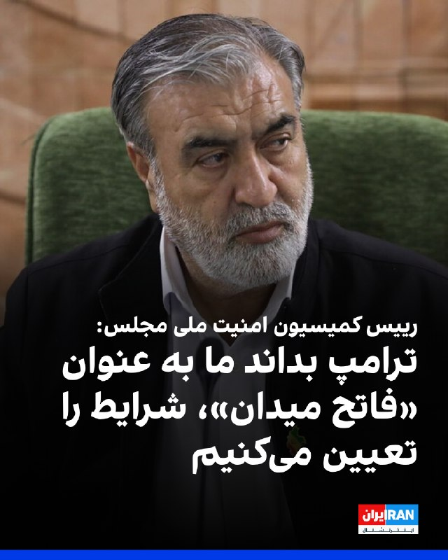

ابراهیم عزیزی، رییس کمیسیون امنیت ملی مجلس، در شبکه ایکس نوشت که ترامپ باید بداند که جمهوری اسلامی به عنوان «پیروز و فاتح میدان»، شرایط را تعیین می‌کند؛ نقد مقابل نقد، نسیه مقابل نسیه و هیچ مقابل هیچ. البته برای موضوعاتی که مورد مذاکره است، نه آرزوهایش.

پیش‌تر دونالد ترامپ اعلام کرد که «ایران باید موافقت کند که هرگز سلاح یا بمب هسته‌ای نخواهد داشت. تنگه هرمز باید فورا باز باشد؛ بدون دریافت عوارض و برای عبور و مرور نامحدود کشتی‌ها در هر دو جهت. همه مین‌های دریایی (بمب‌ها)، در صورت وجود، باید از میان برداشته شوند.»
‌🏁 🇬🇧 IranintlTV

🤖 @VahidOOnLine

## VahidOOnLine — post 242805

  

خبرگزاری صداوسیمای جمهوری اسلامی اعلام کرد «متن ادعایی ترامپ یک‌طرفه» است و هنوز درباره هیچ‌کدام از بندهای آن توافقی نشده است.
خبرگزاری صداوسیما افزود جمهوری اسلامی هنوز متن ۱۴بندی ادعایی رسانه‌ها را برای آمریکا ارسال نکرده است.

خبرگزاری صداوسیما همچنین اعلام کرد ادعای ترامپ درباره مواد هسته‌ای ایران عقب‌نشینی آشکار از ادعاهای اولیه درباره انتقال این مواد به آمریکا است.

پیش‌تر دونالد ترامپ اعلام کرد که برای اتخاذ تصمیم نهایی درباره ایران، در اتاق وضعیت کاخ سفید جلسه تشکیل داده است.
‌🏁 🇬🇧 IranintlTV

🤖 @VahidOOnLine

## WithYashar — post 12906

نیویورک تایمز به نقل از یک مقام دولتی:
نشست ترامپ در اتاق عملیات به وایان رسید وحدود دو ساعت به طول انجامید.
@withyashar

## WithYashar — post 12905

نیویورک پست: زمان نهایی شدن تفاهم‌نامه بین آمریکا و ایران مشخص نیست
@withyashar

## WithYashar — post 12904

  <a href="telegram/content/WithYashar_12904_1780085229.mp4" target="_blank">🎬 Download video</a>

وزیر خزانه‌داری آمریکا، اسکات بسنت:
ما حدود ۱ میلیارد دلار از رمزارزهای ایران را توقیف کرده‌ایم فقط مستقیم کیف‌پول‌ها را گرفته‌ایم.
برخی از آن‌ها شاید همین الان در حال تایپ کردن باشند و هنوز متوجه نشده‌اند که کیف‌پولشان گرفته شده است.
این پولی است که از مردم ایران دزدیده شده است.
@withyashar

## WithYashar — post 12903

شبکه کان اسرائیل :
نتانیاهو خواستار از سرگیری حملات به ایران است.
@withyashar

## WithYashar — post 12902

پست جدیددد اتاق جنگ داغ داغ کلیک کنید و کارای اداریش رو انجام بدید 💥

https://www.instagram.com/reel/DY7xeuCRP_4/?igsh=aW9oOXNnbno1NDJ6

## WithYashar — post 12901

  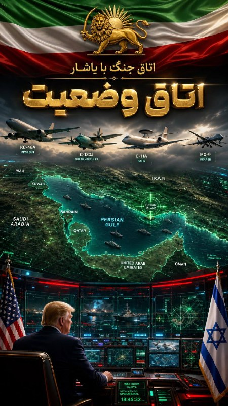

پوستر
@withyashar

## WithYashar — post 12900

المانیتور: تیم ترامپ، در اقدامی قابل توجه، ایده ایجاد یک صندوق ۳۰۰ میلیارد دلاری را برای ایران مطرح کرده است.
این پیشنهاد در شرایطی مطرح می‌شود که پیش از این، تهران یک پیشنهاد تجاری مشابه را رد کرده بود.
@withyashar

## WithYashar — post 12899

گزارش انفجار دارم از‌ بندر

## WithYashar — post 12898

## WithYashar — post 12897

صدای نوتیفیکیشن پولای بلوکه شدست دارن واریز میکنن 🤣
@withyashar

## WithYashar — post 12896

تسنیم: ریز پرنده دشمن رو تو قشم زدیم
@withyashar

## WithYashar — post 12895

🚨🚨🚨🚨🚨🚨

## WithYashar — post 12894

منابع محلی ۲ انفجار در قشم همزمان با فعالیت پدافند هوایی گزارش دادند.
@withyashar

## WithYashar — post 12893

  <a href="telegram/content/WithYashar_12893_1780085233.mp4" target="_blank">🎬 Download video</a>

پدافند قشم همچنان فعاله
@withyashar

## WithYashar — post 12892

امشب از ته وجودتون خالصانه از خدا بخواهید امیدوارم که ندای ما را بشنود و بهترینها برایمان اتفاق بیفته🍀

## WithYashar — post 12891

سلام اين مسير دقيقا مسير قاهره هست . درست داره ميره ولى ما چون مسير قاهره رو بلد نيستم فكر ميكنيم داريم اشتباه ميريم

## WithYashar — post 12890

  <a href="telegram/content/WithYashar_12890_1780085234.mp4" target="_blank">🎬 Download video</a>

دیدبان اتاق جنگ : الان پدافند قشم💥
@withyashar

## WithYashar — post 12889

🚨پدافند قشم فعال شد
@withyashar

## mwarmonitor — post 9897

🔴دونالد ترامپ، رئیس‌جمهور آمریکا، یک نشست حدوداً دو ساعته در «اتاق وضعیت» را بدون اتخاذ تصمیم درباره توافق جدید با ایران ترک کرد. یک مقام ارشد دولت آمریکا این موضوع را به نیویورک‌تایمز گفته است.

🔴به گفته این مقام، دولت آمریکا معتقد است که رسیدن به توافق نزدیک است، اما همچنان اختلافاتی وجود دارد؛ از جمله بر سر آزادسازی دارایی‌های مسدودشده ایران.

@mwarmonitor

## FoxNewsTwitter — post 342411

Fox News (Twitter/X)

“I’ll kill your whole f–king family. Your whole f–king family is dead. Your children, your wife, all dead."

That's just one of the chilling threats made to ICE agents outside a New Jersey facility, as the DOJ says it's now working to identify and arrest the demonstrators.

@AlexisMcAdamsTV shows just some of the moments investigators are looking into as chaotic protests continue at the Newark facility. | @AmericaRpts

## FoxNewsTwitter — post 342410

  

Fox News (Twitter/X)

Rep. Ilhan Omar is officially seeking another term in Congress.

The Minnesota Democrat has filed paperwork to run again, as a separate debate over who can serve in federal office is picking up steam on Capitol Hill.

Rep. Nancy Mace is currently pushing a constitutional amendment that would require members of Congress, federal judges, and Senate-confirmed appointees to be natural-born U.S. citizens.

The proposal faces a steep path forward, but it's already drawing attention as Omar prepares for another campaign.

Mace directly accused Omar of "foreign allegiance" when discussing her proposal.

## FoxNewsTwitter — post 342409

  <a href="telegram/content/FoxNewsTwitter_342409_1780085237.mp4" target="_blank">🎬 Download video</a>

Fox News (Twitter/X)

"Hand to God" this video is real.

A Florida deputy thought he had caught a distracted driver red-handed.

Then he walked up to the window and discovered the driver...only had one hand.

Kathleen Thomas was pulled over on suspicion of using a cellphone with her right hand while driving, but the stop quickly took an unexpected turn when she explained she doesn't have a right hand.

In the video, the officer asks Thomas to swear "hand to God" that she did not have the phone in her hand.

After video of the encounter went viral, officials dropped the citation over what they called a lack of evidence.

## FoxNewsTwitter — post 342408

  <a href="telegram/content/FoxNewsTwitter_342408_1780085240.mp4" target="_blank">🎬 Download video</a>

Fox News (Twitter/X)

“Let them hear you at the f***ing White House.”

Bruce Springsteen rages against President Trump and his administration during his latest Washington, DC show:

"This White House is destroying the American idea and our reputation around the world."

"We are America, the reckless, unpredictable, predatory, untrustworthy, rogue nation."

The crowd at Nationals Park roared as Springsteen urged fans to “fight back.”

## FoxNewsTwitter — post 342406

  <a href="telegram/content/FoxNewsTwitter_342406_1780085243.mp4" target="_blank">🎬 Download video</a>

Fox News (Twitter/X)

"They're among us"

The White House has a new message on aliens: They are not coming from outer space — they are already here and ICE is tracking them.
A new website, Aliens.gov tracks illegal immigrant arrests, migrant encounters and ICE operations nationwide, using a live heat map and searchable arrest data by city, state and alleged crime.

“Millions arrived under the cover of darkness,” the site says, accusing past leaders of covering up and accelerating the problem.

A White House official told Fox News Digital this is a “first of its kind effort” to draw attention to the fallout from the previous administration’s border policies.

## FoxNewsTwitter — post 342405

  

Fox News (Twitter/X)

WATCH LIVE: NJ Gov. Sherrill holds press conference on Delaney Hall detention center https://twitter.com/i/broadcasts/1aKbddMqbnqJX

## FoxNewsTwitter — post 342404

  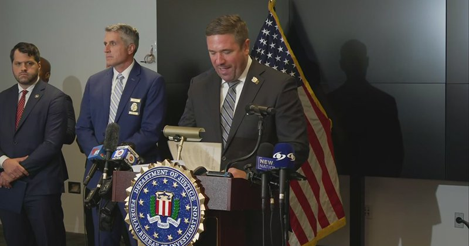

Fox News (Twitter/X)

WATCH LIVE: FBI details intense security crackdown ahead of World Cup https://twitter.com/i/broadcasts/1nGeLLBrydAKX

## pm_afshaa — post 91873

🔴الجزیره:وزیر خزانه‌داری آمریکا مدعی شد که تحریم‌های ایران به تدریج لغو خواهد شد

💧 Rainbet.com the #1 Non-KYC Crypto Casino & Sportsbook @rainbetcom

😁 @Pm_Afshaa

## pm_afshaa — post 91872

رئیس شورای هماهنگی اسلامی :قرار است یک مراسم تشییع ده‌ها میلیون نفری برای رهبر شهید مفعولمون برگزار کنیم

💧 Rainbet.com the #1 Non-KYC Crypto Casino & Sportsbook @rainbetcom

😁 @Pm_Afshaa

## pm_afshaa — post 91871

  

کانفیگ استارلینک رایگان👇

## pm_afshaa — post 91870

https://t.me/proxy?server=87.248.129.12&port=15&secret=ee1603010200010001fc030386e24c3add626973636f7474692e79656b74616e65742e636f6d

پروکسی مخصوص دانلود

💧 Rainbet.com the #1 Non-KYC Crypto Casino & Sportsbook @rainbetcom

😁 @Pm_Afshaa

## pm_afshaa — post 91869

🔴کان اسرائیل:نتانیاهو خواستار از سرگیری حملات به ایران است

💧 Rainbet.com the #1 Non-KYC Crypto Casino & Sportsbook @rainbetcom

😁 @Pm_Afshaa

## pm_afshaa — post 91868

🔴1 میلیارد دلار ارز دیجیتال سپاه توسط آمریکا مسدود شد

💧 Rainbet.com the #1 Non-KYC Crypto Casino & Sportsbook @rainbetcom

😁 @Pm_Afshaa

## pm_afshaa — post 91867

ثابتی؛ نماینده مجلس:پزشکیان به صداوسیما فشار اورده که دیگه سخنرانی های رهبر شهید علیه آمریکا رو پخش نکنن تا ترامپ لج نکنه و توافق رو بهم بزنه

💧 Rainbet.com the #1 Non-KYC Crypto Casino & Sportsbook @rainbetcom

😁 @Pm_Afshaa

## pm_afshaa — post 91866

https://t.me/proxy?server=87.248.129.50&port=15&secret=ee1603010200010001fc030386e24c3add626973636f7474692e79656b74616e65742e636f6d

پروکسی سرعت بالا مخصوص دانلود

💧 Rainbet.com the #1 Non-KYC Crypto Casino & Sportsbook @rainbetcom

😁 @Pm_Afshaa

## pm_afshaa — post 91865

https://t.me/proxy?server=87.248.129.12&port=15&secret=ee1603010200010001fc030386e24c3add626973636f7474692e79656b74616e65742e636f6d

پروکسی پینگ 100 متصل

💧 Rainbet.com the #1 Non-KYC Crypto Casino & Sportsbook @rainbetcom

😁 @Pm_Afshaa

## pm_afshaa — post 91864

🔴نیویورک تایمز:ترامپ حدود دو ساعت در اتاق وضعیت با تیم ارشد امنیت ملی ملاقات کرد اما هیچ تصمیمی برای توافق با ایران نگرفت

💧 Rainbet.com the #1 Non-KYC Crypto Casino & Sportsbook @rainbetcom

😁 @Pm_Afshaa

## pm_afshaa — post 91863

🔴فاکس نیوز: خبرهای مهمی از نشست ترامپ در کاخ سفید بیرون خواهد آمد

💧 Rainbet.com the #1 Non-KYC Crypto Casino & Sportsbook @rainbetcom

😁 @Pm_Afshaa

## pm_afshaa — post 91862

شش فروند هواپیمای ترابری C-17A Globemaster III متعلق به ایالات متحده آمریکا در حال ورود به خاورمیانه هستن

💧 Rainbet.com the #1 Non-KYC Crypto Casino & Sportsbook @rainbetcom

😁 @Pm_Afshaa

## pm_afshaa — post 91861

https://t.me/proxy?server=87.248.129.210&port=4455&secret=7hYDAQIAAQAB_AMDhuJMOt1iaXNjb3R0aS55ZWt0YW5ldC5jb20

پروکسی متصل سرعت بالا

💧 Rainbet.com the #1 Non-KYC Crypto Casino & Sportsbook @rainbetcom

😁 @Pm_Afshaa

## pm_afshaa — post 91860

دمت گرم از روزی که نت وص شده با کانفینگای کانال شما وصلم🌹🌹

## pm_afshaa — post 91859

دمت گرم همه پروکسی هات وصله و کانفینگ هات عالین کانالت کلا حرف نداره داداش دمت گرم پر قدرت ادامه بده

## pm_afshaa — post 91858

ارتش جمهورى اسلامى از سرنگونی یک فروند پهپاد آمریکایی در آسمان جزیره قشم خبر داد

💧 Rainbet.com the #1 Non-KYC Crypto Casino & Sportsbook @rainbetcom

😁 @Pm_Afshaa

## pm_afshaa — post 91857

https://t.me/proxy?server=87.248.129.13&port=15&secret=ee1603010200010001fc030386e24c3add63646e2e79656b74616e65742e636f6d

پروکسی سرعت بالا

💧 Rainbet.com the #1 Non-KYC Crypto Casino & Sportsbook @rainbetcom

😁 @Pm_Afshaa

## pm_afshaa — post 91856

پدافند بندر عباس فعال شد

💧 Rainbet.com the #1 Non-KYC Crypto Casino & Sportsbook @rainbetcom

😁 @Pm_Afshaa

## pm_afshaa — post 91855

https://t.me/proxy?server=87.248.129.132&port=16&secret=ee1603010200010001fc030386e24c3add63646e2e79656b74616e65742e636f6d

پروکسی سرعت بالا مخصوص دانلود فیلم و سریال

💧 Rainbet.com the #1 Non-KYC Crypto Casino & Sportsbook @rainbetcom

😁 @Pm_Afshaa

## pm_afshaa — post 91853

  <a href="https://t.me/pm_afshaa/91853" target="_blank">📎 Download file</a>

نپسترنت نامحدود سرعت موشکی بزنین وصل شین

💧 Rainbet.com the #1 Non-KYC Crypto Casino & Sportsbook @rainbetcom

😁 @Pm_Afshaa

## DEJradio — post 5111

  <a href="telegram/content/DEJradio_5111_1780085249.mp4" target="_blank">🎬 Download video</a>

🚨
🔸 خبر ۲۱
آدینه ۸ خرداد ۱۴۰۵

#خبر۲۱
@DEJradio

## VahidOnline — post 75796

  <a href="telegram/content/VahidOnline_75796_1780085252.mp4" target="_blank">🎬 Download video</a>

اسکات بسنت:
ما حدود ۱ میلیارد دلار از ارزهای دیجیتال ایران را توقیف کرده‌ایم - کیف پول‌ها را کاملاً توقیف کرده‌ایم.

ممکن است برخی از آنها همین الان در حال تایپ کردن باشند و متوجه نشوند که کیف پولشان توقیف شده است.

این پولی است که از مردم ایران دزدیده شده است.
@VahidOOnLine

📡 @VahidOnline

## VahidOnline — post 75795

  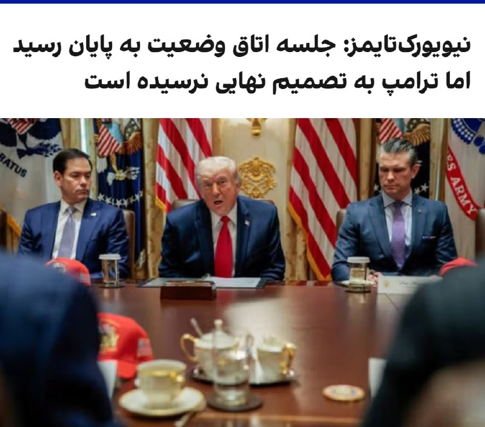

نیویورک‌تایمز به نقل از یک مقام ارشد آمریکایی گزارش داد نشست دونالد ترامپ در «اتاق وضعیت» کاخ سفید دو ساعت به طول انجامید، اما رییس‌جمهور آمریکا هنوز درباره هیچ توافق جدیدی با تهران به تصمیم نهایی نرسیده است.

این مقام افزود دولت آمریکا معتقد است به دستیابی به توافق نزدیک شده، اما برخی مسائل از جمله آزادسازی دارایی‌های مسدودشده همچنان محل بررسی و اختلاف‌نظر است.
@VahidOOnLine

📡 @VahidOnline

## VahidOnline — post 75794

  

روزنامه وال‌استریت ژورنال روز جمعه هشتم خرداد، در گزارشی اختصاصی به نقل از منابع آگاه فاش کرد که امارات متحده عربی در طول جنگ، ده‌ها حمله هوایی را علیه مواضعی در ایران انجام داده است.

منابع وال‌استریت ژورنال می‌گویند نقش امارات در این کارزار نظامی، «بسیار عمیق‌تر» از آنچه که پیش‌تر گزارش شده، بوده است.

بر اساس این گزارش، این حملات با هماهنگی کامل واشنگتن و تل‌آویو و با اتکا به اطلاعات ارائه‌شده از سوی آن‌ها انجام شده است.

اهداف امارات شامل جزایر قشم و ابوموسی در تنگه هرمز، بندرعباس، پالایشگاه نفت جزیره لاوان و مجتمع پتروشیمی عسلویه بوده است.
حملات به عسلویه که به صورت مشترک با اسرائیل و در پاسخ به ضربات جمهوری اسلامی به زیرساخت‌های انرژی امارات انجام شد، واکنش‌های شدید بین‌المللی را برانگیخت و واشنگتن را وادار کرد از اسرائیل بخواهد حمله به تاسیسات انرژی را متوقف کند.
@VahidOOnLine

📡 @VahidOnline

## VahidOnline — post 75793

#قشم
پیام‌های دریافتی درباره فعالیت پدافند:

سلام وحید
قشم ساعت ۲۱:۲۵ تاریخ جمعه ۸ خرداد
پدافند فعال شد من در محدوده قلعه پرتغالی‌ها شهر قشمم و شلیک پدافند کاملا قابل دیدن و شنیدن بود

21:26 هشتم خرداد جزیره #قشم
صدای توافق خیلی بلند به گوشمون رسید. حدود یک دقیقه صدای شدید پدافند، احتمالا برخورد موفق با پهباد نفوذی.

درود همین پنج دقیقه پیش پدافند قشم داشت شلیک می کرد درگیری بود

ساعت 21:25
همین الان پدافند قشم فعال شد و یک چیزی رو زد

🔄 آپدیت:
تسنیم: "در پی رصد ریزپرنده متخاصم دشمن آمریکایی ـ صهیونی در حوالی قشم توسط پدافند هوایی ارتش، بلافاصله در عملیات موفق مورد اصابت قرار گرفت و منهدم شد."
📡 @VahidOnline

## IranIntlTV — post 339648

  <a href="https://t.me/IranintlTV/339648" target="_blank">📎 Download file</a>

🎧نسخه صوتی ۲۴ با فرداد فرحزاد: ترامپ: تهران پولی نخواهد گرفت و سلاح هسته‌ای نخواهد داشت
@iranintlTV

## IranIntlTV — post 339647

  <a href="telegram/content/IranIntlTV_339647_1780085255.mp4" target="_blank">🎬 Download video</a>

یک شهروند در پیامی به ایران اینترنشنال می‌گوید سرعت اینترنت جهانی در ایران بسیار پایین است. پیام او با هوش مصنوعی خوانده شده است.

## IranIntlTV — post 339646

  <a href="telegram/content/IranIntlTV_339646_1780085257.mp4" target="_blank">🎬 Download video</a>

اسرائیل‌هیوم در گزارشی از وجود یک شاخه محرمانه در موساد خبر داد که ماموریت آن عملیات نفوذ، جنگ روانی و بی‌ثبات‌سازی جمهوری اسلامی با هدف تغییر رژیم در ایران است.

گفت‌وگو با منشه امیر، کارشناس امور خاورمیانه
@iranintltv

## IranIntlTV — post 339645

  <a href="telegram/content/IranIntlTV_339645_1780085260.mp4" target="_blank">🎬 Download video</a>

رومانی سفیر روسیه را پس از برخورد یک پهپاد روسی به ساختمانی در خاک این کشور احضار کرد. مقام‌های اروپایی این حادثه را نقض حریم هوایی اتحادیه اروپا دانستند. کایا کالاس، مسئول سیاست خارجه اتحادیه اروپا، هم گفته مسکو نباید حریم این منطقه را نقض کند.
این برخورد هم‌زمان با حملات شبانه روسیه به اوکراین رخ داد و دست‌کم دو نفر زخمی شدند.
@iranintltv

## IranIntlTV — post 339644

ویدیوی منتشرشده، لحظه کشته شدن جاویدنام بابک سلطانی را در اصفهان نشان می‌دهد.
سلطانی، ۵۹ ساله، شامگاه ۱۹ دی ۱۴۰۴ هنگامی که معترضان را در اصفهان پناه می‌داد هدف شلیک گلوله ماموران قرار گرفت و جان باخت.

## IranIntlTV — post 339643

  

اتحادیه اروپا با انتشار بیانیه‌ای اعلام کرد که حمله اخیر حکومت ایران علیه کویت را به شدت محکوم می‌کند.

در این بیانیه آمده که این حمله بنا بر حقوق بین‌الملل نقض حاکمیت کویت محسوب می‌شود.

اتحادیه اروپا همبستگی کامل خود را با دولت و مردم کویت بار دیگر اعلام کرد و افزود: «چنین حملاتی تهدیدی جدی برای امنیت و ثبات منطقه به شمار می‌روند.»
https://iranintl.com/202605296946

## IranIntlTV — post 339642

  <a href="telegram/content/IranIntlTV_339642_1780085263.mp4" target="_blank">🎬 Download video</a>

با وجود گزارش‌هایی درباره توافق میان واشینگتن و تهران، سرنوشت مذاکرات همچنان در هاله‌ای از ابهام قرار دارد.

دونالد ترامپ برای تصمیم‌گیری نهایی درباره توافق احتمالی با جمهوری اسلامی در نشست اتاق وضعیت کاخ سفید شرکت می‌کند.

گفت‌وگو با شهیر شهیدثالث، تحلیل‌گر روابط بین‌الملل
@iranintltv

## IranIntlTV — post 339641

🗣روایت شما از بحران اقتصادی و زندگی در آتش‌بس- جمعه ۸ خرداد:

🔹جوانی ما سوخت پای سفاهت عده‌ای که هیچ درک و فهمی از شادی و سرور ندارند، نزدیک به ۵۰ سال سرمایه‌های کشور رو به یغما دادند، ولی آدمی به امید زنده است.

🔹از اصفهان: گرونی بیداد می‌کنه. از صبح تا شب کار می‌کنیم برای یک میلیون که اونم هیچی نمی‌شه باهاش بخری.

🔹اینا توافق بکنن یا نکنن، هیچ فرقی به حال ما مردم نداره. جمهوری اسلامی به زودی به دست مردم نابود خواهد شد، چون مردم تو شرایط وحشتناکی دارن زندگی می‌کنن.

🔹من یه نوجوون ۱۵ ساله‌ام. چرا باید به فکر قیمت طلا و دلار باشم؟ تنها آرزوی زندگیم فقط خرید موتوریه که آخرین بار قیمتش ۸۰ میلیون تومان بود و الان قیمت گرفتم شده ۲۰۰ تومان. این یعنی خاک کردن آرزوهامون. این حق ما نیست.

🔹من یه بچه ۱۲ ساله هستم، دارم حسرت می‌خورم چرا یه دوچرخه ندارم، هر روز آرزو می‌کنم شاهزاده برگرده، هم مردم خوشحال بشن و هم کسانی که آرزوی چیزی داشتن بتونن بخرنش.

🔹ما نوجوان‌ها واقعا بدبخت شدیم نه امیدی نه آرزویی نه آینده‌ای. از بدو تولد با کرونا، آلودگی، قطعی برق و آب، جنگ و کشتار سر کردیم.

🔹به عنوان یه جوان ۲۸ ساله خیلی وقته دیگه انگیزه و امیدی برای آینده ندارم؛ جوانی که از وقتی که یادشه فقط داره کار می‌کنه و حتی پاش رو از شهر خودش برای یه مسافرت دو روزه بیرون نذاشته. پرایدی که ۱۵ سال از عمر خودش گذشته رو نمی‌تونم بخرم. ما سوختیم.

🔹جمهوری اسلامی با این وحشی‌گری‌هاش به زودی به جایی می‌ره که اسکندر و چنگیز رفتند. به دست مردم شجاع ایران، نه ترامپ. زنده‌باد امید، زنده‌باد ایران، زنده‌باد آزادی.

🔹مردم عزیز ایران، این روزهای سخت هم می‌گذره. امیدتون رو از دست ندین؛ ما ملتی هستیم که بارها دوباره از نو بلند شده. کنار هم می‌مونیم، می‌جنگیم و ایران‌مون رو پس می‌گیریم. آینده از آنِ مردمه.

## IranIntlTV — post 339640

  <a href="telegram/content/IranIntlTV_339640_1780085266.mp4" target="_blank">🎬 Download video</a>

اسرائیل‌هیوم گزارش داده موساد شاخه‌ای محرمانه برای عملیات نفوذ و جنگ روانی علیه جمهوری اسلامی با هدف تغییر رژیم ایجاد کرده است. این گزارش همچنین گفته رییس موساد معتقد است در صورت ادامه محاصره دریایی و شکست توافق با جمهوری اسلامی، حکومت ایران تا پایان ۲۰۲۶ سقوط می‌کند.
@iranintltv

## IranIntlTV — post 339639

  

اسکات بسنت، وزیر خزانه‌داری آمریکا اعلام کرد این کشور یک میلیارد دلار از دارایی‌های رمزارزی مرتبط با جمهوری اسلامی را توقیف کرده است.

بسنت در پاسخ به پرسشی درباره محاصره دریایی بنادر ایران گفت هر اقدامی برای کاهش یا لغو محدودیت‌ها، به‌صورت تدریجی انجام خواهد شد.

وزیر خزانه‌داری آمریکا پیش‌تر نیز اعلام کرده بود دسترسی شرکت‌های هواپیمایی ایران به محل‌های فرود، سوخت‌گیری و فروش بلیت را قطع خواهیم کرد.
https://iranintl.com/202605296456

## IranIntlTV — post 339638

  

علی خزایی، عضو کمیسیون آموزش مجلس گفت که هرگونه تعرض و تجاوز از سوی آمریکا، اسرائیل و متحدانشان با «پاسخ قاطع، سخت و دندان‌شکن» مواجه خواهد شد.

خزایی افزود: «دشمن بار دیگر دچار خطای محاسباتی شده و تصور کرده جمهوری اسلامی در میدان نبرد دچار سکوت یا انفعال شده است.»
https://iranintl.com/202605297926

## IranIntlTV — post 339637

  

🔻نوواک جوکوویچ، مرد شماره ۴ تنیس جهان، در دور سوم رولان گاروس پس از پیش افتادن در دو ست، در نهایت مقابل ژوائو فونسکا، پدیده ۱۹ ساله برزیلی، باخت و حذف شد. پس از ۴ ساعت و ۵۳ دقیقه رقابت نفس‌گیر، شگفتی کامل شد و ورزشگاه فیلیپ شاتریه پس از حذف یانیک سینر، دومین شوک فصل را دید.

🔹اکنون قطعی است که دومین گرنداسلم سال را بازیکنی فتح خواهد کرد که تاکنون چنین عنوانی را به دست نیاورده است. نوواک جوکوویچ آخرین قهرمان گرنداسلم حاضر در پاریس بود.

🔹جدی‌ترین مدعی حال حاضر الکساندر زورف است که امشب در دور سوم به مصاف کوئنتن آلیس می‌رود.

🔹حذف جوکوویچ، به این معناست که از میان پنج نفر برتر رنکینگ، تنها زورف در جدول باقی مانده است.

🔹یانیک سینر، نفر اول جهان، در دور دوم و آن هم پس از برتری ۲-۰ در ست‌ها مقابل خوان مانوئل سروندولو از آرژانتین، به دلیل گرمازدگی شکست خورد.

🔹کارلوس آلکاراس، نفر دوم جهان، به دلیل آسیب‌دیدگی دست از حضور در پاریس انصراف داد.

🔹امشب، نواک جوکوویچ در میان تشویق پرشور تماشاگران زمین را ترک کرد؛ آیا این آخرین باری است که این ستاره ۳۹ ساله را در رولان گاروس می‌بینیم؟

@iranintltvsport

## IranIntlTV — post 339636

  

خبرگزاری رویترز به نقل از منابع جمهوری اسلامی گزارش داد که تهران ممکن است با انتقال نیمی از ذخایر اورانیوم غنی‌شده ۶۰درصدی به یک کشور ثالث موافقت کند.

بر اساس این گزارش، در این حالت، جمهوری اسلامی در مقابل این مقدار، اورانیوم با غنای ۵ درصد دریافت می‌کند.

رویترز نوشت که همچنین ممکن است نیم دیگر این ذخایر در داخل ایران رقیق‌سازی شود.
https://iranintl.com/202605295732

## IranIntlTV — post 339635

  

نیویورک‌تایمز به نقل از یک مقام ارشد آمریکایی گزارش داد نشست دونالد ترامپ در «اتاق وضعیت» کاخ سفید دو ساعت به طول انجامید، اما رییس‌جمهور آمریکا هنوز درباره هیچ توافق جدیدی با تهران به تصمیم نهایی نرسیده است.

این مقام افزود دولت آمریکا معتقد است به دستیابی به توافق نزدیک شده، اما برخی مسائل از جمله آزادسازی دارایی‌های مسدودشده همچنان محل بررسی و اختلاف‌نظر است.
https://iranintl.com/202605292981

## IranIntlTV — post 339634

  <a href="telegram/content/IranIntlTV_339634_1780085273.mp4" target="_blank">🎬 Download video</a>

یک شهروند با اشاره به وضعیت بد معیشتی به مقایسه قدرت خرید خانواده‌های ایرانی با شهروندان کشورهای دیگر پرداخته و می‌گوید که بازگشت نسبی اتصال به اینترنت به این علت است که «حواسمان را پرت کنند.»

پیام او با هوش مصنوعی خوانده شده است.

## IranIntlTV — post 339633

  

ارتش اسرائیل اعلام کرد که بر اساس مستنداتی که به دست آورده، گروه مسلح حزب‌الله، تحت حمایت جمهوری اسلامی، راکت‌هایی را شلیک کرده که به کلیسایی در جنوب لبنان اصابت کرده است.

در بیانیه ارتش اسرائیل آمده است: «سازمان تروریستی حزب‌الله در طول شامگاه جمعه چندین راکت شلیک کرد که به کلیسای ارتدوکس سنت جورج در جنوب لبنان اصابت کردند. این شلیک‌ها به ساختمان‌هایی در روستای مسیحی مرجعیون اصابت کردند.»

ارتش اسرائیل تاکید کرده که نیروهایش در محدوده این کلیسا فعالیت نمی‌کنند.
https://iranintl.com/202605293734

## IranIntlTV — post 339632

  <a href="https://t.me/IranintlTV/339632" target="_blank">📎 Download file</a>

🎧نسخه صوتی حرف آخر با پوریا زراعتی - مجتبی و وحیدی مانع توافق هستند
@iranintlTV

## IranIntlTV — post 339631

  <a href="telegram/content/IranIntlTV_339631_1780085276.mp4" target="_blank">🎬 Download video</a>

۲۴ با فرداد فرحزاد
@iranintltv

## IranIntlTV — post 339630

  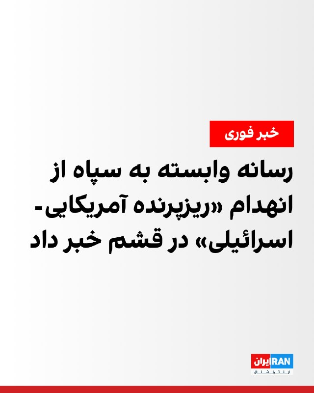

خبرگزاری تسنیم، وابسته به سپاه پاسداران گزارش داد که شامگاه جمعه، در پی رصد ریزپرنده متخاصم «دشمن آمریکایی-اسرائیلی» در حوالی قشم از سوی پدافند هوایی ارتش، مورد اصابت قرار گرفت و منهدم شد.
پیش‌تر رسانه‌های ایران تصاویری از شلیک ممتد پدافند در محدوده قشم منتشر کرده بودند.
https://iranintl.com/202605297986

## IranIntlTV — post 339629

  <a href="telegram/content/IranIntlTV_339629_1780085279.mp4" target="_blank">🎬 Download video</a>

آیا واقعا در تهران همه آماده‌ی توافق هستند و فقط ترامپ مانده که موافقت کند؟
@iranintltv

## Shin_Persian — post 6307

Shin ✓ @hey_itsmyturn
Fri, 29 May 2026 18:10:17 UTC

State-owned Mehr News confirms the AA activity in Qeshm island
Hormozgan Province, #Iran

فارسی

خبرگزاری دولتی مهر فعالیت پدافند هوایی (AA) در جزیره قشم را تایید کرد.
استان هرمزگان، #Iran

𝕏 · @shin_persian

## Shin_Persian — post 6306

  

Shin ✓ @hey_itsmyturn
Fri, 29 May 2026 17:58:04 UTC

Intense AA activity in Qeshm Island, Hormozgan Province, #Iran

فارسی

فعالیت شدید پدافند هوایی در جزیره قشم، استان هرمزگان، #Iran

𝕏 · @shin_persian

## FarsiVOA — post 219016

  <a href="telegram/content/FarsiVOA_219016_1780085283.mp4" target="_blank">🎬 Download video</a>

⚡️اقتصاد ویران و بازگشت اینترنت نصف‌ونیمه؛ نظرات کاربران شبکه‌های اجتماعی
@FarsiVOA

## FarsiVOA — post 219015

  <a href="telegram/content/FarsiVOA_219015_1780085284.mp4" target="_blank">🎬 Download video</a>

⚡️منشه امیر در برنامه تفسیر خبر: از دیدگاه اسرائیل خطر موشکی جمهوری اسلامی مهمتر از خطر اتمی آن است
@FarsiVOA

## FarsiVOA — post 219014

🔺دیدگاه | توقیف و ادعای توقیف با مکث بر نمونه اخیر فیلم «تهران، کنارت»

▪️اواخر برگزاری جشنواره چهل و چهارم فیلم فجر بود. اوایل نیمه دوم بهمن ۱۴۰۴. دبیر جشنواره در تلویزیون حکومتی جمهوری اسلامی گفت: «جهان و سینما محل رفت و آمد است. باید پیش از آن که نوبت به ما برسد، با احترام به غصه‌های هم، مدارا و تحمل را در این خانه تمرین کنیم». مقصود منوچهر شاهسواری از این حرف که به ظاهر، هم فلسفی و مرگ‌آگاهانه جلوه می‌‌کرد و هم عاطفی، چه بود؟

⬇️ بیشتر بخوانید:
https://ir.voanews.com/a/opinion-iran-cinema-movie-kenarat-tehran-another-view/8154837.html
@FarsiVOA

## FarsiVOA — post 219013

  <a href="telegram/content/FarsiVOA_219013_1780085286.mp4" target="_blank">🎬 Download video</a>

⚡️افزایش تهدیدات جمهوری اسلامی در کشورهای اسکاندیناوی
@FarsiVOA

## FarsiVOA — post 219012

⚡️دیدار وزیر خارجه آمریکا با همتای پاکستانی‌اش و گفتگوی‌ تلفنی او با رئیس جمهور لبنان در میانه تحولات منطقه‌ای
@FarsiVOA

## FarsiVOA — post 219011

🔺روایت دو برادر معترض ایرانی؛ فرار پس از ماه‌ها زندگی مخفیانه

▪️دو برادر معترض ایرانی که پس از شرکت در اعتراضات ضدحکومتی و ماه‌ها زندگی مخفیانه، ایران را ترک کرده‌اند می‌گویند پس از حضور در دو دوره اعتراضات، احساس کردند جانشان در خطر بازداشت، زندان یا حتی اعدام قرار دارد.

⬇️ بیشتر بخوانید:
https://ir.voanews.com/a/iranian-brothers-describe-fleeing-after-months-in-hiding/8155356.html
@FarsiVOA

## FarsiVOA — post 219010

🔺افزایش نگران‌کننده اعدام‌ها در ایران؛ بنیاد برومند: ۶۶۰ اعدام در سال ۲۰۲۶ مستند شده است

▪️بنیاد عبدالرحمن برومند می‌گوید که از ابتدای سال جاری میلادی (۱۱ دی ۱۴۰۴) تاکنون، اجرای ۶۶۰ مورد اعدام توسط جمهوری اسلامی ایران را مستند کرده است.

⬇️ بیشتر بخوانید:
https://ir.voanews.com/a/boroumand-center-documented-660-execution/8155307.html
@FarsiVOA

## FarsiVOA — post 219009

ادامه تنش میان اسرائیل و حزب‌الله چه‌قدر بر توافق آمریکا و جمهوری اسلامی اثر دارد؟ گفت‌وگو با صالح کامرانی

## FarsiVOA — post 219008

نسرین ستوده در روایتی از بازداشت خود از ضرب‌وشتم، فشار برای اعتراف اجباری و شرایط «غیرانسانی» بازداشتگاه گفته و تأکید کرده توجه افکار عمومی و حمایت‌های داخلی و بین‌المللی در آزادی موقت او نقش داشته است

## FarsiVOA — post 219007

  

⚡️رسانه‌های داخلی و گزارش کاربران فضای مجازی در شامگاه جمعه ۸ خرداد از فعالیت پدافند در جزیره قشم حکایت دارد.
خبرگزاری تسنیم وابسته به سپاه مدعی شد پدافند قشم بعد از مشاهده «ریزپرنده متخاصم» در حوالی این جزیره فعال شده و توانسته این «ریز پرنده» را هدف قرار دهد.
خبرگزاری حکومتی مهر هم مدعی شد که پدافند جزیره قشم از چند جهت با اهدافی در آسمان منطقه درگیر شده است.
این سومین شب متوالی است که گزارش‌هایی که از انفجار یا فعالیت پدافندی در جنوب ایران منتشر می‌شود.

## FarsiVOA — post 219006

  <a href="telegram/content/FarsiVOA_219006_1780085288.mp4" target="_blank">🎬 Download video</a>

همزمان با فوران آتشفشان مایون در فیلیپین، یک شهاب‌سنگ از پشت این کوه عبور کرد.

تصویری که از این لحظه ثبت شده، عبور شهاب‌سنگ از آسمان را در حالی نشان می‌دهد که گدازه‌های آتشفشان در حال فوران هستند. برخی گزارش‌ها از احتمال ثبت نخستین تصویر همزمان شهاب‌سنگ و آتشفشان فعال در یک قاب خبر داده‌اند.

@FarsiVOA

## FarsiVOA — post 219005

  

مارکو روبیو، وزیر امور خارجه آمریکا، با انتشار این تصویر در اینستاگرام نوشت که به همراه همسرش، دیدار بسیار خوبی با متحدان و شرکای آمریکا در هند داشته است.

@FarsiVOA

## FarsiVOA — post 219004

🔺وزیر خارجه آمریکا با همتای پاکستانی خود دیدار کرد؛ مشارکت برای امنیت و رفاه هر دو کشور

▪️وزیران امور خارجه ایالات متحده و پاکستان روز جمعه ۸ خرداد در واشنگتن از همکاری‌های میان دو کشور ابراز خشنودی و بر توسعه روابط‌شان تاکید کردند.

⬇️ بیشتر بخوانید:

https://ir.voanews.com/a/iran-pakistan-ishagh-dar-meeting-rubio-marco-/8155334.html/?nocach=1

## FarsiVOA — post 219003

در حالی که مقام‌های آمریکایی منتظر تصمیم نهایی پرزیدنت ترامپ درباره توافق هستند، پیام‌های متناقض از جمهوری اسلامی درباره تنگه هرمز، برنامه هسته‌ای و سرنوشت مذاکرات همچنان مخابره می‌شود

## FarsiVOA — post 219002

چرا آمریکا و جمهوری اسلامی هنوز به توافق نرسیده‌اند؟ خواسته‌های دو طرف چیست؟ گفت‌وگو با محمد قائدی

## FarsiVOA — post 219001

  <a href="telegram/content/FarsiVOA_219001_1780085290.mp4" target="_blank">🎬 Download video</a>

ویدیوهای منتشر شده در شبکه‌های اجتماعی، حملات ارتش اسرائیل به چندین هدف وابسته به حزب‌الله در لبنان را نشان می‌دهد.

در این تصاویر، دود و انفجار در مناطقی از لبنان که هدف حملات قرار گرفته‌اند، دیده می‌شود.

@FarsiVOA

## FarsiVOA — post 219000

🔺اصرار حزب‌الله بر گنجاندن موضوع لبنان در مذاکرات آمریکا و جمهوری اسلامی؛ اسرائیل: گروه نیابتی رژیم ایران به‌شدت ضعیف شده است

▪️در حالی که ارزیابی‌های فرماندهی جبهه شمالی در اسرائیل درباره توان رزمی حزب‌الله لبنان، از ضعیف شدن شدید این گروه تروریستی وابسته به جمهوری اسلامی حکایت دارد، گزارش‌ها حاکی از آن است که حزب‌الله در حال اعمال فشار بر جمهوری اسلامی است تا پایان جنگ و توقف حملات اسرائیل به این گروه را بخشی از روند مذاکرات رژیم ایران با آمریکا در نظر بگیرد.

⬇️ بیشتر بخوانید:

https://ir.voanews.com/a/lebanon-hezbollah-iran-war-proxy/8155271.html/?nocach=1

## DW_Farsi — post 125294

🔶 قالیباف: امتیازات را نه با گفت‌وگو بلکه با موشک‌ها می‌گیریم

محمدباقر قالیباف، مذاکره‌کننده ارشد ایران در پیامی تازه تهدید کرد که جمهوری اسلامی امتیازات خود برای رسیدن به توافق در مذاکرات‌ با آمریکا را "نه با گفت‌وگو" بلکه با "موشک‌ها"ی خود می‌گیرد.

او در این پیام که جمعه هشتم خرداد در شبکه ایکس نوشته افزود: «هیچ اعتمادی به تضمین‌ها و حرف‌ها نداریم. فقط رفتارها معیار است. اقدامی پیش از اقدام طرف مقابل انجام نخواهد شد.»

قالیباف این اظهارات را همزمان با انتشار گزارش‌های رسانه‌ای در مورد قوی بودن امکان رسیدن به توافق در مذاکرات دو طرف بیان کرده است.

همزمان دونالد ترامپ، رئیس‌جمهور آمریکا در روز جمعه هشتم خرداد (۲۹ مه) در پیامی تازه در شبکه تروث سوشال اعلام کرد که در جلسه‌ای در اتاق وضعیت کاخ سفید در مورد توافق با ایران تصمیم نهایی را خواهد گرفت.

او در این پیام موارد مد نظر آمریکا برای توافق با ایران را فهرست کرده است.

طبق پیام ترامپ، این موارد شامل موافقت جمهوری اسلامی با عدم توسعه سلاح هسته‌ای، بازگشایی تنگه هرمز، انهدام تمامی مین‌های دریایی کارگذاشته‌شده توسط ایران، لغو محاصره دریایی این کشور توسط ایالات متحده و همچنین خار‌ج‌کردن اورانیوم بسیار غنی‌شده از زیر آوار توسط آمریکا و نابودسازی آن می‌شود.

رئیس‌جمهور آمریکا ادامه داد: «تا اطلاع ثانوی، هیچ پولی مبادله نخواهد شد. در مورد سایر موارد که از اهمیت بسیار کم‌تری برخوردار هستند، توافق حاصل شده است.»
@dw_farsi

## DW_Farsi — post 125293

🔶 دو فعال کرد و از معترضان دی‌‌ماه "با تیراندازی سپاه" کشته شدند

سازمان حقوق بشری هه‌نگاو و شبکه حقوق بشر کردستان از کشته شدن دو برادر و فعال فرهنگی کرد که بعد از شرکت در اعتراضات دی‌ماه مخفیانه زندگی می‌کردند با "شلیک مستقیم" نیروهای سپاه پاسداران خبر داده‌اند.

شبکه حقوق بشر کردستان به نقل از یک منبع مطلع اعلام کرد، صبح روز پنج‌شنبه هفتم خرداد نیروهای سپاه پس از شناسایی محل اختفای آن‌ها در روستای "قلعه‌کوهش" شهرستان دالاهو به محل اقامت این دو برادر یورش بردند: «نیروهای سپاه در جریان این عملیات، منزل محل سکونت آنان را بدون هشدار قبلی هدف تیراندازی قرار داده و مجتبی و میثم ویسی را با شلیک گلوله کشتند.»

هه‌نگاو نیز با روایتی مشابه نوشته، یک شهروند دیگر که صاحب این خانه بوده "سرنوشتش نامعلوم است."

این سازمان حقوق بشری می‌‌گوید، این دو برادر "از چهره‌های خوش‌نام و مردمی و پیروان آیین یارسان" و از مؤسسان کتابخانه شهرک دره‌دریژ (شهرک مهدیه) کرمانشاه و از برگزارکنندگان اصلی مراسم‌ نوروز کردی در این منطقه بودند.

همچنین مجتبی ویسی علاوه بر فعالیت‌های مدنی، از "ورزشکاران برجسته و مقام‌آور رشته کشتی در استان کرمانشاه بود."

خبرگزاری فرانسه می‌نویسد، رسانه‌های داخلی ایران نیز این اتفاق که پنج‌شنبه رخ داده را تأیید کرده‌اند اما می‌گویند، آن‌ها زمانی که از مخفی‌گاه خود اقدام به تیراندازی به نیروهای امنیتی کردند هدف آتش قرار گرفته و کشته شدند.

خبرگزاری تسنیم، وابسته به سپاه پاسداران آن‌ها را "دو تن از عاملان اصلی" ناآرامی‌های دی‌ماه در منطقه دره‌دراز کرمانشاه معرفی کرده و مدعی شده که آنان ابتدا به سوی نیروهای امنیتی تیراندازی کردند.

در ادامه این گزارش آمده است که "در نهایت، نیروهای امنیتی در راستای مأموریت قانونی و به جهت دفاع از خود، اقدام به تیراندازی متقابل کردند که منجر" به کشته شدن این دو نفر شد.
@dw_farsi

## DW_Farsi — post 125292

🔶 گروسی: قزاقستان آماده پذیرش ذخایر اورانیوم ایران است

قزاقستان اعلام کرده، در صورتی که آمریکا در مذاکراتش با ایران به توافق دست یابد این کشور آماده است تا ذخایر اورانیوم بسیار غنی‌شده ایران را نگهداری کند.

خبرگزاری رویترز می‌نویسد، این مطلب را رافائل گروسی، مدیرکل آژانس بین‌المللی انرژی اتمی به روزنامه فایننشال تایمز گفته است.

مطابق این خبر، گروسی در مصاحبه‌ای که روز جمعه ۲۹ مه (هشتم خرداد) منتشر شد به این روزنامه گفت، این کشور هنگامی که قاسم‌‌‌‌‌‌‌‌‌ ـژومارت توکایف، رئیس‌جمهور قزاقستان این هفته در شهر آستانه با او دیدار کرد، آمادگی خود را برای پذیرش این ذخایر ابراز داشت.

قزاقستان میزبان یک بانک ذخیره اورانیوم با غنای پایین است که تحت کنترل بین‌المللی قرار دارد و هدف آن تضمین تأمین سوخت مورد نیاز نیروگاه‌ها در کشورهای عضو آژانس بین‌المللی انرژی اتمی و جلوگیری از گسترش سلاح‌های هسته‌ای است.

این تأسیسات ذخیره در سال ۲۰۱۷ با همکاری آژانس بین‌المللی انرژی اتمی راه‌اندازی شد.

سرنوشت ۴۴۰ کیلوگرم اورانیوم ایران که تا سطح ۶۰ درصد غنی‌سازی شده، یکی از حساس‌ترین موضوعات در گفت‌وگوهای غیررسمی میان واشنگتن و تهران درباره توافقی برای پایان دادن به جنگ میان آمریکا، اسرائیل و ایران است.

دونالد ترامپ خواستار آن شده که این اورانیوم از ایران خارج شود.

تهران به‌صورت علنی اعلام کرده که ذخایر مرتبط با برنامه هسته‌ای خود را تحویل نخواهد داد. با این حال، بنا به گفته افرادی که از این پیشنهاد اطلاع دارند، ایران ظاهراً آمادگی داده است که در چارچوب توافقی برای تمدید ۶۰ روزه آتش‌بس شکننده، بازگشایی تنگه هرمز و ایجاد زمینه مذاکرات درباره برنامه هسته‌ای ایران، درباره رقیق‌سازی یا انتقال این مواد شکافت‌پذیر مذاکره کند.

گمان می‌رود ۴۴۰ کیلوگرم اورانیوم با غنای بالای ایران اکنون زیر آوار سه تأسیسات اصلی هسته‌ای این کشور، نطنز، فردو و اصفهان، قرار داشته باشد؛ تأسیساتی که پس از مشارکت کوتاه‌مدت آمریکا در جنگ ۱۲ روزه اسرائیل علیه ایران در ژوئن گذشته، هدف بمباران آمریکا قرار گرفتند.

این میزان اورانیوم ۶۰ درصدی، اگر تا سطح ۹۰ درصد ، یعنی سطح مورد نیاز برای سلاح هسته‌ای، بیشتر غنی‌سازی شود، برای ساخت حدود ۱۰ سلاح هسته‌ای کافی خواهد بود.

دونالد ترامپ این هفته در شبکه تروث سوشال گفت که اورانیوم با غنای بالا باید "یا فوراً به ایالات متحده تحویل داده شود، یا ترجیحاً با همکاری جمهوری اسلامی ایران در محل نابود شود".

او افزود: «یا در مکان مناسب دیگری، به‌شرط آنکه کمیسیون انرژی اتمی یا نهادی مشابه، این روند و این رویداد را نظارت کند.»

ترامپ همچنین تأکید کرد که "موافق نخواهد بود" روسیه یا چین این ذخایر را در اختیار بگیرند.

در کنار موضوع اورانیوم، آمریکا ایران را تحت فشار قرار داده است تا یک تعلیق ۲۰ ساله برای غنی‌سازی اورانیوم را بپذیرد.
@dw_farsi

## DW_Farsi — post 125291

🔶 جایزه دفاعی اسرائيل به سامانه‌های به‌کار رفته در جنگ ایران رسید

یسرائيل کاتس، وزیر دفاع اسرائيل اسامی برندگان جایزه دفاعی این کشور در سال ۲۰۲۶ را اعلام کرد که از جمله شامل یک "سامانه منحصربه‌فرد" است که در جنگ علیه ایران مورد استفاده قرار گرفته است.

به گزارش تایمز اسرائيل، مراسم اهدای این جوایز با حضور کاتس، ایال زامیر، رئیس ستاد کل ارتش و اسحاق هرتزوگ ، رئیس‌جمهور اسرائيل در اقامتگاه رئیس‌جمهور برگزار خواهد شد.

وزارت دفاع اسرائيل بدون مشخص‌ کردن دقیق سامانه مورد نظر گفت، یکی از پروژه‌های برنده، یک سامانه تسلیحاتی است که نقشی "محوری" در رشته‌‌عملیات‌ علیه جمهوری اسلامی ایفا کرده و "نتایج استثنایی" با تأثیر راهبردی قابل‌توجه به‌دست آورده است.

این جایزه به نیروی هوایی اسرائیل، وزارت دفاع و شرکت "رافائل سیستم‌های پیشرفته دفاعی" اعطا شده است.

دیگر پروژه‌های برنده شامل یک سامانه عملیاتی محرمانه متعلق به سازمان اطلاعاتی موساد، به‌کارگیری عملیاتی ماهواره‌های شناسایی "اوفک-۱۳" و "اوفک-۱۹"، یک دستاورد فناورانه از سوی واحد ۸۱ و واحد ۸۲۰۰ در اداره اطلاعات ارتش اسرائیل و سامانه‌های جنگ الکترونیک می‌شود که گفته می‌شود، در طول جنگ به جلوگیری از رهگیری هواپیماهای سرنشین‌دار اسرائیلی کمک کرده‌اند.

کاتس در بیانیه‌ای گفت: «سال گذشته قدرت عظیم دولت اسرائیل، نهادهای دفاعی و صنایع دفاعی اسرائیل را به کل جهان ثابت کرد.»

او افزود: «توانمندی‌ها، سامانه‌ها و پیشرفت‌های نوآورانه‌ای که در عملیات علیه دشمنان ما به نمایش گذاشته شد و دشمنان ما را در ایران، لبنان، غزه و سایر عرصه‌ها هدف قرار داد و از میان برد، به دولت اسرائیل برتری بی‌سابقه عملیاتی، اطلاعاتی و فناورانه بخشید.»

اسرائيل که بارها از سوی جمهوری اسلامی تهدید به نابودی شده یک بار در ژوئن سال گذشته به مواضع جمهوری اسلامی حمله کرد. این جنگ ۱۲ روز طول کشید و در نهایت با حملات آمریکا به سه مرکز کلیدی هسته‌ای ایران پایان یافت.

دور دوم این درگیری‌ها از ۲۸ فوریه سال جاری شروع شد و هفته‌ها طول کشید تا دو طرف به آتش‌بسی موقت دست یافتند؛ آتش‌بسی که هنوز سرنوشت آن معلوم نیست.
@dw_farsi

## Persian_Trend_Official — post 15293

  <a href="telegram/content/Persian_Trend_Official_15293_1780085292.webm" target="_blank">🎬 Download video</a>

https://youtube.com/live/24Mc1cJMDgQ?feature=share

## Persian_Trend_Official — post 15292

  <a href="telegram/content/Persian_Trend_Official_15292_1780085292.webm" target="_blank">🎬 Download video</a>

وزیر خزانه‌داری ایالات‌متحده : یک میلیارد دلار از دارایی‌های رمزارز ایران(سپاه) را مصادره کردیم.

🔹اسکات بسنت، وزیر خزانه‌داری آمریکا، روز (جمعه) مدعی شد که ایالات متحده حدود یک میلیارد دلار از دارایی‌های رمزارزی ایران را مصادره کرده است.

👺Phantom

📌 @persian_trend_official
پرشین ترند | متفاوت‌ترین کانال نظامی

## Persian_Trend_Official — post 15291

تا دقایقی دیگه لایو آغاز میشه

## Persian_Trend_Official — post 15290

  <a href="telegram/content/Persian_Trend_Official_15290_1780085293.webm" target="_blank">🎬 Download video</a>

وضعیت فعلی آسمان منطقه

📌 @persian_trend_official
پرشین ترند | متفاوت‌ترین کانال نظامی

## Persian_Trend_Official — post 15289

  

اونوقت به خامنه ای شربت شهادت دادن نامردا !

📌 @persian_trend_official
پرشین ترند | متفاوت‌ترین کانال نظامی

## Persian_Trend_Official — post 15288

  <a href="telegram/content/Persian_Trend_Official_15288_1780085294.webm" target="_blank">🎬 Download video</a>

«ترامپ باید بداند که ایران به عنوان پیروز و فاتح میدان شرایط را تعیین می‌کند:
نقد مقابل نقد
نسیه مقابل نسیه
هیچ مقابل هیچ
البته برای موضوعاتی که مورد مذاکره است نه آرزوهایش»

-ایراهیم عزیزی،رئیس کمسیون امنیت ملی مجلس شورای اسلامی

📌 @persian_trend_official
پرشین ترند | متفاوت‌ترین کانال نظامی

## Persian_Trend_Official — post 15287

  <a href="telegram/content/Persian_Trend_Official_15287_1780085295.mp4" target="_blank">🎬 Download video</a>

خدا رحمت کنه شمخانی رو
رهبری رو به شهر توریستی فرستاد !

📌 @persian_trend_official
پرشین ترند | متفاوت‌ترین کانال نظامی

## Persian_Trend_Official — post 15286

  

از بندهای شگفت‌آور متن احتمالی، توافق ایران و آمریکا برای حل تمام موضوعات مرتبط به هسته‌ای است!

اولا ایران عضو NPT است حق تحقیق، توسعه و تولید دارد و ربطی به آمریکا ندارد

ثانیا آیا تمام موضوعات مرتبط باهسته‌ای که شامل پزشکی و کشاورزی و... می‌شود هم باید با آمریکا مذاکره شود؟!

## Persian_Trend_Official — post 15285

  

بد شد که !

## Persian_Trend_Official — post 15284

  <a href="telegram/content/Persian_Trend_Official_15284_1780085299.webm" target="_blank">🎬 Download video</a>

🎬 Video

## Persian_Trend_Official — post 15283

  <a href="telegram/content/Persian_Trend_Official_15283_1780085299.webm" target="_blank">🎬 Download video</a>

🔹تسنیم: انهدام پهپاد آمریکایی در حوالی قشم

در پی رصد پهپاد آمریکایی در حوالی قشم توسط پدافند هوایی ارتش، بلافاصله در عملیات موفق مورد اصابت قرار گرفت و منهدم شد.

👺Phantom

📌 @persian_trend_official
پرشین ترند | متفاوت‌ترین کانال نظامی

## Persian_Trend_Official — post 15282

  <a href="telegram/content/Persian_Trend_Official_15282_1780085300.webm" target="_blank">🎬 Download video</a>

رویترز: تهران ممکن است با انتقال نیمی از ذخایر اورانیوم غنی‌شده ۶۰درصدی موافقت کند

📌 @persian_trend_official
پرشین ترند | متفاوت‌ترین کانال نظامی

## Persian_Trend_Official — post 15281

  <a href="telegram/content/Persian_Trend_Official_15281_1780085300.webm" target="_blank">🎬 Download video</a>

مجدد گزارش های تایید نشده از فعالیت پدافند در قشم! 📝 Nick 📌 @persian_trend_official پرشین ترند | متفاوت‌ترین کانال نظامی

## Persian_Trend_Official — post 15279

  <a href="telegram/content/Persian_Trend_Official_15279_1780085301.webm" target="_blank">🎬 Download video</a>

زیرنویس های صداوسیما !!!

## Persian_Trend_Official — post 15278

فکر میکنم حوالی ساعت 23 به وقت تهران

## Persian_Trend_Official — post 15277

  <a href="telegram/content/Persian_Trend_Official_15277_1780085302.webm" target="_blank">🎬 Download video</a>

منتظر روشن شدن اتفاقات هستم بلافاصله بعدش لایو داریم

## Persian_Trend_Official — post 15276

  <a href="telegram/content/Persian_Trend_Official_15276_1780085302.mp4" target="_blank">🎬 Download video</a>

🎥 لحظه بمباران پایگاه فتح سپاه، در فردیس کرج

👺Phantom

📌 @persian_trend_official
پرشین ترند | متفاوت‌ترین کانال نظامی

## Persian_Trend_Official — post 15275

  <a href="telegram/content/Persian_Trend_Official_15275_1780085305.mp4" target="_blank">🎬 Download video</a>

تصاویری از قشم

👺Phantom

📌 @persian_trend_official
پرشین ترند | متفاوت‌ترین کانال نظامی

## Persian_Trend_Official — post 15274

  <a href="telegram/content/Persian_Trend_Official_15274_1780085305.webm" target="_blank">🎬 Download video</a>

هم اکنون فعالیت پدافند در بندرعباس

👺Phantom

📌 @persian_trend_official
پرشین ترند | متفاوت‌ترین کانال نظامی

## RadioFarda — post 157704

آیا توافق موقت ایران و آمریکا در آستانهٔ رسیدن به مرحلهٔ پایانی است؟

🔸با وجود انتشار گزارش‌های ضدونقیض از تهران و واشینگتن دربارهٔ احتمال یک توافق موقت، کاخ سفید هنوز به‌طور شفاف اعلام نکرده است که آیا دو کشور به توافق نزدیک شده‌اند یا نه.

🔸اسکات بسنت، وزیر خزانه‌داری آمریکا، به خبرنگاران گفته است مذاکرات همچنان ادامه دارد و تأکید کرده که دونالد ترامپ، رئیس‌جمهور آمریکا، «توافق بدی» را برای ایالات متحده نخواهد پذیرفت.

🔸همزمان، گزارش‌هایی منتشر شده که نشان می‌دهد ایران و آمریکا پیرامون یک توافق موقت ۶۰ روزه برای تمدید آتش‌بس و احیای مذاکرات هسته‌ای به جمع‌بندی رسیده‌اند.

🔸انتشار این گزارش‌ها اختلاف دیدگاه‌ها در دولت ترامپ و میان جمهوری‌خواهان را برجسته کرده است. منتقدان می‌گویند کاخ سفید در شرایطی موضع نرم‌تری در قبال تهران در پیش گرفته که تنش‌ها در تنگه هرمز همچنان ادامه دارد.

🔸برای درک بهتر آن‌چه ممکن است پشت صحنه در جریان باشد، رادیو اروپای آزاد/رادیو آزادی با الکساندر گری، رئیس دفتر شورای امنیت ملی در دورهٔ نخست ریاست‌جمهوری دونالد ترامپ و مدیرعامل کنونی شرکت مشاوره ژئوپلیتیک «امریکن گلوبال استراتجیز»، گفت‌وگو کرده است.

🔸متن کامل این گفت‌وگو را در وب‌سایت رادیوفردا بخوانید.

@RadioFarda

## RadioFarda — post 157703

  

🔸رؤسای آژانس بین‌المللی انرژی، صندوق بین‌المللی پول، بانک جهانی و سازمان تجارت جهانی روز پنج‌شنبه برای بررسی واکنش نهادهای خود به پیامدهای جنگ در خاورمیانه دیدار کردند. این موضوع در بیانیه مشترکی که روز جمعه منتشر شد، اعلام شده است.

🔸این نهادها در بیانیه خود با اشاره به محاصره در تنگه هرمز، هشدار دادند: «اگر جریان حمل‌ونقل دریایی به حالت عادی بازنگردد، کاهش سریع و ادامه‌دار ذخایر جهانی نفت، همزمان با اوج تقاضای تابستانی در نیمکره شمالی، خطرات فزاینده‌ای برای امنیت سوخت، شرایط بازار و تاب‌آوری گسترده‌تر اقتصاد جهانی ایجاد خواهد کرد.»

🔸در ادامه این بیانیه آمده است که این نهادها همچنین گزینه‌هایی را برای «تقویت بیشتر حمایت جمعی از طریق اقدامات چندجانبه و دوجانبه» بررسی کرده‌اند.

🔸در پی حملات مشترک آمریکا و اسرائیل به ایران در نهم اسفند سال گذشته و آغاز جنگ، نیروهای نظامی ایران تنگه هرمز را مسدود کردند. این آبراه محل عبور حدود ۲۰ درصد از نفت و گاز در جهان بود و اختلال در حرکت کشتی‌ها باعث افزایش قیمت نفت و کمبود گاز و سایر محصولات نفتی در برخی کشورها شد.

@RadioFarda

## RadioFarda — post 157702

  

🔸سخنگوی وزارت خارجه جمهوری اسلامی در واکنش به پیام دونالد ترامپ دربارهٔ محتوای توافق میان آمریکا و ایران اعلام کرد که تفاهم میان دو کشور هنوز نهایی نشده است.

🔸اسماعیل بقائی روز جمعه گفت: «تبادل پیام‌ها البته ادامه دارد، ولی تفاهم نهایی نشده است.»

🔸دونالد ترامپ، رئیس‌جمهور آمریکا ساعتی پیش اعلام کرد که توافق پایان دادن جنگ باید شامل مواردی مانند تعهد ایران به باز شدن تنگه هرمز و نابودی ذخایر اورانیوم باشد.

🔸به گزارش رسانه‌های ایران، بقائی دربارهٔ وضعیت تنگه هرمز با اشاره به واقع شدن آن در آب‌های سرزمینی ایران و عمان گفت که دو کشور «باید ساز و کارهایی را اتخاذ کنند که هم منافع و امنیت ملی خودشان به عنوان کشورهای ساحلی حفظ شود و هم این‌که به جامعه جهانی این اطمینان را بدهند که کشتی‌رانی از این مسیر به صورت ایمن انجام می‌شود.»

🔸او همچنین مدعی شد که مدیریت تنگه هرمز به ایران و عمان مرتبط است. این در حالی است که رئیس‌جمهور و وزیر خزانه‌داری آمریکا اخیرا عمان را تهدید کرده‌اند که نباید تلاشی برای کنترل این آبراه و اخذ عوارض از کشتی‌ها داشته باشد.

@RadioFarda

## RadioFarda — post 157701

  <a href="https://t.me/radiofarda/157701" target="_blank">📎 Download file</a>

ادامه فشار حداکثری آمریکا با تمرکز بر صادرات نفت ایران؛ گفت‌وگو با دالغا خاتین‌اغلو

🔸در حالیکه ایران و آمریکا درگیر یک روند دیپلماتیک برای دسترسی به یک تفاهم اولیه هستند، اسکات بسنت، وزیر خزانه‌داری آمریکا، در بیانیه‌ای گفت: «اجازه نخواهیم داد دولت ایران درآمدهای نفتی خود را برای بازسازی نیروهای مسلح و توانایی‌های نظامی‌اش افزایش دهد». در همین راستا وزارت خارجه آمریکا روز هفتم خرداد، چندین نهاد، فرد و کشتی را که «ستون فقرات اقتصاد غیرقانونی نفت ایران» نامیده، تحریم کرد. دالغا خاتین اغلو خبرنگار و تحلیلگر حوزه انرژی در باکو به رادیوفردا از میزان اثرگذاری این «کارزار فشار حداکثری» می‌گوید.

@RadioFarda

## IranianMinds — post 21041

فاکس نیوز :
خبرهای مهمی از نشست ترامپ در کاخ سفید بیرون خواهد آمد

@IranianMinds

## IranianMinds — post 21040

  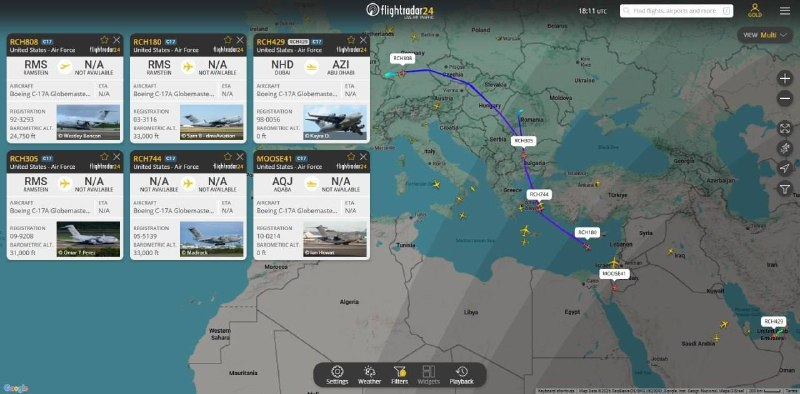

🔴شش فروند هواپیمای نظامی Boeing C-17A Globemaster lll متعلق به نیروی هوایی ایالات متحده در حال ورود به خاورمیانه هستند.

@IranianMinds

## IranianMinds — post 21039

  

🔴 همزمان با گزارش‌هایی مبنی بر وقوع انفجار و فعالیت پدافند هوایی ایران در جزیره قشم در نزدیکی تنگه هرز، یک تانکر سوخت‌گیری هوایی پگاسوس KC-46A پگاسوس که از تل‌آویو پرواز می‌کرد، بر فراز خلیج فارس مشاهده شد.

@IranianMinds

## IranianMinds — post 21038

نیویورک تایمز همین الان:

ترامپ حدود دو ساعت در اتاق وضعیت با تیم ارشد امنیت ملی ملاقات کرد اما هیچ تصمیمی برای توافق با ایران نگرفت.

@IranianMinds

## IranianMinds — post 21037

  <a href="telegram/content/IranianMinds_21037_1780085310.mp4" target="_blank">🎬 Download video</a>

قشم

@IranianMinds

## IranianMinds — post 21036

🔴 قشم انگار باز یه خبراییه پدافند فعال شده و گزارشاتی از صدای انفجار هم هست.

@IranianMinds

## IranianMinds — post 21035

  

@IranianMinds

## IranianMinds — post 21034

  

🔴 وال استریت ژورنال :

امارات متحده عربی در طول جنگ، به‌طور مخفیانه ده‌ها حمله هوایی را با هماهنگی ایالات متحده و اسرائیل علیه ایران انجام داده است.

این حملات، سایت‌های نظامی و مراکز مرتبط با انرژی را هدف قرار داده و حتی تا پس از اعلام آتش‌بس نیز ادامه داشته است.

@IranianMinds

## IranianMinds — post 21033

🎁 استارت کن و کانفیگتو رایگان بگیر 
⭐ویژه کاربران پرمیوم تلگرام 
⭐️ اگه اکانت تلگرامت پرمیوم باشه به محض استارت ربات بدون هیچ امتیاز و زیر مجموعه دایی جون بهت کانفیگ هدیه میده 
✔️ همچنین با اوردن دوستای پرمیومت امتیاز بیشتری میگیری 
🎁 @Daeijoonbot | استارت…

## IranianMinds — post 21032

  

🎁 استارت کن و کانفیگتو رایگان بگیر

⭐ویژه کاربران پرمیوم تلگرام

⭐️ اگه اکانت تلگرامت پرمیوم باشه به محض استارت ربات بدون هیچ امتیاز و زیر مجموعه دایی جون بهت کانفیگ هدیه میده

✔️ همچنین با اوردن دوستای پرمیومت امتیاز بیشتری میگیری

🎁 @Daeijoonbot | استارت کن و کانفیگ رایگان بگیر 
🌟

## IranianMinds — post 21031

  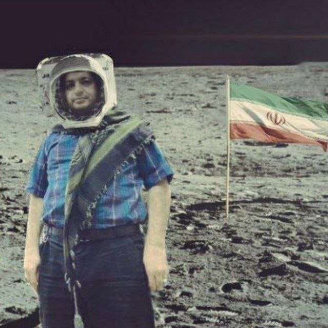

🔴 رائفی پور :

تو جنگ آمریکاییا حتی از آدم فضاییا هم کمک گرفتن و باهاشون به ما حمله کردن ولی بازم نتونسن شکستمون بدن.

@IranianMinds

## BBCPersian — post 282350

  <a href="telegram/content/BBCPersian_282350_1780085314.mp4" target="_blank">🎬 Download video</a>

‌ ‌ ‌
آخرین خبرهای مهم جمعه ۸ خرداد ۱۴۰۵

@BBCPersian

## BBCPersian — post 282349

🔻 تسنیم: پهپاد دشمن در اطراف جزیره قشم هدف قرار گرفت و منهدم شد

در پی گزارش‌ها درباره شنیده شدن صدای پدافند در جزیره قشم، خبرگزاری تسنیم،‌ نزدیک به منابع امنیتی گزارش داد که یک «ریزپرنده» آمریکایی اسرائیلی در حوالی جزیره قشم هدف پدافند هوایی ارتش ایران قرار گرفته و منهدم شده است.

منابع آمریکا درباره این گزارش اظهارنظری نکردند.

دیشب هم سپاه پاسداران مدعی سرنگون کردن یک پهپاد شده بود.

https://bbc.in/4nZZvWf
@BBCPersian

## BBCPersian — post 282348

🔻 شنیده شدن صدای پدافند و انفجار در محدوده جزیره قشم

خبرگزاری مهر شامگاه روز جمعه گزارش داد که تعدادی از ساکنان در جزیره قشم از شنیده شدن صدای فعالیت پدافند هوایی خبر دادند.

این خبرگزاری می‌گوید که هنوز هیچ یک از نهادهای رسمی در ایران درباره علت این صداها اظهارنظری نکردند.

وحیدآنلاین هم می‌گوید که تعدادی از مخاطبانش حدود ساعت ۹ و نیم شب روز جمعه هشتم خرداد ماه در پیام‌هایی از شنیده شدن و دیدن شلیک پدافند خبر دادند.

برخی هم از شنیدن صداهایی شبیه به انفجار گفتند.

https://bbc.in/4wZIkbv
@BBCPersian

## BBCPersian — post 282347

  

‌
❌هشدار: در این مطلب به موضوع خودکشی اشاره شده است. اگر به خودکشی فکر می‌کنید، با نهادهای تخصصی یا افراد متخصص تماس بگیرید.❌

کنت لا،‌ یک مرد کانادایی در دادگاهی در انتاریو اعتراف کرد که با فروش مواد شیمیایی کشنده در مرگ ۱۴ نفر که قصد خودکشی داشتند مشارکت داشته است. دادگاه او را به معاونت در مرگ،‌ متهم و مجرم شناخت.

اعتراف او بخشی از توافق با دادستان‌ها بود، که اتهامات جدی قتل عمد را از پرونده او حذف کنند.

آقای لا ۶۰ ساله است و پیشتر سرآشپز بوده است. او مواد شیمیایی قانونی اما سمی را به صورت آنلاین به افرادی که در تالارهای گفت‌وگوی خودکشی در اینترنت با آنها آشنا شده بود، می‌فروخت.

به گفته دادستان‌ها او حدود ۱۲۰۰ بسته مواد سمی را برای افرادی در ۴۱ کشور جهان ارسال کرده است.

گفته می‌شود که آقای لا به بیش از ۷۳ بریتانیایی مواد سمی فروخته است.

خانواده قربانیان بریتانیایی از دادستان‌ها در بریتانیا به دلیل متهم نکردن آقای لا در رابطه با مرگ بیش از ۷۳ بریتانیایی خشمگین هستند.

📷Peel Regional Police/PA Wire

@BBCPersian

## BBCPersian — post 282346

  

بقایی: هنوز هیچ توافقی میان ایران و آمریکا نهایی نشده است

اسماعیل بقایی، سخنگوی وزارت خارجه ایران گفت که تبادل پیام‌ها ادامه دارد ولی هنوز هیچ توافقی میان ایران و آمریکا نهایی نشده است و افزود که مدیریت تنگه هرمز باید توسط ایران و عمان تعیین شود.

آقای بقایی در مصاحبه‌ای با صدا و سیما جمهوری اسلامی این اظهارات را مطرح کرد.

او بار دیگر گفت: «در این مرحله بر خاتمه جنگ متمرکز هستیم و در مورد پرونده هسته‌ای هیچ مذاکره‌ای نداریم.»

این اظهارات در حالی از سوی ایران مطرح شده که آقای ترامپ فهرستی از خواسته‌هایی را که می‌گوید ایران باید برآورده کند، مطرح کرد که شامل تعهد ایران به عدم دستیابی به سلاح هسته‌ای، باز کردن تنگه هرمز بدون دریافت عوارض، مین‌روبی کامل این آبراه و خارج‌سازی ذخایر اورانیوم ‌غنی‌شده ایران با همکاری آمریکا و تحت نظارت آژانس و سپس از بین بردن این مواد است.
📷IRNA

https://bbc.in/434zQlG
@BBCPersian

## idfinfarsi — post 11659

  <a href="telegram/content/idfinfarsi_11659_1780085319.mp4" target="_blank">🎬 Download video</a>

مستندات ارتش اسرائیل ثابت میکنند: سازمان تروریستی حزب‌الله راکت‌هایی را شلیک کرده که به کلیسایی در جنوب لبنان اصابت کرده‌اند

سازمان تروریستی حزب‌الله در طول شب (جمعه) چندین راکت شلیک کرد که به کلیسای ارتدوکس سنت جورج در جنوب لبنان اصابت کردند. این شلیک‌ها به ساختمان‌هایی در روستای مسیحی مرجعیون اصابت کردند — تأکید می‌شود که نیروهای ارتش اسرائیل در محدوده این کلیسا فعالیت نمی‌کنند.

ارتش اسرائیل اکنون مستنداتی را منتشر می‌کند که اصابت راکت‌های سازمان تروریستی حزب‌الله به این کلیسا در جنوب لبنان را ثابت میکنند.

این یک مدرک دیگر است که ثابت میکند که سازمان تروریستی حزب‌الله همچنان شهروندان لبنان را به خطر انداخته و به آن‌ها آسیب می‌زند.

## Dirty_Kids — post 390521

نمیدونم چی بگم
فقط لایکاش😂😂😂😂😂😂😂😂

تو تیک‌تاک یا همه ۱۵ سالشونه یا مغزشون کص میزنه وگرنه در این حد کصخلیت طبیعی نیست

@Dirty_Kids 👻

## Dirty_Kids — post 390520

راستی شماها که نبودین علی شریفی زارچی یه سوراخ تو سایت جانفداشون پیدا کرد که ثابت شد تعداد ثبت نام ها ۳ میلیون نهصد هزار نفره :))))

@Dirty_Kids 👻

## Dirty_Kids — post 390519

  

🔴 این روزا دخترا این تیشترتو در حمایت از دوس پسرشون میپوشن:

من نیازی به CHATGPT ندارم، چون دوس پسرم همه چیزو میدونه.

@Dirty_Kids 👻

## Dirty_Kids — post 390518

  <a href="telegram/content/Dirty_Kids_390518_1780085321.mp4" target="_blank">🎬 Download video</a>

تصاویر جدید از قیام ملت ایران در ۱۸ و ۱۹ دی

@Dirty_Kids 👻

## Dirty_Kids — post 390517

  <a href="telegram/content/Dirty_Kids_390517_1780085324.mp4" target="_blank">🎬 Download video</a>

حسین علایی از فرمانده‌های پیشین نیروی دریایی سپاه تروریستی تو این ویدئو می‌گه موشعلی رو شمخانی بگا داد و باعث کسپر شدنش شد،

«سه روز قبل از جنگ چهل روزه به شمخانی قحبه گفتم آمریکا و اسرائیل با کسپر کردن رهبری جنگ رو شروع می‌کنند اما شمخانی زن‌هزارتختخوابی شونه‌ش رو انداخت بالا و گفت نووچ، نمی‌تونن،
گفتم چرا نمی‌تونن کسمشنگ؟
گفت نمی‌تونن پیداش کنن»


@Dirty_Kids 👻

## Dirty_Kids — post 390516

  <a href="telegram/content/Dirty_Kids_390516_1780085326.mp4" target="_blank">🎬 Download video</a>

🔴 یه پست جدید و جنجالیِ دیگه از اکانت کاخ سفید همراه این کپشن:

اونا [آدم فضاییا] بین ما راه میرن.

@Dirty_Kids 👻

## Dirty_Kids — post 390512

  <a href="telegram/content/Dirty_Kids_390512_1780085328.mp4" target="_blank">🎬 Download video</a>

🔴 مردم ایران ۳ ماه اینترنت نداشتن، حالا که اینترنتشون برگشته به روال سابق، لابد دیگه به نحو احسنت ازش استفاده میکنن؛

+ همچنان یسری ایرنی‌ها تو اینستاگرام:

@Dirty_Kids 👻

## Dirty_Kids — post 390511

  

خبر به نقل از نیویورک‌تایمز:

«ترامپ بعد از حدود دو ساعت جلسه در اتاق وضعیت کا‌خ‌سفید، بدون اینکه هیچ تصمیمی درباره توافق جدید با روافض قحبه بگیره، جلسه رو ترک کرد. یک مقام ارشد دولت این خبر رو به نیویورک تایمز داده.
به گفته این مقام، دولت معتقده توافق خیلی نزدیکه، اما هنوز اختلافاتی باقی مونده، از جمله بر سر آزادسازی دارایی‌های روافض کس‌پدر».

@Dirty_Kids 👻

## Dirty_Kids — post 390510

  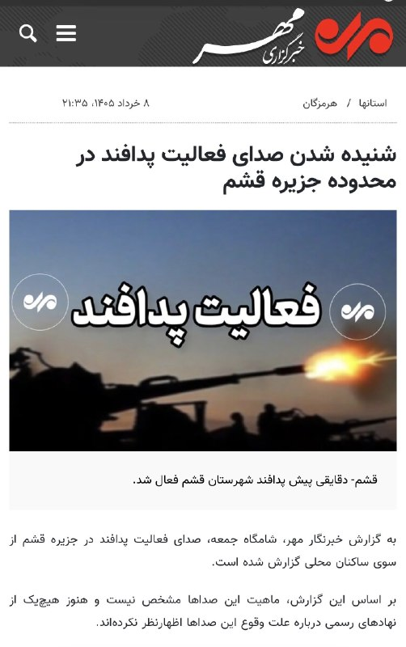

در حالیکه ترامپ به گفته‌ی خودش به اتاق وضعیت رفته که تصمیم نهایی در خصوص امضای تفاهم‌نامه با روافض رو بگیره

خبرگزاری مهر روافض خبر از شنیده‌ شدن صدای پدافند در قشم اون‌ورا می‌ده:

@Dirty_Kids 👻

## Dirty_Kids — post 390509

  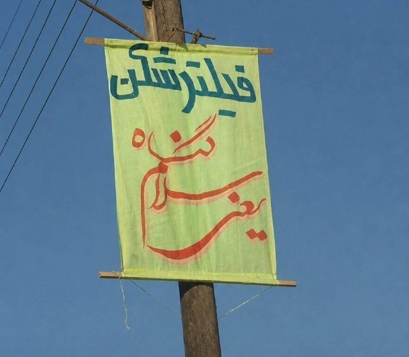

ولی عوضش اینترنت‌‌پرو و سیمکارت‌سفید ثواب داره 😂😂😂

@Dirty_Kids 👻

## Dirty_Kids — post 390508

  <a href="telegram/content/Dirty_Kids_390508_1780085332.mp4" target="_blank">🎬 Download video</a>

توی تهرانپارس دوتا پسر دارن مخ میزنن که یه پسره با بلندگو از پشت میگه: بخدا پسر خوبیه فقط میخواد بکنتت😂😂

@Dirty_Kids 👻

## Dirty_Kids — post 390507

ویزای ساعتی بازیکنان تیم ملی اینجوریه که بازی به پنالتی بکشه باید پنالتی ها رو از مکزیک بزنن.

@Dirty_Kids 👻

## Dirty_Kids — post 390506

  <a href="telegram/content/Dirty_Kids_390506_1780085334.mp4" target="_blank">🎬 Download video</a>

دهن سرویسا این چیه ساختید😂😂

@Dirty_Kids 👻

## Dirty_Kids — post 390505

  

اکانت رسمی Clash of clans تو اینستاگرام، انگاری زده تو کارِ تولید محتوا برای فوت فتیشا:

@Dirty_Kids 👻

## Hranews — post 113230

گزارشی از اجرای حکم اعدام ۷ زندانی در زندان‌های مختلف

❗️
❗️
❗️
❗️
❗️ – حکم هفت زندانی که پیشتر از بابت اتهامات مرتبط با جرائم مواد مخدر و قتل به مجازات #اعدام محکوم شده بودند، در زندان‌های زاهدان، بیرجند، مشهد و کرمانشاه به اجرا درآمد.

ادامه مطلب

↘️
@hranews_bot تماس ✉️ -  @Hranews  کانال هرانا 🆑

## Hranews — post 113229

  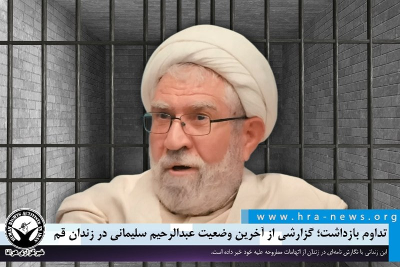

تداوم بازداشت؛ گزارشی از آخرین وضعیت عبدالرحیم سلیمانی در زندان قم

❗️
❗️
❗️
❗️
❗️ – عبدالرحیم سلیمانی اردستانی، پژوهشگر دینی و استاد دانشگاه، با وجود گذشت بیش از دو ماه از زمان بازداشت، همچنان به‌صورت بلاتکلیف در زندان ساحلی قم نگهداری می‌شود. این زندانی سیاسی اخیراً با نگارش نامه‌ای از داخل زندان، به تشریح آخرین وضعیت خود پرداخته است.

به گزارش خبرگزاری هرانا، ارگان خبری مجموعه فعالان حقوق بشر در ایران، عبدالرحیم سلیمانی اردستانی، کماکان به‌صورت بلاتکلیف قضایی در زندان ساحلی قم به‌سر می‌برد.

آقای سلیمانی اخیرا با نگارش نامه‌ای اعلام کرده است که با ۱۱ اتهام از جمله «تشویش اذهان عمومی»، «توهین به مقدسات»، «توهین به رهبری» (به دو شخص علی و مجتبی خامنه‌ای)، «تجمع در اعتراض به حصر میرحسین موسوی»، «اجتماع و تبانی علیه امنیت داخلی»، «توهین به مقدسات تشیع»، «فعالیت تبلیغی ضد نظام»، «نشر اکاذیب رایانه‌ای به قصد تشویش اذهان عمومی»، «توهین به مراجع»، «هتک حیثیت روحانیت» و «کنترل ذهن و القائات روانی» مواجه شده است و در ادامه از خود نسبت به این اتهامات مذکور دفاع کرده است.
در بخشی از این نامه آمده است که وی بدون ارائه حکم قضایی و با برخوردی خشونت‌آمیز و توأم با بی‌احترامی بازداشت شده و حدود دو ساعت تحت ضرب‌وشتم ماموران امنیتی قرار گرفته است. همچنین، با گذشت بیش از دو ماه از زمان بازداشت، او همچنان از حق ملاقات محروم مانده و یک ماه از این مدت را در سلول انفرادی سپری کرده است.

ادامه مطلب

#عبدالرحیم_سلیمانی_اردستانی

↘️
@hranews_bot تماس ✉️ -  @Hranews  کانال هرانا 🆑

## Hranews — post 113228

گزارشی از معوقات مزدی کارکنان بیمارستان امام علی چابهار

❗️
❗️
❗️
❗️
❗️ – شماری از #کارکنان شاغل در بیمارستان امام علی چابهار از عدم پرداخت مطالبات مزدی خود ابراز نارضایتی کرده و خواستار رسیدگی به وضعیتشان شدند.

ادامه مطلب

↘️
@hranews_bot تماس ✉️ -  @Hranews  کانال هرانا 🆑

## Hranews — post 113227

  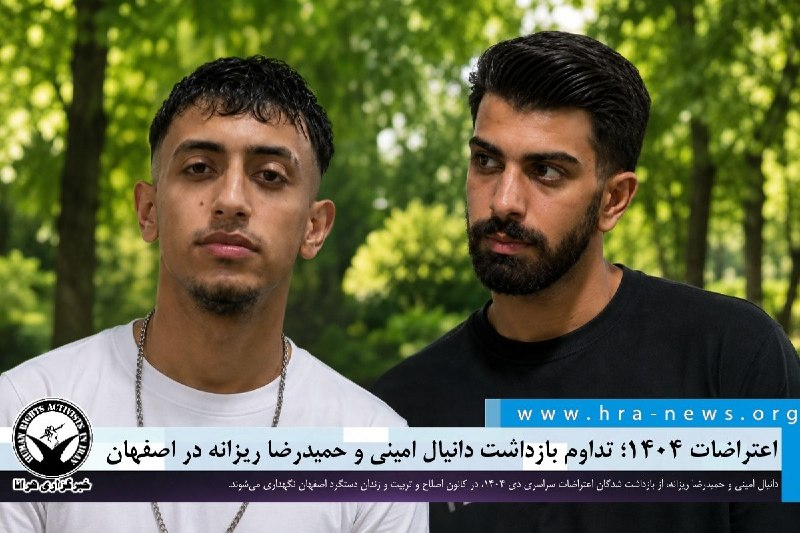

اعتراضات ۱۴۰۴؛ تداوم بازداشت دانیال امینی و حمیدرضا ریزانه در اصفهان

❗️
❗️
❗️
❗️
❗️– دانیال امینی و حمیدرضا ریزانه، از بازداشت شدگان اعتراضات سراسری دی ۱۴۰۴ در اصفهان، با گذشت ۱۴۵ روز از زمان بازداشت، همچنان در بلاتکلیفی قضایی به‌سر می‌برند. این دو شهروند به‌ترتیب در کانون اصلاح و تربیت و زندان دستگرد اصفهان نگهداری می‌شوند.

به گزارش خبرگزاری هرانا، ارگان خبری مجموعه فعالان حقوق بشر در ایران، دانیال امینی و حمیدرضا ریزانه، از بازداشت شدگان اعتراضات سراسری دی ۱۴۰۴، در بازداشت بسر می‌برند.

بر اساس اطلاعات دریافتی هرانا، ۱۴۵ روز از زمان بازداشت این دو شهروند که در پرونده‌ای مشترک با اتهامات مرتبط با اعتراضات سراسری مواجه هستند، می‌گذرد. حمیدرضا ریزانه در زندان دستگرد اصفهان و دانیال امینی در کانون اصلاح و تربیت اصفهان نگهداری می‌شود. در اسفند ماه سال گذشته به خانواده‌های این دو شهروند اعلام شد که با آزادی موقت آنان با وثیقه موافقت شده است. با این حال، پس از مراجعه خانواده‌ها به مراجع مربوط و تامین وثیقه، با آزادی موقت آنان مخالفت شد. این دو شهروند همچنان در وضعیت بلاتکلیفی قضایی به‌سر می‌برند.

ادامه مطلب

#دانیال_امینی
#حمیدرضا_ریزانه

↘️
@hranews_bot تماس ✉️ -  @Hranews  کانال هرانا 🆑

## Hranews — post 113226

شهرستان مهرستان؛ ۲ شهروند توسط ماموران اداره اطلاعات بازداشت شدند

❗️
❗️
❗️
❗️
❗️ – روز گذشته، محسن دهانی و احسان دهانی دو برادر اهل شهرستان مهرستان توسط نیروهای اداره اطلاعات در این شهرستان #بازداشت و به مکان نامعلومی منتقل شدند.

ادامه مطلب

#محسن_دهانی
#احسان_دهانی

↘️
@hranews_bot تماس ✉️ -  @Hranews  کانال هرانا 🆑

## alonews — post 123573

  <a href="telegram/content/alonews_123573_1780085338.webm" target="_blank">🎬 Download video</a>

🔴فوری/وزیر خزانه داری آمریکا درباره رفع تحریم‌های ایران

🔴به گزارش الجزیره،  وزیر خزانه‌داری آمریکا مدعی شد که تحریم‌های ایران به تدریج لغو خواهد شد.

✅ @AloNews خبر جنگ

## alonews — post 123572

  <a href="telegram/content/alonews_123572_1780085339.webm" target="_blank">🎬 Download video</a>

👈 تانکر ترکرز اعلام کرد: صادرات نفت و فرآورده‌های نفتی ایران تداوم دارد و امروز یک ابرنفتکش دو میلیون بشکه نفت خام ایران را بارگیری کرده است.

✅ @AloNews خبر جنگ

## alonews — post 123571

  <a href="telegram/content/alonews_123571_1780085339.webm" target="_blank">🎬 Download video</a>

👈وزیر خزانه‌داری آمریکا: یک میلیارد دلار از دارایی‌های رمزارز ایران را مصادره کردیم!

✅ @AloNews خبر جنگ

## alonews — post 123570

  <a href="telegram/content/alonews_123570_1780085339.webm" target="_blank">🎬 Download video</a>

👈کان اسرائیل: نتانیاهو خواستار از سرگیری حملات به ایران است

✅ @AloNews خبر جنگ

## alonews — post 123569

  <a href="telegram/content/alonews_123569_1780085340.webm" target="_blank">🎬 Download video</a>

👈بسنت وزیر خزانه داری آمریکا: احتمالاً تورم ایران بیش از ۲۰۰٪ است.

🔴ما فکر می‌کنیم ایران ماهانه ۴۰۰ تا ۵۰۰ میلیون دلار سرقت می‌کرد!

✅ @AloNews خبر جنگ

## alonews — post 123568

  <a href="telegram/content/alonews_123568_1780085340.webm" target="_blank">🎬 Download video</a>

👈 پنتاگون در حال جذب صدها عضو نیروهای مسلح برای حضور در رویداد UFC برنامه‌ریزی‌شده توسط رئیس‌جمهور ترامپ در کاخ سفید در ۱۴ ژوئن است، گزارش واشنگتن پست.

🔴بر اساس یادداشت‌های داخلی که واشنگتن پست بررسی کرده است، نیروهای انتخاب‌شده برای حضور به عنوان تماشاگر با یونیفرم باید هزینه‌های سفر و اقامت خود را بپردازند، استانداردهای فعلی آمادگی جسمانی نظامی — از جمله الزامات قد به کمر — را رعایت کنند و یونیفرم رسمی بپوشند.

🔴مقامات به دنبال جذب پرسنل درجه‌دار جوان و افسران جوان برای حضور هستند.

✅ @AloNews خبر جنگ

## alonews — post 123567

  <a href="telegram/content/alonews_123567_1780085340.webm" target="_blank">🎬 Download video</a>

👈نیویورک تایمز به نقل از یک مقام دولتی:
نشست ترامپ در اتاق عملیات حدود دو ساعت به طول انجامید

✅ @AloNews خبر جنگ

## alonews — post 123566

  <a href="telegram/content/alonews_123566_1780085341.webm" target="_blank">🎬 Download video</a>

⚫
🏆 به دنیای هیجان‌انگیز فوتبال خوش اومدی!

⭐️اینجا قراره باهم لحظه‌به‌لحظه‌ی جام جهانی رو زندگی کنیم؛
از بازی‌های حساس و نتایج داغ گرفته تا حاشیه‌ها، کری‌خونی‌ها و اتفاقاتی که همه درباره‌ش حرف میزنن! 
🔥
🔥

✅ پوشش کامل مسابقات

💀 ترول تیم‌ها و بازیکن‌ها

🎥 ویدیوها و لحظه‌های فان فوتبالی

📊 آمار، ترکیب‌ها و اخبار فوری

🌍 حواشی جذاب از سراسر جام جهانی

📢اینجا فقط یک کانال خبری نیست؛
یک جمع فوتبالیه برای کسایی که فوتبال رو با هیجان، شوخی و احساس واقعی دنبال میکنن 
📛
💟

🆘
🔞 آماده باش چون قراره جام جهانی رو متفاوت تجربه کنیم!

⚡ @Vaarzesh_Plus

⚡ @Vaarzesh_Plus

## alonews — post 123565

  <a href="telegram/content/alonews_123565_1780085341.webm" target="_blank">🎬 Download video</a>

👈نیویورک تایمز به نقل از یک مقام دولت ترامپ: ما به دستیابی به توافق نزدیک شده‌ایم، اما برخی از مسائل همچنان مورد بحث هستند.

🔴 نیویورک تایمز به نقل از یک مقام دولت ترامپ: موضوع دارایی‌های مسدود شده ایران همچنان مانعی در مذاکرات است.

✅ @AloNews خبر جنگ

## alonews — post 123564

  <a href="telegram/content/alonews_123564_1780085342.webm" target="_blank">🎬 Download video</a>

👈وزارت خارجه پاکستان اعلام کرد که وزیر خارجه این کشور در دیدار با روبیو، وزیر خارجه امریکا ابراز اطمینان کرده است که تلاشهای تحقق صلح منجر به نتایج مثبت خواهد شد.

✅ @AloNews خبر جنگ

## alonews — post 123563

  <a href="telegram/content/alonews_123563_1780085342.webm" target="_blank">🎬 Download video</a>

👈خبرنگار الحدث: نشست ترامپ در اتاق عملیات کاخ سفید درباره تصمیم‌گیری در مورد ایران به پایان رسید.

🔴باید منتظر تصمیم ترامپ و اعلامش باشیم

✅ @AloNews خبر جنگ

## alonews — post 123562

  <a href="telegram/content/alonews_123562_1780085342.webm" target="_blank">🎬 Download video</a>

👈 هشدارهای پهپاد در منطقه خط تقابل، شمال اسرائیل فعال هستند.

✅ @AloNews خبر جنگ

## alonews — post 123561

  <a href="telegram/content/alonews_123561_1780085342.webm" target="_blank">🎬 Download video</a>

👈 شش فروند هواپیمای ترابری نظامی Boeing C-17A Globemaster III نیروی هوایی ایالات متحده در راه خاورمیانه هستند.

✅ @AloNews خبر جنگ

## alonews — post 123560

  <a href="telegram/content/alonews_123560_1780085343.webm" target="_blank">🎬 Download video</a>

🔴فوری / فاکس نیوز: خبرهای مهمی از نشست ترامپ در کاخ سفید بیرون خواهد آمد

✅ @AloNews خبر جنگ

## alonews — post 123559

  <a href="telegram/content/alonews_123559_1780085343.webm" target="_blank">🎬 Download video</a>

👈شبکه تلویزیونی اسرائیل به نقل از یک منبع گزارش داد: هیئت اسرائیلی در مذاکرات پنتاگون پیشنهاد لبنان برای خروج از لبنان را رد کرد

✅ @AloNews خبر جنگ

## alonews — post 123558

  <a href="telegram/content/alonews_123558_1780085343.webm" target="_blank">🎬 Download video</a>

👈ارتش ایران : یه پهپاد دشمن رو سرنگون کردیم

✅ @AloNews خبر جنگ

## alonews — post 123556

  <a href="telegram/content/alonews_123556_1780085344.webm" target="_blank">🎬 Download video</a>

👈خبرگزاری صداوسیما: ترامپ ضرورت خروج آمریکا از اطراف ایران را نادیده گرفته درحالیکه این موضوع مورد تاکید قطعی ایران است.

✅ @AloNews خبر جنگ

## alonews — post 123555

  <a href="telegram/content/alonews_123555_1780085344.mp4" target="_blank">🎬 Download video</a>

👈ویدیویی از جشن برداشتن محاصره دریایی در قشم و شلیک توپ ضد هوایی

✅ @AloNews خبر جنگ

## alonews — post 123554

  <a href="telegram/content/alonews_123554_1780085345.webm" target="_blank">🎬 Download video</a>

🔴فوری / گزارش های تایید نشده از فعالیت پدافند در قشم 
✅ @AloNews خبر جنگ

## alonews — post 123553

  <a href="telegram/content/alonews_123553_1780085345.webm" target="_blank">🎬 Download video</a>

🔴فوری / گزارش های تایید نشده از فعالیت پدافند در قشم 
✅ @AloNews خبر جنگ

---
📅 بروزرسانی: 1405/03/08 21:17
---

## VahidOOnLine — post 242804

  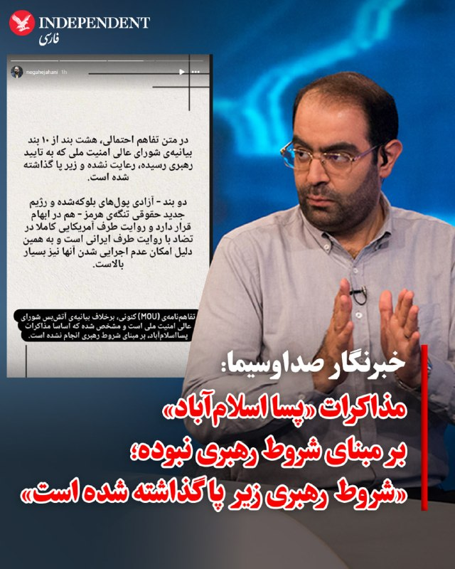

♦️ مهدی خانعلی‌زاده، خبرنگار صداوسیما که برای پوشش مذاکرات اسلام‌آباد، به پاکستان سفر کرده بود، با انتشار پیامی در روایتگر اینستاگرام خود، متن تفاهم احتمالی میان تهران و واشنگتن را ناقض «بیانیه شورای امنیت ملی» که به تایید مجتبی خامنه‌ای، رهبر جدید جمهوری اسلامی نیز رسیده بود، دانست.

خانعلی‌زاده نوشت: «در متن تفاهم احتمالی، هشت بند از ۱۰ بعد بیانیه شورای عالی امنیت ملی که به تایید رهبری رسیده، رعایت نشده و زیر پا گذاشته شده است.»

او در ادامه به دو بند مربوط به آزادی دارایی‌های مسدودشده ایران و وضعیت حقوقی تنگه هرمز نیز پرداخت و با اشاره به تناقض در گفته‌های دونالد ترامپ با روایت مقام‌های جمهوری اسلامی، امکان اجرایی نشدن این تفاهم را «بسیار بالا» دانست.

خانعلی‌زاده، مذاکراتی که با میانجی‌گری پاکستان پس از دیدار در اسلام‌آباد انجام شد را «پسااسلام‌آباد» خواند و نوشت که این مذاکرات «بر مبنای شروط رهبری» انجام نشده است.
‌🇸🇦 Indypersian

🤖 @VahidOOnLine

## VahidOOnLine — post 242803

  

اسماعیل بقائی، سخنگوی وزارت خارجه گفت که ما در این مرحله بر خاتمه جنگ متمرکز هستیم و در مورد جزئیات برنامه هسته‌ای مذاکره‌ای نداریم.
سخنگوی وزارت خارجه جمهوری اسلامی افزود: «تاکنون تفاهمی با آمریکا نهایی نشده است.»

او افزود: «آنچه آمریکایی‌ها تحت عنوان محاصره دریایی از آن نام می‌برند، از ابتدا یک اقدام غیرقانونی بود؛ هم نقض آتش‌بس بود و هم اخلال در آزادی دریانوردی بین‌المللی. ما باید ببینیم در عمل آیا واقعا به این حرفشان عمل خواهند کرد یا صرفا یک ادعای تبلیغاتی است.»

او ادامه داد که با زبان «باید»، ۴۷ سال پیش خداحافظی کردیم، هیچ یک از طرف‌های غربی وقتی درباره جمهوری اسلامی صحبت می‌کنند، «نباید از باید» استفاده کنند.
‌🏁 🇬🇧 IranintlTV

🤖 @VahidOOnLine

## VahidOOnLine — post 242802

ایران‌اینترنشنال با راه‌اندازی کارزار مردمی رشت در صدد است تا جاویدنامان کشته‌شده در اعتراضات دی‌ماه این شهر را شناسایی کند. اگر از شاهدان عینی کشتار بودید و یا عضوی از خانواده و نزدیکان‌تان در این قتل‌عام حکومتی هدف قرار گرفته، در بات تلگرامی اینتل‌مدیا که آدرس آن در تلگرام ایران‌اینترنشنال نوشته شده، پیام بدهید و اسناد، تصاویر و روایات خود را بفرستید.
‌🏁 🇬🇧 IranintlTV

🤖 @VahidOOnLine

## VahidOOnLine — post 242801

  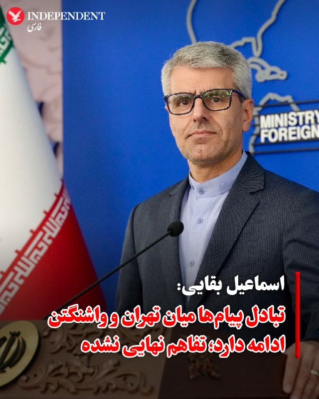

♦️ اسماعیل بقایی، سخنگوی وزارت خارجه جمهوری اسلامی، روز جمعه هشتم خرداد، در گفتگو با صداوسیما اعلام کرد که تبادل پیام‌ها میان تهران و واشنگتن ادامه دارد. بقایی تاکید کرد که متن تفاهم‌نامه هنوز نهایی نشده است. بقایی همچنین با اشاره به گفته‌های ترامپ درباره بازگشایی تنگه هرمز و برقرار نشدن سازوکار اخذ عوارض، گفت تصمیمات درباره این آبراهه تنها از سوی ایران و عمان گرفته خواهد شد.

سخنگوی وزارت خارجه، با تکرار مواضع جمهوری اسلامی بار دیگر تاکید کرد که در حال حاضر تمرکز بر پایان دادن به جنگ است و مذاکره‌ای درباره برنامه هسته‌ای در جریان نیست.
‌🇸🇦 Indypersian

🤖 @VahidOOnLine

## VahidOOnLine — post 242800

  

به گزارش وال‌استریت ژورنال، امارات متحده عربی در روزهای ابتدایی جنگ و حتی تا یک روز پس از اعلام آتش‌بس، ده‌ها حمله هوایی در ایران انجام داده است.
به گفته منابع آگاه، دامنه این حملات بسیار گسترده‌تر از چیزی بوده که پیش‌تر گزارش شده بود.

بر اساس این گزارش، این موضوع نشان می‌دهد امارات متحده عربی در مقایسه با برخی کشورهای منطقه خلیج‌فارس، رویکردی تهاجمی‌تر و همسو با منافع راهبردی خود اتخاذ کرده است.
‌🏁 🇬🇧 IranintlTV

🤖 @VahidOOnLine

## VahidOOnLine — post 242799

  

مهدی خانعلی‌زاده، عضو تیم رسانه‌ای هیات مذاکره‌کننده جمهوری اسلامی، نوشت که در متن تفاهم احتمالی هشت بند از ۱۰ بند بیانیه شورای عالی امنیت ملی که به تایید مجتبی خامنه‌ای رسیده، رعایت نشده و زیر پا گذاشته شده است.

او افزود که تفاهم‌نامه کنونی برخلاف بیانیه آتش‌بس شورای عالی امنیت ملی است و مشخص شده که اساسا مذاکرات پسااسلام‌آباد، بر مبنای شروط رهبری انجام نشده است.
‌🏁 🇬🇧 IranintlTV

🤖 @VahidOOnLine

## VahidOOnLine — post 242798

  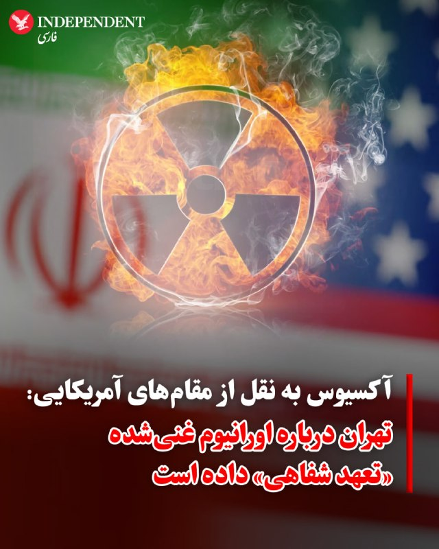

♦️ در پی اعلام بخش‌هایی از توافق احتمالی میان تهران و واشنگتن از سوی دونالد ترامپ، آکسیوس به نقل از «مقام‌های آمریکایی» اعلام کرد که مقام‌های جمهوری اسلامی درباره سرنوشت اورانیوم با غنای بالا «تعهد کتبی» داده‌اند. با این‌حال این مقام‌ها تاکید کردند که آن‌چه مهم است مواردی است که در اتاق مذاکره و پس از شروع رسمی مذاکرات مورد توافق قرار بگیرد.

ترامپ پیش‌تر در پیامی در شبکه اجتماعی تروث‌سوشال اعلام کرد که آمریکا با همکاری و هماهنگی جمهوری اسلامی، این مواد که زیر آوار تاسیسات هسته‌ای ایران قرار گرفته‌اند را خارج کرده و با نظارت سازمان انرژی اتمی، نابود خواهد کرد.

در مقابل، خبرگزاری فارس، به نقل از «منابع آگاه»، این گفته را رد کرد و تاکید کرد که بندی درباره برنامه هسته‌ای در تفاهم‌نامه مورد بحث وجود ندارد.
‌🇸🇦 Indypersian

🤖 @VahidOOnLine

## VahidOOnLine — post 242797

  

محمد مخبر، مشاور رهبر کشته‌شده جمهوری اسلامی گفت: «داغ رهبر شهید در دل مردم هرگز سرد نخواهد شد و رهبری در دل مردم جان و عمق گرفته بود و کسانی که او را دیده و درک کرده‌اند، امکان ندارد این داغ از دلشان برود.»

او در خصوص مذاکرات با آمریکا افزود: «ما هیچ اطمینانی به آمریکایی‌ها نداریم، اما دیپلماسی نیز بخشی از جنگ است.»
‌🏁 🇬🇧 IranintlTV

🤖 @VahidOOnLine

## VahidOOnLine — post 242796

  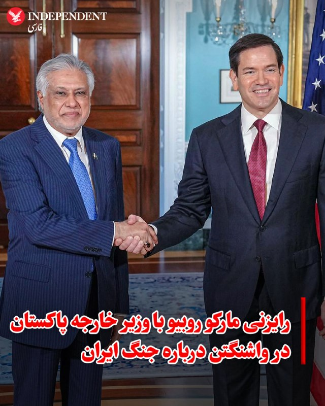

♦️ به گفته وزارت امور خارجه آمریکا، مارکو روبیو، وزیر امور خارجه و مشاور امنیت ملی دونالد ترامپ، روز جمعه، هشتم خرداد با اسحاق دار، وزیر امور خارجه و معاون نخست‌وزیر پاکستان، درباره جنگ با ایران گفتگو کرد. پاکستان یکی از میانجی‌های اصلی در مذاکرات میان ایالات متحده و جمهوری اسلامی برای دست‌یابی به یک توافق رسمی آتش‌بس موقت بوده است.

تامی پیگات، سخنگوی وزارت امور خارجه آمریکا، در بیانیه‌ای درباره این دیدار که در واشنگتن برگزار شد، اعلام کرد: «وزیر امور خارجه از نقش سازنده‌ای که پاکستان در راستای تحقق چشم‌انداز رئیس‌جمهوری ترامپ برای صلح در خاورمیانه و همچنین تلاش‌های میانجی‌گرانه این کشور با ایران ایفا می‌کند، تشکر کرد.»
‌🇸🇦 Indypersian

🤖 @VahidOOnLine

## VahidOOnLine — post 242795

  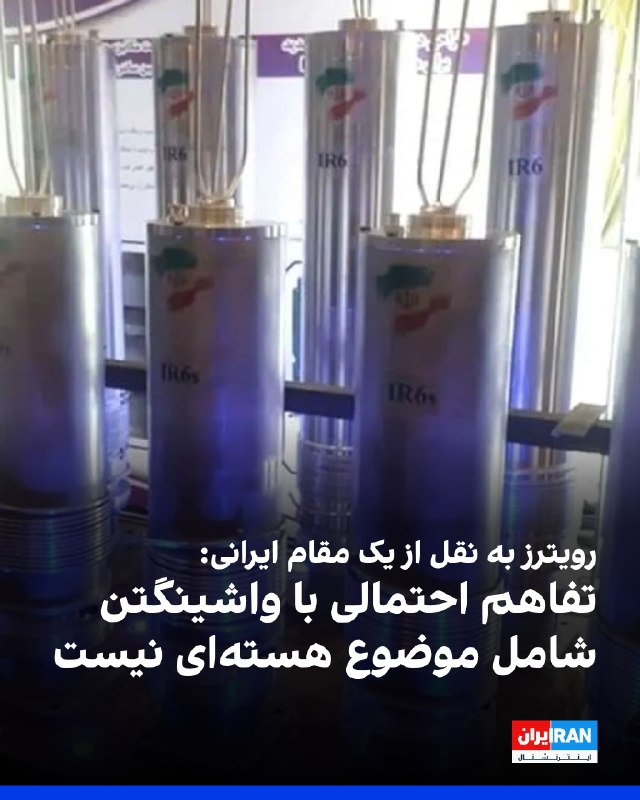

رویترز به نقل از یک مقام ارشد جمهوری اسلامی گفت اظهارات دونالد ترامپ درباره ذخایر اورانیوم با غنای بالای ایران صحت ندارد.

این مقام ارشد جمهوری اسلامی همچنین افزود تفاهم‌نامه احتمالی میان تهران و واشینگتن شامل هیچ‌گونه موضوع مرتبط با پرونده هسته‌ای نیست.

این مقام ارشد جمهوری اسلامی گفت که میان تهران و واشینگتن یک تفاهم سیاسی حاصل شده، اما این توافق هنوز نهایی نشده است.
‌🏁 🇬🇧 IranintlTV

🤖 @VahidOOnLine

## VahidOOnLine — post 242794

  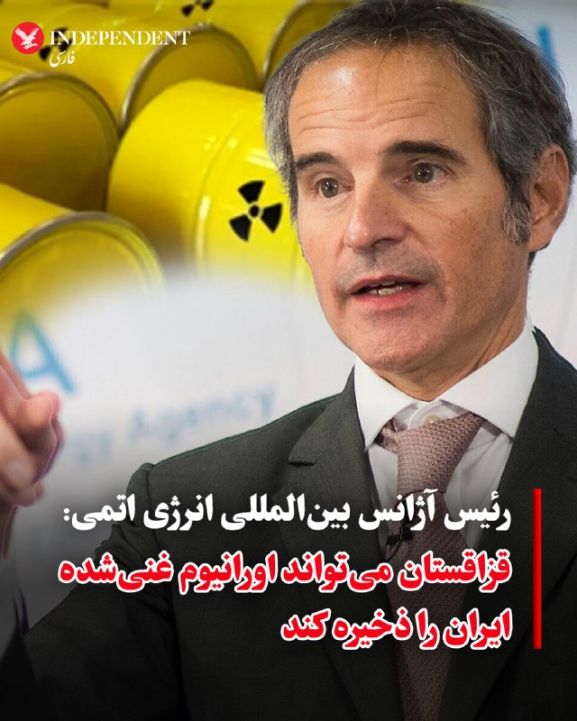

♦️به گفته رافائل گروسی، رئیس آژانس هسته‌ای سازمان ملل متحد، قزاقستان مایل است در صورت دستیابی به توافق میان واشنگتن و تهران، ذخیره اورانیوم غنی‌شده ایران را که در آستانه سطح تسلیحاتی قرار دارد، در خاک خود ذخیره کند.

رافائل گروسی، رئیس آژانس بین‌المللی انرژی اتمی (IAEA) در گفتگو با روزنامه فایننشال تایمز اعلام کرد که قاسم جومارت توکایف، رئیس‌جمهور قزاقستان، این پیشنهاد را در جریان سفر این هفته او به آستانه مطرح کرده است.

قزاقستان در حال حاضر میزبان یک «بانک بین‌المللی اورانیوم با غنای پایین» است که تحت نظارت‌های جهانی اداره می‌شود؛ هدف این بانک، تضمین تامین سوخت نیروگاه‌های کشورهای عضو آژانس و همچنین پیشگیری از گسترش سلاح‌های هسته‌ای است.

گروسی با ابراز این باور که چنین ترتیبی می‌تواند مورد پذیرش ایران و آمریکا قرار گیرد، افزود: «ما مکانی را در اختیار داریم که این مواد [اورانیوم غنی‌شده ایران] می‌تواند به صورت ایمن در آنجا ذخیره شود.»
‌🇸🇦 Indypersian

🤖 @VahidOOnLine

## VahidOOnLine — post 242793

  

خبرگزاری تسنیم، وابسته به سپاه پاسداران، نوشت که تا این لحظه تفاهم نهایی بین جمهوری اسلامی و آمریکا صورت نگرفته و پست ترامپ در تروث سوشال در چارچوب الگوی همیشگی آن در اعلام نظرهای یکسویه و خود بزرگ‌بینانه است.

تسنیم افزود: «اصرار ترامپ مبنی بر عدم پرداخت پول‌های بلوکه شده، صرفا سوءظن تهران نسبت به جدیت آمریکا را تشدید می‌کند.»

رسانه سپاه نوشت که اظهارات دونالد ترامپ درباره برداشتن محاصره دریایی ایران را باید با تردید نگریست و البته اگر واقعا در عمل انجام شود، تازه به منزله توقف یکی از موارد نقض آتش‌بس است؛ زیرا از ابتدا نباید محاصره‌ای صورت می‌گرفت.
‌🏁 🇬🇧 IranintlTV

🤖 @VahidOOnLine

## VahidOOnLine — post 242792

🗣روایت شما از بحران اقتصادی و زندگی در آتش‌بس- جمعه ۸ خرداد:

🔹از کاشان: واقعا وضعیت افتضاحه، اصلا نمی‌شه زندگی کرد، مدام منتظر یک اتفاقیم که این وضعیت تموم شه؛ داره بهترین سال‌های عمرمون این‌جوری می‌گذره، خیلی سخته.

🔹هنوز که هنوزه واسه جاویدنامان اشک می‌ریزیم. وقتی خودم رو جای خانواده‌های این عزیزان می‌ذارم قلبم به درد میاد. نباید این خون‌ها پایمال بشه.

🔹از لار پیام می‌دم، زندگی خیلی سخت شده، حقوق‌های کارمندها رو سر ماه نمی‌دن و همه چیز بیش از اندازه گرون شده.

🔹چرا ما دهه‌ نودی‌ها باید در گرانی و آرزو به دل ماندن زندگی کنیم؟

🔹از اول هم قرار نبود که آمریکا و اسرائیل رژیم رو برای ما تغییر بدن. این کار خودمونه. بازم هم دستشون درد نکنه. کی ما می‌تونستیم این همه مهره‌ کلیدی رو از سر راه انقلابمون برداریم. نیمه‌ی پر لیوان رو ببینید. کسی برای حکومت نمونده جز سروصدای چند ارزشی.

🔹گفتن جریمه اقساط رو می‌بخشیم ولی الان دارن با چند برابر سود دیرکرد اقساط می‌گیرن.

🔹برای یک شانه تخم‌مرغ باید یک روز کار کنی.

🔹خریدهای عادی ماهانه هر دفعه گران‌تر از قبل می‌شه، نمی‌دونم دیگه تا کی می‌شه ادامه داد، اعتراض کنی می‌کشنت، سکوت کنی هم کم‌کم دیگه هیچی برای خوردن نداری.

🔹من یک تئاتری‌ام. شرایط بچه‌های تئاتر خوب نیست. خیلی‌ها خرج بچه و اجاره خانه دارن. تا هر اتفاقی افتاد کرکره تئاتر رو کشیدن پایین. تنها شغلی هستیم در ایران که اتفاقا اصلا شغل محسوب نمی‌شیم. اگر کار نکنم هیچ‌کس نمیاد بگه کجایی. ۴۷ ساله که دیواری کوتاه‌تر از ما نیست.
‌🏁 🇬🇧 IranintlTV

🤖 @VahidOOnLine

## VahidOOnLine — post 242791

  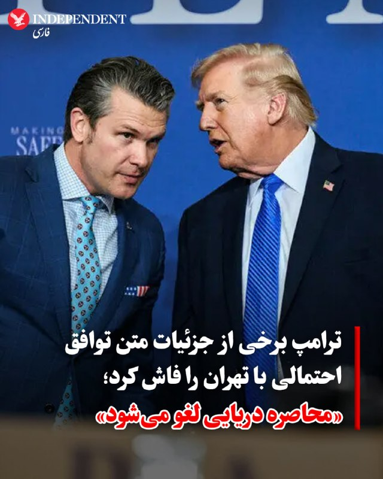

♦️ دونالد ترامپ، رئیس‌جمهوری ایالات متحده با انتشار پیامی در شبکه اجتماعی تروث‌سوشال، شرایط مورد نظر ایالات متحده که به گفته او در متن توافق احتمالی با جمهوری اسلامی ذکر شده را فاش کرد. ترامپ تاکید کرد که ایران باید موافقت کند که هرگز سلاح هسته‌ای نداشته باشد و تنگه هرمز را بدون برقراری هرگونه سازوکار عوارض‌گیری باز کند؛ در مقابل، ایالات متحده نیز محاصره دریایی را لغو می‌کند.

رئیس‌جمهوری آمریکا همچنین تاکید کرد که سرنوشت اورانیوم با غنای بالای ایران که در جریان حملات تابستان گذشته، زیر آوار تاسیسات هسته‌ای در اصفهان، فردو و نطنز باقی‌مانده‌اند نیز مشخص شده و توافق می‌شود که آمریکا با هماهنگی و همکاری جمهوری اسلامی، این مواد را خارج کرده و با نظارت سازمان بین‌المللی انرژی اتمی، نابود کند.

این در حالی است که مقام‌های جمهوری اسلامی در هفته‌های اخیر تاکید کرده بودند که پرونده هسته‌ای در توافق کنونی مطرح نخواهد شد، بلکه بعد از نهایی شدن این توافق و پایان رسمی جنگ، گفتگوها در این‌باره ادامه خواهد یافت.
‌🇸🇦 Indypersian

🤖 @VahidOOnLine

## VahidOOnLine — post 242790

  

محسن محمودی، رییس شورای هماهنگی تبلیغات اسلامی تهران گفت: «ستاد آماده برگزاری مراسمی باشکوه و ده‌ها میلیونی برای رهبر شهیدمان است، اما زمان قطعی این مراسم هنوز مشخص نیست و به محض مشخص شدن اعلام خواهد شد.»

او ادامه داد: «موکب‌ها می‌توانند برای ثبت نام مراجعه کنند تا مراسم باشکوه برگزار شود.»

علی خامنه‌ای، رهبر پیشین جمهوری اسلامی در لحظات آغازین جنگ در ۹ اسفند ۱۴۰۴ کشته شد اما با گذشت حدود سه ماه، وضعیت جنازه و تشییع او هنوز مشخص نیست.
‌🏁 🇬🇧 IranintlTV

🤖 @VahidOOnLine

## VahidOOnLine — post 242789

♦️محسن محمودی، رئیس شورای هماهنگی تبلیغات اسلامی تهران، در گفتگو با صداوسیما اعلام کرد ستاد ویژه‌ای برای آماده‌سازی برگزاری مراسم تشییع تشکیل شده و دستگاه‌های مختلف در حال برنامه‌ریزی و آمادگی برای برگزاری این مراسم هستند.
او با اشاره به اینکه زمان دقیق تشییع هنوز مشخص نشده، گفت مجموعه‌های مختلف در حال فراهم‌سازی شرایط لازم هستند تا در زمان اعلام رسمی، مراسمی «باشکوه» برگزار شود. محمودی همچنین از موکب‌ها خواست برای ارائه خدمات در این مراسم، از هم‌اکنون در سامانه‌های تعیین‌شده ثبت‌نام کنند.
به گفته او، با وجود نامشخص بودن زمان برگزاری، ستاد مربوطه به‌طور کامل فعال است و برنامه‌ریزی‌ها برای برگزاری مراسمی با حضور گسترده در حال انجام است.
‌🇸🇦 Indypersian

🤖 @VahidOOnLine

## VahidOOnLine — post 242788

  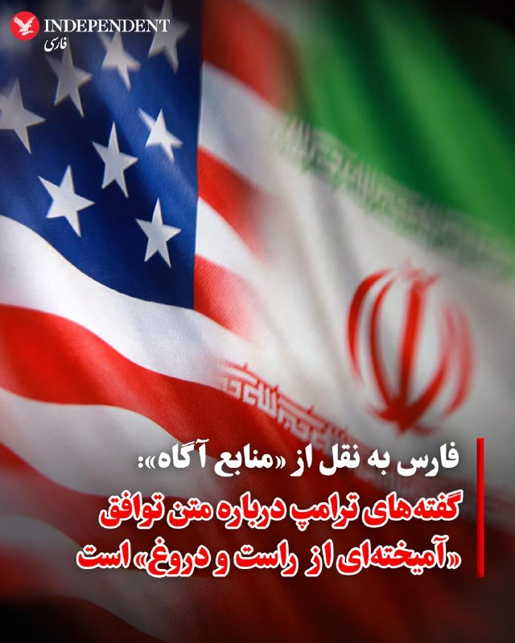

♦️خبرگزاری فارس، نزدیک به سپاه پاسداران، روز جمعه هشتم خرداد، در واکنش به پیام دونالد ترامپ که جزئیاتی درباره توافق احتمالی میان تهران و واشنگتن را مطرح کرده بود، به نقل از «منابع آگاه»، این پیام رئیس‌جمهوری آمریکا را «آمیخته‌ای از راست و دروغ» خواند.

فارس به نقل از این منابع که هویت آن‌ها اعلام نشده، متن توافق را در قالب «تعهد در برابر تعهد» توصیف کرد و در حالی‌که ترامپ اعلام کرده بود که تصمیم نهایی خود را پس از جلسه در اتاق وضعیت کاخ سفید اتخاذ خواهد کرد، مدعی شد که جمهوری اسلامی هنوز تصمیم قطعی درباره توافق نگرفته و متن تدوین شده، «در مراحل نهایی تصویب» در ایران قرار دارد.

این منابع گفته‌های ترامپ درباره بازگشایی تنگه هرمز بدون دریافت عوارض و نابودی اورانیوم با غنای بالا را رد کرد و گفت این موارد در متن توافق وجود ندارد. فارس هم‌چنین اعلام کرد که در متن توافق، «پرداخت فوری ۱۲ میلیارد دلار» از دارایی‌های مسدودشده ایران مطرح شده است.
‌🇸🇦 Indypersian

🤖 @VahidOOnLine

## VahidOOnLine — post 242787

  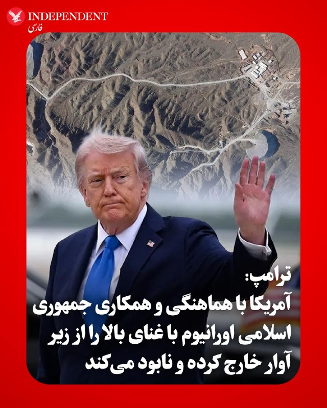

♦️دونالد ترامپ، رئیس‌جمهوری ایالات متحده با تشریح جزئیاتی از توافق احتمالی میان تهران و واشنگتن، روز جمعه هشتم خرداد اعلام کرد که استخراج اورانیوم با غنای بالا که در سه سایت هسته‌ای نطنز، اصفهان و فردو مدفون شده‌اند، از سوی آمریکا و با هماهنگی و همکاری جمهوری اسلامی انجام خواهد شد.

ترامپ در پیامی که در شبکه اجتماعی تروث سوشال منتشر کرد، نوشت: «اورانیوم غنی‌شده که گاهی از آن به عنوان «گرد و غبار هسته‌ای» یاد می‌شود و در اعماق زمین زیر کوه‌های عملا فروریخته (ناشی از حمله قدرتمند بمب‌افکن‌های ما در ۱۱ ماه پیش) قرار دارد، توسط ایالات متحده (که توافق شده تنها کشوری است که در کنار چین توانایی مکانیکی انجام این کار را دارد) با هماهنگی و همکاری نزدیک با جمهوری اسلامی ایران و همچنین آژانس بین‌المللی انرژی اتمی، از زیر خاک بیرون کشیده و نابود خواهد شد.»
‌🇸🇦 Indypersian

🤖 @VahidOOnLine

## VahidOOnLine — post 242785

  

خبرگزاری فارس، وابسته به سپاه پاسداران نوشت منابع آگاه ضمن رد ادعاهای تازه دونالد ترامپ درباره توافق احتمالی با جمهوری اسلامی، اظهارات او را «آمیخته‌ای از راست و دروغ» و تلاشی برای نمایش پیروزیِ ساختگی توصیف کرده‌اند. به گفته این منابع، تقریبا برای همه روشن شده که این ادعاها فاقد اعتبار است.

فارس نوشت متن توافق که تحت قالب «تعهد در برابر تعهد» تدوین شده، در مراحل نهایی تصویب در تهران قرار دارد و هنوز تصمیم قطعی اتخاذ نشده است.

فارس نوشت ترامپ مدعی شده تهران موظف است تنگه هرمز را بدون دریافت عوارض باز کند، در حالی که در متن توافق چنین‌بندی وجود ندارد.

خبرگزاری وابسته به سپاه نوشت ترامپ ادعا کرده که جمهوری اسلامی مواد هسته‌ای خود را برمی‌چیند یا نابود می‌کند. منابع آگاه تاکید کرده‌اند که نه‌تنها چنین چیزی در یادداشت تفاهم وجود ندارد، بلکه این ادعا اساسا بی‌اساس است.

فارس نوشت که مهم‌ترین بخش توافق که ترامپ به آن اشاره‌ای نکرده، شرط پرداخت فوری ۱۲ میلیارد دلار از دارایی‌های بلوکه‌شده است.
‌🏁 🇬🇧 IranintlTV

🤖 @VahidOOnLine

## VahidOOnLine — post 242784

  

ابراهیم رضایی، سخنگوی کمیسیون امنیت ملی مجلس گفت: «ما مخالف تعلیق غنی‌سازی یا اعطای مواد هسته‌ای به دشمن هستیم. چرا که دیگر آن دوره گذشته است.»
او افزود: «جنگ در همه جبهه‌ها به‌ویژه لبنان باید پایان یابد. دشمن باید محاصره دریایی را بردارد و مدیریت ما را در تنگه هرمز به رسمیت بشناسد.»

او ادامه داد: «مذاکرات جاری را از جنس مذاکرات گذشته نمی‌بینیم که یک امتیازی بدهیم و یک امتیازی بگیریم. بلکه ما خود را پیروز می‌دانیم و معتقد هستیم که خواسته‌های حداکثری خود را باید از دشمن مطالبه کنیم.»
‌🏁 🇬🇧 IranintlTV

🤖 @VahidOOnLine

## WithYashar — post 12888

خبرگزاری فرانسوی: جارد کوشنر مانع امضای تفاهم‌نامه بین آمریکا و ایران شد
@withyashar

## WithYashar — post 12887

🤣😃

## WithYashar — post 12886

## WithYashar — post 12885

مدیرکل آژانس بین‌المللی انرژی اتمی پیشنهاد داد که قزاقستان اورانیوم غنی‌شده ایران را نگه‌داری کند
@withyashar

## WithYashar — post 12884

لارنس نورمن، خبرنگار وال استریت ژورنال:

این توافقی که ازش صحبت می‌شه فعلاً یه توافق کامل نیست که تمامی مسائل از جمله هسته‌ای رو در بر بگیره
@withyashar

## WithYashar — post 12882

کاش جای ترامپ دو تا بی بی داشتیم البته همون یدونشم کارو در میاره .این کله زرد به خاطر پول زرد میکنه اخرش

## WithYashar — post 12881

کاش جای ترامپ دو تا بی بی داشتیم البته همون یدونشم کارو در میاره .این کله زرد به خاطر پول زرد میکنه اخرش

## WithYashar — post 12880

خب دیگه عمو یاشار با پای پیاده میریم نه با ترامپ

## WithYashar — post 12879

خب دیگه عمو یاشار با پای پیاده میریم نه با ترامپ

## WithYashar — post 12878

## WithYashar — post 12877

پرزیدنت ترامپ در اتاق وضعیت کاخ سفید مستقر شد.
تصمیم‌گیری نهایی درباره مذاکرات با رژیم ایران در دستور کار است.
نیویورک پست: واشینگتن برای گام‌های بعدی آماده می‌شود.
@withyashar

## WithYashar — post 12876

به نظر میاد قاهره کنسل شد مارو وسط راه پیاده کرد

## WithYashar — post 12875

به نظر میاد قاهره کنسل شد مارو وسط راه پیاده کرد

## WithYashar — post 12874

  <a href="https://t.me/withyashar/12874" target="_blank">📎 Download file</a>

🌐 @withyashar

🌐 instagram.com/yashar

## WithYashar — post 12873

فارس: متن توافق که تحت قالب «تعهد در برابر تعهد» تدوین شده، در مراحل نهایی تصویب در ایران قرار دارد و هنوز تصمیم قطعی اتخاذ نشده است.
@withyashar
کلان رژیم جمهوری اسهالی‌تو کاره فیفتی فیفتیه 🥴🤣

## WithYashar — post 12872

فارس : ترامپ تا نیمی از پول رو نداده همه چیز باد هوا است
@withyashar 🤣

## WithYashar — post 12871

خبرگزاری فارس: ادعاهای ترامپ دروغه و فعلاً خبری از توافق نیست.
@withyashar

## WithYashar — post 12870

  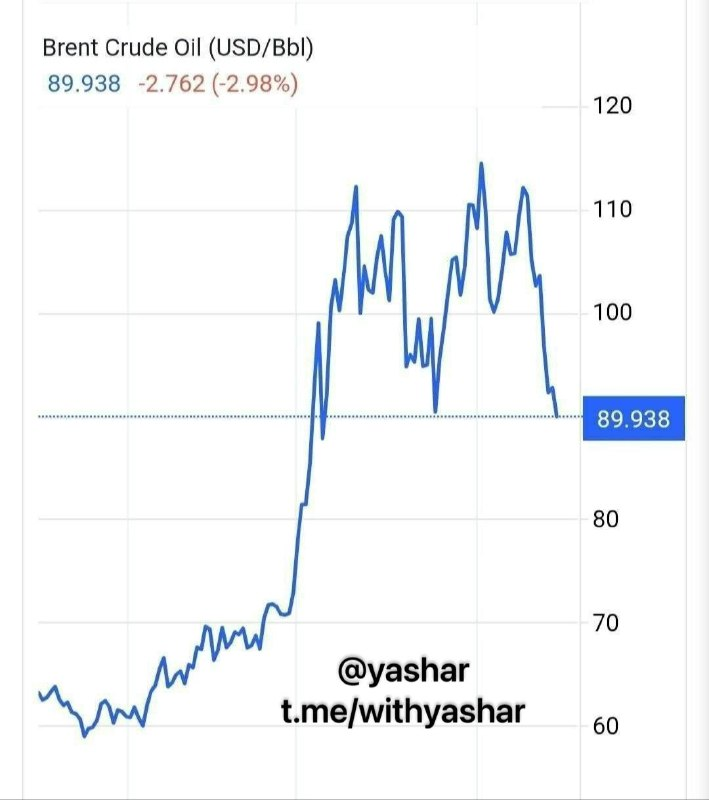

پس از پست ترامپ در تروث سوشال، قیمت نفت برنت برای اولین بار پس از 50 روز به زیر 90 دلار در هر بشکه رسید.
@withyashar

## WithYashar — post 12869

اتاق جنگ با یاشار : ریلکس‌ باشید ترامپ در هر صورت کار رو در میاره ولی حامله میکنه 🤣🙌🏾 داریم میریم قاهره

## WithYashar — post 12868

خبرنگارهای نزدیک به کاخ سفید می‌گویند: ترامپ منظورش را در پستش اشتباه بیان کرده بود؛ او در واقع پایان محاصره دریایی علیه ایران را اعلام نکرده.

بلکه منظورش این بوده که اگر ایران با این شروط موافقت کند، آن محاصره لغو خواهد شد.
@withyashar 🥴

## mwarmonitor — post 9896

📌امارات متحده عربی در طول جنگ، در هماهنگی با آمریکا و اسرائیل، ده‌ها حمله هوایی علیه ایران انجام داد - وال استریت ژورنال

@mwarmonitor

## mwarmonitor — post 9895

🔴 تانکر تارکرز: در روزهای اخیر، نفتکش‌ها در امتداد ساحل ایران و در تأسیسات دریایی اقدام به بارگیری نفت خام و انواع فرآورده‌های پالایش‌شده کرده‌اند. امروز (۲۹ مه ۲۰۲۶) نیز شاهد بارگیری یک نفتکش بسیار بزرگ (VLCC) به میزان دو میلیون بشکه نفت خام هستیم.

@mwarmonitor

## mwarmonitor — post 9894

🔴یک منبع مطلع به من گفت که پست ترامپ در Truth Social درباره لغو محاصره، در واقع اولین شرط قبل از رفتن به مراحل بعدی تفاهم بوده است.

🔸طبق گفته این منبع، طرف ایرانی اصرار داشته که ابتدا یک اعلام عمومی رسمی انجام شود. ترامپ به نظر می‌رسد این موضوع را به‌عنوان یک مسئله فرعی مطرح کرده، در حالی که تهران آن را یک اقدام مهم برای ایجاد اعتماد قبل از ورود به پرونده‌های حساس‌تر می‌داند.

🔹تا این لحظه هیچ بحث مستقیمی درباره پرونده هسته‌ای انجام نشده است. انتظار می‌رود روند به‌تدریج و از طریق یک تفاهم‌نامه (MoU) پیش برود، به‌طوری که در هر مرحله، یک اقدام متقابل از سوی طرف مقابل انجام شود.

🔸همان منابع می‌گویند که اعلام آتش‌بس بین حزب‌الله و اسرائیل نیز به‌عنوان بخشی از چارچوب گسترده‌تر در حال شکل‌گیری مورد انتظار است. علی هاشم خبرنگار الجزیره

@mwarmonitor

## mwarmonitor — post 9893

🔴 دونالد ترامپ: ​«ایران باید موافقت کند که هرگز سلاح یا بمب هسته‌ای نخواهد داشت. تنگه هرمز باید فوراً، بدون هیچ‌گونه عوارض (حق عبور)، برای تردد نامحدود کشتیرانی در هر دو جهت باز شود. تمام مین‌های دریایی (بمب‌ها)، در صورت وجود، نابود خواهند شد (ما تعداد زیادی…

## mwarmonitor — post 9892

🔴لارنس نورمن خبرنگار وال‌استریت ژورنال ؛ بار دیگر: توافق بر سر یک تفاهم‌نامه (MoU) به معنای توافق نهایی نیست که همه مسائل، از جمله موضوع هسته‌ای را پوشش دهد.

🔹این بخش در واقع «بخش آسان‌تر» است، دقیقاً به این دلیل که بسیاری از مسائل به آینده موکول (به تعویق) شده‌اند.

🔸اما اگر به‌طور منطقی این دیدگاه را داشته باشید که ممکن است هرگز یک توافق نهایی شکل نگیرد، این به این معنا نیست که یک چارچوب توافق یا MoU وجود نخواهد داشت.

@mwarmonitor

## mwarmonitor — post 9891

🔴رئیس‌جمهور ترامپ در حال حاضر به سمت اتاق وضعیت (Situation Room) می‌رود تا تصمیم بگیرد آیا توافق با ایران را بپذیرد یا نه؛ توافقی که می‌تواند شامل بازگشایی تنگه هرمز، لغو محاصره آمریکا علیه بنادر ایران، و همچنین خارج کردن و نابود کردن اورانیوم غنی‌شده تهران باشد. نیویورک پست

@mwarmonitor

## mwarmonitor — post 9890

بله کله زرد توافق کرد

## mwarmonitor — post 9889

🔴 دونالد ترامپ: ​«ایران باید موافقت کند که هرگز سلاح یا بمب هسته‌ای نخواهد داشت. تنگه هرمز باید فوراً، بدون هیچ‌گونه عوارض (حق عبور)، برای تردد نامحدود کشتیرانی در هر دو جهت باز شود. تمام مین‌های دریایی (بمب‌ها)، در صورت وجود، نابود خواهند شد (ما تعداد زیادی…

## mwarmonitor — post 9888

🔴 دونالد ترامپ:

​«ایران باید موافقت کند که هرگز سلاح یا بمب هسته‌ای نخواهد داشت. تنگه هرمز باید فوراً، بدون هیچ‌گونه عوارض (حق عبور)، برای تردد نامحدود کشتیرانی در هر دو جهت باز شود. تمام مین‌های دریایی (بمب‌ها)، در صورت وجود، نابود خواهند شد (ما تعداد زیادی از این مین‌ها را از طریق انفجار، با مین‌روب‌های زیردریایی فوق‌العاده خود پاکسازی کرده‌ایم. ایران کار حذف و/یا انفجار فوری هرگونه مین باقی‌مانده را که تعدادشان زیاد نخواهد بود، کامل خواهد کرد!). کشتیرانی‌هایی که به دلیل محاصره دریایی شگفت‌انگیز و بی‌سابقه ما در تنگه گرفتار شده بودند و این محاصره اکنون برداشته خواهد شد، می‌توانند فرآیند "بازگشت به خانه" را آغاز کنند! از طرف من، رئیس‌جمهور محبوبتان، به همسران، شوهران، والدین و خانواده‌های خود سلام برسانید!
​مواد غنی‌شده که گاهی اوقات از آن‌ها به عنوان "گرد و غبار هسته‌ای" یاد می‌شود و در اعماق زمین زیر کوه‌های عملاً فروریخته قرار دارند—که ناشی از حمله ۱۱ ماه پیش بمب‌افکن قدرتمند B2 ما بوده و روی آن جا خوش کرده است—توسط ایالات متحده (که توافق شده تنها کشوری است که در کنار چین توانایی مکانیکی انجام این کار را دارد!)، با هماهنگی و همکاری نزدیک با جمهوری اسلامی ایران، به علاوه آژانس بین‌المللی انرژی اتمی، از زیر خاک بیرون آورده و نابود خواهد شد.
​تا اطلاع ثانوی هیچ پولی رد و بدل نخواهد شد. در مورد موارد دیگر که از اهمیت بسیار کمتری برخوردارند، توافق شده است. من هم‌اکنون در "اتاق وضعیت" (Situation Room) جلسه خواهم داشت تا تصمیم نهایی را اتخاذ کنم. از توجه شما به این موضوع سپاسگزارم!

رئیس‌جمهور دونالد جی. ترامپ»

@mwarmonitor

## mwarmonitor — post 9887

  <a href="telegram/content/mwarmonitor_9887_1780076842.mp4" target="_blank">🎬 Download video</a>

🔸موشک بالستیک میان‌برد روسی «اورِشنیک» (Oreshnik) با قطعات قدیمی مونتاژ شده است.

🔹کارشناسان اوکراینی بقایای موشک بالستیک جدید روسیه موسوم به «اورشنیک» را بررسی کرده‌اند و به این نتیجه رسیده‌اند که این موشک با استفاده از قطعات قدیمی ساخته شده است.

🔸به گفته متخصصان، بسیاری از اجزا حداکثر تا سال‌های ۲۰۱۶–۲۰۱۷ تولید شده‌اند؛ از جمله قطعات روسی و بلاروسی (از کارخانه Integral در بلاروس). حتی یکی از واحدها تاریخ تولید ۲۰۱۷ را به‌طور واضح روی خود دارد.

🔸با وجود آن‌که تبلیغات روسیه «اورشنیک» را یک سلاح پیشرفته و مدرن معرفی می‌کند، این موشک تا حد زیادی از قطعات قدیمی مونتاژ شده است.

🔹همچنین قطعات خارجی ساخت چین، ایالات متحده آمریکا، ژاپن، آلمان و سوئیس در بقایای این موشک شناسایی شده است.

@mwarmonitor

## mwarmonitor — post 9886

  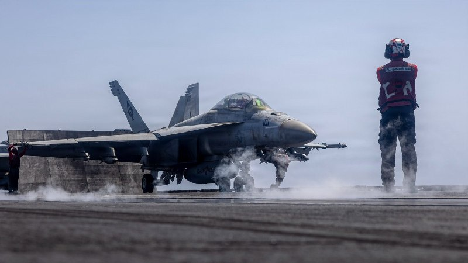

🔸نیروهای ایالات متحده آمریکا به اجرای محاصره علیه ایران ادامه می‌دهند.
تا تاریخ ۲۹ مه، ۱۱۵ کشتی تجاری تغییر مسیر داده شده‌اند تا اطمینان حاصل شود هیچ‌گونه تجارت دریایی وارد بنادر ایران نشده یا از آن خارج نشود.

@mwarmonitor

## mwarmonitor — post 9885

📝 «رادیو شب‌بخیر کوچولو در منهتن؛ پشت‌پرده لالایی‌های سفارشی فرناز فصیحی برای ذبح حقیقت»

🔰نیویورک‌تایمز روزگاری اعتبار می‌فروخت، اما امروز با سقوط به عمق توهم، به گهواره‌ای برای دفن حقیقت تبدیل شده است؛ برجی در منهتن که بخش خاورمیانه‌اش دپارتمان راستی‌آزمایی را منحل کرده تا اتاق تخیل و الهام بسازد. در این سقوط آزاد، هر زمان که نام قصه فرناز فصیحی از رادیو شب بخیر کوچولو به میان می‌آید، مخاطب می‌داند که باید چشم بر واقعیت‌های تلخ و خونین کف خیابان ببندد و به لالاییِ منابع ناشناس، ارواح سرگردانِ درگاه‌های حکومتی و روایت‌های مهندسی‌شده‌ای گوش بسپارد که در آن قطع کردن اینترنت صرفاً برای استراحت چشم بچه‌هاست و معترضان بازیگران یک تئاتر خیابانی! این روزنامه‌نگاریِ سفارشی و جهت‌دار، شرف قلم را فدای دسترسی‌های دیپلماتیک پنهان کرده و چنان تشت اعتبارتان را از بام انداخته که مردم خاورمیانه به تیترهای مندرج در صفحاتتان صرفاً زهرخند می‌زنند. شب بخیر جهان اول، شب بخیر منابع خیالی، و شب بخیر حقیقتی که در تاروپود این قصه‌های شبانه ذبح شدی.هر زمان به نام این «خبربمال سفارشی» برخوردید، فوراً فرار کنید؛ چرا که اگر پای گزارش‌های تخیلی‌اش بنشینید، ناگهان چشم باز می‌کنید و می‌بینید در اوج جنگ و بلک‌اوت اینترنتی، در حال نوشیدن چای دیپلماتیک با احمدی‌نژاد پساجنگ هستید!

@mwarmonitor

## mwarmonitor — post 9884

🔴شرکت آمریکایی Chevron: ما ۶ کشتی در تنگه هرمز داریم و هیچ‌گونه عوارض عبور پرداخت نخواهیم کرد.

@mwarmonitor

## mwarmonitor — post 9882

  

📝 واقعاً باید به این حسنِ انتخابِ روزگار در چیدن مهره‌های اطرافمان تبریک گفت؛ کلکسیونی بی‌نظیر از نوابغِ صلح‌طلب که معتقدند امتیازات را باید با موشک گرفت و از فردای هر توافقی، بند پوتین‌ها را برای جنگ بعدی محکم کرد! در این میان، سهمِ پیشانی‌نوشتِ ما ایرانی‌ها هم شده تماشای یک مسابقه جذابِ «کی از همه مجنون‌تره؟» میان داخلی و غریبه؛ از این طرف با تئوریسین‌های دیپلماسیِ راکتی و همسایگانِ همیشه دستمال به دست، و از آن طرف با دونالد ترامپ و شرکا که انگار همگی دسته‌جمعی در یک کلینیکِ فوق‌تخصصیِ توهم فارغ‌التحصیل شده‌اند و حالا برای پیاده کردن پروژه‌های پایان‌نامه‌شان، قرعه کشی کرده و دقیقاً روی اعصاب و زندگی ما نشانه‌ رفته‌اند.

@mwarmonitor

## mwarmonitor — post 9881

🔴دونالد ترامپ در سوشال تروث

«جیل بایدن اکنون بالاخره اعتراف کرده است که نمی‌دانسته در طول مناظره ریاست‌جمهوری فوق‌العاده و پربیننده سال ۲۰۲۴ ما، چه بلایی سر "جوی خواب‌آلود" آمد؛ مناظره‌ای که در آن جو دقیقاً در بالاترین سطح از استانداردهای مناظره عمل نمی‌کرد. او گفت با خود فکر کرده که جو دچار "سکته مغزی" یا اتفاقات بسیار بد دیگری شده است، و با این حال، هرگز برای کمک به شوهرِ گرفتار خود به روی صحنه ندوید؛ کاری که هر زن خوبی انجام می‌دهد. تنها چیزی که او فراموش کرد به آن اشاره کند این بود که من قبل از فروپاشیِ تقریباً کامل او، چقدر عالی عمل می‌کردم. به عبارت دیگر، همان‌طور که بسیاری پرسیده‌اند، آیا عملکرد قوی من در آن مناظره باعث شد که او خیلی ساده و واضح "کم بیاورد" (قفل کند) و به شکست ننگینش منجر شود، یا دلایل دیگری در کار بود؟ هیچ‌کس دیگری پاسخ این را نمی‌داند، اما من می‌دانم!!!»

@mwarmonitor

## FoxNewsTwitter — post 342403

  <a href="telegram/content/FoxNewsTwitter_342403_1780076845.mp4" target="_blank">🎬 Download video</a>

Fox News (Twitter/X)

President Trump and NYC Mayor Zohran Mamdani are on the same page about at least one thing: they both want the New York Knicks to win an NBA championship.

"I'll say one of the few things the president and I agree on is not just that New York City is the greatest city in the world, but that we do want the Knicks to win the championship."

Mamdani also says if Trump wants to attend a game, he'll let him enjoy it like any other fan.

## FoxNewsTwitter — post 342402

  <a href="telegram/content/FoxNewsTwitter_342402_1780076847.mp4" target="_blank">🎬 Download video</a>

Fox News (Twitter/X)

“I’ll kill your whole f–king family. Your whole f–king family is dead. Your children, your wife, all dead."

A left-wing activist in Newark was caught on camera shouting those words at an unmasked ICE officer as protests outside the Delaney ICE facility turned chaotic.

Acting AG Todd Blanche is now firing back, promising that the "disgusting" activist will be caught and charged, emphasizing that threatening a federal officer and their family is a federal crime.

“That is disgusting ... and we see his face and I promise you we will find him, and when we find him, we will arrest him."

## FoxNewsTwitter — post 342401

  <a href="telegram/content/FoxNewsTwitter_342401_1780076850.mp4" target="_blank">🎬 Download video</a>

Fox News (Twitter/X)

NEW: President Trump defends Jaxson Dart against the fierce backlash he's facing following his recent rally appearance, showering the New York Giants quarterback with praise while brushing off critics.

"He's a conservative guy. He said, 'I love you, sir.'"

"When Jaxson gets harassed a little bit, he's also loved more, because we have more people than they do."

Watch the full interview on @MyViewFNC tomorrow at 9 pm ET.

## FoxNewsTwitter — post 342400

  <a href="telegram/content/FoxNewsTwitter_342400_1780076852.mp4" target="_blank">🎬 Download video</a>

Fox News (Twitter/X)

A furious customer — being labeled 'Chipotle Karen' — launched a burrito bowl straight into an employee’s face after a heated argument over her order.

A Chipotle employee was left covered in food after an angry customer allegedly launched her order directly at the worker’s face during a confrontation inside the California restaurant.

The moment was caught on camera. Now Santa Ana Police are asking for help identifying the woman, who investigators say took off after the assault.

## FoxNewsTwitter — post 342399

  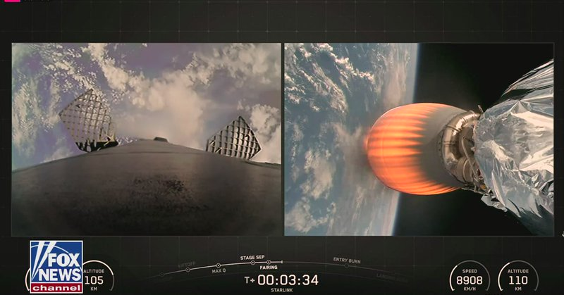

Fox News (Twitter/X)

WATCH LIVE: SpaceX launches Falcon 9 rocket from Florida https://twitter.com/i/broadcasts/1yxBeepDOpWJN

## FoxNewsTwitter — post 342398

  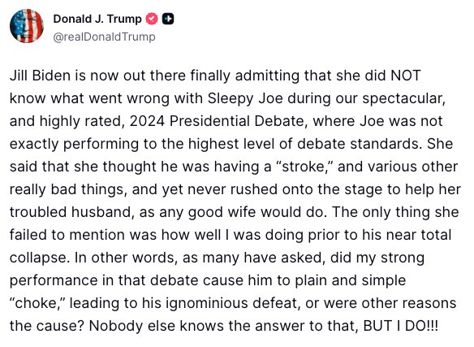

Fox News (Twitter/X)

JUST IN: President Trump launches a scathing attack on Jill Biden after she admitted that she thought her husband was having a "stroke" during their infamous 2024 presidential debate.

“She said that she thought he was having a ‘stroke,’ and various other really bad things, and yet never rushed onto the stage to help her troubled husband, as any good wife would do.”

“As many have asked, did my strong performance in that debate cause him to, plain and simple, ‘choke,’ leading to his ignominious defeat, or were there other reasons? Nobody else knows the answer to that, BUT I DO!!!” https://twitter.com/FoxNews/status/2059806402294542554#m

## FoxNewsTwitter — post 342397

  <a href="telegram/content/FoxNewsTwitter_342397_1780076855.mp4" target="_blank">🎬 Download video</a>

Fox News (Twitter/X)

Early morning PT with America’s bravest.

Secretary of War Pete Hegseth kicks off his day by working out alongside U.S. troops aboard the USS Boxer while docked in Singapore.

## FoxNewsTwitter — post 342396

  <a href="telegram/content/FoxNewsTwitter_342396_1780076858.mp4" target="_blank">🎬 Download video</a>

Fox News (Twitter/X)

WATCH: Secretary Pete Hegseth gives a rousing speech to sailors and Marines aboard the USS Boxer, praising them for being the force behind America’s strength in the conflict with Iran:

“As the President said in the Cabinet meeting... Iran can either do it the right way with a deal across the table, or they can deal with my guy on the left and it happened to be me...”

“But it’s not me. It’s you guys.”

## FoxNewsTwitter — post 342395

  <a href="telegram/content/FoxNewsTwitter_342395_1780076861.mp4" target="_blank">🎬 Download video</a>

Fox News (Twitter/X)

NEW: JPMorgan Chase CEO Jamie Dimon delivers a powerful tribute to American exceptionalism on @MorningsMaria:

“America is still the beacon of light, and the hill is still the arsenal of democracy, the bastion of freedom.”

“I’m quite patriotic in that, and that this country provides safety to the whole world.”

“We have the strongest military in the world, underpinned by the strongest economy in the world.”

@MariaBartiromo

## FoxNewsTwitter — post 342394

  <a href="telegram/content/FoxNewsTwitter_342394_1780076864.mp4" target="_blank">🎬 Download video</a>

Fox News (Twitter/X)

NEW: JPMorgan CEO Jamie Dimon pushes back on NYC Mayor Mamdani’s calls for higher taxes, arguing that politicians should focus on fixing government rather than seeking tax hikes.

“Good policy is free.”

“Don’t try to raise more taxes or spend more money. Sit down and fix policy. And I think you can grow 1% faster. I literally believe that.”

“It’s frustrating. It hurts. It’s embarrassing. And it always hurts the civilians of our country.”

“He’s running a city of 300,000 employees now. He’s never had a job like that.”

“And I’ve seen mayors who’ve failed abysmally because they can’t administer themselves out of a paper bag, or because ideology blinds them to practical, realistic, real-world policy.”

Dimon described his recent meeting with Mamdani as “pleasant,” saying, “I said everything I wanted to say,” and offering that if he could help him, he’d “be happy to do that.”

@MorningsMaria @MariaBartiromo

## pm_afshaa — post 91837

🔴فایننشال تایمز:قزاقستان پیشنهاد کرد که اورانیوم غنی‌شده ایران به این کشور انتقال داده شود

💧 Rainbet.com the #1 Non-KYC Crypto Casino & Sportsbook @rainbetcom

😁 @Pm_Afshaa

## pm_afshaa — post 91836

https://t.me/proxy?server=87.248.129.12&port=15&secret=ee1603010200010001fc030386e24c3add626973636f7474692e79656b74616e65742e636f6d

پروکسی پینگ 100 متصل

💧 Rainbet.com the #1 Non-KYC Crypto Casino & Sportsbook @rainbetcom

😁 @Pm_Afshaa

## pm_afshaa — post 91835

https://t.me/proxy?server=mimecraft4ir.homes&port=25565&secret=ee1603010200010001fc030386e24c3add626973636f7474692e79656b74616e65742e636f6d

پروکسی مخصوص دانلود سرعت بالا

💧 Rainbet.com the #1 Non-KYC Crypto Casino & Sportsbook @rainbetcom

😁 @Pm_Afshaa

## pm_afshaa — post 91834

فارس: ترامپ ادعاهای بی‌اساسی درباره توافق با ایران مطرح کرده، از جمله باز کردن تنگه هرمز بدون عوارض و برچیدن مواد هسته‌ای ایران، در حالی که چنین بندهایی در متن توافق وجود ندارد

💧 Rainbet.com the #1 Non-KYC Crypto Casino & Sportsbook @rainbetcom

😁 @Pm_Afshaa

## pm_afshaa — post 91833

ترامپ: محاصره دریایی ایران برداشته شد 
💧 Rainbet.com the #1 Non-KYC Crypto Casino & Sportsbook @rainbetcom 
😁 @Pm_Afshaa

## pm_afshaa — post 91830

ترامپ: محاصره دریایی ایران برداشته شد 
💧 Rainbet.com the #1 Non-KYC Crypto Casino & Sportsbook @rainbetcom 
😁 @Pm_Afshaa

## pm_afshaa — post 91829

ss://MjAyMi1ibGFrZTMtYWVzLTI1Ni1nY206NXlaTGVmdzhOdHF3LzU4aXJUVzJPcE1zTnV5SmpSNjFCdVJlMmdDb3hqbz06ZG9WL2M3eEEzc28rZjJZalJrMkFKVyt1bHFmNkJQd2hGVWxKQmRLVGFsVT0=@s.api50951.ir:443#PMTV%20NEWS%20%F0%9F%A6%81%E2%98%80%EF%B8%8F

نپسترنت پر سرعت مخصوص اینستا و یوتیوب

💧 Rainbet.com the #1 Non-KYC Crypto Casino & Sportsbook @rainbetcom

😁 @Pm_Afshaa

## pm_afshaa — post 91828

ترامپ: محاصره دریایی ایران برداشته شد

💧 Rainbet.com the #1 Non-KYC Crypto Casino & Sportsbook @rainbetcom

😁 @Pm_Afshaa

## pm_afshaa — post 91827

https://t.me/proxy?server=87.248.129.13&port=15&secret=ee1603010200010001fc030386e24c3add63646e2e79656b74616e65742e636f6d

پروکسی سرعت بالا مخصوص دانلود

💧 Rainbet.com the #1 Non-KYC Crypto Casino & Sportsbook @rainbetcom

😁 @Pm_Afshaa

## pm_afshaa — post 91826

🔴نیویورک پست :ترامپ هم اکنون در اتاق وضعیت کاخ سفید هست و قراره تصمیم خودش برای مذاکره با ایران رو بگیره

💧 Rainbet.com the #1 Non-KYC Crypto Casino & Sportsbook @rainbetcom

😁 @Pm_Afshaa

## pm_afshaa — post 91825

العربیه: ایران می‌خواد اورانیومش رو به چین منتقل کنه؛ البته قبلش یه شرط گذاشته که اونم اینه که چین این اورانیوم رو به آمریکا نده

💧 Rainbet.com the #1 Non-KYC Crypto Casino & Sportsbook @rainbetcom

😁 @Pm_Afshaa

## pm_afshaa — post 91824

ازتون میخوام که برای پدرم کمک کنید بزارید کاناا ما تو این دنیا جز پدرمون کسی رو نداریم مادرم فوت کردن یدونه خواهر کوچیک دارم برادر هم نداریم پشتوانه لخته پدرم در حال حرکت به مغزشون هست صدرصد باید عمل باز بشن مدارک رو ببینید قیمت عمل ۷۰میلیون هست نمیدونیم…

## pm_afshaa — post 91823

ازتون میخوام که برای پدرم کمک کنید بزارید کاناا ما تو این دنیا جز پدرمون کسی رو نداریم
مادرم فوت کردن
یدونه خواهر کوچیک دارم
برادر هم نداریم پشتوانه
لخته پدرم در حال حرکت به مغزشون هست
صدرصد باید عمل باز بشن
مدارک رو ببینید
قیمت عمل ۷۰میلیون هست نمیدونیم واقعا چیکار کنیم
هیچ پشتوانه ای نداریم
برادری کنید برای ما خواهش میکنم ازتون

## pm_afshaa — post 91816

  <a href="telegram/content/pm_afshaa_91816_1780076866.mp4" target="_blank">🎬 Download video</a>

🎬 Video

## iaghapour — post 2642

  

⭕️ آپدیت بزرگ ویندوز ۱۱ منتشر شد؛ پرسرعت‌تر و هوشمندتر!

مایکروسافت به‌تازگی آپدیت جدید ویندوز ۱۱ (نسخه‌های ۲۴H۲ و ۲۵H۲) را با تمرکز بر افزایش سرعت و هوش مصنوعی منتشر کرد.

مهم‌ترین تغییرات این به‌روزرسانی:

🔹 اشتراک‌گذاری صدا: امکان اتصال هم‌زمان دو هدفون بلوتوثی مجزا به یک سیستم برای تماشای فیلم یا گوش دادن به موسیقی.

🔸 دوربین مشترک: دسترسی هم‌زمان چند نرم‌افزار به وب‌کم بدون مسدود شدن تصویر.

🔹 افزایش سرعت و جستجو: ارتقای چشمگیر سرعت منوی استارت و اجرای برنامه‌ها، به همراه امکان پیدا کردن سریع فایل‌ها با جستجوی تنها دو حرف.

🔸 پایش هوش مصنوعی و باتری: نمایش دقیق میزان مصرف پردازنده عصبی (NPU) در تسک‌منیجر و بهینه‌سازی مصرف انرژی لپ‌تاپ‌ها در حالت استندبای.

این آپدیت با رفع خطاهای ناگهانی و بهبود سیستم امنیتی Windows Hello، تجربه بسیار روان‌تری ارائه می‌دهد و در ژوئن ۲۰۲۶ به‌صورت خودکار برای همه کاربران فعال خواهد شد.

🆔 @iAghapour

## DEJradio — post 5110

  <a href="telegram/content/DEJradio_5110_1780076868.mp4" target="_blank">🎬 Download video</a>

🤡
🔺 مراسم حج؛ زیارت پرفشار حجرالاسود، زائرانی که با فنون رزمی و کشتی مهمان خدا می‌شوند در موارد متعدد سلامت و جان خودشان یا دیگران را تهدید می‌کنند.

#حج #زیارت
@DEJradio

## DEJradio — post 5106

  <a href="telegram/content/DEJradio_5106_1780076871.webm" target="_blank">🎬 Download video</a>

👑
🔺 بر اساس اطلاعات دریافتی دژ، یکی از جانفدایان میهن، شایان شکاری ۲۰ ساله است که ۱۸ دی‌ماه ۱۴۰۴ در شهر رشت هدف گلوله سرکوبگران قرار گرفت. او قهرمان کشوری و نایب قهرمان تکواندو باشگاه‌های آسیا بود و در رشته تریبت بدنی در دانشگاه تحصیل می‌کرد.

دژ از مسیر منابع اختصاصی دریافته که حکومت به خانواده او پیشنهاد پرداخت وجه داده بود و اینکه بپذیرند «شهید» شده است اما آنها قبول نکردند.

شایان شکاری و امیرمحمد کرمی، دو عضو تیم‌ملی تکواندوی نوجوانان ایران در سال ۱۴۰۱، در جریان انقلاب ملی ایرانیان به دست نیروهای سرکوب کشته شدند.

#شایان_شکاری #امیرمحمد_کرمی #انقلاب_شیروخورشید
@DEJradio

## DEJradio — post 5105

⭕️ تهران بیش از پیش در تهدیدهای تروریستی در دانمارک دست دارد

سازمان اطلاعاتی دانمارک اعلام کرد جمهوری اسلامی نقشی پررنگ‌تر از پیش در تهدیدهای امنیتی و تروریستی علیه این کشور ایفا می‌کند.
رئیس سازمان امنیت و اطلاعات ملی دانمارک گفت این تهدیدها به‌ویژه متوجه منافع اسرائیلی و یهودی و همچنین مخالفان ایرانی ساکن اروپا، از جمله در دانمارک است.
به گزارش این نهاد امنیتی، سرویس‌های اطلاعاتی جمهوری اسلامی برای برنامه‌ریزی عملیات از شبکه‌های بزهکار و جذب نیرو در اروپا استفاده می‌کنند.
دانمارک همچنین گفت تشدید تنش میان جمهوری اسلامی، اسرائیل و آمریکا در ماه‌های پیشین، بر میزان تهدید در کشورهای شمال و غرب اروپا تاثیر گذاشت.

#خبر #دژ #تروریسم
@DEJradio

## DEJradio — post 5104

⭕️ بریتانیا علیه یک شهروند یونانی به اتهام همکاری با سرویس اطلاعاتی مرتبط با جمهوری اسلامی اعلام جرم کرد

پلیس بریتانیا اعلام کرد یک شهروند ۴۶ ساله یونانی را به اتهام همکاری با یک سرویس اطلاعاتی خارجی متهم کرده است.
به گفتۀ پلیس بریتانیا، گمان می‌رود ارتباطات فرد متهم، مرتبط با نهادهای امنیتی جمهوری اسلامی بوده باشد.
پلیس ضدتروریسم بریتانیا گفت این پرونده در مورد تلاش برای هدف قرار دادن یک روزنامه‌نگار شاغل در شبکۀ تلویزیونی ایران اینترنشنال است.

#خبر #دژ #بریتانیا
@DEJradio

## DEJradio — post 5103

⭕️ ترامپ برای تصمیم پایانی در مورد جمهوری اسلامی به اتاق وضعیت می‌رود

دونالد ترامپ، رئیس جمهوری آمریکا اعلام کرد روز آدینه در اتاق وضعیت کاخ سفید همراه با مشاورانش درمورد توافق احتمالی با جمهوری اسلامی تصمیم پایانی را می‌گیرد.
ترامپ گفت جمهوری اسلامی باید متعهد شود هرگز سلاح هسته‌ای تولید نمی‌کند، تنگۀ هرمز دوباره باز می‌شود و مین‌های دریایی نیز برداشته یا منهدم می‌شود.
رئیس جمهوری آمریکا گفت بر اساس توافق احتمالی، محاصرۀ دریایی آمریکا علیه جمهوری اسلامی لغو می‌شود.
همچنین کشتی‌هایی که در تنگۀ هرمز متوقف شده بودند، روند بازگشت را آغاز می‌کنند.
دونالد ترامپ در مورد ذخایر اورانیوم غنی‌شدۀ جمهوری اسلامی گفت این مواد با هماهنگی تهران و آژانس بین‌المللی انرژی اتمی، از زیر زمین خارج و نابود می‌شود.
ترامپ گفت تنها آمریکا و چین توانایی فنی اجرای چنین عملیاتی را دارند.
او تأکید کرد که فعلا هیچ پولی با تهران رد و بدل نمی‌شود. ترامپ افزود دربارۀ موضوعات دیگر که اهمیت کمتری دارند، توافق به‌دست آمده است.

#خبر #دژ #توافق
@DEJradio

## DEJradio — post 5102

  <a href="telegram/content/DEJradio_5102_1780076871.mp4" target="_blank">🎬 Download video</a>

🚨
🔸 مردم نباید از حکومتشان بترسند؛ حکومت باید از مردم بترسد

#جمهوری_اسلامی #انقلاب_شیروخورشید
@DEJradio

## DEJradio — post 5101

  <a href="telegram/content/DEJradio_5101_1780076873.mp4" target="_blank">🎬 Download video</a>

🎥
🔺 هشدار وزیر جنگ آمریکا به جمهوری اسلامی؛ انتخاب میان توافق یا رویارویی با ارتش آمریکا

پیت هگست، وزیر جنگ آمریکا، در سخنانی خطاب به نیروهای نیروی دریایی این کشور بر عرشه ناو «یواس‌اس باکسر» تأکید کرد جمهوری اسلامی باید میان دستیابی به توافق و مواجهه با توان نظامی آمریکا یکی را انتخاب کند.
هگست با اشاره به مواضع دونالد ترامپ گفت تهران همچنان فرصت دارد از مسیر مذاکره و توافق پیش برود، اما در صورت خودداری از این مسیر، با نیروهای مسلح آمریکا روبه‌رو خواهد شد. وی در سخنان خود آمادگی و توان عملیاتی نیروهای آمریکایی را عامل اصلی بازدارندگی در برابر دشمنان ایالات متحده توصیف کرد.

#زیرنویس #دژ #پیت_هگست
@DEJradio

## DEJradio — post 5100

  <a href="telegram/content/DEJradio_5100_1780076876.mp4" target="_blank">🎬 Download video</a>

🎥
🔥 مردم نباید از حکومتشان بترسند؛ حکومت‌ها باید از مردم بترسند!

#ایران_را_پس_میگیریم
@DEJradio

## DEJradio — post 5099

  <a href="telegram/content/DEJradio_5099_1780076878.webm" target="_blank">🎬 Download video</a>

🔺📢 “ما یک خانواده پنج نفره هستیم، در حال حاضر فقط پدرم که بازنشسته است حقوق داره، مادرم خانه‌دار و سه خواهر و برادر که بعد از جنگ هر سه بیکار شدیم، با بدبختی زندگی می‌کنیم...

پیام دریافتی

#تورم #جنگ
@DEJradio

## DEJradio — post 5098

⭕️ پزشکیان دستور داد کالاهای اساسی و دارو از مسیر کشورهای همسایه و چین تأمین بشود

مسعود پزشکیان، رئیس دولت جمهوری اسلامی خواستار سرعت گرفتن اجرای توافق‌ها با پاکستان، روسیه و جمهوری آذربایجان برای واردات کالاهای مورد نیاز شد.
او در نشست با وزرای اقتصادی، بر گسترش مسیرهای «جایگزین» تجاری و تسریع تأمین کالاهای اساسی و دارو تأکید کرد.
در این نشست همچنین بررسی واردات دارو و برخی اقلام حیاتی از مسیر ریلی چین در دستور کار قرار گرفته است.
پیش‌تر گزارش‌هایی در مورد فروش نفت به چین از طریق مرز زمینی پاکستان منتشر شده بود.
با ادامه محاصرۀ دریایی جمهوری اسلامی در جنوب ایران، جمهوری اسلامی به دنبال راه‌های جایگزین برای گریز از بحران فزایندۀ اقتصادی است.

#خبر #دژ
@DEJradio

## DEJradio — post 5097

⭕️ وال‌استریت ژورنال: پوتین ۲۶ میلیارد دلار در پروژه‌های ضدپیری سرمایه‌گذاری کرد

وال‌استریت ژورنال گزارش داد ولادیمیر پوتینف رئیس جمهوری روسیه پروژه‌ای ۲۶ میلیارد دلاری را برای پیشرفت فناوری‌های ضدپیری، تکثیر اندام‌های حیاتی و پیوند اعضا دنبال می‌کند.
بر اساس این گزارش، کرملین این برنامه را در قالب «طرح ملی افزایش طول عمر» پیش می‌برد و هدف رسمی آن «افزایش امید به زندگی شهروندان روسیه» اعلام شده است.
بنا بر این گزارش، دانشمندان روسی بر فناوری‌هایی از جمله چاپ زیستی بافت‌های زنده و پرورش اندام در بدن خوک‌های اصلاح‌شدۀ ژنتیکی کار می‌کنند.
در این گزارش عنوان شد هدف دانشمندان روسی رسیدن به جایگزینی اندام‌ها تا پایان دهۀ کنونی میلادی است.
وال‌استریت ژورنال همچنین نوشت بخشی از این پروژه زیر نظر ماریا ورونتسوا، دختر ولادیمیر پوتین و میخائیل کووالچوک، از چهره‌های نزدیک به کرملین پیش می‌رود.

#خبر #دژ #پوتین
@DEJradio

## DEJradio — post 5096

⭕️ ورتکسا گزارش داد ۶۵ درصد نفتکش‌ها با سیگنال خاموش، از تنگۀ هرمز عبور می‌کنند

شرکت ورتکسا اعلام کرد در ماه جاری بیش از شصت و پنج درصد نفتکش‌ها با خاموش کردن سیستم شناسایی خودکار از تنگۀ هرمز عبور کردند.
پیش از انسداد تنگۀ هرمز، گزارش‌هایی از خاموش کردن سیستم شناسایی در نفتکش‌های حامل نفت جمهوری اسلامی منتشر شده بود. اکنون بر پایۀ گزارش‌های تازه، بخش بزرگی از کشتی‌های منطقه برای کاهش خطر ردیابی و حمله، بدون سیگنال حرکت می‌کنند.
ورتکسا همچنین گزارش داد این روند به خارج از آبراه هرمز نیز گسترش پیدا کرده است.
بنا بر این گزارش اکنون ۹۰ درصد نفتکش‌های حامل نفت و فرآورده‌های نفتی در بندر فجیرۀ امارات نیز با سیگنال خاموش تردد یا بارگیری می‌کنند.
بر اساس برآورد سازمان اطلاعات دریانوردی بریتانیا، از زمان آغاز جنگ جمهوری اسلامی و آمریکا ۲۸ کشتی در آب‌های منطقه هدف حمله قرار گرفته‌ است.

#خبر #دژ #تنگه_هرمز #نفت
@DEJradio

## DEJradio — post 5095

⭕️ اتحادیۀ اروپا اعلام کرد برای امنیت تنگۀ هرمز کشتی‌های بیشتری اعزام می‌کند

کایا کالاس، مسئول سیاست خارجی اتحادیۀ اروپا گفت این اتحادیه برای تأمین امنیت دریانوردی در تنگه هرمز، شمار بیشتری از کشتی‌ها را اعزام می‌کند.
او گفت این اقدام در قالب گسترش مأموریت دریایی کنونی اتحادیۀ اروپا انجام می‌شود.
به گفتۀ کالاس در برنامه‌های تازه ممکن است استفاده از شناورهای تخصصی از جمله کشتی‌های مین‌روب هم گنجانده شود.
اتحادیۀ اروپا در جریان مأموریت دریایی خود اکنون با سه کشتی در منطقه، از مسیرهای دریایی در برابر حملات محافظت می‌کند.

#خبر #دژ #تنگه_هرمز #اروپا
@DEJradio

## DEJradio — post 5094

  <a href="telegram/content/DEJradio_5094_1780076878.webm" target="_blank">🎬 Download video</a>

🚨
🔸 فریبرز کرمی‌زند افشر پیشین پلیس افشا کرد که مقرر شده مبلغی با عنوان «حق جنگ» به پرسنل فراجا و سایر سازمان‌های درگیر با جنگ تعیین شود، اما مبلغ به حساب پرسنل واریز نشده است زیرا احمدرضا رادان فرمانده انتظامی جمهوری اسلامی دستور داده پول‌ها بلوکه شود تا از آن برای بازسازی مقرها و کلانتری‌هایی که در جنگ آسیب دیده‌اند استفاده شود.

اکنون با توجه به سوابق مقامات نظام در دزدی و اختلاس این احتمال که تمام پول‌ها از بین برود و سر از جیب آقایان درآورد زیاد است.

#احمدرضا_رادان #جنگ
@DEJradio

## VahidOnline — post 75792

  

دونالد ترامپ پستی از نیوت گینگریچ، رییس پیشین مجلس نمایندگان آمریکا، را در تروث سوشال بازنشر کرد که در آن نوشته شده بود: پس از بررسی جنگ ایران در این هفته، متقاعد شدم ترامپ در آستانه یک پیروزی تاریخی قرار دارد
IranIntlbrk

پستی که گینگریچ ۸ ساعت پیش نوشته بود، ترجمه ماشین:
پس از آنکه این هفته را صرف بررسی جنگ ایران کردم، اکنون متقاعد شده‌ام که رئیس‌جمهور ترامپ در آستانه یک پیروزی تاریخی قرار دارد. نقطه عطف واقعی برای من زمانی رقم خورد که تصمیم‌ها و مانورهای رئیس‌جمهور ترامپ را نه از منظر یکجانبه‌گرایی آمریکا، بلکه از منظر رهبر یک ائتلاف تاریخی چشمگیر بررسی کردم؛ بزرگ‌ترین ائتلافی که تاکنون در خاورمیانه مدرن شکل گرفته است.

همه می‌دانند که اسرائیل متحد مهمی است. اما آنچه کمتر درباره آن صحبت می‌شود، عمق حمایت امارات متحده عربی، قطر، بحرین، عربستان سعودی و دیگر کشورهای منطقه است. برای دیکتاتوری ایران باید بسیار تأمل‌برانگیز باشد که دریابد حتی یک متحد ندارد که حاضر باشد محاصره دریایی آمریکا را به چالش بکشد. آرام‌آرام، به‌تدریج و با احتیاط، متحدان اروپایی ما نیز در حال صف‌آرایی برای کمک در خلیج فارس و تنگه هرمز هستند.

بخش بزرگی از مانورهای رئیس‌جمهور ترامپ علیه ایران زمانی معنا پیدا می‌کند که او را نه صرفاً یک رئیس‌جمهور یکجانبه‌گرای آمریکایی، بلکه رهبر یک ائتلاف ببینیم. من بخش زیادی از چند هفته گذشته را صرف بررسی گزینه‌های نظامی کردم؛ از جمله پیروزی در نبرد خلیج فارس و تنگه هرمز و، در صورت لزوم، استفاده از سطحی تکان‌دهنده و خردکننده از قدرت نظامی؛ مشابه آنچه رئیس‌جمهور نیکسون و وزیر خارجه کیسینجر در کریسمس ۱۹۷۲ علیه هانوی و هایفونگ به کار گرفتند؛ اقدامی که هر دو رهبر معتقد بودند ویتنام شمالی را به پذیرش آتش‌بس و آزادی اسرای آمریکایی متقاعد کرد.

اگر این یک کارزار یکجانبه آمریکایی بود، می‌توانستم با اشتیاق از یک کارزار نظامی تهاجمی‌تر حمایت کنم. اما در عین حال روشن است که چنین اقدامی ائتلاف را از هم می‌پاشاند، زیرا متحدان عرب ما متقاعدند که ایران هنوز می‌تواند خسارت عظیمی به میدان‌های نفتی و زیرساخت‌های آنان وارد کند. ائتلاف‌ها ذاتاً کندتر از کارزارهای یکجانبه عمل می‌کنند. با این حال، ائتلاف‌ها در نهایت قدرتی به‌مراتب بیشتر را وارد میدان می‌کنند.

من نیز مانند همه دیگران از سرعت گفت‌وگوها با این دیکتاتوری سرخورده‌ام؛ اما پس از بررسی توازن قوا و گزینه‌های در دسترس ائتلاف از یک سو، و دیکتاتوری مذهبیِ ایران از سوی دیگر، آماده‌ام بگویم که رهبری ائتلافیِ رئیس‌جمهور ترامپ ــ چیزی که تقریباً هیچ‌یک از منتقدان او نمی‌خواهند به آن اذعان کنند ــ در آستانه دستیابی به یک پیروزی عظیم تاریخی است.

و اگر دیکتاتوری ایران در نهایت ثابت کند که به شکلی نومیدانه به موضعی انتحاری پایبند است، زمان کافی برای یک کارزار نظامی با قدرت و اثربخشی عظیم وجود خواهد داشت. در هر صورت، ما در آستانه یک پیروزی شگفت‌انگیز برای ارزش‌های خود و برای خاورمیانه‌ای امن‌تر قرار داریم.
NewtGingrich

📡 @VahidOnline

## VahidOnline — post 75791

  

مهدی خانعلی‌زاده، عضو تیم رسانه‌ای هیات مذاکره‌کننده جمهوری اسلامی، نوشت که در متن تفاهم احتمالی هشت بند از ۱۰ بند بیانیه شورای عالی امنیت ملی که به تایید مجتبی خامنه‌ای رسیده، رعایت نشده و زیر پا گذاشته شده است.

او افزود که تفاهم‌نامه کنونی برخلاف بیانیه آتش‌بس شورای عالی امنیت ملی است و مشخص شده که اساسا مذاکرات پسااسلام‌آباد، بر مبنای شروط رهبری انجام نشده است.
@VahidOOnLine

📡 @VahidOnline

## VahidOnline — post 75790

  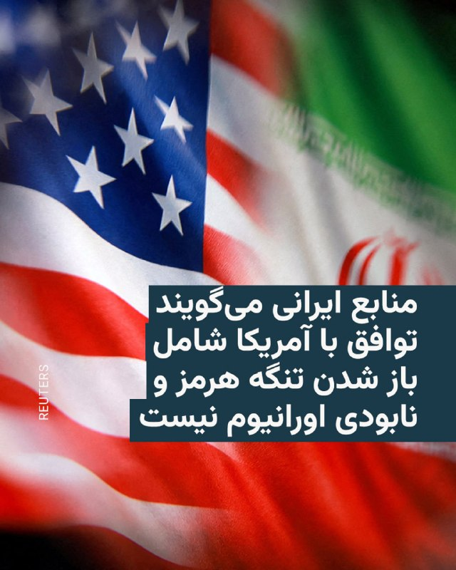

خبرگزاری رویترز روز جمعه به نقل از یک منبع ایرانی نوشت که بین تهران و واشینگتن یک تفاهم سیاسی صورت گرفته اما هنوز نهایی نشده و همچنین توافق با ایران شامل نابودی مواد هسته‌ای نیست.

دونالد ترامپ، رئیس‌جمهور آمریکا ساعتی پیش اعلام کرد که توافق پایان دادن جنگ باید شامل مواردی مانند تعهد ایران به باز شدن تنگه هرمز و نابودی ذخایر اورانیوم باشد.

منبع ایرانی به رویترز گفته است که تفاهم بین واشینگتن و تهران شامل موضوع هسته‌ای نیست و اظهارات آقای ترامپ درباره نابودی اورانیوم ایران را رد کرده است.

خبرگزاری فارس، نزدیک به سپاه پاسداران، نیز به نقل از یک منبع ایرانی دیگر اظهارنظر رئیس‌جمهور ایالات منحده دربارهٔ توافق احتمالی با ایران، را «آمیخته‌ای از راست و دروغ» خوانده است.
این منبع گفته که در متن توافق بندی درباره باز شدن تنگه هرمز بدون دریافت عوارض وجود ندارد و تفاهم بر سر نابودی دخایر اورانیوم ایران را نیز «بی‌اساس» دانسته است.
@VahidHeadline

📡 @VahidOnline

## VahidOnline — post 75789

  

☄️ پست ترامپ، ترجمه ماشین:
ایران باید بپذیرد که هرگز سلاح یا بمب هسته‌ای نخواهد داشت.

تنگه هرمز باید فوراً، بدون عوارض، برای عبور و مرور آزادانه کشتی‌ها در هر دو جهت باز شود. همه مین‌های دریایی، اگر وجود داشته باشند، برچیده خواهند شد؛ ما با مین‌روب‌های زیرآبی فوق‌العاده خود، شمار زیادی از این مین‌ها را از طریق انفجار از بین برده‌ایم. ایران نیز باید فوراً هر مین باقی‌مانده‌ای را، که تعدادشان زیاد نخواهد بود، جمع‌آوری یا منفجر کند.

کشتی‌هایی که به‌دلیل محاصره دریایی شگفت‌انگیز و بی‌سابقه ما در تنگه گرفتار شده بودند ــ ❗️ محاصره‌ای که اکنون لغو خواهد شد ــ می‌توانند روند «بازگشت به خانه» را آغاز کنند! از طرف من، رئیس‌جمهور محبوبتان، به همسران، شوهران، پدران، مادران و خانواده‌هایتان سلام برسانید!

مواد غنی‌شده، که گاهی از آن با عنوان «غبار هسته‌ای» یاد می‌شود و در اعماق زمین دفن شده؛ در حالی که کوه‌هایی که عملاً بر اثر حمله قدرتمند بمب‌افکن‌های B-2 ما در ۱۱ ماه پیش فرو ریخته‌اند روی آن قرار دارند، ❗️توسط ایالات متحده از زیر خاک بیرون آورده خواهد شد؛ کشوری که، طبق توافق، تنها کشور در کنار چین است که توان مکانیکی انجام چنین کاری را دارد.
این کار با هماهنگی و همکاری نزدیک با جمهوری اسلامی ایران و همچنین آژانس بین‌المللی انرژی اتمی انجام خواهد شد و سپس این مواد نابود خواهد شد.

❗️ تا اطلاع ثانوی، هیچ پولی رد و بدل نخواهد شد.

درباره موارد دیگری که اهمیت بسیار کمتری دارند نیز توافق حاصل شده است.

💥اکنون در اتاق وضعیت جلسه خواهم داشت تا تصمیم نهایی را بگیرم.

از توجه شما به این موضوع سپاسگزارم!

رئیس‌جمهور دونالد جی. ترامپ
realDonaldTrump

📡 @VahidOnline

## VahidOnline — post 75788

  <a href="telegram/content/VahidOnline_75788_1780076881.mp4" target="_blank">🎬 Download video</a>

این ویدیو با شرح عبور موشک‌های تاماهاک در مرز عراق و ایران در شبکه‌های اجتماعی و چند رسانه منتشر شده و گفته می‌شود مربوط به روزهای نخست جنگ است.
@VahidOOnLine

📡 @VahidOnline

## VahidOnline — post 75787

  <a href="telegram/content/VahidOnline_75787_1780076882.mp4" target="_blank">🎬 Download video</a>

اسکات بسنت، وزیر خزانه‌داری آمریکا، روز پنجشنبه هفتم خرداد ماه اعلام کرد عمان پس از دریافت هشدار واشنگتن درباره پیامدهای احتمالی مشارکت در طرح دریافت عوارض از کشتی‌های عبوری از تنگه هرمز، به آمریکا اطمینان داده است که برنامه‌ای برای اجرای چنین طرحی ندارد.
بسنت روز پنجشنبه در نشست خبری کاخ سفید گفت که صبح همان روز با سفیر عمان گفتگو کرده و از او شنیده است که مسقط هیچ برنامه‌ای برای دریافت عوارض در تنگه هرمز ندارد.
او افزود: «به او گفتم این موضوع از اساس غیرقابل قبول است و او نیز نمی‌خواهد افراد عمانی یا موسسات مالی عمانی را در معرض خطر تحریم قرار دهد.»
بسنت ساعاتی پیش‌تر در پیامی در شبکه اجتماعی ایکس هشدار داده بود که وزارت خزانه‌داری آمریکا هر فرد یا نهادی را که به‌صورت مستقیم یا غیرمستقیم در تسهیل دریافت عوارض در تنگه هرمز نقش داشته باشد، هدف تحریم قرار خواهد داد. او تصریح کرده بود که هر شریک احتمالی این طرح نیز با مجازات و تحریم روبه‌رو خواهد شد.
@VahidOOnLine

📡 @VahidOnline

## VahidOnline — post 75786

  

شبکه العربیه به نقل از منابع آگاه گزارش داد جمهوری اسلامی می‌خواهد اورانیوم غنی‌سازی‌شده خود را به چین منتقل کند، مشروط بر آن‌که چین تضمین دهد این مواد را به آمریکا تحویل نخواهد داد.

به گفته این منابع، بسیاری از نکات مرتبط با برنامه هسته‌ای جمهوری اسلامی در مذاکرات جاری حل‌وفصل شده است.

بر اساس این گزارش، جمهوری اسلامی با نظارت بین‌المللی بر تاسیسات هسته‌ای خود برای جلوگیری از تعطیل‌شدن آن‌ها موافقت کرده است.
@VahidOOnLine

📡 @VahidOnline

## VahidOnline — post 75785

  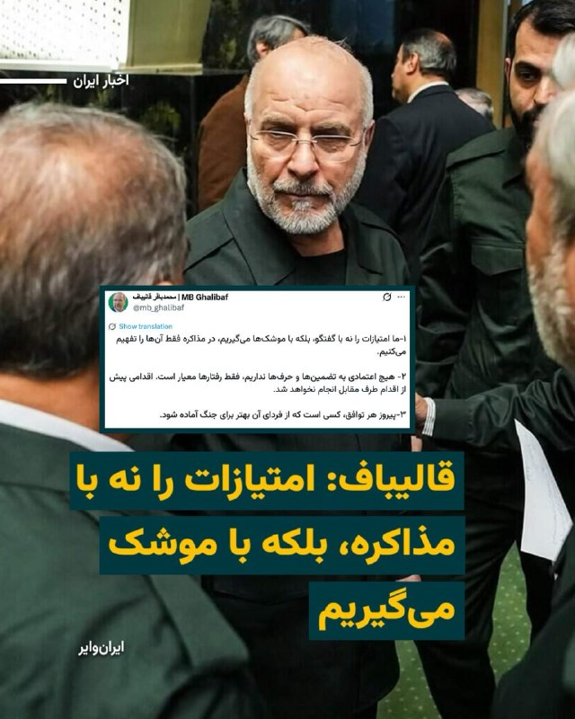

محمدباقر قالیباف، مذاکره‌کننده ارشد جمهوری اسلامی با آمریکا، روز جمعه تهدید کرد که تهران امتیازات مورد نظر خود در توافق پایان دادن به جنگ را با «موشک» می‌گیرد و پیش از اقدام واشینگتن درباره این توافق اقدامی نخواهد کرد.

او در شبکه ایکس همچنین نوشت: «هیچ اعتمادی به تضمین‌ها و حرف‌ها نداریم، فقط رفتارها معیار است.»

این موضع‌گیری یک روز پس از آن انجام شد که چند رسانه غربی خبر دادند آمریکا و ایران به تفاهمی برای تمدید آتش‌بس و رفع محدودیت عبور و مرور کشتی‌ها در تنگه هرمز رسیده‌اند، اما این توافق منتظر تصمیم و امضای نهایی دونالد ترامپ، رئیس‌جمهور ایالات متحده است.

قالیباف در پیام خود اعلام کرده که «اقدامی پیش از اقدام طرف مقابل انجام نخواهد شد».

از سوی دیگر، رسانه‌های نزدیک به سپاه پاسداران می‌گویند گزارش‌ها درباره توافق تهران و واشنگتن صحیح نیست. خبرگزاری تسنیم در این مورد به نقل از یک «منبع مطلع» نوشت: «متن توافق تا این لحظه جمع‌بندی نهایی نشده است.»
@VahidHeadline

📡 @VahidOnline

## VahidOnline — post 75784

  

‏🔴بنیاد عبدالرحمن برومند از ابتدای سال جاری تاکنون، اجرای ۶۶۰ مورد اعدام توسط جمهوری اسلامی را مستند کرده است. با این حال، به دلیل ماهیت پنهان‌کاری و غیرشفاف بودن سیستم قضایی ایران، آمار واقعی به احتمال زیاد بسیار بیشتر از این رقم است.

‏🔸از زمان آغاز جنگ، آمار اعدام معترضان و افرادی که به جاسوسی و اتهامات مشابه علیه امنیت ملی متهم شده‌اند، با سرعتی نگران‌کننده افزایش یافته است. «اعترافات اجباری» قربانیان، اصلی‌ترین «مدرک» مورد استفاده در این احکام مرگبار بوده است.

‏🔸این اعترافات در شرایطی کاملا مبهم و تحت فشارهای شدید جسمی و روحی اخذ می‌شوند. جمهوری اسلامی به طور مستمر این اعترافات اجباری را در رسانه‌های دولتی پخش می‌کند تا از آن به عنوان ابزاری برای توجیه اعدام‌ها و سرکوب مخالفت‌های عمومی استفاده کند.
‏⁧ #نه_به_اعدام ⁩
@IranRights

## IranIntlTV — post 339624

  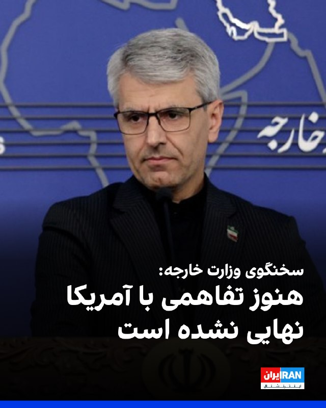

اسماعیل بقائی، سخنگوی وزارت خارجه گفت که ما در این مرحله بر خاتمه جنگ متمرکز هستیم و در مورد جزئیات برنامه هسته‌ای مذاکره‌ای نداریم.
سخنگوی وزارت خارجه جمهوری اسلامی افزود: «تاکنون تفاهمی با آمریکا نهایی نشده است.»

او افزود: «آنچه آمریکایی‌ها تحت عنوان محاصره دریایی از آن نام می‌برند، از ابتدا یک اقدام غیرقانونی بود؛ هم نقض آتش‌بس بود و هم اخلال در آزادی دریانوردی بین‌المللی. ما باید ببینیم در عمل آیا واقعا به این حرفشان عمل خواهند کرد یا صرفا یک ادعای تبلیغاتی است.»

او ادامه داد که با زبان «باید»، ۴۷ سال پیش خداحافظی کردیم، هیچ یک از طرف‌های غربی وقتی درباره جمهوری اسلامی صحبت می‌کنند، «نباید از باید» استفاده کنند.
https://iranintl.com/202605296308

## IranIntlTV — post 339623

ایران‌اینترنشنال با راه‌اندازی کارزار مردمی رشت در صدد است تا جاویدنامان کشته‌شده در اعتراضات دی‌ماه این شهر را شناسایی کند. اگر از شاهدان عینی کشتار بودید و یا عضوی از خانواده و نزدیکان‌تان در این قتل‌عام حکومتی هدف قرار گرفته، در بات تلگرامی اینتل‌مدیا که آدرس آن در تلگرام ایران‌اینترنشنال نوشته شده، پیام بدهید و اسناد، تصاویر و روایات خود را بفرستید.

## IranIntlTV — post 339622

  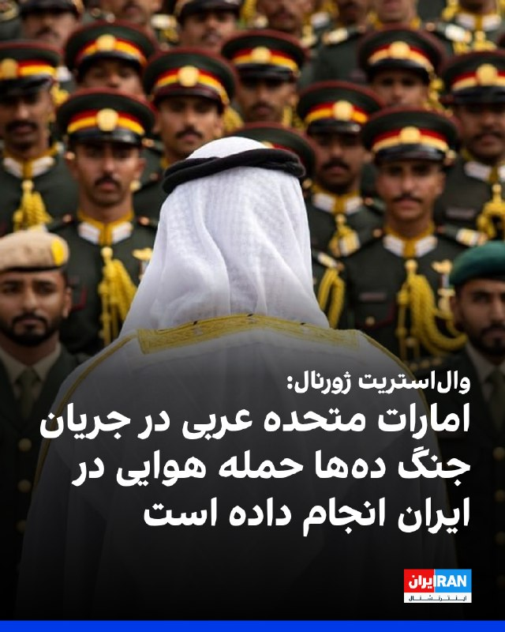

به گزارش وال‌استریت ژورنال، امارات متحده عربی در روزهای ابتدایی جنگ و حتی تا یک روز پس از اعلام آتش‌بس، ده‌ها حمله هوایی در ایران انجام داده است.
به گفته منابع آگاه، دامنه این حملات بسیار گسترده‌تر از چیزی بوده که پیش‌تر گزارش شده بود.

بر اساس این گزارش، این موضوع نشان می‌دهد امارات متحده عربی در مقایسه با برخی کشورهای منطقه خلیج‌فارس، رویکردی تهاجمی‌تر و همسو با منافع راهبردی خود اتخاذ کرده است.
https://iranintl.com/202605292290

## IranIntlTV — post 339621

  <a href="telegram/content/IranIntlTV_339621_1780076886.mp4" target="_blank">🎬 Download video</a>

دور تازه مذاکرات اسرائیل و لبنان در واشینگتن در حالی برگزار می‌شود که عملیات ارتش اسرائیل در لبنان ادامه دارد.

بنا بر گزارش‌ها، در ۴۰ روز گذشته بیش از ۸۰۰ حمله هوایی به مناطق مختلف لبنان انجام شده است.

گزارش اشکان صفایی، خبرنگار ایران‌اینترنشنال.
@iranintltv

## IranIntlTV — post 339620

  

مهدی خانعلی‌زاده، عضو تیم رسانه‌ای هیات مذاکره‌کننده جمهوری اسلامی، نوشت که در متن تفاهم احتمالی هشت بند از ۱۰ بند بیانیه شورای عالی امنیت ملی که به تایید مجتبی خامنه‌ای رسیده، رعایت نشده و زیر پا گذاشته شده است.

او افزود که تفاهم‌نامه کنونی برخلاف بیانیه آتش‌بس شورای عالی امنیت ملی است و مشخص شده که اساسا مذاکرات پسااسلام‌آباد، بر مبنای شروط رهبری انجام نشده است.
https://iranintl.com/202605292056

## IranIntlTV — post 339619

  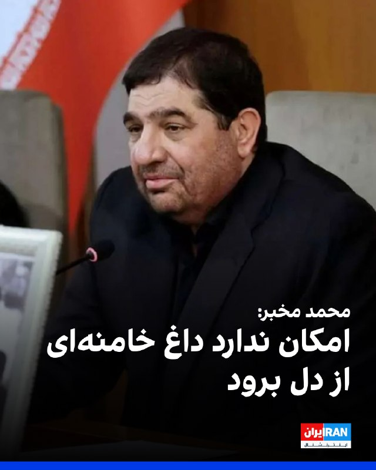

محمد مخبر، مشاور رهبر کشته‌شده جمهوری اسلامی گفت: «داغ رهبر شهید در دل مردم هرگز سرد نخواهد شد و رهبری در دل مردم جان و عمق گرفته بود و کسانی که او را دیده و درک کرده‌اند، امکان ندارد این داغ از دلشان برود.»

او در خصوص مذاکرات با آمریکا افزود: «ما هیچ اطمینانی به آمریکایی‌ها نداریم، اما دیپلماسی نیز بخشی از جنگ است.»
https://iranintl.com/202605297605

## IranIntlTV — post 339618

  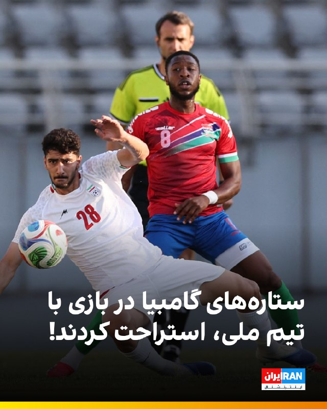

🔻تیم ملی فوتبال درحالی با تیم ملی گامبیا نخستین دیدار تدارکاتی خود پیش از جام جهانی را انجام می‌دهد که این تیم فقط با ۱۵ بازیکن به مصاف تیم امیر قلعه‌نویی رفته است.

🔹از سوی دیگر در این بازی، یاکوبه مینته، تنها بازیکن سرشناس گامبیا که در برایتون بازی می‌کند هم حضور ندارد.

🔹علاوه بر یانکوبا مینته،‌ دیگر ستاره‌های گامبیا هم در بازی با تیم ملی غایب هستند؛ علیو فادرا، ابوبکار کینته و عبدولی سیسای با این تیم رده ۱۱۶ فیفا به ترکیه نرفته‌اند.

🔹از سوی دیگر، میانگین سنی گامبیا در این بازی، ۲۵ سال است، این درحالی است که تیم فوتبال ایران با بازیکنان پا به سن گذاشته و میانگین سنی ۲۹ سال، به میدان رفته است.

@iranintltvsport

## IranIntlTV — post 339617

  

رویترز به نقل از یک مقام ارشد جمهوری اسلامی گفت اظهارات دونالد ترامپ درباره ذخایر اورانیوم با غنای بالای ایران صحت ندارد.

این مقام ارشد جمهوری اسلامی همچنین افزود تفاهم‌نامه احتمالی میان تهران و واشینگتن شامل هیچ‌گونه موضوع مرتبط با پرونده هسته‌ای نیست.

این مقام ارشد جمهوری اسلامی گفت که میان تهران و واشینگتن یک تفاهم سیاسی حاصل شده، اما این توافق هنوز نهایی نشده است.
https://iranintl.com/202605290076

## IranIntlTV — post 339616

  <a href="https://t.me/IranintlTV/339616" target="_blank">📎 Download file</a>

🎧نسخه صوتی اخبار شبانگاهی | جمعه ۸ خرداد
@iranintlTV

## IranIntlTV — post 339615

  <a href="telegram/content/IranIntlTV_339615_1780076891.mp4" target="_blank">🎬 Download video</a>

در پی حمله شبانه روسیه به اوکراین، یک پهپاد به ساختمانی در جنوب‌شرقی رومانی برخورد کرد و دو نفر زخمی شدند. رییس کمیسیون اروپا با اعلام همبستگی با رومانی گفت روسیه بار دیگر از خط قرمز عبور کرده است.

گزارش لی‌لی نیکفر، خبرنگار ایران‌اینترنشنال
@iranintltv

## IranIntlTV — post 339614

  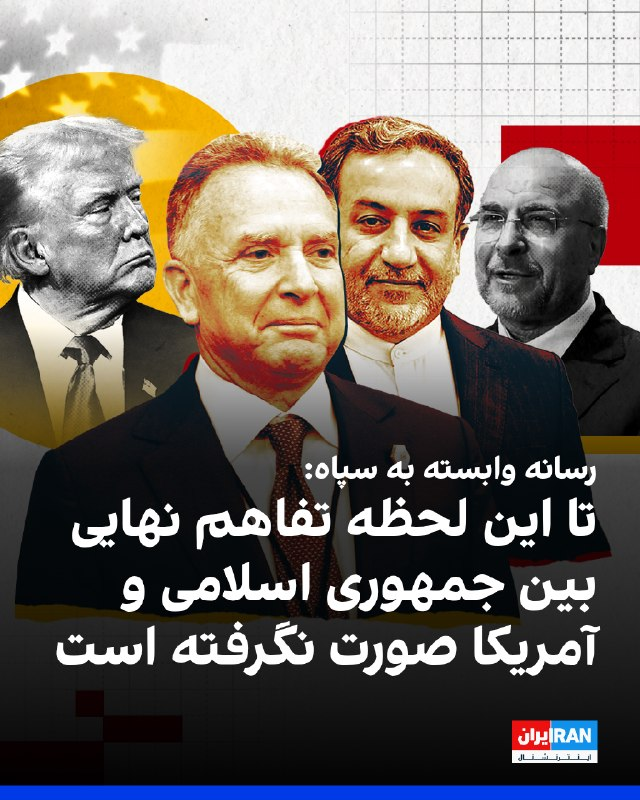

خبرگزاری تسنیم، وابسته به سپاه پاسداران، نوشت که تا این لحظه تفاهم نهایی بین جمهوری اسلامی و آمریکا صورت نگرفته و پست ترامپ در تروث سوشال در چارچوب الگوی همیشگی آن در اعلام نظرهای یکسویه و خود بزرگ‌بینانه است.

تسنیم افزود: «اصرار ترامپ مبنی بر عدم پرداخت پول‌های بلوکه شده، صرفا سوءظن تهران نسبت به جدیت آمریکا را تشدید می‌کند.»

رسانه سپاه نوشت که اظهارات دونالد ترامپ درباره برداشتن محاصره دریایی ایران را باید با تردید نگریست و البته اگر واقعا در عمل انجام شود، تازه به منزله توقف یکی از موارد نقض آتش‌بس است؛ زیرا از ابتدا نباید محاصره‌ای صورت می‌گرفت.
https://iranintl.com/202605291710

## IranIntlTV — post 339613

🗣روایت شما از بحران اقتصادی و زندگی در آتش‌بس- جمعه ۸ خرداد:

🔹از کاشان: واقعا وضعیت افتضاحه، اصلا نمی‌شه زندگی کرد، مدام منتظر یک اتفاقیم که این وضعیت تموم شه؛ داره بهترین سال‌های عمرمون این‌جوری می‌گذره، خیلی سخته.

🔹هنوز که هنوزه واسه جاویدنامان اشک می‌ریزیم. وقتی خودم رو جای خانواده‌های این عزیزان می‌ذارم قلبم به درد میاد. نباید این خون‌ها پایمال بشه.

🔹از لار پیام می‌دم، زندگی خیلی سخت شده، حقوق‌های کارمندها رو سر ماه نمی‌دن و همه چیز بیش از اندازه گرون شده.

🔹چرا ما دهه‌ نودی‌ها باید در گرانی و آرزو به دل ماندن زندگی کنیم؟

🔹از اول هم قرار نبود که آمریکا و اسرائیل رژیم رو برای ما تغییر بدن. این کار خودمونه. بازم هم دستشون درد نکنه. کی ما می‌تونستیم این همه مهره‌ کلیدی رو از سر راه انقلابمون برداریم. نیمه‌ی پر لیوان رو ببینید. کسی برای حکومت نمونده جز سروصدای چند ارزشی.

🔹گفتن جریمه اقساط رو می‌بخشیم ولی الان دارن با چند برابر سود دیرکرد اقساط می‌گیرن.

🔹برای یک شانه تخم‌مرغ باید یک روز کار کنی.

🔹خریدهای عادی ماهانه هر دفعه گران‌تر از قبل می‌شه، نمی‌دونم دیگه تا کی می‌شه ادامه داد، اعتراض کنی می‌کشنت، سکوت کنی هم کم‌کم دیگه هیچی برای خوردن نداری.

🔹من یک تئاتری‌ام. شرایط بچه‌های تئاتر خوب نیست. خیلی‌ها خرج بچه و اجاره خانه دارن. تا هر اتفاقی افتاد کرکره تئاتر رو کشیدن پایین. تنها شغلی هستیم در ایران که اتفاقا اصلا شغل محسوب نمی‌شیم. اگر کار نکنم هیچ‌کس نمیاد بگه کجایی. ۴۷ ساله که دیواری کوتاه‌تر از ما نیست.

## IranIntlTV — post 339612

  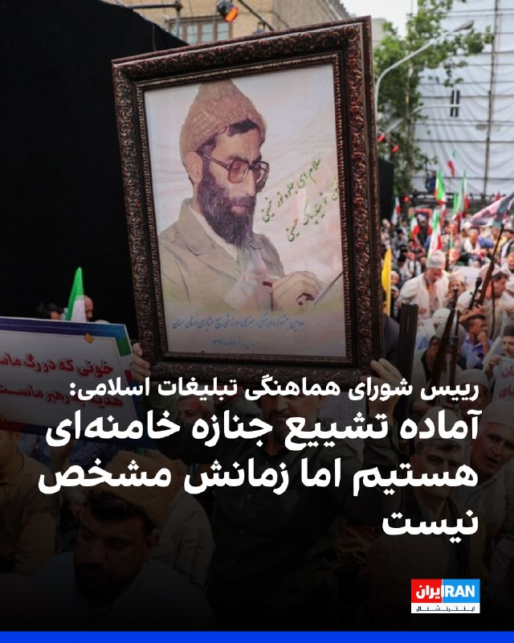

محسن محمودی، رییس شورای هماهنگی تبلیغات اسلامی تهران گفت: «ستاد آماده برگزاری مراسمی باشکوه و ده‌ها میلیونی برای رهبر شهیدمان است، اما زمان قطعی این مراسم هنوز مشخص نیست و به محض مشخص شدن اعلام خواهد شد.»

او ادامه داد: «موکب‌ها می‌توانند برای ثبت نام مراجعه کنند تا مراسم باشکوه برگزار شود.»

علی خامنه‌ای، رهبر پیشین جمهوری اسلامی در لحظات آغازین جنگ در ۹ اسفند ۱۴۰۴ کشته شد اما با گذشت حدود سه ماه، وضعیت جنازه و تشییع او هنوز مشخص نیست.
https://iranintl.com/202605297702

## IranIntlTV — post 339611

  <a href="telegram/content/IranIntlTV_339611_1780076895.mp4" target="_blank">🎬 Download video</a>

نخستین همایش انجمن شیر و خورشید اروپا با محوریت سرمایه سیاسی در استکهلم برگزار می‌شود. این گردهمایی با هدف معرفی فعالیت‌های انجمن و گسترش تعامل میان دانشجویان و فعالان مدنی برگزار خواهد شد.

گزارش مهران عباسیان، خبرنگار ایران‌اینترنشنال و گفت‌وگو با افشین خائف، کنشگر سیاسی
@iranintltv

## IranIntlTV — post 339610

  <a href="telegram/content/IranIntlTV_339610_1780076897.mp4" target="_blank">🎬 Download video</a>

یک شهروند با ارسال پیامی به ایران اینترنشنال، در پاسخ به کارزار مردمی، روایتی از شیوه سوءاستفاده نیروهای مسلح از آمبولانس برای شلیک به مردم را ارائه می‌دهد. پیام او با هوش مصنوعی خوانده شده است.

## IranIntlTV — post 339609

  <a href="telegram/content/IranIntlTV_339609_1780076899.mp4" target="_blank">🎬 Download video</a>

اسکات بسنت، وزیر خزانه‌داری آمریکا، هشدار داد اگر عمان به جمهوری اسلامی برای ایجاد سیستم عوارض در تنگه هرمز کمک کند، با تحریم مواجه خواهد شد. این موضع در پی گزارش‌هایی مطرح شده است که از احتمال مدیریت مشترک تنگه هرمز توسط ایران و عمان خبر می‌دهند.
گفت‌وگو با اردوان روزبه، خبرنگار ایران‌اینترنشنال
@iranintltv

## IranIntlTV — post 339607

  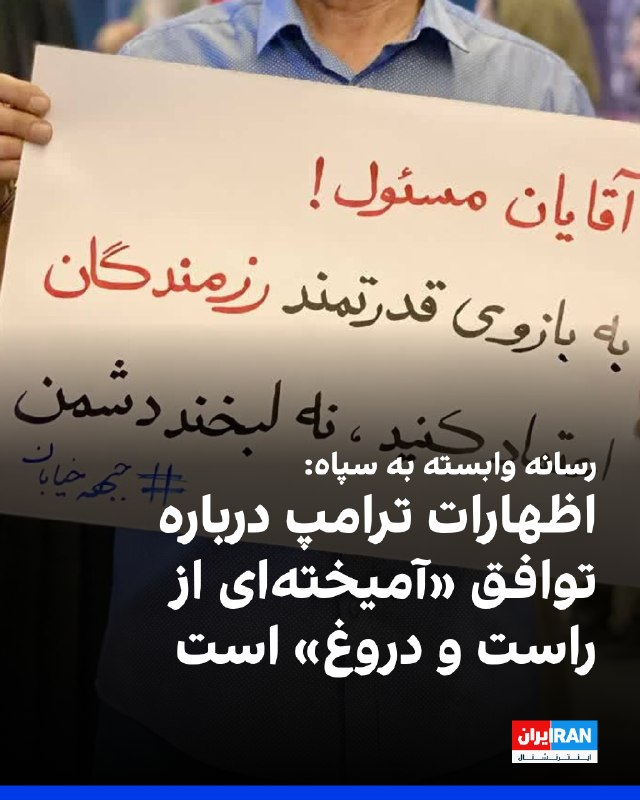

خبرگزاری فارس، وابسته به سپاه پاسداران نوشت منابع آگاه ضمن رد ادعاهای تازه دونالد ترامپ درباره توافق احتمالی با جمهوری اسلامی، اظهارات او را «آمیخته‌ای از راست و دروغ» و تلاشی برای نمایش پیروزیِ ساختگی توصیف کرده‌اند. به گفته این منابع، تقریبا برای همه روشن شده که این ادعاها فاقد اعتبار است.

فارس نوشت متن توافق که تحت قالب «تعهد در برابر تعهد» تدوین شده، در مراحل نهایی تصویب در تهران قرار دارد و هنوز تصمیم قطعی اتخاذ نشده است.

فارس نوشت ترامپ مدعی شده تهران موظف است تنگه هرمز را بدون دریافت عوارض باز کند، در حالی که در متن توافق چنین‌بندی وجود ندارد.

خبرگزاری وابسته به سپاه نوشت ترامپ ادعا کرده که جمهوری اسلامی مواد هسته‌ای خود را برمی‌چیند یا نابود می‌کند. منابع آگاه تاکید کرده‌اند که نه‌تنها چنین چیزی در یادداشت تفاهم وجود ندارد، بلکه این ادعا اساسا بی‌اساس است.

فارس نوشت که مهم‌ترین بخش توافق که ترامپ به آن اشاره‌ای نکرده، شرط پرداخت فوری ۱۲ میلیارد دلار از دارایی‌های بلوکه‌شده است.
https://iranintl.com/202605294432

## IranIntlTV — post 339606

  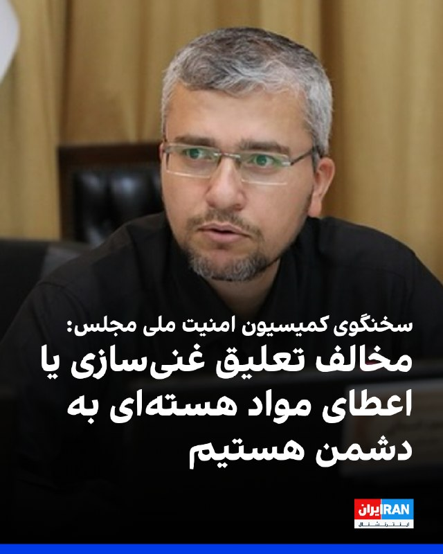

ابراهیم رضایی، سخنگوی کمیسیون امنیت ملی مجلس گفت: «ما مخالف تعلیق غنی‌سازی یا اعطای مواد هسته‌ای به دشمن هستیم. چرا که دیگر آن دوره گذشته است.»
او افزود: «جنگ در همه جبهه‌ها به‌ویژه لبنان باید پایان یابد. دشمن باید محاصره دریایی را بردارد و مدیریت ما را در تنگه هرمز به رسمیت بشناسد.»

او ادامه داد: «مذاکرات جاری را از جنس مذاکرات گذشته نمی‌بینیم که یک امتیازی بدهیم و یک امتیازی بگیریم. بلکه ما خود را پیروز می‌دانیم و معتقد هستیم که خواسته‌های حداکثری خود را باید از دشمن مطالبه کنیم.»
https://iranintl.com/202605298968

## IranIntlTV — post 339605

ویدیویی که تازه به ایران‌اینترنشنال رسیده، دفن شبانه جاویدنام حمید شاکریان را به دلیل فشار ماموران حکومت نشان می‌دهد.
شاکریان در ۱۹ دی ۱۴۰۴ از ناحیه سر هدف شلیک گلوله ماموران قرار گرفت و پیکر او را یک هفته بعد به خانواده تحویل دادند که با تدابیر امنیتی به خاک سپرده شد.

## IranIntlTV — post 339604

  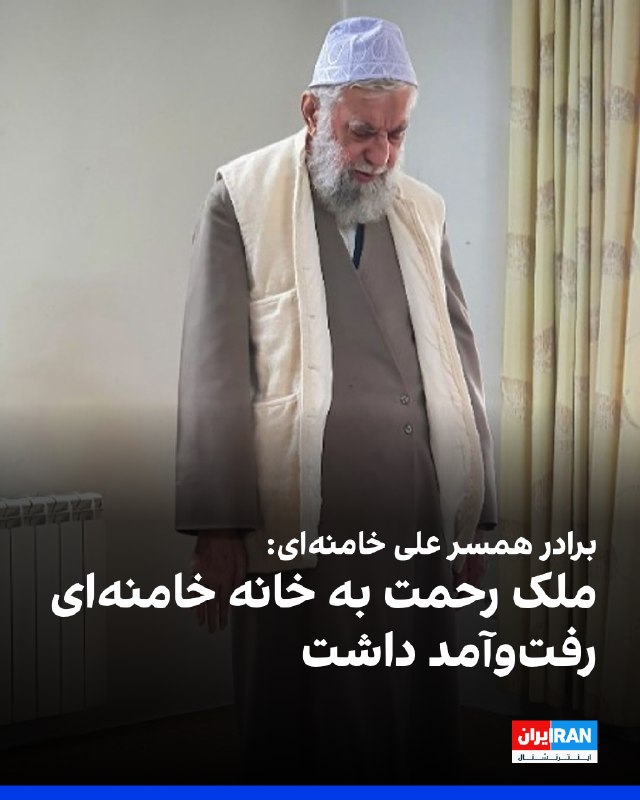

حسن خجسته، برادر همسر علی خامنه‌ای، درباره نحوه زندگی خانواده او گفت: «هیچ‌کس مثل آن‌ها نیست. هیچ کسی هم نمی‌تواند مثل این‌ها باشد. همه ظرفیت‌ها برایشان فراهم بود، واقعا مانعی هم نداشتند اما هیچ استفاده‌ای نمی‌کردند.»
خجسته افزود: «ملک رحمت به خانه‌شان رفت‌وآمد داشت.»

او افزود: «علی خامنه‌ای و همسرش آن‌قدر ملاحظات فراوانی داشتند که در دوره ریاست جمهوری خامنه‌ای، بعضی از هزینه‌های دفتر را شخصا انجام می‌داد. انصافا بچه‌ها هم تابع بودند و با افتخار عمل می‌کردند.»
https://iranintl.com/202605295787

## Shin_Persian — post 6305

  

🔁 Quoting above tweet: Shin ✓ @hey_itsmyturn Fri, 29 May 2026 16:27:26 UTC IRGC-owned Tasnim News: "No final agreement has been reached between Iran and the United States at this time. According to Tasnim News Agency’s reporter, no final agreement has…

## Shin_Persian — post 6304

🔁 Quoting above tweet:
Shin ✓ @hey_itsmyturn
Fri, 29 May 2026 16:27:26 UTC

IRGC-owned Tasnim News:

"No final agreement has been reached between Iran and the United States at this time.

According to Tasnim News Agency’s reporter, no final agreement has been concluded between Iran and the United States so far. President Trump's tweet aligns with his consistent pattern of unilateral and self-aggrandizing pronouncements.

Donald Trump's statements concerning the lifting of the naval blockade on Iran, emanating from the head of the terrorist U.S. administration, should be viewed with skepticism. Should such an action materialize, it would merely signify the cessation of one of numerous ceasefire violations, given that such a blockade should never have been initiated.

Furthermore, Trump's assertions and those of American media outlets regarding the nuclear issue are unfounded, as no detailed discussions on nuclear matters are currently taking place in this area.

The U.S. President's insistence on not releasing Iran's blocked funds solely intensifies Iran's suspicion regarding the seriousness of the United States.

The Islamic Republic of Iran has repeatedly emphasized that the status of its blocked assets must be clarified prior to any preliminary agreement."

فارسی

خبرگزاری تسنیم وابسته به سپاه پاسداران انقلاب اسلامی (IRGC):

«تا این لحظه هیچ توافق نهایی میان ایران و ایالات متحده حاصل نشده است.

به گزارش خبرنگار خبرگزاری تسنیم، تاکنون هیچ توافق نهایی بین ایران و ایالات متحده منعقد نشده است. توئیت پرزیدنت ترامپ با الگوی همیشگی او در اظهارات یک‌جانبه و خودبزرگ‌بینانه مطابقت دارد.

اظهارات دونالد ترامپ در خصوص رفع محاصره دریایی ایران که از سوی رئیس دولت تروریست آمریکا مطرح شده، باید با تردید نگریسته شود. در صورت تحقق چنین اقدامی، این تنها به معنای توقف یکی از موارد متعدد نقض آتش‌بس خواهد بود، چرا که چنین محاصره‌ای اساساً نباید هرگز آغاز می‌شد.

علاوه بر این، ادعاهای ترامپ و رسانه‌های آمریکایی در مورد موضوع هسته‌ای بی‌اساس است، زیرا در حال حاضر هیچ بحث مفصلی در مورد مسائل هسته‌ای در این زمینه در جریان نیست.

اصرار رئیس‌جمهور آمریکا بر عدم آزادسازی اموال بلوکه شده ایران، صرفاً سوءظن ایران را نسبت به جدیت ایالات متحده تشدید می‌کند.

جمهوری اسلامی ایران بارها تأکید کرده است که وضعیت دارایی‌های بلوکه شده‌اش باید پیش از هرگونه توافق مقدماتی روشن شود.»

𝕏 · @shin_persian

## Shin_Persian — post 6303

  

↩️ Quoted tweet: Shin ✓ @hey_itsmyturn Fri, 29 May 2026 14:55:22 UTC President Trump @POTUS: "Iran must agree that they will never have a Nuclear Weapon or Bomb. The Hormuz Strait must be immediately open, no tolls, for unrestricted shipping traffic, in…

## Shin_Persian — post 6302

↩️ Quoted tweet:
Shin ✓ @hey_itsmyturn
Fri, 29 May 2026 14:55:22 UTC

President Trump @POTUS:
"Iran must agree that they will never have a Nuclear Weapon or Bomb. The Hormuz Strait must be immediately open, no tolls, for unrestricted shipping traffic, in both directions. All water mines (bombs), if any, will be terminated (we have removed, through

↩️ توییت نقل‌قول شده — برای پاسخ، پست زیر را ببینید.

فارسی

رئیس‌جمهور ترامپ @POTUS:
«ایران باید موافقت کند که هرگز سلاح هسته‌ای یا بمب نخواهد داشت. تنگه هرمز باید فوراً برای تردد نامحدود کشتی‌رانی در هر دو جهت، بدون هیچ‌گونه حق‌العبوری، باز شود. تمام مین‌های دریایی (بمب‌ها)، در صورت وجود، نابود خواهند شد (ما حذف کرده‌ایم، از طریق

𝕏 · @shin_persian

## Shin_Persian — post 6301

  

🔁 Quoting above tweet: Shin ✓ @hey_itsmyturn Fri, 29 May 2026 15:49:40 UTC IRGC-owned Fars News in response to POTUS' post: """ Knowledgeable sources, while refuting the recent claims of the American president regarding a potential agreement with Iran,…

## Shin_Persian — post 6300

🔁 Quoting above tweet:
Shin ✓ @hey_itsmyturn
Fri, 29 May 2026 15:49:40 UTC

IRGC-owned Fars News in response to POTUS' post:

""" Knowledgeable sources, while refuting the recent claims of the American president regarding a potential agreement with Iran, have described his statements as "a mixture of truth and falsehood" and an attempt to present a fabricated victory. According to these sources, it has become evident to nearly everyone that these claims lack credibility.

According to this report, the text of the agreement, drafted under the framework of "commitment for commitment," is in its final stages of approval in Iran, and a definitive decision has not yet been made. In contrast, Trump, who sees himself unable to withdraw from the agreement, has made statements that contradict the provisions of the agreement text. He has simultaneously announced an immediate end to the blockade.

Trump's Distortion of Key Agreement Provisions:

1. Strait of Hormuz: Trump has claimed that Iran is obliged to open the Strait of Hormuz without imposing tolls, whereas no such clause exists in the agreement text. Iran has emphasized that after the lifting of the blockade, it will open the strait according to its pre-determined arrangements. These arrangements could include monitoring and inspection of vessels, as well as providing services and ensuring security, for which Iranian reporters from Fars News Agency hear preparations are underway.

2. Dismantling of Nuclear Materials: Trump has alleged that Iran will dismantle or destroy its nuclear materials. Knowledgeable sources have stressed that not only is there no such provision in the memorandum of understanding, but this claim is fundamentally groundless.

Key Agreement Clauses Ignored by Trump:

1. Immediate Payment of 12 Billion Dollars: The most crucial part of the agreement, which Trump has not mentioned, is the condition for an immediate payment of 12 billion dollars from Iran's blocked assets. According to the agreement text, this amount must be paid immediately, and until this payment is made, Iran will not enter any subsequent negotiation stages. Failure to implement this clause would constitute a violation of U.S. commitments.

2. Ceasefire in Lebanon: Another issue is the establishment of a complete ceasefire in Lebanon in accordance with Hezbollah's views.

According to knowledgeable sources, only if these issues are resolved will Iran, in the next stage, engage in discussions regarding the lifting of all sanctions and the nuclear issue, in accordance with its red lines.

Concurrent with these statements, Iranian officials have emphasized that the final agreement will be formulated based on the principles and red lines of the Islamic Republic of Iran's system and with a complete distrustful approach towards the United States, such that any breaking of promises will be met with immediate reciprocal action. """

ترجمه فارسی در بخش نظرات

𝕏 · @shin_persian

## Shin_Persian — post 6299

  

↩️ Quoted tweet: Shin ✓ @hey_itsmyturn Fri, 29 May 2026 14:55:22 UTC President Trump @POTUS: "Iran must agree that they will never have a Nuclear Weapon or Bomb. The Hormuz Strait must be immediately open, no tolls, for unrestricted shipping traffic, in…

## Shin_Persian — post 6298

↩️ Quoted tweet:
Shin ✓ @hey_itsmyturn
Fri, 29 May 2026 14:55:22 UTC

President Trump @POTUS:
"Iran must agree that they will never have a Nuclear Weapon or Bomb. The Hormuz Strait must be immediately open, no tolls, for unrestricted shipping traffic, in both directions. All water mines (bombs), if any, will be terminated (we have removed, through

↩️ توییت نقل‌قول شده — برای پاسخ، پست زیر را ببینید.

فارسی

پرزیدنت ترامپ @POTUS:
«ایران باید موافقت کند که هرگز سلاح یا بمب هسته‌ای نخواهد داشت. تنگه هرمز باید فورا، بدون عوارض، برای ترافیک کشتیرانی نامحدود در هر دو جهت باز شود. تمام مین‌های آبی (بمب‌ها)، در صورت وجود، منهدم خواهند شد (ما برداشته‌ایم، از طریق...»

𝕏 · @shin_persian

## Shin_Persian — post 6297

  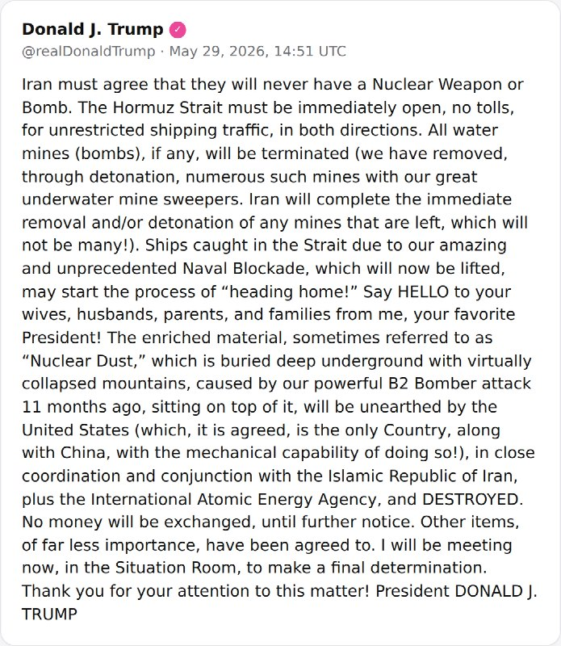

Shin ✓ @hey_itsmyturn Fri, 29 May 2026 14:55:22 UTC President Trump @POTUS: "Iran must agree that they will never have a Nuclear Weapon or Bomb. The Hormuz Strait must be immediately open, no tolls, for unrestricted shipping traffic, in both directions.…

## Shin_Persian — post 6296

Shin ✓ @hey_itsmyturn
Fri, 29 May 2026 14:55:22 UTC

President Trump @POTUS:
"Iran must agree that they will never have a Nuclear Weapon or Bomb. The Hormuz Strait must be immediately open, no tolls, for unrestricted shipping traffic, in both directions. All water mines (bombs), if any, will be terminated (we have removed, through detonation, numerous such mines with our great underwater mine sweepers. Iran will complete the immediate removal and/or detonation of any mines that are left, which will not be many!). Ships caught in the Strait due to our amazing and unprecedented Naval Blockade, which will now be lifted, may start the process of “heading home!” Say HELLO to your wives, husbands, parents, and families from me, your favorite President! The enriched material, sometimes referred to as “Nuclear Dust,” which is buried deep underground with virtually collapsed mountains, caused by our powerful B2 Bomber attack 11 months ago, sitting on top of it, will be unearthed by the United States (which, it is agreed, is the only Country, along with China, with the mechanical capability of doing so!), in close coordination and conjunction with the Islamic Republic of Iran, plus the International Atomic Energy Agency, and DESTROYED. No money will be exchanged, until further notice. Other items, of far less importance, have been agreed to. I will be meeting now, in the Situation Room, to make a final determination. Thank you for your attention to this matter! President DONALD J. TRUMP"

ترجمه فارسی در بخش نظرات

𝕏 · @shin_persian

## Shin_Persian — post 6295

  

🔁 Quoting above tweet: Shin ✓ @hey_itsmyturn Fri, 29 May 2026 13:10:40 UTC The Speaker of Parliament and the head of Islamic Regime's negotiating team, Mohammad Bagher Ghalibaf posted a three-point statement outlining clear position regarding negotiations…

## Shin_Persian — post 6294

🔁 Quoting above tweet:
Shin ✓ @hey_itsmyturn
Fri, 29 May 2026 13:10:40 UTC

The Speaker of Parliament and the head of Islamic Regime's negotiating team, Mohammad Bagher Ghalibaf posted a three-point statement outlining clear position regarding negotiations with the United States:

"1. We achieve concessions not through dialogue, but through missiles; in negotiations, we merely articulate them.

2. We do not trust guarantees or words; only actions serve as a measure. No action will be taken before the opposing party acts.

3. The victor of any agreement is the one who, from the day after, prepares better for war."

فارسی

رئیس مجلس و رئیس تیم مذاکره‌کننده رژیم اسلامی، محمدباقر قالیباف، بیانیه‌ای سه‌عاملی را منتشر کرد که موضع شفافی را در خصوص مذاکره با ایالات متحده ترسیم می‌کند:

«۱. ما امتیازها را نه از طریق گفتگو، بلکه با موشک‌ها به دست می‌آوریم؛ در مذاکرات، ما صرفاً آن‌ها را بیان می‌کنیم.

۲. ما به تضمین‌ها یا واژه‌ها اعتماد نمی‌کنیم؛ تنها عمل ملاک است. هیچ اقدامی پیش از اقدام طرف مقابل انجام نخواهد شد.

۳. پیروز هر توافقی کسی است که از فردای آن روز، خود را بهتر برای جنگ آماده کند.»

𝕏 · @shin_persian

## Shin_Persian — post 6293

  <a href="telegram/content/Shin_Persian_6293_1780076908.mp4" target="_blank">🎬 Download video</a>

↩️ Quoted tweet: Israel War Room ✓ @IsraelWarRoom Thu, 28 May 2026 23:27:55 UTC .@VP Vance says the US has made "a lot of progress" in negotiations with Iran, but major disputes remain over Iran's uranium enrichment program and its highly enriched uranium…

## Shin_Persian — post 6292

↩️ Quoted tweet:
Israel War Room ✓ @IsraelWarRoom
Thu, 28 May 2026 23:27:55 UTC

.@VP Vance says the US has made "a lot of progress" in negotiations with Iran, but major disputes remain over Iran's uranium enrichment program and its highly enriched uranium stockpile.

"We're going back and forth on a couple of language points... Hopefully, we'll continue to

↩️ توییت نقل‌قول شده — برای پاسخ، پست زیر را ببینید.

فارسی

.@VP ونس می‌گوید ایالات متحده در مذاکرات با ایران به "پیشرفت‌های زیادی" دست یافته است، اما اختلافات عمده بر سر برنامه غنی‌سازی اورانیوم ایران و ذخایر اورانیوم با غنی‌سازی بالای این کشور همچنان باقی است.

"ما بر سر چند نکته زبانی در حال رایزنی رفت و برگشتی هستیم... امیدواریم که به ادامه دهیم"

𝕏 · @shin_persian

## ManotoTV — post 105869

  <a href="telegram/content/ManotoTV_105869_1780076910.mp4" target="_blank">🎬 Download video</a>

در سیاست بین‌الملل، کشورها بیش از آنکه بر پایه دوستی، همدلی یا شعارهای اخلاقی تصمیم بگیرند، بر اساس منافع ملی خود عمل می‌کنند. قدرت‌های بزرگ ممکن است از آزادی، امنیت، حقوق بشر یا نظم جهانی سخن بگویند، اما در لحظه تصمیم، محاسبه اصلی این است که چه چیزی به سود آن‌هاست.

## ManotoTV — post 105868

  <a href="telegram/content/ManotoTV_105868_1780076911.mp4" target="_blank">🎬 Download video</a>

سخنان الهام‌بخش فریدون فرخزاد درباره خودباوری ملی

## ManotoTV — post 105860

  <a href="telegram/content/ManotoTV_105860_1780076913.mp4" target="_blank">🎬 Download video</a>

در سیاست، گاهی مهم‌تر از خود رویداد، چیزی است که آن رویداد آشکار می‌کند.

جنگ اخیر نیز پرده‌ای از واقعیت جمهوری اسلامی کنار زد: شکاف‌هایی که پنهان شده بود، ضعف‌هایی که انکار می‌شد و بحران‌هایی که با تبلیغات پوشانده می‌شد.

## FarsiVOA — post 218999

🔺 گزارش | «زمین گرد است یا تخت؟»؛ روایت اعدام غلامرضا خانی شکرآب توسط رژیم ایران

▪️نامش، غلامرضا خانی شکرآب بود. اگرچه در گزارش‌های رسمی اطلاعاتی درباره سن او منتشر نشده، اما بر اساس یکی از پست‌هایش در اینستاگرام، هنگام اعدام باید ۳۳ یا ۳۴ ساله بوده باشد؛ او روز ۵ خرداد ۱۴۰۵ به اتهام «جاسوسی برای اسرائیل» اعدام شد.

⬇️ بیشتر بخوانید:

https://ir.voanews.com/a/iran-execution-khani-shekarab-gholamreza/8155303.html/?nocach=1

## FarsiVOA — post 218998

اصابت پهپاد روسی به ساختمان در رومانی؛ ناتو: از هر وجب خاک خود دفاع می‌کنیم

## FarsiVOA — post 218997

توافق جمهوری اسلامی و آمریکا نزدیک است؟ چه کسی هزینه سیاسی آن را در ایران می‌پردازد؟

## FarsiVOA — post 218996

🔺پرزیدنت ترامپ: رژیم ایران باید بپذیرد که هرگز سلاح هسته‌ای نخواهد داشت؛ تنگه هرمز باید فوراً و بدون عوارض باز شود ▪️رئیس جمهوری آمریکا از برگزاری جلسه‌ای اضطراری با مقامات بلندپایه دولت خود در اتاق وضعیت خبر داد و گفت که در آستانه تصمیم‌گیری درباره پرونده…

## FarsiVOA — post 218995

🔺پرزیدنت ترامپ: رژیم ایران باید بپذیرد که هرگز سلاح هسته‌ای نخواهد داشت؛ تنگه هرمز باید فوراً و بدون عوارض باز شود

▪️رئیس جمهوری آمریکا از برگزاری جلسه‌ای اضطراری با مقامات بلندپایه دولت خود در اتاق وضعیت خبر داد و گفت که در آستانه تصمیم‌گیری درباره پرونده مذاکرات با جمهوری اسلامی است.

⬇️ بیشتر بخوانید:

https://ir.voanews.com/a/iran-us-trump-truth-negotiation-nuclear-dust/8155292.html/?nocach=1

## FarsiVOA — post 218994

وخامت وضعیت جسمی و مشکلات قلبی زرتشت احمدی راغب فعال مدنی در زندان مرکزی کرج

## FarsiVOA — post 218991

پیت هگست، وزیر جنگ آمریکا، از دیدار با خالد نورالدین، وزیر دفاع مالزی، خبر داد.

او گفت دو طرف بر تعهد خود برای گسترش همکاری‌پذیری نظامی تاکید کردند. پیت هگست گفت او مشتاق است اواخر امسال میزبان وزیر دفاع مالزی در آمریکا باشد.

@FarsiVOA

## FarsiVOA — post 218990

پرزیدنت ترامپ: من به اتاق وضعیت کاخ سفید می‌روم تا تصمیم نهایی را درباره جمهوری اسلامی بگیرم

## FarsiVOA — post 218989

آزاده مختاری، خبرنگار، با انتشار ویدیویی از جوشش چشمه‌ها در حاشیه دریاچه ارومیه نوشت این پدیده همزمان با ثبت بالاترین تراز دریاچه در یک سال اخیر رخ داده است.

او با اشاره به اینکه این تصاویر امیدوارکننده هستند، تاکید کرد دریاچه ارومیه همچنان تا رسیدن به تراز هدف زیست‌محیطی فاصله قابل توجهی دارد.

@FarsiVOA

## FarsiVOA — post 218988

نخست‌وزیر چگونه از کارت مقتدی صدر برای خلع سلاح گروه‌های مسلح وابسته به جمهوری اسلامی در عراق استفاده کرد؟

## FarsiVOA — post 218987

  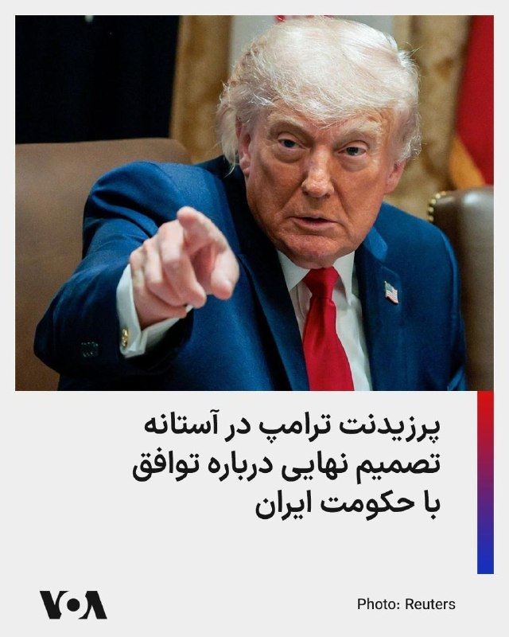

دونالد ترامپ، رئیس جمهوری آمریکا تاکید کرد که حکومت ایران باید موافقت کند که هرگز سلاح هسته‌ای نخواهد داشت و باید تنگه هرمز را فوراً و بدون دریافت عوارض باز کند.
پرزیدنت ترامپ همچنین عنوان کرد که از دیگر شرایط توافق با حکومت ایران تحویل «غبار هسته‌ای» از سوی حکومت ایران است و تا اطلاع ثانوی، هیچ پولی مبادله نخواهد شد.
آقای ترامپ در تروت سوشال نوشت که به اتاق وضعیت خواهد رفت تا تصمیم نهایی را بگیرد و موارد دیگر که از اهمیت بسیار کمتری برخوردارند، مورد توافق قرار گرفته‌اند.

## FarsiVOA — post 218984

پیت هگست، وزیر جنگ آمریکا، از دیدار با آدول بونتامچاروئن، وزیر دفاع تایلند، خبر داد.

او گفت دو طرف در حال تدوین یک بیانیه مشترک جدید تا پایان سال هستند و همکاری‌های صنعتی دفاعی میان آمریکا و تایلند را بررسی می‌کنند.

@FarsiVOA

## FarsiVOA — post 218983

🔺وزیران خارجه آمریکا و پاکستان در واشنگتن دیدار می‌کنند؛ تمرکز بر مذاکرات و تلاش برای دستیابی به توافق

▪️اسحاق دار، وزیر امور خارجه پاکستان، روز جمعه ۸ خرداد برای دیدار با مارکو روبیو، وزیر امور خارجه ایالات متحده، وارد واشنگتن شد. پیش‌بینی می‌شود تازه‌ترین تحولات در مذاکرات برای پایان دادن به تنش بین آمریکا و جمهوری اسلامی از محورهای اصلی گفت‌و‌گوها باشد.

⬇️ بیشتر بخوانید:

https://ir.voanews.com/a/iran-us-rubio-pakistan-negotiations/8155268.html

## FarsiVOA — post 218982

ویدیوی منتشر شده از جزیره «هون»، یکی از جزایر حفاظت‌شده پارک ملی دریاچه ارومیه، بازگشت شمار زیادی از پرندگان مهاجر را نشان می‌دهد.

به گفته راوی این ویدیو، حضور پرندگان در دریاچه ارومیه پس از پر آب شدن دریاچه در سال و در اوایل خرداد ۱۴۰۵ جاری ثبت شده است.

@FarsiVOA

## FarsiVOA — post 218981

مجتبی و میثم ویسی، دو برادر کُرد یارسان که پس از اعتراضات دی‌ماه تحت تعقیب نیروهای امنیتی قرار داشتند، بامداد پنج‌شنبه در تیراندازی نیروهای سپاه کشته شدند.

## FarsiVOA — post 218980

🔺گزارش | اعدام مجتبی کیان و آن‌چه روایت‌های حکومتی پنهان می‌کنند ▪️نامش مجتبی کیان بود. بنابر اطلاعات تاییدنشده‌ای که خبرگزاری قوه قضاییه جمهوری اسلامی و صداوسیما منتشر کرده‌اند، نام پدرش محمدقلی بود و در اطراف کرج زندگی می‌کرد. او روز ۳ خرداد ۱۴۰۵ اعدام…

## DW_Farsi — post 125290

🔶 ابهام در صدور ویزای آمریکا برای تیم ملی فوتبال ایران

در حالی که دو هفته به آغاز رقابت‌های جام جهانی مانده ظاهرا تیم ملی فوتبال ایران همچنان باید در انتظار صدور ویزای ایالات متحده آمریکا باشد.

ابوالفضل پسندیده، سفیر ایران در مکزیک، روز جمعه هشتم خرداد در جریان بازدید از شهر مرزی تیخوانا در این کشور که قرار شده میزبان کمپ اصلی تیم ملی فوتبال ایران برای حضور در این رقابت‌ها باشد با اعلام این خبر گفت: «شکی نداریم که تیخوانا مکان بسیار خوبی برای هواداران ما خواهد بود.»

پسندیده با اشاره به "کشور شمالی" که به وضوح به ایالات متحده آمریکا اشاره داشت، تاکید کرد که این کشور به مسئولیت خود به عنوان میزبان تیم ایران عمل نکرده است.

در ابتدا قرار بود که تیم ملی ایران اردو و محل اقامت خود را در آریزونای آمریکا بر پا کند ولی بعد از شروع جنگ ایالات متحده و اسرائيل علیه جمهوری اسلامی برنامه‌ها تغییر کرد و اکنون تیخوانا در مکزیک محلی است که قرار است تیم ملی ایران در آن‌جا مستقر شود.

پسندیده با ابراز عدم اطمینان در مورد کسب ویزای آمریکا برای تیم ملی فوتبال ایران گفت، اما فیفا (فدراسیون بین‌المللی فوتبال) تمامی تلاش خود را، هرچند بدون موفقیت، انجام داده تا مطمئن شود که با مانعی روبرو نخواند شد، زیرا آن‌ها تنها تیم از بین ۴۸ تیم دعوت‌شده به جام جهانی ۲۰۲۶ هستند که با مشکل مواحه شده‌اند."

او همچنین ابراز امیدواری کرد که ایرانیان ساکن کالیفرنیا و مکزیک برای تشویق تیم ایران در دور اول بازی در لس‌‌آنجلس و سیاتل مقابل نیوزیلند، بلژیک و مصر حضور داشته باشند.
@dw_farsi

## DW_Farsi — post 125289

🔶 ترامپ: برای تصمیم‌گیری نهایی در مورد ایران تشکیل جلسه می‌دهم

دونالد ترامپ، رئیس‌جمهور آمریکا در پستی تازه از تشکیل جلسه‌ای در اتاق وضعیت (Situation Room) کاخ سفید به منظور "تصمیم‌گیری" نهایی درباره توافق با ایران خبر داده است.

در این پست که در شبکه اجتماعی "تروث سوشال" در روز جمعه هشتم خرداد (۲۹ مه) منتشر شده ترامپ موارد مد نظر آمریکا برای توافق با ایران را فهرست کرده است.

طبق این پیام، این موارد شامل موافقت جمهوری اسلامی با عدم توسعه سلاح هسته‌ای، بازگشایی تنگه هرمز، انهدام تمامی مین‌های دریایی کارگذاشته‌شده توسط ایران، لغو محاصره دریایی این کشور توسط ایالات متحده و همچنین خار‌ج‌کردن اورانیوم بسیار غنی‌شده از زیر آوار توسط آمریکا و نابودسازی آن می‌شود.

ترامپ در مورد خروج اورانیوم با غنای بالا نوشت که این مواد "از زیر زمین خارج خواهند شد و توافق شده که آمریکا تنها کشور علاوه بر چین است که توانایی فنی چنین کاری را دارد."

در ضمن، خروج این مواد در "هماهنگی و همکاری نزدیک با جمهوری اسلامی ایران و آژانس بین‌المللی انرژی اتمی انجام خواهد شد."

او ادامه داد: «تا اطلاع ثانوی، هیچ پولی مبادله نخواهد شد. در مورد سایر موارد که از اهمیت بسیار کمتری برخوردار هستند، توافق حاصل شده است.»

خبرگزاری فارس، نزدیک به سپاه در واکنش به پیام تازه ترامپ از قول "منابع آگاه" خبر داد که پیام رئیس جمهور آمریکا درباره توافق احتمالی با ایران، "آمیخته ای از راست و دروغ و تلاشی برای نمایش پیروزیِ ساختگی" است.

فارس در ادامه نوشته است که «متن توافق که تحت قالب "تعهد در برابر تعهد" تدوین شده، در مراحل نهایی تصویب در ایران قرار دارد و هنوز تصمیم قطعی اتخاذ نشده است.»
@dw_farsi

## DW_Farsi — post 125288

🔶 صدور حکم ۱۵ سال زندان برای توطئه حمله به کنسرت تیلور سوئیفت

دادگاه ایالتی وینر نوی‌اشتات متهم اصلی پرونده طرح حمله به کنسرت تیلور سوئیفت در وین را گناهکار شناخت و به ۱۵ سال زندان محکوم کرد. این دادگاه او را در بیش از ۱۲ مورد اتهامی، که بیشتر آن‌ها با تروریسم ارتباط داشت، مجرم دانست. یکی دیگر از متهمان این پرونده نیز به ۱۲ سال زندان محکوم شد.

به گزارش خبرگزاری آلمان، منشأ این پرونده به اوت ۲۰۲۴ بازمی‌گردد؛ زمانی که بران آ.، شهروند اتریشی با ریشه‌های مقدونیه شمالی، به گفته دادستانی قصد داشت به جمعیت حاضر در برابر ورزشگاه ارنست هاپل حمله کند و سپس خودکشی کند.

او برای این منظور، بر اساس آموزش‌های اینترنتی، مقدار کمی از منفجره تهیه کرده بود و تلاش داشت سلاح‌هایی مانند مسلسل و نارنجک دستی خریداری کند.
@dw_farsi

## DW_Farsi — post 125287

  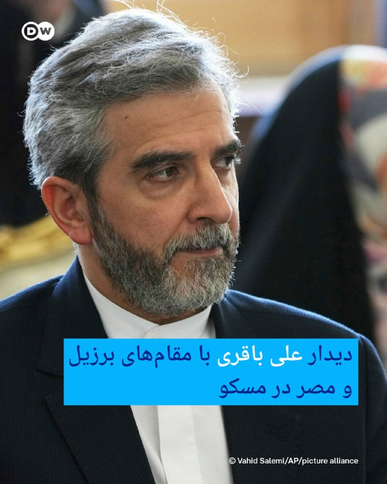

🔶 دیدار علی باقری با مقام‌های برزیل و مصر در مسکو

علی باقری، معاون سیاست خارجی و امنیت بین‌الملل شورای عالی امنیت ملی ایران در سفر به پایتخت روسیه در دیدارهای جداگانه‌‌ای با مشاور سیاست خارجی رئیس‌جمهور برزیل و دبیرکل شورای امنیت ملی مصر گفت‌وگو کرد.

به گزارش رسانه‌های ایران، باقری در دیدار با سلسو آموریم، مقام یادشده برزیل که در حاشیه چهاردهمین نشست بین‌المللی مقام‌های بلندپایه امنیتی در مسکو برگزار شد، درباره آخرین تحولات منطقه‌ای و بین‌المللی تبادل نظر کرد.

وضعیت غرب آسیا و توسعه همکاری‌های دوجانبه نیز از دیگر موضوعات مطرح‌شده بود.

معاون دبیر شورای عالی امنیت ملی ایران همچنین با یوسف علا‌ء‌الدین، دبیرکل شورای امنیت ملی مصر دیدار و گفت‌وگو کرد.

دو طرف در این دیدار درباره آخرین تحولات منطقه‌ای و بین‌المللی، وضعیت غرب آسیا و چگونگی کمک به تحکیم صلح و ثبات در حوزه پیرامونی تبادل نظر کردند.

به نقل از ایسنا، چهاردهمین کنفرانس بین‌المللی مقامات بلندپایه امنیتی در مسکو از سه‌شنبه تا پنج‌شنبه پنجم تا هفتم خرداد برگزار شد و باقری علاوه بر گفت‌وگو با این مقام‌ها در نشست اصلی نیز شرکت و سخنرانی کرد.
@dw_farsi

## DW_Farsi — post 125286

🔶 رومانی پس از حمله روسیه خواستار سامانه‌های ضد پهپادی ناتو شد

اصابت یک پهپاد روسی به یک ساختمان مسکونی در رومانی، از اعضای ناتو و اتحادیه اروپا باعث انتقاد شدید متحدان ائتلاف دفاعی نظامی ناتو از مسکو و ابراز همبستگی با بخارست شد.

به گفته رسانه‌ها، برخورد این پهپاد به این ساختمان در شامگاه منتهی به جمعه ۲۹ مه منجر به زخمی شدن دو نفر شد. طبق اعلام وزارت کشور، جراحات این دو نفر سطحی بود و در محل تحت درمان قرار گرفت.

مارک روته، دبیرکل ناتو در پی این رخداد "حمایت کامل و بی‌قید و شرط" ناتو از رومانی را به نیکوشور دان، رئیس‌جمهور این کشور ابراز کرد. متیو ویتاکر، سفیر آمریکا در ناتو نیز اظهارات مشابهی کرده است.
@dw_farsi

## DW_Farsi — post 125284

🔶 حماس از گرانی و کمبود در غزه سود می‌برد

افزایش شدید قیمت‌ها در غزه فقط نتیجه جنگ و محاصره نیست، بلکه با سازوکاری گره خورده که در آن برای ورود کالا به این منطقه، مبالغ سنگینی تحت عنوان "هماهنگی" دریافت می‌شود. بر اساس این گزارش، کارشناسان می‌گویند از این ساختار، پیش از همه حماس و شبکه‌ای از خانواده‌های بانفوذ تجاری سود می‌برند.

به گزارش رسانه‌های آلمان، در بازار غزه، کمبود دام و گوشت باعث شده قیمت هر کیلو گوشت تا ۱۲۰ دلار بالا برود. یکی از دام‌فروشان می‌گوید برای ورود هر محموله کالا به غزه، باید مبلغی سنگین برای "هماهنگی" پرداخت شود؛ رقمی که به گفته او برای هر بار حدود ۴۰۰ هزار دلار است. این عدد به‌طور مستقل قابل راستی‌آزمایی نیست، اما فروشندگان می‌گویند بدون این پرداخت‌ها، عملا ورود کالا ممکن نیست.

در بخش پوشاک نیز همین الگو تکرار می‌شود. یک فروشنده لباس در غزه می‌گوید برای هر پالت کالا حدود ۵ هزار دلار باید برای "هماهنگی" پرداخت شود و همین هزینه، قیمت نهایی اجناس را به‌شدت بالا می‌برد. او می‌گوید بخشی از لباس‌ها اکنون از کرانه باختری به غزه می‌رسد و همین هم بر هزینه‌ها افزوده است.
@dw_farsi

## DW_Farsi — post 125276

🔶 پنج خطر سلامتی ناشی از مصرف بیش از حد پروتئین

پژوهش‌های علمی نشان می‌دهند که مصرف بیش از حد پروتئین نه‌تنها همیشه مفید نیست، بلکه در برخی شرایط می‌تواند سلامت بدن را تهدید کند.

پروتئین بدون تردید یکی از مهم‌ترین مواد مغذی برای بدن است و نقش حیاتی در ساخت عضلات، ترمیم بافت‌ها، تولید هورمون‌ها و عملکرد سیستم ایمنی دارد. با این حال، متخصصان تغذیه تأکید می‌کنند که بدن انسان تنها به مقدار مشخصی پروتئین نیاز دارد و دریافت بیش از اندازه آن، به‌ویژه از منابع حیوانی، ممکن است عوارض مختلفی ایجاد کند.

@dw_farsi

## DW_Farsi — post 125275

🔶 هشدار بانک مرکزی اروپا درباره اثرات جنگ ایران در حوزه یورو

تحقیقات بانک مرکزی اروپا که روز جمعه هشتم خرداد (۲۹ مه) منتشر شد نشان می‌دهد که مصرف‌کنندگان منطقه یورو که پیش از این نیز از جنگ اوکراین آسیب دیده بودند ممکن است بر اثر بحران و تنش‌های حاصل از جنگ ایران باز هم آسیب ببینند.

طبق گزارش خبرگزاری رویترز، بر اثر پیامدهای جنگ ایران مصرف‌کنندگان منطقه یورو رفتار و نگرش خود را با سرعت بیشتری تغییر داده‌اند؛ امری که به این معناست که ضربه اقتصادی می‌تواند عمیق‌تر و سریع‌تر باشد.

حمله روسیه به اوکراین در فوریه ۲۰۲۲ باعث ایجاد بحران انرژی و تورمی شد که اروپا تا حد زیادی از آن بهبود یافته بود، اما پس از آن، حملات هوایی آمریکا و اسرائیل در ۲۸ فوریه علیه جمهوری اسلامی جنگی را آغاز کرد که منجر به اختلال بی‌سابقه‌ای در تأمین انرژی شده است.
@dw_farsi

## DW_Farsi — post 125274

🔶 ادامه سیاست فشار حداکثری آمریکا با تحریم‌های جدید علیه شبکه نفتی ایران

وزارت امور خارجه آمریکا روز پنجشنبه ۷ خرداد (۲۸ مه) در ادامه سیاست "فشار حداکثری"، مجموعه‌ای از تحریم‌های جدید را علیه افراد، شرکت‌ها و کشتی‌های مرتبط با صادرات نفت و محصولات پتروشیمی ایران اعلام کرد.

هدف این اقدام کاهش درآمدهای جمهوری اسلامی عنوان شده است که به گفته واشنگتن برای فعالیت‌های منطقه‌ای و حمایت از گروه‌های نیابتی استفاده می‌شود.

چندین شرکت مدیریت کشتی و تعدادی نفتکش به‌دلیل نقش در حمل و نقل نفت و پتروشیمی ایران در فهرست تحریم قرار گرفته‌اند و همچنین هشت کشتی به‌عنوان دارایی‌های مرتبط با این شبکه‌ها شناسایی و مسدود شده‌اند.

وزارت خارجه آمریکا اعلام کرده است که این شبکه‌ها با استفاده از روش‌های پنهان حمل‌ونقل دریایی به فروش نفت ایران کمک کرده و بخشی از درآمدهای آن را تامین می‌کنند.

هم‌زمان، وزارت خزانه‌داری نیز شبکه‌ای دیگر در حوزه فروش نفت ایران را تحریم کرده است.

در بیانیه خزانه‌داری آمریکا به شرکت‌ها و افراد فعال در تجارت محصولات پتروشیمی ایران در کشورهای مختلف نیز اشاره و آن‌ها به‌دلیل انجام معاملات مالی مرتبط با ایران تحریم شده‌اند.

آمریکا اعلام کرده هدف این اقدامات، تغییر رفتار ایران از طریق فشار اقتصادی و محدود کردن منابع مالی مرتبط با فعالیت‌های منطقه‌ای است.
@dw_farsi

## DW_Farsi — post 125273

  <a href="telegram/content/DW_Farsi_125273_1780076916.mp4" target="_blank">🎬 Download video</a>

🎥 ابراز نگرانی شاهزاده رضا پهلوی از پوشیدن تی‌شرت‌های ساواک

شاهزاده رضا پهلوی در ویدیویی که به تازگی منتشر شده از پوشیدن تی‌شرت سیاه یا ساواک در برخی تجمع‌های اعتراضی ابراز نگرانی کرد. او این اقدام را "حداقل مسئله‌ای جنجال‌آفرین" خواند که "نمی‌داند از کجا آب می‌خورد".

او پوشیدن چنین تی‌شرتی "با توجه به سابقه تاریخی ساواک" را بهانه دادن به دسته‌ای توصیف کرد که "همیشه سعی کردند این حملات را داشته باشند".

رضا پهلوی همچنین با تأکید بر "تمرکز به اصل هدف مبارزه" گفت که نباید اجازه داد تا این حاشیه‌سازی‌ها و انحرافات باعث تنش و یا اختلاف بین جریانات سیاسی، فعالین مدنی و اکتیویست‌ها شود.»
 
@dw_farsi

## DW_Farsi — post 125272

  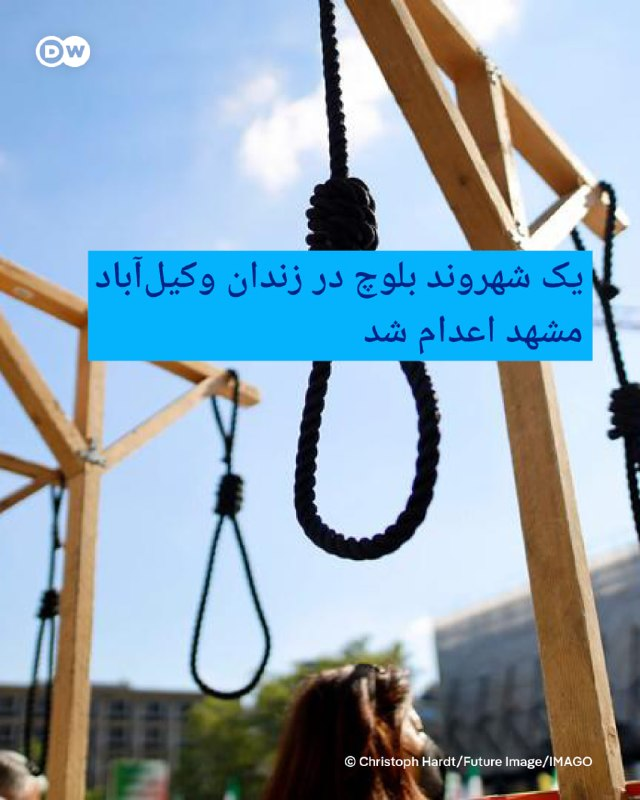

🔶 یک شهروند بلوچ در زندان وکیل‌آباد مشهد اعدام شد
 
بر اساس گزارش "حال‌ وش" که در حوزه اخبار مربوط به بلوچ‌ها فعالیت می‌کند، هویت یک شهروند بلوچ اعدام‌شده در زندان وکیل‌آباد مشهد احراز شد.
 
طبق اطلاعات منتشرشده، این فرد جواد غفران تالب (شاهوزهی) نام دارد، حدود ۲۴ سال سن داشته و در ارتباط با پرونده‌های مواد مخدر اعدام شده است. او متاهل و دارای سه فرزند بوده و اهل زاهدان و ساکن مشهد معرفی شده است.
 
بر اساس این گزارش، اجرای حکم بدون اطلاع‌رسانی قبلی به خانواده و بدون امکان ملاقات آخر انجام شده است. خانواده او نیز از زمان دقیق و جزئیات اجرای حکم بی‌اطلاع بوده‌اند.
 
این جوان بلوچ از سال ۱۳۹۸ بازداشت و پس از طی روند قضایی در دادگاه انقلاب مشهد به اعدام محکوم شده بود. حال‌وش نوشته است که خبر این اعدام به دلیل قطعی اینترنت با تأخیر منتشر شده است.
 
در گزارش حال‌‌وش آمده است که هم‌زمان با اعدام شاهوزهی، دو زندانی دیگر نیز در همان سحرگاه اعدام شده‌اند که هویت آنان هنوز مشخص نشده است. این رسانه همچنین فیلمی از تشییع جنازه جواد شاهوزهی نیز منتشر کرده است.
@dw_farsi

## DW_Farsi — post 125271

🔶 برای پاکستان پیوستن به توافق‌نامه‌ ابراهیم انتخابی دشوار است
 
پاکستان در برابر تازه‌ترین درخواست ترامپ برای پیوستن به توافق‌نامه‌های ابراهیم و عادی‌سازی روابط با اسرائیل، در موقعیت دشواری قرار گرفته است. ترامپ این موضوع را بخشی از یک توافق احتمالی برای پایان دادن به جنگ ایران مطرح کرده است.
 
او روز دوشنبه گفت هر توافقی برای پایان جنگ ایران باید شامل پیوستن کشورهایی مانند عربستان سعودی، پاکستان و قطر به توافق‌نامه‌های ابراهیم باشد. ترامپ در شبکه‌های اجتماعی نوشت که پس از تلاش‌های آمریکا برای حل این "پازل پیچیده"، حداقل انتظار این است که این کشورها به این توافق‌ها بپیوندند.
 
توافق‌نامه‌های ابراهیم مجموعه‌ای از توافق‌های دوجانبه هستند که با میانجیگری آمریکا برای عادی‌سازی روابط اسرائیل با کشورهای عربی شکل گرفتند. نخستین توافق‌ها در سپتامبر ۲۰۲۰ میان اسرائیل، امارات متحده عربی و بحرین امضا شدند.
 
برخی مقام‌های پاکستانی درخواست ترامپ را رد کرده‌اند، اما تاکنون دولت و ارتش پاکستان موضعی یکپارچه و قطعی اتخاذ نکرده‌اند.
 
اسلام‌آباد در ماه‌های اخیر نقش مهمی در میانجیگری برای پایان جنگ ایفا کرده و به گفته منابع آمریکایی، در آوریل موفق شده واشنگتن را به توقف حملات علیه ایران متقاعد کند. ترامپ نیز بارها از نقش پاکستان تمجید کرده و از عاصم منیر و شهباز شریف به عنوان افراد مورد علاقه خود یاد کرده است.
 
رضا رومی، تحلیلگر سیاسی، به دویچه‌ وله گفت که پیوستن به توافق‌نامه‌های ابراهیم می‌تواند برای پاکستان مزایایی مانند بهبود روابط با واشنگتن و برخی کشورهای خلیج فارس و همچنین فرصت‌های اقتصادی و فناوری به همراه داشته باشد.
 
اما او هشدار داد که این اقدام می‌تواند جایگاه پاکستان در موضوع فلسطین را تضعیف کند، تنش با ایران را افزایش دهد و به بی‌ثباتی داخلی دامن بزند.
 
پاکستان، اسرائیل را به رسمیت نمی‌شناسد و روابط دیپلماتیک با آن ندارد، هرچند در گذشته گزارش‌هایی از تماس‌های غیررسمی میان دو طرف منتشر شده بود.
@dw_farsi

## DW_Farsi — post 125270

  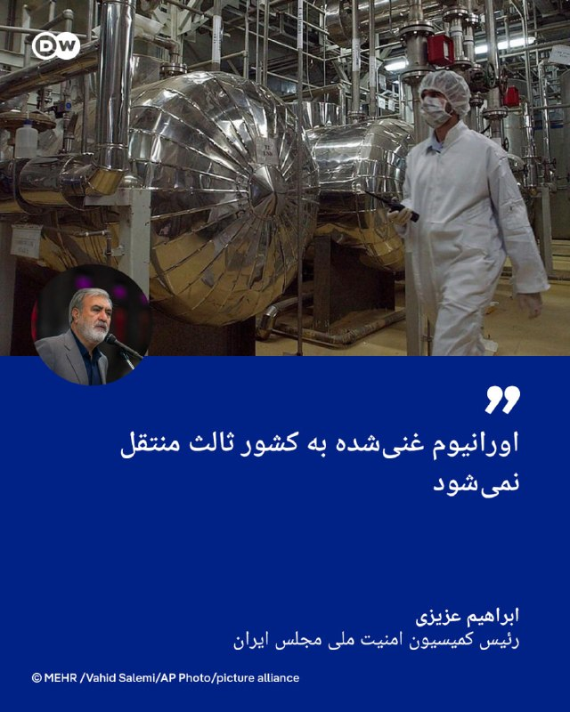

🔶 کمیسیون امنیت ملی مجلس: اورانیوم غنی‌شده به کشور ثالث منتقل نمی‌شود
 
ابراهیم عزیزی، رئیس کمیسیون امنیت ملی مجلس ایران روز جمعه ۸ خرداد (۲۹ مه) در گفت‌وگو با خبرگزاری روسی "ریانووستی" با رد برخی گمانه‌زنی‌ها درباره سرنوشت اورانیوم‌های غنی‌شدهایران تاکید کرد که اساسا برنامه‌ای برای انتقال این مواد به کشور ثالث یا هر واسطه‌ای وجود ندارد.
 
عزیزی همچنین این پرسش‌ها را بی‌اساس دانست و اظهار کرد چنین موضوعی در دستور کار ایران قرار ندارد و مطرح‌شدن آن را ناشی از برداشت‌های نادرست عنوان کرد.
 
سخنان رئیس کمیسیون امنیت ملی مجلس درحالی بیان شده است که دونالد ترامپ، رئیس جمهور آمریکا، روز پنجشنبه ۲۱ مه (۳۱ اردیبهشت) هشدار داد که به جمهوری اسلامی اجازه نخواهد داد اورانیوم با غنای بالا را نزد خود نگه دارد.
 
او این موضوع را یکی از موانع احتمالی در مذاکرات برای دستیابی به صلحی پایدار در مناقشه خاورمیانه توصیف کرد.
 
ترامپ گفت: «ما به آن نیازی نداریم، آن را نمی‌خواهیم. احتمالا بعد از آنکه آن را تحویل گرفتیم نابودش می‌کنیم، اما اجازه نخواهیم داد آن‌ها آن را داشته باشند.»
 
@dw_farsi

## Persian_Trend_Official — post 15264

  <a href="telegram/content/Persian_Trend_Official_15264_1780076920.mp4" target="_blank">🎬 Download video</a>

ویدئویی منتشر شده از هدف قرار دادن بیت رهبری توسط موشک های اسرائیلی آمریکایی

👺Phantom

📌 @persian_trend_official
پرشین ترند | متفاوت‌ترین کانال نظامی

## Persian_Trend_Official — post 15263

  <a href="telegram/content/Persian_Trend_Official_15263_1780076922.webm" target="_blank">🎬 Download video</a>

🎬 Video

## Persian_Trend_Official — post 15262

  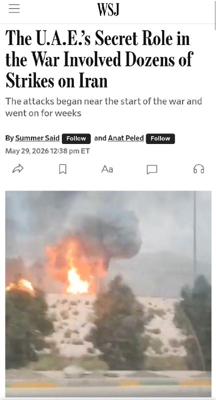

وال استریت ژورنال: امارات متحده عربی از روزهای نخست جنگ، ده‌ها حمله هوایی علیه ایران انجام داده و این حملات تا یک روز پس از اعلام آتش‌بس نیز ادامه یافته است.

این موضوع را افرادی آگاه از ماجرا اعلام کرده‌اند. بر اساس این گزارش، میزان مشارکت امارات در کارزار هوایی تحت رهبری آمریکا و اسرائیل بسیار گسترده‌تر از آن چیزی بوده که پیش‌تر شناخته شده بود.

گستردگی این حملات، شواهد بیشتری از تمایل روزافزون این کشور برای دفاع از آنچه منافع راهبردی خود می‌داند ارائه می‌کند؛ رویکردی که آن را از برخی همسایگانش در منطقه خلیج فارس متمایز کرده است؛ کشورهایی که در قبال تهدید ناشی از ایران، رویکردی بسیار محتاطانه‌تر در پیش گرفته‌اند.

این افراد گفتند که این حملات با هماهنگی آمریکا و اسرائیل انجام شده و هر دو کشور اطلاعات لازم را در اختیار امارات قرار داده‌اند. به گفته برخی از این افراد، اهداف این حملات شامل جزایر قشم و ابوموسی در تنگه هرمز، بندرعباس، پالایشگاه نفت جزیره لاوان در خلیج فارس و مجتمع پتروشیمی عسلویه بوده است.

📝 Amir

📌 @persian_trend_official
پرشین ترند | متفاوت‌ترین کانال نظامی

## Persian_Trend_Official — post 15261

  <a href="telegram/content/Persian_Trend_Official_15261_1780076924.webm" target="_blank">🎬 Download video</a>

📌 @persian_trend_official
پرشین ترند | متفاوت‌ترین کانال نظامی

## Persian_Trend_Official — post 15260

https://youtube.com/shorts/rI4eO2nPCPY

## Persian_Trend_Official — post 15259

  <a href="telegram/content/Persian_Trend_Official_15259_1780076924.webm" target="_blank">🎬 Download video</a>

قیمت نفت برنت، هم اکنون:

📝 Nick

📌 @persian_trend_official
پرشین ترند | متفاوت‌ترین کانال نظامی

## Persian_Trend_Official — post 15258

  <a href="telegram/content/Persian_Trend_Official_15258_1780076925.webm" target="_blank">🎬 Download video</a>

تیم حکومتی جمهوری اسلامی 0 - 1 گامبیا 🇬🇲

پ.ن: گامبیا کجاست؟ 🤔

📝 Nick

📌 @persian_trend_official
پرشین ترند | متفاوت‌ترین کانال نظامی

## Persian_Trend_Official — post 15257

  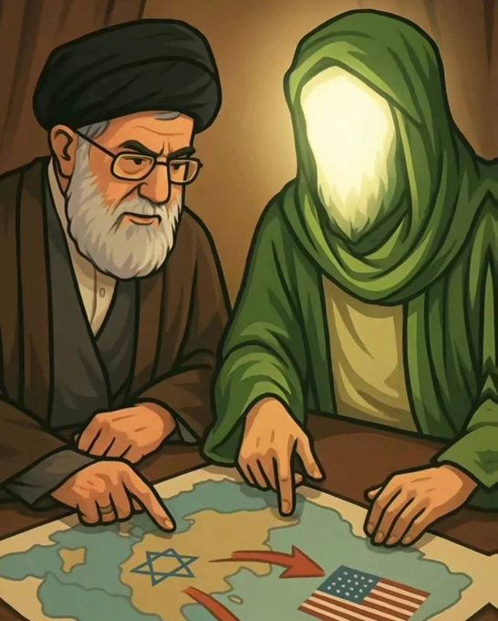

محسن محمودی، رییس شورای هماهنگی تبلیغات اسلامی، تهران گفت که ستاد آماده برگزاری مراسمی برای تشییع جنازه علی خامنه‌ای است اما زمان مراسم هنوز مشخص نیست و به محض مشخص شدن از موارد مسئول اعلام خواهد شد.

📌 @persian_trend_official
پرشین ترند | متفاوت‌ترین کانال نظامی

## Persian_Trend_Official — post 15256

  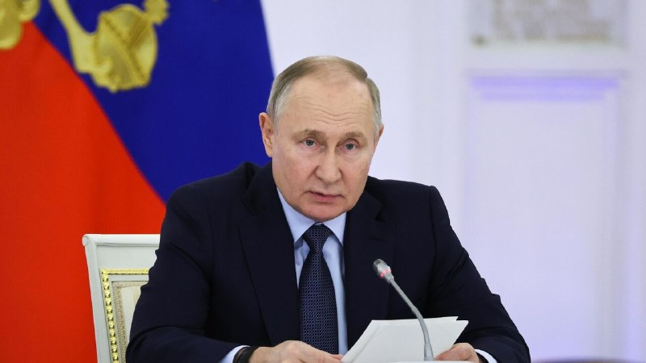

پوتین: همین الان از حادثه پهپاد ادعایی روسی در رومانی مطلع شدم!

ولادیمیر پوتین، رئیس‌جمهور روسیه، اعلام کرد که تازه از حادثه مربوط به پهپاد ادعایی روسی در رومانی مطلع شده است. وی افزود: هیچ کس بدون انجام کارشناسی نمی‌تواند درباره تعلق این پهپاد اظهار نظر کند. اولین واکنش اتحادیه اروپا به هر پهپادی این است که آن را روسی بنامد، اما بعداً مشخص می‌شود که اینطور نیست.

پوتین تأکید کرد که اگر داده‌های عینی درباره پهپاد سقوط کرده در رومانی در اختیار روسیه قرار گیرد، این کشور تحقیقات عینی انجام داده و ارزیابی خود را ارائه خواهد داد.

📝 Amir

📌 @persian_trend_official
پرشین ترند | متفاوت‌ترین کانال نظامی

## Persian_Trend_Official — post 15255

فارس از نقل منابع آگاه می‌گوید متن توافق که تحت قالب تعهد در برابر تعهد تدوین شده، در مراحل نهایی تصویب در ایران قرار دارد و هنوز تصمیم قطعی اتخاذ نشده است، تا زمانی که پول های بلوکه شده آزاد نشود وارد مرحله جدید مذاکره نخواهیم شد.

فارس: ادعاهای تازه دونالد ترامپ، رئیس جمهور آمریکا، درباره توافق احتمالی با ایران، اظهارات او را آمیخته ای از راست و دروغ و تلاشی برای نمایش پیروزی ساختگی توصیف کرده اند. به گفته این منابع، تقریباً برای همه روشن شده که این ادعاها فاقد اعتبار است.

بندهای کلیدی توافق که ترامپ از آنها عبور کرده: 1-پرداخت فوری 12 میلیارد دلاری: مهمترین بخش توافق که ترامپ به آن اشاره ای نکرده، شرط پرداخت فوری 12 میلیارد دلار از دارایی های بلوکه شده ایران است. بر اساس متن توافق، این مبلغ باید بلافاصله پرداخت شود و تا زمانی که این پرداخت انجام نگیرد، ایران وارد هیچ مرحله مذاکراتی بعدی نخواهد شد. عدم اجرای این بند، نقض تعهدات آمریکا محسوب می شود.

2-آتش بس در لبنان: موضوع دیگر، برقراری آتش بس کامل در لبنان مطابق با نظر حزب الله است.

به‌گفتهٔ منابع آگاه، تنها در صورت حل این موارد، ایران در مرحله بعد درباره لغو همه تحریم ها و موضوع هسته ای، مطابق با خطوط قرمز خود وارد گفتگو خواهد شد. همزمان با این اظهارات، مقامات ایرانی تأکید کرده‌اند که توافق نهایی مبتنی بر اصول و خطوط قرمز نظام جمهوری اسلامی ایران و با رویکرد بی اعتمادی کامل به آمریکا تنظیم خواهد شد؛ به گونه ای که در صورت هرگونه عهدشکنی، اقدام متقابل فوری انجام شود.

📝 Amir

📌 @persian_trend_official
پرشین ترند | متفاوت‌ترین کانال نظامی

## Persian_Trend_Official — post 15254

  <a href="telegram/content/Persian_Trend_Official_15254_1780076926.mp4" target="_blank">🎬 Download video</a>

حزب‌الله لبنان ویدیویی از شلیک موشک کروز قدس به سمت مواضع ارتش اسرائیل در تاریخ 27 می(دو روز پیش)منتشر کرد.

موشک کروز قدس در ایران با ناو پاوه شناخته میشود که دارای بردی 1650 کیلومتری است. حوثی های یمن و مقاومت عراق از دیگر کاربران این موشک هستند.

📝 Amir

📌 @persian_trend_official
پرشین ترند | متفاوت‌ترین کانال نظامی

## Persian_Trend_Official — post 15253

  <a href="telegram/content/Persian_Trend_Official_15253_1780076928.webm" target="_blank">🎬 Download video</a>

پس از پست ترامپ در تروث سوشال، قیمت نفت برنت برای اولین بار پس از 50 روز به زیر 90 دلار در هر بشکه رسید.

📝 Amir

📌 @persian_trend_official
پرشین ترند | متفاوت‌ترین کانال نظامی

## Persian_Trend_Official — post 15252

  <a href="telegram/content/Persian_Trend_Official_15252_1780076929.webm" target="_blank">🎬 Download video</a>

ترامپ: ایران باید موافقت کند که هرگز سلاح هسته‌ای یا بمب اتمی نخواهد داشت. تنگه هرمز باید فوراً و بدون عوارض برای تردد نامحدود کشتی‌ها، در هر دو جهت، باز شود. تمام مین‌های آبی، در صورت وجود، از بین خواهند رفت (ما با مین‌روب‌های زیرآبی بزرگ خود، تعداد زیادی…

## Persian_Trend_Official — post 15251

  <a href="telegram/content/Persian_Trend_Official_15251_1780076929.webm" target="_blank">🎬 Download video</a>

ترامپ: ایران باید موافقت کند که هرگز سلاح هسته‌ای یا بمب اتمی نخواهد داشت. تنگه هرمز باید فوراً و بدون عوارض برای تردد نامحدود کشتی‌ها، در هر دو جهت، باز شود.

تمام مین‌های آبی، در صورت وجود، از بین خواهند رفت (ما با مین‌روب‌های زیرآبی بزرگ خود، تعداد زیادی از این مین‌ها را از طریق انفجار حذف کرده‌ایم. ایران بلافاصله عملیات حذف و/یا انفجار هر مین باقی مانده‌ای را که تعدادشان زیاد نخواهد بود، تکمیل خواهد کرد!).

مواد غنی‌شده، که گاهی اوقات به عنوان گرد و غبار هسته‌ای شناخته می‌شوند، که در اعماق زمین با کوه‌های تقریباً فروریخته دفن شده‌اند، ناشی از حمله قدرتمند بمب‌افکن B2 ما در 11 ماه پیش، که روی آن قرار دارد، توسط ایالات متحده با هماهنگی و همکاری نزدیک با جمهوری اسلامی ایران، به علاوه آژانس بین‌المللی انرژی اتمی، از زیر خاک بیرون کشیده شده و نابود خواهند شد.

تا اطلاع ثانوی هیچ پولی رد و بدل نخواهد شد. در مورد سایر اقلام، با اهمیت بسیار کمتر، توافق شده است. من اکنون در اتاق وضعیت جلسه خواهم داشت تا تصمیم نهایی را بگیرم.

📝 Amir

📌 @persian_trend_official
پرشین ترند | متفاوت‌ترین کانال نظامی

## Persian_Trend_Official — post 15250

نتانیاهو، نخست وزیر اسرائیل: نبرد علیه حزب‌الله در شمال در حال مدیریت است و باید به شما بگویم که نتایج بسیار چشمگیری در اینجا حاصل شده است.

نیروهای ما از رود لیتانی عبور کرده‌اند، به منطقه مسلط رسیده‌اند و ما همچنین در بیروت، بقاع و در تمام عرض جبهه در حال فعالیت هستیم و قاطعانه به حزب‌الله ضربه می‌زنیم.

📝 Amir

📌 @persian_trend_official
پرشین ترند | متفاوت‌ترین کانال نظامی

## Persian_Trend_Official — post 15249

  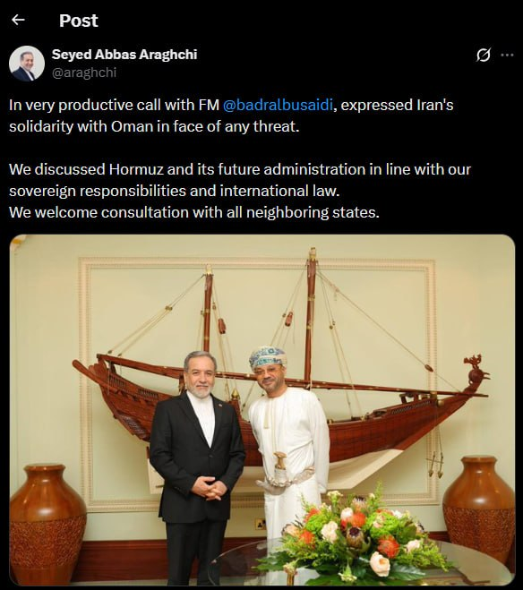

عباس عراقچی، وزیر امور خارجه جمهوری اسلامی با انتشار توییتی در حساب X خود خبر از تماس تلفنی با وزیر امور خارجه عمان داد.

عباس عراقچی میگوید تماس تلفنی با البوسعیدی، وزیر امور خارجه عمان داشته و همبستگی ایران با عمان در مواجهه با هرگونه تهدیدی علیه این کشور را ابراز کرده است.

این تماس به احتمال زیاد به دلیل تهدیدهای اخیر وزیر خزانه داری امریکا علیه عمان بوده.

📝 Amir

📌 @persian_trend_official
پرشین ترند | متفاوت‌ترین کانال نظامی

## Persian_Trend_Official — post 15245

  <a href="telegram/content/Persian_Trend_Official_15245_1780076930.mp4" target="_blank">🎬 Download video</a>

نیروی هوایی اسرائیل همچنان در حال بمباران مواضع حزب‌الله لبنان است.

📝 Amir

📌 @persian_trend_official
پرشین ترند | متفاوت‌ترین کانال نظامی

## RadioFarda — post 157700

  

🔸خبرگزاری رویترز روز جمعه به نقل از یک منبع ایرانی نوشت که بین تهران و واشینگتن یک تفاهم سیاسی صورت گرفته اما هنوز نهایی نشده و همچنین توافق با ایران شامل نابودی مواد هسته‌ای نیست.

🔸دونالد ترامپ، رئیس‌جمهور آمریکا ساعتی پیش اعلام کرد که توافق پایان دادن جنگ باید شامل مواردی مانند تعهد ایران به باز شدن تنگه هرمز و نابودی ذخایر اورانیوم باشد.

🔸منبع ایرانی به رویترز گفته است که تفاهم بین واشینگتن و تهران شامل موضوع هسته‌ای نیست و اظهارات آقای ترامپ درباره نابودی اورانیوم ایران را رد کرده است.

🔸خبرگزاری فارس، نزدیک به سپاه پاسداران، نیز به نقل از یک منبع ایرانی دیگر اظهارنظر رئیس‌جمهور ایالات منحده دربارهٔ توافق احتمالی با ایران، را «آمیخته‌ای از راست و دروغ» خوانده است.

🔸این منبع گفته که در متن توافق بندی درباره باز شدن تنگه هرمز بدون دریافت عوارض وجود ندارد و تفاهم بر سر نابودی دخایر اورانیوم ایران را نیز «بی‌اساس» دانسته است.

@RadioFarda

## RadioFarda — post 157699

  <a href="https://t.me/radiofarda/157699" target="_blank">📎 Download file</a>

تفاهم احتمالی آمریکا و ایران به معنی پایان «نه جنگ، نه صلح» است؟ گفت‌وگو با علی واعظ

🔸علی واعظ، مدیربخش ایران در گروه بین‌المللی بحران در ژنو سوییس ساعتی بعد از اعلام رئیس‌جمهور آمریکا درباره قصدش برای اتخاذ تصمیم نهایی درباره توافق با ایران به رادیوفردا می‌گوید تفاهم میان دو کشور بسیار محتمل است اما دست یافتن به توافق جامع به فاکتورهایی بستگی دارد که دستیابی به آن را دشوارتر می‌کند.

@RadioFarda

## RadioFarda — post 157698

  <a href="https://t.me/radiofarda/157698" target="_blank">📎 Download file</a>

📻بشنوید: ایستگاه ۱۹ با رادیوفردا، هشتم خرداد ۱۴۰۵

@RadioFarda

## RadioFarda — post 157697

آیا اسرائیل برای سومین جنگ احتمالی با ایران آماده می‌شود؟

🔸هم‌زمان با تحویل هواپیماهای جدید سوخت‌رسان آمریکایی به ارتش اسرائیل، ستاد پشت جبهه این کشور به رسانه‌ها گفته تدارکاتش برای «سومین جنگ احتمالی» با ایران به‌صورتی ادامه دارد که بتوان جامعه را با بیشترین سرعت برای جنگی دیگر آماده کرد.

🔸در این میان، رسانه‌های اسرائیل «نگرانی» کشورشان از توافق احتمالی آمریکا و ایران را بازتاب داده و نوشته‌اند جنگ اخیر اهداف اسرائیل را محقق نکرد.

🔸افسران ارشد اسرائیل در گفت‌وگوهای هم‌زمان با رسانه‌های این کشور در روز هفتم خرداد، گفتند از مسئولان کشوری و نظامی فرمان گرفته‌اند تا اقدامات لازم برای دفاع از مردم و پشت جبهه اسرائیل را برای سومین جنگ احتمالی با ایران انجام دهند.

🔸به گزارش شبکه کان، افسران یادشده گفتند دستور دارند به‌‎گونه‌ای شرایط را مهیا کنند که جامعه در بخش دفاعی و پشت جبهه مانند یک خودرو بتواند به سرعت از «صفر به صد» برسد.

🔸آن‌ها افزودند برنامه‌ریزی جنگ بعدی باید محرمانه پیش رود و هیچ اطلاعی از آن به عوامل و افرادی در جامعه اسرائیل درز نکند تا بیشترین غافلگیری برای کشور هدف را به همراه داشته باشد.

🔸بر اساس این گزارش، در آن صورت، پشت جبهه اسرائیل نخواهد توانست از قبل به مردم هشداری برای تدارکات و آمادگی بدهد و از این رو، «شرایط باید از حالا به گونه‌ای فراهم شود که در کمترین بازه زمانی بتوان از زندگی عادی روزانه وارد فاز جنگ شدید شد و آماده دفاع بود».

🔸گزارش کامل را در وب‌سایت رادیوفردا بخوانید.

@RadioFarda

## RadioFarda — post 157696

  <a href="https://t.me/radiofarda/157696" target="_blank">📎 Download file</a>

چشم‌انداز دسترسی به اینترنت برای شهروندان ایرانی در گفت‌وگو با اشکان خسروپور

🔸بعد از آنکه دولت در ایران دستور «بازگشایی» اینترنت را صادر کرد و به ۸۸ روز سیاست قطع دسترسی همگانی به اینترنت پایان داد، حالا بخشی از کاربران ایرانی به مدد ابزار مختلف مقابله با فیلترینگ و وی‌پی‌ان به فضای اینترنت جهانی بازمی‌گردند. شورای اطلاع رسانی دولت در بیانیه‌ای که روز هشتم خرداد منتشر کرده یک «اقلیت پرهیاهو» را متهم کرده است که «جلوی دسترسی به اینترنت ایستاد». آیا این رویکرد حاکی از اختلاف در حاکمیت جمهوری اسلامی در زمینه دسترسی به اینترنت است؟ وضعیت کنونی «دسترسی» را چگونه باید توصیف کرد. ارزیابی اشکان خسروپور پژوهشگر سیاست‌گذاری اینترنت در فرانسه را در این زمینه بشنوید.

@RadioFarda

## RadioFarda — post 157695

  <a href="https://t.me/radiofarda/157695" target="_blank">📎 Download file</a>

🔸 در این کافه فردا به صحبت‌های عجیب زینب سلیمانی در مورد شجاعت پدرش، توهین محمدجواد لاریجانی به معاون رییس جمهور آمریکا، دغدغه‌های مسئولین نظام در مورد دفن خامنه‌ای، زندگی و آثار جهانبخش پازوکی و آخرین رویدادهای مربوط به حضور تیم ملی فوتبال ایران در جام جهانی می‌پردازیم.

🔸 برای تماس با ما می‌توانید به شناسه کافه فردا در تلگرام صوت و متن بفرستید.

📻 کافه فردا

## RadioFarda — post 157694

🔸دونالد ترامپ، رئیس‌جمهور آمریکا، اعلام کرد که روز جمعه در اتاق وضعیت کاخ سفید جلسه‌ای برگزار خواهد کرد تا تصمیم نهایی درباره توافق با ایران را اتخاذ کند. 🔸او در پستی در شبکه اجتماعی خود، تروث سوشال، مواردی را که باید در توافق احتمالی گنجانده شود، برشمرد…

## RadioFarda — post 157693

  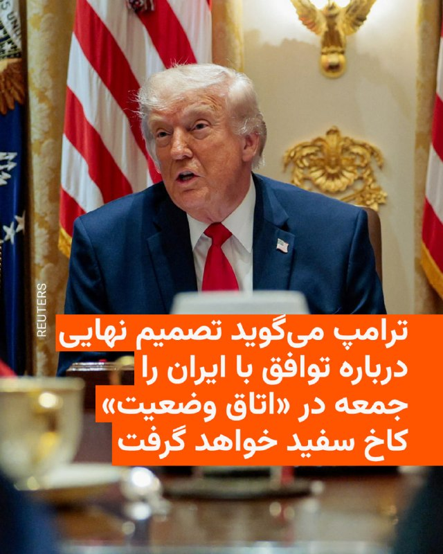

🔸دونالد ترامپ، رئیس‌جمهور آمریکا، اعلام کرد که روز جمعه در اتاق وضعیت کاخ سفید جلسه‌ای برگزار خواهد کرد تا تصمیم نهایی درباره توافق با ایران را اتخاذ کند.

🔸او در پستی در شبکه اجتماعی خود، تروث سوشال، مواردی را که باید در توافق احتمالی گنجانده شود، برشمرد و گفت که ایران باید متعهد شود که سلاح هسته‌ای تولید نکند، تنگه هرمز دوباره باز شود، هرگونه مین دریایی جمع‌آوری شود، محاصره آمریکا علیه ایران لغو گردد و اورانیوم با غنای بالای ایران توسط آمریکا خارج و نابود شود.

🔸رئیس‌جمهور آمریکا در توضیح لغو محاصره دریایی علیه ایران گفت: «کشتی‌هایی که به دلیل محاصره دریایی بی‌سابقه و فوق‌العاده ما در تنگه گرفتار شده بودند -محاصره‌ای که اکنون لغو خواهد شد- می‌توانند روند بازگشت به خانه را آغاز کنند.»

@RadioFarda

## RadioFarda — post 157692

  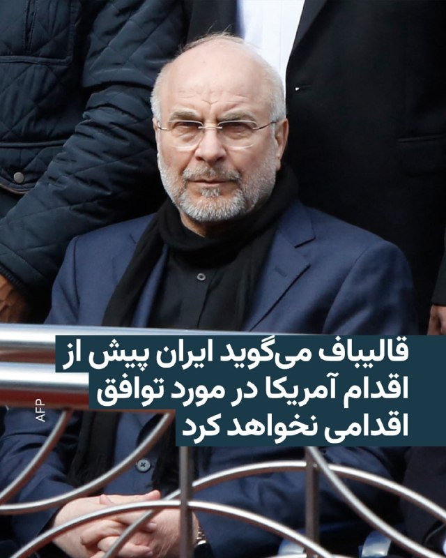

🔸محمدباقر قالیباف، مذاکره‌کننده ارشد جمهوری اسلامی با آمریکا، روز جمعه تهدید کرد که تهران امتیازات مورد نظر خود در توافق پایان دادن به جنگ را با «موشک» می‌گیرد و پیش از اقدام واشینگتن درباره این توافق اقدامی نخواهد کرد.

🔸او در شبکه ایکس همچنین نوشت: «هیچ اعتمادی به تضمین‌ها و حرف‌ها نداریم، فقط رفتارها معیار است.»

🔸این موضع‌گیری یک روز پس از آن انجام شد که چند رسانه غربی خبر دادند آمریکا و ایران به تفاهمی برای تمدید آتش‌بس و رفع محدودیت عبور و مرور کشتی‌ها در تنگه هرمز رسیده‌اند، اما این توافق منتظر تصمیم و امضای نهایی دونالد ترامپ، رئیس‌جمهور ایالات متحده است.

🔸قالیباف در پیام خود اعلام کرده که «اقدامی پیش از اقدام طرف مقابل انجام نخواهد شد».

🔸از سوی دیگر، رسانه‌های نزدیک به سپاه پاسداران می‌گویند گزارش‌ها درباره توافق تهران و واشنگتن صحیح نیست. خبرگزاری تسنیم در این مورد به نقل از یک «منبع مطلع» نوشت: «متن توافق تا این لحظه جمع‌بندی نهایی نشده است.»

@RadioFarda

## RadioFarda — post 157691

  

📷 Photo

## RadioFarda — post 157690

  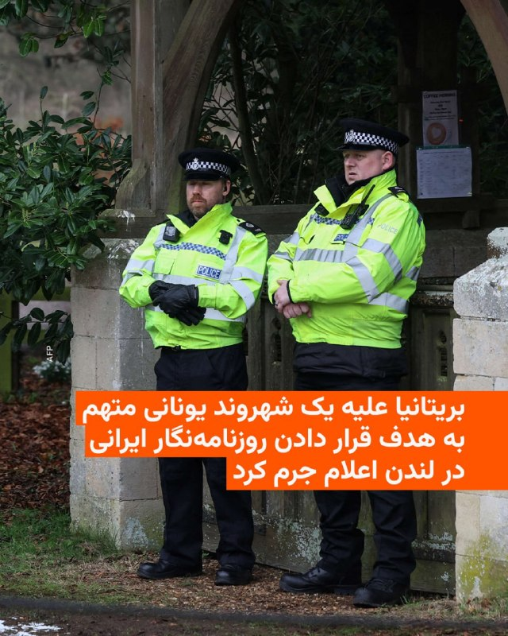

🔸پلیس بریتانیا روز جمعه اعلام کرد یک شهروند یونانی به اتهام همکاری با یک سرویس اطلاعاتی خارجی که به گفته پلیس «گمان می‌رود متعلق به ایران باشد» متهم شد. اتهام او تلاش برای هدف قرار دادن یک روزنامه‌نگار شاغل در شبکه تلویزیونی ایران اینترنشنال است.

🔸پلیس ضدتروریسم اعلام کرد که یوانیس آیدینیدیس ۴۶ ساله و ساکن مونیخ آلمان، روز شنبه بازداشت شده و بر اساس قانون امنیت ملی بریتانیا علیه او اعلام جرم شده است.

🔸قرار است آیدینیدیس روز جمعه در دادگاه وست‌مینستر حاضر شود.

🔸پلیس گفت اتهامات مطرح‌شده احتمالاً به ایران و هدف قرار دادن یک روزنامه‌نگار مستقر در بریتانیا در شبکه ایران اینترنشنال مربوط می‌شود. در بیانیه پلیس بریتانیا نام این روزنامه‌نگار ذکر نشده است.

🔸مأموران پلیس همچنین اعلام کردند که معتقد نیستند تهدید گسترده‌تری متوجه عموم مردم باشد.

🔸در ماه آوریل نیز سه نفر در ارتباط با تلاش برای حمله آتش‌سوزی عمدی به ساختمانی مرتبط با این شبکه در شمال‌غرب لندن متهم شدند؛ هرچند آن آتش‌سوزی هیچ خسارت یا مصدومیتی به همراه نداشت.

@RadioFarda

## RadioFarda — post 157689

  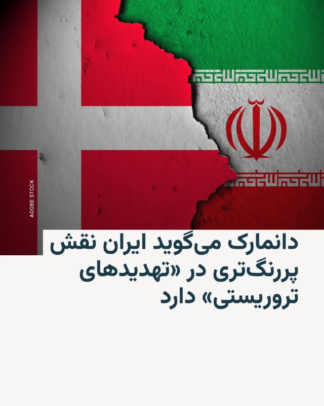

🔸سازمان اطلاعاتی دانمارک روز جمعه هشتم خرداد اعلام کرد که ایران نقش پررنگ‌تری در تهدید تروریستی علیه این کشور اسکاندیناویایی ایفا می‌کند و افزود ارزیابی تهدیدها بازتابی از تحولات جهانی است.

🔸رئیس سازمان امنیت و اطلاعات ملی دانمارک می‌گوید سطح کلی تهدید برای ایران همچنان ۴ از ۵ است، اما تأکید کرد که در سال‌های اخیر ماهیت این تهدیدها «به‌طور قابل‌توجهی تغییر کرده است».

🔸فین بورخ آندرسن در بیانیه‌ای گفت: «در سال گذشته، بازیگران دولتی اهمیت فزاینده‌ای در تهدیدات تروریستی پیدا کرده‌اند. ارزیابی ما این است که این موضوع به‌ویژه درباره ایران صدق می‌کند؛ کشوری که به‌طور خاص تهدیدی برای منافع اسرائیلی و یهودی و همچنین برخی مخالفان ایرانی در اروپا، از جمله دانمارک، محسوب می‌شود.»

🔸او افزود: «تهدید ناشی از ایران از سوی سرویس‌های اطلاعاتی این کشور سرچشمه می‌گیرد که برای برنامه‌ریزی و اجرای حملات از شبکه‌های مجرمانه و همچنین جذب نیرو در اروپا استفاده می‌کنند».

@Radiofarda

## RadioFarda — post 157688

  <a href="https://t.me/radiofarda/157688" target="_blank">📎 Download file</a>

📻بشنوید: ساعت ۱۴ با رادیوفردا،هشتم خرداد ۱۴۰۵‌

@Radiofarda

## IranianMinds — post 21030

  <a href="telegram/content/IranianMinds_21030_1780076939.mp4" target="_blank">🎬 Download video</a>

اینا واقعا به معنای واقعی عقب موندن 😂😂

@IranianMinds

## IranianMinds — post 21029

در کمال تعجب تا الان خبری از جنگ تو جنوب کشور نبوده

@IranianMinds

## IranianMinds — post 21028

  <a href="telegram/content/IranianMinds_21028_1780076940.mp4" target="_blank">🎬 Download video</a>

وضعیت تنگه هرمز
کشتی‌ها یکی پس از دیگری لنگر انداختند

@IranianMinds

## IranianMinds — post 21027

  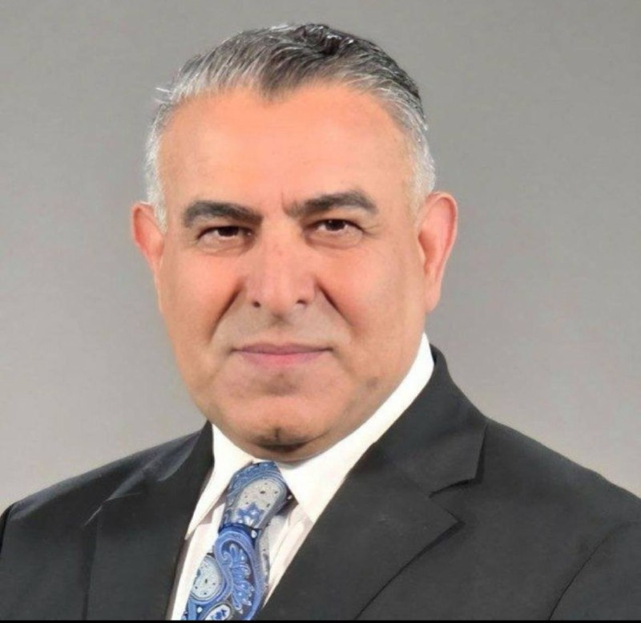

🔴 مراد ویسی :

من توی زندگیم برای ارتباط با آدما فقط یه معیار دارم، میزان تنفر از جمهوری اسلامی …

@IranianMinds

## IranianMinds — post 21026

🔴 خبرگزاری فارس :

نبینیم ترامپ شاخ و شونه بکشه اینجا همین الانم باید آمریکا باید فورا ۱۲ میلیارد دلار از دارایی‌های مسدودشده ایران رو آزاد کنه تا مذاکرات ادامه پیدا کنه، و آتش‌بس کامل در لبنان طبق شرایط حزب‌الله هم لازمه.

سریع تر انجام بده شاید مذاکره کردیم.

@IranianMinds

## IranianMinds — post 21025

  

🔴 آکسیوس :

ترامپ به زودی درباره مذاکرات با تیمش تصمیمشو میگیره و اعلام میکنه , همچنین یه مقام بالا رده دولت ترامپ گفت ما تعهدات شفاهی از سوی ایران در خصوص مواد هسته‌ای دریافت کرده‌ایم؛ اما مهم‌ترین بخش، مواردی است که در جریان مذاکرات بر سر آن‌ها توافق خواهد شد.

@IranianMinds

## IranianMinds — post 21024

  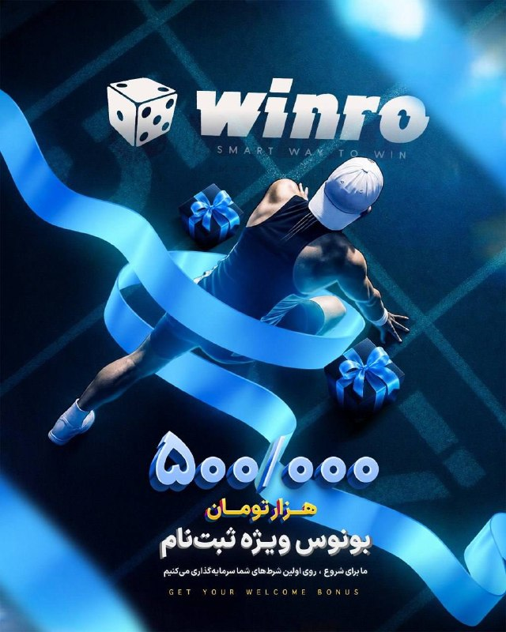

⭕️ رایگان بدون واریز شرط های فوتبالی ببند از همون اول موجودی 500 هزارتومانه
❌

🎉 500 هزارتومن رایگان فقط با ثبت نام بدون هیچگونه واریزی!

💳 پرداخت مستقیم و سریع بدون واسطه، بدون دردسر، واریز و برداشت در سریع‌ترین زمان ممکن

⌛ پشتیبانی 24 ساعته

🌐 Winro.io

🌐 Winro.io
کانال بونوس های رایگان g8

📱 @winro_io

## IranianMinds — post 21023

  

بعد حرفای ترامپ نفت سقوط آزاد کرد.

@IranianMinds

## IranianMinds — post 21022

🔴 نیویورک پست :

ترامپ هم اکنون در اتاق وضعیت کاخ سفید هست و قراره تصمیم خودش برای مذاکره با ایران رو بگیره.

@IranianMinds

## IranianMinds — post 21021

ایران باید فوراً هر مینی که باقی مانده را جمع‌آوری یا منفجر کند، که البته تعدادشان زیاد نخواهد بود!). کشتی‌هایی که به دلیل محاصره دریایی بی‌سابقه و شگفت‌انگیز ما در تنگه گیر افتاده بودند، حالا با لغو این محاصره می‌توانند روند حرکت به سمت خانه‌هایشان را آغاز کنند! از طرف من، رئیس‌جمهور محبوبتان، به همسران، شوهران، والدین و خانواده‌هایتان سلام برسانید!

## IranianMinds — post 21020

🔴 ژنرال محسن رضایی : محاصره دریایی رو برمیداریم‌ ما حالا چه با زبون زور و قدرت و یا چه با مذاکره @IranianMinds

## IranianMinds — post 21019

  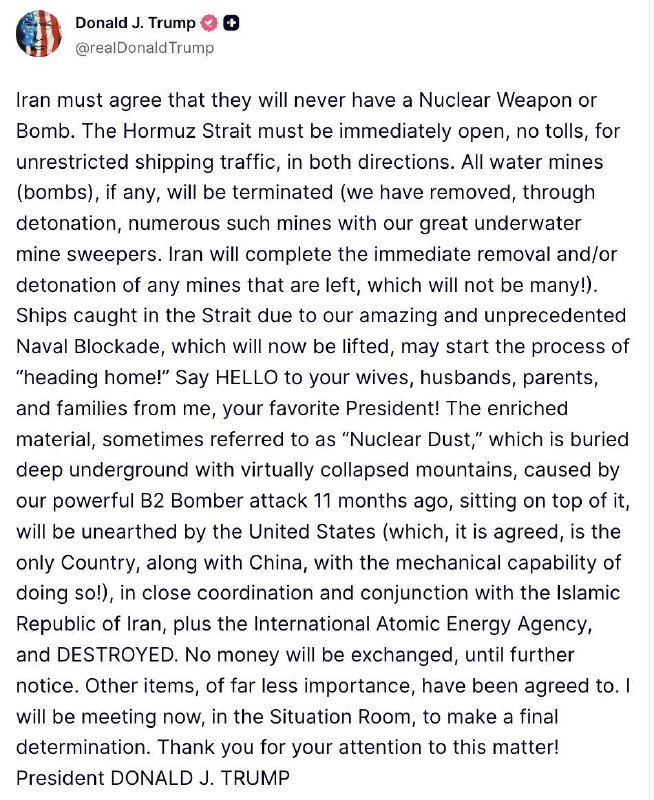

🔴 بیانیه دونالد ترامپ و اعلام شروط نهایی برای توافق با ایران

دونالد ترامپ با انتشار پستی لیست مطالبات و شروط خود را برای توافق اعلام کرد:

«ایران باید موافقت کند که هرگز سلاح یا بمب هسته‌ای نخواهد داشت. تنگه هرمز باید فوراً برای تردد نامحدود کشتی‌ها در هر دو جهت باز شود و هیچ عوارضی دریافت نشود. تمام مین‌های دریایی (بمب‌ها) در صورت وجود، باید از بین بروند (ما پیش از این، تعداد زیادی از این مین‌ها را با مین‌روب‌های پیشرفته زیردریایی خود منفجر و پاکسازی کرده‌ایم.

ایران باید فوراً هر مینی که باقی مانده را جمع‌آوری یا منفجر کند، که البته تعدادشان زیاد نخواهد بود!). کشتی‌هایی که به دلیل محاصره دریایی بی‌سابقه و شگفت‌انگیز ما در تنگه گیر افتاده بودند، حالا با لغو این محاصره می‌توانند روند حرکت به سمت خانه‌هایشان را آغاز کنند! از طرف من، رئیس‌جمهور محبوبتان، به همسران، شوهران، والدین و خانواده‌هایتان سلام برسانید!

مواد غنی‌سازی شده که گاهی به آن "گرد و غبار هسته‌ای" می‌گویند و در اعماق زمین زیر کوه‌هایی دفن شده که ۱۱ ماه پیش در اثر حمله بمب‌افکن‌های قدرتمند B2 ما عملاً فروریختند، باید توسط ایالات متحده (که توافق شده تنها کشوری است که همراه با چین توانایی مکانیکی انجام این کار را دارد) با هماهنگی و همکاری نزدیک جمهوری اسلامی ایران و آژانس بین‌المللی انرژی اتمی، از زیر زمین خارج و نابود شود.

تا اطلاع ثانوی هیچ پولی رد و بدل نخواهد شد. در مورد موارد دیگر که اهمیت بسیار کمتری دارند نیز توافق شده است. من اکنون در اتاق وضعیت جلسه خواهم داشت تا تصمیم نهایی را بگیرم. از توجه شما به این موضوع سپاسگزارم!»

@IranianMinds

## IranianMinds — post 21018

  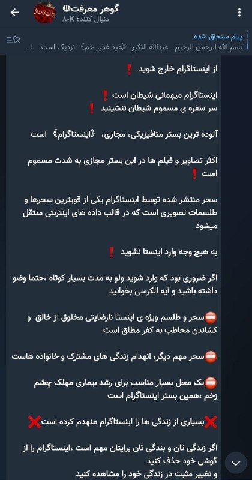

مواظب خودتون باشید وقتی وارد اینستا میشید 😂

@IranianMinds

## IranianMinds — post 21017

  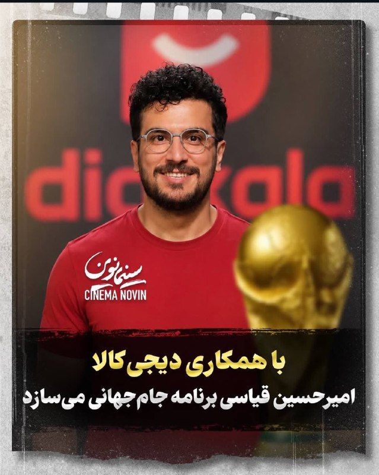

این حرومیو

@IranianMinds

## IranianMinds — post 21016

🔴شبکه العربیه به نقل از منابع آگاه:

ایران می‌خواهد اورانیوم غنی‌شده را به چین منتقل کند، مشروط بر آن‌که چین تضمین دهد که این مواد را به آمریکا تحویل ندهد.

@IranianMinds

## IranianMinds — post 21015

  <a href="telegram/content/IranianMinds_21015_1780076949.mp4" target="_blank">🎬 Download video</a>

⚫️ حرف های دردناک مادر جاویدنام مهدی کبوک :

اسم پسر منو هیچ جا نیاوردن ، پسرم فقط سه روز از ازدواجش گذشته بود بچه ای که با یتیمی بزرگش کرده بودم و شده بود مهندس این مملکت رو کشتن و ازم گرفتنش 💔 …

@IranianMinds

## IranianMinds — post 21014

  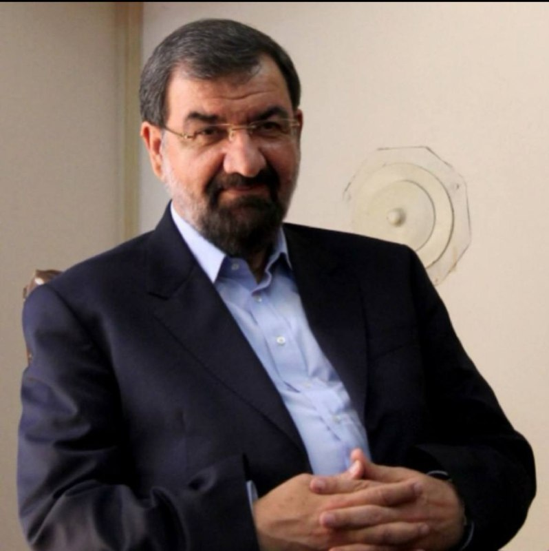

🔴 ژنرال محسن رضایی :

محاصره دریایی رو برمیداریم‌ ما حالا چه با زبون زور و قدرت و یا چه با مذاکره

@IranianMinds

## IranianMinds — post 21013

🔴 امام جمعه ساری هم گفت:

با شعار مرگ بر آمریکا، شیطان بزرگ را سنگسار می‌کنیم😂

@IranianMinds

## IranianMinds — post 21012

  

🔴 توییت جدید قالیباف :

۱- ما از طریق گفتگو امتیاز نمیگیریم بلکه از طریق موشک میگیریم،ما تو مذاکرات فقط به اونها میفهمونیم.

۲-ما به تضمینو کلمات اعتمادی نداریم،فقط عمل واسمون معیاره،هیچ اقدامی قبل از اقدام طرف مقابل انجام نمیدیم.

۳-برنده ی هر توافق کسیه که فردای آن روز واسه جنگ آماده تر باشه.

@IranianMinds

## IranianMinds — post 21011

  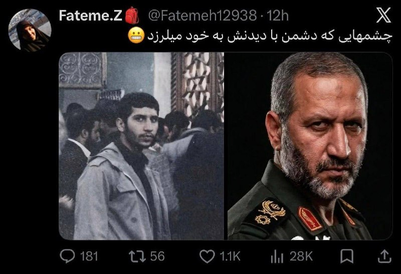

ترامپ بعد دیدن این تصویر دستور عقب نشینی سریع و کامل ارتش آمریکا از خاورمیانه و هزار کیلومتری اطراف خاورمیانه رو داد.

@IranianMinds

## BBCPersian — post 282345

  <a href="https://t.me/bbcpersian/282345" target="_blank">📎 Download file</a>

پادکست جام جهان‌نما، جمعه ۸ خرداد ۱۴۰۵ این برنامه رادیویی رامی‌توانید هرشب ساعت ۲۰ به وقت ایران، روی موج متوسط ۷۰۲ کیلوهرتز و موج کوتاه۹۴۶۵ کیلوهرتز بشنوید. تکرار برنامه را هم می‌توانید ساعت ۲۱:۳۰ روی موج متوسط ۷۰۲ کیلوهرتز و موج کوتاه۵۳۹۵ کیلوهرتز گوش کنید.
@BBCPersian

## BBCPersian — post 282344

🔻دونالد ترامپ، رئیس‌جمهور آمریکا، دقایقی پیش اعلام کرد که در اتاق وضعیت جلسه خواهد داشت تا درباره ایران تصمیم نهایی را بگیرد.

او در پستی در شبکه اجتماعی خود تروث سوشال، فهرستی را از خواسته‌هایی که می‌گوید ایران باید برآورده کند، مطرح کرده و گفته است در مورد موضوعات «کم اهمیت‌ت» دیگر توافق حاصل شده است.

آقای ترامپ در ابتدا خواسته اصلی خود را تکرار کرده است: «ایران باید موافقت کند که هرگز به سلاح یا بمب هسته‌ای دست نخواهد یافت.»

او در ادامه خواستار باز شدن تنگه هرمز «در هر دو جهت» و «بدون هیچ عوارضی» شد.

رئیس‌جمهور آمریکا سپس به موضوع مین‌گذاری در تنگه هرمز اشاره کرد و گفت: «تمام مین‌های دریایی (بمب‌ها)، در صورت وجود، از بین خواهند رفت (ما با مین‌روب‌های زیردریایی فوق‌العاده خود، تعداد زیادی از این مین‌ها را از طریق انفجار خنثی کرده‌ایم. ایران بلافاصله عملیات جمع‌آوری ویا انفجار هرگونه مین باقی‌مانده را که تعدادشان زیاد نخواهد بود، تکمیل خواهد کرد.)»

آقای ترامپ در ادامه مژده می‌دهد که پس از توافق، کشتی‌هایی که به دلیل محاصره دریایی آمریکا در تنگه هرمز گرفتار شده‌اند، می‌توانند رهسپار خانه شوند:

«از طرف من، رئیس جمهور محبوبتان، به همسران، شوهران، والدین و خانواده‌هایتان سلام کنید.»

دونالد ترامپ سپس به ذخایر اورانیوم غنی‌شده ایران می‌پردازد و می‌گوید این مواد که بر اثر حمله هوایی ۱۱ ماه پیش آمریکا اکنون در زیر خاک مدفون شده‌اند، توسط آمریکا و با هماهنگی ایران و آژانس بین‌المللی انرژی اتمی از زیر خاک بیرون آورده می‌شود و از بین برده خواهد شد.

رئیس‌جمهور آمریکا سپس تاکید می‌کند که «تا اطلاع ثانوی هیچ پولی رد و بدل نخواهد شد.»

@BBCPersian

## BBCPersian — post 282343

  <a href="telegram/content/BBCPersian_282343_1780076953.mp4" target="_blank">🎬 Download video</a>

یک موشک «نیو گلن» متعلق به شرکت بلو اوریجین، شامگاه پنج‌شنبه ۷ خرداد، روی سکوی پرتابی در کیپ کاناورال در ایالت فلوریدای آمریکا منفجر شد.
 
این شرکت فناوری فضایی که در سال ۲۰۰۰ توسط جف بزوس، میلیاردر و بنیان‌گذار آمازون تأسیس شده است، اعلام کرد که این حادثه هیچ‌گونه مصدومیتی نداشته است.
 
به گفته مسئولان شرکت، این انفجار در جریان یک ارزیابی پیش از پرواز، موسوم به «آزمایش هات‌فایر» رخ داد و این حادثه به‌عنوان یک «ناهنجاری» توصیف شد.

@BBCPersian

## BBCPersian — post 282342

  

‌🔻سازمان اطلاعات و امنیت دانمارک گفته است که ایران طی یک سال اخیر، نقش پررنگ‌تری در «تهدیدهای تروریستی» علیه آن کشور داشته است.

سرویس اطلاعات و امنیت ملی دانمارک روز جمعه گفت که ماهیت این تهدیدها «به‌طور قابل توجهی تغییر کرده است.»

فین بورخ اندرسن، رئیس این سازمان، در بیانیه‌ای گفت: «در یک سال گذشته، بازیگران دولتی اهمیت بیشتری در تهدید تروریستی پیدا کرده‌اند. بنابر ارزیابی ما، این موضوع به‌ویژه درباره ایران صدق می‌کند، کشوری که تهدیدی را متوجه منافع اسرائیل و یهودی‌ها و همچنین برخی مخالفان ایرانی در اروپا می‌کند، از جمله در دانمارک.»

او اضافه کرد: «تهدیدهایی که از سوی ایران با آن مواجهیم از نهادهای اطلاعاتی این کشور سرچشمه می‌گیرد. همچنین از شبکه‌های جنایی و علاوه بر این، جذب نیروهایی در اروپا که از آنها برای برنامه‌ریزی و اجرای حملات استفاده می‌کند.»

لینک خبر کامل:
https://bbc.in/4o4wJnC
📷Getty Images

@BBCPersian

## BBCPersian — post 282341

  <a href="telegram/content/BBCPersian_282341_1780076956.mp4" target="_blank">🎬 Download video</a>

🔻زنی در شهر پالم بیچ ایالات فلوریدای آمریکا توسط یک افسر پلیس و به ظن در دست داشتن تلفن همراه با دست راست هنگام رانندگی متوقف شد.

کاتلین توماس که دست راستش را از دست داده، بازوی راستش را بالا برد تا نبود دستش را به افسر نشان دهد، اما با این حال برای او پرونده ثبت شد.

این رویداد در ماه فوریه رخ داد و در هفته جاری، این افسر درخواست کرده است که این اتهامات رد شود.

دفتر کلانتر شهرستان پالم بیچ به بی‌بی‌سی اعلام کرد: «معاون بر اساس مشاهده بصری اقدام به توقف خودرو کرد. پس از بررسی‌های بیشتر و به دلیل نبود شفافیت در نحوه ثبت تخلفات در نرم‌افزار صدور جریمه، در نهایت تصمیم به لغو اتهامات گرفته شد.»
https://bbc.in/42ZkFdA

@BBCPersian

## BBCPersian — post 282340

  

‌🔻محمدباقر قالیباف، رئیس مجلس شورای اسلامی و مذاکره‌کننده ارشد جمهوری اسلامی در پیامی که در شبکه اجتماعی ایکس منتشر کرده، نوشته است: «ما امتیازات را نه با گفت‌وگو، بلکه با موشک‌‌ها می‌گیریم، در مذاکره فقط آن‌ها را تفهیم می‌کنیم.»

او به موضوع اعتماد میان دو طرف در مذاکرات جاری با آمریکا اشاره کرده و نوشته است: «اعتمادی به تضمین‌ها و حرف‌ها نداریم، فقط رفتارها معیار است. هیچ اقدامی پیش از اقدام طرف مقابل انجام نخواهد شد.»

آقای قالیباف در ادامه پیامش آورده است:«پیروز هر توافقی کسی است که از فردای آن، بهتر برای جنگ آماده شود.»

محمدباقر قالیباف دوشنبه به قطر رفته بود.

هدف از این سفر مذاکره بر سر برخی از دارایی‌های ایران بود که به دلیل تحریم‌های ایالات متحده مسدود شده است.

📷 ICANA News Agency via Getty Images
https://bbc.in/3RQ4kFC

@BBCPersian

## BBCPersian — post 282339

🔻حمله پهپادی به یک کشتی ترکیه در دریای سیاه

🔻پس از آن‌که یک کشتی ترکیه در طول شب گذشته هدف حمله پهپادی قرار گرفت، این کشور نسبت به خطرات تشدید کنترل‌نشده تنش‌ها در منطقه دریای سیاه هشدار داد.

وزارت خارجه ترکیه مشخص نکرده است که کدام کشور مسئول این حمله بوده است.

در جریان جنگ روسیه و اوکراین، هر دو طرف کشتی‌هایی را در دریای سیاه هدف قرار داده‌اند.

https://bbc.in/4fJezFG
@BBCPersian

## BBCPersian — post 282338

  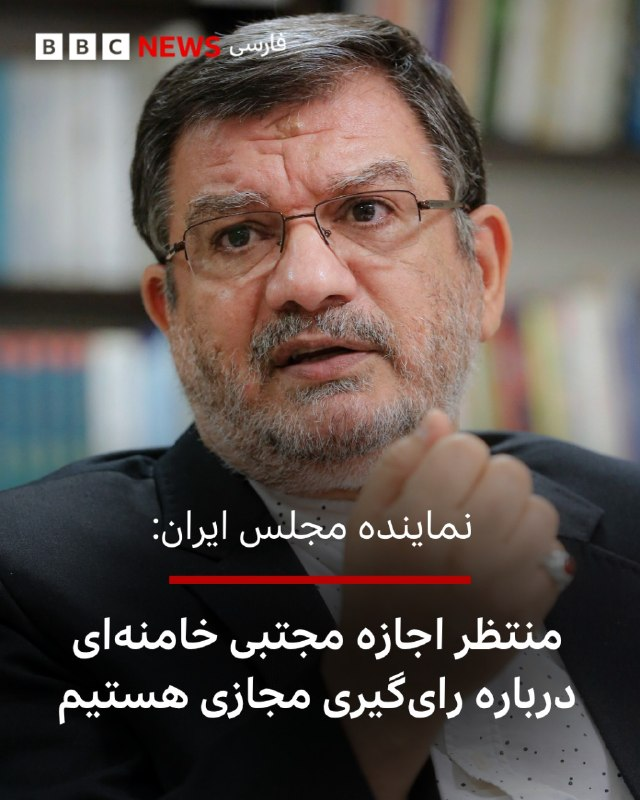

🔻عبدالحسین روح‌الامینی، نماینده مجلس شورای اسلامی در یک برنامه تلویزیونی گفت چند هفته است که از مجتبی خامنه‌ای، رهبر جدید ایران، اجازه خواسته‌اند تا «قانون‌گذاری و رای‌گیری» مجازی در مجلس انجام شود.

او گفت در حال حاضر دستگاه‌های امنیتی اجازه جمع شدن نمایندگان مجلس شورای اسلامی را نمی‌دهند.

آقای روح‌الامینی در ادامه این گفت‌وگو اشاره کرد که تا کنون پاسخی از مجتبی خامنه‌ای به این پرسش داده نشده است.

روح‌الله ایزدخواه، نماینده مردم تهران در مجلس هم در این برنامه گفت تا کنون نمایندگان دو، سه، جلسه مجازی با «تبلت‌های مخصوص» مجلس برگزار کرده‌اند اما بنابر بر آیین‌نامه مجلس اجازه «رای‌گیری مجازی» وجود ندارد.

لینک خبر کامل:
https://bbc.in/4uOJwwT
📷khamenei.ir

@BBCPersian

## BBCPersian — post 282337

  <a href="telegram/content/BBCPersian_282337_1780076959.mp4" target="_blank">🎬 Download video</a>

🔻سرخط خبرهای روز جمعه ۸ خرداد ۱۴۰۵
@BBCPersian

## BBCPersian — post 282336

  <a href="telegram/content/BBCPersian_282336_1780076962.mp4" target="_blank">🎬 Download video</a>

🔻گروه‌های امداد در لائوس پنج روستایی را که پس از بارندگی‌های شدید و رانش زمین به مدت یک هفته در غاری سیلابی گرفتار شده بودند، زنده پیدا کردند.

به گفته تیم‌های نجات لائوسی و تایلندی که در این عملیات مشارکت داشتند، دو نفر دیگر از اعضای این گروه همچنان مفقود هستند.

این افراد چهارشنبه هفته گذشته برای جست‌وجوی ذخایر طلا و شکار حیوانات وحشی وارد غار شده بودند، اما پس از مسدود شدن دهانه ورودی بر اثر سیلاب، نتوانستند خارج شوند.

در عملیات امدادرسانی، گروهی از متخصصان باتجربه در عملیات نجات از غار، از جمله اعضای تیم معروف تایلندی که در سال ۲۰۱۸ یک گروه دانش‌آموز را نجات داده بودند، حضور داشتند.
https://bbc.in/4nYZxxB
📸 Reuters
@BBCPersian

## BBCPersian — post 282335

  

‌🔻صندوق کودکان سازمان ملل، یونیسف، می‌‌گوید در یک هفته گذشته، به‌طور میانگین، هر ۲۴ ساعت ۱۱ کودک در حملات اسرائیل در لبنان کشته یا زخمی شدند.

به گفته یونیسف، در هفت روز گذشته، ۱۵ کودک در لبنان کشته و ۶۲ کودک دیگر زخمی شده‌اند.

با وجود آتش‌بس، اسرائیل دامنه و شدت حملاتش در لبنان را افزایش داده است.

حملات سنگین اسرائیل از شامگاه چهارشنبه تا بامداد پنج‌شنبه شهرها و روستاهایی در جنوب لبنان را هدف قرار داد.

در این مدت اسرائیل مناطق جدیدی را هم به عنوان مناطق درگیری و عملیاتی اعلام کرد.

اسرائیل همچنین ساختمانی را در حومه جنوبی بیروت هدف قرار داده است.

یونیسف می‌گوید در مجموع، در هفت روز گذشته، ۷۷ کودک در لبنان کشته یا زخمی شدند.

این نهاد در گزارش خود اعلام کرد که از زمان آغاز آتش‌بس در ماه آوریل، در مجموع ۵۵ کودک کشته و ۲۱۲ کودک زخمی شده‌اند.

ریکاردو پیرس، سخنگوی یونیسف، این آمار را «تکان‌دهنده» توصیف کرد.

بنابر آتش‌بسی که آمریکا از ۱۶ آوریل (۲۷ فروردين ۱۴۰۵) آن را اعلام کرد، قرار بود جنگ میان اسرائیل و حزب‌الله لبنان پایان یابد.

📷EPA
https://bbc.in/4fkdFzr

@BBCPersian

## BBCPersian — post 282334

  <a href="telegram/content/BBCPersian_282334_1780076965.mp4" target="_blank">🎬 Download video</a>

🔻محسن قاصد، فعال محیط‌زیست و عکاس، ویدیویی از بازگشت پرندگان مهاجر به جزیره حفاظت شده هون در دریاچه ارومیه منتشر کرده است. او در توضیح این ویدیو نوشته: «امسال حجم و تعداد و تنوع انواع گونه از پرندگانی که در دریاچه و جزایر دیده می‌شوند نسبت به سال‌های گذشته ده‌ها برابر بیشتر شده است.»

اطلاعات ثبت‌شده توسط اداره کل محیط زیست آذربایجان شرقی و غربی نشان می‌دهد بهار امسال، حجم آب دریاچه ارومیه با افزایشی ۱۵ برابری نسبت به سال گذشته روبه‌رو بوده است.

بهبود نسبی شرایط دریاچه ارومیه باعث بازگشت پرندگان مهاجری مثل فلامینگوها و کاکایی‌ها به این دریاچه شده که در سال‌های پیش، به دلیل خشکسالی شدید، از این دریاچه رفته بودند.

با این حال مقام‌های سازمان محیط‌زیست هشدار داده‌اند دریاچه ارومیه «هنوز از وضعیت بحران خارج نشده است.»

دریاچه ارومیه در شمال غربی ایران واقع شده است و بزرگ‌ترین دریاچه داخلی کشور به شمار می‌رود. این دریاچه در سال ۱۴۰۴ و در پی بحران‌های متعدد، به خشکی کامل نزدیک شد.

@BBCPersian

## Dirty_Kids — post 390504

  <a href="telegram/content/Dirty_Kids_390504_1780076967.mp4" target="_blank">🎬 Download video</a>

این ریمیکس الان ارزش ترند شدنو داره؛
دست به دست بکنید برسه به دست ترامپ:

@Dirty_Kids 👻

## Dirty_Kids — post 390503

میدونم به تخمتونه و متأسفانه رعایت نمیکنید فقط خواستم بگم جمعه عدهٔ شرعی آذر تموم میشه.

یعنی اینکه امروز ۸ خرداد ۱۴۰۵ جمعه، کص زن شمخانی از اسارت شرعی در میاد

@Dirty_Kids 👻

## Dirty_Kids — post 390502

  

حالا چه عجله‌‌ای هست برای ادامه‌ی جنگ. اصلا یه ۱۰ سالی طول بکشه چه اشکالی داره.

@Dirty_Kids 👻

## Dirty_Kids — post 390501

  

وقتی منتظری مسخره بازیای ترامپ تموم بشه و بزنی بقیشون رو کتلت کنی

@Dirty_Kids 👻

## Dirty_Kids — post 390500

  <a href="https://t.me/Dirty_Kids/390500" target="_blank">📎 Download file</a>

✅ اپلیکیشن اندروید سایت جهانی دربی بت

💰اولین سایت جهانی با امکان شارژ و برداشت ریالی(کارت به کارت)

🔗 برای ورود فیلترشکن روی کشور مناسب قرار دهید مانند فنلاند و المان و....

😀Telegram Channel
👇
https://t.me/+bcynkEgSW2dlYTc0

## Dirty_Kids — post 390499

  

😤دنبال یه سایت شرط بندی بین المللی بودی که به ایرانیا خدمات بده؟!
⛔

👍دربی بت همون انتخاب  100%

💎ویژگی های سایت جهانی Derby Bet:

⬅️امکان شارژ امن با کارت بانکی

⬅️واریز اول دوبل شارژ می شوید(بونوس۱۰۰٪)

⬅️پر اپشن ترین سایت فعال در ایران

⬅️تسویه حساب کمتر از 5 دقیقه

⬅️برگشت بخشی از باخت به صورت هفتگی

🚨کد هدیه ثبت نام:GG007

⚠️برای دانلود اپلکیشن کلیک کنید
👉

🔔کانال دربی بت :

🪙https://t.me/+bcynkEgSW2dlYTc0

## Dirty_Kids — post 390498

  <a href="telegram/content/Dirty_Kids_390498_1780076971.mp4" target="_blank">🎬 Download video</a>

شت

@Dirty_Kids 👻

## Dirty_Kids — post 390492

  <a href="telegram/content/Dirty_Kids_390492_1780076972.mp4" target="_blank">🎬 Download video</a>

پشم‌ریزون‌ترین چیزی که امروز دیدم

پهلون شمسی و پهلون اقدس تا حالا دیده بودید!

@Dirty_Kids 👻

## Dirty_Kids — post 390491

  <a href="telegram/content/Dirty_Kids_390491_1780076973.mp4" target="_blank">🎬 Download video</a>

مطمئنم عمو مراد «از این کسشرا»رو جا انداخت نگفت بعد ادامه داد:
"مفضّله! خيلى مفضّله!"

@Dirty_Kids 👻

## Dirty_Kids — post 390490

  

#قیمت سرویس های بادبان به گیگی 10 هزار تومان رسید بعد ایموجی موشک🚀
💥

🎁 کد تخفیف خرید اول دوباره ریست شد و همه میتونن ازش استفاده کنن:
BadBanOFF

💸 با این کد، 50 هزار تومان تخفیف روی اولین خریدت بگیر!

🔥و مهم‌تر از همه...
سیستم معرفی بادبان فعال‌تر از همیشه‌ست!
از تمام خریدهای کاربرانی که معرفی میکنی، 10% خریدشون رو پورسانت دائمی دریافت کن و موجودی کیف پولت رو افزایش بده 💼

وقتی بادبان داری، هیچ بادی مانع نیست… حتی وقتی اینترنت ملیه⛵️
G8
🛡@BadBan_VPN | کانال 
🤖@BadBan_VPNBot | ربات 
📞@BadBan_VPNSupport | پشتیبانی

## Dirty_Kids — post 390488

عزیزان، شیر خدا لحظاتی پیش پست زیر رو در تروث‌سوشال منتشر کرد و نوشته داره می‌ره ‌ اتاق وضعیت تا تصمیم نهایی رو در باره‌ی امضای تفاهم با روافض قحبه بگیره: «روافض قحبه‌زاده باید قبول کنه که هیچ‌وقتِ هیچ‌وقت صاحب سلاح یا بمب هسته‌ای نمیشه. تنگه‌ی هرمز باید…

## Dirty_Kids — post 390487

  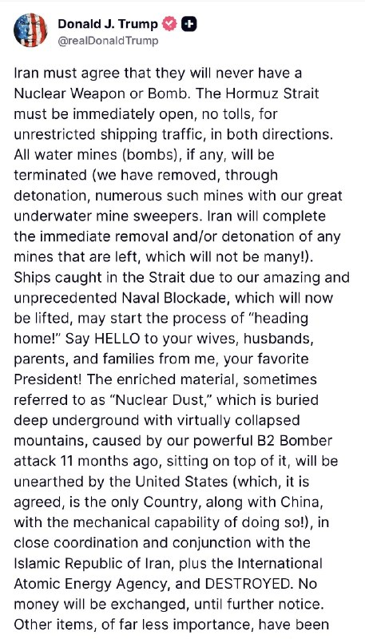

عزیزان،

شیر خدا لحظاتی پیش پست زیر رو در تروث‌سوشال منتشر کرد و نوشته داره می‌ره ‌ اتاق وضعیت تا تصمیم نهایی رو در باره‌ی امضای تفاهم با روافض قحبه بگیره:

«روافض قحبه‌زاده باید قبول کنه که هیچ‌وقتِ هیچ‌وقت صاحب سلاح یا بمب هسته‌ای نمیشه.

تنگه‌ی هرمز باید فوراً باز شه، بدون هیچ باج و عوارضی، تا رفت‌و‌آمد کشتی‌ها توی هر دو مسیر کاملاً آزاد باشه.

همه مین‌های دریایی اگه چیزی باقی مونده باشه، باید جمع شن (ما خودمون کلی از این مین‌ها رو با اون مین‌روب‌های فوق‌العاده زیردریایی‌مون منفجر و نابود کردیم. روافض جاکش هم خودش کار جمع‌آوری فوری و یا منفجر کردن بقیه مین‌های باقیمونده رو تموم ‌کنه، که البته چیز زیادی هم باقی نمونده)

کشتی‌هایی که به خاطر محاصره دریایی بی‌سابقه و معرکه‌ ما توی تنگه گیر کرده بودن ،محاصره‌ای که حالا دیگه برداشته میشه، می‌تونن کم‌کم شال‌وکلاه کنن و راهی خونه‌شون شن. رفتید از طرف من، یعنی رئیس‌جمهور محبوبتون، به همسرا، پدر و مادرها و خانواده‌هاتون سلام برسونید.

مواد غنی‌شده که بعضی‌وقت‌ها بهش می‌گن گرد و خاک هسته‌ای و اون زیر کوه‌هایی دفن شدن که ۱۱ ماه پیش با حمله بمب‌افکن‌های قدرتمند بی‌۲ ما عملاً روی سر اورانیوم‌های غنی‌شده آوار شدن، قراره توسط ایالات متحده (که توافق شده تنها کشوریه که در کنار چین، توانایی فنی و مکانیکی انجام این کار رو داره) با هماهنگی و همکاری نزدیک رژیم مادرخراب روافض و آژانس بین‌المللی انرژی اتمی بیرون کشیده و نابود بشه.

تا اطلاع ثانوی هیچ پولی رد و بدل نمیشه.

روی موارد دیگه‌ای هم که اهمیت خیلی کمتری دارن، توافق شده.
من الان دارم می‌رم اتاق وضعیت تا تصمیم نهایی رو بگیرم.

ممنون از توجهتون به این موضوع!

رئیس‌جمهور دونالد جی. ترامپ یلِ گاینده‌ی خاک‌سفید»

@Dirty_Kids 👻

## Dirty_Kids — post 390483

  

این چرا اینشکلی شده؟

عکس وایرال شده از ظاهر جدید و عجیب نگار جواهریان

@Dirty_Kids 👻

## Dirty_Kids — post 390482

  <a href="telegram/content/Dirty_Kids_390482_1780076975.mp4" target="_blank">🎬 Download video</a>

🔴 پربازدیدترین کلیپ اینستاگرام فارسی تو ۲۴ ساعت اخیر با ۱۵ میلیون بازدید!

@Dirty_Kids 👻

## Hranews — post 113225

  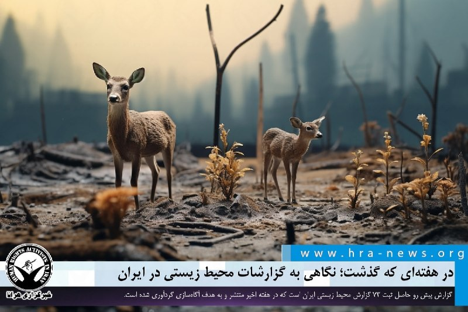

در هفته‌ای که گذشت؛ نگاهی به گزارشات محیط زیستی در ایران

❗️
❗️
❗️
❗️
❗️ – حق بر #محیط_زیست و مبانی فلسفی آن، از قواعد حقوق بشر و حقوق طبیعی نشأت گرفته شده است. ابتدایی ترین حق طبیعی انسان در این کره خاکی، «#حق_حیات» است. اما طی دهه‌های اخیر به دلیل استفاده بی‌رویه از منابع طبیعی، عدم نظارت و توجه به مباحث زیست محیطی و الگوهای صحیح، محیط زیست طبیعی به‌شدت آسیب دیده است. گزارش پیش رو حاصل ثبت ۷۳ گزارش محیط زیستی ایران است که در هفته‌ اخیر منتشر و به هدف آگاه‌سازی گردآوری شده است.

به گزارش خبرگزاری هرانا، ارگان خبری مجموعه فعالان حقوق بشر در ایران، در هفته‌‌ای که گذشت لاشه هشت قلاده فوک خزری کشف شد. همچنین، بیش از ۳۱ شکارچی و صیاد غیرمجاز و قاچاقچی چوب بازداشت و به مراجع قضایی معرفی شدند. افزون بر این، بر اساس گزارشات منتشر شده، بیش از ۱۴.۷ تن چوب قاچاق کشف و ضبط شد. از سوی دیگر، شاخص کیفی هوا دستکم در ۲۱ شهر ناسالم و خطرناک اعلام شد. از دیگر اخبار مرتبط با محیط زیست میتوان به بحران خشکسالی، پسماندها و آلاینده‌ها در مناطق مختلف اشاره کرد؛ در گزارش پیش رو به برخی از آنها پرداخته شده است.

آسیب رسانی به جنبه های مختلف محیط زیست در ایران کماکان ادامه دارد. از طرفی شهروندانی وجود دارند که به دلیل عدم آموزش یا نیازهای مالی دست به تخریب و آسیب رسانی به محیط زیست می زنند و از سوی دیگر نهادهای متولی در تلاش هستند تا از حجم این آسیب ها بکاهند، هر چند این تلاش ها قابل تقدیر است اما به نظر نمی آید میزان آن با شرایط محیط زیستی ایران تطبیق داشته باشد.

ادامه مطلب

↘️
@hranews_bot تماس ✉️ -  @Hranews  کانال هرانا 🆑

## Hranews — post 113224

  

حال نامساعد لیندزی فورمن در یازدهمین روز از اعتصاب در بند زنان زندان اوین

❗️
❗️
❗️
❗️
❗️ – لیندزی فورمن، شهروند بریتانیایی محبوس در زندان اوین، یازدهمین روز #اعتصاب خود را در این زندان سپری می‌کند. این زندانی با شرایط جسمی نامناسبی از جمله، کاهش وزن، افت قند خون و نوسانات فشار خون روبه‌رو شده است. همچنین، عدم امکان برقراری تماس وی با خانواده خود، منجر به افزایش نگرانی نزدیکان و خانواده او شده است.

به گزارش خبرگزاری هرانا، ارگان خبری مجموعه فعالان حقوق بشر در ایران، لیندزی فورمن یازدهمین روز اعتصاب خود را در زندان اوین سپری می‌کند.

یک منبع مطلع در گفت‌وگو با هرانا اعلام کرد: خانم فورمن در حالی یازدهمین روز اعتصاب غذای خود را پشت سر می‌گذارد که وضعیت جسمانی او نگران‌کننده است. وی دچار افت شدید قند خون (زیر ۹۰)، کاهش وزن قابل توجه (حدود هشت کیلوگرم از آغاز اعتصاب)، و افت فشار خون (۶ روی ۹) شده است. همچنین علائمی مانند سرگیجه، تهوع، دردهای طولانی‌مدت شکمی و رنگ‌پریدگی غیرعادی در او مشاهده می‌شود.
این منبع افزود: در این وضعیت، هیچ یک از مسئولین مربوطه به دیدار او نیامده است و همچنین سفارت بریتانیا نیز واکنشی به شرایط وی نشان نداده است. از سوی دیگر، محرومیت از امکان استفاده تلفن زندان باعث شده است که خانواده وی اطلاعی از وضعیت او کسب نکنند. امری که منجر به افزایش نگرانی‌های نزدیکان و خانواده این زندانی شده است.

ادامه مطلب

#لیندزی_فورمن

↘️
@hranews_bot تماس ✉️ -  @Hranews  کانال هرانا 🆑

## Hranews — post 113223

  

از جرم «جاسوسی» تا جرم‌انگاری «قصد همکاری»/ #مریم_عابدی

📡
📡
📡
📡
📡– جرایم علیه امنیت ملی همواره در شمار حساس‌ترین و شدیدترین حوزه‌های حقوق کیفری قرار گرفته‌اند. در تمامی نظام‌های حقوقی، دولت‌ها حفاظت از اسرار، اطلاعات طبقه‌بندی‌شده، تاسیسات حیاتی و ساختارهای امنیتی را از عناصر بنیادین بقای سیاسی و حاکمیتی خود تلقی می‌کنند و از همین‌رو، جرم جاسوسی به‌عنوان یکی از مهم‌ترین جرایم علیه امنیت خارجی کشورها شناخته می‌شود. به این دلیل، اهمیت امنیت ملی هرگز به معنای نفی اصول بنیادین حقوق کیفری نیست؛ اصولی که بر پایه‌ی «قانونی بودن جرم و مجازات»، «تفسیر مضیق قوانین کیفری»، «لزوم وجود رفتار مادی مجرمانه» و «ممنوعیت مجازات افکار و نیات صرف» استوار شده‌اند.

در حقوق کیفری ایران، جرایم مرتبط با جاسوسی عمدتاً در فصل اولِ کتاب پنجم قانون مجازات اسلامی، ذیل عنوان «جرایم علیه امنیت داخلی و خارجی کشور» پیش‌بینی شده‌اند. مهم‌ترین مقررات در این زمینه را می‌توان در مواد ۵۰۱، ۵۰۵، ۵۰۸ و برخی مقررات پراکنده‌ی مرتبط با همکاری با دولت‌های متخاصم مشاهده کرد.

بر اساس ماده‌ی ۵۰۱ قانون مجازات اسلامی و تعزیرات: «هر کس نقشه‌ها یا اسرار یا اسناد و تصمیمات راجع به سیاست داخلی یا خارجی کشور را عالماً و عامداً در اختیار افرادی که صلاحیت دسترسی به آن‌ها را ندارند قرار دهد یا از مفاد آن مطلع کند، به نحوی که متضمن نوعی جاسوسی باشد، به حبس محکوم می‌شود.»

هم‌چنین ماده‌ی ۵۰۸ مقرر می‌دارد: «هر کس یا گروهی با دول خارجی متخاصم، به هر نحو علیه جمهوری اسلامی ایران همکاری نماید، در صورتی که محارب شناخته نشود، به یک تا ده سال حبس محکوم می‌شود.»

در ساختار سنتی حقوق کیفری ایران، همانند بسیاری از نظام‌های حقوقی کلاسیک، تحقق جرم امنیتی مستلزم وجود عنصر مادی مشخص و عینی بود؛ بدین معنا که صرف گرایش ذهنی، تمایل سیاسی یا حتی قصد ارتکاب جرم، بدون ظهور خارجی و ورود به مرحله‌ی اجرا، اصولاً برای تحقق جرم کافی تلقی نمی‌شد. به بیان دیگر، حقوق کیفری تا زمانی که رفتار مرتکب وارد عرصه‌ی اجتماعی نشده و خطری واقعی علیه امنیت عمومی ایجاد نکرده باشد، حق مداخله‌ی کیفری پیدا نمی‌کند.

ادامه مطلب

ادامه مطلب در وبسایت خط صلح

↘️
@hranews_bot تماس ✉️ - @Hranews کانال هرانا 🆑

## Hranews — post 113222

تداوم بازداشت و بی خبری از وضعیت ۲ شهروند در چابهار

❗️
❗️
❗️
❗️
❗️– نوربخش جدگال و یحیی جدگال دو برادر ساکن چابهار حدود ۱۱ روز است که توسط نیروهای امنیتی در این شهرستان بازداشت شدند و تاکنون از محل نگهداری آنها اطلاعی حاصل نشده است.

#نوربخش_جدگال #یحیی_جدگال

ادامه مطلب

↘️
@hranews_bot تماس ✉️ - @Hranews کانال هرانا 🆑

## Hranews — post 113221

  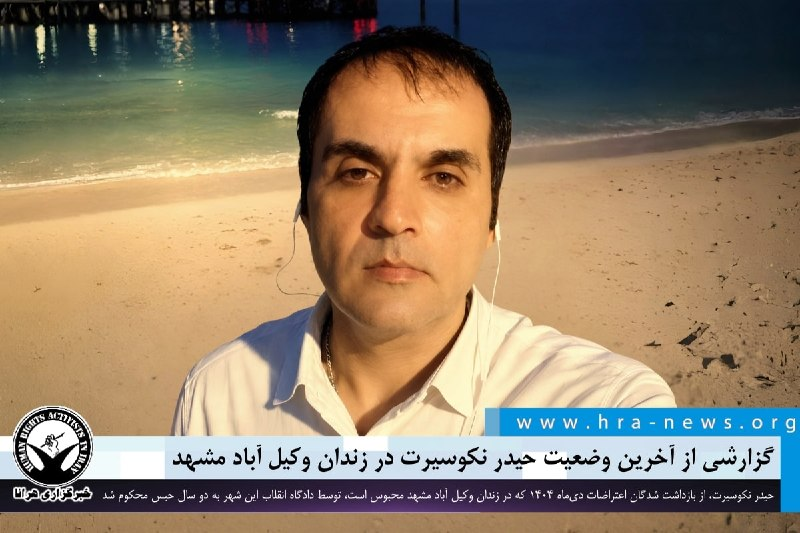

گزارشی از آخرین وضعیت حیدر نکوسیرت در زندان وکیل آباد مشهد

❗️
❗️
❗️
❗️
❗️– حیدر نکوسیرت، از بازداشت شدگان اعتراضات دی‌ماه ۱۴۰۴، در زندان وکیل آباد مشهد محبوس است. وی که توسط دادگاه انقلاب مشهد به دو سال حبس محکوم شده، علیرغم شرایط نامناسب جسمی ناشی از بیماری‌های کلیوی، چشمی و دیابت، کماکان از رسیدگی تخصصی پزشکی محروم مانده است.

به گزارش خبرگزاری هرانا، ارگان خبری مجموعه فعالان حقوق بشر در ایران، حیدر نکوسیرت در زندان وکیل آباد مشهد محبوس است.

بر اساس اطلاعات دریافتی هرانا؛ حیدر نکوسیرت چندی پیش توسط دادگاه انقلاب مشهد به دو سال حبس محکوم شده است. یک منبع مطلع نزدیک به خانواده این زندانی با تایید این موضوع به هرانا گفت: حیدر طی مدت زمان بازداشت از حق دسترسی به وکیل محروم مانده است. همچنین، وی در حالی از بیماری دیابت، نارسایی کلیوی و کاهش بینایی در یک چشم رنج می‌برد که دیگر چشم سالم او نیز دچار مشکل شده است. آقای نکوسیرت نیازمند رسیدگی تخصصی پزشکی و اعزام به مراکز درمانی خارج از زندان است.

#حیدر_نکوسیرت

ادامه مطلب

↘️
@hranews_bot تماس ✉️ - @Hranews کانال هرانا 🆑

## manototv — post 105869

  <a href="telegram/content/manototv_105869_1780076979.mp4" target="_blank">🎬 Download video</a>

در سیاست بین‌الملل، کشورها بیش از آنکه بر پایه دوستی، همدلی یا شعارهای اخلاقی تصمیم بگیرند، بر اساس منافع ملی خود عمل می‌کنند. قدرت‌های بزرگ ممکن است از آزادی، امنیت، حقوق بشر یا نظم جهانی سخن بگویند، اما در لحظه تصمیم، محاسبه اصلی این است که چه چیزی به سود آن‌هاست.

## manototv — post 105868

  <a href="telegram/content/manototv_105868_1780076980.mp4" target="_blank">🎬 Download video</a>

سخنان الهام‌بخش فریدون فرخزاد درباره خودباوری ملی

## manototv — post 105860

  <a href="telegram/content/manototv_105860_1780076982.mp4" target="_blank">🎬 Download video</a>

در سیاست، گاهی مهم‌تر از خود رویداد، چیزی است که آن رویداد آشکار می‌کند.

جنگ اخیر نیز پرده‌ای از واقعیت جمهوری اسلامی کنار زد: شکاف‌هایی که پنهان شده بود، ضعف‌هایی که انکار می‌شد و بحران‌هایی که با تبلیغات پوشانده می‌شد.

## alonews — post 123548

  <a href="telegram/content/alonews_123548_1780076984.webm" target="_blank">🎬 Download video</a>

👈گروسی، مدیر کل آژانس بین‌المللی انرژی اتمی : توافق ایران و آمریکا خبرِ خوبیه

✅ @AloNews خبر جنگ

## alonews — post 123547

  <a href="telegram/content/alonews_123547_1780076984.webm" target="_blank">🎬 Download video</a>

👈اسماعیل بقایی : مدیریت تنگه هرمز باید بین ایران و عمان تعیین شه

✅ @AloNews خبر جنگ

## alonews — post 123546

  <a href="telegram/content/alonews_123546_1780076984.webm" target="_blank">🎬 Download video</a>

👈خبرگزاری صداوسیما: ایران هنوز متن ۱۴ بندی ادعایی رسانه‌ها را برای آمریکا ارسال نکرده است

✅ @AloNews خبر جنگ

## alonews — post 123545

  <a href="telegram/content/alonews_123545_1780076984.webm" target="_blank">🎬 Download video</a>

👈منابع خبری از خاتمه نشست ترامپ با همکارانش در کاخ سفید  در خصوص ایران خبر دادند

✅ @AloNews خبر جنگ

## alonews — post 123544

  <a href="telegram/content/alonews_123544_1780076984.webm" target="_blank">🎬 Download video</a>

👈سخنگوی وزارت امور خارجه: با «زبانِ باید»، ۴۷ سال پیش خداحافظی کردیم

🔴هیچ یک از طرف‌های غربی که وقتی درباره ایران صحبت می کنند، نباید از باید استفاده کنند؛ ما بر اساس منافع ملت ایران تصمیم می گیریم.

🔴بایدهایی که آمریکایی‌ها مطرح می‌کنند، در واقع خواهش می‌کنیم است؛ تبادل پیام‌ها ادامه دارد و تفاهم هنوز نهایی نشده است.

✅ @AloNews خبر جنگ

## alonews — post 123543

  <a href="telegram/content/alonews_123543_1780076985.webm" target="_blank">🎬 Download video</a>

👈یک مقام ایرانی به «رویترز»: عملا به تفاهم سیاسی با آمریکا دست‌یافتیم اما نیاز به نهایی‌شدن دارد.

✅ @AloNews خبر جنگ

## alonews — post 123542

👈سخنگوی وزارت خارجه: تاکنون تفاهمی با آمریکا نهایی نشده است

🔴در این مرحله بر خاتمه جنگ متمرکز هستیم و درمورد جزئیات برنامه هسته‌ای مذاکره‌ای نداریم

🔴بقایی درباره ادعایِ از بین بردن مواد هسته‌ای توسط ترامپ: در این مرحله تمرکز ما بر خاتمه جنگ است و درباره جزئیات غنی‌سازی و اورانیوم غنی‌شده، صحبتی نداریم

✅ @AloNews خبر جنگ

## alonews — post 123541

  <a href="telegram/content/alonews_123541_1780076985.webm" target="_blank">🎬 Download video</a>

👈رضایی نماینده مجلس: مخالف تعلیق غنی سازی یا اعطای مواد هسته‌ای به اسرائیل و آمریکا هستیم

✅ @AloNews خبر جنگ

## alonews — post 123540

  <a href="telegram/content/alonews_123540_1780076985.webm" target="_blank">🎬 Download video</a>

👈وال استریت ژورنال: امارات متحده عربی ده‌ها حمله را با هماهنگی آمریکا و اسرائیل انجام داد

✅ @AloNews خبر جنگ

## alonews — post 123539

  <a href="telegram/content/alonews_123539_1780076986.webm" target="_blank">🎬 Download video</a>

👈وال استریت ژورنال: افراد آشنا با این موضوع گفتند که امارات متحده عربی از روزهای اولیه جنگ ده‌ها حمله هوایی علیه ایران انجام داد که تا روز پس از اعلام آتش‌بس ادامه داشت، دخالتی عمیق‌تر از آنچه قبلاً در کمپین هوایی به رهبری ایالات متحده و اسرائیل شناخته شده بود.

🔴گستردگی این حملات گواه دیگری بر تمایل روزافزون این کشور برای محافظت از آنچه منافع استراتژیک خود می‌داند، است و آن را از برخی از همسایگانش در منطقه خلیج فارس که رویکردی بسیار محتاطانه‌تر نسبت به تهدید ایران اتخاذ کرده‌اند، متمایز می‌کند.

🔴این افراد گفتند که این حملات با هماهنگی ایالات متحده و اسرائیل انجام شده است که هر دو اطلاعات ارائه داده‌اند. برخی از این افراد گفتند که این حملات شامل اهدافی در جزایر قشم و ابوموسی در تنگه هرمز؛ بندرعباس، پالایشگاه نفت در جزیره لاوان در خلیج فارس و مجتمع پتروشیمی عسلویه بوده است.

✅ @AloNews خبر جنگ

## alonews — post 123538

  <a href="telegram/content/alonews_123538_1780076986.webm" target="_blank">🎬 Download video</a>

👈 مدیرکل آژانس بین‌المللی انرژی اتمی پیشنهاد داد که قزاقستان اورانیوم غنی‌شده ایران را نگه‌داری کند

🔴به گفته گروسی، قزاقستان آماده است در صورت حصول توافق بین آمریکا و ایران، ذخایر اورانیوم غنی‌شده ایران را نگه‌داری کند.

🔴رافائل گروسی، رئیس آژانس بین‌لمللی انرژی اتمی، در گفتگو با فایننشال تایمز گفت که قاسم‑ژومارت توکایف، رئیس‌جمهور قزاقستان، این پیشنهاد را در دیداری که این هفته در آستانه داشتند، به او منتقل کرده است.

🔴قزاقستان میزبان بانک بین‌المللی اورانیوم با غنای پایین است تا تأمین سوخت نیروگاه‌ها در کشورهای عضو آژانس بین‌المللی انرژی اتمی تضمین شود و از اشاعه هسته‌ای جلوگیری گردد.

🔴گروسی گفت: «ما محلی داریم که این [اورانیوم غنی‌شده ایران] می‌تواند با خیال راحت در آن ذخیره شود»، پیشنهادی که به اعتقاد او هم ایران و هم آمریکا می‌توانند آن را بپذیرند.

✅ @AloNews خبر جنگ

## alonews — post 123537

  <a href="telegram/content/alonews_123537_1780076986.webm" target="_blank">🎬 Download video</a>

👈تسنیم به نقل از منابع ایرانی: اصرار ترامپ بر عدم آزادسازی دارایی‌های مسدود شده، تردیدهای تهران را در مورد جدیت واشنگتن افزایش می‌دهد.

✅ @AloNews خبر جنگ

## alonews — post 123536

  <a href="telegram/content/alonews_123536_1780076986.webm" target="_blank">🎬 Download video</a>

👈پوتین : اوضاع توی میدون جنگ جوریه که روسیه می‌تونه بگه این درگیری داره کم‌کم به آخرش نزدیک می‌شه

🔴حرف بعضی سیاستمدارهای اروپایی که می‌گن دارن خودشون رو برای جنگ با روسیه آماده می‌کنن، کاملاً چرته

🔴روسیه هیچ‌وقت هیچ نیت تهاجمی علیه کشورهای اروپایی نداشته

🔴روسیه برای مذاکرات درباره اوکراین آماده‌ست و از اون صرف‌نظر نکرده

✅ @AloNews خبر جنگ

## alonews — post 123535

  <a href="telegram/content/alonews_123535_1780076987.mp4" target="_blank">🎬 Download video</a>

👈پوتین، رئیس جمهور روسیه : ما باید سیستم دفاع هوایی رو تقویت کنیم

✅ @AloNews خبر جنگ

## alonews — post 123534

  <a href="telegram/content/alonews_123534_1780076989.webm" target="_blank">🎬 Download video</a>

قیمت استثنایی و کیفیت بالا
❤️

تحویل زیر یک دقیقه
✅
دارای لینک سابسکریشن جهت دیدن حجم و کنترل مصرف
✅
بدون قطعی 
✅
بدون محدودیت کاربر و زمان
✅
جمینایو چت جی بی تی و... کامل اوکیه با سرورامون
✅

🏪پشتیبانی کامل
✅
شروع فعالیت از سال 2022 
✅
پرداخت ریالی
✅

از رباتمونم میتونید تهیه کنید 
💞
👇

✅
➡️ @Napsternetiran_bot 
☑️

ضریب و این چیزا ندارن و تا آخرین مگابایت برای پشتیبانیش درختمتیم
🥂

چنل کانالمون
👇

📣
➡️ @Napsternetvirani 
☑️

## alonews — post 123533

👈پوتین درباره حمله پهپادی در رومانی: هیچ‌کس نمی‌تواند منشاء پهپاد را قبل از بررسی لاشه آن ادعا کند. 
🔴به هر حال، ما می‌دانیم که پهپادهای اوکراینی به فنلاند، لهستان و جایی در کشورهای بالتیک پرواز کرده‌اند. 
🔴واکنش اولیه دقیقاً همان بود که اکنون در رومانی است…

## alonews — post 123532

  <a href="telegram/content/alonews_123532_1780076989.webm" target="_blank">🎬 Download video</a>

👈علی هاشم خبرنگار الجزیره: یک منبع مطلع به من گفت که پست دونالد ترامپ در شبکه اجتماعی «تروث سوشال» درباره لغو محاصره بنادر ایران، در واقع اولین شرط پیش از برداشتن گام‌های بعدی در مسیر تفاهم بوده است.

🔴به گفته این منبع، طرف ایرانی بر اعلام رسمی و عمومی این موضوع در وهله نخست پافشاری کرده است. به نظر می‌رسد ترامپ این موضوع را امری فرعی قلمداد کرده، در حالی که تهران آن را گامی کلیدی برای ایجاد اعتماد پیش از ورود به پرونده‌های حساستر می‌بیند.

🔴تا کنون، هیچ بحث مستقیمی درباره خود پرونده هسته‌ای صورت نگرفته است. انتظار می‌رود این فرآیند به تدریج و از طریق یک یادداشت تفاهم (MOU) پیش برود، به گونه‌ای که هر گامی با یک اقدام متقابل همراه باشد.

🔴همین منابع می‌گویند انتظار می‌رود اعلام آتش‌بس بین حزب‌الله و اسرائیل نیز به عنوان بخشی از چارچوب گسترده‌تری که در حال شکل‌گیری است، انجام شود.

✅ @AloNews خبر جنگ

## alonews — post 123531

  <a href="telegram/content/alonews_123531_1780076990.webm" target="_blank">🎬 Download video</a>

👈ناتو: اوایل صبح امروز، یک ساختمان آپارتمانی در رومانی توسط یک پهپاد روسی هدف قرار گرفت 
🔴ما بی‌مبالاتی روسیه را محکوم می‌کنیم 
✅ @AloNews خبر جنگ

## alonews — post 123530

  <a href="telegram/content/alonews_123530_1780076990.webm" target="_blank">🎬 Download video</a>

👈خبرگزاری فارس به نقل از مقامات ایرانی: این توافق به نحوی تدوین خواهد شد که در صورت نقض آن توسط آمریکا، امکان اقدامات متقابل فوری فراهم شود.

🔴 توافق نهایی بر اساس خطوط قرمز ایران و بی‌اعتمادی به آمریکا تدوین خواهد شد.

✅ @AloNews خبر جنگ

## alonews — post 123529

  <a href="telegram/content/alonews_123529_1780076990.webm" target="_blank">🎬 Download video</a>

🔴فوری / العربیه: «فایننشال تایمز»: قزاقستان پیشنهاد کرد که اورانیوم غنی‌شده ایران به این کشور انتقال داده شود.

✅ @AloNews خبر جنگ

<!-- MSG END -->

<!-- NAV START -->

<a href="https://github.com/shahinsa98/aio-downloader/blob/main/telegram/content/archive_1.md" style="display:inline-block; padding:6px 12px; margin:0 4px; background-color:#2ea44f; color:white; text-decoration:none; border-radius:4px; font-weight:bold;">صفحه بعد</a>

<!-- NAV END -->
