# خواننده تلگرام

<!-- TOP_NAV START -->

<a href="https://github.com/shahinsa98/aio-downloader/blob/main/telegram/content/archive_1.md" style="display:inline-block; padding:6px 12px; margin:0 4px; background-color:#2ea44f; color:white; text-decoration:none; border-radius:4px; font-weight:bold;">صفحه بعد</a>

<!-- TOP_NAV END -->

<!-- MSG START -->

---
📅 بروزرسانی: 1405/03/10 09:54
---

## VahidOOnLine — post 242998

  <a href="telegram/content/VahidOOnLine_242998_1780208666.mp4" target="_blank">🎬 Download video</a>

ویدیوهای رسیده به ایران‌اینترنشنال نشان می‌دهند گروهی از ایرانیان مقیم آلمان روز شنبه ۹ خرداد، علیه اعدام‌های جمهوری اسلامی و در حمایت از شاهزاده رضا پهلوی، در شهر هانوفر تجمع کردند.
‌🏁 🇬🇧 IranintlTV

🤖 @VahidOOnLine

## VahidOOnLine — post 242997

  

روزنامه خراسان، نزدیک به محمدباقر قالیباف، رییس مجلس در مقاله‌ای نوشت بعید است مذاکرات جمهوری اسلامی و آمریکا به نتیجه برسد و پیش‌‎بینی کرد جنگ ادامه خواهد داشت.

خراسان اظهارات و واکنش‌های دونالد ترامپ، رییس‌جمهور آمریکا را با هدف کنترل بازرهای مالی ارزیابی کرد.
این روزنامه ضمن اشاره به اظهارات اخیر ترامپ درباره رفع محاصره دریایی جمهوری اسلامی نوشت: «پست ترامپ، قبل از تعطیلات آخر هفته، موجی از خوش‌بینی به بازارهای جهانی تزریق کرد و قیمت نفت برنت را به حدود ۸۴ دلار رساند.»

این روزنامه نوشت نزدیکان رییس‌جمهور آمریکا با اظهارات «امیدوارکننده» او در آستانه تعطیلات آخر هفته با نوسان‌گیری در بازارهای مالی سودهای کلانی به‌دست آوردند.

نویسنده خراسان افزود: «توافقی اولیه و موقت محتمل است که البته آن هم نه مولود رسیدن به باوری برای حل تنش، بلکه بیشتر محصول اولویت‌ها و مدیریت تنش از سوی دو طرف است و بعید است که به توافقی جامع ختم شود.»
‌🏁 🇬🇧 IranintlTV

🤖 @VahidOOnLine

## VahidOOnLine — post 242996

  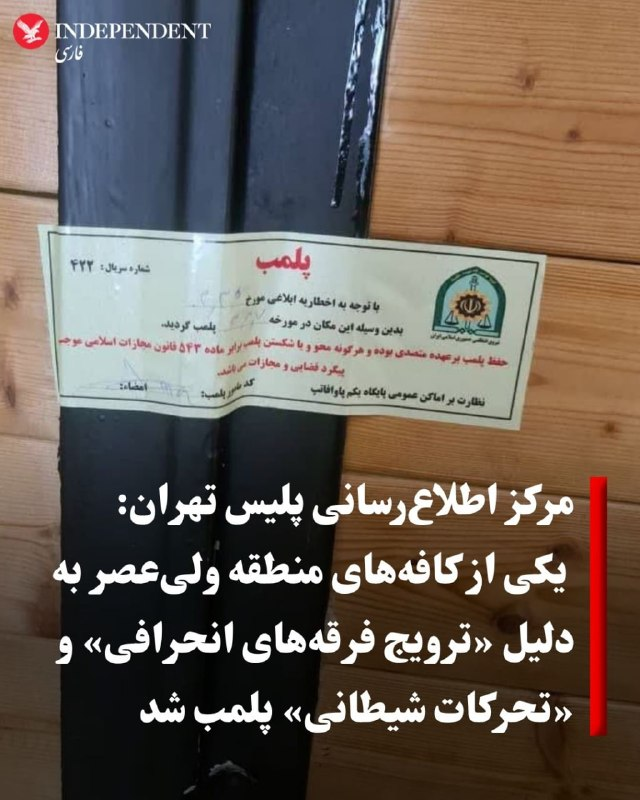

♦️مرکز اطلاع‌رسانی پلیس تهران روز یکشنبه دهم خرداد اعلام کرد که پلیس نظارت بر اماکن عمومی پایتخت یکی از کافه‌های منطقه ولی‌عصر را به دلیل آنچه «فعالیت‌های ترویج فرقه‌های انحرافی» و «تحرکات شیطانی» خوانده، پلمب کرده است.
بنا بر اعلام پلیس تهران این کافه با برگزاری برنامه‌هایی با «ظاهر موسیقی غربی»، بستری برای «حرکات نابهنجار» و «تحرکات شیطانی» فراهم کرده بود.
پلیس همچنین اعلام کرده مشتریان این کافه، شامل دختران و پسران جوان، در وضعیتی «غیر طبیعی و با حرکاتی عجیب و غریب»، مشاهده شده بودند.
مرکز اطلاع‌رسانی پلیس تهران مدعی شده است که این اقدام در پی دریافت «شکایات متعدد از سوی شهروندان منطقه» و با هدف «مقابله با مظاهر فساد و انحراف» صورت گرفت.
‌🇸🇦 Indypersian

🤖 @VahidOOnLine

## VahidOOnLine — post 242995

  

روزنامه کیهان در یادداشتی با اشاره به حملات اسرائیل به لبنان، نوشت: «ما می‌توانیم اعلام کنیم چون آتش‌بس در لبنان از سوی اسرائیل نقض شده، جمهوری اسلامی آتش‌بس را تمام شده تلقی کرده و عملیات علیه ناقض آتش‌بس را از سر می‌گیرد، مگر آنکه اسرائیل طی چند روز به عقب برگردد و عملیات نظامی در لبنان را متوقف کند.»

این روزنامه که زیر نظر نماینده رهبر جمهوری اسلامی اداره می‌شود، افزود: «این هشدار و سپس احتمال اقدام نظامی ما روی بازارهای انرژی تاثیر فوری می‌گذارد و آژیر خطر بازگشت جنگ را برای آمریکا به صدا در می‌آورد.»

یادداشت‌نویس کیهان اضافه کرد: «روند فعلی چه آنچه آمریکا به‌صورت واکنشی در منطقه خلیج‌فارس انجام می‌دهد و چه آنچه هر روزه از سوی اسرائیل و با رضایت آمریکا و حوزه عربی علیه لبنان صورت می‌گیرد، چیزی جز جنگ نیست. اگر ما اعلام کنیم دیگر نقض آتش‌بس را تحمل نمی‌کنیم، به احتمال زیاد به توقف اقدامات نظامی علیه لبنان می‌رسیم، نه اینکه جنگ مشتعل‌تر شود.»
‌🏁 🇬🇧 IranintlTV

🤖 @VahidOOnLine

## VahidOOnLine — post 242994

  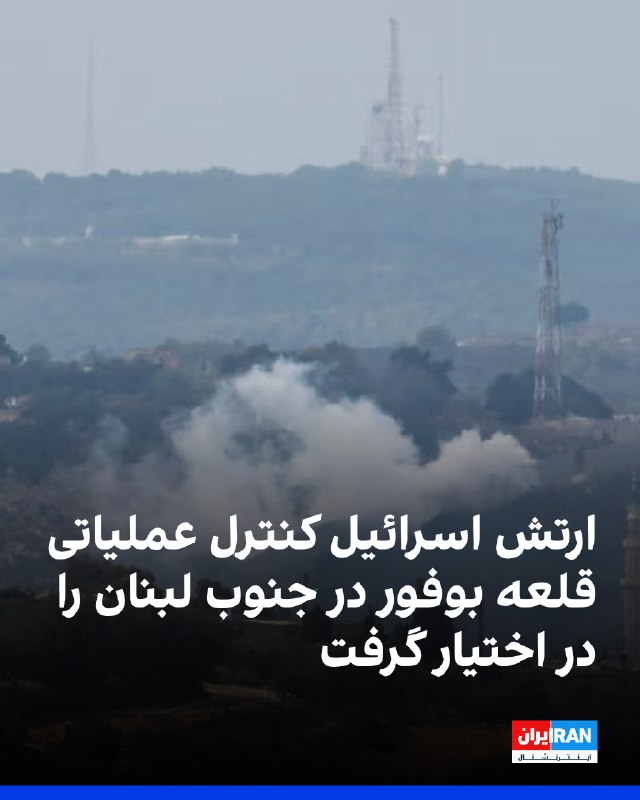

ارتش اسرائیل در بیانیه‌ای اعلام کرد نیروهایش در چارچوب عملیاتی چندروزه در منطقه ارتفاعات بوفور و وادی السلوق، کنترل عملیاتی این ارتفاعات استراتژیک را به دست گرفتند.
بر اساس این بیانیه، نیروهای اسرائیلی از رودخانه لیتانی عبور کردند و عملیات خود را به شمال این رودخانه گسترش دادند. هدف اصلی این عملیات نابودی زیرساخت‌های حزب‌الله بود که با هدایت جمهوری اسلامی در این منطقه ایجاد شده است.

‌🏁 🇬🇧 IranintlTV

🤖 @VahidOOnLine

## VahidOOnLine — post 242993

  <a href="telegram/content/VahidOOnLine_242993_1780208671.mp4" target="_blank">🎬 Download video</a>

⭕️صبح پس از قهرمانی؛ خودروها همچنان در پاریس می‌سوزند

♦️صبح یکشنبه، در حالی که آثار آشوب و ناآرامی شب گذشته همچنان در خیابان‌های پاریس دیده می‌شود، ویدیوهای منتشرشده خودروهایی را نشان می‌دهند که پس از گذشت چند ساعت درگیری، هنوز در آتش می‌سوزند.

تنش‌ها پس از جشن قهرمانی تیم فوتبال پاریس سن ژرمن در دیدار نهایی لیگ قهرمانان اروپا آغاز شد و در برخی مناطق پایتخت فرانسه به درگیری، آتش‌سوزی و تخریب اموال عمومی انجامید.

پلیس فرانسه اعلام کرده شمار بازداشت‌شدگان در ارتباط با این حوادث به ۴۱۶ نفر رسیده است.

این ناآرامی‌ها با واکنش گسترده سیاسی نیز همراه شد.
مارین لوپن، رهبر حزب اجتماع ملی، با انتقاد از وضعیت امنیتی کشور نوشت: «فقط در فرانسه است که پیروزی یک باشگاه فوتبال باعث بروز شورش می‌شود.»

پاریس سن ژرمن شنبه شب با پیروزی برابر آرسنال در دیدار نهایی، عنوان قهرمانی لیگ قهرمانان اروپا را حفظ کرد.
‌🇸🇦 Indypersian

🤖 @VahidOOnLine

## VahidOOnLine — post 242992

  

فداحسین مالکی، عضو کمیسیون امنیت ملی مجلس گفت: «جمهوری اسلامی از همان ابتدا نسبت به آتش‌بس و همچنین مذاکرات با آمریکا نگاه خوش‌بینانه‌ای نداشته، چرا که سابقه بدعهدی‌های واشینگتن همچنان در ذهن مسئولان و مردم باقی مانده و این بدبینی هرگز از بین نرفته است.»

او افزود: «جمهوری اسلامی نه مذاکره را کنار گذاشته و نه به آن دل بسته است.»

این نماینده مجلس اضافه کرد: «جمهوری اسلامی نسبت به ورود موضوعاتی همچون تنگه هرمز و غنی‌سازی به مذاکرات، ملاحظات جدی داشته است.»
‌🏁 🇬🇧 IranintlTV

🤖 @VahidOOnLine

## VahidOOnLine — post 242991

  

محمدرضا مسجدی، دبیرکل جمعیت مبارزه با دخانیات گفت: «اگرچه میزان مصرف دخانیات در میان زنان همچنان پایین‌تر از مردان است، اما روند افزایش مصرف در میان دختران نوجوان نگران‌کننده است.»

او افزود: «میزان مصرف دخانیات در میان دختران ۱۳ تا ۱۵ ساله نسبت به سال ۱۳۹۵، حدود ۱۳۵ درصد افزایش یافته است.»

مسجدی ادامه داد: «در حال حاضر حدود ۲۰ تا ۲۴ درصد جمعیت کشور به نوعی مصرف‌کننده دخانیات هستند.»
‌🏁 🇬🇧 IranintlTV

🤖 @VahidOOnLine

## VahidOOnLine — post 242990

  

سارا فلاحی، نماینده ایلام در مجلس گفت: «روسیه و چین قبل از شروع جنگ نسبت به توان ایستادگی جمهوری اسلامی مردد بودند و فکر می‌کردند که رژیم ایران تغییر می‌کند.»

او افزود: «روسیه و چین قبل از شروع جنگ و حرکت ناوهای آمریکایی به سوی ایران، برای بستن قراردادهای نظامی مردد بودند.»
‌🏁 🇬🇧 IranintlTV

🤖 @VahidOOnLine

## VahidOOnLine — post 242989

  

پلیس نظارت بر اماکن عمومی تهران اعلام کرد یکی از کافه‌های منطقه ولیعصر را به دلیل آنچه «فعالیت‌های ترویج فرقه‌های انحرافی» و «تحرکات شیطانی» خوانده، پلمب کرده است.

در این گزارش آمده این کافه با برگزاری برنامه‌هایی با «ظاهر موسیقی غربی»، بستری برای «حرکات نابهنجار» فراهم کرده بود.

پلیس همچنین اعلام کرده مشتریان این کافه، شامل دختران و پسران جوان، در وضعیتی «غیر طبیعی و با حرکاتی عجیب و غریب»، مشاهده شده بودند.
‌🏁 🇬🇧 IranintlTV

🤖 @VahidOOnLine

## VahidOOnLine — post 242988

  <a href="telegram/content/VahidOOnLine_242988_1780208677.mp4" target="_blank">🎬 Download video</a>

⭕️«امسال سال خونه»؛ تصاویر جدید از حضور گسترده مردم در منطقه ستارخان تهران در ۱۸ دی‌ماه

♦️تصاویری که به‌تازگی و پس از وصل شدن اینترنت در ایران از ۱۸ دی‌ماه ۱۴۰۴ در شبکه‌های اجتماعی منتشر شده نشان می‌دهد، جمع کثیری از مردم در منطقه ستارخان تهران با حضور در خیابان‌ها شعار «امسال سال خونه، سید علی سرنگونه» سر می‌دهند.

نیروهای سرکوبگر جمهوری اسلامی در ۱۸ و ۱۹ دی‌ماه سال گذشته ده‌ها هزار نفر از معترضان را در خیابان‌ها به‌ضرب گلوله جنگی کشتند.
‌🇸🇦 Indypersian

🤖 @VahidOOnLine

## VahidOOnLine — post 242987

  <a href="telegram/content/VahidOOnLine_242987_1780208679.mp4" target="_blank">🎬 Download video</a>

♦️ارتش آمریکا روز شنبه نهم خرداد اعلام کرد که به یک شناور در شرق اقیانوس آرام حمله کرده و سه مرد را کشته است. این دومین حمله در چند روز گذشته است.
فرماندهی جنوبی ایالات متحده در شبکه اجتماعی ایکس اعلام کرد که اطلاعات تایید کرده است که این قایق در حال عبور از مسیرهای «ممنوع» در شرق اقیانوس آرام بوده و در عملیات «قاچاق مواد مخدر» شرکت داشته است.
این فرماندهی اعلام کرد: «سه قاچاقچی مواد مخدر مرد در جریان این اقدام کشته شدند و هیچ نیروی نظامی آمریکایی آسیبی ندید.»
این آخرین حادثه از این دست در چند ماه گذشته است.
‌🇸🇦 Indypersian

🤖 @VahidOOnLine

## VahidOOnLine — post 242986

  

نیویورک‌تایمز به نقل از سه مقام آگاه گزارش داد دونالد ترامپ شروط چارچوب احتمالی توافق با جمهوری اسلامی را سخت‌تر کرده و تغییرات پیشنهادی را برای بررسی دوباره به تهران فرستاده است.
طبق این گزارش، هنوز روشن نیست چه تغییراتی در متن توافق ایجاد شده، اما ترامپ درباره بخش‌هایی از توافق احتمالی که شامل آزادسازی منابع مالی برای ایران می‌شود، ابراز نگرانی کرده است.
یک مقام آگاه به نیویورک‌تایمز گفت ترامپ از طولانی شدن پاسخ جمهوری اسلامی به پیشنهادهای آمریکا ناراضی است و پیشنهاد سخت‌گیرانه‌تر او احتمالا برای افزایش فشار بر تهران و سرعت بخشیدن به روند مذاکرات ارائه شده است.
نیویورک‌تایمز نوشت این چارچوب می‌تواند کارزار نظامی آمریکا و اسرائیل علیه ایران را در برابر رفع محاصره تنگه هرمز پایان دهد، اما دشوارترین مسائل، از جمله آینده برنامه هسته‌ای ایران، به دورهای بعدی مذاکرات موکول خواهد شد.

‌🏁 🇬🇧 IranintlTV

🤖 @VahidOOnLine

## VahidOOnLine — post 242985

♦️در پی تشدید تنش‌ها در ایالت نیوجرسی آمریکا، پلیس ایالتی این ایالت با سپرهای ضدشورش برای دومین شب متوالی مقابل معترضان ضد اداره مهاجرت و گمرک آمریکا (ICE) در اطراف مرکز بازداشت «دیلینی هال» مستقر شد.
به گزارش رویترز، فرماندار نیوجرسی روز جمعه به پلیس ایالتی دستور داد کنترل امنیت اطراف مرکز بازداشت مهاجران «دیلینی هال» در نیوآرک را در دست بگیرد؛ مرکزی که در روزهای اخیر به محل درگیری میان معترضان و ماموران مهاجرت آمریکا تبدیل شده است.
میکی شریل، فرماندار نیوجرسی، گفت این تصمیم برای کاهش تنش‌ها و جلوگیری از خشونت بیشتر اتخاذ شده و هدف آن، حفظ همزمان حق تجمع و امنیت عمومی است.
رویترز گزارش داد اعتراض‌ها پس از آن شدت گرفت که شماری از بازداشت‌شدگان مهاجر از طریق تماس با خانواده‌های خود، از اعتصاب غذا و اعتراض به شرایط نگهداری خبر دادند.
‌🇸🇦 Indypersian

🤖 @VahidOOnLine

## VahidOOnLine — post 242984

  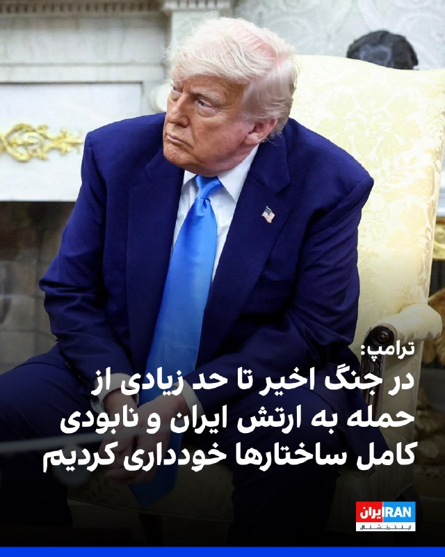

ترامپ در گفت‌وگو با فاکس‌نیوز گفت آمریکا در جنگ اخیر تا حد زیادی از هدف قرار دادن ارتش «میانه‌رو» ایران و همچنین از نابودی کامل ساختارها در کشور خودداری کرده است تا بازسازی ایران دهه‌ها به عقب نیفتد.
او گفت: «ایالات متحده نیروی دریایی و نیروی هوایی ایران را کاملا از بین برده، اما تا حد زیادی از هدف قرار دادن ارتش ایران خودداری کرده است.»
ترامپ گفت آمریکا ارتش ایران را «تا حدی به حال خود گذاشته»، چون به گفته او این ارتش «تا اندازه‌ای میانه‌رو» است و واشینگتن نمی‌خواسته همه ساختار نظامی کشور را نابود کند.
او همچنین گفت آمریکا «شکل‌های مختلفی از رهبری» ایران را حذف کرده، اما از تجربه عراق درس گرفته است، زیرا نابودی کامل ساختارها می‌تواند کشوری را برای دهه‌ها از بازسازی بازدارد.

‌🏁 🇬🇧 IranintlTV

🤖 @VahidOOnLine

## VahidOOnLine — post 242983

  

ترامپ در مصاحبه با لارا ترامپ، مجری فاکس‌نیوز، با اشاره به اینکه آمریکا به یک «توافق خیلی خوب» با جمهوری اسلامی نزدیک است، گفت توافق با حکومت ایران را ترجیح می‌دهد، اما برای بازگشت به عملیات نظامی نیز آماده است.
ترامپ گفت ترجیح می‌دهد با ایران به توافق برسد، زیرا در صورت امضای توافق، تنگه هرمز می‌تواند بلافاصله باز شود.
او تاکید کرد تنها تضمینی که می‌خواهد این است که ایران هیچ سلاح هسته‌ای نداشته باشد و گفت تهران با این موضوع موافقت کرده است.
ترامپ همچنین گفت «بزرگ‌ترین دارایی» حکومت ایران رسانه‌های «اخبار جعلی» هستند، چون موفقیت‌های آمریکا را کوچک جلوه می‌دهند. او افزود آمریکا در نبرد پیروزی بزرگی به دست ‌آورده، اما این رسانه‌ها می‌گویند واشینگتن شکست خورده است.

‌🏁 🇬🇧 IranintlTV

🤖 @VahidOOnLine

## VahidOOnLine — post 242982

  

♦️یک مقام ارشد دولت دونالد ترامپ در گفتگو با «آکسیوس»، با اشاره به روند کند دیپلماسی و پافشاری کاخ سفید بر اعمال اصلاحات ساختاری در پیش‌نویس توافق احتمالی با تهران اعلام کرد که ارزیابی‌ها نشان می‌دهد دریافت پاسخ از سوی مقامات جمهوری اسلامی دست‌کم سه روز زمان خواهد برد؛ این مقام آمریکایی با لحنی کنایه‌آمیز درباره دلیل این تاخیر چندروزه در ابلاغ تصمیم نهایی تهران به واشنگتن گفت: «آن‌ها عملا در غارها هستند و از ایمیل استفاده نمی‌کنند.»
‌🇸🇦 Indypersian

🤖 @VahidOOnLine

## VahidOOnLine — post 242981

♦️بنای یادبود لینکلن در واشنگتن‌دی‌سی، روز شنبه و در بیستمین هفته پیاپی، شاهد گردهمایی ایرانیان در حمایت از مردم داخل کشور بود. حاضران در این تجمع با سر دادن شعار، خواستار آزادی فوری زندانیان سیاسی شده و اعتراض شدید خود را به صدور و اجرای احکام اعدام و همچنین وضعیت بحرانی و سرکوب شدید اینترنت در ایران اعلام کردند.
‌🇸🇦 Indypersian

🤖 @VahidOOnLine

## WithYashar — post 12976

ارتش اسرائیل: کنترل قلعه الشقیف در جنوب لبنان را به دست گرفتیم.
@withyashar

## WithYashar — post 12975

  <a href="telegram/content/WithYashar_12975_1780208684.mp4" target="_blank">🎬 Download video</a>

ترامپ: اصلاً نباید وارد ماجرای ایران می‌شدیم، اما...ما تا حد زیادی کاری به ارتش ایران نداشتیم، چون فکر می‌کنیم ارتش‌شون تا حدی میانه‌رو هست.
اما افراد دیگه‌ای هم دارن که میانه‌رو نیستن؛ اون‌ها رو از بین بردیم.
ببینید، دو تا موضوع وجود داره: اول اینکه تنگه باید فوراً باز باشه و رفت‌وآمد در اون آزاد باشه؛ هیچ عوارض یا هزینه‌ای نباید گرفته بشه.دوم اینکه ایران نباید سلاح هسته‌ای داشته باشه
همین. قضیه به همین سادگیه. بعدش هم ما از اونجا خارج می‌شیم.
ایران الان تو موقعیت خیلی بدیه؛ ولی احتمالاً بزرگ‌ترین سرمایه‌شون همین رسانه‌های فیک‌نیوزه.
@withyashar

## WithYashar — post 12974

ادعای اکسیوس: دو مقام آمریکایی گفتند، ترامپ خواهان این توافق است و انتظار دارد آن را به زودی نهایی کند، اما مصمم است چند نکته را که برای او اهمیت دارند، به‌ویژه در مورد مواد هسته‌ای ایران، تقویت کند

درخواست ترامپ دور جدیدی از رفت‌وآمدها (یا مذاکرات رفت‌وبرگشتی) بین طرفین را آغاز کرده است که ممکن است چند روز به طول بینجامد.
@withyashar

## WithYashar — post 12973

اسرائیل هیوم: ایالات متحده به نفتکش‌ها و کشتی‌های حمل گاز مایع قطر اجازه داده است پس از پرداخت پول به ایران، تنگه هرمز را ترک کنند
@withyashar

## WithYashar — post 12972

آکسیوس‌: ترامپ در جلسه اتاق وضعیت روز جمعه درخواست چندین تغییر در پیش‌ نویس توافق آمریکا و ایران کرد که باعث آغاز دور دیگری از مذاکرات شد که ممکن است چند روز طول بکشد
ترامپ خواستار زبان قوی‌ تری در مسائل کلیدی ، به‌ ویژه در مورد مدیریت و انتقال ذخیره اورانیوم غنی‌ شده ایران و همچنین برخی مفاد مربوط به بازگشایی تنگه هرمز است
موافقت‌ نامه فعلی شامل تعهد ایران به عدم دنبال کردن سلاح هسته‌ ای و دوره 60 روزه برای مذاکره درباره محدودیت‌ های هسته‌ ای و رفع تحریم‌ ها است ، اما ترامپ به دنبال شرایط مشخص‌ تری است
ایران هنوز متن نهایی را تأیید نکرده و مقامات آمریکایی انتظار دارند پاسخ تهران ممکن است چند روز طول بکشدrیک مقام ارشد دولت گفت : یک توافق حاصل خواهد شد ، اما خاطرنشان کرد که جدول زمانی نامشخص است و ممکن است از چند روز تا بیش از یک هفته متغیر باشد
@withyashar

## FoxNewsTwitter — post 342440

  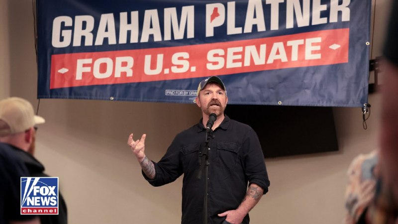

Fox News (Twitter/X)

Graham Platner exchanged sexual texts with several women after marrying his wife two years ago, according to a report.

Platner’s campaign confirmed the text exchanges to Politico following a report from the Wall Street Journal that claimed his wife, Amy Gertner, told a campaign aide about the texts after he launched his Senate bid as they began looking into potential political liabilities.

She made the private revelation before Platner held a campaign rally last year supported by Sen. Bernie Sanders, I-Vt., but the aide decided the texts were a private matter for the couple, the campaign said, according to the newspaper.

"I confided deeply personal details about my marriage to someone I considered a friend," Gertner said in a statement to WSJ. "In the months since, I have had to watch as she spread malicious gossip to anyone who would take her call. I trusted this person with the most private chapter of our lives — the early days of our marriage before...

Перейти на оригинальный пост

## FoxNewsTwitter — post 342439

  <a href="telegram/content/FoxNewsTwitter_342439_1780208688.mp4" target="_blank">🎬 Download video</a>

Fox News (Twitter/X)

"The ballroom will be right here."

President Trump shows Lara Trump a behind-the-scenes look at construction for the White House ballroom, which he calls a gift to America from him and "great patriots."

"It will be the greatest facility of its kind ever built," the president says as he shows off what will be the ballroom entrance.

## FoxNewsTwitter — post 342438

  <a href="telegram/content/FoxNewsTwitter_342438_1780208690.mp4" target="_blank">🎬 Download video</a>

Fox News (Twitter/X)

"We’ve actually left their military alone — people would be surprised to hear that."

President Trump says Iran's military hasn't been hit as aggressively because it's "somewhat moderate" compared to other elements of the regime.

He argues that wiping out "everybody" could cause a country to be unable to rebuild for generations.

## pm_afshaa — post 91923

عرزشی ها شب گذشته در میدان انقلاب دست به تجمع زدن و شعار «با قاتلین رهبر، مذاکره حرامه» سر دادن..

💧 Rainbet.com the #1 Non-KYC Crypto Casino & Sportsbook @rainbetcom

😁 @Pm_Afshaa

## IranIntlTV — post 339824

  <a href="telegram/content/IranIntlTV_339824_1780208691.mp4" target="_blank">🎬 Download video</a>

ویدیوهای رسیده به ایران‌اینترنشنال نشان می‌دهند گروهی از ایرانیان مقیم آلمان روز شنبه ۹ خرداد، علیه اعدام‌های جمهوری اسلامی و در حمایت از شاهزاده رضا پهلوی، در شهر هانوفر تجمع کردند.

## IranIntlTV — post 339823

  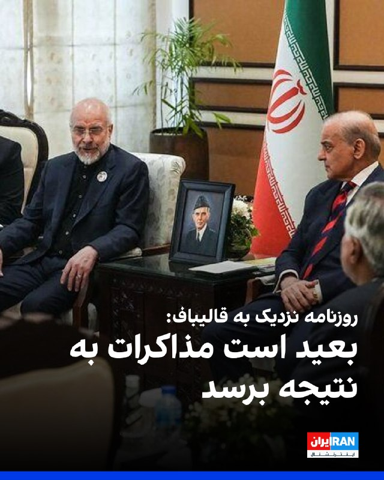

روزنامه خراسان، نزدیک به محمدباقر قالیباف، رییس مجلس در مقاله‌ای نوشت بعید است مذاکرات جمهوری اسلامی و آمریکا به نتیجه برسد و پیش‌‎بینی کرد جنگ ادامه خواهد داشت.

خراسان اظهارات و واکنش‌های دونالد ترامپ، رییس‌جمهور آمریکا را با هدف کنترل بازرهای مالی ارزیابی کرد.
این روزنامه ضمن اشاره به اظهارات اخیر ترامپ درباره رفع محاصره دریایی جمهوری اسلامی نوشت: «پست ترامپ، قبل از تعطیلات آخر هفته، موجی از خوش‌بینی به بازارهای جهانی تزریق کرد و قیمت نفت برنت را به حدود ۸۴ دلار رساند.»

این روزنامه نوشت نزدیکان رییس‌جمهور آمریکا با اظهارات «امیدوارکننده» او در آستانه تعطیلات آخر هفته با نوسان‌گیری در بازارهای مالی سودهای کلانی به‌دست آوردند.

نویسنده خراسان افزود: «توافقی اولیه و موقت محتمل است که البته آن هم نه مولود رسیدن به باوری برای حل تنش، بلکه بیشتر محصول اولویت‌ها و مدیریت تنش از سوی دو طرف است و بعید است که به توافقی جامع ختم شود.»
https://iranintl.com/202605314559

## IranIntlTV — post 339822

  <a href="https://t.me/IranintlTV/339822" target="_blank">📎 Download file</a>

🎧نسخه صوتی اخبار بامدادی | یکشنبه ۱۰ خرداد
@iranintlTV

## IranIntlTV — post 339821

  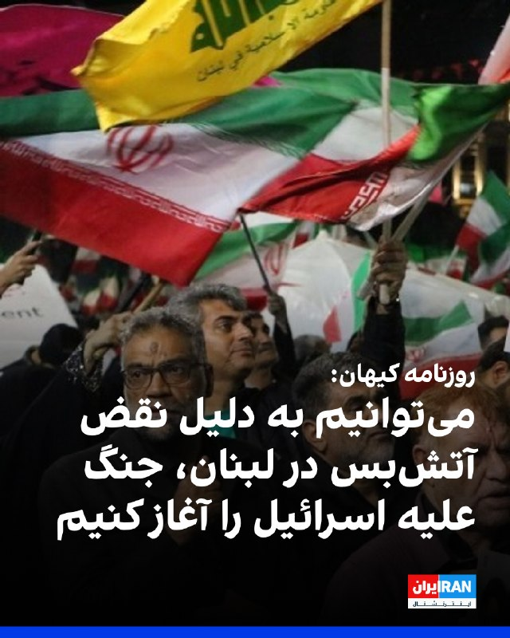

روزنامه کیهان در یادداشتی با اشاره به حملات اسرائیل به لبنان، نوشت: «ما می‌توانیم اعلام کنیم چون آتش‌بس در لبنان از سوی اسرائیل نقض شده، جمهوری اسلامی آتش‌بس را تمام شده تلقی کرده و عملیات علیه ناقض آتش‌بس را از سر می‌گیرد، مگر آنکه اسرائیل طی چند روز به عقب برگردد و عملیات نظامی در لبنان را متوقف کند.»

این روزنامه که زیر نظر نماینده رهبر جمهوری اسلامی اداره می‌شود، افزود: «این هشدار و سپس احتمال اقدام نظامی ما روی بازارهای انرژی تاثیر فوری می‌گذارد و آژیر خطر بازگشت جنگ را برای آمریکا به صدا در می‌آورد.»

یادداشت‌نویس کیهان اضافه کرد: «روند فعلی چه آنچه آمریکا به‌صورت واکنشی در منطقه خلیج‌فارس انجام می‌دهد و چه آنچه هر روزه از سوی اسرائیل و با رضایت آمریکا و حوزه عربی علیه لبنان صورت می‌گیرد، چیزی جز جنگ نیست. اگر ما اعلام کنیم دیگر نقض آتش‌بس را تحمل نمی‌کنیم، به احتمال زیاد به توقف اقدامات نظامی علیه لبنان می‌رسیم، نه اینکه جنگ مشتعل‌تر شود.»
https://iranintl.com/202605313233

## IranIntlTV — post 339820

  

ارتش اسرائیل در بیانیه‌ای اعلام کرد نیروهایش در چارچوب عملیاتی چندروزه در منطقه ارتفاعات بوفور و وادی السلوق، کنترل عملیاتی این ارتفاعات استراتژیک را به دست گرفتند.
بر اساس این بیانیه، نیروهای اسرائیلی از رودخانه لیتانی عبور کردند و عملیات خود را به شمال این رودخانه گسترش دادند. هدف اصلی این عملیات نابودی زیرساخت‌های حزب‌الله بود که با هدایت جمهوری اسلامی در این منطقه ایجاد شده است.

https://iranintl.com/202605312925

## IranIntlTV — post 339819

  

فداحسین مالکی، عضو کمیسیون امنیت ملی مجلس گفت: «جمهوری اسلامی از همان ابتدا نسبت به آتش‌بس و همچنین مذاکرات با آمریکا نگاه خوش‌بینانه‌ای نداشته، چرا که سابقه بدعهدی‌های واشینگتن همچنان در ذهن مسئولان و مردم باقی مانده و این بدبینی هرگز از بین نرفته است.»

او افزود: «جمهوری اسلامی نه مذاکره را کنار گذاشته و نه به آن دل بسته است.»

این نماینده مجلس اضافه کرد: «جمهوری اسلامی نسبت به ورود موضوعاتی همچون تنگه هرمز و غنی‌سازی به مذاکرات، ملاحظات جدی داشته است.»
https://iranintl.com/202605311277

## IranIntlTV — post 339818

  <a href="telegram/content/IranIntlTV_339818_1780208697.mp4" target="_blank">🎬 Download video</a>

بر اساس گزارش وال‌استریت ژورنال، روسیه ۲۶ میلیارد دلار به پروژه‌های مرتبط با مقابله با پیری اختصاص داده است؛ از داروهای ضدپیری و چاپ سه‌بعدی بافت‌های زنده تا پرورش اندام‌های انسانی برای پیوند. این سرمایه‌گذاری‌ها بار دیگر این پرسش را مطرح کرده‌اند که آیا علم می‌تواند عمر انسان را به ۱۲۰ یا حتی ۱۵۰ سال برساند یا این هدف همچنان دور از دسترس است؟
عنایت شهیر، خبرنگار ایران‌اینترنشنال، گزارش می‌دهد
@iranintltv

## IranIntlTV — post 339817

  <a href="telegram/content/IranIntlTV_339817_1780208699.mp4" target="_blank">🎬 Download video</a>

نخستین همایش انجمن شیر و خورشید اروپا در استکهلم با حضور دانشجویان، پژوهشگران و فعالان مدنی ایرانی برگزار شد. شرکت‌کنندگان در این نشست بر اهمیت سرمایه سیاسی، همبستگی، شبکه‌سازی و حمایت از مطالبات دموکراتیک برای شکل‌گیری جامعه‌ای آزاد و مشارکت‌محور تاکید کردند.
گزارش مهران عباسیان، خبرنگار ایران‌اینترنشنال
@iranintltv

## IranIntlTV — post 339816

  <a href="telegram/content/IranIntlTV_339816_1780208701.mp4" target="_blank">🎬 Download video</a>

همزمان با گمانه‌زنی‌ها درباره احتمال توافق میان تهران و واشینگتن، دونالد ترامپ، رییس‌جمهوری آمریکا، گفت آمریکا یا به یک توافق مطلوب خواهد رسید یا از گزینه نظامی استفاده خواهد کرد. او با تاکید بر ترجیح راه حل دیپلماتیک افزود که از بازگشت به گزینه نظامی ابایی ندارد و واشینگتن از تجربه جنگ عراق درس گرفته است.
گفت‌وگو با رضا گوهرزاد، روزنامه‌نگار و تحلیلگر سیاسی
@iranintltv

## IranIntlTV — post 339815

  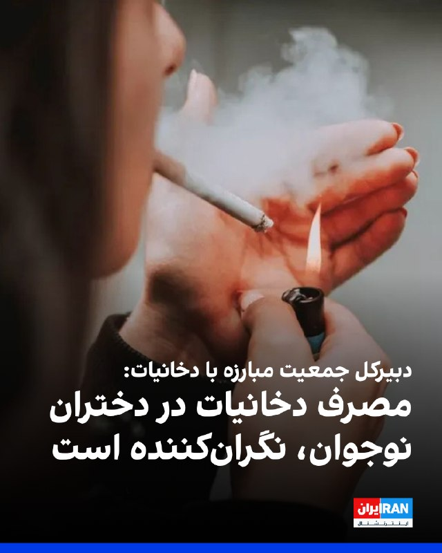

محمدرضا مسجدی، دبیرکل جمعیت مبارزه با دخانیات گفت: «اگرچه میزان مصرف دخانیات در میان زنان همچنان پایین‌تر از مردان است، اما روند افزایش مصرف در میان دختران نوجوان نگران‌کننده است.»

او افزود: «میزان مصرف دخانیات در میان دختران ۱۳ تا ۱۵ ساله نسبت به سال ۱۳۹۵، حدود ۱۳۵ درصد افزایش یافته است.»

مسجدی ادامه داد: «در حال حاضر حدود ۲۰ تا ۲۴ درصد جمعیت کشور به نوعی مصرف‌کننده دخانیات هستند.»
https://iranintl.com/202605311533

## IranIntlTV — post 339814

  <a href="telegram/content/IranIntlTV_339814_1780208704.mp4" target="_blank">🎬 Download video</a>

ایرانیان مقیم واشینگتن دی‌سی با برگزاری تجمعی، مخالفت خود را با اعدام، سرکوب و محدودیت‌های اینترنتی در ایران اعلام کردند و خواستار حمایت از حقوق بشر و آزادی‌های مدنی برای ایرانیان شدند. شرکت‌کنندگان همچنین به هرگونه همکاری دولت‌های غربی با جمهوری اسلامی اعتراض کردند.
گزارش اردوان روزبه، خبرنگار ایران‌اینترنشنال
@iranintltv

## IranIntlTV — post 339813

  <a href="telegram/content/IranIntlTV_339813_1780208706.mp4" target="_blank">🎬 Download video</a>

کتائب حزب‌الله عراق در بیانیه‌ای آمریکا و بریتانیا را به «دخالت در امور داخلی عراق» متهم کرد و همزمان گفت عربستان سعودی مقرهای حشد شعبی را هدف قرار داده است و اردن به پایگاهی برای فعالیت‌های اسرائیل علیه عراق تبدیل شده است.

گفت‌وگو با غسان عاشور، تحلیلگر مسائل خاورمیانه
@iranintltv

## IranIntlTV — post 339812

  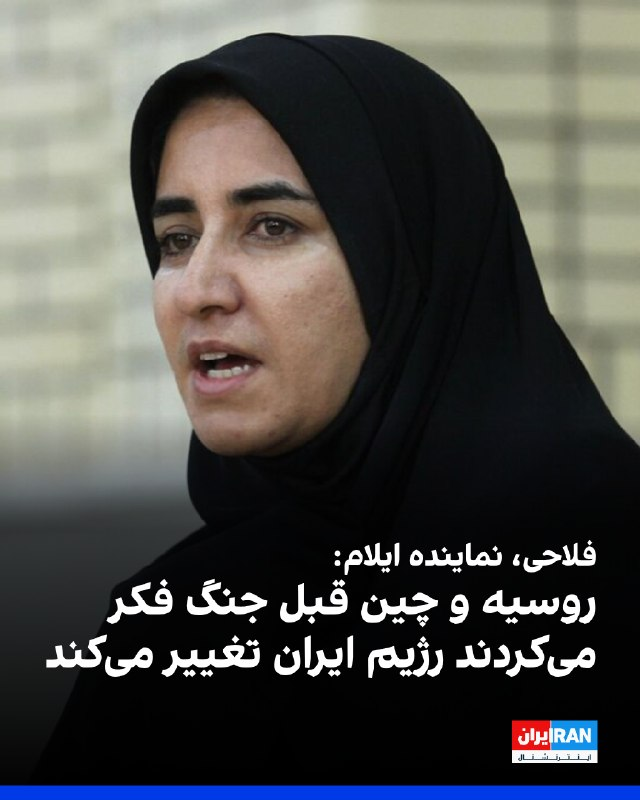

سارا فلاحی، نماینده ایلام در مجلس گفت: «روسیه و چین قبل از شروع جنگ نسبت به توان ایستادگی جمهوری اسلامی مردد بودند و فکر می‌کردند که رژیم ایران تغییر می‌کند.»

او افزود: «روسیه و چین قبل از شروع جنگ و حرکت ناوهای آمریکایی به سوی ایران، برای بستن قراردادهای نظامی مردد بودند.»
https://iranintl.com/202605311821

## IranIntlTV — post 339811

  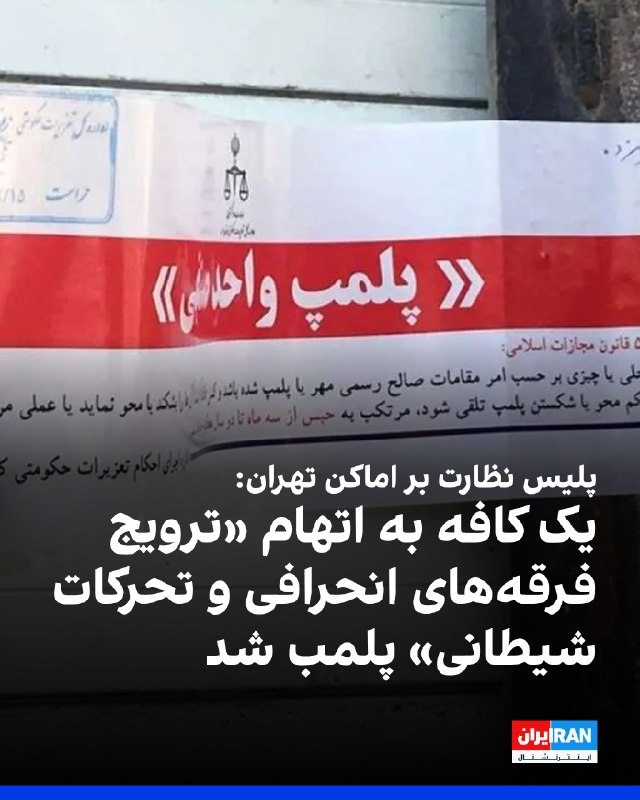

پلیس نظارت بر اماکن عمومی تهران اعلام کرد یکی از کافه‌های منطقه ولیعصر را به دلیل آنچه «فعالیت‌های ترویج فرقه‌های انحرافی» و «تحرکات شیطانی» خوانده، پلمب کرده است.

در این گزارش آمده این کافه با برگزاری برنامه‌هایی با «ظاهر موسیقی غربی»، بستری برای «حرکات نابهنجار» فراهم کرده بود.

پلیس همچنین اعلام کرده مشتریان این کافه، شامل دختران و پسران جوان، در وضعیتی «غیر طبیعی و با حرکاتی عجیب و غریب»، مشاهده شده بودند.
https://iranintl.com/202605317469

## IranIntlTV — post 339810

  <a href="telegram/content/IranIntlTV_339810_1780208709.mp4" target="_blank">🎬 Download video</a>

سرخط خبرهای یکشنبه ۱۰ خرداد
@iranintltv

## IranIntlTV — post 339809

  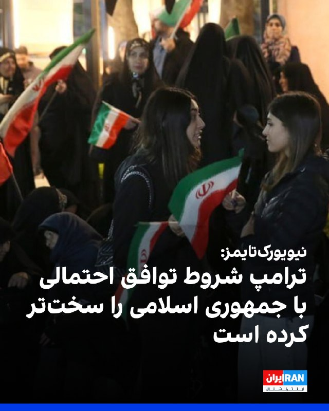

نیویورک‌تایمز به نقل از سه مقام آگاه گزارش داد دونالد ترامپ شروط چارچوب احتمالی توافق با جمهوری اسلامی را سخت‌تر کرده و تغییرات پیشنهادی را برای بررسی دوباره به تهران فرستاده است.
طبق این گزارش، هنوز روشن نیست چه تغییراتی در متن توافق ایجاد شده، اما ترامپ درباره بخش‌هایی از توافق احتمالی که شامل آزادسازی منابع مالی برای ایران می‌شود، ابراز نگرانی کرده است.
یک مقام آگاه به نیویورک‌تایمز گفت ترامپ از طولانی شدن پاسخ جمهوری اسلامی به پیشنهادهای آمریکا ناراضی است و پیشنهاد سخت‌گیرانه‌تر او احتمالا برای افزایش فشار بر تهران و سرعت بخشیدن به روند مذاکرات ارائه شده است.
نیویورک‌تایمز نوشت این چارچوب می‌تواند کارزار نظامی آمریکا و اسرائیل علیه ایران را در برابر رفع محاصره تنگه هرمز پایان دهد، اما دشوارترین مسائل، از جمله آینده برنامه هسته‌ای ایران، به دورهای بعدی مذاکرات موکول خواهد شد.

https://iranintl.com/202605315762

## IranIntlTV — post 339808

  

ترامپ در گفت‌وگو با فاکس‌نیوز گفت آمریکا در جنگ اخیر تا حد زیادی از هدف قرار دادن ارتش «میانه‌رو» ایران و همچنین از نابودی کامل ساختارها در کشور خودداری کرده است تا بازسازی ایران دهه‌ها به عقب نیفتد.
او گفت: «ایالات متحده نیروی دریایی و نیروی هوایی ایران را کاملا از بین برده، اما تا حد زیادی از هدف قرار دادن ارتش ایران خودداری کرده است.»
ترامپ گفت آمریکا ارتش ایران را «تا حدی به حال خود گذاشته»، چون به گفته او این ارتش «تا اندازه‌ای میانه‌رو» است و واشینگتن نمی‌خواسته همه ساختار نظامی کشور را نابود کند.
او همچنین گفت آمریکا «شکل‌های مختلفی از رهبری» ایران را حذف کرده، اما از تجربه عراق درس گرفته است، زیرا نابودی کامل ساختارها می‌تواند کشوری را برای دهه‌ها از بازسازی بازدارد.

https://iranintl.com/202605314299

## IranIntlTV — post 339807

  

ترامپ در مصاحبه با لارا ترامپ، مجری فاکس‌نیوز، با اشاره به اینکه آمریکا به یک «توافق خیلی خوب» با جمهوری اسلامی نزدیک است، گفت توافق با حکومت ایران را ترجیح می‌دهد، اما برای بازگشت به عملیات نظامی نیز آماده است.
ترامپ گفت ترجیح می‌دهد با ایران به توافق برسد، زیرا در صورت امضای توافق، تنگه هرمز می‌تواند بلافاصله باز شود.
او تاکید کرد تنها تضمینی که می‌خواهد این است که ایران هیچ سلاح هسته‌ای نداشته باشد و گفت تهران با این موضوع موافقت کرده است.
ترامپ همچنین گفت «بزرگ‌ترین دارایی» حکومت ایران رسانه‌های «اخبار جعلی» هستند، چون موفقیت‌های آمریکا را کوچک جلوه می‌دهند. او افزود آمریکا در نبرد پیروزی بزرگی به دست ‌آورده، اما این رسانه‌ها می‌گویند واشینگتن شکست خورده است.

https://iranintl.com/202605318079

## IranIntlTV — post 339806

در برنامه اعتراضی روز شنبه در واشینگتن دی‌سی، ایرانیان در همراهی با مردم ایران که در زیر سایه اعدام‌های سیستماتیک قرار دارند و زندانیان سیاسی هیچ حقوق قانونی ندارند در کنار بنای یادبود ابراهام لینکن جمع شدند. اما معترضان خواسته دیگری که داشتند این بود که آیا در مذاکرات جاری مردم ایران نیز جایی دارند؟
@iranintltv

## FarsiVOA — post 219143

  

بدر عبدالعاطی، وزیر خارجه مصر و رافائل گروسی، مدیرکل آژانس بین‌المللی انرژی اتمی، در یک تماس تلفنی تحولات منطقه‌ای و آخرین تحولات مذاکرات واشنگتن-تهران را مورد بحث قرار دادند.

بر اساس بیانیه وزارت خارجه مصر، این تماس شامل بررسی آخرین تحولات مسیر مذاکرات میان ایالات متحده و حکومت ایران و تلاش‌ها برای دستیابی به توافقی بود که «نگرانی‌های همه طرف‌ها را در نظر بگیرد».

وزیر خارجه مصر بر «ضرورت افزایش تلاش‌های دیپلماتیک و حمایت از روند رسیدن به توافقی میان دو طرف آمریکایی و ایرانی» تأکید کرد؛ تفاهمی که بتواند به «کاهش تنش و جلوگیری از تشدید بحران کمک کرده و امنیت و ثبات منطقه‌ای و بین‌المللی را تقویت کند».

همچنین دو طرف همچنین نتایج نشست یازدهم کنفرانس بازنگری معاهده عدم اشاعه سلاح‌های هسته‌ای را که در نیویورک برگزار شد، بررسی کردند.

در این تماس، وزیر خارجه مصر ابراز تأسف کرد که این کنفرانس نتوانست به توافقی درباره سند نهایی دست یابد و تأکید کرد که مصوبات کنفرانس‌های بازنگری قبلی همچنان معتبر هستند.
@FarsiVOA

## FarsiVOA — post 219142

  

ارتش اسرائیل اعلام کرد که یک سرباز این نیرو در حمله پهپادی حزب‌الله در جنوب لبنان در شامگاه شنبه کشته شده است.

در گزارش ارتش اسرائیل، این سرباز کشته‌شده، گروهبان یکم مایکل تیوکین، ۲۱ ساله، از واحد شناسایی تیپ گیواتی و اهل اشکلون، معرفی شده است.

ارتش اسرائیل اعلام کرد که این حمله حدود ساعت ۱۰:۳۰ شامگاه شنبه رخ داد و در جریان آن، یک پهپاد که توسط حزب‌الله هدایت می‌شد، به موضعی که نیروهای تیپ گیواتی در آن مشغول فعالیت بودند، اصابت کرد.

در نتیجه انفجار، چهار سرباز دیگر نیز به‌طور سطحی زخمی شدند که آنان برای درمان به بیمارستان منتقل شدند.
@FarsiVOA

## FarsiVOA — post 219141

🔺اکسیوس و نیویورک‌تایمز: ترامپ شروط توافق احتمالی با تهران را سخت‌گیرانه‌تر کرده است

▪️اکسیوس و نیویورک‌تایمز گزارش دادند دونالد ترامپ خواستار سخت‌گیرانه‌تر شدن شروط چارچوب توافق احتمالی با جمهوری اسلامی شده و نسخه اصلاح‌شده را برای بررسی به تهران فرستاده است.

▪️اکسیوس نوشت ترامپ از تیم خود خواسته چند بند از متنی را که فرستادگانش با طرف‌های ایرانی روی آن کار کرده بودند، اصلاح کنند؛ به‌ویژه بندهای مربوط به برنامه هسته‌ای و مواد هسته‌ای ایران.

▪️نیویورک‌تایمز نیز گزارش داد ترامپ از کندی پاسخ جمهوری اسلامی به پیشنهادهای آمریکا ناراضی بوده و نسبت به بخش‌هایی از توافق که می‌تواند به آزادسازی دارایی‌های ایران مربوط باشد، نگرانی داشته است.

⬇️ بیشتر بخوانید:
https://ir.voanews.com/a/trump-tightens-terms-of-potential-deal-with-iran/8155753.html

## FarsiVOA — post 219140

Farsi VOA pinned an audio file

## FarsiVOA — post 219139

  <a href="https://t.me/farsivoa/219139" target="_blank">📎 Download file</a>

🔴📢‌ پادکست خبری شنبه ۹ خرداد ۱۴۰۵

🛜در صورتی که با مشکل اینترنت مواجه هستید میتوانید اخبار صدای آمریکا را از نسخه‌های پادکست خبری ما روزانه دنبال کنید و یا اخبار را از نسخه سبک وب‌سایت ما پیگیر باشید:
https://ir.voanews.com/lite

📡بروزترین فرکانسهای ماهواره‌ای را نیز میتوانید از صفحه زیر پیگیری کنید:
https://ir.voanews.com/satellite

🔔دیگر شبکه‌های اجتماعی ما را هم را هم از لینک زیر دنبال کنید:
https://linktr.ee/voafarsi

ما را به اشتراک بگذارید
@farsivoa

## FarsiVOA — post 219138

  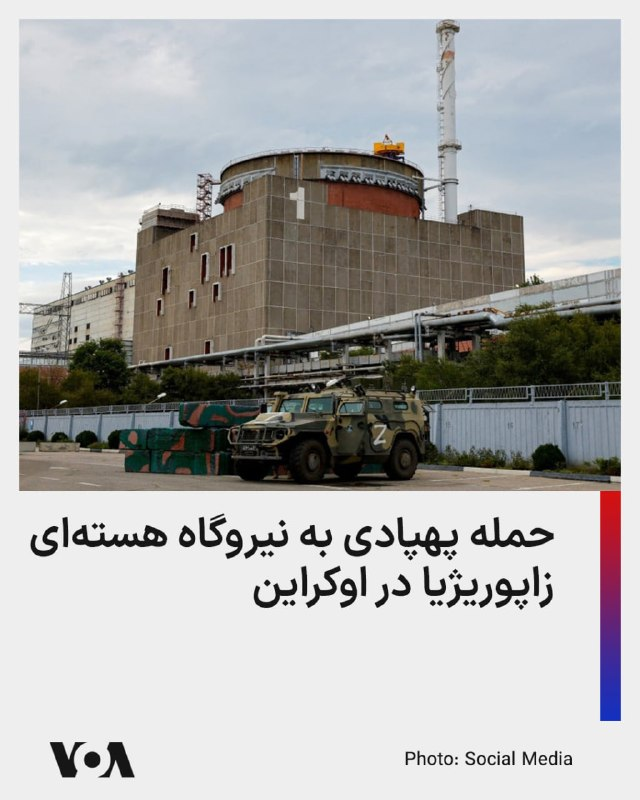

آژانس بین‌المللی انرژی اتمی اعلام کرد که یک پهپاد به ساختمان توربین نیروگاه هسته‌ای زاپوریژیا در جنوب شرقی اوکراین اصابت کرده است.

این نهاد وابسته به سازمان ملل متحد یکشنبه اعلام کرد که از سوی این نیروگاه هسته‌ای مطلع شده که این حمله باعث ایجاد حفره‌ای در دیوار ساختمان نیروگاه شده است.

رافائل گروسی، مدیرکل آژانس بین‌المللی انرژی اتمی، نگرانی شدید خود را درباره این حادثه ابراز کرد و گفت: «حمله به تأسیسات هسته‌ای مانند بازی کردن با آتش است.»

آژانس در پیامی در شبکه ایکس اعلام کرد که تیم این نهاد در این نیروگاه تحت کنترل روسیه درخواست دسترسی کرده است تا ساختمان توربین آسیب‌دیده را از نزدیک بررسی کند.
@FarsiVOA

## FarsiVOA — post 219137

  <a href="telegram/content/FarsiVOA_219137_1780208716.mp4" target="_blank">🎬 Download video</a>

ارتش ایالات متحده اعلام کرد در حمله‌ای تازه به یک شناور در شرق اقیانوس آرام، سه مرد کشته شدند؛ حمله‌ای که دومین مورد از این نوع در دو روز گذشته به شمار می‌رود.

فرماندهی جنوبی ارتش آمریکا روز شنبه در پیامی در شبکه ایکس گفت اطلاعات به‌دست‌آمده نشان می‌داد این شناور در مسیرهای مورد استفاده برای قاچاق مواد مخدر در شرق اقیانوس آرام حرکت می‌کرد و در عملیات قاچاق مواد مخدر نقش داشت.

این فرماندهی افراد کشته‌شده را «نارکوتروریست» خواند و اعلام کرد در جریان این عملیات هیچ نیروی آمریکایی آسیب ندیده است.

این حمله دومین عملیات مشابه ارتش آمریکا در دو روز گذشته است. رویترز نوشته این حمله تازه‌ترین مورد از مجموعه حملاتی است که طی ماه‌های اخیر علیه شناورهای مظنون به ارتباط با قاچاق مواد مخدر انجام شده است.
@FarsiVOA

## FarsiVOA — post 219136

  

⚡️دونالد ترامپ، رئیس‌جمهوری آمریکا، در مصاحبه‌ای با لارا ترامپ از فاکس‌نیوز که از او پرسید «یک توافق خوب» با جمهوری اسلامی چگونه است؟ گفت «خب، اول از همه هیچ توافقی آن‌قدر خوب نیست که رسانه‌ها آن را خوب پوشش دهند. اما ما در حال دستیابی به یک توافق عالی هستیم...؛ در غیر این صورت دوباره برمی‌گردیم و از طریق اقدام نظامی کار را تمام می‌کنیم.»
آقای ترامپ گفت: «اما رسیدن به توافق سریع‌تر خواهد بود. احتمالاً از نظر انسانی هم بهتر است. جنبه مثبتی هم دارد؛ جان افراد زیادی را نجات می‌دهد، چه از طرف مقابل باشند و چه از هر طرف دیگر.»
او افزود: «ما به یک توافق بسیار خوب نزدیک شده‌ایم و اگر بتوانیم آن را نهایی کنیم، عالی است. در غیر این صورت، دوباره سراغ «وزارت جنگ» می‌رویم، همان‌طور که ما آن را می‌نامیم. و این رویکرد بسیار موفق بوده است. ونزوئلا را دیدید؛ آن یک پیروزی یک‌روزه بود و این مورد هم عملاً همین حالا یک پیروزی محسوب می‌شود. ما اساساً نیروهای نظامی آن‌ها را شکست داده‌ایم.»
آقای ترامپ گفت: «من ترجیح می‌دهم به توافق برسیم، زیرا می‌توانیم بلافاصله پس از امضای توافق، تنگه را بازگشایی کنیم.»

@FarsiVOA

## DW_Farsi — post 125330

🔶 اکسیوس: ترامپ خواستار چند اصلاحیه در متن توافق با ایران شده است

وبسایت خبری اکسیوس از قول یک مقام ارشد ایالات متحده و یک منبع آگاه گزارش داد که دونالد ترامپ، رئیس جمهور آمریکا در جریان نشست اتاق وضعیت در کاخ سفید، خواسته که چند اصلاحیه در توافق با جمهوری اسلامی انجام شود.

به گزارش اکسیوس با وجود آن که ترامپ خواستار توافق است و انتظار دارد توافق به‌زودی نهایی شود، اما خواهان آن است که چند بند مهم، به‌ خصوص درباره مواد اتمی در ایران، تقویت شود.

آکسیوس همچنین گزارش داده که در متن کنونی یک بازه ۶۰ روزه برای انجام مذاکره در خصوص تعهدات اتمی جمهوری اسلامی و کاهش تحریم‌ها پیش‌بینی شده است و نخستین موضوعات بر سر سرنوشت ذخایر اورانیوم غنی‌شده در ایران و نیز محدود کردن غنی‌سازی بیشتر خواهد بود.

در همین حال، نیویورک‌تایمز از سه مقام ایالات متحده نقل کرده که ترامپ، پیش‌شرط‌های چارچوب احتمالی توافق با ایران را سخت‌تر کرده و تغییرات پیشنهادی خود را به منظور بازبینی دوباره به تهران فرستاده است.

نیویورک‌تایمز در گزارش خود آورده که هنوز مشخص نیست که چه تغییراتی در متن توافق صورت گرفته اما ترامپ، در خصوص بخش‌هایی از توافق احتمالی، از جمله آزادسازی منابع مالی برای جمهوری اسلامی، نگرانی‌هایی دارد.

طبق گزارش نیویورک‌تایمز، ترامپ از طول کشیدن پاسخ جمهوری اسلامی به پیشنهادهای ایالات متحده ناراضی است و ارائه پیشنهاد سخت‌گیرانه‌تر او، احتمالا با هدف افزایش فشار بر حکومت ایران و تسریع روند مذاکرات انجام شده است.

@dw_farsi

## DW_Farsi — post 125329

🔶 سپاه پاسداران: یک پهپاد MQ-1 آمریکا را ساقط کردیم

روابط‌ عمومی سپاه پاسداران انقلاب اسلامی با صدور بیانیه‌ای مدعی شد که یک پهپاد MQ-1 آمریکا را بامداد یکشنبه ۱۰ خرداد بر فراز آب‌های سرزمینی ایران ساقط کرده است.

در بیانیه سپاه پاسداران آمده است که این پهپاد، "با ورود به آب‌های سرزمینی ایران" قصد داشت "عملیات خصمانه" انجام دهد اما "بلافاصله در رصد و هدف موشک‌های پدافند نوین سپاه قرار گرفت و سرنگون شد".

ارتش آمریکا تا لحظه تنظیم این خبر واکنشی به ادعای سپاه نشان نداده است.

درگیری‌های پراکنده به رغم آتش‌بس همچنان در تنگه هرمز ادامه دارد. ارتش ایران روز شنبه نهم خرداد (۳۰ مه) در اطلاعیه‌ای اعلام کرده بود که در بامداد همین روز یک فروند پهپاد اوربیتر اسرائيل را رهگیری و منهدم کرده است. به گفته ارتش، این پهپاد "تحت شبکه یکپارچه قرارگاه مشترک پدافند هوایی کشور در منطقه قشم" مورد اصابت قرار گرفت و منهدم شد.

در رویدادی دیگر کشتی فله‌بر "لیان استار" (Lian Star) که با پرچم گامبیا حرکت می‌کرد شب هشتم خرداد (۲۹ مه) هشدارهای متعدد نیروهای آمریکایی را هنگام تلاش برای ورود به یک بندر ایرانی نادیده گرفت.

فرماندهی مرکزی ایالات متحده آمریکا (سنتکام) در همین زمینه در پیام رسان ایکس نوشت: «پس از آنکه خدمه کشتی از تبعیت از دستورات خودداری کردند، یک هواپیمای آمریکایی با شلیک یک موشک AGM-114 Hellfire به اتاق موتور کشتی، آن را از کار انداخت. این کشتی دیگر به سمت ایران در حرکت نیست.»

@dw_farsi

## DW_Farsi — post 125328

🔶 ترامپ: توافق را ترجیح می‌دهم، اما آماده بازگشت به عملیات نظامی هستیم

دونالد ترامپ، رئیس‌ جمهور آمریکا در مصاحبه تلویزیونی با شبکه فاکس‌نیوز با بیان این که آمریکا "به یک توافق خیلی خوب" با جمهوری اسلامی نزدیک است گفت که توافق با حکومت ایران را ترجیح می‌دهد، "اما برای بازگشت به عملیات نظامی نیز آمادگی دارد."

او همزمان در بخش دیگری از گفت‌وگوی خود تاکید کرد: «در صورتی که به مطالبات خود نرسیم، در ایران به روشی دیگر به آن پایان خواهیم داد.»

ترامپ افزود ایالات متحده آمریکا یا به توافق خوبی دست خواهد یافت یا از طریق نظامی کار را در ایران تمام خواهد کرد. او با تاکید بر این که چنین چیزی "آهسته اما قطعا" رخ خواهد داد، بار دیگر گفت که ایالات متحده، نیروی دریایی و نیروی هوایی ایران را "به کلی" نابود کرده، اما تا حد زیادی "از هدف قرار دادن ارتش خودداری کرده است".

هنوز مشخص نیست که مقصود ترامپ از بیان این اظهارات به طور دقیق چیست. او در مصاحبه با فاکس نیوز به این نکته اشاره کرد که آمریکا، در جریان حملات، تا حدی کاری به ارتش ایران نداشته، چون ارتش ایران "تا اندازه‌ای میانه‌رو" است و آمریکا قصد نداشته تمامی ساختار نظامی ایران را نابود کند.

رئیس جمهور آمریکا در بخش دیگری از اظهارات خود افزود که آمریکا "شکل‌های مختلفی از رهبری" حکومت ایران را از بین برده اما از تجربه عراق، آموخته چرا که نابودی کامل ساختارها ممکن است به مدت دهه‌ها مانع بازسازی یک کشور شود.

ترامپ در ادامه با اشاره به برنامه اتمی جمهوری اسلامی مدعی شد که جمهوری اسلامی نه تنها با این موافقت کرده که سلاح اتمی نسازد، بلکه توافق کرده که از طرق دیگر از جمله خریداری نیز به آن دست پیدا نکند. رئیس جمهور آمریکا این امر را "تغییری مهم" در جریان مذاکرات خواند.

@dw_farsi

## Persian_Trend_Official — post 15366

  

پهپاد سرنگون‌شده MQ-1 احتمالاً اماراتی بوده است

پس از اعلام سرنگونی یک فروند پهپاد MQ-1 Predator توسط ایران، گمانه‌زنی‌ها درباره مالکیت این پهپاد بالا گرفته است. با توجه به اینکه نیروی هوایی آمریکا این پهپاد را از سال ۲۰۱۸ از خدمت عملیاتی خارج کرده و MQ-1 را با MQ-9 Reaper جایگزین کرده است، احتمال آمریکایی بودن مستقیم این پهپاد پایین‌تر ارزیابی می‌شود.
در میان کاربران شناخته‌شده باقی‌مانده این خانواده پهپادی، امارات متحده عربی یکی از گزینه‌های جدی است؛ به‌ویژه اینکه ابوظبی نسخه صادراتی Predator XP را در اختیار داشته و این پهپادها برای مأموریت‌های شناسایی، مراقبت مرزی و پایش دریایی طراحی شده‌اند. به همین دلیل، اگر پهپاد ساقط‌شده واقعاً از خانواده MQ-1 باشد، یکی از محتمل‌ترین سناریوها، تعلق آن به امارات یا استفاده از بسترهای مرتبط با امارات در منطقه است.
این موضوع از نظر سیاسی و نظامی اهمیت زیادی دارد؛ چون اگر منشأ پهپاد اماراتی تأیید شود، ماجرا فقط یک حادثه پدافندی ساده نخواهد بود، بلکه می‌تواند نشان‌دهنده ورود مستقیم برخی بازیگران خلیج فارس به چرخه شناسایی و جمع‌آوری اطلاعات علیه ایران باشد.

📌 @persian_trend_official
پرشین ترند | متفاوت‌ترین کانال نظامی

## Persian_Trend_Official — post 15365

کانال رسمی پرشین ترند pinned «دوستان خوبم اتفاق مهمی بود میتونید توی دایرکت مسیج بدید. البته دقت کنید سلام و احوال پرسی نباشه ! من احتمالا نمیتونم پاسخ بدم چون تعداد پیام ها زیاده اما میخونم . ویدیو جالبی دیدید با یک توضیح بفرستید یا اگر خبر مهمی اتفاق افتاد میتونید برام ارسال کنید …»

## Persian_Trend_Official — post 15364

دوستان خوبم اتفاق مهمی بود میتونید توی دایرکت مسیج بدید.
البته دقت کنید سلام و احوال پرسی نباشه !
من احتمالا نمیتونم پاسخ بدم چون تعداد پیام ها زیاده اما میخونم .
ویدیو جالبی دیدید با یک توضیح بفرستید
یا اگر خبر مهمی اتفاق افتاد میتونید برام ارسال کنید
یا عکسی از یک اتفاق مهم بود بفرستید

البته دقت کنید از کانال های دیگه فروارد نکنید اگر خودتون اورجینال عکسی داشتی و ارزش خبری داشت حتما استفاده میکنم

از توجه شما متشکرم
الیاس فرخ

## Persian_Trend_Official — post 15363

## Persian_Trend_Official — post 15362

  

شاخص کل بورس تهران در دومین روز هفته فعالیت خود را با رشد ۸۱ هزار واحدی آغاز کرد و به تراز ۴ میلیون و ۲۳۴ هزار واحد رسید.

📌 @persian_trend_official
پرشین ترند | متفاوت‌ترین کانال نظامی

## Persian_Trend_Official — post 15361

  

ترامپ در تروث‌سوشال: کتابخانه ریاست جمهوری اوباما

پ.ن : روزی یک لگد به بایدن یا اوباما نزنه خوابش نمیبره 😄

📌 @persian_trend_official
پرشین ترند | متفاوت‌ترین کانال نظامی

## Persian_Trend_Official — post 15360

  <a href="telegram/content/Persian_Trend_Official_15360_1780208721.mp4" target="_blank">🎬 Download video</a>

استونی به‌دلیل کاهش شدید نرخ تولد پسران، ناچار خواهد شد زنان را نیز به خدمت نظامی اجباری فرا بخواند. در سال‌های اخیر، شمار بیشتری از کشورهای اروپایی در حال حرکت به‌سوی سربازگیری از زنان در ارتش هستند. 📌 @persian_trend_official پرشین ترند | متفاوت‌ترین کانال…

## Persian_Trend_Official — post 15359

  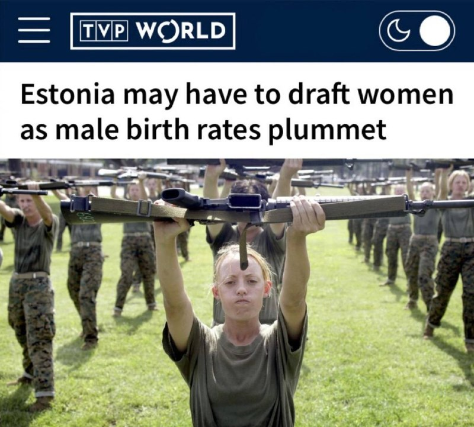

استونی به‌دلیل کاهش شدید نرخ تولد پسران، ناچار خواهد شد زنان را نیز به خدمت نظامی اجباری فرا بخواند.

در سال‌های اخیر، شمار بیشتری از کشورهای اروپایی در حال حرکت به‌سوی سربازگیری از زنان در ارتش هستند.

📌 @persian_trend_official
پرشین ترند | متفاوت‌ترین کانال نظامی

## Persian_Trend_Official — post 15358

  <a href="telegram/content/Persian_Trend_Official_15358_1780208723.webm" target="_blank">🎬 Download video</a>

📑بولتن خبری ۲۴ ساعت گذشته

۱۰خرداد۱۴۰۵

💬تهیه شده در تحریریه پرشین ترند

⚔️ ترامپ مدعی شد واشنگتن به توافقی «بسیار خوب» با ایران نزدیک شده و بازگشایی هرمز بخش مهمی از این توافق خواهد بود

⚔️ صداوسیما جزئیاتی از متن غیررسمی «تفاهم اسلام‌آباد» منتشر کرد؛ دسترسی ایران به ۱۲ میلیارد دلار دارایی بلوکه‌شده و نقش محوری تهران در مدیریت تردد هرمز از مفاد ادعایی آن است

⚔️ گروسی: پیشرفت قابل توجهی در پرونده هسته‌ای ایران حاصل شده و آژانس از روند مذاکرات حمایت می‌کند

⚔️ نماینده مجلس: عمان موافقت اولیه خود را با طرح مدیریت ایران بر تنگه هرمز اعلام کرده است

⚔️ قرارگاه خاتم‌الانبیا: مدیریت تنگه هرمز با اقتدار کامل توسط نیروهای مسلح ایران اعمال می‌شود

⚔️سپاه از عبور ۲۰ کشتی از تنگه هرمز در قالب «کریدور اقتدار» خبر داد

⚔️ ارتش از انهدام یک فروند پهپاد اوربیتر اسرائیلی در منطقه قشم خبر داد

⚔️ محسن رضایی: ترامپ برای سومین بار به دیپلماسی خیانت کرده و همچنان به دنبال اهداف دیگری است

⚔️کشتی فله‌بر ایرانی موفق به عبور از محاصره دریایی آمریکا و رسیدن به سواحل کشور شد

⚔️قانون ساماندهی پهپادهای غیرنظامی وارد مرحله اجرا شد؛ استفاده‌کنندگان ملزم به دریافت مجوز و گواهینامه خواهند بود

⚔️ دو عضو گروهک تروریستی پاک در عملیات نیروهای امنیتی در کرمانشاه کشته شدند

⚔️ ارتش اسرائیل چندین هشدار فوری تخلیه برای ساکنان روستاها و شهرک‌های جنوب لبنان صادر کرد

⚔️ یک منبع نظامی لبنانی مدعی شد نیروهای اسرائیلی از رودخانه لیتانی عبور کرده و به حومه نبطیه رسیده‌اند

⚔️ حزب‌الله ویدئویی از هدف قرار دادن یک تانک مرکاوا با پهپاد انتحاری منتشر کرد

⚔️کانال ۱۲ اسرائیل از برگزاری نشست امنیتی اضطراری نتانیاهو و مقامات ارشد درباره تشدید تنش در جبهه شمالی خبر داد

⚔️ نخست‌وزیر لبنان تأکید کرد مذاکرات جاری تضمینی برای موفقیت ندارد اما کم‌هزینه‌ترین گزینه پیش روی کشور است

⚔️ ترکیه اعلام کرد حل بحران تنگه هرمز حتی از پرونده هسته‌ای ایران نیز مهم‌تر است

⚔️ مقام قطری از بررسی دریافت عوارض موقت و محدود در تنگه هرمز برای کمک به بازگشت کشتیرانی عادی خبر داد

⚔️ عمان از مشاهده یک جسم شناور مشکوک به مین دریایی در آب‌های سرزمینی خود خبر داد

⚔️ ترامپ: تنها تضمین مورد نظر من جلوگیری از دستیابی ایران به سلاح هسته‌ای است و ایرانی‌ها عملاً این موضوع را پذیرفته‌اند

⚔️ وزیر دفاع آمریکا تأکید کرد محاصره دریایی ایران همچنان به قوت خود باقی است

⚔️ سنتکام از توقیف کشتی تجاری Lian Star در دریای عمان پس از بی‌توجهی به ۲۰ هشدار خبر داد

⚔️ آسوشیتدپرس: آمریکا یک کشتی تجاری دیگر را نیز هنگام تلاش برای عبور از محاصره دریایی متوقف کرده است

⚔️ بلومبرگ: حمله موشکی ایران به پایگاه علی‌السالم کویت موجب آسیب به دو پهپاد MQ-9 و زخمی شدن ۵ آمریکایی شد

⚔️ رئیس مجلس نمایندگان آمریکا تأیید کرد ترامپ در جریان حادثه کویت قرار گرفته است

⚔️ مدعی شد جنگنده F-15E آمریکا که ماه گذشته بر فراز ایران سقوط کرد احتمالاً با موشک دوش‌پرتاب ساخت چین هدف قرار گرفته است

⚔️ وال‌استریت ژورنال: عربستان از واشنگتن خواسته امارات را برای توقف حملات علیه ایران تحت فشار قرار دهد

⚔️ هگست: روابط واشنگتن و اسلام‌آباد در حال ورود به مرحله‌ای جدید از همکاری است

⚔️ فرودگاه مونیخ پس از مشاهده یک پهپاد ناشناس برای چند ساعت تعطیل شد و هزاران مسافر تحت تأثیر قرار گرفتند

⚔️ اوکراین ویدئوی انهدام دو فروند هواپیمای گشت دریایی توپولوف-۱۴۲ و یک سامانه اسکندر روسیه را منتشر کرد

⚔️ تصاویر منتشرشده از رژه نظامی ارمنستان نشان می‌دهد جنگنده‌های سوخو-۳۰ این کشور به بمب‌های هدایت‌شونده یاسین مجهز شده‌اند

⚔️ تصاویری از بقایای یک سامانه پدافندی سوم خرداد سپاه که در جنگ اخیر منهدم شده بود منتشر شد

⚔️ ارتش آمریکا یک قایق مظنون به قاچاق مواد مخدر را در شرق اقیانوس آرام هدف قرار داد؛ هر سه سرنشین کشته شدند

⚔️ پروازهای باری مشکوک امارات به اتیوپی در ماه مه به رکورد ۴۴ پرواز رسید

👺Phantom

📌 @persian_trend_official
پرشین ترند | متفاوت‌ترین کانال

## Persian_Trend_Official — post 15357

  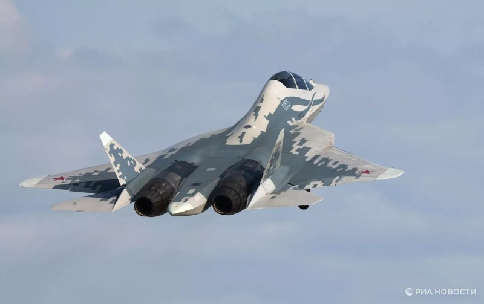

روسیه و هند در حال رایزنی درباره سازمان‌دهی تولید جنگنده روسی سوخو-۵۷ئی در خاک هند هستند. این موضوع را «سرویس فدرال همکاری‌های نظامی ـ فنی روسیه» اعلام کرده است.
هند پیش‌تر نیز شماری از سامانه‌های تسلیحاتی روسی را با موفقیت و تحت لیسانس در داخل کشور تولید کرده است؛ از جمله جنگنده‌های سوخو-۳۰ ام‌کی‌آی، تانک‌های تی-۹۰اس، تفنگ‌های تهاجمی AK-203، توپ‌های دریایی AK-630 و طیف گسترده‌ای از مهمات.
بسیاری از تحلیلگران و مفسران روس معتقدند نسخه دوسرنشینه‌ای که اخیراً با عنوان سوخو-۵۷دی نمایش داده شد، با نگاه به نیازهای هند طراحی شده است؛ زیرا دهلی‌نو پیش‌تر خواستار نسخه دوسرنشینه این جنگنده شده بود.

📌 @persian_trend_official
پرشین ترند | متفاوت‌ترین کانال نظامی

## Persian_Trend_Official — post 15356

  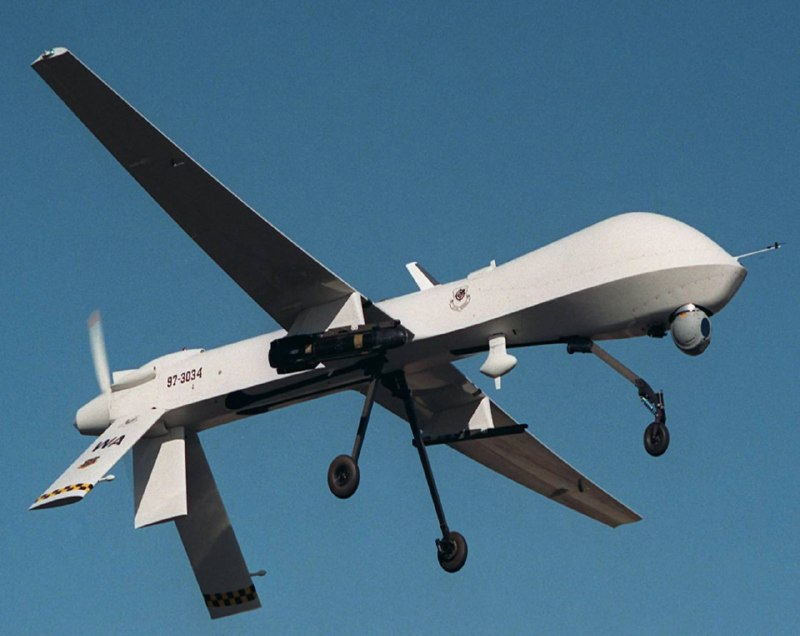

روابط‌عمومی سپاه بامداد یکشنبه، ۱۰ خردادماه، اعلام کرد یک پهپاد «ام‌کیو۱» (MQ1) ارتش آمریکا را منهدم کرده است.

خبرگزاری فارس نوشت: «این پهپاد با ورود به آب‌های سرزمینی ایران قصد انجام عملیات خصمانه داشت که بلافاصله در رصد و هدف موشک‌های پدافند سپاه قرار گرفت و سرنگون شد».

📌 @persian_trend_official
پرشین ترند | متفاوت‌ترین کانال نظامی

## Persian_Trend_Official — post 15355

  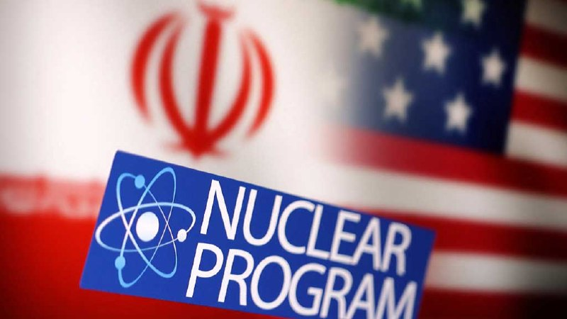

دونالد ترامپ، رییس‌جمهوری آمریکا، به شبکه خبری فاکس گفت: «ما به یک توافق خیلی خوب با تهران نزدیک هستیم.»

او همچنین گفت توافق با حکومت ایران را ترجیح می‌دهد، اما آماده بازگشت به عملیات نظامی نیز است.

ترامپ در بخشی از این گفت‌وگو تاکید کرد: «اگر به خواسته‌های‌مان نرسیم، در ایران به شیوه‌ای دیگر به آن پایان خواهیم داد.»

او گفت ایالات متحده یا به توافق خوبی خواهد رسید یا کار را از طریق نظامی در ایران تمام خواهد کرد و تاکید کرد که این اتفاق «آهسته اما مطمئناً» رخ خواهد داد.

ترامپ در ادامه گفت که ایالات متحده نیروی دریایی و نیروی هوایی جمهوری اسلامی را «کاملا» از بین برده، اما تا حد زیادی از هدف قرار دادن ارتش خودداری کرده است.

📌 @persian_trend_official
پرشین ترند | متفاوت‌ترین کانال نظامی

## RadioFarda — post 157731

  

🔸به گزارش رسانهٔ «اسرائیل هیوم»، ده‌ها نفتکش حامل نفت و گاز طبیعی مایع در هفتهٔ گذشته از تنگهٔ هرمز عبور کردند؛ برخی از آن‌ها با همراهی نیروی دریایی آمریکا، آن هم پس از آن‌که ایران و سپاه پاسداران عبور آن‌ها را تأیید کردند و در برخی موارد برای این عبور پول دریافت کردند.
🔸این روزنامه اسرائیلی این مطلب را روز یک‌شنبه دهم خرداد به نقل از سه منبع دیپلماتیک و اطلاعاتی که نخواسته‌اند نامشان فاش شود، منتشر کرد.

🔸این گزارش می‌گوید بسیاری از این شناورها حامل نفت و گاز قطر بودند و به سوی شرق آسیا، عمدتاً هند و چین، یا اروپا حرکت می‌کردند.

@RadioFarda

## RadioFarda — post 157730

  

🔸چند رسانه در آمریکا از جمله وب‌سایت اکسیوس خبر داده‌اند که رئیس جمهور آمریکا در آخرین جلسه خود درباره مذاکرات با جمهوری اسلامی خواستار اعمال تغییراتی در متن تفاهم‌نامه با تهران شده است.

🔸اکسیوس بامداد یک‌شنبه، دهم خردادماه، نوشت که انتظار می‌رود که تفاهم‌نامه بین واشینگتن و تهران خیلی زود نهایی شود، اما دونالد ترامپ تمایل دارد که «چند نکته که از نظر او حائز اهمیت بیشتر است» تقویت شود، از جمله در مورد اورانیوم غنی‌شده ایران.

🔸جلسه دونالد ترامپ با مشاوران ارشدش در روز جمعه گذشته که طبق وعده او قرار بود نتیجه چند هفته مذاکره را روشن کند پس از بیش از دو ساعت بدون اعلام نتیجه به پایان رسید.

🔸بامداد شنبه، ۹ خردادماه، روزنامه نیویورک تایمز به نقل از یک مقام ارشد دولت که به نامش اشاره نکرد نوشت که ترامپ در این جلسه به نتیجه‌ای درباره تفاهم‌نامه با تهران نرسیده است.
@RadioFarda

## IranianMinds — post 21104

  

وضعیت یه جوریه که ملت ایران ول کن هم بشن این ارزشیا دهن جمهوری اسلامیو میخان سرویس کنن

@IranianMinds

## IranianMinds — post 21103

🔴سخنگوی کمیسیون امنیت ملی خیلی خشنو ددی طورانه گفت :

محاصره دریایی یا با زور یا با مذاکره پایان خواهد یافت

@IranianMinds

## IranianMinds — post 21102

مهدی محمدی، مشاور قالیباف:

توافق صرفاً یک تاکتیک برای خرید زمان و منابع است نه استراتژی صلح‌ طلبانه

+ یکم دیر فهمیدید عزیز

@IranianMinds

## IranianMinds — post 21101

🔴 دیشب پرچم‌ به‌دستا تو میدون انقلاب شعار « با قاتلین رهبر، مذاکره حرامه » سر دادن.

+ بخدا ماهم موافقیم باهاتون

@IranianMinds

## BBCPersian — post 282471

  

🔻 در پی درگیری میان هواداران فوتبال و پلیس در سراسر فرانسه پس از پیروزی پاری‌سن‌ژرمن در فینال لیگ قهرمانان اروپا مقابل آرسنال، بیش از ۴۰۰ نفر بازداشت شدند.

هزاران نیروی پلیس برای کنترل ناآرامی‌هایی که خدمات اتوبوس، قطار و شبکه ریلی را در پاریس، پایتخت، مختل کرده بود، به کار گرفته شدند.

هواداران با آتش‌بازی و نورافشانی این پیروزی را جشن گرفتند و در جریان درگیری‌ها چندین مأمور پلیس زخمی شدند. پلیس برای متفرق کردن جمعیت در مرکز شهر پاریس از گاز اشک‌آور استفاده کرد.

این پیروزی، دومین قهرمانی پیاپی پاری‌سن‌ژرمن بود، اما در عین حال برای دومین سال متوالی نیز جشن‌های مرتبط با فوتبال در فرانسه به خشونت کشیده شد.

بیشتر بخوانید:

https://trib.al/4fUVfpa
📸 Getty Images
@BBCPersian

## BBCPersian — post 282470

  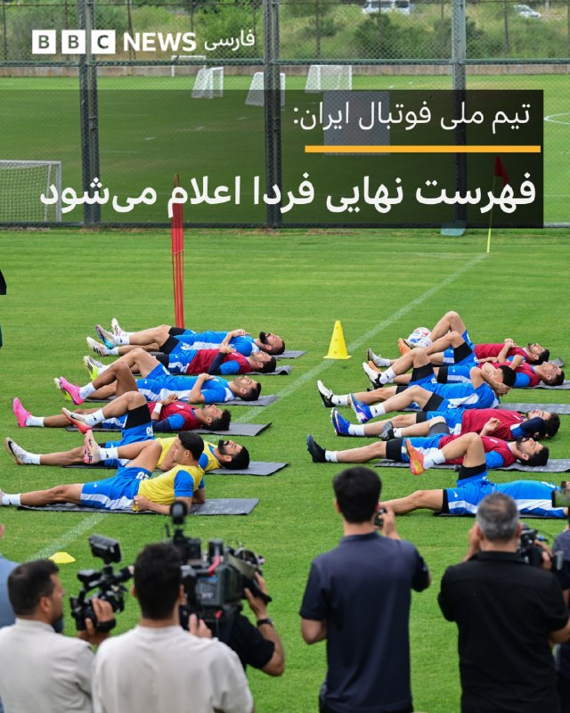

🔸بخش رسانه‌ای تیم ملی فوتبال ایران اعلام کرد که سرمربی این تیم تا ١١ خرداد از فرصت قانونی برای ارزیابی بازیکنان حاضر در اردو استفاده خواهد کرد.

گفته می‌شود که فیفا این مهلت زمانی را برای معرفی ٢۶ بازیکن نهایی تیم ملی ایران تعیین کرده است.

رسانه‌های ایران می‌گویند که «ارزیابی فنی و کامل تمامی بازیکنان از سوی کادر فنی به صورت شبانه‌روزی با استفاده از شیوه‌های نوین در حال انجام است و با استفاده از فرصت نهایی، سرمربی تیم ملی ٢۶ مسافر قطعی تیم ملی برای حضور در جام جهانی را معرفی خواهد کرد.»

دیروز مقام‌های فدراسیون فوتبال ایران اعلام کردند که پس از انتقال اردوی تیم ملی برای جام جهانی از آریزونا به شهر تیخوانا در مکزیک، از فیفا خواسته‌اند تا زمان صدور ویزاهای این رقابت‌ها را مشخص کند.

تیم ملی ایران روز جمعه در دیداری تدارکاتی در شهر آنتالیا ترکیه با نتیجه سه بر یک، گامبیا را شکست داد.

📸Anadolu via Getty Images
https://trib.al/WfOUT1o
@BBCPersian

## BBCPersian — post 282469

  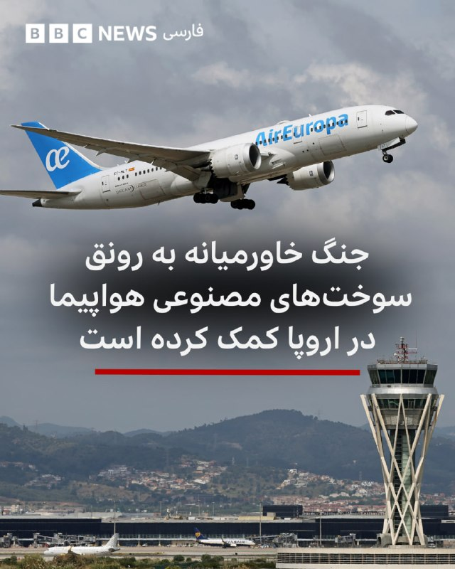

🔻جنگ خاورمیانه و اختلال در عرضه سوخت‌های فسیلی باعث افزایش توجه در اروپا به سوخت‌های مصنوعی هواپیما شده است. این سوخت‌ها از هیدروژن و دی‌اکسید کربن تولید می‌شوند و می‌توانند وابستگی صنعت هوانوردی به نفت خام را کاهش دهند.

کارشناسان می‌گویند در حالی که این سوخت‌ها بیشتر به دلیل مزایای زیست‌محیطی مورد توجه بودند، جنگ اخیر استدلال اقتصادی برای توسعه آن‌ها را نیز تقویت کرده است.

اتحادیه اروپا قصد دارد که سهم این سوخت‌ها را در فرودگاه‌های خود به‌تدریج افزایش دهد.

با این حال، هزینه‌های بالا و کمبود سرمایه‌گذاری همچنان از مهم‌ترین موانع توسعه این صنعت به شمار می‌رود.

حامیان این فناوری می‌گویند که استفاده از این سوخت‌ها می‌تواند انتشار گازهای گلخانه‌ای در بخش هوانوردی را تا ۹۰ درصد کاهش دهد. بخش هوانوردی در حال حاضر حدود ۴ درصد از کل انتشار گازهای گلخانه‌ای اتحادیه اروپا را به خود اختصاص می‌دهد.

📸NurPhoto via Getty Images
https://trib.al/RVe14Bu
@BBCPersian

## BBCPersian — post 282468

  

🔻رسانه‌های آمریکایی گزارش داده‌اند که دونالد ترامپ خواستار تغییر چند بند از پیشنهاد توافقی شده است که هدف آن پایان دادن به جنگ خاورمیانه است.

به گزارش نیویورک تایمز، این تغییرات شامل سخت‌گیرانه‌تر کردن مفاد توافق بوده و چارچوب اصلاح‌شده برای بررسی به ایران ارسال شده است.

وب‌سایت خبری آکسیوس نیز گزارش داد که آقای ترامپ خواهان تقویت بندهای مربوط به برنامه هسته‌ای و اروانیوم غنی‌شده ایران شده است.

نیویورک تایمز به نقل از مقام‌های آگاه گزارش داد که رئیس جمهور آمریکا پس از بررسی پیش‌نویس توافق، خواستار اعمال تغییراتی در آن شده است. به گفته این منابع، مشخص نیست این تغییرات دقیقا شامل چه مواردی می‌شود، اما هدف از آنها سخت‌تر شدن برخی مفاد توافق است.

آکسیوس نیز به نقل از منابع آگاه گزارش داد که آقای ترامپ معتقد است برخی بندهای توافق باید تقویت شود؛ به‌ویژه بندهایی که به برنامه هسته‌ای ایران و نحوه تعیین تکلیف مواد و ذخایر هسته‌ای این کشور مربوط می‌شود.
ادامه مطلب⬇️

📸GettyImages
https://trib.al/Yp0vYHp
@BBCPersian

## BBCPersian — post 282467

  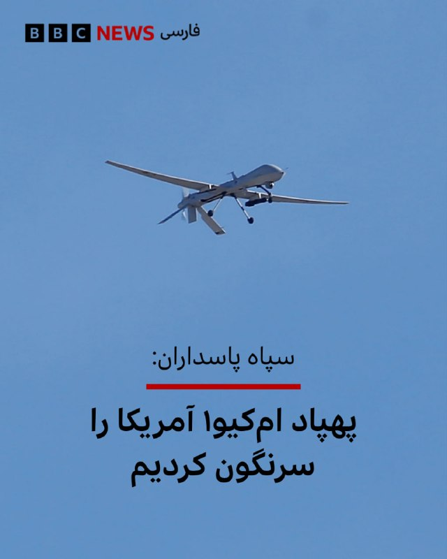

🔻در اطلاعیه سپاه پاسداران آمده است که این پهپاد «با ورود به فضای آبهای سرزمینی ایران قصد انجام عملیات خصمانه داشت که بلافاصله در رصد و هدف موشک‌های پدافند نوین سپاه قرار گرفت و سرنگون شد.»

به گزارش رسانه‌های ایران، پدافند هوایی سپاه هشدار داده است که فضای آبهای سرزمینی جمهوری اسلامی ایران «تحت کنترل قرار ‌کامل دارد و با هر تجاوزی قاطعانه برخورد خواهد شد.»

فرماندهی مرکزی آمریکا هنوز به این خبر واکنش نشان نداده است.

📸Getty Images
https://trib.al/GzBvE6k
@BBCPersian

## BBCPersian — post 282459

🖋بخش مانیتورینگ
بی‌بی‌سی

حزب جمهوری‌خواه خلق ترکیه، حزب اصلی مخالف دولت، و نظام دموکراتیک این کشور، پس از آن‌که دادگاهی اوزگور اوزل را از رهبری حزب برکنار کرد، با چالشی روبه‌رو شده‌اند که برخی آن را تهدیدی برای موجودیت سیاسی این حزب می‌دانند.

پس از حکم دادگاه، کمال قلیچداراوغلو، رئیس پیشین حزب جمهوری‌خواه خلق، روز ۲۱ مه به ریاست حزب بازگردانده شد. دادگاه، کنگره سال ۲۰۲۳ این حزب را که در آن اوزگور اوزل به رهبری انتخاب شده بود، باطل اعلام کرد.

با وجود خشم گسترده حامیان اپوزیسیون، انتظار می‌رود آقای قلیچداراوغلو به زودی رهبری حزب را در دست بگیرد و وارد مقر اصلی حزب جمهوری‌خواه خلق شود. رسانه‌های نزدیک به دولت نیز از هم‌اکنون او را رهبر این حزب معرفی می‌کنند.
ادامه مطلب⬇️

📸GettyImages/ Reuters/ Anadolu via Getty Images/ HABER GLOBAL/ AFP via Getty Images/ dia images via Getty Images/ EPA-EFE/REX/Shutterstock/ LightRocket via Getty Images
https://trib.al/rNi7taT
@BBCPersian

## alonews — post 123855

  <a href="telegram/content/alonews_123855_1780208731.webm" target="_blank">🎬 Download video</a>

👈بورس برای دومین روز متوالی سبزه

✅ @AloNews خبر جنگ

## alonews — post 123854

  <a href="telegram/content/alonews_123854_1780208731.webm" target="_blank">🎬 Download video</a>

👈ترامپ در Truth Social: «دارید گیج می‌شوید»

🔴دونالد ترامپ در پیامی کوتاه در شبکه اجتماعی Truth Social نوشت:
«You’re getting discombobulated»
که میتوان آن را به «دارید گیج و سردرگم میشوید» ترجمه کرد.

🔴ترامپ توضیح بیشتری درباره مخاطب یا منظور این پیام ارائه نکرده است.

✅ @AloNews خبر جنگ

## alonews — post 123853

  <a href="telegram/content/alonews_123853_1780208732.webm" target="_blank">🎬 Download video</a>

👈روزنامه جمهوری اسلامی: دستور پزشکیان برای بازگرداندن اینترنت بین‌الملل کاملاً مطابق با قانون اساسی است / فروش اینترنت پرو هیچ توجیه قابل قبولی ندارد

✅ @AloNews خبر جنگ

## alonews — post 123852

  <a href="telegram/content/alonews_123852_1780208732.webm" target="_blank">🎬 Download video</a>

👈جزئیات ثبت‌نام دانش‌آموزان در مدارس سراسر کشور

🔴پایۀ اول ابتدایی: اول خرداد تا ۱۰ تیر

🔴پایۀ هفتم: اول تیر تا ۷ تیر

🔴پیش‌ثبت‌نام مدارس شاهد:

🔴پایۀ هفتم: اول تیر تا ۲۰ تیر

🔴پایۀ دهم: ۲۵ تیر تا ۱۵ مرداد

🔴ثبت‌نام پایۀ دهم (عادی): اولویت الف ۲۷ تیر تا ۱۰ مرداد، اولویت ب ۱۱ مرداد تا ۳۱ شهریور

✅ @AloNews خبر جنگ

## alonews — post 123851

  <a href="telegram/content/alonews_123851_1780208732.webm" target="_blank">🎬 Download video</a>

👈نقشه‌های هواشناسی تا پایان هفته برای شمال‌غرب، شمال، و شمال شرق کشور ادامه بارش‌های بهاری را پیش‌بینی کرده‌اند

✅ @AloNews خبر جنگ

## alonews — post 123850

  <a href="telegram/content/alonews_123850_1780208732.webm" target="_blank">🎬 Download video</a>

👈اسرائیل هیوم: ایالات متحده به نفتکش‌ها و کشتی‌های حمل گاز مایع قطر اجازه داده است پس از پرداخت پول به ایران، تنگه هرمز را ترک کنند

✅ @AloNews خبر جنگ

## alonews — post 123849

  <a href="telegram/content/alonews_123849_1780208733.webm" target="_blank">🎬 Download video</a>

👈روابط عمومی سپاه: : رهگیری و انهدام یک فروند پهپاد MQ1

✅ @AloNews خبر جنگ

## alonews — post 123848

  <a href="telegram/content/alonews_123848_1780208733.webm" target="_blank">🎬 Download video</a>

👈ترامپ در گفتگو با فاکس نیوز: ما به یک توافق بسیار خوب با ایران نزدیک شده‌ایم. اگر این توافق برای ما عادلانه نباشد، دوباره به وزارت جنگ متوسل خواهیم شد.

🔴گزینه دیپلماتیک را ترجیح می‌دهم، زیرا امضای توافق به معنای بازگشایی فوری تنگه هرمز به روی کشتیرانی است.

🔴تنها تضمین اصلی و اساسی که بر آن پافشاری می‌کنم، جلوگیری از در اختیار داشتن سلاح هسته‌ای توسط ایران است.

🔴ایرانی‌ها در عمل قبول کرده‌اند که سلاح هسته‌ای تولید یا خریداری نکنند.

🔴ایرانی‌ها مذاکره‌کنندگان بسیار باتجربه‌ای هستند و این موضوع زمان می‌برد، اما من عجله ندارم.

🔴تنگه هرمز باید فوراً و بدون عوارض عبور باز شود و باید به طور قطعی از در اختیار گرفتن هرگونه سلاح هسته‌ای توسط تهران جلوگیری شود.

🔴نیروهای ما به محض بازگشایی تنگه هرمز و پایان یافتن رسیدگی به پرونده هسته‌ای، از منطقه خارج خواهند شد.

✅ @AloNews خبر جنگ

## alonews — post 123847

  <a href="telegram/content/alonews_123847_1780208733.webm" target="_blank">🎬 Download video</a>

👈 نیویورک تایمز: ترامپ شرایط چارچوب پیشنهادی برای پایان دادن به جنگ با ایران را سخت‌تر کرده و پیشنهاد اصلاح‌شده را برای بررسی به تهران بازگردانده است.

🔴مقامات گفتند که شرایط به‌روزشده تا حدی ناشی از نگرانی‌های ترامپ درباره بندهای مربوط به آزادسازی دارایی‌های ایران بوده است.

🔴ترامپ همچنین از طولانی شدن زمان پاسخ ایران به پیشنهادات آمریکا ناامید شده است.

🔴چارچوب سخت‌تر اصلاح‌شده ممکن است به منظور فشار آوردن به ایران برای پذیرش سریع توافق باشد.

🔴در حال حاضر مشخص نیست چه تغییرات دقیقی در متن توافق ایجاد شده است.

✅ @AloNews خبر جنگ

## alonews — post 123846

  <a href="telegram/content/alonews_123846_1780208733.webm" target="_blank">🎬 Download video</a>

👈العربی الجدید: همکاری نظامی بین مسکو و کابل؛ روسیه از طالبان در زمینه سیستم‌های دفاع هوایی و سلاح‌ها پشتیبانی می‌کند

🔴 در جریان درگیری اخیر، ضعف اصلی طالبان، فقدان ابزار لازم برای بازدارندگی نیروی هوایی پاکستان بود که مسکو برای پر کردن این خلأ حیاتی وارد عمل شد

🔴 پاکستان انتظار نداشت مسکو اقدامی انجام دهد که مغایر با منافع اسلام‌آباد تلقی شود، اما این اتفاق افتاد

✅ @AloNews خبر جنگ

## alonews — post 123845

  <a href="telegram/content/alonews_123845_1780208734.webm" target="_blank">🎬 Download video</a>

👈ادعای اکسیوس: ترامپ چند اصلاحیه جدید به توافق به دست آمده اضافه کرد

🔴ترامپ در جلسه روز جمعه، خواستار چندین اصلاحیه در توافقی شد که فرستادگانش با همتایان ایرانی خود به آن دست یافته بودند.

✅ @AloNews خبر جنگ

## alonews — post 123844

  <a href="telegram/content/alonews_123844_1780208734.webm" target="_blank">🎬 Download video</a>

👈عوستاد رائفی پور:
مطمئنم آمریکا بازم به ما حمله میکنه

✅ @AloNews خبر جنگ

## alonews — post 123843

  <a href="telegram/content/alonews_123843_1780208734.mp4" target="_blank">🎬 Download video</a>

👈پوریا زراعتی مجری اینترنشنال: اپوزیسیون ما رویا فروشی میکنه و وعده هاش دروغ بود

🔴ما به کسی مثل جولانی نیاز داریم نه رهبران فعلی اپوزیسیون

✅ @AloNews خبر جنگ

---
📅 بروزرسانی: 1405/03/10 05:29
---

## VahidOOnLine — post 242980

  

♦️«آکسیوس» در گزارشی اختصاصی به نقل از مقام‌های ارشد دولت آمریکا نوشت که دونالد ترامپ، رئیس‌جمهوری ایالات متحده، در جریان جلسه روز جمعه در «اتاق وضعیت» کاخ سفید، خواهان اعمال چندین اصلاحیه و تغییر در متن پیش‌نویس توافقی شده است که فرستادگان او پیش‌تر با همتایان ایرانی خود به آن دست یافته بودند. به گفته دو مقام آمریکایی، اگرچه ترامپ به دنبال دستیابی به این توافق است و انتظار دارد به‌زودی نهایی شود، اما اصرار دارد چند نکته کلیدی که برای او اهمیت حیاتی دارد، به‌ویژه در موضوع مواد هسته‌ای ایران و نحوه بازگشایی تنگه هرمز، تقویت و سخت‌تر شود. این درخواست ترامپ، دور جدیدی از رفت‌وبرگشت‌های دیپلماتیک میان طرفین را آغاز کرده است که احتمال دارد چندین روز به طول بینجامد. در همین راستا، یک مقام کاخ سفید پس از پایان جلسه به خبرنگاران گفت که ترامپ «تنها توافقی را امضا خواهد کرد که برای آمریکا خوب باشد، خطوط قرمز او را برآورده کند و تضمین کند که ایران هرگز به سلاح هسته‌ای دست نخواهد یافت.»
بر اساس گزارش آکسیوس، یادداشت تفاهم کنونی شامل تعهد ایران به عدم تلاش برای دستیابی به سلاح هسته‌ای است و یک بازه زمانی ۶۰ روزه را برای مذاکره درباره تعهدات هسته‌ای تهران و کاهش تحریم‌های آمریکا تعیین می‌کند که اولین موضوعات آن، نحوه دفع ذخایر اورانیوم غنی‌شده ایران و محدود کردن غنی‌سازی بیشتر است؛ اما ترامپ خواستار افزودن جزئیات مشخص‌تر درباره زمان‌بندی و چگونگی تحویل این مواد هسته‌ای به ایالات متحده شده است. یک مقام ارشد آمریکایی با اشاره به روند کند پاسخ‌دهی تهران اعلام کرد به ترامپ گفته شده حدود سه روز زمان می‌برد تا ایرانی‌ها پاسخ دهند، چرا که به تعبیر او «آن‌ها عملا در غارها هستند و از ایمیل استفاده نمی‌کنند.» آکسیوس در پایان خاطرنشان کرد در حالی که رسانه‌های دولتی ایران مدعی شده‌اند تهران در این توافق میلیاردها دلار از دارایی‌های مسدودشده خود را دریافت خواهد کرد، کاخ سفید این ادعا را به شدت تکذیب کرده و مقام ارشد دولت ترامپ تأکید کرده است: «توافق حاصل خواهد شد، اما حاضرالوقوع بودن آن بستگی به شرایط دارد؛ ما حاضریم منتظر بمانیم تا رئیس‌جمهوری آنچه را که می‌خواهد به دست آورد.»
‌🇸🇦 Indypersian

🤖 @VahidOOnLine

## VahidOOnLine — post 242979

  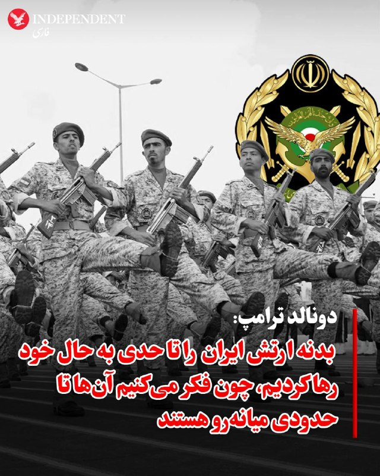

♦️دونالد ترامپ، رئیس‌جمهوری ایالات متحده، روز شنبه، در گفتگو با «فاکس‌نیوز» با تشریح وضعیت کارزار نظامی علیه تهران گفت: «نیروی دریایی و نیروی هوایی ایران صددرصد نابود شده‌اند و ما پدافند ضدهوایی و ارتش آن‌ها را محو کرده‌ایم. با این حال، ما بدنه ارتش را تا حدی به حال خود رها کردیم، چون فکر می‌کنیم ارتش آن‌ها تا حدودی میانه‌رو است، اما بخش‌های دیگر رهبری آن‌ها را که میانه‌رو نبودند، حذف کردیم. شاید شنیدن این موضوع برای مردم تعجب‌آور باشد، اما در جنگ‌های گذشته اشتباهاتی رخ داد که همه را نابود می‌کردند و بعد با کشوری طرف می‌شدید که تا ۴۰ سال بازسازی نمی‌شد، مثل اتفاقی که در عراق افتاد. اکنون ایران در وضعیت بسیار بدی قرار دارد، هیچ نیروی نظامی برایش باقی نمانده و تمام آنچه دارند، لفاظی‌های خوب و یک رسانه جعلی است؛ در واقع رسانه‌های جعلی بزرگ‌ترین دارایی آن‌ها هستند».
‌🇸🇦 Indypersian

🤖 @VahidOOnLine

## VahidOOnLine — post 242978

  

آکسیوس به نقل از یک مقام ارشد دولت آمریکا و یک منبع آگاه دیگر گزارش داد ترامپ در نشست روز جمعه در اتاق وضعیت کاخ سفید از تیم خود خواست بر توافق احتمالی با تهران، از جمله در ارتباط با مواد هسته‌ای ایران و بازگشایی تنگه هرمز، چندین اصلاحیه اعمال کنند.
این گزارش به نقل از دو مقام آمریکایی نوشت که ترامپ این توافق را می‌خواهد و انتظار دارد به‌زودی آن را نهایی کند، اما مایل است چند نکته مهم برای خود، به‌ویژه درباره مواد هسته‌ای ایران، تقویت شود.
به نوشته آکسیوس، این درخواست ترامپ دور تازه‌ای از رفت‌وبرگشت میان طرف‌ها را آغاز کرده است که ممکن است چند روز طول بکشد.
یک مقام ارشد دولت آمریکا با اشاره به اورانیوم غنی‌شده ایران، به آکسیوس گفت جزئیات بیشتری درباره چگونگی دریافت این مواد از سوی آمریکا و زمان‌بندی آن مد نظر است. منبع دوم نیز گفت ترامپ همچنین خواهان اصلاح برخی عبارات مربوط به بازگشایی تنگه هرمز است.
یک مقام آمریکایی گفت به ترامپ اطلاع داده شده است که حدود سه روز طول می‌کشد تا جمهوری اسلامی پاسخ دهد. یک مقام ارشد دولت آمریکا نیز گفت: مقام‌های جمهوری اسلامی «عملا در غارها هستند و از ایمیل استفاده نمی‌کنند.»
‌🏁 🇬🇧 IranintlTV

🤖 @VahidOOnLine

## VahidOOnLine — post 242977

  

♦️دونالد ترامپ، رئیس‌جمهوری ایالات متحده، روز شنبه در گفتگوی اختصاصی با شبکه خبری «فاکس‌نیوز» درباره شروط واشنگتن در مذاکره با تهران گفت: «این یک پیروزی کامل برای ماست و ما مجبور بودیم این کار را انجام دهیم. دو مسئله وجود دارد؛ شماره یک، تنگه هرمز باید فورا باز شود و این مسیر باید آزاد و بدون عوارضی باشد. شماره دو این است که آن‌ها نمی‌توانند سلاح هسته‌ای داشته باشند؛ کل ماجرا همین است و بسیار ساده است و بعد از آن، ما از آنجا خارج خواهیم شد. ما حتی نیازی به این تنگه نداریم، چون خودمان بیشترین نفت را داریم؛ ما اکنون بیشتر از مجموع عربستان سعودی و روسیه نفت تولید می‌کنیم. ما ابرقدرت نفتی هستیم، بسیار بزرگ‌تر از عربستان سعودی و حتی روسیه.»
‌🇸🇦 Indypersian

🤖 @VahidOOnLine

## VahidOOnLine — post 242976

  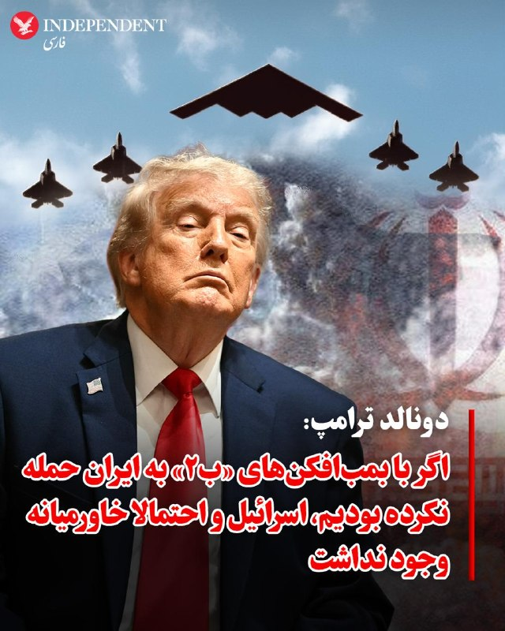

♦️دونالد ترامپ، رئیس‌جمهوری ایالات متحده، روز شنبه در گفتگو با «فاکس‌نیوز» در اظهاراتی قاطع با اشاره به حمله نظامی کشورش علیه جمهوری اسلامی گفت: «اگر ما ۹ ماه پیش با بمب‌افکن‌های ب۲ به آن‌ها حمله نکرده بودیم، دقیقا در همین لحظه به سلاح هسته‌ای دست پیدا کرده بودند و اکنون داستان کاملا متفاوت بود. آن‌ها احتمالا از آن استفاده می‌کردند و در آن صورت شما دیگر اسرائیل را نداشتید و احتمالا خاورمیانه‌ای هم باقی نمی‌ماند.»
‌🇸🇦 Indypersian

🤖 @VahidOOnLine

## VahidOOnLine — post 242975

  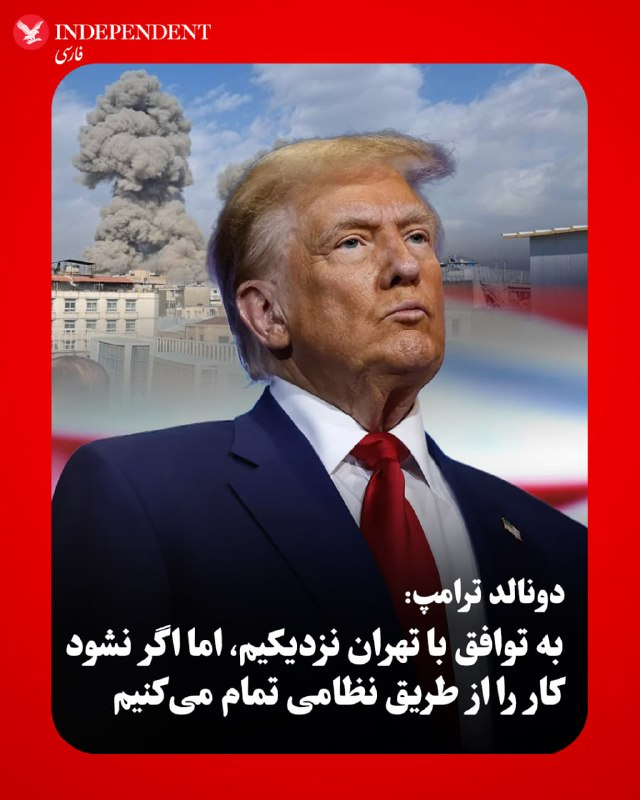

♦️دونالد ترامپ، رئیس‌جمهور ایالات متحده، در گفتگویی اختصاصی با شبکه خبری «فاکس نیوز»، با اشاره به روند رایزنی‌های جاری، وضعیت گفتگوها را مثبت ارزیابی کرد و گفت: «ما به امضای یک توافق بسیار خوب با تهران نزدیک هستیم. اگر نتوانیم به یک توافق خوب و ایده‌آل دست پیدا کنیم، قطعا بازخواهیم گشت و کار را از طریق نظامی تمام خواهیم کرد.»
‌🇸🇦 Indypersian

🤖 @VahidOOnLine

## VahidOOnLine — post 242974

  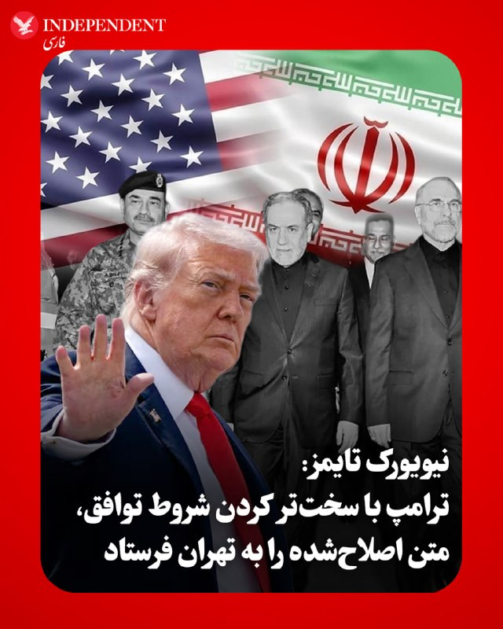

♦️روزنامه «نیویورک‌تایمز» روز شنبه، ۹ خردادماه، در گزارشی به نقل از سه مقام رسمی گزارش داد که دونالد ترامپ، رئیس‌جمهوری ایالات متحده، شروط مربوط به چارچوب توافق احتمالی برای پایان دادن به جنگ در ایران را سخت‌تر کرده و متن اصلاح‌شده این پیشنهاد را برای بررسی به تهران فرستاده است. اگرچه جزئیات دقیق تغییرات ایجادشده در متن توافق هنوز کاملا مشخص نیست، اما دو مقام مسئول اعلام کرده‌اند که ترامپ به شدت نگران بندهای مربوط به آزادسازی دارایی‌های مسدودشده ایران است؛ موضوعی که او پیش از این بارها به خاطر انجام آن در توافق هسته‌ای بیش از یک دهه گذشته، از باراک اوباما به شدت انتقاد کرده بود. به گفته یک مقام آگاه، ترامپ که از طولانی شدن روند پاسخ‌دهی تهران به پیشنهادهای آمریکا خسته شده، این شروط سرسختانه‌تر را با هدف اعمال فشار مضاعف بر تهران تنظیم کرده تا روند پذیرش چارچوب کلی توافق را سرعت ببخشد؛ پیشنهادی که براساس ادعای نیویورک‌تایمز هم‌اکنون برای تایید نهایی به دست مجتبی خامنه‌ای، رهبر جمهوری اسلامی، رسیده است.
بر اساس این گزارش، از آنجایی که دسترسی و ارتباط با رهبر جمهوری اسلامی دشوار است، هرگونه تغییر جدید در این یادداشت تفاهم می‌تواند به معنای تاخیرهای طولانی‌تر در مسیر دیپلماسی باشد. ترامپ روز جمعه نیز جلسه‌ای دو ساعته را با مشاوران ارشد خود در «اتاق وضعیت» کاخ سفید برای بررسی راه‌های پایان دادن به جنگ برگزار کرد که بدون صدور هیچ بیانیه‌ای پایان یافت. چارچوب این توافق در واقع به معنای پایان یافتن کارزار نظامی مشترک آمریکا و اسرائیل علیه ایران در ازای رفع محاصره تنگه هرمز از سوی تهران است؛ شاه‌راه حیاتی انتقال نفت و گاز که پیش از آغاز بمباران‌ها در ۹ اسفندماه برای تجارت بین‌المللی باز بود. با این حال، مقامات می‌گویند برخی از پیچیده‌ترین مسائل، از جمله آینده برنامه هسته‌ای ایران، به دورهای بعدی گفتگوها موکول شده است.
‌🇸🇦 Indypersian

🤖 @VahidOOnLine

## VahidOOnLine — post 242973

  

سپاه اعلام کرد بامداد یک‌شنبه یک فروند پهپاد ام‌کیو۱ ارتش آمریکا را بر فراز آب‌های سرزمینی ایران سرنگون کرده است. سپاه هشدار داد که فضای آب‌های سرزمینی ایران تحت کنترل ‌کامل قرار دارد و با هر تهاجمی «قاطعانه» برخورد خواهد شد.
‌🏁 🇬🇧 IranintlTV

🤖 @VahidOOnLine

## VahidOOnLine — post 242972

  

♦️روابط‌عمومی سپاه بامداد یکشنبه، ۱۰ خردادماه، اعلام کرد یک پهپاد «ام‌کیو۱» (MQ1) ارتش آمریکا را منهدم کرده است. خبرگزاری فارس نوشت: «این پهپاد با ورود به آب‌های سرزمینی ایران قصد انجام عملیات خصمانه داشت که بلافاصله در رصد و هدف موشک‌های پدافند سپاه قرار گرفت و سرنگون شد».
‌🇸🇦 Indypersian

🤖 @VahidOOnLine

## VahidOOnLine — post 242971

  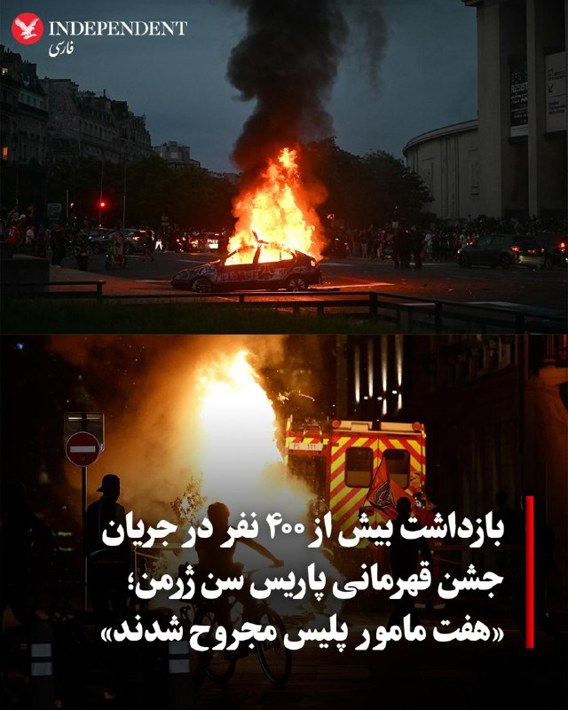

♦️براساس اعلام وزارت کشور فرانسه، به دنبال بروز ناآرامی‌ها و شورش‌های خیابانی در جریان جشن قهرمانی تیم فوتبال پاریس سن ژرمن در لیگ قهرمانان اروپا، دست‌کم ۴۱۶ نفر در سراسر این کشور بازداشت شده‌اند که ۲۸۳ تن از این بازداشت‌ها تنها در شهر پاریس صورت گرفته است. بر اساس گزارش برونو روتایو، وزیر کشور فرانسه، در جریان این درگیری‌های شدید ۷ مامور پلیس مجروح شده‌اند که حال یکی از آن‌ها وخیم گزارش شده است. این آشوب‌ها زمانی به پا شد که حدود ۲۰ هزار هوادار پس از پیروزی پاریس سن ژرمن مقابل آرسنال در ضربات پنالتی، در خیابان شانزلیزه تجمع کردند و گروهی از آنها با روشن کردن مواد آتش‌زا، تخریب مغازه‌ها و آتش‌افروزی با نیروهای امنیتی درگیر شدند.
‌🇸🇦 Indypersian

🤖 @VahidOOnLine

## VahidOOnLine — post 242970

  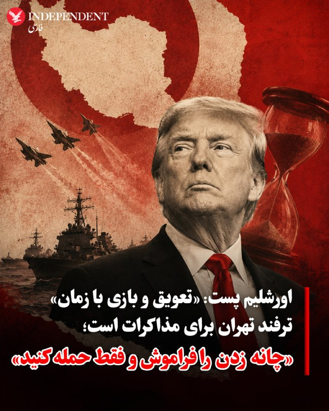

♦️اورشلیم پست در یک یادداشت تحلیلی و انتقادی، رویکرد دیپلماتیک جمهوری اسلامی ایران در قبال واشنگتن را به یک «بازی زمان‌بر و حساب‌شده» تشبیه کرده که در آن پیشرفت‌های ظاهری فورا جای خود را به ابهامات ساختگی می‌دهند. نویسنده این تحلیل با کنایه به بیانیه اخیر وزارت امور خارجه جمهوری اسلامی ایران مبنی بر اینکه «رسیدن به نتیجه در بخش بزرگی از موضوعات درست است، اما هیچ‌کس نمی‌تواند ادعای امضای قریب‌الوقوع توافق را داشته باشد»، تاکید می‌کند که تهران با متهم کردن سیاست‌گذاران آمریکایی به «تزلزل نهادینه‌شده و تغییر مداوم مواضع»، عملا در حال اجرای هنرمندانه استراتژی «عدم توافق» است. این در حالی است که مواضع و شروط اصلی دونالد ترامپ، رئیس‌جمهوری ایالات متحده، کاملا روشن، ثابت و غیرقابل مذاکره بوده است؛ شروطی شامل تعهد قطعی ایران به عدم توسعه تسلیحات هسته‌ای و نابودی اورانیوم ۶۰ درصد غنی‌شده، بازگشایی کامل و بدون هزینه تنگه هرمز برای کشتیرانی بین‌المللی، و پاک‌سازی تمام مین‌های این آبراهه که تا زمان تحقق آن، محاصره نیروی دریایی آمریکا هرگز برچیده نخواهد شد. بنابراین، ادعای وجود تناقض یا ابهام در موضع واشنگتن، صرفا سرپوشی برای خرید زمان تلوتلو خوران دیپلماتیک است.
این گزارش، مهارت مذاکره‌کنندگان ایرانی را به سنت دیرینه چانه‌زنی در بازارهای سنتی و فروش فرش‌های مجلل تشبیه می‌کند؛ فرآیندی طولانی، فرسایشی و خسته‌کننده که قیمت‌های نجومی اولیه و تظاهر به سوءتفاهم در آن، تنها با هدف فرسوده کردن طرف مقابل انجام می‌شود. حکومت ایران که طی ۴۷ سال گذشته با پنهان‌کاری، فناوری سانتریفیوژ و نقشه‌های هسته‌ای را به‌طور غیرقانونی به دست آورده، اکنون که به مرز حساس غنی‌سازی ۶۰ درصدی رسیده و تنها یک گام تا مواد لازم برای سلاح هسته‌ای فاصله دارد، دوباره به خصلت ساختاری خود یعنی «وقت‌کشی مداوم» روی آورده است. در این تحلیل آمده است که پیوند زدن هر توافق به یک گره کور جدید و درخواست مهلت‌های ۳۰ تا ۶۰ روزه، نشان می‌دهد که سیستم فکری تهران تمایلی به گفتن یک «بله یا خیر» ساده ندارد. نویسنده در نهایت با تاکید بر اینکه حتی دونالد ترامپ نیز با منطق تجاری آمریکایی خود نمی‌تواند این بازی پیچیده و ریشه‌دار در سنت‌های جاده ابریشم را پیش ببرد، نتیجه می‌گیرد که تنها راه متوقف کردن جاه‌طلبی‌های هسته‌ای تهران، رها کردن کامل میز مذاکرات فرسایشی و اعمال اهرم‌های فشار حداکثری و قاطع نظامی است.
‌🇸🇦 Indypersian

🤖 @VahidOOnLine

## VahidOOnLine — post 242969

  <a href="telegram/content/VahidOOnLine_242969_1780192799.mp4" target="_blank">🎬 Download video</a>

♦️کانیه وست، رپر سرشناس آمریکایی، در جریان یک کنسرت بزرگ در ورزشگاه المپیک آتاتورک استانبول، با حضور بیش از ۱۱۸ هزار تماشاگر بلیت‌فروشی‌شده به صحنه رفت و رکورد جدیدی را در صنعت موسیقی جهان ثبت کرد. این ابر رویداد که بر روی یک صحنه منحصربه‌فرد کروی‌شکل و با به‌کارگیری صدها نیروی فنی و فناوری‌های پیشرفته صوتی و تصویری برگزار شد، هزاران تن از دوستداران موسیقی را از سراسر ترکیه و کشورهای مختلف جهان به استانبول کشاند. هجوم بی‌سابقه جمعیت در ساعت‌های منتهی به برنامه، ایستگاه‌های مترو پایتخت گردشگری ترکیه را با ازدحام و اختلال شدید مواجه کرد. کانیه وست با تقدیر از استقبال پرشور هوادارانش، مستقیما از روی صحنه اعلام کرد: «می‌خواهم این را به همه بگویم؛ ما همین حالا رکورد ۱۱۸ هزار نفری را شکستیم. این پرجمعیت‌ترین اجرای استادیومی در تمام دوران است».
رسانه‌های ترکیه با انتخاب تیتر «کانیه وست روی صحنه اعلام کرد: رکورد ۱۱۸ هزار نفری شکسته شد»، این کنسرت را یکی از بزرگ‌ترین و باشکوه‌ترین رویدادهای هنری سال‌های اخیر این کشور توصیف کرده‌اند.
‌🇸🇦 Indypersian

🤖 @VahidOOnLine

## VahidOOnLine — post 242968

  

اورشلیم‌پست در یک یادداشت تحلیلی با اشاره به «تاکتیک‌های تاخیری» جمهوری اسلامی در مذاکرات، هشدار داد واشینگتن نمی‌تواند با تکیه بر منطق آمریکایی و شیوه چانه‌زنی منصفانه در مذاکرات کنونی به نتیجه مطلوب برسد و باید چانه‌زنی و مذاکرات را کنار بگذارد و فقط به «حمله» متوسل شود.
این مطلب افزود مقام‌های جمهوری اسلامی در گفت‌وگوها نشانه‌هایی از حرکت به سوی توافق ارائه می‌کنند، اما از تعهدهای نهایی پرهیز می‌کنند.
اورشلیم‌پست با اشاره به اتکای واشینگتن در مذاکرات بر منطق آمریکایی، شیوه چانه‌زنی منصفانه و همان تاکتیک‌هایی که در دنیای کسب‌وکار برایش به خوبی کار کرده بود، نوشت همین موضوع توضیح می‌دهد که چرا توافق غزه که از سوی استیو ویتکاف، بازرگان آمریکایی، میانجی‌گری شد، در ظاهر امیدوارکننده بود، اما هرگز آن‌گونه که در نظر گرفته شده بود به طور واقعی آغاز نشد.
این تحلیل با هشدار درباره اینکه آمریکا در مذاکرات با حکومت ایران با طرفی متفاوت روبروست که نمی‌توان آن را با شیوه‌های منطقی شکست داد، خطاب به دولت آمریکا نوشت: «چانه‌زنی را متوقف کنید، مذاکرات را کنار بگذارید و فقط حمله کنید.»

‌🏁 🇬🇧 IranintlTV

🤖 @VahidOOnLine

## pm_afshaa — post 91922

  <a href="telegram/content/pm_afshaa_91922_1780192802.webm" target="_blank">🎬 Download video</a>

🔴اسراییل هیوم:
آمریکا به نفتکش‌ها و کشتی‌های حمل گاز مایع قطر اجازه داده که پس از پرداخت پول و عوارض به ایران، تنگه هرمز رو ترک کنن!

💧 Rainbet.com the #1 Non-KYC Crypto Casino & Sportsbook @rainbetcom

😁 @Pm_Afshaa

## pm_afshaa — post 91921

  <a href="telegram/content/pm_afshaa_91921_1780192802.webm" target="_blank">🎬 Download video</a>

🔴نیویورک تایمز:
ترامپ تمام خواسته‌های ایران رو رد کرده و یک پیشنهاد متقابل سخت‌تر به تهران ارسال کرده‌ که باعث بن بست کامل مذاکرات شده.

💧 Rainbet.com the #1 Non-KYC Crypto Casino & Sportsbook @rainbetcom

😁 @Pm_Afshaa

## pm_afshaa — post 91920

  <a href="telegram/content/pm_afshaa_91920_1780192803.webm" target="_blank">🎬 Download video</a>

🔴ترامپ به فاکس نیوز:
ما به یک توافق بسیار خوب با ایران نزدیک شدیم و اگه برای ما منصفانه نباشه، به وزارت دفاع (جنگ) برمی‌گردیم.

ما به آرامی و پیوسته آنچه را که از تهران میخوایم به دست میاریم و اگر این اتفاق نیفته، درگیری رو به روشی متفاوت پایان خواهیم داد.

💧 Rainbet.com the #1 Non-KYC Crypto Casino & Sportsbook @rainbetcom

😁 @Pm_Afshaa

## VahidOnline — post 75809

  

آکسیوس، ترجمه ماشین:
رئیس‌جمهور ترامپ در جلسه‌ای که روز جمعه در اتاق وضعیت برگزار شد، خواستار چند اصلاح در توافقی شد که فرستادگانش با همتایان ایرانی خود به آن رسیده بودند؛ این را یک مقام ارشد دولت و منبع دومی که در جریان موضوع قرار گرفته بود، گفته‌اند.
...
مقام‌های ایرانی به رسانه‌های دولتی گفتند که آن‌ها نیز متن نهایی را تأیید نکرده‌اند؛ هرچند دو مقام آمریکایی پیش‌تر در طول هفته مدعی شده بودند که تهران آماده امضاست و همه چیز به تصمیم ترامپ بستگی دارد.

به گفته این دو منبع، ترامپ از تیم خود خواست تغییراتی در پیش‌نویس مربوط به بندهای برنامه هسته‌ای ایران ایجاد کنند.

در شکل فعلی، این تفاهم‌نامه شامل تعهد ایران به دنبال نکردن سلاح هسته‌ای است، اما امتیاز مشخص دیگری فراتر از آن در آن نیامده است.

در این متن آمده است که یک بازه ۶۰ روزه برای مذاکره درباره تعهدات هسته‌ای ایران و کاهش تحریم‌ها از سوی آمریکا وجود خواهد داشت؛ نخستین موضوعات در دستور کار نیز چگونگی تعیین تکلیف ذخایر اورانیوم غنی‌شده ایران و محدود کردن غنی‌سازی بیشتر خواهد بود.

ترامپ می‌خواهد تلاش کند این بخش را اصلاح کند.

یک مقام ارشد دولت گفت: «موضوع، جزئیات بیشتر درباره این است که آمریکا چگونه مواد را دریافت می‌کند و زمان‌بندی آن چگونه خواهد بود»؛ منظور او اورانیوم غنی‌شده بود.

منبع دوم گفت ترامپ همچنین می‌خواهد برخی از عبارت‌ها درباره بازگشایی تنگه هرمز را اصلاح کند.

این مقام آمریکایی گفت به ترامپ گفته شده است حدود سه روز طول می‌کشد تا ایرانی‌ها با پاسخ برگردند. این مقام ارشد دولت گفت: «آن‌ها عملا در غارها هستند و از ایمیل استفاده نمی‌کنند.»

این مقام ارشد دولت گفت: «توافقی در کار خواهد بود. اینکه چقدر قریب‌الوقوع است، باید دید. ما حاضریم صبر کنیم تا رئیس‌جمهور آنچه را خواسته به دست بیاورد. ممکن است یک هفته طول بکشد. ممکن است کمتر باشد. ممکن است بیشتر باشد. امیدواریم در آغاز هفته چیزی داشته باشیم.»
axios

📡 @VahidOnline

## VahidOnline — post 75808

  

روابط‌عمومی سپاه بامداد یکشنبه، ۱۰ خردادماه، اعلام کرد یک پهپاد «ام‌کیو۱» (MQ1) ارتش آمریکا را منهدم کرده است.

خبرگزاری فارس نوشت: «این پهپاد با ورود به آب‌های سرزمینی ایران قصد انجام عملیات خصمانه داشت که بلافاصله در رصد و هدف موشک‌های پدافند سپاه قرار گرفت و سرنگون شد».
@VahidOOnLine

📡 @VahidOnline

## IranIntlTV — post 339805

  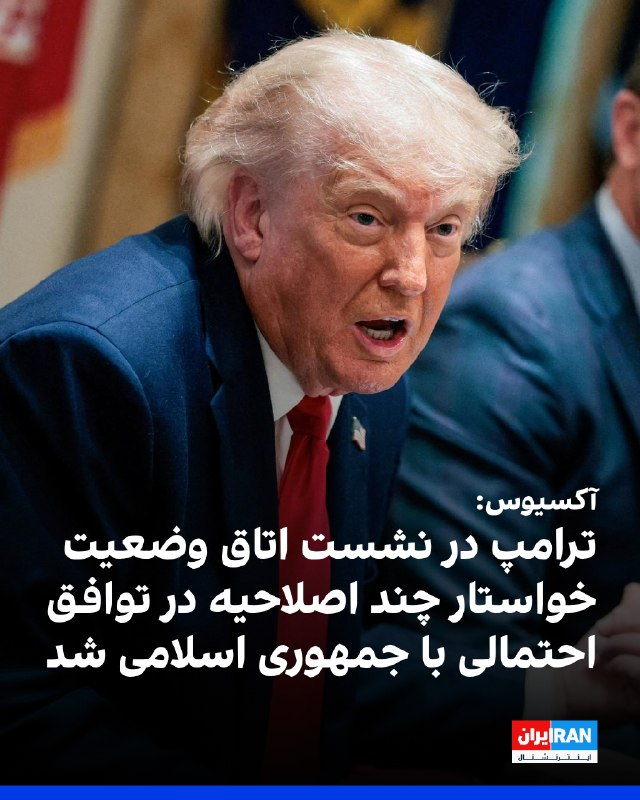

آکسیوس به نقل از یک مقام ارشد دولت آمریکا و یک منبع آگاه دیگر گزارش داد ترامپ در نشست روز جمعه در اتاق وضعیت کاخ سفید از تیم خود خواست بر توافق احتمالی با تهران، از جمله در ارتباط با مواد هسته‌ای ایران و بازگشایی تنگه هرمز، چندین اصلاحیه اعمال کنند.
این گزارش به نقل از دو مقام آمریکایی نوشت که ترامپ این توافق را می‌خواهد و انتظار دارد به‌زودی آن را نهایی کند، اما مایل است چند نکته مهم برای خود، به‌ویژه درباره مواد هسته‌ای ایران، تقویت شود.
به نوشته آکسیوس، این درخواست ترامپ دور تازه‌ای از رفت‌وبرگشت میان طرف‌ها را آغاز کرده است که ممکن است چند روز طول بکشد.
یک مقام ارشد دولت آمریکا با اشاره به اورانیوم غنی‌شده ایران، به آکسیوس گفت جزئیات بیشتری درباره چگونگی دریافت این مواد از سوی آمریکا و زمان‌بندی آن مد نظر است. منبع دوم نیز گفت ترامپ همچنین خواهان اصلاح برخی عبارات مربوط به بازگشایی تنگه هرمز است.
یک مقام آمریکایی گفت به ترامپ اطلاع داده شده است که حدود سه روز طول می‌کشد تا جمهوری اسلامی پاسخ دهد. یک مقام ارشد دولت آمریکا نیز گفت: مقام‌های جمهوری اسلامی «عملا در غارها هستند و از ایمیل استفاده نمی‌کنند.»

## IranIntlTV — post 339804

  

سپاه اعلام کرد بامداد یک‌شنبه یک فروند پهپاد ام‌کیو۱ ارتش آمریکا را بر فراز آب‌های سرزمینی ایران سرنگون کرده است. سپاه هشدار داد که فضای آب‌های سرزمینی ایران تحت کنترل ‌کامل قرار دارد و با هر تهاجمی «قاطعانه» برخورد خواهد شد.
https://iranintl.com/202605311026

## IranIntlTV — post 339803

  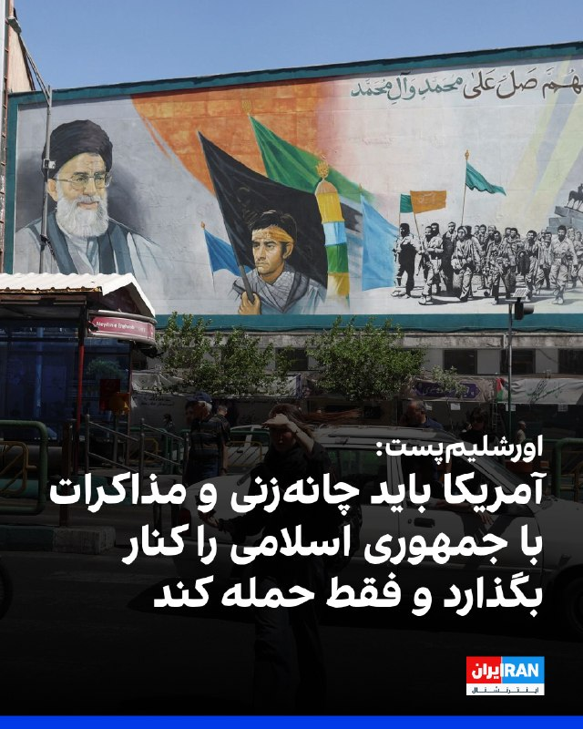

اورشلیم‌پست در یک یادداشت تحلیلی با اشاره به «تاکتیک‌های تاخیری» جمهوری اسلامی در مذاکرات، هشدار داد واشینگتن نمی‌تواند با تکیه بر منطق آمریکایی و شیوه چانه‌زنی منصفانه در مذاکرات کنونی به نتیجه مطلوب برسد و باید چانه‌زنی و مذاکرات را کنار بگذارد و فقط به «حمله» متوسل شود.
این مطلب افزود مقام‌های جمهوری اسلامی در گفت‌وگوها نشانه‌هایی از حرکت به سوی توافق ارائه می‌کنند، اما از تعهدهای نهایی پرهیز می‌کنند.
اورشلیم‌پست با اشاره به اتکای واشینگتن در مذاکرات بر منطق آمریکایی، شیوه چانه‌زنی منصفانه و همان تاکتیک‌هایی که در دنیای کسب‌وکار برایش به خوبی کار کرده بود، نوشت همین موضوع توضیح می‌دهد که چرا توافق غزه که از سوی استیو ویتکاف، بازرگان آمریکایی، میانجی‌گری شد، در ظاهر امیدوارکننده بود، اما هرگز آن‌گونه که در نظر گرفته شده بود به طور واقعی آغاز نشد.
این تحلیل با هشدار درباره اینکه آمریکا در مذاکرات با حکومت ایران با طرفی متفاوت روبروست که نمی‌توان آن را با شیوه‌های منطقی شکست داد، خطاب به دولت آمریکا نوشت: «چانه‌زنی را متوقف کنید، مذاکرات را کنار بگذارید و فقط حمله کنید.»

https://iranintl.com/202605305436

## FarsiVOA — post 219135

🔺رئيس‌جمهوری آمریکا: با ارتش جمهوری اسلامی تا حدی کاری نداشتیم چون فکر می‌کنیم تا حدودی میانه‌رو است

▪️دونالد تراامپ، رئیس‌جمهوری آمریکا گفت جمهوری اسلامی باید تنگه هرمز را باز کند و نباید سلاح هسته‌ای داشته باشد. آقای ترامپ در مصاحبه‌ای تلویزیونی با لارا ترامپ که شنبه‌شب از فاکس‌نیوز پخش شد گفت که او برای توافق با جمهوری اسلامی «هیچ عجله‌ای» ندارد.

⬇️ بیشتر بخوانید:
https://ir.voanews.com/a/8155752.html
@FarsiVOA

## FarsiVOA — post 219134

⚡️روز جهانی «گرسنگی»
@FarsiVOA

## FarsiVOA — post 219133

  

⚡️مارک لوین، مفسر مشهور آمریکایی و حقوق‌دان، شنبه‌شب در شوی تلویزیونی خود در فاکس‌نیوز، بار دیگر خواستار مسلح شدن مردم ایران برای مقابله با جمهوری اسلامی شد. آقای لوین گفت مردم ایران با «دستان خالی» نمی‌توانند جلوی مسلسل بایستند. دونالد ترامپ، رئيس جمهوری آمریکا، روز شنبه در تروت‌سوشال، از مخاطبان خود خواسته بود که شوی امشب مارک‌ لوین را تماشا کنند. آقای لوین در بخش دیگری از این برنامه، با سفیر سابق اسرائيل در آمریکا، مایکل اورن مصاحبه کرد. آقای اورن گفت برنامه موشک‌های بالیستیک جمهوری اسلامی تهدیدی موجودیتی برای اسرائيل بوده است و باید با آن مقابله شود.
@FarsiVOA

## FarsiVOA — post 219132

🔺فرستاده پیشین ترامپ: در صورت شکست مذاکرات با جمهوری اسلامی گزینه نظامی همچنان پابرجاست

▪️مورگان اورتگاس، معاون فرستاده ویژه پیشین رئیس‌جمهوری آمریکا در امور خاورمیانه، روز شنبه گفت دونالد ترامپ، رئیس‌جممهوری آمریکا همچنان به دنبال دستیابی به یک توافق دیپلماتیک با جمهوری اسلامی است، اما در صورت شکست مذاکرات، او گزینه‌های نظامی را حفظ خواهد کرد.

⬇️ بیشتر بخوانید:
https://ir.voanews.com/a/8155751.html
@FarsiVOA

## FarsiVOA — post 219129

⚡️سنتکام روز شنبه تصاویری از تعمیرکاران هواپیماهای مستقر روز ناوهای هواپیمابر و کشتی‌های جنگی ایالات متحده را منتشر کرد و گفت عملیات پروازی «پایدار» کار آسانی نیست و تعمیرکاران ماهر شبانه‌روز از «آمادگی» هواپیماها اطمینان حاصل می‌کنند. ستاد فرماندهی مرکزی آمریکا اعلام کرد که یک هواگرد آمریکایی روز جمعه با شلیک یک موشک هل‌فایر، یک کشتی را که با بی‌اعتنایی به هشدارها تلاش داشت محاصره دریایی بنادر ایران را نقض کند،‌ از کار انداخت.
@FarsiVOA

## IranianMinds — post 21100

  

حله داداش قبولت داریم

@IranianMinds

## IranianMinds — post 21099

  

💡 میخوای یاد بگیری چطوری با همین گوشی تو دستت از پیش بینی فوتبال سود کنی؟ سیگنال ضریب بالا و کم ریسک میخوای؟ فرصتو از دست نده همین الان عضو کانال VIP یونی بت شو👇

➖➖➖➖➖
🎁کسب درامد از پیش بینی فوتبال راحته اگ این کانال داشته باشی چون کارش بلده ae9:
https://t.me/+YwYFluMQ5-kyNmY8
https://t.me/+YwYFluMQ5-kyNmY8

## IranianMinds — post 21098

  

🔴 پزشکیان:

در مصرف برق صرفه‌جویی کنید، کولر روشن نکنید.

@IranianMinds

## IranianMinds — post 21097

  <a href="telegram/content/IranianMinds_21097_1780192807.mp4" target="_blank">🎬 Download video</a>

🔴 قایق تندرو هم آوردن تو میدون انقلاب😂

@IranianMinds

## BBCPersian — post 282458

  

🔻نازنین زاغری-رتکلیف در یک گفت‌وگوی تازه از خیاطی در سال‌های به‌سر بردن در زندان ایران سخن گفت و از این که چطور دوخت‌ودوز به او امید و انگیزه می‌داد. او می‌گوید که آزادی در تک‌تک چیزهای کوچک زندگی ما نهفته است؛ این‌که بتوانیم زیر نور خورشید قدم بزنیم یا هر ماه ماه کامل را ببینیم.

خانم زاغری روز پنجشنبه در جشنواره ولز گفت که دریافت مجوز برای فرستادن پارچه به زندان برای او و دیگر زندانیان اهمیت زیادی داشت و به نوعی راه نجاتی برای آنها بود.

نازنین زاغری-رتکلیف، شهروند ایرانی-بریتانیایی و فعال امور خیریه، در آوریل ۲۰۱۶ توسط مقام‌های ایرانی بازداشت شد و نزدیک به شش سال را در زندان گذراند. او پیش‌تر گفته بود که در این مدت به عنوان اهرم فشار دیپلماتیک بر دولت بریتانیا مورد استفاده قرار گرفته است.

او در دوران زندان برای دخترش گابریلا لباس می‌دوخت و برای دیگر زندانیان نیز روسری و دستمال گردن تهیه می‌کرد.
ادامه مطلب⬇️

📸Sam Hardwick/Hay Festival
https://trib.al/hcKB7sF
@BBCPersian

## BBCPersian — post 282457

🔻هند عوارض صادراتی بنزین، گازوئیل و سوخت هواپیما را به‌مدت دو هفته کاهش داد

دولت هند در بیانیه‌ای اعلام کرد که عوارض صادراتی بنزین از اول ژوئن به ازای هر لیتر ۱٫۵ روپیه تعیین شده است. این رقم برای گازوئیل ۱۳٫۵ روپیه و برای سوخت هواپیما ۹٫۵ روپیه به ازای هر لیتر خواهد بود.

بر اساس این بیانیه، نرخ عوارض صادراتی هر دو هفته یک بار بازنگری می‌شود و مبنای آن میانگین قیمت‌های جهانی نفت خام، بنزین، گازوئیل و سوخت هواپیما از زمان بازنگری قبلی است.

دولت هند همچنین اعلام کرد در نرخ فعلی مالیات غیرمستقیم (عوارض مصرف) بر بنزین و گازوئیل عرضه‌شده در بازار داخلی تغییری ایجاد نشده است.

بر اساس نرخ اعلام‌شده در این گزارش، هر ۹۵ روپیه هند معادل یک دلار آمریکا است.

https://trib.al/6PQWovb
@BBCPersian

## BBCPersian — post 282456

🔻وزیر خارجه بریتانیا برای گفت‌وگو درباره مسائل جهانی به چین و هند سفر می‌کند

ایوت کوپر، وزیر خارجه بریتانیا، روز دوشنبه به چین سفر خواهد کرد و سپس اواخر هفته راهی هند می‌شود. قرار است در این سفرها درباره موضوعات بین‌المللی از جمله تنگه هرمز، جنگ روسیه و اوکراین و شیوع اخیر ابولا گفت‌وگو شود.

دولت بریتانیا اعلام کرد که خانم کوپر روز دوم ژوئن با وانگ یی، وزیر خارجه چین، و هان ژنگ، معاون رئیس‌جمهور آن کشور، دیدار خواهد کرد. او سپس برای شرکت در برنامه‌ای با محوریت علم و فناوری به شهر شنژن، قطب فناوری جنوب چین، سفر می‌کند.

این برنامه‌ها روز یکشنبه اعلام شد؛ حدود یک ماه پس از آنکه خبرگزاری رویترز به نقل از سه منبع از این سفر خبر داده بود.

کی‌یر استارمر، نخست‌وزیر بریتانیا، و شی جین‌پینگ، رئیس‌جمهور چین، در جریان سفر آقای استارمر به چین در ماه ژانویه از آغاز دوره‌ای تازه در روابط دو کشور استقبال کردند و بر گسترش همکاری‌ها در زمینه تجارت، سرمایه‌گذاری و فناوری به سود متقابل دو کشور تاکید کردند.
https://trib.al/xUTrnLv
@BBCPersian

## BBCPersian — post 282455

🔻هواداران فوتبال در فرانسه برای جشن قهرمانی باشگاه پاری سن ژرمن که با شکست باشگاه آرسنال برای دومین سال پیاپی عنوان قهرمانی لیگ قهرمانان اروپا را حفظ کرد، در خیابان شانزه‌لیزه پاریس تجمع کردند.

پلیس فرانسه اعلام کرد که حدود ۲۰ هزار نفر در مرکز شهر پاریس گرد آمده بودند.

مقام‌های فرانسوی گفتند که پس از پرتاب مواد آتش‌بازی و اشیای دیگر به سوی نیروهای پلیس، دست‌کم ۸۰ نفر بازداشت شدند. همچنین به شماری از خودروها و واحدهای تجاری خسارت وارد شده است.

این مسابقه که در بوداپست برگزار شد، پس از تساوی ۱-۱ در پایان وقت‌های اضافه، در ضربات پنالتی به سود پاری سن ژرمن پایان یافت.

پاری سن ژرمن تنها دومین باشگاهی است که موفق شده دو سال پیاپی قهرمان لیگ قهرمانان اروپا شود.

🎥REUTERS
@BBCPersian

## BBCPersian — post 282454

  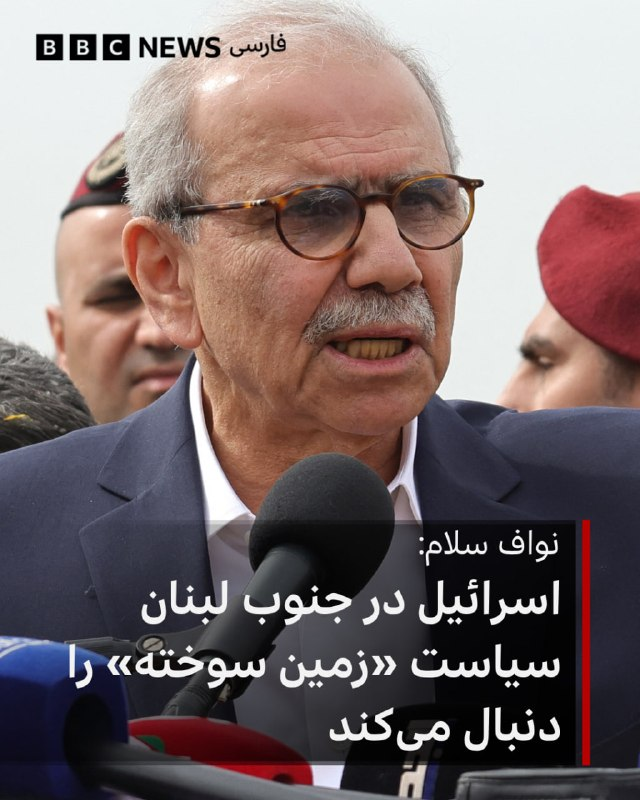

🔻نخست‌وزیر لبنان اسرائیل را متهم کرد که با تخریب سازمان‌یافته شهرها و روستاها و وادار کردن غیرنظامیان به ترک خانه‌های خود در جنوب لبنان، سیاست «زمین سوخته» را دنبال می‌کند.

نواف سلام گفت که تشدید حملات هوایی اسرائیل نه امنیت به همراه خواهد آورد و نه ثبات.

گزارش‌ها حاکیست است که در ۲۴ ساعت گذشته ۱۶ نفر کشته شده‌اند.

قرار است دور تازه‌ای از مذاکرات با میانجی‌گری آمریکا میان اسرائیل و لبنان هفته آینده در واشنگتن برگزار شود.

ارتش اسرائیل نیز اعلام کرد که حزب‌الله روز شنبه بیش از ۲۰ پرتابه به سوی آن کشور شلیک کرده است.

تصاویر پخش‌شده از تلویزیون اسرائیل نشان می‌دهد که چند راکت در نزدیکی شهر نهاریا در دریا فرود آمدند و باعث شدند افرادی که در ساحل بودند محل را ترک کنند.

📸AFP via Getty Images
https://trib.al/QHw83E1
@BBCPersian

---
📅 بروزرسانی: 1405/03/10 03:20
---

## VahidOOnLine — post 242967

♦️براساس تصاویری که به تازگی در شبکه‌های اجتماعی منتشر شده، در جریان مرمت تخت مرمر در کاخ گلستان در روز ۱۸ فروردین‌ماه، مرمت‌گران قطعه «سر فرشته» یکی از مجسمه‌های تاریخی این عمارت را که جدا شده بود، در میان آوار و قطعات شکسته‌شده پیدا کردند.
در همین رابطه، جبار آوج، مسئول موزه‌های کاخ گلستان، در گفتگو با رکنا اعلام کرد در اثر امواج ناشی از انفجار جنگ اخیر، خساراتی به تزیینات معماری، آیینه‌کاری‌ها، گچ‌بری‌ها و ارسی‌های چوبی این مجموعه وارد کرده است. به گفته او، اگرچه در حال حاضر امکان بازدید عمومی از کاخ وجود ندارد اما هیچ‌یک از آثار موزه‌ای آسیب ندیده‌اند. آوج همچنین تاکید کرد که اقدامات حفاظت اضطراری برای تثبیت شرایط و جلو‌گیری از خسارات ثانویه ناشی از بارندگی‌ها انجام شده و مجموعه در وضعیت پایدار قرار دارد تا پس از پایان مرحله آسیب‌شناسی، وارد فاز مرمت جامع شود.
‌🇸🇦 Indypersian

🤖 @VahidOOnLine

## VahidOOnLine — post 242966

  

♦️دونالد ترامپ، رئیس‌جمهوری ایالات متحده، روز شنبه با انتشار تصویر گرافیکی تولیدشده با هوش مصنوعی در شبکه اجتماعی «تروث سوشال»، توجه رسانه‌ها را به خود جلب کرد. در این تصویر ترامپ در جامه یک فرمانده نظامی ارشد با نشان عقاب طلایی آمریکا به تصویر کشیده شده که با انگشت به مخاطب اشاره می‌کند. در پس‌زمینه این طرح، نمادهای قدرت نظامی ایالات متحده از جمله جنگنده‌های پیشرفته در حال صعود و ناوشکن‌ها در کنار کشتی‌های بادبانی تاریخی با پرچم برافراشته آمریکا در میان موج‌های خروشان دریا دیده می‌شوند. ترامپ در حاشیه این تصویر نوشت: «شما دارید گیج و سردرگم می‌شوید».
‌🇸🇦 Indypersian

🤖 @VahidOOnLine

## VahidOOnLine — post 242965

  <a href="telegram/content/VahidOOnLine_242965_1780185009.mp4" target="_blank">🎬 Download video</a>

ویدیوی منتشرشده در رسانه‌های اجتماعی وابسته به جمهوری اسلامی نشان می‌دهد سپاه پاسداران، شامگاه شنبه نهم خرداد، قایق تندرویی را همراه با موشک ضدکشتی برای حامیان حکومت در میدان انقلاب تهران به نمایش گذاشت.
‌🏁 🇬🇧 IranintlTV

🤖 @VahidOOnLine

## VahidOOnLine — post 242964

♦️همزمان با آشوب، آتش‌سوزی و تنش در خیابان‌های پاریس به دنبال جشن قهرمانی پاریس سن ژرمن در دیدار نهایی لیگ قهرمانان اروپا، مارین لوپن، رهبر حزب «اجتماع ملی»، با انتشار پیامی تند در شبکه اجتماعی اکس، به شدت از وضعیت امنیت عمومی انتقاد کرد. این چهره سرشناس سیاسی با اشاره به جو رعب و وحشت حاکم بر خیابان‌ها، بر لزوم برخورد قاطع با برهم‌زنندگان نظم عمومی تاکید کرد. لوپن در موضع‌گیری صریح خود نوشت: «فقط در فرانسه است که پیروزی یک باشگاه فوتبال باعث بروز شورش می‌شود. فقط در فرانسه است که هر کسی احساس می‌کند مجبور است در شب پیروزی، خود را در خانه حبس کند تا با خشونت مواجه نشود.»
‌🇸🇦 Indypersian

🤖 @VahidOOnLine

## WithYashar — post 12971

فارس : براساس برنامه‌ریزی‌های انجام‌شده، حجاج ایرانی از فرودگاه جده به شش فرودگاه شامل تهران، مشهد، زاهدان، شیراز، گرگان و اصفهان منتقل خواهند شد.

نخستین پرواز بازگشت حجاج روز ۱۱ خردادماه(دوشنبه) از جده به مقصد تهران انجام می‌شود.
@withyashar

## FoxNewsTwitter — post 342437

  <a href="telegram/content/FoxNewsTwitter_342437_1780185011.mp4" target="_blank">🎬 Download video</a>

Fox News (Twitter/X)

A suspected drug-trafficking boat erupts into flames after being struck by U.S. forces in the eastern Pacific.

New video, released by U.S. Southern Command, shows the moment the vessel is hit during an operation carried out Friday.

SOUTHCOM says three "male narco-terrorists" were killed in the strike.

## FoxNewsTwitter — post 342436

‌Fox News (Twitter/X)

👉 Full story here:

## FoxNewsTwitter — post 342435

  

Fox News (Twitter/X)

Proud Boys and communist activists clash outside Newark ICE detention center as Gov. Sherrill admits 5 of 6 people arrested this week came from out of state. What started as a protest over detainee conditions has become a full-blown ideological battleground — with 'national extremist groups' on both sides driving the chaos, not local residents.

## IranIntlTV — post 339802

  <a href="telegram/content/IranIntlTV_339802_1780185014.mp4" target="_blank">🎬 Download video</a>

ویدیوی منتشرشده در رسانه‌های اجتماعی وابسته به جمهوری اسلامی نشان می‌دهد سپاه پاسداران، شامگاه شنبه نهم خرداد، قایق تندرویی را همراه با موشک ضدکشتی برای حامیان حکومت در میدان انقلاب تهران به نمایش گذاشت.

## IranianMinds — post 21096

  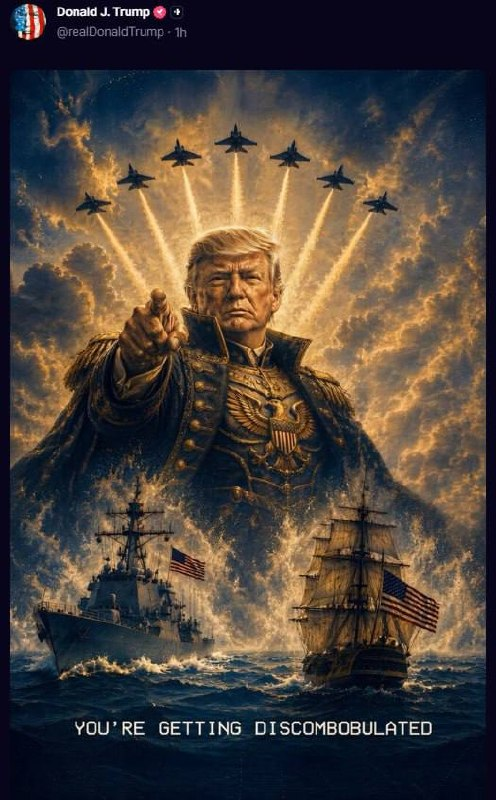

🔴پست ترامپ:

@IranianMinds

## IranianMinds — post 21095

  <a href="telegram/content/IranianMinds_21095_1780185017.mp4" target="_blank">🎬 Download video</a>

@IranianMinds

## BBCPersian — post 282453

🔻مراسم خاکسپاری مجتبی و میثم ویسی، دو برادر کُرد یارسان که دو روز پیش با شلیک نیروهای سپاه پاسداران در منطقه دالاهو کرمانشاه جان باخته بودند، امروز برگزار شد.

سوران قربانی گزارش می‌دهد
@BBCPersian

---
📅 بروزرسانی: 1405/03/10 02:17
---

## VahidOOnLine — post 242963

  <a href="telegram/content/VahidOOnLine_242963_1780181240.mp4" target="_blank">🎬 Download video</a>

♦️فارس تصاویر رونمایی از شناور تندروی هجومی جدید سپاه با نام «۲۷ رجب» در تجمع حکومتی میدان انقلاب تهران را منتشر کرد. این خبرگزاری وابسته به سپاه نوشت که این شناور به قابلیت پرتاب دو فروند موشک کروز دریاپایه با برد ۷۰۰ کیلومتر و قدرت مانور و عملیات در موج با ارتفاع ۳ متر مجهز است.
‌🇸🇦 Indypersian

🤖 @VahidOOnLine

## VahidOOnLine — post 242962

♦️به گزارش رویترز، جشن قهرمانی پاریس سن ژرمن پس از پیروزی در دیدار نهایی لیگ قهرمانان اروپا، شنبه شب به درگیری، آتش‌سوزی و تنش در خیابان‌های پاریس کشیده شد.
بر اساس این گزارش، پلیس فرانسه پس از آنکه در برخی مناطق مرکزی پاریس هدف شلیک مواد آتش‌زا قرار گرفت، برای متفرق کردن گروهی از هواداران از گاز اشک‌آور استفاده کرد.
پاریس سن ژرمن زیر نظر لوئیس انریکه موفق شد در یک مسابقه نهایی نفس‌گیر در بوداپست، تیم آرسنال را در ضربات پنالتی با نتیجه ۴ بر ۳ شکست دهد و عنوان قهرمانی خود را حفظ کند. این پیروزی پس از تساوی ۱-۱ در وقت‌های اضافه رقم خورد تا نماینده فرانسه جایگاه خود را به عنوان قدرت برتر فوتبال اروپا تثبیت کند.
‌🇸🇦 Indypersian

🤖 @VahidOOnLine

## VahidOOnLine — post 242961

  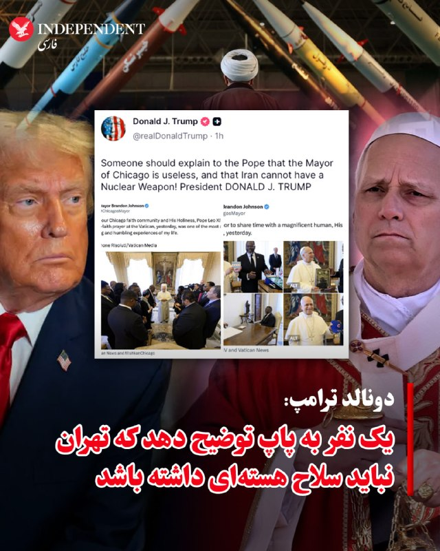

♦️دونالد ترامپ، رئیس‌جمهوری ایالات متحده، روز شنبه، با انتشار پیامی در شبکه اجتماعی «تروث سوشال»، به دیدار اخیر براندون جانسون، شهردار شیکاگو با رهبر کاتولیک‌های جهان در واتیکان واکنش نشان داد. ترامپ با به اشتراک گذاشتن تصاویر این دیدار، نوشت: «یک نفر باید به پاپ توضیح دهد که شهردار شیکاگو فردی بی‌فایده است و اینکه ایران نمی‌تواند سلاح هسته‌ای داشته باشد».
‌🇸🇦 Indypersian

🤖 @VahidOOnLine

## VahidOOnLine — post 242960

  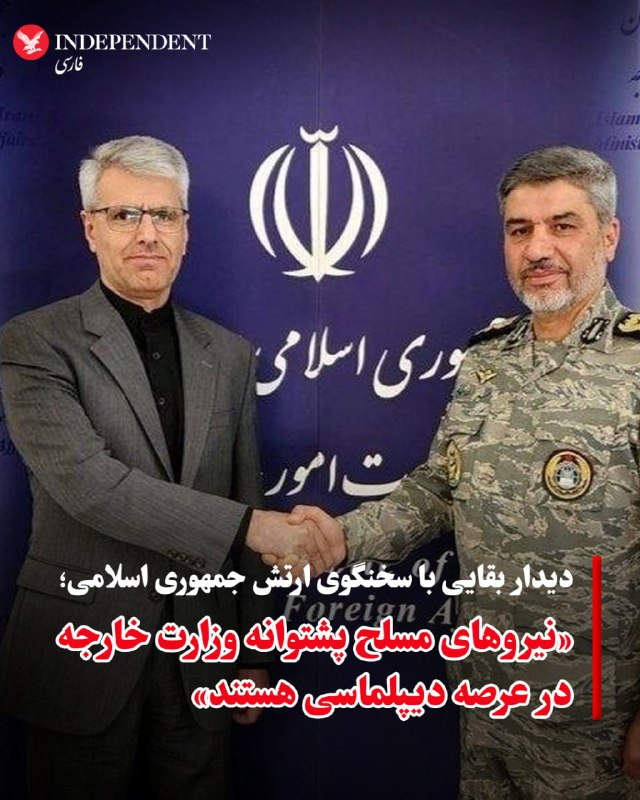

♦️به گزارش فارس، خبرگزاری وابسته به سپاه، اسماعیل بقایی، سخنگوی وزارت خارجه روز شنبه با محمد اکرمی‌نیا، سخنگوی ارتش جمهوری اسلامی دیدار و گفتگو کرد. براساس این گزارش، بقایی در این دیدار گفت: «قدرت و اقتدار نیروهای مسلح پشتوانه محکم وزارت خارجه در صیانت از منافع ایران در عرصه دیپلماسی است».
‌🇸🇦 Indypersian

🤖 @VahidOOnLine

## VahidOOnLine — post 242959

♦️دولت گرجستان در تفلیس، در‌های یک انبار شراب مخفی متعلق به ژوزف استالین، رهبر پیشین اتحاد جماهیر شوروی را گشود. این انبار تاریک و تار عنکبوت‌گرفته، خانه گنجینه‌ای بی‌نظیر شامل ۴۰ هزار بطری شراب کمیاب است.

در این مجموعه تاریخی، نایاب‌ترین شراب‌های فرانسوی متعلق به تزارهای روسیه، الکساندر سوم و نیکولای دوم، به چشم می‌خورد. این بطری‌های امپراتوری پس از انقلاب ۱۹۱۷ توسط شوروی توقیف شدند و استالین، که خود از علاقه‌مندان سرسخت شراب بود، نگهبانی از آن‌ها را بر عهده گرفت و به مرور، شراب‌های گرجستانی محبوبش را به آن افزود.

پیر لورتون، مدیر دو عمارت مطرح شراب‌سازی در بوردو، با «پانتیون (معبد) شراب» خواندن این مکان، بر ضرورت بررسی تک‌تک بطری‌ها به دلیل فرسودگی احتمالی چوب‌پنبه‌ها تاکید کرد. ویکتور چن، یکی از مجموعه‌دارهایی که اجازه ورود به این فضا را یافته، این تجربه را به «کشف غارهای باستانی توسط ایندیانا جونز» تشبیه کرد.

دولت گرجستان قصد دارد این مجموعه ارزشمند را به حراج بگذارد و درآمد حاصل از آن را برای تاسیس یک مدرسه در کلاس جهانی جهت آموزش ساخت شراب اختصاص دهد.
‌🇸🇦 Indypersian

🤖 @VahidOOnLine

## WithYashar — post 12970

عجب سکوت مرگباری …

## IranIntlTV — post 339801

  <a href="https://t.me/IranintlTV/339801" target="_blank">📎 Download file</a>

🎧نسخه صوتی سیاست با مراد ویسی: جهان در انتظار تصمیم ترامپ
@iranintlTV

## IranIntlTV — post 339800

  <a href="telegram/content/IranIntlTV_339800_1780181245.mp4" target="_blank">🎬 Download video</a>

مراد ویسی، تحلیل‌گر ارشد ایران‌اینترنشنال، گفت: «دیکتاتوری ها پس از شکست در جنگ آسیب‌پذیرتر می‌شوند. بحران‌های پس از جنگ که ترکیبی از بحران‌های سیاسی و اقتصادی و اجتماعی است، آنها را به سمت سقوط سوق می‌دهد. تجربه سقوط نظامیان در آرژانتین پس از شکست در جنگ فالکلند یکی از نمونه‌های تاریخی این پدیده است. تجربه‌ای که شباهت‌های بسیار با وضعیت کنونی جمهوری اسلامی پس از جنگ‌های ۱۲ روزه و ۴۰ روزه دارد.»
@iranintltv

## IranIntlTV — post 339799

  <a href="telegram/content/IranIntlTV_339799_1780181248.mp4" target="_blank">🎬 Download video</a>

مصطفی نیلی، وکیل دادگستری، از صدور حکم اعدام برای بنیامین نقدی، زندانی سیاسی و از معترضان دی‌ماه، به اتهام افساد فی‌الارض خبر داد.

همزمان گزارش‌ها حاکی است سجاد ویسی و شایان ویسی، از بازداشت‌شدگان دی‌ماه در کرمانشاه، به محاربه متهم شده‌اند و با خطر صدور احکام سنگین، از جمله اعدام، روبه‌رو هستند. همچنین حکم اعدام رئوف شیخ‌معروفی و محمد فرجی، دو زندانی سیاسی اهل بوکان، در دیوان کشور تایید شده است.

گفت‌وگو با رقیه رضایی، روزنامه‌نگار
@iranintltv

## IranIntlTV — post 339798

  <a href="telegram/content/IranIntlTV_339798_1780181250.mp4" target="_blank">🎬 Download video</a>

وزیر جنگ آمریکا اعلام کرد معیارهای واشینگتن در مذاکرات با جمهوری اسلامی تغییری نکرده است.

پیت هگست گفت هر توافقی تنها زمانی انجام خواهد شد که دونالد ترامپ آن را تضمین‌کننده امنیت آمریکا و جهان بداند.

گفت‌وگو با امیر گیتی، عضو تحریریه ایران‌اینترنشنال
@iranintltv

## IranIntlTV — post 339797

  <a href="telegram/content/IranIntlTV_339797_1780181253.mp4" target="_blank">🎬 Download video</a>

مراد ویسی، تحلیل‌گر ارشد ایران‌اینترنشنال، گفت: «شاهزاده رضا پهلوی مهم‌ترین چهره‌ اپوزیسیون است که به طور گسترده و مکرر در سطح بین‌المللی صدای مردم ایران را به گوش دنیا می‌رساند و درباره واقعیت‌های داخل ایران سخن می‌گوید. این اقدام تلاشی موثر در جهت همراه کردن جهان با خواست ملت ایران برای تغییر رژیم است.»
@iranintltv

## IranIntlTV — post 339795

🔻با اعلام محمدرضا کشوری‌فرد، دبیر سازمان لیگ فوتبال ایران لیگ برتر بیست و پنجم ناتمام ماند. او به سایت فدراسیون فوتبال گفت: «با توجه به وضعیت کشور در دوران جنگ و کمک به روند آماده‌سازی تیم ملی برای جام جهانی، امکان برگزاری ادامه رقابت‌های بیست و پنجمین دوره لیگ برتر وجود نداشت.»

🔹با توجه به این اظهارات لیگ برتر در فصل ۱۴۰۴-۱۴۰۵ بدون شناخت قهرمان و تیم‌های سقوط کرده، نیمه‌تمام باقی می‌ماند.

🔹پیش‌تر فدراسیون فوتبال گفته بود پس از جام جهانی، ۸ هفته باقی‌مانده لیگ را برگزار می‌کند تا تکلیف قهرمان و تیم‌های سقوط کرده این فصل مشخص شود.

🔹از سوی دیگر، پیش‌تر این از فدراسیون فوتبال شنیده شده بود که با توجه به نیمه‌کاره ماندن لیگ، در این فصل هیچ تیمی سقوط نمی‌کند، اما دو تیم از لیگ یک به لیگ برتر فصل آینده اضافه می‌شوند و لیگ ۱۸ تیمی برگزار خواهد شد.

🔹جزییات بیشتر را در سایت بخوانید.

@iranintltvsport

## FarsiVOA — post 219128

⚡️از شعار سیاسی تا گام‌های اجرایی؛ آزمون سرنوشت‌ساز دولت عراق در پرونده انحلال گروه‌های مسلح
@FarsiVOA

## FarsiVOA — post 219127

  <a href="telegram/content/FarsiVOA_219127_1780181255.mp4" target="_blank">🎬 Download video</a>

⚡️تلاش سپاه برای اعدام جوانان اکباتان؛ گفت‌وگو با معین خزائلی حقوق‌‌دان
@FarsiVOA

## IranianMinds — post 21094

  <a href="telegram/content/IranianMinds_21094_1780181257.mp4" target="_blank">🎬 Download video</a>

تو فرانسه مردم کسخل شدن و بعد از قهرمانی پاری‌سن‌ ژرمن تو چمپیونزلیگ، هوادارای این تیم از فرصت سو استفاده کردن و ریختن تو خیابونای پاریس و با آتیش زدن ماشین‌ها، اتوبوس‌ها، وسایل عمومی و... دست به تجمع اعتراضی زدن و با نیروهای پلیس درگیر شدن.

چندین نفر هم دستگیر شدن تا الان

@IranianMinds

## BBCPersian — post 282452

  

🔻وحید شریعت، رئیس انجمن روانپزشکی ایران: داروهای روانپزشکی، از افسردگی تا دوقطبی و اسکیزوفرنی، با کمبود مواجه شده‌اند.

آقای شریعت ابراز نگرانی کرد که کمبودهای این لیست در ماه‌های آینده، «بزرگتر شود و داروهای فعلی هم قابل تامین نباشند.»

به گزارش رسانه‌های ایران، رئیس انجمن روانپزشکی افزود: «سرچشمه بحران روانی امروز یک چیز واحد نیست، بلکه تصمیمات کلان حاکمیت و نوع نگاه به مسائل است که روی همه چیز سایه انداخته و رسانه‌ها باید با دیدن واقع‌گرایانه یعنی نه بدبینانه کاذب و نه خوشبینانه کاذب به اصلاح شرایط کمک کنند.»

ایران می‌گوید که تحریم‌ها و حملات آمریکا و اسرائیل به مراکز تولید دارو از جمله دلایل کمبود داروهاست.

پیشتر گزارش کردیم که اکبر عبداللهی، مدیرکل دارو و مواد تحت کنترل سازمان غذا و داروی ایران گفته است که از یک ماه دیگر پزشکان هنگام تجویز دارو به فهرستی از داروهای کمیاب، دسترسی خواهند داشت.

به گفته این مقام ارشد دولت، در این فهرست «میزان کمبود دارویی و اطلاعات آماری مربوط به میزان تجویز و بار مالی داروهای تجویزی» را شامل می‌شود.

📸GettyImages
https://trib.al/E2vfVHf
@BBCPersian

## Dirty_Kids — post 390609

  <a href="telegram/content/Dirty_Kids_390609_1780181260.webm" target="_blank">🎬 Download video</a>

☢️خفن ترین و‌ قدیمی ترین  انالیزور  ایران ینی دکتر بت 
👍 
🔴مسابقات جذاب جام جهانی به زودی شروع میشه بیا توی کانال دکتر بت و باهاش همراه شو و پول در بیار
💵 رایگان بهترین شرط هارو براتون میذاره حتی هزار تومن هم دریافت نمیکنه روزانه میتونی از پیش بینی فوتبال باهاش…

## Dirty_Kids — post 390608

  <a href="telegram/content/Dirty_Kids_390608_1780181261.webm" target="_blank">🎬 Download video</a>

☢️خفن ترین و‌ قدیمی ترین  انالیزور  ایران ینی دکتر بت 
👍

🔴مسابقات جذاب جام جهانی به زودی شروع میشه بیا توی کانال دکتر بت و باهاش همراه شو و پول در بیار
💵

رایگان بهترین شرط هارو براتون میذاره
حتی هزار تومن هم دریافت نمیکنه
روزانه میتونی از پیش بینی فوتبال باهاش پول در بیاری 👌
A9

🌟اگ اهل پیش بینی فوتبالی این کانال اصلا از دست ندین
👇

✅https://t.me/+4_ADqwB9e-QwYjlk

✅https://t.me/+4_ADqwB9e-QwYjlk

## Dirty_Kids — post 390607

  

#بخوابیم

@Dirty_Kids 👻

## Dirty_Kids — post 390606

  <a href="telegram/content/Dirty_Kids_390606_1780181263.mp4" target="_blank">🎬 Download video</a>

دوتا دختر خیلی شیک و تمیز از یه بوتیک تو نازی‌آباد یه لباس می‌دزدن

@Dirty_Kids 👻

## Dirty_Kids — post 390605

  <a href="telegram/content/Dirty_Kids_390605_1780181264.mp4" target="_blank">🎬 Download video</a>

یک ویدیو که هر بار دیدنش، چیزی از روح آدم را کم می‌کند…
۱۹ دی، شاهین‌شهر اصفهان

@Dirty_Kids 👻

## Dirty_Kids — post 390604

  <a href="telegram/content/Dirty_Kids_390604_1780181266.mp4" target="_blank">🎬 Download video</a>

من هرشب:

هندزفری 🔞

@Dirty_Kids 👻

## Dirty_Kids — post 390603

میدونستید آقا سیدمجتبی تنها گونه جانوری هست که بجای حمله به قاتل پدر و همسر و بچه‌ش، تمام سعیشو میکنه باهاش توافق کنه؟

@Dirty_Kids 👻

## Dirty_Kids — post 390602

  <a href="telegram/content/Dirty_Kids_390602_1780181269.mp4" target="_blank">🎬 Download video</a>

توی سریال "بدنام" دختره به پسره میگه ساز دهنیت باحاله؟ اونم میگه آره، دختره هم میگه پس بریم تو اتاق صدای ساز دهنیمون همسایه‌ها رو بی‌خواب نکنه😂😂

@Dirty_Kids 👻

## alonews — post 123842

  

🔥 همراه با ساب + حجم مصرفی، فقط 9T! 🚀

❌ آفر فقط تا پایان امشب ❌

🔥 اگه دنبال یه VPN پایدار و بدون دردسر می‌گردی، این پلن مخصوص خودته!

@Netaazaadbot
@NetAazaadBot
✅ همراه با ساب + حجم مصرفی
✅ 15 سرور اختصاصی پرسرعت
✅ اتصال پایدار و بدون قطعی
✅ سرعت بالا حتی در ساعات شلوغ

@Netaazaadbot
@NetAazaadBot
💎 کیفیتی که بعد از استفاده متوجه تفاوتش میشی!

📩 برای خرید و دریافت سرویس استارت رو بزن✅

## alonews — post 123841

  <a href="telegram/content/alonews_123841_1780181271.webm" target="_blank">🎬 Download video</a>

👈هم اکنون حملات اسرائیل به جنوب لبنان

✅ @AloNews خبر جنگ

## alonews — post 123837

  <a href="telegram/content/alonews_123837_1780181271.webm" target="_blank">🎬 Download video</a>

👈ترامپ بازهم رگباری پست گذاشت

✅ @AloNews خبر جنگ

## alonews — post 123836

  <a href="telegram/content/alonews_123836_1780181272.mp4" target="_blank">🎬 Download video</a>

👈تبلیغ چادر پلنگی در ایتا و روبیکا

✅ @AloNews خبر جنگ

## alonews — post 123835

  <a href="telegram/content/alonews_123835_1780181274.webm" target="_blank">🎬 Download video</a>

👈تابش فرابنفش

🔴این هفته شاخص فرابنفش بالا است، تا جای ممکن در ساعات میانی روز(ساعات۹-۱۵، با توجه به داده‌ها) کمتر در برابر تابش مستقیم خورشید قرار بگیرید.

✅ @AloNews خبر جنگ

---
📅 بروزرسانی: 1405/03/10 01:10
---

## VahidOOnLine — post 242958

  

ترامپ با بازنشر تصاویر دیدار شهردار دموکرات شیکاگو با پاپ، در تروث‌سوشال نوشت: «باید کسی به پاپ توضیح دهد که شهردار شیکاگو بی‌فایده است و ایران نمی‌تواند سلاح هسته‌ای داشته باشد.» ترامپ اخیرا درباره مواضع مختلف پاپ از جمله مخالفت او با جنگ ایران، انتقادهای زیادی را مطرح کرده است.
‌🏁 🇬🇧 IranintlTV

🤖 @VahidOOnLine

## VahidOOnLine — post 242957

  <a href="telegram/content/VahidOOnLine_242957_1780177249.mp4" target="_blank">🎬 Download video</a>

پرچم ملی اسپانیا روز شنبه نهم خرداد، در جریان رژه نظامی «روز نیروهای مسلح» در شهر ویگو، هنگام برافراشته شدن از میله جدا شد و سقوط کرد. این اتفاق در حضور پادشاه فیلیپه ششم رخ داد که منجر به واکنش او در چهره‌اش شد. نیروهای نظامی بلافاصله پرچم را جمع‌آوری کردند.
‌🏁 🇬🇧 IranintlTV

🤖 @VahidOOnLine

## VahidOOnLine — post 242956

  

♦️عباس گلرو، عضو کمیسیون امنیت ملی مجلس، شنبه‌شب در جمع حامیان حکومت در گرمسار گفت: «آمریکایی‌ها در ابتدای مذاکرات دو خواسته اصلی داشتند. نخست توقف کامل غنی‌سازی و دوم تحویل اورانیوم غنی‌شده ایران به یک کشور ثالث که محمدباقر قالیباف با صراحت اعلام کرد جمهوری اسلامی ایران اساسا اجازه ورود به چنین مذاکراتی را نداده است و طرف آمریکایی باید ابتدا دارایی‌های بلوکه‌شده ایران را آزاد کند». او گفت: «سوال اصلی این است که آیا می‌توان به آمریکا اعتماد کرد، پاسخ روشن است؛ خیر. آیا می‌توان با آمریکا به تفاهم پایدار رسید، پاسخ خیر است».
‌🇸🇦 Indypersian

🤖 @VahidOOnLine

## VahidOOnLine — post 242955

  

♦️آژانس بین‌المللی انرژی اتمی (IAEA) روز شنبه، ۹ خردادماه، اعلام کرد که بر اساس اطلاعات دریافتی از نیروگاه هسته‌ای زاپوریژیا در جنوب شرقی اوکراین، یک پهپاد به ساختمان توربین این نیروگاه اصابت کرده و باعث ایجاد حفره در دیوار آن شده است. در پی این حادثه، رافائل گروسی، رئیس آژانس بین‌المللی انرژی اتمی، با ابراز نگرانی شدید نسبت به مخاطرات این رخداد هشدار داد که «حمله به سایت‌های هسته‌ای مانند بازی با آتش است.» تیم کارشناسان آژانس مستقر در این نیروگاه تحت اشغال روسیه، با انتشار پیامی در اکس، رسما خواستار دسترسی فوری و مستقیم به ساختمان توربین آسیب‌دیده برای ارزیابی اولیه‌ خسارات شده‌اند.
در واکنش به این رویداد، وزارت امور خارجه اوکراین با انتشار بیانیه‌ای رسمی، اتهامات روسیه و شرکت دولتی «روس‌اتم» مبنی بر دخالت کی‌یف در این حمله را به شدت رد کرد و آن را یک «عملیات روانی تکراری» از سوی مسکو نامید. کی‌یف با مضحک خواندن این ادعا که اوکراین به تاسیسات هسته‌ای در خاک خود حمله کند، تاکید کرد که روسیه همواره در آستانه نشست‌های شورای حکام آژانس، با پنهان‌کاری و ممانعت از دسترسی بازرسان به بخش‌های غربی سالن‌های توربین، دست به فضاسازی رسانه‌ای می‌زند تا افکار عمومی را از اصل موضوع، یعنی «اشغال غیرقانونی نیروگاه» منحرف کند. وزارت خارجه اوکراین در پایان از ۳۴ کشور عضو شورای حکام خواست تا در نشست ماه ژوئن، فراتر از ابراز نگرانی‌های دیپلماتیک عمل کرده و با سلب صلاحیت مسکو، با اعطای کرسی به روسیه در شورای حکام آژانس بین‌المللی انرژی اتمی مخالفت کنند.
‌🇸🇦 Indypersian

🤖 @VahidOOnLine

## VahidOOnLine — post 242954

  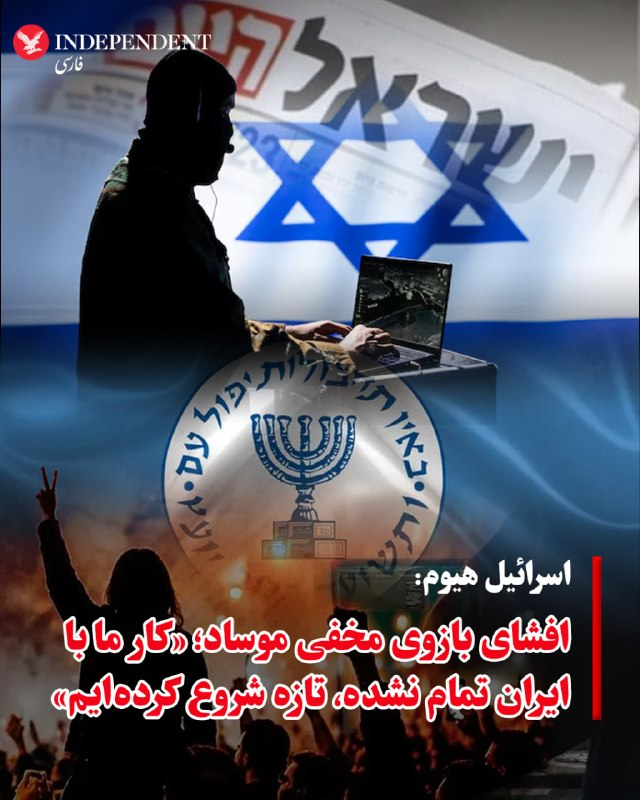

♦️روزنامه «اسرائیل هیوم» در گزارشی برای نخستین بار از فعالیت شاخه تخصصی «عملیات نفوذ و تغییر افکار عمومی» در موساد پرده برداشته که در سال ۲۰۲۱ توسط دیوید بارنیا تاسیس شده است. «او.» (O)، فرمانده سابق این بخش، فاش کرد که هدف اصلی این بازو، سرنگونی حکومت ایران از طریق جنگ روانی، سایبری و رسانه‌ای است. او با اشاره به اینکه حذف مهره‌ها از طریق بدنام کردن بسیار ارزان‌تر و ساده‌تر از ترور فیزیکی است، فاش کرد که افشای عکس‌های جنجالی رستم قاسمی در مالزی در سال ۲۰۲۲، اقدام موساد بوده که از سال ۲۰۱۱ این تصاویر را در اختیار داشته تا در اوج اعتراضات، علاوه بر حذف یک چهره کلیدی نظامی، به آتش تظاهرات دامن بزند. این واحد همچنین با راه‌اندازی «ماشین سم‌پاشی» در شبکه‌های اجتماعی از طریق حساب‌های جعلی، به دنبال شکستن دیوار ترس مردم و تضعیف ثبات نظام بوده است.
بر اساس این گزارش، موساد از خردادماه (ژوئن) گذشته طرح و برنامه‌ای جامع و آماده را برای سرنگونی حکومت ایران در دست اجرا داشته که شامل آموزش و تسلیح نیروهای کُرد در مرزها و فعال‌سازی شبکه‌ای از چهره‌های تاثرگذار شبکه‌های اجتماعی ساخته‌شده با هوش مصنوعی بوده است. اگرچه اعتراضات بازاریان تهران در آذر ۱۴۰۴ (دسامبر ۲۰۲۵) برنامه‌ریزی زمان‌بندی‌شده آن‌ها را به هم ریخت و به دلیل سرکوب شدید، مانع از حضور گسترده‌تر مردم در جریان عملیات‌های نظامی بعدی شد، اما مقامات موساد همچنان معتقدند ترکیب عملیات نفوذ با فشار اقتصادی و حملات هوایی، تاثیر خود را خواهد گذاشت. رئیس موساد پیش از عملیات «غرش شیران» در تماس تصویری با دونالد ترامپ، وعده سقوط حکومت ایران را داده بود و منابع نزدیک به بارنیا قاطعانه باور دارند که در صورت تداوم محاصره اقتصادی و عدم امضای توافق جدید، حکومت ایران تا پایان سال ۲۰۲۶ سقوط خواهد کرد.
این گزارش درحالی منتشر شد که پیش از این، محمود احمدی‌نژاد در مصاحبه‌ای در سال ۱۴۰۰ از نفوذ اطلاعاتی اسرائیل در ساختار امنیتی جمهوری اسلامی گفته و اعلام کرده بود «بالاترین مسئول مقابله با جاسوسان اسرائیل در وزارت اطلاعات، خودش جاسوس اسرائیل بود» و نظام با «سناریوسازی برای پنهان کردن سرقت اسناد»، تلاش کرده عوامل نفوذی را محفوظ نگه دارد.
‌🇸🇦 Indypersian

🤖 @VahidOOnLine

## VahidOOnLine — post 242953

  <a href="telegram/content/VahidOOnLine_242953_1780177252.mp4" target="_blank">🎬 Download video</a>

♦️براساس تصاویر منتشر شده در خبرگزاری دانشجو، سپاه پاسداران جمعه‌شب در میان حامیان حکومت در سنقر کرمانشاه، از پهپاد «شاهد ۱۳۶» آبی‌رنگ رونمایی کرد. پیش از این نیز رونمایی از خودرو جیپ، پهپاد و موشک به رنگ صورتی به مناسبت «روز دختر»، مورد توجه کاربران شبکه‌های اجتماعی قرار گرفته بود.
‌🇸🇦 Indypersian

🤖 @VahidOOnLine

## VahidOOnLine — post 242952

  

عباس گلرو، عضو کمیسیون امنیت ملی مجلس گفت: «در حال سوال اصلی این است که آیا می‌توان به آمریکا اعتماد کرد، پاسخ روشن است، خیر. آیا می‌توان با آمریکا به تفاهم پایدار رسید، پاسخ این نیز خیر است.»

او افزود: «ما همه سرنشین یک کشتی هستیم و باید به تصمیم‌های اتخاذشده در ساختار نظام اعتماد داشته باشیم.»

او ادامه داد: «هیچ مقطعی را به اندازه امروز، زمان برافراشته بودن پرچم جمهوری اسلامی در منطقه و جهان ندیده‌ام.»
‌🏁 🇬🇧 IranintlTV

🤖 @VahidOOnLine

## VahidOOnLine — post 242951

  <a href="telegram/content/VahidOOnLine_242951_1780177254.mp4" target="_blank">🎬 Download video</a>

سعید آجرلو، عضو تیم رسانه‌ای مذاکره‌کننده جمهوری اسلامی، گفت در صورت تایید متن نهایی تفاهم‌ [با آمریکا]، گفت‌وگوهای ۶۰ روزه درباره جزئیات آغاز می‌شود. او افزود اگر طرف مقابل به تعهداتش، از جمله درباره ۱۲ میلیارد دلار، عمل نکند، جمهوری اسلامی می‌تواند از توافق خارج شود.
‌🏁 🇬🇧 IranintlTV

🤖 @VahidOOnLine

## WithYashar — post 12968

@withyashar JangHub

## WithYashar — post 12967

  <a href="telegram/content/WithYashar_12967_1780177256.mp4" target="_blank">🎬 Download video</a>

ادعای کانیه وست :
کنسرتم در استانبول رکورد ۱۱۸ هزار تماشاگر را ثبت کرده و به بزرگ‌ترین رویداد استادیومیِ بلیت‌فروشی‌شده در تاریخ تبدیل شده است.
@withyashar

## WithYashar — post 12966

  <a href="telegram/content/WithYashar_12966_1780177257.mp4" target="_blank">🎬 Download video</a>

شاهزاده رضا پهلوی :
۴۰ هزار ایرانی برای تنگه هرمز یا برای یک توافق هسته‌ای کشته نشدن.
ما باید فشار روی رژیم رو ادامه بدیم تا نتونه منابع مالی لازم برای تأمین و پرداخت به نیروهای نیابتی و مزدورهاش رو فراهم کنه.
اما بهترین راه برای اینکه کار به حضور نیروهای خارجی در زمین نکشه اینه که به مردم ایران کمک بشه تا خودشون اون نقش رو بازی کنن
@withyashar

## WithYashar — post 12965

رییس سازمان عقیدتی سیاسی انتظامی:
حکم قاتلان خامنه‌ای رو باید در ملا عام اجرا کنیم.
@withyashar

## WithYashar — post 12964

  

پست جدید ترامپ در تروث 🤣:

«یکی باید برای پاپ توضیح بدهد که شهردار شیکاگو کاملاً بی‌فایده است و اینکه ایران نمی‌تواند سلاح هسته‌ای داشته باشد!

رئیس‌جمهور دونالد جی. ترامپ»
@withyashar

## mwarmonitor — post 9924

  

✈️نمای نزدیک‌تری از بخش دم هواپیمای سوخت‌رسان KC-135 با شماره 63-8028 متعلق به نیروی هوایی ایالات متحده که هنگام حضور روی زمین در عربستان سعودی بر اثر ترکش‌های پهپاد/موشک بالستیک ایرانی دچار آسیب شده ولی کماکان در حال خدمت است.

@mwarmonitor

## FoxNewsTwitter — post 342434

  <a href="telegram/content/FoxNewsTwitter_342434_1780177260.mp4" target="_blank">🎬 Download video</a>

Fox News (Twitter/X)

BREAKING: New Jersey Gov. Mikie Sherrill speaks out after anti-ICE chaos outside Delaney Hall, says she refuses to "give ICE a pretext" to expand operations.

"Let me be clear: ICE engagement creates an incredibly dangerous situation. It makes the situation worse, and I refuse to back down in fighting the Trump administration."

"We know that people from outside the state have been interfering in the protest and escalating them."

"To the people coming from out of state to create chaos and dangerous situations: You should not be here."

## pm_afshaa — post 91919

شاهزاده رضا پهلوی در اودسا:
اکنون که اینترنت تا حدی دوباره وصل شده است، شما مستقیماً از مردم ایران خواهید شنید و واکنش آن‌ها به مداخله‌ای که رخ داده است را خواهید دید.

مردم ایران جشن می‌گرفتند از اینکه نیروهای دفاعی اسرائیل و تا حدی نیروی هوایی آمریکا در ضربه زدن به زیرساخت‌های رژیم مداخله کردند. مردم خیابان‌هایی در ایران را به نام رئیس‌جمهور ترامپ نامگذاری کرده‌اند.

این ملتی است که این موضوع را از دیدگاه مداخله‌ای کاملاً انسانی برای محافظت از جان‌های بیشتر می‌بیند. برای ما، این یک مداخله آزادی‌بخش بود.

مردم ایران از آنچه فکر می‌کنید باهوش‌ترند و تفاوت بین زمانی که کشور مورد حمله قرار می‌گیرد و زمانی که رژیم هدف قرار می‌گیرد را به خوبی تشخیص می‌دهند

💧 Rainbet.com the #1 Non-KYC Crypto Casino & Sportsbook @rainbetcom

😁 @Pm_Afshaa

## pm_afshaa — post 91918

🔴شاهزاده رضا پهلوی در اودسا:
اسرائیل می‌داند تا زمانی که این رژیم سر کار است، تهدیدی وجودی برای آن محسوب می‌شود. امروز، کشورهای منطقه می‌بینند که این رژیم در حمله به آن‌ها تردید نکرده

💧 Rainbet.com the #1 Non-KYC Crypto Casino & Sportsbook @rainbetcom

😁 @Pm_Afshaa

## pm_afshaa — post 91917

🔴شاهزاده رضا پهلوی در اودسا:
40هزار ایرانی برای تنگه هرمز یا توافق هسته‌ای جان نداده‌اند.

ما باید به خفه کردن رژیم ادامه دهیم تا بتوانیم منابع مالی، تأمین و پرداخت مزدوران آن را قطع کنیم. زیرا ممکن است فروپاشی اقتصادی رژیم نیز منجر به پایان آن شود، نه فقط فشار نظامی خارجی.

اما بهترین راه برای جلوگیری از حضور نیروهای خارجی در میدان، کمک به مردم ایران برای ایفای این نقش است، به شرطی که حمایت اضافی لازم را به آنها بدهید

💧 Rainbet.com the #1 Non-KYC Crypto Casino & Sportsbook @rainbetcom

😁 @Pm_Afshaa

## pm_afshaa — post 91916

  <a href="telegram/content/pm_afshaa_91916_1780177262.webm" target="_blank">🎬 Download video</a>

🔴نیویورک تایمز: میان ترامپ و جی‌ دی ونس، معاون اول او شکاف گسترده ای افتاده است و ترامپ به نظرات و سیاست معاون اول خود در قبال ایران تاخته است.

💧 Rainbet.com the #1 Non-KYC Crypto Casino & Sportsbook @rainbetcom

😁 @Pm_Afshaa

## pm_afshaa — post 91915

  <a href="telegram/content/pm_afshaa_91915_1780177262.webm" target="_blank">🎬 Download video</a>

🔴ترامپ:
یکی باید برای پاپ توضیح بده که شهردار شیکاگو کاملاً بی‌فایده است و اینکه ایران نمیتونه سلاح هسته‌ای داشته باشه.

💧 Rainbet.com the #1 Non-KYC Crypto Casino & Sportsbook @rainbetcom

😁 @Pm_Afshaa

## pm_afshaa — post 91914

  <a href="telegram/content/pm_afshaa_91914_1780177263.webm" target="_blank">🎬 Download video</a>

🔴خبرنگار الحدث:
درگیری‌های شدید بین حزب‌الله و نیروهای اسرائیلی در داخل شهرک دبین در جنوب لبنان.

💧 Rainbet.com the #1 Non-KYC Crypto Casino & Sportsbook @rainbetcom

😁 @Pm_Afshaa

## pm_afshaa — post 91913

  <a href="telegram/content/pm_afshaa_91913_1780177263.mp4" target="_blank">🎬 Download video</a>

شاهزاده رضا پهلوی در اودسا:
محور مسکو-تهران، محور خصمانه تعیین‌کننده دوران ما است. باید با همان انسجام، همان اراده و همان همبستگی فراآتلانتیکی که بهترین دوران غرب را تعریف می‌کند، با آن مقابله کرد.

اوکراین با هزینه‌ای بسیار سنگین خط مقاومت را حفظ کرده است. ایران نیز هزینه‌ای عظیم می‌پردازد تا آزاد شود. جهان آزاد دلایل اخلاقی، راهبردی و تاریخی دارد که در کنار هر دو بایستد.

با محور هرج‌ومرج مذاکره نکنید. با آن مقابله کنید.

جمهوری اسلامی را مدیریت نکنید. آن را پایان دهید. منتظر لحظه‌ای بهتر نباشید. این لحظه است. من منتظر نیستم. مردم ایران منتظر نیستند.

💧 Rainbet.com the #1 Non-KYC Crypto Casino & Sportsbook @rainbetcom

😁 @Pm_Afshaa

## pm_afshaa — post 91912

  <a href="telegram/content/pm_afshaa_91912_1780177265.mp4" target="_blank">🎬 Download video</a>

شاهزاده رضا پهلوی در اودسا:
از من پرسیده‌اند که آیا نگران دوام جمهوری اسلامی هستم یا خیر. آیا بقا ادامه‌دار رژیم باید انتظارات را تعدیل کند.

پاسخ من منفی است — من رژیمی را می‌بینم که در ژانویه از عوامل حزب‌الله و شبه‌نظامیان عراقی و افغان برای سرکوب مردم خود استفاده کرد، نه به این دلیل که قوی بود، بلکه به این دلیل که دیگر نمی‌شد به نیروهای امنیتی خود برای تیراندازی به شهروندان ایرانی اعتماد کامل داشت.

من یک مجموعه نظامی و اطلاعاتی را می‌بینم که دفاع‌های بیرونی آن در معرض آسیب و تضعیف قرار گرفته است.

جمهوری اسلامی قوی‌تر از یک سال پیش نیست. توخالی‌تر شده است. نمای ظاهری هنوز پابرجاست، اما ساختار پشت آن نیست.

آنچه اکنون لازم است، صبر با رژیم نیست. فوریت در حمایت از مردمی است که علیه آن قیام کرده‌اند.

💧Rainbet.com the #1 Non-KYC Crypto Casino & Sportsbook @rainbetcom

😁 @Pm_Afshaa

## pm_afshaa — post 91911

  <a href="telegram/content/pm_afshaa_91911_1780177267.mp4" target="_blank">🎬 Download video</a>

شاهزاده رضا پهلوی در اودسا:
اوکراین دموکراتیکی که پایدار بماند، چراغ راهی برای هر مردمی است که تحت تجاوز خارجی قرار دارند.

ایران دموکراتیکی که برخیزد، چراغ راهی برای هر مردمی است که زیر ظلم تئوکراتیک زندگی می‌کنند. هر یک از پیروزی‌های ما دیگری را تقویت می‌کند. هر یک از شکست‌های ما نیروهای مشابه را جسورتر می‌سازد.

به همین دلیل من خواستار ائتلافی فراآتلانتیکی هستم، نه فقط برای حمایت از اوکراین و نه فقط برای فشار بر جمهوری اسلامی، بلکه برای مقابله با محور مسکو-تهران به عنوان وسیله‌ای برای اجرای هماهنگ تحریم‌ها که اجازه نمی‌دهد یک طرف محور فشار بر طرف دیگر را جبران کند.

💧 Rainbet.com the #1 Non-KYC Crypto Casino & Sportsbook @rainbetcom

😁 @Pm_Afshaa

## pm_afshaa — post 91910

  <a href="telegram/content/pm_afshaa_91910_1780177268.mp4" target="_blank">🎬 Download video</a>

شاهزاده رضا پهلوی در اودسا:
تهران و مسکو تنها هم‌راستا نیستند. آن‌ها فقط شرکای موقتی راحت نیستند. آن‌ها هم‌معماران هرج‌ومرج هستند.

دکترین آن‌ها این است که نظم بین‌المللی مبتنی بر قوانین تحمیل غرب است که باید برچیده شود، مرزها صرفاً پیشنهاد هستند، حاکمیت متعلق به قدرتمندان است، هرچقدر هم شرور باشند، و نه به مردم، هرچقدر هم درستکار باشند. دموکراسی‌ها ذاتاً ضعیف هستند و می‌توان آن‌ها را مجبور به تسلیم کرد.

این محور جدیدی نیست. جمهوری اسلامی ۴۷ سال است که نسخه خود از این جنگ را علیه مردم ایران به راه انداخته است. ابتدا علیه مردم خود، سپس علیه همسایگانش، و سپس علیه هر نظمی که آن را محدود کند.

روسیه دهه‌هاست که نسخه خود از این جنگ را علیه دموکرات‌های خود، علیه گرجستان، و به طور مشترک با جمهوری اسلامی علیه سوریه و اوکراین به راه انداخته است.

آنچه تغییر کرده این است که آن‌ها دیگر به طور موازی عمل نمی‌کنند. آن‌ها با هم، هماهنگ و جسورانه عمل می‌کنند.

💧Rainbet.com the #1 Non-KYC Crypto Casino & Sportsbook @rainbetcom

😁 @Pm_Afshaa

## pm_afshaa — post 91909

  <a href="telegram/content/pm_afshaa_91909_1780177270.mp4" target="_blank">🎬 Download video</a>

شاهزاده رضا پهلوی در اودسا:
کشور من از هر سو مورد ضربه قرار گرفته است، از سوی رژیم داخلی و همچنین به دلیل پیامدهای بی‌مبالاتی خود رژیم از بیرون. و با این حال، جمهوری اسلامی هنوز پابرجاست.

برخی در این جمع ممکن است این را نشانه‌ای از مقاومت رژیم تفسیر کنند. من اینجا هستم تا به شما بگویم که اینطور نیست.

این نشانه‌ای است از شکست جهان در گرفتن نتیجه‌گیری‌های درست از آنچه می‌بیند. این نشانه‌ای است که جهان آزاد هنوز درک نکرده است که واقعاً برای چه می‌جنگد یا وقتی این جنگ پیروز شود، چه چیزی از آن به دست خواهد آورد.

💧 Rainbet.com the #1 Non-KYC Crypto Casino & Sportsbook @rainbetcom

😁 @Pm_Afshaa

## IranIntlTV — post 339794

  

ترامپ با بازنشر تصاویر دیدار شهردار دموکرات شیکاگو با پاپ، در تروث‌سوشال نوشت: «باید کسی به پاپ توضیح دهد که شهردار شیکاگو بی‌فایده است و ایران نمی‌تواند سلاح هسته‌ای داشته باشد.» ترامپ اخیرا درباره مواضع مختلف پاپ از جمله مخالفت او با جنگ ایران، انتقادهای زیادی را مطرح کرده است.
https://iranintl.com/202605306421

## IranIntlTV — post 339793

  <a href="telegram/content/IranIntlTV_339793_1780177272.mp4" target="_blank">🎬 Download video</a>

پرچم ملی اسپانیا روز شنبه نهم خرداد، در جریان رژه نظامی «روز نیروهای مسلح» در شهر ویگو، هنگام برافراشته شدن از میله جدا شد و سقوط کرد. این اتفاق در حضور پادشاه فیلیپه ششم رخ داد که منجر به واکنش او در چهره‌اش شد. نیروهای نظامی بلافاصله پرچم را جمع‌آوری کردند.

## IranIntlTV — post 339792

  <a href="telegram/content/IranIntlTV_339792_1780177273.mp4" target="_blank">🎬 Download video</a>

مراد ویسی، تحلیل‌گر ارشد ایران‌اینترنشنال، گفت: «ترامپ قرار بود جمعه درباره توافق با جمهوری اسلامی تصمیم بگیرد اما این تصمیم به تاخیر افتاده و معلوم نیست در نهایت او با جمهوری اسلامی تفاهم کند برای مذاکرات بیشتر یا نه. به نظر می‌رسد ترامپ درباره قضاوت افکار عمومی نسبت به این تفاهم مردد است.»
@iranintltv

## IranIntlTV — post 339791

  

عباس گلرو، عضو کمیسیون امنیت ملی مجلس گفت: «در حال سوال اصلی این است که آیا می‌توان به آمریکا اعتماد کرد، پاسخ روشن است، خیر. آیا می‌توان با آمریکا به تفاهم پایدار رسید، پاسخ این نیز خیر است.»

او افزود: «ما همه سرنشین یک کشتی هستیم و باید به تصمیم‌های اتخاذشده در ساختار نظام اعتماد داشته باشیم.»

او ادامه داد: «هیچ مقطعی را به اندازه امروز، زمان برافراشته بودن پرچم جمهوری اسلامی در منطقه و جهان ندیده‌ام.»
https://iranintl.com/202605305812

## IranIntlTV — post 339790

  <a href="telegram/content/IranIntlTV_339790_1780177276.mp4" target="_blank">🎬 Download video</a>

سیامک آرام، برگزارکننده تجمع ایرانیان در واشینگتن، به ایران‌اینترنشنال گفت: «مبارزه یک ماراتن است و ما سنگر به سنگر پیش می‌رویم تا جمهوری اسلامی شر خود را از سرزمین ایران کم کند.»

او افزود: «در مذاکرات و تحولات سیاسی جهانی، اغلب نامی از اپوزیسیون، حقوق بشر و مطالبات مردم برده نمی‌شود و وظیفه ما این است که نگذاریم این مسائل از دستور کار افکار عمومی خارج شوند.»
@iranintltv

## IranIntlTV — post 339789

  <a href="telegram/content/IranIntlTV_339789_1780177277.mp4" target="_blank">🎬 Download video</a>

سعید آجرلو، عضو تیم رسانه‌ای مذاکره‌کننده جمهوری اسلامی، گفت در صورت تایید متن نهایی تفاهم‌ [با آمریکا]، گفت‌وگوهای ۶۰ روزه درباره جزئیات آغاز می‌شود. او افزود اگر طرف مقابل به تعهداتش، از جمله درباره ۱۲ میلیارد دلار، عمل نکند، جمهوری اسلامی می‌تواند از توافق خارج شود.

## Shin_Persian — post 6321

  

Shin ✓ @hey_itsmyturn
Sat, 30 May 2026 20:35:34 UTC

President Trump @POTUS:
"Someone should explain to the Pope that the Mayor of Chicago is useless, and that Iran cannot have a Nuclear Weapon! President DONALD J. TRUMP"

فارسی

رئیس‌جمهور ترامپ @POTUS:
«کسی باید به پاپ توضیح دهد که شهردار شیکاگو بی‌‌عرضه است، و ایران نمی‌تواند سلاح هسته‌ای داشته باشد! رئیس‌جمهور دونالد جی. ترامپ»

𝕏 · @shin_persian

## FarsiVOA — post 219126

  

⚡️مصاحبه دونالد ترامپ، رئیس جمهوری آمریکا با لارا ترامپ، مجری تلویزیونی و عروس آقای ترامپ، شنبه‌شب ساعت ۹ به‌وقت واشنگتن از شبکه خبری فاکس‌نیوز پخش می‌شود. رئیس‌جمهوری آمریکا بخشی از این مصاحبه‌ را در حساب کاربری تروت‌سوشال خود منتشر کرد.
@FarsiVOA

## FarsiVOA — post 219125

  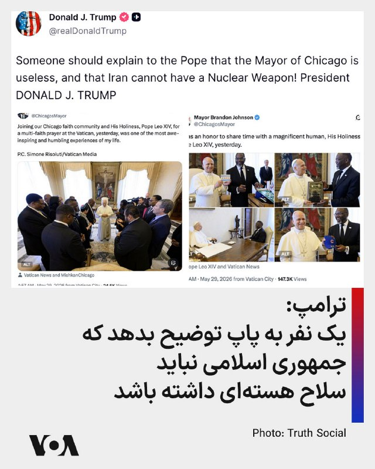

⚡️دونالد ترامپ، رئيس‌جمهوری آمریکا ضمن بازنشر تصاویری از دیدار شهردار شیکاگو، برندون جانسون، با پاپ، در شبکه تروت‌سو‌شال نوشت «یک نفر باید به پاپ توضیح دهد که شهردار شیکاگو بی‌عرضه‌ است و [جمهوری اسلامی] ایران نباید سلاح هسته‌ای داشته باشد!»
@FarsiVOA

## Persian_Trend_Official — post 15354

  <a href="telegram/content/Persian_Trend_Official_15354_1780177279.webm" target="_blank">🎬 Download video</a>

تصویری از مین دریایی (به نظر مهام ۳) در آب های عمان تنگه هرمز

👺Phantom

📌 @persian_trend_official
پرشین ترند | متفاوت‌ترین کانال نظامی

## IranianMinds — post 21093

  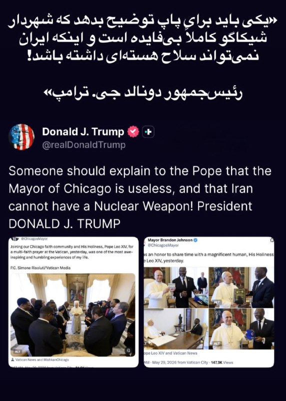

ترامپ دیگه کسخل شده و داره هرچیزیو تو توییتاش و حرفاش ربط میده به ایران و سلاح هسته ای

@IranianMinds

## BBCPersian — post 282451

  

🔻ارتش آمریکا اعلام کرد که روز جمعه به موتورخانه یک کشتی که در تلاش بود از محاصره دریایی ایران عبور کند، موشک شلیک کرده است.

فرماندهی مرکزی آمریکا (سنتکام) روز شنبه در بیانیه‌ای اعلام کرد که یک موشک هلفایر به موتورخانه کشتی «لیان استار» با پرچم گامبیا شلیک کرده است. به گفته سنتکام، این کشتی در آب‌های بین‌المللی به سمت یکی از بنادر ایران در خلیج عمان در حرکت بود.

سنتکام می‌گوید که پیش از حمله، نیروهای آمریکایی با «بیش از ۲۰ بار هشدار»، به کشتی اطلاع دادند که در حال نقض محاصره دریایی آمریکا علیه ایران است.

به گفته سنتکام، این کشتی «دیگر به سمت ایران در حرکت نیست»، اما جزئیات بیشتری ارائه نشده است.

سنتکام روز جمعه اعلام کرده بود که از زمان آغاز محاصره دریایی در ۱۳ آوریل، دست‌کم مسیر ۱۱۵ کشتی را تغییر داده است.

📸Handout Photo by the U.S. Navy via Getty Images عکس تزیینی
https://trib.al/BOWRLVu
@BBCPersian

## BBCPersian — post 282450

🔻آمریکا بریتانیا و استرالیا، فناوری شناور‌های هدایت‌پذیر را توسعه می‌دهند

آمریکا، بریتانیا و استرالیا می‌گویند که قصد دارند در چارچوب پیمان نظامی سه‌جانبه خود، موسوم به آکوس، فناوری شناور‌های هدایت‌پذیر (شهپاد) را توسعه دهند. هدف از این اقدام، محافظت از کابل‌های زیرآبی و تقویت دفاعی عنوان شده است.

انتظار می‌رود که فناوری خودروی زیرآبی بدون سرنشین تا سال آینده آماده شود.

هزینه کل این پروژه اعلام نشده است، اما جان هیلی، وزیر دفاع بریتانیا، گفت که این کشور ۲۰۱ میلیون دلار به این پروژه کمک خواهد کرد.

وزرای دفاع آمریکا، بریتانیا و استرالیا این تصمیم را در اجلاس امنیتی مجمع شانگری-لا در سنگاپوراعلام کردند؛ در حالی که پیش از آن انتقادهایی در مورد پیشرفت کند پروژه‌های آکوس منتشر شده بود.

آقای هیلی با اذعان به این انتقادات گفت: «ما مدتی طولانی در آکوس، بیشتر صحبت می‌کردیم و خیلی کم عمل می‌کردیم اما این وضعیت اکنون تغییر کرده است.»

بر اساس پیمان دفاعی آکوس که در سال ۲۰۲۱ آغاز شد، سه عضو پیمان، فناوری زیردریایی‌های هسته‌ای را توسعه می‌دهند و تخصص‌های نظامی خود را به اشتراک می‌گذارند.

این پیمان عموما به عنوان اقدامی برای مقابله با حضور دریایی رو به رشد چین در اقیانوس‌های هند و آرام دیده می‌شود و همینطور گامی در برابر تنش فزاینده در سرزمین‌های مورد مناقشه این منطقه مانند دریای چین جنوبی.

https://trib.al/M2XjY1u
@BBCPersian

## BBCPersian — post 282449

  <a href="https://t.me/bbcpersian/282449" target="_blank">📎 Download file</a>

📻پادکست برنامه شصت دقیقه شنبه ۹ خرداد ۱۴۰۵

این نسخه رادیویی برنامه شصت دقیقه تلویزیون فارسی بی‌بی‌سی است که هرشب بعد از پخش، با حجم کم از اپلیکیشن‌های پادگیر و صفحه تلگرام بی‌بی‌سی فارسی در دسترس است.

با هشتگ BBCPersianRadio# با ما در ارتباط باشید

 @BBCPersian

## Dirty_Kids — post 390601

  

‏کانفیگی که برام فرستادی دیگه کار نمی‌کنه، یکی دیگه می‌فرستی؟

@Dirty_Kids 👻

## Dirty_Kids — post 390600

  

چرا حضرت اقا جواب نمیدن؟ خدای نکرده اتفاق بدی براشون افتاده؟؟

@Dirty_Kids 👻

## Dirty_Kids — post 390599

  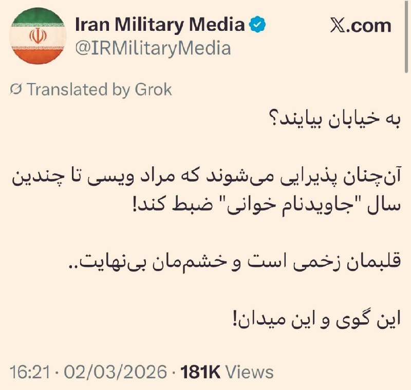

عرزشیا میخوان انتقام آمریکا رو از مردم بگیرن!

توییت زده: مردم جرعت دارن بیان خیابون، یه جوری قتل عام میکنیم که مراد ویسی تا چند سال طول بکشه اسم همه جاوید نام هارو بخونه!

@Dirty_Kids 👻

## Dirty_Kids — post 390597

  <a href="telegram/content/Dirty_Kids_390597_1780177282.mp4" target="_blank">🎬 Download video</a>

از وقتی اینترنت وصل شده مردم خیلی با فالووراشون احساس راحتی میکنن، رسما تو گالری ملتیم:

@Dirty_Kids 👻

## Dirty_Kids — post 390596

انقدر با لباس تکراری میرم سرکار هرکی تو مسیر منو میبینه دژاوو میشه.

@Dirty_Kids 👻

## Dirty_Kids — post 390595

  

خیلی کیری میشد شبیه گداها میشد

+ اینجا برعکس لباس‌شان که شخصی بود مادرشان عمومی بود 💔

@Dirty_Kids 👻

## alonews — post 123834

  <a href="telegram/content/alonews_123834_1780177283.webm" target="_blank">🎬 Download video</a>

👈حزب الله: یه تانک اسرائیلی رو زدیم

✅ @AloNews خبر جنگ

## alonews — post 123833

  <a href="telegram/content/alonews_123833_1780177283.mp4" target="_blank">🎬 Download video</a>

👈صحبت های امشب عادل فردوسی‌پور در آپارات اسپورت

✅ @AloNews خبر جنگ

## alonews — post 123832

  <a href="telegram/content/alonews_123832_1780177285.webm" target="_blank">🎬 Download video</a>

👈نیروی هوایی ایالات متحده آمریکا برنامه دارد در قالب بودجه سال مالی ۲۰۲۷، تعداد ۱۵ فروند هواپیمای سوخت‌رسان KC-۴۶A Pegasus را به ارزش ۳.۵۲ میلیارد دلار خریداری کند

🔴با تحویل این ۱۵ فروند تعداد کل سوخت رسان‌های پگاسوس تحویلی به نیروی هوایی آمریکا به ۱۲۰ فروند می‌رسد و برنامه نهایی تحویل +۱۷۹ فروند است.

✅ @AloNews خبر جنگ

## alonews — post 123831

  <a href="telegram/content/alonews_123831_1780177285.webm" target="_blank">🎬 Download video</a>

👈ترامپ :
- یکی باید به پاپ بگه شهردار شیکاگو به درد نمی‌خوره، و ایران هم نباید بمب هسته‌ای داشته باشه!

✅ @AloNews خبر جنگ

## alonews — post 123830

  <a href="telegram/content/alonews_123830_1780177285.mp4" target="_blank">🎬 Download video</a>

👈کنایه مجری تلویزیون به تاخیر ۹ روزه در انتشار آمار تورم توسط مرکز آمار: اعداد را اعلام کنید یا نکنید مردم تورم را لمس می‌کنند

✅ @AloNews خبر جنگ

## alonews — post 123828

  <a href="telegram/content/alonews_123828_1780177286.webm" target="_blank">🎬 Download video</a>

👈حملات هوایی اسرائیل بر کفرجوز و شوکین در جنوب لبنان انجام شده است

✅ @AloNews خبر جنگ

## alonews — post 123827

  <a href="telegram/content/alonews_123827_1780177286.webm" target="_blank">🎬 Download video</a>

👈مدارس شمال اسرائیل فردا تعطیل اند و بنظر می‌رسد اسرائیل خودش را برای موج جدید و مرگبارتری از درگیری با حزب‌الله آماده می‌کند!

✅ @AloNews خبر جنگ

## alonews — post 123826

  <a href="telegram/content/alonews_123826_1780177286.webm" target="_blank">🎬 Download video</a>

👈به حداقل ۵ جهت به سمت فضای هوایی اوکراین، پهپادهای روسی Geran-2 پرتاب شده‌اند.

✅ @AloNews خبر جنگ

## alonews — post 123825

  <a href="telegram/content/alonews_123825_1780177286.webm" target="_blank">🎬 Download video</a>

👈 تصویری جدید و پربازدید از دونالد ترامپ درحال عزیمت به زمین گلف

✅ @AloNews خبر جنگ

## alonews — post 123824

  <a href="telegram/content/alonews_123824_1780177287.webm" target="_blank">🎬 Download video</a>

👈کابینه جنگ اسرائیل در ساعت ۲۲:۳۰ (به وقت محلی) تشکیل جلسه خواهد داد. در حال حاضر ارزیابی وضعیت در دفتر نخست‌وزیر است.

✅ @AloNews خبر جنگ

## alonews — post 123823

  <a href="telegram/content/alonews_123823_1780177287.webm" target="_blank">🎬 Download video</a>

👈معاون سیاسی سپاه: ایران بر تنگه هرمز مسلط شده و پس از ۵۰۰ سال، به موقعیتی دست یافته که حق مسلم مردم ایران است

✅ @AloNews خبر جنگ

---
📅 بروزرسانی: 1405/03/09 23:55
---

## VahidOOnLine — post 242950

  

علی شیرازی، رییس سازمان عقیدتی سیاسی انتظامی گفت: «بر عهد خود برای تداوم راه ولایت و مطالبه انتقام سخت از عاملان به شهادت رساندن رهبرمان پایبندیم.»

او افزود: «نهادهای مسئول باید پیگیری حقوقی و بین‌المللی این جنایت را در اولویت قرار داده و حکم الهی برای قاتلان امام شهید را در ملاعام اجرا کنند.»

شیرازی ادامه داد: «ملت ما تا زمان قصاص قاتلان امام خود و خروج کامل استکبار از منطقه، میدان‌های مبارزه را ترک نخواهند کرد.»
‌🏁 🇬🇧 IranintlTV

🤖 @VahidOOnLine

## VahidOOnLine — post 242949

  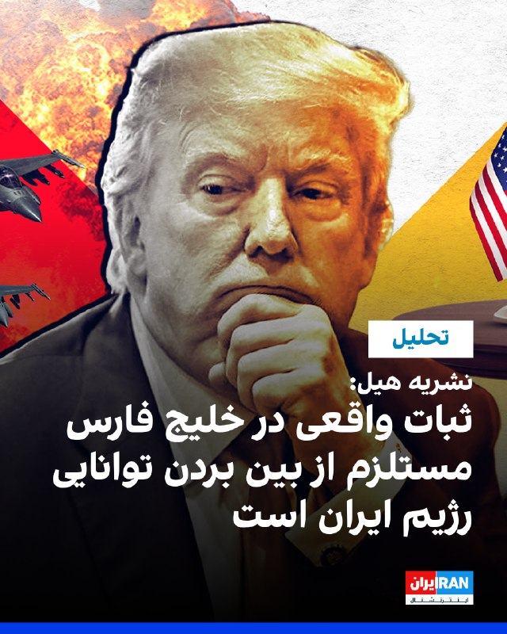

نشریه هیل نوشت ثبات واقعی در خلیج فارس مستلزم از بین بردن توانایی رژیم ایران برای تهدید تجارت جهانی، اعمال فشار بر همسایگان و گروگان گرفتن بازارهای انرژی است. هر چیزی کمتر از این، صرفا وقفه‌ای کوتاه پیش از رویارویی بسیار خطرناک‌تری خواهد بود.

آریل کوهن، پژوهشگر شورای آتلانتیک و نویسنده این تحلیل نوشته نقشه راهبردی خاورمیانه در حال تغییر است و به نظر می‌رسد نفوذ آمریکا در این منطقه رو به کاهش باشد.

او با اشاره به نزدیک شدن تهران و واشینگتن به یک توافق نوشته است برای کسانی که دهه‌هاست این منطقه را مطالعه می‌کنند، این وضعیت نمونه‌ای از «ربودن شکست از آغوش پیروزی» به نظر می‌رسد.

او در ادامه نوشته است تعیین اهداف روشن جنگی، پیش‌شرط ضروری پیروزی نظامی است. همان‌گونه که رییس‌جمهوری و وزیر خارجه آمریکا اعلام کرده‌اند، اهداف واشینگتن در این درگیری روشن بود: جلوگیری از دستیابی جمهوری اسلامی به سلاح هسته‌ای، تضعیف توان موشک‌های بالستیک ایران، و برچیدن یا دست‌کم تضعیف شبکه نیروهای نیابتی که تهران برای اعمال نفوذ در خاورمیانه ایجاد کرده است؛ از حماس در غزه و حزب‌الله در لبنان گرفته تا حوثی‌ها در یمن.
https://iranin
‌🏁 🇬🇧 IranintlTV

🤖 @VahidOOnLine

## VahidOOnLine — post 242948

  

♦️تیم فوتبال پاری‌سن‌ژرمن با پیروزی برابر آرسنال در فینال لیگ قهرمانان اروپا، برای دومین فصل متوالی عنوان قهرمانی این رقابت‌ها را به دست آورد.
این دیدار در وقت‌های قانونی و اضافه با تساوی ۱-۱ به پایان رسید؛ جایی که کای هاورتز در دقیقه ۵ آرسنال را پیش انداخت، اما عثمان دمبله در دقیقه ۶۵ از روی نقطه پنالتی کار را به تساوی کشاند تا بازی به وقت‌های اضافه کشیده شود.
در نهایت، سرنوشت قهرمان در ضربات پنالتی مشخص شد و پاری‌سن‌ژرمن با نتیجه ۴ بر ۳ به پیروزی رسید تا جام را بالای سر ببرد.
این نخستین بار از سال ۲۰۱۶ بود که فینال لیگ قهرمانان اروپا به وقت‌های اضافه کشیده می‌شد؛ دیداری که با هیجان بالا و رقابت نزدیک دو تیم، به یکی از به‌یادماندنی‌ترین فینال‌های سال‌های اخیر تبدیل شد.
‌🇸🇦 Indypersian

🤖 @VahidOOnLine

## VahidOOnLine — post 242947

  

منوچهر متکی، نماینده تهران در مجلس، در یک برنامه تلویزیونی گفت که آمریکایی‌ها هیچ نشانه‌ای از پذیرفتن شروط جمهوری اسلامی از خود نشان نداده‌اند.

متکی اضافه کرد: «علاوه بر آمریکا، کشورهای عربستان سعودی و امارات متحده عربی هم باید به ما غرامت بپردازند.»

او ادامه داد: «ترامپ ممکن است در میانه ۶۰ روز هم بازی دربیارود. یکی از محورهای اصلی ما در مذاکرات، دریافت غرامت است.»

او افزود: «پاکستانی‌ها باید مراقب باشند، شاید آمریکا کاری را که با پادشاه پیشین عمان انجام داد با پاکستان هم انجام دهد. در آن زمان خواستند عمان نامه‌ای به جمهوری اسلامی تحویل دهد و بعد ادعا کردند که ما چنین نامه‌ای ندادیم.
‌🏁 🇬🇧 IranintlTV

🤖 @VahidOOnLine

## WithYashar — post 12963

  <a href="telegram/content/WithYashar_12963_1780172731.mp4" target="_blank">🎬 Download video</a>

شاهزاده رضا پهلوی در اودسا:
کشور من از همه طرف ضربه خورده؛ از داخل توسط همین رژیم، و از بیرون هم به خاطر پیامدهای بی‌فکری خودش. با این حال، جمهوری اسلامی هنوز سر جاشه.
بعضی‌ها توی این جمع ممکنه اینو نشونه‌ی قدرت رژیم بدونن. من اینجام بگم که اینطور نیست.
این فقط نشونه‌ی اینه که دنیا هنوز نتیجه‌ی درست از چیزی که داره می‌بینه نگرفته.
پهپاد شاهد فرقی نمی‌کنه کجا باشه؛ چه یه ساختمون مسکونی، چه یه میدان اعتراض تو تهران، چه دفترهای تجاری تو دبی.
پهپادهایی که آسمون شهرهای اوکراین رو تاریک کردن، توی همون کارخانه‌هایی ساخته شدن که زیر نظر همون رژیمی هستن که توی تهران برای شکار معترض‌ها، توی خیابون‌ها پهپادهای نظارتی فرستاد.
@withyashar

## WithYashar — post 12962

پست جدید بوگاتی شاه https://www.instagram.com/reel/DY-ObumIJEK/?igsh=MjQ5cGt6dWo0dGg= کارای اداریش رو انجام بدید 💥

## WithYashar — post 12961

در پی حملات سنگین حزب‌الله، به بیمارستانی در شهر نهاریا در شمال اسرائیل دستور داده شد تا بیماران را به تأسیسات زیرزمینی منتقل کند.
@withyashar

## WithYashar — post 12960

شاهزاده رضا پهلوی: با جمهوری اسلامی توافق نکنید، بلکه به آن پایان دهید.
@withyashar

## WithYashar — post 12959

جلسه کمپ دیوید که قرار بود امروز برگزار شود ترامپ اعلام کرد: جلسه کابینه به دلیل شرایط آب و هوایی در کاخ سفید برگزار خواهد شد، نه در کمپ دیوید! حالا صحبت‌هایی هست که کمپ دیوید یک تله برای شناسایی فردی بود که اطلاعات را نشت می‌داد ! فرد مورد نظر گیر افتاد !…

## mwarmonitor — post 9923

  

🔴یک مین دریایی در آب‌های سرزمینی عمان در Strait of Hormuz مشاهده شده است. 🔹این موضوع مسیر آبی‌ای را که آمریکا برای اسکورت مخفیانه کشتی‌ها از آن استفاده می‌کرد، مسدود می‌کند. @mwarmonitor

## FoxNewsTwitter — post 342433

  

Fox News (Twitter/X)

Spencer Pratt keeps blasting his celebrity critics.

The Los Angeles mayoral candidate responded after 'Hacks' star Hannah Einbinder claimed money was the key issue for a lot of his supporters.

"She's in an elite minority and the rest of us want change," Pratt said.

## DEJradio — post 5163

  <a href="telegram/content/DEJradio_5163_1780172735.mp4" target="_blank">🎬 Download video</a>

👑
🔺 تجمع ایرانیان مقیم کلن در آلمان در حمایت از انقلاب شیروخورشید و جاویدنامان راه آزادی

#همبستگی #جاویدنامان #کلن
@DEJradio

## IranIntlTV — post 339788

  

علی شیرازی، رییس سازمان عقیدتی سیاسی انتظامی گفت: «بر عهد خود برای تداوم راه ولایت و مطالبه انتقام سخت از عاملان به شهادت رساندن رهبرمان پایبندیم.»

او افزود: «نهادهای مسئول باید پیگیری حقوقی و بین‌المللی این جنایت را در اولویت قرار داده و حکم الهی برای قاتلان امام شهید را در ملاعام اجرا کنند.»

شیرازی ادامه داد: «ملت ما تا زمان قصاص قاتلان امام خود و خروج کامل استکبار از منطقه، میدان‌های مبارزه را ترک نخواهند کرد.»
https://iranintl.com/202605304918

## IranIntlTV — post 339787

  <a href="telegram/content/IranIntlTV_339787_1780172737.mp4" target="_blank">🎬 Download video</a>

بنای یادبود لینکلن در واشینگتن میزبان تجمع ایرانیان و حامیان غیرایرانی جنبش دادخواهی بود.

این گردهمایی در گرامی‌داشت جان‌باختگان و در اعتراض به ادامه اعدام‌ها و سرکوب در ایران برگزار شد.

گزارش اردوان روزبه، خبرنگار ایران‌اینترنشنال و گفت‌وگو با سیامک آرام، برگزارکننده، و یکی از شرکت‌کنندگان
@iranintltv

## IranIntlTV — post 339786

  <a href="telegram/content/IranIntlTV_339786_1780172739.mp4" target="_blank">🎬 Download video</a>

در ادامه صدور احکام سنگین برای معترضان و زندانیان سیاسی، حکم اعدام بنیامین نقدی، از معترضان دی‌ماه، به اتهام «افساد فی‌الارض» صادر شده است. هم‌زمان، گزارش‌ها از تایید حکم اعدام رئوف شیخ‌معروفی و محمد فرجی، از بازداشت‌شدگان جنبش «زن، زندگی، آزادی»، در دیوان عالی کشور حکایت دارد.

جزییات بیشتر با پگاه بنی‌هاشمی، پژوهشگر ارشد حقوق
@iranintltv

## IranIntlTV — post 339785

  

نشریه هیل نوشت ثبات واقعی در خلیج فارس مستلزم از بین بردن توانایی رژیم ایران برای تهدید تجارت جهانی، اعمال فشار بر همسایگان و گروگان گرفتن بازارهای انرژی است. هر چیزی کمتر از این، صرفا وقفه‌ای کوتاه پیش از رویارویی بسیار خطرناک‌تری خواهد بود.

آریل کوهن، پژوهشگر شورای آتلانتیک و نویسنده این تحلیل نوشته نقشه راهبردی خاورمیانه در حال تغییر است و به نظر می‌رسد نفوذ آمریکا در این منطقه رو به کاهش باشد.

او با اشاره به نزدیک شدن تهران و واشینگتن به یک توافق نوشته است برای کسانی که دهه‌هاست این منطقه را مطالعه می‌کنند، این وضعیت نمونه‌ای از «ربودن شکست از آغوش پیروزی» به نظر می‌رسد.

او در ادامه نوشته است تعیین اهداف روشن جنگی، پیش‌شرط ضروری پیروزی نظامی است. همان‌گونه که رییس‌جمهوری و وزیر خارجه آمریکا اعلام کرده‌اند، اهداف واشینگتن در این درگیری روشن بود: جلوگیری از دستیابی جمهوری اسلامی به سلاح هسته‌ای، تضعیف توان موشک‌های بالستیک ایران، و برچیدن یا دست‌کم تضعیف شبکه نیروهای نیابتی که تهران برای اعمال نفوذ در خاورمیانه ایجاد کرده است؛ از حماس در غزه و حزب‌الله در لبنان گرفته تا حوثی‌ها در یمن.
https://iranin

## IranIntlTV — post 339784

  <a href="https://t.me/IranintlTV/339784" target="_blank">📎 Download file</a>

🎧نسخه صوتی چشم‌انداز: آیا اسرائیل از توافق ترامپ و جمهوری اسلامی پیروی می‌کند؟!
@iranintlTV

## IranIntlTV — post 339783

  

منوچهر متکی، نماینده تهران در مجلس، در یک برنامه تلویزیونی گفت که آمریکایی‌ها هیچ نشانه‌ای از پذیرفتن شروط جمهوری اسلامی از خود نشان نداده‌اند.

متکی اضافه کرد: «علاوه بر آمریکا، کشورهای عربستان سعودی و امارات متحده عربی هم باید به ما غرامت بپردازند.»

او ادامه داد: «ترامپ ممکن است در میانه ۶۰ روز هم بازی دربیارود. یکی از محورهای اصلی ما در مذاکرات، دریافت غرامت است.»

او افزود: «پاکستانی‌ها باید مراقب باشند، شاید آمریکا کاری را که با پادشاه پیشین عمان انجام داد با پاکستان هم انجام دهد. در آن زمان خواستند عمان نامه‌ای به جمهوری اسلامی تحویل دهد و بعد ادعا کردند که ما چنین نامه‌ای ندادیم.
https://iranintl.com/202605300571

## FarsiVOA — post 219124

🔺نخست وزیر لبنان از مذاکرات با اسرائیل دفاع کرد

▪️نواف سلام، نخست‌وزیر لبنان از مذاکرات با اسرائیل که روز جمعه در پنتاگون برگزار شد، دفاع کرد.

⬇️ بیشتر بخوانید:
https://ir.voanews.com/a/israel-lebanon-us-pentagon-negotiations-hezbollah-/8155608.html
@FarsiVOA

## FarsiVOA — post 219123

Farsi VOA pinned an audio file

## FarsiVOA — post 219122

🔺وزیر جنگ آمریکا می‌گوید «تنگه هرمز» باز می‌شود و عوارضی هم در کار نخواهد بود

▪️شبکه آمریکایی سی‌بی‌اس در گزارشی نوشت که موضوع بسته شدن تنگه هرمز به‌طور منظم در گفت‌وگوهای پیت هگست، وزیر دفاع آمریکا، با کشورهای دیگر در کنفرانس دفاعی شانگری‌لا در سنگاپور مطرح شد.

⬇️ بیشتر بخوانید:
https://ir.voanews.com/a/hormuz-strait-raised-in-talks/8155610.html
@FarsiVOA

## FarsiVOA — post 219121

  <a href="https://t.me/farsivoa/219121" target="_blank">📎 Download file</a>

🔴📢‌ پادکست خبری شنبه ۹ خرداد ۱۴۰۵

🛜در صورتی که با مشکل اینترنت مواجه هستید میتوانید اخبار صدای آمریکا را از نسخه‌های پادکست خبری ما روزانه دنبال کنید و یا اخبار را از نسخه سبک وب‌سایت ما پیگیر باشید:
https://ir.voanews.com/lite

📡بروزترین فرکانسهای ماهواره‌ای را نیز میتوانید از صفحه زیر پیگیری کنید:
https://ir.voanews.com/satellite

🔔دیگر شبکه‌های اجتماعی ما هم دنبال کنید:
https://linktr.ee/voafarsi

ما را به اشتراک بگذارید
@farsivoa

## DW_Farsi — post 125327

  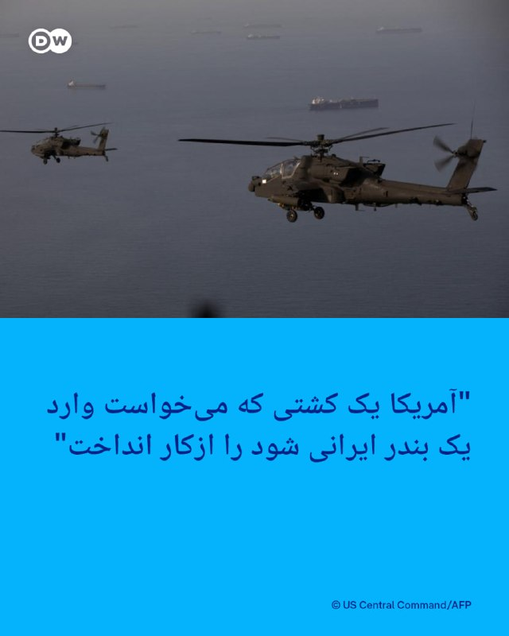

🔶 "آمریکا یک کشتی که می‌خواست وارد یک بندر ایرانی شود را ازکار انداخت"

آسوشیتدپرس به نقل از یک مقام مطلع آمریکا از وضعیت منطقه نوشت که ارتش این کشور یک کشتی تجاری دیگر را متوقف کرد که قصد شکستن محاصره بنادر ایران توسط ایالات متحده را داشت.

این مقام که نخواست نامش فاش شود به این خبرگزاری گفت، کشتی فله‌بر "لیان استار" (Lian Star) که با پرچم گامبیا حرکت می‌کرد شب گذشته هشتم خرداد (۲۹ مه) هشدارهای متعدد نیروهای آمریکایی را هنگام تلاش برای ورود به یک بندر ایرانی نادیده گرفت.

این مقام افزود که این کشتی توسط هواپیماهای آمریکایی در خلیج عمان از کار انداخته شده و در همان‌جا سرگردان است و نیروهای آمریکایی وارد عرشه نشده‌اند.

فرماندهی مرکزی ایالات متحده آمریکا (سنتکام) در پیام رسان ایکس نوشت: «پس از آنکه خدمه کشتی از تبعیت از دستورات خودداری کردند، یک هواپیمای آمریکایی با شلیک یک موشک AGM-114 Hellfire به اتاق موتور کشتی، آن را از کار انداخت. این کشتی دیگر به سمت ایران در حرکت نیست.»

@dw_farsi

## Persian_Trend_Official — post 15353

https://youtube.com/live/wwFLAgT9TwI?feature=share

## Persian_Trend_Official — post 15352

  <a href="telegram/content/Persian_Trend_Official_15352_1780172742.webm" target="_blank">🎬 Download video</a>

با تموم شدن فینال جام باشگاه ها و تبریک به طرفداران پاریسن ژرمن حدود 30 دقیقه دیگه لایو رو آغاز میکنیم

## IranianMinds — post 21091

  

🔴پست جدید ترامپ، باز هم به اوباما گیر داد.

@IranianMinds

## IranianMinds — post 21090

  <a href="telegram/content/IranianMinds_21090_1780172743.mp4" target="_blank">🎬 Download video</a>

کنسرت امشب کانیه وست
در فاصله ی ۲ ساعتیه ایران
ترکیه

- بختتو ایرانی

@IranianMinds

## IranianMinds — post 21089

  <a href="telegram/content/IranianMinds_21089_1780172744.mp4" target="_blank">🎬 Download video</a>

عادی ترین فن جمهوری اسلامی :

احمد ایراندوست : مشروبمو میخورم، کاباره‌مو میرم؛ دستبوس حاج قاسمم هستم

@IranianMinds

## BBCPersian — post 282448

🔻سنتکام: یک کشتی با پرچم گامبیا که در حال حرکت به سمت ایران بود را از کار انداختیم

فرماندهی مرکزی ارتش ایالات متحده اعلام کرده است که نیروهای آمریکایی دیروز(جمعه ۲۹ مه) در دریای عمان، با غیرفعال کردن یک کشتی که با پرچم گامبیا قصد داشت به سمت یک بندر ایرانی حرکت کند، محاصره دریایی را اعمال کردند.

سنتکام می‌گوید کشتی «ام‌‌‌وی لیان استار» را در حال عبور از آب‌های بین‌المللی به سمت یک بندر ایرانی در خلیج عمان دیدند و ضمن اطلاع به این کشتی درباره نقض محاصره دریایی ایالات متحده، بیش از ۲۰ هشدار صادر کردند.

این نهاد می‌گوید پس از آنکه خدمه کشتی از دستور سرپیچی کردند، یک هواپیمای آمریکایی با شلیک موشک هلفایر به موتورخانه، آن را از کار انداخت.

سنتکام گفته است:«این کشتی دیگر به سمت ایران در حال حرکت نیست.»

این نهاد همچنین گفته است: «نیروهای آمریکایی پنج کشتی تجاری را از کار انداخته و ۱۱۶ کشتی را مجبور به تغییر مسیر کرده‌اند تا محاصره را به طور کامل اجرا کنند، در حالی که آتش‌بس با ایران همچنان برقرار است.»

https://trib.al/MeCHPFh
@BBCPersian

## BBCPersian — post 282447

  <a href="telegram/content/BBCPersian_282447_1780172746.mp4" target="_blank">🎬 Download video</a>

🔻آخرین خبرهای مهم روز شنبه ۹ خرداد ۱۴۰۵

@BBCPersian

## Dirty_Kids — post 390594

  <a href="telegram/content/Dirty_Kids_390594_1780172748.mp4" target="_blank">🎬 Download video</a>

تنها امید شیرابه‌های بجا مانده از زباله‌ی جمهوری اسلامی، یاُس و ناامیدی ماست!
تراپی کنید ✌🏻

@Dirty_Kids 👻

## Dirty_Kids — post 390593

  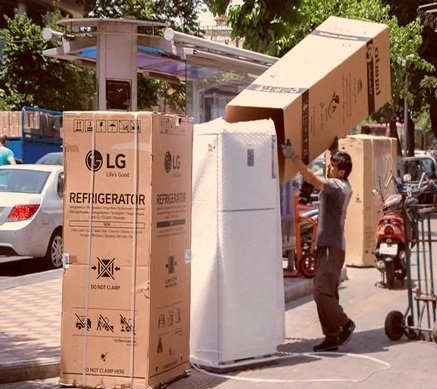

‏نام اثر؛
جدایی مجتبی از رهبر :))

@Dirty_Kids 👻

## Dirty_Kids — post 390592

  

نمیزارم اینو فراموش کنید

@Dirty_Kids 👻

## Hranews — post 113256

  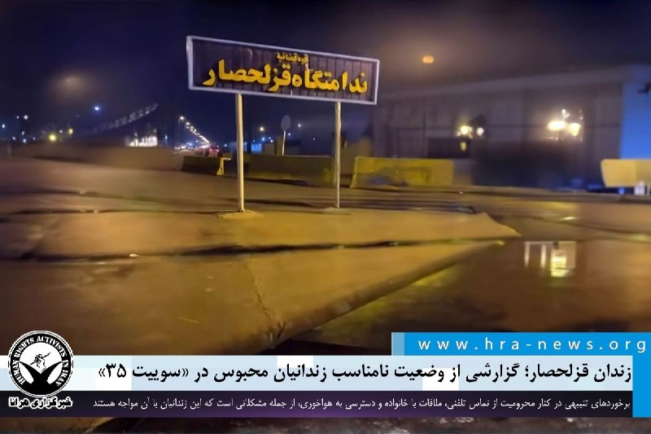

گزارشی از «سوئیت ۳۵» زندان قزل‌حصار؛ از ازدحام جمعیت تا محرومیت زندانیان از حقوق اولیه

❗️
❗️
❗️
❗️
❗️– «سوئیت ۳۵» در واحد ۳ زندان قزل‌حصار کرج، بخشی که پیش‌تر عمدتاً برای نگهداری زندانیان در شرایط انفرادی، قرنطینه و پیش از اجرای حکم اعدام مورد استفاده قرار می‌گرفت، در ماه‌های اخیر به محل نگهداری شمار زیادی از بازداشت‌شدگان تبدیل شده است. گزارش‌های دریافتی هرانا از تراکم جمعیت، محرومیت زندانیان از برخی حقوق، گزارش‌هایی از ضرب و شتم و نامناسب بودن شرایط نگهداری در این بخش حکایت دارد.

به گزارش خبرگزاری هرانا، ارگان خبری مجموعه فعالان حقوق بشر در ایران، افزایش شمار بازداشت‌ها به‌ویژه پس از اعتراضات و تحولات ماه‌های اخیر، به انتقال گسترده بازداشت‌شدگان به «سوییت ۳۵» #زندان_قزلحصار_کرج منجر شده است. گزارش‌های دریافتی هرانا از زندانیان سابق، خانواده‌ها و منابع مطلع، از تراکم شدید جمعیت، محرومیت از حقوق اولیه، برخوردهای خشونت‌آمیز و شرایط نامناسب نگهداری در این بند حکایت دارد.

یک زندانی که به‌تازگی از این بند آزاد شده، در گفت‌وگو با هرانا اظهار داشت: «پیش از این، سوییت‌ها عمدتاً برای نگهداری محدود یا انفرادی پیش از اجرای حکم اعدام مورد استفاده قرار می‌گرفت، اما با افزایش بازداشت‌ها، در برخی موارد بیش از ۱۰ نفر در سلول‌هایی با مساحت حدود ۱۲ متر مربع نگهداری می‌شدند؛ به‌گونه‌ای که #زندانیان به سختی امکان استراحت داشتند.»

ادامه مطلب

↘️
@hranews_bot تماس ✉️ - @Hranews کانال هرانا 🆑

## Hranews — post 113255

گزارشی از تجمع اعتراضی پرستاران در یزد

❗️
❗️
❗️
❗️
❗️– امروز شنبه، شماری از #پرستاران ساکن در یزد با برگزاری تجمع اعتراضی خواستار رسیدگی به مطالبات خود شدند.

ادامه مطلب

↘️
@hranews_bot تماس ✉️ - @Hranews کانال هرانا 🆑

## Hranews — post 113254

در هشتمین روز بازداشت؛ تداوم بی خبری از وضعیت زهرا محمدولی در دهلران

❗️
❗️
❗️
❗️
❗️– زهرا محمدولی، شهروند ساکن دهلران، هشت روز است که توسط نیروهای امنیتی در این شهرستان #بازداشت شده‌ و کماکان از محل نگهداری وی اطلاعی حاصل نشده است. بی‌خبری از سرنوشت این شهروند، افزایش نگرانی‌های خانواده و بستگان او را در پی داشته است.

ادامه مطلب

#زهرا_محمدولی

↘️
@hranews_bot تماس ✉️ - @Hranews کانال هرانا 🆑

## alonews — post 123822

  <a href="telegram/content/alonews_123822_1780172750.webm" target="_blank">🎬 Download video</a>

👈سخنگوی وزارت خارجه: میدان و دیپلماسی دوشادوش هم آماده برای هر وضعیتی

🔴 سخنگوی ارتش: امروز دیپلماسی و میدان نزدیک‌تر و هماهنگ‌تر از هر زمانی در مسیر تحقق منافع و عزت ملی کشور می‌کوشند

✅ @AloNews خبر جنگ

## alonews — post 123820

  <a href="telegram/content/alonews_123820_1780172750.mp4" target="_blank">🎬 Download video</a>

👈امروز یه مین دریایی ایرانی نزدیک سواحل عمان تو تنگه هرمز پیدا شده

✅ @AloNews خبر جنگ

## alonews — post 123819

  <a href="telegram/content/alonews_123819_1780172751.webm" target="_blank">🎬 Download video</a>

👈سخنگوی کمیسیون امنیت ملی:
پیشرفت‌هایی در مذاکرات وجود دارد و ما این را انکار نمی‌کنیم، اما باید مراقب باشیم

✅ @AloNews خبر جنگ

## alonews — post 123818

  <a href="telegram/content/alonews_123818_1780172751.webm" target="_blank">🎬 Download video</a>

👈ترامپ در تروث‌سوشال: موزه ریاست جمهوری اوباما

✅ @AloNews خبر جنگ

## alonews — post 123817

💔جاویدنام حديثه اكبرزاده ، 18 دی در فرديس كرج با شليک مستقیم گلوله به سينه‌اش آسمانی شد.

🤔عرزشی حرام زاده این دختر ایرانی تروریست بود؟ ظلم پایدار نیست به وقتش سر عزیزان شما هم میاد.

✅@AloNews

## alonews — post 123816

  <a href="telegram/content/alonews_123816_1780172752.mp4" target="_blank">🎬 Download video</a>

👈بن گویر، وزیر امنیت ملی اسرائیل:
«باید بیروت را صاف کنیم!»

✅ @AloNews خبر جنگ

## alonews — post 123815

  <a href="telegram/content/alonews_123815_1780172753.webm" target="_blank">🎬 Download video</a>

👈سخنگوی کمیسیون امنیت ملی: محاصره دریایی یا با زور یا با مذاکره پایان خواهد یافت

✅ @AloNews خبر جنگ

## alonews — post 123814

سخنگوی کمیسیون امنیت ملی: محاصره دریایی یا با زور یا با مذاکره پایان خواهد یافت

## alonews — post 123813

  <a href="telegram/content/alonews_123813_1780172754.webm" target="_blank">🎬 Download video</a>

👈ارتش: هرگونه تعرض به خاک کشور پاسخ محکم‌تر از گذشته را دارد

✅ @AloNews خبر جنگ

## alonews — post 123812

  <a href="telegram/content/alonews_123812_1780172754.webm" target="_blank">🎬 Download video</a>

👈خبرنگار الحدث: درگیری‌های شدید بین حزب‌الله و نیروهای اسرائیلی در داخل شهرک دبین در جنوب لبنان

✅ @AloNews خبر جنگ

## alonews — post 123811

  <a href="telegram/content/alonews_123811_1780172754.mp4" target="_blank">🎬 Download video</a>

👈وضعیت سد کرج طی سه ماه اخیر

✅ @AloNews خبر جنگ

## alonews — post 123810

  <a href="telegram/content/alonews_123810_1780172755.webm" target="_blank">🎬 Download video</a>

👈 اظهارات عجیب مشاور قالیباف درباره مذاکرات ایران و آمریک

🔴توافق صرفاً یک تاکتیک برای خرید زمان و منابع است نه استراتژی صلح‌طلبانه

🔴توافقی وجود ندارد!

✅ @AloNews خبر جنگ

## alonews — post 123809

  <a href="telegram/content/alonews_123809_1780172756.mp4" target="_blank">🎬 Download video</a>

ویدیوی ویرال شده از حرکت ورزشی یه پسر جوون توی ایران که شاهکار خلق کرده🔥

[@AloTweet]

---
📅 بروزرسانی: 1405/03/09 22:50
---

## VahidOOnLine — post 242946

  <a href="telegram/content/VahidOOnLine_242946_1780168850.mp4" target="_blank">🎬 Download video</a>

♦️گزارش‌های متعددی از شنیده شدن صدایی مهیب در ماساچوست آمریکا، که شهروندان در فضای مجازی آن را «شبیه به انفجار» توصیف کرده‌اند منتشر شده است. بر اساس این گزارش‌ها و تصاویر دوربین‌های مداربسته که این لحظه را ثبت کرده‌اند، صدای «انفجارمانند» در بخش‌های مختلف شهرستان بوستون در ایالت ماساچوست شنیده شده است. به گزارش «میرور» همزمان با شنیده شدن این صدا که حدود ساعت ۲:۳۰ به وقت ساحل شرقی آمریکا رخ داد، سامانه‌های ماهواره‌ای هواشناسی، یک نور لحظه‌ای بزرگ را نیز در همان محدوده ثبت کردند. هنوز منابع رسمی جزئیاتی درباره این حادثه اعلام نکرده‌اند.

روز گذشته نیز حادثه مشابهی در کارولینای جنوبی رخ داد. شبکه ان‌بی‌سی گزارش داد که صدها نفر در این ایالت صدای انفجاری که به «بمب صوتی» شباهت داشت را شنیدند. با این حال، سازمان زمین‌شناسی آمریکا اعلام کرد که این صدا ناشی از زمین‌لرزه نبوده و ناسا نیز اعلام کرد که پرتاب موشک یا سقوط شهاب‌سنگ نیز اتفاق نیفتاده است.
‌🇸🇦 Indypersian

🤖 @VahidOOnLine

## VahidOOnLine — post 242945

  

♦️ فرماندهی مرکزی آمریکا (سنتکام)، روز شنبه نهم خرداد با انتشار بیانیه‌ای رسمی تایید کرد که نیروهای ارتش این کشور در دریای عمان، یک کشتی باری با پرچم گامبیا را که قصد داشت محاصره دریایی بنادر ایران را بشکند، هدف قرار داده و زمین‌گیر کرده‌اند.

بر اساس این بیانیه، نیروهای سنتکام کشتی تجاری «لیان استار» (M/V Lian Star) را در حال حرکت به سمت یکی از بنادر ایران رصد کرده و بیش از ۲۰ بار به آن هشدار دادند که در حال نقض محاصره دریایی ایالات متحده است. در پی بی‌توجهی خدمه کشتی به این هشدارهای مکرر، یک جنگنده آمریکایی با شلیک یک فروند موشک «هل‌فایر» به اتاق موتور کشتی، این شناور را از کار انداخت و مانع از ادامه مسیر آن به سمت ایران شد.

سنتکام در پایان اشاره کرد که با وجود برقراری آتش‌بس با ایران، نیروهای آمریکایی برای اجرای کامل محاصره دریایی، تاکنون ۵ کشتی تجاری را زمین‌گیر کرده و ۱۱۶ کشتی دیگر را مجبور به تغییر مسیر کرده‌اند.
‌🇸🇦 Indypersian

🤖 @VahidOOnLine

## VahidOOnLine — post 242944

  

حبیب‌الله سیاری، معاون هماهنگ‌کننده ارتش جمهوری اسلامی گفت: «امروز نیروی دریایی و دیگر نیروهای نظامی کشور از پیشرفته‌ترین تجهیزات منطبق با فناوری‌های نوین برخوردار هستند.»

او افزود: «دشمن بداند هر گونه تعرض به خاک کشور پاسخ محکم‌تر از گذشته دریافت خواهد کرد.»
‌🏁 🇬🇧 IranintlTV

🤖 @VahidOOnLine

## VahidOOnLine — post 242943

  

سنتکام، فرماندهی مرکزی ایالات متحده آمریکا، اعلام کرد که نیروهای ارتش آمریکا پنج‌شنبه ۸ خرداد، کشتی ام‌وی لیان استار با پرچم گامبیا را که در حال حرکت به سوی یکی از بنادر ایران بود، با شلیک موشک به موتور آن از کار انداختند.

سنتکام افزود که بیش از ۲۰ بار به این کشتی هشدار و اطلاع داده شده بود که در حال نقض محاصره اعمال‌شده از سوی ایالات متحده است.

فرماندهی مرکزی ایالات متحده نوشت: «پس از آن که خدمه «لیان استار» از تبعیت از دستورات خودداری کردند، یک جنگنده آمریکایی با شلیک یک موشک هلفایر به اتاق موتور کشتی، آن را از کار انداخت. این کشتی دیگر به مسیر خود به سمت ایران ادامه نمی‌دهد.»

سنتکام در پایان نوشت: «نیروهای آمریکایی اعلام کردند که تاکنون پنج کشتی تجاری را از کار انداخته و مسیر ۱۱۶ کشتی دیگر را برای اجرای کامل محاصره تغییر داده‌اند؛ این اقدامات در حالی انجام می‌شود که آتش‌بس با جمهوری اسلامی همچنان برقرار است.»
‌🏁 🇬🇧 IranintlTV

🤖 @VahidOOnLine

## VahidOOnLine — post 242942

  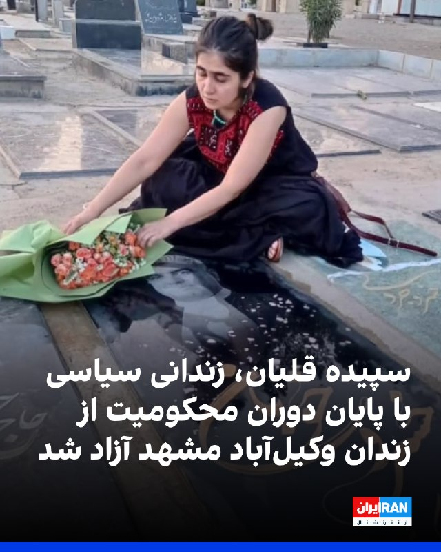

سایت هرانا گزارش داد سپیده قلیان، زندانی سیاسی، پس از پایان دوران محکومیت خود از زندان وکیل‌آباد مشهد آزاد شد. قلیان که در جریان مراسم هفتم خسرو علی‌کردی، وکیل دادگستری جان‌باخته، دستگیر شده بود، با انتشار پستی در اینستاگرام، تصویری از حضور خود بر سر مزار خسرو علی‌کردی منتشر کرد.

قلیان در این پست نوشت: «با خودم قرار گذاشته‌ام از هرچه خسته می‌شوم بشوم، اما از رسیدن به آزادی و حمل کردن این سنگ‌های سخت حقیقت «نه». برای همین رفتار داعش‌گونه جمهوری اسلامی در مراسم خسرو نباید و نمی‌تواند بگذارد که سنگ نیمه‌ تمامم در آذر ۱۴۰۱ را، زمین بگذارم.»
‌🏁 🇬🇧 IranintlTV

🤖 @VahidOOnLine

## VahidOOnLine — post 242941

  

♦️ آسمان شب یکشنبه‌شب، دهم خرداد، میزبان یک رویداد نجومی نادر به نام «ریزماه آبی» (Blue Micromoon) خواهد بود؛ پدیده‌ای که در آن، ماه کامل در دورترین فاصله خود از زمین قرار می‌گیرد و کوچک‌تر و کم‌نورتر از همیشه دیده می‌شود. علاوه بر این، ستاره درخشان «قلب‌العقرب» (Antares) نیز در این نمایش آسمانی حضور خواهد داشت.

ماه آبی زمانی رخ می‌دهد که دو ماه کامل در یک ماه میلادی شکل بگیرند (نخستین ماه کامل این ماه در ۱ مه دیده شد). از سوی دیگر، به دلیل مدار بیضوی ماه، این بار قمر زمین در فاصله ۴۰۶,۱۳۵ کیلومتری قرار دارد که باعث می‌شود ۶ درصد کوچک‌تر و ۱۰ درصد کم‌نورتر از یک ماه کامل معمولی به نظر برسد. برخلاف نامش، این ماه تغییر رنگ نخواهد داد.

نکته جذاب‌تر این رویداد، پدیده «اختفا» برای رصدگران نیم‌کره جنوبی (مانند استرالیا، نیوزیلند، شیلی و آرژانتین) است؛ جایی که ریزماه آبی برای مدتی کوتاه از مقابل ستاره غول‌پیکر سرخ «قلب‌العقرب» در صورت فلکی کژدم عبور کرده و آن را پنهان می‌کند. در سایر نقاط جهان، این ستاره سرخ در تمام طول شب در کنار ماه کامل قابل رویت خواهد بود.
‌🇸🇦 Indypersian

🤖 @VahidOOnLine

## WithYashar — post 12958

  

به ادعای آمریکا در جریان این جنگ، دست‌کم ۱۶۰ شناور دریایی ایران را غرق کرده است. هر یک از این شناورها می‌تواند منبعی بالقوه برای آلودگی باشد. وقوع یک نشت جدی در تنگه، مهار آن را بسیار دشوارتر از حالت معمول خواهد کرد
@withyashar

## WithYashar — post 12957

## WithYashar — post 12956

یاشار امشب ردبول رومی خوری؟

## WithYashar — post 12955

سنتکام اعلام کرد کشتی تجاری Lian Star که از یک بندر ایران خارج شده بود پس از 20 هشدار توقف و عدم توجه آن توسط یک هواپیمای آمریکایی با شلیک موشک هلفایر به اتاق موتور کشتی، آن را از کار انداخت و در دریای عمان توقیف شد.
@withyashar

## WithYashar — post 12954

پست جدید بوگاتی شاه

https://www.instagram.com/reel/DY-ObumIJEK/?igsh=MjQ5cGt6dWo0dGg=
کارای اداریش رو انجام بدید 💥

## WithYashar — post 12952

صداوسیما جزئیات غیررسمی از یادداشت تفاهم (ایران و آمریکا) را منتشر کرد
‌
یکی از مهمترین محورهای توافق (ایران و آمریکا) بازتعریف قواعد عبور و مرور در تنگه هرمز است

‌ایران مرجع انحصاری تشخیص ماهیت شناورهای عبوری است

هر شناوری که محموله آن تهدید آمیز تلقی شود یا بهره‌بردار نهایی آن در خصومت با ایران باشد به عنوان کشتی تجاری شناخته نمی‌شود و اجازه عبور از مسیرهای تعریف شده را ندارد

تعیین مسیر حرکت و تعیین هزینه خدمات ناوبری در حوزه تصمیم‌گیری ایران دیده شده
‌
هر شناور موظف است اطلاعاتش را در اختیار مرکز مرتبط با نیروی دریایی قرار دهد و فرم‌هایی شامل جزئیات محموله مالکیت و مقصد را تکمیل کند
@withyashar

## mwarmonitor — post 9922

🔴 یک مقام آمریکایی: یک کشتی تجاری که تلاش داشت به سمت یک بندر ایرانی حرکت کند، متوقف شد. 🔸این نفتکش/کشتی با نام «لیان استار» هشدارهای نیروهای دریایی ما در خلیج عمان را نادیده گرفته بود. @mwarmonitor

## mwarmonitor — post 9921

🔴«جناح تندرو در ایران، گروهی حاشیه‌ای اما پرسر و صدا که اعضایی در مجلس و یک کرسی در شورای عالی امنیت ملی دارد، به‌طور علنی با هرگونه امتیازدهی به واشینگتن مخالفت کرده و با استفاده از تجمع‌ها، رسانه‌های دولتی و فشارهای پشت‌پرده تلاش می‌کند یک توافق را به شکست بکشاند.» وال‌استریت ژورنال

@mwarmonitor

## FoxNewsTwitter — post 342432

  <a href="telegram/content/FoxNewsTwitter_342432_1780168858.mp4" target="_blank">🎬 Download video</a>

Fox News (Twitter/X)

Grab your tissues — you're going to need them.

Footage from a high school graduation in Milwaukee captures the emotional moment a U.S. military specialist reunites with her brother after more than a year apart, as she personally hands him his diploma after serving overseas during the conflict in Iran.

## pm_afshaa — post 91908

🟠سنتکام از حمله موشکی به موتور خانه یک ابر نفتکش ایرانی حامل نفت در دریای عمان خبر داد

💧 Rainbet.com the #1 Non-KYC Crypto Casino & Sportsbook @rainbetcom

😁 @Pm_Afshaa

## pm_afshaa — post 91907

پاریسی‌ها قهرمان لیگ قهرمانان اروپا در فصل ۲۰۲۵-۲۰۲۶ شدن.
پاریسن‌ژرمن 1 - 1 آرسنال
پنالتی: 4 - 3

💧Rainbet.com the #1 Non-KYC Crypto Casino & Sportsbook @rainbetcom

😁 @Pm_Afshaa

## pm_afshaa — post 91906

  <a href="telegram/content/pm_afshaa_91906_1780168860.webm" target="_blank">🎬 Download video</a>

🔴آسوشیتدپرس:
نیروهای آمریکا یک کشتی که قصد ورود به بنادر ایران رو داشت، از کار انداختن.

💧 Rainbet.com the #1 Non-KYC Crypto Casino & Sportsbook @rainbetcom

😁 @Pm_Afshaa

## pm_afshaa — post 91905

🔴سخنگوی دولت: دولت پول بازسازی خونه هایی که تو جنگ تخریب شده رو نمیده. ولی بهتون مجوز میدیم تا خونتون رو بازسازی کنید

💧 Rainbet.com the #1 Non-KYC Crypto Casino & Sportsbook @rainbetcom

😁 @Pm_Afshaa

## pm_afshaa — post 91904

  

بنیامین نقدی به اعدام محکوم شد

💧 Rainbet.com the #1 Non-KYC Crypto Casino & Sportsbook @rainbetcom

😁 @Pm_Afshaa

## iaghapour — post 2645

  

🚀 سرور ابری رو از هر جای دنیا و با هر ارزی که دوست داری بخر!

🌍 دیگه نیازی نیست برای خرید سرور از دیتاسنترهای معتبر جهانی دغدغه پرداخت یا محدودیت لوکیشن داشته باشی. در دوپراکس (Doprax)، بهترین زیرساخت‌های ابری دنیا در یک پنل اختصاصی زیر دست شماست!

با دوپراکس می‌تونی از غول‌های تکنولوژی مثل Google Cloud, DigitalOcean, Hetzner, Vultr و چندین پروایدر دیگر، سرور تهیه کنی.

✨ چرا دوپراکس بهترین انتخاب شماست؟
📍 تنوع لوکیشن: دسترسی به ده‌ها لوکیشن مختلف در اروپا، آمریکا، آسیا.
💳 پرداخت بدون مرز: امکان پرداخت آسان با ریال و یا رمزارز.
⏱️ پرداخت ساعتی: فقط به اندازه‌ای که مصرف می‌کنی پول بده!
🔄 امکان تعویض IP: قابلیت تغییر آی‌پی در اکثر دیتاسنترها.

همین حالا وارد سایت شو و اولین سرورت رو با کانفیگ دلخواهت بساز 👇

🌐 وب‌سایت: www.doprax.com

💬 پشتیبانی و اخبار در کانال ما:
@dopraxcloud

## DEJradio — post 5162

  <a href="telegram/content/DEJradio_5162_1780168862.mp4" target="_blank">🎬 Download video</a>

🚨🎥 پرواز جنگنده‌های نهاجا بر فراز تهران و کرج

#جنگنده #جنگ
@DEJradio

## DEJradio — post 5161

  <a href="telegram/content/DEJradio_5161_1780168865.mp4" target="_blank">🎬 Download video</a>

👑
🔺 حمایت هم‌میهنان ساکن اسپانیا از انقلاب شیر و خورشید؛
"بوی نفت ارزان نمی‌گذارد بوی خون مردم ایران به مشام شما برسد!

#همبستگی #اسپانیا
@DEJradio

## DEJradio — post 5160

  <a href="telegram/content/DEJradio_5160_1780168867.webm" target="_blank">🎬 Download video</a>

👑
🚨 ترجمه زیرنویس سخنرانی شاهزاده رضا پهلوی در نشست امنیتی «دریای سیاه» در اودسا - اوکراین

#شاهزاده_رضا_پهلوی #اودسا #نشست_امنیتی_دریای_سیاه

@DEJradio

## DEJradio — post 5159

  <a href="telegram/content/DEJradio_5159_1780168868.mp4" target="_blank">🎬 Download video</a>

🚨
🔸 خبر ۲۱
شنبه ۹ خرداد ۱۴۰۵

#خبر۲۱
@DEJradio

## VahidOnline — post 75807

  

ستاد فرماندهی مرکزی ارتش آمریکا، سنتکام، اعلام کرد نیروهای این کشور یک کشتی تجاری با پرچم گامبیا را که به گفته واشینگتن در نقض محاصره دریایی به سمت یکی از بنادر ایران در حرکت بود، در خلیج عمان هدف قرار داده و از ادامه مسیر آن جلوگیری کرده‌اند.

سنتکام روز شنبه نهم خرداد در بیانیه‌ای گفت نیروهای آمریکایی روز هشتم خرداد کشتی «لیان استار» را هنگام حرکت در آب‌های بین‌المللی به سوی یکی از بنادر ایران شناسایی کردند و بیش از ۲۰ بار به خدمه آن هشدار دادند.

به گفته این نهاد نظامی، پس از آنکه خدمه کشتی به هشدارها توجه نکردند، یک هواپیمای آمریکایی با شلیک موشک هلفایر به اتاق موتور کشتی، آن را از کار انداخت.

سنتکام افزود این کشتی دیگر به سمت ایران در حرکت نیست.

در این بیانیه آمده است که از زمان اجرای محاصره دریایی علیه ایران، نیروهای آمریکایی پنج کشتی تجاری را از کار انداخته و ۱۱۶ کشتی دیگر را وادار به تغییر مسیر کرده‌اند.

سنتکام جزئیات بیشتری درباره محموله کشتی یا مقصد دقیق آن در ایران ارائه نکرده است.
@VahidHeadline

📡 @VahidOnline

## VahidOnline — post 75806

  

صداوسیمای جمهوری اسلامی در گزارشی درباره تفاهم احتمالی بین تهران و واشینگتن با عنوان «جزئیات غیررسمی»، اعلام کرد آمریکا متعهد شده در طول ۶۰ روز امکان دسترسی جمهوری اسلامی به ۱۲ میلیارد دلار از دارایی‌ها را به‌گونه‌ای فراهم کند که این منابع قابلیت انتقال و هزینه‌کرد در بانک‌های مقصد را بدون محدودیت داشته باشد.

این گزارش افزود که بر اساس این تفاهم، جمهوری اسلامی مرجع انحصاری تشخیص ماهیت شناورهای عبوری است و هر شناوری که محموله آن تهدیدآمیز شناخته شود یا بهره‌بردار نهایی آن در «خصومت» با جمهوری اسلامی باشد، به عنوان کشتی تجاری شناخته نشده و اجازه عبور از مسیرهای تعریف‌شده را ندارد.

صدا و سیما تاکید کرد که این رونوشت هنوز در حکم یک تفاهم غیررسمی است چون مسیر آن همچنان در چرخه بررسی، مذاکره و بازبینی قرار دارد.
@VahidOOnLine

📡 @VahidOnline

## IranIntlTV — post 339782

  <a href="telegram/content/IranIntlTV_339782_1780168873.mp4" target="_blank">🎬 Download video</a>

آیا اسرائیل از توافق ترامپ و جمهوری اسلامی پیروی می‌کند؟!

«چشم‌انداز با مهدی مهدوی‌آزاد»

تماشای نسخه کامل این برنامه در یوتیوب:
https://youtu.be/QmU1ZoGEThE

@iranintltv

## IranIntlTV — post 339781

  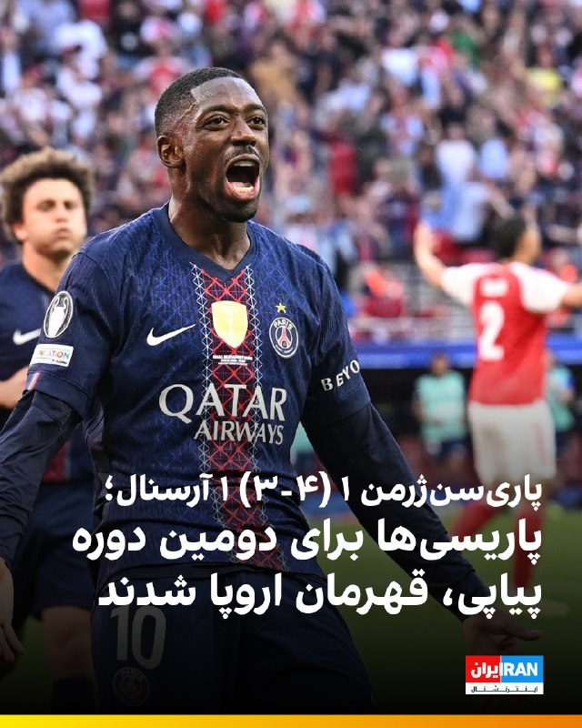

🔻تیم فوتبال پاری‌سن‌ژرمن در فینال لیگ قهرمانان اروپا، آرسنال را شکست داد و برای دومین فصل پیاپی، قهرمان اروپا شد. این بازی در وقت قانونی و اضافه به تساوی یک - یک رسید.

🔹تک گل آرسنال را کای هاورتز (۵) و گل پاری‌سن‌ژرمن را عثمان دمبله (۶۵) از روی نقطه پنالتی به ثمر رساندند.

🔹در نهایت پاری‌سن‌ژرمن در ضربات پنالتی، با نتیجه چهار بر سه، توپچی‌ها را شکست داد و قهرمان اروپا شد.

🔹برای اولین بار از سال ۲۰۱۶ فینال لیگ قهرمانان به وقت‌های اضافه کشیده شد.

@iranintltvsport

## IranIntlTV — post 339780

  <a href="telegram/content/IranIntlTV_339780_1780168877.mp4" target="_blank">🎬 Download video</a>

قرارگاه مرکزی خاتم‌الانبیا اعلام کرد کشتی‌ها، شناورهای تجاری و نفتکش‌ها برای عبور از تنگه هرمز باید از مسیرهای تعیین‌شده تردد کرده و مجوز نیروی دریایی سپاه پاسداران را دریافت کنند. هم‌زمان، عمان درباره یک جسم شناور مشکوک به مین دریایی در تنگه هرمز هشدار داد و بریتانیا نیز سطح تهدید دریایی در خلیج فارس، تنگه هرمز و دریای عمان را «بحرانی» توصیف کرد.
گفت‌وگو با حسین علیزاده، تحلیل‌گر مسایل بین‌الملل
@iranintltv

## IranIntlTV — post 339779

مهدی مهدوی‌آزاد در برنامه «چشم‌انداز» می‌گوید نقش اسرائیل در سرنوشت مذاکرات جمهوری اسلامی و آمریکا حتی از کشورهای عربی منطقه نیز پررنگ‌تر است.
او با طرح سناریوهای مختلف پیش روی مذاکرات، تاکید می‌کند که پرسش کلیدی این است که در صورت دستیابی تهران و واشینگتن به توافق، اسرائیل چه واکنشی نشان خواهد داد؛ آیا مسیر توافق را می‌پذیرد یا با اقداماتی مستقل، معادلات را تغییر می‌دهد؟
@iranintltv

## IranIntlTV — post 339778

  

حبیب‌الله سیاری، معاون هماهنگ‌کننده ارتش جمهوری اسلامی گفت: «امروز نیروی دریایی و دیگر نیروهای نظامی کشور از پیشرفته‌ترین تجهیزات منطبق با فناوری‌های نوین برخوردار هستند.»

او افزود: «دشمن بداند هر گونه تعرض به خاک کشور پاسخ محکم‌تر از گذشته دریافت خواهد کرد.»
https://iranintl.com/202605301314

## IranIntlTV — post 339777

  <a href="telegram/content/IranIntlTV_339777_1780168881.mp4" target="_blank">🎬 Download video</a>

🔻امیر قلعه‌نویی، سرمربی تیم ملی فوتبال، ۱۰ روز پیش از جام جهانی در گفتگویی با خبرنگاران در ترکیه گفت که هیچ کدام از برنامه‌هایش برای آماده‌سازی تیم برای حضور در جام جهانی ۲۰۲۶، انجام نشده است.

@iranintltvsport

## IranIntlTV — post 339776

  

سنتکام، فرماندهی مرکزی ایالات متحده آمریکا، اعلام کرد که نیروهای ارتش آمریکا پنج‌شنبه ۸ خرداد، کشتی ام‌وی لیان استار با پرچم گامبیا را که در حال حرکت به سوی یکی از بنادر ایران بود، با شلیک موشک به موتور آن از کار انداختند.

سنتکام افزود که بیش از ۲۰ بار به این کشتی هشدار و اطلاع داده شده بود که در حال نقض محاصره اعمال‌شده از سوی ایالات متحده است.

فرماندهی مرکزی ایالات متحده نوشت: «پس از آن که خدمه «لیان استار» از تبعیت از دستورات خودداری کردند، یک جنگنده آمریکایی با شلیک یک موشک هلفایر به اتاق موتور کشتی، آن را از کار انداخت. این کشتی دیگر به مسیر خود به سمت ایران ادامه نمی‌دهد.»

سنتکام در پایان نوشت: «نیروهای آمریکایی اعلام کردند که تاکنون پنج کشتی تجاری را از کار انداخته و مسیر ۱۱۶ کشتی دیگر را برای اجرای کامل محاصره تغییر داده‌اند؛ این اقدامات در حالی انجام می‌شود که آتش‌بس با جمهوری اسلامی همچنان برقرار است.»
https://iranintl.com/202605305943

## IranIntlTV — post 339775

  

سایت هرانا گزارش داد سپیده قلیان، زندانی سیاسی، پس از پایان دوران محکومیت خود از زندان وکیل‌آباد مشهد آزاد شد. قلیان که در جریان مراسم هفتم خسرو علی‌کردی، وکیل دادگستری جان‌باخته، دستگیر شده بود، با انتشار پستی در اینستاگرام، تصویری از حضور خود بر سر مزار خسرو علی‌کردی منتشر کرد.

قلیان در این پست نوشت: «با خودم قرار گذاشته‌ام از هرچه خسته می‌شوم بشوم، اما از رسیدن به آزادی و حمل کردن این سنگ‌های سخت حقیقت «نه». برای همین رفتار داعش‌گونه جمهوری اسلامی در مراسم خسرو نباید و نمی‌تواند بگذارد که سنگ نیمه‌ تمامم در آذر ۱۴۰۱ را، زمین بگذارم.»
https://iranintl.com/202605307956

## IranIntlTV — post 339774

  <a href="https://t.me/IranintlTV/339774" target="_blank">📎 Download file</a>

🎧نسخه صوتی تیتراول با نیوشا صارمی: وزیر جنگ آمریکا:برای ازسرگیری حملات به ایران آماده‌ایم؛ تعویق در تصمیم ترامپ
@iranintlTV

## FarsiVOA — post 219120

⚡️سفر قالیباف به دوحه؛ بر خلاف اصرار مقامات رژیم نشانه‌ای ازآزادسازی پول‌های بلوکه‌شده نیست
@FarsiVOA

## FarsiVOA — post 219119

⚡️زنگ خطر اجتماعی در ایران؛ جامعه بدون طبقه متوسط به کجا می‌رود؟ گفت‌وگو با فریدون رحمانی جامعه‌شناس

@FarsiVOA

## FarsiVOA — post 219118

🔺حزب‌الله با راکت و پهپاد شمال اسرائیل را هدف قرار داد؛ ارتش اسرائیل عملیات در جنوب لبنان را گسترش می‌دهد

▪️هم‌زمان با گسترش عملیات ارتش اسرائیل در جنوب لبنان، حزب‌الله لبنان روز شنبه ۹ خرداد چندین راکت و پهپاد به سوی شمال اسرائیل شلیک کرد.

⬇️ بیشتر بخوانید:
https://ir.voanews.com/a/hezbollah-rockets-target-northern-israel/8155609.html
@FarsiVOA

## FarsiVOA — post 219117

گزارش نرگس صبا در برنامه تفسیر خبر: ترور به سبک جمهوری اسلامی در اروپا

## FarsiVOA — post 219116

زنگ خطر اجتماعی در ایران؛ جامعه بدون طبقه متوسط به کجا می‌رود؟ گفت‌وگو با فریدون رحمانی جامعه‌شناس

## FarsiVOA — post 219115

آریو کنگرلو در برنامه تفسیر خبر: خامنه‌ای دشمن استقلال سیاسی، اقتصادی و تمدن ایران است

## FarsiVOA — post 219114

همن سیدی: قابل درک نیست کسی پس از کشتار دی‌ماه از خامنه‌ای دفاع کند

## FarsiVOA — post 219113

  <a href="telegram/content/FarsiVOA_219113_1780168886.mp4" target="_blank">🎬 Download video</a>

یاسمین شاه‌کرمی، خواهر امیرمحمد شاه‌کرمی، از کشته‌شدگان دی ماه ۱۴۰۴، بعد از بازگشایی محدود اینترنت در ایران، با انتشار ویدیویی از لحظه شناسایی پیکر برادرش در کهریزک نوشته است: «...ما بعد از ۶۰ روز گریه و دلتنگی و چشم به راهی صورت برادرم را دیدیم. آن لحظه انگار دنیا روی سرمان خراب شد...»

امیرمحمد شاه‌کرمی، ۱۴ ساله، بعد از شرکت در اعتراضات ۱۸ دی ناپدید شد. به رغم اینکه بعد از مدتی به خانواده او اطلاع داده شد پسرشان زنده و در بازداشت است، ۶۰ روز بعد، از پزشک قانونی برای تشخیص هویت پیکرش با خانواده تماس گرفتند. بنابر مشاهدات خانواده، بر پیکر او آثار کبودی و جای گلوله بر شقیقه مشخص بود.

## FarsiVOA — post 219112

  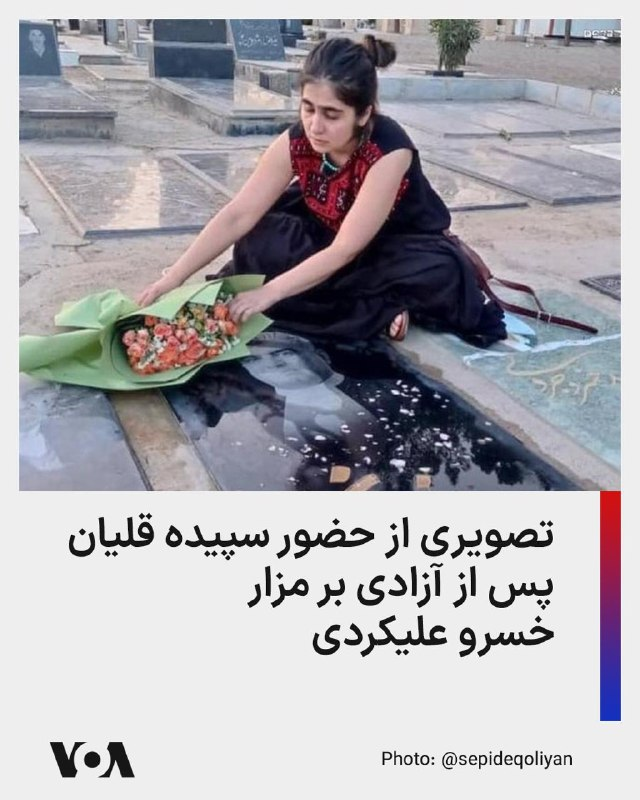

سپیده قلیان، زندانی سیاسی، که روز ۹ خرداد از زندان وکیل‌آباد مشهد آزاد شد، تصویری از حضور خود بر مزار خسرو علیکردی، وکیل دادگستری، را در صفحه اینستاگرامش منتشر کرد.

سایت حقوق بشری هرانا می‌گوید که قلیان پس از پایان دوران شش ماه حبس تعزیری از زندان آزاد شده است. او ۲۱ آذر ۱۴۰۴ همزمان با مراسم هفتم خسرو علیکردی در مشهد بازداشت شده بود.

@FarsiVOA

## FarsiVOA — post 219111

چالش حقوقی علیه تلاش مشترک فرانسه و بریتانیا برای مدیریت مهاجران غیرقانونی

## FarsiVOA — post 219110

  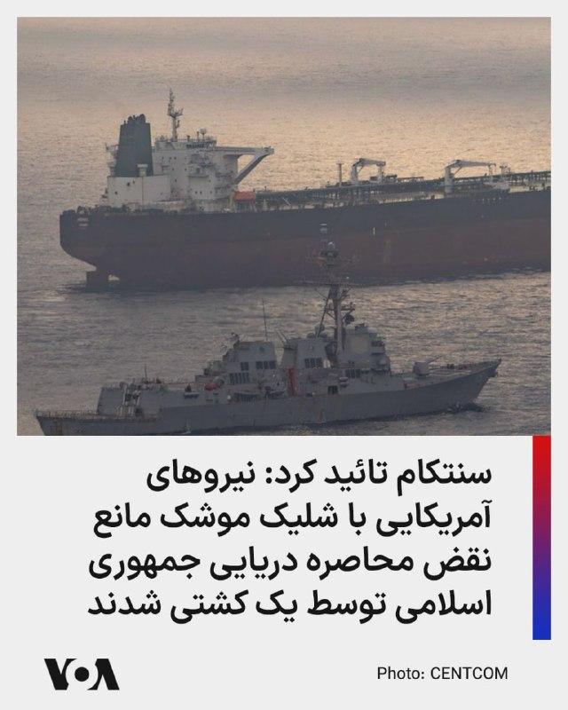

⚡️ستاد فرماندهی مرکزی آمریکا، سنتکام، روز شنبه اعلام کرد که نیروهای آمریکایی فعال در دریای عمان، یک کشتی با پرچم گامبیا که قصد حرکت به سمت یک بندر ایرانی را داشت، روز جمعه ۸ خرداد از کار انداختند و محاصره دریایی علیه جمهوری اسلامی را اعمال کردند.

سنتکام در بیانیه خود گفت نیروهایش کشتی «لیان استار» را در حال عبور از آب‌های بین‌المللی به سمت یک بندر ایرانی بود در دریای عمان مشاهده کردند و بیش از ۲۰ هشدار صادر کردند و به این کشتی اطلاع دادند که در حال نقض محاصره ایالات متحده است.

سنتکام گفت یک هواگرد آمریکایی پس از آنکه خدمه کشتی دستورات نیروهای آمریکایی را نادیده گرفتند، با شلیک یک موشک هل‌فایر به موتورخانه کشتی، آن را غیرفعال کرد.

سنتکام افزود این کشتی دیگر به سمت ایران در حال حرکت نیست.

سنتکام اعلام کرد که نیروهای آمریکایی پیشتر پنج کشتی تجاری را غیرفعال کرده‌اند و با اجرای کامل محاصره دریایی علیه جمهوری اسلامی، مسیر ۱۱۶ کشتی را تغییر داده‌اند.

## FarsiVOA — post 219109

در حالی که اختلاف‌ها در جمهوری اسلامی بر سر مذاکرات با آمریکا ادامه دارد، گزارش‌ها از صدور و تأیید احکام اعدام، کمبود دارو، مهاجرت پزشکان، خاموشی‌های گسترده و فشار فزاینده اقتصادی بر خانوارهای ایرانی حکایت دارد.

## FarsiVOA — post 219108

اختلاف دیدگاه‌ها در کنگره آمریکا درباره مسیر مذاکرات با جمهوری اسلامی همزمان با تحریم‌های تازه

## DW_Farsi — post 125326

  

🔶 سپیده قلیان، فعال مدنی از زندان وکیل‌آباد مشهد آزاد شد

سپیده قلیان، فعال مدنی زندانی که دوران محکومیت خود را در زندان وکیل‌آباد مشهد سپری می‌کرد، امروز شنبه نهم خردادماه (۳۰ مه) از این زندان آزاد شد.

خبرگزاری هرانا مطابق اطلاعات دریافتی خود نوشت که آزادی قلیان پس از پایان دوران شش ماه محکومیت حبس تعزیری او صورت گرفته است.

قلیان در ۲۱ آذرماه سال گذشته در جریان مراسم هفتم خسرو علیکردی، وکیل دادگستری در مشهد توسط نیروهای امنیتی بازداشت شد.

این فعال مدنی که بارها سابقه زندان دارد امروز ساعاتی پس از آزادی با انتشار تصویری از حضور خود بر مزار خسرو علیکردی در شبکه ایکس نوشت: «دوباره سلام خسرو! چطور سعی کردند چشم‌های حقیقت را با قتل تو ببندند. اگر ما خاموش شویم پس کدام شهرزاد قصه تو را بگوید.»

خسرو علیکردی وکالت تعدادی از زندانیان سیاسی، معترضان و خانواده‌های دادخواه را بر عهده داشت. پیدا شدن پیکر بی‌جان این وکیل دادگستری در دفتر کارش در مشهد در آذرماه سال ۱۴۰۴ موجی از واکنش‌ها را برانگیخت و بسیاری آن را "مشکوک" دانستند.

@dw_farsi

## DW_Farsi — post 125325

  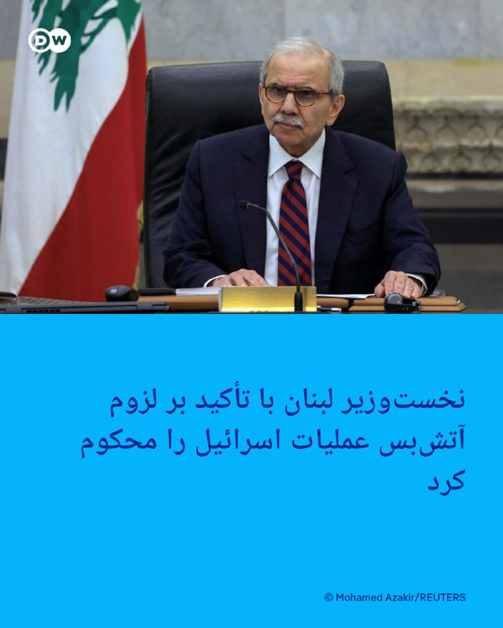

🔶 نخست‌وزیر لبنان با تأکید بر لزوم آتش‌بس عملیات اسرائيل را محکوم کرد

نواف سلام، نخست‌وزیر لبنان آن چه که تشدید تنش "خطرناک و بی‌سابقه" از سوی اسرائیل در جنوب این کشور خواند را به شدت محکوم کرد.

به گزارش خبرگزاری فرانسه، او ضمن تاکید بر لزوم برقراری یک آتش‌بس فوری، تصریح کرد که پیش گرفتن "سیاست زمین سوخته" هرگز امنیت اسرائیل را تضمین نخواهد کرد.

سلام در یک سخنرانی تلویزیونی با دفاع از دموکراسی و ورود دولت خود به مذاکرات مستقیم با اسرائیل گفت که این گفت‌وگوها در شرایط کنونی، "کم‌هزینه‌ترین مسیر» برای لبنان است.

این در حالی است که پیش از این مقام‌های لبنانی از روند گفت‌وگوها با اسرائيل که با میزبانی وزارت دفاع آمریکا (پنتاگون) برگزار شد ابراز ناامیدی کرده بودند.

به گزارش تایمز اسرائیل، روزنامه العربی الجدید به نقل از چند مقام آگاه نوشت که نشست پنتاگون "هیچ‌گونه پیشرفتی به‌ویژه در رابطه با برقراری آتش‌بس جامع و فراگیر دربر نداشت."

شبکه الحدث نیز به نقل از یک منبع نظامی گزارش داد که این نشست "نتایج عملی و ملموسی که مورد نظر و مطلوب لبنان بود را به بار نیاورد."

@dw_farsi

## Persian_Trend_Official — post 15351

  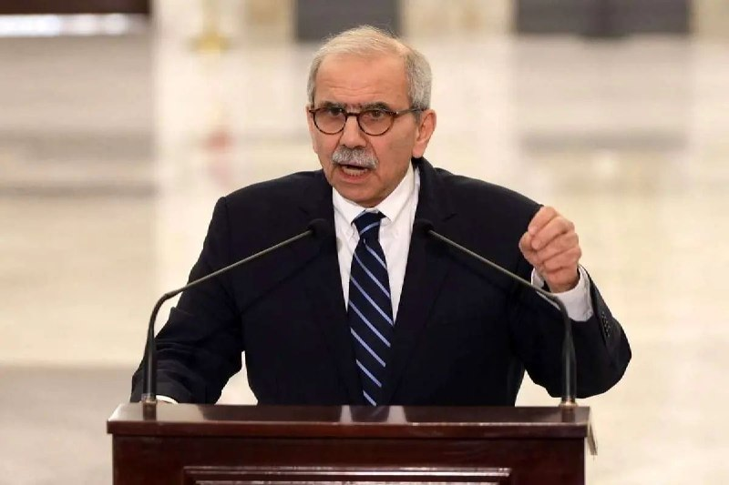

نخست‌وزیر لبنان، نواف سلام: می‌خواهم با صداقت کامل با مردم لبنان صحبت کنم.

آیا مذاکرات تضمین شده است که موفق شود؟ قطعاً نه. اما این کم‌هزینه‌ترین مسیر برای کشور و مردم ما است، در مقایسه با گزینه‌های دیگر موجود امروز.

این مسیر آسان نیست و کوتاه هم نخواهد بود، اما وقتی همه تلاش‌ها زیر سقف دولت لبنان متحد شوند، کوتاه‌تر می‌شود و ما در آن قوی‌تر می‌شویم.

و این مستلزم کنار گذاشتن انحصارطلبی و توقف لجاجت است. زیرا دولت امروز به نمایندگی از همه لبنانی‌ها مذاکرات را انجام می‌دهد و بر همه آنها واجب است که زیر پرچم آن متحد شوند، تا تصمیم جنگ و صلح یک تصمیم ملی لبنانی باقی بماند، نه در دست یک جناح بر دیگری، و نه خارج از مرزها.

📝 Amir

📌 @persian_trend_official
پرشین ترند | متفاوت‌ترین کانال نظامی

## Persian_Trend_Official — post 15350

یک مقام آمریکایی آگاه به خبرگزاری آسوشیتدپرس گفت که ارتش آمریکا یک کشتی تجاری دیگر را که سعی داشت از محاصره بنادر ایران توسط آمریکا عبور کند، متوقف کرده است. 📝 Amir 📌 @persian_trend_official پرشین ترند | متفاوت‌ترین کانال نظامی

## RadioFarda — post 157729

  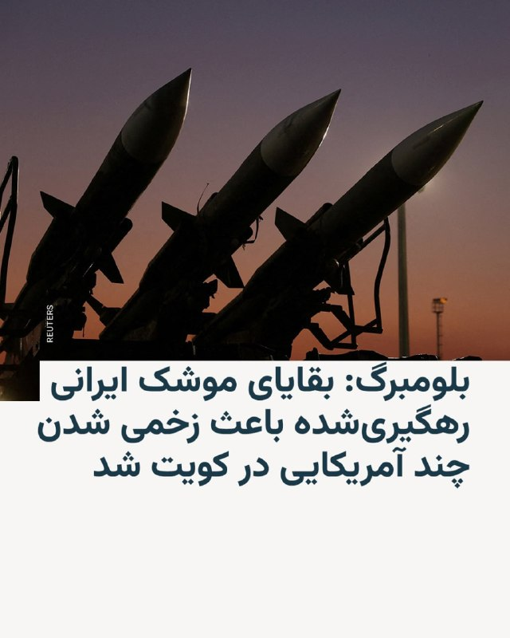

🔸خبرگزاری بلومبرگ روز شنبه گزارش داد که حمله موشکی ایران به یک پایگاه هوایی در کویت باعث زخمی شدن چند آمریکایی شده است.

🔸یک منبع به این رسانه گفته است که در ۲۴ ساعت گذشته پنج آمریکایی، از جمله پیمانکاران و نیروهای نظامی، در پی رهگیری و انهدام یک موشک ایرانی از نوع «فاتح ۱۱۰» توسط سامانه پدافند هوایی کویت دچار «جراحات جزئی» شده‌اند.

🔸این اتفاق بر اثر سقوط بقایای موشک ایرانی بر روی پایگاه هوایی علی السالم کویت که محل استقرار نیروهای آمریکایی است، رخ داد.

🔸بلومبرگ می‌گوید در این حادثه، یک فروند پهپاد ام‌کیو-۹ ریپر آمریکایی نابود شد و یک پهپاد دیگر از همین نوع در همین پایگاه «آسیب جدی» دید.

🔸ارتش آمریکا درباره این گزارش هنوز اظهارنظر نکرده است.

🔸پایگاه هوایی علی السالم در حدود ۳۲ کیلومتری مرز عراق قرار دارد و در جریان جنگ اخیر آمریکا و اسرائیل با ایران نیز تحت حملات پهپادی و موشکی ایران قرار گرفته بود.

@RadioFarda

## RadioFarda — post 157728

  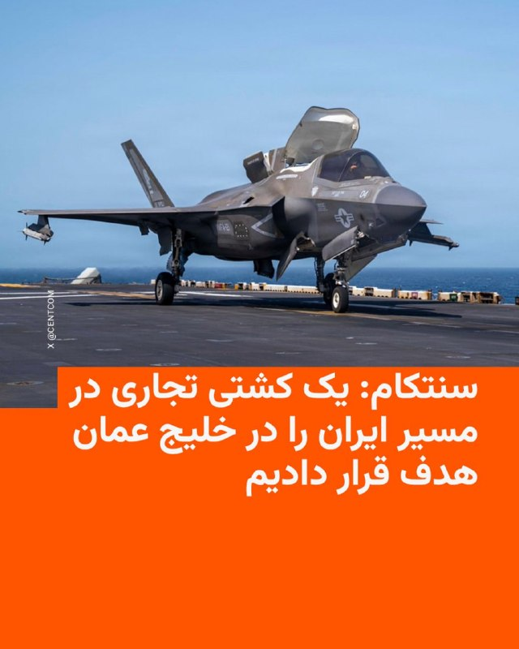

🔸ستاد فرماندهی مرکزی ارتش آمریکا، سنتکام، اعلام کرد نیروهای این کشور یک کشتی تجاری با پرچم گامبیا را که به گفته واشینگتن در نقض محاصره دریایی به سمت یکی از بنادر ایران در حرکت بود، در خلیج عمان هدف قرار داده و از ادامه مسیر آن جلوگیری کرده‌اند.

🔸سنتکام روز شنبه نهم خرداد در بیانیه‌ای گفت نیروهای آمریکایی روز هشتم خرداد کشتی «لیان استار» را هنگام حرکت در آب‌های بین‌المللی به سوی یکی از بنادر ایران شناسایی کردند و بیش از ۲۰ بار به خدمه آن هشدار دادند.

🔸به گفته این نهاد نظامی، پس از آنکه خدمه کشتی به هشدارها توجه نکردند، یک هواپیمای آمریکایی با شلیک موشک هلفایر به اتاق موتور کشتی، آن را از کار انداخت.

🔸سنتکام افزود این کشتی دیگر به سمت ایران در حرکت نیست.

🔸در این بیانیه آمده است که از زمان اجرای محاصره دریایی علیه ایران، نیروهای آمریکایی پنج کشتی تجاری را از کار انداخته و ۱۱۶ کشتی دیگر را وادار به تغییر مسیر کرده‌اند.

🔸سنتکام جزئیات بیشتری درباره محموله کشتی یا مقصد دقیق آن در ایران ارائه نکرده است.

@RadioFarda

## IranianMinds — post 21088

  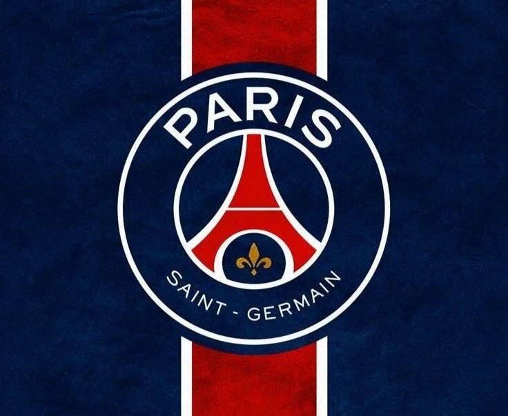

🏆 پاریس سنت ژرمن قهرمان لیگ قهرمانان اروپا ۲۰۲۵/۲۰۲۶ شد.

@IranianMinds

## IranianMinds — post 21087

🔴 سنتکام :

نیروهای آمریکایی فعال در خلیج عمان با از کار انداختن یک کشتی دریایی با پرچم گامبیا که قصد حرکت به سمت بندر ایران را داشت، در 29 مه، اقدامات محاصره ای را اعمال کردند.

نیروهای فرماندهی مرکزی ایالات متحده (CENTCOM) M/V Lian Star را در حال عبور از آب‌های بین‌المللی به سمت یک بندر ایرانی در خلیج عمان مشاهده کردند و بیش از 20 اخطار صادر کردند و در عین حال به کشتی اطلاع دادند که محاصره ایالات متحده را نقض می‌کند.

یک هواپیمای آمریکایی با شلیک موشک هلفایر به داخل موتور کشتی، کشتی را از کار انداخت، زیرا خدمه لیان استار از رعایت این مقررات ناکام ماندند. این کشتی دیگر به ایران ترانزیت نمی کند.

نیروهای ایالات متحده پنج کشتی تجاری را از کار انداخته و 116 کشتی را برای اجرای کامل محاصره هدایت کرده اند، زیرا آتش بس با ایران همچنان به قوت خود باقی است.

@IranianMinds

## IranianMinds — post 21086

یعنی میشه مام یه روزی به آزادی برسیم از دست آخوند راحت شیم ؟ یا برا ما قفله …

@IranianMinds

## BBCPersian — post 282446

  

🔸پاری‌سن‌ژرمن با پیروزی مقابل آرسنال در فینال لیگ قهرمانان اروپا از عنوان قهرمانی‌اش در این مسابقات دفاع کرد.

کای هاورتز، که در فینال ۲۰۲۱ گل پیروزی‌بخش چلسی مقابل منچسترسیتی را زده بود، در دقیقه ششم بازی به طور اتفاقی از جناح چپ پا به توپ شد و پس از فراری طولانی وارد محوطه جریمه شد و توپ را به سقف دروازه پاری‌سن‌ژرمن ‌کوبید.

عثمان دمبله، برنده توپ طلا، نیز روی یک ضربه پنالتی در دقیقه ۶۵ با یک ضربه دقیق و خلاف جهت حرکت داوید رایا توپ را به گوشه دروازه آرسنال دوخت.

تلاش دو تیم در ادامه برای زدن گل بی‌ثمر ماند و در ضربات پنالتی این پاریس بود که حریفش را ۴-۳ شکست داد. گابریل، مدافع برزیلی آرسنال، پنالتی آخر این تیم را از دست داد.

پاری‌سن‌ژرمن تا کنون دو بار قهرمان لیگ قهرمانان اروپا شده است که هر دو نیز با هدایت لوئیس انریکه، سرمربی اسپانیایی این تیم بوده است. این دومین حضور آرسنال در فینال این مسابقات بود که با ناکامی همراه شد.

📸 UEFA/UEFA via Getty Images
@BBCPersian

## BBCPersian — post 282445

🔻ایالات متحده، بریتانیا و استرالیا می‌گویند که قصد دارند در چارچوب پیمان نظامی سه‌جانبه خود، موسوم به آکوس، فناوری شناور‌های هدایت‌پذیر (شهپاد) را توسعه دهند؛ هدف از این اقدام، محافظت از کابل‌های زیرآبی و تقویت دفاعی عنوان شده است.

انتظار می‌رود که فناوری خودروی زیرآبی بدون سرنشین تا سال آینده آماده شود. هزینه کل این پروژه اعلام نشده است، اما جان هیلی، وزیر دفاع بریتانیا، گفت که این کشور ۲۰۱ میلیون دلار به این پروژه کمک خواهد کرد.

وزرای دفاع آمریکا، بریتانیا و استرالیا این تصمیم را در اجلاس امنیتی مجمع شانگری-لا در سنگاپوراعلام کردند؛ در حالی که پیش از آن انتقادهایی در مورد پیشرفت کند پروژه‌های آکوس منتشر شده بود.

آقای هیلی با اذعان به این انتقادات گفت: «ما مدتی طولانی در آکوس، زیاد صحبت می‌کردیم و خیلی کم عمل می‌کردیم اما این وضعیت اکنون تغییر کرده است».

بر اساس پیمان دفاعی آکوس که در سال ۲۰۲۱ آغاز شد، سه عضو پیمان، فناوری زیردریایی‌های هسته‌ای را توسعه می‌دهند و تخصص‌های نظامی خود را به اشتراک می‌گذارند.
https://trib.al/fq96NVF

@BBCPersian

## BBCPersian — post 282444

  <a href="telegram/content/BBCPersian_282444_1780168895.mp4" target="_blank">🎬 Download video</a>

🔻‌نشست «امنیت دریای سیاه» در حساب رسمی خود در شبکه ایکس اعلام کرده که شاهزاده رضا پهلوی به این نشست که در اودسا در جنوب اوکراین برگزار می‌شود رفته است و او را «میهمان ویژه» خوانده است.

این نهاد رضا پهلوی را «ریاست سلسله پهلوی و وارث سلطنت در ایران» توصیف کرده است.

این نشست در حساب کاربری خود در شبکه ایکس گفته است:«امروز، رضا پهلوی یکی از برجسته‌ترین چهره‌های اپوزیسیون ایران و از مدافعان برجسته تغییرات دموکراتیک در ایران است.»
آقای پهلوی در بخشی از سخنان خود گفت ایستادن جامعه جهانی در کنار مردم ایران «در راستای منافع همه کشورها خواهد بود.»

نشست امنیت دریای سیاه در سال ۲۰۲۴ توسط گروهی از نمایندگان پارلمان اوکراین در اودسا آغاز به کار کرد و در جلسات سالانه خود به بررسی چالش‌های امنیتی و ژئوپلیتیک در منطقه دریای سیاه و فراتر از آن می‌پردازد.

@‌‌BBCPersian

## Dirty_Kids — post 390591

  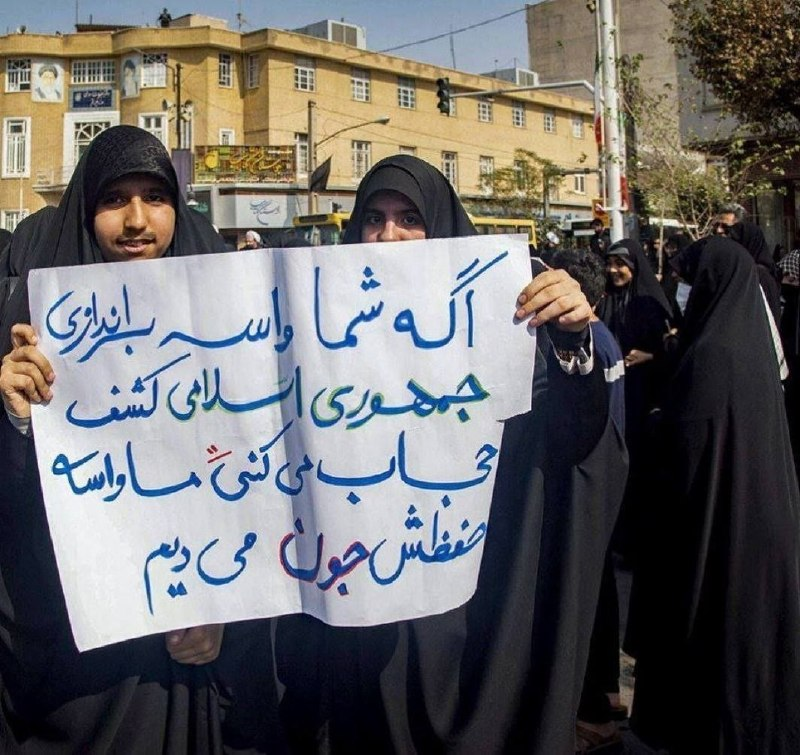

خطاب به سمت چپی: لاقل قبل اومدن به تجمعات سیبیلاتو بزن😂😂
سمت راستی‌هم که سیبیلاشو قایم کرده😂

@Dirty_Kids 👻

## Dirty_Kids — post 390590

خب دیگه فوتبالتونم دیدید، حالا جدی یکی بگه چجوری قراره با این قیمتا زندگی کنیم؟

@Dirty_Kids 👻

## Dirty_Kids — post 390589

  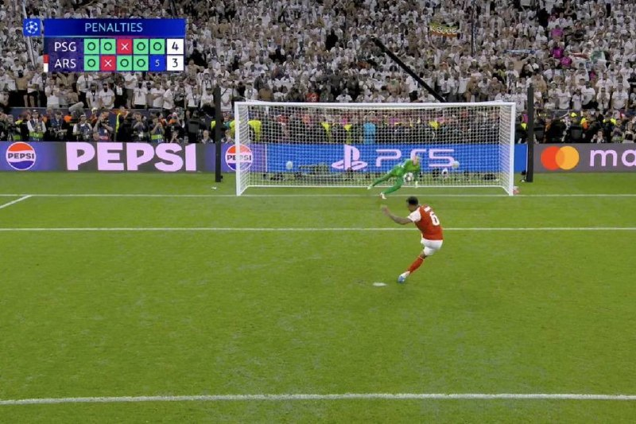

آرسنال رید و پارررریس قهرمان شد 🏆

• PSG: ✅✅❌✅✅
• Arsenal: ✅❌✅✅❌

@Dirty_Kids 👻

## Dirty_Kids — post 390588

  

وضعیت من وقتی قیمت ها رو می‌بینم:

@Dirty_Kids 👻

## Dirty_Kids — post 390587

از بس بی‌اینترنتی کشیدیم، وبگردی بهم حس «کار مفید» می‌ده. کل روز یوتیوب می‌بینم و حس نمی‌کنم دارم وقت تلف می‌کنم.

@Dirty_Kids 👻

## Hranews — post 113253

صدور حکم اعدام برای یک متهم در تهران/ رهایی ۳ زندانی از چوبه دار

❗️
❗️
❗️
❗️
❗️– یک متهم به قتل در تهران توسط شعبه ۱۳ دادگاه کیفری این استان به اعدام محکوم شد. از سوی دیگر، سه زندانی محکوم به #اعدام در شهرستان‌های کهنوج، اردبیل و تایباد با کسب رضایت اولیای دم از چوبه دار رهایی یافتند.

ادامه مطلب

↘️
@hranews_bot تماس ✉️ - @Hranews کانال هرانا 🆑

## Hranews — post 113252

مصدومیت دو کارگر در سایه فقدان ایمنی کار

❗️
❗️
❗️
❗️
❗️– در سایه فقدان ایمنی محیط و شرایط نامناسب کار، دو #کارگر در شهرهای کرمانشاه و قزوین، طی حوادثی حین انجام کار مصدوم شدند.

ادامه مطلب

↘️
@hranews_bot تماس ✉️ - @Hranews کانال هرانا 🆑

## Hranews — post 113251

اجرای حکم اعدام یک زندانی در زندان سنندج

❗️
❗️
❗️
❗️
❗️– سحرگاه روز یکشنبه ۴ خردادماه، حکم یک زندانی که پیشتر از بابت اتهام قتل به اعدام محکوم شده بود، در زندان سنندج اجرا شد.

ادامه مطلب

#فرهنگ_شیخله

↘️
@hranews_bot تماس ✉️ - @Hranews کانال هرانا 🆑

## alonews — post 123808

  <a href="telegram/content/alonews_123808_1780168901.webm" target="_blank">🎬 Download video</a>

🔴کانیه وست برای شلوغ‌ترین کنسرت دوران حرفه‌ای‌اش در استانبول روی صحنه است.

🔴هزاران توریست برای تماشای این کنسرت راهی استانبول شدند و میلیون‌ها دلار درآمد وارد اقتصاد ترکیه شد.

🔴 حالا تصور کن اگر یک خواننده محبوب خارجی بخواهد در ایران کنسرت برگزار کند؛ عرزشی حرام زاده با فریاد و جنجال، کاری می‌کنند که ایران و ایرانی را در چشم دنیا عقب‌مانده و ضد شادی نشان دهند.

🤔ایران می‌توانست مرکز گردشگری، موسیقی، هنر و درآمد باشد؛ اما جمهوری اسلامی فقط فقر، سانسور و انزوا ساخته.

✅@AloNews

## alonews — post 123807

  <a href="telegram/content/alonews_123807_1780168902.webm" target="_blank">🎬 Download video</a>

👈گزارش ها از درگیری شدید نیروی زمینی ارتش اسرائیل و حزب الله در نزدیک شهر نبطیه، پایتخت جنوب لبنان

✅ @AloNews خبر جنگ

## alonews — post 123806

  <a href="telegram/content/alonews_123806_1780168902.webm" target="_blank">🎬 Download video</a>

👈پاریس تو ضربات پنالتی آرسنال رو برد و قهرمان اروپا شد

✅ @AloNews خبر جنگ

## alonews — post 123805

  <a href="telegram/content/alonews_123805_1780168902.webm" target="_blank">🎬 Download video</a>

👈این هفته مراقب تابش فرابنفش باشید

🔴 این هفته شاخص فرابنش بالا است، تا حد ممکن در ساعات میانی روز(ساعات۹-۱۵، با توجه به داده‌ها) کمتر در برابر تابش مستقیم خورشید قرار بگیرید

✅ @AloNews خبر جنگ

## alonews — post 123804

  

💵فروش باز شد.

✔️
✔️
✔️گیگی 
5⃣
1⃣هزار
✔️
✔️

✔️کابوس هرچی گرون فروشه

✔️حداقل خرید 10گیگ.

✔️با لینک ساب

✔️بدونه محدودیت کاربر

✔️چندین لوکیشن مختلف

✔️بدونه کوچیکترین ضریب مصرفی

🔽
🔽
🔽
🔽
🔽
🔽
🔽
🔽
🔽
🔽
🔽

فقط فقط گیگی 
5⃣
1⃣هزار
✔️

⬆️
⬆️
⬆️
⬆️
⬆️
⬆️
⬆️
⬆️
⬆️
⬆️
⬆️

فقط فقط گیگی 
5⃣
1⃣ هزار
✔️
https://t.me/V2ray_confing1

@aMi41garavand12

😎چطوری اعتماد کنی؟ چنل اعتماد

https://t.me/v2rayaMirconfing

## alonews — post 123803

  <a href="telegram/content/alonews_123803_1780168904.webm" target="_blank">🎬 Download video</a>

👈آمریکا مدعی است که در جریان این جنگ، دست‌کم ۱۶۰ شناور دریایی ایران را غرق کرده است. هر یک از این شناورها می‌تواند منبعی بالقوه برای آلودگی باشد. وقوع یک نشت جدی در تنگه، مهار آن را بسیار دشوارتر از حالت معمول خواهد کرد

✅ @AloNews خبر جنگ

## alonews — post 123802

  <a href="telegram/content/alonews_123802_1780168904.webm" target="_blank">🎬 Download video</a>

👈به گزارش منابع خبری ، صدای انفجار در سراسر بوستون بزرگترین شهر در ایالت ماساچوست واقع در آمریکا شنیده شده است.

✅ @AloNews خبر جنگ

## alonews — post 123801

  <a href="telegram/content/alonews_123801_1780168904.webm" target="_blank">🎬 Download video</a>

👈 ثابتی: چرا نمی‌ذارید صداسیما سخنان رهبر درگذشته در مخالفت در مذاکره را پخش کند؟ 
🔴نماینده مجلس: جای تاسف است که رئیس جمهور در دیدار اخیرش با مسئولان صداوسیما به آنها فشار آورده که چرا صحبت‌های رهبر فقید در مخالفت با مذاکره با امریکا را پخش میکنید؛ عده‌ای…

## alonews — post 123800

  <a href="telegram/content/alonews_123800_1780168905.webm" target="_blank">🎬 Download video</a>

👈شبکه 12 اسرائیل: ارتش یک طرح تهاجمی در عمق لبنان آماده کرده است که منتظر تایید سطح سیاسی است

✅ @AloNews خبر جنگ

## alonews — post 123799

  <a href="telegram/content/alonews_123799_1780168905.webm" target="_blank">🎬 Download video</a>

👈 موجودی انبارهای آلومینیوم به سرعت در حال کاهش است

🔴ذخایر موجود در انبارهای بورس‌های کالایی، نیاز جهانی آلومینیوم را برای کمتر از ۵ روز پوشش می‌دهد.

🔴نمودار فلزات و میزان پوشش ذخایر:

🔴 نیکل: حدود 31 روز

🔴 سرب: حدود 29 روز

🔴 قلع: حدود 21 روز

🔴 مس: حدود 13 روز

🔴 روی: حدود 6 روز

🔴 آلومینیوم: حدود 3 تا 4 روز

✅ @AloNews خبر جنگ

## alonews — post 123798

  <a href="telegram/content/alonews_123798_1780168905.webm" target="_blank">🎬 Download video</a>

👈 ثابتی: چرا نمی‌ذارید صداسیما سخنان رهبر درگذشته در مخالفت در مذاکره را پخش کند؟

🔴نماینده مجلس: جای تاسف است که رئیس جمهور در دیدار اخیرش با مسئولان صداوسیما به آنها فشار آورده که چرا صحبت‌های رهبر فقید در مخالفت با مذاکره با امریکا را پخش میکنید؛ عده‌ای هم به ما میگویند سکوت کنید تا وحدت بهم نخورد!

✅ @AloNews خبر جنگ

## alonews — post 123796

  <a href="telegram/content/alonews_123796_1780168906.mp4" target="_blank">🎬 Download video</a>

👈پرواز امشبِ جنگنده‌های ارتش ایران شهر"کرج"

✅ @AloNews خبر جنگ

## alonews — post 123795

  <a href="telegram/content/alonews_123795_1780168909.webm" target="_blank">🎬 Download video</a>

👈 وزارت بهداشت لبنان گزارش می‌دهد که از زمان آغاز تهاجم در ۲ مارس، ۳۳۷۱ نفر کشته و ۱۰۱۲۹ نفر در حملات اسرائیل زخمی شده‌اند.

✅ @AloNews خبر جنگ

## alonews — post 123794

  <a href="telegram/content/alonews_123794_1780168910.webm" target="_blank">🎬 Download video</a>

👈این هفته شاخص فرابنفش بالا است، تا جای ممکن در ساعات میانی روز(ساعات۹-۱۵، با توجه به داده‌ها) کمتر در برابر تابش مستقیم خورشید قرار بگیرید

✅ @AloNews خبر جنگ

## alonews — post 123793

  <a href="telegram/content/alonews_123793_1780168910.webm" target="_blank">🎬 Download video</a>

💔همه اعضای این خانواده جاوید نام شدن. 
🔴جاویدنام بیژن مصطفوی، ۵۸ ساله، بازنشسته آموزش و پرورش، رزمنده جنگ ایران و عراق 
🔴جاویدنام زهرابنی‌عامریان، ۴۸ ساله، بازنشسته تامین اجتماعی 
🔴جاویدنام دانیال مصطفوی، ۲۰ ساله، دانشجوی کامپیوتر 
🔴اصالتا از شهرستان سنقر،…

## alonews — post 123792

  <a href="telegram/content/alonews_123792_1780168911.webm" target="_blank">🎬 Download video</a>

👈کارول ناوروتسکی، رئیس‌جمهور لهستان:
متأسفانه، رئیس‌جمهور زلنسکی نشان داده است که اوکراین به دلیل حمایت از راهزنان و قاتلانِ ارتش شورشی اوکراین (UPA)، آمادگیِ عضویت در خانواده اروپایی را ندارد.

🔴 در خانواده اروپایی برای راهزنان و قاتلانی که زنان و کودکان را کشتند و لهستانی‌ها را به قتل رساندند، جایی وجود ندارد.

✅ @AloNews خبر جنگ

## alonews — post 123791

  <a href="telegram/content/alonews_123791_1780168911.webm" target="_blank">🎬 Download video</a>

👈سنتکام اعلام کرد کشتی تجاری Lian Star که از یک بندر ایران خارج شده بود پس از 20 هشدار توقف و عدم توجه آن توسط یک هواپیمای آمریکایی با شلیک موشک هلفایر به اتاق موتور کشتی، آن را از کار انداخت و در دریای عمان توقیف شد.

✅ @AloNews خبر جنگ

## alonews — post 123789

  <a href="telegram/content/alonews_123789_1780168911.webm" target="_blank">🎬 Download video</a>

👈سازمان رادیو و تلویزیون اسرائیل مدعی شد: ارزیابی‌های آمریکا و اسرائیل بر این است که حزب‌الله با هدف کارشکنی در مذاکرات اقدام به حملات موشکی می‌کند.

🔴انتظار می‌رود مذاکرات بین نمایندگان نظامی اسرائیل و لبنان در هفته آینده نیز ادامه یابد. نتانیاهو طرح را به کابینه امنیتی ارائه داد که به موجب آن دامنه کنترل بر غزه گسترش می‌یابد.

✅ @AloNews خبر جنگ

## alonews — post 123788

  <a href="telegram/content/alonews_123788_1780168912.webm" target="_blank">🎬 Download video</a>

👈صداوسیما جزئیات غیررسمی از یادداشت تفاهم [ایران و آمریکا] را منتشر کرد:

🔴موضوع آزادسازی منابع بلوکه شده ایران از مهمترین بندهای رونوشت غیررسمی چارچوب تفاهم اسلام آباد است.

🔴بر این اساس آمریکا متعهد شده طی ۶۰ روز امکان دسترسی کامل ایران به ۱۲ میلیارد دلار از دارایی‌هایش را فراهم کند.

🔴به گونه‌ای که این منابع قابلیت انتقال و هزینه کرد در بانک‌های مقصد موردنظر ایران را بدون محدودیت داشته باشند.

✅ @AloNews خبر جنگ

---
📅 بروزرسانی: 1405/03/09 21:25
---

## VahidOOnLine — post 242940

  

صداوسیمای جمهوری اسلامی در گزارشی درباره تفاهم احتمالی بین تهران و واشینگتن با عنوان «جزئیات غیررسمی»، اعلام کرد آمریکا متعهد شده در طول ۶۰ روز امکان دسترسی جمهوری اسلامی به ۱۲ میلیارد دلار از دارایی‌ها را به‌گونه‌ای فراهم کند که این منابع قابلیت انتقال و هزینه‌کرد در بانک‌های مقصد را بدون محدودیت داشته باشد.

این گزارش افزود که بر اساس این تفاهم، جمهوری اسلامی مرجع انحصاری تشخیص ماهیت شناورهای عبوری است و هر شناوری که محموله آن تهدیدآمیز شناخته شود یا بهره‌بردار نهایی آن در «خصومت» با جمهوری اسلامی باشد، به عنوان کشتی تجاری شناخته نشده و اجازه عبور از مسیرهای تعریف‌شده را ندارد.

صدا و سیما تاکید کرد که این رونوشت هنوز در حکم یک تفاهم غیررسمی است چون مسیر آن همچنان در چرخه بررسی، مذاکره و بازبینی قرار دارد.
‌🏁 🇬🇧 IranintlTV

🤖 @VahidOOnLine

## VahidOOnLine — post 242939

  

♦️ تیفانی ترامپ و همسرش مایکل بولوس تازه‌ترین چهره‌های نزدیک به خانواده دونالد ترامپ‌اند که در سفر خود به هند از تاج‌محل بازدید کردند.

این زوج که در روزهای گذشته در سفر به مقصدهای گرمسیری بودند، پس از حضور در مراسم ازدواج جزیره‌ای دونالد ترامپ جوان، برادر تیفانی، سفر خود را ادامه دادند و در ادامه به هند رفتند؛ جایی که بازدید از تاج‌محل، بنای مشهور شهر آگرا، بخشی از برنامه سفرشان بود.

چند روز پیش نیز مارکو روبیو، وزیر امور خارجه آمریکا، همراه همسرش ژانت دوسدبس، از تاج محل بازدید کرده بود.

تاج محل، از معروف‌ترین بناهای تاریخی هند، در قرن هفدهم میلادی به دستور شاه جهان، پادشاه گورکانی، ساخته شد. این آرامگاه باشکوه به یاد همسر محبوب ایرانی او، ممتاز محل، بنا شد و سال‌ها است که یکی از مهم‌ترین جاذبه‌های گردشگری هند و از شناخته‌شده‌ترین بناهای عاشقانه جهان به شمار می‌رود.
‌🇸🇦 Indypersian

🤖 @VahidOOnLine

## VahidOOnLine — post 242938

  

یدالله جوانی، معاون سیاسی سپاه پاسداران گفت: «میدان‌های ما آماده است و اگر دشمن مرتکب خطای مجددی شود، پاسخ جمهوری اسلامی محکم‌تر، قاطع‌تر و غیرقابل‌باورتر خواهد بود.»

او ادامه داد: «جمهوری اسلامی بر تنگه هرمز مسلط شده و پس از ۵۰۰ سال، به موقعیتی دست یافته که حق مسلم مردم ایران است.»

جوانی افزود: «دشمن اکنون با دو راه پیش‌رو مواجه است؛ راه بد و راه بدتر.»
‌🏁 🇬🇧 IranintlTV

🤖 @VahidOOnLine

## VahidOOnLine — post 242937

  

♦️ به گزارش نیویورک‌پست، در پی حمله موشکی جمهوری اسلامی به یک پایگاه هوایی در کویت، چند نفر از نیروهای نظامی و پیمانکاران آمریکایی مجروح شدند. این حمله در حالی رخ می‌دهد که دونالد ترامپ، رئیس‌جمهوری آمریکا، در حال ارزیابی پذیرش آخرین پیشنهاد صلح تهران یا بازگشت به شرایط جنگی است.

یک منبع مطلع روز شنبه نهم خرداد، اعلام کرد که در پی رهگیری یک موشک «فاتح-۱۱۰» توسط پدافند هوایی کویت طی ۲۴ ساعت گذشته، قطعات و ترکش‌های ناشی از انهدام موشک بر فراز پایگاه هوایی «علی السالم» فرود آمده و منجر به جراحت سطحی چند آمریکایی شده است. این حادثه همچنین خسارت شدیدی به دو پهپاد «ام‌کیو-۹ ریپر» (MQ-9 Reaper) به ارزش تقریبی ۳۰ میلیون دلار وارد کرده است.

این حمله در شرایطی صورت گرفته که دونالد ترامپ روز جمعه با تیم امنیتی خود تشکیل جلسه داد و اعلام کرد که قصد دارد تصمیم نهایی را درباره توافق با ایران اتخاذ کند؛ توافقی که شامل تمدید ۶۰ روزه آتش‌بس، بازگشایی تنگه هرمز و آغاز مذاکرات بیشتر درباره مواد هسته‌ای ایران در ازای لغو محاصره دریایی آمریکا می‌شود.
‌🇸🇦 Indypersian

🤖 @VahidOOnLine

## VahidOOnLine — post 242936

  

♦️ یک مقام مطلع آمریکایی روز شنبه نهم خرداد، به خبرگزاری اسوشیتدپرس گفت که ارتش ایالات متحده از ورود یک کشتی تجاری دیگر که قصد داشت محاصره دریایی بنادر ایران را بشکند، جلوگیری کرده است.

به گفته این مقام مسئول که خواست نامش فاش نشود، کشتی باری «لیان استار» (Lian Star) با پرچم گامبیا، بامداد امروز بدون توجه به هشدارهای مکرر نیروهای آمریکایی تلاش کرد وارد یکی از بنادر ایران شود. در پی این اقدام، جنگنده‌های ارتش آمریکا این کشتی را در دریای عمان غیرفعال (زمین‌گیر) کردند؛ این شناور اکنون بدون آنکه نیروهای آمریکایی وارد آن شده باشند، در دریا سرگردان است.

با احتساب این رویارویی جدید، ارتش آمریکا تاکنون پنج کشتی که قصد شکستن محاصره دریایی بنادر ایران را داشتند از کار انداخته‌اند.
‌🇸🇦 Indypersian

🤖 @VahidOOnLine

## VahidOOnLine — post 242935

  

مهدی محمدی، مشاور محمدباقر قالیباف نوشت: «بر خلاف عملیات روانی گسترده رسانه‌های غربی، هیچ توافقی نهایی نشده است.»
او افزود: «جمهوری اسلامی در موضع قدرت است، توافق صرفا یک تاکتیک برای خرید زمان و منابع است نه استراتژی صلح‌طلبانه، و سرنوشت نبرد را ما تعیین خواهیم کرد.»
‌🏁 🇬🇧 IranintlTV

🤖 @VahidOOnLine

## VahidOOnLine — post 242934

  

♦️ دونالد ترامپ، رئیس‌جمهوری آمریکا، روز شنبه نهم خرداد اعلام کرد که در پی انصراف تعدادی از هنرمندان، در حال بررسی لغو زنجیره کنسرت‌های گرامیداشت دویست‌وپنجاهمین سالگرد استقلال ایالات متحده و برگزاری یک سخنرانی به جای آن است.

روز جمعه، برت مایکلز، خواننده اصلی گروه راک «پویزن» (Poison)، پنجمین موسیقی‌دانی بود که از حضور در این کنسرت‌ها تحت عنوان «آزادی ۲۵۰» (Freedom 250) انصراف داد. این رویدادها قرار است از ۲۵ ژوئن تا ۱۰ ژوئیه در محوطه ملی واشنگتن برگزار شوند. پیش از این قرار بود ۹ هنرمند در این رویدادها اجرا داشته باشند اما چهار نفر از جمله مارتینا مک‌براید، بعد از آن که متوجه شدند برنامه به ترامپ مربوط است، تصمیم به انصراف گرفتند.

ترامپ در شبکه اجتماعی «تروث سوشال» نوشت که در حال بررسی گزینش یک سخنرانی و تجمع انتخاباتی به جای این کنسرت‌هاست. او خود را «جذابیت شماره یک در سراسر جهان» نامید و افزود: «من مردی هستم که جمیعت بسیار بزرگ‌تری را نسبت به دوران اوج الویس پرسلی به خود جذب می‌کند، آن هم بدون اینکه گیتاری به دست داشته باشد.»
‌🇸🇦 Indypersian

🤖 @VahidOOnLine

## WithYashar — post 12951

الجزیره: ترامپ برای جلوگیری از جنگ با ایران پیش از جام جهانی بسیار مصمم است

او همچنان برای دستیابی به یک توافق موقت با تهران تحت فشار است، اما پیشرفت فوری بعید به نظر می‌رسد
@withyashar

## WithYashar — post 12950

شبکه ۱۴ اسرائیل : نتانیاهو، قراره به‌زودی یه جلسه امنیتی برگزار کنه تا درباره نحوه پاسخ به شدت گرفتن حملات حزب‌الله تصمیم بگیره
@withyashar

## WithYashar — post 12949

## WithYashar — post 12948

## WithYashar — post 12947

🌊

## WithYashar — post 12946

درود میشه یکم ویس بدی دلمون گرفت :)❤️

## WithYashar — post 12945

  

ترامپ: پنج مرحله سندروم ترامپ هراسی
@withyashar

## pm_afshaa — post 91903

🔴یک مقام ارشد آمریکایی: دیدار رئیس‌جمهور ایالات متحده دونالد ترامپ در اتاق عملیات حدود دو ساعت طول کشید، اما هنوز تصمیمی درباره توافق با ایران گرفته نشده است. در دولت معتقدند که به توافق نزدیک هستند، اما هنوز مسائل اختلافی باقی مانده

💧 Rainbet.com the #1 Non-KYC Crypto Casino & Sportsbook @rainbetcom

😁 @Pm_Afshaa

## pm_afshaa — post 91902

🔴شاهزاده رضا پهلوی:مردم ایران باید از طریق هوا حفاظت بشن و اینترنت و دیگر ابزار لازم رو داشته باشن که دست به‌کار بشن و رژیم رو به زانو بیارن

💧 Rainbet.com the #1 Non-KYC Crypto Casino & Sportsbook @rainbetcom

😁 @Pm_Afshaa

## iaghapour — post 2644

  <a href="https://t.me/iaghapour/2644" target="_blank">📎 Download file</a>

🟢 لیست آی‌پی ها و فایل html مربوط به ویدیو ساخت فیلترشکن پرسرعت و رایگان با ورکر کلودفلر

🆔@iaghapour

## DEJradio — post 5158

  <a href="telegram/content/DEJradio_5158_1780163721.webm" target="_blank">🎬 Download video</a>

🔺🎤 تکنیک های کاهش اضطراب

گفت‌وگو با دکتر مصطفی میررمضانی، روانپزشک و روان‌درمانگر

#کاهش_اضطراب #اضطراب
@DEJradio

## VahidOnline — post 75805

  

♦️ به گزارش نیویورک‌پست، در پی حمله موشکی جمهوری اسلامی به یک پایگاه هوایی در کویت، چند نفر از نیروهای نظامی و پیمانکاران آمریکایی مجروح شدند. این حمله در حالی رخ می‌دهد که دونالد ترامپ، رئیس‌جمهوری آمریکا، در حال ارزیابی پذیرش آخرین پیشنهاد صلح تهران یا بازگشت به شرایط جنگی است.

یک منبع مطلع روز شنبه نهم خرداد، اعلام کرد که در پی رهگیری یک موشک «فاتح-۱۱۰» توسط پدافند هوایی کویت طی ۲۴ ساعت گذشته، قطعات و ترکش‌های ناشی از انهدام موشک بر فراز پایگاه هوایی «علی السالم» فرود آمده و منجر به جراحت سطحی چند آمریکایی شده است. این حادثه همچنین خسارت شدیدی به دو پهپاد «ام‌کیو-۹ ریپر» (MQ-9 Reaper) به ارزش تقریبی ۳۰ میلیون دلار وارد کرده است.

این حمله در شرایطی صورت گرفته که دونالد ترامپ روز جمعه با تیم امنیتی خود تشکیل جلسه داد و اعلام کرد که قصد دارد تصمیم نهایی را درباره توافق با ایران اتخاذ کند؛ توافقی که شامل تمدید ۶۰ روزه آتش‌بس، بازگشایی تنگه هرمز و آغاز مذاکرات بیشتر درباره مواد هسته‌ای ایران در ازای لغو محاصره دریایی آمریکا می‌شود.
@VahidOOnLine

📡 @VahidOnline

## IranIntlTV — post 339773

  

صداوسیمای جمهوری اسلامی در گزارشی درباره تفاهم احتمالی بین تهران و واشینگتن با عنوان «جزئیات غیررسمی»، اعلام کرد آمریکا متعهد شده در طول ۶۰ روز امکان دسترسی جمهوری اسلامی به ۱۲ میلیارد دلار از دارایی‌ها را به‌گونه‌ای فراهم کند که این منابع قابلیت انتقال و هزینه‌کرد در بانک‌های مقصد را بدون محدودیت داشته باشد.

این گزارش افزود که بر اساس این تفاهم، جمهوری اسلامی مرجع انحصاری تشخیص ماهیت شناورهای عبوری است و هر شناوری که محموله آن تهدیدآمیز شناخته شود یا بهره‌بردار نهایی آن در «خصومت» با جمهوری اسلامی باشد، به عنوان کشتی تجاری شناخته نشده و اجازه عبور از مسیرهای تعریف‌شده را ندارد.

صدا و سیما تاکید کرد که این رونوشت هنوز در حکم یک تفاهم غیررسمی است چون مسیر آن همچنان در چرخه بررسی، مذاکره و بازبینی قرار دارد.
https://iranintl.com/202605302838

## IranIntlTV — post 339772

  

یدالله جوانی، معاون سیاسی سپاه پاسداران گفت: «میدان‌های ما آماده است و اگر دشمن مرتکب خطای مجددی شود، پاسخ جمهوری اسلامی محکم‌تر، قاطع‌تر و غیرقابل‌باورتر خواهد بود.»

او ادامه داد: «جمهوری اسلامی بر تنگه هرمز مسلط شده و پس از ۵۰۰ سال، به موقعیتی دست یافته که حق مسلم مردم ایران است.»

جوانی افزود: «دشمن اکنون با دو راه پیش‌رو مواجه است؛ راه بد و راه بدتر.»
https://iranintl.com/202605305267

## IranIntlTV — post 339771

  <a href="telegram/content/IranIntlTV_339771_1780163724.mp4" target="_blank">🎬 Download video</a>

با وجود برگزاری جلسه در اتاق وضعیت کاخ سفید، دونالد ترامپ هنوز تصمیم نهایی درباره تفاهم‌نامه با تهران را اعلام نکرده است. هم‌زمان پیت هگست، وزیر جنگ آمریکا، گفت ترامپ تنها در صورت «توافقی مطلوب برای آمریکا و امنیت جهانی» آن را می‌پذیرد.

ارزیابی بیشتر با ایمان آقایاری، تحلیل‌گر سیاسی
@iranintltv

## IranIntlTV — post 339770

  <a href="telegram/content/IranIntlTV_339770_1780163727.mp4" target="_blank">🎬 Download video</a>

با گذشت نزدیک به پنج ماه از اعتراضات دی‌ماه، همچنان روایت‌ها و اسامی تازه‌ای از جان‌باختگان منتشر می‌شود. سودا اکرمی‌فرد، ۱۶ ساله، ۱۹ دی‌ماه در مارلیک کرج با شلیک گلوله جنگی جان خود را از دست داده است.
گفت‌وگو با سمیرا عینی، مادر سودا اکرمی‌فرد از جان‌باختگان اعتراضات دی‌ماه
@iranintltv

## IranIntlTV — post 339769

  <a href="https://t.me/IranintlTV/339769" target="_blank">📎 Download file</a>

🎧نسخه صوتی اخبار شبانگاهی | شنبه ۹ خرداد
@iranintlTV

## IranIntlTV — post 339768

  <a href="telegram/content/IranIntlTV_339768_1780163730.mp4" target="_blank">🎬 Download video</a>

حسین علایی، فرمانده پیشین نیروی دریایی سپاه، گفت سه روز پیش از جنگ اخیر به علی شمخانی گفته بود طرح آمریکا و اسرائیل این است که با هدف قرار دادن خامنه‌ای، جنگ دیگری را آغاز کنند.

به گفته او، شمخانی در پاسخ گفته بود: «نمی‌توانند خامنه‌ای را پیدا کنند.»

حامیان جمهوری اسلامی تاکید دارند که خامنه‌ای از پناهگاه استفاده نمی‌کرد.
@iranintltv

## IranIntlTV — post 339767

  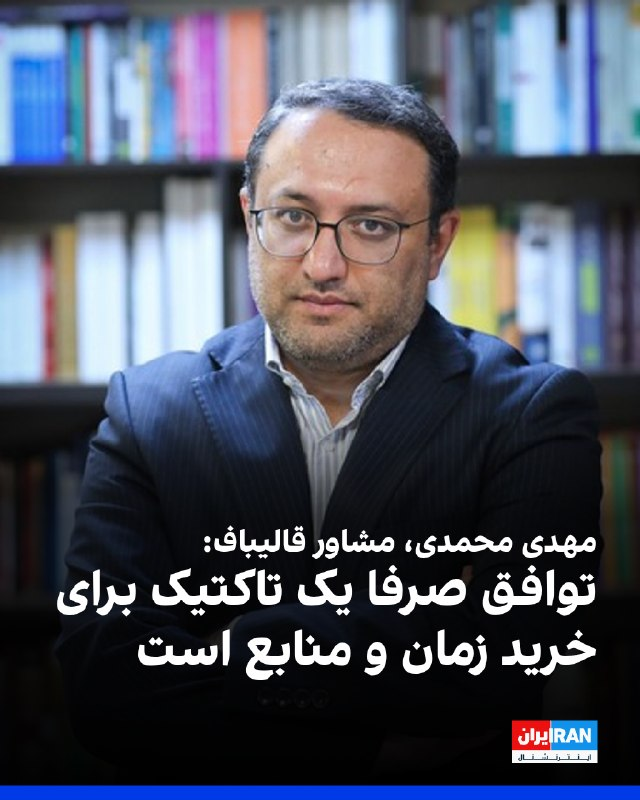

مهدی محمدی، مشاور محمدباقر قالیباف نوشت: «بر خلاف عملیات روانی گسترده رسانه‌های غربی، هیچ توافقی نهایی نشده است.»
او افزود: «جمهوری اسلامی در موضع قدرت است، توافق صرفا یک تاکتیک برای خرید زمان و منابع است نه استراتژی صلح‌طلبانه، و سرنوشت نبرد را ما تعیین خواهیم کرد.»
https://iranintl.com/202605308903

## FarsiVOA — post 219105

پیت هگست، وزیر جنگ آمریکا، اعلام کرد با جان هیلی و ریچارد مارلز در نشست وزیران دفاع پیمان آکوس دیدار کرده است.

او گفت به دستور دونالد ترامپ، این همکاری «با تمام سرعت» در حال پیشرفت است.

@FarsiVOA

## FarsiVOA — post 219104

🔺آسوشیتدپرس: آمریکا یک کشتی تجاری دیگر را که تلاش داشت محاصره بنادر ایران را نقض کند از کار انداخت

▪️یک مقام آمریکایی می‌گوید ارتش ایالات متحده یک کشتی تجاری دیگر را که قصد داشت محاصره بنادر ایران را نقض کند، در خلیج عمان از کار انداخت.

⬇️ بیشتر بخوانید:

https://ir.voanews.com/a/usa-disabled-ship-near-iran/8155588.html/?nocach=1

## FarsiVOA — post 219103

🔺دو زندانی سیاسی اهل بوکان زیر تیغ رژیم ایران؛ حکم اعدام رئوف شیخ‌معروفی و محمد فرجی در دیوان عالی تایید شد

▪️احکام اعدام رئوف شیخ‌معروفی و محمد فرجی، دو زندانی سیاسی اهل بوکان، در دیوان عالی کشور تأیید و برای اجرا به شعبه اجرای احکام ارسال شده است.

⬇️ بیشتر بخوانید:

https://ir.voanews.com/a/death-sentences-upheld-two-iranian-political-prisoners/8155586.html/?nocach=1

## FarsiVOA — post 219102

🔺انتقال یک فعال حقوق زنان به زندان رشت و بلاتکلیفی یک زندانی بهائی در یزد؛ آزادی سپیده قلیان پس از پایان دوره محکومیت

▪️رسانه‌های حقوق بشری روز شنبه ۹ خرداد اعلام کردند تینا دلجو، فعال حقوق زنان، به زندان لاکان رشت منتقل شد، بلاتکلیفی فلورا صمدانی، شهروند بهائی در زندان یزد از یک‌ ماه فراتر رفت، و همزمان سپیده قلیان، با پایان دوران محکومیت، از زندان وکیل‌آباد مشهد آزاد شد.

⬇️ بیشتر بخوانید:

https://ir.voanews.com/a/iran-prison-arrest-women-activist-bahaie/8155579.html/?nocach=1

## FarsiVOA — post 219101

🔺صدور حکم اعدام علیه بنیامین نقدی در شیراز؛ ماشین مرگ جمهوری اسلامی همچنان در حرکت است

▪️وکیل بنیامین نقدی، از بازداشت‌شدگان اعتراضات سراسری دی ۱۴۰۴ در شیراز، از صدور جکم اعدام برای او خبر داد.

⬇️ بیشتر بخوانید:

https://ir.voanews.com/a/iran-court-sentences-protester-to-death/8155582.html/?nocach=1

## FarsiVOA — post 219098

پیت هگست، وزیر جنگ آمریکا، اعلام کرد در حاشیه نشست «گفت‌وگوی شانگری لا» با کریس پنک، وزیر دفاع جدید نیوزیلند، دیدار کرده است.

او گفت امیدوار است نیوزیلند در مشارکت خود در دفاع جمعی پیشرفت کند.

@FarsiVOA

## DW_Farsi — post 125324

  

🔶 هشدار سازمان دریانوردی بریتانیا نسبت به "تشدید سریع تنش‌ها" در تنگه هرمز

آژانس امنیت تجارت دریایی بریتانیا (UKMTO) در بیانیه‌ای وضعیت امنیتی در تنگه هرمز را "همچنان بحرانی" خواند و اعلام کرد که محاصره دریایی بنادر ایران توسط ایالات متحده بدون تغییر باقی مانده است.

خبرگزاری آلمان در گزارش خود در روز شنبه ۳۰ مه (۹ خرداد) نوشت، در این بیانیه با اشاره به این که "کشتی‌هایی که مشمول این محاصره هستند باید کماکان از دستورات نیروهای محاصره‌کننده پیروی کنند" آمده است که عدم پایبندی به این دستورات می‌تواند منجر به "تشدید سریع تنش‌ها" شود.

مذاکرات ایران و آمریکا که هدف از آن پایان دادن به مناقشه هسته‌ای و جنگ است هنوز به نتیجه‌ نهایی نرسیده است.

آخرین خبرها در روزهای گذشته دستیابی به توافق را باورپذیر کرده بود اما به رغم مذاکرات فشرده هنوز گشایش نهایی در این مسیر به دست نیامده است.

به گفته مقا‌م‌های ایرانی، ظرف ۲۴ ساعت گذشته در مجموع ۲۰ فروند کشتی از تنگه هرمز عبور کرده‌اند.

@dw_farsi

## Persian_Trend_Official — post 15349

  

ناو آبی خاکی باکسر به خاورمیانه نمی آید!

به نظر می‌رسد که ناو آبی خاکی یو‌اس‌اس باکسر (LHD-4) قرار نیست در حوزه مسئولیت سنتکام مستقر شود. ناو آبی‌خاکی کلاس وسپ نیز امروز از بندر سمبانوان در سنگاپور حرکت کرد؛ اگرچه اکنون به سمت شرق در حرکت است.

📝 Amir

📌 @persian_trend_official
پرشین ترند | متفاوت‌ترین کانال نظامی

## Persian_Trend_Official — post 15348

  <a href="telegram/content/Persian_Trend_Official_15348_1780163734.webm" target="_blank">🎬 Download video</a>

کانال 12 اسرائیل: نخست وزیر نتانیاهو، وزیر دفاع کاتز، رئیس ستاد ارتش اسرائیل و مقامات ارشد امنیتی عصر امروز یک ارزیابی امنیتی برگزار خواهند کرد.

بحث‌ها بر تشدید تنش در شمال اسرائیل و تشدید دستورالعمل‌های فرماندهی جبهه داخلی متمرکز خواهد بود.

📝 Amir

📌 @persian_trend_official
پرشین ترند | متفاوت‌ترین کانال نظامی

## IranianMinds — post 21085

  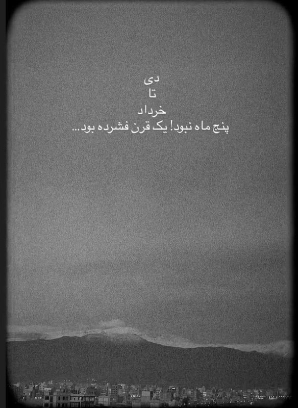

@IranianMinds

## IranianMinds — post 21084

  <a href="telegram/content/IranianMinds_21084_1780163735.mp4" target="_blank">🎬 Download video</a>

🔴 کارشناس صداوسیما :

ما اصلا آریایی نیستیم و اینکه بعضیا میگن ما آریایی هستیم نژاد‌ پرستیه ، آریایی ها همشون قاتل بودن و همه رو‌ کشتن تا به قدرت برسن اینکه بگیم ما آریایی هستیم یعنی ما فرزندان کسانی هستیم که نسل کشی کردن.

@IranianMinds

## IranianMinds — post 21083

  

@IranianMinds

## IranianMinds — post 21082

  

😤دنبال یه سایت شرط بندی بین المللی بودی که به ایرانیا خدمات بده؟!
⛔

👍دربی بت همون انتخاب  100%

💎ویژگی های سایت جهانی Derby Bet:

⬅️امکان شارژ امن با کارت بانکی

⬅️واریز اول دوبل شارژ می شوید(بونوس۱۰۰٪)

⬅️پر اپشن ترین سایت فعال در ایران

⬅️تسویه حساب کمتر از 5 دقیقه

⬅️برگشت بخشی از باخت به صورت هفتگی

🚨کد هدیه ثبت نام:GG007

⚠️برای دانلود اپلکیشن کلیک کنید
👉

🔔کانال دربی بت G9:

🪙https://t.me/+aCbq7yy8QY80NzQ0

## IranianMinds — post 21081

  

🔴 پست جدید ترامپ :

۵ مرحله از سندرم ترامپ هراسی.

@IranianMinds

## IranianMinds — post 21080

  

پست جدید ترامپ :

@IranianMinds

## BBCPersian — post 282443

🔻سپاه پاسداران درباره هرگونه مداخله نظامی در مدیریت تنگه هرمز هشدار داد

قرارگاه مرکزی خاتم الانبیا که نقش اصلی در مدیریت جنگ از سوی ایران دارد، امروز هشدار داد که «هرگونه اقدام شناورهای نظامی جهت مداخله در مدیریت تنگۀ هرمز یا ایجاد اختلال در تردد، مورد هدف نیروهای مسلح جمهوری اسلامی ایران قرار خواهد گرفت.»

این قرارگاه گفته است که «کلیه کشتی‌ها، شناورهای تجاری و نفتکش‌ها صرفا ملزم به تردد از مسیرهای تعیین‌شده و اخذ مجوز از نیروی دریایی سپاه پاسداران انقلاب اسلامی هستند» و «هرگونه تخلف از این ضوابط، امنیت تردد آنها را با مخاطره جدی مواجه خواهد کرد.»

ایران از زمان حمله آمریکا و اسرائیل کنترل عبور و مرور کشتی‌ها در تنگه هرمز را در اختیار گرفته است.

برخی از گزارش‌های تایید نشده حاکی از این بود که برخی از شناورها در صدد عبور از بخشی از تنگه هرمز هستند که در آب‌های عمان قرار دارد.

ساعاتی پیش از این گزارش داده بودیم که عمان پس از مشاهده شیئی مشابه مین دریایی در آب‌های خود، به دریانوردان هشدار داده است.

@BBCPersian

## BBCPersian — post 282442

🔻دو روز پس از کشته‌شدن مجتبی و میثم ویسی، دو برادر کرد یارسان، با شلیک نیروهای سپاه پاسداران انقلاب اسلامی در دالاهوی کرمانشاه، مراسم بزرگداشت آنها در محله دره دریژ این شهر برگزار شد.

یک منبع نزدیک به خانواده ویسی به بی‌بی‌سی گفت: « پیکر این دو برادر هنوز به خانواده‌شان تحویل داده نشده است.»

عناصر اصلی آشوب‌های دی‌ماه سال گذشته

خبرگزاری فارس مجتبی و میثم ویسی را از «عناصر اصلی آشوب‌های دی‌ماه سال گذشته» در دره‌ دریژ کرمانشاه خوانده است.

شبکه حقوق بشر کردستان گزارش داده است که این دو برادر از نگرانی بازداشت شدن، طی ماه‌های اخیر محل سکونت خود در شهرک ده‌ره‌دریژ کرمانشاه را ترک کرده و به‌صورت مخفیانه زندگی می‌کردند.

هم‌زمان، دو عضو دیگر این خانواده نیز که در پی اعتراضات دی‌ماه بازداشت شده بودند با اتهام محاربه روبه‌رو شده‌اند.

سجاد ویسی، برادر آنها، و شایان ویسی، پسرعمویشان، اکنون در خطر صدور حکم اعدام قرار دارند.

سجاد ویسی روز سوم اسفند ۱۴۰۴ بازداشت شد. شایان نیز از بازداشت‌شدگان اعتراضات دی‌ماه ۱۴۰۴ است.

@BBCPersian

## BBCPersian — post 282441

🔻‌ این تصاویر از تجمع گروهی از مخالفان حکومت ایران در استرالیا و آلمان به دست بی‌بی‌سی فارسی رسیده است.

در هامبورگ آلمان، تجمع‌کنندگان با در دست داشتن تصاویر بازداشت‌شدگان اعتراضات دی‌ماه ۱۴۰۴، خواستار توقف اعدام‌ها در ایران شدند.

همچنین در بریزبن استرالیا، حاضران در حمایت از مردم ایران و در اعتراض به مشکلات اقتصادی و اجتماعی سخنرانی کردند و شعارهایی در حمایت از شاهزاده رضا پهلوی سر دادند.

در فرانکفورت هم تجمعی با عنوان «۴۷ ایستگاه دادخواهی» به نشانه ۴۷ سال اعتراض و مبارزات مردم ایران برگزار شد. حاضران در این تجمع با تشکیل زنجیره‌انسانی و در دست داشتن پلاکاردهایی درباره شرایط ایران اطلاع رسانی و همچنین سخنرانی کردند.  

از شروع اعتراضات در دی‌ماه ۱۴۰۴ و سرکوب و کشتار گسترده معترضان توسط حکومت، بسیاری از ایرانیان خارج از کشور در شهرهای مختلف جهان تجمعات هفتگی برگزار کرده‌اند.

بر اساس آمارهای منتشرشده، از زمان آغاز جنگ آمریکا و اسرائیل با ایران، بیش از ۳۰ نفر در ارتباط با پرونده‌های سیاسی و امنیتی اعدام شده‌اند.
@BBCPersian

## BBCPersian — post 282440

  <a href="https://t.me/bbcpersian/282440" target="_blank">📎 Download file</a>

پادکست برنامه جام جهان‌نما، شنبه ۹ خرداد ۱۴۰۵

این برنامه رادیویی رامی‌توانید هرشب ساعت ۲۰ به وقت ایران، روی موج متوسط ۷۰۲ کیلوهرتز و موج کوتاه۹۴۶۵ کیلوهرتز بشنوید. تکرار برنامه را هم می‌توانید ساعت ۲۱:۳۰ روی موج متوسط ۷۰۲ کیلوهرتز و موج کوتاه۵۳۹۵ کیلوهرتز گوش کنید.
@BBCPersian

## BBCPersian — post 282439

فینال لیگ قهرمانان اروپا در بوداپست بین پاری‌سن‌ژرمن و آرسنال امروز شنبه ۹ خرداد برگزار می‌شود. باشگاه آرسنال اسکرین بزرگی را در ورزشگاه خانگی این تیم، ورزشگاه امارات لندن آماده کرده است تا طرفدارانش بازی را در این ورزشگاه تماشا کنند.

این بازی برای آرسنال که حدود یک هفته پیش توانست بعد از ۲۲ سال در لیگ برتر انگلستان قهرمان شود، بسیار مهم است.

اگر آرسنال بتواند امروز به قهرمانی لیگ قهرمانان اروپا برسد، سالی استثنایی برای طرفدارانش رقم خواهد زد.
@BBCPersian

## BBCPersian — post 282438

  

🔻روزنامه شرق در گزارشی میدانی به موج فزاینده گرانی و کاهش قدرت خرید شهروندان ایرانی پرداخته است.

این گزارش که با عنوان «تهران؛ شهر جیب‌های خالی» منتشر شده است، به فقر در تهران با بازگشت نسیه‌ فروشی پرداخته و در آن گفته شده که موج گرانی و بی‌ثباتی اقتصادی، بسیاری از شهروندان را وادار کرده است که هزینه بعضی از کالاهای خوراکی را هم به طور قسطی بپردازند.

روزنامه شرق می‌گوید که طبقه متوسط جامعه به دلیل تورم فزاینده و موج گسترده تعدیل نیرو، «در حال فروپاشی تدریجی است.»

بر اساس این گزارش، یک زوج کارمند به این روزنامه گفته‌اند: «دو حقوق کارمندی عملا تنها تا هفته دوم ماه دوام می‌آورد.»

یک دختر جوان هم که به همراه دو نفر دیگر در خانه‌ای اشتراکی زندگی می‌کنند، می‌گوید: «با جهش ناگهانی اجاره‌بها در سال جدید و افزایش‌نیافتن دستمزدها، رسما وارد بحران شده‌اند.»

در این گزارش یک مغازه‌دار در شرق تهران روایت می‌کند‌ که آمار سرقت اقلام کوچک خوراکی نظیر تن ماهی به‌شدت بالا رفته است.

خرید دانه‌ای میوه و درخواست نصف نان از دیگر مواردی بوده که در این گزارش آمده است.

@BBCPersian
📷 REUTERS

## Dirty_Kids — post 390586

  

اگر در جنگل گم شدید، گاوها رو دنبال کنید. گاوها همیشه بر می‌گردند.

@Dirty_Kids 👻

## Dirty_Kids — post 390585

  <a href="telegram/content/Dirty_Kids_390585_1780163744.mp4" target="_blank">🎬 Download video</a>

گل اول پاریس به ارسنال

@Dirty_Kids 👻

## Dirty_Kids — post 390584

میگن اسرائیل رو موشکایی که واسه سوراخ ضحاک تدارک دیده بود نوشته بوده؛

"خامنه‌ای ۲۵ ثانیه‌‌ آینده را نخواهد دید" :)))

@Dirty_Kids 👻

## Dirty_Kids — post 390583

  <a href="telegram/content/Dirty_Kids_390583_1780163746.mp4" target="_blank">🎬 Download video</a>

تحلیل بسیار مهم اتفاقات افتاده تو نیمه اول بازی

@Dirty_Kids 👻

## Dirty_Kids — post 390582

گل اول ارسنال به پاریسس گل سکسی هاورتززز @Dirty_Kids 👻

## Hranews — post 113250

گزارشی از بازداشت ۵ شهروند در شهرستان‌های مهرستان و سیب و سوران

❗️
❗️
❗️
❗️
❗️– روز پنجشنبه ۷ خردادماه، پنج شهروند ساکن شهرستان‌های سیب‌ و سوران و مهرستان توسط نیروهای امنیتی #بازداشت و به مکان‌های نامعلومی منتقل شدند.

ادامه مطلب

↘️
@hranews_bot تماس ✉️ - @Hranews کانال هرانا 🆑

## alonews — post 123784

  <a href="telegram/content/alonews_123784_1780163748.webm" target="_blank">🎬 Download video</a>

👈کانال 12 اسرائیل: حزب الله در 48 ساعت اخیر 100 موشک و پهپاد به سمت شمال اسرائیل پرتاب کرده است،
ارتش اسرائیلی در حال تدارک برای حمله گسترده در بیروت است.

✅ @AloNews خبر جنگ

## alonews — post 123783

  <a href="telegram/content/alonews_123783_1780163748.mp4" target="_blank">🎬 Download video</a>

👈جزئیاتی جدید و غیررسمی از یادداشت تفاهم احتمالی ایران و آمریکا

🔴 گزارش صدا و سیما

✅ @AloNews خبر جنگ

## alonews — post 123782

  <a href="telegram/content/alonews_123782_1780163751.webm" target="_blank">🎬 Download video</a>

👈الجزیره: ترامپ برای جلوگیری از جنگ با ایران پیش از جام جهانی بسیار مصمم است

🔴 او همچنان برای دستیابی به یک توافق موقت با تهران تحت فشار است، اما پیشرفت فوری بعید به نظر می‌رسد

✅ @AloNews خبر جنگ

## alonews — post 123781

  <a href="telegram/content/alonews_123781_1780163751.mp4" target="_blank">🎬 Download video</a>

گلللللل مساااوی پاری‌سن‌ژرمن به ارسنااال توووسط دمبلههه دقیقه 65
@AloSport

## alonews — post 123780

🔥 همراه با ساب + حجم مصرفی، فقط 9T! 🚀 ❌ آفر فقط تا پایان امشب ❌ 🔥 اگه دنبال یه VPN پایدار و بدون دردسر می‌گردی، این پلن مخصوص خودته! @Netaazaadbot @NetAazaadBot ✅ همراه با ساب + حجم مصرفی ✅ 15 سرور اختصاصی پرسرعت ✅ اتصال پایدار و بدون قطعی ✅ سرعت بالا…

## alonews — post 123779

  

🔥 همراه با ساب + حجم مصرفی، فقط 9T! 🚀

❌ آفر فقط تا پایان امشب ❌

🔥 اگه دنبال یه VPN پایدار و بدون دردسر می‌گردی، این پلن مخصوص خودته!

@Netaazaadbot
@NetAazaadBot
✅ همراه با ساب + حجم مصرفی
✅ 15 سرور اختصاصی پرسرعت
✅ اتصال پایدار و بدون قطعی
✅ سرعت بالا حتی در ساعات شلوغ

@Netaazaadbot
@NetAazaadBot
💎 کیفیتی که بعد از استفاده متوجه تفاوتش میشی!

📩 برای خرید و دریافت سرویس استارت رو بزن✅

## alonews — post 123778

  <a href="telegram/content/alonews_123778_1780163754.webm" target="_blank">🎬 Download video</a>

👈معاون هوانوردی سازمان هواپیمایی: بیش از ۹۰ درصد از بلیت‌های پروازهای لغوشده تعیین‌تکلیف و وجه آنها برگشت داده شده است؛ ۱۰ درصد باقی‌مانده نیز افرادی هستند که هنوز برای استرداد بلیت خود اقدام نکرده‌اند

✅ @AloNews خبر جنگ

## alonews — post 123777

  <a href="telegram/content/alonews_123777_1780163754.webm" target="_blank">🎬 Download video</a>

👈صداوسیمام خیلی جالبه فوتبال دزدی پخش میکنه بعد کنار زمین تبلیغ بیمه قسطی میکنه وسط زمینم تبلیغ تشک

✅ @AloNews خبر جنگ

## alonews — post 123776

  <a href="telegram/content/alonews_123776_1780163754.webm" target="_blank">🎬 Download video</a>

👈شبکه ۱۴ اسرائیل : نتانیاهو، قراره به‌زودی یه جلسه امنیتی برگزار کنه تا درباره نحوه پاسخ به شدت گرفتن حملات حزب‌الله تصمیم بگیره

✅ @AloNews خبر جنگ

## alonews — post 123775

  <a href="telegram/content/alonews_123775_1780163755.webm" target="_blank">🎬 Download video</a>

👈پزشک رئیس‌جمهور آمریکا: ترامپ با «تورم ساق پا» و نیز «کبودی خوش‌خیم» دست دست‌وپنجه نرم می‌کند، اما همچنان از وضعیت سلامت «عالی» برخوردار است

✅ @AloNews خبر جنگ

## alonews — post 123774

  <a href="telegram/content/alonews_123774_1780163755.mp4" target="_blank">🎬 Download video</a>

👈فاطمه مهاجرانی، سخنگوی دولت:
دولت پول بازسازی خانه هایی که در جنگ تخریب شده را نمی دهد، چنانچه تصمیم بگیرند خودشان بازسازی کنند، دولت مجوز ساخت دو طبقه بیشتر می‌دهد!

✅ @AloNews خبر جنگ

## alonews — post 123773

  <a href="telegram/content/alonews_123773_1780163757.webm" target="_blank">🎬 Download video</a>

👈پست ترامپ در طریق Truth Social

✅ @AloNews خبر جنگ

## alonews — post 123772

  <a href="telegram/content/alonews_123772_1780163758.webm" target="_blank">🎬 Download video</a>

👈 ترامپ در شبکه اجتماعی «تروث سوشال» درباره «سندرم جنون ترامپ» پستی منتشر کرد.

✅ @AloNews خبر جنگ

## alonews — post 123771

  <a href="telegram/content/alonews_123771_1780163758.webm" target="_blank">🎬 Download video</a>

👈 ترامپ از طریق Truth Social:
می‌دانم که هنرمندان دچار «ییپس» شده‌اند و نگران اجرای خود در روز چهارشنبه هستند، بنابراین دارم به آوردن جذاب‌ترین شماره یک در هر جای دنیا فکر می‌کنم، مردی که مخاطبان بسیار بزرگ‌تری نسبت به الویس در اوجش دارد و این کار را بدون گیتار انجام می‌دهد، مردی که کشور ما را بیشتر از هر کس دیگری دوست دارد و مردی که برخی می‌گویند بزرگ‌ترین رئیس‌جمهور تاریخ است (THE GOAT!)، دونالد ج. ترامپ، برای جایگزینی این «هنرمندان» درجه سوم و بسیار پردرآمد، و ایراد یک سخنرانی مهم که کشور را به جلو سوق دهد، همانطور که از زمان ریاست‌جمهوری‌ام انجام داده‌ام!

🔴دو سال پیش، ایالات متحده مرده بود. اکنون ما «داغ‌ترین» کشور در هر جای دنیا هستیم. من هنرمندان به اصطلاحی که پول زیادی می‌گیرند و راضی نیستند را نمی‌خواهم. من فقط می‌خواهم در کنار مردم خوشحال، باهوش، موفق و کسانی باشم که می‌دانند چگونه پیروز شوند.

🔴پس، با کپی این حقیقت، به نمایندگانم دستور می‌دهم امکان‌سنجی برگزاری تجمع «آمریکا بازگشته است» را در روز چهارشنبه، واشنگتن دی.سی، همان زمان و مکان بررسی کنند. فقط میهن‌پرستان بزرگ دعوت خواهند شد — این جشن وحشیانه و زیبایی از آمریکا خواهد بود!



✅ @AloNews خبر جنگ

## alonews — post 123770

  <a href="telegram/content/alonews_123770_1780163758.webm" target="_blank">🎬 Download video</a>

👈دلار در بازار آزاد تهران: ۱۶۹ هزار و ۷۰۰ تومان

✅ @AloNews خبر جنگ

## alonews — post 123769

  <a href="telegram/content/alonews_123769_1780163759.webm" target="_blank">🎬 Download video</a>

👈 اتلانتیک: تلاش‌های دونالد ترامپ برای پایان دادن به جنگ ایران نشان می‌دهد که او همیشه در مورد مهارتی که برند خود را بر اساس آن بنا کرده، اغراق کرده است.

✅ @AloNews خبر جنگ

---
📅 بروزرسانی: 1405/03/09 20:20
---

## VahidOOnLine — post 242933

  

♦️ قرارگاه مرکزی خاتم‌الانبیا روز شنبه، نهم خرداد، بار دیگر بر کنترل تهران بر تنگه هرمز تاکید کرد و به شناورهای تجاری و نظامی هشدار داد که از مقررات مربوط به عبور از این آبراه استراتژیک پیروی کنند.

در بیانیه این قرارگاه که در خبرگزاری تسنیم بازتاب یافت، آمده است: «مدیریت تنگه هرمز با اقتدار کامل توسط نیروهای مسلح جمهوری اسلامی ایران اعمال می‌شود.»

این قرارگاه در ادامه افزود: «تمامی کشتی‌ها، شناورهای تجاری و نفتکش‌ها موظفند صرفا از مسیرهای تعیین‌شده تردد کرده و از نیروی دریایی سپاه پاسداران انقلاب اسلامی مجوز دریافت کنند. هرگونه تخطی از این مقررات، امنیت تردد آن‌ها را به شدت به خطر خواهد انداخت.»

جمهوری اسلامی همچنین به نیروهای نظامی خارجی مستقر در منطقه هشدار داد که هرگونه تلاش برای مداخله در مدیریت دریایی یا تردد کشتیرانی، با واکنش مواجه خواهد شد.
‌🇸🇦 Indypersian

🤖 @VahidOOnLine

## VahidOOnLine — post 242932

  

بر اساس گزارش‌ها پیمان دستجردی کرمانشاهی، ۳۲ساله و فیلمبردار، روز ۳۱ فروردین با اتهام‌های «تبلیغ علیه نظام، همکاری با اسرائیل از طریق انتشار استوری، توهین به مقدسات و  توهین به رهبری» بازداشت و به زندان لاکان رشت منتقل شده و از وضعیت او اطلاعی در دست نیست.

او پیش‌تر نیز در ابتدای جنگ آمریکا و اسرائیل با جمهوری اسلامی، به‌دلیل انتشار استوری‌های اینستاگرامی بازداشت و پس از مدتی با قرار وثیقه آزاد شده بود.
‌🏁 🇬🇧 IranintlTV

🤖 @VahidOOnLine

## VahidOOnLine — post 242931

  <a href="telegram/content/VahidOOnLine_242931_1780159857.mp4" target="_blank">🎬 Download video</a>

♦️در جریان مراسم روز نیروهای مسلح اسپانیا، یک اتفاق غیرمنتظره توجه‌ها را به خود جلب کرد؛ پرچم اسپانیا در حین اجرای مراسم دچار اختلال شد و به‌طور ناگهانی سقوط کرد.
در ویدیوی منتشرشده، واکنش آرام و خونسرد فیلیپه ششم، پادشاه اسپانیا، به این اتفاق مورد توجه قرار گرفته و در شبکه‌های اجتماعی بازتاب گسترده‌ای داشته است.
این مراسم که هر سال با حضور مقامات ارشد و نمایش توان نظامی برگزار می‌شود، امسال با این اتفاق غیرمنتظره به یکی از سوژه‌های رسانه‌ای تبدیل شد.
‌🇸🇦 Indypersian

🤖 @VahidOOnLine

## VahidOOnLine — post 242930

  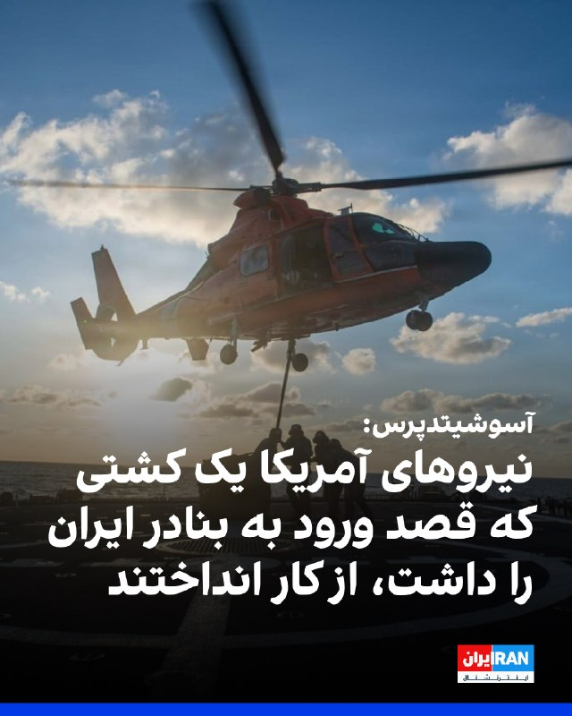

خبرگزاری آسوشیتدپرس به نقل از یک مقام آمریکایی خبر داد که ناوگان آمریکا یک کشتی تجاری با پرچم گامبیا را که تلاش داشت محاصره بنادر ایران را بشکند، متوقف کرده و از کار انداختند.
بر اساس این گزارش، این کشتی از سوی هواپیماهای آمریکایی از کار انداخته شد و نیروهای آمریکایی وارد آن نشدند.

روز شنبه پیت هگست، وزیر جنگ آمریکا، در حاشیه نشست «گفت‌وگوی شانگری‌لا» در سنگاپور، درباره محاصره بنادر و سواحل جنوبی ایران گفت که محاصره دریایی ادامه دارد و این اقدام موثر بوده و کنترل تنگه هرمز در اختیار آمریکا است.
‌🏁 🇬🇧 IranintlTV

🤖 @VahidOOnLine

## VahidOOnLine — post 242929

  

نواف سلام، نخست‌وزیر لبنان گفت این کشور در حال حاضر با سخت‌ترین مرحله در تاریخ خود روبه‌رو است.
نواف سلام تاکید کرد که تصمیم جنگ و صلح باید فقط در اختیار دولت باشد. پیش‌تر نواف سلام بر ضرورت خلع سلاح حزب‌الله از سوی خود لبنانی‌ها و و بازگرداندن انحصار سلاح به دولت تاکید کرده بود.
‌🏁 🇬🇧 IranintlTV

🤖 @VahidOOnLine

## WithYashar — post 12944

نماینده سیستان و بلوچستان در مجلس : برخی از مناطق زاهدان ۲۴ تا ۴۸ ساعت آب ندارند. ادامه بحران آب، استان را با چالش‌های امنیتی و اجتماعی روبه‌رو می‌کند
@withyashar

## WithYashar — post 12943

سخنگوی فدراسیون فوتبال:
روزبه چشمی به‌دلیل مصدومیت جام جهانی را از دست داد
@withyashar

## mwarmonitor — post 9920

🔴جنگنده آمریکایی F-15E Strike Eagle که در ماه آوریل بر فراز جنوب‌غربی ایران سرنگون شد، احتمالاً توسط یک موشک دوش‌پرتاب ساخت چین هدف قرار گرفته است؛ این موضوع را سه نفر آشنا با این پرونده اعلام کرده‌اند. — NBC News

@mwarmonitor

## mwarmonitor — post 9919

  <a href="telegram/content/mwarmonitor_9919_1780159858.mp4" target="_blank">🎬 Download video</a>

📝 واقعیت این است که به وضوح همین پروپاگاندای مضحک دیده می‌شود؛ خبرنگار صداوسیما را فرستاده‌اند وسط فروشگاه تا از مردمی که از خط فقر هم پایین‌تر سرنگون شده‌اند، اعترافِ اجباریِ «خدا را شکر همه‌چیز هست» بگیرد! قفسه‌های پر از روغن و برنج را به رخ ملت می‌کشند، انگار مردم به خاطر «کمبود جنس» گرسنه‌اند، نه به خاطر بی‌پولی و نکبتی که گریبان‌گیرشان شده است.

🔸اینکه اسم همان کوپنِ دهه شصت را بگذاری «طرح الکترونیکی» و هر چند ماه یک‌بار به عنوان یک فتح‌الفتوح جدید در اخبار جار بزنی، اوج وقاحت و تحقیر یک ملت است. نمایشِ پر بودن قفسه‌ها دقیقاً مثل این است که به یک آدم تشنه در بیابان، عکس یک پارچ آب یخ نشان بدهی و بگویی: «ببین چقدر فراوانی است، حالا اگر پول داری بخر، اگر هم نداری کارتِ گداییِ الکترونیکی‌ات را بکش!» این‌ها فقط یاد گرفته‌اند صورت‌مسئله را پاک کنند و با شوهای تلویزیونی، روی فلاکت و خاکِ سیاهی که مردم را به آن نشانده‌اند، رنگ و لعابِ مدرنیته بپاشند.

@mwarmonitor

## mwarmonitor — post 9918

🔴 یک مقام آمریکایی: یک کشتی تجاری که تلاش داشت به سمت یک بندر ایرانی حرکت کند، متوقف شد.

🔸این نفتکش/کشتی با نام «لیان استار» هشدارهای نیروهای دریایی ما در خلیج عمان را نادیده گرفته بود.

@mwarmonitor

## FoxNewsTwitter — post 342431

  

Fox News (Twitter/X)

Jaxson Dart is breaking his silence after receiving pushback for introducing President Trump at a rally, saying his decision comes down to one thing: respect for the office.

The Giants quarterback tells reporters he has always viewed the presidency as a position worthy of respect, regardless of party affiliation, pointing to his family's long history of military service.

## FoxNewsTwitter — post 342430

  

Fox News (Twitter/X)

CHARGED: Anti-ICE agitator bit two federal officers during clashes outside Newark's Delaney Hall, leaving bloody wounds that sent both agents to the hospital.

Brendan John Geier, 26, now faces federal charges for assaulting officers who told his group to clear the road. He kicked one officer and sank his teeth into two others, according to the DOJ.

Acting AG Todd Blanche posted photos of the bloodied agents: 'These riots are clearly not peaceful protests as you can see from the photos of these horrific wounds.'

## FoxNewsTwitter — post 342429

  <a href="telegram/content/FoxNewsTwitter_342429_1780159861.mp4" target="_blank">🎬 Download video</a>

Fox News (Twitter/X)

"They both should be in jail."

Los Angeles mayoral candidate Spencer Pratt argues California Gov. Gavin Newsom and Los Angeles Mayor Karen Bass should be behind bars over their alleged "negligence" while in office.

The reality TV star claims the pair of Democrats "make up stats" on homelessness — and that the city's crisis has only gotten worse under their watch. | @SatAmericaFNC @kayleighmcenany

## FoxNewsTwitter — post 342428

‌Fox News (Twitter/X)

👉 Full story here:

## FoxNewsTwitter — post 342427

Fox News (Twitter/X)

DAVID MARCUS: Democrats own the chaos at Newark's anti-ICE riots — Antifa agitators screamed 'Every Cop, Every Fed, Shoot Yourself in the Head' at officers while progressive White women berated Black men as 'race traitors' with 'the wrong skin color.' Gov. Sherrill finally deployed state police after a week of violence, but blamed ICE for wanting to 'stoke' the confrontation. Zero evidence offered for that claim.

## pm_afshaa — post 91901

  <a href="telegram/content/pm_afshaa_91901_1780159862.webm" target="_blank">🎬 Download video</a>

🔴ان‌بی‌سی نیوز: احتمال داره ایران در جریان درگیری‌های اخیر، از یک موشک ساخت چین برای سرنگونی یک جنگنده F-15E استرایک ایگل آمریکا استفاده کرده باشد.

💧 Rainbet.com the #1 Non-KYC Crypto Casino & Sportsbook @rainbetcom

😁 @Pm_Afshaa

## iaghapour — post 2643

  

⭕️ ساخت فیلترشکن پرسرعت و رایگان با ورکر کلودفلر (تست شده)

🔹در این ویدیو به صورت قدم‌به‌قدم بهتون آموزش دادم که چطور با استفاده از Cloudflare Workers یک فیلترشکن کاملاً رایگان، و پرسرعت برای خودتون بسازید. این روش کاملاً تست شده و می‌تونید به راحتی روی گوشی و کامپیوتر ازش استفاده کنید.

🔗 تماشا ویدیو در یوتیوب

#آموزش #فیلترشکن #رایگان #پروکسی #نوا #novaproxy
برای دور زدن فیلترینگ و آموزش تکنولوژی و هوش مصنوعی ما رو دنبال کنید 💚
🆔@iaghapour

## DEJradio — post 5157

  <a href="telegram/content/DEJradio_5157_1780159863.webm" target="_blank">🎬 Download video</a>

🚨📢 نشست امنیتی «دریای سیاه» در اودسا
شاهزاده رضا پهلوی خطاب به رهبران غرب:
رژیم ایران را مدیریت نکنید، تمامش کنید

شاهزاده رضا پهلوی روز شنبه نهم خرداد ۱۴۰۵ در نشست امنیتی «دریای سیاه» در اودسا خطاب به رهبران غرب گفت «رژیم تروریستی جمهوری اسلامی را مدیریت نکنید؛ به آن پایان دهید.»
او با هشدار درباره تهدیدهای مشترک علیه جهان آزاد تاکید کرد: «محور مسکو و تهران یک دشمن هماهنگ برای همه ماست و باید با قدرت، انسجام و قاطعیت با آن مقابله شود.»

پهلوی همچنین با انتقاد از سیاست توافق و امتیازدهی به حکومت تهران گفت: «هیچ‌یک از توافق‌هایی که تاکنون با جمهوری اسلامی انجام شده، همان‌گونه که توافق‌های مشابه با اتحاد جماهیر شوروی نتوانستند مشکل را حل کنند، راه‌حل پایدار نبوده‌اند.»

#شاهزاده_رضا_پهلوی #جمهوری_اسلامی
@DEJradio

## DEJradio — post 5156

  <a href="telegram/content/DEJradio_5156_1780159864.webm" target="_blank">🎬 Download video</a>

🔺🎤 کابینه ترامپ و میانجی‌گری عمان در پی احیای روابط با تهران

گفت‌وگو با شایان سمیعی، کارشناس امنیت ملی

#عمان #مذاکرات
@DEJradio

## IranIntlTV — post 339766

  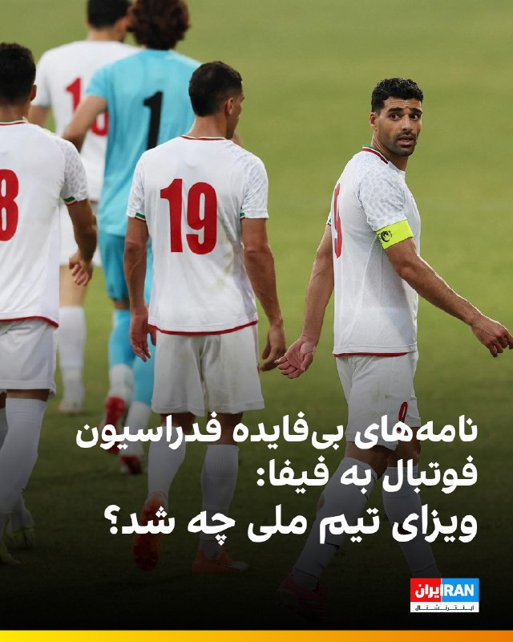

🔻در فاصله ۱۲ روز تا جام جهانی، خبرگزاری مهر گزارش داده که فدراسیون فوتبال در پی ابهام صادر نشدن ویزای تیم ملی «با ارسال نامه‌ای جدید به فیفا خواستار تعیین تکلیف فوری این پرونده شده است.»

🔹به نوشته خبرگزاری مهر فیفا پاسخی به نامه‌های فدراسیون فوتبال نمی‌دهد.

🔹روز گذشته مهدی محمدنبی، سرپرست تیم ملی گفت که نه ویزای مکزیک و نه ویزای آمریکا صادر نشده است.

🔹به گفته او، «در آخرین مذاکرات اعلام شده است که «پروسه اداری، به احتمال بسیار زیاد، در همین هفته انجام می‌شود.»

🔹سرپرست تیم ملی گفت: «ایمیلی به فیفا زدیم تا بدانیم چه روزی ویزاها صادر می‌شود. ما هم به ویزای مولتی مکزیک نیاز داریم و هم به ویزای مولتی آمریکا.»

🔹پیش‌تر، مهدی تاج، رئیس فدراسیون فوتبال، گفته بود برای حل مشکل ویزا، کمپ تیم ملی از آریزونای آمریکا به تیخوانای مکزیک تغییر کرده است.

🔹از سوی دیگر، ابوالفضل پسندیده، سفیر جمهوری اسلامی در مکزیک در حاشیه سفر به شهر تیخوانا که محل اصلی کمپ تیم ملی برای جام جهانی است گفت که هنوز مشخص نیست که آمریکا به تیم ملی ویزا می‌دهد یا نه.

@iranintltvsport

## IranIntlTV — post 339765

  <a href="telegram/content/IranIntlTV_339765_1780159865.mp4" target="_blank">🎬 Download video</a>

تیتر اول با نیوشا صارمی، شنبه ۹ خرداد
@iranintltv

## IranIntlTV — post 339764

  

بر اساس گزارش‌ها پیمان دستجردی کرمانشاهی، ۳۲ساله و فیلمبردار، روز ۳۱ فروردین با اتهام‌های «تبلیغ علیه نظام، همکاری با اسرائیل از طریق انتشار استوری، توهین به مقدسات و  توهین به رهبری» بازداشت و به زندان لاکان رشت منتقل شده و از وضعیت او اطلاعی در دست نیست.

او پیش‌تر نیز در ابتدای جنگ آمریکا و اسرائیل با جمهوری اسلامی، به‌دلیل انتشار استوری‌های اینستاگرامی بازداشت و پس از مدتی با قرار وثیقه آزاد شده بود.
https://iranintl.com/202605303854

## IranIntlTV — post 339763

  <a href="telegram/content/IranIntlTV_339763_1780159866.mp4" target="_blank">🎬 Download video</a>

جمهوری اسلامی از ایجاد نهادی می‌گوید که در آن کشتی‌ها برای عبور از تنگه هرمز باید از نهاد مورد نظر مجوز بگیرند. ایالات متحده و برخی منتقدان این سازوکار را خطرناک‌ ارزیابی کرده‌اند.
مهدی بیگی، عضو تحریریه ایران‌اینترنشنال، در «پیوست» به این موضوع می‌پردازد
@iranintltv

## IranIntlTV — post 339762

  

خبرگزاری آسوشیتدپرس به نقل از یک مقام آمریکایی خبر داد که ناوگان آمریکا یک کشتی تجاری با پرچم گامبیا را که تلاش داشت محاصره بنادر ایران را بشکند، متوقف کرده و از کار انداختند.
بر اساس این گزارش، این کشتی از سوی هواپیماهای آمریکایی از کار انداخته شد و نیروهای آمریکایی وارد آن نشدند.

روز شنبه پیت هگست، وزیر جنگ آمریکا، در حاشیه نشست «گفت‌وگوی شانگری‌لا» در سنگاپور، درباره محاصره بنادر و سواحل جنوبی ایران گفت که محاصره دریایی ادامه دارد و این اقدام موثر بوده و کنترل تنگه هرمز در اختیار آمریکا است.
https://iranintl.com/202605306829

## IranIntlTV — post 339761

## IranIntlTV — post 339760

  

نواف سلام، نخست‌وزیر لبنان گفت این کشور در حال حاضر با سخت‌ترین مرحله در تاریخ خود روبه‌رو است.
نواف سلام تاکید کرد که تصمیم جنگ و صلح باید فقط در اختیار دولت باشد. پیش‌تر نواف سلام بر ضرورت خلع سلاح حزب‌الله از سوی خود لبنانی‌ها و و بازگرداندن انحصار سلاح به دولت تاکید کرده بود.
https://iranintl.com/202605308844

## IranIntlTV — post 339759

  <a href="telegram/content/IranIntlTV_339759_1780159869.mp4" target="_blank">🎬 Download video</a>

در حالی که وزیر جنگ آمریکا اعلام کرد واشینگتن آماده ازسرگیری حملات فوری به ایران در صورت شکست دیپلماسی است، به نظر می‌رسد سپاه با دو مرحله‌ای کردن توافق، ترامپ را در تله پایان جنگ بدون دستاورد نقد در مورد برنامه هسته‌ای جمهوری اسلامی انداخته است.

گزارشی از مجتبا پورمحسن
@iranintltv

## IranIntlTV — post 339758

  <a href="telegram/content/IranIntlTV_339758_1780159871.mp4" target="_blank">🎬 Download video</a>

شاهزاده رضا پهلوی در نشست امنیتی دریای سیاه در اودسای اوکراین خواستار حمایت جهانی از مردم ایران برای تغییر رژیم جمهوری اسلامی شد. او گفت تهران و مسکو معماران مشترک بی‌ثباتی در نظم جهانی هستند.

گفت‌وگو با نوید محبی، تحلیل‌گر سیاسی
@iranintltv

## IranIntlTV — post 339757

  

🔻دبیر سازمان لیگ اعلام کرد که نمایندگان فوتبال ایران برای فصل آینده مسابقات آسیایی، بر اساس جدول لیگ برتر معرفی می شوند: «با توجه به وضعیت کشور در دوران جنگ و کمک به روند آماده‌سازی تیم ملی برای جام جهانی، امکان برگزاری ادامه رقابت‌های بیست و پنجمین دوره لیگ برتر وجود نداشت.»

🔹به گفته محمدرضا کشوری‌فرد، کنفدراسیون فوتبال آسیا مهلت لازم را نداد که پس از برگزاری مسابقات لیگ برتر نمایندگان ایران برای حضور در لیگ‌های آسیایی معرفی شوند.

🔹او گفت: «ما هم طبق قانون و عرف جهان فوتبال مجبور شدیم برای معرفی نمایندگان ایران به جدول ثابت مانده لیگ برتر رجوع کنیم. با توجه به مهلت تعیین شده تا ۱۰ خرداد ۱۴۰۵ براساس جدول فعلی لیگ برتر باشگاه ها به ای‌اف‌سی معرفی می شوند.»

🔹با توجه به جدول لیگ برتر در پایان هفته بیست و دوم، تیم‌های استقلال و تراکتور نمایندگان ایران در لیگ نخبگان آسیا و سپاهان،‌ نماینده ایران در سطح ۲ لیگ قهرمانان آسیا خواهند بود.

🔹این تصمیم که از مدتها پیش به عنوان راه‌حل نهایی سهمیه آسیا شناخته می‌شد، درحالی اعلام شده که در هفته‌های گذشته جنجال‌های زیادی دراین‌باره به راه افتاده بود

@iranintltvsport

## reutersworldchannel — post 151525

  

Trump says he will soon decide on Iran deal, demands reopening of Hormuz Strait

U.S. President Donald Trump said on Friday he ​would soon decide on a proposed deal to extend the ceasefire with Iran, though the two countries still appeared to differ on significant issues ‌that have been central to the conflict.

Trump said on Friday morning that he would meet in a secure White House room to make a "final determination" on the proposal, which would extend an early-April truce for another 60 days, giving negotiators time to forge a permanent end to the war. read more

## FarsiVOA — post 219097

فرماندهی جنوبی آمریکا اعلام کرد که روز ۸ خرداد به یک شناور متعلق به یک سازمان تروریستی حمله کرده است.

به گفته این فرماندهی، اطلاعات موجود نشان می‌داد این شناور در مسیرهای شناخته‌شده قاچاق مواد مخدر در شرق اقیانوس آرام در حال تردد بوده و در عملیات قاچاق مواد مخدر مشارکت داشته است.

فرماندهی جنوبی آمریکا اعلام کرد سه نفر در این عملیات کشته شدند و هیچ یک از نیروهای نظامی آمریکا آسیب ندیدند.

@FarsiVOA

## FarsiVOA — post 219096

  <a href="telegram/content/FarsiVOA_219096_1780159874.mp4" target="_blank">🎬 Download video</a>

گلایه یک شهروند از گرانی؛ «یک دانه موز ۱۸۰ هزار تومان»؛

در سایه بی‌ثباتی اقتصادی و فشارهای مداوم، زندگی روزمره بسیاری از مردم به میدان مبارزه‌ای خاموش برای تأمین حداقل‌ها تبدیل شده است.

روزنامه شرق در گزارشی میدانی از تهران، از بازگشت دفترهای نسیه در سوپرمارکت‌ها، خرید اعتباری اقلامی مانند نان، پنیر، حبوبات، روغن و رب، و سقوط طبقه متوسط به وضعیت بقا تا پایان ماه روایت کرده است.

## FarsiVOA — post 219094

فرماندهی مرکزی ایالات متحده، سنتکام، تصاویری از فرود یک جنگنده «اف-۳۵ بی» تفنگداران دریایی آمریکا روی عرشه ناو «یو‌اس‌اس تریپولی» در جریان عبور از دریای عرب منتشر کرد.

سنتکام می‌گوید «اف-۳۵ بی» برای برخاست کوتاه و فرود عمودی طراحی شده است.

@FarsiVOA

## FarsiVOA — post 219093

🔺روبیو: تام باراک همچنان در مورد سوریه و عراق نقش محوری ایفا خواهد کرد

▪️مارکو روبیو، وزیر امور خارجه آمریکا، اعلام کرد تام باراک، سفیر ایالات متحده در ترکیه، با وجود پایان یافتن نقشش به‌عنوان نماینده ویژه آمریکا در امور سوریه، همچنان در سیاست‌گذاری آمریکا درباره سوریه و عراق نقش مهمی ایفا خواهد کرد.

⬇️ بیشتر بخوانید:

https://ir.voanews.com/a/rubio-backs-tom-barrack-regional-role/8155576.html/?nocach=1

## FarsiVOA — post 219092

گفت‌و‌گو با دکتر بابک خطی، پزشک و فعال سیاسی، درباره مهاجرت پرستاران و پزشکان تیر خلاص به بخش درمان ایران

## FarsiVOA — post 219091

  <a href="telegram/content/FarsiVOA_219091_1780159876.mp4" target="_blank">🎬 Download video</a>

«حال‌ وش» ویدیویی از لحظه زورگیری مسلحانه از یک شهروند در زاهدان را منتشر کرده است. در این ویدیو که مربوط به ۳۱ اردیبهشت ۱۴۰۵ است دو موتورسوار مسلح با تهدید، تلفن همراه و پول نقد یک شهروند را سرقت کرده و از محل متواری می‌شوند.

سایه جنگ، افزایش تورم، فشارهای اقتصادی و قطعی اینترنت، هم‌زمان با تغییر الگوی جرائم، چهره ناامنی شهری در ایران را دگرگون کرده است.

## FarsiVOA — post 219090

در گفت‌وگو با شاهین مدرس، پژوهشگر مطالعات امنیتی، تعویق در اعلام نتیجه نشست پرزیدنت ترامپ را بررسی کردیم. وقفه‌ای که به گفته او نشان می‌دهد واشنگتن برای تصمیم نهایی عجله‌ای ندارد و فاکتور زمان، برخلاف تصور رژیم ایران، هرچه بیشتر به زیان جمهوری اسلامی عمل می‌کند.

## DW_Farsi — post 125323

  

🔶 اسرائيل دستور تخلیه ۱۰ روستای لبنان را صادر کرد

ارتش اسرائیل پس از چند حمله از سوی حزب‌الله لبنان، از ساکنان ۱۰ روستای این کشور خواست تا خانه‌های خود را تخلیه کنند.

به گزارش رسانه‌های آلمان، یک سخنگوی ارتش اسرائيل گفت، این اقدام در پاسخ به نقض مداوم آتش‌بس از سوی حزب‌الله صورت گرفت است.

همزمان شبکه‌های تلویزیونی عربی از حملات هوایی اسرائیل به اهدافی در شهر نبطیه لبنان و حومه آن گزارش داده‌اند. طبق‌ گزارش شبکه تلویزیونی "ال‌بی‌سی" لبنان، در این حملات دست‌کم سه نفر کشته شده‌اند؛ هر چند که این آمار هنوز به طور رسمی تأیید نشده است.

به گفته ارتش اسرائیل، گروه حزب‌الله در طول شب گذشته ۲۹ مه در چهار حمله حدود ۱۰ تا ۱۵ موشک به شمال اسرائیل شلیک کرده است.

روزنامه اسرائیلی هاآرتص نیز به نقل از مقامات محلی گزارش داد که تنها ۱۰ فروند از این پرتابه‌ها به سمت شهر مرزی "کریات شمونا" هدایت شدند.

طبق این گزارش، پدافند هوایی اسرائیل ۹ موشک را رهگیری و منهدم کرد. یکی از موشک‌ها به مرکز شهر اصابت کرد و خسارات مالی بر جای گذاشت، اما این حادثه هیچ مجروحی در پی نداشت.

@dw_farsi

## DW_Farsi — post 125322

  

🔶 نیویورک‌ پست: آزادی وجوه ایران در قطر از گره‌های توافق با آمریکاست

روزنامه آمریکایی نیویورک پست در گزارشی شرح داده که آزادسازی ۶ میلیارد دلار ایران که در پی توافق تبادل زندانی میان ایران و آمریکا در سال ۲۰۲۳ در قطر بلوکه شده بود، از جمله آخرین گره‌های دستیابی به توافق در مذاکرات صلح بین ایران و آمریکاست.

نیویورک ‌پست به نقل از یک مقام آمریکایی نوشت که این دارایی‌ها به تدریج و در قالب محموله‌های غذایی و دارویی آزاد خواهند شد، مشروط بر اینکه ایران به تعهدات خود، از جمله بازگشایی و مین‌روبی تنگه هرمز عمل کند.

در این گزارش مشخص نشده که این مقام مسئول در حال تشریح پیشنهاد ایالات متحده است یا به بند خاصی از پیش‌نویس توافق اشاره دارد.

در سپتامبر ۲۰۲۳ و به عنوان بخشی از توافقی که به آزادی پنج تن از اتباع هر یک از این دو کشور انجامید، جو بایدن، رئیس‌جمهور وقت آمریکا، تحریم‌هایی را که مانع برداشت ۶میلیارد دلار دارایی ایران از کره جنوبی می‌شد لغو کرد.

این وجوه سپس از کره جنوبی به حساب‌هایی در قطر منتقل شد، اما پس از حمله ۷ اکتبر ۲۰۲۳ گروه حماس به جنوب اسرائیل و آغاز جنگ غزه، مسدود ماند.

@dw_farsi

## Persian_Trend_Official — post 15347

https://www.instagram.com/reel/DY9_9XQNm3g/?igsh=MWh2Z3d5eXRvcnhoMg==

پیج اینستاگرام پرشین ترند رو فالو کردید ؟

## Persian_Trend_Official — post 15346

  <a href="telegram/content/Persian_Trend_Official_15346_1780159879.webm" target="_blank">🎬 Download video</a>

قرارگاه مرکزی خاتم‌الانبیا: مدیریت تنگه هرمز توسط نیروهای مسلح جمهوری اسلامی ایران با اقتدار کامل اعمال می‌شود.

قرارگاه مرکزی خاتم الانبیا در بیانیه ای اعلام کرد: با توجه به یکپارچگی این مسیر، تأکید می‌شود کلیه کشتی‌ها، شناورهای تجاری و نفتکش‌ها صرفاً ملزم به تردد از مسیرهای تعیین‌شده و اخذ مجوز از نیروی دریایی سپاه پاسداران انقلاب اسلامی هستند. هرگونه تخلف از این ضوابط، امنیت تردد آن‌ها را با مخاطره جدی مواجه خواهد کرد.

همچنین هشدار داده می‌شود هرگونه اقدام شناورهای نظامی جهت مداخله در مدیریت تنگه هرمز یا ایجاد اختلال در تردد، مورد هدف نیروهای مسلح جمهوری اسلامی ایران قرار خواهد گرفت.

📝 Amir

📌 @persian_trend_official
پرشین ترند | متفاوت‌ترین کانال نظامی

## Persian_Trend_Official — post 15345

  

یک مقام آمریکایی آگاه به خبرگزاری آسوشیتدپرس گفت که ارتش آمریکا یک کشتی تجاری دیگر را که سعی داشت از محاصره بنادر ایران توسط آمریکا عبور کند، متوقف کرده است.

📝 Amir

📌 @persian_trend_official
پرشین ترند | متفاوت‌ترین کانال نظامی

## RadioFarda — post 157727

  <a href="https://t.me/radiofarda/157727" target="_blank">📎 Download file</a>

📻بشنوید: ایستگاه ۱۹ با رادیوفردا، نهم خرداد ۱۴۰۵

@RadioFarda

## RadioFarda — post 157726

  <a href="https://t.me/radiofarda/157726" target="_blank">📎 Download file</a>

آیا جهان در آستانه شوک تازه انرژی قرار گرفته است؟

🔸مدیران چهار نهاد بزرگ اقتصادی جهان شامل آژانس بین‌المللی انرژی، صندوق بین‌المللی پول، بانک جهانی و سازمان تجارت جهانی هشدار داده‌اند ادامه درگیری‌ها در خاورمیانه، عرضه انرژی، تجارت جهانی و اقتصاد کشورهای آسیب‌پذیر را به‌طور جدی تحت فشار قرار داده است. این نهادها می‌گویند اختلال در تردد نفتکش‌ها از تنگه هرمز، افزایش قیمت سوخت و کود شیمیایی و نااطمینانی اقتصادی، بیش از همه به کشورهای فقیر آسیب می‌زند. حسن منصور، اقتصاددان در بریتانیا به این پرسش پاسخ می‌دهد که هشدار هم‌زمان چهار نهاد بزرگ اقتصادی جهان را باید تا چه حد جدی گرفت؟

@RadioFarda

## RadioFarda — post 157725

  <a href="https://t.me/radiofarda/157725" target="_blank">📎 Download file</a>

لبنان میان فشار دیپلماسی و آتش جنگ؛ گفت‌وگو با مهرداد فرهمند

🔸در حالی که جمهوری اسلامی در مذاکرات با آمریکا بر پایان جنگ در همه جبهه‌ها، از جمله لبنان، تأکید می‌کند، نمایندگان لبنان و اسرائیل نیز با میانجی‌گری آمریکا در پنتاگون گفت‌وگوهایی امنیتی و نظامی برگزار کردند؛ مذاکراتی که بر تثبیت آتش‌بس شکننده و کاهش تنش متمرکز بود، نه یک توافق سیاسی جامع. هم‌زمان، بنیامین نتانیاهو مدعی شده نیروهای اسرائیلی از رود لیتانی عبور کرده‌اند؛ ادعایی که حزب‌الله آن را رد می‌کند. اکنون این پرسش مطرح است که آیا لبنان به بخشی تعیین‌کننده از معامله بزرگ‌تر میان تهران و واشینگتن تبدیل شده، یا همچنان در مدار یک جنگ فرسایشی باقی خواهد ماند؟ ارزیابی مهرداد فرهمند، تحلیل‌گر مسائل خاورمیانه، را بشنویم.

@RadioFarda

## RadioFarda — post 157724

  

🔸سپیده قلیان، فعال مدنی و زندانی سیاسی، روز شنبه نهم خرداد پس از پایان محکومیت شش‌ماهه خود از زندان وکیل‌آباد مشهد آزاد شد.

🔸او ساعاتی پس از آزادی با انتشار تصویری از حضور خود بر مزار خسرو علیکردی، وکیل دادگستری، نوشت: «از زندان یک راست آمدم سر خاک خسرو» و افزود که «از هرچه خسته شوم، از رسیدن به آزادی و حمل کردن سنگ‌های سخت حقیقت خسته نخواهم شد.»

🔸قلیان همچنین با اشاره به هم‌بندی‌های خود در زندان وکیل‌آباد نوشت که هنگام خداحافظی، در چشمان آنان تنها یک جمله می‌دید: «ما را فراموش نکنید.»

🔸سپیده قلیان در بخش دیگری از پیام خود نوشت که نام زندانیان و کشته‌شدگان ماه‌های اخیر را «فریاد خواهد زد» و افزود: «کاش شهرزاد قصه‌شان باشم.»

🔸سپیده قلیان ۲۱ آذر ۱۴۰۴ در جریان مراسم ترحیم خسرو علیکردی در مشهد بازداشت شد. آن مراسم با برخورد نیروهای امنیتی و انتظامی همراه بود و در جریان آن شماری از حاضران، از جمله نرگس محمدی، عالیه مطلب‌زاده و جواد علیکردی، برادر خسرو علیکردی، نیز بازداشت شدند.

@RadioFarda

## IranianMinds — post 21078

  <a href="telegram/content/IranianMinds_21078_1780159881.mp4" target="_blank">🎬 Download video</a>

🔴 حملات هوای ارتش اسرائیل به جنوب لبنان در دقایقی پیش.

@IranianMinds

## IranianMinds — post 21077

  

@IranianMinds

## IranianMinds — post 21076

🔴آسو‌شیتد‌پرس به نقل از یک منبع آمریکایی:

ارتش آمریکا یک کشتی تجاری را که قصد داشت به سمت یکی از بنادر ایران برود، منع کرد.

@IranianMinds

## IranianMinds — post 21075

  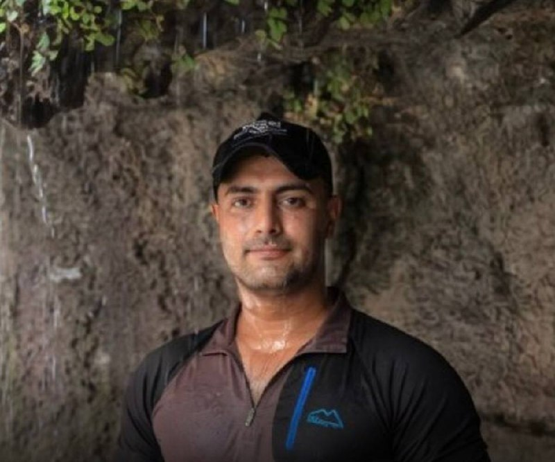

🔴 بنیامین نقدی، زندانی سیاسی و از معترضان دی‌ماه، از سوی دادگاه انقلاب شیراز به اعدام محکوم شد.

@IranianMinds

## BBCPersian — post 282437

  

🔻به گزارش هرانا، ارگان خبری مجموعه فعالان حقوق بشر در ایران، سپیده قلیان، زندانی سیاسی امروز(شنبه ۹ خرداد) از زندان وکیل آباد مشهد آزاد شده است.

آزادی او پس از پایان دوران شش ماه محکومیت حبس تعزیری صورت گرفته است.

خانم قلیان اواخر آذرماه سال پیش (۱۴۰۴) در مراسم هفتم خسرو علیکردی در مشهد به همراه نرگس محمدی، عالیه مطلب‌زاده و پوران ناظمی بازداشت شد.

او در دی‌ماه سال پیش در دادگاه انقلاب مشهد محاکمه شد و در بهمن ماه به «اجتماع و تبانی برای ارتکاب جرم برضد امنیت داخلی/خارجی» و «تبلیغ علیه نظام» متهم شد که پنج سال حبس تعلیقی و شش ماه حبس تعزیری را برای او به همراه داشت.

این فعال سیاسی در خردادماه پارسال با پایان دوران محکومیت از زندان اوین آزاد شده بود.

@BBCPersian

## BBCPersian — post 282436

🔻در پی مشاهده شدن شیئی شبیه مین دریایی در تنگه هرمز، مرکز امنیت دریایی عمان به دریانوردان، ماهیگیران و شناورها هشدار داد که نهایت احتیاط را به خرج دهند.

این شیء مشکوک در آب‌های سرزمینی عمان و در غرب منطقه ترافیک ساحلی مشاهده شده است.

مرکز امنیت دریایی عمان به دریانوردان توصیه کرد که فاصله ایمن را از هر شی مشکوکی حفظ کنند و در صورت مشاهده، فورا موضوع را به مقام‌های ذی‌ربط گزارش دهند.

آمریکا بارها ایران را به تلاش برای مین‌گذاری در تنگه هرمز متهم کرده و یکی از شرایط توافق صلح با تهران را هم مین‌روبی این آبراه عنوان کرده است.

ایران هیچگاه رسما مین‌گذاری در این تنگه را تایید نکرده است.

@BBCPersian

## Dirty_Kids — post 390581

  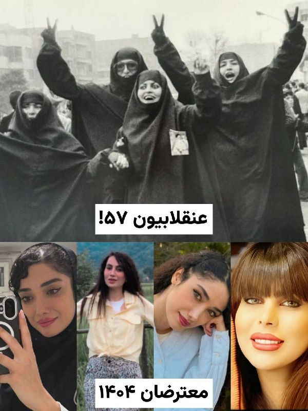

عکس گویای همه هست...

@Dirty_Kids 👻

## Dirty_Kids — post 390580

  

طبق تحقیقات جدید لب گرفتن از رفیق صمیمی‌تون مجازه و شما با اینکار همجنس‌باز به حساب نمیاین!

@Dirty_Kids 👻

## Dirty_Kids — post 390579

‏این که زخم‌ها قبل از خوب شدنشون می‌خارن و التماست می‌کنن تا دوباره بازشون کنی‌ خیلی استعارهٔ جالبیه. تحمل کردن خارشه، پیچ آخره. رد کنی تمومه.

@Dirty_Kids 👻

## Dirty_Kids — post 390578

  <a href="telegram/content/Dirty_Kids_390578_1780159885.mp4" target="_blank">🎬 Download video</a>

🔴 فیلم وایرال شده از حرکات عجیب عرزشیا تو تجمعات شبانه😐😂

@Dirty_Kids 👻

## Dirty_Kids — post 390577

  <a href="https://t.me/Dirty_Kids/390577" target="_blank">📎 Download file</a>

✅ اپلیکیشن اندروید سایت جهانی دربی بت

💰اولین سایت جهانی با امکان شارژ و برداشت ریالی(کارت به کارت)

🔗 برای ورود فیلترشکن روی کشور مناسب قرار دهید مانند فنلاند و المان و....

😀Telegram Channel
👇
https://t.me/+bcynkEgSW2dlYTc0

## Dirty_Kids — post 390576

  

😤دنبال یه سایت شرط بندی بین المللی بودی که به ایرانیا خدمات بده؟!
⛔

👍دربی بت همون انتخاب  100%

💎ویژگی های سایت جهانی Derby Bet:

⬅️امکان شارژ امن با کارت بانکی

⬅️واریز اول دوبل شارژ می شوید(بونوس۱۰۰٪)

⬅️پر اپشن ترین سایت فعال در ایران

⬅️تسویه حساب کمتر از 5 دقیقه

⬅️برگشت بخشی از باخت به صورت هفتگی

🚨کد هدیه ثبت نام:GG007

⚠️برای دانلود اپلکیشن کلیک کنید
👉

🔔کانال دربی بت :

🪙https://t.me/+bcynkEgSW2dlYTc0

## Dirty_Kids — post 390575

  <a href="telegram/content/Dirty_Kids_390575_1780159886.mp4" target="_blank">🎬 Download video</a>

گل اول ارسنال به پاریسس

گل سکسی هاورتززز

@Dirty_Kids 👻

## Dirty_Kids — post 390574

  <a href="telegram/content/Dirty_Kids_390574_1780159888.mp4" target="_blank">🎬 Download video</a>

جه جالب ما هم ساعت بلند ميشیم.فقط ما اون ساعت ميشاشم تو روح بنيانگذار جمهورى اسلامی و نايبش خامنه‌اى و مقوا

@Dirty_Kids 👻

## Dirty_Kids — post 390573

  

وقتی کلی مطلب برا غُرزدن اماده کرده بودم ولی یهویی میادمیگه دخترخوشگلِ من چطوره؟

@Dirty_Kids 👻

## Dirty_Kids — post 390572

  

🌎با بهبود نسبی وضعیت اینترنت و بازگشت محدود دسترسی به شبکه بین‌الملل، موفق شدیم ضمن حفظ کیفیت و پایداری سرویس‌ها، قیمت را تا هر گیگابایت 20 هزار تومان کاهش دهیم
🖥

🟣با وجود اینکه شرایط اینترنت همچنان ناپایدار است و وضعیت پهنای باند بین‌الملل به ثبات کامل نرسیده، تیم فنی بادبان با توسعه زیرساخت‌ها و بهره‌گیری از سرورهای جدید از سرویس‌دهندگان معتبر، توانسته هزینه‌ها را بهینه کرده و سرویس‌ها را با قیمت مناسب‌تری ارائه دهد
⛵️
G9
از همراهی و اعتماد شما سپاسگزاریم
💜

🛡@BadBan_VPN | کانال 

🤖@BadBan_VPNBot | ربات 

📞@BadBan_VPNSupport | پشتیبانی

## Hranews — post 113249

جمعی از پرستاران ساکن در یزد، صبح امروز با برگزاری تجمع اعتراضی مقابل ساختمان استانداری، نسبت به واریز نشدن تعرفه‌های خدمات پرستاری از شش ماه گذشته و عدم رسیدگی به مطالبات صنفی و مزدی خود، اعتراض کردند.
#پرستاران

↘️
@hranews_bot تماس ✉️ - @Hranews کانال هرانا 🆑

## Hranews — post 113248

  

زندان دولت‌آباد اصفهان؛ تداوم بازداشت مائده دانشمند به ۱۴۰ روز رسید

❗️
❗️
❗️
❗️
❗️– مائده دانشمند، از بازداشت شدگان مرتبط با اعتراضات سراسری ۱۴۰۴، بیش از چهار ماه است که در زندان دولت‌آباد اصفهان در بلاتکلیفی قضایی به‌سر می‌برد.

به گزارش خبرگزاری هرانا، ارگان خبری مجموعه فعالان حقوق بشر در ایران، مائده دانشمند همچنان در بازداشت بسر می‌برد.

بر اساس اطلاعات دریافتی هرانا، ۱۴۰ روز از بازداشت خانم دانشمند که که با اتهامات مرتبط با اعتراضات سراسری مواجه است، می‌گذرد. او هم‌اکنون در زندان دولت‌آباد اصفهان نگهداری می‌شود. وی همچنان در وضعیت بلاتکلیفی قضایی قرار دارد و امکان آزادی او با وثیقه نیز تاکنون میسر نشده است.

ادامه مطلب

#مائده_دانشمند

↘️
@hranews_bot تماس ✉️ - @Hranews کانال هرانا 🆑

## alonews — post 123767

  <a href="telegram/content/alonews_123767_1780159890.webm" target="_blank">🎬 Download video</a>

👈حزب‌الله ویدیوی جدیدی از حملات پهپاد FPV خود به مواضع ارتش اسرائیل منتشر کرده است

✅ @AloNews خبر جنگ

## alonews — post 123766

  <a href="telegram/content/alonews_123766_1780159890.webm" target="_blank">🎬 Download video</a>

👈رافائل گروسی مدیرکل آژانس بین‌المللی انرژی اتمی اعلام کرد ذخایر هسته‌ای یک نقطه اختلاف بین ایران و آمریکا است و برای کمک به حل آن آماده‌ایم.

✅ @AloNews خبر جنگ

## alonews — post 123764

  <a href="telegram/content/alonews_123764_1780159890.mp4" target="_blank">🎬 Download video</a>

👈حمله‌های شدیدِ ارتش اسرائیل ساعتی پیش، به جنوب لبنان

✅ @AloNews خبر جنگ

## alonews — post 123763

  <a href="telegram/content/alonews_123763_1780159891.webm" target="_blank">🎬 Download video</a>

👈وزیر جنگ آمریکا: دوستی واقعی بین واشنگتن و اسلام‌آباد در حال شکل‌گیری است؛ این مدیون رهبری پاکستان است که به تلاش‌ها برای مذاکره با ایران کمک کرده

✅ @AloNews خبر جنگ

## alonews — post 123762

  <a href="telegram/content/alonews_123762_1780159891.mp4" target="_blank">🎬 Download video</a>

گلللللل اووول آرسنال به پاریس توووسط هاورتزز دقیقه 6
@AloSport

## alonews — post 123761

  <a href="telegram/content/alonews_123761_1780159892.webm" target="_blank">🎬 Download video</a>

👈هم اکنون نیروی دریایی ارتش آمریکا از شلیک و متوقف کردن یک کشتی تجاری ایرانی که قصد داشت به بنادر ایران وارد شود خبر داد

✅ @AloNews خبر جنگ

## alonews — post 123760

  <a href="telegram/content/alonews_123760_1780159893.webm" target="_blank">🎬 Download video</a>

👈رضا پهلوی: مردم ایران از هدف قرار گرفتن زیرساخت‌ها خوشحال شدن ‌
✅ @AloNews خبر جنگ

## alonews — post 123759

  <a href="telegram/content/alonews_123759_1780159893.webm" target="_blank">🎬 Download video</a>

👈رضا پهلوی: مردم ایران از هدف قرار گرفتن زیرساخت‌ها خوشحال شدن

‌
✅ @AloNews خبر جنگ

## alonews — post 123758

  <a href="telegram/content/alonews_123758_1780159893.webm" target="_blank">🎬 Download video</a>

👈مدیرعامل آروان کلاد: زمانبر بودن بهبود وضعیت اینترنت از نظر فنی فقط بهانه ست، نت رو گذاشتن رو حالتی که اگر خواستند سریع قطع یا وصل کنند

✅ @AloNews خبر جنگ

## alonews — post 123757

  <a href="telegram/content/alonews_123757_1780159893.webm" target="_blank">🎬 Download video</a>

👈مقام آمریکایی به AP : یه کشتی تجاری که قصد داشت به سمت یکی از بنادر ایران بره، متوقف شده 
✅ @AloNews خبر جنگ

## alonews — post 123756

  <a href="telegram/content/alonews_123756_1780159893.mp4" target="_blank">🎬 Download video</a>

👈نیویورک تایمز: ترامپ بارها جی‌دی ونس را دست انداخته است

🔴نیویورک تایمز گزارش داد دونالد ترامپ بارها در جلسات و محافل مختلف جی‌دی ونس را درباره مسائل سیاسی و شخصی مورد شوخی و انتقاد قرار داده است.
طبق این گزارش، ترامپ به مخالفت اولیه ونس با حمله به ایران، نتیجه سفر دیپلماتیک او به پاکستان، تعداد مرخصی‌هایش و حتی قطع کردن صحبت دیگران اشاره کرده است.
نیویورک تایمز همچنین نوشت ترامپ بارها ماجرای افتادن جام قهرمانی دانشگاه ایالتی اوهایو از دست ونس در یکی از مراسم‌های کاخ سفید را یادآوری کرده است.

✅ @AloNews خبر جنگ

## alonews — post 123755

  <a href="telegram/content/alonews_123755_1780159894.webm" target="_blank">🎬 Download video</a>

👈نماینده سیستان و بلوچستان در مجلس: برخی از مناطق زاهدان ۲۴ تا ۴۸ ساعت آب ندارند

🔴 ادامه بحران آب، استان را با چالش‌های امنیتی و اجتماعی روبه‌رو می‌کند

✅ @AloNews خبر جنگ

## alonews — post 123754

  <a href="telegram/content/alonews_123754_1780159894.webm" target="_blank">🎬 Download video</a>

👈مقام آمریکایی به AP : یه کشتی تجاری که قصد داشت به سمت یکی از بنادر ایران بره، متوقف شده

✅ @AloNews خبر جنگ

## alonews — post 123752

  <a href="telegram/content/alonews_123752_1780159894.webm" target="_blank">🎬 Download video</a>

👈سلفی حسین طاهری مداح و یک جان فدا

✅ @AloNews خبر جنگ

---
📅 بروزرسانی: 1405/03/09 19:15
---

## VahidOOnLine — post 242928

♦️ خبرگزاری رویترز تصاویر هوایی از آخرین وضعیت کشتی‌های سرگردان در آب‌های نزدیک به تنگه هرمز را منتشر کرد. در این تصاویر که صبح شنبه، نهم خرداد ثبت شده، صدها شناور از انواع مختلف دیده می‌شود که در فاصله‌های کمی از یکدیگر متوقف شده‌اند؛ وضعیتی که از اولین روزهای جنگ تاکنون ادامه داشته است.

جمهوری اسلامی با قرار دادن سازوکار جدیدی برای عبور از تنگه هرمز و تهدید کشتی‌هایی که از این سازوکار جدید تبعیت نکنند، از یک سو، و احتمال مین‌گذاری در این آبراه استراتژیک از سوی دیگر، باعث افزایش شدید قیمت‌های بیمه کشتی‌ها شده است. همین امر باعث شده این شناورها که میزبان هزاران ملوان هستند، با وجود سختی و هزینه‌های بسیار، از عبور از تنگه هرمز خودداری کنند.
‌🇸🇦 Indypersian

🤖 @VahidOOnLine

## VahidOOnLine — post 242927

  

قرارگاه مرکزی خاتم‌الانبیا در بیانیه‌ای اعلام کرد که هرگونه اقدام شناورهای نظامی جهت مداخله در مدیریت تنگه هرمز یا ایجاد اختلال در تردد، مورد هدف نیروهای مسلح جمهوری اسلامی قرار خواهد گرفت.
در این بیانیه آمده: «هرگونه تخلف از این ضوابط، امنیت تردد آن‌ها را با مخاطره جدی مواجه خواهد کرد.»

قرارگاه مرکزی خاتم‌الانبیا اعلام کرد کلیه کشتی‌ها، شناورهای تجاری و نفتکش‌ها صرفا ملزم به تردد از مسیرهای تعیین‌شده و اخذ مجوز از نیروی دریایی سپاه پاسداران هستند.
‌🏁 🇬🇧 IranintlTV

🤖 @VahidOOnLine

## VahidOOnLine — post 242926

  

مصطفی نیلی، وکیل دادگستری اعلام کرد بنیامین نقدی، زندانی سیاسی و از معترضان دی‌ماه، از سوی دادگاه انقلاب شیراز به اتهام «افسادفی‌الارض»، به اعدام محکوم شد.

این وکیل دادگستری به کانال امتداد گفت که بنیامین نقدی در شب سیزدهم دی ۱۴۰۴ در شیراز، به دلیل «شعله‌ور نمودن یک دستگاه کپسول آتش‌نشانی» به سمت مامورین نیروی انتظامی بازداشت شده بود.

مصطفی نیلی افزود پس از پایان تحقیقات مقدماتی کیفرخواست بنیامین نقدی با اتهام‌های «محاربه، عضویت در گروه‌های به هم‌زننده امنیت، اجتماع و تبانی به قصد انجام جرم علیه امنیت و فعالیت تبلیغی علیه نظام» صادر شد و نسبت به اتهام ایراد صدمه جسمانی به ماموران و حمل سلاح سرد منع تعقیب صادر شد.

نیلی، وکیل دادگستری گفت که در جلسه دادگاه، قضات تمامی اتهامات را مصداق افسادفی‌الارض تشخیص دادند و بر همین مبنا حکم اعدام برای بنیامین نقدی صادر کردند.
‌🏁 🇬🇧 IranintlTV

🤖 @VahidOOnLine

## VahidOOnLine — post 242925

  <a href="telegram/content/VahidOOnLine_242925_1780155930.mp4" target="_blank">🎬 Download video</a>

♦️همزمان با نزدیک شدن به عید قربان، ایستگاه‌های قطار در بنگلادش شاهد ازدحام شدید مسافران بوده‌اند؛ شهروندانی که برای گذراندن تعطیلات به زادگاه‌های خود بازمی‌گردند.
ویدیوی منتشرشده نشان می‌دهد صدها نفر حتی روی سقف و بدنه قطارها سوار شده‌اند؛ صحنه‌ای که هر سال در آستانه این مناسبت مذهبی تکرار می‌شود و نشان‌دهنده فشار بالای تقاضا بر سیستم حمل‌ونقل این کشور است.
عید قربان یکی از مهم‌ترین اعیاد مسلمانان است و در بنگلادش نیز مانند بسیاری از کشورهای اسلامی، میلیون‌ها نفر تلاش می‌کنند این روزها را در کنار خانواده‌های خود در شهرها و روستاهای محل تولدشان سپری کنند.
‌🇸🇦 Indypersian

🤖 @VahidOOnLine

## VahidOOnLine — post 242924

  

شاهزاده رضا پهلوی گفت که مردم ایران باید از طریق هوا حفاظت شوند و اینترنت و دیگر ابزار لازم را داشته باشند که دست به‌کار شوند و رژیم را به زانو درآورند.
او ادامه داد: «مردم حمله به زیرساخت‌های رژیم را جشن گرفتند و خیابان‌ها را به نام ترامپ نام‌گذاری کردند.»

شاهزاده رضا پهلوی ادامه داد: «دنیا باید تصمیم بگیرد که بعد از ۴۷ سال مماشات در کنار مردم ایران بایستد.»

او اضافه کرد: «مردم بین حمله به کشور و حمله به رژیم تمایز ایجاد می‌کنند.»
‌🏁 🇬🇧 IranintlTV

🤖 @VahidOOnLine

## VahidOOnLine — post 242923

  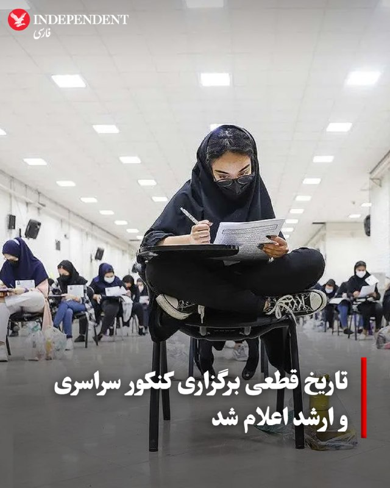

♦️ رضا محمدی، رئیس سازمان سنجش روز شنبه نهم خرداد اعلام کرد که کنکور سراسری و آزمون پذیرش دانشجومعلم به طور همزمان در روزهای پنجشنبه و جمعه، ۲۹ و ۳۰ مرداد، برگزار خواهد شد. بر اساس داده‌های سازمان سنجش، بیش از یک ملیون و ۸۰هزار نفر برای شرکت در کنکور سراسری و آزمون پذیرش دانشجومعلم ثبت نام کرده‌اند.

همچنین به گفته محمدی، افرادی که از ثبت نام در کنکور کارشناسی ارشد جا مانده‌اند از امروز، نهم خرداد تا ۱۱ خرداد فرصت ثبت نام دارند و آزمون این مقطع نیز در روزهای ۱۸ و ۱۹ تیر برگزار می‌شود.
‌🇸🇦 Indypersian

🤖 @VahidOOnLine

## WithYashar — post 12942

تلگراف: دو ژنرال قدرتمند، احمد وحیدی و محمد جعفری، با هم متحد شدن تا قالیباف رو از قدرت برکنار کنن.
@withyashar

## WithYashar — post 12941

شاهزاده رضا پهلوی در نشست «امنیت دریای سیاه» در اودسا، در جنوب اوکراین، گفت مردم ایران برای ساختن آینده کشور خود آماده‌اند و از جهان نمی‌خواهند آینده ایران را برای آنان رقم بزند، بلکه خواستار آن هستند که جامعه جهانی در کنار ملت ایران بایستد.

او در بخش دیگری از سخنانش، با اشاره به خروج اجباری خود از ایران در ۱۰ سالگی، گفت که با وجود گذشت ۴۷ سال، هرگز امید خود را به آزادی ایران از دست نداده و همواره صدای مردمی بوده است که امکان بیان خواسته‌هایشان را نداشته‌اند.
@withyashar

## WithYashar — post 12940

  <a href="telegram/content/WithYashar_12940_1780155932.mp4" target="_blank">🎬 Download video</a>

مک‌اننی از فاکس:
بلومبرگ گزارش داده است که حملات موشکی ایرانی چند آمریکایی را در یک پایگاه هوایی کویتی زخمی کرده‌اند. فکر می‌کنید اوضاع در چه وضعیتی است؟

مایک جانسون، سخنگو:
دیشب با رئیس‌جمهور ترامپ صحبت کردم. او کاملاً در جریان است. فکر می‌کنم رهبری جدید ایرانی‌ها می‌خواهد این درگیری را به پایان برساند.
@withyashar

## mwarmonitor — post 9917

  

🔴 مرکز امنیت دریایی عمان: از کشتی‌ها می‌خواهیم در پی مشاهده یک جسم شناور که احتمال می‌رود مین باشد، در غرب منطقه عبور در تنگه هرمز، احتیاط کنند. @mwarmonitor

## mwarmonitor — post 9916

  

🔸ملوانان نیروی دریایی آمریکا در حالی نظاره‌گر هستند که یک جنگنده پنهانکار F-35B Lightning II متعلق به تفنگداران دریایی آمریکا بر روی عرشه ناو آبی‌خاکی USS Tripoli (LHA-7) در حال عبور از دریای عرب فرود می‌آید. جنگنده F-35B برای انجام برخاست‌های کوتاه و فرودهای عمودی طراحی شده است.

@mwarmonitor

## FoxNewsTwitter — post 342426

‌Fox News (Twitter/X)

👉 Full story here:

## FoxNewsTwitter — post 342425

  

Fox News (Twitter/X)

“We are all one... This is celebrating America’s birthday."

Vanilla Ice is embracing his role at the Great American State Fair after several performers dropped out of the Freedom 250 concert lineup.

The rapper says the event is about celebrating America’s 250th birthday and bringing people together through music, not politics.

As backlash and artist withdrawals continue to make headlines, Vanilla Ice says he’s focused on positivity, fun, and giving fans a memorable show.

## FoxNewsTwitter — post 342424

  <a href="telegram/content/FoxNewsTwitter_342424_1780155936.mp4" target="_blank">🎬 Download video</a>

Fox News (Twitter/X)

Eight roller coaster riders were stranded near the top of a Texas amusement park ride for more than three hours before firefighters could bring them down.

The Iron Shark coaster at Galveston’s Pleasure Pier malfunctioned during its climb, leaving passengers stuck nearly 100 feet above the ground.

Video captured the dramatic rescue as firefighters used a ladder truck and harnesses to remove riders one at a time.

## pm_afshaa — post 91900

  <a href="telegram/content/pm_afshaa_91900_1780155938.webm" target="_blank">🎬 Download video</a>

🔴آسوشیتدپرس:
توافق احتمالی ترامپ با جمهوری اسلامی، شکاف بین جمهوری‌خواهان رو عمیق‌تر کرده.

💧 Rainbet.com the #1 Non-KYC Crypto Casino & Sportsbook @rainbetcom

😁 @Pm_Afshaa

## pm_afshaa — post 91899

  <a href="telegram/content/pm_afshaa_91899_1780155938.webm" target="_blank">🎬 Download video</a>

🔴تلگراف: دو ژنرال قدرتمند، احمد وحیدی و محمد جعفری، با هم متحد شدن تا قالیباف رو از قدرت برکنار کنن.

💧 Rainbet.com the #1 Non-KYC Crypto Casino & Sportsbook @rainbetcom

😁 @Pm_Afshaa

## VahidOnline — post 75804

  

قرارگاه مرکزی خاتم‌الانبیا در بیانیه‌ای اعلام کرد که هرگونه اقدام شناورهای نظامی جهت مداخله در مدیریت تنگه هرمز یا ایجاد اختلال در تردد، مورد هدف نیروهای مسلح جمهوری اسلامی قرار خواهد گرفت.
در این بیانیه آمده: «هرگونه تخلف از این ضوابط، امنیت تردد آن‌ها را با مخاطره جدی مواجه خواهد کرد.»

قرارگاه مرکزی خاتم‌الانبیا اعلام کرد کلیه کشتی‌ها، شناورهای تجاری و نفتکش‌ها صرفا ملزم به تردد از مسیرهای تعیین‌شده و اخذ مجوز از نیروی دریایی سپاه پاسداران هستند.
@VahidOOnLine

📡 @VahidOnline

## VahidOnline — post 75803

  <a href="telegram/content/VahidOnline_75803_1780155939.mp4" target="_blank">🎬 Download video</a>

پیت هگست، وزیر دفاع آمریکا، روز شنبه نهم خرداد گفت ایالات متحده در صورتی که مذاکرات با ایران به توافق منجر نشود، آماده ازسرگیری حملات علیه جمهوری اسلامی است.

هگست در جمع خبرنگاران گفت: «در حال حاضر تمرکز ما بر حفظ آمادگی و آماده بودن برای بازگشت به عملیات است، اگر لازم باشد.»
او افزود دونالد ترامپ «صبور» است و به دنبال دستیابی به «توافقی خوب» است که تضمین کند ایران هرگز به سلاح هسته‌ای دست پیدا نخواهد کرد.

اظهارات وزیر دفاع آمریکا در حالی مطرح می‌شود که مذاکره‌کنندگان تهران و واشینگتن در تلاش‌اند اختلافات باقی‌مانده بر سر برنامه هسته‌ای ایران را برطرف کنند.
@VahidHeadline

📡 @VahidOnline

## VahidOnline — post 75802

  

مصطفی نیلی، وکیل دادگستری، اعلام کرد شعبه اول دادگاه انقلاب شیراز بنیامین نقدی را با اتهام «افساد فی‌الارض» به اعدام محکوم کرده است.

نیلی در گفت‌وگو با امتداد گفت که بنیامین نقدی شامگاه ۱۳ دی‌ماه در شیراز به دلیل شعله‌ور کردن یک کپسول آتش‌نشانی به سمت ماموران نیروی انتظامی بازداشت شد.

به گفته این وکیل دادگستری، در ابتدا اتهام «شروع به قتل» به موکلش تفهیم شد، اما پس از آن اتهام وی به «محاربه» تغییر یافت.

او افزود پس از پایان تحقیقات مقدماتی، کیفرخواست بنیامین نقدی با اتهام‌های «محاربه»، «عضویت در گروه‌های برهم‌زننده امنیت کشور»، «اجتماع و تبانی به قصد ارتکاب جرم علیه امنیت کشور» و «فعالیت تبلیغی علیه نظام» صادر شد. به گفته نیلی، در خصوص اتهام‌های «ایراد صدمه جسمانی به ماموران» و «حمل سلاح سرد» قرار منع تعقیب صادر شده بود.

نیلی همچنین گفت قضات شعبه اول دادگاه انقلاب شیراز در جریان رسیدگی، مجموعه اتهام‌های مطرح‌شده را مصداق «افساد فی‌الارض» تشخیص داده و بر همین اساس حکم اعدام برای بنیامین نقدی صادر کرده‌اند.

وکیل بنیامین نقدی با اشاره به قصد خود و همکارانش برای اعتراض به این رای گفت که در مهلت قانونی درخواست فرجام‌خواهی خواهند کرد. او ابراز امیدواری کرد که با توجه به این که به گفته وی در جریان رخداد مورد اشاره هیچ فردی آسیب ندیده است و اقدامات موکلش مصداق افساد فی‌الارض نیست، حکم صادره در دیوان عالی کشور نقض شود.
@VahidHeadline

📡 @VahidOnline

## VahidOnline — post 75801

اینترنت در ایران آزاد و عادی نشده. بیشتر مسیرهای خارجی یا بسته‌اند یا نیمه‌بازند. فقط بعضی مقاصد و مسیرهای خاص اجازه عبور دارند. همین باعث شده فیلترشکن‌های معمولی خوب کار نکنند.
در این میون بعضی از افرادی که دامنه‌ها و مسیرهای سفیدشده دارند، دسترسی می‌فروشند. نتیجه‌اش هم شده اینترنت نابرابر، رانتی و پر از راه‌حل‌های موقت.
انگاری که درِ ساختمون رو کمی باز گذاشته باشن که هوا بیاد، اما اجازه ندن کسی ازش رد بشه.
برای همینه که گوشی‌تون ممکنه نشون بده که اینترنت دارید، حتی شاید اولش سایت یا اپ مورد نظر رو باز کنه یا بهش واکنش نشون بده، اما در عمل از اینترنت خبری نیست.

## IranIntlTV — post 339756

  <a href="telegram/content/IranIntlTV_339756_1780155940.mp4" target="_blank">🎬 Download video</a>

سرخط خبرهای شنبه ۹ خرداد
@iranintltv

## IranIntlTV — post 339755

  <a href="telegram/content/IranIntlTV_339755_1780155942.mp4" target="_blank">🎬 Download video</a>

شاهزاده رضا پهلوی در نشست «امنیت دریای سیاه» در اودسا، در جنوب اوکراین، گفت مردم ایران برای ساختن آینده کشور خود آماده‌اند و از جهان نمی‌خواهند آینده ایران را برای آنان رقم بزند، بلکه خواستار آن هستند که جامعه جهانی در کنار ملت ایران بایستد.

او در بخش دیگری از سخنانش، با اشاره به خروج اجباری خود از ایران در ۱۰ سالگی، گفت که با وجود گذشت ۴۷ سال، هرگز امید خود را به آزادی ایران از دست نداده و همواره صدای مردمی بوده است که امکان بیان خواسته‌هایشان را نداشته‌اند.
@iranintltv

## IranIntlTV — post 339754

  <a href="telegram/content/IranIntlTV_339754_1780155943.mp4" target="_blank">🎬 Download video</a>

پیت هگست، وزیر جنگ آمریکا، هشدار داد در صورت ناکامی تلاش‌های دیپلماتیک، ایالات متحده آماده ازسرگیری حملات علیه جمهوری اسلامی است. او تاکید کرد مذاکرات ادامه خواهد یافت، اما حکومت ایران نباید به سلاح هسته‌ای دست پیدا کند.

ارزیابی بیشتر با اردوان روزبه، خبرنگار ایران‌اینترنشنال
@iranintltv

## IranIntlTV — post 339753

  

قرارگاه مرکزی خاتم‌الانبیا در بیانیه‌ای اعلام کرد که هرگونه اقدام شناورهای نظامی جهت مداخله در مدیریت تنگه هرمز یا ایجاد اختلال در تردد، مورد هدف نیروهای مسلح جمهوری اسلامی قرار خواهد گرفت.
در این بیانیه آمده: «هرگونه تخلف از این ضوابط، امنیت تردد آن‌ها را با مخاطره جدی مواجه خواهد کرد.»

قرارگاه مرکزی خاتم‌الانبیا اعلام کرد کلیه کشتی‌ها، شناورهای تجاری و نفتکش‌ها صرفا ملزم به تردد از مسیرهای تعیین‌شده و اخذ مجوز از نیروی دریایی سپاه پاسداران هستند.
https://iranintl.com/202605309807

## IranIntlTV — post 339752

  <a href="telegram/content/IranIntlTV_339752_1780155946.mp4" target="_blank">🎬 Download video</a>

شاهزاده رضا پهلوی در نشست «امنیت دریای سیاه» در اودسا، اوکراین، خواستار حمایت جهانی از مردم ایران برای تغییر حکومت جمهوری اسلامی شد. او با فاقد مشروعیت دانستن مقام‌های جمهوری اسلامی، مذاکره با این حکومت را «وقت‌کشی پرهزینه» خواند.

گفت‌وگو با فروغ کنعانی، پژوهشگر جامعه‌شناسی
@iranintltv

## IranIntlTV — post 339751

  

مصطفی نیلی، وکیل دادگستری اعلام کرد بنیامین نقدی، زندانی سیاسی و از معترضان دی‌ماه، از سوی دادگاه انقلاب شیراز به اتهام «افسادفی‌الارض»، به اعدام محکوم شد.

این وکیل دادگستری به کانال امتداد گفت که بنیامین نقدی در شب سیزدهم دی ۱۴۰۴ در شیراز، به دلیل «شعله‌ور نمودن یک دستگاه کپسول آتش‌نشانی» به سمت مامورین نیروی انتظامی بازداشت شده بود.

مصطفی نیلی افزود پس از پایان تحقیقات مقدماتی کیفرخواست بنیامین نقدی با اتهام‌های «محاربه، عضویت در گروه‌های به هم‌زننده امنیت، اجتماع و تبانی به قصد انجام جرم علیه امنیت و فعالیت تبلیغی علیه نظام» صادر شد و نسبت به اتهام ایراد صدمه جسمانی به ماموران و حمل سلاح سرد منع تعقیب صادر شد.

نیلی، وکیل دادگستری گفت که در جلسه دادگاه، قضات تمامی اتهامات را مصداق افسادفی‌الارض تشخیص دادند و بر همین مبنا حکم اعدام برای بنیامین نقدی صادر کردند.
https://iranintl.com/202605305615

## IranIntlTV — post 339750

  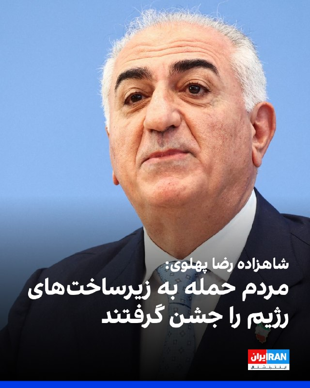

شاهزاده رضا پهلوی گفت که مردم ایران باید از طریق هوا حفاظت شوند و اینترنت و دیگر ابزار لازم را داشته باشند که دست به‌کار شوند و رژیم را به زانو درآورند.
او ادامه داد: «مردم حمله به زیرساخت‌های رژیم را جشن گرفتند و خیابان‌ها را به نام ترامپ نام‌گذاری کردند.»

شاهزاده رضا پهلوی ادامه داد: «دنیا باید تصمیم بگیرد که بعد از ۴۷ سال مماشات در کنار مردم ایران بایستد.»

او اضافه کرد: «مردم بین حمله به کشور و حمله به رژیم تمایز ایجاد می‌کنند.»
https://iranintl.com/202605301562

## IranIntlTV — post 339749

  <a href="telegram/content/IranIntlTV_339749_1780155949.mp4" target="_blank">🎬 Download video</a>

شاهزاده رضا پهلوی در نشست «امنیت دریای سیاه» در اودسا در جنوب اوکراین، گفت: « با محور هرج ومرج مذاکره نکنید، با آن مقابله کنید. مدیریت نکنید جمهوری اسلامی را، به آن پایان دهید.»
@iranintltv

## IranIntlTV — post 339748

  

🔻رولاندو ماران، سرمربی تیم ملی آلبانی، پس از اعلام فهرست بازیکنان برای دو دیدار دوستانه مقابل اسرائیل و لوکزامبورگ، درباره غیبت یاسر آسانی، مهاجم تیم استقلال گفت: «یاسر آسانی دعوت نشد چون بازی نکرده است. من شخصاً با او صحبت نکردم، اما همکارانم با او تماس گرفتند.»

🔹ماران گفت: «او در این مدت به میدان نرفته و آماده بودنش برای این مسابقات دشوار بود.»

🔹آلبانی روز ۱۳ خرداد به مصاف اسرائیل می‌رود و ۱۶ خرداد برابر لوکزامبورگ قرار خواهد گرفت.

@iranintltvsport

## IranIntlTV — post 339747

  <a href="telegram/content/IranIntlTV_339747_1780155951.mp4" target="_blank">🎬 Download video</a>

شاهزاده رضا پهلوی در نشست «امنیت دریای سیاه» در اودسا در جنوب اوکراین، گفت پهپادهایی که امروز شهرهای اوکراین را هدف قرار می‌دهند، همان ابزار سرکوبی هستند که جمهوری اسلامی برای تعقیب و هدف قرار دادن معترضان در خیابان‌های ایران به کار گرفته است.
@iranintltv

## FarsiVOA — post 219089

در گفت‌وگو با حسن هاشمیان به پایان مأموریت تام باراک به‌عنوان نماینده ویژه آمریکا در سوریه پرداختیم. به گفته آقای هاشمیان کارنامه تام باراک را باید به دو مقطع قبل و بعد از عملیات «خشم حماسی» علیه جمهوری اسلامی تقسیم کرد.

## FarsiVOA — post 219088

  <a href="telegram/content/FarsiVOA_219088_1780155952.mp4" target="_blank">🎬 Download video</a>

ارتش اسرائیل اعلام کرد کمی پیشتر موشک‌هایی از لبنان به مناطقی در شمال اسرائیل شلیک شد. تعدادی از این موشک‌ها رهگیری شدند و تعدادی در فضاهایی باز مانند ساحل شهر نهاریا در شمال اسرائیل سقوط کردند. ارتش اسرائیل اعلام کرد این حملات به اسرائیل تلفاتی درپی نداشتند.

## FarsiVOA — post 219084

پیت هگست، وزیر جنگ آمریکا، از دیدار با گیلبرتو تئودورو، وزیر دفاع فیلیپین، خبر داد.

او گفت دو کشور در حال تقویت همکاری‌های دفاعی در امتداد «زنجیره نخست جزایر» هستند؛ همکاری‌ای که به گفته او با برگزاری رزمایش «بالیکاتان» و انتقال یک شناور گارد ساحلی پشتیبانی شده است.

@FarsiVOA

## FarsiVOA — post 219083

آیا تهدید اروپا توسط روسیه به رویارویی کشیده می‌شود؟ گفت‌و‌گو با رضا تقی‌زاده، تحلیلگر روابط بین‌الملل

## FarsiVOA — post 219082

🔺 تداوم آزار و اذیت معترضان دی؛ شمار زیادی از بازداشت‌شدگان همچنان در بلاتکلیفی هستند

▪️نهادهای حقوق بشری از ادامه سرکوب و فشار جمهوری اسلامی بر بازداشت‌شدگان اعتراضات سراسری دی‌ ۱۴۰۴ در شهرهای مختلف ایران خبر می‌دهند.

⬇️ بیشتر بخوانید:

https://ir.voanews.com/a/iran-arrest-protest-prison-january-human-rights/8155568.html/?nocach=1

## FarsiVOA — post 219081

  <a href="telegram/content/FarsiVOA_219081_1780155955.mp4" target="_blank">🎬 Download video</a>

«هەنگاو» ویدیویی از مراسم تشییع مجتبی و میثم ویسی منتشر کرده است که امروز شنبە نهم خرداد در سرپل ذهاب برگزار می‌شود.

این دو برادر که پس از اعتراضات دی‌ ۱۴۰۴ تحت تعقیب نهادهای امنیتی بودند بامداد پنجشنبه هفتم خرداد ۱۴۰۵ در روستای «قلعه کهوش» از توابع دالاهو، در جریان یورش نیروهای اطلاعات سپاه پاسداران به محل اختفای آنها، هدف شلیک مستقیم قرار گرفتند و کشته شدند.

مجتبی و میثم ویسی از فعالان فرهنگی و مدنی و از پیروان آیین یارسان معرفی شده‌اند. آنها از بنیان‌گذاران کتابخانه‌ای در شهرک دره‌دریژ کرمانشاه بودند. مجتبی ویسی همچنین کشتی‌گیر، نوازنده، و نقاش بود. کُردپا پیشتر گزارش داده بود که مجتبی ویسی در اسفند ۱۴۰۳ بازداشت و در فروردین ۱۴۰۴ با وثیقه آزاد شده بود.

## FarsiVOA — post 219080

تعطیلی فرودگاه مونیخ و اختلال در پروازها پس از مشاهده پهپاد ناشناس؛ زنگ خطر امنیت هوایی اروپا

## FarsiVOA — post 219078

فرماندهی مرکزی ایالات متحده، سنتکام، تصاویری از عملیات هوایی شبانه ملوانان آمریکایی روی ناو هواپیمابر «یو‌اس‌اس جرج اچ دبلیو بوش» منتشر کرد.

سنتکام می‌گوید خلبانان در شب قادرند در تاریکی، هواپیماهای خود را روی عرشه‌ای کوچک که همزمان در حال حرکت و نوسان است، فرود آورند.

@FarsiVOA

## FarsiVOA — post 219077

آرمان معرفتی، شهروند اهل سقز که اسفند سال گذشته به اتهام آتش‌ زدن یک مسجد در تهران محاکمه شده بود، به اعدام محکوم شد.

## FarsiVOA — post 219076

  <a href="telegram/content/FarsiVOA_219076_1780155956.mp4" target="_blank">🎬 Download video</a>

ارتش اسرائیل روز گذشته مقر توپخانه حزب‌الله را در منطقه شویا در جنوب لبنان منهدم کرد.

ارتش اسرائیل اعلام کرد این حمله پس از تایید حضور نیروهای این سازمان تروریستی در منطقه انجام شد.

وقوع انفجارهای ثانویه بعد از حمله، وجود تسلیحات را در این محل تایید کرد.

این ویدیو بی‌صدا است.

## FarsiVOA — post 219075

🔺هشدار ارتش اسرائیل به ساکنان مناطقی در لبنان: فورا تخلیه کنید

▪️ارتش اسرائیل در واکنش به تازه‌ترین حملات گروه تروریستی حزب‌الله به شمال این کشور، برای چندین روستا در جنوب لبنان و همچنین و در دره بقاع، هشدار تخلیه صادر کرد.

⬇️ بیشتر بخوانید:

https://ir.voanews.com/a/israel-hezbollah-iran-war-proxy/8155561.html/?nocach=1

## FarsiVOA — post 219074

پیت هگست، وزیر جنگ آمریکا، با اشاره به مذاکرات با رژیم ایران گفت که گفت‌وگوها «سازنده» بوده و جمهوری اسلامی به مواضع مورد نظر واشنگتن نزدیک‌تر شده است.

او تاکید کرد آمریکا همچنان بر جلوگیری از دستیابی رژیم ایران به سلاح هسته‌ای اصرار دارد و گفت انتظارات آمریکا از جمهوری اسلامی تغییری نکرده است.

هگست همچنین گفت دولت آمریکا ترجیح می‌دهد مسئله از طریق توافق حل شود، اما در صورت لزوم برای گزینه‌های دیگر نیز آمادگی دارد.

@FarsiVOA

## DW_Farsi — post 125321

  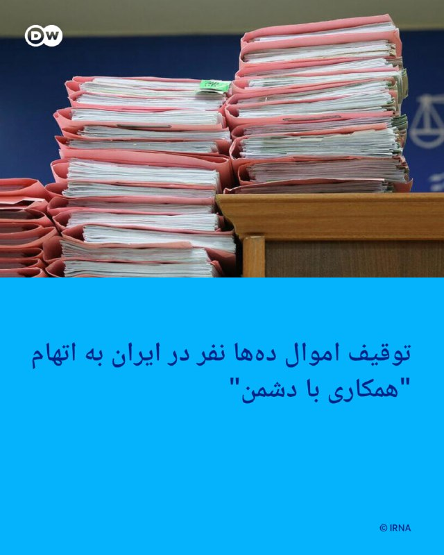

🔶 توقیف اموال ده‌ها نفر در ایران به اتهام "همکاری با دشمن"

در حالی که قوه قضائیه استان گلستان از توقیف اموال ۷۴ ایرانی خارج از کشور به اتهام "خیانت به وطن" خبر داده، رئيس‌ کل دادگستری خراسان جنوبی نیز می‌گوید، اموال ۳۴ نفر در این استان به اتهام "حمایت از دشمن" ضبط شده است.

خبرگزاری ایرنا روز شنبه نهم خرداد (۳۰ مه) به نقل از قوه قضائيه نوشت، به دستور مقام قضايی، اموال ۷۴ نفر در استان گلستان که از " خائنین به وطن و افراد تأثیرگذار در شبکه همکاران دشمن" و ساکن خارج از کشور هستند در راستای "حفظ حقوق عامه و اجرای قانون تشدید مجازات جاسوسی و همکاری" با اسرائيل توقیف شد.

قوه قضائيه می‌‌گوید، اموال این افراد شامل حساب‌های بانکی، خودرو و املاک ثبتی است که شناسایی و همه توقیف شده است. در ضمن، هرگونه نقل و انتقال مالی برای آن‌ها ممنوع و پرونده این افراد در دادسرای مرکز استان در حال رسیدگی است.

هم‌زمان محمدجعفر عبداللهی، رئیس‌ کل دادگستری استان خراسان جنوبی از توقیف اموال ۳۴ نفر که او آن‌ها را "حامی دشمن و خائن به کشور" نامید خبر داد.

@dw_farsi

## DW_Farsi — post 125320

  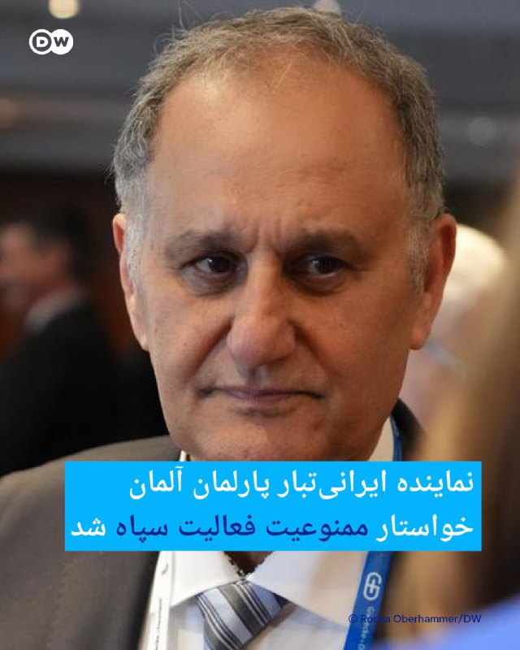

🔶 نماینده ایرانی‌تبار پارلمان آلمان خواستار ممنوعیت فعالیت سپاه شد

رضا اصغری، نماینده ایرانی‌تبار پارلمان آلمان از حزب دموکرات‌مسیحی (CDU) خواستار ممنوعیت فعالیت سپاه پاسداران انقلاب اسلامی در این کشور شد.

اصغری در گفت‌وگو با خبرگزاری رویترز گفت: «سرویس‌های اطلاعاتی ایران در آلمان بسیار فعال هستند. غیرقابل درک است که هنوز ممنوعیتی برای فعالیت سپاه پاسداران در این کشور وجود ندارد. ما در سریع‌ترین زمان ممکن به این ممنوعیت نیاز داریم.»

اتحادیه اروپا تا کنون سپاه پاسداران را در فهرست سازمان‌های تروریستی قرار داده است.

اما وزارت کشور آلمان هنوز بر اساس قانون تشکل‌ها (Vereinsrecht)، فعالیت سپاه را در خاک خود ممنوع اعلام نکرده است.

در ساختار حقوقی آلمان، دولت برای ممنوع کردن فعالیت یک نهاد خارجی در خاک خود، باید از طریق این قانون اقدام کند تا بتواند شعبه‌ها، فعالیت‌ها و دارایی‌های آن نهاد یا هوادارانش را در داخل مرزهای آلمان غیرقانونی اعلام کند.

@dw_farsi

## DW_Farsi — post 125319

  

🔶 "انهدام پهپاد اسرائيلی" در قشم و "حمله ایران به پایگاهی در کویت"

در حالی که ارتش ایران از انهدام یک فروند پهپاد اسرائيلی در منطقه قشم خبر می‌دهد بلومبرگ نیز می‌گوید، در حمله موشکی ایران به یک پایگاه آمریکا در کویت چند آمریکایی زخمی شده‌اند.

به نوشته خبرگزاری ایرنا، ارتش ایران روز شنبه نهم خرداد (۳۰ مه) در اطلاعیه‌ای اعلام کرد که در بامداد همین روز یک فروند پهپاد اوربیتر اسرائيل را رهگیری و منهدم کرده است.

به گفته ارتش، این پهپاد "تحت شبکه یکپارچه قرارگاه مشترک پدافند هوایی کشور در منطقه قشم" مورد اصابت قرار گرفت و منهدم شد.

در همین حال خبرگزاری بلومبرگ نیز در گزارشی به نقل از منبعی آگاه از حمله موشکی ایران به پایگاه آمریکایی "علی السالم" در کویت در ۲۴ ساعت گذشته خبر داد.

به گفته بلومبرگ، در این حمله پنج نفر، از جمله چند پرسنل آمریکایی زخمی شدند و به پهپادهای ایالات متحده نیز آسیب وارد آمد.

بلومبرگ به نقل از این منبع که نامش ذکر نشد جراحات آمریکایی‌ها را سطحی اما خسارت وارده به دو پهپاد "ام‌کیو ـ ۹ریپر" ارتش آمریکا را شدید اعلام کرده است.

@dw_farsi

## Persian_Trend_Official — post 15344

  <a href="telegram/content/Persian_Trend_Official_15344_1780155960.mp4" target="_blank">🎬 Download video</a>

امریکا خبر آسیب حمله موشکی ایران به کویت را تأیید کرد.

مجری فاکس نیوز: بلومبرگ گزارش می‌دهد که حملات موشکی ایران منجر به زخمی شدن چندین آمریکایی در پایگاه هوایی کویت شده است. به نظر شما اوضاع از چه قرار است؟

مایک جانسون، رئیس مجلس نمایندگان: من دیشب با رئیس جمهور ترامپ صحبت کردم. او در جریان این موضوع قرار گرفته است. من فکر می‌کنم رهبری جدید ایران می‌خواهد به این درگیری پایان دهد.

📝 Amir

📌 @persian_trend_official
پرشین ترند | متفاوت‌ترین کانال نظامی

## RadioFarda — post 157723

🔸پیت هگست، وزیر دفاع آمریکا، روز شنبه نهم خرداد گفت ایالات متحده در صورتی که مذاکرات با ایران به توافق منجر نشود، آماده ازسرگیری حملات علیه جمهوری اسلامی است.

🔸هگست در جمع خبرنگاران گفت: «در حال حاضر تمرکز ما بر حفظ آمادگی و آماده بودن برای بازگشت به عملیات است، اگر لازم باشد.»

🔸او افزود دونالد ترامپ «صبور» است و به دنبال دستیابی به «توافقی خوب» است که تضمین کند ایران هرگز به سلاح هسته‌ای دست پیدا نخواهد کرد.

🔸اظهارات وزیر دفاع آمریکا در حالی مطرح می‌شود که مذاکره‌کنندگان تهران و واشینگتن در تلاش‌اند اختلافات باقی‌مانده بر سر برنامه هسته‌ای ایران را برطرف کنند.

@RadioFarda

## RadioFarda — post 157722

🔸یک عضو هیئت رئیسه مجلس شورای اسلامی روز شنبه اعلام کرد که «اعمال مدیریت» ایران بر تنگه هرمز «تصمیم قطعی» مجلس است و طرح مربوط به آن در صحن علنی تصویب و تبدیل به قانون خواهد شد. 🔸به گزارش خبرگزاری تسنیم، علیرضا سمیعی مدعی شد که درباره طرح مذکور با «دستگاه‌های…

## RadioFarda — post 157721

  

🔸یک عضو هیئت رئیسه مجلس شورای اسلامی روز شنبه اعلام کرد که «اعمال مدیریت» ایران بر تنگه هرمز «تصمیم قطعی» مجلس است و طرح مربوط به آن در صحن علنی تصویب و تبدیل به قانون خواهد شد.

🔸به گزارش خبرگزاری تسنیم، علیرضا سمیعی مدعی شد که درباره طرح مذکور با «دستگاه‌های مختلف» گفت‌وگوهایی انجام شده است.

🔸این در حالی است که دونالد ترامپ، رئیس‌جمهور آمریکا، بارها اعلام کرده که هرگونه توافق با ایران برای پایان دادن به جنگ باید شامل باز شدن این آبراه بدون اخذ عوارض باشد. او روز جمعه نیز این موضع ایالات منحده را تکرار کرد.

🔸عضو هیئت رئیسه مجلس با اعلام این‌که تنگه هرمز در «حوزه سرزمینی ایران و عمان» است، گفت که اجازه نمی‌دهیم کشور دیگری در این‌ زمینه تصمیم‌گیری کند.

📷شرح عکس: مجسمه نیروهای نظامی ایران در ساحل بندرعباس، در حالی که شناورهایی در آب‌های تنگه هرمز دیده می‌شوند.

@RadioFarda

## IranianMinds — post 21074

  

🔴بدون توضیح.

😂😂😂

@IranianMinds

## IranianMinds — post 21073

🔴 شاهزاده رضا پهلوی:

مردم ایران باید از طریق هوا حفاظت بشن و اینترنت و دیگر ابزار لازم رو داشته باشن که دست به‌کار بشن و رژیم رو به زانو بیارن.

مردم حمله به زیرساخت‌های رژیم رو جشن گرفتن و خیابان‌ها رو به نام ترامپ نام‌گذاری کردن.

دنیا باید تصمیم بگیره که بعد از ۴۷ سال مماشات در کنار مردم ایران بایسته.

@IranianMinds

## Dirty_Kids — post 390571

  <a href="telegram/content/Dirty_Kids_390571_1780155963.mp4" target="_blank">🎬 Download video</a>

ایرانی فکر کن بعد سه ماه بهت اینترنت دادن اینو ببینی😂

@Dirty_Kids 👻

## Dirty_Kids — post 390570

  <a href="telegram/content/Dirty_Kids_390570_1780155965.mp4" target="_blank">🎬 Download video</a>

🔴 ویدیوی ویرال شده از حرکت یه پسر جوون توی ایران که شاهکار خلق کرده🔥

@Dirty_Kids 👻

## Hranews — post 113247

  

احکام اعدام رئوف شیخ‌ معروفی و محمد فرجی در دیوان عالی کشور تایید شد

❗️
❗️
❗️
❗️
❗️– دیوان عالی کشور احکام اعدام رئوف شیخ‌ معروفی و محمد فرجی، زندانیان سیاسی محبوس در زندان بوکان را تایید کرد. این افراد پیشتر از بابت اتهام “افساد فی الارض”، توسط دادگاه انقلاب به #اعدام محکوم شده بودند.

ادامه مطلب

#رئوف_شیخ‌_معروفی #محمد_فرجی

↘️
@hranews_bot تماس ✉️ - @Hranews کانال هرانا 🆑

## Hranews — post 113246

  

اعتراضات دی‌ماه ۱۴۰۴؛ بنیامین نقدی به اعدام محکوم شد

❗️
❗️
❗️
❗️
❗️– بنیامین نقدی، از بازداشت شدگان اعتراضات سراسری ۱۴۰۴، توسط دادگاه انقلاب شیراز از بابت اتهام «افساد فی‌الارض» به #اعدام محکوم شد. مصطفی نیلی، وکیل مدافع وی اعلام کرده است که نسبت به این حکم درخواست فرجام‌خواهی خواهد کرد.

ادامه مطلب

#بنیامین_نقدی

↘️
@hranews_bot تماس ✉️ - @Hranews کانال هرانا 🆑

## Hranews — post 113245

پرونده سجاد و شایان ویسی با اتهام محاربه به دادگاه انقلاب کرمانشاه ارجاع شد

❗️
❗️
❗️
❗️
❗️– سجاد ویسی و شایان ویسی، شهروندان پیرو آئین یارسان و از بازداشت‌شدگان اعتراضات دی‌ماه در کرمانشاه، همچنان در زندان دیزل‌آباد این شهر نگهداری می‌شوند. پرونده این شهروندان با اتهام محاربه به دادگاه انقلاب کرمانشاه ارجاع شده است. سجاد ویسی برادر میثم و مجتبی ویسی است که روز پنجشنبه ۷ خرداد ۱۴۰۵ در یکی از روستاهای شهرستان دالاهو هدف تیراندازی ماموران اطلاعات سپاه قرار گرفته و جان خود را از دست دادند.

ادامه مطلب

#سجاد_ویسی #شایان_ویسی

↘️
@hranews_bot تماس ✉️ - @Hranews کانال هرانا 🆑

## alonews — post 123751

  <a href="telegram/content/alonews_123751_1780155966.webm" target="_blank">🎬 Download video</a>

👈قرارگاه مرکزی خاتم‌الانبیا در بیانیه‌ای اعلام کرد که هرگونه اقدام شناورهای نظامی جهت مداخله در مدیریت تنگه هرمز یا ایجاد اختلال در تردد، مورد هدف نیروهای مسلح جمهوری اسلامی قرار خواهد گرفت.

🔴در این بیانیه آمده: «هرگونه تخلف از این ضوابط، امنیت تردد آن‌ها را با مخاطره جدی مواجه خواهد کرد.»

🔴قرارگاه مرکزی خاتم‌الانبیا اعلام کرد کلیه کشتی‌ها، شناورهای تجاری و نفتکش‌ها صرفا ملزم به تردد از مسیرهای تعیین‌شده و اخذ مجوز از نیروی دریایی سپاه پاسداران هستند.

✅ @AloNews خبر جنگ

## alonews — post 123748

  <a href="telegram/content/alonews_123748_1780155966.mp4" target="_blank">🎬 Download video</a>

8 اردیبهشت ماه یه زوج عروسی گرفتن و 20 میلیارد تومن خرج عروسی‌شون شده!! فقط یه میلیارد پول فیلمبردار دادن! اینم فیلم عروسی‌شونه.

[@AloTweet]

## alonews — post 123747

  <a href="telegram/content/alonews_123747_1780155967.webm" target="_blank">🎬 Download video</a>

💔همه اعضای این خانواده جاوید نام شدن.

🔴جاویدنام بیژن مصطفوی، ۵۸ ساله، بازنشسته آموزش و پرورش، رزمنده جنگ ایران و عراق

🔴جاویدنام زهرابنی‌عامریان، ۴۸ ساله، بازنشسته تامین اجتماعی

🔴جاویدنام دانیال مصطفوی، ۲۰ ساله، دانشجوی کامپیوتر

🔴اصالتا از شهرستان سنقر، استان کرمانشاه
کشته شده ۱۹ دی ماه خونین ۴۰۴ در گوهردشت کرج

🤔عرزشی حرام زاده بدونه که روز تسویه حساب باهاتون نزدیکه

✅@AloNews

## alonews — post 123746

  <a href="telegram/content/alonews_123746_1780155968.webm" target="_blank">🎬 Download video</a>

👈سازمان ملل : سال ۲۰۲۷ گرم‌ترین سال ثبت خواهد شد

✅ @AloNews خبر جنگ

## alonews — post 123745

  <a href="telegram/content/alonews_123745_1780155968.webm" target="_blank">🎬 Download video</a>

👈آزمون‌ساز برنامه شاد هم پولی شد!
‌

🔴بسته‌های آزمون‌ساز شاد از ۷۴۹ هزار تومان تا ۳ میلیون تومان قیمت‌گذاری شده‌اند

✅ @AloNews خبر جنگ

## alonews — post 123744

🔥 همراه با ساب + حجم مصرفی، فقط 9T! 🚀 ❌ آفر فقط تا پایان امشب ❌ 🔥 اگه دنبال یه VPN پایدار و بدون دردسر می‌گردی، این پلن مخصوص خودته! @Netaazaadbot @NetAazaadBot ✅ همراه با ساب + حجم مصرفی ✅ 15 سرور اختصاصی پرسرعت ✅ اتصال پایدار و بدون قطعی ✅ سرعت بالا…

## alonews — post 123743

  

🔥 همراه با ساب + حجم مصرفی، فقط 9T! 🚀

❌ آفر فقط تا پایان امشب ❌

🔥 اگه دنبال یه VPN پایدار و بدون دردسر می‌گردی، این پلن مخصوص خودته!

@Netaazaadbot
@NetAazaadBot
✅ همراه با ساب + حجم مصرفی
✅ 15 سرور اختصاصی پرسرعت
✅ اتصال پایدار و بدون قطعی
✅ سرعت بالا حتی در ساعات شلوغ

@Netaazaadbot
@NetAazaadBot
💎 کیفیتی که بعد از استفاده متوجه تفاوتش میشی!

📩 برای خرید و دریافت سرویس استارت رو بزن✅

## alonews — post 123742

  <a href="telegram/content/alonews_123742_1780155968.webm" target="_blank">🎬 Download video</a>

👈وال استریت ژورنال | کاهش چشمگیر هزینه سرنگونی پهپادها: ارتش آمریکا راهکار جدیدی پیدا کرده است تا بدون صرف هزینه‌های کلانِ ۱ میلیون دلاری، پهپادها را در آسمان منهدم کند

🔴روزنامه «وال‌استریت ژورنال» در گزارش جدید خود اعلام کرد ارتش آمریکا راهکار تازه‌ای برای انهدام پهپادها بدون نیاز به صرف هزینه‌های ۱ میلیون دلاری پیدا کرده است.

🔴این روش جدید با به‌کارگیری خودروهای تاکتیکی ویژه مجهز به توپ‌ها و مهمات تخصصی، هزینه ساقط کردن پرنده‌های بدون سرنشین را به شدت کاهش می‌دهد.

🔴در جریان یک آزمایش میدانی مشترک در فیلیپین، تفنگداران دریایی آمریکا با استفاده از این سیستم جدید تاکتیکی موفق شدند یک پهپاد مهاجم بال‌ثابت را با هزینه‌ای بسیار پایین‌تر از موشک‌های پدافندی متعارف، بر فراز دریای جنوبی چین سرنگون کنند.

✅ @AloNews خبر جنگ

## alonews — post 123741

  <a href="telegram/content/alonews_123741_1780155968.webm" target="_blank">🎬 Download video</a>

👈رئیس دفتر کاخ سفید: جی‌دی ونس اغلب در جلسات با تلفن خود ور می‌رود و ترامپ به او گفته است این در شآن معاون اول رییس‌جمهور نیست

✅ @AloNews خبر جنگ

## alonews — post 123740

  <a href="telegram/content/alonews_123740_1780155969.webm" target="_blank">🎬 Download video</a>

👈دیده شده در تجمعات شبانه

✅ @AloNews خبر جنگ

## alonews — post 123739

  <a href="telegram/content/alonews_123739_1780155969.mp4" target="_blank">🎬 Download video</a>

👈مک‌ینی از فاکس:
بلومبرگ گزارش می‌دهد که حملات موشکی ایران باعث مجروحیت چند آمریکایی در پایگاه هوایی کویت شده است. فکر می‌کنید وضعیت کجاست؟

🔴میک جانسون، رئیس مجلس:
من دیشب با رئیس‌جمهور ترامپ صحبت کردم. او کاملاً روی این موضوع تمرکز کرده است. فکر می‌کنم رهبری جدید ایران می‌خواهد به این درگیری پایان دهد.

✅ @AloNews خبر جنگ

## alonews — post 123738

  <a href="telegram/content/alonews_123738_1780155971.mp4" target="_blank">🎬 Download video</a>

👈کارشناس صداوسیما : ما آریایی‌ نیستیم!

✅ @AloNews خبر جنگ

## alonews — post 123737

  <a href="telegram/content/alonews_123737_1780155972.webm" target="_blank">🎬 Download video</a>

👈عوستاد رائفی پور:
شاید عده‌ای به حرفم بخندن اما آمریکا تمام شد

✅ @AloNews خبر جنگ

## alonews — post 123736

  <a href="telegram/content/alonews_123736_1780155973.mp4" target="_blank">🎬 Download video</a>

👈تصاویر ماهواره ای از انهدام کامل ذاغه مهمات، و سایت پدافندی پایگاه هوایی اصفهان توسط آمریکا / اسرائیل

✅ @AloNews خبر جنگ

## alonews — post 123735

  <a href="telegram/content/alonews_123735_1780155974.webm" target="_blank">🎬 Download video</a>

🚨🔴پرسپولیس رسما از آسیا جا ماند 🔻دبیر سازمان لیگ: به دلیل اینکه باشگاه پرسپولیس در رتبه ششم جدول لیگ قرار دارد نمی‌تواند به رقابت‌های آسیایی معرفی شود. کنفدراسیون فوتبال آسیا مهلت لازم را نداد که پس از برگزاری مسابقات لیگ برتر نمایندگان کشور جهت حضور در…

## alonews — post 123734

  <a href="telegram/content/alonews_123734_1780155974.webm" target="_blank">🎬 Download video</a>

👈تلگراف: دو ژنرال قدرتمند، احمد وحیدی و محمد جعفری، با هم متحد شدن تا قالیباف رو از قدرت برکنار کنند.

✅ @AloNews خبر جنگ

## alonews — post 123733

  <a href="telegram/content/alonews_123733_1780155975.webm" target="_blank">🎬 Download video</a>

👈کانال ۱۲ اسرائیل:
از صبح امروز هر ۲۲ دقیقه یکبار آژیر خطر در شمال اسرائیل به صدا در می‌آید.

✅ @AloNews خبر جنگ

## alonews — post 123732

  <a href="telegram/content/alonews_123732_1780155975.mp4" target="_blank">🎬 Download video</a>

👈ویدئویی که تازه از حمله‌های اسرائیل و آمریکا به خرم‌آباد تو جنگ ۴۰ روزه بیرون اومده!

✅ @AloNews خبر جنگ

---
📅 بروزرسانی: 1405/03/09 17:50
---

## VahidOOnLine — post 242922

  <a href="telegram/content/VahidOOnLine_242922_1780150814.mp4" target="_blank">🎬 Download video</a>

♦️هم‌زمان با نزدیک شدن به فینال لیگ قهرمانان اروپا، روز شنبه ۹ خردادماه فروشگاه‌ها در خیابان شانزه‌لیزه پاریس با نصب موانع و تدابیر امنیتی در حال آماده‌سازی برای این رویداد هستند.
این تدابیر در آستانه دیدار نهایی میان دو تیم پاری‌سن ژرمن و آرسنال انجام می‌شود؛ تیم‌هایی که پس از سال‌ها دوباره به فینال این رقابت‌ها رسیده‌اند. پاری سن ژرمن با شکست تیم‌های لیورپول و بایرمونیخ  به این مرحله رسیده و و آرسنال نیز با شکست اسپورتینگ و اتلتیکومادرید از مدافعان قهرمانی راهی فینال شده است.
مقامات شهری پاریس با توجه به حضور گسترده هواداران، تمهیدات ویژه‌ای برای جلوگیری از ناآرامی‌های احتمالی در نظر گرفته‌اند تا این شب فوتبالی در فضایی امن برگزار شود.
‌🇸🇦 Indypersian

🤖 @VahidOOnLine

## VahidOOnLine — post 242921

  

شاهزاده رضا پهلوی در نشست «امنیت دریای سیاه» در اودسا در جنوب اوکراین، ضمن انتقاد از هرگونه توافق احتمالی، گفت که جمهوری اسلامی را مدیریت نکنید، بلکه به آن پایان دهید.

او افزود: «محور مسکو-تهران یک دشمن هماهنگ برای همه است و باید قاطعانه و با انسجام با آن برخورد شود.»

شاهزاده رضا پهلوی ادامه داد: «هر توافقی با جمهوری اسلامی مانند توافقات با شوروی سابق موضوع را حل نکرده است.»
‌🏁 🇬🇧 IranintlTV

🤖 @VahidOOnLine

## VahidOOnLine — post 242920

  

♦️ نیروهای طالبان شماری از جوانان را که با موتورسیکلت از زیرگذر شهر هرات در غرب افغانستان عبور کرده بودند، بازداشت و تنبیه کردند.

در عکسی که از این رویداد منتشر شده، شماری از جوانان در یک صف کنار دیوار زیرگذر نشسته و دست‌هایشان را بر گوش‌هایشان گذاشته‌اند. یک عضو مسلح طالبان نیز در مقابل آنان ایستاده است. در تصویر چند موتورسیکلت نیز دیده می‌شود.
منابع مردمی می‌گویند که طالبان این افراد را به دلیل عبور از زیرگذری که تردد موتورسیکلت در آن ممنوع است بازداشت کرده‌اند.
طالبان تاکنون درمورد این رویداد ابراز نظر نکرده‌اند.
چنین شیوه تنبیهی در قوانین رانندگی افغانستان سابقه ندارد و در گذشته تخلفات رانندگی معمولا با جریمه نقدی، توقیف وسایل یا اقدامات قانونی دیگر پیگیری می‌شد.

این در حالی است که نیروهای طالبان در بیش از چهار سال گذشته در موارد متعددی از شیوه‌های مختلف تنبیهی، از جمله شلیک به متهمان، سیاه کردن چهره افراد متهم به دزدی، و ضرب و شتم آنان استفاده کرده‌اند.
‌🇸🇦 Indypersian

🤖 @VahidOOnLine

## VahidOOnLine — post 242919

  

شاهزاده رضا پهلوی در نشست «امنیت دریای سیاه» در اودسا در جنوب اوکراین، گفت که دنیای آزاد هنوز متوجه ماهیت جمهوری اسلامی نشده است.
شاهزاده رضا پهلوی درباره تلاش برای توافق با جمهوری اسلامی با امید به ایجاد ثبات، گفت که یک سگ وحشی در نهایت دست شما را گاز می‌گیرد.

او افزود: «پهپادهایی که اوکراین را هدف قرار می‌دهد از سوی جمهوری اسلامی تهیه شده و با همان پهپادها مردم معترض خود را در خیابان تعقیب می‌کند تا تک‌تیراندازها آن‌ها را هدف قرار دهند.»

شاهزاده رضا پهلوی گفت که تهران و مسکو معماران مشترک هرج‌ومرج در جهان هستند.
‌🏁 🇬🇧 IranintlTV

🤖 @VahidOOnLine

## VahidOOnLine — post 242918

  

مجتبی یوسفی، عضو هیات رییسه مجلس گفت: «رهبری در بحث مذاکرات، ۱۰ شرط مشخص کردند که اگر تیم مذاکره‌کننده ۱۰ شرط را رعایت نکند، نه مردم، نه نمایندگان، نه نخبگان، آن توافق را حتما به‌عنوان توافق خوب در نظر نخواهند گرفت و می‌شود تجربه‌ای که در اعتماد به غرب باعث عقب‌افتادگی کشور شد.»

او افزود: «امروز باید هم‌قسم شویم تا به گفته امام شهید و امام جدیدمان، مسائل اصلی کشور را حل کنیم.»
‌🏁 🇬🇧 IranintlTV

🤖 @VahidOOnLine

## VahidOOnLine — post 242917

  

♦️ هاکان فیدان، وزیر امور خارجه ترکیه، در گفتگو با نشریه «نیکِی آسیا» اعلام کرد که اگر اسرائیل تشکیل دولت مستقل فلسطین بر اساس مرزهای ۱۹۶۷ را به رسمیت بشناسد، می‌تواند به یک «بلوک منطقه‌ای» مشترک ملحق شود. فیدان تاکید کرد: «در صورت حل این مسئله، کشورهای منطقه نیز به امنیت اسرائیل کمک شایانی خواهند کرد.»

به گفته فیدان، این چارچوب همکاری می‌تواند شامل پاکستان، ترکیه، عربستان سعودی، مصر و دیگر کشورهای خلیج فارس باشد و در صورت عادی شدن شرایط، شاید ایران نیز به آن بپیوندد. او افزود: «همه کشورهای منطقه باید به تمامیت ارضی، حاکمیت و امنیت یکدیگر متعهد باشند.»

این اظهارات در حالی مطرح می‌شود که ترکیه خود را برای میزبانی از نشست کلیدی ناتو در ماه ژوئیه آماده می‌کند. هم‌زمان، دونالد ترامپ نیز روز دوشنبه در تروث سوشال، با نام بردن از شش کشور از جمله ترکیه و مصر، بر لزوم توسعه «پیمان ابراهیم» تاکید کرد و نوشت: «لازم است دست‌کم این کشورها، همزمان به این پیمان بپیوندند.»
‌🇸🇦 Indypersian

🤖 @VahidOOnLine

## VahidOOnLine — post 242916

  

حسینعلی شهریاری، نماینده سیستان و بلوچستان در مجلس گفت: «الان شهر زاهدان هزار لیتر در ثانیه کمبود آب دارد؛ به‌طوری که طبق گفته بعضی از شهروندان، برخی از آنها ۲۴ تا ۴۸ ساعت آب ندارند و مناطق زیادی از زاهدان در این زمینه دچار مشکل هستند.»

او ادامه داد: «مثلا الان در زاهدان که مرکز استان است، از دولت‌های قبل، به علت کمبود آب، دو پروژه در آن شروع شد؛ یکی انتقال آب از دریای عمان که قرار بود به سیستان و بلوچستان جنوبی و خراسان رضوی برسد و دیگری هم آبی که قرار بود از دشت تهلاب برای شهر زاهدان بیاید.»
‌🏁 🇬🇧 IranintlTV

🤖 @VahidOOnLine

## VahidOOnLine — post 242915

  

♦️ پیت هگست، وزیر جنگ ایالات متحده، روز شنبه نهم خرداد اعلام کرد که به دنبال جلسه روز گذشته در کاخ سفید، واشنگتن به موفقیت‌هایی در مذاکرات با ایران دست یافته است. هگست تاکید کرد: «ایران به طور کاملا واضح از انتظارات ما آگاه است. آن‌ها در مسیر خواسته‌های ما حرکت می‌کنند و گفتگوها سازنده بوده است. من به رئیس‌جمهورمان که فقط توافق‌های بزرگ امضا می‌کند، اعتماد کامل دارم.»

وزیر جنگ آمریکا که در کنار وزیران دفاع استرالیا و بریتانیا با خبرنگاران صحبت کرد، با اشاره به گره‌های موجود در مذاکرات فاش کرد که بخشی از بحث‌ها با این همتایان، بر چگونگی جلوگیری از دستیابی ایران به سلاح هسته‌ای «هم‌زمان با پیشرفت فناوری» متمرکز است.
‌🇸🇦 Indypersian

🤖 @VahidOOnLine

## VahidOOnLine — post 242914

  

علیرضا سلیمی، عضو هیات رییسه مجلس گفت: «طرح اعمال مدیریت تنگه هرمز در جلسه علنی مجلس بررسی و تصویب خواهد شد.»
او افزود: «تصمیمات ما درباره اعمال مدیریت بر تنگه هرمز تاکتیکی و موقت نیست، بلکه قطعی و ابدی است.»

سلیمی ادامه داد: «صفر تا صد قانون اعمال مدیریت بر تنگه هرمز به‌طور کامل و جزء به جزء صرفا در مجلس تصویب و نهایی خواهد شد.»

او اضافه کرد: «قطعا این قانون یکی از قوانین مشعشع تاریخ ایران خواهد بود.»
‌🏁 🇬🇧 IranintlTV

🤖 @VahidOOnLine

## VahidOOnLine — post 242913

  <a href="telegram/content/VahidOOnLine_242913_1780150819.mp4" target="_blank">🎬 Download video</a>

♦️پیت هگست، وزیر جنگ ایالات متحده، روز شنبه ۹ خردادماه در جریان سفر خود به سنگاپور در مصاحبه ای با خبرنگاران اعلام کرد که بخش عمده عملیات‌های اخیر در منطقه بر عهده آمریکا بوده و این کشور «کنترل واقعی» تنگه را در اختیار دارد.
او با اشاره به نقش متحدان، از جمله استرالیا، گفت هرچند این کشورها حمایت مهمی ارائه کرده‌اند، اما عملیات محاصره به‌طور عمده توسط آمریکا انجام شده و «فشار اصلی» را بر ایران وارد کرده است.
هگست همچنین با اشاره به روند مذاکرات تأکید کرد تحولات پشت‌صحنه نشان می‌دهد واشنگتن در موقعیت مسلط قرار دارد. او در ادامه به همکاری‌های امنیتی در قالب پیمان «آکوس» و سایر ترتیبات منطقه‌ای اشاره کرد و گفت این همکاری‌ها نشان‌دهنده قدرت و انسجام اتحادهای آمریکا در منطقه اقیانوس آرام است.
‌🇸🇦 Indypersian

🤖 @VahidOOnLine

## VahidOOnLine — post 242912

  

♦️ مرکز امنیت دریایی عمان روز شنبه نهم خرداد، از دریانوردان، ماهیگیران و شناورها خواست تا در مسیرهای حرکتی خود نهایت احتیاط را به کار بندند. این هشدار پس از آن صادر شد که یک شی شناور مشکوک به «مین دریایی» در سمت غربی منطقه تردد ساحلی در تنگه هرمز و در محدوده آب‌های سرزمینی عمان رویت شد.

این مرکز به فعالان و کاربران حوزه دریانوردی توصیه کرد که فاصله ایمن را با هرگونه شی مشکوک حفظ کرده و مراتب را فورا به مقامات ذی‌ربط گزارش دهند.
‌🇸🇦 Indypersian

🤖 @VahidOOnLine

## VahidOOnLine — post 242911

  

مرکز امنیت دریایی عمان اعلام کرد در پی مشاهده یک جسم شناور مشکوک به مین دریایی در غرب مسیر ترافیک ساحلی تنگه هرمز و در آب‌های سرزمینی این کشور، از کشتی‌ها و صیادان خواسته شده با حداکثر احتیاط تردد کنند و هر مورد مشکوک را فورا به مقام‌های مسئول گزارش دهند.
‌🏁 🇬🇧 IranintlTV

🤖 @VahidOOnLine

## VahidOOnLine — post 242910

  

رافائل گروسی، مدیرکل آژانس بین‌المللی انرژی اتمی سازمان ملل، در گفت‌وگو با روزنامه نشنال‌نیوز با ابراز نگرانی از گسترش «پدیده» حمله به نیروگاه‌های هسته‌ای در جریان درگیری‌های اخیر، گفت حمله به این تاسیسات در حال تبدیل شدن به الگویی خطرناک در جنگ‌ها است.

گروسی با اشاره به حمله پهپادی به نیروگاه براکه در امارات متحده عربی گفت: «این واقعیت که کسی یک نیروگاه هسته‌ای را هدف قرار داده، بسیار جدی است.»

او گفت آژانس شواهد لازم برای مقصر دانستن تهران در این حمله را در اختیار ندارد و افزود: «ما به مدرک ملموسی درباره منشا این حمله نیاز داریم.»

مقام‌های امارات متحده عربی، نیروهای نیابتی جمهوری اسلامی در عراق را مسئول این حمله اعلام کردند.

گروسی همچنین به حملات علیه نیروگاه هسته‌ای زاپوروژیا در اوکراین و نیروگاه هسته‌ای بوشهر اشاره کرد.
‌🏁 🇬🇧 IranintlTV

🤖 @VahidOOnLine

## WithYashar — post 12939

  

به نظر می‌رسد که ناو آبی/خاکی یو‌اس‌اس باکسر (lhd-4) قرار نیست در حوزه مسئولیت سنت‌کام  مستقر شود. ناو آبی‌خاکی کلاس واسپ نیز امروز از بندر سِمبانوان در سنگاپور حرکت کرد؛ اگرچه اکنون به سمت شرق در حرکت است.
@withyashar

## WithYashar — post 12938

شاهزاده رضا پهلوی در نشست «امنیت دریای سیاه» در اودسا در جنوب اوکراین، گفت که دنیای آزاد هنوز متوجه ماهیت جمهوری اسلامی نشده است.
شاهزاده رضا پهلوی درباره تلاش برای توافق با جمهوری اسلامی با امید به ایجاد ثبات، گفت که یک سگ وحشی در نهایت دست شما را گاز می‌گیرد.

او افزود: «پهپادهایی که اوکراین را هدف قرار می‌دهد از سوی جمهوری اسلامی تهیه شده و با همان پهپادها مردم معترض خود را در خیابان تعقیب می‌کند تا تک‌تیراندازها آن‌ها را هدف قرار دهند.»

شاهزاده رضا پهلوی گفت که تهران و مسکو معماران مشترک هرج‌ومرج در جهان هستند.
@withyashar

## WithYashar — post 12937

عمان: در آب‌های سرزمینی خود جسمی شناور را مشاهده کردیم که مظنون به مین دریایی است‌
@withyashar

## FoxNewsTwitter — post 342423

‌Fox News (Twitter/X)

👉 Full story here:

## FoxNewsTwitter — post 342422

Fox News (Twitter/X)

TANVI RATNA: Europe built its entire post-Russia energy system to avoid dependence on a single supplier. The Iran war just handed that leverage to America.

US LNG now supplies 63% of European imports and climbing. IEEFA projects 80% by 2030 — with 40% of all EU gas, pipeline and LNG combined, flowing from the United States.

The contracts got signed under wartime pressure. The Russian ban became law. The terminals run on American supply. There's no exit clause and no alternative at scale.

## pm_afshaa — post 91898

  <a href="telegram/content/pm_afshaa_91898_1780150822.webm" target="_blank">🎬 Download video</a>

🔴هگست، وزیر جنگ آمریکا:
محاصره که کاملاً محکم و بدون نفوذ بوده و واقعاً فشار زیادی روی ایران گذاشته.

اونا ممکنه بگن کنترل تنگه رو در دست دارن، ولی کاری که ما انجام میدیم، حتی پشت صحنه، نشون میده که در عمل ما هستیم که کنترل رو در دست داریم.
محاصره دریایی جمهوری اسلامی همچنان ادامه داره و این اقدام موثر بوده و کنترل تنگه هرمز در اختیار آمریکاست.

💧Rainbet.com the #1 Non-KYC Crypto Casino & Sportsbook @rainbetcom

😁 @Pm_Afshaa

## pm_afshaa — post 91896

  <a href="telegram/content/pm_afshaa_91896_1780150822.mp4" target="_blank">🎬 Download video</a>

کارشناس حرومزاده صداوسیما :

ایرانی ها اصلا آریایی نیستن، ما اصلا نژاد آریایی نداریم؛ اونا کلا 5 هزار سال پیش مهاجرت کردن اومدن ولی ما واسه 65 هزار سال پیشیم.
اصلا درست نیست بگیم آریایی هستیم انگار داریم میگیم بچه های یه مشت قاتل نسل کشیم.

💧Rainbet.com the #1 Non-KYC Crypto Casino & Sportsbook @rainbetcom

😁 @Pm_Afshaa

## pm_afshaa — post 91895

🔴نیویورک تایمز:ایران به رد خواسته‌های کلیدی آمریکا ادامه می‌دهد،از جمله تحویل ذخیره اورانیوم بسیار غنی شده خود و محدود کردن غنی‌سازی که باعث به بن بست رسیدن مذاکرات شده

💧 Rainbet.com the #1 Non-KYC Crypto Casino & Sportsbook @rainbetcom

😁 @Pm_Afshaa

## DEJradio — post 5155

⭕️ آمریکا، بریتانیا و استرالیا در پروژۀ زیردریایی‌های بی‌سرنشین همکاری می‌کنند

پیت هگست، وزیر دفاع آمریکا گفت واشینگتن، لندن و کانبرا در چارچوب پیمان آکوس برای توسعۀ شناورهای زیردریایی بی‌سرنشین همکاری می‌کنند.
او گفت این پروژه بر فناوری‌های پیشرفتۀ دفاعی از جمله هوش مصنوعی، فناوری زیرآبی، موشک‌های مافوق صوت، فناوری سایبری و محاسبات کوانتومی متمرکز است.
هگست افزود در این طرح روی مجموعه‌ای از سامانه‌های زیردریایی بدون سرنشین و چندمنظوره، برای حفظ برتری دریایی سه کشور، کار می‌شود.

#خبر #دژ #هوش_مصنوعی
@DEJradio

## DEJradio — post 5154

⭕️ بریتانیا تأیید کرد محاصرۀ دریایی جمهوری اسلامی توسط آمریکا ادامه دارد

سازمان عملیات تجارت دریایی بریتانیا اعلام کرد محاصرۀ بنادر ایران ادامه دارد.
به گفتۀ این نهاد، سطح تهدید دریایی در خلیج فارس، تنگۀ هرمز، دریای عمان و شمال دریای عرب همچنان بحرانی است.
بر اساس این بیانیه شناورهایی که از طریق انتقال کشتی‌به‌کشتی به ناقضان محاصرۀ جمهوری اسلامی کمک کنند، ناقض محاصره به شمار می‌روند.

#خبر #دژ #بریتانیا #محاصره_دریایی
@DEJradio

## DEJradio — post 5153

⭕️ قطر: می‌شود در مورد عوارض موقت در تنگۀ هرمز مذاکره کرد

شیخ سعود بن عبدالرحمن آل‌ثانی، معاون نخست‌وزیر قطر، گفت می‌شود درمورد عوارض موقت در تنگۀ هرمز برای مواردی مانند پاکسازی مین مذاکره کرد.
او گفت دوحه با دریافت دائمی عوارض عبور کشتی‌ها از آبراه هرمز مخالف است.
آمریکا و اروپا تلاش جمهوری اسلامی برای دریافت عوارض از کشتی‌ها را اخاذی مالی می‌دانند.
آمریکا اعلام کرده نهادها و کشتی‌هایی را که به باجگیری جمهوری اسلامی تن بدهند، تحریم می‌کند.

#خبر #دژ #قطر #تنگه_هرمز
@DEJradio

## DEJradio — post 5152

⭕️ واردات برق از ترکمنستان و ارمنستان ادامه دارد

مصطفی رجبی مشهدی، معاون وزیر نیرو گفتجمهوری اسلامی اکنون ۳۰۰ مگاوات برق از ترکمنستان و ارمنستان وارد می‌کند.
این مقام دولت پزشکیان از سویی مدعی شد صادرات برق به افغانستان و پاکستان نیز ادامه دارد. او گفت جنگ اخیر بر تبادلات برق منطقه‌ای اثر نگذاشت.
رجبی مشهدی همچنین ادعا کرد تبادل هزار مگاوات برق با روسیه قرار است در برنامه‌های آینده دنبال شود.

#خبر #دژ #برق
@DEJradio

## DEJradio — post 5151

⭕️ عضو کمیسیون انرژی مجلس: یک‌سوم ظرفیت تولید گاز در ایران از دست رفت

غلامرضا دهقان ناصرآبادی، عضو کمیسیون انرژی مجلس شورای اسلامی گفت در جریان جنگ چهل روزه درحدود یک‌سوم ظرفیت تولید گاز در ایران از بین رفته است.
او با اشاره به آسیب‌دیدن چند فازدر بندر عسلویه گفت وزارت نفت و وزارت نیرو برای بازگرداندن ظرفیت تولید به وضعیت پیش از جنگ تلاش می‌کنند.
بخش عمدۀ گاز در ایران از میدان مشترک پارس جنوبی تأمین می‌شود.

#خبر #دژ #انرژی
@DEJradio

## DEJradio — post 5150

⭕️ شاهزاده رضا پهلوی برای شرکت در نشستی امنیتی وارد اوکراین شد

بر پایۀ گزارش‌ها شاهزاده رضا پهلوی برای شرکت در نشست «فروم امنیت دریای سیاه» به بندر اودسا در اوکراین رفت.
بر اساس این گزارش، الکسی گنچارنکو، نمایندۀ پارلمان اوکراین و رئیس این فروم، از شاهزاده استقبال کرد.
در پیام‌های منتشرشده در این راستا گفت شد که مردم ایران و اوکراین، دشمنان مشترکی در تهران دارند.
روسیه بارها با استفاده از پهپادهای ساخته شده توسط جمهوری اسلامی، اوکراین را هدف گرفته است.
متخصصان اوکراینی در جریان جنگ چهل روزه، برای مقابله با پهپادهای جمهوری اسلامی به کشورهای حاشیۀ خلیج فارس کمک کردند.
شاهزاده رضا پهلوی پیش‌تر نشستی را با ولودیمیر زلنسکی، رئیس جمهوری اوکراین برگزار کرده بود.

#خبر #دژ #شاهزاده_رضا_پهلوی #اوکراین
@DEJradio

## DEJradio — post 5149

⭕️ رسانه‌های اسرائیل: ارتش برای جنگ احتمالی بعدی با جمهوری اسلامی آماده می‌شود

رسانه‌های اسرائیل می‌گویند روند آمادگی ارتش این کشور برای سومین رویارویی احتمالی با جمهوری اسلامی، ادامه دارد.
به گزارش شبکۀ کان، ارتش اسرائیل به دنبال ایجاد شرایطی است که جامعه بتواند در کمترین زمان ممکن با تغییر از وضعیت عادی به شرایط جنگی، سازگاری داشته باشد.
ارزیابی‌های ارتش اسرائیل بیانگر است که جمهوری اسلامی در جنگ بعدی ممکن است سریع‌تر واکنش نشان بدهد و الگوی استفاده از موشک‌ها را تغییر دهد.
بر پایۀ ارزیابی‌ها بیش از 72 درصد از موشک‌های جمهوری اسلامی که در جنگ پیشین استفاده شد، دارای کلاهک خوشه‌ای بود.
از سویی نخستین هواپیماهای سوخت‌رسان جدید آمریکایی به اسرائیل رسیده است.
به گفتۀ مقام‌های نظامی اسرائیل، این هواپیماها ظرفیت عملیات دوربرد را افزایش می‌دهد.
رسانه‌های اسرائیل گزارش دادند در جنگ چهل روزه همۀ اهداف اسرائیل محقق نشده و تلاش برای دستیابی به سایر اهداف ادامه می‌یابد.

#خبر #دژ #اسرائیل
@DEJradio

## DEJradio — post 5148

  <a href="telegram/content/DEJradio_5148_1780150824.mp4" target="_blank">🎬 Download video</a>

🤡
🔺 حرکات اروتیک ولایتمداران در تجمعات شبانه

بر اساس ویدیویی‌هایی که در رسانه‌های وابسته به حکومت از تجمعات شبانه ولایتمداران منتشر می‌شود، شماری از آنها زیر تاثیر اشعار مداحان اخیرا حرکات اروتیک از خود به نمایش می‌گذارند.

#شیفت_شب #اروتیک #تجمعات_حکومتی
@DEJradio

## DEJradio — post 5147

⭕️ آمریکا یک میلیارد دلار رمزارز مرتبط با جمهوری اسلامی را توقیف کرد

اسکات بسنت، وزیر خزانه‌داری آمریکا گفت واشینگتن یک میلیارد دلار دارایی رمزارزی مرتبط با جمهوری اسلامی را توقیف کرده است.
او همچنین گفت اگر قرار باشد محاصرۀ مالی و اقتصادی علیه جمهوری اسلامی کاهش یابد و یا لغو شود، این کار به‌صورت مرحله‌به‌مرحله پیش می‌رود.

#خبر #دژ #تحریم #رمز_ارز
@DEJradio

## DEJradio — post 5146

⭕️ ترامپ در نشست با مشاوران خود در مورد جمهوری اسلامی تصمیم پایانی را نگرفت

نشست بیش از دو ساعتۀ دونالد ترامپ با مشاوران ارشدش در اتاق وضعیت کاخ سفید، بدون اعلام نتیجه پایان یافت.
نیویورک‌تایمز به نقل از یک مقام ارشد دولت آمریکا نوشت ترامپ هنوز درمورد تفاهم احتمالی با تهران به جمع‌بندی نرسیده است.
ترامپ بر باز شدن تنگۀ هرمز و نابودی ذخایر اورانیوم غنی‌شدۀ جمهوری اسلامی پافشاری می‌کند.

#خبر #دژ #ترامپ
@DEJradio

## DEJradio — post 5145

⭕️ وزیر جنگ آمریکا: برای ازسرگیری جنگ با جمهوری اسلامی توانایی ما فراتر از حد است

پیت هگست، وزیر جنگ دولت ایالات متحده، خبر داد واشینگتن در صورت لزوم، آمادۀ ازسرگیری جنگ با جمهوری اسلامی است.
او در نشست امنیتی سنگاپور گفت توانایی آمریکا برای ازسرگیری جنگ با رژیم حاکم بر ایران، بیش از حد لازم است. به گفتۀ هگست، انبارهای مهمات ایالات متحده کاملا آماده‌ است.
هگست تأکید کرد آمریکا میان مهمات پیشرفته و ذخایر انبوه تسلیحاتی تعادل برقرار کرده است.
کاخ سفید اعلام کرده دونالد ترامپ به تصمیم‌گیری درباره توافق احتمالی نزدیک شده، اما هنوز تصمیم پایانی در مورد توافق یا حملۀ نظامی گرفته نشده است.

#خبر #دژ #جنگ
@DEJradio

## DEJradio — post 5144

⭕️ نیروهای اسرائیلی تا فراتر از رود لیتانی پیشروی کردند

بنیامین نتانیاهو، نخست‌وزیر اسرائیل گفت نیروهای این کشور از رود لیتانی عبور کرده و در عمق جنوب لبنان پیشروی کردند.
همزمان، هیات‌های نظامی اسرائیل و لبنان در واشینگتن گفت‌وگوهای امنیتی برگزار کردند.
ژوزف عون، رئیس‌جمهور لبنان، در تماس با مارکو روبیو بر ضرورت تلاش برای برقراری آتش‌بس تأکید کرد.
با وجود آتش‌بسی که از ۲۸ فروردین میان اسرائیل و لبنان برقرار شده، حزب‌الله بارها به شمال اسرائیل حمله کرده و ارتش این کشور را به واکنش نظامی واداشته است.

#دژ #خبر #اسرائیل
@DEJradio

## DEJradio — post 5143

  <a href="telegram/content/DEJradio_5143_1780150825.mp4" target="_blank">🎬 Download video</a>

🛩️
🔥 سرنگونی یک پهپاد «شاهد» با مسلسل از داخل هلی‌کوپتر

گزارش‌ها حاکی است که نیروهای اسرائیلی از یک مسلسل M134 Minigun (مینی‌گان ام۱۳۴) نصب‌شده روی هلیکوپتر برای سرنگونی یک پهپاد «شاهد» استفاده کرده‌اند.

این رهگیری نشان می‌دهد که جنگ پهپادی با چه سرعتی در حال دگرگون‌کردن شیوه‌های نبرد مدرن در خاورمیانه و سایر نقاط جهان است. گفته می‌شود این ویدیو مربوط به روزهای جنگ است.

پهپادهای شاهد به یکی از شناخته‌شده‌ترین سلاح‌های درگیری‌های کنونی جهان تبدیل شده‌اند و به‌طور گسترده توسط جمهوری اسلامی ایران و روسیه مورد استفاده قرار می‌گیرند.

#پهپاد_شاهد #جنگ
@DEJradio

## DEJradio — post 5142

⭕️ آمریکا باج‌دهندگان به جمهوری اسلامی برای عبور از تنگۀ هرمز را تحریم می‌کند

وزارت خزانه‌داری آمریکا هشدار داد هرگونه توافق با جمهوری اسلامی برای عبور امن از تنگۀ هرمز، حتا بدون پرداخت مستقیم پول می‌تواند تحریم در پی داشته باشد.
دفتر کنترل دارایی‌های خارجی آمریکا اعلام کرد دریافت خدمات یا تضمین از دولت جمهوری اسلامی یا سپاه پاسداران برای عبور امن از تنگۀ هرمز، برای شهروندان آمریکا ممنوع است.
وزارت خزانه‌داری آمریکا همچنین گفت نهاد موسوم به «مدیریت آبراه خلیج فارس» که برای دریافت عوارض از کشتی‌ها ایجاد شده، به‌دلیل ارتباط با سپاه تحریم شده است.
واشینگتن هشدار داد همکاری مستقیم یا غیرمستقیم با این نهاد، حتا برای شرکت‌ها و مؤسسات غیرآمریکایی تحریم در پی دارد.

#خبر #دژ #تنگه_هرمز
@DEJradio

## DEJradio — post 5141

⭕️ عضو نزدیک به مذاکره‌کنندگان جمهوری اسلامی گفت بدون آزادسازی ۱۲ میلیارد دلار، مرحلۀ بعدی در کار نیست

سعید آجرلو، از چهره‌های رسانه‌ای نزدیک به محمدباقر قالیباف و هیئت مذاکرکنندۀ جمهوری اسلامی، گفت دسترسی به ۱۲ میلیارد دلار از دارایی‌های بلوکه‌شده، یکی از شروط اصلی تفاهم احتمالی است.
او ادعا کرد این مبلغ باید به‌صورت غیرقابل برگشت، در اختیار بانک مرکزی قرار بگیرد.
آجرلو ادعا کرد در طرح ۱۴ ماده‌ای، معافیت تحریم‌های نفتی و رفع محاصرۀ دریایی به‌عنوان گام نخست در نظر گرفته شده است.
به گفتۀ این فرد نزدیک به مقامات، پس از اجرای تعهدات آمریکا، جمهوری اسلامی وارد مرحلۀ بعدی می‌شود.
او مدعی شد اگر مرحلۀ اول اجرا نشود، اعتمادی برای ادامۀ مذاکرات وجود ندارد.

#خبر #دژ #مذاکرات #توافق
@DEJradio

## DEJradio — post 5140

⭕️ وزیر جنگ آمریکا: تنگۀ هرمز باید بدون عوارض برای استفادۀ همۀ دنیا باز باشد

پیت هگست، وزیر جنگ آمریکا گفت تنگۀ هرمز باید بدون عوارض باز باشد و همۀ دنیا بتواند از آن استفاده کند.
به گفتۀ هگست، هر توافقی با جمهوری اسلامی تنها زمانی انجام می‌شود که دونالد ترامپ آن را توافقی عالی برای آمریکا و امنیت جهان بداند.
هگست در حاشیۀ نشست شانگری‌لا در سنگاپور گفت معیارهای آمریکا برای توافق تغییری نکرده است.
او گفت هرچه جمهوری اسلامی به مواضع واشینگتن نزدیک‌تر شود، احتمال توافق افزایش می‌یابد.
هگست با اشاره به گزینۀ نظامی علیه جمهوری اسلامی گفت آمریکا اکنون آماده‌تر است و دست بالا را دارد.
وزیر جنگ ایالات متحده با اشاره به این که ترجیح ترامپ این است که کار به درگیری نظامی نکشد، گفت جمهوری اسلامی دارد به خواسته‌های آمریکا نزدیک می‌شود.
هگست همچنین با دفاع از ادامۀ محاصره دریایی جمهوری اسلامی گفت رژیم ادعا می‌کند مدیریت تنگۀ هرمز را در اختیار دارد، اما واقعیت این است که کنترل این آبراه در اختیار آمریکا است.

#خبر #دژ #تنگه_هرمز
@DEJradio

## IranIntlTV — post 339746

  

شاهزاده رضا پهلوی در نشست «امنیت دریای سیاه» در اودسا در جنوب اوکراین، ضمن انتقاد از هرگونه توافق احتمالی، گفت که جمهوری اسلامی را مدیریت نکنید، بلکه به آن پایان دهید.

او افزود: «محور مسکو-تهران یک دشمن هماهنگ برای همه است و باید قاطعانه و با انسجام با آن برخورد شود.»

شاهزاده رضا پهلوی ادامه داد: «هر توافقی با جمهوری اسلامی مانند توافقات با شوروی سابق موضوع را حل نکرده است.»
https://iranintl.com/202605309589

## IranIntlTV — post 339745

  

شاهزاده رضا پهلوی در نشست «امنیت دریای سیاه» در اودسا در جنوب اوکراین، گفت که دنیای آزاد هنوز متوجه ماهیت جمهوری اسلامی نشده است.
شاهزاده رضا پهلوی درباره تلاش برای توافق با جمهوری اسلامی با امید به ایجاد ثبات، گفت که یک سگ وحشی در نهایت دست شما را گاز می‌گیرد.

او افزود: «پهپادهایی که اوکراین را هدف قرار می‌دهد از سوی جمهوری اسلامی تهیه شده و با همان پهپادها مردم معترض خود را در خیابان تعقیب می‌کند تا تک‌تیراندازها آن‌ها را هدف قرار دهند.»

شاهزاده رضا پهلوی گفت که تهران و مسکو معماران مشترک هرج‌ومرج در جهان هستند.
https://iranintl.com/202605309766

## IranIntlTV — post 339744

  <a href="telegram/content/IranIntlTV_339744_1780150828.mp4" target="_blank">🎬 Download video</a>

اسماعیل سقاب اصفهانی، معاون رییس‌جمهور دولت جمهوری اسلامی، از تشدید بحران انرژی در ایران خبر داد و گفت کمبود روزانه بنزین به ۳۰ میلیون لیتر و کسری گاز به ۱۰۰ میلیارد متر مکعب رسیده است.
گفت‌وگو با عطا حسینیان، روزنامه‌نگار اقتصادی و حوزه انرژی
@iranintltv

## IranIntlTV — post 339743

  

مجتبی یوسفی، عضو هیات رییسه مجلس گفت: «رهبری در بحث مذاکرات، ۱۰ شرط مشخص کردند که اگر تیم مذاکره‌کننده ۱۰ شرط را رعایت نکند، نه مردم، نه نمایندگان، نه نخبگان، آن توافق را حتما به‌عنوان توافق خوب در نظر نخواهند گرفت و می‌شود تجربه‌ای که در اعتماد به غرب باعث عقب‌افتادگی کشور شد.»

او افزود: «امروز باید هم‌قسم شویم تا به گفته امام شهید و امام جدیدمان، مسائل اصلی کشور را حل کنیم.»
https://iranintl.com/202605306617

## IranIntlTV — post 339742

  

حسینعلی شهریاری، نماینده سیستان و بلوچستان در مجلس گفت: «الان شهر زاهدان هزار لیتر در ثانیه کمبود آب دارد؛ به‌طوری که طبق گفته بعضی از شهروندان، برخی از آنها ۲۴ تا ۴۸ ساعت آب ندارند و مناطق زیادی از زاهدان در این زمینه دچار مشکل هستند.»

او ادامه داد: «مثلا الان در زاهدان که مرکز استان است، از دولت‌های قبل، به علت کمبود آب، دو پروژه در آن شروع شد؛ یکی انتقال آب از دریای عمان که قرار بود به سیستان و بلوچستان جنوبی و خراسان رضوی برسد و دیگری هم آبی که قرار بود از دشت تهلاب برای شهر زاهدان بیاید.»
https://iranintl.com/202605302542

## IranIntlTV — post 339741

  <a href="telegram/content/IranIntlTV_339741_1780150831.mp4" target="_blank">🎬 Download video</a>

دانش‌آموزان در پیام‌هایی به ایران‌اینترنشنال می‌گویند که به دلیل فشارهای اقتصادی و برای کمک به تامین معاش خود و خانواده، ناچار به ترک تحصیل و ورود به بازار کار شده‌اند.
جزییات بیشتر با محسن مهیمنی، عضو تحریریه ایران‌اینترنشنال
@iranintltv

## IranIntlTV — post 339740

  

علیرضا سلیمی، عضو هیات رییسه مجلس گفت: «طرح اعمال مدیریت تنگه هرمز در جلسه علنی مجلس بررسی و تصویب خواهد شد.»
او افزود: «تصمیمات ما درباره اعمال مدیریت بر تنگه هرمز تاکتیکی و موقت نیست، بلکه قطعی و ابدی است.»

سلیمی ادامه داد: «صفر تا صد قانون اعمال مدیریت بر تنگه هرمز به‌طور کامل و جزء به جزء صرفا در مجلس تصویب و نهایی خواهد شد.»

او اضافه کرد: «قطعا این قانون یکی از قوانین مشعشع تاریخ ایران خواهد بود.»
https://iranintl.com/202605300411

## IranIntlTV — post 339739

  <a href="telegram/content/IranIntlTV_339739_1780150832.mp4" target="_blank">🎬 Download video</a>

شاهزاده رضا پهلوی شنبه نهم خرداد برای شرکت در نشست بین‌المللی «امنیت دریای سیاه» وارد شهر اودسا در جنوب اوکراین شد.

شاهزاده در بدو ورود به محل برگزاری این نشست مورد استقبال اولکسی گونچارنکو، نماینده پارلمان اوکراین، قرار گرفت.

نشست «انجمن امنیت دریای سیاه» که با نام «انجمن اودسا» نیز شناخته می‌شود، یک رویداد بین‌المللی سالانه است که به بررسی چالش‌های امنیتی، اقتصادی و سیاسی منطقه دریای سیاه می‌پردازد. این انجمن در سال ۲۰۲۴ از سوی گروهی از نمایندگان پارلمان اوکراین بنیان‌گذاری شد.

اولکسی گونچارنکو، نماینده پارلمان اوکراین، بنیان‌گذار و رییس این انجمن است.
@iranintltv

## IranIntlTV — post 339738

  <a href="https://t.me/IranintlTV/339738" target="_blank">📎 Download file</a>

🎧نسخه صوتی اخبار نیمروزی | شنبه ۹ خرداد
@iranintlTV

## IranIntlTV — post 339737

  <a href="telegram/content/IranIntlTV_339737_1780150834.mp4" target="_blank">🎬 Download video</a>

در آستانه سومین ماه قطعی اینترنت در ایران، مقام‌های جمهوری اسلامی از آغاز روند بازگشت اینترنت بین‌الملل خبر داده‌اند. خبری که هم‌زمان با گزارش‌ها درباره احتمال توافق میان تهران و واشینگتن، بازتاب گسترده‌ای در رسانه‌های بین‌المللی داشت.

اما داده‌های نت‌بلاکس، کنتیک و کلودفلر، و مهم‌تر از آن روایت شهروندان، تصویر متفاوتی نشان می‌دهد؛ بازگشتی محدود، ناپایدار و بیشتر متمرکز در تهران.

این گزارش بررسی می‌کند که پشت تیتر «بازگشت اینترنت در ایران» چه واقعیتی قرار دارد؛ بازگشت واقعی برای مردم، یا نسخه‌ای محدود و کنترل‌شده از اتصال به جهان؟
@iranintltv

## IranIntlTV — post 339736

  

مرکز امنیت دریایی عمان اعلام کرد در پی مشاهده یک جسم شناور مشکوک به مین دریایی در غرب مسیر ترافیک ساحلی تنگه هرمز و در آب‌های سرزمینی این کشور، از کشتی‌ها و صیادان خواسته شده با حداکثر احتیاط تردد کنند و هر مورد مشکوک را فورا به مقام‌های مسئول گزارش دهند.
https://iranintl.com/202605303637

## IranIntlTV — post 339735

  <a href="telegram/content/IranIntlTV_339735_1780150835.mp4" target="_blank">🎬 Download video</a>

یکی از شرکت‌کنندگان در تجمع استکهلم در گفت‌وگو با مهران عباسیان، خبرنگار ایران‌اینترنشنال، خواستار بسته شدن سفارت جمهوری اسلامی در سوئد شد

@iranintltv

## IranIntlTV — post 339734

  

رافائل گروسی، مدیرکل آژانس بین‌المللی انرژی اتمی سازمان ملل، در گفت‌وگو با روزنامه نشنال‌نیوز با ابراز نگرانی از گسترش «پدیده» حمله به نیروگاه‌های هسته‌ای در جریان درگیری‌های اخیر، گفت حمله به این تاسیسات در حال تبدیل شدن به الگویی خطرناک در جنگ‌ها است.

گروسی با اشاره به حمله پهپادی به نیروگاه براکه در امارات متحده عربی گفت: «این واقعیت که کسی یک نیروگاه هسته‌ای را هدف قرار داده، بسیار جدی است.»

او گفت آژانس شواهد لازم برای مقصر دانستن تهران در این حمله را در اختیار ندارد و افزود: «ما به مدرک ملموسی درباره منشا این حمله نیاز داریم.»

مقام‌های امارات متحده عربی، نیروهای نیابتی جمهوری اسلامی در عراق را مسئول این حمله اعلام کردند.

گروسی همچنین به حملات علیه نیروگاه هسته‌ای زاپوروژیا در اوکراین و نیروگاه هسته‌ای بوشهر اشاره کرد.
https://iranintl.com/202605306998

## Shin_Persian — post 6320

  

Shin ✓ @hey_itsmyturn
Sat, 30 May 2026 12:24:21 UTC

And still.

فارسی

و همچنان.

𝕏 · @shin_persian

## FarsiVOA — post 219073

  <a href="telegram/content/FarsiVOA_219073_1780150837.mp4" target="_blank">🎬 Download video</a>

هاجر نادری، مادر متین پرویزی، از کشته‌شدگان دی ماه ۱۴۰۴، بعد از بازگشایی محدود اینترنت در ایران، ویدیویی از حضور خود بر آرامگاه پسرش در سال نو منتشر کرده است. متین پرویزی، ۲۲ ساله و دانشجو در ۱۸ دی ۱۴۰۴ در سبزه‌میدان زنجان، با شلیک ماموران حکومتی به سرش کشته شد.

## FarsiVOA — post 219072

  <a href="telegram/content/FarsiVOA_219072_1780150839.mp4" target="_blank">🎬 Download video</a>

ارتش اسرائیل ویدیویی از شناسایی و انهدام یک سکوی پرتاب موشک منتشر کرده است که شب گذشته نیروهای حزب‌الله از آن به سمت اسرائیل موشک شلیک کرده بودند.
این ویدیو بی‌صدا است.

## FarsiVOA — post 219071

🔺هگست: پرزیدنت ترامپ فقط توافقی را می‌پذیرد که برای آمریکا و امنیت جهان «عالی» باشد

▪️پیت هگست، وزیر جنگ ایالات متحده، می‌گوید پرزیدنت ترامپ تنها در صورتی حاضر به توافق با جمهوری اسلامی ایران خواهد بود که آن را «توافقی عالی» برای آمریکا و امنیت جهان بداند.

⬇️ بیشتر بخوانید:

https://ir.voanews.com/a/hegseth-trump-demands-great-iran-deal/8155554.html/?nocach=1

## FarsiVOA — post 219070

  <a href="telegram/content/FarsiVOA_219070_1780150840.mp4" target="_blank">🎬 Download video</a>

این ویدیو که بعد از بازگشایی محدود اینترنت در ایران در شبکه‌های اجتماعی منتشر شده منتسب است به روزهای نخست جنگ و گذر موشک‌های کروز تاماهاک در مرز عراق و ایران.

## FarsiVOA — post 219069

🔺آمریکا یک «شبکه کلاهبرداری» وابسته به رژیم ایران را تحریم کرد

▪️ایالات متحده از تحریم یک شبکه پیچیده وابسته به جمهوری اسلامی که با جعل هویت و فریب شرکت‌های آمریکایی، فناوری‌های حساس را برای نیروی نظامی رژیم ایران تهیه می‌کرد، خبر داد.

⬇️ بیشتر بخوانید:

https://ir.voanews.com/a/iran-irgc-state-department-sanction-network-fraud-american-companies/8155552.html/?nocach=1

## FarsiVOA — post 219068

🔺هشدار مرکز امنیت دریایی عمان درباره مشاهده «جسم شناور مشکوک» در تنگه‌ هرمز

▪️مرکز امنیت دریایی عمان روز شنبه ۹ خرداد، بعد از مشاهده یک جسم شناور در غرب منطقه ترافیک ساحلی تنگه هرمز در محدوده آب‌های سرزمینی عمان، که گمان می‌رود «مین دریایی» باشد، از دریانوردان، ماهیگیران، و کشتی‌ها خواست تا نهایت احتیاط را به کار گیرند.

⬇️ بیشتر بخوانید:

https://ir.voanews.com/a/oman-warns-vessels-about-floating-object/8155551.html/?nocach=1

## FarsiVOA — post 219067

  <a href="telegram/content/FarsiVOA_219067_1780150842.mp4" target="_blank">🎬 Download video</a>

ارتش اسرائیل با انتشار ویدیو و تصاویری اعلام کرد این مستندات به حملات سازمان تروریستی حزب‌الله در طول شب جمعه به کلیسای ارتدوکس سنت جورج در جنوب لبنان مربوط است. به گفته ارتش اسرائیل این حملات به ساختمان‌هایی در روستای مسیحی مرجعیون اصابت کردند.

ارتش اسرائیل تأکید کرد نیروهایش در محدوده این کلیسا فعالیت نمی‌کنند.

این ویدیو بی‌صدا است.

## DW_Farsi — post 125318

🔶 "امارات در طول جنگ، ده‌ها حمله هوایی علیه ایران انجام داد"

روزنامه آمریکایی وال‌استریت ژورنال روز جمعه هشتم خرداد (۲۹ مه) گزارش داد که امارات متحده عربی در طول جنگ ، ده‌ها حمله هوایی علیه ایران انجام داده است که این حملات یک روز پس از اعلام آتش‌بس میان آمریکا و ایران در اوایل آوریل به پایان رسید.

روزنامه اسرائيلی جروزالم پست که چکیده‌ای از این گزارش را منتشر کرده می‌نویسد، وال‌استریت ژورنال به نقل از چندین منبع مطلع نوشت که امارات با ایالات متحده و اسرائیل هماهنگی داشته و با استفاده از اطلاعات دریافتی از هر دو کشور، تأسیسات انرژی ایران را در پاسخ به حملات ایران به زیرساخت‌های نفت و گاز خود، هدف قرار داده است.

اگرچه کشورهای حوزه خلیج‌فارس در ابتدا اعلام کرده بودند که اجازه نخواهند داد از پایگاه‌ها یا حریم هوایی آن‌ها برای حمله استفاده شود، اما برخی از آن‌ها پس از حملات ایران به کشورهای مختلف این منطقه، سیاست خود را تغییر دادند.

ایران با بیش از ۲۸۰۰ موشک و پهپاد امارات را هدف قرار داد که این تعداد بیش از پرتاب‌های انجام‌شده به هر کشور دیگری، از جمله اسرائیل، بوده است.

به گزارش وال‌استریت ژورنال، امارات نیز متقابلا اقدام به همکاری تلافی‌جویانه با آمریکا و اسرائیل کرد تا به اهدافی، از جمله در جزایر قشم و ابوموسی در تنگه هرمز ، بندرعباس و پالایشگاه نفت در جزیره لاوان در خلیج‌فارس حمله کند.

وال‌استریت ژورنال می‌نویسد، حمله دیگر به مجتمع پتروشیمی عسلویه و با همکاری اسرائیل انجام شد که محکومیت‌های بین‌المللی را در پی داشت؛ تا جایی که دونالد ترامپ، رئیس‌ جمهور آمریکا، از اسرائیل خواست حمله به تأسیسات انرژی را متوقف کند.

بنیامین نتانیاهو، نخست‌وزیر اسرائیل، در پاسخ به سؤالی درباره حمله به مجتمع عسلویه و واکنش ترامپ، به خبرنگاران گفت: «اسرائیل به تنهایی علیه مجتمع گاز عسلویه عمل کرد.»

این روزنامه همچنین نوشت که امارات اتحاد خود با اسرائیل را در طول جنگ افزایش داده و اسرائیل نیز سامانه‌های گنبد آهنین و سربازان ارتش خود را به امارات اعزام کرده است.

به علاوه، چندین مقام اسرائیلی از جمله دیوید بارنیا، رئیس موساد یا سازمان اطلاعات خارجی، دیوید زینی، رئیس شین‌بت یا سازمان اطلاعات داخلی و ایال زامیر، رئیس ستاد مشترک ارتش اسرائیل و همچنین نتانیاهو به امارات سفر کردند.

سفر نتانیاهو ابتدا توسط وزارت خارجه امارات تکذیب شد، اما سپس سخنگوی نتانیاهو مجددا آن را تأیید کرد.

در ماه آوریل، عربستان سعودی از رویکرد تهاجمی امارات انتقاد کرد و به آمریکا شکایت برد که حملات امارات خطر اقدامات تلافی‌جویانه ایران را در سراسر منطقه افزایش می‌دهد.

@dw_farsi

## DW_Farsi — post 125317

🔶 پزشک ترامپ آمادگی او برای انجام وظایفش را تأیید کرد

شان باربابلا، پزشک دونالد ترامپ، اعلام کرده است که رئیس جمهور آمریکا از نظر جسمی و ذهنی از وضعیت سلامتی بسیار خوبی برخوردار است.

بر اساس بیانیه منتشرشده از سوی کاخ سفید در روز جمعه ۲۹ مه (۸ خرداد) به وقت محلی، باربابلا گفته است ترامپ از نظر قلبی، ریوی و سیستم عصبی عملکردی قوی دارد.

او افزوده است که ترامپ بدون هیچ محدودیتی قادر است تمامی وظایف خود را به عنوان فرمانده کل قوا و رئیس دولت انجام دهد.

خود ترامپ نیز پس از معاینه دوره‌ای‌اش در بیمارستان نظامی "والتر رید" در روز سه‌شنبه گذشته گفته بود که همه چیز "عالی" پیش رفته است.

وضعیت جسمانی ترامپ به‌دقت زیر نظر قرار دارد. انتشار تصاویری از ورم مچ پاها، کبودی دست‌ها و لکه‌هایی روی گردن، پرسش‌هایی را درباره وضعیت سلامت این سیاستمدار ۷۹ ساله جمهوری‌خواه برانگیخته است.

همچنین مواردی از خواب‌آلودگی‌های مکرر رئیس جمهور آمریکا در جریان مراسم رسمی نیز تردیدهایی را درباره آمادگی جسمانی‌اش ایجاد کرده بود.

باربابلا به وجود ورم خفیف در ساق پاهای ترامپ اشاره کرده، اما گفته است که این وضعیت در مقایسه با سال گذشته بهبود یافته است.

او همچنین کبودی‌های روی دست ترامپ را بی‌خطر دانسته و توضیح داده است که این کبودی‌ها در نتیجه دست دادن‌های مکرر و مصرف همزمان آسپرین برای پیشگیری از بیماری‌های قلبی-عروقی ایجاد شده‌اند.

عملکرد کلی قلب رئیس‌ جمهور آمریکا هم طبیعی اعلام شده است. همچنین به گفته او، یک "معاینه جامع عصبی" نشان داده که وضعیت ذهنی ترامپ طبیعی است.

ترامپ از نظر افسردگی و اضطراب نیز مورد آزمایش قرار گرفته است. با این حال، پزشک او هیچ توضیحی درباره دلیل درمان پوست گردن ترامپ در ماه مارس ارائه نکرده و به تصویربرداری "ام‌آر‌آی" در ماه اکتبر گذشته نیز اشاره‌ای نکرده است.

ترامپ در ماه ژوئن امسال ۸۰ ساله خواهد شد. او هنگام آغاز دوره ریاست جمهوری خود از همه رؤسای جمهور پیشین آمریکا مسن‌تر بود.

ترامپ بارها تأکید کرده که از جو بایدن، رئیس جمهور پیشین آمریکا از حزب دموکرات، پرانرژی‌تر و آماده‌تر است.

بایدن سال گذشته در سن ۸۲ سالگی و پس از مطرح شدن پرسش‌هایی درباره توانایی جسمی و ذهنی‌اش، سمت خود را ترک کرد.

طبق این گزارش، پزشک ترامپ توصیه‌هایی پیشگیرانه نیز به او ارائه کرده است. ترامپ توصیه‌هایی درباره رژیم غذایی دریافت کرده و مصرف آسپرین با دوز پایین نیز به او پیشنهاد شده است.

@dw_farsi

## Persian_Trend_Official — post 15343

التماس تفکر 🙏 📝 Nick 📌 @persian_trend_official پرشین ترند | متفاوت‌ترین کانال نظامی

## Persian_Trend_Official — post 15342

  <a href="telegram/content/Persian_Trend_Official_15342_1780150844.mp4" target="_blank">🎬 Download video</a>

پیت هگست، وزیر جنگ ایالات متحده: همین چند روز پیش در جلسه کابینه بودیم و رئیس جمهور گفت هی، این یک توافق عالی خواهد بود.

ولی اگر ایران نمی‌خواهد توافق خوبی انجام دهد که تضمین کند به سلاح هسته‌ای دست پیدا نمی‌کند، می‌تواند با فردی که در سمت چپ من است، معامله کند و این تنها باری بود که من به چپ بودن متهم شدم.

📝 Amir

📌 @persian_trend_official
پرشین ترند | متفاوت‌ترین کانال نظامی

## Persian_Trend_Official — post 15341

  

ترامپ قول داد که به زودی در مورد توافقی برای پایان دادن به جنگ ایران تصمیم نهایی را بگیرد، اما به گزارش نیویورک تایمز، جلسه اتاق وضعیت روز جمعه بدون هیچ نتیجه ای پایان یافت!

نیویورک تایمز: ایران می‌گوید هیچ توافق نهایی در دست نیست؛ سخنگوی وزارت امور خارجه، بقایی، تأیید کرد که تبادل پیام‌ها هنوز ادامه دارد. این توافق پیشنهادی، در ازای لغو محاصره تنگه هرمز توسط ایران، به کارزار نظامی آمریکا و اسرائیل پایان می‌دهد و برنامه هسته‌ای به مذاکرات بعدی موکول شده است.

هگست، وزیر دفاع امریکا در سنگاپور قریب‌الوقوع بودن این توافق را کم‌اهمیت جلوه داد و تأکید کرد که ذخایر مهمات ایالات متحده برای جنگ مجدد آماده است.

هم تندروهای جمهوری‌خواه آمریکایی و هم تندروهای ایرانی به این توافق حمله می‌کنند. تندرو های ایرانی آن را بیش از حد آشتی‌جویانه می‌نامد و محسن رضایی، ترامپ را به خواسته‌های بیش از حد متهم می‌کند.

📝 Amir

📌 @persian_trend_official
پرشین ترند | متفاوت‌ترین کانال نظامی

## Persian_Trend_Official — post 15340

  

عبور 20 کشتی از تنگه هرمز با هماهنگی سپاه پاسداران

نیروی دریایی سپاه پاسداران انقلاب اسلامی با تأکید بر حاکمیت کامل خود بر تنگه هرمز، امروز از عبور 20 فروند کشتی در قالب کریدور اقتدارخبر داد، سپاه می‌گوید ضمن آنکه شرایط بشردوستانه کشورهای ذی‌نفع که نیازمند محموله‌های کود شیمیایی هستند نیز در نظر گرفته شده است.

📝 Amir

📌 @persian_trend_official
پرشین ترند | متفاوت‌ترین کانال نظامی

## Persian_Trend_Official — post 15339

  <a href="telegram/content/Persian_Trend_Official_15339_1780150846.mp4" target="_blank">🎬 Download video</a>

هدف قرار گرفتن تأسیسات نظامی و انبارهای مهمات پایگاه ششم شکاری شهید یاسینی بوشهر در ۱۷ فروردین ۱۴۰۵

👺Phantom

📌 @persian_trend_official
پرشین ترند | متفاوت‌ترین کانال نظامی

## Persian_Trend_Official — post 15338

  <a href="telegram/content/Persian_Trend_Official_15338_1780150848.mp4" target="_blank">🎬 Download video</a>

صداوسیما خبر از کشته شدن 2 تن از اعضای گروهک تروریستی پاک توسط نیروهای امنیتی در کرمانشاه داد.

📝 Amir

📌 @persian_trend_official
پرشین ترند | متفاوت‌ترین کانال نظامی

## RadioFarda — post 157720

  

🔸مرکز امنیت دریایی عمان روز شنبه از دریانوردان، ماهیگیران و کشتی‌ها خواست پس از مشاهده یک شیء شناور که گمان می‌رود مین دریایی باشد، نهایت احتیاط را به خرج دهند.

🔸این شیء در غرب مسیر تردد ساحلی در تنگه هرمز و در محدوده آب‌های سرزمینی عمان مشاهده شده است.

🔸این مرکز بدون آن که به منشأ کار گذاشتن مین اشاره کند، به کاربران دریا توصیه کرد که از هرگونه شیء مشکوک فاصله ایمن حفظ کنند و بلافاصله آن را به مراجع ذی‌صلاح گزارش دهند.

🔸با آغاز جنگ آمریکا و اسرائیل علیه ایران در اسفند سال گذشته، گزارش‌هایی درباره مین‌گذاری تنگه هرمز توسط ایران منتشر شد.

🔸دونالد ترامپ، رئیس‌جمهور آمریکا، روز جمعه تعهد ایران به جمع‌آوری «هرگونه مین دریایی» در تنگه هرمز و باز شدن فوری این آبراه راهبردی را از جمله شروط توافق با جمهوری اسلامی خوانده بود.

@RadioFarda

## IranianMinds — post 21072

  

🔴در تجمعات شبانه دیده شده است.

@IranianMinds

## IranianMinds — post 21071

پیت هگست جملات طنز گفته

🔴 هگست : همین چند روز پیش در جلسه کابینه بودیم و رئیس جمهور گفت: «هی، این یک توافق عالی خواهد بود و اگر ایران نمی‌خواهد توافق خوبی انجام دهد که تضمین کند به سلاح هسته‌ای دست پیدا نمی‌کند، می‌تواند با فردی که در سمت چپ من است، معامله کند.»

و این تنها باری بود که من به چپ بودن متهم شدم. 😂

@IranianMinds

## IranianMinds — post 21069

🔴 امروز‌ ساعت 19:30 فینال لیگ قهرمانان اروپا تو شهر بوداپست مجارستان برگزار میشه

پی اس جی - آرسنال

@IranianMinds

## IranianMinds — post 21068

  <a href="telegram/content/IranianMinds_21068_1780150850.webm" target="_blank">🎬 Download video</a>

▶️ فینال لیگ قهرمانان اروپا رو با آپشن های تخصصی در MelBet پیشبینی کنید! ⚽️
🔥😍

💵 امکان شارژ کارت بکارت و هات ووچر

🎁 قرعه کشی و آفر های جذاب با جوایز ویژه

📱 کاملترین برنامه موبایل

🤝 اسپانسر رسمی لالیگا

🇮🇷 پشتیبانی از زبان فارسی

✍️ حرفه ای، مطمئن و در کلاس جهانی پیشبینی کنید!

برای ورود به سایت فیلترشکن خود را خاموش کنید!
‌
🌐 Link 🔜 MelBet1.net

🌐‌ Link 🔜 MelBet1.net

## IranianMinds — post 21067

  <a href="telegram/content/IranianMinds_21067_1780150851.mp4" target="_blank">🎬 Download video</a>

🔴فوری.

@IranianMinds

## IranianMinds — post 21066

🔴حسین علائی:

هرچقدر به شمخانی می‌گفتم که در جنگ بعدی رهبر را می‌زنند، میگفت نمی‌توانند.
خدا او را بیامرزد، آخر هم رهبر را زدند و هم خودش را.

@IranianMinds

## IranianMinds — post 21065

خبرنگار : آیا اون محاصره هنوز هم برقرار هست؟

هگست :
بله، محاصره هنوز کاملاً برقرار هست

@IranianMinds

## BBCPersian — post 282435

  <a href="https://t.me/bbcpersian/282435" target="_blank">📎 Download file</a>

📻این هفته در پرگار: گرایش سیاسی ما چگونه شکل می‌گیرد؟

🔻عقاید سیاسی ما چگونه شکل می‌گیرند؟ چطور تغییرمی‌کنند؟ چرا دیگرانی که تا دیروز همفکر می‌پنداشتیم را ممکن است امروز ناقص‌العقل بنامیم؟ آنها ما را چطور می‌بینند؟

میهمان‌ها:
پویا قدوسی، استاد جغرافیای انسانی
مانی منجمی، روان‌پزشک

@BBCPersian

## BBCPersian — post 282434

  <a href="https://t.me/bbcpersian/282434" target="_blank">📎 Download file</a>

تازه‌ترین خبرهای جهان از جام جهان‌نما - شنبه ۹ خرداد ۱۴۰۵
@BBCPersian

## BBCPersian — post 282432

  <a href="telegram/content/BBCPersian_282432_1780150853.mp4" target="_blank">🎬 Download video</a>

🔻‌ خبرگزاری دولتی لبنان گزارش داده است که روز شنبه ۳۰ مه، پس از حملات اسرائیل، دود غلیظی از مناطق مختلف جنوب لبنان به هوا برخاست. پیش‌تر ارتش اسرائیل با صدور هشدار تخلیه به ساکنان هفت روستا در جنوب لبنان اعلام کرده بود که قصد دارد اهدافی متعلق به حزب‌الله را در این مناطق هدف قرار دهد.

اسرائیل و حزب‌الله یکدیگر را به نقض آتش‌بس متهم می‌کنند و تنش میان دو طرف افزایش یافته است. در تصاویری که از حمله اسرائیل به شهر صور در ۲۸ مه منتشر شده، چند ساختمان هدف قرار گرفته‌اند و نیروهای امدادی برای کمک به آسیب‌دیدگان در محل حاضر شده‌اند. ارتش اسرائیل همچنین در روزهای اخیر از یک «حمله هدفمند» در جنوب بیروت خبر داده است.

آویخای ادرعی، سخنگوی عرب‌زبان ارتش اسرائیل، در شبکه ایکس نوشت این حملات در پاسخ به آنچه «نقض توافق آتش‌بس» از سوی حزب‌الله خوانده، انجام شده و اسرائیل ناچار به «اقدامی قاطع» شده است.

این تحولات در حالی رخ می‌دهد که مذاکرات میان اسرائیل و لبنان، که از ماه آوریل آغاز شده، همچنان ادامه دارد

@‌‌BBCPersian

## BBCPersian — post 282431

🔻جعفر پورکبگانی، نماینده مجلس شورای اسلامی از خسارت «۴ میلیارد دلاری پارس جنوبی» در جریان جنگ خبر داد.

او گفت که نتایج ارزیابی مشترک کارشناسان و متخصصان دانشگاه علم و صنعت نشان می‌دهد که میزان خسارت وارده به پارس جنوبی تا این لحظه به «حدود ۴ میلیارد دلار رسیده و زیان ناشی از کاهش فعالیت‌ها هم روزانه نزدیک به ۲ میلیون دلار برآورد می‌شود.»

آمریکا و اسرائیل در جریان جنگ تاسیسات پارس جنوبی را که بزرگ‌ترین میدان گازی جهان در خلیج فارس است، هدف قرار دادند.

پارس جنوبی در اختیار ایران است و بخش شمالی آن به قطر تعلق دارد که بزرگ‌ترین تولیدکننده گاز در منطقه محسوب می‌شود. قطر حدود ۲۰ درصد گاز مایع جهان را تامین می‌کند.

نماینده بوشهر،‌ گناوه و دیلم با اشاره به خسارت‌های واردشده به زیرساخت‌ها و اداره کل هواشناسی بوشهر هم گفت که در جریان جنگ مجموعه هواشناسی بوشهر سه بار هدف حمله قرار گرفت و به دلیل آسیب‌های واردشده، بازگشت کامل این مجموعه به شرایط عادی زمان‌بر خواهد بود.

او در مورد شرایط فرودگاه بوشهر هم گفت: زیرساخت‌ها و امکانات فنی این فرودگاه برای انجام پرواز آماده است، اما بهره‌برداری مجدد از آن پس از اخذ مجوزهای امنیتی مورد نیاز از استانداری امکان‌پذیر خواهد بود.

@BBCPersian

## BBCPersian — post 282430

🔻پیت هگست، وزیر دفاع آمریکا، در یک مجمع عالی دفاعی منطقه‌ای در سنگاپور گفت که ارتش آمریکا در حالی که به «تعهدات جهانی» خود مانند جنگ ایران عمل می‌کند، به آسیا «پشت نمی‌کند».

در پی تعلیق فروش تسلیحاتی آمریکا به تایوان، آقای هگست سعی کرد که به متحدان واشنگتن در آسیا-اقیانوسیه اطمینان دهد که آمریکا همچنان پای تعهداتش به این منطقه ایستاده است. هرچند او درخواست‌های آمریکا از شرکای آسیایی برای صرف هزینه‌های بیشتر در حوزه دفاعی را تکرار کرد.

پیت هگست در عین اشاره به تهدید تقویت حضور نظامی چین در منطقه، گفت که آمریکا می‌خواهد از «رویارویی غیرضروری» اجتناب کند.

پیت هگست این سخنان را چند هفته پس از «مذاکرات مثبت» دونالد ترامپ با شی جین‌پینگ، رئیس‌جمهورچین، در پکن بیان کرد.
https://bbc.in/4dF0tDR

@BBCPersian

## Dirty_Kids — post 390569

  

دورانی که اینترنت قطع بود مردم از سر بیکاری اسم وای فای‌شون رو تغییر میدادن تا از همسایشون بپرسن شام چی دارن :))

@Dirty_Kids 👻

## Dirty_Kids — post 390568

  <a href="telegram/content/Dirty_Kids_390568_1780150855.mp4" target="_blank">🎬 Download video</a>

عرزشیا تو عید قربان خاتمی، روحانی و ظریف رو بنر کنار ترامپ و نتانیاهو چاپ کردن دارن بهشون بعنوان شیطان سنگ میزنن 😂

خب خاک تو سر بی‌عرضتون کنن این سه تا شیطان بغل دستتون تو ایران هستن

@Dirty_Kids 👻

## Dirty_Kids — post 390567

  <a href="telegram/content/Dirty_Kids_390567_1780150857.mp4" target="_blank">🎬 Download video</a>

🔴 کارشناس ضد ایرانی صداوسیما : آریایی‌ها قاتل بودن!

اینکه بعضی‌ها میگن ما آریایی هستیم، نژادپرستیه.
تمدن ما 65 هزار ساله‌ست، آريايی‌ها کلا 4-5 هزار سال پیش اومدن.
آریایی‌ها همه رو کُشتن و به قدرت رسیدن، اینکه بگیم ما آریایی هستیم یعنی ما فرزندان کسایی هستیم که نسل کُشی کردن...

@Dirty_Kids 👻

## Dirty_Kids — post 390565

  <a href="telegram/content/Dirty_Kids_390565_1780150859.mp4" target="_blank">🎬 Download video</a>

کسی بهت نگفت شبیهه لامایی؟

ستایش دهقان هستش، تنها جایی که دیدمش ۵ دقیقه تو سریال جیران بود، همش نگران کیفیت کص دادن و زندگی جیران بود

@Dirty_Kids 👻

## Dirty_Kids — post 390564

جفت کنید، اینا 👆۲۰ میلیارد ناقابل دادن فقط برای عروسی گرفتن😕 ۹۰ درصد مردم تمام آرزوشون ۲۰ میلیارده یه خونه و ماشین بگیرن، این دیگه اختلاف طبقاتی نیست شیاف طبقاتیه @Dirty_Kids 👻

## Dirty_Kids — post 390563

  <a href="telegram/content/Dirty_Kids_390563_1780150859.mp4" target="_blank">🎬 Download video</a>

در حالیکه ما با اوکراینی دشمنان مشترکی مثه روسیه‌ی قرمساق داریم،

سفر شاهزاده رضا پهلوی به اوکراین و شرکت در مجمع امنیتی دریای سیاه بسیار مهمه چرا که [سربسته بگم] از دل این نشست‌هاست که گاییدن‌ روافض در فاز نهایی رقم می‌خوره.

@Dirty_Kids 👻

## Dirty_Kids — post 390559

  <a href="telegram/content/Dirty_Kids_390559_1780150860.mp4" target="_blank">🎬 Download video</a>

اینترنت رو قطع کردن تا دنیا این صحنه‌ها رو نبینه
صدای واقعی ملت ایران

@Dirty_Kids 👻

## Hranews — post 113244

  

گزارشی از آخرین وضعیت دیانا طاهرآبادی، نوجوان بازداشت شده در اعتراضات

❗️
❗️
❗️
❗️
❗️– دیانا طاهرآبادی، ۱۶ ساله که در جریان اعتراضات ۱۴۰۴ بازداشت شده است، کماکان در بخش کانون اصلاح و تربیت زندان کچوئی کرج به سر می‌برد.

به گزارش خبرگزاری هرانا، ارگان خبری مجموعه فعالان حقوق بشر در ایران، دیانا طاهرآبادی همچنان در بازداشت است.

یک منبع مطلع نزدیک به خانواده این نوجوان ضمن تایید این موضوع به هرانا گفت: «با گذشت ۱۲۶ روز از زمان بازداشت دیانا طاهرآبادی، وی همچنان در بخش کانون اصلاح و تربیت زندان کچوئی کرج نگهداری می‌شود. نیروهای امنیتی از او اعترافات اجباری اخذ کرده و پرونده‌اش را به دادگاه ارسال کردند. او در دادگاه اتهامات خود را رد کرد و پرونده وی با مداخله نهادهای امنیتی برای رسیدگی به تهران ارسال شده است.»

ادامه مطلب

#دیانا_طاهرآبادی

↘️
@hranews_bot تماس ✉️ - @Hranews کانال هرانا 🆑

## Hranews — post 113243

  

سپیده قلیان از زندان وکیل آباد مشهد آزاد شد

❗️
❗️
❗️
❗️
❗️– سپیده قلیان، زندانی سیاسی که دوران محکومیت خود را در زندان وکیل آباد مشهد سپری می‌کرد، امروز شنبه ۹ خردادماه، از این زندان آزاد شد.

به گزارش خبرگزاری هرانا، ارگان خبری مجموعه فعالان حقوق بشر در ایران، سپیده قلیان، زندانی سیاسی آزاد شد.

بر اساس اطلاعات دریافتی هرانا، آزادی خانم قلیان ساعاتی پیش و پس از پایان دوران شش ماه محکومیت حبس تعزیری وی صورت گرفته است.

ادامه مطلب

#سپیده_قلیان

↘️
@hranews_bot تماس ✉️ - @Hranews کانال هرانا 🆑

## Hranews — post 113242

  

زندان تربت حیدریه؛ بلاتکلیفی ۵ معترض بازداشت شده همچنان ادامه دارد

❗️
❗️
❗️
❗️
❗️– جواد قاضی‌منش، جواد سیدحجی نقدعلی، یوسف معمار، علی‌اصغر جعفری و مرتضی بابک، علیرغم گذشت ۱۴ روز از زمان بازداشت، کماکان در زندان تربت حیدریه در وضعیت بلاتکیف به‌سر میبرند. بازداشت این افراد در رابطه با شرکت در اعتراضات د‌یماه ۱۴۰۴ صورت گرفته است.

به گزارش خبرگزاری هرانا، ارگان خبری مجموعه فعالان حقوق بشر در ایران، پنج معترض بازداشت شده، همچنان در زندان تربت حیدریه بلاتکلیف هستند.

جواد قاضی‌منش، جواد سیدحجی نقدعلی، یوسف معمار، علی‌اصغر جعفری و مرتضی بابک در تاریخ ۲۷ اردیبهشت‌ماه ۱۴۰۵، در منازل شخصی خود در روستای باغجر از توابع بخش مرکزی شهرستان سبزوار بازداشت شدند.

ادامه مطلب

#جواد_قاضی‌منش #جواد_سیدحجی_نقدعلی
#یوسف_معمار #علی‌اصغر_جعفری
#مرتضی_بابک

↘️
@hranews_bot تماس ✉️ - @Hranews کانال هرانا 🆑

## Hranews — post 113241

  

زندان وکیل آباد مشهد؛ بلاتکلیفی مهدی بازوبندی و مهدی ساعدی ادامه دارد

❗️
❗️
❗️
❗️
❗️– مهدی بازوبندی و مهدی ساعدی، بیش از چهار ماه است که به صورت بلاتکلیف در زندان وکیل آباد مشهد نگهداری می‌شوند.

به گزارش خبرگزاری هرانا، ارگان خبری مجموعه فعالان حقوق بشر در ایران، مهدی بازوبندی و مهدی ساعدی همچنان در بازداشت هستند.

یک منبع مطلع از وضعیت این دو شهروند، ضمن تأیید این خبر به هرانا گفت: «این افراد پس از بازداشت، در جریان بازجویی‌ها تأکید کرده‌اند که هیچ‌گونه نقشی در اعتراضات سراسری دی‌ماه ۱۴۰۵ نداشته‌اند. با این حال، بازداشت آن‌ها با رویکردی امنیتی و بر پایه انتساب مشارکت در این اعتراضات صورت گرفته و قرار بازداشت موقتشان نیز تمدید شده است.»

ادامه مطلب

#مهدی_بازوبندی #مهدی_ساعدی

↘️
@hranews_bot تماس ✉️ - @Hranews کانال هرانا 🆑

## Hranews — post 113240

ضرب‌وشتم یک محیطبان در جاجرم؛ ضارب به شش ماه حبس و پرداخت دیه محکوم شد

❗️
❗️
❗️
❗️
❗️– یک متخلف محیط زیستی که در جریان درگیری با یک #محیط‌بان در پناهگاه حیات‌وحش میاندشت جاجرم، وی را مورد ضرب‌وشتم قرار داده بود، به شش ماه حبس و پرداخت دیه محکوم شد.

ادامه مطلب

↘️
@hranews_bot تماس ✉️ - @Hranews کانال هرانا 🆑

## alonews — post 123728

  <a href="telegram/content/alonews_123728_1780150861.webm" target="_blank">🎬 Download video</a>

👈رئیس‌جمهور ترامپ بین ۱۵٬۰۰۰ تا ۵۰٬۰۰۰ دلار سهام شرکت TKO Group Holdings را درست قبل از تبلیغ گسترده رویداد UFC در کاخ سفید خریداری کرد، گزارش نیویورک تایمز.

🔴افشای مالی ثبت شده در ۸ مه نشان می‌دهد ترامپ این سهام را در ۲۵ مارس خریداری کرده است، کمی بیش از دو هفته پس از اعلام عمومی رویداد «Freedom Fights 250».

✅ @AloNews خبر جنگ

## alonews — post 123727

  <a href="telegram/content/alonews_123727_1780150862.mp4" target="_blank">🎬 Download video</a>

👈کارشناس هواشناسی:
ورود سامانه بارشی جدید به کشور از روز سه‌شنبه

🔴وزش باد شدید با احتمال گرد و خاک در تهران پیش بینی می‌شود

✅ @AloNews خبر جنگ

## alonews — post 123726

اخبار جنگ الونیوز AloNews pinned a photo

## alonews — post 123725

  <a href="telegram/content/alonews_123725_1780150863.webm" target="_blank">🎬 Download video</a>

👈باکسر به خاورمیانه نمی آید

🔴به نظر می‌رسد که ناو آبی_خاکی یو‌اس‌اس باکسر (LHD-4) قرار نیست در حوزه مسئولیت سنت‌کام مستقر شود. ناو آبی‌خاکی کلاس واسپ نیز امروز از بندر سِمبانوان در سنگاپور حرکت کرد؛ اگرچه اکنون به سمت شرق در حرکت است.

✅ @AloNews خبر جنگ

## alonews — post 123724

  <a href="telegram/content/alonews_123724_1780150863.webm" target="_blank">🎬 Download video</a>

👈دیده شده در تجمعات شبانه

✅ @AloNews خبر جنگ

## alonews — post 123723

  <a href="telegram/content/alonews_123723_1780150863.webm" target="_blank">🎬 Download video</a>

👈مدیرعامل آروان کلاد:
از نظر فنی همینطوری که میشه توی یه لحظه اینترنت رو قطع کرد؛ همینطوری میشه تو یه لحظه هم وصلش کرد.
زمانبر بودن بهبود وضعیت اینترنت از نظر فنی فقط بهانه ست
.
وضعیت اینترنت در حال حاضر بسیار ناپایدار و ضعیفه و اصلا به شرایط قبل از جنگ برنگشته
گویا این اینترنت جدیدمونه و باید کم کم بهش عادت کنیم

✅ @AloNews خبر جنگ

## alonews — post 123722

  <a href="telegram/content/alonews_123722_1780150864.webm" target="_blank">🎬 Download video</a>

👈بررسی وضعیت اینترنت ایران نشون میده که پزشکیان هنوزم نتونسته اینترنت رو وصل کنه.

🔴اینترنت دیتاسنترها قطعه.

🔴اینترنت خونگی به شکل وایت‌لیست کار می‌کنه.

🔴پروتکل‌های IPv6 و HTTP3 مسدوده؛ SSH و UDP هم پر اختلاله.

🔴به خاطر کاهش پهنای باند شبکه هم بسیاری از کانفیگ های پولی که در دوران قطعی اینترنت کار میکردن؛ الان از کار افتادن.

🔴خلاصه میشه گفت اینترنت وصله ولی فقط به ظاهر.

✅ @AloNews خبر جنگ

## alonews — post 123721

  <a href="telegram/content/alonews_123721_1780150864.webm" target="_blank">🎬 Download video</a>

👈اعتماد به نفس اگه اپلیکیشن بود

✅ @AloNews خبر جنگ

## alonews — post 123720

  <a href="telegram/content/alonews_123720_1780150864.webm" target="_blank">🎬 Download video</a>

👈عضو کمیته رسانه ای هیئت مذاکراتی:
متن تفاهم به شکلی است که در صورت نهایی شدن، هر کجا آمریکا به تعهدات خود عمل نکند ایران می‌تواند از تفاهم خارج شود

✅ @AloNews خبر جنگ

## alonews — post 123719

🔥 همراه با ساب + حجم مصرفی، فقط 9T! 🚀 ❌ آفر فقط تا پایان امشب ❌ 🔥 اگه دنبال یه VPN پایدار و بدون دردسر می‌گردی، این پلن مخصوص خودته! @Netaazaadbot @NetAazaadBot ✅ همراه با ساب + حجم مصرفی ✅ 15 سرور اختصاصی پرسرعت ✅ اتصال پایدار و بدون قطعی ✅ سرعت بالا…

## alonews — post 123718

  

🔥 همراه با ساب + حجم مصرفی، فقط 9T! 🚀

❌ آفر فقط تا پایان امشب ❌

🔥 اگه دنبال یه VPN پایدار و بدون دردسر می‌گردی، این پلن مخصوص خودته!

@Netaazaadbot
@NetAazaadBot
✅ همراه با ساب + حجم مصرفی
✅ 15 سرور اختصاصی پرسرعت
✅ اتصال پایدار و بدون قطعی
✅ سرعت بالا حتی در ساعات شلوغ

@Netaazaadbot
@NetAazaadBot
💎 کیفیتی که بعد از استفاده متوجه تفاوتش میشی!

📩 برای خرید و دریافت سرویس استارت رو بزن✅

## alonews — post 123717

  <a href="telegram/content/alonews_123717_1780150864.webm" target="_blank">🎬 Download video</a>

👈به گزارش ان بی سی، جنگده اف 15 که ماه گذشته در جنوب غربی ایران سرنگون شد ، احتمالا توسط یک موشک دوش پرتاب چینی (manpad) مورد اصابت قرار گرفت.

🔴مقامات آمریکایی هنوز در حال بررسی این حادثه هستند که اولین بار در دهه های اخیر بود که یک جنگنده آمریکایی توسط آتش دشمن سرنگون شد. این شلیک همچنین باعث شد که منابع آن را به عنوان یک ماموریت نجات خطرناک توصیف کنند.

🔴چین ممکن است یک رادار هشدار زودهنگام YLC-8B را برای ایران فراهم کرده باشد که قادر به تشخیص هواپیماهای مخفی در اوایل درگیری است. مقامات گفتند که هنوز مشخص نیست که این تجهیزات دقیقا چه زمانی منتقل شده اند.‌‌

✅ @AloNews خبر جنگ

## alonews — post 123716

  <a href="telegram/content/alonews_123716_1780150864.webm" target="_blank">🎬 Download video</a>

💔جاویدنام بهار شاه‌مهری ۱۷ ساله از نیشابور

🔴این تصویر را چند روز قبل از اعتراضات منتشر کرد و در 19 دی‌ماه هنگام فرار با گلوله مزدوران جمهوری اسلامی برای همیشه از بین ما رفت.

🤔حرام زاده های عرزشی از پشت سر به اون شلیک کردن

✅@AloNews

## alonews — post 123715

  <a href="telegram/content/alonews_123715_1780150865.webm" target="_blank">🎬 Download video</a>

👈هشدار حمله راکتی حزب الله به شمال اسرائیل

✅ @AloNews خبر جنگ

## alonews — post 123714

  <a href="telegram/content/alonews_123714_1780150865.webm" target="_blank">🎬 Download video</a>

👈فیدان وزیر خارجه ترکیه:

🔴توافق ایران و آمریکا از هر زمانی نزدیک‌تر است

🔴دو طرف خواهان دستیابی به نتیجه‌ای مثبت هستند و توافق میان تهران و واشنگتن «از هر زمان دیگری نزدیک‌تر» شده است.

🔴در صورت دستیابی به توافق نهایی برای بازگشایی تنگه هرمز، مذاکرات درباره پرونده هسته‌ای آغاز خواهد شد.

✅ @AloNews خبر جنگ

## alonews — post 123713

  <a href="telegram/content/alonews_123713_1780150865.webm" target="_blank">🎬 Download video</a>

👈جعفر پورکبگانی، نماینده بوشهر از خسارت ۴ میلیارد دلاری پارس جنوبی در جریان جنگ خبر داد

✅ @AloNews خبر جنگ

## alonews — post 123712

  <a href="telegram/content/alonews_123712_1780150865.webm" target="_blank">🎬 Download video</a>

👈بیت‌کوین از جمع ۱۰ دارایی برتر جهان حذف شد

🔴تشدید ضررهای بیت‌کوین، این رمزارز را از جمع ۱۰ دارایی برتر جهان از نظر ارزش بازار خارج کرد و آن در جایگاه سیزدهم قرار داد.

✅ @AloNews خبر جنگ

## alonews — post 123711

  <a href="telegram/content/alonews_123711_1780150866.webm" target="_blank">🎬 Download video</a>

👈تونل امیرکبیر امشب مسدود می‌شود

🔴شرکت کنترل ترافیک تهران اعلام کرد به منظور انجام عملیات تعمیر، نگهداری و کالیبراسیون تجهیزات، هر دو دهانه تونل امیرکبیر بامداد یکشنبه به مدت ۵ ساعت مسدود خواهد بود.

✅ @AloNews خبر جنگ

## alonews — post 123710

  <a href="telegram/content/alonews_123710_1780150866.webm" target="_blank">🎬 Download video</a>

👈وزارت گردشگری:
تا هفته آینده "کارت‌های سفر" در اختیار مردم قرار میگیره که میتونن باهاش برن سفر عشق و حال و هزینش رو قسطی پرداخت کنن.

✅ @AloNews خبر جنگ

## alonews — post 123709

  <a href="telegram/content/alonews_123709_1780150866.mp4" target="_blank">🎬 Download video</a>

👈هگست : اون محاصره که کاملاً محکم و بدون نفوذ بوده و واقعاً فشار زیادی روی ایران گذاشته
- اون‌ها ممکنه بگن کنترل تنگه رو در دست دارن
- ولی کاری که ما انجام می‌دیم، حتی پشت صحنه، نشون می‌ده که در عمل ما هستیم که کنترل رو در دست داریم
- از جمله از نظر نحوه‌ی مدیریت اوضاع تو اونجا

✅ @AloNews خبر جنگ

<!-- MSG END -->

<!-- NAV START -->

<a href="https://github.com/shahinsa98/aio-downloader/blob/main/telegram/content/archive_1.md" style="display:inline-block; padding:6px 12px; margin:0 4px; background-color:#2ea44f; color:white; text-decoration:none; border-radius:4px; font-weight:bold;">صفحه بعد</a>

<!-- NAV END -->
