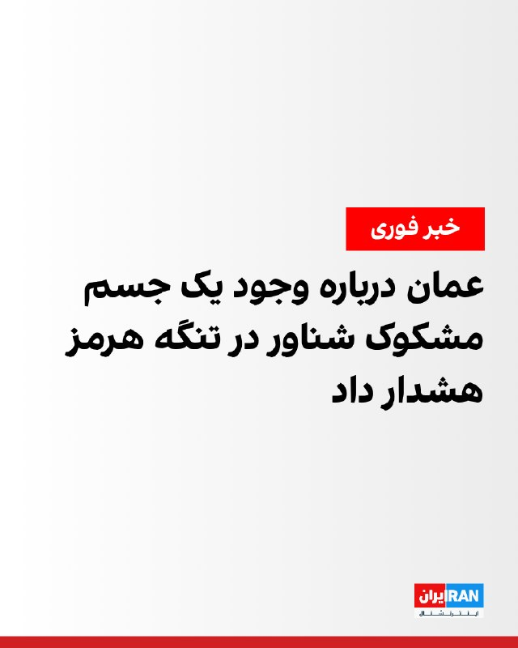
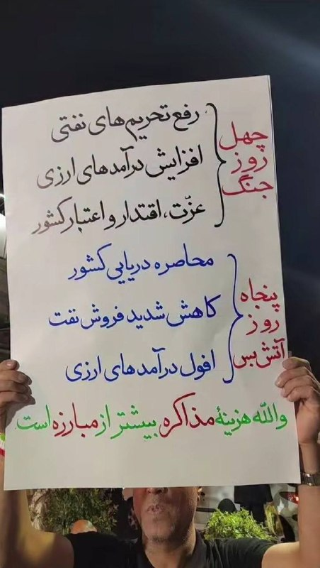
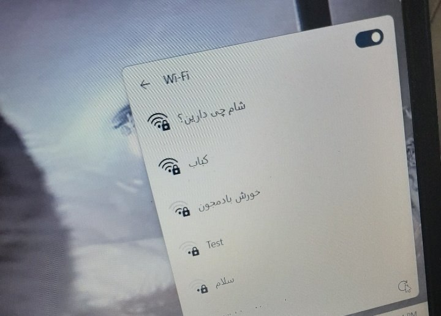
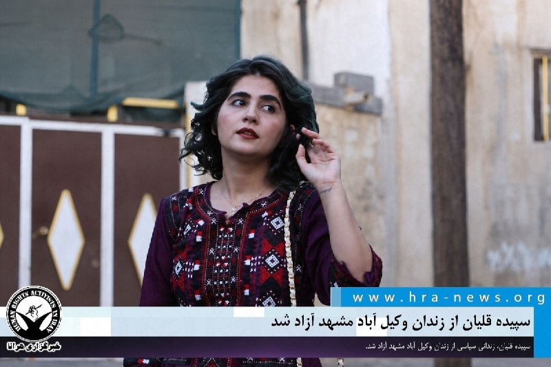
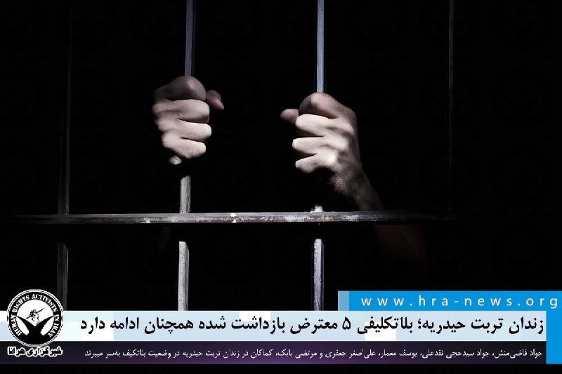
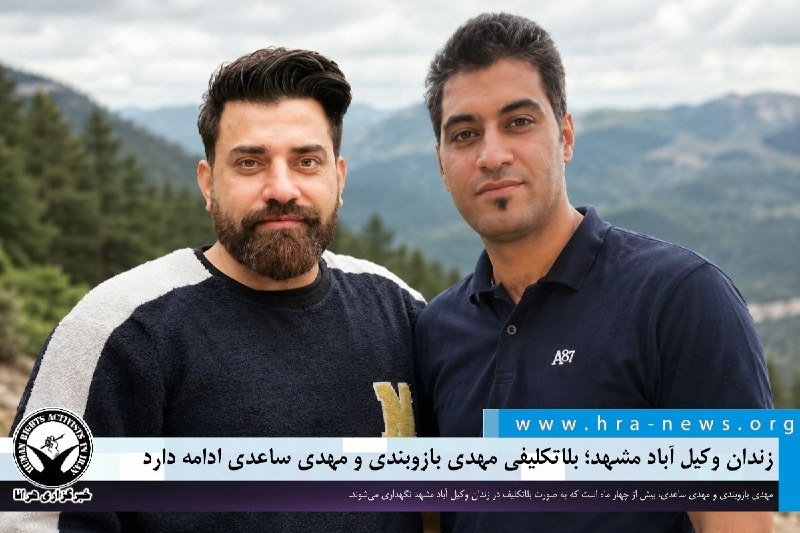

# خواننده تلگرام

<!-- TOP_NAV START -->

<a href="https://github.com/shahinsa98/aio-downloader/blob/main/telegram/content/archive_1.md" style="display:inline-block; padding:6px 12px; margin:0 4px; background-color:#2ea44f; color:white; text-decoration:none; border-radius:4px; font-weight:bold;">صفحه بعد</a>

<!-- TOP_NAV END -->

<!-- MSG START -->

---
📅 بروزرسانی: 1405/03/09 17:50
---

## VahidOOnLine — post 242922

  <a href="telegram/content/VahidOOnLine_242922_1780150814.mp4" target="_blank">🎬 Download video</a>

♦️هم‌زمان با نزدیک شدن به فینال لیگ قهرمانان اروپا، روز شنبه ۹ خردادماه فروشگاه‌ها در خیابان شانزه‌لیزه پاریس با نصب موانع و تدابیر امنیتی در حال آماده‌سازی برای این رویداد هستند.
این تدابیر در آستانه دیدار نهایی میان دو تیم پاری‌سن ژرمن و آرسنال انجام می‌شود؛ تیم‌هایی که پس از سال‌ها دوباره به فینال این رقابت‌ها رسیده‌اند. پاری سن ژرمن با شکست تیم‌های لیورپول و بایرمونیخ  به این مرحله رسیده و و آرسنال نیز با شکست اسپورتینگ و اتلتیکومادرید از مدافعان قهرمانی راهی فینال شده است.
مقامات شهری پاریس با توجه به حضور گسترده هواداران، تمهیدات ویژه‌ای برای جلوگیری از ناآرامی‌های احتمالی در نظر گرفته‌اند تا این شب فوتبالی در فضایی امن برگزار شود.
‌🇸🇦 Indypersian

🤖 @VahidOOnLine

## VahidOOnLine — post 242921

  

شاهزاده رضا پهلوی در نشست «امنیت دریای سیاه» در اودسا در جنوب اوکراین، ضمن انتقاد از هرگونه توافق احتمالی، گفت که جمهوری اسلامی را مدیریت نکنید، بلکه به آن پایان دهید.

او افزود: «محور مسکو-تهران یک دشمن هماهنگ برای همه است و باید قاطعانه و با انسجام با آن برخورد شود.»

شاهزاده رضا پهلوی ادامه داد: «هر توافقی با جمهوری اسلامی مانند توافقات با شوروی سابق موضوع را حل نکرده است.»
‌🏁 🇬🇧 IranintlTV

🤖 @VahidOOnLine

## VahidOOnLine — post 242920

  

♦️ نیروهای طالبان شماری از جوانان را که با موتورسیکلت از زیرگذر شهر هرات در غرب افغانستان عبور کرده بودند، بازداشت و تنبیه کردند.

در عکسی که از این رویداد منتشر شده، شماری از جوانان در یک صف کنار دیوار زیرگذر نشسته و دست‌هایشان را بر گوش‌هایشان گذاشته‌اند. یک عضو مسلح طالبان نیز در مقابل آنان ایستاده است. در تصویر چند موتورسیکلت نیز دیده می‌شود.
منابع مردمی می‌گویند که طالبان این افراد را به دلیل عبور از زیرگذری که تردد موتورسیکلت در آن ممنوع است بازداشت کرده‌اند.
طالبان تاکنون درمورد این رویداد ابراز نظر نکرده‌اند.
چنین شیوه تنبیهی در قوانین رانندگی افغانستان سابقه ندارد و در گذشته تخلفات رانندگی معمولا با جریمه نقدی، توقیف وسایل یا اقدامات قانونی دیگر پیگیری می‌شد.

این در حالی است که نیروهای طالبان در بیش از چهار سال گذشته در موارد متعددی از شیوه‌های مختلف تنبیهی، از جمله شلیک به متهمان، سیاه کردن چهره افراد متهم به دزدی، و ضرب و شتم آنان استفاده کرده‌اند.
‌🇸🇦 Indypersian

🤖 @VahidOOnLine

## VahidOOnLine — post 242919

  

شاهزاده رضا پهلوی در نشست «امنیت دریای سیاه» در اودسا در جنوب اوکراین، گفت که دنیای آزاد هنوز متوجه ماهیت جمهوری اسلامی نشده است.
شاهزاده رضا پهلوی درباره تلاش برای توافق با جمهوری اسلامی با امید به ایجاد ثبات، گفت که یک سگ وحشی در نهایت دست شما را گاز می‌گیرد.

او افزود: «پهپادهایی که اوکراین را هدف قرار می‌دهد از سوی جمهوری اسلامی تهیه شده و با همان پهپادها مردم معترض خود را در خیابان تعقیب می‌کند تا تک‌تیراندازها آن‌ها را هدف قرار دهند.»

شاهزاده رضا پهلوی گفت که تهران و مسکو معماران مشترک هرج‌ومرج در جهان هستند.
‌🏁 🇬🇧 IranintlTV

🤖 @VahidOOnLine

## VahidOOnLine — post 242918

  

مجتبی یوسفی، عضو هیات رییسه مجلس گفت: «رهبری در بحث مذاکرات، ۱۰ شرط مشخص کردند که اگر تیم مذاکره‌کننده ۱۰ شرط را رعایت نکند، نه مردم، نه نمایندگان، نه نخبگان، آن توافق را حتما به‌عنوان توافق خوب در نظر نخواهند گرفت و می‌شود تجربه‌ای که در اعتماد به غرب باعث عقب‌افتادگی کشور شد.»

او افزود: «امروز باید هم‌قسم شویم تا به گفته امام شهید و امام جدیدمان، مسائل اصلی کشور را حل کنیم.»
‌🏁 🇬🇧 IranintlTV

🤖 @VahidOOnLine

## VahidOOnLine — post 242917

  

♦️ هاکان فیدان، وزیر امور خارجه ترکیه، در گفتگو با نشریه «نیکِی آسیا» اعلام کرد که اگر اسرائیل تشکیل دولت مستقل فلسطین بر اساس مرزهای ۱۹۶۷ را به رسمیت بشناسد، می‌تواند به یک «بلوک منطقه‌ای» مشترک ملحق شود. فیدان تاکید کرد: «در صورت حل این مسئله، کشورهای منطقه نیز به امنیت اسرائیل کمک شایانی خواهند کرد.»

به گفته فیدان، این چارچوب همکاری می‌تواند شامل پاکستان، ترکیه، عربستان سعودی، مصر و دیگر کشورهای خلیج فارس باشد و در صورت عادی شدن شرایط، شاید ایران نیز به آن بپیوندد. او افزود: «همه کشورهای منطقه باید به تمامیت ارضی، حاکمیت و امنیت یکدیگر متعهد باشند.»

این اظهارات در حالی مطرح می‌شود که ترکیه خود را برای میزبانی از نشست کلیدی ناتو در ماه ژوئیه آماده می‌کند. هم‌زمان، دونالد ترامپ نیز روز دوشنبه در تروث سوشال، با نام بردن از شش کشور از جمله ترکیه و مصر، بر لزوم توسعه «پیمان ابراهیم» تاکید کرد و نوشت: «لازم است دست‌کم این کشورها، همزمان به این پیمان بپیوندند.»
‌🇸🇦 Indypersian

🤖 @VahidOOnLine

## VahidOOnLine — post 242916

  

حسینعلی شهریاری، نماینده سیستان و بلوچستان در مجلس گفت: «الان شهر زاهدان هزار لیتر در ثانیه کمبود آب دارد؛ به‌طوری که طبق گفته بعضی از شهروندان، برخی از آنها ۲۴ تا ۴۸ ساعت آب ندارند و مناطق زیادی از زاهدان در این زمینه دچار مشکل هستند.»

او ادامه داد: «مثلا الان در زاهدان که مرکز استان است، از دولت‌های قبل، به علت کمبود آب، دو پروژه در آن شروع شد؛ یکی انتقال آب از دریای عمان که قرار بود به سیستان و بلوچستان جنوبی و خراسان رضوی برسد و دیگری هم آبی که قرار بود از دشت تهلاب برای شهر زاهدان بیاید.»
‌🏁 🇬🇧 IranintlTV

🤖 @VahidOOnLine

## VahidOOnLine — post 242915

  

♦️ پیت هگست، وزیر جنگ ایالات متحده، روز شنبه نهم خرداد اعلام کرد که به دنبال جلسه روز گذشته در کاخ سفید، واشنگتن به موفقیت‌هایی در مذاکرات با ایران دست یافته است. هگست تاکید کرد: «ایران به طور کاملا واضح از انتظارات ما آگاه است. آن‌ها در مسیر خواسته‌های ما حرکت می‌کنند و گفتگوها سازنده بوده است. من به رئیس‌جمهورمان که فقط توافق‌های بزرگ امضا می‌کند، اعتماد کامل دارم.»

وزیر جنگ آمریکا که در کنار وزیران دفاع استرالیا و بریتانیا با خبرنگاران صحبت کرد، با اشاره به گره‌های موجود در مذاکرات فاش کرد که بخشی از بحث‌ها با این همتایان، بر چگونگی جلوگیری از دستیابی ایران به سلاح هسته‌ای «هم‌زمان با پیشرفت فناوری» متمرکز است.
‌🇸🇦 Indypersian

🤖 @VahidOOnLine

## VahidOOnLine — post 242914

  

علیرضا سلیمی، عضو هیات رییسه مجلس گفت: «طرح اعمال مدیریت تنگه هرمز در جلسه علنی مجلس بررسی و تصویب خواهد شد.»
او افزود: «تصمیمات ما درباره اعمال مدیریت بر تنگه هرمز تاکتیکی و موقت نیست، بلکه قطعی و ابدی است.»

سلیمی ادامه داد: «صفر تا صد قانون اعمال مدیریت بر تنگه هرمز به‌طور کامل و جزء به جزء صرفا در مجلس تصویب و نهایی خواهد شد.»

او اضافه کرد: «قطعا این قانون یکی از قوانین مشعشع تاریخ ایران خواهد بود.»
‌🏁 🇬🇧 IranintlTV

🤖 @VahidOOnLine

## VahidOOnLine — post 242913

  <a href="telegram/content/VahidOOnLine_242913_1780150819.mp4" target="_blank">🎬 Download video</a>

♦️پیت هگست، وزیر جنگ ایالات متحده، روز شنبه ۹ خردادماه در جریان سفر خود به سنگاپور در مصاحبه ای با خبرنگاران اعلام کرد که بخش عمده عملیات‌های اخیر در منطقه بر عهده آمریکا بوده و این کشور «کنترل واقعی» تنگه را در اختیار دارد.
او با اشاره به نقش متحدان، از جمله استرالیا، گفت هرچند این کشورها حمایت مهمی ارائه کرده‌اند، اما عملیات محاصره به‌طور عمده توسط آمریکا انجام شده و «فشار اصلی» را بر ایران وارد کرده است.
هگست همچنین با اشاره به روند مذاکرات تأکید کرد تحولات پشت‌صحنه نشان می‌دهد واشنگتن در موقعیت مسلط قرار دارد. او در ادامه به همکاری‌های امنیتی در قالب پیمان «آکوس» و سایر ترتیبات منطقه‌ای اشاره کرد و گفت این همکاری‌ها نشان‌دهنده قدرت و انسجام اتحادهای آمریکا در منطقه اقیانوس آرام است.
‌🇸🇦 Indypersian

🤖 @VahidOOnLine

## VahidOOnLine — post 242912

  

♦️ مرکز امنیت دریایی عمان روز شنبه نهم خرداد، از دریانوردان، ماهیگیران و شناورها خواست تا در مسیرهای حرکتی خود نهایت احتیاط را به کار بندند. این هشدار پس از آن صادر شد که یک شی شناور مشکوک به «مین دریایی» در سمت غربی منطقه تردد ساحلی در تنگه هرمز و در محدوده آب‌های سرزمینی عمان رویت شد.

این مرکز به فعالان و کاربران حوزه دریانوردی توصیه کرد که فاصله ایمن را با هرگونه شی مشکوک حفظ کرده و مراتب را فورا به مقامات ذی‌ربط گزارش دهند.
‌🇸🇦 Indypersian

🤖 @VahidOOnLine

## VahidOOnLine — post 242911

  

مرکز امنیت دریایی عمان اعلام کرد در پی مشاهده یک جسم شناور مشکوک به مین دریایی در غرب مسیر ترافیک ساحلی تنگه هرمز و در آب‌های سرزمینی این کشور، از کشتی‌ها و صیادان خواسته شده با حداکثر احتیاط تردد کنند و هر مورد مشکوک را فورا به مقام‌های مسئول گزارش دهند.
‌🏁 🇬🇧 IranintlTV

🤖 @VahidOOnLine

## VahidOOnLine — post 242910

  

رافائل گروسی، مدیرکل آژانس بین‌المللی انرژی اتمی سازمان ملل، در گفت‌وگو با روزنامه نشنال‌نیوز با ابراز نگرانی از گسترش «پدیده» حمله به نیروگاه‌های هسته‌ای در جریان درگیری‌های اخیر، گفت حمله به این تاسیسات در حال تبدیل شدن به الگویی خطرناک در جنگ‌ها است.

گروسی با اشاره به حمله پهپادی به نیروگاه براکه در امارات متحده عربی گفت: «این واقعیت که کسی یک نیروگاه هسته‌ای را هدف قرار داده، بسیار جدی است.»

او گفت آژانس شواهد لازم برای مقصر دانستن تهران در این حمله را در اختیار ندارد و افزود: «ما به مدرک ملموسی درباره منشا این حمله نیاز داریم.»

مقام‌های امارات متحده عربی، نیروهای نیابتی جمهوری اسلامی در عراق را مسئول این حمله اعلام کردند.

گروسی همچنین به حملات علیه نیروگاه هسته‌ای زاپوروژیا در اوکراین و نیروگاه هسته‌ای بوشهر اشاره کرد.
‌🏁 🇬🇧 IranintlTV

🤖 @VahidOOnLine

## WithYashar — post 12939

  

به نظر می‌رسد که ناو آبی/خاکی یو‌اس‌اس باکسر (lhd-4) قرار نیست در حوزه مسئولیت سنت‌کام  مستقر شود. ناو آبی‌خاکی کلاس واسپ نیز امروز از بندر سِمبانوان در سنگاپور حرکت کرد؛ اگرچه اکنون به سمت شرق در حرکت است.
@withyashar

## WithYashar — post 12938

شاهزاده رضا پهلوی در نشست «امنیت دریای سیاه» در اودسا در جنوب اوکراین، گفت که دنیای آزاد هنوز متوجه ماهیت جمهوری اسلامی نشده است.
شاهزاده رضا پهلوی درباره تلاش برای توافق با جمهوری اسلامی با امید به ایجاد ثبات، گفت که یک سگ وحشی در نهایت دست شما را گاز می‌گیرد.

او افزود: «پهپادهایی که اوکراین را هدف قرار می‌دهد از سوی جمهوری اسلامی تهیه شده و با همان پهپادها مردم معترض خود را در خیابان تعقیب می‌کند تا تک‌تیراندازها آن‌ها را هدف قرار دهند.»

شاهزاده رضا پهلوی گفت که تهران و مسکو معماران مشترک هرج‌ومرج در جهان هستند.
@withyashar

## WithYashar — post 12937

عمان: در آب‌های سرزمینی خود جسمی شناور را مشاهده کردیم که مظنون به مین دریایی است‌
@withyashar

## FoxNewsTwitter — post 342423

‌Fox News (Twitter/X)

👉 Full story here:

## FoxNewsTwitter — post 342422

Fox News (Twitter/X)

TANVI RATNA: Europe built its entire post-Russia energy system to avoid dependence on a single supplier. The Iran war just handed that leverage to America.

US LNG now supplies 63% of European imports and climbing. IEEFA projects 80% by 2030 — with 40% of all EU gas, pipeline and LNG combined, flowing from the United States.

The contracts got signed under wartime pressure. The Russian ban became law. The terminals run on American supply. There's no exit clause and no alternative at scale.

## pm_afshaa — post 91898

  <a href="telegram/content/pm_afshaa_91898_1780150822.webm" target="_blank">🎬 Download video</a>

🔴هگست، وزیر جنگ آمریکا:
محاصره که کاملاً محکم و بدون نفوذ بوده و واقعاً فشار زیادی روی ایران گذاشته.

اونا ممکنه بگن کنترل تنگه رو در دست دارن، ولی کاری که ما انجام میدیم، حتی پشت صحنه، نشون میده که در عمل ما هستیم که کنترل رو در دست داریم.
محاصره دریایی جمهوری اسلامی همچنان ادامه داره و این اقدام موثر بوده و کنترل تنگه هرمز در اختیار آمریکاست.

💧Rainbet.com the #1 Non-KYC Crypto Casino & Sportsbook @rainbetcom

😁 @Pm_Afshaa

## pm_afshaa — post 91896

  <a href="telegram/content/pm_afshaa_91896_1780150822.mp4" target="_blank">🎬 Download video</a>

کارشناس حرومزاده صداوسیما :

ایرانی ها اصلا آریایی نیستن، ما اصلا نژاد آریایی نداریم؛ اونا کلا 5 هزار سال پیش مهاجرت کردن اومدن ولی ما واسه 65 هزار سال پیشیم.
اصلا درست نیست بگیم آریایی هستیم انگار داریم میگیم بچه های یه مشت قاتل نسل کشیم.

💧Rainbet.com the #1 Non-KYC Crypto Casino & Sportsbook @rainbetcom

😁 @Pm_Afshaa

## pm_afshaa — post 91895

🔴نیویورک تایمز:ایران به رد خواسته‌های کلیدی آمریکا ادامه می‌دهد،از جمله تحویل ذخیره اورانیوم بسیار غنی شده خود و محدود کردن غنی‌سازی که باعث به بن بست رسیدن مذاکرات شده

💧 Rainbet.com the #1 Non-KYC Crypto Casino & Sportsbook @rainbetcom

😁 @Pm_Afshaa

## DEJradio — post 5155

⭕️ آمریکا، بریتانیا و استرالیا در پروژۀ زیردریایی‌های بی‌سرنشین همکاری می‌کنند

پیت هگست، وزیر دفاع آمریکا گفت واشینگتن، لندن و کانبرا در چارچوب پیمان آکوس برای توسعۀ شناورهای زیردریایی بی‌سرنشین همکاری می‌کنند.
او گفت این پروژه بر فناوری‌های پیشرفتۀ دفاعی از جمله هوش مصنوعی، فناوری زیرآبی، موشک‌های مافوق صوت، فناوری سایبری و محاسبات کوانتومی متمرکز است.
هگست افزود در این طرح روی مجموعه‌ای از سامانه‌های زیردریایی بدون سرنشین و چندمنظوره، برای حفظ برتری دریایی سه کشور، کار می‌شود.

#خبر #دژ #هوش_مصنوعی
@DEJradio

## DEJradio — post 5154

⭕️ بریتانیا تأیید کرد محاصرۀ دریایی جمهوری اسلامی توسط آمریکا ادامه دارد

سازمان عملیات تجارت دریایی بریتانیا اعلام کرد محاصرۀ بنادر ایران ادامه دارد.
به گفتۀ این نهاد، سطح تهدید دریایی در خلیج فارس، تنگۀ هرمز، دریای عمان و شمال دریای عرب همچنان بحرانی است.
بر اساس این بیانیه شناورهایی که از طریق انتقال کشتی‌به‌کشتی به ناقضان محاصرۀ جمهوری اسلامی کمک کنند، ناقض محاصره به شمار می‌روند.

#خبر #دژ #بریتانیا #محاصره_دریایی
@DEJradio

## DEJradio — post 5153

⭕️ قطر: می‌شود در مورد عوارض موقت در تنگۀ هرمز مذاکره کرد

شیخ سعود بن عبدالرحمن آل‌ثانی، معاون نخست‌وزیر قطر، گفت می‌شود درمورد عوارض موقت در تنگۀ هرمز برای مواردی مانند پاکسازی مین مذاکره کرد.
او گفت دوحه با دریافت دائمی عوارض عبور کشتی‌ها از آبراه هرمز مخالف است.
آمریکا و اروپا تلاش جمهوری اسلامی برای دریافت عوارض از کشتی‌ها را اخاذی مالی می‌دانند.
آمریکا اعلام کرده نهادها و کشتی‌هایی را که به باجگیری جمهوری اسلامی تن بدهند، تحریم می‌کند.

#خبر #دژ #قطر #تنگه_هرمز
@DEJradio

## DEJradio — post 5152

⭕️ واردات برق از ترکمنستان و ارمنستان ادامه دارد

مصطفی رجبی مشهدی، معاون وزیر نیرو گفتجمهوری اسلامی اکنون ۳۰۰ مگاوات برق از ترکمنستان و ارمنستان وارد می‌کند.
این مقام دولت پزشکیان از سویی مدعی شد صادرات برق به افغانستان و پاکستان نیز ادامه دارد. او گفت جنگ اخیر بر تبادلات برق منطقه‌ای اثر نگذاشت.
رجبی مشهدی همچنین ادعا کرد تبادل هزار مگاوات برق با روسیه قرار است در برنامه‌های آینده دنبال شود.

#خبر #دژ #برق
@DEJradio

## DEJradio — post 5151

⭕️ عضو کمیسیون انرژی مجلس: یک‌سوم ظرفیت تولید گاز در ایران از دست رفت

غلامرضا دهقان ناصرآبادی، عضو کمیسیون انرژی مجلس شورای اسلامی گفت در جریان جنگ چهل روزه درحدود یک‌سوم ظرفیت تولید گاز در ایران از بین رفته است.
او با اشاره به آسیب‌دیدن چند فازدر بندر عسلویه گفت وزارت نفت و وزارت نیرو برای بازگرداندن ظرفیت تولید به وضعیت پیش از جنگ تلاش می‌کنند.
بخش عمدۀ گاز در ایران از میدان مشترک پارس جنوبی تأمین می‌شود.

#خبر #دژ #انرژی
@DEJradio

## DEJradio — post 5150

⭕️ شاهزاده رضا پهلوی برای شرکت در نشستی امنیتی وارد اوکراین شد

بر پایۀ گزارش‌ها شاهزاده رضا پهلوی برای شرکت در نشست «فروم امنیت دریای سیاه» به بندر اودسا در اوکراین رفت.
بر اساس این گزارش، الکسی گنچارنکو، نمایندۀ پارلمان اوکراین و رئیس این فروم، از شاهزاده استقبال کرد.
در پیام‌های منتشرشده در این راستا گفت شد که مردم ایران و اوکراین، دشمنان مشترکی در تهران دارند.
روسیه بارها با استفاده از پهپادهای ساخته شده توسط جمهوری اسلامی، اوکراین را هدف گرفته است.
متخصصان اوکراینی در جریان جنگ چهل روزه، برای مقابله با پهپادهای جمهوری اسلامی به کشورهای حاشیۀ خلیج فارس کمک کردند.
شاهزاده رضا پهلوی پیش‌تر نشستی را با ولودیمیر زلنسکی، رئیس جمهوری اوکراین برگزار کرده بود.

#خبر #دژ #شاهزاده_رضا_پهلوی #اوکراین
@DEJradio

## DEJradio — post 5149

⭕️ رسانه‌های اسرائیل: ارتش برای جنگ احتمالی بعدی با جمهوری اسلامی آماده می‌شود

رسانه‌های اسرائیل می‌گویند روند آمادگی ارتش این کشور برای سومین رویارویی احتمالی با جمهوری اسلامی، ادامه دارد.
به گزارش شبکۀ کان، ارتش اسرائیل به دنبال ایجاد شرایطی است که جامعه بتواند در کمترین زمان ممکن با تغییر از وضعیت عادی به شرایط جنگی، سازگاری داشته باشد.
ارزیابی‌های ارتش اسرائیل بیانگر است که جمهوری اسلامی در جنگ بعدی ممکن است سریع‌تر واکنش نشان بدهد و الگوی استفاده از موشک‌ها را تغییر دهد.
بر پایۀ ارزیابی‌ها بیش از 72 درصد از موشک‌های جمهوری اسلامی که در جنگ پیشین استفاده شد، دارای کلاهک خوشه‌ای بود.
از سویی نخستین هواپیماهای سوخت‌رسان جدید آمریکایی به اسرائیل رسیده است.
به گفتۀ مقام‌های نظامی اسرائیل، این هواپیماها ظرفیت عملیات دوربرد را افزایش می‌دهد.
رسانه‌های اسرائیل گزارش دادند در جنگ چهل روزه همۀ اهداف اسرائیل محقق نشده و تلاش برای دستیابی به سایر اهداف ادامه می‌یابد.

#خبر #دژ #اسرائیل
@DEJradio

## DEJradio — post 5148

  <a href="telegram/content/DEJradio_5148_1780150824.mp4" target="_blank">🎬 Download video</a>

🤡
🔺 حرکات اروتیک ولایتمداران در تجمعات شبانه

بر اساس ویدیویی‌هایی که در رسانه‌های وابسته به حکومت از تجمعات شبانه ولایتمداران منتشر می‌شود، شماری از آنها زیر تاثیر اشعار مداحان اخیرا حرکات اروتیک از خود به نمایش می‌گذارند.

#شیفت_شب #اروتیک #تجمعات_حکومتی
@DEJradio

## DEJradio — post 5147

⭕️ آمریکا یک میلیارد دلار رمزارز مرتبط با جمهوری اسلامی را توقیف کرد

اسکات بسنت، وزیر خزانه‌داری آمریکا گفت واشینگتن یک میلیارد دلار دارایی رمزارزی مرتبط با جمهوری اسلامی را توقیف کرده است.
او همچنین گفت اگر قرار باشد محاصرۀ مالی و اقتصادی علیه جمهوری اسلامی کاهش یابد و یا لغو شود، این کار به‌صورت مرحله‌به‌مرحله پیش می‌رود.

#خبر #دژ #تحریم #رمز_ارز
@DEJradio

## DEJradio — post 5146

⭕️ ترامپ در نشست با مشاوران خود در مورد جمهوری اسلامی تصمیم پایانی را نگرفت

نشست بیش از دو ساعتۀ دونالد ترامپ با مشاوران ارشدش در اتاق وضعیت کاخ سفید، بدون اعلام نتیجه پایان یافت.
نیویورک‌تایمز به نقل از یک مقام ارشد دولت آمریکا نوشت ترامپ هنوز درمورد تفاهم احتمالی با تهران به جمع‌بندی نرسیده است.
ترامپ بر باز شدن تنگۀ هرمز و نابودی ذخایر اورانیوم غنی‌شدۀ جمهوری اسلامی پافشاری می‌کند.

#خبر #دژ #ترامپ
@DEJradio

## DEJradio — post 5145

⭕️ وزیر جنگ آمریکا: برای ازسرگیری جنگ با جمهوری اسلامی توانایی ما فراتر از حد است

پیت هگست، وزیر جنگ دولت ایالات متحده، خبر داد واشینگتن در صورت لزوم، آمادۀ ازسرگیری جنگ با جمهوری اسلامی است.
او در نشست امنیتی سنگاپور گفت توانایی آمریکا برای ازسرگیری جنگ با رژیم حاکم بر ایران، بیش از حد لازم است. به گفتۀ هگست، انبارهای مهمات ایالات متحده کاملا آماده‌ است.
هگست تأکید کرد آمریکا میان مهمات پیشرفته و ذخایر انبوه تسلیحاتی تعادل برقرار کرده است.
کاخ سفید اعلام کرده دونالد ترامپ به تصمیم‌گیری درباره توافق احتمالی نزدیک شده، اما هنوز تصمیم پایانی در مورد توافق یا حملۀ نظامی گرفته نشده است.

#خبر #دژ #جنگ
@DEJradio

## DEJradio — post 5144

⭕️ نیروهای اسرائیلی تا فراتر از رود لیتانی پیشروی کردند

بنیامین نتانیاهو، نخست‌وزیر اسرائیل گفت نیروهای این کشور از رود لیتانی عبور کرده و در عمق جنوب لبنان پیشروی کردند.
همزمان، هیات‌های نظامی اسرائیل و لبنان در واشینگتن گفت‌وگوهای امنیتی برگزار کردند.
ژوزف عون، رئیس‌جمهور لبنان، در تماس با مارکو روبیو بر ضرورت تلاش برای برقراری آتش‌بس تأکید کرد.
با وجود آتش‌بسی که از ۲۸ فروردین میان اسرائیل و لبنان برقرار شده، حزب‌الله بارها به شمال اسرائیل حمله کرده و ارتش این کشور را به واکنش نظامی واداشته است.

#دژ #خبر #اسرائیل
@DEJradio

## DEJradio — post 5143

  <a href="telegram/content/DEJradio_5143_1780150825.mp4" target="_blank">🎬 Download video</a>

🛩️
🔥 سرنگونی یک پهپاد «شاهد» با مسلسل از داخل هلی‌کوپتر

گزارش‌ها حاکی است که نیروهای اسرائیلی از یک مسلسل M134 Minigun (مینی‌گان ام۱۳۴) نصب‌شده روی هلیکوپتر برای سرنگونی یک پهپاد «شاهد» استفاده کرده‌اند.

این رهگیری نشان می‌دهد که جنگ پهپادی با چه سرعتی در حال دگرگون‌کردن شیوه‌های نبرد مدرن در خاورمیانه و سایر نقاط جهان است. گفته می‌شود این ویدیو مربوط به روزهای جنگ است.

پهپادهای شاهد به یکی از شناخته‌شده‌ترین سلاح‌های درگیری‌های کنونی جهان تبدیل شده‌اند و به‌طور گسترده توسط جمهوری اسلامی ایران و روسیه مورد استفاده قرار می‌گیرند.

#پهپاد_شاهد #جنگ
@DEJradio

## DEJradio — post 5142

⭕️ آمریکا باج‌دهندگان به جمهوری اسلامی برای عبور از تنگۀ هرمز را تحریم می‌کند

وزارت خزانه‌داری آمریکا هشدار داد هرگونه توافق با جمهوری اسلامی برای عبور امن از تنگۀ هرمز، حتا بدون پرداخت مستقیم پول می‌تواند تحریم در پی داشته باشد.
دفتر کنترل دارایی‌های خارجی آمریکا اعلام کرد دریافت خدمات یا تضمین از دولت جمهوری اسلامی یا سپاه پاسداران برای عبور امن از تنگۀ هرمز، برای شهروندان آمریکا ممنوع است.
وزارت خزانه‌داری آمریکا همچنین گفت نهاد موسوم به «مدیریت آبراه خلیج فارس» که برای دریافت عوارض از کشتی‌ها ایجاد شده، به‌دلیل ارتباط با سپاه تحریم شده است.
واشینگتن هشدار داد همکاری مستقیم یا غیرمستقیم با این نهاد، حتا برای شرکت‌ها و مؤسسات غیرآمریکایی تحریم در پی دارد.

#خبر #دژ #تنگه_هرمز
@DEJradio

## DEJradio — post 5141

⭕️ عضو نزدیک به مذاکره‌کنندگان جمهوری اسلامی گفت بدون آزادسازی ۱۲ میلیارد دلار، مرحلۀ بعدی در کار نیست

سعید آجرلو، از چهره‌های رسانه‌ای نزدیک به محمدباقر قالیباف و هیئت مذاکرکنندۀ جمهوری اسلامی، گفت دسترسی به ۱۲ میلیارد دلار از دارایی‌های بلوکه‌شده، یکی از شروط اصلی تفاهم احتمالی است.
او ادعا کرد این مبلغ باید به‌صورت غیرقابل برگشت، در اختیار بانک مرکزی قرار بگیرد.
آجرلو ادعا کرد در طرح ۱۴ ماده‌ای، معافیت تحریم‌های نفتی و رفع محاصرۀ دریایی به‌عنوان گام نخست در نظر گرفته شده است.
به گفتۀ این فرد نزدیک به مقامات، پس از اجرای تعهدات آمریکا، جمهوری اسلامی وارد مرحلۀ بعدی می‌شود.
او مدعی شد اگر مرحلۀ اول اجرا نشود، اعتمادی برای ادامۀ مذاکرات وجود ندارد.

#خبر #دژ #مذاکرات #توافق
@DEJradio

## DEJradio — post 5140

⭕️ وزیر جنگ آمریکا: تنگۀ هرمز باید بدون عوارض برای استفادۀ همۀ دنیا باز باشد

پیت هگست، وزیر جنگ آمریکا گفت تنگۀ هرمز باید بدون عوارض باز باشد و همۀ دنیا بتواند از آن استفاده کند.
به گفتۀ هگست، هر توافقی با جمهوری اسلامی تنها زمانی انجام می‌شود که دونالد ترامپ آن را توافقی عالی برای آمریکا و امنیت جهان بداند.
هگست در حاشیۀ نشست شانگری‌لا در سنگاپور گفت معیارهای آمریکا برای توافق تغییری نکرده است.
او گفت هرچه جمهوری اسلامی به مواضع واشینگتن نزدیک‌تر شود، احتمال توافق افزایش می‌یابد.
هگست با اشاره به گزینۀ نظامی علیه جمهوری اسلامی گفت آمریکا اکنون آماده‌تر است و دست بالا را دارد.
وزیر جنگ ایالات متحده با اشاره به این که ترجیح ترامپ این است که کار به درگیری نظامی نکشد، گفت جمهوری اسلامی دارد به خواسته‌های آمریکا نزدیک می‌شود.
هگست همچنین با دفاع از ادامۀ محاصره دریایی جمهوری اسلامی گفت رژیم ادعا می‌کند مدیریت تنگۀ هرمز را در اختیار دارد، اما واقعیت این است که کنترل این آبراه در اختیار آمریکا است.

#خبر #دژ #تنگه_هرمز
@DEJradio

## IranIntlTV — post 339746

  

شاهزاده رضا پهلوی در نشست «امنیت دریای سیاه» در اودسا در جنوب اوکراین، ضمن انتقاد از هرگونه توافق احتمالی، گفت که جمهوری اسلامی را مدیریت نکنید، بلکه به آن پایان دهید.

او افزود: «محور مسکو-تهران یک دشمن هماهنگ برای همه است و باید قاطعانه و با انسجام با آن برخورد شود.»

شاهزاده رضا پهلوی ادامه داد: «هر توافقی با جمهوری اسلامی مانند توافقات با شوروی سابق موضوع را حل نکرده است.»
https://iranintl.com/202605309589

## IranIntlTV — post 339745

  

شاهزاده رضا پهلوی در نشست «امنیت دریای سیاه» در اودسا در جنوب اوکراین، گفت که دنیای آزاد هنوز متوجه ماهیت جمهوری اسلامی نشده است.
شاهزاده رضا پهلوی درباره تلاش برای توافق با جمهوری اسلامی با امید به ایجاد ثبات، گفت که یک سگ وحشی در نهایت دست شما را گاز می‌گیرد.

او افزود: «پهپادهایی که اوکراین را هدف قرار می‌دهد از سوی جمهوری اسلامی تهیه شده و با همان پهپادها مردم معترض خود را در خیابان تعقیب می‌کند تا تک‌تیراندازها آن‌ها را هدف قرار دهند.»

شاهزاده رضا پهلوی گفت که تهران و مسکو معماران مشترک هرج‌ومرج در جهان هستند.
https://iranintl.com/202605309766

## IranIntlTV — post 339744

  <a href="telegram/content/IranIntlTV_339744_1780150828.mp4" target="_blank">🎬 Download video</a>

اسماعیل سقاب اصفهانی، معاون رییس‌جمهور دولت جمهوری اسلامی، از تشدید بحران انرژی در ایران خبر داد و گفت کمبود روزانه بنزین به ۳۰ میلیون لیتر و کسری گاز به ۱۰۰ میلیارد متر مکعب رسیده است.
گفت‌وگو با عطا حسینیان، روزنامه‌نگار اقتصادی و حوزه انرژی
@iranintltv

## IranIntlTV — post 339743

  

مجتبی یوسفی، عضو هیات رییسه مجلس گفت: «رهبری در بحث مذاکرات، ۱۰ شرط مشخص کردند که اگر تیم مذاکره‌کننده ۱۰ شرط را رعایت نکند، نه مردم، نه نمایندگان، نه نخبگان، آن توافق را حتما به‌عنوان توافق خوب در نظر نخواهند گرفت و می‌شود تجربه‌ای که در اعتماد به غرب باعث عقب‌افتادگی کشور شد.»

او افزود: «امروز باید هم‌قسم شویم تا به گفته امام شهید و امام جدیدمان، مسائل اصلی کشور را حل کنیم.»
https://iranintl.com/202605306617

## IranIntlTV — post 339742

  

حسینعلی شهریاری، نماینده سیستان و بلوچستان در مجلس گفت: «الان شهر زاهدان هزار لیتر در ثانیه کمبود آب دارد؛ به‌طوری که طبق گفته بعضی از شهروندان، برخی از آنها ۲۴ تا ۴۸ ساعت آب ندارند و مناطق زیادی از زاهدان در این زمینه دچار مشکل هستند.»

او ادامه داد: «مثلا الان در زاهدان که مرکز استان است، از دولت‌های قبل، به علت کمبود آب، دو پروژه در آن شروع شد؛ یکی انتقال آب از دریای عمان که قرار بود به سیستان و بلوچستان جنوبی و خراسان رضوی برسد و دیگری هم آبی که قرار بود از دشت تهلاب برای شهر زاهدان بیاید.»
https://iranintl.com/202605302542

## IranIntlTV — post 339741

  <a href="telegram/content/IranIntlTV_339741_1780150831.mp4" target="_blank">🎬 Download video</a>

دانش‌آموزان در پیام‌هایی به ایران‌اینترنشنال می‌گویند که به دلیل فشارهای اقتصادی و برای کمک به تامین معاش خود و خانواده، ناچار به ترک تحصیل و ورود به بازار کار شده‌اند.
جزییات بیشتر با محسن مهیمنی، عضو تحریریه ایران‌اینترنشنال
@iranintltv

## IranIntlTV — post 339740

  

علیرضا سلیمی، عضو هیات رییسه مجلس گفت: «طرح اعمال مدیریت تنگه هرمز در جلسه علنی مجلس بررسی و تصویب خواهد شد.»
او افزود: «تصمیمات ما درباره اعمال مدیریت بر تنگه هرمز تاکتیکی و موقت نیست، بلکه قطعی و ابدی است.»

سلیمی ادامه داد: «صفر تا صد قانون اعمال مدیریت بر تنگه هرمز به‌طور کامل و جزء به جزء صرفا در مجلس تصویب و نهایی خواهد شد.»

او اضافه کرد: «قطعا این قانون یکی از قوانین مشعشع تاریخ ایران خواهد بود.»
https://iranintl.com/202605300411

## IranIntlTV — post 339739

  <a href="telegram/content/IranIntlTV_339739_1780150832.mp4" target="_blank">🎬 Download video</a>

شاهزاده رضا پهلوی شنبه نهم خرداد برای شرکت در نشست بین‌المللی «امنیت دریای سیاه» وارد شهر اودسا در جنوب اوکراین شد.

شاهزاده در بدو ورود به محل برگزاری این نشست مورد استقبال اولکسی گونچارنکو، نماینده پارلمان اوکراین، قرار گرفت.

نشست «انجمن امنیت دریای سیاه» که با نام «انجمن اودسا» نیز شناخته می‌شود، یک رویداد بین‌المللی سالانه است که به بررسی چالش‌های امنیتی، اقتصادی و سیاسی منطقه دریای سیاه می‌پردازد. این انجمن در سال ۲۰۲۴ از سوی گروهی از نمایندگان پارلمان اوکراین بنیان‌گذاری شد.

اولکسی گونچارنکو، نماینده پارلمان اوکراین، بنیان‌گذار و رییس این انجمن است.
@iranintltv

## IranIntlTV — post 339738

  <a href="https://t.me/IranintlTV/339738" target="_blank">📎 Download file</a>

🎧نسخه صوتی اخبار نیمروزی | شنبه ۹ خرداد
@iranintlTV

## IranIntlTV — post 339737

  <a href="telegram/content/IranIntlTV_339737_1780150834.mp4" target="_blank">🎬 Download video</a>

در آستانه سومین ماه قطعی اینترنت در ایران، مقام‌های جمهوری اسلامی از آغاز روند بازگشت اینترنت بین‌الملل خبر داده‌اند. خبری که هم‌زمان با گزارش‌ها درباره احتمال توافق میان تهران و واشینگتن، بازتاب گسترده‌ای در رسانه‌های بین‌المللی داشت.

اما داده‌های نت‌بلاکس، کنتیک و کلودفلر، و مهم‌تر از آن روایت شهروندان، تصویر متفاوتی نشان می‌دهد؛ بازگشتی محدود، ناپایدار و بیشتر متمرکز در تهران.

این گزارش بررسی می‌کند که پشت تیتر «بازگشت اینترنت در ایران» چه واقعیتی قرار دارد؛ بازگشت واقعی برای مردم، یا نسخه‌ای محدود و کنترل‌شده از اتصال به جهان؟
@iranintltv

## IranIntlTV — post 339736

  

مرکز امنیت دریایی عمان اعلام کرد در پی مشاهده یک جسم شناور مشکوک به مین دریایی در غرب مسیر ترافیک ساحلی تنگه هرمز و در آب‌های سرزمینی این کشور، از کشتی‌ها و صیادان خواسته شده با حداکثر احتیاط تردد کنند و هر مورد مشکوک را فورا به مقام‌های مسئول گزارش دهند.
https://iranintl.com/202605303637

## IranIntlTV — post 339735

  <a href="telegram/content/IranIntlTV_339735_1780150835.mp4" target="_blank">🎬 Download video</a>

یکی از شرکت‌کنندگان در تجمع استکهلم در گفت‌وگو با مهران عباسیان، خبرنگار ایران‌اینترنشنال، خواستار بسته شدن سفارت جمهوری اسلامی در سوئد شد

@iranintltv

## IranIntlTV — post 339734

  

رافائل گروسی، مدیرکل آژانس بین‌المللی انرژی اتمی سازمان ملل، در گفت‌وگو با روزنامه نشنال‌نیوز با ابراز نگرانی از گسترش «پدیده» حمله به نیروگاه‌های هسته‌ای در جریان درگیری‌های اخیر، گفت حمله به این تاسیسات در حال تبدیل شدن به الگویی خطرناک در جنگ‌ها است.

گروسی با اشاره به حمله پهپادی به نیروگاه براکه در امارات متحده عربی گفت: «این واقعیت که کسی یک نیروگاه هسته‌ای را هدف قرار داده، بسیار جدی است.»

او گفت آژانس شواهد لازم برای مقصر دانستن تهران در این حمله را در اختیار ندارد و افزود: «ما به مدرک ملموسی درباره منشا این حمله نیاز داریم.»

مقام‌های امارات متحده عربی، نیروهای نیابتی جمهوری اسلامی در عراق را مسئول این حمله اعلام کردند.

گروسی همچنین به حملات علیه نیروگاه هسته‌ای زاپوروژیا در اوکراین و نیروگاه هسته‌ای بوشهر اشاره کرد.
https://iranintl.com/202605306998

## Shin_Persian — post 6320

  

Shin ✓ @hey_itsmyturn
Sat, 30 May 2026 12:24:21 UTC

And still.

فارسی

و همچنان.

𝕏 · @shin_persian

## FarsiVOA — post 219073

  <a href="telegram/content/FarsiVOA_219073_1780150837.mp4" target="_blank">🎬 Download video</a>

هاجر نادری، مادر متین پرویزی، از کشته‌شدگان دی ماه ۱۴۰۴، بعد از بازگشایی محدود اینترنت در ایران، ویدیویی از حضور خود بر آرامگاه پسرش در سال نو منتشر کرده است. متین پرویزی، ۲۲ ساله و دانشجو در ۱۸ دی ۱۴۰۴ در سبزه‌میدان زنجان، با شلیک ماموران حکومتی به سرش کشته شد.

## FarsiVOA — post 219072

  <a href="telegram/content/FarsiVOA_219072_1780150839.mp4" target="_blank">🎬 Download video</a>

ارتش اسرائیل ویدیویی از شناسایی و انهدام یک سکوی پرتاب موشک منتشر کرده است که شب گذشته نیروهای حزب‌الله از آن به سمت اسرائیل موشک شلیک کرده بودند.
این ویدیو بی‌صدا است.

## FarsiVOA — post 219071

🔺هگست: پرزیدنت ترامپ فقط توافقی را می‌پذیرد که برای آمریکا و امنیت جهان «عالی» باشد

▪️پیت هگست، وزیر جنگ ایالات متحده، می‌گوید پرزیدنت ترامپ تنها در صورتی حاضر به توافق با جمهوری اسلامی ایران خواهد بود که آن را «توافقی عالی» برای آمریکا و امنیت جهان بداند.

⬇️ بیشتر بخوانید:

https://ir.voanews.com/a/hegseth-trump-demands-great-iran-deal/8155554.html/?nocach=1

## FarsiVOA — post 219070

  <a href="telegram/content/FarsiVOA_219070_1780150840.mp4" target="_blank">🎬 Download video</a>

این ویدیو که بعد از بازگشایی محدود اینترنت در ایران در شبکه‌های اجتماعی منتشر شده منتسب است به روزهای نخست جنگ و گذر موشک‌های کروز تاماهاک در مرز عراق و ایران.

## FarsiVOA — post 219069

🔺آمریکا یک «شبکه کلاهبرداری» وابسته به رژیم ایران را تحریم کرد

▪️ایالات متحده از تحریم یک شبکه پیچیده وابسته به جمهوری اسلامی که با جعل هویت و فریب شرکت‌های آمریکایی، فناوری‌های حساس را برای نیروی نظامی رژیم ایران تهیه می‌کرد، خبر داد.

⬇️ بیشتر بخوانید:

https://ir.voanews.com/a/iran-irgc-state-department-sanction-network-fraud-american-companies/8155552.html/?nocach=1

## FarsiVOA — post 219068

🔺هشدار مرکز امنیت دریایی عمان درباره مشاهده «جسم شناور مشکوک» در تنگه‌ هرمز

▪️مرکز امنیت دریایی عمان روز شنبه ۹ خرداد، بعد از مشاهده یک جسم شناور در غرب منطقه ترافیک ساحلی تنگه هرمز در محدوده آب‌های سرزمینی عمان، که گمان می‌رود «مین دریایی» باشد، از دریانوردان، ماهیگیران، و کشتی‌ها خواست تا نهایت احتیاط را به کار گیرند.

⬇️ بیشتر بخوانید:

https://ir.voanews.com/a/oman-warns-vessels-about-floating-object/8155551.html/?nocach=1

## FarsiVOA — post 219067

  <a href="telegram/content/FarsiVOA_219067_1780150842.mp4" target="_blank">🎬 Download video</a>

ارتش اسرائیل با انتشار ویدیو و تصاویری اعلام کرد این مستندات به حملات سازمان تروریستی حزب‌الله در طول شب جمعه به کلیسای ارتدوکس سنت جورج در جنوب لبنان مربوط است. به گفته ارتش اسرائیل این حملات به ساختمان‌هایی در روستای مسیحی مرجعیون اصابت کردند.

ارتش اسرائیل تأکید کرد نیروهایش در محدوده این کلیسا فعالیت نمی‌کنند.

این ویدیو بی‌صدا است.

## DW_Farsi — post 125318

🔶 "امارات در طول جنگ، ده‌ها حمله هوایی علیه ایران انجام داد"

روزنامه آمریکایی وال‌استریت ژورنال روز جمعه هشتم خرداد (۲۹ مه) گزارش داد که امارات متحده عربی در طول جنگ ، ده‌ها حمله هوایی علیه ایران انجام داده است که این حملات یک روز پس از اعلام آتش‌بس میان آمریکا و ایران در اوایل آوریل به پایان رسید.

روزنامه اسرائيلی جروزالم پست که چکیده‌ای از این گزارش را منتشر کرده می‌نویسد، وال‌استریت ژورنال به نقل از چندین منبع مطلع نوشت که امارات با ایالات متحده و اسرائیل هماهنگی داشته و با استفاده از اطلاعات دریافتی از هر دو کشور، تأسیسات انرژی ایران را در پاسخ به حملات ایران به زیرساخت‌های نفت و گاز خود، هدف قرار داده است.

اگرچه کشورهای حوزه خلیج‌فارس در ابتدا اعلام کرده بودند که اجازه نخواهند داد از پایگاه‌ها یا حریم هوایی آن‌ها برای حمله استفاده شود، اما برخی از آن‌ها پس از حملات ایران به کشورهای مختلف این منطقه، سیاست خود را تغییر دادند.

ایران با بیش از ۲۸۰۰ موشک و پهپاد امارات را هدف قرار داد که این تعداد بیش از پرتاب‌های انجام‌شده به هر کشور دیگری، از جمله اسرائیل، بوده است.

به گزارش وال‌استریت ژورنال، امارات نیز متقابلا اقدام به همکاری تلافی‌جویانه با آمریکا و اسرائیل کرد تا به اهدافی، از جمله در جزایر قشم و ابوموسی در تنگه هرمز ، بندرعباس و پالایشگاه نفت در جزیره لاوان در خلیج‌فارس حمله کند.

وال‌استریت ژورنال می‌نویسد، حمله دیگر به مجتمع پتروشیمی عسلویه و با همکاری اسرائیل انجام شد که محکومیت‌های بین‌المللی را در پی داشت؛ تا جایی که دونالد ترامپ، رئیس‌ جمهور آمریکا، از اسرائیل خواست حمله به تأسیسات انرژی را متوقف کند.

بنیامین نتانیاهو، نخست‌وزیر اسرائیل، در پاسخ به سؤالی درباره حمله به مجتمع عسلویه و واکنش ترامپ، به خبرنگاران گفت: «اسرائیل به تنهایی علیه مجتمع گاز عسلویه عمل کرد.»

این روزنامه همچنین نوشت که امارات اتحاد خود با اسرائیل را در طول جنگ افزایش داده و اسرائیل نیز سامانه‌های گنبد آهنین و سربازان ارتش خود را به امارات اعزام کرده است.

به علاوه، چندین مقام اسرائیلی از جمله دیوید بارنیا، رئیس موساد یا سازمان اطلاعات خارجی، دیوید زینی، رئیس شین‌بت یا سازمان اطلاعات داخلی و ایال زامیر، رئیس ستاد مشترک ارتش اسرائیل و همچنین نتانیاهو به امارات سفر کردند.

سفر نتانیاهو ابتدا توسط وزارت خارجه امارات تکذیب شد، اما سپس سخنگوی نتانیاهو مجددا آن را تأیید کرد.

در ماه آوریل، عربستان سعودی از رویکرد تهاجمی امارات انتقاد کرد و به آمریکا شکایت برد که حملات امارات خطر اقدامات تلافی‌جویانه ایران را در سراسر منطقه افزایش می‌دهد.

@dw_farsi

## DW_Farsi — post 125317

🔶 پزشک ترامپ آمادگی او برای انجام وظایفش را تأیید کرد

شان باربابلا، پزشک دونالد ترامپ، اعلام کرده است که رئیس جمهور آمریکا از نظر جسمی و ذهنی از وضعیت سلامتی بسیار خوبی برخوردار است.

بر اساس بیانیه منتشرشده از سوی کاخ سفید در روز جمعه ۲۹ مه (۸ خرداد) به وقت محلی، باربابلا گفته است ترامپ از نظر قلبی، ریوی و سیستم عصبی عملکردی قوی دارد.

او افزوده است که ترامپ بدون هیچ محدودیتی قادر است تمامی وظایف خود را به عنوان فرمانده کل قوا و رئیس دولت انجام دهد.

خود ترامپ نیز پس از معاینه دوره‌ای‌اش در بیمارستان نظامی "والتر رید" در روز سه‌شنبه گذشته گفته بود که همه چیز "عالی" پیش رفته است.

وضعیت جسمانی ترامپ به‌دقت زیر نظر قرار دارد. انتشار تصاویری از ورم مچ پاها، کبودی دست‌ها و لکه‌هایی روی گردن، پرسش‌هایی را درباره وضعیت سلامت این سیاستمدار ۷۹ ساله جمهوری‌خواه برانگیخته است.

همچنین مواردی از خواب‌آلودگی‌های مکرر رئیس جمهور آمریکا در جریان مراسم رسمی نیز تردیدهایی را درباره آمادگی جسمانی‌اش ایجاد کرده بود.

باربابلا به وجود ورم خفیف در ساق پاهای ترامپ اشاره کرده، اما گفته است که این وضعیت در مقایسه با سال گذشته بهبود یافته است.

او همچنین کبودی‌های روی دست ترامپ را بی‌خطر دانسته و توضیح داده است که این کبودی‌ها در نتیجه دست دادن‌های مکرر و مصرف همزمان آسپرین برای پیشگیری از بیماری‌های قلبی-عروقی ایجاد شده‌اند.

عملکرد کلی قلب رئیس‌ جمهور آمریکا هم طبیعی اعلام شده است. همچنین به گفته او، یک "معاینه جامع عصبی" نشان داده که وضعیت ذهنی ترامپ طبیعی است.

ترامپ از نظر افسردگی و اضطراب نیز مورد آزمایش قرار گرفته است. با این حال، پزشک او هیچ توضیحی درباره دلیل درمان پوست گردن ترامپ در ماه مارس ارائه نکرده و به تصویربرداری "ام‌آر‌آی" در ماه اکتبر گذشته نیز اشاره‌ای نکرده است.

ترامپ در ماه ژوئن امسال ۸۰ ساله خواهد شد. او هنگام آغاز دوره ریاست جمهوری خود از همه رؤسای جمهور پیشین آمریکا مسن‌تر بود.

ترامپ بارها تأکید کرده که از جو بایدن، رئیس جمهور پیشین آمریکا از حزب دموکرات، پرانرژی‌تر و آماده‌تر است.

بایدن سال گذشته در سن ۸۲ سالگی و پس از مطرح شدن پرسش‌هایی درباره توانایی جسمی و ذهنی‌اش، سمت خود را ترک کرد.

طبق این گزارش، پزشک ترامپ توصیه‌هایی پیشگیرانه نیز به او ارائه کرده است. ترامپ توصیه‌هایی درباره رژیم غذایی دریافت کرده و مصرف آسپرین با دوز پایین نیز به او پیشنهاد شده است.

@dw_farsi

## Persian_Trend_Official — post 15343

التماس تفکر 🙏 📝 Nick 📌 @persian_trend_official پرشین ترند | متفاوت‌ترین کانال نظامی

## Persian_Trend_Official — post 15342

  <a href="telegram/content/Persian_Trend_Official_15342_1780150844.mp4" target="_blank">🎬 Download video</a>

پیت هگست، وزیر جنگ ایالات متحده: همین چند روز پیش در جلسه کابینه بودیم و رئیس جمهور گفت هی، این یک توافق عالی خواهد بود.

ولی اگر ایران نمی‌خواهد توافق خوبی انجام دهد که تضمین کند به سلاح هسته‌ای دست پیدا نمی‌کند، می‌تواند با فردی که در سمت چپ من است، معامله کند و این تنها باری بود که من به چپ بودن متهم شدم.

📝 Amir

📌 @persian_trend_official
پرشین ترند | متفاوت‌ترین کانال نظامی

## Persian_Trend_Official — post 15341

  

ترامپ قول داد که به زودی در مورد توافقی برای پایان دادن به جنگ ایران تصمیم نهایی را بگیرد، اما به گزارش نیویورک تایمز، جلسه اتاق وضعیت روز جمعه بدون هیچ نتیجه ای پایان یافت!

نیویورک تایمز: ایران می‌گوید هیچ توافق نهایی در دست نیست؛ سخنگوی وزارت امور خارجه، بقایی، تأیید کرد که تبادل پیام‌ها هنوز ادامه دارد. این توافق پیشنهادی، در ازای لغو محاصره تنگه هرمز توسط ایران، به کارزار نظامی آمریکا و اسرائیل پایان می‌دهد و برنامه هسته‌ای به مذاکرات بعدی موکول شده است.

هگست، وزیر دفاع امریکا در سنگاپور قریب‌الوقوع بودن این توافق را کم‌اهمیت جلوه داد و تأکید کرد که ذخایر مهمات ایالات متحده برای جنگ مجدد آماده است.

هم تندروهای جمهوری‌خواه آمریکایی و هم تندروهای ایرانی به این توافق حمله می‌کنند. تندرو های ایرانی آن را بیش از حد آشتی‌جویانه می‌نامد و محسن رضایی، ترامپ را به خواسته‌های بیش از حد متهم می‌کند.

📝 Amir

📌 @persian_trend_official
پرشین ترند | متفاوت‌ترین کانال نظامی

## Persian_Trend_Official — post 15340

  

عبور 20 کشتی از تنگه هرمز با هماهنگی سپاه پاسداران

نیروی دریایی سپاه پاسداران انقلاب اسلامی با تأکید بر حاکمیت کامل خود بر تنگه هرمز، امروز از عبور 20 فروند کشتی در قالب کریدور اقتدارخبر داد، سپاه می‌گوید ضمن آنکه شرایط بشردوستانه کشورهای ذی‌نفع که نیازمند محموله‌های کود شیمیایی هستند نیز در نظر گرفته شده است.

📝 Amir

📌 @persian_trend_official
پرشین ترند | متفاوت‌ترین کانال نظامی

## Persian_Trend_Official — post 15339

  <a href="telegram/content/Persian_Trend_Official_15339_1780150846.mp4" target="_blank">🎬 Download video</a>

هدف قرار گرفتن تأسیسات نظامی و انبارهای مهمات پایگاه ششم شکاری شهید یاسینی بوشهر در ۱۷ فروردین ۱۴۰۵

👺Phantom

📌 @persian_trend_official
پرشین ترند | متفاوت‌ترین کانال نظامی

## Persian_Trend_Official — post 15338

  <a href="telegram/content/Persian_Trend_Official_15338_1780150848.mp4" target="_blank">🎬 Download video</a>

صداوسیما خبر از کشته شدن 2 تن از اعضای گروهک تروریستی پاک توسط نیروهای امنیتی در کرمانشاه داد.

📝 Amir

📌 @persian_trend_official
پرشین ترند | متفاوت‌ترین کانال نظامی

## RadioFarda — post 157720

  

🔸مرکز امنیت دریایی عمان روز شنبه از دریانوردان، ماهیگیران و کشتی‌ها خواست پس از مشاهده یک شیء شناور که گمان می‌رود مین دریایی باشد، نهایت احتیاط را به خرج دهند.

🔸این شیء در غرب مسیر تردد ساحلی در تنگه هرمز و در محدوده آب‌های سرزمینی عمان مشاهده شده است.

🔸این مرکز بدون آن که به منشأ کار گذاشتن مین اشاره کند، به کاربران دریا توصیه کرد که از هرگونه شیء مشکوک فاصله ایمن حفظ کنند و بلافاصله آن را به مراجع ذی‌صلاح گزارش دهند.

🔸با آغاز جنگ آمریکا و اسرائیل علیه ایران در اسفند سال گذشته، گزارش‌هایی درباره مین‌گذاری تنگه هرمز توسط ایران منتشر شد.

🔸دونالد ترامپ، رئیس‌جمهور آمریکا، روز جمعه تعهد ایران به جمع‌آوری «هرگونه مین دریایی» در تنگه هرمز و باز شدن فوری این آبراه راهبردی را از جمله شروط توافق با جمهوری اسلامی خوانده بود.

@RadioFarda

## IranianMinds — post 21072

  

🔴در تجمعات شبانه دیده شده است.

@IranianMinds

## IranianMinds — post 21071

پیت هگست جملات طنز گفته

🔴 هگست : همین چند روز پیش در جلسه کابینه بودیم و رئیس جمهور گفت: «هی، این یک توافق عالی خواهد بود و اگر ایران نمی‌خواهد توافق خوبی انجام دهد که تضمین کند به سلاح هسته‌ای دست پیدا نمی‌کند، می‌تواند با فردی که در سمت چپ من است، معامله کند.»

و این تنها باری بود که من به چپ بودن متهم شدم. 😂

@IranianMinds

## IranianMinds — post 21069

🔴 امروز‌ ساعت 19:30 فینال لیگ قهرمانان اروپا تو شهر بوداپست مجارستان برگزار میشه

پی اس جی - آرسنال

@IranianMinds

## IranianMinds — post 21068

  <a href="telegram/content/IranianMinds_21068_1780150850.webm" target="_blank">🎬 Download video</a>

▶️ فینال لیگ قهرمانان اروپا رو با آپشن های تخصصی در MelBet پیشبینی کنید! ⚽️
🔥😍

💵 امکان شارژ کارت بکارت و هات ووچر

🎁 قرعه کشی و آفر های جذاب با جوایز ویژه

📱 کاملترین برنامه موبایل

🤝 اسپانسر رسمی لالیگا

🇮🇷 پشتیبانی از زبان فارسی

✍️ حرفه ای، مطمئن و در کلاس جهانی پیشبینی کنید!

برای ورود به سایت فیلترشکن خود را خاموش کنید!
‌
🌐 Link 🔜 MelBet1.net

🌐‌ Link 🔜 MelBet1.net

## IranianMinds — post 21067

  <a href="telegram/content/IranianMinds_21067_1780150851.mp4" target="_blank">🎬 Download video</a>

🔴فوری.

@IranianMinds

## IranianMinds — post 21066

🔴حسین علائی:

هرچقدر به شمخانی می‌گفتم که در جنگ بعدی رهبر را می‌زنند، میگفت نمی‌توانند.
خدا او را بیامرزد، آخر هم رهبر را زدند و هم خودش را.

@IranianMinds

## IranianMinds — post 21065

خبرنگار : آیا اون محاصره هنوز هم برقرار هست؟

هگست :
بله، محاصره هنوز کاملاً برقرار هست

@IranianMinds

## BBCPersian — post 282435

  <a href="https://t.me/bbcpersian/282435" target="_blank">📎 Download file</a>

📻این هفته در پرگار: گرایش سیاسی ما چگونه شکل می‌گیرد؟

🔻عقاید سیاسی ما چگونه شکل می‌گیرند؟ چطور تغییرمی‌کنند؟ چرا دیگرانی که تا دیروز همفکر می‌پنداشتیم را ممکن است امروز ناقص‌العقل بنامیم؟ آنها ما را چطور می‌بینند؟

میهمان‌ها:
پویا قدوسی، استاد جغرافیای انسانی
مانی منجمی، روان‌پزشک

@BBCPersian

## BBCPersian — post 282434

  <a href="https://t.me/bbcpersian/282434" target="_blank">📎 Download file</a>

تازه‌ترین خبرهای جهان از جام جهان‌نما - شنبه ۹ خرداد ۱۴۰۵
@BBCPersian

## BBCPersian — post 282432

  <a href="telegram/content/BBCPersian_282432_1780150853.mp4" target="_blank">🎬 Download video</a>

🔻‌ خبرگزاری دولتی لبنان گزارش داده است که روز شنبه ۳۰ مه، پس از حملات اسرائیل، دود غلیظی از مناطق مختلف جنوب لبنان به هوا برخاست. پیش‌تر ارتش اسرائیل با صدور هشدار تخلیه به ساکنان هفت روستا در جنوب لبنان اعلام کرده بود که قصد دارد اهدافی متعلق به حزب‌الله را در این مناطق هدف قرار دهد.

اسرائیل و حزب‌الله یکدیگر را به نقض آتش‌بس متهم می‌کنند و تنش میان دو طرف افزایش یافته است. در تصاویری که از حمله اسرائیل به شهر صور در ۲۸ مه منتشر شده، چند ساختمان هدف قرار گرفته‌اند و نیروهای امدادی برای کمک به آسیب‌دیدگان در محل حاضر شده‌اند. ارتش اسرائیل همچنین در روزهای اخیر از یک «حمله هدفمند» در جنوب بیروت خبر داده است.

آویخای ادرعی، سخنگوی عرب‌زبان ارتش اسرائیل، در شبکه ایکس نوشت این حملات در پاسخ به آنچه «نقض توافق آتش‌بس» از سوی حزب‌الله خوانده، انجام شده و اسرائیل ناچار به «اقدامی قاطع» شده است.

این تحولات در حالی رخ می‌دهد که مذاکرات میان اسرائیل و لبنان، که از ماه آوریل آغاز شده، همچنان ادامه دارد

@‌‌BBCPersian

## BBCPersian — post 282431

🔻جعفر پورکبگانی، نماینده مجلس شورای اسلامی از خسارت «۴ میلیارد دلاری پارس جنوبی» در جریان جنگ خبر داد.

او گفت که نتایج ارزیابی مشترک کارشناسان و متخصصان دانشگاه علم و صنعت نشان می‌دهد که میزان خسارت وارده به پارس جنوبی تا این لحظه به «حدود ۴ میلیارد دلار رسیده و زیان ناشی از کاهش فعالیت‌ها هم روزانه نزدیک به ۲ میلیون دلار برآورد می‌شود.»

آمریکا و اسرائیل در جریان جنگ تاسیسات پارس جنوبی را که بزرگ‌ترین میدان گازی جهان در خلیج فارس است، هدف قرار دادند.

پارس جنوبی در اختیار ایران است و بخش شمالی آن به قطر تعلق دارد که بزرگ‌ترین تولیدکننده گاز در منطقه محسوب می‌شود. قطر حدود ۲۰ درصد گاز مایع جهان را تامین می‌کند.

نماینده بوشهر،‌ گناوه و دیلم با اشاره به خسارت‌های واردشده به زیرساخت‌ها و اداره کل هواشناسی بوشهر هم گفت که در جریان جنگ مجموعه هواشناسی بوشهر سه بار هدف حمله قرار گرفت و به دلیل آسیب‌های واردشده، بازگشت کامل این مجموعه به شرایط عادی زمان‌بر خواهد بود.

او در مورد شرایط فرودگاه بوشهر هم گفت: زیرساخت‌ها و امکانات فنی این فرودگاه برای انجام پرواز آماده است، اما بهره‌برداری مجدد از آن پس از اخذ مجوزهای امنیتی مورد نیاز از استانداری امکان‌پذیر خواهد بود.

@BBCPersian

## BBCPersian — post 282430

🔻پیت هگست، وزیر دفاع آمریکا، در یک مجمع عالی دفاعی منطقه‌ای در سنگاپور گفت که ارتش آمریکا در حالی که به «تعهدات جهانی» خود مانند جنگ ایران عمل می‌کند، به آسیا «پشت نمی‌کند».

در پی تعلیق فروش تسلیحاتی آمریکا به تایوان، آقای هگست سعی کرد که به متحدان واشنگتن در آسیا-اقیانوسیه اطمینان دهد که آمریکا همچنان پای تعهداتش به این منطقه ایستاده است. هرچند او درخواست‌های آمریکا از شرکای آسیایی برای صرف هزینه‌های بیشتر در حوزه دفاعی را تکرار کرد.

پیت هگست در عین اشاره به تهدید تقویت حضور نظامی چین در منطقه، گفت که آمریکا می‌خواهد از «رویارویی غیرضروری» اجتناب کند.

پیت هگست این سخنان را چند هفته پس از «مذاکرات مثبت» دونالد ترامپ با شی جین‌پینگ، رئیس‌جمهورچین، در پکن بیان کرد.
https://bbc.in/4dF0tDR

@BBCPersian

## Dirty_Kids — post 390569

  

دورانی که اینترنت قطع بود مردم از سر بیکاری اسم وای فای‌شون رو تغییر میدادن تا از همسایشون بپرسن شام چی دارن :))

@Dirty_Kids 👻

## Dirty_Kids — post 390568

  <a href="telegram/content/Dirty_Kids_390568_1780150855.mp4" target="_blank">🎬 Download video</a>

عرزشیا تو عید قربان خاتمی، روحانی و ظریف رو بنر کنار ترامپ و نتانیاهو چاپ کردن دارن بهشون بعنوان شیطان سنگ میزنن 😂

خب خاک تو سر بی‌عرضتون کنن این سه تا شیطان بغل دستتون تو ایران هستن

@Dirty_Kids 👻

## Dirty_Kids — post 390567

  <a href="telegram/content/Dirty_Kids_390567_1780150857.mp4" target="_blank">🎬 Download video</a>

🔴 کارشناس ضد ایرانی صداوسیما : آریایی‌ها قاتل بودن!

اینکه بعضی‌ها میگن ما آریایی هستیم، نژادپرستیه.
تمدن ما 65 هزار ساله‌ست، آريايی‌ها کلا 4-5 هزار سال پیش اومدن.
آریایی‌ها همه رو کُشتن و به قدرت رسیدن، اینکه بگیم ما آریایی هستیم یعنی ما فرزندان کسایی هستیم که نسل کُشی کردن...

@Dirty_Kids 👻

## Dirty_Kids — post 390565

  <a href="telegram/content/Dirty_Kids_390565_1780150859.mp4" target="_blank">🎬 Download video</a>

کسی بهت نگفت شبیهه لامایی؟

ستایش دهقان هستش، تنها جایی که دیدمش ۵ دقیقه تو سریال جیران بود، همش نگران کیفیت کص دادن و زندگی جیران بود

@Dirty_Kids 👻

## Dirty_Kids — post 390564

جفت کنید، اینا 👆۲۰ میلیارد ناقابل دادن فقط برای عروسی گرفتن😕 ۹۰ درصد مردم تمام آرزوشون ۲۰ میلیارده یه خونه و ماشین بگیرن، این دیگه اختلاف طبقاتی نیست شیاف طبقاتیه @Dirty_Kids 👻

## Dirty_Kids — post 390563

  <a href="telegram/content/Dirty_Kids_390563_1780150859.mp4" target="_blank">🎬 Download video</a>

در حالیکه ما با اوکراینی دشمنان مشترکی مثه روسیه‌ی قرمساق داریم،

سفر شاهزاده رضا پهلوی به اوکراین و شرکت در مجمع امنیتی دریای سیاه بسیار مهمه چرا که [سربسته بگم] از دل این نشست‌هاست که گاییدن‌ روافض در فاز نهایی رقم می‌خوره.

@Dirty_Kids 👻

## Dirty_Kids — post 390559

  <a href="telegram/content/Dirty_Kids_390559_1780150860.mp4" target="_blank">🎬 Download video</a>

اینترنت رو قطع کردن تا دنیا این صحنه‌ها رو نبینه
صدای واقعی ملت ایران

@Dirty_Kids 👻

## Hranews — post 113244

  

گزارشی از آخرین وضعیت دیانا طاهرآبادی، نوجوان بازداشت شده در اعتراضات

❗️
❗️
❗️
❗️
❗️– دیانا طاهرآبادی، ۱۶ ساله که در جریان اعتراضات ۱۴۰۴ بازداشت شده است، کماکان در بخش کانون اصلاح و تربیت زندان کچوئی کرج به سر می‌برد.

به گزارش خبرگزاری هرانا، ارگان خبری مجموعه فعالان حقوق بشر در ایران، دیانا طاهرآبادی همچنان در بازداشت است.

یک منبع مطلع نزدیک به خانواده این نوجوان ضمن تایید این موضوع به هرانا گفت: «با گذشت ۱۲۶ روز از زمان بازداشت دیانا طاهرآبادی، وی همچنان در بخش کانون اصلاح و تربیت زندان کچوئی کرج نگهداری می‌شود. نیروهای امنیتی از او اعترافات اجباری اخذ کرده و پرونده‌اش را به دادگاه ارسال کردند. او در دادگاه اتهامات خود را رد کرد و پرونده وی با مداخله نهادهای امنیتی برای رسیدگی به تهران ارسال شده است.»

ادامه مطلب

#دیانا_طاهرآبادی

↘️
@hranews_bot تماس ✉️ - @Hranews کانال هرانا 🆑

## Hranews — post 113243

  

سپیده قلیان از زندان وکیل آباد مشهد آزاد شد

❗️
❗️
❗️
❗️
❗️– سپیده قلیان، زندانی سیاسی که دوران محکومیت خود را در زندان وکیل آباد مشهد سپری می‌کرد، امروز شنبه ۹ خردادماه، از این زندان آزاد شد.

به گزارش خبرگزاری هرانا، ارگان خبری مجموعه فعالان حقوق بشر در ایران، سپیده قلیان، زندانی سیاسی آزاد شد.

بر اساس اطلاعات دریافتی هرانا، آزادی خانم قلیان ساعاتی پیش و پس از پایان دوران شش ماه محکومیت حبس تعزیری وی صورت گرفته است.

ادامه مطلب

#سپیده_قلیان

↘️
@hranews_bot تماس ✉️ - @Hranews کانال هرانا 🆑

## Hranews — post 113242

  

زندان تربت حیدریه؛ بلاتکلیفی ۵ معترض بازداشت شده همچنان ادامه دارد

❗️
❗️
❗️
❗️
❗️– جواد قاضی‌منش، جواد سیدحجی نقدعلی، یوسف معمار، علی‌اصغر جعفری و مرتضی بابک، علیرغم گذشت ۱۴ روز از زمان بازداشت، کماکان در زندان تربت حیدریه در وضعیت بلاتکیف به‌سر میبرند. بازداشت این افراد در رابطه با شرکت در اعتراضات د‌یماه ۱۴۰۴ صورت گرفته است.

به گزارش خبرگزاری هرانا، ارگان خبری مجموعه فعالان حقوق بشر در ایران، پنج معترض بازداشت شده، همچنان در زندان تربت حیدریه بلاتکلیف هستند.

جواد قاضی‌منش، جواد سیدحجی نقدعلی، یوسف معمار، علی‌اصغر جعفری و مرتضی بابک در تاریخ ۲۷ اردیبهشت‌ماه ۱۴۰۵، در منازل شخصی خود در روستای باغجر از توابع بخش مرکزی شهرستان سبزوار بازداشت شدند.

ادامه مطلب

#جواد_قاضی‌منش #جواد_سیدحجی_نقدعلی
#یوسف_معمار #علی‌اصغر_جعفری
#مرتضی_بابک

↘️
@hranews_bot تماس ✉️ - @Hranews کانال هرانا 🆑

## Hranews — post 113241

  

زندان وکیل آباد مشهد؛ بلاتکلیفی مهدی بازوبندی و مهدی ساعدی ادامه دارد

❗️
❗️
❗️
❗️
❗️– مهدی بازوبندی و مهدی ساعدی، بیش از چهار ماه است که به صورت بلاتکلیف در زندان وکیل آباد مشهد نگهداری می‌شوند.

به گزارش خبرگزاری هرانا، ارگان خبری مجموعه فعالان حقوق بشر در ایران، مهدی بازوبندی و مهدی ساعدی همچنان در بازداشت هستند.

یک منبع مطلع از وضعیت این دو شهروند، ضمن تأیید این خبر به هرانا گفت: «این افراد پس از بازداشت، در جریان بازجویی‌ها تأکید کرده‌اند که هیچ‌گونه نقشی در اعتراضات سراسری دی‌ماه ۱۴۰۵ نداشته‌اند. با این حال، بازداشت آن‌ها با رویکردی امنیتی و بر پایه انتساب مشارکت در این اعتراضات صورت گرفته و قرار بازداشت موقتشان نیز تمدید شده است.»

ادامه مطلب

#مهدی_بازوبندی #مهدی_ساعدی

↘️
@hranews_bot تماس ✉️ - @Hranews کانال هرانا 🆑

## Hranews — post 113240

ضرب‌وشتم یک محیطبان در جاجرم؛ ضارب به شش ماه حبس و پرداخت دیه محکوم شد

❗️
❗️
❗️
❗️
❗️– یک متخلف محیط زیستی که در جریان درگیری با یک #محیط‌بان در پناهگاه حیات‌وحش میاندشت جاجرم، وی را مورد ضرب‌وشتم قرار داده بود، به شش ماه حبس و پرداخت دیه محکوم شد.

ادامه مطلب

↘️
@hranews_bot تماس ✉️ - @Hranews کانال هرانا 🆑

## alonews — post 123728

  <a href="telegram/content/alonews_123728_1780150861.webm" target="_blank">🎬 Download video</a>

👈رئیس‌جمهور ترامپ بین ۱۵٬۰۰۰ تا ۵۰٬۰۰۰ دلار سهام شرکت TKO Group Holdings را درست قبل از تبلیغ گسترده رویداد UFC در کاخ سفید خریداری کرد، گزارش نیویورک تایمز.

🔴افشای مالی ثبت شده در ۸ مه نشان می‌دهد ترامپ این سهام را در ۲۵ مارس خریداری کرده است، کمی بیش از دو هفته پس از اعلام عمومی رویداد «Freedom Fights 250».

✅ @AloNews خبر جنگ

## alonews — post 123727

  <a href="telegram/content/alonews_123727_1780150862.mp4" target="_blank">🎬 Download video</a>

👈کارشناس هواشناسی:
ورود سامانه بارشی جدید به کشور از روز سه‌شنبه

🔴وزش باد شدید با احتمال گرد و خاک در تهران پیش بینی می‌شود

✅ @AloNews خبر جنگ

## alonews — post 123726

اخبار جنگ الونیوز AloNews pinned a photo

## alonews — post 123725

  <a href="telegram/content/alonews_123725_1780150863.webm" target="_blank">🎬 Download video</a>

👈باکسر به خاورمیانه نمی آید

🔴به نظر می‌رسد که ناو آبی_خاکی یو‌اس‌اس باکسر (LHD-4) قرار نیست در حوزه مسئولیت سنت‌کام مستقر شود. ناو آبی‌خاکی کلاس واسپ نیز امروز از بندر سِمبانوان در سنگاپور حرکت کرد؛ اگرچه اکنون به سمت شرق در حرکت است.

✅ @AloNews خبر جنگ

## alonews — post 123724

  <a href="telegram/content/alonews_123724_1780150863.webm" target="_blank">🎬 Download video</a>

👈دیده شده در تجمعات شبانه

✅ @AloNews خبر جنگ

## alonews — post 123723

  <a href="telegram/content/alonews_123723_1780150863.webm" target="_blank">🎬 Download video</a>

👈مدیرعامل آروان کلاد:
از نظر فنی همینطوری که میشه توی یه لحظه اینترنت رو قطع کرد؛ همینطوری میشه تو یه لحظه هم وصلش کرد.
زمانبر بودن بهبود وضعیت اینترنت از نظر فنی فقط بهانه ست
.
وضعیت اینترنت در حال حاضر بسیار ناپایدار و ضعیفه و اصلا به شرایط قبل از جنگ برنگشته
گویا این اینترنت جدیدمونه و باید کم کم بهش عادت کنیم

✅ @AloNews خبر جنگ

## alonews — post 123722

  <a href="telegram/content/alonews_123722_1780150864.webm" target="_blank">🎬 Download video</a>

👈بررسی وضعیت اینترنت ایران نشون میده که پزشکیان هنوزم نتونسته اینترنت رو وصل کنه.

🔴اینترنت دیتاسنترها قطعه.

🔴اینترنت خونگی به شکل وایت‌لیست کار می‌کنه.

🔴پروتکل‌های IPv6 و HTTP3 مسدوده؛ SSH و UDP هم پر اختلاله.

🔴به خاطر کاهش پهنای باند شبکه هم بسیاری از کانفیگ های پولی که در دوران قطعی اینترنت کار میکردن؛ الان از کار افتادن.

🔴خلاصه میشه گفت اینترنت وصله ولی فقط به ظاهر.

✅ @AloNews خبر جنگ

## alonews — post 123721

  <a href="telegram/content/alonews_123721_1780150864.webm" target="_blank">🎬 Download video</a>

👈اعتماد به نفس اگه اپلیکیشن بود

✅ @AloNews خبر جنگ

## alonews — post 123720

  <a href="telegram/content/alonews_123720_1780150864.webm" target="_blank">🎬 Download video</a>

👈عضو کمیته رسانه ای هیئت مذاکراتی:
متن تفاهم به شکلی است که در صورت نهایی شدن، هر کجا آمریکا به تعهدات خود عمل نکند ایران می‌تواند از تفاهم خارج شود

✅ @AloNews خبر جنگ

## alonews — post 123719

🔥 همراه با ساب + حجم مصرفی، فقط 9T! 🚀 ❌ آفر فقط تا پایان امشب ❌ 🔥 اگه دنبال یه VPN پایدار و بدون دردسر می‌گردی، این پلن مخصوص خودته! @Netaazaadbot @NetAazaadBot ✅ همراه با ساب + حجم مصرفی ✅ 15 سرور اختصاصی پرسرعت ✅ اتصال پایدار و بدون قطعی ✅ سرعت بالا…

## alonews — post 123718

  

🔥 همراه با ساب + حجم مصرفی، فقط 9T! 🚀

❌ آفر فقط تا پایان امشب ❌

🔥 اگه دنبال یه VPN پایدار و بدون دردسر می‌گردی، این پلن مخصوص خودته!

@Netaazaadbot
@NetAazaadBot
✅ همراه با ساب + حجم مصرفی
✅ 15 سرور اختصاصی پرسرعت
✅ اتصال پایدار و بدون قطعی
✅ سرعت بالا حتی در ساعات شلوغ

@Netaazaadbot
@NetAazaadBot
💎 کیفیتی که بعد از استفاده متوجه تفاوتش میشی!

📩 برای خرید و دریافت سرویس استارت رو بزن✅

## alonews — post 123717

  <a href="telegram/content/alonews_123717_1780150864.webm" target="_blank">🎬 Download video</a>

👈به گزارش ان بی سی، جنگده اف 15 که ماه گذشته در جنوب غربی ایران سرنگون شد ، احتمالا توسط یک موشک دوش پرتاب چینی (manpad) مورد اصابت قرار گرفت.

🔴مقامات آمریکایی هنوز در حال بررسی این حادثه هستند که اولین بار در دهه های اخیر بود که یک جنگنده آمریکایی توسط آتش دشمن سرنگون شد. این شلیک همچنین باعث شد که منابع آن را به عنوان یک ماموریت نجات خطرناک توصیف کنند.

🔴چین ممکن است یک رادار هشدار زودهنگام YLC-8B را برای ایران فراهم کرده باشد که قادر به تشخیص هواپیماهای مخفی در اوایل درگیری است. مقامات گفتند که هنوز مشخص نیست که این تجهیزات دقیقا چه زمانی منتقل شده اند.‌‌

✅ @AloNews خبر جنگ

## alonews — post 123716

  <a href="telegram/content/alonews_123716_1780150864.webm" target="_blank">🎬 Download video</a>

💔جاویدنام بهار شاه‌مهری ۱۷ ساله از نیشابور

🔴این تصویر را چند روز قبل از اعتراضات منتشر کرد و در 19 دی‌ماه هنگام فرار با گلوله مزدوران جمهوری اسلامی برای همیشه از بین ما رفت.

🤔حرام زاده های عرزشی از پشت سر به اون شلیک کردن

✅@AloNews

## alonews — post 123715

  <a href="telegram/content/alonews_123715_1780150865.webm" target="_blank">🎬 Download video</a>

👈هشدار حمله راکتی حزب الله به شمال اسرائیل

✅ @AloNews خبر جنگ

## alonews — post 123714

  <a href="telegram/content/alonews_123714_1780150865.webm" target="_blank">🎬 Download video</a>

👈فیدان وزیر خارجه ترکیه:

🔴توافق ایران و آمریکا از هر زمانی نزدیک‌تر است

🔴دو طرف خواهان دستیابی به نتیجه‌ای مثبت هستند و توافق میان تهران و واشنگتن «از هر زمان دیگری نزدیک‌تر» شده است.

🔴در صورت دستیابی به توافق نهایی برای بازگشایی تنگه هرمز، مذاکرات درباره پرونده هسته‌ای آغاز خواهد شد.

✅ @AloNews خبر جنگ

## alonews — post 123713

  <a href="telegram/content/alonews_123713_1780150865.webm" target="_blank">🎬 Download video</a>

👈جعفر پورکبگانی، نماینده بوشهر از خسارت ۴ میلیارد دلاری پارس جنوبی در جریان جنگ خبر داد

✅ @AloNews خبر جنگ

## alonews — post 123712

  <a href="telegram/content/alonews_123712_1780150865.webm" target="_blank">🎬 Download video</a>

👈بیت‌کوین از جمع ۱۰ دارایی برتر جهان حذف شد

🔴تشدید ضررهای بیت‌کوین، این رمزارز را از جمع ۱۰ دارایی برتر جهان از نظر ارزش بازار خارج کرد و آن در جایگاه سیزدهم قرار داد.

✅ @AloNews خبر جنگ

## alonews — post 123711

  <a href="telegram/content/alonews_123711_1780150866.webm" target="_blank">🎬 Download video</a>

👈تونل امیرکبیر امشب مسدود می‌شود

🔴شرکت کنترل ترافیک تهران اعلام کرد به منظور انجام عملیات تعمیر، نگهداری و کالیبراسیون تجهیزات، هر دو دهانه تونل امیرکبیر بامداد یکشنبه به مدت ۵ ساعت مسدود خواهد بود.

✅ @AloNews خبر جنگ

## alonews — post 123710

  <a href="telegram/content/alonews_123710_1780150866.webm" target="_blank">🎬 Download video</a>

👈وزارت گردشگری:
تا هفته آینده "کارت‌های سفر" در اختیار مردم قرار میگیره که میتونن باهاش برن سفر عشق و حال و هزینش رو قسطی پرداخت کنن.

✅ @AloNews خبر جنگ

## alonews — post 123709

  <a href="telegram/content/alonews_123709_1780150866.mp4" target="_blank">🎬 Download video</a>

👈هگست : اون محاصره که کاملاً محکم و بدون نفوذ بوده و واقعاً فشار زیادی روی ایران گذاشته
- اون‌ها ممکنه بگن کنترل تنگه رو در دست دارن
- ولی کاری که ما انجام می‌دیم، حتی پشت صحنه، نشون می‌ده که در عمل ما هستیم که کنترل رو در دست داریم
- از جمله از نظر نحوه‌ی مدیریت اوضاع تو اونجا

✅ @AloNews خبر جنگ

<!-- MSG END -->

<!-- NAV START -->

<a href="https://github.com/shahinsa98/aio-downloader/blob/main/telegram/content/archive_1.md" style="display:inline-block; padding:6px 12px; margin:0 4px; background-color:#2ea44f; color:white; text-decoration:none; border-radius:4px; font-weight:bold;">صفحه بعد</a>

<!-- NAV END -->
