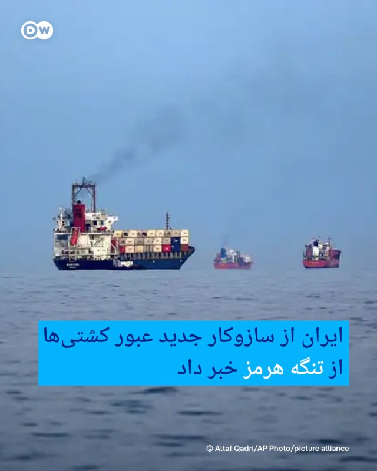

# خواننده تلگرام

<!-- TOP_NAV START -->

<a href="https://github.com/shahinsa98/aio-downloader/blob/main/telegram/content/archive_1.md" style="display:inline-block; padding:6px 12px; margin:0 4px; background-color:#2ea44f; color:white; text-decoration:none; border-radius:4px; font-weight:bold;">صفحه بعد</a>

<!-- TOP_NAV END -->

<!-- MSG START -->

---
📅 بروزرسانی: 1405/02/26 20:01
---

## VahidOOnLine — post 240509

♦️در ادامه سفر سید محسن نقوی، وزیر کشور پاکستان به تهران، او با وزیر کشور جمهوری اسلامی دیدار و درباره گسترش همکاری‌های دوجانبه گفتگو کرد.
وزیر کشور جمهوری اسلامی در این دیدار با تاکید بر روابط تاریخی دو کشور گفت مرزهای ایران و پاکستان «مرزهای دوستی، برادری و امنیت» است و دو طرف بر توسعه همکاری‌ها در حوزه‌های سیاسی، اقتصادی، تجاری و امنیتی و همچنین تسهیل تجارت مرزی توافق دارند.
در مقابل، وزیر کشور پاکستان نیز با قدردانی از میزبانی تهران اعلام کرد گفتگوهای مفصلی درباره امنیت مرزها و روابط دوجانبه انجام شده و ابراز امیدواری کرد این مذاکرات به‌زودی به نتایج ملموس منجر شود.
‌🇸🇦 Indypersian

🤖 @VahidOOnLine

## VahidOOnLine — post 240508

  

علی زینی‌وند، سخنگوی وزارت کشور، گفت: «محوریت تصمیم‌گیری در کشور خصوصا در حوزه صلح و جنگ، رهبری است. رهبری هم مسلط، فرمان دستش است و فرماندهی می‌کند. کسی در جایگاه مسئولیت، استاندار، نماینده، تریبون به‌دست، اگر خلاف سیاست‌های راهبری نظام اظهارنظر کند، شایسته نیست.»
‌🏁 🇬🇧 IranintlTV

🤖 @VahidOOnLine

## VahidOOnLine — post 240507

  <a href="telegram/content/VahidOOnLine_240507_1778949091.mp4" target="_blank">🎬 Download video</a>

میلان | ایتالیا؛ گردهمایی ایرانیان ـ گزارشگر ۲۶ اردیبهشت
‌🏁 🇬🇧 ManotoTV

🤖 @VahidOOnLine

## VahidOOnLine — post 240506

  <a href="telegram/content/VahidOOnLine_240506_1778949092.mp4" target="_blank">🎬 Download video</a>

بوردو فرانسه، تجمع هفتگی همراه با تصویر جاویدنامان انقلاب ملی، شنبه ۲۶ اردیبهشت
‌🏁 🇬🇧 ManotoTV

🤖 @VahidOOnLine

## VahidOOnLine — post 240505

  <a href="telegram/content/VahidOOnLine_240505_1778949093.mp4" target="_blank">🎬 Download video</a>

بوداپست | مجارستان؛ گردهمایی ایرانیان ـ گزارشگر ۲۶ اردیبهشت
‌🏁 🇬🇧 ManotoTV

🤖 @VahidOOnLine

## VahidOOnLine — post 240504

  <a href="telegram/content/VahidOOnLine_240504_1778949094.mp4" target="_blank">🎬 Download video</a>

کلن، راهپیمایی ایرانیان، شنبه ۲۶ اردیبهشت
‌🏁 🇬🇧 ManotoTV

🤖 @VahidOOnLine

## VahidOOnLine — post 240503

  <a href="telegram/content/VahidOOnLine_240503_1778949096.mp4" target="_blank">🎬 Download video</a>

‌
گروه تروریستی حماس کشته شدن عزالدین الحداد، فرمانده گردان‌های« قسام» در نوار غزه را تایید کرد.

بر اساس بیانیه حماس عزالدین الحداد شامگاه جمعه «به همراه همسر، دخترش و چند غیرنظامی فلسطینی دیگر» کشته شده است.
‌🏁 🇬🇧 ManotoTV

🤖 @VahidOOnLine

## VahidOOnLine — post 240502

  <a href="telegram/content/VahidOOnLine_240502_1778949096.mp4" target="_blank">🎬 Download video</a>

اسلو | نروژ؛ راهپیمایی سکوت ایرانیان ـ گزارشگر شنبه ۲۶ اردیبهشت
‌🏁 🇬🇧 ManotoTV

🤖 @VahidOOnLine

## VahidOOnLine — post 240501

  <a href="telegram/content/VahidOOnLine_240501_1778949098.mp4" target="_blank">🎬 Download video</a>

‌
کپنهاگ | دانمارک؛ گردهمایی ایرانیان - گزارشگر شنبه ۲۶ اردیبهشت
‌🏁 🇬🇧 ManotoTV

🤖 @VahidOOnLine

## VahidOOnLine — post 240500

  

احسان قاضی‌زاده هاشمی، نماینده مجلس، درباره مذاکرات با آمریکا گفت: «قبل از ورود به بحث مذاکرات، باید آمریکا ادبیات ارعاب و تهدید خود را کنار بگذارد. وقتی چنین ادبیاتی وجود دارد، دیگر نمی‌توان آن را مذاکره نامید، بلکه به نوعی ارائه پیشنهادات و دادن سندی برای تسلیم است.»

قاضی‌زاده هاشمی گفت: «باید این ادبیات آمریکایی که شامل ارعاب، تهدید و قلدری است، برطرف شود.»
‌🏁 🇬🇧 IranintlTV

🤖 @VahidOOnLine

## VahidOOnLine — post 240499

  

♦️ میخاییل اولیانوف، نماینده روسیه در سازمان ملل متحد در ژنو، با بازنشر خبری درباره مخالفت چین با قطعنامه پیشنهادی مورد حمایت ایالات متحده به شورای امنیت سازمان ملل درباره تنگه هرمز، اعلام کرد که موضع روسیه نیز با چین یکسان است.

وزیر خارجه چین پیش‌تر، قطعنامه پیشنهادی علیه جمهوری اسلامی را «نادرست» خوانده و تاکید کرده بود که حل مسئله تنگه هرمز تنها از راه دستیابی به «آتش‌بس دائم و فراگیر» میان تهران و واشنگتن امکان‌پذیر است و استفاده از زور نمی‌تواند مسئله را حل کند.

مایک والتز، نماینده ایالات متحده در سازمان ملل در نیویورک، روز جمعه ۲۶ اردیبهشت اعلام کرد که این قطعنامه که با حمایت آمریکا و کشورهای حوزه خلیج فارس، به شورای امنیت ارائه شده، تاکنون حمایت ۱۲۰ کشور را به‌دست آورده است. با این‌وجود، مخالفت چین و روسیه که حق وتو دارند، مانع بزرگی برای تصویب قطعنامه پیشنهادی است.
‌🇸🇦 Indypersian

🤖 @VahidOOnLine

## VahidOOnLine — post 240498

  

محمدصالح جوکار، رییس کمیسیون امور داخلی مجلس، گفت: «آمریکا به دنبال آن است تا آنچه را که در میدان به دست نیاورده پای میز مذاکره به دست آورد. در این‌باره باید بگویم هرگز آمریکا به خواسته‌های نامشروعش در مذاکرات نخواهد رسید.»

جوکار گفت که آمریکا باید شروط تهران را برای توافق بپذیرد و راهی جز تعظیم در برابر خواسته‌های جمهوری اسلامی ندارد
‌🏁 🇬🇧 IranintlTV

🤖 @VahidOOnLine

## VahidOOnLine — post 240497

♦️در حالی که دونالد ترامپ، رئیس‌جمهوری ایالات متحده سفر خود به پکن را پایان داده و به آمریکا بازگشته است، حاشیه‌های این سفر ادامه دارد. یکی از این موارد، تصاویری از لحظه‌ای که ترامپ، نگاهی به یادداشت‌های شی جین‌پینگ، رئیس‌جمهوری چین می‌اندازد است که دستاویز طنزپردازان شده است. یک شبکه اینترنتی چینی، با انتشار این تصاویر، ترامپ را با عنوان «مامور ۰۰۴۷» که اشاره به اسم رمز جیمز باند، شخصیت مشهور کتاب‌های جاسوسی بریتانیایی دارد، خطاب کرده است.
‌🇸🇦 Indypersian

🤖 @VahidOOnLine

## WithYashar — post 11403

العربیه: طبق گفته منابع آگاه پاکستانی، در بحث تنگه هرمز، پیشرفت‌هایی حاصل شده است
@withyashar

## mwarmonitor — post 9161

🔴 سی‌ان‌ان به نقل از منابع آگاه:
در داخل دولت ترامپ درباره چگونگی ادامه مسیر در قبال ایران، اختلاف نظر وجود دارد.

🔸برخی مقام‌ها در دولت ترامپ و پنتاگون به سمت حملات محدود و هدفمند فشار می‌آورند، در حالی که برخی دیگر از دیپلماسی حمایت می‌کنند.

🔸سی‌ان‌ان به نقل از سخنگوی کاخ سفید ؛ رئیس‌جمهور تمام گزینه‌ها را در اختیار دارد، با این حال گزینه ترجیحی او دیپلماسی است.

🔸 سی‌ان‌ان به نقل از سخنگوی کاخ سفید:
رئیس‌جمهور تنها توافقی را خواهد پذیرفت که امنیت ملی ما را تضمین کند.

@mwarmonitor

## FoxNewsTwitter — post 341818

Fox News (Twitter/X)

NEW: Secretary Pete Hegseth greets families of Navy sailors aboard the guided-missile destroyer USS Bainbridge as the ship returns home following its deployment in support of Operation Epic Fury.

## pm_afshaa — post 90856

  <a href="telegram/content/pm_afshaa_90856_1778949101.webm" target="_blank">🎬 Download video</a>

🔴ایسنا: وزیر کشور پاکستان برای دیدار با مسئولان جمهوری اسلامی ساعاتی قبل به تهران سفر کرده. 
💧 Rainbet.com the #1 Non-KYC Crypto Casino & Sportsbook @rainbetcom 
😁 @Pm_Afshaa

## pm_afshaa — post 90855

تلگراف : مقامات ارشد دولت ترامپ از امارات خواستن تو جنگ علیه ایران بیشتر وارد عمل بشه

💧 Rainbet.com the #1 Non-KYC Crypto Casino & Sportsbook @rainbetcom

😁 @Pm_Afshaa

## pm_afshaa — post 90854

🔴العربیه: طبق گفته منابع آگاه پاکستانی، در بحث تنگه هرمز، پیشرفت‌هایی حاصل شده

💧 Rainbet.com the #1 Non-KYC Crypto Casino & Sportsbook @rainbetcom

😁 @Pm_Afshaa

## IranIntlTV — post 337499

  

علی زینی‌وند، سخنگوی وزارت کشور، گفت: «محوریت تصمیم‌گیری در کشور خصوصا در حوزه صلح و جنگ، رهبری است. رهبری هم مسلط، فرمان دستش است و فرماندهی می‌کند. کسی در جایگاه مسئولیت، استاندار، نماینده، تریبون به‌دست، اگر خلاف سیاست‌های راهبری نظام اظهارنظر کند، شایسته نیست.»
https://iranintl.com/202605169314

## IranIntlTV — post 337498

  <a href="telegram/content/IranIntlTV_337498_1778949102.mp4" target="_blank">🎬 Download video</a>

یک شهروند در آبادان با ارسال پیامی به ایران اینترنشنال از بیکاری در این شهر در پی بحران اقتصادی روایت می‌کند. پیام او با هوش مصنوعی خوانده شده است.

## IranIntlTV — post 337497

  <a href="telegram/content/IranIntlTV_337497_1778949103.mp4" target="_blank">🎬 Download video</a>

ستاد فرماندهی مرکزی آمریکا، سنتکام، اعلام کرد با ادامه محاصره دریایی جمهوری اسلامی، تاکنون ۷۸ کشتی تجاری وادار به تغییر مسیر شده و ۴ کشتی دیگر نیز غیرفعال شده‌اند.
جزییات بیشتر با اردوان روزبه، خبرنگار ایران‌اینترنشنال
@iranintltv

## IranIntlTV — post 337496

  

احسان قاضی‌زاده هاشمی، نماینده مجلس، درباره مذاکرات با آمریکا گفت: «قبل از ورود به بحث مذاکرات، باید آمریکا ادبیات ارعاب و تهدید خود را کنار بگذارد. وقتی چنین ادبیاتی وجود دارد، دیگر نمی‌توان آن را مذاکره نامید، بلکه به نوعی ارائه پیشنهادات و دادن سندی برای تسلیم است.»

قاضی‌زاده هاشمی گفت: «باید این ادبیات آمریکایی که شامل ارعاب، تهدید و قلدری است، برطرف شود.»
https://iranintl.com/202605169448

## IranIntlTV — post 337495

  <a href="telegram/content/IranIntlTV_337495_1778949105.mp4" target="_blank">🎬 Download video</a>

کانال ۱۲ اسرائیل به نقل از یک مقام این کشور خبر داد ترامپ ظرف ۲۴ ساعت آینده درباره حمله دوباره به ایران تصمیم می‌گیرد. این مقام رسمی گفت جنگ دوباره با جمهوری اسلامی نزدیک است. همزمان روزنامه معاریو چاپ اسرائیل نوشت ترامپ در آستانه دادن چراغ سبز جنگ است

گزارشی از مجتبا پورمحسن
@iranintltv

## IranIntlTV — post 337494

  

محمدصالح جوکار، رییس کمیسیون امور داخلی مجلس، گفت: «آمریکا به دنبال آن است تا آنچه را که در میدان به دست نیاورده پای میز مذاکره به دست آورد. در این‌باره باید بگویم هرگز آمریکا به خواسته‌های نامشروعش در مذاکرات نخواهد رسید.»

جوکار گفت که آمریکا باید شروط تهران را برای توافق بپذیرد و راهی جز تعظیم در برابر خواسته‌های جمهوری اسلامی ندارد
https://iranintl.com/202605165329

## Shin_Persian — post 6032

📦 mhrv-rs v1.9.28 released

• Pipeline Full-mode polls for a faster tunnel (PR #1115)
• Improve WebRTC fallback by blocking STUN/TURN UDP (PR #1115)
• Add pipeline diagnostics and benchmark tooling (PR #1115)

Files (Android APKs, Windows, macOS, Linux, OpenWRT) on the files channel:

👉 v1.9.28 — all files with SHA-256

Channel:
https://t.me/mhrv_rs
or: https://t.me/+R1OyoHX2boA1ZDgx

#v1928

## ManotoTV — post 105529

  <a href="telegram/content/ManotoTV_105529_1778949107.mp4" target="_blank">🎬 Download video</a>

میلان | ایتالیا؛ گردهمایی ایرانیان ـ گزارشگر ۲۶ اردیبهشت

## ManotoTV — post 105528

  <a href="telegram/content/ManotoTV_105528_1778949109.mp4" target="_blank">🎬 Download video</a>

بوردو فرانسه، تجمع هفتگی همراه با تصویر جاویدنامان انقلاب ملی، شنبه ۲۶ اردیبهشت

## ManotoTV — post 105527

  <a href="telegram/content/ManotoTV_105527_1778949110.mp4" target="_blank">🎬 Download video</a>

بوداپست | مجارستان؛ گردهمایی ایرانیان ـ گزارشگر ۲۶ اردیبهشت

## ManotoTV — post 105526

  <a href="telegram/content/ManotoTV_105526_1778949111.mp4" target="_blank">🎬 Download video</a>

کلن، راهپیمایی ایرانیان، شنبه ۲۶ اردیبهشت

## ManotoTV — post 105525

  <a href="telegram/content/ManotoTV_105525_1778949113.mp4" target="_blank">🎬 Download video</a>

‌
گروه تروریستی حماس کشته شدن عزالدین الحداد، فرمانده گردان‌های« قسام» در نوار غزه را تایید کرد.

بر اساس بیانیه حماس عزالدین الحداد شامگاه جمعه «به همراه همسر، دخترش و چند غیرنظامی فلسطینی دیگر» کشته شده است.

## ManotoTV — post 105524

  <a href="telegram/content/ManotoTV_105524_1778949113.mp4" target="_blank">🎬 Download video</a>

اسلو | نروژ؛ راهپیمایی سکوت ایرانیان ـ گزارشگر شنبه ۲۶ اردیبهشت

## ManotoTV — post 105523

  <a href="telegram/content/ManotoTV_105523_1778949115.mp4" target="_blank">🎬 Download video</a>

‌
کپنهاگ | دانمارک؛ گردهمایی ایرانیان - گزارشگر شنبه ۲۶ اردیبهشت

## FarsiVOA — post 217911

  <a href="telegram/content/FarsiVOA_217911_1778949116.mp4" target="_blank">🎬 Download video</a>

تصاویری از وضعیت توفانی مجموعه تفریحی تله‌کابین توچال در شمال تهران در روز شنبه، ۲۶ اردیبهشت ۱۴۰۵

## FarsiVOA — post 217910

رئیس انجمن روانپزشکان ایران می‌گوید کمبود دارو در حوزه روانپزشکی جدی است و نسبت به شرایط پیش از جنگ، به «طور قابل توجهی» تشدید شده است.

وحید شریعت به ایلنا گفته است در ماه‌های اخیر، کمبود قابل توجهی در برخی اقلام دارویی مشاهده شده است که برخی از آن‌ها از پیش از آغاز جنگ تشدید یافته و برخی دیگر کاملاً جدید هستند.

به گفته او احتمالاً مسئله به اختلال در روند تولید به خاطر نبود مواد اولیه یا نوعی دست نگه داشتن در توزیع، به منظور آماده‌سازی شرایط بازار برای افزایش قیمت مرتبط باشد.

حسین‌علی شهریاری رئیس کمیسیون بهداشت و درمان مجلس نیز روز پنج‌شنبه از افزایش قیمت برخی داروها بین ۵۰ تا ۳۰۰ درصد خبر داد و گفت بر اساس برآورد وزارت بهداشت، حدود ۱۵۰ هزار میلیارد تومان منابع نیاز است تا بتوان فشار هزینه‌های دارویی بر مردم را کاهش داد.

@FarsiVOA

## FarsiVOA — post 217909

مجریان صداوسیمای جمهوری اسلامی در برنامه‌های تلویزیونی با در دست گرفتن اسلحه ظاهر شدند. این تصاویر، واکنش‌های گسترده‌ای را درباره عادی‌سازی خشونت و ترویج فضای امنیتی در ایران برانگیخته است

## FarsiVOA — post 217908

🔺والتز: عقب‌نشینی چینی‌ها درمورد رژیم ایران پس از دیدار با ترامپ یک نتیجه بزرگ بود

▪️مایک والتز نماینده آمریکا در سازمان ملل متحد، روز شنبه ۲۶ اردیبهشت در مصاحبه با شبکه خبری فاکس گفت که تاکید آمریکا در سازمان ملل بر این واقعیت است که «نمی‌توانید یک درگیری را با مین‌گزاری دریایی در اقیانوس و دریافت عوارض پاسخ دهید.» و نمی‌توان این هنجارهای بین‌المللی را نقض کرد.

⬇️ بیشتر بخوانید:

https://ir.voanews.com/a/iran-waltz-mike-china-hormuz-trump/8150689.html/?nocach=1

## FarsiVOA — post 217907

🔺ارتش اسرائیل: سه تروریست حماس را کشتیم؛ دو نفر از آنها در کشتار ۷ اکتبر، دست داشتند

▪️ارتش اسرائیل روز شنبه ۲۶ اردیبهشت از کشته شدن سه تروریست عضو حماس خبر داد و اعلام کرد دو نفر از آنها، در «کشتار خونین» ۷ اکتبر در خاک اسرائیل نقش داشتند و در ماه‌های گذشته نیز تلاش می‌کردند علیه نیروهای اسرائیلی اقدامات تروریستی انجام دهند.

⬇️ بیشتر بخوانید:

https://ir.voanews.com/a/8150690.html/?nocach=1

## FarsiVOA — post 217906

در گفت‌وگو با شاهین مدرس، تحلیلگر مطالعات امنیتی، به بن‌بست مذاکرات هسته‌ای، گزارش نیویورک‌تایمز درباره آمادگی آمریکا و اسرائیل برای ازسرگیری حملات، سردرگمی تصمیم‌گیری در تهران و سناریوهای احتمالی پیش‌روی جمهوری اسلامی در صورت بازگشت عملیات نظامی پرداختیم

## DW_Farsi — post 124771

  

🔶 سپاه: انفجارهای صبح امروز در جم ناشی از "خنثی‌سازی مهمات" بود

سپاه شهرستان جم اعلام کرد صداهای انفجاری که صبح شنبه ۲۶ اردیبهشت، در این شهر شنیده شد، به عملیات خنثی‌سازی "مهمات عمل‌نکرده" مربوط بوده است.

به گزارش خبرگزاری مهر، در اطلاعیه سپاه آمده این عملیات به‌صورت کنترل‌شده در حال انجام است و نیروهای مربوطه در محل حضور دارند.

پیش از این در روز جمعه، ۱۱ اردیبهشت، سپاه استان زنجان از کشته شدن ۱۴ نفر از نیروهای گردان تخریب سپاه انصارالمهدی در خلال خنثی‌سازی مهمات عمل‌نکرده از دوره جنگ اخیر خبر داده و گفته بود دو نفر نیز در اثر این انفجار مجروح شدند.

سپاه زنجان در بیانیه خود ادعا کرده بود که در جریان بمباران‌های هوایی "جنگنده‌های متخاصم دشمن"، بمب‌های خوشه‌ای، بمبلت‌ها و مهمات مشابه، پرتاب شده بود و "بخش‌هایی از منطقه از جمله محدوده‌ای بیش از هزار و ۲۰۰ هکتار که اراضی کشاورزی را نیز شامل می‌شد، از طریق مین‌ریزی هوایی به‌صورت هدفمند در معرض تهدید قرار گرفت".
@dw_farsi

## DW_Farsi — post 124770

  

🔶 ایران از سازوکار جدید عبور کشتی‌ها از تنگه هرمز خبر داد

رسانه‌های دولتی ایران مدعی شدند که برخی کشورهای اروپایی برای عبور کشتی‌های خود از تنگه هرمز با تهران وارد مذاکره شده‌اند.

تلویزیون دولتی ایران گزارش داده که پس از عبور کشتی‌های چین، ژاپن و پاکستان، اکنون کشورهای اروپایی نیز برای دریافت مجوز عبور با نیروی دریایی سپاه پاسداران گفت‌وگو کرده‌اند، هرچند نامی از این کشورها برده نشده است.

هم‌زمان ابراهیم عزیزی، رئیس کمیسیون امنیت ملی مجلس جمهوری اسلامی، اعلام کرده تهران سازوکاری جدید برای مدیریت تردد کشتی‌ها در تنگه هرمز آماده کرده که "به‌زودی" رونمایی خواهد شد.

او گفته این سازوکار فقط شامل کشتی‌های تجاری و طرف‌های "همکار با ایران" می‌شود و در قبال خدمات ارائه‌شده، هزینه دریافت خواهد شد.

عزیزی همچنین تاکید کرده این مسیر همچنان به روی کشورهای مشارکت‌کننده در پروژه موسوم به "آزادی" بسته خواهد بود؛ پروژه‌ای که آمریکا برای همراهی و حفاظت از کشتی‌ها در تنگه هرمز مطرح کرده است.
@dw_farsi

## DW_Farsi — post 124769

  

🔶 آتش‌سوزی در کارخانه روغن موتور مراغه

یک کارخانه تولید روغن موتور در مراغه دچار آتش‌سوزی شده و نیروهای امدادی و آتش‌نشانی همچنان در حال مهار حریق هستند.

به گزارش رسانه‌های ایران، این آتش‌سوزی ظهر شنبه ۲۶ اردیبهشت آغاز شد و چندین خودروی آتش‌نشانی، نیروهای هلال احمر و آمبولانس‌های اورژانس به محل اعزام شدند.

رئیس آتش‌نشانی مراغه به ایسنا گفته است که تاکنون گزارشی از مصدومیت افراد منتشر نشده است.

گزارش‌ها حاکی است که دود غلیظ همچنان منطقه را فراگرفته و آتش هنوز به‌طور کامل مهار نشده است.

این واحد تولیدی از کارخانه‌های بزرگ تولید روغن موتور در ایران به شمار می‌رود و بیش از ۴۰۰ کارگر دارد.
@dw_farsi

## RadioFarda — post 157264

🔸ویدئوی دوربین مداربسته لحظه برخورد یک قطار باری با اتوبوسی را در بانکوک، پایتخت تایلند، نشان می‌دهد؛ حادثه‌ای که باعث آتش‌سوزی گسترده و کشته شدن دست‌کم هشت نفر شد.

🔸مقام‌های تایلندی اعلام کردند این حادثه روز شنبه ۲۶ اردیبهشت در نزدیکی ایستگاه «مککاسان» رخ داد و ۳۲ نفر دیگر نیز زخمی شدند.

🔸به گفته معاون وزیر حمل‌ونقل تایلند، اتوبوس پشت چراغ قرمز روی ریل متوقف شده بود و همین موضوع مانع بسته شدن موانع گذرگاه شد. قطار باری که کانتینر حمل می‌کرد نیز نتوانست به‌موقع متوقف شود.

🔸مقام‌ها گفتند هر هشت قربانی این حادثه سرنشین اتوبوس بودند. تصاویر منتشرشده در شبکه‌های اجتماعی همچنین نشان می‌دهد قطار پس از برخورد، چند خودرو و موتورسیکلت را نیز با خود کشیده است.

@RadioFarda

## IranianMinds — post 20251

🔴 تلگراف: مقامات ارشد دولت ترامپ از امارات خواستن به شکل جدی‌تری وارد جنگ با ایران شه.

@IranianMinds

## BBCPersian — post 281227

🔺پس از تهدید اسرائیل به شکایت، نیویورک تایمز از روزنامه‌نگار خود دفاع کرد

✍️رافی برگ، بی‌بی‌سی

نیویورک تایمز گفته است که اقدام حقوقی علیه این روزنامه به اتهام افترا که بنیامین نتانیاهو، نخست‌وزیر اسرائیل، تهدید به انجام آن کرده، بی‌اساس است.

این نزاع بر سر مقاله‌ای در نیویورک تایمز است که در آن گفته شده است «سرویس‌های امنیتی اسرائیل به بازداشت‌شدگان فلسطینی تجاوز جنسی کرده‌اند.»

این روزنامه پس از آن واکنش نشان داد که بنیامین نتانیاهو و وزیر امور خارجه‌اش بیانیه‌ای صادر کردند و گفتند که دستور «آغاز یک دعوی افترا» را داده‌اند.

https://bbc.in/4nxcluV
@BBCPersian

## BBCPersian — post 281226

یکی از مربیان سگ‌های زنده‌یاب هلال احمر ایران در واکنش به «پست» خواندن سگ‌هایشان در یک مصاحبه که از تلویزیون ایران پخش شده گفت کسی که این حرف را زده‌ است باید عذرخواهی کند یا تغییر موضع بدهد.

۱۸ اردیبهشت در یک مصاحبه در تجمع‌های شبانه حامیان حکومت ایران، گزارشگر از یک شهروند می‌پرسد «چه کسانی از سگ‌های زنده‌یاب هلال‌احمر پست‌تر هستند؟»

امید برزگری، مربی هلال‌احمر که به همراه یکی دیگر از مربیان در گفت‌وگویی با خبرآنلاین شرکت کرده، گفت «این سگ‌ها فرشته نجات هستند. ما هر کدام با این سگ‌ها یک تیم هستیم.»

او گفت: « مثال زشتی بود. سگ پست نیست. اینها فرشته‌اند. این جمله ما را اذیت می‌کند. این سگ‌ها آموزش دیده‌اند به مردم خدمت کنند.»

سگ‌های زنده‌یاب در جریان جنگ ۱۲ روزه و جنگ اخیر نقش عمده‌ای در پیدا کردن افراد داشتند.

هلال‌ احمر اعلام کرده در جریان جنگ اخیر، این سگ‌ها ۷۹۲ عملیات انجام داده‌ن که در ۷۱۱ ماموریت در زنده‌یابی و پیدا کردن اجساد موفق بوده‌اند.
@BBCPersian

## BBCPersian — post 281225

  <a href="telegram/content/BBCPersian_281225_1778949119.mp4" target="_blank">🎬 Download video</a>

🔻برخورد یک قطار باری با یک اتوبوس شهری در بانکوک، پایتخت تایلند، روز شنبه ۲۶ اردیبهشت (۱۶ مه) منجر به یک آتش‌سوزی گسترده شد.

در این حادثه دست‌کم ۸ نفر کشته و طبق آخرین گزارش‌ها ۳۲ نفر زخمی شده‌اند.

مقام‌های امدادی اعلام کرده‌اند بر اثر این حادثه اتوبوس به‌سرعت آتش گرفته و علاوه بر آن چند خودرو و موتورسیکلت در آتش سوخته‌اند.

آتش‌نشانان پس از عملیات گسترده موفق شدند شعله‌ها را مهار کنند.

این حادثه در نزدیکی ایستگاه مکاسان و در یکی از تقاطع‌های شلوغ مرکز شهر رخ داده است.
گزارش‌های اولیه نشان می‌دهد اتوبوس روی ریل متوقف شده بود و قطار هم نتوانسته به‌موقع ترمز کند.

شدت حادثه به حدی بالا بوده که نیروهای امدادی ساعت‌ها برای خنک کردن خودروهای سوخته تلاش می‌کردند و در میان آهن‌پاره‌ها به دنبال قربانیان احتمالی می‌گشتند.

مصدومان به بیمارستان منتقل شده‌اند و علت دقیق این حادثه در دست بررسی است.

https://bbc.in/49Q2P0c

🎥 Reuters

@BBCPersian

## Dirty_Kids — post 389560

وقتی یه مانکن حامله میشه!
چجوری هیچ جاشون تپل نمیشه؟!!!!!

@Dirty_Kids 👻

## Dirty_Kids — post 389559

  <a href="telegram/content/Dirty_Kids_389559_1778949120.mp4" target="_blank">🎬 Download video</a>

ارزش دانلود: صفر
فقط برای اونایی که نت اضافی دارن

این قشنگ مشخص از خود وزارت‌اطلاعات دستور میگیره
برای اولین یکی پیدا شد از رضا گلزار ضعیفتر فیلم بازی میکنه :/ بابا یذره تف میزدی به چشات خیس بشه اقلا

جیندا جنگ میندازی گردن مردم؟ جنگی که کل دنیا درگیرن سیاست ابرقدرت‌ها داره عوض میشه بخاطرش

تا دیروز هرکی یه فیلم میگرفت میریختن تو خونش میگفتن جاسوس، الان دیدن کسی نمیتونه بره تو جزیره خودشون مستند میسازن میدن به این پرستو‌ها کصونه‌واویلا بازی دربیارن

@Dirty_Kids 👻

## Hranews — post 112972

دستور توقیف اموال ۱۲۹ شهروند در استان آذربایجان غربی صادر شد

❗️
❗️
❗️
❗️
❗️– رئیس‌ کل دادگستری آذربایجان غربی از صدور دستور #توقیف_اموال ۱۲۹ شهروند در این استان به دلیل آنچه “اقدامات ضدامنیتی” و همکاری با “کشورهای متخاصم” عنوان کرده، خبر داد.

ادامه مطلب

↘️
@hranews_bot تماس ✉️ - @Hranews کانال هرانا 🆑

## manototv — post 105529

  <a href="telegram/content/manototv_105529_1778949122.mp4" target="_blank">🎬 Download video</a>

میلان | ایتالیا؛ گردهمایی ایرانیان ـ گزارشگر ۲۶ اردیبهشت

## manototv — post 105528

  <a href="telegram/content/manototv_105528_1778949123.mp4" target="_blank">🎬 Download video</a>

بوردو فرانسه، تجمع هفتگی همراه با تصویر جاویدنامان انقلاب ملی، شنبه ۲۶ اردیبهشت

## manototv — post 105527

  <a href="telegram/content/manototv_105527_1778949125.mp4" target="_blank">🎬 Download video</a>

بوداپست | مجارستان؛ گردهمایی ایرانیان ـ گزارشگر ۲۶ اردیبهشت

## manototv — post 105526

  <a href="telegram/content/manototv_105526_1778949126.mp4" target="_blank">🎬 Download video</a>

کلن، راهپیمایی ایرانیان، شنبه ۲۶ اردیبهشت

## manototv — post 105525

  <a href="telegram/content/manototv_105525_1778949127.mp4" target="_blank">🎬 Download video</a>

‌
گروه تروریستی حماس کشته شدن عزالدین الحداد، فرمانده گردان‌های« قسام» در نوار غزه را تایید کرد.

بر اساس بیانیه حماس عزالدین الحداد شامگاه جمعه «به همراه همسر، دخترش و چند غیرنظامی فلسطینی دیگر» کشته شده است.

## manototv — post 105524

  <a href="telegram/content/manototv_105524_1778949127.mp4" target="_blank">🎬 Download video</a>

اسلو | نروژ؛ راهپیمایی سکوت ایرانیان ـ گزارشگر شنبه ۲۶ اردیبهشت

## manototv — post 105523

  <a href="telegram/content/manototv_105523_1778949129.mp4" target="_blank">🎬 Download video</a>

‌
کپنهاگ | دانمارک؛ گردهمایی ایرانیان - گزارشگر شنبه ۲۶ اردیبهشت

## alonews — post 120437

  <a href="telegram/content/alonews_120437_1778949130.webm" target="_blank">🎬 Download video</a>

👈ادعای سی‌ان‌ان، به نقل از منابع آگاه:
در دولت ترامپ نظرات متفاوتی در مورد چگونگی برخورد با ایران وجود دارد.

🔴دولت ترامپ و مقامات پنتاگون بر حملات هدفمند اصرار دارند، در حالی که دیگران از دیپلماسی حمایت می‌کنند

✅ @AloNews خبر جنگ

## alonews — post 120436

  <a href="telegram/content/alonews_120436_1778949130.mp4" target="_blank">🎬 Download video</a>

👈وضعیت جنوب لبنان دقایقی قبل ، پس از حملات اسرائیل

✅ @AloNews خبر جنگ

## alonews — post 120435

  <a href="telegram/content/alonews_120435_1778949131.webm" target="_blank">🎬 Download video</a>

👈نماینده دائم روسیه در سازمان‌های بین‌المللی مستقر در وین، موضع چین در قبال قطعنامه ضدایرانی بحرین و آمریکا در ارتباط با تنگه هرمز را تایید کرد و گفت «روسیه هم همین دیدگاه را دارد»

✅ @AloNews خبر جنگ

## alonews — post 120434

  <a href="telegram/content/alonews_120434_1778949131.webm" target="_blank">🎬 Download video</a>

👈هیمتی رئیس بانک مرکزی: با قدرت، شتاب تورم را کنترل خواهیم کرد

✅ @AloNews خبر جنگ

## alonews — post 120433

  <a href="telegram/content/alonews_120433_1778949131.mp4" target="_blank">🎬 Download video</a>

👈امروز ایران یه نفتکش حامل ۴۵۰ هزار بشکه نفت رو به دلیل نقض قوانین جدید تو تنگه هرمز توقیف کرد

✅ @AloNews خبر جنگ

## alonews — post 120432

  <a href="telegram/content/alonews_120432_1778949133.webm" target="_blank">🎬 Download video</a>

👈کامران یوسف خبرنگار رسانه پاکستانی اکسپرس نیوز: سفر اعلام‌نشده وزیر کشور پاکستان به تهران، بخشی از تلاش آخر برای حصول توافق بین ایران و آمریکا است.

🔴نقوی از معتمدان نزدیک فیلد مارشال (فرمانده ارتش پاکستان) است و یک ماه پیش نیز او را در سفر سه‌روزه‌اش به ایران همراهی کرده بود.

🔴با توجه به اینکه ترامپ پس از سفر پکن به واشنگتن بازگشته و در حال اندیشیدن به گام بعدی است، سفر وزیر کشور پاکستان حیاتی تلقی می‌شود.

✅ @AloNews خبر جنگ

## alonews — post 120431

  <a href="telegram/content/alonews_120431_1778949133.webm" target="_blank">🎬 Download video</a>

👈شبکهٔ ۱۴ اسرائیل از شنیده‌شدن ۲ انفجار در الجلیل غربی خبر داد

✅ @AloNews خبر جنگ

## alonews — post 120430

  <a href="telegram/content/alonews_120430_1778949133.webm" target="_blank">🎬 Download video</a>

👈تلگراف : مقامای ارشد دولت ترامپ از امارات خواستن تو جنگ علیه ایران بیشتر وارد عمل بشه..

🔴حتی صحبت از حمله به جزایر ایرانی تو خلیج فارس هم شده!

✅ @AloNews خبر جنگ

## alonews — post 120429

  <a href="telegram/content/alonews_120429_1778949133.webm" target="_blank">🎬 Download video</a>

👈حماس: جنبش حماس یک دور انتخابات برای انتخاب رئیس خود برگزار کرده اما نتیجه در دور اول مشخص نشده؛ دور دوم بعداً برگزار خواهد شد.

✅ @AloNews خبر جنگ

## alonews — post 120428

  <a href="telegram/content/alonews_120428_1778949133.webm" target="_blank">🎬 Download video</a>

👈وزیر بهداشت مستعفی در بریتانیا عزم خود را برای نامزدی جهت جانشینی استارمر اعلام کرد

✅ @AloNews خبر جنگ

## alonews — post 120427

  <a href="telegram/content/alonews_120427_1778949133.webm" target="_blank">🎬 Download video</a>

👈 به گزارش آناتولی، دونالد ترامپ، رئیس جمهور دولت آمریکا  در گفتگو با رسانه‌های فرانسوی درباره مذاکرات با ایران مدعی شد: آن‌ها علاقه‌مند به دستیابی به توافق هستند.

✅ @AloNews خبر جنگ

## alonews — post 120426

  <a href="telegram/content/alonews_120426_1778949134.webm" target="_blank">🎬 Download video</a>

👈اولیانوف دیپلمات ارشد روس اعلام کرد که مسکو نیز همانند چین، پیش‌نویس قطعنامه آمریکا و اعراب درمورد تنگه هرمز را مناسب نمی داند

✅ @AloNews خبر جنگ

## alonews — post 120425

  <a href="telegram/content/alonews_120425_1778949134.webm" target="_blank">🎬 Download video</a>

👈گسیل ترابری نظامی آمریکا به منطقه طی ساعات اخیر افزایشی بوده اما نکته مهم خاموش کردن سامانه و عدم ذکر مقصد در پروازهای اخیر است

✅ @AloNews خبر جنگ

## alonews — post 120424

  <a href="telegram/content/alonews_120424_1778949134.webm" target="_blank">🎬 Download video</a>

👈العربیه: طبق گفته منابع آگاه پاکستانی، در بحث تنگه هرمز، پیشرفت‌هایی حاصل شده است

✅ @AloNews خبر جنگ

## alonews — post 120423

  <a href="telegram/content/alonews_120423_1778949134.webm" target="_blank">🎬 Download video</a>

👈مدیر روس‌اتم: عملیات بتن‌ریزی و آرماتوربندی ساختمان‌های واحد دوم نیروگاه هسته‌ای بوشهر در ایران از سر گرفته شده است

✅ @AloNews خبر جنگ

<!-- MSG END -->

<!-- NAV START -->

<a href="https://github.com/shahinsa98/aio-downloader/blob/main/telegram/content/archive_1.md" style="display:inline-block; padding:6px 12px; margin:0 4px; background-color:#2ea44f; color:white; text-decoration:none; border-radius:4px; font-weight:bold;">صفحه بعد</a>

<!-- NAV END -->
