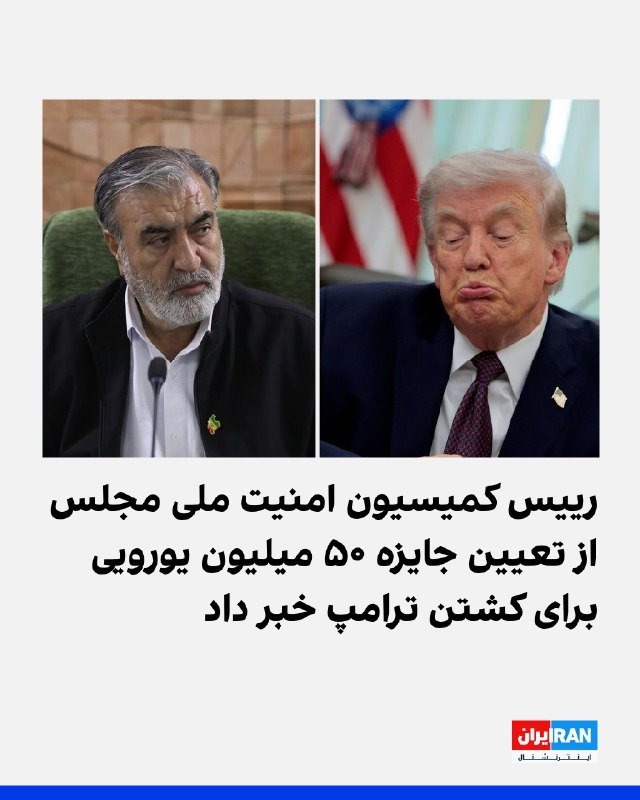
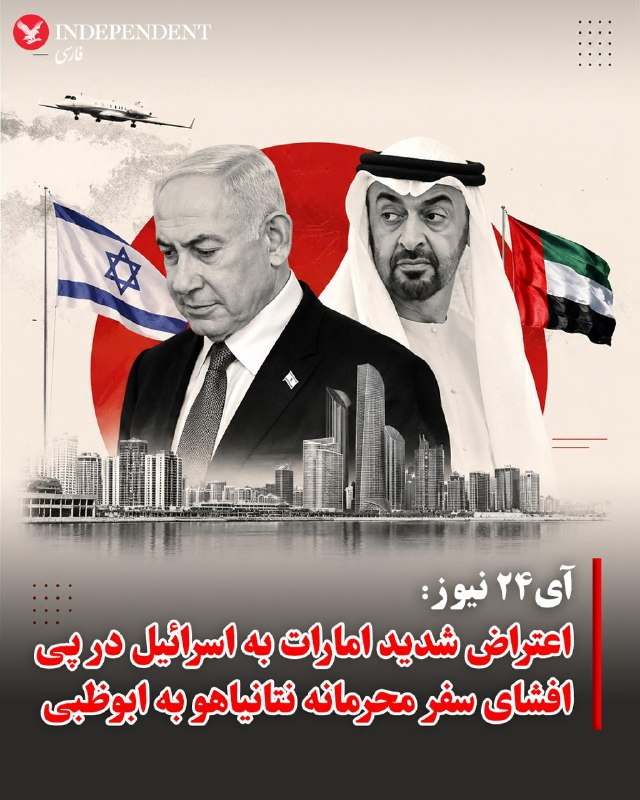
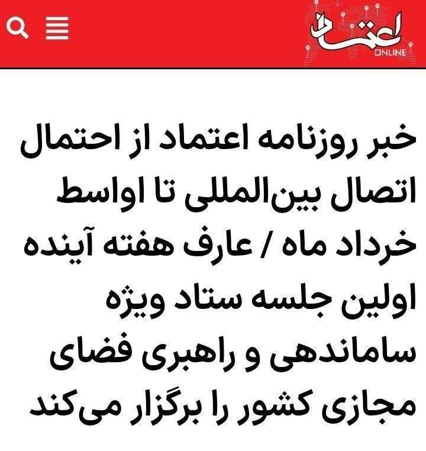
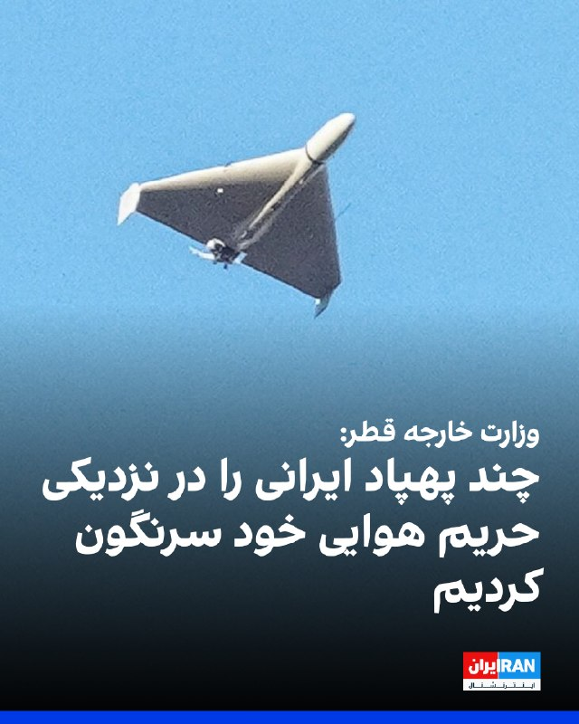
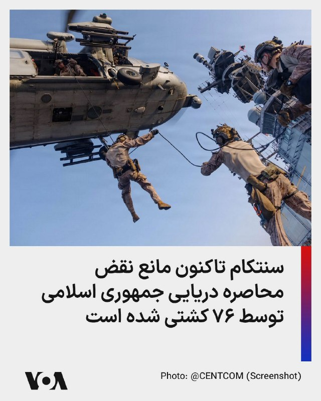
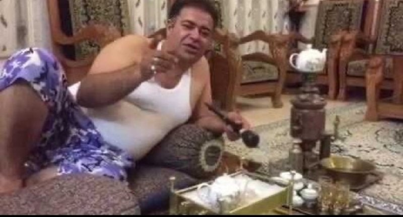

# خواننده تلگرام

<!-- TOP_NAV START -->

<!-- TOP_NAV END -->

<!-- MSG START -->

---
📅 بروزرسانی: 1405/02/25 01:09
---

## VahidOOnLine — post 240192

  

♦️ستاد فرماندهی مرکزی ارتش آمریکا، سنتکام، پنجشنبه ۲۴ اردیبهشت در اکس با انتشار تصویری اعلام کرد نیروهای تفنگدار دریایی آمریکا در جریان تمرین‌های نظامی از بالگرد «سی هاوک» بر عرشه ناو «یو‌اس‌اس تریپولی» عملیات فرود انجام داده‌اند.
سنتکام اعلام کرد ناو «تریپولی» یکی از بیش از ۲۰ ناو جنگی آمریکایی است که در محاصره دریایی جمهوری اسلامی مشارکت دارند. این نهاد همچنین اعلام کرد از زمان آغاز این محاصره، نیروهای آمریکایی مسیر ۷۲ کشتی تجاری را تغییر داده و چهار شناور را از کار انداخته‌اند.
‌🇸🇦 Indypersian

🤖 @VahidOOnLine

## VahidOOnLine — post 240191

  

وای‌نت گزارش داد اسحاق هرتزوگ، رییس جمهوری اسرائیل سفر خود به نیویورک برای سخنرانی در مراسم دانش‌آموختگی مدرسه الهیات یهودی وابسته به دانشگاه کلمبیا را لغو کرده و قرار است به‌صورت مجازی در این مراسم شرکت کند.
به نوشته وای‌نت، این تصمیم پس از انتقادها و اعتراض‌های دانشجویان حامی فلسطین به حضور هرتزوگ گرفته شد، هرچند دفتر ریاست‌جمهوری اسرائیل تاکید کرده لغو سفر ارتباطی با این اعتراض‌ها نداشته است.
وای‌نت همچنین گزارش داد هم‌زمان اسرائیل خود را برای احتمال ازسرگیری اقدام نظامی آمریکا علیه جمهوری اسلامی آماده می‌کند و رهبران سیاسی به ارتش دستور داده‌اند آمادگی‌های لازم را در نظر بگیرد.

‌🏁 🇬🇧 IranintlTV

🤖 @VahidOOnLine

## VahidOOnLine — post 240190

♦️بنیامین نتانیاهو، نخست‌وزیر اسرائیل، پنجشنبه ۲۴ اردیبهشت‌ماه، در مراسم روز اورشلیم گفت جمهوری اسلامی «ضعیف‌تر از همیشه» شده و دولت اسرائیل «قوی‌تر از همیشه» است.

او با اشاره به عملیات نظامی اسرائیل در منطقه و حمایت دولت دونالد ترامپ، رئیس‌جمهوری آمریکا، گفت: «قدرتی که ما در جبهه‌های نبرد به کار گرفتیم، اتحاد نزدیک با دولت ترامپ در آمریکا، قاطعیت برای ضربه زدن به دشمنانمان در عمق خاکشان و دور از مرزهایمان، و مناطق حایلی که پیرامون خود در غزه، لبنان و سوریه ایجاد کردیم؛ همه این‌ها چهره خاورمیانه را تغییر داده است.»
‌🇸🇦 Indypersian

🤖 @VahidOOnLine

## VahidOOnLine — post 240189

♦️کاظم غریب‌آبادی، معاون حقوقی و بین‌المللی وزارت خارجه جمهوری اسلامی، در اجلاس وزرای خارجه کشورهای عضو بریکس در دهلی‌نو، با اشاره به حمله نظامی مشترک آمریکا و اسرائیل علیه اهداف نظامی جمهوری اسلامی گفت: «ما خواهان موضعی یکپارچه در گروه بریکس بر پایه مخالفت با هدف قرار دادن نظامی کشورهای عضو و تقویت اصول امنیت و ثبات میان کشورهای این گروه هستیم.»

او تاکید کرد کشورهای عضو بریکس باید در برابر اقدام‌های نظامی علیه اعضای این گروه، موضعی هماهنگ و مشترک اتخاذ کنند.
‌🇸🇦 Indypersian

🤖 @VahidOOnLine

## VahidOOnLine — post 240188

  

وزارت خارجه قطر به العربیه اعلام کرد چند پهپاد ایرانی را در نزدیکی حریم هوایی خود سرنگون کرده است. این وزارتخانه افزود در تماس‌های خود با جمهوری اسلامی بر ضرورت بازگشایی تنگه هرمز تأکید کرده و ابراز امیدواری کرده است توافقی برای تضمین امنیت منطقه‌ای حاصل شود.

وزارت خارجه قطر همچنین گفت کشورهای خلیج فارس خواهان بازگشایی تنگه هرمز و توقف حملات جمهوری اسلامی هستند و از تلاش‌های دیپلماتیک حمایت کرده و بر پرهیز از جنگ تأکید دارند.
‌🏁 🇬🇧 IranintlTV

🤖 @VahidOOnLine

## VahidOOnLine — post 240187

  

♦️خبرگزاری رویترز گزارش داد نارندرا مودی، نخست وزیر هند، در چارچوب یک سفر منطقه‌ای و با هدف مقابله با پیامدهای بحران انرژی، روز جمعه راهی ابوظبی می‌شود تا با محمد بن زاید آل نهیان، رئیس امارات متحده عربی، دیدار و گفتگو کند. این سفر در حالی انجام می‌شود که افزایش جهانی قیمت نفت بر اثر تنش‌های خاورمیانه، فشار شدیدی بر ذخایر ارزی دهلی نو وارد کرده و مودی را به اتخاذ سیاست‌های ریاضتی و کاهش واردات واداشته است.

در این دیدار، طرفین درباره همکاری‌های راهبردی در حوزه انرژی و ثبات بازار سوخت رایزنی خواهند کرد. هند به عنوان یکی از بزرگترین واردکنندگان انرژی جهان، به دنبال تضمین امنیت تامین سوخت و کاهش تاثیر نوسانات قیمتی بر اقتصاد داخلی خود است. مودی پس از پایان گفتگوها در امارات، برای گسترش پیوندهای تجاری و پیگیری توافقات اقتصادی با اتحادیه اروپا، عازم کشورهای هلند، سوئد، نروژ و ایتالیا خواهد شد.
‌🇸🇦 Indypersian

🤖 @VahidOOnLine

## VahidOOnLine — post 240186

  

ابراهیم عزیزی، رییس کمیسیون امنیت ملی مجلس، از تدوین طرحی با عنوان «اقدام متقابل نیروهای نظامی و امنیتی جمهوری اسلامی» خبر داد که در آن پرداخت پاداش ۵۰ میلیون یورویی برای کشتن دونالد ترامپ، رییس‌جمهوری آمریکا، پیش‌بینی شده است.
 
عزیزی گفت همان‌طور که ترامپ دستور داد علی خامنه‌ای را بکشند، او باید «به دست هر مسلمان و آزاده‌ای مورد برخورد قرار بگیرد.»

او افزود در این طرح پیش‌بینی شده اگر افراد حقیقی یا حقوقی «این رسالت دینی و اعتقادی» را انجام دهند، دولت موظف است ۵۰ میلیون یورو پاداش بپردازد.

رییس کمیسیون امنیت ملی مجلس گفت جمهوری اسلامی معتقد است دونالد ترامپ، بنیامین نتانیاهو، نخست‌وزیر اسرائیل و برد کوپر، فرمانده سنتکام، باید به دلیل اقدامی که به کشته شدن علی خامنه‌ای منجر شد، «مورد برخورد و اقدام متقابل» قرار بگیرند؛ زیرا این را حق خود می‌داند.
‌🏁 🇬🇧 IranintlTV

🤖 @VahidOOnLine

## VahidOOnLine — post 240185

  

♦️شبکه خبری آی۲۴ نیوز گزارش داد امارات متحده عربی پس از انتشار خبر سفر محرمانه بنیامین نتانیاهو به ابوظبی، اعتراض شدید دیپلماتیک خود را به اسرائیل منتقل کرده است.
بر اساس این گزارش، این پیام اعتراضی از سوی محمد آل خاجه، سفیر امارات متحده عربی در اسرائیل، به مقام‌های شورای امنیت ملی اسرائیل در دفتر نخست‌وزیری این کشور منتقل شده است.
یک منبع آگاه به آی۲۴ نیوز گفت: «اماراتی‌ها بسیار خشمگین بودند. این نخستین بار نیست که اطلاعات حساس از دفتر نخست‌وزیری اسرائیل درز می‌کند. به همین دلیل است که نتانیاهو سال‌ها به امارات متحده عربی سفر نکرده بود.»
آی۲۴ نیوز همچنین نوشت امارات متحده عربی با وجود گسترش همکاری‌های امنیتی با اسرائیل، از جمله استقرار سامانه «گنبد آهنین» و سفر مقام‌های ارشد امنیتی اسرائیل به ابوظبی، همچنان تلاش می‌کند روابط خود با اسرائیل را کم‌حاشیه نگه دارد.
‌🇸🇦 Indypersian

🤖 @VahidOOnLine

## WithYashar — post 11250

فاکس نیوز : تو سفر ترامپ، بین مأموران سرویس مخفی آمریکا و پلیس چین، تنش ایجاد شده و درگیری لفظی و حتی فیزیکی هم پیش اومده.
@withyashar

## WithYashar — post 11249

  

کت کش ها در مراسم اربعین کتلت سرلشکر سیدعبدالرحیم موسوی در قم
@withyashar

## WithYashar — post 11248

  <a href="telegram/content/WithYashar_11248_1778794775.mp4" target="_blank">🎬 Download video</a>

‏ترامپ به دلیل مرگ برادر بزرگترش که بر اثر نوشیدن الکل جانش را از دست داد ،مشروب نمیخوره ،ولی اینجا جرعه‌ای از آن را مینوشه و به نشانه احترام به رئیس جمهور شی جین پینگ
‏ولی داشت بالا می‌آورد
@withyashar

## WithYashar — post 11247

طبق گزارش‌های امروز، هرتزوگ رئیس جمهور اسرائیل حضور حضوری خود در نیویورک را لغو کرده و گفته به دلیل «شرایطی که مانع سفر شده» نمی‌تواند به آمریکا بیاید.
اما این سفر یک سفر رسمی سیاسی به کاخ سفید نبود،بلکه مربوط به شرکت او در مراسم فارغ‌التحصیلی «Jewish Theological Seminary» در نیویورک بود.

در عین حال، خبر جداگانه‌ای هم درباره سفر احتمالی بنیامین ناتانیاهو به آمریکا وجود داشت که دفتر او گفته بود هنوز برنامه قطعی‌ای برایش نهایی نشده است
@withyashar

## WithYashar — post 11246

طبق گزارش فاکس نیوز : رئیس‌جمهور ترامپ و هیئت همراهش در طول سفر به چین از تلفن‌ها و لپ‌تاپ‌های جایگزین استفاده کردند به دلیل نگرانی‌هایی که داشتند مبنی بر اینکه مقامات چینی ممکن است از آن‌ها برای نصب نرم‌افزار جاسوسی استفاده کنند
@withyashar

## mwarmonitor — post 9100

  <a href="telegram/content/mwarmonitor_9100_1778794777.mp4" target="_blank">🎬 Download video</a>

📝 گویا «بیت» در یک دگردیسی انتحاری، از مداح به دلقک تغییر کاربری داده و «خاله محمود» را به عنوان آخرین سلاح کشتار جمعیِ آبرو، راهیِ میدان کرده است. این استندآپ‌کمدیِ تهوع‌آور، مرثیه‌ای است بر نظامی که برای بقا، ماله را کنار گذاشته و با میکروفون به جانِ شعور ملت افتاده است.

🔸وقتی وقاحت به سقف می‌چسبد، اصلا دور از انتظار نیست که در پرده‌ی بعدی، این سوپرمنِ ماله‌کشی را با ریش سه تیغ و استایل لش ببینیم که در حالِ رپ کردنِ قطعه‌ی حماسیِ «آقام تو فریزه» است؛ اجرایی که لابد قرار است انجمادِ مغزی و تحجرِ سیستم را به عنوان «ثباتِ انقلابی» به خوردِ مخاطب بدهد. خاله محمود با این لودگی‌های سفارشی، ثابت کرد که در سیرکِ قدرت، هرچه دلقک‌تر باشی و با ریتمِ «شش‌وهشت» روی ویرانه‌ها برقصی، به سفره‌ی چربِ نظام نزدیک‌تری. این نه هنر است و نه کمدی؛ این رقصِ بی‌شرمانه‌ی لاشخورهایی است که می‌خواهند با شوخی‌هایِ تاریخ‌مصرف‌گذشته، بوی تعفنِ سیاست را پنهان کنند.

@mwarmonitor

## FoxNewsTwitter — post 341754

  <a href="telegram/content/FoxNewsTwitter_341754_1778794779.mp4" target="_blank">🎬 Download video</a>

Fox News (Twitter/X)

NEW: President Trump tells @seanhannity that Chinese President Xi Jinping offered to assist the U.S. in negotiating with Iran to reopen the Strait of Hormuz.

Trump notes that China’s significant oil interests play a major role in its desire to keep the critical waterway open and stable.

“President Xi would like to see a deal made. He would like to see a deal made. And he did offer, he said, ‘If I can be of any help at all, I would like to be of help.’”

"He said 'If I could be of any help whatsoever, I would like to help.'"

The full interview airs tonight at 9 p.m. ET on 'Hannity.'

## FoxNewsTwitter — post 341753

  <a href="telegram/content/FoxNewsTwitter_341753_1778794780.mp4" target="_blank">🎬 Download video</a>

Fox News (Twitter/X)

Bulldozers flatten hundreds of illegal mopeds in NYC.

The NYPD took a dramatic step in its sweeping crackdown on vehicles increasingly linked to violent crime.

Police Commissioner Jessica Tisch says many of the bikes are uninsured, carry fake or altered plates, and have become a growing public safety threat because criminals use their speed and anonymity to flee police.

The stark warning comes after investigators linked illegal mopeds and scooters to multiple robberies and even the shooting death of a 7-month-old girl last month.

Officials say the more than 200 crushed bikes represent only a small portion of the more than 5,700 illegal mopeds and scooters the NYPD seizes so far this year, nearly 10% more than at the same time last year.

## kianmeli1 — post 87410

  

🔴روزنامه اعتماد مدعی شد: اینترنت بین الملل خرداد ماه وصل می‌ شود
https://t.me/kianmeli1

## kianmeli1 — post 87409

  

🔴رئیس کمیسیون امنیت ملی مجلس، از پیشنهاد تعیین جایزه ۵۰ میلیون یورویی برای کشتن دونالد ترامپ، بنیامین نتانیاهو و فرمانده سنتکام خبر داده است.
https://t.me/kianmeli1

## IranIntlTV — post 337224

  

وای‌نت گزارش داد اسحاق هرتزوگ، رییس جمهوری اسرائیل سفر خود به نیویورک برای سخنرانی در مراسم دانش‌آموختگی مدرسه الهیات یهودی وابسته به دانشگاه کلمبیا را لغو کرده و قرار است به‌صورت مجازی در این مراسم شرکت کند.
به نوشته وای‌نت، این تصمیم پس از انتقادها و اعتراض‌های دانشجویان حامی فلسطین به حضور هرتزوگ گرفته شد، هرچند دفتر ریاست‌جمهوری اسرائیل تاکید کرده لغو سفر ارتباطی با این اعتراض‌ها نداشته است.
وای‌نت همچنین گزارش داد هم‌زمان اسرائیل خود را برای احتمال ازسرگیری اقدام نظامی آمریکا علیه جمهوری اسلامی آماده می‌کند و رهبران سیاسی به ارتش دستور داده‌اند آمادگی‌های لازم را در نظر بگیرد.

https://iranintl.com/202605142377

## IranIntlTV — post 337223

  <a href="telegram/content/IranIntlTV_337223_1778794783.mp4" target="_blank">🎬 Download video</a>

همزمان با آغاز دور جدید مذاکرات مستقیم اسرائیل و لبنان در واشینگتن، مقام‌های اسرائیلی گفتند هدف این گفت‌وگوها خلع سلاح حزب‌الله و رسیدن به توافق صلح است.

گفت‌وگو با ابراهیم روشندل، دیپلمات سابق و کارشناس امنیت ملی
@iranintltv

## IranIntlTV — post 337222

  <a href="telegram/content/IranIntlTV_337222_1778794785.mp4" target="_blank">🎬 Download video</a>

استیو دینز، سناتور جمهوری‌خواه، به مرضیه حسینی، خبرنگار ایران‌اینترنشنال، گفت: «او تلاش می‌کند به جنگ ۴۷ ساله‌ای که این رژیم از طریق فعالیت‌های تروریستی خود علیه ایالات متحده و جهان آزاد به راه انداخته پایان دهد.»
@iranintltv

## IranIntlTV — post 337221

  <a href="telegram/content/IranIntlTV_337221_1778794787.mp4" target="_blank">🎬 Download video</a>

چند کشور منطقه شامل بحرین، کویت، عربستان سعودی، امارات متحده عربی، قطر و اردن در نامه‌ای فوری به سازمان ملل متحد، جمهوری اسلامی را مسئول خسارت‌های واردشده به برخی تأسیسات و یک کشتی در منطقه دانسته و خواستار پرداخت غرامت شده‌اند.
@iranintltv

## IranIntlTV — post 337220

  <a href="telegram/content/IranIntlTV_337220_1778794788.mp4" target="_blank">🎬 Download video</a>

اف‌بی‌آی اعلام کرد برای دریافت اطلاعات درباره مونیکا ویت، مامور سابق ضدجاسوسی آمریکا که به ایران پناهنده شده، ۲۰۰ هزار دلار جایزه تعیین کرده است.

او متهم است اطلاعات محرمانه را در اختیار تهران قرار داده و از ۱۳ سال پیش در ایران زندگی می‌کند.

گزارش اردوان روزبه، خبرنگار ایران‌اینترنشنال
@iranintltv

## IranIntlTV — post 337219

  

وزارت خارجه قطر به العربیه اعلام کرد چند پهپاد ایرانی را در نزدیکی حریم هوایی خود سرنگون کرده است. این وزارتخانه افزود در تماس‌های خود با جمهوری اسلامی بر ضرورت بازگشایی تنگه هرمز تأکید کرده و ابراز امیدواری کرده است توافقی برای تضمین امنیت منطقه‌ای حاصل شود.

وزارت خارجه قطر همچنین گفت کشورهای خلیج فارس خواهان بازگشایی تنگه هرمز و توقف حملات جمهوری اسلامی هستند و از تلاش‌های دیپلماتیک حمایت کرده و بر پرهیز از جنگ تأکید دارند.
https://iranintl.com/202605149165

## IranIntlTV — post 337218

  

ابراهیم عزیزی، رییس کمیسیون امنیت ملی مجلس، از تدوین طرحی با عنوان «اقدام متقابل نیروهای نظامی و امنیتی جمهوری اسلامی» خبر داد که در آن پرداخت پاداش ۵۰ میلیون یورویی برای کشتن دونالد ترامپ، رییس‌جمهوری آمریکا، پیش‌بینی شده است.
 
عزیزی گفت همان‌طور که ترامپ دستور داد علی خامنه‌ای را بکشند، او باید «به دست هر مسلمان و آزاده‌ای مورد برخورد قرار بگیرد.»

او افزود در این طرح پیش‌بینی شده اگر افراد حقیقی یا حقوقی «این رسالت دینی و اعتقادی» را انجام دهند، دولت موظف است ۵۰ میلیون یورو پاداش بپردازد.

رییس کمیسیون امنیت ملی مجلس گفت جمهوری اسلامی معتقد است دونالد ترامپ، بنیامین نتانیاهو، نخست‌وزیر اسرائیل و برد کوپر، فرمانده سنتکام، باید به دلیل اقدامی که به کشته شدن علی خامنه‌ای منجر شد، «مورد برخورد و اقدام متقابل» قرار بگیرند؛ زیرا این را حق خود می‌داند.
https://iranintl.com/202605147997

## FarsiVOA — post 217775

🔺مارکو روبیو: واشنگتن از پکن برای حل بحران جمهوری اسلامی درخواست کمک نکرده است

◾️مارکو روبیو، وزیر خارجه ایالات متحده، روز پنجشنبه ۲۴ اردیبهشت گفت دونالد ترامپ، رئیس جمهوری آمریکا، و شی جین‌پینگ، رئیس جمهوری چین، در دیدار خود در پکن درباره عملیات نظامی علیه جمهوری اسلامی، تنگه هرمز، و مسائل امنیتی خاورمیانه گفت‌وگو کرده‌اند، و هر دو طرف بر مخالفت با «نظامی‌سازی» تنگه هرمز تأکید کرده‌اند.

⬇️ بیشتر بخوانید:
https://ir.voanews.com/a/marco-rubio-nbc-interview-china-iran-hormuz-strait/8150078.html
@FarsiVOA

## FarsiVOA — post 217774

🔺پاداش ۲۰۰هزار دلاری اف‌بی‌آی برای اطلاعات منجر به دستگیری مامور سابق آمریکایی؛ مونیکا ویت به جاسوسی برای رژیم ایران متهم است

◾️پلیس فدرال آمریکا، اف‌بی‌آی اعلام کرد که برای دریافت اطلاعاتی که منجر به دستگیری و محاکمه مونیکا ویت شود، ۲۰۰ هزار دلار پاداش گذاشته است.

⬇️ بیشتر بخوانید:
https://ir.voanews.com/a/8150083.html
@FarsiVOA

## FarsiVOA — post 217773

🔺حمله «حزب‌الله» به اسرائيل هم‌‌زمان با آغاز سومین دور مذاکرات صلح با لبنان در واشنگتن

◾️ارتش اسرائيل روز پنج‌شنبه گفت که حزب‌الله به نقض آتش‌بس ادامه می‌دهد. ارتش اسرائيل در بیانیه‌ای در این روز منتشر کرد گفت که هشدارهایی در چندین منطقه در شمال اسرائيل فعال شد.

⬇️ بیشتر بخوانید:
https://ir.voanews.com/a/8150080.html
@FarsiVOA

## FarsiVOA — post 217772

  

⚡️ستاد فرماندهی مرکزی آمریکا، سنتکام، عصر پنج‌شنبه با انتشار تصویری از تمرین‌های نظامی نیروهای آمریکایی گفت این نیروها در راستای اجرای محاصره دریایی جمهوری اسلامی تاکنون مسیر ۷۲ کشتی تجاری را تغییر داد‌ه‌اند‌ و ۴ کشتی را نیز از کار انداختند.
@FarsiVOA

## Persian_Trend_Official — post 14169

  <a href="telegram/content/Persian_Trend_Official_14169_1778794790.mp4" target="_blank">🎬 Download video</a>

شبتون بخیر ❤️🥱

📝 Nick

📌 @persian_trend_official
پرشین ترند | متفاوت‌ترین کانال نظامی

## Persian_Trend_Official — post 14168

  <a href="telegram/content/Persian_Trend_Official_14168_1778794792.webm" target="_blank">🎬 Download video</a>

🔴 جایزه جمهوری اسلامی برای کشتن ترامپ

🔹عزیزی، رئیس کمیسیون امنیت ملی مجلس: پیش بینی کرده‌ایم دولت به هر کسی که این رسالت دینی (کشتن ترامپ) را انجام دهد، به عنوان پاداش ۵۰ میلیون یورو بپردازد

🫆:Tony

📌 @persian_trend_official
پرشین ترند | متفاوت‌ترین کانال نظامی

## Persian_Trend_Official — post 14167

  

⭕️سریعترین اینترنت های جهان در یک نگاه...

📌خاموشی اینترنت هم در ایران به بیش از 1800 ساعت رسیده و وارد روز ۷۷ ام شده

🫆:Tony

📌 @persian_trend_official
پرشین ترند | متفاوت‌ترین کانال نظامی

## IranianMinds — post 20152

امشب ویو ها بهتر شده
بعضیاتون برگشتید

امیدوارم بزودی همه برگردن

## IranianMinds — post 20151

  

پست خواهر جاویدنام سپهر ابراهیمی .

@IranianMinds

## IranianMinds — post 20150

  <a href="telegram/content/IranianMinds_20150_1778794794.mp4" target="_blank">🎬 Download video</a>

تو کوبا هم‌ مردم ریختن بیرون دارن اعتراض میکنن

مردم کوبا روزانه حدود ۲۳ تا ۲۲ ساعت برق ندارن تو‌ بعضی مناطق

@IranianMinds

## IranianMinds — post 20149

  

🔴 کان‌نیوز:

اسرائیل معتقد است که ترامپ وقتی از چین برگرده، درباره حمله مجدد به ایران تصمیم‌گیری میکنه.

@IranianMinds

## BBCPersian — post 281058

‌ ‌ ‌ ‌ ‌ حساب محمدباقر قالیباف، رئیس مجلس شورای اسلامی ایران، در پستی تازه به گزارش روز گذشته درباره تورم و افزایش نرخ بهره در آمریکا به عنوان یکی از پیامدهای جنگ با ایران واکنش نشان داده و خطاب به دونالد ترامپ، رئیس جمهور آمریکا نوشته است: «پس شما در حال…

## BBCPersian — post 281057

  

‌ ‌ ‌ ‌ ‌
حساب محمدباقر قالیباف، رئیس مجلس شورای اسلامی ایران، در پستی تازه به گزارش روز گذشته درباره تورم و افزایش نرخ بهره در آمریکا به عنوان یکی از پیامدهای جنگ با ایران واکنش نشان داده و خطاب به دونالد ترامپ، رئیس جمهور آمریکا نوشته است:

«پس شما در حال تأمین مالی (پیت) هگست، مجری تلویزیونی شکست‌خورده، با نرخ‌هایی هستید که از سال ۲۰۰۷ بی‌سابقه بوده، تا او بتواند در حیاط خلوت ما در تنگه هرمز، نقش «وزیر جنگ» را بازی کند؟»

حساب کاربری آقای قالیباف که از زمان آغاز جنگ آمریکا و اسرائیل علیه ایران، بارها واکنش‌های اغلب همراه با طعنه خطاب به دونالد ترامپ مورد توجه قرار گرفته است، در ادامه پست روز پنجشنبه - ۲۴ اردیبهشت - نوشته است:

«می‌دانید چه چیزی دیوانه‌کننده‌تر از بدهی ۳۹ تریلیون دلاری است؟ این که برای تامین مالی این جنگ‌، نرخ بهره‌ای به اندازه دوران پیش از بحران مالی جهانی در سال ۲۰۰۸ بپردازید و در نهایت فقط یک بحران مالی جهانی جدید نصیب‌تان شود.»

https://bbc.in/4f6noJB
📷shahraranews
@BBCPersian

## Dirty_Kids — post 389469

  <a href="telegram/content/Dirty_Kids_389469_1778794796.mp4" target="_blank">🎬 Download video</a>

چون دل‌تون برای سخنگوی اسکل الانبیا تنگ شده میدونم

@Dirty_Kids 👻

## Dirty_Kids — post 389468

  

اره داداش، امریکا تایوان رو میده به چین و ایران رو ازش میگیره.

@Dirty_Kids 👻

## alonews — post 120050

  <a href="telegram/content/alonews_120050_1778794796.webm" target="_blank">🎬 Download video</a>

👈عوستاد رائفی پور:
آمریکایی‌ها متحد نیستن و بزودی تجزیه میشن

✅ @AloNews خبر جنگ

## alonews — post 120049

  <a href="telegram/content/alonews_120049_1778794797.webm" target="_blank">🎬 Download video</a>

👈تصویری وایرال شده از گلشیفته فراهانی و امانوئیل مکرون

✅ @AloNews خبر جنگ

## alonews — post 120048

  <a href="telegram/content/alonews_120048_1778794797.webm" target="_blank">🎬 Download video</a>

👈یدیعوت آحارونوت: اسرائیل می‌خواد اگه درگیری با ایران دوباره شروع بشه،تمرکزش روی زدن زیرساخت‌ها و اهداف انرژی باشه

✅ @AloNews خبر جنگ

## alonews — post 120047

  <a href="telegram/content/alonews_120047_1778794797.webm" target="_blank">🎬 Download video</a>

🔴فوری/سفر هفته آینده رئیس جمهور اسرائیل به آمریکا به طور ناگهانی لغو شد.

✅ @AloNews خبر جنگ

## alonews — post 120046

  

عجیب ترین توافق نامه ازدواج که توی دوران جنگ رقم خورد:

[@AloTweet]

## alonews — post 120045

تعرفه سرویس های Vip 
⭕️ 
✅ 1 گیگابایت 
⬅️ 235/000 تومان 
✅ 3 گیگابایت 
⬅️ 735/000 تومان استارلینک Vip 
💫 
🌟 
⭐️ 5 گیگابایت 
⬅️ 1/150/000 تومان 
⭐️ 10 گیگابایت 
⬅️ 2/350/000 تومان ویژگی های سرویس های Vip : 
❤️‍🔥 
✅    متصل در تمامی دستگاه و اپراتور ها 
✅    مناسب استفاده…

## alonews — post 120044

  <a href="telegram/content/alonews_120044_1778794797.webm" target="_blank">🎬 Download video</a>

👈سنتکام: از آغاز محاصره دریایی بنادر ایران، 72 کشتی تجاری را منحرف و 4 کشتی را از کار انداختیم

✅ @AloNews خبر جنگ

## alonews — post 120043

  <a href="telegram/content/alonews_120043_1778794797.webm" target="_blank">🎬 Download video</a>

👈وزارت خارجه قطر: ما به طور کامل از تلاش‌های پاکستان برای میانجیگری بین آمریکا و ایران حمایت می‌کنیم

✅ @AloNews خبر جنگ

## alonews — post 120042

  <a href="telegram/content/alonews_120042_1778794797.webm" target="_blank">🎬 Download video</a>

👈سوپر اپ روبیکا بیش از یک ساعته قطع شده

✅ @AloNews خبر جنگ

<!-- MSG END -->

<!-- NAV START -->

<!-- NAV END -->
