# خواننده تلگرام

<!-- TOP_NAV START -->

<a href="https://github.com/shahinsa98/aio-downloader/blob/main/telegram/content/archive_1.md" style="display:inline-block; padding:6px 12px; margin:0 4px; background-color:#2ea44f; color:white; text-decoration:none; border-radius:4px; font-weight:bold;">صفحه بعد</a>

<!-- TOP_NAV END -->

<!-- MSG START -->

---
📅 بروزرسانی: 1405/03/03 03:31
---

## VahidOOnLine — post 241839

  <a href="telegram/content/VahidOOnLine_241839_1779580910.mp4" target="_blank">🎬 Download video</a>

ویدیوی منتشرشده از یک خبرنگار سی‌بی‌اس، لحظات دلهره‌آور تیراندازی در نزدیکی کاخ سفید را در روز شنبه دوم خرداد نشان می‌دهد.
خبرگزاری رویترز به نقل از یک مقام پلیس نوشت که مظنون تیراندازی در نزدیکی کاخ سفید دستگیر و به بیمارستان منتقل شده است. او گفت که مظنون به ایست بازرسی نزدیک کاخ سفید نزدیک شد و به سمت ماموران شلیک کرد. به گفته این مقام پلیس، هیچ یک از ماموران آسیب ندیدند.
‌🏁 🇬🇧 IranintlTV

🤖 @VahidOOnLine

## VahidOOnLine — post 241838

  

♦️لیندسی گراهام، سناتور جمهوری‌خواه آمریکا، با انتشار پیامی در اکس درباره توافق احتمالی با تهران نوشت: «اگر در منطقه این‌گونه برداشت شود که توافق با ایران به این رژیم اجازه می‌دهد بقای خود را حفظ کند و به مرور زمان قدرتمندتر شود، ما روی آتش درگیری‌ها در لبنان و عراق بنزین ریخته‌ایم.» گراهام با تاکید بر پیامدهای منطقه‌ای این تصمیم افزود: «توافقی که تصور شود به رژیم ایران اجازه بقا می‌دهد و توانایی کنترل تنگه هرمز را در آینده برای آن حفظ می‌کند، حزب‌الله در لبنان و شبه‌نظامیان شیعه در عراق را به شدت تقویت خواهد کرد.»
‌🇸🇦 Indypersian

🤖 @VahidOOnLine

## VahidOOnLine — post 241837

  

لیندزی گراهام، سناتور جمهوری‌خواه، هشدار داد هر توافقی که به بقای حکومت ایران و بازگشت تدریجی نفوذ منطقه‌ای آن منجر شود، می‌تواند خاورمیانه را بی‌ثبات‌تر کرده و گروه‌های نیابتی تهران را تقویت کند.
او در شبکه ایکس نوشت اگر در منطقه چنین برداشت شود که توافق با حکومت ایران به این رژیم اجازه می‌دهد زنده بماند و قدرتمندتر شود، «بنزین روی آتش درگیری‌ها در لبنان و عراق ریخته‌ایم» و حزب‌الله لبنان و شبه‌نظامیان شیعه در عراق به‌شدت تقویت خواهند شد.
گراهام با تاکید بر اینکه ادامه فشار بر تهران برای مهار گروه‌های نیابتی آن ضروری است، هشدار داد جمهوری اسلامی ممکن است از مذاکرات برای تجدید قوا استفاده کند.

‌🏁 🇬🇧 IranintlTV

🤖 @VahidOOnLine

## VahidOOnLine — post 241836

  

♦️به گزارش «سی‌ان‌ان»، یک مقام مجری قانون اعلام کرد که در پی تیراندازی عصر شنبه در تقاطع خیابان هفدهم و پنسیلوانیا در مجاورت کاخ سفید، دو نفر در جریان مواجهه با ماموران سرویس مخفی آمریکا هدف گلوله قرار گرفته‌اند؛ این حادثه که منجر به برقراری وضعیت قرنطینه امنیتی و واکنش فوری نیروهای امنیتی، ماموران اف‌بی‌آی و استقرار نیروهای مسلح به سلاح‌های تهاجمی در چمن شمالی شد، پس از پناه گرفتن اضطراری خبرنگاران در اتاق نشست مطبوعاتی و با لغو قرنطینه در ساعت ۶:۴۵ عصر به وقت محلی خاتمه یافت. کاش پاتل، رئیس اف‌بی‌آی، با تایید حضور مأموران این سازمان در صحنه از پشتیبانی کامل از سرویس مخفی خبر داد؛ این در حالی است که در زمان وقوع حادثه دونالد ترامپ در محل اقامت خود در کاخ سفید حضور داشت و این تیراندازی دقیقا کمتر از یک ماه پس از حادثه سوءقصد نافرجام کول توماس آلن به ترامپ در جریان شام انجمن خبرنگاران، بار دیگر واشنگتن را در وضعیت هشدار بالایی قرار داده است.
‌🇸🇦 Indypersian

🤖 @VahidOOnLine

## VahidOOnLine — post 241835

  

یک مقام ارشد پلیس آمریکا درباره تیراندازی در اطراف کاخ سفید گفت: یک مظنون به ایست بازرسی اطراف کاخ سفید نزدیک شد و به سوی ماموران شلیک کرد، اما او هدف گلوله قرار گرفت و به بیمارستان منتقل شد.
‌🏁 🇬🇧 IranintlTV

🤖 @VahidOOnLine

## VahidOOnLine — post 241834

♦️تصاویر منتشر شده توسط خبرنگار شبکه «سی‌ان‌ان»، لحظات شلیک گلوله در نزدیکی کاخ سفید در واشنگتن دی‌سی را نشان می‌دهد. بر اساس گزارش‌های اولیه، دو نفر در ضلع غربی کاخ سفید و در نزدیکی «گیت ۱۷» با سلاح کمری به سمت ساختمان کاخ سفید شلیک کرد. در پی این اقدام، ماموران سرویس مخفی ایالات متحده بلافاصله وارد عمل شدند، به این تیراندازی پاسخ دادند و ضاربان را هدف قرار داده‌اند و مهار کردند.
گزارش‌ها حاکی از آن است که در مجموع حدود ۳۰ گلوله در خارج از محوطه شلیک شده است. ماموران سرویس مخفی با حمل سلاح‌های خود در محوطه چمن شمالی مستقر شدند و خبرنگارانی را که در این بخش حضور داشتند، به سمت اتاق کنفرانس مطبوعاتی هدایت کردند تا پناه بگیرند.
‌🇸🇦 Indypersian

🤖 @VahidOOnLine

## VahidOOnLine — post 241833

  

♦️خبرنگار «فاکس‌نیوز» در گزارشی درباره تیراندازی در نزدیکی کاخ سفید اعلام کرد که یک فرد مسلح در ضلع غربی کاخ سفید و در نزدیکی «گیت ۱۷» با سلاح کمری به سمت ساختمان کاخ سفید شلیک کرده است. به گفته او، این فرد مسلح سه بار اقدام به تیراندازی کرد و در پی آن، ماموران سرویس مخفی ایالات متحده به این تیراندازی پاسخ دادند و ضارب را هدف قرار داده و مهار کردند. هنوز آماری از تعداد دقیق گلوله‌های شلیک‌شده از سوی مأموران اعلام نشده است.
‌🇸🇦 Indypersian

🤖 @VahidOOnLine

## VahidOOnLine — post 241832

  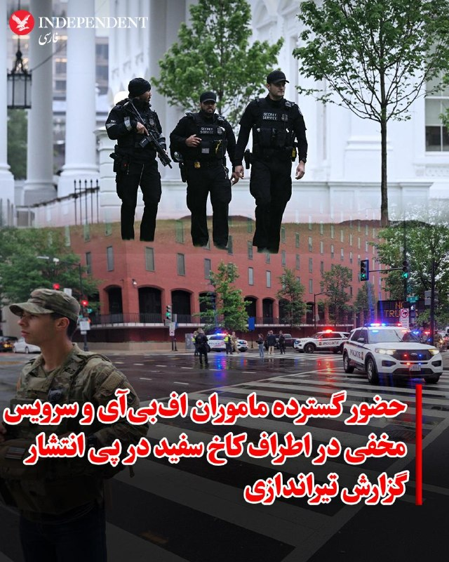

♦️رئیس اف‌بی‌آی اعلام کرد ماموران این سازمان به همراه نیروهای سرویس مخفی در پی تیراندازی در نزدیکی کاخ سفید، در محل حادثه حضور یافته‌اند؛ همزمان خبرگزاری فرانسه نیز از حضور گسترده پلیس و نیروهای امنیتی در اطراف این عمارت خبر داد و گزارش داد که ماموران امنیتی تمام مسیرهای منتهی به کاخ سفید را مسدود کرده و نیروهای گارد ملی از ورود خبرنگاران به منطقه جلوگیری می‌کنند. این تیراندازی در شرایطی رخ داد که دونالد ترامپ، رئیس‌جمهوری آمریکا، برای رایزنی درباره توافق با ایران در محل اقامت خود در کاخ سفید حضور داشت و به دنبال شنیده شدن صدای شلیک ده‌ها گلوله، خبرنگاران مستقر در چمن شمالی با دستور اضطراری نیروهای امنیتی به داخل اتاق نشست مطبوعاتی کاخ سفید منتقل شدند و پناه گرفتند.
‌🇸🇦 Indypersian

🤖 @VahidOOnLine

## WithYashar — post 12281

تیرانداز به هلاکت رسید و فرد حاضر زنده و هوشیار است. هر دو به بیمارستان منتقل شده‌اند.
@withyashar

## WithYashar — post 12280

  

سرویس مخفی پس از شروع تیراندازی در سمت غرب کاخ سفید به یک مظنون مسلح شلیک کرد، به گزارش فاکس نیوز.

یک عابر پیاده در این حادثه زخمی شد و تأیید شده است که رئیس‌جمهور ترامپ در امنیت است.
@withyashar

## WithYashar — post 12279

بی‌بی‌اس نیوز گزارش داد: در تیراندازی نزدیک کاخ سفید دو نفر زخمی شدند که یکی از آن‌ها مظنون است.
@withyashar

## WithYashar — post 12278

  <a href="telegram/content/WithYashar_12278_1779580916.mp4" target="_blank">🎬 Download video</a>

@withyashar تیرندازی از دیدی دیگر

## FoxNewsTwitter — post 342174

  <a href="telegram/content/FoxNewsTwitter_342174_1779580919.mp4" target="_blank">🎬 Download video</a>

Fox News (Twitter/X)

JUST IN: FOX News' Chad Pergram reports that two people were wounded in a shooting near the White House, and that the lockdown has been lifted.

## FoxNewsTwitter — post 342173

  <a href="telegram/content/FoxNewsTwitter_342173_1779580921.mp4" target="_blank">🎬 Download video</a>

Fox News (Twitter/X)

BREAKING: FOX News' Chad Pergram reports on shots fired near the White House, says Secret Service took down shooter.

## pm_afshaa — post 91352

  <a href="telegram/content/pm_afshaa_91352_1779580922.webm" target="_blank">🎬 Download video</a>

🔴ان‌بی‌سی نیوز: هم‌اکنون بیرون کاخ سفید حدود 20 تا 30 تا تیر شلیک شده! سرویس مخفی آمریکا خبرنگارهایی که تو محوطه کاخ سفید بودن رو جمع کرده و برده داخل اتاق کنفرانس خبری تا ازشون محافطت کنه. 
💧 Rainbet.com the #1 Non-KYC Crypto Casino & Sportsbook @rainbetcom…

## pm_afshaa — post 91351

  <a href="telegram/content/pm_afshaa_91351_1779580923.webm" target="_blank">🎬 Download video</a>

🔴ان‌بی‌سی نیوز: هم‌اکنون بیرون کاخ سفید حدود 20 تا 30 تا تیر شلیک شده! سرویس مخفی آمریکا خبرنگارهایی که تو محوطه کاخ سفید بودن رو جمع کرده و برده داخل اتاق کنفرانس خبری تا ازشون محافطت کنه. 
💧 Rainbet.com the #1 Non-KYC Crypto Casino & Sportsbook @rainbetcom…

## IranIntlTV — post 338677

  <a href="telegram/content/IranIntlTV_338677_1779580924.mp4" target="_blank">🎬 Download video</a>

ویدیوی منتشرشده از یک خبرنگار سی‌بی‌اس، لحظات دلهره‌آور تیراندازی در نزدیکی کاخ سفید را در روز شنبه دوم خرداد نشان می‌دهد.
خبرگزاری رویترز به نقل از یک مقام پلیس نوشت که مظنون تیراندازی در نزدیکی کاخ سفید دستگیر و به بیمارستان منتقل شده است. او گفت که مظنون به ایست بازرسی نزدیک کاخ سفید نزدیک شد و به سمت ماموران شلیک کرد. به گفته این مقام پلیس، هیچ یک از ماموران آسیب ندیدند.

## IranIntlTV — post 338676

  

لیندزی گراهام، سناتور جمهوری‌خواه، هشدار داد هر توافقی که به بقای حکومت ایران و بازگشت تدریجی نفوذ منطقه‌ای آن منجر شود، می‌تواند خاورمیانه را بی‌ثبات‌تر کرده و گروه‌های نیابتی تهران را تقویت کند.
او در شبکه ایکس نوشت اگر در منطقه چنین برداشت شود که توافق با حکومت ایران به این رژیم اجازه می‌دهد زنده بماند و قدرتمندتر شود، «بنزین روی آتش درگیری‌ها در لبنان و عراق ریخته‌ایم» و حزب‌الله لبنان و شبه‌نظامیان شیعه در عراق به‌شدت تقویت خواهند شد.
گراهام با تاکید بر اینکه ادامه فشار بر تهران برای مهار گروه‌های نیابتی آن ضروری است، هشدار داد جمهوری اسلامی ممکن است از مذاکرات برای تجدید قوا استفاده کند.

https://iranintl.com/202605237902

## IranIntlTV — post 338675

  

یک مقام ارشد پلیس آمریکا درباره تیراندازی در اطراف کاخ سفید گفت: یک مظنون به ایست بازرسی اطراف کاخ سفید نزدیک شد و به سوی ماموران شلیک کرد، اما او هدف گلوله قرار گرفت و به بیمارستان منتقل شد.
https://iranintl.com/202605234529

## ManotoTV — post 105790

  <a href="telegram/content/ManotoTV_105790_1779580926.mp4" target="_blank">🎬 Download video</a>

تماسی از امارات
«می‌گفت مردم ایران عوض شده‌اند…
و این بار باید هوشیارتر، عاقل‌تر و متفاوت‌تر عمل کنند.»

## FarsiVOA — post 218482

  <a href="telegram/content/FarsiVOA_218482_1779580928.mp4" target="_blank">🎬 Download video</a>

⚡️ویدیوی صدای آمریکا از حضور نیروهای امنیتی پس از گزارش‌ها از تیراندازی شنبه عصر در نزدیکی کاخ سفید
@FarsiVOA

## FarsiVOA — post 218480

⚡️نیروهای گارد ملی و دیگر ماموران امنیتی شنبه عصر و در پی گزارش‌ها از تیراندازی در اطراف کاخ سفید، در محل استقرار یافتند.
@FarsiVOA

## FarsiVOA — post 218479

⚡️خط قرمز جدید بغداد: دولت علی الزیدی به دنبال انحلال شبه‌نظامیان وابسته به جمهوری اسلامی
@FarsiVOA

## FarsiVOA — post 218478

🔺گزارش‌ها از تیراندازی در نزدیکی کاخ سفید

▪️رسانه‌های آمریکایی از گزارش‌های مربوط به تیراندازی احتمالی در عصر شنبه در نزدیکی چمن شمالی کاخ سفید خبر دادند.

⬇️ بیشتر بخوانید:
https://ir.voanews.com/a/8153104.html
@FarsiVOA

## Persian_Trend_Official — post 14809

  

🔴لیندزی گراهام، سناتور جمهوری‌خواه،

💢هشدار داد هر توافقی که به بقای حکومت ایران و بازگشت تدریجی نفوذ منطقه‌ای آن منجر شود، می‌تواند خاورمیانه را بی‌ثبات‌تر کرده و گروه‌های نیابتی تهران را تقویت کند.

💢او در شبکه ایکس نوشت اگر در منطقه چنین برداشت شود که توافق با حکومت ایران به این رژیم اجازه می‌دهد زنده بماند و قدرتمندتر شود، «بنزین روی آتش درگیری‌ها در لبنان و عراق ریخته‌ایم» و حزب‌الله لبنان و شبه‌نظامیان شیعه در عراق به‌شدت تقویت خواهند شد.

💢گراهام با تاکید بر اینکه ادامه فشار بر تهران برای مهار گروه‌های نیابتی آن ضروری است، هشدار داد جمهوری اسلامی ممکن است از مذاکرات برای تجدید قوا استفاده کند.

🫆:Tony

📌 @persian_trend_official
پرشین ترند | متفاوت‌ترین کانال نظامی

## Persian_Trend_Official — post 14808

  <a href="telegram/content/Persian_Trend_Official_14808_1779580930.mp4" target="_blank">🎬 Download video</a>

💢همزمان با وقایع امشب روسیه هم با موشک اورشنیک مجهز به کلاهک خوشه ای حمله کرده به کی یف اوکراین

ویدئویی لحظه اصابت موشک بالستیک میان‌برد «اورشنیک» روسیه به کی‌یف.

🫆:Tony

📌 @persian_trend_official
پرشین ترند | متفاوت‌ترین کانال نظامی

## Persian_Trend_Official — post 14807

  

🔴 فوری | گزارش تیراندازی در اطراف کاخ سفید شبکه CBS گزارش داده صدای تیراندازی در اطراف کاخ سفید شنیده شده است. بر اساس گزارش اولیه: ▪️ سرویس مخفی آمریکا از خبرنگاران حاضر در ورودی کاخ سفید خواسته فوراً به اتاق توجیه خبری منتقل شوند ▪️ هنوز جزئیاتی درباره…

## Persian_Trend_Official — post 14806

  <a href="telegram/content/Persian_Trend_Official_14806_1779580931.webm" target="_blank">🎬 Download video</a>

⭕️درگذشت دیپلمات جمهوری آذربایجان در سانحه رانندگی در اتوبان جلفا-تبریز 💢وزارت امور خارجه جمهوری آذربایجان در فضای مجازی از درگذشت دیپلمات خود در شهر تبریز بر اثر تصادف خبر داد. 💢رامیل رضا اوغلو عمرانوف، کنسول جمهوری آذربایجان در جمهوری اسلامی ایران در شهر…

## BBCPersian — post 281909

🔻خبرنگاران در پی شنیده‌شدن تیراندازی احتمالی در نزدیکی کاخ سفید به پناهگاه رفتند

چند خبرنگار حاضر در کاخ سفید از شنیده شدن صدای احتمالی تیراندازی در نزدیکی این ساختمان خبر داده‌اند.

https://bbc.in/3PUAMWO
@BBCPersian

## BBCPersian — post 281908

🔻پایان پوشش زنده روز شنبه

در اینجا پوشش زنده تحولات ایران و آمریکا در روز شنبه دوم خرداد ۱۴۰۵ برابر با ۲۳ مه ۲۰۲۶ به پایان می‌رسد.

https://bbc.in/4dtIPCY
@BBCPersian

## manototv — post 105790

  <a href="telegram/content/manototv_105790_1779580932.mp4" target="_blank">🎬 Download video</a>

تماسی از امارات
«می‌گفت مردم ایران عوض شده‌اند…
و این بار باید هوشیارتر، عاقل‌تر و متفاوت‌تر عمل کنند.»

---
📅 بروزرسانی: 1405/03/03 02:27
---

## VahidOOnLine — post 241831

♦️در برنامه‌ای در صداوسیما، زنی که ادعا می‌کند همسایه بیت علی خامنه‌ای، رهبر کشته‌شده جمهوری اسلامی معرفی شد، در پاسخ به پرسشی درباره وضعیت محل اقامت او گفت: «از پشت‌بام که نگاه می‌کنی، تلی از خاک می‌بینی.»
این زن در ادامه تاکید کرد: «منطقه آقا خیلی سرسبز بود، اما حالا تبدیل به بیابان شده است؛ بیابانی بدون درخت و بدون سبزه که فقط خاک در آن دیده می‌شود.» مجری برنامه نیز در واکنش به این توضیحات اشاره کرد که با این توصیف، کاملا مشخص است چه اتفاقی برای ساختمان رخ داده است.
‌🇸🇦 Indypersian

🤖 @VahidOOnLine

## VahidOOnLine — post 241830

  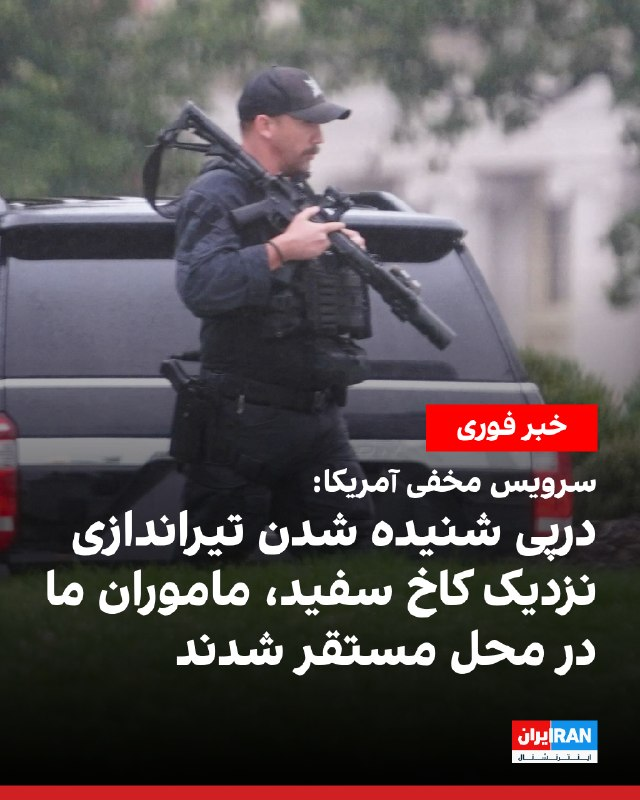

سخنگوی سرویس مخفی آمریکا در بیانیه‌ای به سی‌بی‌اس نیوز گفت این نهاد از «گزارش‌هایی درباره شلیک گلوله در نزدیکی خیابان هفدهم و خیابان پنسیلوانیا شمال غربی» آگاه است و «در حال بررسی و تایید این اطلاعات با نیروهای مستقر در محل» است.
‌🏁 🇬🇧 IranintlTV

🤖 @VahidOOnLine

## VahidOOnLine — post 241828

  

سخنگوی سرویس مخفی آمریکا در بیانیه‌ای به سی‌بی‌اس نیوز گفت این نهاد از «گزارش‌هایی درباره شلیک گلوله در نزدیکی خیابان هفدهم و خیابان پنسیلوانیا شمال غربی» آگاه است و «در حال بررسی و تایید این اطلاعات با نیروهای مستقر در محل» است.
‌🏁 🇬🇧 IranintlTV

🤖 @VahidOOnLine

## VahidOOnLine — post 241825

  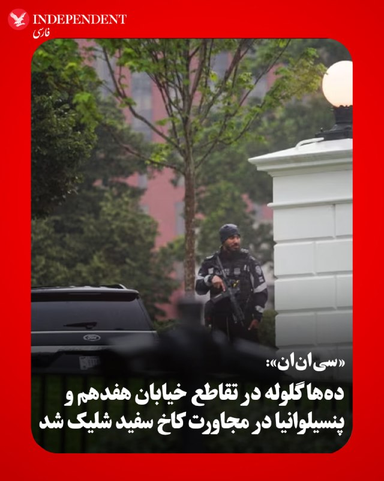

♦️«سی‌ان‌ان» عصر شنبه، دوم خردادماه، گزارش داد، شنیده شدن صدای ده‌ها شلیک احتمالی گلوله در نزدیکی کاخ سفید، منجر به برقراری وضعیت قرنطینه و واکنش سریع سرویس مخفی آمریکا شد. یک مقام سرویس مخفی به سی‌ان‌ان گفت که این آژانس در حال بررسی گزارش‌های مربوط به شلیک گلوله در تقاطع خیابان هفدهم و خیابان پنسیلوانیا در مجاورت محوطه کاخ سفید است؛ در همین حال، ماموران سرویس مخفی با فریادهای «بشینید» و هشدار درباره تیراندازی، خبرنگاران مستقر در چمن شمالی را به سرعت به داخل اتاق کنفرانس مطبوعاتی هدایت کرده و از آن‌ها خواستند در مکان‌های خود پناه بگیرند. به گفته یکی از خبرنگاران، صداها از سمت ساختمان اداری اجرایی آیزنهاور به گوش رسیده است و در پی این حادثه، ماموران سرویس مخفی مسلح به سلاح‌های تهاجمی در چمن شمالی مستقر شده و ورودی‌های اتاق کنفرانس مطبوعاتی کاخ سفید را مسدود کردند.
‌🇸🇦 Indypersian

🤖 @VahidOOnLine

## VahidOOnLine — post 241824

  <a href="telegram/content/VahidOOnLine_241824_1779577033.mp4" target="_blank">🎬 Download video</a>

ویدیوی دریافت‌شده نشان می‌دهد جمعی از ایرانیان مقیم هلیفکس کانادا، روز شنبه دوم خرداد، در همبستگی با انقلاب شیر و خورشید تجمع اعتراضی در سکوت برگزار کردند. آن‌ها با این سکوت تلاش کردند درباره قطعی اینترنت در ایران اطلاع‌رسانی کنند.
‌🏁 🇬🇧 IranintlTV

🤖 @VahidOOnLine

## VahidOOnLine — post 241823

  

♦️به گزارش «ای‌بی‌سی نیوز»، سرویس مخفی آمریکا عصر شنبه، دوم خردادماه، در پی شنیده شدن صدایی شبیه به شلیک گلوله، چمن شمالی کاخ سفید را به طور کامل تخلیه و پاکسازی کرد. بر اساس این گزارش، از خبرنگاران مستقر در محل خواسته شد تا به سرعت به سمت اتاق نشست مطبوعاتی کاخ سفید دویده و پناه بگیرند.
‌🇸🇦 Indypersian

🤖 @VahidOOnLine

## VahidOOnLine — post 241822

  <a href="telegram/content/VahidOOnLine_241822_1779577035.mp4" target="_blank">🎬 Download video</a>

♦️تصاویر منتشر شده توسط سلینا وانگ، خبرنگار ارشد شبکه «ای‌بی‌سی نیوز»، لحظات شلیک گلوله در نزدیکی کاخ سفید در واشنگتن دی‌سی را نشان می‌دهد. بر اساس گزارش‌های اولیه، حدود ۳۰ گلوله در خارج از محوطه کاخ سفید شلیک شده و نیروهای سرویس مخفی آمریکا بلافاصله وارد عمل شدند و خبرنگارانی را که در چمن شمالی مستقر بودند، به سمت اتاق کنفرانس مطبوعاتی هدایت کردند تا پناه بگیرند. این ویدیو نشان می‌دهد سلینا وانگ در حالی که در حال ضبط گزارش زنده خود درباره توافق احتمالی با ایران بود، با شنیدن صدای شلیک گلوله‌ها ناچار به قطع گزارش و تخلیه اضطراری محل می‌شود. هنوز جزییات بیشتری از این تیراندازی منتشر نشده است.
‌🇸🇦 Indypersian

🤖 @VahidOOnLine

## VahidOOnLine — post 241821

  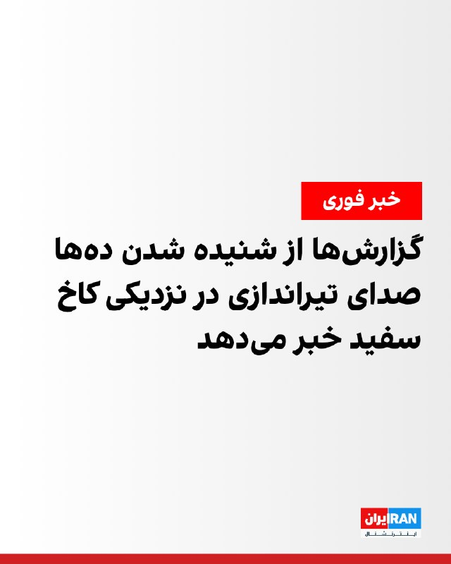

گزارش‌ها از شنیده شدن ده‌ها صدای تیراندازی در نزدیکی کاخ سفید خبر می‌دهد. به گزارش رسانه‌های آمریکایی، خبرنگاران در داخل کاخ سفید در محل امن مستقر شدند و ماموران سرویس مخفی در چمن شمالی کاخ سفید در حالی دیده می‌شوند که تفنگ در دست دارند.
‌🏁 🇬🇧 IranintlTV

🤖 @VahidOOnLine

## VahidOOnLine — post 241820

  

♦️روزنامه «فایننشال تایمز» در گزارشی اختصاصی نوشت که ایالات متحده به ژاپن اطلاع داده است تحویل ۴۰۰ موشک کروز «تاماهاک» به این کشور به دلیل اولویت پنتاگون برای بازسازی ذخایر تسلیحاتی خود پس از جنگ با ایران، با تاخیر مواجه خواهد شد. بر اساس این گزارش، پیت هگست، وزیر جنگ آمریکا، در تماس تلفنی اوایل ماه مه این موضوع را به همتای ژاپنی خود، شینجیرو کویزومی، اطلاع داده و واشنگتن گفته است که این موشک‌ها ممکن است با تاخیر دو ساله تحویل داده شوند. بر اساس ارزیابی مرکز مطالعات استراتژیک و بین‌المللی (CSIS)، ارتش آمریکا در طول پنج هفته عملیات نظامی علیه ایران، بیش از ۱۰۰۰ موشک تاماهاک را از مجموع ذخیره پیش از جنگ خود شلیک کرده است. براساس این گزارش، این تاخیر می‌تواند ضربه بزرگی به استراتژی دفاعی توکیو وارد کند، چرا که ژاپن این موشک‌های ۲.۳۵ میلیارد دلاری را با هدف تقویت توان بازدارندگی و ایجاد قابلیت «حمله متقابل» علیه چین سفارش داده بود.
‌🇸🇦 Indypersian

🤖 @VahidOOnLine

## VahidOOnLine — post 241819

  <a href="telegram/content/VahidOOnLine_241819_1779577038.mp4" target="_blank">🎬 Download video</a>

تجمع ایرانیان ساکن کپنهاگ، دوم خرداد ۱۴۰۵
‌🏁 🇬🇧 ManotoTV

🤖 @VahidOOnLine

## VahidOOnLine — post 241818

  <a href="telegram/content/VahidOOnLine_241818_1779577039.mp4" target="_blank">🎬 Download video</a>

♦️کریم بنزما، مهاجم باشگاه الهلال عربستان سعودی، با انتشار ویدیویی در صفحه اینستاگرام خود، حضورش در «مناسک حج» را به اشتراک گذاشت. این ستاره فوتبال با انتشار تصویری از خود در حال طواف به دور کعبه، این لحظات مذهبی را با مخاطبانش به اشتراک گذاشت و عبارت «الحمدلله برای همه‌چیز» را به عنوان پیام خود منتشر کرد.
‌🇸🇦 Indypersian

🤖 @VahidOOnLine

## WithYashar — post 12277

  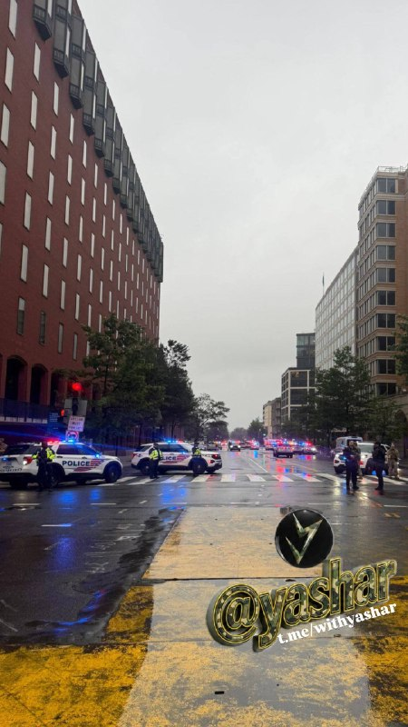

صحنه هایی از خارج از کاخ سفید.
@withyashar

## WithYashar — post 12276

مدیر اف‌بی‌آی کاش پاتل:

اف‌بی‌آی در محل حاضر است و از سرویس مخفی که به شلیک‌های نزدیک محوطه کاخ سفید پاسخ می‌دهد، حمایت می‌کند, ما به محض امکان، به‌روزرسانی‌های لازم را به عموم ارائه خواهیم داد
@withyashar

## WithYashar — post 12275

  <a href="telegram/content/WithYashar_12275_1779577041.mp4" target="_blank">🎬 Download video</a>

@withyashar

## WithYashar — post 12274

  <a href="telegram/content/WithYashar_12274_1779577043.mp4" target="_blank">🎬 Download video</a>

طبق گزارش‌ها، تیم‌های تک‌تیرانداز سرویس مخفی اکنون بر روی پشت‌بام کاخ سفید قابل مشاهده هستند.

این یک واکنش حفاظتی استاندارد پس از یک حادثه امنیتی است که در آن تیم‌ها برای ایمن‌سازی محوطه به موقعیت‌های مرتفع اعزام می‌شوند.

این با وضعیت فعال پس از گزارش‌های قبلی تیراندازی و انتقال خبرنگاران به داخل کاخ مطابقت دارد.
@withyashar

## WithYashar — post 12273

  <a href="telegram/content/WithYashar_12273_1779577044.mp4" target="_blank">🎬 Download video</a>

فیلمی از اخبار ABC لحظه‌ای را ثبت می‌کند که تیراندازی در خارج از کاخ سفید رخ داد.
@withyashar
🚨🚨🚨🚨🚨🚨🚨

## WithYashar — post 12272

طبق گزارش NBC News، صدای تیراندازی در خارج از کاخ سفید شنیده شد، با حدود ۲۰ تا ۳۰ گلوله شلیک شده. سرویس مخفی به اعضای مطبوعات که در چمن شمالی جمع شده‌اند دستور داده است که به داخل اتاق جلسه بروند.
@withyashar

## WithYashar — post 12271

  <a href="telegram/content/WithYashar_12271_1779577046.mp4" target="_blank">🎬 Download video</a>

وضعیت اعصاب و روان من الان 👺
@withyashar

## WithYashar — post 12270

الحدث: ایران و آمریکا به دشمنی طولانی مدتشون پایان دادن!
@withyashar

## WithYashar — post 12269

## mwarmonitor — post 9601

  <a href="telegram/content/mwarmonitor_9601_1779577047.mp4" target="_blank">🎬 Download video</a>

📝بررسی کارنامه مذهبی که بقای خود را در گرو ترور، سرکوب و ویرانی می‌بیند، هیچ شکلی از تردید را باقی نمی‌گذارد. شیعه سانان رافضی که با بی‌رحمی تمام، اینترنت نود میلیون انسان را ماه‌ها قطع می‌کند، دستش به خون چهل و پنج هزار انسان بیگناه آلوده است و با شلیک موشک به چهار گوشه منطقه، امنیت خاورمیانه را به گروگان می‌گیرد، هرگز به کابل‌های ارتباطی جهان و ابزارهای پیوند بشریت رحم نخواهد کرد. این فرقه، نماد عینی دنائت و تهدیدی افسارگسیخته برای تمدن بشری است؛ تفکری مخرب و ذاتاً جنایت‌کار که اگر به سلاح کشتار جمعی و بمب اتم دست یابد، حتی برای نابودی خود و اطرافیانش نیز درنگ نخواهد کرد. دنیا با جانیانی روبه‌روست که منطقشان چیزی جز قطع شریان‌های حیاتی جامعه جهانی و بازگرداندن انسان‌ها به تاریکی و انزوا نیست.

@mwarmonitor

## mwarmonitor — post 9600

  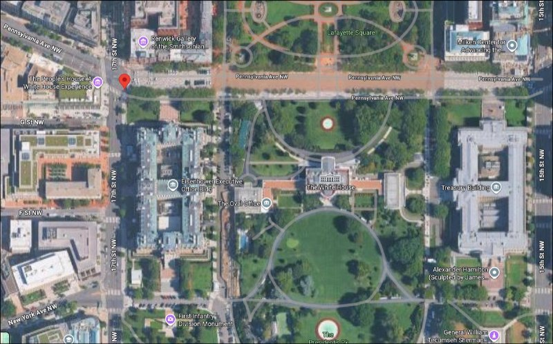

در حالی که در محوطه شمالی کاخ سفید (North Lawn) مشغول ضبط یک ویدیوی اجتماعی با آیفونم بودم، صدای تیراندازی را شنیدیم. صدایی شبیه شلیک ده‌ها گلوله بود. به ما گفته شد با سرعت به سمت اتاق نشست خبری بدویم و اکنون در آنجا نگه داشته شده‌ایم. خبرنگار ABC @mwarmonitor

## mwarmonitor — post 9599

  <a href="telegram/content/mwarmonitor_9599_1779577049.mp4" target="_blank">🎬 Download video</a>

🚨 گزارش شده که روسیه یک موشک بالستیک میان‌برد «اورشنیک» (Oreshnik) را به سمت اوکراین شلیک کرده است که طبق اعلام نیروی هوایی اوکراین، باعث به صدا درآمدن آژیرهای حمله هوایی در سراسر این کشور شده است. @mwarmonitor

## mwarmonitor — post 9598

  <a href="telegram/content/mwarmonitor_9598_1779577050.mp4" target="_blank">🎬 Download video</a>

در حالی که در محوطه شمالی کاخ سفید (North Lawn) مشغول ضبط یک ویدیوی اجتماعی با آیفونم بودم، صدای تیراندازی را شنیدیم. صدایی شبیه شلیک ده‌ها گلوله بود. به ما گفته شد با سرعت به سمت اتاق نشست خبری بدویم و اکنون در آنجا نگه داشته شده‌ایم. خبرنگار ABC

@mwarmonitor

## mwarmonitor — post 9597

  

🚨به گزارش NBC، صدای تیراندازی در خارج از کاخ سفید شنیده شده و حدود ۲۰ تا ۳۰ گلوله شلیک شده است. سرویس مخفی به خبرنگارانی که در محوطه شمالی کاخ سفید (North Lawn) جمع شده بودند دستور داده فوراً به داخل اتاق توجیه خبری بروند.

@mwarmonitor

## mwarmonitor — post 9596

🔸هنوز مشخص نشده که امتیازهای ایران چه خواهد بود، جز بازگشایی تنگه (که خودِ ایران هم از آن منتفع می‌شود).

🔹ممکن است به این دلیل باشد که درز اطلاعات فقط از یک طرف صورت می‌گیرد، یا اینکه اساساً امتیاز دیگری در کار نیست. در حال حاضر قضاوت قطعی غیرممکن است. خبرنگار نیویورک پست

@mwarmonitor

## mwarmonitor — post 9595

🚨 گزارش شده که روسیه یک موشک بالستیک میان‌برد «اورشنیک» (Oreshnik) را به سمت اوکراین شلیک کرده است که طبق اعلام نیروی هوایی اوکراین، باعث به صدا درآمدن آژیرهای حمله هوایی در سراسر این کشور شده است.

@mwarmonitor

## FoxNewsTwitter — post 342172

Fox News (Twitter/X)

BREAKING: White House locked down after as many as 30 shots fired in vicinity.

## pm_afshaa — post 91350

  <a href="telegram/content/pm_afshaa_91350_1779577052.mp4" target="_blank">🎬 Download video</a>

🔴ان‌بی‌سی نیوز: هم‌اکنون بیرون کاخ سفید حدود 20 تا 30 تا تیر شلیک شده!

سرویس مخفی آمریکا خبرنگارهایی که تو محوطه کاخ سفید بودن رو جمع کرده و برده داخل اتاق کنفرانس خبری تا ازشون محافطت کنه.

💧 Rainbet.com the #1 Non-KYC Crypto Casino & Sportsbook @rainbetcom

😁 @Pm_Afshaa

## pm_afshaa — post 91349

#مهم عزیزای دلم همگی الان چنل زاپاس‌مون رو جوین بشید کانال تحت ریپورت شدیده اگه چیزی شد زاپاس رو داشته باشید فعالیت میاد اونور
👇 https://t.me/Pm_Zapas https://t.me/Pm_Zapas

## pm_afshaa — post 91348

یا شروط توافق این که میگن نیست یا ترامپ کلکی تو کارِشه منطقی نیست اصلا اینو تو دنیا به عنوان شکست ترامپ میدونن

## pm_afshaa — post 91347

  <a href="telegram/content/pm_afshaa_91347_1779577053.webm" target="_blank">🎬 Download video</a>

🔴علی هاشم، خبرنگار الجزیره: طبق گفته منابع، پیش‌نویس پیشنهادی که قراره نهایی بشه شامل موارد زیر است: - پایان جنگ در همه جبهه‌ها از جمله لبنان - آزاد شدن میلیاردها دلار از دارایی‌های مسدود شده ایران - لغو محاصره دریایی آمریکا و گشایش تنگه هرمز - خروج نیروهای…

## pm_afshaa — post 91346

  <a href="telegram/content/pm_afshaa_91346_1779577054.webm" target="_blank">🎬 Download video</a>

🔴نیویورک تایمز به نقل از 3 مقام ایرانی: با یادداشت تفاهمی به توافق رسیدیم که جنگ متوقف بشه و تنگه هرمز هم باز بشه. این توافق منجر به آزادسازی 25 میلیارد دلار دارایی مسدود شده در خارج از کشور میشه! 
💧 Rainbet.com the #1 Non-KYC Crypto Casino & Sportsbook…

## pm_afshaa — post 91345

خبر اکسیوس که گفته هم‌اکنون متن توافقنامه توسط ایران و آمریکا امضا شد رو چک کردم من ندیدم گذاشته باشه. خبر فیکه داره پخش میشه تو چنلا

## DEJradio — post 4891

⭕️ خبرها از یک سلسله تیراندازی در اطراف کاخ سفید حکایت دارند. ویدئوی منتشر شده، سلینا وانگ، خبرنگار «ای‌بی‌سی نیوز»را در نزدیکی کاخ سفید در واشنگتن دی‌سی نشان می‌دهد. #کاخ_سفید @DEJradio

## DEJradio — post 4890

  <a href="telegram/content/DEJradio_4890_1779577054.mp4" target="_blank">🎬 Download video</a>

⭕️ خبرها از یک سلسله تیراندازی در اطراف کاخ سفید حکایت دارند.
ویدئوی منتشر شده، سلینا وانگ، خبرنگار «ای‌بی‌سی نیوز»را در نزدیکی کاخ سفید در واشنگتن دی‌سی نشان می‌دهد.

#کاخ_سفید
@DEJradio

## IranIntlTV — post 338674

  

سخنگوی سرویس مخفی آمریکا در بیانیه‌ای به سی‌بی‌اس نیوز گفت این نهاد از «گزارش‌هایی درباره شلیک گلوله در نزدیکی خیابان هفدهم و خیابان پنسیلوانیا شمال غربی» آگاه است و «در حال بررسی و تایید این اطلاعات با نیروهای مستقر در محل» است.
https://iranintl.com/202605237115

## IranIntlTV — post 338673

  

سخنگوی سرویس مخفی آمریکا در بیانیه‌ای به سی‌بی‌اس نیوز گفت این نهاد از «گزارش‌هایی درباره شلیک گلوله در نزدیکی خیابان هفدهم و خیابان پنسیلوانیا شمال غربی» آگاه است و «در حال بررسی و تایید این اطلاعات با نیروهای مستقر در محل» است.
https://iranintl.com/202605237115

## IranIntlTV — post 338672

  

سخنگوی سرویس مخفی آمریکا در بیانیه‌ای به سی‌بی‌اس نیوز گفت این نهاد از «گزارش‌هایی درباره شلیک گلوله در نزدیکی خیابان هفدهم و خیابان پنسیلوانیا شمال غربی» آگاه است و «در حال بررسی و تایید این اطلاعات با نیروهای مستقر در محل» است.
https://iranintl.com/202605237115

## IranIntlTV — post 338671

  <a href="telegram/content/IranIntlTV_338671_1779577057.mp4" target="_blank">🎬 Download video</a>

ایرانیان ساکن شهر تورین ایتالیا برای بیستمین هفته متوالی با برگزاری تجمعی اعتراضی، مخالفت خود را با سرکوب و نقض حقوق بشر در جمهوری اسلامی اعلام کردند.

گزارش صدف باغبانی، خبرنگار ایران‌اینترنشنال و گفت‌وگوی او با دو نفر از شرکت‌کنندگان
@iranintltv

## IranIntlTV — post 338670

  <a href="telegram/content/IranIntlTV_338670_1779577058.mp4" target="_blank">🎬 Download video</a>

ویدیوی دریافت‌شده نشان می‌دهد جمعی از ایرانیان مقیم هلیفکس کانادا، روز شنبه دوم خرداد، در همبستگی با انقلاب شیر و خورشید تجمع اعتراضی در سکوت برگزار کردند. آن‌ها با این سکوت تلاش کردند درباره قطعی اینترنت در ایران اطلاع‌رسانی کنند.

## IranIntlTV — post 338669

  <a href="telegram/content/IranIntlTV_338669_1779577060.mp4" target="_blank">🎬 Download video</a>

مراد ویسی، تحلیل‌گر ارشد ایران‌اینترنشنال، گفت: «خبرگزاری فارس ویدیویی از یک راه‌یافته به مجلس منتشر کرده که در آن پزشکیان متهم به زمینه‌چینی برای کشتن علی خامنه ای و زمینه چینی مجدد برای کشتن مجتبی خامنه ای شده است.»
@iranintltv

## IranIntlTV — post 338668

  <a href="telegram/content/IranIntlTV_338668_1779577061.mp4" target="_blank">🎬 Download video</a>

ایرانیان مقیم تورنتو با سر دادن شعارهایی در حمایت از شاهزاده رضا پهلوی، خواستار توقف اعدام‌ها، دسترسی به اینترنت آزاد و دموکراسی برای مردم ایران شدند.

گزارش مهسا مرتضوی، خبرنگار ایران‌اینترنشنال و گفت‌وگو با یکی از شرکت‌کنندگان
@iranintltv

## IranIntlTV — post 338667

  

گزارش‌ها از شنیده شدن ده‌ها صدای تیراندازی در نزدیکی کاخ سفید خبر می‌دهد. به گزارش رسانه‌های آمریکایی، خبرنگاران در داخل کاخ سفید در محل امن مستقر شدند و ماموران سرویس مخفی در چمن شمالی کاخ سفید در حالی دیده می‌شوند که تفنگ در دست دارند.
https://iranintl.com/202605231953

## IranIntlTV — post 338666

  <a href="telegram/content/IranIntlTV_338666_1779577062.mp4" target="_blank">🎬 Download video</a>

واشینگتن‌پست گزارش داد مقام‌ها و دیپلمات‌های آگاه از مذاکرات میان آمریکا و جمهوری اسلامی ابراز امیدواری کرده‌اند دو طرف پس از بررسی پیش‌نویس تهیه‌شده از سوی پاکستان، طی ۴۸ ساعت آینده تصمیم نهایی خود را اتخاذ کنند.

گفت‌وگو با حسین علیزاده، دیپلمات پیشین
@iranintltv

## IranIntlTV — post 338665

  <a href="telegram/content/IranIntlTV_338665_1779577064.mp4" target="_blank">🎬 Download video</a>

دونالد ترامپ از تماس تلفنی خود با رهبران کشورهای منطقه درباره ایران خبر داد. او تاکید کرد بخش زیادی از چارچوب توافق نهایی شده، اما اجرای آن همچنان به توافق نهایی میان واشینگتن، تهران و برخی کشورهای دخیل در مذاکرات بستگی دارد.

گفت‌وگو با امیر گیتی، عضو تحریریه ایران‌اینترنشنال
@iranintltv

## IranIntlTV — post 338664

  <a href="https://t.me/IranintlTV/338664" target="_blank">📎 Download file</a>

🎧نسخه صوتی سیاست با مراد ویسی: تهدید پزشکیان به استعفا
@iranintlTV

## IranIntlTV — post 338663

  <a href="telegram/content/IranIntlTV_338663_1779577066.mp4" target="_blank">🎬 Download video</a>

مراد ویسی، تحلیل‌گر ارشد ایران‌اینترنشنال، گفت: «در راس جمهوری اسلامی اختلاف بر سر توافق با آمریکا یا رفتن به سمت جنگ شدت گرفته است. مسعود پزشکیان در نامه‌ای به مجتبی خامنه‌ای نوشته توان تاب‌آوری نظام رو به پایان است و در صورت ادامه شرایط موجود تهدید به استعفا کرده است.»
@iranintltv

## Shin_Persian — post 6194

  

Shin ✓ @hey_itsmyturn
Sat, 23 May 2026 22:34:08 UTC

𝕏 · @shin_persian

## Shin_Persian — post 6193

  <a href="telegram/content/Shin_Persian_6193_1779577068.mp4" target="_blank">🎬 Download video</a>

Selina Wang ✓ @selinawangtv
Sat, 23 May 2026 22:20:24 UTC

I was in the middle of taping on my iPhone for a social video from the White House North Lawn when we heard the shots. It sounded like dozens of gunshots. We were told to sprint to the press briefing room where we are holding now.

فارسی

من در میانه ضبط ویدئویی برای شبکه‌های اجتماعی با آیفون خود در محوطه شمالی کاخ سفید بودم که صدای شلیک‌ها را شنیدیم. صدا شبیه به ده‌ها شلیک گلوله بود. به ما گفته شد که به سرعت به سمت اتاق کنفرانس مطبوعاتی بدویم، جایی که هم‌اکنون در آنجا پناه گرفته‌ایم.

𝕏 · @shin_persian

## Shin_Persian — post 6192

  

Faytuks Network ✓ @FaytuksNetwork
Sat, 23 May 2026 22:24:37 UTC

Police have created a perimeter around the scene of the shooting close to the White House.

فارسی

پلیس پیرامون صحنه تیراندازی در نزدیکی کاخ سفید، یک کمربند امنیتی ایجاد کرده است.

𝕏 · @shin_persian

## Shin_Persian — post 6191

Shin ✓ @hey_itsmyturn
Sat, 23 May 2026 22:14:55 UTC

Shots fired outside of the White House

فارسی

شلیک گلوله در بیرون از کاخ سفید

𝕏 · @shin_persian

## ManotoTV — post 105789

  <a href="telegram/content/ManotoTV_105789_1779577070.mp4" target="_blank">🎬 Download video</a>

تماسی از سن‌فرانسیسکو:
«می‌گفت با شنیدن صدای شما احساس می‌کنم تو ایرانم…
و از سال‌هایی گفت که با برنامه‌های منوتو خندیده، گریه کرده و زندگی کرده بود.»

## ManotoTV — post 105788

  <a href="telegram/content/ManotoTV_105788_1779577072.mp4" target="_blank">🎬 Download video</a>

تماسی از خارج ایران:
«می‌گفت بسته شدن منوتو برای خیلی‌ها دردناک بود…
و از همراهی و امیدی گفت که این سال‌ها از برنامه‌ها گرفته بودند.

## ManotoTV — post 105787

  <a href="telegram/content/ManotoTV_105787_1779577074.mp4" target="_blank">🎬 Download video</a>

تجمع ایرانیان ساکن کپنهاگ، دوم خرداد ۱۴۰۵

## FarsiVOA — post 218477

🔺وال‌استریت ژورنال: دونالد ترامپ حق از سرگیری حملات به جمهوری اسلامی را برای خود محفوظ نگه می‌دارد

▪️روزنامه وال‌‌استریت ژورنال عصر شنبه گزارش داد که دونالد ترامپ، رئيس جمهوری آمریکا به دستیاران و همتایان خود گفته است که حق از سرگیری حملات به جمهوری اسلامی را در صورتی که رژیم ایران به «توافق موقت» عمل نکند، برای خود محفوظ نگه می‌دارد.

⬇️ بیشتر بخوانید:
https://ir.voanews.com/a/8153093.html
@FarsiVOA

## Persian_Trend_Official — post 14805

🔴 فوری | گزارش تیراندازی در اطراف کاخ سفید شبکه CBS گزارش داده صدای تیراندازی در اطراف کاخ سفید شنیده شده است. بر اساس گزارش اولیه: ▪️ سرویس مخفی آمریکا از خبرنگاران حاضر در ورودی کاخ سفید خواسته فوراً به اتاق توجیه خبری منتقل شوند ▪️ هنوز جزئیاتی درباره…

## Persian_Trend_Official — post 14804

  <a href="telegram/content/Persian_Trend_Official_14804_1779577075.webm" target="_blank">🎬 Download video</a>

💢مدیر اف‌بی‌آی، کش پاتل:

💢اف‌بی‌آی در محل حاضر است و در حال پشتیبانی از سرویس مخفی در واکنش به گزارش تیراندازی در نزدیکی محوطه کاخ سفید است .

هر زمان امکان داشته باشد، اطلاعات جدید را به اطلاع عموم خواهیم رساند.

🫆:Tony

📌 @persian_trend_official
پرشین ترند | متفاوت‌ترین کانال نظامی

## Persian_Trend_Official — post 14803

  <a href="telegram/content/Persian_Trend_Official_14803_1779577076.webm" target="_blank">🎬 Download video</a>

⚡️🇺🇸 سرویس مخفی ایالات متحده:

ما از گزارش‌هایی مبنی بر شلیک تیر در نزدیکی خیابان هفدهم و خیابان پنسیلوانیا در شمال غربی آگاهیم و در حال تأیید این اطلاعات با پرسنل حاضر در محل هستیم. اطلاعات بیشتری به محض در دسترس قرار گرفتن ارائه خواهد شد.

## Persian_Trend_Official — post 14802

  <a href="telegram/content/Persian_Trend_Official_14802_1779577076.webm" target="_blank">🎬 Download video</a>

🔴 فوری | گزارش تیراندازی در اطراف کاخ سفید شبکه CBS گزارش داده صدای تیراندازی در اطراف کاخ سفید شنیده شده است. بر اساس گزارش اولیه: ▪️ سرویس مخفی آمریکا از خبرنگاران حاضر در ورودی کاخ سفید خواسته فوراً به اتاق توجیه خبری منتقل شوند ▪️ هنوز جزئیاتی درباره…

## Persian_Trend_Official — post 14801

  <a href="telegram/content/Persian_Trend_Official_14801_1779577076.mp4" target="_blank">🎬 Download video</a>

💢استوری یکی از شهروندان امریکا از صدای تیر اندازی در نزدیکی کاخ سفید
🫆:Tony

📌 @persian_trend_official
پرشین ترند | متفاوت‌ترین کانال نظامی

## Persian_Trend_Official — post 14800

  <a href="telegram/content/Persian_Trend_Official_14800_1779577077.mp4" target="_blank">🎬 Download video</a>

💢ویدئویی دیگر از صدای ممتد شلیک در اطراف کاخ سفید
🫆:Tony

📌 @persian_trend_official
پرشین ترند | متفاوت‌ترین کانال نظامی

## Persian_Trend_Official — post 14799

  

🔴 فوری | گزارش تیراندازی در اطراف کاخ سفید شبکه CBS گزارش داده صدای تیراندازی در اطراف کاخ سفید شنیده شده است. بر اساس گزارش اولیه: ▪️ سرویس مخفی آمریکا از خبرنگاران حاضر در ورودی کاخ سفید خواسته فوراً به اتاق توجیه خبری منتقل شوند ▪️ هنوز جزئیاتی درباره…

## Persian_Trend_Official — post 14798

  <a href="telegram/content/Persian_Trend_Official_14798_1779577079.mp4" target="_blank">🎬 Download video</a>

🔴 فوری | گزارش تیراندازی در اطراف کاخ سفید شبکه CBS گزارش داده صدای تیراندازی در اطراف کاخ سفید شنیده شده است. بر اساس گزارش اولیه: ▪️ سرویس مخفی آمریکا از خبرنگاران حاضر در ورودی کاخ سفید خواسته فوراً به اتاق توجیه خبری منتقل شوند ▪️ هنوز جزئیاتی درباره…

## Persian_Trend_Official — post 14797

  <a href="telegram/content/Persian_Trend_Official_14797_1779577080.mp4" target="_blank">🎬 Download video</a>

🔴 فوری | گزارش تیراندازی در اطراف کاخ سفید شبکه CBS گزارش داده صدای تیراندازی در اطراف کاخ سفید شنیده شده است. بر اساس گزارش اولیه: ▪️ سرویس مخفی آمریکا از خبرنگاران حاضر در ورودی کاخ سفید خواسته فوراً به اتاق توجیه خبری منتقل شوند ▪️ هنوز جزئیاتی درباره…

## Persian_Trend_Official — post 14796

  <a href="telegram/content/Persian_Trend_Official_14796_1779577081.mp4" target="_blank">🎬 Download video</a>

شبتون بخیر 🤍

📝 Nick
📌 @persian_trend_official
پرشین ترند | متفاوت‌ترین کانال نظامی

## Persian_Trend_Official — post 14795

🔴 فوری | گزارش تیراندازی در اطراف کاخ سفید شبکه CBS گزارش داده صدای تیراندازی در اطراف کاخ سفید شنیده شده است. بر اساس گزارش اولیه: ▪️ سرویس مخفی آمریکا از خبرنگاران حاضر در ورودی کاخ سفید خواسته فوراً به اتاق توجیه خبری منتقل شوند ▪️ هنوز جزئیاتی درباره…

## Persian_Trend_Official — post 14794

🔴 فوری | گزارش تیراندازی در اطراف کاخ سفید

شبکه CBS گزارش داده صدای تیراندازی در اطراف کاخ سفید شنیده شده است.

بر اساس گزارش اولیه:

▪️ سرویس مخفی آمریکا از خبرنگاران حاضر در ورودی کاخ سفید خواسته فوراً به اتاق توجیه خبری منتقل شوند
▪️ هنوز جزئیاتی درباره عامل تیراندازی یا محل دقیق حادثه منتشر نشده است
▪️ وضعیت امنیتی در اطراف کاخ سفید به‌شدت تشدید شده است

◼️تاکنون هیچ مقام آمریکایی درباره ماهیت حادثه یا احتمال تهدید علیه مقامات ارشد اظهار نظر رسمی نکرده است.

🫆:Tony

📌 @persian_trend_official
پرشین ترند | متفاوت‌ترین کانال نظامی

## Persian_Trend_Official — post 14793

## Persian_Trend_Official — post 14792

  <a href="telegram/content/Persian_Trend_Official_14792_1779577083.webm" target="_blank">🎬 Download video</a>

⭕️درگذشت دیپلمات جمهوری آذربایجان در سانحه رانندگی در اتوبان جلفا-تبریز

💢وزارت امور خارجه جمهوری آذربایجان در فضای مجازی از درگذشت دیپلمات خود در شهر تبریز بر اثر تصادف خبر داد.

💢رامیل رضا اوغلو عمرانوف، کنسول جمهوری آذربایجان در جمهوری اسلامی ایران در شهر تبریز حین انجام فعالیت خدماتی در حوالی شهر مرند در اتوبان جلفا-تبریز بر اثر تصادف خودرویی که با آن در حال رانندگی بود جان خود را از دست داد

🫆:Tony

📌 @persian_trend_official
پرشین ترند | متفاوت‌ترین کانال نظامی

## IranianMinds — post 20648

  

آخرین باری که جمهوری اسلامی مخالفانش را به مذاکره و گفتگو دعوت کرد، چنین اتفاقی افتاد!

عبدالرحمان قاسملو، پای میز مذاکره رفت و ترور شد!

در قاموسِ جمهوری اسلامی، بیائید مذاکره کنیم یعنی بیائید تا شما را به قتل برسانیم.

این نکته را هرگز فراموش نکنید!
و مطمئن باشید اطلاعات آمریکا بیشتر از ماست

@IranianMinds

## IranianMinds — post 20647

ثبت نام کن ۵۰۰ هزارتومان جایزه بگیر
نیازی هم به واریز نیست
تنها سایت مورد #تایید ما با بونوس های واقعی:

🌐 Winro.io

## IranianMinds — post 20646

  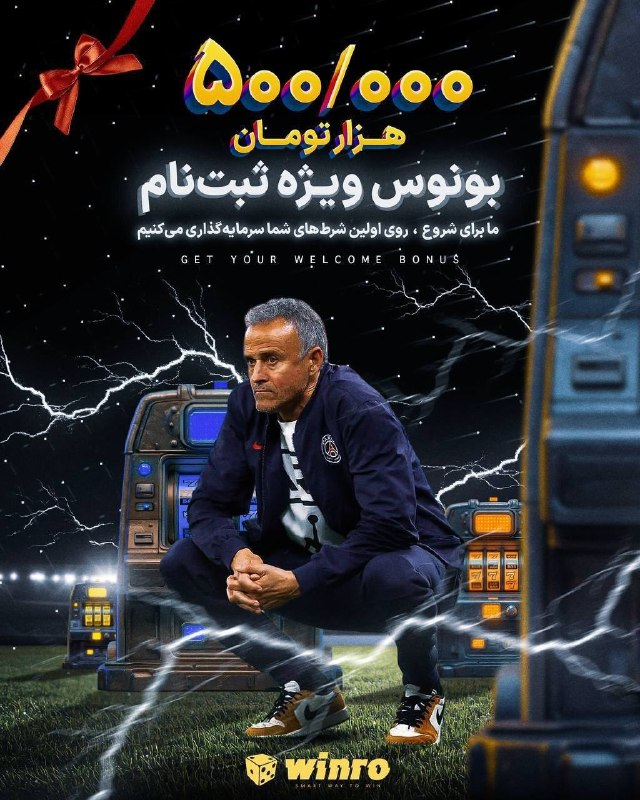

⭕️ تا حالا بدون واریزی روی فوتبال ها شرط بستی؟!

🎉 500 هزارتومن بونوس رایگان فقط با ثبت نام بدون هیچگونه واریزی!

💳 شارژ سریع و امن با درگاه ریالی ، تتر یا ترون فقط با یک کلیک!

⌛ پشتیبانی 24 ساعته

💖تنها سایت مورد اعتماد ما با بونوس های کاملا واقعی و رویایی:

🌐 Winro.io

🌐 Winro.io
کانال بونوس های رایگان aa2

📱 @winro_io

## IranianMinds — post 20645

  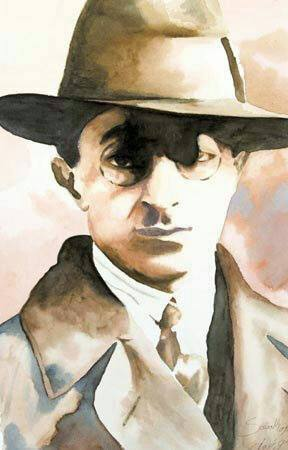

در تاریخ ننگ این دوره را با آب زمزم و کوثر هم نمیشود شست..!

👤 صادق هدایت

@IranianMinds

## BBCPersian — post 281907

  

ستاد فرماندهی مرکزی آمریکا (سنتکام) اعلام کرد که در جریان اجرای محاصره دریایی علیه ایران به تغییر مسیر ۱۰۰ کشتی تجاری رسیده‌ است.

سنتکام در پیامی در شبکه اجتماعی ایکس این آمار را منتشر کرد.

ایران نیز در واکنش به جنگ آمریکا و اسرائیل، عبور و مرور کشتی ها از تنگه هرمز را به شدت محدود کرده است.

دو طرف در حال مذاکره بر سر بازگشایی تنگه هرمز و پایان محاصره دریایی ایران هستند وبر اساس گزارش‌های رسمی به «پیشرفت هایی» رسیده‌اند.

📸 X CENTCOM

https://bbc.in/4dtIPCY
@BBCPersian

## BBCPersian — post 281906

  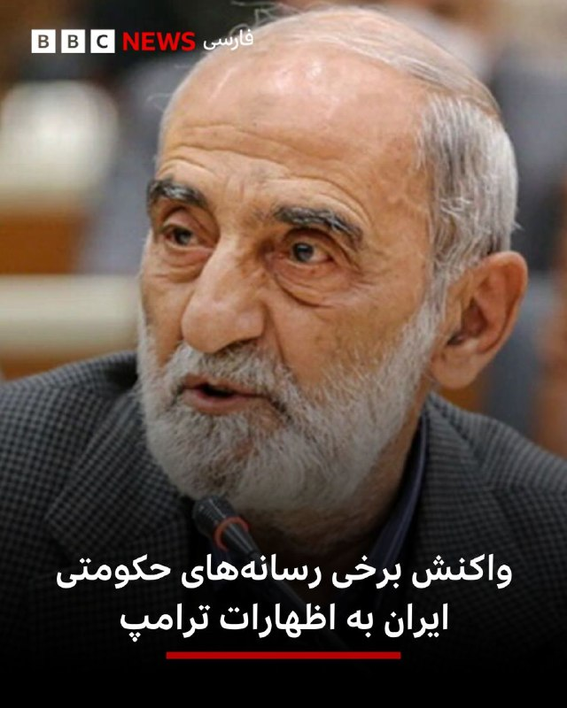

🔻در پی اعلام دونالد ترامپ مبنی بر این که در چارچوب توافق احتمالی تنگه هرمز بازگشایی خواهد شد، برخی از رسانه‌های حکومتی جمهوری اسلامی به اظهارات او واکنش نشان دادند.

حسین شریعتمداری، مدیر روزنامه کیهان با «گلایه» از برخی دیپملات‌ها و تیم مذاکره‌کننده ایران گفت که «انگار قرار است بعد از پایان جنگ، شرایط و قوانین حاکم بر تنگه هرمز به حالت پیش از جنگ بازگردد.»

او تاکید کرد که «عوارض عبور، حق قانونی ایران اسلامی است و نباید نادیده گرفته شود.»

خبرگزاری فارس، نزدیک به سپاه پاسداران هم نوشت که «ادعای ترامپ در باره بازگشت تنگه هرمز به حالت قبل واقعیت ندارد.»

این رسانه حکومتی نزدیک به سپاه پاسداران مدعی شد که «براساس آخرین متن ردوبدل‌شده، در صورت توافق احتمالی، تنگه هرمز کماکان تحت مدیریت ایران خواهد بود.»

خبرگزاری فارس در عین حال نوشت که «گرچه ایران موافقت کرده اجازه دهد تعداد کشتی‌های عبوری به میزان قبل از جنگ بازگردد، اما این به‌هیچ‌عنوان به معنای «تردد آزاد» به وضعیت قبل از جنگ نیست.»

📸 ایرنا

https://bbc.in/4dtIPCY
@BBCPersian

## Dirty_Kids — post 390056

  <a href="telegram/content/Dirty_Kids_390056_1779577085.webm" target="_blank">🎬 Download video</a>

☢️خفن ترین و‌ قدیمی ترین  انالیزور  ایران ینی دکتر بت 
👍 
🔴هیچ سایت بتی دوست نداره شما کانال دکتر بت رو پیدا کنین چون خیلی سود میکنید🤷‍♂ رایگان بهترین شرط هارو براتون میذاره حتی هزار تومن هم دریافت نمیکنه روزانه میتونی از پیش بینی فوتبال باهاش پول در بیاری…

## Dirty_Kids — post 390055

  <a href="telegram/content/Dirty_Kids_390055_1779577086.webm" target="_blank">🎬 Download video</a>

☢️خفن ترین و‌ قدیمی ترین  انالیزور  ایران ینی دکتر بت 
👍

🔴هیچ سایت بتی دوست نداره شما کانال دکتر بت رو پیدا کنین چون خیلی سود میکنید🤷‍♂

رایگان بهترین شرط هارو براتون میذاره
حتی هزار تومن هم دریافت نمیکنه
روزانه میتونی از پیش بینی فوتبال باهاش پول در بیاری 👌
A2
اگ اهل پیش بینی فوتبالی این کانال اصلا از دست ندین👇

✅https://t.me/+4_ADqwB9e-QwYjlk

✅https://t.me/+4_ADqwB9e-QwYjlk

## Dirty_Kids — post 390054

  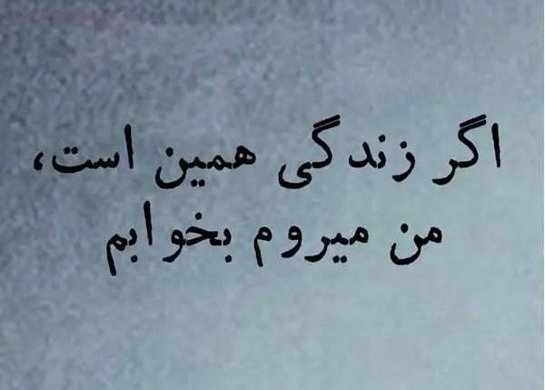

#بخوابیم

@Dirty_Kids 👻

## Dirty_Kids — post 390053

  

آخرین آپدیت از نمودار محبوبیت ترامپ:

@Dirty_Kids 👻

## Dirty_Kids — post 390052

جدی مملکت عالیه. در ۴-۵ ماه اخیر هرکس اندازه بضاعت خودش کیر شد. هیچ دسته یا گروهی رو نمیتونی پیدا کنی که کیر نشده باشه.

@Dirty_Kids 👻

## Dirty_Kids — post 390051

شما اگه امیدوار باشی ایران بهترین جا برای کیر شدنه…

@Dirty_Kids 👻

## Dirty_Kids — post 390050

‏می‌رفتی عروسی پسرت به قر می‌دادی جای این کسشرا!

@Dirty_Kids 👻

## Dirty_Kids — post 390049

  

اتاق جنگ اسرائیل:
ایرانِ آزاد 🦁☀️

@Dirty_Kids 👻

## Dirty_Kids — post 390048

  

نظرات عرزشی‌ها؛
باز شروع شد زجه زدن

@Dirty_Kids 👻

## Dirty_Kids — post 390047

  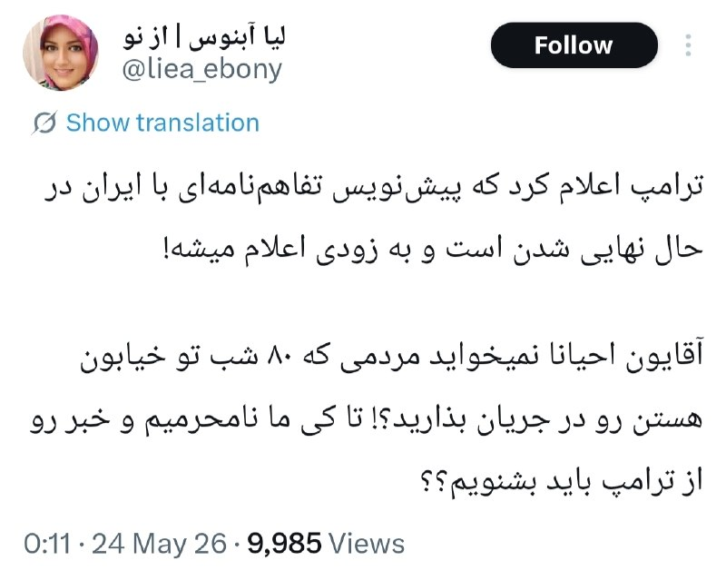

چه گوه‌خوریا، مارو درجریان بزارید 😂😂
هنوز نفهمیدن فقط برای صیغه شدنن

@Dirty_Kids 👻

## Dirty_Kids — post 390046

  <a href="telegram/content/Dirty_Kids_390046_1779577087.mp4" target="_blank">🎬 Download video</a>

بیرون کاخ سفید حدود 20 تا 30 تا تیر شلیک شده!

سرویس مخفی آمریکا هم سریع خبرنگارایی که تو محوطه کاخ سفید بودن رو جمع کرده و برده داخل اتاق کنفرانس خبری تا ازشون محافطت کنه.

@Dirty_Kids 👻

## Dirty_Kids — post 390045

  <a href="telegram/content/Dirty_Kids_390045_1779577089.mp4" target="_blank">🎬 Download video</a>

نیرو ویژه آمریکا در کاخ سفید

طبق گزارشات نزدیک کاخ سفید تیراندازی سنگینی رخ داده و 20-30 گلوله شلیک شده!

@Dirty_Kids 👻

## Dirty_Kids — post 390044

  

فارس هم خبردرمانی میکنه بچه شیعه آروم بشه
آخه با قاتل رهبرشون رفتن توافق کردن

@Dirty_Kids 👻

## Dirty_Kids — post 390043

  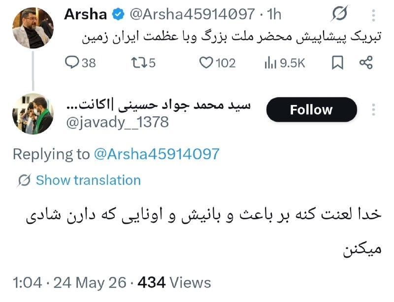

۲ دسته عرزشی وجود داره:

@Dirty_Kids 👻

## manototv — post 105789

  <a href="telegram/content/manototv_105789_1779577091.mp4" target="_blank">🎬 Download video</a>

تماسی از سن‌فرانسیسکو:
«می‌گفت با شنیدن صدای شما احساس می‌کنم تو ایرانم…
و از سال‌هایی گفت که با برنامه‌های منوتو خندیده، گریه کرده و زندگی کرده بود.»

## manototv — post 105788

  <a href="telegram/content/manototv_105788_1779577092.mp4" target="_blank">🎬 Download video</a>

تماسی از خارج ایران:
«می‌گفت بسته شدن منوتو برای خیلی‌ها دردناک بود…
و از همراهی و امیدی گفت که این سال‌ها از برنامه‌ها گرفته بودند.

## manototv — post 105787

  <a href="telegram/content/manototv_105787_1779577094.mp4" target="_blank">🎬 Download video</a>

تجمع ایرانیان ساکن کپنهاگ، دوم خرداد ۱۴۰۵

## alonews — post 122203

  <a href="telegram/content/alonews_122203_1779577095.webm" target="_blank">🎬 Download video</a>

👈طبق گزارش NBC News، صدای تیراندازی در خارج از کاخ سفید شنیده شد، با حدود ۲۰ تا ۳۰ گلوله شلیک شده. سرویس مخفی به خبرنگاران دستور داده است که برای حفظ جانشان به داخل اتاق جلسه بروند

✅ @AloNews خبر جنگ

## alonews — post 122202

  <a href="telegram/content/alonews_122202_1779577095.webm" target="_blank">🎬 Download video</a>

👈وال استریت ژورنال: ترامپ به دستیارانش گفته است که در صورت عدم پایبندی ایران به چارچوب توافق، حق از سرگیری بمباران ایران را برای خود محفوظ می‌دارد.

✅ @AloNews خبر جنگ

## alonews — post 122201

  <a href="telegram/content/alonews_122201_1779577095.webm" target="_blank">🎬 Download video</a>

👈نیویورک تایمز: ۲۵ میلیارد دلار از پولای بلوکه شده‌ی ایران قراره واسشون آزاد بشه

✅ @AloNews خبر جنگ

<!-- MSG END -->

<!-- NAV START -->

<a href="https://github.com/shahinsa98/aio-downloader/blob/main/telegram/content/archive_1.md" style="display:inline-block; padding:6px 12px; margin:0 4px; background-color:#2ea44f; color:white; text-decoration:none; border-radius:4px; font-weight:bold;">صفحه بعد</a>

<!-- NAV END -->
