# خواننده تلگرام

<!-- TOP_NAV START -->

<a href="https://github.com/shahinsa98/aio-downloader/blob/main/telegram/content/archive_1.md" style="display:inline-block; padding:6px 12px; margin:0 4px; background-color:#2ea44f; color:white; text-decoration:none; border-radius:4px; font-weight:bold;">صفحه بعد</a>

<!-- TOP_NAV END -->

<!-- MSG START -->

---
📅 بروزرسانی: 1405/03/04 21:00
---

## VahidOOnLine — post 242150

  

♦️مقام‌های آمریکایی به سی‌ان‌ان گفته‌اند، اختلاف‌ها بر سر نحوه پرداختن به برنامه هسته‌ای ایران و لغو تحریم‌ها، نهایی شدن توافق برای پایان جنگ را به تاخیر انداخته است.
شبکه خبری سی‌ان‌ان، روز دوشنبه چهارم خرداد ماه به نقل از یک مقام آمریکایی گزارش کرد، سفر اعضای ارشد تیم مذاکره کننده ایرانی در قطر در روز دوشنبه، نشانه‌ای مثبت ارزیابی می‌شود و نقش میانجی‌گرانه قطر همچنان اهمیت دارد.
سی‌ان‌ان با گزارش آنکه واشنگتن به‌دنبال دریافت تضمین‌های قطعی از تهران درباره کنار گذاشتن ذخایر اورانیوم با غنای بالا و صرف‌نظر کردن از دستیابی به سلاح هسته‌ای است، به نقل از یک مقام آمریکایی نوشت: «تهران به‌صورت اصولی با این موارد موافقت کرده است.»
در همین حال، سخنگوی وزارت خارجه ایران روز دوشنبه اعلام کرد، جمهوری اسلامی در مقطع کنونی درباره جزئیات برنامه هسته‌ای گفتگو نمی‌کند و این موضوع را به دورهای بعدی مذاکرات موکول کرده است.
به گزارش سی‌ان‌ان، تهران در مقابل خواستار دریافت تضمین‌هایی درباره رفع تحریم‌ها و آزادسازی دارایی‌های بلوکه‌شده برای کمک به اقتصاد آسیب‌دیده خود شده است.
‌🇸🇦 Indypersian

🤖 @VahidOOnLine

## VahidOOnLine — post 242149

  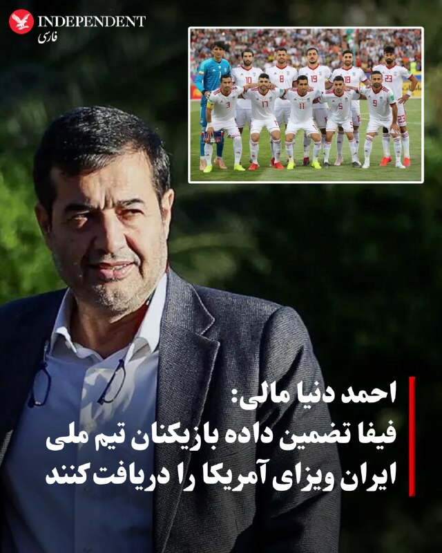

♦️احمد دنیا مالی: فیفا تضمین داده بازیکنان تیم ملی ایران ویزای آمریکا را دریافت کنند
احمد دنیامالی، وزیر ورزش و جوانان ایران روز دوشنبه اعلام کرد فیفا به تهران اطمینان داده همه بازیکنان تیم ملی فوتبال ایران برای حضور در جام جهانی ۲۰۲۶ ویزای آمریکا دریافت خواهند کرد.

وزیر ورزش ایران، به خبرگزاری ایسنا گفت: «رئیس فیفا به ما قول داده که همه بازیکنان ویزا دریافت کنند و دلیلی وجود ندارد که بازیکنان ما ویزا نگیرند.»
دنیامالی با تاکید بر آنکه کشورهای میزبان جام جهانی موظف‌اند برای همه تیم‌های شرکت‌کننده، از جمله بازیکنان و اعضای کادر فنی، ویزا صادر کنند، افزود تیم ملی ایران قرار است در مکزیک ویزاهای چندبار ورود آمریکا را دریافت کند.

رئیس‌جمهوری مکزیک، نیز روز دوشنبه گفت کشورش به تیم ملی فوتبال ایران اجازه خواهد داد در مکزیک مستقر شود.

تیم ملی فوتبال ایران اکنون در آنتالیای ترکیه اردو زده و برخی بازیکنان هفته گذشته برای ارائه درخواست ویزا به سفارت آمریکا در آنکارا مراجعه کرده‌اند. ایران در گروه هفتم جام جهانی با نیوزیلند، بلژیک و مصر هم‌گروه است.
‌🇸🇦 Indypersian

🤖 @VahidOOnLine

## VahidOOnLine — post 242148

  

♦️شبکه العربیه، روز دوشنبه چهارم خرداد ماه، به نقل از منابع آگاه به مذاکرات واشنگتن و تهران گزارش داد پیش‌نویس توافقنامه پایان جنگ میان دو کشور شامل تمدید آتش‌بس به مدت ۶۰ روز، با امکان تمدید دوباره، است و در آن بر بازگشایی تنگه هرمز بدون دریافت عوارض و پاکسازی مین‌ها تاکید دارد.

منابع العربیه افزودند این توافق امکان فروش و صادرات نفت ایران را فراهم می‌کند و ادامه مذاکرات هسته‌ای برای دستیابی به تفاهم‌های بلندمدت را نیز در بر می‌گیرد.

دونالد ترامپ، رئیس‌جمهوری آمریکا نیز روز دوشنبه در پیامی در شبکه اجتماعی تروث سوشال اعلام کرد مذاکرات با جمهوری اسلامی ایران «به‌خوبی» در حال پیشرفت است.
‌🇸🇦 Indypersian

🤖 @VahidOOnLine

## VahidOOnLine — post 242147

  

کلودیا شینباوم، رییس‌جمهوری مکزیک، دوشنبه اعلام کرد که دولت او موافقت کرده به تیم ملی فوتبال ایران اجازه دهد در طول رقابت‌های جام جهانی در مکزیک اقامت داشته باشد.

او افزود که ایالات متحده تمایلی به میزبانی این تیم نداشته است.

شینباوم گفت که فدراسیون بین‌المللی فوتبال (فیفا) پس از آن‌که آمریکا اعلام کرد نمی‌خواهد تیم ایران در طول مسابقات در خاک این کشور مستقر باشد، با دولت مکزیک تماس گرفته است.

ایران قرار است هر سه بازی مرحله گروهی خود را در آمریکا برگزار کند.

شینباوم در یک نشست خبری گفت: «ما هیچ دلیلی برای محروم کردن آنها از امکان اقامت در مکزیک نمی‌بینیم.»

کاخ سفید و وزارت خارجه آمریکا هنوز در این زمینه اظهار نظر نکرده‌اند.
‌🏁 🇬🇧 IranintlTV

🤖 @VahidOOnLine

## VahidOOnLine — post 242146

♦️دونالد ترامپ، رئیس‌جمهوری آمریکا، روز یکشنبه چهار خرداد ماه، به همراه جی‌دی ونس، معاون رئیس‌جمهوری، و پیت هگست، وزیر دفاع، برای ادای احترام به سربازان کشته‌شده ارتش آمریکا در مراسم «روز یادبود» در گورستان ملی آرلینگتون حضور یافتند.
«روز یادبود» (Memorial Day) یکی از مناسبت‌های رسمی آمریکا است که هر سال در آخرین دوشنبه ماه مه برگزار می‌شود و به یاد نظامیان آمریکایی کشته‌شده در جنگ‌ها و ماموریت‌های نظامی اختصاص دارد. در این روز، مقام‌های آمریکایی با حضور در گورستان‌های نظامی، به‌ویژه گورستان ملی آرلینگتون در نزدیکی واشنگتن، به سربازان کشته‌شده ادای احترام می‌کنند و پرچم‌ها در سراسر کشور به حالت نیمه‌افراشته درمی‌آید.
‌🇸🇦 Indypersian

🤖 @VahidOOnLine

## VahidOOnLine — post 242145

  

رضا باکری، دبیر انجمن صنایع لبنی ایران، اعلام کرد قیمت محصولات لبنی در یک سال گذشته چندین بار افزایش یافته و در مجموع حدود ۹۰ درصد گران شده است.

باکری افزود هفته گذشته دامداران، قیمت شیر خام را با ۲۹ درصد افزایش به کیلویی ۶۰ هزار و ۵۰۰ تومان رساندند.

دبیر انجمن صنایع لبنی ایران از افزایش قیمت چند محصول پرمصرف خبر داد و گفت: «قیمت شیر نایلونی به ۸۴ هزار تومان، شیر بطری به ۹۸ هزار تومان، پنیر یو‌اف ۴۰۰ گرمی به ۲۰۳ هزار تومان و ماست دبه‌ای دو کیلوگرمی به ۲۲۸ هزار و ۷۰۰ تومان رسیده است.»

سرانه مصرف شیر در ایران یک‌سوم میانگین جهانی است که تنها در یکی دو سال اخیر، ۳۰ درصد کاهش داشته است.
‌🏁 🇬🇧 IranintlTV

🤖 @VahidOOnLine

## VahidOOnLine — post 242144

  

♦️محمدباقر ذوالقدر، دبیر شورای عالی امنیت ملی ایران، روز دوشنبه چهارم خرداد ماه، در نخستین پیام پس از انتصاب به این سمت گفت «عقب‌نشینی در کار نخواهد بود».

ذوالقدر با ادعای آنکه مقاومت ایران در «میدان نظامی»، «میدان دیپلماسی» دشمن را «زمین‌گیر» کرده است، افزود اکنون بیش از هر زمان دیگری کشور به وحدت و انسجام نیاز دارد تا «آمریکایی‌ها و اسرائیلی‌ها» در این زمینه نیز ناامید شوند.

او تاکید کرد بیش از هر زمان دیگری به وحدت و انسجام نیاز داریم تا آمریکایی‌ها و اسرائیلی‌ها مایوس شوند.
‌🇸🇦 Indypersian

🤖 @VahidOOnLine

## VahidOOnLine — post 242143

  

علیرضا رحیمی، معاون امور جوانان وزارت ورزش و جوانان، در اختتامیه جشنواره «نسل امید» گفت: اگر واقعا به آینده ایران فکر می‌کنیم، باید به نهاد اصلی جامعه یعنی تشکیل خانواده بها بدهیم. فرزندآوری در این شرایط نوعی فداکاری و ایثار است و شاید بزرگ‌ترین ازخودگذشتگی برای آینده ایران محسوب شود.

وزارت ورزش و جوانان جمهوری اسلامی هدف از برگزاری این جشنواره را «توسعه کمی و کیفی آثار هنری در حوزه خانواده و جوانی جمعیت» عنوان کرده است.

جشنواره «نسل امید» با همکاری حوزه هنری سازمان تبلیغات اسلامی برگزار می‌شود.
‌🏁 🇬🇧 IranintlTV

🤖 @VahidOOnLine

## VahidOOnLine — post 242142

♦️اسماعیل بقایی، سخنگوی وزارت امور خارجه ایران،  روز دوشنبه چهارم خرداد ماه به خبرنگاران گفت جمهوری اسلامی در حال حاضر درباره «جزئیات هسته‌ای» با آمریکا مذاکره نخواهد کرد و «تمرکز یادداشت تفاهم ۱۴ بندی بر پایان جنگ است.»
بقایی در پاسخ به پرسشی درباره مذاکرات ۶۰ روزه گفت قرار است طی این بازه زمانی درباره برخی جزئیات یادداشت تفاهم و چند موضوع دیگر گفتگو شود و «یکی از موضوعات قاعدتا مرتبط با هسته‌ای است.»
این اظهارات در گرماگرم گمانه‌زنی‌ها درباره نهایی شدن توافق تهران و واشنگتن برای پایان جنگ مطرح می‌شود. موضوع اورانیوم‌های غنی شده ایران از مهمترین مجادلات دوطرف توصیف شده است.
دونالد ترامپ روز دوشنبه با انتشار متنی در تروث سوشال اعلام کرد، نتیجه مذاکرات یا «توافقی بزرگ برای همه» خواهد بود یا در غیر این صورت، منطقه به «میدان نبرد و تیراندازی» بازخواهد گشت؛ آن هم در ابعادی «بزرگ‌تر و قدرتمندتر از همیشه».
‌🇸🇦 Indypersian

🤖 @VahidOOnLine

## VahidOOnLine — post 242141

  

♦️پس از ابقای محمدباقر قالیباف در ریاست مجلس شورای اسلامی، مسعود پزشکیان، رئیس‌جمهوری و غلامحسین محسنی اژه‌ای، رئیس قوه قضائیه جمهوری اسلامی ایران، در پیام‌هایی جداگانه انتخاب مجدد او را تبریک گفتند.
مجلس شورای اسلامی روز دوشنبه چهارم خرداد نخستین جلسه علنی و حضوری خود را از زمان آغاز حملات اسرائیل و آمریکا در نهم اسفند سال گذشته برگزار کرد. در این جلسه، محمدباقر قالیباف، رئیس هیئت مذاکره‌کننده جمهوری اسلامی با آمریکا، برای یک سال دیگر به ریاست مجلس انتخاب شد.
پزشکیان در پیامی که خبرگزاری دولتی ایرنا منتشر کرد، نوشت اعتماد دوباره نمایندگان به قالیباف «حاصل سال‌ها مدیریت جهادی و حضور مستمر و موثر» او در عرصه‌های حساس خدمت به جمهوری اسلامی و ملت ایران است.
محسنی اژه‌ای نیز در پیامی در شبکه اجتماعی اکس، قالیباف را «مدیری جهادی و نستوه و میدان‌دیده» توصیف کرد و نوشت او در جنگ‌های ۱۲ روزه، جنگ اخیر و «پس از آن» در عرصه‌های «میدان» و «دیپلماسی» جهاد کرده است.
‌🇸🇦 Indypersian

🤖 @VahidOOnLine

## VahidOOnLine — post 242140

  

محمدباقر ذوالقدر، دبیر شورای عالی امنیت ملی، در پیامی با اشاره به «میدان نظامی، میدان دیپلماسی و مردم مبعوث‌شده حاضر در خیابان» نوشت: عقب‌نشینی در کار نخواهد بود.

او تاکید کرد: بیش از هر زمان دیگری به وحدت و انسجام نیاز داریم تا آمریکایی‌ها و اسرائیلی‌ها مایوس شوند.
‌🏁 🇬🇧 IranintlTV

🤖 @VahidOOnLine

## VahidOOnLine — post 242139

  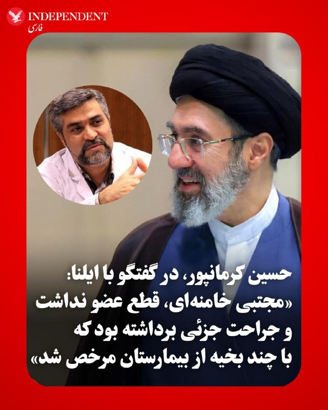

♦️حسین کرمانپور، رییس مرکز روابط عمومی وزارت بهداشت در مصاحبه‌ای که روز دوشنبه چهارم خرداد در ایلنا منتشر شد، درباره وضعیت مجتبی خامنه‌ای، سومین رهبر جمهوری اسلامی گفت او در جریان بمباران بیت رهبری فقط  بر صورت، سر و پاها دچار جراحت جزئی شده بود.

این مقام وزارت بهداشت دولت مسعود پزشکیان گفت: «استنباط ما این بود که کسی که زیر چنین بمبارانی باشد نباید بدن سالمی داشته باشد، اما به جز جراحت سطحی بر صورت، سر و پاها که منجر به هیچ قطع عضو و ناراحتی خاصی نشده بود، اتفاق خاصی نیفتاده بود و از دید من پزشک جزو مجروحیت‌های مهمی تلقی نمی‌شد و نیاز به اقدامات خاصی نداشت، جز یک الی دو بخیه که به ایشان زده شد. اگر اشتباه نکنم تا ساعت ۲ بامداد دهم اسفند [کمتر از ۲۴ ساعت پس از بمباران] هم ایشان مهمان ما بودند.»

کرمانپوربه ایلنا گفت: «همکارانم گفتند هرکاری کردیم ایشان روزه‌شان را باز کنند، نکردند و تا افطار ایشان روزه‌شان را نگه داشتند که این هم نشان از سلامت ایشان دارد که اگر مجروحیت زیاد بود نمی‌توانستند به حرف ما گوش ندهند. دوستان هم سخت‌گیری نکردند ایشان هم تا افطار ماندند؛ بخیه‌ها هم زده شد و ساعت ۲ بامداد دهم اسفند ترخیص شدند و به محلی که باید می‌رفتند؛ منتقل شدند.»

از زمان بمباران مجموعه موسوم به بیت رهبری در جریان نخستین موج حملات آمریکا و اسرائیل، هیچ صدا یا تصویری از مجتبی خامنه‌ای منتشر نشده است.
‌🇸🇦 Indypersian

🤖 @VahidOOnLine

## VahidOOnLine — post 242138

  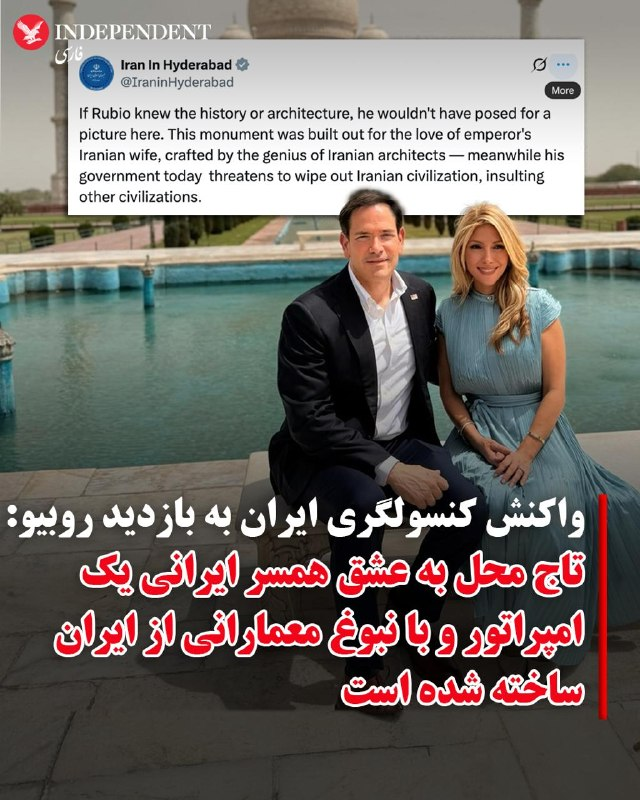

♦️حساب رسمی کنسولگری جمهوری اسلامی ایران در حیدرآباد هند، در واکنش به بازدید مارکو روبیو، وزیر امور خارجه آمریکا، از تاج محل، دولت آمریکا را به تهدید تمدن ایران متهم کرد.

مارکو روبیو روز دوشنبه چهارم خرداد به همراه همسرش ژانت دوسدبس از تاج محل، بنای مشهور شهر آگرا در هند، بازدید کرد و در برابر این اثر تاریخی عکس گرفت.
پس از انتشار تصاویر این بازدید، حساب رسمی کنسولگری ایران در حیدرآباد در شبکه اجتماعی اکس نوشت: «اگر روبیو تاریخ یا معماری را می‌شناخت، اینجا برای عکس گرفتن نمی‌ایستاد.»
کنسولگری ایران در حیدرآباد هند با یادآوری آنکه تاج محل «به عشق همسر ایرانی یک امپراتور» ساخته شده و حاصل «نبوغ معماران ایرانی» است، افزود دولت آمریکا امروز «تمدن ایران را تهدید به نابودی می‌کند و به دیگر تمدن‌ها توهین می‌کند.»
‌🇸🇦 Indypersian

🤖 @VahidOOnLine

## VahidOOnLine — post 242137

حساب رسمی کنسولگری جمهوری اسلامی ایران در حیدرآباد هند، در واکنش به بازدید مارکو روبیو، وزیر امور خارجه آمریکا، از تاج محل، دولت آمریکا را به تهدید تمدن ایران متهم کرد.

مارکو روبیو روز دوشنبه چهارم خرداد به همراه همسرش ژانت دوسدبس از تاج محل، بنای مشهور شهر آگرا در هند، بازدید کرد و در برابر این اثر تاریخی عکس گرفت.
پس از انتشار تصاویر این بازدید، حساب رسمی کنسولگری ایران در حیدرآباد در شبکه اجتماعی اکس نوشت: «اگر روبیو تاریخ یا معماری را می‌شناخت، اینجا برای عکس گرفتن نمی‌ایستاد.»
کنسولگری ایران در حیدرآباد هند با یادآوری آنکه تاج محل «به عشق همسر ایرانی یک امپراتور» ساخته شده و حاصل «نبوغ معماران ایرانی» است، افزود دولت آمریکا امروز «تمدن ایران را تهدید به نابودی می‌کند و به دیگر تمدن‌ها توهین می‌کند.»
‌🇸🇦 Indypersian

🤖 @VahidOOnLine

## VahidOOnLine — post 242136

  

الحدث به نقل از منابع آگاه گزارش داد جمهوری اسلامی شرط انتقال اورانیوم با غنای بالا به چین را مطرح کرده است.

بر اساس این گزارش، تهران آمادگی دارد اورانیوم با غنای بالای خود را از کشور خارج کند، اما پیش از نهایی شدن هرگونه توافق با واشینگتن، به دنبال دریافت تضمین‌هایی از چین است.

الحدث همچنین اعلام کرد احتمال دارد فرمانده ارتش پاکستان به دوحه سفر کند.
‌🏁 🇬🇧 IranintlTV

🤖 @VahidOOnLine

## WithYashar — post 12446

  <a href="telegram/content/WithYashar_12446_1779730217.mp4" target="_blank">🎬 Download video</a>

دونالد ترامپ: "در دو جنگ اخیر، مجموعاً ۱۳ تن از نیروهای نظامی خود را از دست داده‌ایم... در عملیات «خشم حماسی»، ۱۳ جان فوق‌العاده را از دست دادیم."
@withyashar

## WithYashar — post 12445

شبکه ۱۲ تلویزیون اسرائیل به نقل از منابع آگاه گزارش داد که «استیو ویتکاف» و «جرد کوشنر» به منظور بحث و تبادل نظر درباره توافق احتمالی میان واشنگتن و تهران به اسرائیل سفر خواهند کرد.
@withyashar

## WithYashar — post 12444

طبق خبرهای رسیده به خبرنگار هم‌میهن رئیس‌جمهور زرشکیان دستور بازگشایی اینترنت بین‌الملل را ابلاغ کرد.
@withyashar

## WithYashar — post 12443

ترامپ برای بار دو میلیون و چهارصدو شصت و هشتم : ایران هیچوقت سلاح هسته ای نخواهد داشت.
@withyashar

## WithYashar — post 12442

منابع العربیه: نسخه نهایی پیش‌نویس یادداشت تفاهم آمریکا و ایران شامل تجدید قابل‌تمدید آتش‌بس 60 روزه، باز کردن تنگه هرمز بدون اخذ عوارض و پاکسازی مین‌ها و برداشتن موانع دریایی از این آبراه بین‌المللی مقابل تجارت جهانی، برداشتن برخی محدودیت‌ها از بنادر ایران و دادن معافیت‌‌هایی از تحریم‌ها و فراهم کردن امکان ازسرگیری فروش و صادرات نفت ایران و همچنین ادامه مذاکرات درباره برنامه هسته‌ای ایران در دوره تنش‌زدایی میان دو طرف، می‌شود.
@withyashar

## WithYashar — post 12441

ادعای الحدث به نقل از منابع: ایران آماده‌ست تا اورانیوم با غنای بالا رو به چین انتقال بده ! @withyashar

## WithYashar — post 12440

طبق گزارش تایید نشده از شاهدان عینی که به دستمان رسیده است از وقوع یک درگیری نامشخص در محدوده میدان انقلاب تهران در ساعتی قبل خبر می‌دهند.

بر اساس این ادعاها، گفته می‌شود منطقه تحت کنترل نیروهای امنیتی قرار گرفته و رفت‌وآمد در برخی مسیرها محدود شده است.

همچنین طبق گفته شاهدان عینی تعداد زیادی جنازه که از ظواهر آنها مشخص بود نیروهای حشد الشعبی بوده اند روی زمین ریخته بود

به محض وصول هر گونه اخبار تکمیلی به اطلاع شما عزیزان خواهد رسید ‌
@withyashar

## WithYashar — post 12439

نورالدین الدغیر، خبرنگار الجزیره در تهران:
به نظر می‌رسد گره مذاکرات ایران و آمریکا در حال باز شدن است و ابتکار قطر نقش اساسی در حل اختلافات داشته است.

به گفته او، دوحه یک میانجی واقعی بوده، نه فقط کمکی در میانجی‌گری.
@withyashar

## WithYashar — post 12438

العربیه: پیش‌نویس توافق میان آمریکا و ایران، برقراری آتش‌بس جامع در تمامی جبهه‌ها، از جمله لبنان را تضمین می‌کند.
@withyashar

## WithYashar — post 12437

ادعای الحدث به نقل از منابع: ایران آماده‌ست تا اورانیوم با غنای بالا رو به چین انتقال بده !
@withyashar

## WithYashar — post 12436

## WithYashar — post 12435

  <a href="telegram/content/WithYashar_12435_1779730219.mp4" target="_blank">🎬 Download video</a>

🎬 Video

## WithYashar — post 12433

ترامپ با مسخره کردن اوباما و بایدن عکسهایی منتشر کرد که آنها به ایران پول میدهند و مذاکره میکنند، ولی او آنها را منهدم میکند.
@withyashar

## mwarmonitor — post 9702

🔴جزئیات جدیدی درباره دشواری‌های مذاکرات آمریکا و ایران در حال منتشر شدن است:

🔹در حال حاضر، ایران فقط حاضر است متعهد شود که به سمت ساخت سلاح هسته‌ای نرود، در حالی که آمریکا بر اقدامات مشخص برای کاهش اورانیوم غنی‌شده تأکید دارد—از جمله فروش آن، انتقال به خارج از کشور یا رقیق‌سازی آن.

🔸یکی از نقاط اصلی اختلاف، تنگه هرمز است: ایران خواهان مدیریت آن توسط خود است، در حالی که آمریکا بر آزادی کامل کشتیرانی تأکید دارد.

🔸همچنین هنوز توافقی درباره تسهیلات مالی وجود ندارد. قطر پیشنهادی برای ارائه یک وام بشردوستانه ۱۲ میلیارد دلاری به ایران مطرح کرده است.

📌نکته قابل توجه این است که لبنان نیز اکنون بخشی از چارچوب گسترده‌تر در حال بررسی شده است. آمیت سیگال خبرنگار کانال ۱۲ اسرائیل

@mwarmonitor

## mwarmonitor — post 9701

🔴موضع ایران درباره خارج کردن اورانیوم با غنای بالا دستخوش تغییر شده است. بر اساس گزارش‌ها، ایران حاضر است اورانیوم با غنای بالا (HEU) خود را از کشور خارج کند، اما تنها به مقصد چین. همچنین ایران به دنبال دریافت تضمین حمایت از پکن در ازای هرگونه توافق نهایی با واشنگتن است. این موضوع به نقل از منابع ناشناس توسط شبکه «الحدث» گزارش شده است.

🔸مقام‌های ایرانی طی روزهای اخیر اعلام کرده‌اند ـ برخلاف مواضع قبلی ـ که از سوی رهبر جمهوری اسلامی دستور گرفته‌اند اورانیوم نزدیک به سطح تسلیحاتی را در داخل کشور نگه دارند. هرچند این دو روایت به‌طور کامل نمی‌توانند همزمان درست باشند، اما همین اختلاف نشان می‌دهد که روایت خبر از واقعیت اختلاف‌نظر درون ساختار تصمیم‌گیری ایران ناشی می‌شود. موضوع «سرنوشت اورانیوم» همچنان در داخل سیستم ایران حل‌نشده باقی مانده است، نه فقط در سطح مذاکرات ایران و آمریکا.

🔹در حالی که گفته می‌شود آمادگی چین برای دریافت این ذخیره اورانیوم (یا رقیق‌سازی آن به سطح پایین‌تر) حدود ۴۴۰ کیلوگرم با غنای ۶۰ درصد است و از چند هفته قبل مطرح بوده، تغییر جدید این است که ایران ظاهراً پذیرفتن انتقال این ذخیره به چین را به‌عنوان تنها گزینه قابل قبول خود مطرح کرده است؛ نه یکی از چند گزینه.

🔸منابع رسمی دو کشور هنوز به این خبر واکنشی نشان نداده‌اند.

@mwarmonitor

## FoxNewsTwitter — post 342233

  <a href="telegram/content/FoxNewsTwitter_342233_1779730220.mp4" target="_blank">🎬 Download video</a>

Fox News (Twitter/X)

BREAKING: President Trump pays tribute to the 13 American service members killed during recent military operations.

“We lost 13 wonderful souls... These incredible men and women gave their lives to ensure that the world's number one state sponsor of terror will never have a nuclear weapon," Trump said before recognizing the family of Major Ariana Savanah Saville during the Memorial Day event.

"Ariana's selfless gift will not be in vain. Our debt to you is everlasting, and it's always going to end in victory."

## FoxNewsTwitter — post 342232

  <a href="telegram/content/FoxNewsTwitter_342232_1779730222.mp4" target="_blank">🎬 Download video</a>

Fox News (Twitter/X)

HAPPENING NOW: President Trump honors America’s fallen military members on Memorial Day while looking ahead to the nation’s 250th anniversary, saying the country must first remember the sacrifices that made its freedoms possible.

“Before we celebrate the triumph, we pay the tribute.”

"We owe our liberty, our self-government, the glories of our history, and our very nation itself to the generations who paid for it with everything they had the ultimate sacrifice."

## FoxNewsTwitter — post 342231

  <a href="telegram/content/FoxNewsTwitter_342231_1779730224.mp4" target="_blank">🎬 Download video</a>

Fox News (Twitter/X)

BREAKING: President Trump honors the fallen and Gold Star families in his Memorial Day address at Arlington National Cemetery:

"We honor those who fell so that our Republic might stand, those who died so that our nation could live, those who gave up their sacred light on earth, so that the sublime light of American freedom would shine for ever and ever. This Memorial Day, we salute them, we exalt them, and we thank them for all that we have and for all that they gave. They gave everything. God bless our fallen heroes."

## FoxNewsTwitter — post 342230

  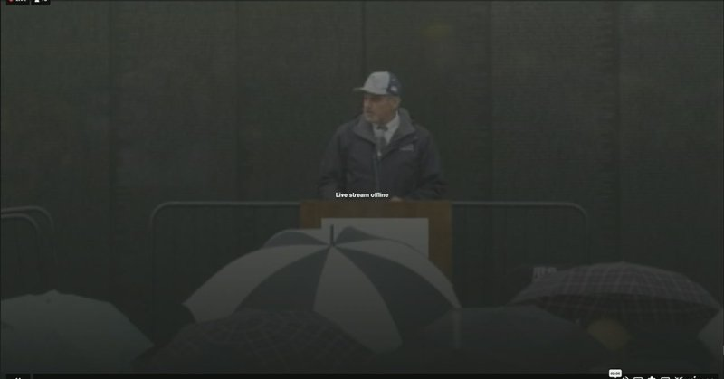

Fox News (Twitter/X)

WATCH LIVE: Memorial Day tribute remembers America’s fallen at the Vietnam Veterans Memorial https://twitter.com/i/broadcasts/1mxPaaagbLqKN

## FoxNewsTwitter — post 342229

  <a href="telegram/content/FoxNewsTwitter_342229_1779730226.mp4" target="_blank">🎬 Download video</a>

Fox News (Twitter/X)

JUST IN: Vice President JD Vance delivers a powerful Memorial Day message, calling on Americans to live as the "very best version" of themselves to honor the ultimate sacrifice of the nation's fallen heroes.

Vance reminded the nation that every cherished moment with loved ones was paid for by total strangers who laid down their lives to protect American freedom.

"On this Memorial Day, I just ask two things of all of our fellow Americans. The first is that we be the very best version of ourselves in honor of those who gave everything that this nation might be worthy"

"And that second, we always remember that every moment that we're able to enjoy with our loved ones, everything that gives our life and our nation meaning and purpose was given to us, often by total strangers who laid down their lives that this might be the best nation in the history of the world."

## FoxNewsTwitter — post 342228

  <a href="telegram/content/FoxNewsTwitter_342228_1779730227.mp4" target="_blank">🎬 Download video</a>

Fox News (Twitter/X)

NOW: VP Vance pays tribute to America's fallen heroes:

"Today is for those veterans who put on the uniform, who went overseas and who never came home."

"When I think about the debt that we owe them, I think about all the things that they gave, which can't be measured in dollars or in the things of this world..."

"They traded every moment from the moment where they gave their lives to the moment where they would ultimately meet their natural end. Every single one of those moments, they gave up that the United States might remain the freest and best country in the entire world."

## FoxNewsTwitter — post 342227

  <a href="telegram/content/FoxNewsTwitter_342227_1779730229.mp4" target="_blank">🎬 Download video</a>

Fox News (Twitter/X)

NOW: Army Chaplain Lt. Col. Kevin Trimble delivers a powerful Memorial Day prayer at Arlington National Cemetery honoring America’s fallen heroes:

"May we cherish the freedoms they have preserved, defend the justice they have sought and extend compassion they carried in their hearts. Comfort the families who still feel the ache of absence. May they know their loved ones are not forgotten, that their names are spoken with reverence, and their legacy lives on in the soul of our nation."

"As we stand among the markers of the fallen, may we be reminded that liberty is never free. It is fought and paid for, in courage, in service and in love. God, we pray for peace that one day swords may be beaten into plowshares. And no mother need weep for a child lost to war until that day. Give us strength to be faithful stewards of the freedom entrusted to us. In your holy name we remember, we honor, and we render thanksgiving. Amen."

## FoxNewsTwitter — post 342226

  <a href="telegram/content/FoxNewsTwitter_342226_1779730231.mp4" target="_blank">🎬 Download video</a>

Fox News (Twitter/X)

NEW: General Dan Caine honors America's fallen heroes, praising the unbroken line of courage from Valley Forge to recent military action like Operation Epic Fury.

"Across the centuries, the character, courage, and commitment of the American warfighter has never wavered. And it never will.”

“It's that same war fighting spirit we recently saw in Operation Epic Fury, and we remember and honor those who made the ultimate sacrifice, adding their names to the story of American heroism."

## FoxNewsTwitter — post 342225

  <a href="telegram/content/FoxNewsTwitter_342225_1779730233.mp4" target="_blank">🎬 Download video</a>

Fox News (Twitter/X)

WATCH: The U.S. Army Band 'Pershing's Own' plays the Star Spangled Banner in a Memorial Day tribute at Arlington National Cemetery.

## FoxNewsTwitter — post 342224

  <a href="telegram/content/FoxNewsTwitter_342224_1779730235.mp4" target="_blank">🎬 Download video</a>

Fox News (Twitter/X)

WATCH: The Battle Hymn of the Republic echoes through Arlington National Cemetery as the nation honors its fallen heroes on Memorial Day.

## FoxNewsTwitter — post 342223

  

Fox News (Twitter/X)

WATCH LIVE: Navy Memorial hosts solemn wreath laying ceremony https://twitter.com/i/broadcasts/1AxRnnnrRzkxl

## FoxNewsTwitter — post 342222

  <a href="telegram/content/FoxNewsTwitter_342222_1779730237.mp4" target="_blank">🎬 Download video</a>

Fox News (Twitter/X)

JUST NOW: President Trump lays a wreath at the Tomb of the Unknown Soldier as part of Memorial Day observance at Arlington National Cemetery.

## FoxNewsTwitter — post 342221

Fox News (Twitter/X)

NOW: President Trump, Vice President JD Vance, and Secretary of War Pete Hegseth arrive at Arlington National Cemetery to honor fallen troops on Memorial Day.

## FoxNewsTwitter — post 342220

  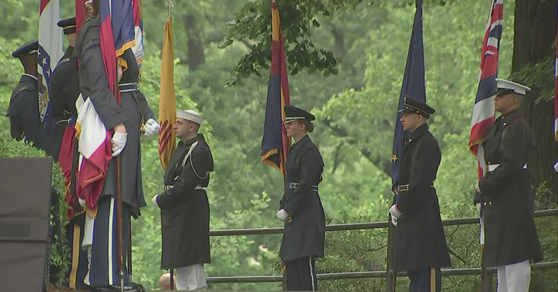

Fox News (Twitter/X)

WATCH LIVE: President Trump honors fallen troops at Arlington National Cemetery https://twitter.com/i/broadcasts/1qKDzzzpewEJV

## FoxNewsTwitter — post 342219

  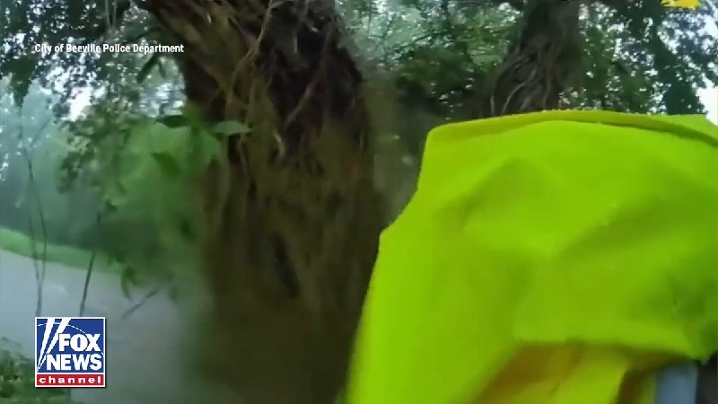

Fox News (Twitter/X)

Dramatic video shows first responders in Texas rescuing a baby from a car trapped in raging floodwaters.

Officers say the child was inside the stranded vehicle as water levels quickly rose around the scene during severe storms in the region.

At one point, officers can be seen fighting the current while trying to safely reach the car before conditions got even worse.

According to police, nobody was hurt during the operation.

## FoxNewsTwitter — post 342218

Fox News (Twitter/X)

BREAKING: Orange County Fire Authority officials announce that the threat of a vapor explosion has been eliminated after crews confirmed the cracked chemical tank’s pressure has been released and temperatures have dropped from 100 to 93 degrees.

Although conditions have improved significantly, officials are emphasizing that evacuation zones remain in effect and ask residents to continue following evacuation orders.

## pm_afshaa — post 91469

روزنامه هم‌میهن: رئیس‌جمهور دستور بازگشایی اینترنت بین‌الملل را ابلاغ کرد

💧 Rainbet.com the #1 Non-KYC Crypto Casino & Sportsbook @rainbetcom

😁 @Pm_Afshaa

## pm_afshaa — post 91468

🔴منابع آگاه به العربیه: ایران در مذاکرات شرط کرده اورانیوم غنی‌ شده با درصد بالا فقط به چین منتقل شود

💧 Rainbet.com the #1 Non-KYC Crypto Casino & Sportsbook @rainbetcom

😁 @Pm_Afshaa

## DEJradio — post 4952

  <a href="telegram/content/DEJradio_4952_1779730240.webm" target="_blank">🎬 Download video</a>

🔺📢 الحدث به نقل از منابع آگاه گزارش داد جمهوری اسلامی شرط انتقال اورانیوم با غنای بالا به چین را مطرح کرده است.
در این گزارش آمده، ایران آمادگی دارد اورانیوم با غنای بالای خود را از کشور خارج کند، اما پیش از نهایی شدن هرگونه توافق با آمریکا، به دنبال دریافت تضمین‌هایی از چین است.
پیش از این ولادیمیر پوتین نیز پیشنهاد داده بود اورانیوم‌های جمهوری اسلامی به روسیه منتقل شود.

#اورانیوم #چین #جمهوری_اسلامی
@DEJradio

## VahidOnline — post 75709

  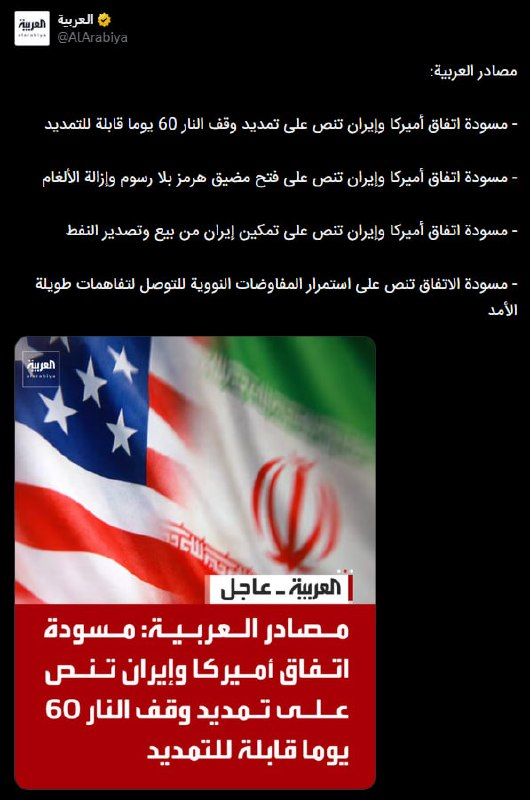

العربیه به نقل از منابع آگاه گزارش داد پیش‌نویس یک یادداشت تفاهم اولیه و نهایی میان آمریکا و جمهوری اسلامی در حال بررسی است؛ تفاهمی که شامل بازگشایی تنگه هرمز، تمدید آتش‌بس و کاهش برخی محدودیت‌ها علیه ایران می‌شود.

بر اساس گزارش العربیه، در پیش‌نویس این تفاهم‌نامه آمده است تنگه هرمز بدون دریافت هزینه از کشتی‌ها بازگشایی خواهد شد و عملیات پاکسازی مین‌ها نیز انجام می‌شود.

این گزارش همچنین می‌گوید در چارچوب این تفاهم، به جمهوری اسلامی اجازه فروش و صادرات نفت داده خواهد شد.

العربیه افزود پیش‌نویس توافق شامل تمدید ۶۰ روزه آتش‌بس است و امکان تمدید دوباره آن نیز وجود دارد.

بر اساس این گزارش، آمریکا همچنین متعهد شده محدودیت‌ها علیه بنادر جنوب ایران را کاهش دهد.

منابع العربیه گفته‌اند بخشی از دارایی‌های مسدودشده ایران نیز بر اساس سازوکاری مشخص آزاد خواهد شد.
@VahidOOnLine

📡 @VahidOnline

## VahidOnline — post 75707

محمدباقر ذوالقدر، دبیر شورای عالی امنیت ملی، در پیامی با اشاره به «میدان نظامی، میدان دیپلماسی و مردم مبعوث‌شده حاضر در خیابان» نوشت: عقب‌نشینی در کار نخواهد بود.
او تاکید کرد: بیش از هر زمان دیگری به وحدت و انسجام نیاز داریم تا آمریکایی‌ها و اسرائیلی‌ها مایوس شوند.
@VahidOOnLine

📡 @VahidOnline

## VahidOnline — post 75705

تصاویری که ترامپ از اکانت بقیه بازنشر کرده.
realDonaldTrump

📡 @VahidOnline

## kianmeli1 — post 87662

🔴طبق ادعای خبرنگار هم‌میهن, پزشکیان دستور بازگشایی اینترنت بین‌الملل را ابلاغ کرد.
https://t.me/kianmeli1

## kianmeli1 — post 87661

  

🔴قالیباف و عراقچی در دوحه
ایران می‌گوید هیچ عوارضی برای تنگه هرمز وجود ندارد، اما شاید «هزینه زیست‌محیطی» داشته باشد

ایران به دنبال تضمین‌های چین است، ممکن است اورانیوم را به آنجا منتقل کند: عربستان
ترامپ این توافق را به توافق آبراهام مرتبط دانست
عربستان توافق آبراهام را به مسیر برگشت‌ناپذیر برای تشکیل کشور فلسطین مرتبط دانست

به نظر می‌رسد پیوند توافق‌نامه ابراهیم ناشی از تمایل به خروج آبرومندانه ترامپ و پیروزی ژئوپلیتیکی برای اسرائیل باشد، اما بعید است که این امر محقق شود. ترامپ می‌تواند روی کاغذ تعهدی از عربستان سعودی برای عادی‌سازی نهایی روابط به دست آورد، اما این پادشاهی در طول سال گذشته از این هدف فاصله گرفته و به ترکیه/قطر/پاکستان نزدیک‌تر شده است.

در حال حاضر، تمرکز هرگونه توافق اولیه بر حقوق ترانزیت هرمز و انتقال اورانیوم غنی‌شده با غنای بالا متمرکز است. چین به عنوان ضامن از دیدگاه ایران منطقی است، اما هنوز مشخص نیست که آیا پکن این نقش را خواهد پذیرفت و تا این حد در منطقه خاورمیانه نفوذ خواهد کرد یا خیر.
https://t.me/kianmeli1

## kianmeli1 — post 87660

‏🔴العربیه به نقل از منابع آگاه اعلام کرد پیش‌نویس یک یادداشت تفاهم اولیه و نهایی میان واشینگتن و تهران در حال بررسی است. این پیش‌نویس شامل بازگشایی تنگه هرمز بدون دریافت هزینه و همچنین پاکسازی مین‌ها است. در این پیش‌نویس همچنین به ایران اجازه فروش و صادرات نفت داده خواهد شد

‏در بخش دیگری از این پیش‌نویس آمده است که آتش‌بس به مدت ۶۰ روز تمدید خواهد شد و امکان تمدید دوباره آن نیز وجود دارد. همچنین آمریکا متعهد شده محدودیت‌ها بر بنادر جنوب ایران را کاهش دهد

‏بر اساس گزارش العربیه، بخشی از دارایی‌های مسدودشده ایران بر اساس سازوکاری مشخص آزاد خواهد شد
https://t.me/kianmeli1

## IranIntlTV — post 338959

  

خبرگزاری تسنیم، وابسته به سپاه پاسداران، نوشت که اخبار منتشرشده از سوی شبکه الحدث مبنی بر اعلام آمادگی جمهوری اسلامی برای خروج مواد هسته‌ای «کذب» است و در متن تفاهم‌نامه‌ای که تا امروز وجود دارد، هیچ جمله‌ای مبنی بر اعلام آمادگی برای خروج مواد هسته‌ای وجود ندارد.
https://iranintl.com/202605255310

## IranIntlTV — post 338958

  

دونالد ترامپ، رییس‌جمهوری آمریکا، در شبکه اجتماعی تروث‌سوشال با انتشار تصویری که با هوش مصنوعی ساخته شده، دوره اوباما و بایدن را با دوران ریاست‌جمهوری خود در مذاکرات با جمهوری اسلامی مقایسه کرد

او نوشت در دولت‌های پیشین، روسای‌جمهور آمریکا خواهان مذاکره بودند و تهران تهدید به اقدام نظامی می‌کرد، اما این بار او جمهوری اسلامی را تهدید کرد و آن‌ها به مذاکره تن دادند.

ترامپ همچنین با انتشار تصویری ساخته‌شده با هوش مصنوعی از باراک اوباما در کنار یک پالت پر از پول، نوشت سیاست‌های اوباما در قبال جمهوری اسلامی باعث وقوع جنگ شده است.
https://iranintl.com/202605251179

## IranIntlTV — post 338957

  <a href="telegram/content/IranIntlTV_338957_1779730242.mp4" target="_blank">🎬 Download video</a>

ویدیوهای دریافتی نشان می‌دهد روز یک‌شنبه سوم خرداد، جمعی از ایرانیان ساکن شهر رجاینا در ساسکاچوان کانادا، در حمایت از مردم ایران، زنجیره انسانی بر روی پلی تشکیل دادند. آن‌ها با در دست گرفتن نوشته‌هایی علیه اعدام‌های جمهوری اسلامی و قطعی اینترنت، تجمع اعتراضی برگزار کردند.
@iranintltv

## IranIntlTV — post 338956

  <a href="telegram/content/IranIntlTV_338956_1779730243.mp4" target="_blank">🎬 Download video</a>

همزمان با ادامه مذاکرات میان تهران و واشینگتن و انتشار گزارش‌هایی درباره توافق احتمالی، انتقادها در آمریکا و اسرائیل ادامه دارد. منتقدان می‌گویند جزییات منتشرشده از متن توافق می‌تواند منافع ملی آمریکا و اسرائیل را به خطر بیندازد.

گفت‌وگو با آرش آرامش، حقوقدان و کارشناس امنیت ملی
@iranintltv

## IranIntlTV — post 338955

  

🔻خبرگزاری تسنیم گزارش داده که هیات رییسه فدراسیون فوتبال مصوب کرده پاداشی معادل ۲۵۰ میلیارد تومان به اعضای تیم ملی شامل بازیکنان، مربیان و سایر اعضا بابت صعود به جام جهانی ۲۰۲۶ اختصاص دهد. این خبرگزاری نوشته این پاداش از محل مطالبات فدراسیون فوتبال در فیفا تامین می‌شود.

🔹در چهار سال گذشته، پاداش به تیم ملی بابت صعود به جام جهانی ۲۰۲۲، یک پرونده بی‌سرانجام در فوتبل ایران بود؛ پیگیری‌های رسانه‌ای درباره حواله‌های میلیاردی خودرو به بازیکنان تیم ملی و پاداش چند ۱۰ هزار دلاری به هیات رییسه فدراسیون، هیچ‌گاه به پاسخ روشنی نرسید.

@iranintltvsport

## IranIntlTV — post 338954

  <a href="telegram/content/IranIntlTV_338954_1779730245.mp4" target="_blank">🎬 Download video</a>

دونالد ترامپ، رییس‌جمهوری آمریکا، گفت مذاکرات با جمهوری اسلامی به‌خوبی پیش می‌رود و تاکید کرد توافق احتمالی یا یک معامله بزرگ برای همه خواهد بود یا هیچ معامله‌ای در کار نخواهد بود. او همچنین از کشورهای منطقه، از جمله ایران، خواست فورا به پیمان ابراهیم بپیوندند و روابط خود را با اسرائیل عادی‌سازی کنند.

گفت‌وگو با سمیرا قرایی و بابک اسحاقی، خبرنگاران ایران‌اینترنشنال و مسعود کاظمی، روزنامه‌نگار
@iranintltv

## IranIntlTV — post 338953

  

العربیه به نقل از منابع آگاه گزارش داد پیش‌نویس یک توافق میان واشینگتن و تهران در حال بررسی است. بر اساس این پیش‌نویس، تنگه هرمز بدون دریافت عوارض بازگشایی و مین‌های دریایی پاکسازی می‌شود و به ایران اجازه فروش و صادرات نفت داده خواهد شد.

در این پیش‌نویس دوره‌ای ۳۰ روزه برای ازسرگیری کامل کشتیرانی در تنگه هرمز در نظر گرفته شده و همچنین یک بازه ۶۰ روزه برای مذاکرات هسته‌ای تعیین شده است.

بر اساس این گزارش، آتش‌بس در همه جبهه‌ها از جمله لبنان برقرار خواهد ماند و برای ۶۰ روز تمدید می‌شود و امکان تمدید دوباره آن نیز وجود دارد. آمریکا نیز متعهد شده محدودیت‌ها بر بنادر جنوب ایران را کاهش دهد و بخشی از دارایی‌های مسدودشده ایران بر اساس سازوکاری مشخص آزاد شود.
https://iranintl.com/202605252770

## IranIntlTV — post 338952

  

کلودیا شینباوم، رییس‌جمهوری مکزیک، دوشنبه اعلام کرد که دولت او موافقت کرده به تیم ملی فوتبال ایران اجازه دهد در طول رقابت‌های جام جهانی در مکزیک اقامت داشته باشد.

او افزود که ایالات متحده تمایلی به میزبانی این تیم نداشته است.

شینباوم گفت که فدراسیون بین‌المللی فوتبال (فیفا) پس از آن‌که آمریکا اعلام کرد نمی‌خواهد تیم ایران در طول مسابقات در خاک این کشور مستقر باشد، با دولت مکزیک تماس گرفته است.

ایران قرار است هر سه بازی مرحله گروهی خود را در آمریکا برگزار کند.

شینباوم در یک نشست خبری گفت: «ما هیچ دلیلی برای محروم کردن آنها از امکان اقامت در مکزیک نمی‌بینیم.»

کاخ سفید و وزارت خارجه آمریکا هنوز در این زمینه اظهار نظر نکرده‌اند.
https://iranintl.com/202605252544

## IranIntlTV — post 338951

  <a href="telegram/content/IranIntlTV_338951_1779730248.mp4" target="_blank">🎬 Download video</a>

🔻هدایت ممبینی، دبیرکل فدراسیون فوتبال ایران گفته آمریکا برای اعضای تیم ملی فوتبال ویزای مولتی صادر خواهد کرد. این درحالی است که به طور معمول، ایالات متحده برای دارندگان پاسپورت ایرانی ویزای مولتی صادر نمی‌کند.

🔹توضیحات امیر گیتی، عضو تحریریه ایران اینترنشنال

@iranintltvsport

## IranIntlTV — post 338950

  

«برنامه» بعد از یک هفته، امشب روی آنتن برمی‌گردد و یک «تریبون آزاد» دیگر را برای شما میزبانی خواهد کرد.
اگر فقط یک جمله فرصت داشتید با ایران حرف بزنید، چه می‌گفتید؟
چه چیزی هنوز دلتان را گرم نگه می‌دارد؟
نگرانی‌تان چیست؟
از چه چیزی عصبانی هستید؟
حرفی دارید که در دلتان مانده و جایی برای گفتنش نبوده است؟
از خودتان بگویید؛ از امیدها و ترس‌هایتان، از رؤیایی که هنوز زنده است یا از چیزی که از دست رفته است.
تاریخ با صدای شما نوشته می‌شود.
برای شرکت در «برنامه»، همین حالا در واتس‌اپ پیام بدهید:
۰۰۴۴۷۵۲۲۱۱۰۱۱۰
۰۰۴۴۷۵۴۴۱۱۰۱۱۰
۰۰۴۴۷۵۱۱۱۰۲۵۵۳
«برنامه با کامبیز حسینی»
«یک ایران، صدای شما را می‌شنود»
@iranintltv

## IranIntlTV — post 338949

  

رضا باکری، دبیر انجمن صنایع لبنی ایران، اعلام کرد قیمت محصولات لبنی در یک سال گذشته چندین بار افزایش یافته و در مجموع حدود ۹۰ درصد گران شده است.

باکری افزود هفته گذشته دامداران، قیمت شیر خام را با ۲۹ درصد افزایش به کیلویی ۶۰ هزار و ۵۰۰ تومان رساندند.

دبیر انجمن صنایع لبنی ایران از افزایش قیمت چند محصول پرمصرف خبر داد و گفت: «قیمت شیر نایلونی به ۸۴ هزار تومان، شیر بطری به ۹۸ هزار تومان، پنیر یو‌اف ۴۰۰ گرمی به ۲۰۳ هزار تومان و ماست دبه‌ای دو کیلوگرمی به ۲۲۸ هزار و ۷۰۰ تومان رسیده است.»

سرانه مصرف شیر در ایران یک‌سوم میانگین جهانی است که تنها در یکی دو سال اخیر، ۳۰ درصد کاهش داشته است.
https://iranintl.com/202605252813

## IranIntlTV — post 338948

  <a href="telegram/content/IranIntlTV_338948_1779730250.mp4" target="_blank">🎬 Download video</a>

در حالی که دونالد ترامپ، رییس‌جمهوری آمریکا، نسبت به پیشرفت در مذاکرات با جمهوری اسلامی ابراز امیدواری کرده است، گمانه‌زنی‌ها و ابهامات زیادی درباره احتمال دستیابی به توافق مطرح است.

حسین آقایی، عضو تحریریه ایران‌اینترنشنال، در «پیوست» امروز نگاهی تحلیلی به امکان دستیابی به توافق و دوراهی جنگ و مذاکره برای وادار کردن جمهوری اسلامی به پذیرش شروط دارد
@iranintltv

## IranIntlTV — post 338947

  

علیرضا رحیمی، معاون امور جوانان وزارت ورزش و جوانان، در اختتامیه جشنواره «نسل امید» گفت: اگر واقعا به آینده ایران فکر می‌کنیم، باید به نهاد اصلی جامعه یعنی تشکیل خانواده بها بدهیم. فرزندآوری در این شرایط نوعی فداکاری و ایثار است و شاید بزرگ‌ترین ازخودگذشتگی برای آینده ایران محسوب شود.

وزارت ورزش و جوانان جمهوری اسلامی هدف از برگزاری این جشنواره را «توسعه کمی و کیفی آثار هنری در حوزه خانواده و جوانی جمعیت» عنوان کرده است.

جشنواره «نسل امید» با همکاری حوزه هنری سازمان تبلیغات اسلامی برگزار می‌شود.
https://iranintl.com/202605258379

## IranIntlTV — post 338946

  <a href="telegram/content/IranIntlTV_338946_1779730253.mp4" target="_blank">🎬 Download video</a>

تیتر اول با نیوشا صارمی، دوشنبه ۴ خرداد
@iranintltv

## IranIntlTV — post 338945

  <a href="telegram/content/IranIntlTV_338945_1779730254.mp4" target="_blank">🎬 Download video</a>

تیتر اول با نیوشا صارمی، دوشنبه ۴ خرداد
@iranintltv

## IranIntlTV — post 338944

🔻شکایت از فیفا به دلیل ممنوعیت پرچم شیر و خورشید در جام جهانی ۲۰۲۶

نیویورک تایمز گزارش داده که فیفا از سوی یک گروه غیرانتفاعی در آمریکا به دلیل ممنوعیت پرچم شیر و خورشید در جام جهانی ۲۰۲۶، تهدید به اقدام حقوقی و قضایی شده است؛ این نهاد غیرانتفاعی خواستار آن شده که برگزارکننده جام جهانی ممنوعیت نمایش پرچم پیش از انقلاب اسلامی را لغو کند.

«مؤسسه صداهای آزادی» نامه‌ای حاوی نگرانی‌های خود را از طریق شاهرخ مختارزاده، مشاور حقوقی‌اش، برای فیفا ارسال کرده است.

مختارزاده به نشریه اتلتیک گفته است که بسته به پاسخ یا عدم پاسخ فیفا، «تصمیم برای آغاز روند رسمی دادرسی در دادگاه عالی ایالت کالیفرنیا یا دادگاه‌های فدرال در کالیفرنیا اتخاذ خواهد شد.»

مشاور حقوقی این گروه گفت که سه روز پس از ارسال نامه به فیفا، هنوز هیچ پاسخی دریافت نکرده‌اند: «در صورت هرگونه تلاش فیفا برای حذف پرچم شیر و خورشید، در حال آماده‌سازی برای آغاز اقدامات حقوقی مقتضی هستیم.»
هفته گذشته، اتلتیک به نقل از منابعی که از برنامه‌ریزی‌های فیفا برای این تورنمنت آگاهی داشتند، گزارش داد که راهنمای رسمی فیفا برای ورزشگاه‌ها در جام جهانی، ممنوعیت این پرچم خواهد بود.

علاوه بر این، فیفا در این باره، فهرست اقلام ممنوعه مندرج در آیین‌نامه رفتاری ورزشگاه‌های خود را ارسال کرد.

این فهرست شامل «هرگونه اقلام، از جمله اما نه محدود به بنرها، پرچم‌ها، اعلامیه‌ها، پوشاک و سایر وسایل، که ماهیتی سیاسی، توهین‌آمیز و یا تبعیض‌آمیز داشته باشند و حاوی نوشته‌ها، نمادها یا هر ویژگی دیگری باشند که متوجه تبعیض علیه هر کشور، شخص خصوصی یا گروهی بر اساس نژاد، رنگ پوست، قومیت، منشأ ملی یا اجتماعی، هویت و بیان جنسیتی، ناتوانی، زبان، مذهب، عقیده سیاسی یا هر عقیده دیگر، تولد، ثروت یا هر وضعیت دیگر، گرایش جنسی یا هر مبنای دیگری باشد.»

فیفا به‌صراحت اعلام نکرد که پرچم پیش از انقلاب کدام معیار را نقض می‌کند، اما این فرض وجود دارد که آن را «سیاسی» تلقی خواهد کرد.

آمریکا، قطر نیست

فیفا نسبت به گزارش منتشرشده واکنشی نشان نداده. اما در میان ایرانیان خارج از کشور خشم زیادی شکل گرفته است؛ از جمله در نامه مؤسسه صداهای آزادی در اول خرداد.

این نامه خواستار لغو هرگونه سیاستی است که نمایش پرچم شیر و خورشید را در جام جهانی ۲۰۲۶ در آمریکا و کالیفرنیا ممنوع کند.

در نامه آمده است: «کالیفرنیا و ایالات متحده، قطر نیستند و چنین محدودیت‌هایی بر آزادی بیان را نمی‌پذیرند.»

در جام جهانی ۲۰۲۲ قطر، بسیاری از هواداران ایرانی پرچم شیر و خورشید را برای دیدارهای تیم ملی مقابل انگلیس، ولز و آمریکا به ورزشگاه آوردند.
با این حال، هنگام ورود به ورزشگاه‌ها، برخی از هواداران اجازه ورود با این پرچم یا پیام‌های انتقادی علیه جمهوری اسلامی را نیافتند. همچنین گزارش‌هایی از بازداشت تعدادی از هواداران منتشر شد.

فضای پیرامون جام جهانی قطر برای ایرانیان به‌شدت سیاسی بود. اعتراضات سراسری پس از قتل حکومتی مهساژینا امینی، چند ماه پیش از تورنمنت آغاز شد. او پس از بازداشت توسط «گشت ارشاد» به‌دلیل ادعای رعایت نکردن حجاب اجباری، جان باخت.

اما نامه مؤسسه صداهای آزادی تأکید می‌کند نمایش پرچم نوعی بیان سیاسی محافظت‌شده تحت متمم اول قانون اساسی آمریکاست و ممنوعیت آن تبعیض دیدگاه سیاسی محسوب می‌شود.
همچنین هشدار داده شده که ورزشگاه‌هایی که مالکیت یا مدیریت عمومی دارند در صورت مشارکت در توقیف پرچم‌ها ممکن است با پیامدهای حقوقی روبه‌رو شوند.

نامه تهدید می‌کند در صورت عدم ارائه تضمین کتبی از سوی فیفا، اقدامات قانونی در دادگاه‌های ایالتی و فدرال کالیفرنیا آغاز خواهد شد.

این مؤسسه خود را سازمانی غیرحزبی معرفی می‌کند و اعضای شورای مشورتی آن شامل مشاوران پیشین دولت‌های جمهوری‌خواه و دموکرات، از جمله جاشوا چارلز، استوارت ایزنستات و آلن درشویتز هستند.
🔗وبسایت ایران‌اینترنشنال
@iranintltv

## IranIntlTV — post 338943

🔻توافق احتمالی، واگذاری و رقیق‌سازی اورانیوم با غنای ۶۰ درصد تهران را شامل می‌شود

آسوشیتدپرس و سی‌بی‌اس به نقل از دو مقام منطقه‌ای آگاه به مذاکرات و یک مقام آمریکایی گزارش دادند که واشینگتن و تهران به توافقی نزدیک شده‌اند که بازگشایی تنگه هرمز، معافیت تحریمی برای فروش نفت ایران و واگذاری ذخایر اورانیوم غنی‌شده جمهوری اسلامی را شامل می‌شود.

این دو رسانه دوشنبه چهارم خرداد در گزارش‌هایی جداگانه به نقل از مقام‌هایی که نخواستند نام‌شان فاش شود، جزئیاتی مشابه از محتوای تفاهم‌نامه‌ای که اکنون میان طرف‌ها در دست بررسی است، منتشر کردند.

سی‌بی‌اس نوشت این تفاهم‌نامه شامل «تعیین تکلیف ذخایر اورانیوم با غنای بالای ایران» بر اساس ساز و کاری خواهد بود که هر دو طرف در مذاکرات آتی بر سر آن به توافق برسند.

این منابع همچنین تایید کردند که تفاهم‌نامه کنونی بازگشایی فوری تنگه هرمز از سوی جمهوری اسلامی و تعهد تهران به خودداری دائمی از تولید سلاح هسته‌ای را شامل می‌شود.

یکی دیگر از مفاد این تفاهم‌نامه به نوشته سی‌بی‌اس «بررسی مسائل مربوط به دارایی‌های مالی مسدودشده ایران و تحریم‌ها علیه حکومت» در مذاکرات آتی «بر اساس پایبندی ایران به موارد پیشین» اعلام شده است.

دو مقام منطقه‌ای آگاه همچنین اعلام پایان تمام تنش‌های نظامی در تمام جبهه‌ها از جمله لبنان و تمدید ۶۰ روزه آتش‌بس را دیگر بندهای تفاهم‌نامه کنونی عنوان کردند، اما این دو مورد مورد تایید مقام ارشدی که با سی‌بی‌اس گفت‌وگو کردند، قرار نگرفت.

محل اختلاف: لبنان

در گزارش آسوشیتدپرس نیز یکی از محورهای اصلی توافق، پایان کامل جنگ در همه جبهه‌ها، از جمله لبنان، عنوان شد.

هر دو مقام منطقه‌ای به این رسانه گفتند که پیش‌نویس توافق شامل پایان درگیری میان اسرائیل و حزب‌الله و همچنین تعهد جمهوری اسلامی به خودداری از دخالت در امور داخلی کشورهای منطقه است؛ موضوعی که به نوشته آسوشیتدپرس به حمایت تهران از نیروهای نیابتی، از جمله شورشیان حوثی در یمن، حماس در غزه و گروه‌های مسلح شیعه در عراق اشاره دارد.
یکی از این مقام‌های منطقه‌ای به آسوشیتدپرس گفت که آمریکا می‌خواهد اسرائیل برای پاسخ دادن به آنچه تهدیدهایی در لبنان می‌داند، دست باز داشته باشد، اما جمهوری اسلامی در برابر این خواسته مقاومت می‌کند. مقام آمریکایی نیز در این باره گفت که تفاهم‌نامه کنونی حق اسرائیل برای اقدام در برابر تهدیدهای فوری در چارچوب دفاع از خود را تضمین خواهد کرد.

این اختلاف در حالی گزارش شده است که دونالد ترامپ، رییس‌جمهوری ایالات متحده، دوشنبه چهارم خرداد روند مذاکرات با جمهوری اسلامی را «به‌خوبی در حال پیشرفت» توصیف کرد که یا به یک «توافق بزرگ برای همه» منجر می‌شود یا «اصلا هیچ توافقی در کار نخواهد بود».

او در پستی در شبکه اجتماعی تروث سوشال نوشت: «اگر توافق در کار نباشد، به بزرگ‌تر و قدرتمندتر از هر زمان دیگری به میدان نبرد باز می‌گردیم اما هیچ‌کس چنین چیزی را نمی‌خواهد.»
بازگشایی هرمز و فروش نفت در مرکز تفاهم

مقام‌های منطقه‌ای به آسوشیتدپرس گفتند که بر اساس توافق در حال شکل‌گیری، تنگه هرمز هم‌زمان با پایان دادن آمریکا به محاصره بندرهای ایران، به‌تدریج بازگشایی خواهد شد. این محاصره که از ۷ اردیبهشت آغاز شده، صادرات نفت ایران و ورود ارز به اقتصاد این کشور را محدود کرده است.

🔗ادامه این گزارش را اینجا بخوانید
@iranintltv

## IranIntlTV — post 338942

  <a href="telegram/content/IranIntlTV_338942_1779730255.mp4" target="_blank">🎬 Download video</a>

۴۸ روز پس از آتش‌بس موقت، دو فرمانده ارشد سپاه با ماسک و لباس مبدل در فضای عمومی حاضر شدند تا مشخص شود نظام همچنان نگران حذف فیزیکی رهبرانش به دست اسرائیل است. همزمان یک تحلیلگر نزدیک به حکومت از نفوذ اطلاعاتی در عالی‌ترین سطح بیت خامنه‌ای پرده برداشت.

گزارشی از مجتبا پورمحسن
@iranintltv

## IranIntlTV — post 338941

  

محمدباقر ذوالقدر، دبیر شورای عالی امنیت ملی، در پیامی با اشاره به «میدان نظامی، میدان دیپلماسی و مردم مبعوث‌شده حاضر در خیابان» نوشت: عقب‌نشینی در کار نخواهد بود.

او تاکید کرد: بیش از هر زمان دیگری به وحدت و انسجام نیاز داریم تا آمریکایی‌ها و اسرائیلی‌ها مایوس شوند.
https://iranintl.com/202605254014

## IranIntlTV — post 338940

  <a href="telegram/content/IranIntlTV_338940_1779730257.mp4" target="_blank">🎬 Download video</a>

تصاویر جدید ماهواره‌ای نشان می‌دهد ناو هواپیمابر فرانسوی شارل دوگل بسیار نزدیک به خط محاصره دریایی آمریکا و در دریای عرب مستقر شده است. ژان نوئل بارو، وزیر خارجه فرانسه، پیش‌تر اعلام کرده بود ماموریت این ناو هواپیمابر تامین امنیت کشتیرانی در تنگه هرمز است.

گفت‌وگو با محمدرضا شاهید، روزنامه‌نگار
@iranintltv

## FarsiVOA — post 218634

ادامه تلاش های دیپلماتیک برای کاهش تنش در منطقه در گفتگو با حامد آئینه‌وند

## FarsiVOA — post 218633

پیشنهاد فوری عراق به واشنگتن: «نظارت سختگیرانه» بر گروه‌های مسلح در برابر اعطای مهلت سه‌ماهه به دولت الزیدی

## FarsiVOA — post 218632

دونالد ترامپ، رئیس‌جمهوری آمریکا، در مراسم روز یادبود کشته‌شدگان نیروهای مسلح آمریکا با حضور در مقبره سرباز گمنام، به نظامیان کشته‌شده آمریکا ادای احترام کرد.

@FarsiVOA

## FarsiVOA — post 218631

🔺ارتش اسرائیل: یک «تروریست‌ کلیدی» حماس را از میان برداشتیم

▪️ارتش اسرائیل می‌گوید محمد ابو ملوح، که یک «تروریست‌ کلیدی» در سازمان تروریستی حماس بوده، کشته شده است.

⬇️ بیشتر بخوانید:

https://ir.voanews.com/a/terrorist-hamas-killed-attack/8153681.html/?nocach=1

## FarsiVOA — post 218629

تغییر حکم بچه های اکباتان از حبس به اعدام در گفتگو با مینا احدی، سخنگوی کمیته علیه اعدام.

## FarsiVOA — post 218628

  <a href="telegram/content/FarsiVOA_218628_1779730258.mp4" target="_blank">🎬 Download video</a>

اسپیس‌ایکس ویدیویی از مانور چرخش و مرحله فرود استارشیپ در پایان دوازدهمین پرواز آزمایشی منتشر کرد.

@FarsiVOA

## FarsiVOA — post 218627

  <a href="telegram/content/FarsiVOA_218627_1779730259.mp4" target="_blank">🎬 Download video</a>

مجموعه «سور اطلس» تصاویر ماهواره‌ای جدیدی را منتشر کرده که نشان‌دهنده تخریب گسترده در «تاسیسات کلیدی دریایی بوشهر» است.

بررسی تصاویر قبل و بعد نشان می‌دهد که بعد از حملات هوایی آمریکا و اسرائیل در ۱۴ اسفند ۱۴۰۴ چند ساختمان در این منطقه «برای تضعیف توانایی ایران در ادامه عملیات دریایی» هدف‌گیری شدند.

دونالد ترامپ، رئیس‌جمهوری آمریکا، از آغاز جنگ چند مرتبه اشاره کرد که در همان هفته اول «نیروی دریایی جمهوری اسلامی از بین رفته است.»

این ویدیو بی‌صدا است.

## FarsiVOA — post 218626

در گفت‌وگو با مهدی عربشاهی به انتقادها از نادیده‌گرفتن نقش مردم ایران در گفت‌وگوهای احتمالی، پنهان‌بودن رهبر جمهوری اسلامی و مقایسه آن با سال‌های پایانی اسامه بن‌لادن در پاکستان پرداختیم و پرسیدیم در این معادله قدرت، جامعه معترض چه جایگاهی دارد و چه تاثیری بر سرنوشت خود خواهد گذاشت؟

## FarsiVOA — post 218625

ترامپ: توافق با تهران کاملا بر خلاف برجام است، و پیمان ابراهیم را با توافق تهران مرتبط می‌دانم

## FarsiVOA — post 218624

🔺هشدار جدید ارتش اسرائیل به چند روستا در جنوب لبنان: فورا تخلیه کنید

▪️ارتش اسرائیل روز دوشنبه ۴ خرداد هشداری فوری برای تخلیه روستای العباسیه در اطراف شهر صور در جنوب لبنان صادر کرد.

⬇️ بیشتر بخوانید:

https://ir.voanews.com/a/israel-lebanon-iran-hezbollah-war-ceasfire/8153680.html/?nocach=1

## DW_Farsi — post 125140

🔶 محکومیت یک نفر به زندان "به دلیل پخش شیرینی" در شب کشته شدن خامنه‌ای

شهلا عروجی، وکیل دادگستری در پستی در شبکه ایکس خبر از صدور دو سال زندان برای یک شهروند به دلیل پخش شیرینی در شامگاه نهم اسفند ۱۴۰۴ همزمان با کشته شدن علی خامنه‌ای خبر داد.

عروجی در این پست نوشت: «به دليل پخش شيرينی در شب ۱۰ اسفند [خود موكل ميگه ٩ اسفند و بابت افتتاح فست فودش بوده] محكوم به ۲ سال حبس از بابت اتهام توهين به رهبری شده!»

به نوشته این وکیل دادگستری، در رأی صادره به "شاد بودن" این شهروند هم به عنوان مصداق ارتکاب جرم اشاره شده است.

دادبان، مرکز مشاوره و آموزش حقوقی ویژه کنش‌گران با انتشار این خبر نوشته است: «حتی در فرض صحت ادعای مطرح‌شده درباره پخش شیرینی به مناسبت کشته شدن رهبر جمهوری اسلامی، چنین رفتاری به‌ خودی‌خود مصداق جرم "توهین به رهبری"، موضوع ماده ۵۱۴ قانون مجازات اسلامی محسوب نمی‌شود.»

به نوشته دادبان، تحقق عمل مجرمانه توهین به رهبری "مستلزم به‌کارگیری الفاظ، عبارات یا رفتارهای صریحا موهن و تحقیرآمیز است و صرف ابراز شادی یا پخش شیرینی، فاقد عناصر قانونی لازم برای تحقق این جرم است".

دادبان ادامه می‌دهد: «همچنین استناد دادگاه به "شاد بودن" متهم به‌عنوان دلیل ارتکاب جرم، با اصل قانونی بودن جرم و مجازات در تعارض آشکار قرار دارد؛ چرا که احساسات، حالات روحی یا برداشت‌های ذهنی افراد تا زمانی که در قالب رفتار مجرمانه مشخص و تعریف‌شده در قانون بروز پیدا نکند، قابل جرم‌انگاری نیست.»
به علاوه، در قوانین کیفری ایران نیز "هیچ ماده‌ای صرف شادمانی از مرگ یک فرد را جرم تلقی نکرده است."

دادبان بر همین مبنا صدور دو سال زندان در این پرونده را "فاقد مبنای قانونی روشن" و "مصداق تفسیر موسع قوانین کیفری علیه متهم" خوانده است؛ امری که "برخلاف اصول بنیادین حقوق کیفری و الزامات دادرسی عادلانه است.

@dw_farsi

## DW_Farsi — post 125139

  <a href="telegram/content/DW_Farsi_125139_1779730260.mp4" target="_blank">🎬 Download video</a>

🎥 شکست پروژه قطار شناور آلمان

"ترانس‌راپید"، پروژه قطار شناور مغناطیسی آلمان، قرار بود آینده حمل‌ونقل را تغییر دهد.

قطاری فوق‌سریع که بدون چرخ و با فناوری مغناطیسی حرکت می‌کرد. اما حالا مسیر آزمایشی این قطار زنگ زده و متروکه شده است.

چه شد که این پروژه شکست خورد؟

@dw_farsi

## DW_Farsi — post 125138

🔶 رسانه‌ها‌ی ایران از تصویب بازگشایی اینترنت بین‌الملل خبر دادند

رسانه‌های ایران از تصویب مصوبه‌ای تازه در راستای اتصال مجدد اینترنت بین‌الملل در این کشور خبر داده‌اند.

خبرآنلاین به نقل از یک منبع آگاه نوشت ستاد راهبردی و ساماندهی فضای مجازی صبح دوشنبه چهارم خرداد به ریاست محمدرضا عارف، معاون‌ اول مسعود پزشکیان، رئیس‌جمهور کشور جلسه‌ای تشکیل داد و بازگشت اینترنت به وضعیت قبل از دی‌‌ماه ۱۴۰۴ را تصویب کرد.

در جریان اعتراضات ضدحکومتی دی‌ماه اینترنت قطع و  دسترسی به شبکه جهانی تقریبا به طور کامل ناممکن شد.

قطع اینترنت بین‌الملل در خلال جنگ اسرائيل و آمریکا علیه جمهوری اسلامی نیز پی گرفته شد و تا کنون ادامه دارد.

محمدرضا عارف در جلسه روز دوشنبه بر لزوم رفع محدودیت‌های اینترنتی و حمایت از جوانان تأکید کرد و خواستار پاسخگویی به مطالبات مردم و جامعه علمی شد.

به گزارش خبرگزاری مهر، او گفت: «نمی‌شود شعار کمک به مردم سر دهیم ولی در عمل به مردم اعتماد نکرده و اینترنت را بر روی مردم ببندیم و با این کار خود، سرمایه‌های اجتماعی را سوزانده و فرصت طی کردن مسیر فناوری‌ها از دست بدهیم.»

پایگاه خبری تخصصی سیتنا در حوزه فناوری و اطلاعات ایران خبر داده که مصوبه بازگشایی اینترنت برای پزشکیان ارسال شده و "در صورت تأیید رئیس‌جمهور جهت اجرا برای وزارت ارتباطات ارسال خواهد شد."

در همین رابطه نیز یک منبع به خبرگزاری فارس گفت، در جلسه‌ روز دوشنبه، برقراری اینترنت بین‌الملل با ۹ رأی موافق در برابر سه رأی مخالف تصویب و برای تأیید به دفتر رئیس‌جمهور ارسال شد.

@dw_farsi

## Persian_Trend_Official — post 14960

  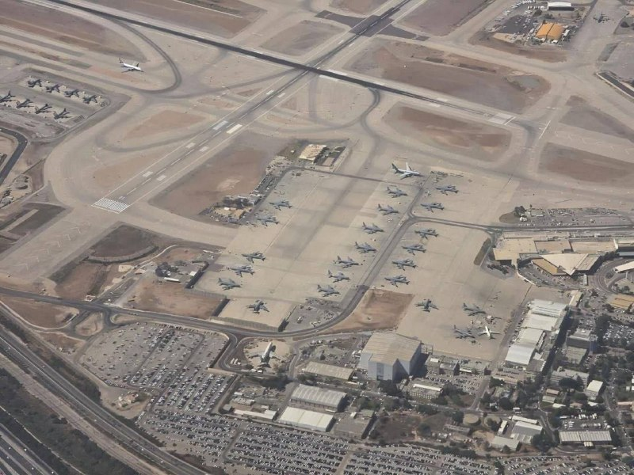

یک روز نسبتا کم کار فرودگاه بن گوریون

👩‍💻@PhantomDirective

🆔@persian_trend_official
پرشین ترند | متفاوت‌ترین کانال نظامی

## Persian_Trend_Official — post 14959

  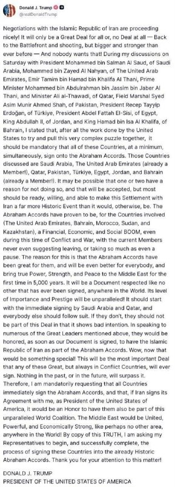

مذاکرات با جمهوری اسلامی ایران به‌خوبی پیش می‌رود! یا یک توافق بزرگ برای همه حاصل خواهد شد، یا اصلاً توافقی در کار نخواهد بود؛ در غیر این صورت، بازگشت به میدان نبرد و درگیری رخ می‌دهد، آن هم شدیدتر و قدرتمندتر از گذشته، و هیچ‌کس چنین چیزی را نمی‌خواهد.

در گفت‌وگوهایی که روز شنبه با محمد بن سلمان ولیعهد عربستان سعودی، محمد بن زاید آل نهیان رئیس امارات، شیخ تمیم بن حمد آل ثانی امیر قطر، نخست‌وزیر و وزیر خارجه قطر، عاصم منیر فرمانده ارتش پاکستان، رجب طیب اردوغان رئیس‌جمهور ترکیه، عبدالفتاح السیسی رئیس‌جمهور مصر، ملک عبدالله دوم پادشاه اردن و حمد بن عیسی آل خلیفه پادشاه بحرین داشتم، تأکید کردم که پس از تلاش‌های آمریکا برای حل این مسئله پیچیده، لازم است همه این کشورها دست‌کم به‌صورت هم‌زمان به توافقنامه‌های ابراهیم بپیوندند.

کشورهای مورد بحث شامل عربستان سعودی، امارات متحده عربی، قطر، پاکستان، ترکیه، مصر، اردن و بحرین هستند. ممکن است یکی دو کشور دلایلی برای عدم پیوستن داشته باشند و این قابل قبول خواهد بود، اما بیشتر آن‌ها باید آماده این توافق باشند تا حل‌وفصل مسئله ایران به رویدادی تاریخی‌تر تبدیل شود.

ترامپ در ادامه مدعی شده توافقنامه‌های ابراهیم برای کشورهای عضو آن — شامل امارات، بحرین، مراکش، سودان و قزاقستان — باعث رونق اقتصادی، مالی و اجتماعی شده و می‌تواند صلح و قدرت بیشتری برای خاورمیانه به همراه داشته باشد.

او همچنین گفته عربستان سعودی و قطر باید فوراً این توافقنامه‌ها را امضا کنند و دیگر کشورها نیز از آن‌ها پیروی کنند. ترامپ ادعا کرده در صورت امضای توافق با ایران، حضور ایران در توافقنامه‌های ابراهیم نیز می‌تواند بخشی از این ائتلاف بزرگ منطقه‌ای باشد.

در پایان، ترامپ از نمایندگان خود خواسته روند پیوستن کشورهای مذکور به توافقنامه‌های ابراهیم را آغاز و تکمیل کنند و این توافق را «مهم‌ترین توافق تاریخ خاورمیانه» توصیف کرده است.

## Persian_Trend_Official — post 14958

♦️مدیر روابط‌عمومی وزارت ارتباطات:

▪️مصوبه بازگشت اینترنت به وضعیت قبل از دی‌ماه ۱۴۰۴، دقایقی پیش از سوی رئیس‌جمهور به وزارت ارتباطات ابلاغ شد.

🫆:Tony

📌 @persian_trend_official
پرشین ترند | متفاوت‌ترین کانال نظامی

## Persian_Trend_Official — post 14957

تسنیم:خبر رسانه سعودی درباره جزئیات تفاهم احتمالی کذب است

🔹الحدث، رسانه وابسته به سعودی نوشت که «منابع ایرانی به او گفته‌اند که ایران آماده است اورانیوم غنی شده سطح بالا را از کشور خارج کند»!

🔹بررسی‌ها نشان می‌دهد که رسانه سعودی نیز همچون بسیاری از اخبار او درباره جزئیات مذاکرات کذب بوده و در راستای عملیات روانی آمریکایی‌هاست.

🔹در متن تفاهم‌نامه‌ای که تا امروز وجود دارد، هیچ جمله‌ای مبنی بر اعلام آمادگی برای خروج مواد هسته‌ای وجود ندارد و اساساً ایران در این تفاهم نامه هیچ تعهدی درباره اقدام هسته‌ای نداده است.

🫆:Tony

📌 @persian_trend_official
پرشین ترند | متفاوت‌ترین کانال نظامی

## Persian_Trend_Official — post 14956

  <a href="telegram/content/Persian_Trend_Official_14956_1779730263.webm" target="_blank">🎬 Download video</a>

🔴اولین پیام دبیر شورای عالی امنیت ملی جمهوری اسلامی

▪️"عقب نشینی در‌ کار نخواهد بود".

♦️این را میدان نظامی، میدان دیپلماسی و مردم مبعوث شده حاضر در خیابان با مقاومت جانانه خود نشان دادند و دشمن را زمین گیر کردند.

♦️حالا بیش از هر زمان دیگر کشور نیاز به وحدت و انسجام دارد تا آمریکایی‌ها و صهیونیست‌ها در این زمینه هم مأیوس شوند.

♦️میدان وحدت و انسجام هم یک میدان دیگر در مبارزه است. تلاش همگانی برای جلوگیری از هر سخن و اقدام وحدت‌شکن، ایرانِ عزیز را به پیروزی نهایی خواهد رساند؛ ان‌شاءالله.

🫆:Tony

📌 @persian_trend_official
پرشین ترند | متفاوت‌ترین کانال نظامی

## Persian_Trend_Official — post 14955

  

⭕️پست جدید دونالد ترامپ

⚠️ترجمه فارسی در تحریریه پرشین ترند به تصویر اصلی اضافه شده است .

🫆:Tony

📌 @persian_trend_official
پرشین ترند | متفاوت‌ترین کانال نظامی

## RadioFarda — post 157549

🔸احمد دنیامالی، وزیر ورزش جمهوری اسلامی، روز دوشنبه گفت: «فیفا همه تمهیدات را از قبل با آمریکایی‌ها هماهنگ کرده و به ما قول داده که همه بازیکنان ویزا دریافت می‌کنند و هیچ دلیلی وجود ندارد که بازیکن ما ویزا نگیرد.» 🔸به گزارش باشگاه خبرنگاران جوان، او ادامه…

## RadioFarda — post 157548

  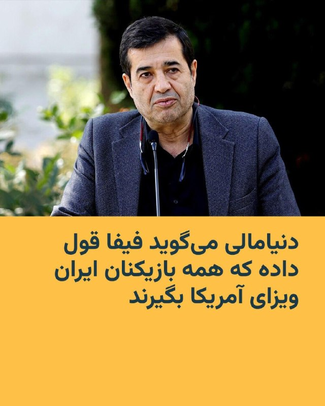

🔸احمد دنیامالی، وزیر ورزش جمهوری اسلامی، روز دوشنبه گفت: «فیفا همه تمهیدات را از قبل با آمریکایی‌ها هماهنگ کرده و به ما قول داده که همه بازیکنان ویزا دریافت می‌کنند و هیچ دلیلی وجود ندارد که بازیکن ما ویزا نگیرد.»

🔸به گزارش باشگاه خبرنگاران جوان، او ادامه داد: «در جلسه‌ای که رئیس فدراسیون فوتبال با مسئولان فیفا داشت، اعلام کردیم که اگر حتی به یک بازیکن ما ویزا داده نشود، قابل قبول نیست.»

🔸همزمان کلودیا شِین‌بام، رئیس جمهور مکزیک، روز دوشنبه فاش کرد که دولت آمریکا نمی‌خواسته میزبان اردوی تیم ملی ایران باشد، و به همین دلیل مقر تیم ملی پس از موافقت خانم شین‌بام به مکزیک منتقل شده است.

🔸مهدی تاج، رئیس فدراسیون فوتبال ایران، اعلام کرده بود که تیم ملی فوتبال در جریان جام جهانی ۲۰۲۶ در شهر مرزی تیخوانا در مکزیک، همسایه ایالت کالیفرنیا، مستقر خواهد شد.

🔸او روز شنبه دوم خرداد ادعا کرده بود که فدراسیون جهانی فوتبال، فیفا، با «درخواست ایران» برای انتقال محل اردو از ایالت آریزونا آمریکا موافقت کرده است.

@RadioFarda

## RadioFarda — post 157547

  <a href="https://t.me/radiofarda/157547" target="_blank">📎 Download file</a>

📻بشنوید: ایستگاه ۱۹ با رادیوفردا، چهارم خرداد ۱۴۰۵

@RadioFarda

## RadioFarda — post 157546

قاضی صلواتی به چهار متهم «اکباتان» حکم اعدام داد؛ یک معترض دیگر اعدام شد

🔸در ادامه تشدید صدور و اجرای حکم اعدام در ایران، یک روز پس از صدور حکم اعدام برای چهار تن از معترضان «پرونده شهرک اکباتان»، یک معترض دیگر از اعتراضات دی‌ماه سال گذشته اعدام شد.
خبرگزاری میزان، وابسته به قوه قضاییه، صبح روز دوشنبه، چهارم خردادماه، از اعدام عباس اکبری، از بازداشت‌شدگان اعتراضات دی‌ماه ۱۴۰۴ در اصفهان، خبر داد.

🔸در گزارش میزان این معترض جوان بدون اشاره به سن و حرفه‌اش با نام «عباس اکبری فیض‌آبادی» به عنوان «یکی از لیدرهای مسلح» در اعتراضات شهرستان نائین معرفی شده است.

🔸بر اساس گزارش این خبرگزاری حکومتی، اکبری «نقش مهمی در حمله به فرمانداری شهرستان و مراکز تأمین امنیت و همچنین مراکز خدماتی» داشته است.

🔸میزان اتهامات عباس اکبری را «محاربه، تخریب عمدی اموال عمومی به قصد مقابله با نظام و اخلال در نظم و امنیت جامعه، اجتماع و تبانی برای ارتکاب جرم علیه امنیت داخلی» نوشته و مدعی شده که او با کلت کمری جنگی اقدام به تیراندازی در خیابان کرده است.

🔸 گزارش کامل را در وب‌سایت رادیوفردا بخوانید.

@RadioFarda

## RadioFarda — post 157545

طالبان با تشدید سرکوب رسانه‌ای، سه ایستگاه‌ رادیویی دیگر را تعطیل کرد

🔸طالبان افغانستان در تازه‌ترین اقدامات سرکوبگرانهٔ خود که از زمان به قدرت رسیدن دوباره این گروه در سال ۲۰۲۱، صحنه رسانه‌ای کشور را تا حد زیادی تضعیف کرده است، سه ایستگاه رادیویی محلی را تعطیل کرد.

🔸ریاست اطلاعات و فرهنگ طالبان در قندهار روز سوم خرداد در اعلامیه‌ای گفت که رادیوهای «تحسین القرآن»، «سنگا» و «زما زیور» به دلیل عدم پرداخت مالیات، عدم دریافت پروانه و پخش با کیفیت پایین تعطیل شده‌اند.

🔸در این اعلامیه همچنین به دو رادیوی دیگر به نام‌های «ملت غژ» و «ورانگی» هشدار داده شده است که اسناد خود را تکمیل کرده و فعالیت‌هایشان را قانونی سازند.

🔸حامد عبیدی، رئیس سازمان حمایت از رسانه‌ها، در واکنش به این اقدام به بخش افغانستان رادیو اروپای آزاد/ رادیو آزادی گفت که حکومت طالبان به آزادی بیان متعهد نیست و تلاش می‌کند برای کنترل افکار عمومی از هر ابزار ممکن استفاده کند.

🔸عبیدی گفت که دلایل ارائه‌شده برای تعطیلی ایستگاه‌ها تنها بهانه‌ای برای سرکوب افکار عمومی است.

🔸هفته گذشته، وقتی ایستگاه محلی دیگری، رادیو بامیان، به‌دلیل عدم تمدید مجوزش تعطیل شد، منبعی در این رادیو به رادیو آزادی گفت که طالبان در واقع از این کار جلوگیری کرده‌اند.

🔸افغانستان در جدیدترین شاخص جهان آزادی مطبوعات گزارشگران بدون مرز که ماه گذشته منتشر شد، در رتبه ۱۷۵ قرار دارد. تنها عربستان سعودی، ایران، چین، کرهٔ شمالی و اریتره امتیاز پایین‌تری داشتند.

🔸گزارشگران بدون مرز می‌گوید ۴۳ درصد از رسانه‌ها در افغانستان از سال ۲۰۲۱ تعطیل شده‌اند که نمونه‌هایی از خاموش شدن رسانه‌های مستقل با هدف قرار دادن زنان خبرنگار است.

🔸 گزارش کامل را در وب‌سایت رادیوفردا بخوانید.

@RadioFarda

## RadioFarda — post 157544

خاویار دریای خزر به دوران اوج خود بازمی‌گردد؟

🔸خاویار دریای خزر که زمانی یکی از منابع ثروت بزرگ منطقه بود، به‌خاطر دهه‌ها صید بی‌رویه، آلودگی، احداث سدها و کاهش جریان رودها و همچنین تخریب زیستگاه‌ها تقریبا در آستانه نابودی قرار گرفته است.

🔸اکنون کشورهای حاشیه این دریا مثل قزاقستان و ایران تلاش می‌کنند پرورش خاوریار را دوباره زنده کنند و به آن رونقی دوباره بدهند.

🔸محصول خاویار دریای خزر که از قرن هفدهم میلادی مورد بهره‌برداری قرار گرفته، در ابتدا، جشن‌های تزارهای روس را زینت می‌داد و در قرن بیستم از سوی جمهوری‌های اتحاد شوروی به یک تولید استراتژیک برای صادرات و ایجاد ارز خارجی تبدیل شد.

🔸در گذشته، تقریباً تمام خاویار سیاه جهان از کشورهای حاشیه دریای خزر، شامل قزاقستان، روسیه، ایران، ترکمنستان و جمهوری آذربایجان تأمین می‌شد، اما اکنون کشورهایی چون چین، بلاروس، ژاپن، آلمان و دانمارک و نروژ جایگزین کشورهای دریای خزر شده‌اند.

🔸ماهیان خاویاری می‌توانند تا ۱۰۰ سال در آب شور دریا زندگی کنند و برای تولیدمثل به آب شیرین رودخانه‌ها باز‌گردند. اکنون دست‌کم سه دهه است که همه گونه‌های ماهیان خاویاری از سوی اتحادیه بین‌المللی حفاظت از طبیعت در وضعیت «در معرض انقراض بحرانی» طبقه‌بندی شده‌اند.

🔸در این شرایط، دولت‌ها و همچنین شرکت‌ها در حاشیه دریای خزر می‌خواهند که این محصول ارزشمند را با کمک پرورش مصنوعی نجات، و تولید آن را دوباره افزایش دهند.

🔸 گزارش کامل را در وب‌سایت رادیوفردا بخوانید.

@RadioFarda

## IranianMinds — post 20742

🔴منابع العربیه:

نسخه نهایی پیش‌نویس یادداشت تفاهم آمریکا و ایران شامل تجدید قابل تمدید آتش‌بس ۶۰ روزه، باز کردن تنگه هرمز بدون اخذ عوارض و پاکسازی مین‌ها و برداشتن موانع دریایی از این آبراه بین‌المللی مقابل تجارب جهانی، برداشتن برخی محدودیت‌ها از بنادر ایران و دادن معافیت‌هایی از تحریم‌ها و فراهم کردن امکان ازسرگیری فروش و صادرات نفت ایران و همچنین ادامه مذاکرات درباره برنامه هسته‌ای ایران در دوره تنش‌زدایی میان دو طرف می‌شود.

@IranianMinds

## IranianMinds — post 20741

🔴 خبرگزاری فارس :

ستادی که امروز اومده دستور رفع فیلترینگ‌ رو‌ تصویب کرده اصلا یه ستاد تازه تاسیسه و چیزی بهش ربطی نداره که بخواد همچین دستوری بده

اصلا اینا نباید بیان راجب وصل شدن اینترنت نظر بدن و‌ بهشون ربطی نداره !

@IranianMinds

## IranianMinds — post 20740

  

🔴الحدث:
وال‌استریت‌ژورنال به نقل از واسطه‌ها، واشنگتن و تهران به مواضع خود در مورد مسائل هسته‌ای و دارایی‌های مسدود شده ، پایبند هستند.

@IranianMinds

## IranianMinds — post 20739

  

پدر تنگسیری منظورشه.

@IranianMinds

## IranianMinds — post 20738

  

🔴 گاییدی این بدبختارو ولشون کن

نوشته : دوتا از بدترین رئیس جمهور های تاریخ آمریکا.

@IranianMinds

## BBCPersian — post 282035

  <a href="telegram/content/BBCPersian_282035_1779730267.mp4" target="_blank">🎬 Download video</a>

🔻مقام‌ها می‌گویند در پی انفجار گاز در یک معدن زغال‌سنگ در شمال چین در روز یکشنبه، دست‌کم ۸۲ نفر کشته شده‌اند و دست‌کم دو نفر نیز همچنان مفقود هستند.
 
این حادثه مرگبارترین فاجعه معدنی در چین از سال ۲۰۰۹ تاکنون محسوب می‌شود و رئیس‌جمهور چین، شی جین‌پینگ، اعلام کرد که از هیچ تلاشی برای عملیات جست‌وجو و نجات نباید دریغ شود.
 
علت انفجار گاز هنوز مشخص نشده اما رسانه‌های دولتی گزارش داده‌اند که میزان مونوکسید کربن در معدن «بالاتر از حد مجاز» بوده است.
 
پس از وقوع مرگبارترین حادثه معدنی چین در بیش از ۱۵ سال گذشته، خشم عمومی نسبت به ادعاهای مربوط به «نقض مقررات ایمنی» رو به افزایش است.
   
برای بسیاری از مردم چین، این فاجعه یادآور دهه ۲۰۰۰ میلادی است یعنی زمانی که از این‌ قبیل حوادث در معادن زغال‌سنگ رخ می‌داد و مردم تصور می‌کردند که آن دوران به پایان رسیده است.
 
مقام‌ها می‌گویند علت این حادثه همچنان در دست بررسی است اما یافته‌های اولیه نشان می‌دهد که شرکت «تونگژو گروپ» که این معدن خصوصی را اداره می‌کرده، مرتکب «تخلفات جدی و غیرقانونی» شده است.
 
https://bbc.in/4f1HnZL
@BBCPersian

## BBCPersian — post 282034

  <a href="https://t.me/bbcpersian/282034" target="_blank">📎 Download file</a>

📻پادکست جام جهان‌نما، دوشنبه ۴ خرداد ۱۴۰۵

این برنامه رادیویی رامی‌توانید هرشب ساعت ۲۰ به وقت ایران، روی موج متوسط ۷۰۲ کیلوهرتز و موج کوتاه۹۴۶۵ کیلوهرتز بشنوید. تکرار برنامه را هم می‌توانید ساعت ۲۱:۳۰ روی موج متوسط ۷۰۲ کیلوهرتز و موج کوتاه۵۳۹۵ کیلوهرتز گوش کنید

@BBCPersian

## BBCPersian — post 282033

  

🔻کلودیا شینباوم، رئیس‌جمهور مکزیک، امروز گفت که موافقت کرده است تیم ملی فوتبال ایران در جام جهانی ۲۰۲۶ در مکزیک مستقر شود.

خانم شینباوم در کنفرانس خبری گفت: «آمریکا نمی‌خواست تیم ایران در خاکشان باشد.»

«آنها (ایران) به همین دلیل از ما پرسیدند: 'می‌توانیم در مکزیک مستقر شویم؟' و ما پاسخ دادیم، بله، هیچ اشکالی ندارد.»

فدراسیون فوتبال ایران دیروز گفته بود که با موافقت فیفا، کمپ و محل استقرار تیم ملی فوتبال در جام جهانی به شهر مرزی تیخوانا در مکزیک منتقل شده است.

ایران از فیفا خواسته بود محل مسابقاتش را از آمریکا به مکزیک منتقل کند اما فیفا گفته بود که امکان تغییر محل مسابقه وجود ندارد.

مهدی تاج، رئیس فدراسیون فوتبال ایران، دیروز گفت که با انتقال کمپ تیم ملی از آریزونا در آمریکا به تیخوانا در مکزیک، «مشکل ویزا نداریم و تیم ملی با پرواز ایران‌ایر می‌تواند عازم مکزیک شود.»

تیخوانا، شهر مرزی پرجنب‌وجوش، با سن دیگو در کالیفرنیا مرز مشترک دارد. تمرینات تیم فوتبال ایران قرار است در مجموعه ورزشی «کلوب تیخوانا» برگزار شود.
ادامه مطلب⬇️

📸GettyImages
https://bbc.in/4wFbfkW

## BBCPersian — post 282031

🔻در پی اعتراضات دانشجویی در ترکیه، رجب طیب اردوغان، رئیس جمهور ترکیه، دستورش برای تعطیلی یکی از قدیمی‌ترین دانشگاه‌های آن کشور را پس گرفت.

رئیس‌جمهور ترکیه سه روز پیش دستور داده بود که دانشگاه «استانبول بیلگی» که به داشتن گرایش‌های سیاسی لیبرال شناخته می‌شود، تعطیل شود.

دولت در هشت ماه گذشته مدیریت این دانشگاه را بر عهده داشته است.

شرکت «جان هولدینگ»، مالک دانشگاه، به اتهام «پول‌شویی و فرار مالیاتی» تحت تحقیق قرار داشت.

این شرکت همچنین مالک شبکه‌های عمده تلویزیونی و چندین مدرسه در ترکیه است.

📸AFP via Getty Images
@BBCPersian

## Dirty_Kids — post 390169

وضعیت طوری شده که هر کی هر کاری میکنه بیهوده‌ست؛ درس بخونی بیهودست، کار کنی بیهودست، پس‌انداز کنی بیهودست و...

‏من حتی انرژی ناراحت شدن از اخبار رو هم ندارم دیگه.

@Dirty_Kids 👻

## Dirty_Kids — post 390168

‏این روزا خیلی سهراب سپهری ام. کون هیچ کاری رو ندارم

@Dirty_Kids 👻

## Dirty_Kids — post 390167

  <a href="telegram/content/Dirty_Kids_390167_1779730269.mp4" target="_blank">🎬 Download video</a>

با يه شغل ديگه نشون بده كه شغلت اين نيست :

@Dirty_Kids 👻

## Dirty_Kids — post 390166

  <a href="https://t.me/Dirty_Kids/390166" target="_blank">📎 Download file</a>

✅ اپلیکیشن اندروید سایت جهانی دربی بت

💰اولین سایت جهانی با امکان شارژ و برداشت ریالی(کارت به کارت)

🔗 برای ورود فیلترشکن روی کشور مناسب قرار دهید مانند فنلاند و المان و....

😀Telegram Channel
👇
https://t.me/+bcynkEgSW2dlYTc0

## Dirty_Kids — post 390165

  

😤دنبال یه سایت شرط بندی بین المللی بودی که به ایرانیا خدمات بده؟!
⛔

👍دربی بت همون انتخاب  100%

💎ویژگی های سایت جهانی Derby Bet:

⬅️امکان شارژ امن با کارت بانکی

⬅️واریز اول دوبل شارژ می شوید(بونوس۱۰۰٪)

⬅️پر اپشن ترین سایت فعال در ایران

⬅️تسویه حساب کمتر از 5 دقیقه

⬅️برگشت بخشی از باخت به صورت هفتگی

🚨کد هدیه ثبت نام:GG007

⚠️برای دانلود اپلکیشن کلیک کنید
👉

🔔کانال دربی بت :

🪙https://t.me/+bcynkEgSW2dlYTc0

## Dirty_Kids — post 390163

محمدباقر ذوالقدر، دبیر شورای عالی امنیت رژیم تروریستی جمهوری اسلامی، در بیانیه‌ای اعلام کرد: «هیچ عقب‌نشینی‌ای در کار نخواهد بود.»

او مدعی شد آنچه در «میدان نظامی»، «میدان دیپلماسی» و «مقاومت شدید نیروهای حاضر در خیابان‌ها» رخ داده، باعث شده دشمن «زمین‌گیر» شود. ذوالقدر همچنین با تاکید بر ضرورت «وحدت و انسجام» گفت رژیم تروریستی جمهوری اسلامی تلاش دارد آمریکا و اسرائیل را در این حوزه نیز «ناامید» کند و افزود جلوگیری از هر سخن یا اقدامی که به‌گفته او وحدت داخلی را مختل کند، «ایران را به پیروزی نهایی خواهد رساند.»

@Dirty_Kids 👻

## Dirty_Kids — post 390162

  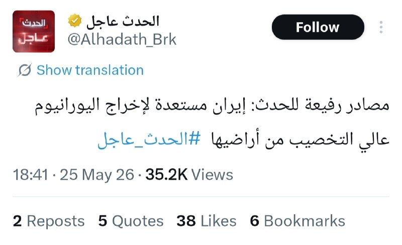

خبرگزاری الحدث:
منابع ایرانی به ما گفتن؛ ایران ظاهراً آمادست اورانیوم غنی‌شده‌ی سطح بالاشو از کشور خارج کنه!

@Dirty_Kids 👻

## Dirty_Kids — post 390161

قهوه‌ی جدید گرفتم. مامانم خورده می‌گه مثل قهوه‌ی خودمون نیست. قهوه‌ی خودمون آخه؟ مزرعه داریم تو کنیا؟

@Dirty_Kids 👻

## Dirty_Kids — post 390160

  <a href="telegram/content/Dirty_Kids_390160_1779730271.mp4" target="_blank">🎬 Download video</a>

این چه سمّیه دیگه؟😐😂
این چادریا میرن تجمعات شبونه شعارمیدن یه برده شکار میکنن میارن خونه

@Dirty_Kids 👻

## Dirty_Kids — post 390159

  

بادبان با همراهی شما 90 هزار نفری شد!
🎉

🛒به این مناسبت، قیمت سرویس‌ها تا گیگی 150 هزار تومان کاهش پیدا کرد! 
🚀

🎁 کد تخفیف خرید اول دوباره ریست شد و همه میتونن ازش استفاده کنن:
BadBan4k

💸 با این کد، 50 هزار تومان تخفیف روی اولین خریدت بگیر!

🔥و مهم‌تر از همه...
سیستم معرفی بادبان فعال‌تر از همیشه‌ست!
از تمام خریدهای کاربرانی که معرفی میکنی، 10% خریدشون رو پورسانت دائمی دریافت کن و موجودی کیف پولت رو افزایش بده 
💼

وقتی بادبان داری،
هیچ بادی مانع نیست… حتی وقتی اینترنت ملیه
⛵️
G4

🛡@BadBan_VPN | کانال 

🤖@BadBan_VPNBot | ربات 

📞@BadBan_VPNSupport | پشتیبانی

## Hranews — post 113159

گزارشی از مطالبات مزدی، بیمه‌ای و بیکاری کارگران در شهرهای مختلف

❗️
❗️
❗️
❗️
❗️– کارگران ابنیه فنی راه‌آهن زاهدان از تعلیق شماری از همکارانشان پس از پیگیری مطالبات صنفی خبر داده و اعلام کردند که به دلیل عدم پرداخت چندین ماه حق بیمه توسط کارفرما از دریافت خدمات بیمه و امکانات درمانی نیز محروم مانده‌اند. همچنین، #کارگران کارخانه فولاد سیادن ابهر از تاخیر در پرداخت حقوق اردیبهشت ماه و دیگر مشکلات شغلی خود انتقاد کردند. افزون بر این، مدیرکل تعاون، کار و رفاه اجتماعی خراسان جنوبی اعلام کرد که از ابتدای امسال تاکنون، ۵۲۷ نفر از کارگران واحدهای تولیدی این استان از چرخه کار خارج شده‌اند و اکنون تحت پوشش بیمه بیکاری قرار دارند.

ادامه مطلب

↘️
@hranews_bot تماس ✉️ - @Hranews کانال هرانا 🆑

## alonews — post 122628

  <a href="telegram/content/alonews_122628_1779730273.webm" target="_blank">🎬 Download video</a>

👈قیمت نفت امریکا برای اولین بار از ۷ می به زیر ۹۰ دلار در هر بشکه سقوط کرد.

✅ @AloNews خبر جنگ

## alonews — post 122627

  <a href="telegram/content/alonews_122627_1779730273.webm" target="_blank">🎬 Download video</a>

🔴فووووووووووری/فارس: اینترنت باید با دستور شعام باز بشه و فعلا خبری نیست

✅ @AloNews خبر جنگ

## alonews — post 122626

  <a href="telegram/content/alonews_122626_1779730273.webm" target="_blank">🎬 Download video</a>

👈مدیر روابط‌عمومی وزارت قطع ارتباطات خبر داد: رئیس‌جمهور دستور بازگشایی اینترنت بین‌الملل را ابلاغ کرده است

✅ @AloNews خبر جنگ

## alonews — post 122625

  <a href="telegram/content/alonews_122625_1779730273.mp4" target="_blank">🎬 Download video</a>

👈ترامپ : ایران هرگز نباید سلاح هسته ای داشته باشه

تو دو درگیری اخیر مجموعاً ۱۳ نفر از نیروهای مسلح رو از دست دادیم
- تو ونزوئلا که یه پیروزی کامل بود هیچ تلفاتی نداشتیم و اونجا رو در یک روز گرفتیم
- اما تو عملیات خشم حماسی ۱۳ نفر جانشون رو از دست دادن
- این افراد فوق‌العاده برای جلوگیری از دسترسی بزرگ‌ترین حامی تروریسم دولتی به سلاح هسته‌ای جان خودشون رو فدا کردن

✅ @AloNews خبر جنگ

## alonews — post 122624

  <a href="telegram/content/alonews_122624_1779730275.webm" target="_blank">🎬 Download video</a>

🔴فوری/روزنامه هم‌میهن: رئیس‌جمهور دستور بازگشایی اینترنت بین‌الملل را ابلاغ کرد. 
✅ @AloNews خبر جنگ

## alonews — post 122623

  <a href="telegram/content/alonews_122623_1779730275.webm" target="_blank">🎬 Download video</a>

🔴فوری/روزنامه هم‌میهن: رئیس‌جمهور دستور بازگشایی اینترنت بین‌الملل را ابلاغ کرد.

✅ @AloNews خبر جنگ

## alonews — post 122622

  <a href="telegram/content/alonews_122622_1779730275.webm" target="_blank">🎬 Download video</a>

👈رئیس شورای هماهنگی تبلیغات اسلامی: فعلا تصمیم نگرفتیم چه زمانی رهبر سابق رو تشییع کنیم

✅ @AloNews خبر جنگ

## alonews — post 122621

  <a href="telegram/content/alonews_122621_1779730275.webm" target="_blank">🎬 Download video</a>

👈کانال ۱۲ عبری:
برخلاف ارزیابی‌های قبلی، ایران تولید موشک‌های بالستیک را به سرعت از سر گرفته است

✅ @AloNews خبر جنگ

## alonews — post 122620

  <a href="telegram/content/alonews_122620_1779730276.webm" target="_blank">🎬 Download video</a>

👈ادعای العربیه:
پیش‌نویس توافق تأکید می‌کند که کاهش تحریم‌های نفت ایران مشروط به اجرای تعهدات آن است.

🔴پیش‌نویس توافق آمریکا و ایران بر دوره ۳۰ روزه برای بازگشت کشتیرانی در تنگه هرمز تأکید دارد.

🔴پیش‌نویس توافق آمریکا و ایران بر دوره ۶۰ روزه برای مذاکرات هسته‌ای تأکید دارد.

🔴توافق بر آزادسازی بخشی از دارایی‌های مسدود شده ایران طبق سازوکاری مشخص تأکید دارد.

✅ @AloNews خبر جنگ

## alonews — post 122619

  <a href="telegram/content/alonews_122619_1779730276.webm" target="_blank">🎬 Download video</a>

🔴فوری/فارس: باز شدن اینترنت دست شورای عالی امنیت ملی هست و فعلا تصمیمی گرفته نشده و گمانه زنی‌ها الکیه

✅ @AloNews خبر جنگ

## alonews — post 122618

  <a href="telegram/content/alonews_122618_1779730276.webm" target="_blank">🎬 Download video</a>

👈العربیه: پیش‌نویس توافق میان آمریکا و ایران، برقراری آتش‌بس جامع در تمامی جبهه‌ها، از جمله لبنان را تضمین می‌کند.

✅ @AloNews خبر جنگ

## alonews — post 122617

  <a href="telegram/content/alonews_122617_1779730276.webm" target="_blank">🎬 Download video</a>

👈منابع خبری الحدث:
پیش‌نویس توافق آمریکا و ایران بر گشایش تنگه هرمز بدون عوارض و خنثی‌سازی مین‌ها تأکید دارد.

✅ @AloNews خبر جنگ

## alonews — post 122616

  <a href="telegram/content/alonews_122616_1779730276.mp4" target="_blank">🎬 Download video</a>

👈پرزیدنت ترامپ به احترام روز یادبود تاج گلی بر سر مقبره سرباز گمنام در گورستان ملی آرلینگتون می گذارد.

✅ @AloNews خبر جنگ

## alonews — post 122615

  <a href="telegram/content/alonews_122615_1779730278.webm" target="_blank">🎬 Download video</a>

👈سی ان ان:
مذاکرات به خوبی درحال پیش رفتن است

✅ @AloNews خبر جنگ

## alonews — post 122614

  <a href="telegram/content/alonews_122614_1779730278.webm" target="_blank">🎬 Download video</a>

👈وال استریت ژورنال به نقل از واسطه‌ها:
واشنگتن و تهران به مواضع خود در مورد مسائل هسته‌ای و دارایی‌های مسدود شده پایبند هستند..

✅ @AloNews خبر جنگ

## alonews — post 122613

  <a href="telegram/content/alonews_122613_1779730278.webm" target="_blank">🎬 Download video</a>

👈‏سی‌ان‌ان از مسئولان آمریکایی:
اختلافاتی درباره نگارش مربوط به برنامه هسته‌ای ایران و رفع تحریم‌ها مانع از نهایی شدن توافق شده است

✅ @AloNews خبر جنگ

## alonews — post 122612

  <a href="telegram/content/alonews_122612_1779730278.webm" target="_blank">🎬 Download video</a>

👈 کانال ۱۵ اسرائیل به نقل از یک منبع:
اسرائیل در پی تشدید حملات پهپادی حزب‌الله، در حال بررسی تغییر رویکرد نظامی خود در لبنان است.

✅ @AloNews خبر جنگ

## alonews — post 122611

  <a href="telegram/content/alonews_122611_1779730278.webm" target="_blank">🎬 Download video</a>

👈یک منبع مطلع به i24NEWS: مذاکرات بین ایران و آمریکا پیشرفت دارد اما مشکلاتی وجود دارد، تغییرات و "ارتقاءهایی" که هر طرف در زبان یادداشت درخواست می‌کند.

🔴 هیئت ایرانی که به قطر آمده است، تلاشی برای پر کردن شکاف‌های جدی است - مانند مسئله آزادسازی وجوهی که ایرانی‌ها درخواست می‌کنند.

✅ @AloNews خبر جنگ

## alonews — post 122610

  <a href="telegram/content/alonews_122610_1779730278.webm" target="_blank">🎬 Download video</a>

👈محمدباقر ذوالقدر، دبیر شورای عالی امنیت ملی: هیچ عقب‌نشینی وجود نخواهد داشت. این موضوع در میدان نظامی، میدان دیپلماتیک و مردم حاضر در خیابان‌ها با مقاومت شجاعانه‌شان که دشمن را ناتوان کرده است، به اثبات رسیده است.

🔴اکنون بیش از هر زمان دیگری، کشور به وحدت و انسجام نیاز دارد تا آمریکایی‌ها و اسرائیلی ها نیز در این زمینه ناامید شوند. میدان وحدت و انسجام، عرصه‌ای دیگر در مبارزه است.

🔴تلاش جمعی برای جلوگیری از هرگونه سخنان و اقدامات تفرقه‌انگیز، ایران عزیز را به پیروزی نهایی خواهد رساند.

✅ @AloNews خبر جنگ

## alonews — post 122609

  <a href="telegram/content/alonews_122609_1779730279.webm" target="_blank">🎬 Download video</a>

👈خبرنگار الجزیره در تهران: به نظر می‌رسد گره مذاکرات ایران و آمریکا در مسیر حل شدن قرار دارد و ابتکار قطر برای حل اختلاف میان تهران و واشنگتن نقش اساسی در این روند ایفا کرده است؛ به‌طوری که دوحه عملاً یک میانجی بوده، نه صرفاً کمک‌کننده به روند میانجی‌گری.
‌

🔴 تنها چند ساعت باقی مانده است.

✅ @AloNews خبر جنگ

---
📅 بروزرسانی: 1405/03/04 19:17
---

## VahidOOnLine — post 242135

  

♦️در حالی که دونالد ترامپ، رئیس‌جمهوری آمریکا، در پیامی در تروث سوشال از دعوت از کشورهای منطقه برای پیوستن به «پیمان ابراهیم» سخن گفته بود، یک مقام عربستان سعودی، روز دوشنبه چهارم خرداد ماه به العربیه انگلیسی گفت موضع ریاض درباره مسئله فلسطین تغییری نکرده است.
به گزارش العربیه این منبع تاکید کرد: «باید مسیری برگشت‌ناپذیر برای تشکیل کشور فلسطین وجود داشته باشد.»
ترامپ پیش‌تر در پیامی در شبکه اجتماعی تروث سوشال از کشورهای عربستان سعودی، قطر، ترکیه، پاکستان، مصر و اردن خواسته بود به «پیمان ابراهیم» بپیوندند. توافقی که در دوره نخست ریاست‌جمهوری او به عادی‌سازی روابط اسرائیل با امارات متحده عربی، بحرین، مراکش و سودان منجر شد. او همچنین گفته بود خاورمیانه می‌تواند وارد مرحله‌ای تازه از صلح و همکاری شود.
‌🇸🇦 Indypersian

🤖 @VahidOOnLine

## VahidOOnLine — post 242134

  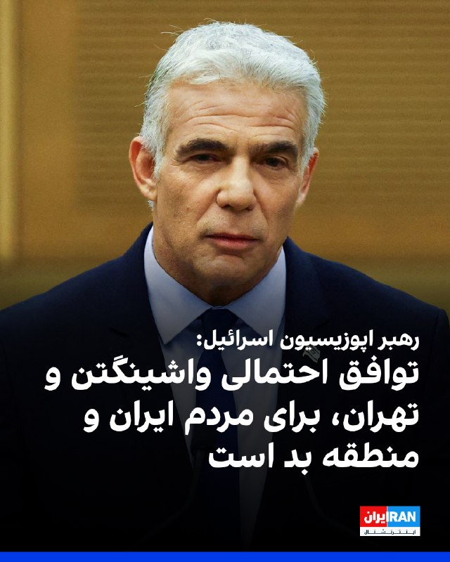

یائیر لاپید، رهبر اپوزیسیون اسرائیل، دوشنبه گفت توافق در حال شکل‌گیری میان واشینگتن و تهران هیچ‌یک از اهداف اسرائیل در جنگ را تامین نمی‌کند و بنیامین نتانیاهو را به ناتوانی در اعمال نفوذ برای دستیابی به توافقی بهتر متهم کرد.
لاپید در جمع خبرنگاران در اورشلیم گفت: این توافق برای اسرائیل، برای منطقه و برای مردم ایران بد است.
‌🏁 🇬🇧 IranintlTV

🤖 @VahidOOnLine

## VahidOOnLine — post 242133

  <a href="telegram/content/VahidOOnLine_242133_1779724041.mp4" target="_blank">🎬 Download video</a>

♦️محمد نوری ارسوی، وزیر فرهنگ و گردشگری ترکیه، روز دوشنبه چهارم خرداد اعلام کرد یکی دیگر از قطعات گمشده تابلوی موزاییکی مشهور «دختر کولی» از آمریکا به ترکیه بازگردانده شده است.
ارسوی در پیامی در شبکه‌های اجتماعی گفت پس از بازگرداندن ۱۲ قطعه پیشین، سیزدهمین قطعه این مجموعه نیز در نتیجه پژوهش‌های علمی و تلاش‌های دیپلماتیک دوباره به سرزمین اصلی خود بازگشته است.
وزیر فرهنگ ترکیه تاکید کرد آنکارا همچنان رد آثار فرهنگی و تاریخی خود را در هر نقطه جهان دنبال خواهد کرد و از میراث تمدنی‌اش حفاظت می‌کند.
این قطعه بخشی از ترکیب بزرگ موزاییکی معروف «دختر کولی» متعلق به شهر باستانی زئوگما است. اثری مربوط به سده دوم میلادی در دوره امپراتوری روم که حدود هزار و ۸۰۰ سال قدمت دارد و به‌دلیل نگاه نافذ و جزئیات هنری‌اش به یکی از شناخته‌شده‌ترین نمادهای فرهنگی ترکیه تبدیل شده است.
مقام‌های ترکیه می‌گویند این تابلو از نظر سبک هنری و ترکیب‌بندی، شباهت زیادی با دیگر قطعات نگهداری‌شده در موزه موزاییک زئوگما در شهر غازی‌آنتپ ترکیه دارد و پس از بررسی‌های علمی و حقوقی، از آمریکا به ترکیه تحویل داده شده است.
‌🇸🇦 Indypersian

🤖 @VahidOOnLine

## VahidOOnLine — post 242132

  

وب‌سایت سمافور گزارش داد یک سرمایه‌گذاری مشترک میان یک استارتاپ دفاعی آمریکایی و یک شرکت عربستان سعودی در حال ساخت کارخانه‌ای در نزدیکی ریاض برای تولید پهپادهای رزمی مشابه سامانه شاهد جمهوری اسلامی است.
سمافور افزود این پهپاد با برد ۱۵۰۰ کیلومتر برای تقویت بازدارندگی عربستان سعودی طراحی شده و تولید آن هم برای بازار داخلی و هم صادرات به کشورهای متحد برنامه‌ریزی شده است.
‌🏁 🇬🇧 IranintlTV

🤖 @VahidOOnLine

## VahidOOnLine — post 242131

  

♦️پاپ لئو چهاردهم، رهبر کاتولیک‌های جهان، در نخستین منشور رسمی خود درباره هوش مصنوعی خواستار «خلع سلاح» این فناوری شد و هشدار داد گسترش سریع آن می‌تواند به «گونه‌های تازه برده‌داری» منجر شود.

پاپ که روز دوشنبه منشور «انسانیت باشکوه» را در واتیکان ارائه کرد، نسبت به رقابت جهانی برای توسعه الگوریتم‌های قدرتمندتر و انباشت داده‌های بیشتر با هدف دستیابی به برتری سیاسی و بازرگانی هشدار داد.

او تاکید کرد هوش مصنوعی باید از «منطق سلطه، حذف و مرگ» رها شود و سپردن تصمیم‌های مرگبار به فناوری «غیرقابل پذیرش» است. لئو همچنین استفاده از هوش مصنوعی در جنگ‌افزارهای خودکار را محکوم کرد.

پاپ لئو در بخش دیگری از این سند نسبت به بهره‌کشی انسانی در روند توسعه هوش مصنوعی هشدار داد و گفت پاسخ‌های ظاهرا «بی‌نقص و فوری» این فناوری بر کار خاموش میلیون‌ها نفر، از ناظران محتوای آسیب‌زا تا کودکانی که مواد معدنی مورد نیاز فناوری را استخراج می‌کنند، متکی است.

به گزارش خبرگزاری فرانسه، در آیین رونمایی از این منشور، کریستوفر اولاه، از بنیان‌گذاران شرکت آمریکایی آنتروپیک، نیز حضور داشت.
‌🇸🇦 Indypersian

🤖 @VahidOOnLine

## VahidOOnLine — post 242130

  

علیرضا سلیمی، عضو هیات‌رییسه مجلس گفت با توجه به شرایط جدید، از مجتبی خامنه‌ای اجازه خواستیم تا جلسات مجلس را به‌صورت وبیناری با امکان رای‌گیری برگزار کنیم.

او افزود به محض دریافت پاسخ از «رهبری»، هیات‌رییسه تصمیمات لازم را برای آغاز جدی فعالیت‌های عادی مجلس خواهد گرفت.
‌🏁 🇬🇧 IranintlTV

🤖 @VahidOOnLine

## VahidOOnLine — post 242129

  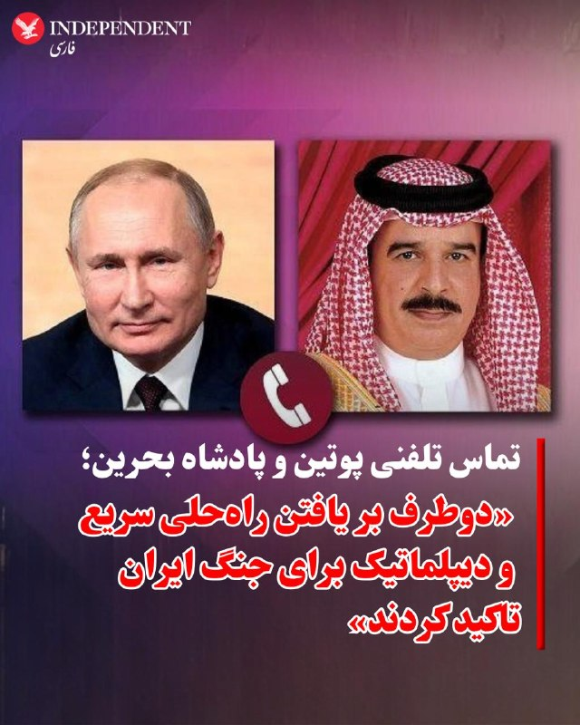

♦️ولادیمیر پوتین، رئیس‌جمهوری روسیه، روز دوشنبه چهارم خرداد ماه، در گفتگویی تلفنی با حمد بن عیسی آل خلیفه، پادشاه بحرین، بر ضرورت حل‌وفصل سریع بحران پیرامون ایران از طریق راهکارهای سیاسی و دیپلماتیک تاکید کرد.

بر اساس بیانیه کرملین، دو طرف در این تماس بر تعهد برای تقویت همکاری‌های روسیه و بحرین در حوزه‌های تجارت، اقتصاد، امور مالی، سرمایه‌گذاری و همچنین همکاری‌های فرهنگی و بشردوستانه تاکید کردند.

پوتین و پادشاه بحرین همچنین در بررسی تحولات خاورمیانه، بر لزوم راه‌حلی سریع به راه‌حلی سیاسی و دیپلماتیک برای بحران مربوط به ایران، با در نظر گرفتن کامل منافع همه کشورهای منطقه، تاکید کردند.
‌🇸🇦 Indypersian

🤖 @VahidOOnLine

## VahidOOnLine — post 242128

  <a href="telegram/content/VahidOOnLine_242128_1779724044.mp4" target="_blank">🎬 Download video</a>

♦️شی جین‌پینگ، رئیس‌جمهوری چین، روز دوشنبه چهارم خرداد ماه در پکن با شهباز شریف، نخست‌وزیر پاکستان، دیدار کرد. این دیدار در حالی انجام شد که تلاش‌های دیپلماتیک برای پایان دادن رسمی به جنگ ایران و آمریکا همچنان ادامه دارد.
خبرگزاری دولتی شین‌هوا گزارش داد این دیدار پس از گفتگوی شهباز شریف با لی چیانگ، نخست‌وزیر چین، انجام شد. عاصم منیر، فرمانده ارتش پاکستان و چهره اصلی میانجیگری میان تهران و واشنگتن در این سفر شهباز شریف را همراهی می‌کند.
به گزارش خبرگزاری فرانسه، شهباز شریف در جریان دیدار با مقام‌های چینی گفت: «جهان در مقطع حساسی قرار دارد.» او همچنین افزود پاکستان «نقشی صادقانه» در میانجیگری میان آمریکا و ایران ایفا کرده است.
نخست‌وزیر پاکستان ضمن قدردانی از حمایت پکن برای «پیشبرد صلح» گفت: «اوضاع در مسیر درستی حرکت می‌کند.»
این سفر پس از حضور عاصم منیر و محسن نقوی، وزیر کشور پاکستان، در تهران در روزهای جمعه و شنبه و در چارچوب تلاش‌ها برای پایان دادن به جنگ انجام شده است.
چین نیز اعلام کرده همراه با پاکستان برای «بازگرداندن سریع صلح و ثبات به خاورمیانه» همکاری خواهد کرد.
‌🇸🇦 Indypersian

🤖 @VahidOOnLine

## VahidOOnLine — post 242127

  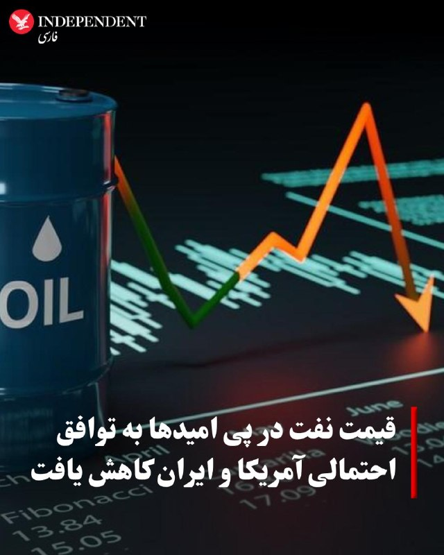

♦️قیمت نفت روز دوشنبه چهارم خرداد ماه، پس از بالاگرفتن گمانه‌زنی‌ها درباره دستیابی به توافقی برای پایان جنگ و بازگشایی تنگه هرمز کاهش یافت.

به گزارش شبکه خبری سی‌ان‌ان، بهای نفت برنت، شاخص جهانی قیمت نفت، حدود شش درصد کاهش یافت و به حدود ۹۷ دلار در هر بشکه رسید. این رقم که در پایان معاملات روز جمعه حدود ۱۰۴ دلار بود، همچنان بالاتر از قیمت ۷۴ دلاری پیش از آغاز جنگ باقی مانده است.

قیمت نفت خام وست تگزاس اینترمدیت، شاخص نفت آمریکا، نیز با کاهش شش درصدی به حدود ۹۰ دلار در هر بشکه رسید؛ در حالی که این شاخص روز جمعه حدود ۹۷ دلار بسته شده بود.

با وجود تعطیلی بازارهای سهام آمریکا به مناسبت روز تعطی رسمی در آمریکا، نشانه‌هایی از خوش‌بینی سرمایه‌گذاران نسبت به توافق احتمالی میان واشینگتن و تهران دیده می‌شود.

بازارهای اروپایی نیز هفته را با رشد آغاز کردند و شاخص «استاکس ۵۰» که عملکرد ۵۰ شرکت بزرگ منطقه یورو را دنبال می‌کند، ۱.۷۵ درصد افزایش یافت. بازارهای آسیایی نیز عمدتا روندی صعودی داشتند.
‌🇸🇦 Indypersian

🤖 @VahidOOnLine

## VahidOOnLine — post 242126

  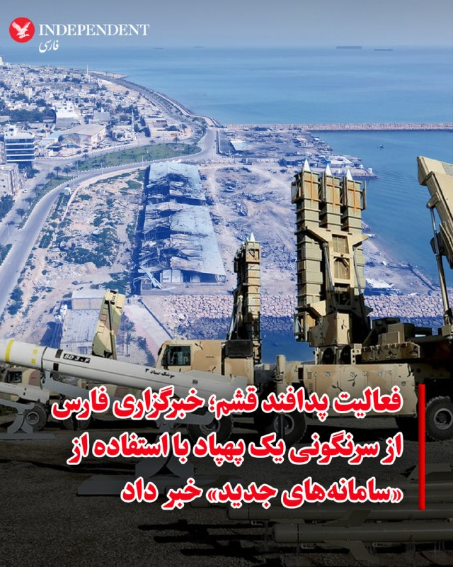

♦️خبرگزاری فارس، نزدیک به سپاه پاسداران، روز دوشنبه سوم خرداد ماه، از سرنگونی یک پهپاد توسط نیروهای مسلح جمهوری اسلامی ایران بر فراز خلیج فارس خبر داد.
بر اساس این گزارش، این عملیات با استفاده از «آرش‌های کمانگیر با سامانه‌های جدید» و در جریان آنچه فارس «نمایش اقتدار دفاعی جمهوری اسلامی» توصیف کرده، انجام شده است.
فارس به نقل از مقام‌های نامشخص نوشت این عملیات با بهره‌گیری از سامانه‌ای با «قابلیت‌های پنهان» انجام شده و افزود: «این نشانه از طرف ماست تا دیگر هیچ پهپاد رادارگریزی نتواند بر آسمان خلیج فارس نفوذ کند.»
فارس افزود: «این اقدام، تاکید دوباره‌ای بر حاکمیت و امنیت کامل ایران بر حریم هوایی خلیج فارس و آمادگی نیروهای دفاعی برای مقابله با هرگونه تجاوز است. جزئیات فنی و عملیاتی این سامانه جدید تاکنون محرمانه باقی مانده است.»
این گزارش دقایقی پس از انتشار خبرهایی درباره شنیده شدن صدای فعالیت پدافند هوایی در محدوده جزیره قشم منتشر شد.
‌🇸🇦 Indypersian

🤖 @VahidOOnLine

## VahidOOnLine — post 242125

  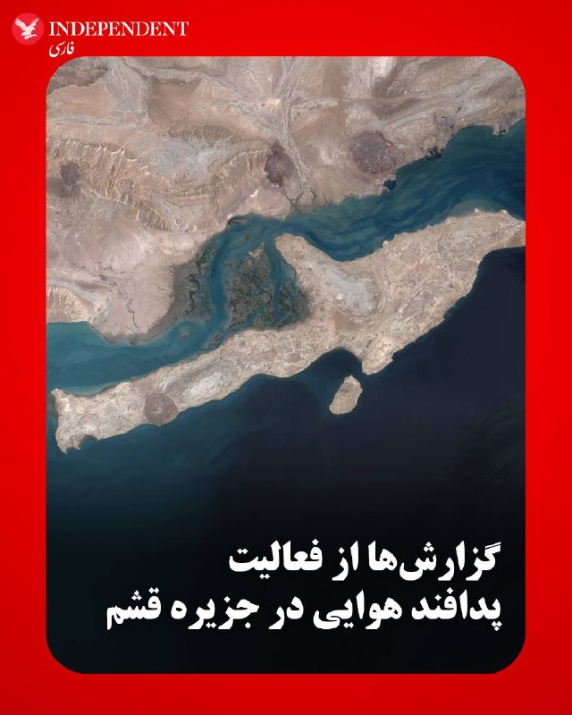

♦️ خبرگزاری مهر عصر دوشنبه سوم خرداد ماه به نقل از ساکنان جزیره قشم از شنیده شدن صدای فعالیت پدافند در محدوده این جزیره ایرانی خبر داد.
بر اساس این گزارش، هنوز ماهیت این صداها مشخص نیست و تاکنون هیچ‌یک از نهادهای رسمی درباره علت آن اظهارنظر نکرده‌اند.
‌🇸🇦 Indypersian

🤖 @VahidOOnLine

## VahidOOnLine — post 242124

  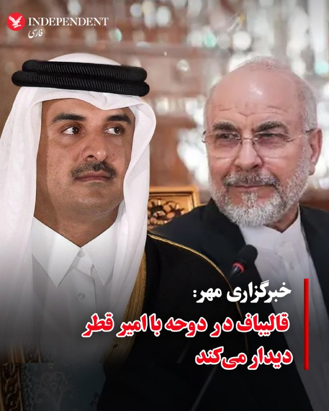

♦️خبرگزاری مهر، روز دوشنبه چهارم خرداد ماه گزارش کرد، محمدباقر قالیباف که برای مذاکرات پایان جنگ به دوحه سفر کرده است با تمیم بن حمد بن خلیفه آل‌ثانی، امیر قطر دیدار خواهد کرد.
بر اساس این گزارش، در این سفر «مسائل دوجانبه و همچنین موضوعات مربوط به مذاکرات پایان جنگ و رفع تحریم‌ها» مورد بحث و بررسی قرار خواهد گرفت.
خبرگزاری رویترز ظهر دوشنبه از عزیمت محمد باقر قالیباف، عباس عراقچی و عبدالناصر همتی، رئیس بانک مرکزی جمهوری اسلامی ایران به قطر خبر داده بود.
‌🇸🇦 Indypersian

🤖 @VahidOOnLine

## VahidOOnLine — post 242123

  

خبرگزاری مهر، وابسته به سازمان تبلیغات اسلامی، اعلام کرد عصر دوشنبه، ساکنان محلی در جزیره قشم صدای فعالیت پدافند را گزارش کرده‌اند.
بنا بر این خبر، ماهیت این صداها مشخص نیست و هنوز هیچ‌یک از نهادهای رسمی درباره علت وقوع این صداها اظهارنظر نکرده‌اند.
‌🏁 🇬🇧 IranintlTV

🤖 @VahidOOnLine

## VahidOOnLine — post 242122

🗣روایت شما از بحران اقتصادی و زندگی در آتش‌بس- دوشنبه ۴ خرداد:

🔹در ممسنی جو به شدت امنیتی است و تمام کسانی که در چهلم جاویدنامان حماسه آفریدند را دستگیر می‌کنند.

🔹در کاشان سر هر چهارراه و میدان چادر زده‌اند و به زن‌ها و بچه‌ها تیراندازی و کار با تفنگ آموزش می‌دهند؛ از بچه‌ای که باید به کلی از این مسائل دور باشد سوءاستفاده ابزاری می‌کنند.

🔹کسی بیشتر از ما دانش‌آموزان پایه‌های یازدهم و دوازدهم استرس و ترس ندارد؛ مایی که قرار است بعد از ۸۰ روز سختی و مشقت و کیفیت تدریس پایین امتحان نهایی و بعدش کنکور بدهیم.

🔹ما میدان خراسان تهران کنار پاساژ خراسان قهوه‌خونه داریم الان با این وضعیت گرانی چطور کار کنیم؟ تنباکو کیلویی ۵ میلیون و ذغال کیلویی ۴۰۰ هزار تومان است.

🔹من بیماری خودایمنی دارم و به‌خاطر پیدا نکردن یک قرص ساده کارم به بستری در بیمارستان کشیده.

🔹سیستان و بلوچستان اصلا کارت آزاد بنزین در این ۱۰ سال نداشته و خیلی‌ها ماشین‌هایشان را در نیمه دوم ماه استفاده نمی‌کنند.

🔹رفته بودم سوپرمارکت خرید کنم، متصدی فروشگاه گفت محصولات لبنی دوباره ۳۰ درصد افزایش یافته، آخرین تغییر قیمت ۱۰ روز پیش بود!
‌🏁 🇬🇧 IranintlTV

🤖 @VahidOOnLine

## VahidOOnLine — post 242121

  

دونالد ترامپ در شبکه تروث سوشال نوشت که پیوستن جمهوری اسلامی به پیمان ابراهیم، می‌تواند به «اتفاقی تاریخی» تبدیل شود.
او افزود که در گفت‌وگو با سران عربستان سعودی، امارات متحده عربی، قطر، ترکیه، مصر، اردن و بحرین، تاکید کرده لازم است همه این کشورها به‌طور هم‌زمان پیمان ابراهیم را برای عادی‌سازی روابط با اسرائیل امضا کنند.

ترامپ نوشت: ««کشورهایی که درباره آن‌ها صحبت شد عبارت‌اند از عربستان سعودی، امارات متحده عربی (که هم‌اکنون عضو است)، قطر، پاکستان، ترکیه، مصر، اردن و بحرین (که هم‌اکنون عضو است). ممکن است یکی دو کشور دلیلی برای انجام ندادن این کار داشته باشند و این پذیرفته خواهد شد، اما بیشتر آن‌ها باید آماده، مایل و قادر باشند که این توافق با ایران را به رویدادی بسیار تاریخی‌تر از آنچه در غیر این صورت می‌بود تبدیل کنند.»
‌🏁 🇬🇧 IranintlTV

🤖 @VahidOOnLine

## VahidOOnLine — post 242120

  

♦️دونالد ترامپ، رئیس‌جمهوری آمریکا، روز دوشنبه چهارم خرداد ماه در پیامی در شبکه اجتماعی تروث سوشال اعلام کرد مذاکرات با جمهوری اسلامی ایران «به‌خوبی» در حال پیشرفت است.
او تاکید کرد که نتیجه مذاکرات یا «توافقی بزرگ برای همه» خواهد بود یا در غیر این صورت، منطقه به «میدان نبرد و تیراندازی» بازخواهد گشت؛ آن هم در ابعادی «بزرگ‌تر و قدرتمندتر از همیشه».
ترامپ نوشت هیچ‌کس خواهان چنین سناریویی نیست و افزود در گفتگوهای خود با رهبران کشورهای منطقه درباره آینده توافق با ایران رایزنی کرده است.
رئیس‌جمهوری آمریکا همچنین اعلام کرد در صورت امضای توافق با تهران، حضور جمهوری اسلامی ایران در یک چارچوب منطقه‌ای جدید می‌تواند به «اتحاد، قدرت و شکوفایی اقتصادی» خاورمیانه منجر شود.
‌🇸🇦 Indypersian

🤖 @VahidOOnLine

## VahidOOnLine — post 242119

  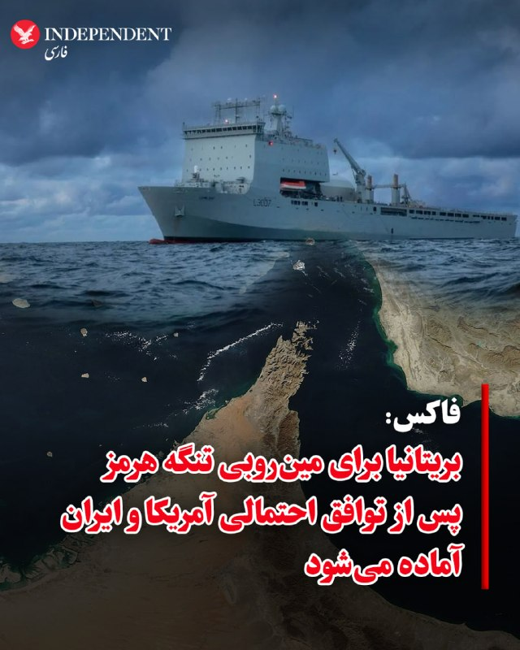

♦️شبکه خبری فاکس روز شنبه چهارم خرداد ماه در گزارشی نوشت صدها ملوان بریتانیایی در حال آماده‌سازی برای اعزام به تنگه هرمز با هدف پاکسازی مین‌های دریایی هستند و این عملیات پس از دستیابی به توافق احتمالی میان آمریکا و ایران آغاز خواهد شد.
بر اساس این گزارش، کشتی «آر‌اف‌ای لایم‌بی» که اکنون در نزدیکی سواحل جبل‌الطارق مستقر است، پس از نهایی شدن توافق راهی خاورمیانه می‌شود. این شناور در حال بارگیری مهمات و پهپادهای دریایی مین‌یاب مجهز به سونار است.
فاکس نیوز به نقل از آسوشیتدپرس گزارش داد این کشتی قرار است پیش از عبور از کانال سوئز به سمت خلیج فارس، به ناوشکن بریتانیایی «اچ‌ام‌اس دراگون» و دیگر شناورهای متحد برای پشتیبانی هوایی ملحق شود.
جما بریتون، رئیس گروه مقابله با مین و تهدیدات نیروی دریایی سلطنتی بریتانیا، به آسوشیتدپرس گفت ایران می‌تواند «طیف گسترده‌ای» از مین‌های دریایی را در تنگه هرمز مستقر کند.
به گفته او، این مین‌ها ممکن است راکتی، متصل به کابل یا کار گذاشته‌شده در بستر دریا باشند و با صدا، حرکت یا نور فعال شوند.
‌🇸🇦 Indypersian

🤖 @VahidOOnLine

## VahidOOnLine — post 242118

  

دونالد ترامپ در تروث سوشال نوشت مذاکرات با جمهوری اسلامی به‌خوبی در حال پیشرفت است. یا توافقی بزرگ برای همه خواهد بود، یا اصلا توافقی در کار نخواهد بود؛ در غیر این صورت بازگشت به میدان نبرد و تیراندازی در ابعادی بزرگ‌تر و قدرتمندتر از قبل رخ خواهد داد، و هیچ‌کس این را نمی‌خواهد.»

‌🏁 🇬🇧 IranintlTV

🤖 @VahidOOnLine

## WithYashar — post 12428

## WithYashar — post 12427

رئیس جمهور مکزیک رسما از میزبانی تیم ملی فوتبال ایران در جام جهانی خبر داد

«کلودیا شین‌بام» رئیس‌جمهور مکزیک، رسماً اعلام کرد که تیم ملی فوتبال ایران به دلیل محدودیت‌های حضور در خاک آمریکا، در ایالت «باخا کالیفرنیا» مستقر خواهد شد.
با تایید دولت مکزیک، تیم ملی ایران شهر «تیخوانا» را به عنوان مقر اصلی و محل تمرینات خود در طول مسابقات جام جهانی ۲۰۲۶ انتخاب کرده است.
@withyashar

## WithYashar — post 12426

## WithYashar — post 12425

کانال ۱۴ اسرائیل: اختلاف نتانیاهو با ترامپ عملیات فریب است

طبق گفته یک تحلیلگر ارشد امنیتی اسرائیل، گزارش‌های درز کرده درباره تماس‌های تلفنی پرتنش میان ترامپ و نتانیاهو بر سر ایران واقعی نبودند، بلکه بخشی از یک راهبرد حساب‌شده برای گمراه‌کردن تهران بودند.

بر اساس گزارش کانال ۱۴ اسرائیل، این جنجال با گزارشی از پایگاه خبری آکسیوس آغاز شد که مدعی بود یک تماس تلفنی به‌ ویژه دشوار میان ترامپ و نتانیاهو درباره یک پیشنهاد جدید آمریکایی که از طریق پاکستان برای ایران ارسال شده، صورت گرفته است.

کوبی مایکل، پژوهشگر ارشد در مؤسسه مطالعات امنیت داخلی (INSS) و مؤسسه میسگاو، توضیح می‌دهد که این یک فریب تاکتیکی درخشان بوده است: «نه رئیس‌جمهور ترامپ و نه نخست‌وزیر نتانیاهو هیچ علاقه‌ای به یک بحران واقعی ندارند. با درز داستان درباره یک بحران جدی ادعایی میان آن‌ها، ایرانی‌ها ممکن است از زمان‌بندی حمله نظامی بعدی کاملاً غافلگیر شوند.»
@withyashar

## WithYashar — post 12424

وال استریت ژورنال ادعا کرده روند توافق بین ایران و آمریکا به خاطر اختلاف نظر شدید تو موضوع هسته‌ای و آزادسازی پول‌های بلوکه شده ایران خیلی کند شده (به بن‌بست نزدیک شده)
@withyashar

## WithYashar — post 12423

  <a href="telegram/content/WithYashar_12423_1779724049.mp4" target="_blank">🎬 Download video</a>

یک خلبان کلمبیایی که در ارتفاع ۱۲۵۰۰ پایی پرواز می‌کرد، تصویری را ثبت کرد که به عنوان بهترین فیلم ثبت شده از بشقاب پرنده‌ها تا به حال توصیف شده است و بنا به گزارش‌ها، اصالت آن تأیید شده است.
@withyashar

## WithYashar — post 12422

  <a href="telegram/content/WithYashar_12422_1779724051.mp4" target="_blank">🎬 Download video</a>

اتاق جنگ با یاشار : بار جدید نخود رسید
@withyashar

## WithYashar — post 12421

## WithYashar — post 12420

  <a href="telegram/content/WithYashar_12420_1779724053.mp4" target="_blank">🎬 Download video</a>

۹۵٪ از توافق ایران تکمیل شده؛ ایران اگر بخواهد به توافق صلح ابراهیم می‌تواند بپیوندد/ خبرنگار فاکس‌نیوز در تل‌آویو:

"ترامپ به طور خاص از عربستان سعودی و قطر خواست که بپیوندند و اضافه کرد که دیگران نیز باید از آنها پیروی کنند. او حتی در صورتی که ایران این توافق را امضا کند، درِ ورود ایران به پیمان ابراهیم را باز گذاشت.

در حال حاضر، دولت ترامپ می‌گوید توافق با ایران ۹۵ درصد کامل شده است، اما جزئیات نهایی همچنان در حال بررسی است. دیروز در تماسی با خبرنگاران، یکی از مقامات ارشد دولت توضیح داد که ممکن است چندین روز طول بکشد تا به تفاهم‌نامه برسیم، زیرا سیستم ایران به سادگی نمی‌تواند به سرعتی که ایالات متحده می‌خواهد حرکت کند...

در حال حاضر، ایران میلیاردها دلار از دارایی‌های بلوکه‌شده خود را به همراه معافیت‌های تحریم نفتی دریافت خواهد کرد، اما به گفته مقامات آمریکایی، تنها در صورتی که به تعهدات خود پایبند باشند."
@withyashar

## WithYashar — post 12419

مهر: ایران با سامانه دفاعی جدید خودش به نام «کمان ارش» یه پهپاد جاسوسی دشمن رو رهگیری کرد
@withyashar
گویا همین پدافند قشم است

## WithYashar — post 12418

اتاق جنگ با یاشار : نقشه عالی پیش میره 😃💪🏾 مثل بنز داره کار میکنه … از این جدیدایه فابریک صفر کارخونه برند نیو

## WithYashar — post 12417

دو مقام اسرائیلی به رویترز: نتانیاهو به نزدیکان خود می‌گوید که هیچ تأثیری بر تصمیمات ترامپ ندارد
@withyashar

## mwarmonitor — post 9700

  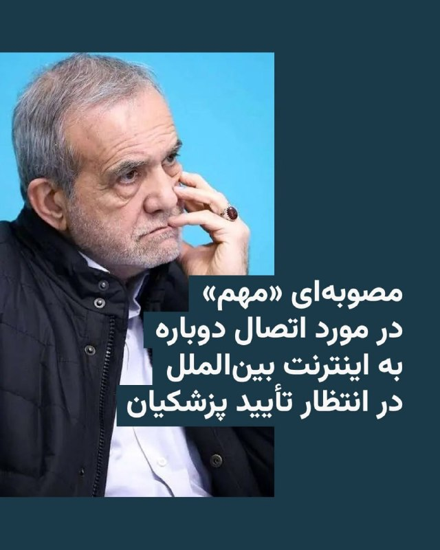

📝 همان ثانیه اول شروع جنگ، مثل موش‌های غافلگیرشده پریدید روی سیم و در کسری از ثانیه کل اینترنت کشور را قطع کردید؛ اما حالا یک ماه است که این انگل‌زاده‌های کت‌شلواری و دایناسورهای عهد بوق، اندر خم وصل کردن مجدد آن مانده‌اند. خنده‌دار اینجاست که رسانه‌ها با بوق و کرنا از مصوبه «جدید و مهم» ستاد ساماندهی برای بازگشت اینترنت به وضعیت قبل از دی‌ماه ۱۴۰۴ خبر می‌دهند؛ مصوبه‌ای که بعد از کلی چای خوردن با ۹ رای موافق تصویب شده و حالا لنگِ تایید نهایی مسعود پزشکیان است. واقعاً کدام حیوانی به این رئیس‌جمهور رای داده؟ موجودی که تنها شباهتش به رئیس، به خط کردن آفتابه‌های توالت‌های پادگان است و حالا برای چهار تا پورت اینترنت که خودشان قطع کرده‌اند، باید منتظر امضای ولایتمدارانه‌اش ماند. این کمدیِ مضحک نشان می‌دهد که حق بدیهی میلیون‌ها انسان، گروگانِ مشتی بی‌خاصیت است که برای بدیهی‌ترین کارها هم یک ماه جلسات پوچ برگزار می‌کنند.

@mwarmonitor

## mwarmonitor — post 9699

  <a href="telegram/content/mwarmonitor_9699_1779724055.mp4" target="_blank">🎬 Download video</a>

🔴ارتش اسرائیل (IDF) اعلام کرده است که حملات خود را به اهداف حزب‌الله در منطقه صور و سایر مناطق جنوب لبنان آغاز کرده است.

@mwarmonitor

## mwarmonitor — post 9698

📌 رئیس‌جمهور مکزیک، شینباوم، اعلام کرده است که دولتش موافقت کرده به تیم ملی فوتبال ایران اجازه دهد در جریان جام جهانی در مکزیک اقامت داشته باشد، پس از آنکه ایالات متحده اعلام کرده بود تمایلی به میزبانی آن‌ها ندارد.

@mwarmonitor

## mwarmonitor — post 9697

🔴عربستان سعودی اعلام کرده است که روابط خود را با اسرائیل عادی‌سازی نخواهد کرد، مگر اینکه مسیری غیرقابل بازگشت به سمت تشکیل یک دولت فلسطینی وجود داشته باشد. CNN

@mwarmonitor

## mwarmonitor — post 9696

🔴گفت‌وگوهای ایران درباره برنامه هسته‌ای و کاهش تحریم‌ها به بن‌بست خورده است.

🔸با این حال، هر دو طرف انگیزه‌هایی برای رسیدن به توافق دارند، اما هر کدام بر مواضع خود پافشاری می‌کنند؛ ترامپ نیز گفته است که «یک توافق بد را نخواهد پذیرفت».

@mwarmonitor

## mwarmonitor — post 9695

  <a href="telegram/content/mwarmonitor_9695_1779724056.mp4" target="_blank">🎬 Download video</a>

✈️نقل و انتقالات هوایی نیروی هوایی آمریکا به خاورمیانه با حجم بالا همچنان ادامه دارد، با وجود صحبت‌هایی که درباره نزدیک بودن نهایی شدن مذاکرات مطرح شده است.

@mwarmonitor

## mwarmonitor — post 9694

🔸وزیر امور خارجه امارات متحده عربی، شیخ عبدالله بن زاید آل نهیان، هشدار داده است که اروپا در نهایت به دلیل نبود اقدامات قاطع از سوی رهبران اروپایی و «وسواس نسبت به اصلاحات سیاسیِ افراطی (woke political correctness)»، ممکن است حتی بیشتر از خاورمیانه تولیدکننده افراط‌گرایان و اسلام‌گرایان تندرو باشد.

🔹او به‌طور مشخص به وجود هسته‌های افراط‌گرای اسلام‌گرا در شهرهای اروپایی مانند لندن، و همچنین در آلمان، اسپانیا و ایتالیا اشاره کرده و هشدار داده است که کشورهایی که در برخورد با این موضوع کوتاهی کنند ممکن است به‌عنوان «پرورشگاه‌های تروریسم» طبقه‌بندی شوند.

🔹بخش قابل توجهی از افرادی که در اروپا به‌دلیل طراحی یا تلاش برای حملات اسلام‌گرایانه بازداشت یا متوقف می‌شوند، نوجوانان محلی با تابعیت اروپایی (سنین ۱۴ تا ۱۹ سال) هستند که به‌طور کامل از طریق شبکه‌های اجتماعی و پلتفرم‌های بازی آنلاین رادیکال شده‌اند، بدون اینکه هرگز به خاورمیانه سفر کرده باشند.

🔸شیخ عبدالله بن زاید آل نهیان گفته است:
«روزی خواهد رسید که ما شاهد خواهیم بود افراط‌گرایان و تروریست‌های بسیار بیشتری از اروپا خارج می‌شوند، به دلیل نبود تصمیم‌گیری قاطع، تلاش برای سیاسی‌کاری بیش از حد، یا این تصور که آن‌ها اسلام و خاورمیانه و دیگران را بهتر از خودشان می‌شناسند. و متأسفم، اما این چیزی جز ناآگاهی نیست.»

@mwarmonitor

## mwarmonitor — post 9693

  

✈️دو فروند هواپیمای گشت دریایی بوئینگ P-8 پوسایدون نیروی دریایی آمریکا امروز در آن منطقه بین دریای عرب و خلیج عمان در حال عملیات بوده‌اند.

⁉️سؤال این است که آیا گروه رزمی ناو هواپیمابر یو‌اس‌اس جورج اچ. دبلیو. بوش در نزدیکی آن منطقه قرار دارد یا نه.

@mwarmonitor

## mwarmonitor — post 9692

مذاکرات با جمهوری اسلامی ایران به خوبی در حال پیشرفت است! این یا یک «توافق بزرگ» برای همه خواهد بود، یا هیچ توافقی در کار نخواهد بود — بازگشت به جبهه جنگ و شلیک، اما بزرگتر و قوی‌تر از هر زمان دیگری — و هیچ‌کس این را نمی‌خواهد! من در طول گفتگوهایم در روز شنبه…

## mwarmonitor — post 9691

🛢نفت خام برنت بیش از ۵ درصد سقوط کرد و معاملات آتی شاخص داوجونز صنعتی افزایش یافت، هرچند سرمایه‌گذاران همچنان نسبت به تأثیر مذاکرات آمریکا و ایران تردید دارند. وال‌استریت ژورنال

@mwarmonitor

## mwarmonitor — post 9690

🔸 رویترز: مذاکرات قالیباف و عراقچی در دوحه بر موضوع تنگه هرمز و اورانیوم غنی‌شده متمرکز خواهد بود. @mwarmonitor

## mwarmonitor — post 9689

🔴 وزارت خارجه روسیه: اتباع خارجی فوراً کی‌یف را ترک کنند. @mwarmonitor

## mwarmonitor — post 9688

🔴 وزارت خارجه روسیه: اتباع خارجی فوراً کی‌یف را ترک کنند.

@mwarmonitor

## mwarmonitor — post 9687

🔴بانک مرکزی اسرائیل کاهش نرخ بهره را از سر گرفته است؛ اقدامی که با کاهش تورم، تقویت شِکِل اسرائیل و نشانه‌هایی از پیشرفت در مسیر توافق احتمالی میان آمریکا و ایران تقویت شده است. بلومبرگ

@mwarmonitor

## mwarmonitor — post 9686

مذاکرات با جمهوری اسلامی ایران به خوبی در حال پیشرفت است! این یا یک «توافق بزرگ» برای همه خواهد بود، یا هیچ توافقی در کار نخواهد بود — بازگشت به جبهه جنگ و شلیک، اما بزرگتر و قوی‌تر از هر زمان دیگری — و هیچ‌کس این را نمی‌خواهد! من در طول گفتگوهایم در روز شنبه…

## mwarmonitor — post 9685

مذاکرات با جمهوری اسلامی ایران به خوبی در حال پیشرفت است! این یا یک «توافق بزرگ» برای همه خواهد بود، یا هیچ توافقی در کار نخواهد بود — بازگشت به جبهه جنگ و شلیک، اما بزرگتر و قوی‌تر از هر زمان دیگری — و هیچ‌کس این را نمی‌خواهد!
من در طول گفتگوهایم در روز شنبه با پرزیدنت محمد بن سلمان آل سعود از عربستان سعودی، محمد بن زاید آل نهیان از امارات متحده عربی، امیر تمیم بن حمد بن خلیفه آل ثانی، نخست‌وزیر محمد بن عبدالرحمن بن جاسم بن جابر آل ثانی و وزیر علی الثوادی از قطر، فیلد مارشال سید عاصم منیر احمد شاه از پاکستان، پرزیدنت رجب طیب اردوغان از ترکیه، پرزیدنت عبدالفتاح السیسی از مصر، ملک عبدالله دوم از اردن و ملک حمد بن عیسی آل خلیفه از بحرین، اعلام کردم که پس از تمام تلاش‌های انجام‌شده توسط ایالات متحده برای کنار هم چیدن این پازل بسیار پیچیده، باید اجباری باشد که همه این کشورها، در کمترین حالت، به‌طور هم‌زمان «پیمان ابراهیم» را امضا کنند.
کشورهای مورد بحث عبارتند از: عربستان سعودی، امارات متحده عربی (که در حال حاضر عضو است!)، قطر، پاکستان، ترکیه، مصر، اردن و بحرین (که در حال حاضر عضو است!). این احتمال وجود دارد که یک یا دو کشور دلیلی برای عدم انجام این کار داشته باشند و این پذیرفته خواهد شد، اما اکثر آن‌ها باید آماده، مایل و قادر باشند تا این توافق با ایران را به رویدادی به مراتب تاریخی‌تر از آنچه در غیر این صورت می‌بود، تبدیل کنند.
پیمان ابراهیم برای کشورهای درگیر (امارات متحده عربی، بحرین، مراکش، سودان و قزاقستان) یک شکوفایی مالی، اقتصادی و اجتماعی بزرگ را، حتی در این زمانه جنگ و درگیری، به اثبات رسانده است؛ به‌طوری که اعضای فعلی آن هرگز حتی پیشنهاد خروج یا حتی وقفه‌ای در آن را نداده‌اند. دلیل آن این است که پیمان ابراهیم برای آن‌ها عالی بوده است، برای همه حتی بهتر خواهد بود و برای اولین بار در ۵۰۰۰ سال گذشته، قدرت، استحکام و صلح واقعی را به خاورمیانه خواهد آورد. این سندی خواهد بود که مانند هیچ سند دیگری که تا به حال در هیچ کجای جهان امضا شده، مورد احترام قرار خواهد گرفت. سطح اهمیت و اعتبار آن بی‌نظیر خواهد بود!
این روند باید با امضای فوری توسط عربستان سعودی و قطر شروع شود و بقیه نیز باید از آن‌ها پیروی کنند. اگر این کار را نکنند، نباید بخشی از این توافق باشند، چرا که این امر نشان‌دهنده سوءنیت است. در گفتگو با بسیاری از رهبران بزرگی که در بالا نام برده شد، آن‌ها مایه افتخار خود خواهند دانست که به محض امضای سند ما، جمهوری اسلامی ایران نیز بخشی از پیمان ابراهیم شود. وای، این واقعاً چیز ویژه‌ای خواهد بود! این مهم‌ترین توافقی خواهد بود که هر یک از این کشورهای بزرگ، اما همیشه درگیر در مناقشه، امضا کرده‌اند. هیچ‌چیز در گذشته یا در آینده، بر آن پیشی نخواهد گرفت.
بنابراین، من به صورت الزامی درخواست می‌کنم که همه کشورها فوراً پیمان ابراهیم را امضا کنند و اگر ایران توافق خود را با من، به عنوان رئیس‌جمهور ایالات متحده آمریکا، امضا کند، مایه افتخار خواهد بود که آن‌ها نیز بخشی از این ائتلاف جهانی بی‌نظیر باشند.
خاورمیانه متحد، قدرتمند و از نظر اقتصادی قوی خواهد شد، شاید شبیه به هیچ منطقه دیگری در هیچ کجای جهان! با رونوشت این «تروث» (پیام)، من از نمایندگانم می‌خواهم که فرآیند امضای این کشورها در پیمانِ از قبل تاریخیِ ابراهیم را آغاز کرده و با موفقیت به پایان برسانند. با تشکر از توجه شما به این موضوع!

دونالد جی. ترامپ رئیس‌جمهور ایالات متحده آمریکا

@mwarmonitor

## FoxNewsTwitter — post 342217

  

Fox News (Twitter/X)

"Nothing says, I want attention more than disparaging a national hero who's also dead."

Taya Kyle is unloading on Maine Senate candidate Graham Platner after he accused her late husband, 'American Sniper' Chris Kyle, of inflating his kill count by shooting innocent civilians.

Kyle called the comments "cowardly" and a "cheap political trick," saying Platner is trying to build notoriety by attacking someone "beloved" who can no longer defend himself.

"For me he would be out of the running immediately," she added.

## FoxNewsTwitter — post 342216

  

Fox News (Twitter/X)

This Memorial Day, we honor the brave men and women who made the ultimate sacrifice for our freedom, their courage and service will never be forgotten.

"The greatest fighting force the world has ever known is built upon the extraordinary service of selfless men and women who safeguard our liberty and preserve our way of life. Since the birth of our Nation nearly 250 years ago, countless souls have lost their lives in this noble and righteous pursuit. On Memorial Day, we honor these American heroes." — The White House

## FoxNewsTwitter — post 342212

Fox News (Twitter/X)

Pizza Hut franchises across the country are rolling out "Pizza Hut Classic" remodels to bring back the iconic '80s and '90s dining experience.

Franchisees are reviving beloved staples like the red cups, checkered tablecloths, salad bars, and classic Tiffany-style lamps to draw families back into dining rooms.

After years of sleek modern redesigns, the old-school dine-in feel is suddenly making a comeback.

## FoxNewsTwitter — post 342211

  

Fox News (Twitter/X)

WATCH LIVE: Intrepid Museum marks Memorial Day with tribute to fallen troops https://twitter.com/i/broadcasts/1AKEmmmZMmYKL

## FoxNewsTwitter — post 342210

  <a href="telegram/content/FoxNewsTwitter_342210_1779724060.mp4" target="_blank">🎬 Download video</a>

Fox News (Twitter/X)

An unprecedented hazmat emergency is unfolding in southern California after officials found a crack in a chemical tank.

Fire officials say they've been conducting an all-night mission monitoring the overheated tank to see if the threat of an explosion has passed, as Governor Gavin Newsom declares a state of emergency.

More than 40,000 people are now under evacuation orders, @Max_Gorden reports.

## FoxNewsTwitter — post 342206

Fox News (Twitter/X)

SEE IT: Secretary of State Marco Rubio tours India during a high-level diplomatic trip focused on strengthening U.S.-India relations.

The visit centers on defense, trade, and regional security as both countries deepen cooperation.

## FoxNewsTwitter — post 342205

  <a href="telegram/content/FoxNewsTwitter_342205_1779724061.mp4" target="_blank">🎬 Download video</a>

Fox News (Twitter/X)

United States Senate candidate Graham Platner launched a blistering attack on the political establishment alongside Senator Bernie Sanders during the first stop of their "Fighting Oligarchy" tour.

Platner took aim at long-serving politicians, specifically calling out Senator Susan Collins and declared that the current system exists solely to enrich elected officials while leaving everyday Americans behind.

"We will not just fight the oligarchy, we will defeat the oligarchy and the political system that it maintains. We will defeat the political system that it maintains.”

“The politics of Susan Collins, a politics that turns politicians into millionaires but tells you to be grateful for crumbs. It is a lie. It is a lie intended to serve the billionaire class."

## FoxNewsTwitter — post 342201

Fox News (Twitter/X)

Americans across the country are honoring its fallen heroes on Memorial Day. Today, we remember the brave men and women who made the ultimate sacrifice in service to our nation. 🇺🇸

Communities nationwide marked the holiday with ceremonies, parades, and moments of remembrance dedicated to those who gave their lives for America.

## FoxNewsTwitter — post 342200

  

Fox News (Twitter/X)

The DOJ is removing years of online records about Capitol riot prosecutions, saying the case pages were “partisan propaganda” tied to the Biden-era Justice Department.

The erased releases tracked hundreds of criminal cases stemming from the 2021 Capitol breach, including convictions for violent assaults on police officers.

At the same time, the administration is opening a $1.776 billion fund for people who claim they were unfairly investigated or prosecuted — and officials haven’t ruled out compensation for convicted Jan. 6 rioters.

## FoxNewsTwitter — post 342199

Fox News (Twitter/X)

NEW: President Trump announcing that he linked an expansion of the Abraham Accords to his ongoing negotiations for an Iran peace deal:

“During my discussions on Saturday... I stated that, after all the work done by the United States to try and pull this very complex puzzle together, it should be mandatory that all of these Countries, at a minimum, simultaneously, sign onto the Abraham Accords. Those Countries discussed are Saudi Arabia, The United Arab Emirates (already a Member!), Qatar, Pakistan, Türkiye, Egypt, Jordan, and Bahrain (already a Member!).”

“Most should be ready, willing, and able to make this Settlement with Iran a far more Historic Event than it would, otherwise, be... If Iran signs its Agreement with me, as President of the United States of America, it would be an Honor to have them also be part of this unparalleled World Coalition.”

## pm_afshaa — post 91467

🔴الحدث : منابع نزدیک میگن ایران آماده‌ست اورانیوم با غنای بالا رو از کشور خارج کنه

💧 Rainbet.com the #1 Non-KYC Crypto Casino & Sportsbook @rainbetcom

😁 @Pm_Afshaa

## pm_afshaa — post 91464

  <a href="telegram/content/pm_afshaa_91464_1779724063.mp4" target="_blank">🎬 Download video</a>

تلمبه های سنگین اسراییل به لبنان

💧 Rainbet.com the #1 Non-KYC Crypto Casino & Sportsbook @rainbetcom

😁 @Pm_Afshaa

## pm_afshaa — post 91463

درود هموطنان عزیزم یک دختر 26 سال داره بجرم کشتن یکنفر که وارد خونش شده که بهش تعرض و تجاوز بکنه صبح 5 خرداد اعدام میشه، باید ۱۰ میلیارد جمع بشه که رضایت بدن تا حالا ۹ میلیارد جمع شده  همه چی داخل تصویر هست کسی خواست استعلام بگیره میدونم ایرانی ها آدم با…

## pm_afshaa — post 91462

درود مجدد داداش نوکرتم خیلی دمت گرم برای این خانوم ۸۰۰ میلیون جمع شد به لطف شما عزیزان و بقیه و ۲۰۰ میلیون مونده خیلی خوشحال شدم

## pm_afshaa — post 91461

  <a href="telegram/content/pm_afshaa_91461_1779724065.webm" target="_blank">🎬 Download video</a>

🔴سناتور لیندسی گراهام:

پیشنهاد اخیر ترامپ که گسترش توافقنامه‌های ابراهیم رو به عنوان بخشی از یک توافق مذاکره‌شده در مورد مناقشه ایران الزامی میکنه، به سادگی درخشان است و منجر به مهم‌ترین تغییر در خاورمیانه در هزاران سال خواهد شد.

با صلح عربستان سعودی و دیگر کشورهایی مانند پاکستان با اسرائیل، منطقه شاهد سطحی از ثبات خواهد بود که پیش از رئیس‌جمهور ترامپ هرگز تصور نمیشد و در نهایت به یکپارچگی منطقه‌ای منجر خواهد شد که خاورمیانه رو به یک قدرت اقتصادی و منبع فرصت‌های خوب تبدیل میکنه، به جای اینکه یک انبار باروت باشه.

انتظار دارم متحدان عرب ما این رو بپذیرند، همچنین دوستان ما در اسرائیل، با تمرکز بر این وظیفه، زیرا شکست گزینه‌ای نیست - که تحلیلی درست خواهد بود.

💧 Rainbet.com the #1 Non-KYC Crypto Casino & Sportsbook @rainbetcom

😁 @Pm_Afshaa

## pm_afshaa — post 91460

  <a href="telegram/content/pm_afshaa_91460_1779724066.webm" target="_blank">🎬 Download video</a>

🔴وال استریت ژورنال:
مذاکرات ایران رو بحث برنامه هسته‌ای و لغو تحریم‌ها به بن‌بست خورده.

💧 Rainbet.com the #1 Non-KYC Crypto Casino & Sportsbook @rainbetcom

😁 @Pm_Afshaa

## pm_afshaa — post 91459

  <a href="telegram/content/pm_afshaa_91459_1779724066.mp4" target="_blank">🎬 Download video</a>

🔴خوش چشم، کارشناس صداوسیما:
روبیو، ویتکاف و کوشنر از طریق واسطه‌ها بهمون گفتن به توییت‌های ترامپ توجه نکنید.

💧 Rainbet.com the #1 Non-KYC Crypto Casino & Sportsbook @rainbetcom

😁 @Pm_Afshaa

## pm_afshaa — post 91458

  <a href="telegram/content/pm_afshaa_91458_1779724067.webm" target="_blank">🎬 Download video</a>

🔴مارک لوین: درباره توافق احتمالی، کلی مطلب توی اینترنت نوشته شده؛ اما من هیچ چیزی درباره خودِ مردم ایران ندیدم.

💧 Rainbet.com the #1 Non-KYC Crypto Casino & Sportsbook @rainbetcom

😁 @Pm_Afshaa

## pm_afshaa — post 91457

  <a href="telegram/content/pm_afshaa_91457_1779724068.mp4" target="_blank">🎬 Download video</a>

حملات پی در پی اسرائیل به جنوب لبنان

💧 Rainbet.com the #1 Non-KYC Crypto Casino & Sportsbook @rainbetcom

😁 @Pm_Afshaa

## pm_afshaa — post 91456

🔴حملات شدید اسراییل به لبنان

💧 Rainbet.com the #1 Non-KYC Crypto Casino & Sportsbook @rainbetcom

😁 @Pm_Afshaa

## pm_afshaa — post 91455

🔴ترامپ به فاکس نیوز:واقعاً فکر می‌کنید بعد از تمام کارهایی که انجام دادم، من فقط پول به ایران می‌دهم؟

💧 Rainbet.com the #1 Non-KYC Crypto Casino & Sportsbook @rainbetcom

😁 @Pm_Afshaa

## pm_afshaa — post 91454

  <a href="telegram/content/pm_afshaa_91454_1779724069.webm" target="_blank">🎬 Download video</a>

🔴پست جدید ترامپ: مذاکرات با جمهوری اسلامی ایران به خوبی پیش می‌رود! یا یک توافق عالی برای همه خواهد بود یا هیچ توافقی حاصل نمی‌شود - بازگشت به جبهه نبرد و تیراندازی، اما بزرگتر و قوی‌تر از همیشه - و هیچ کس این را نمی‌خواهد! در جریان مذاکرات روز شنبه‌ام با…

## pm_afshaa — post 91453

  <a href="telegram/content/pm_afshaa_91453_1779724070.webm" target="_blank">🎬 Download video</a>

🔴پست جدید ترامپ:

مذاکرات با جمهوری اسلامی ایران به خوبی پیش می‌رود! یا یک توافق عالی برای همه خواهد بود یا هیچ توافقی حاصل نمی‌شود - بازگشت به جبهه نبرد و تیراندازی، اما بزرگتر و قوی‌تر از همیشه - و هیچ کس این را نمی‌خواهد! در جریان مذاکرات روز شنبه‌ام با محمد بن سلمان آل سعود، رئیس جمهور عربستان سعودی، محمد بن زاید آل نهیان، رئیس جمهور امارات متحده عربی، امیر تمیم بن حمد بن خلیفه آل ثانی، نخست وزیر محمد بن عبدالرحمن بن جاسم بن جابر آل ثانی و وزیر علی الذوادی از قطر، فیلد مارشال سید عاصم منیر احمد شاه از پاکستان، رجب طیب اردوغان، رئیس جمهور ترکیه، عبدالفتاح السیسی، رئیس جمهور مصر، ملک عبدالله دوم، پادشاه اردن و ملک حمد بن عیسی آل خلیفه از بحرین، اظهار داشتم که پس از تمام کارهایی که ایالات متحده برای کنار هم قرار دادن این پازل بسیار پیچیده انجام داده است، باید اجباری باشد که همه این کشورها، حداقل، همزمان، توافقنامه ابراهیم را امضا کنند. این کشورها مورد بحث عبارتند از عربستان سعودی، امارات متحده عربی (که از قبل عضو است!)، قطر، پاکستان، ترکیه، مصر، اردن و بحرین (که از قبل عضو است!). ممکن است یک یا دو نفر دلیلی برای انجام ندادن این کار داشته باشند و این پذیرفته خواهد شد، اما اکثر آنها باید آماده، مایل و قادر باشند که این توافق با ایران را به یک رویداد تاریخی بسیار مهم‌تر از آنچه در غیر این صورت می‌توانست باشد، تبدیل کنند. توافق‌نامه‌های ابراهیم برای کشورهای درگیر (امارات متحده عربی، بحرین، مراکش، سودان و قزاقستان) یک رونق مالی، اقتصادی و اجتماعی بوده است، حتی در این دوران درگیری و جنگ، به طوری که اعضای فعلی هرگز پیشنهاد خروج یا حتی مکثی در آن نداده‌اند. دلیل این امر این است که توافق‌نامه‌های ابراهیم برای آنها عالی بوده است و برای همه حتی بهتر خواهد بود و برای اولین بار در 5000 سال گذشته، قدرت، استحکام و صلح واقعی را برای خاورمیانه به ارمغان می‌آورد. این سندی خواهد بود که مانند هیچ سند دیگری که تاکنون در هیچ کجای جهان امضا شده است، مورد احترام قرار نخواهد گرفت. سطح اهمیت و اعتبار آن بی‌نظیر خواهد بود! این توافق‌نامه باید با امضای فوری عربستان سعودی و قطر آغاز شود و همه دیگران نیز باید از آن پیروی کنند. اگر این کار را نکنند، نباید بخشی از این توافق باشند، زیرا این نشان دهنده نیت بد است. در صحبت با بسیاری از رهبران بزرگ ذکر شده در بالا، آنها مفتخر خواهند بود که به محض امضای سند ما، جمهوری اسلامی ایران را به عنوان بخشی از توافق‌نامه‌های ابراهیم داشته باشند. وای، این چیز خاصی خواهد بود! این مهمترین توافق‌نامه‌ای خواهد بود که هر یک از این کشورهای بزرگ، اما همیشه در حال جنگ، هرگز امضا خواهند کرد. هیچ چیز در گذشته یا در آینده از آن پیشی نخواهد گرفت. بنابراین، من به طور اجباری درخواست می‌کنم که همه کشورها فوراً توافق‌نامه‌های ابراهیم را امضا کنند و اگر ایران توافق‌نامه خود را با من، به عنوان رئیس جمهور ایالات متحده آمریکا، امضا کند، باعث افتخار خواهد بود که آنها نیز بخشی از این ائتلاف جهانی بی‌نظیر باشند. خاورمیانه متحد، قدرتمند و از نظر اقتصادی قوی خواهد بود، شاید مانند هیچ منطقه دیگری در هیچ کجای جهان! با کپی کردن این حقیقت، از نمایندگان خود می‌خواهم که روند پیوستن این کشورها به توافق‌نامه‌های تاریخی ابراهیم را آغاز و با موفقیت تکمیل کنند. از توجه شما به این موضوع متشکرم!

💧Rainbet.com the #1 Non-KYC Crypto Casino & Sportsbook @rainbetcom

😁 @Pm_Afshaa

## DEJradio — post 4951

  <a href="telegram/content/DEJradio_4951_1779724070.webm" target="_blank">🎬 Download video</a>

🛩️
🚨 فعال شدن پدافند در قشم
منابع داخلی: یک پهپاد سرنگون شد

عصر دوشنبه، حوالی ساعت ۱۶:۱۵ دقیقه به وقت ایران پدافند جزیره قشم فعال شد. ساعاتی بعد اعلام شد که نیروهای مسلح یک «پهپاد متخاصم» را بر فراز آب‌های خلیج فارس با استفاده از سامانه «آرش» مورد هدف قرار دادند.

در روزهای اخیر بارها مواردی از پرواز پهپادها بر فرار ایران گزارش شد اما مشخص نیست متعلق به کدام کشور بودند. برخی منابع ادعا کردند پهپاد ساقط شده اسرائیلی بود.

#پهپاد #قشم #خلیج_فارس
@DEJradio

## DEJradio — post 4950

⭕️ ترامپ گفت توافق با جمهوری اسلامی باید به گسترش پیمان ابراهیم منجر شود

دونالد ترامپ، رئیس‌ جمهوری آمریکا، روز دوشنبه گفت توافق احتمالی با تهران باید به گسترش پیمان ابراهیم در خاورمیانه بینجامد.
او در پیامی در شبکۀ «تروث سوشال اعلام کرد مذاکرات با جمهوری اسلامی «به خوبی پیش می‌رود».
ترامپ هشدار داد اگر مذاکرات شکست بخورد، منطقه دوباره به یک میدان جنگ بزرگ‌تر و شدیدتر از پیش تبدیل می‌شود.
رئیس جمهوری آمریکا تأکید کرد توافق یا باید برای همه بزرگ و معنادار باشد، یا توافقی در کار نیست.
ترامپ افزود عربستان سعودی و قطر باید بی‌درنگ به پیمان ابراهیم بپیوندند و دیگر کشورهای منطقه نیز از آنها پیروی کنند.
به گفتۀ ترامپ اگر جمهوری اسلامی توافق مورد نظر آمریکا را امضا کند، پیوستن تهران به پیمان ابراهیم می‌تواند بخشی از یک ائتلاف جهانی بی‌سابقه، باشد.
رئیس‌ جمهوری آمریکا اعلام کرد با رهبران پادشاهی سعودی، امارات، قطر، پاکستان، ترکیه، مصر، اردن و بحرین درمورد آیندۀ خاورمیانه و توافق احتمالی با جمهوری اسلامی گفت‌وگو کرده است.
ترامپ توافق احتمالی را «مهم‌ترین توافق تاریخ خاورمیانه» عنوان کرد.

#پیمان_ابراهیم #خاورمیانه
@DEJradio

## DEJradio — post 4949

⭕️ سی‌بی‌اس خبر زندگی پنهانی و پیکی مجتبی خامنه‌ای را تأیید کرد

شبکۀ خبری سی‌بی‌اس به نقل از مقام‌های آگاه در دولت آمریکا گزارش داد مجتبی خامنه‌ای، رهبر جمهوری اسلامی، در مکانی نامعلوم پنهان شده و دسترسی بسیار محدودی به دنیای خارج دارد.
بر پایۀ این گزارش، ارتباطات او تنها از طریق شبکه‌ای پیچیده از پیک‌ها و نامه‌برها انجام می‌شود.
نهادهای اطلاعاتی آمریکا گفتند حتا مقام‌های بلندپایۀ حکومت نیز از محل پنهان شدن خامنه‌ای آگاهی ندارند.
مقام‌های آمریکایی گفته‌اند مسئولان جمهوری اسلامی که مجوز مذاکره با دولت آمریکا را دارند، برای ارتباط‌گیری در داخل ساختار حکومت با مشکلات جدی روبه‌رو شده‌اند. آنها می‌گویند همین موضوع روند مذاکرات را کند کرده است.
دو مقام آمریکایی به سی‌بی‌اس گفتند هر بار که واشینگتن جزئیات پیشنهادی را ارسال می‌کند، دسترسی نداشتن به مجتبی خامنه‌ای، پاسخ تهران را با تاخیری طولانی همراه می‌کند.
مجتبی خامنه‌ای از زمان آغاز حملات آمریکا و اسرائیل به جمهوری اسلامی، به‌شدت زخمی و سپس ناپدید شده است.
با وجود معرفی مجتبی خامنه‌ای به عنوان رهبر سوم جمهوری اسلامی، تاکنون هیچ تصویر یا صدایی از او منتشر نشده است.
منابع آگاه همچنین گزارش دادند بسیاری از رهبران جمهوری اسلامی هفته‌های بسیاری را در پناهگاه‌های بسیار مستحکم سپری می‌کنند و فقط در موارد بسیار ضروری با یکدیگر ارتباط دارند.
مسعود پزشکیان در هفته‌های پیشین از دیداری دو ساعت و نیمه با مجتبی خامنه‌ای خبر داده و از «ویژگی‌های شخصیتی» او تمجید کرده بود.
برخی منابع آگاه بر این باورند که مجتبی خامنه‌ای کشته شده و تنها شبحی از او در نزد مقامات سپاه به بیانیه نویسی مشغول است.

#موشتبا
@DEJradio

## DEJradio — post 4948

⭕️ بهای نفت در پی احتمال توافق جمهوری اسلامی و آمریکا سقوط کرد

بهای نفت روز دوشنبه در پی افزایش احتمال توافق میان آمریکا و جمهوری اسلامی برای پایان دادن به جنگ، حدودا شش درصد کاهش یافت.
قیمت‌ها در این روز به پایین‌ترین سطح در دو هفتۀ اخیر رسیده است.
بر پایۀ گزارش خبرگزاری رویترز، بهای نفت برنت با کاهش ۵.۷ درصدی به ۹۷ دلار و ۶۹ سنت برای هر بشکه رسید.
نفت خام وست‌تگزاس آمریکا نیز که شاخص قیمت نفت در این کشور به شمار می‌رود، با کاهش شش درصدی ۹۰ دلار و ۸۵ سنت معامله شد.
پیش از آغاز جنگ چهل روزه، درحدود بیست درصد از صادرات نفت و گاز طبیعی مایع در دنیا، از تنگۀ هرمز عبور می‌کرد.

#نفت
@DEJradio

## DEJradio — post 4947

⭕️ روبیو: یا با تهران به توافقی خوب می‌رسیم یا از راهی دیگر برخورد می‌کنیم

مارکو روبیو، وزیر امور خارجۀ آمریکا، روز دوشنبه گفت برای پایان دادن به جنگ با جمهوری اسلامی ممکن است «امروز» توافقی به‌دست بیاید.
او در دهلی‌نو، پایتخت هندوستان گفت شامگاه گذشته ممکن بود خبری برسد، اما شاید هم امروز چیزی در راه باشد.
روبیو افزود آمریکا یا به یک توافق خوب با جمهوری اسلامی می‌رسد، یا از راهی دیگری با آنها برخورد می‌کند.
وزیر امور خارجۀ آمریکا تأکید کرد واشینگتن پیش از بررسی گزینه‌های دیگر، به دیپلماسی کاملا فرصت می‌دهد.
او افزود طرح باز نگه داشتن تنگۀ هرمز از پشتیبانی گسترده‌ای در خلیج فارس برخوردار است و کشورهای منطقه آن را «معقول و ضروری» می‌دانند.
روبیو اطمینان داد جمهوری اسلامی وارد مذاکراتی «واقعی، مهم و زمان‌بر» درباره پرونده هسته‌ای می‌شود.
او تصریح کرد دونالد ترامپ عجله‌ای ندارد و هیچ توافق بدی را امضا نمی‌کند.

#مارکو_روبیو #مذاکرات
@DEJradio

## DEJradio — post 4946

  <a href="telegram/content/DEJradio_4946_1779724071.webm" target="_blank">🎬 Download video</a>

⭕️
🚨 یکی دیگر از معترضان انقلاب شیر و خورشید اعدام شد؛ صدور حکم اعدام برای چهار متهم پروندۀ اکباتان

قوۀ قضائیۀ جمهوری اسلامی اعلام کرد عباس اکبری فیض‌آبادی، از معترضان دی‌ماه ۱۴۰۴ را اعدام کرده است.
خبرگزاری میزان، وابسته به دستگاه قضائی مدعی شد عباس اکبری فیض‌آبادی، یکی از «لیدرهای مسلح» اعتراض‌ها در نائین بوده است. بنا بر این ادعا، او در حمله به فرمانداری نائین و تیراندازی به سوی مأموران نقش داشت.
هیچ جزئیاتی دربارۀ روند دادرسی، شرایط دادگاه و دسترسی این مخالف سیاسی رژیم به وکیل، منتشر نشده است.
جمهوری اسلامی از شکنجۀ روحی و جسمی بر بازداشت‌شدگان برای گرفتن اعتراف اجباری از آنها علیه خودشان استفاده می‌کند.
از سویی قوه قضائیه از صدور حکم اعدام برای چهار متهم پروندۀ کشته‌شدن یک بسیجی در شهرک اکباتان تهران در جریان اعتراض‌های ۱۴۰۱ خبر داد.
شعبۀ ۱۵ دادگاه انقلاب این افراد را با اتهام «افساد فی‌الارض» به اعدام محکوم کرد.
در روزهای پیشین شعبۀ ۱۳ دادگاه کیفری تهران حکم قصاص متهمان این پرونده را نقض و آن‌ها را به حبس و پرداخت دیه محکوم کرده بود.
وکلای متهمان گفتند احکام اعدام به‌صورت ناگهانی و شفاهی، بدون طی مراحل قانونی، از سوی قاضی صلواتی اعلام شده است.
قاضی صلواتی یکی از بدنام‌ترین افراد دستگاه قضائی است که به صدور فله‌ای حکم اعدام برای متهمان سیاسی شهرت دارد.

#اعدام #زندانیان_سیاسی
@DEJradio

## DEJradio — post 4945

⭕️ یک عضو فعال حماس در فاجعۀ کشتار هفتم اکتبر، توسط اسرائیل حذف شد

ارتش اسرائیل اعلام کرد طی عملیاتی لؤی هشام محمود بصل، عضو حماس را که در حملۀ هفتم اکتبر به پایگاه زیکیم نقش داشت، حذف کرد.
بر پایۀ بیانیه ارتش اسرائیل، بصل به‌عنوان تک‌تیرانداز در گردان زیتون حماس فعالیت می‌کرد.
اسرائیل گزارش داد که این فرد در روزهای اخیر نیز برای اجرای حملات علیه نیروهای اسرائیلی برنامه‌ریزی می‌کرد.
عملیات ارتش اسرائیل با هدف رفع یک تهدید فوری، انجام شد.
در جریان فاجعۀ هفتم اکتبر 2023 بیش از هزار تن از شهروندان اسرائیل کشته شده بودند.
حماس که توسط جمهوری اسلامی پشتیبانی می‌شود، در سیاهۀ تروریستی اروپا و آمریکا قرار دارد.

#اسرائیل #حماس
@DEJradio

## DEJradio — post 4944

⭕️پاکستان از چین خواست برای توافق احتمالی تهران و واشینگتن وارد عمل شود

منابع آگاه گفتند شهباز شریف، نخست‌وزیر پاکستان، در گفت‌وگو با مقام‌های چینی دربارۀ مذاکرات جمهوری اسلامی و آمریکا رایزنی کرد.
بر اساس گزارش‌ها، اسلام‌آباد خواستارنقش فعال و ضمانت چین در توافق احتمالی میان جمهوری اسلامی و آمریکا شد.
شهباز شریف که همراه با عاصم منیر، فرماندۀ ارتش پاکستان به پکن سفر کرده است، ادعا کرد مذاکرۀ تهران و واشینگتن «در مسیر درست در حال پیش‌روی است».
نخست‌وزیر پاکستان همچنین از پشتیبانی چین از تلاش‌های میانجی‌گرانۀ اسلام‌آباد برای برقراری آتش‌بس و کاهش تنش در منطقه خبر داد.

#مذاکرات #چین #پاکستان
@DEJradio

## DEJradio — post 4943

⭕️معاون پزشکیان خواهان بازگشت سردار آزمون به تیم ملی شد

عبدالکریم حسین‌زاده، معاون رئیس‌ جمهوری در امور توسعۀ روستایی و مناطق محروم، خواستار دعوت دوبارۀ سردار آزمون به تیم ملی فوتبال جمهوری اسلامی ایران شد.
او در شبکۀ اجتماعی اکس مدعی شد «نیاز وطن» حفظ نخ‌های پیوند بین فرزندانش است.
بنا بر ادعای این مقام دولتی، بازگرداندن آزمون پیامی به نفع انسجام ملی، قلمداد می‌شود.
نام سردار آزمون در فهرست ۳۰ نفرۀ تیم ملی برای جام جهانی ۲۰۲۶ که به‌تازگی اعلام شد، دیده نمی‌شود.
پشتیبانی سردار آزمون از اعتراضات مردمی و انتشار تصاویرش در کنار حاکم دوبی، از دلایل غیررسمی کنار گذاشته شدن او از تیم ملی عنوان شد.
قوۀ قضائیه پیش‌تر دستور به توقیف اموال این بازیکن معترض تیم ملی داده بود.
سردار آزمون با ۵۷ گل زدۀ ملی، دومین گلزن برتر تاریخ تیم ملی فوتبال ایران است.

#سردار_آزمون #فوتبال #جام_جهانی
@DEJradio

## DEJradio — post 4942

⭕️ کلاس‌های دانشگاه آریامهر تا اطلاع بعدی مجازی می‌ماند

معاونت آموزشی دانشگاه آریامهر که پس از 57 با نام صنعتی شریف شناخته می‌شود، اعلام کرد کلاس‌های همۀ مقاطع تحصیلی این دانشگاه تا اطلاع بعدی همچنان به‌صورت مجازی برگزار می‌شود.
بر اساس ادعای مسئولان دانشگاه، با وجود تصمیم پیشین برای حضوری شدن کلاس‌های تحصیلات تکمیلی از نهم خردادماه، هنوز «امکان ارائۀ پایدار خدمات اینترنت و امکانات رفاهی» فراهم نیست.
تداوم اختلال گستردۀ اینترنت در ایران طی هفته‌های اخیر، فعالیت بسیاری از دانشگاه‌ها و مراکز آموزشی را تحت تاثیر قرار داده است.
از سویی در زمان بازگشایی حضوری دانشگاه‌ها، چندین تجمع دانشجویی در پشتیبانی از شاهزاده رضا پهلوی و انقلاب شیر و خورشید برگزار شده بود.

#دانشجویان #دانشگاه
@DEJradio

## DEJradio — post 4941

⭕️ آمادگی نیروی دریایی بریتانیا برای مین‌روبی احتمالی در تنگۀ هرمز

کشتی بریتانیایی آر.اف.ای لایم بی، در تنگۀ جبل‌الطارق برای مأموریت احتمالی مین‌روبی در تنگۀ هرمز آماده می‌شود.

رویترز گزارش داد این شناور قرار است همراه با ناوشکن اچ‌ام‌اس دراگون، و سایر کشتی‌های متحدان، برای عملیات احتمالی به رهبری بریتانیا و فرانسه راهی خلیج فارس شود.
نیروی دریایی بریتانیا از سویی پهپادهای دریایی مین‌شکار و تجهیزات ویژۀ شناسایی مین در این کشتی بارگیری می‌کند.
به گفتۀ مقام‌های بریتانیایی از ابتدای جنگ چهل روزه، دستکم شش هزار کشتی از عبور از تنگۀ هرمز منع شدند.
بریتانیا می‌گوید هنوز مشخص نیست جمهوری اسلامی واقعاً در آبراه هرمز مین‌گذاری کرده باشد.
شرکت‌های بیمه برای ازسرگیری کامل تردد دریایی خواهان یقین مطلق، درمورد امنیت مسیر شده‌اند.
برخی ناظران می‌گویند جمهوری اسلامی از «ادعای» مین‌گذاری برای ترساندن نفتکش‌ها و برهم زدن نظم بازار جهانی استفاده کرده است.

#بریتانیا #تنگه_هرمز
@DEJradio

## DEJradio — post 4940

⭕️ قالیباف و عراقچی برای دیدار با مقام‌های قطر به دوحه رفتند

خبرگزاری رویترز به نقل از یک مقام آگاه گزارش داد محمدباقر قالیباف، رئیس مجلس و عباس عراقچی، وزیر امور خارجۀ جمهوری اسلامی، در دوحه حضور دارند.
بر اساس این گزارش که عصر دوشنبه منتشر شد، این دو مقام جمهوری اسلامی قرار است با محمد بن عبدالرحمن آل‌ثانی، نخست‌وزیر و وزیر خارجۀ قطر، دیدار و گفت‌وگو کنند.
رویترز نوشت این دیدارها در چارچوب رایزنی‌ برای دستیابی به توافق میان تهران و واشینگتن انجام می‌شود.
قطر در هفته‌های اخیر در کنار پاکستان به یکی از کانال‌های اصلی میانجی‌گری میان جمهوری اسلامی و آمریکا تبدیل شده است.
مقامات قطر پیش از جنگ چهل روزه نیز تلاش بسیاری کردند تا مانع حملۀ آمریکا و اسرائیل به جمهوری اسلامی بشوند.

#قطر
@DEJradio

## DEJradio — post 4939

⭕️
🌐 محاصرۀ دیجیتال در ایران هشتادوهفتمین روز رسید

نت‌بلاکس، اعلام کرد قطعی سراسری اینترنت در ایران وارد هشتادوهفتمین روز پیاپی شده است. این قطعی از مرز ۲۰۶۴ ساعت عبور کرده است.
این نهاد جهانی پایش اینترنت هشدار داد قطعی اینترنت، شفافیت دربارۀ اعدام‌ها و وضعیت زندانیان و بازداشت‌شدگان را از میان برده است.
نهاد عفو بین‌الملل اعلام کرده در هفته‌های اخیر، دستکم ۳۶ نفر در پرونده‌های سیاسی اعدام شدند.
بر پایۀ گزارش‌های داخلی، نبود اینترنت سبب آسیب گسترده به اقتصاد دیجیتال و کاهش فروش آنلاین شده است.
از سویی اینترنت طبقاتی و دسترسی ویژۀ برخی نهادها و شرکت‌ها به اینترنت بین‌الملل، انتقادهای گسترده‌ای را در ایران برانگیخته است.
حکومت از سویی اینترنت رانتی را در اختیار هواداران خود می‌گذارد تا به نفع آن، در شبکه‌های اجتماعی در دنیا تبلیغ کنند.

#اینترنت
@DEJradio

## mamlekate — post 103582

📝 قالیباف و عراقچی در سفری غیرمنتظره وارد قطر شدند

@mamlekate

## mamlekate — post 103581

📝 مصوبه «اتصال اینترنت بین‌الملل» برای اجرا «در انتظار تأیید پزشکیان» است

منابع داخلی ایران از تصویب مصوبه‌ای تازه درباره اتصال اینترنت بین‌الملل خبر داده‌اند؛ مصوبه‌ای که هنوز اجرا نشده و اجرای آن به تأیید نهایی مسعود پزشکیان و ابلاغ به وزارت ارتباطات و فناوری اطلاعات منوط است.

@mamlekate

## VahidOnline — post 75703

دونالد ترامپ، رئیس جمهور آمریکا، روز دوشنبه در تازه‌ترین پیام خود در شبکه اجتماعی‌اش ضمن خبر دادن از پیشرفت «خوب» در مذاکره با ایران، از تمام کشورهای دخیل در این مذاکرات خواست پس از حصول توافق با ایران، بلافاصله به پیمان‌های ابراهیم بپیوندند.

پیمان یا پیمان‌های ابراهیم طرحی بود که دونالد ترامپ در دوره اول خود برای تلاش در راه عادی‌سازی روابط میان اعراب و اسرائیل آغاز کرد و موفق شد تا چندین کشور از جمله بحرین و امارات متحده عربی را هم به این کار ترغیب کند.

حال رئیس جمهور آمریکا روند توافق با جمهوری اسلامی را به این طرح پیوند زده و به گفته خود این «خواسته اجباری» را با دیگر کشورهای عرب خلیج فارس و همین طور ترکیه مطرح کرده که به‌فوریت و همزمان به پیمان ابراهیم بپیوندند.
@VahidHeadline
دونالد ترامپ در شبکه تروث سوشال نوشت که پیوستن جمهوری اسلامی به پیمان ابراهیم، می‌تواند به «اتفاقی تاریخی» تبدیل شود.
او افزود که در گفت‌وگو با سران عربستان سعودی، امارات متحده عربی، قطر، ترکیه، مصر، اردن و بحرین، تاکید کرده لازم است همه این کشورها به‌طور هم‌زمان پیمان ابراهیم را برای عادی‌سازی روابط با اسرائیل امضا کنند.

ترامپ نوشت: ««کشورهایی که درباره آن‌ها صحبت شد عبارت‌اند از عربستان سعودی، امارات متحده عربی (که هم‌اکنون عضو است)، قطر، پاکستان، ترکیه، مصر، اردن و بحرین (که هم‌اکنون عضو است). ممکن است یکی دو کشور دلیلی برای انجام ندادن این کار داشته باشند و این پذیرفته خواهد شد، اما بیشتر آن‌ها باید آماده، مایل و قادر باشند که این توافق با ایران را به رویدادی بسیار تاریخی‌تر از آنچه در غیر این صورت می‌بود تبدیل کنند.»
@VahidOOnLine

📡 @VahidOnline

## VahidOnline — post 75701

خبرگزاری‌های رویترز و فرانسه به نقل از یک مقام آگاه، از سفر غیر‌منتظره محمد باقر قالیباف و عباس عراقچی، مذاکره‌کنندگان ارشد ایران، به دوحه خبر داده‌اند.

بر اساس این گزارش‌ها، رئیس مجلس و وزیر خارجه ایران برای گفت‌وگو با نخست‌وزیر قطر به دوحه سفر کرده‌اند.

رویترز نوشت که این گفت‌و‌گوها عمدتا درباره «تنگه هرمز و ذخایر اورانیوم غنی‌شده» ایران است.

رسانه‌های ایران گزارش داده بودند که عبدالناصر همتی، رئیس کل بانک مرکزی ایران، برای «بررسی آزادسازی اموال بلوکه‌شده و در راستای کمیسیون اقتصادی مذاکرات» به قطر سفر کرده است.

هیئتی از قطر هفته پیش به ایران سفر کرده بود.

یکی از خواسته‌های ایران در مذاکره با آمریکا آزاد شدن منابع مالی مسدودشده‌اش است.
@VahidHeadline

📡 @VahidOnline

## VahidOnline — post 75700

  

دونالد ترامپ، رئیس‌جمهور آمریکا، در پیامی در شبکه اجتماعی تروث سوشال گفت توافق احتمالی با ایران یا «عالی و معنادار» خواهد بود یا اساساً توافقی در کار نخواهد بود.

آقای ترامپ در این پیام، منتقدان خود در میان دموکرات‌ها و برخی جمهوری‌خواهان را به باد انتقاد گرفت و گفت آنان «هیچ چیز» دربارهٔ توافق احتمالی او با ایران نمی‌دانند و حتی دربارهٔ موضوعاتی اظهار نظر می‌کنند که به گفتهٔ او «هنوز مذاکره نشده‌اند».

ترامپ تأکید کرد توافق مورد نظر او با ایران «دقیقاً نقطهٔ مقابل» توافق هسته‌ای برجام خواهد بود؛ توافقی که او بار دیگر آن را «فاجعه» خواند و دولت باراک اوباما را به گشودن «مسیر مستقیم و آشکار» ایران به سوی جنگ‌افزار هسته‌ای متهم کرد.

او در پایان پیام خود نوشت: «من چنین توافق‌هایی نمی‌کنم.»
@VahidHeadline

📡 @VahidOnline

## VahidOnline — post 75699

  

رسانه‌های ایران از تصویب مصوبه‌ای «جدید و مهم» دربارهٔ اتصال دوباره اینترنت کشور به اینترنت بین‌الملل در «ستاد ویژه ساماندهی فضای مجازی» خبر داده‌اند؛ مصوبه‌ای که هنوز برای اجرا نیازمند تأیید نهایی مسعود پزشکیان، رئیس‌جمهور ایران، است.

خبرگزاری فارس روز دوشنبه چهارم خرداد گزارش داد چهارمین جلسه این ستاد به ریاست محمدرضا عارف، معاون اول رئیس‌جمهور، برگزار شد و در آن «مصوبات مهمی» دربارهٔ اتصال به اینترنت بین‌الملل به تصویب رسید.

فارس به نقل از یک منبع نوشت که «برقراری اتصال اینترنت بین‌الملل» با ۹ رأی موافق و سه رأی مخالف تصویب شده و برای تأیید به دفتر رئیس‌جمهور ارسال شده است.

خبرگزاری تسنیم نیز با انتشار گزارشی مشابه نوشت مصوبات این جلسه پس از تأیید نهایی رئیس‌جمهور، برای اجرا به وزارت ارتباطات و فناوری اطلاعات ابلاغ خواهد شد.

در همین حال، سیتنا، رسانه تخصصی حوزه ارتباطات و فناوری اطلاعات، به نقل از «یک منبع آگاه» گزارش داد که در جلسه صبح دوشنبه «بازگشت اینترنت به وضعیت قبل از دی‌ماه ۱۴۰۴» مصوب شده و در صورت تأیید مسعود پزشکیان، جهت اجرا به وزارت ارتباطات ابلاغ خواهد شد.
@VahidHeadline

📡 @VahidOnline

## VahidOnline — post 75698

  

رسانه‌های ایران به نقل از «حسین کرمانپور»، رییس مرکز روابط عمومی وزارت بهداشت، گزارش دادند که جراحت‌های وارد شده به «مجتبی خامنه‌ای»، رهبر جمهوری اسلامی، در جریان حملات اخیر «سطحی» بوده و مشکل جدی برای او ایجاد نکرده است.

کرمانپور گفت رهبر جمهوری اسلامی تنها از ناحیه صورت، سر و پاها دچار جراحت شده و این آسیب‌ها «منجر به قطع عضو یا ناراحتی خاصی نشده است.»او همچنین مدعی شد که هنگام انتقال خامنه‌ای به بیمارستان، پزشکان از او خواسته‌اند روزه خود را بشکند، اما او تا زمان افطار روزه‌اش را ادامه داده است.
@VahidHeadline

📡 @VahidOnline

## VahidOnline — post 75697

  

ایران می‌گوید که سفر وزیر خارجه به نیویورک برای شرکت در نشست شورای امنیت «منتفی» شده است.

اسماعیل بقایی، سخنگوی وزارت خارجه ایران، دلیل انجام نشدن سفر عباس عراقچی را «مشکل روادید» عنوان کرد.

آقای بقایی چهارشنبه هفته پیش درمورد حضور آقای عراقچی در این نشست گفته بود: «این سفر به نیویورک احتمال دارد انجام شود و البته ممکن هم هست انجام نشود، چون هنوز قطعی نیست. دلیلش هم این است که هم باید روادید صادر شود و هم ممکن است اولویت‌های دیگری داشته باشیم.»

چین به‌عنوان رئیس دوره‌ای شورای امنیت، سه‌شنبه ۲۶ مه یک بحث آزاد در سطح بالا با موضوع «حفظ اهداف و اصول منشور سازمان ملل و تقویت نظام بین‌المللی متمرکز بر سازمان ملل» برگزار خواهد کرد.

این جلسه به ریاست وانگ یی، عضو دفتر سیاسی کمیته مرکزی حزب کمونیست و وزیر امور خارجه چین، برگزار می‌شود.

چین این نشست را «فرصتی» برای همبستگی و اجماع کشورهای عضو توصیف کرد تا «تعهد راسخ خود را به حفظ اهداف و اصول منشور سازمان ملل متحد مجددا تصریح و نقش محوری این سازمان را در نظام بین‌المللی احیا کنند.»
@VahidHeadline

📡 @VahidOnline

## VahidOnline — post 75696

  

روز سه‌شنبه ۲۶ اردیبهشت‌ماه ۱۴۰۵، «جانا سعدوئی»، زن ۱۹ ساله، مادر دو کودک و اهل روستای تاریمیش از توابع بخش قطور شهرستان خوی، به دست همسر خود به قتل رسیده است.

به گفته منابع آگاه، همسر این زن پس از وارد کردن ضربات مرگبار، تلاش کرده است ماجرا را به‌عنوان «خودکشی» جلوه دهد.
با این حال، نتایج بررسی‌های پزشکی قانونی و تناقض‌های موجود در روایت‌ها و اظهارات مطرح‌شده، ابعاد این قتل و تلاش برای صحنه‌سازی را آشکار کرده است.
@VahidHeadline

📡 @VahidOnline

## IranIntlTV — post 338938

  

یائیر لاپید، رهبر اپوزیسیون اسرائیل، دوشنبه گفت توافق در حال شکل‌گیری میان واشینگتن و تهران هیچ‌یک از اهداف اسرائیل در جنگ را تامین نمی‌کند و بنیامین نتانیاهو را به ناتوانی در اعمال نفوذ برای دستیابی به توافقی بهتر متهم کرد.
لاپید در جمع خبرنگاران در اورشلیم گفت: این توافق برای اسرائیل، برای منطقه و برای مردم ایران بد است.

## IranIntlTV — post 338937

  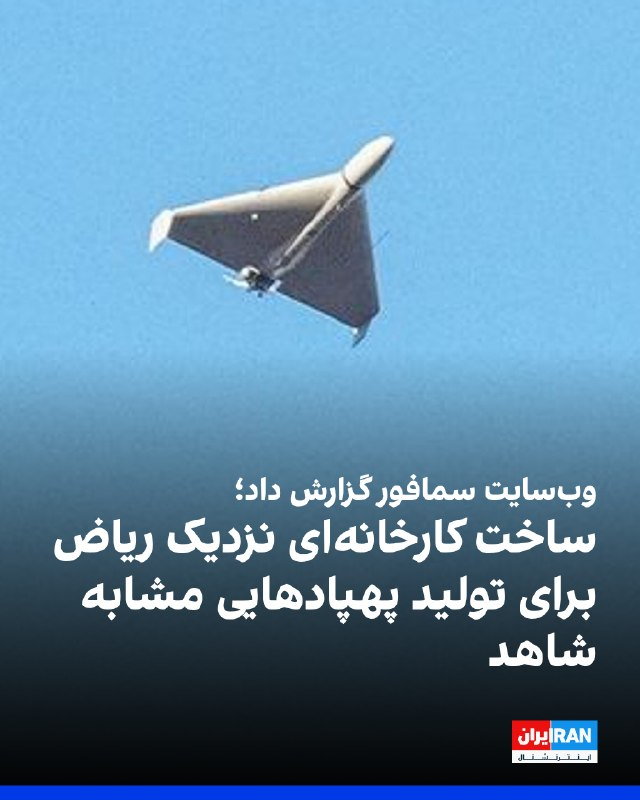

وب‌سایت سمافور گزارش داد یک سرمایه‌گذاری مشترک میان یک استارتاپ دفاعی آمریکایی و یک شرکت عربستان سعودی در حال ساخت کارخانه‌ای در نزدیکی ریاض برای تولید پهپادهای رزمی مشابه سامانه شاهد جمهوری اسلامی است.
سمافور افزود این پهپاد با برد ۱۵۰۰ کیلومتر برای تقویت بازدارندگی عربستان سعودی طراحی شده و تولید آن هم برای بازار داخلی و هم صادرات به کشورهای متحد برنامه‌ریزی شده است.

## IranIntlTV — post 338936

  <a href="telegram/content/IranIntlTV_338936_1779724075.mp4" target="_blank">🎬 Download video</a>

یک شهروند با ارسال پیامی به ایران‌اینترنشنال درباره مذاکره آمریکا و جمهوری اسلامی می‌گوید: «ترامپ کاری کرد که در خواب هم نمی‌دیدیم. حالا بدهکار ما شده؟ نجات ما وظیفه او نیست. هموطن، به پا خیز. جمهوری اسلامی را ما باید پایین بیاوریم.»

## IranIntlTV — post 338935

  <a href="telegram/content/IranIntlTV_338935_1779724076.mp4" target="_blank">🎬 Download video</a>

دونالد ترامپ بار دیگر با اشاره به توافق احتمالی میان تهران و واشینگتن، گفت‌وگوها با جمهوری اسلامی را در حال پیشرفت توصیف کرد. او افزود در گفت‌وگو با رهبران عربستان سعودی، امارات متحده عربی، قطر، پاکستان، ترکیه، مصر، اردن و بحرین تاکید کرده پیوستن به‌موقع به پیمان ابراهیم، شرط اصلی برای تحول تاریخی در خاورمیانه است.

سمیرا قرایی، خبرنگار ایران‌اینترنشنال، گزارش می‌دهد

@iranintltv

## IranIntlTV — post 338934

  <a href="telegram/content/IranIntlTV_338934_1779724078.mp4" target="_blank">🎬 Download video</a>

سرخط خبرهای دوشنبه ۴ خرداد
@iranintltv

## IranIntlTV — post 338933

  

🔻نجمه موسوی-پیمبری، از نزدیکان پرویز قلیچ‌خانی خبر داده که اسطوره فوتبال ایران پیش‌تر تصمیم گرفته بود پیکرش را به مراکز علمی اهدا کند: «پرویز قلیچ‌خانی، بر اساس باورهای شخصی خود تصمیم گرفته بود پیکرش را به مراکز علمی اهدا کند، به همین خاطر مراسم خاک‌سپاری برگزار نخواهد شد.»

🔹او که با انتشار یک پیام صوتی، این خبر را اعلام کرد، گفت: «پرویز، به دلیل فروتنی و برای جلوگیری از زحمت دیگران، تمایلی به برپایی مراسم یادبود رسمی نداشت. با این حال، دوستداران او می‌توانند، برای بزرگداشت جایگاه مردمیِ پرویز قلیچ‌خانی در هر کجای جهان برنامه‌هایی داوطلبانه برگزار کنند.»

🔹پرویز قلیچ‌خانی، کاپیتان پیشین تیم ملی فوتبال ایران، شنبه دوم خرداد ۱۴۰۵، در ۸۱ سالگی در حومه پاریس درگذشت. او تنها بازیکنی بود که سه بار با تیم ملی، قهرمان جام ملت‌های آسیا شد. قلیچ‌خانی پس از انقلاب به فعالیت سیاسی و روزنامه‌نگاری در خارج از کشور روی آورد.

@iranintltvsport

## IranIntlTV — post 338932

  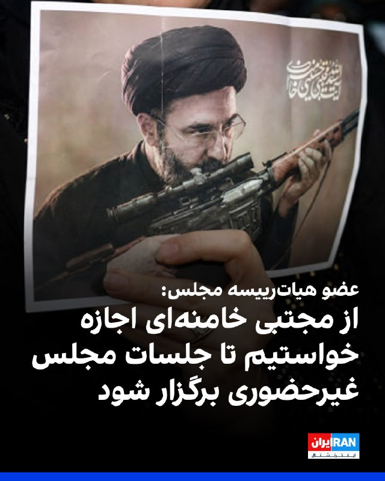

علیرضا سلیمی، عضو هیات‌رییسه مجلس گفت با توجه به شرایط جدید، از مجتبی خامنه‌ای اجازه خواستیم تا جلسات مجلس را به‌صورت وبیناری با امکان رای‌گیری برگزار کنیم.

او افزود به محض دریافت پاسخ از «رهبری»، هیات‌رییسه تصمیمات لازم را برای آغاز جدی فعالیت‌های عادی مجلس خواهد گرفت.
https://iranintl.com/202605254256

## IranIntlTV — post 338931

  <a href="telegram/content/IranIntlTV_338931_1779724080.mp4" target="_blank">🎬 Download video</a>

اطلاعات رسیده به ایران‌اینترنشنال جزییات تازه‌ای را از نحوه جاویدنام شدن بابک جعفری در ۱۹ دی‌ماه روایت می‌کند. او که ۳۴ ساله بود، در اصفهان با شلیک گلوله ماموران به کمرش مجروح شد و در درمانگاه جان باخت.
خانواده جعفری برای جلوگیری از ربوده شدن پیکرش از سوی ماموران حکومت، پیکر او را دو روز در خانه نگه داشتند و سپس به خاک سپردند.

فرنوش فرجی، عضو تحریریه ایران‌اینترنشنال، گزارش می‌دهد
@iranintltv

## IranIntlTV — post 338930

  <a href="telegram/content/IranIntlTV_338930_1779724081.mp4" target="_blank">🎬 Download video</a>

یک شهروند با ارسال پیام به ایران‌اینترنشنال می‌گوید: «هیچ‌کس به فکر ما نیست. هیچ‌چیز رایگان به دست نمی‌آید؛ حتی نان و آب. آزادی کشور هم رایگان نیست. واقعیت این است که آمریکا به فکر منافع خودش و متحدانش است. ما هم باید به فکر ایران و منافع خودمان باشیم. پایان کار جمهوری اسلامی با ماست.»

## IranIntlTV — post 338929

🔻فشار روانی بر داوطلبان کنکور به‌دلیل نامعلوم بودن زمان برگزاری آزمون

پیام‌های رسیده به ایران‌اینترنشنال نشان می‌دهد دانش‌آموزان پایه‌های یازدهم و دوازدهم با بلاتکلیفی درباره زمان برگزاری امتحان‌های نهایی و کنکور روبه‌رو هستند. به گفته آنان، همزمان با آموزش مجازی، قطع اینترنت و فشار اقتصادی نیز آینده تحصیلی‌شان را در هاله‌ای از ابهام قرار داده است.

در همین راستا، دانش‌آموزی ۱۷ ساله در پیامی برای ایران‌اینترنشنال نوشت آینده خود و هم‌نسلانش را مبهم و گیج‌کننده می‌بیند.

او از قطع اینترنت، کیفیت پایین آموزش و مشکلات اقتصادی خانواده‌ها سخن گفت که باعث بی‌انگیزگی آن‌ها شده است.

سردرگمی دانش‌آموزان در انتظار اعلام زمان کنکور

این دانش‌آموز از نبود شفافیت در مورد زمان و نحوه برگزاری امتحان‌های نهایی و کنکور ابراز نگرانی کرد.

به گفته او، نامتناسب بودن دخل و خرج، امکان برنامه‌ریزی برای آینده را به امری محال بدل کرده است.

دانش‌آموز دیگری نیز در پیامی مشابه، با اشاره به اینکه زمان و نحوه برگزاری امتحان‌ها و کنکور اعلام نشده، گفت آن‌ها فشار روانی زیادی را تحمل می‌کنند، اما صدایشان شنیده نمی‌شود.

تاثیر قطع اینترنت بر کیفیت آمادگی داوطلبان کنکور

ده‌ها پیام رسیده به ایران‌اینترنشنال نیز حاکی از تاثیر قطع اینترنت بر روند یادگیری دانش‌آموزان است.

یک دانش‌آموز در آستانه کنکور درباره وابستگی کامل روند مطالعه‌اش به اینترنت گفت: «بیشتر دوره‌های آموزشی را از تلگرام دانلود می‌کردم. دروس تخصصی را هم از یوتیوب و حتی دوره‌هایی را از اینستاگرام خریداری می‌کردم.»

یک داوطلب پشت‌کنکوری در پیامی برای ایران‌اینترنشنال نوشت امیدوار بوده امسال در رشته پزشکی پذیرفته شود، اما با شرایط فعلی این احتمال را دور از دسترس می‌بیند.

او گفت فایل‌های درسی و ویدیوهای آموزشی‌اش در تلگرام قرار داشته و با ادامه قطع اینترنت، امکان دسترسی و دانلود آن‌ها را ندارد.

در شرایطی که زمان زیادی تا برگزاری کنکور باقی نمانده، اعلام نشدن زمان دقیق آن از سوی سازمان سنجش آموزش کشور فشار روانی بسیاری به دانش‌آموزان وارد کرده و برخی از آن‌ها بار دیگر موضوع سهمیه‌های ورودی دانشگاه‌ها را مطرح کرده‌اند.

به گفته یکی از این دانش‌آموزان، نظام سهمیه‌بندی در سال‌های گذشته به نابرابری در پذیرش دانشگاه‌ها منجر شده و در شرایط فعلی، با توجه به بلاتکلیفی در مورد زمان کنکور، این احساس تبعیض پررنگ‌تر شده است.

پیش از این نیز دانش‌آموزان در پیام‌هایی به ایران‌اینترنشنال از این بلاتکلیفی و فشارهای ناشی از آن سخن گفته بودند.

برای نمونه، دانش‌آموزی از تهران گفت: «شرایط زندگی خیلی سخت شده و فشارهای روانی بالاست؛ مخصوصا برای دانش‌آموزان پایه‌های یازدهم و دوازدهم. درست نیست که در این شرایط امتحانی بگیرند که روی کنکور هم تاثیر می‌گذارد.»
اعتراض به هزینه‌های سنگین آموزشی

بعضی پیام‌های رسیده به ایران‌اینترنشنال حاوی دعوت به تجمع اعتراضی مقابل سازمان سنجش است.

در یکی از این پیام‌ها از دانش‌آموزان پایه‌های یازدهم و دوازدهم تهران خواسته شده برای اعتراض به شیوه برگزاری امتحان‌ها و تاثیر آن بر کنکور، مقابل این سازمان تجمع کنند.

یک دانش‌آموز پایه یازدهم نیز در پیامی اعلام کرد هنوز زمان دقیق امتحان‌های نهایی مشخص نیست و درباره برگزاری آن‌ها در تیرماه یا شهریورماه اظهار نظرهای متفاوتی مطرح شده است.

به گفته او، در دوره آموزش مجازی به‌دلیل قطع اینترنت و ارائه نشدن کامل برخی دروس، فرآیند یادگیری با اختلال مواجه بوده، در حالی که نتیجه این امتحان‌ها، تاثیری مستقیم بر کنکور دارد.

دانش‌آموزان دیگری نیز به پیامدهای جنگ و شرایط اقتصادی اشاره کردند.

یکی از آن‌ها گفت پس از حدود ۸۰ روز اختلال در روند عادی آموزش و افت کیفیت تدریس، اکنون باید در امتحان‌های نهایی و سپس کنکور شرکت کنند. در شرایطی که به گفته او، سطح استرس و نگرانی در میان دانش‌آموزان پایه‌های یازدهم و دوازدهم بی‌سابقه است.

از رودهن نیز مخاطب دیگری به افزایش قیمت کتاب‌های کمک‌آموزشی اشاره کرد و گفت بهای برخی از آن‌ها به ۹۰۰ هزار تا یک میلیون و ۵۰۰ هزار تومان رسیده است.
🔗ادامه این گزارش را اینجا بخوانید
@iranintltv

## IranIntlTV — post 338928

🔻کاهش قدرت خرید مردم، کسب‌وکارها را به تعطیلی کشانده است

🖋سبا حیدرخانی

با ادامه بحران اقتصادی، افزایش قیمت کالاها، کاهش قدرت خرید، دیگر پیامدهای جنگ و نگرانی شهروندان از آینده، بسیاری از کسب‌وکارهایی که مستقیما با مردم در ارتباط هستند، با رکود شدید، کاهش فروش، تعدیل نیرو و خطر تعطیلی مواجه شده‌اند.

در هفته‌های اخیر صاحبان مشاغل خدماتی و اصنافی که معیشتشان به خرید روزانه و مصرف عمومی مردم وابسته است، در پیام‌هایی به ایران‌اینترنشنال تاکید کردند مردم حتی خریدهای روزمره و خدماتی را هم کاهش داده‌اند و بسیاری از بازارها به مرحله‌ای رسیده‌اند که دیگر مشتری وجود ندارد.

بر اساس این پیام‌ها، طیف گسترده‌ای از مشاغل، از رستوران‌ها و قهوه‌خانه‌ها تا فروشگاه‌های پوشاک و واحدهای گردشگری و خواروبارفروشی‌ها با رکود مواجه شده‌اند.

بسیاری از صاحبان این مشاغل می‌گویند افزایش شدید قیمت کالاها و کاهش قدرت خرید مردم باعث شده شهروندان، در کنار حذف بسیاری از هزینه‌های غیرضروری، حتی خریدهای معمول و روزمره خود را نیز محدود کنند.

برخی، وضعیت کنونی را یکی از دشوارترین دوره‌های سال‌های اخیر توصیف و تاکید کردند ترس از نامعلوم بودن آینده باعث شده مردم بیش از گذشته محتاط شوند و تا حد ممکن پول خود را برای موارد «ضروری و پیش‌بینی نشده» نگه دارند.
رستوران‌ها و فست‌فودها متاثر از بحران اقتصادی

صاحب یک قهوه‌خانه در میدان خراسان تهران گفت: «تنباکو کیلویی پنج میلیون تومان و ذغال کیلویی ۴۰۰ هزار تومان شده است. مجبور می‌شویم قیمت خدمات را بالا ببریم، اما با این کار مشتری‌ها را هم از دست می‌دهیم.»

یک شهروند دیگر هم از تعطیلی کارگاه تولیدی خود خبر داد و گفت به‌دلیل گرانی مواد اولیه، جنگ و کاهش توان مالی مردم، ورشکست شده و ناچار شده کارگاهش را ببندد.

او افزود: «چند کارگر بیکار شدند و همه دستگاه‌ها را نصف قیمت فروختم، چون توان پرداخت اجاره را نداشتم.»

در بازار تهران نیز به گفته شهروندان، بسیاری از غذاخوری‌ها عملا بدون مشتری مانده‌اند.

مخاطبی در پیامی به ایران‌اینترنشنال در یک نمونه به قیمت ۸۰۰ هزار تومانی یک پرس قرمه‌سبزی اشاره کرد و گفت فروش بیشتر رستوران‌ها و فست‌فودها به صفر رسیده است.

پیش‌تر احمد میدری، وزیر تعاون، کار و رفاه اجتماعی، از ثبت‌نام دریافت بیمه بیکاری حدود ۲۳۰ هزار کارگری خبر داده بود که از آغاز جنگ تاکنون شغل خود را از دست داده‌اند.

حجت‌الله میرزایی، مدیر سابق صندوق‌های بازنشستگی کشور، نیز ۳۱ اردیبهشت پیش‌بینی کرد در سال جاری حدود ۴.۵ میلیون نفر دیگر به جمعیت زیر خط فقر اضافه شوند.

علاوه بر صاحبان کسب‌وکار، شهروندان نیز در پیام‌های هر روزه خود به ایران‌اینترنشنال گفتند با شدت تورم و نامعلوم بودن وضعیت گرانی‌های بیشتر، مردم حتی برای خواروبار هم فقط برای یکی دو روز خرید می‌کنند و دیگر توان خرید ماهانه ندارند.

بر اساس این پیام‌ها، برای یک سبد خرید روزمره شامل یک پاکت شیر، یک جعبه خرما، یک مایع ظرفشویی، سه بسته کره ۱۰۰ گرمی، یک ماست کوچک، یک بسته جو پرک، رشته پلویی، دو بسته چیپس خلالی، ۵۰۰ گرم قهوه و ۲۵۰ گرم گردو از میدان تره‌بار، باید شش میلیون و ۴۰۰ هزار تومان هزینه کرد.
🔗ادامه این گزارش را اینجا بخوانید
@iranintltv

## IranIntlTV — post 338927

  <a href="telegram/content/IranIntlTV_338927_1779724083.mp4" target="_blank">🎬 Download video</a>

اطلاعات تازه نشان می‌دهد در سه ماه گذشته سهم آیفون از ترافیک وب موبایل ایران افزایش یافته و سهم اندروید کاهش یافته است؛ تغییری که همزمان با قطع گسترده اینترنت، نشانه‌ای از پاکسازی طبقاتی اینترنت در ایران است.

در این الگو، کاربران با درآمد بیشتر یا دسترسی ویژه همچنان به وب جهانی متصل مانده‌اند؛ اما کاربران عادی از اینترنت جهانی کنار زده شده‌اند.
@iranintltv

## IranIntlTV — post 338926

  <a href="telegram/content/IranIntlTV_338926_1779724084.mp4" target="_blank">🎬 Download video</a>

ستاد راهبری و ساماندهی فضای مجازی بازگشت اینترنت به وضعیت قبل از دی ۱۴۰۴ را تصویب کرد. جلسه این ستاد به ریاست معاون اول مسعود پزشکیان تشکیل شد و اتصال دوباره به اینترنت بین‌المللی با ۹ رای موافق و ۳ رای مخالف تصویب شد.

گفت‌وگو با رضا حاجی‌حسینی، روزنامه‌نگار
@iranintltv

## IranIntlTV — post 338925

  <a href="telegram/content/IranIntlTV_338925_1779724085.mp4" target="_blank">🎬 Download video</a>

یک شهروند با ارسال پیامی به ایران‌اینترنشنال در خصوص مذاکره آمریکا و جمهوری اسلامی خطاب به ترامپ می‌گوید: «اول از تو بابت همراهی‌هایت ممنونم ولی اگر با قاتل مردم ایران هر توافقی کنی، نه می‌بخشیم و نه فراموش می‌کنیم. البته که ما قطعا خودمان ریشه این جهل و فساد را از تاریخ ایران درمی‌آوریم و به زباله‌دان تاریخ می‌اندازیم.»

## IranIntlTV — post 338924

  

خبرگزاری مهر، وابسته به سازمان تبلیغات اسلامی، اعلام کرد عصر دوشنبه، ساکنان محلی در جزیره قشم صدای فعالیت پدافند را گزارش کرده‌اند.
بنا بر این خبر، ماهیت این صداها مشخص نیست و هنوز هیچ‌یک از نهادهای رسمی درباره علت وقوع این صداها اظهارنظر نکرده‌اند.
https://iranintl.com/202605253102

## IranIntlTV — post 338923

  <a href="telegram/content/IranIntlTV_338923_1779724087.mp4" target="_blank">🎬 Download video</a>

گمانه‌زنی‌ها درباره احتمال ازسرگیری مذاکرات میان جمهوری اسلامی و آمریکا، رسانه‌های اجتماعی فارسی‌زبان را به‌شدت تحت تاثیر قرار داده است.

عادله بورنگ، عضو تحریریه ایران‌اینترنشنال، برخی از واکنش‌های کاربران را بررسی می‌کند
@iranintltv

## IranIntlTV — post 338922

🗣روایت شما از بحران اقتصادی و زندگی در آتش‌بس- دوشنبه ۴ خرداد:

🔹در ممسنی جو به شدت امنیتی است و تمام کسانی که در چهلم جاویدنامان حماسه آفریدند را دستگیر می‌کنند.

🔹در کاشان سر هر چهارراه و میدان چادر زده‌اند و به زن‌ها و بچه‌ها تیراندازی و کار با تفنگ آموزش می‌دهند؛ از بچه‌ای که باید به کلی از این مسائل دور باشد سوءاستفاده ابزاری می‌کنند.

🔹کسی بیشتر از ما دانش‌آموزان پایه‌های یازدهم و دوازدهم استرس و ترس ندارد؛ مایی که قرار است بعد از ۸۰ روز سختی و مشقت و کیفیت تدریس پایین امتحان نهایی و بعدش کنکور بدهیم.

🔹ما میدان خراسان تهران کنار پاساژ خراسان قهوه‌خونه داریم الان با این وضعیت گرانی چطور کار کنیم؟ تنباکو کیلویی ۵ میلیون و ذغال کیلویی ۴۰۰ هزار تومان است.

🔹من بیماری خودایمنی دارم و به‌خاطر پیدا نکردن یک قرص ساده کارم به بستری در بیمارستان کشیده.

🔹سیستان و بلوچستان اصلا کارت آزاد بنزین در این ۱۰ سال نداشته و خیلی‌ها ماشین‌هایشان را در نیمه دوم ماه استفاده نمی‌کنند.

🔹رفته بودم سوپرمارکت خرید کنم، متصدی فروشگاه گفت محصولات لبنی دوباره ۳۰ درصد افزایش یافته، آخرین تغییر قیمت ۱۰ روز پیش بود!

## IranIntlTV — post 338921

  

دونالد ترامپ در شبکه تروث سوشال نوشت که پیوستن جمهوری اسلامی به پیمان ابراهیم، می‌تواند به «اتفاقی تاریخی» تبدیل شود.
او افزود که در گفت‌وگو با سران عربستان سعودی، امارات متحده عربی، قطر، ترکیه، مصر، اردن و بحرین، تاکید کرده لازم است همه این کشورها به‌طور هم‌زمان پیمان ابراهیم را برای عادی‌سازی روابط با اسرائیل امضا کنند.

ترامپ نوشت: ««کشورهایی که درباره آن‌ها صحبت شد عبارت‌اند از عربستان سعودی، امارات متحده عربی (که هم‌اکنون عضو است)، قطر، پاکستان، ترکیه، مصر، اردن و بحرین (که هم‌اکنون عضو است). ممکن است یکی دو کشور دلیلی برای انجام ندادن این کار داشته باشند و این پذیرفته خواهد شد، اما بیشتر آن‌ها باید آماده، مایل و قادر باشند که این توافق با ایران را به رویدادی بسیار تاریخی‌تر از آنچه در غیر این صورت می‌بود تبدیل کنند.»
https://iranintl.com/202605256204

## ManotoTV — post 105829

  <a href="telegram/content/ManotoTV_105829_1779724090.mp4" target="_blank">🎬 Download video</a>

گفت‌وگو با کیوان عباسی:
«می‌گفت ایرانی‌ها باید بیشتر کنار هم بایستند…
و دوباره باور کنند که سرنوشت ایران را خود مردم ایران رقم می‌زنند.»

## FarsiVOA — post 218623

  <a href="telegram/content/FarsiVOA_218623_1779724091.mp4" target="_blank">🎬 Download video</a>

ارتش اسرائیل مواضع حزب‌الله را در نزدیکی منطقه صور در جنوب لبنان هدف قرار داد.

ارتش اسرائیل پیشتر به ساکنان ۱۰ منطقه شامل شهر و روستا در جنوب لبنان هشدار داده بود که پیش از حملات هوایی علیه مواضع گروه حزب‌الله لبنان، این مناطق را تخلیه کنند.

## FarsiVOA — post 218622

  <a href="telegram/content/FarsiVOA_218622_1779724093.mp4" target="_blank">🎬 Download video</a>

ارتش اسرائیل اعلام کرد روز گذشته یک نیروی کلیدی از ستاد تولید سازمان تروریستی حماس را از بین برد.

بنابر بیانیه ارتش اسرائیل، «محمد ابو ملوح»، یکی از منابع اصلی دانش در سازمان تروریستی حماس بود که در طول دوره آتش‌بس نیز به تولید تسلیحاتی مشغول بود که تهدیدی برای نیروهای ارتش در منطقه و شهروندان محسوب می‌شد. او با حمله نیروهای ارتش اسرائیل تحت فرماندهی جنوب در مرکز نوار غزه حذف شد.

ارتش اسرائیل تاکید کرد نیروهایش تحت فرماندهی جنوب مطابق با توافق در منطقه مستقر هستند و به فعالیت خود برای رفع هرگونه تهدید فوری ادامه می‌دهند.

## FarsiVOA — post 218621

در گفت‌وگو با مئیر جاودانفر، تحلیلگر مسائل خاورمیانه در اسرائیل، به هم‌زمانی سیگنال‌های مثبت درباره پیشرفت مذاکرات میان حکومت ایران و آمریکا پرداختیم و پرسیدیم آیا مسیر کنونی به توافقی واقعی منتهی می‌شود یا صرفاً بازیِ سیگنال‌ها و مدیریت انتظارات است؟

## FarsiVOA — post 218620

  <a href="telegram/content/FarsiVOA_218620_1779724094.mp4" target="_blank">🎬 Download video</a>

چیزی که در این مدت آموخته‌ایم این است که هیچ چیز هنوز قطعی نیست و همه چیز در تعلیق است. اما آیا فضای تازه‌ای که در مذاکرات ایران و آمریکا باز شده می‌‌تواند آغازی باشد برای یک پایان؟ کارشناسان میدان پاسخ می‌دهند

## FarsiVOA — post 218619

  <a href="telegram/content/FarsiVOA_218619_1779724095.mp4" target="_blank">🎬 Download video</a>

ارتش اسرائیل یک ساختمان حزب‌الله را در رشیدیه، جنوب لبنان، هدف قرار داد. این حمله پس از هشدار تخلیه انجام شد.

ارتش اسرائیل پیشتر به ساکنان ۱۰ منطقه شامل شهر و روستا در جنوب لبنان هشدار داده بود که پیش از حملات هوایی علیه مواضع گروه حزب‌الله لبنان، این مناطق را تخلیه کنند.

## FarsiVOA — post 218618

🔺نوبت به اهالی سینما رسید؛ هومن سیدی و سعید روستایی احضار شدند

▪️قوه قضائیه جمهوری اسلامی با پرونده‌سازی علیه شماری از اهالی سینما، از جمله هومن سیدی و سعید روستایی، آنها را به اتهام واهی «همکاری با دولت متخاصم» به «دادسرای فرهنگ و رسانه» احضار کرده است.

⬇️ بیشتر بخوانید:

https://ir.voanews.com/a/filing-a-case-against-cinema-workers-saeed-roustaei-hooman-seydi-judiciary-legal-director-of-the-cinema-house/8153614.html/?nocach=1

## FarsiVOA — post 218614

مارکو روبیو، وزیر امور خارجه آمریکا، و همسرش در جریان سفر به هند از تاج محل در شهر آگرا دیدار کرد.

@FarsiVOA

## FarsiVOA — post 218613

  <a href="telegram/content/FarsiVOA_218613_1779724097.mp4" target="_blank">🎬 Download video</a>

وزارت امور خارجه اسرائیل ویدیویی از اصابت پهپاد انفجاری حزب‌الله به یک خانه غیرنظامی اسرائیلی در شهر متولا منتشر و اعلام کرد «این سازمان تروریستی همچنان به نقض آتش‌بس ادامه می‌دهد و موشک و پهپاد به سمت خانواده‌ها و جوامع غیرنظامی شلیک می‌کند.»

ارتش اسرائیل تاکید کرد نیروهای این ارتش به فعالیت خود در منطقه برای رفع هرگونه تهدید فوری ادامه می‌دهند.

## FarsiVOA — post 218612

🔺پرزیدنت ترامپ: توافق با رژیم ایران باید به گسترش «پیمان ابراهیم» و اتحاد تاریخی خاورمیانه منجر شود

▪️دونالد ترامپ، رئیس جمهوری ایالات متحده، روز دوشنبه ۴ خرداد در پیامی مفصل در شبکه اجتماعی «تروت سوشال» اعلام کرد که مذاکرات با جمهوری اسلامی «به خوبی پیش می‌رود»، و تاکید کرد هرگونه توافق احتمالی با تهران باید به گسترش «پیمان ابراهیم» در خاورمیانه منجر شود.

⬇️ بیشتر بخوانید:

https://ir.voanews.com/a/president-trump-says-iran-deal-will-expand-abraham-accords/8153597.html/?nocach=1

## FarsiVOA — post 218611

تازه‌ترین آمار شرکت مدیریت منابع آب ایران نشان می‌دهد که ‌هم‌اکنون میزان پرشدگی پنج صد مهم کشور از جمله «سدهای لار، دوستی، پانزدهم خرداد، بارزو و ساوه» کمتر از ۱۰ درصد است.

خبرگزاری ایسنا با تحلیل آمار ورودی مخازن سدهای کشور در سال آبی جاری (ابتدای مهر ماه) تا دوم خرداد، نوشت که علیرغم افزایش موجودی مخازن سدهای غربی، استان‌های تهران، مرکزی، خراسان رضوی، قم، اصفهان، زنجان و همدان در وضعیت نامطلوبی قرار دارند.

بر این اساس تامین آب شرب در شهرهای وابسته به این منابع از جمله تهران، کرج، مشهد، اراک، قم، اصفهان، یزد، زنجان و همدان، با محدودیت مواجه است.

گزارش کامل را در وب‌سایت صدای آمریکا بخوانید.

@FarsiVOA

## FarsiVOA — post 218610

  <a href="telegram/content/FarsiVOA_218610_1779724099.mp4" target="_blank">🎬 Download video</a>

یک شهروند با گلایه از بحران اقتصادی که درپی جنگ اخیر و تعطیلی کارخانه‌ها، موجب بیکار شدن او شده است می‌گوید: «از توافق و آتش‌بس حرف می‌زنند اما در مورد کارخانه‌های بسته شده هیچ نمی‌گویند.»

اقتصاددانان ایرانی تصویری نگران‌کننده از اقتصاد ایران پس از جنگ ترسیم می‌کنند و هشدار داده‌اند در صورت ادامه آثار جنگ، بین ۳.۵ تا ۴.۵ میلیون نفر دیگر به جمعیت فقیر ایران افزوده می‌شوند و شمار افراد زیر خط فقر به بیش از ۴۰ میلیون نفر خواهد رسید.

جنگ، تحریم، تورم کالایی، توقف سرمایه‌گذاری، ضعف بازار کار و کاهش درآمد خانوارها در حال تبدیل شدن به یک بحران معیشتی گسترده‌اند؛ بحرانی که می‌تواند طبقه متوسط را کوچک‌تر، فقر را عمیق‌تر و بازار کار را ناپایدارتر کند.

## DW_Farsi — post 125137

🔶 ترامپ: یا به توافقی عالی با ایران می‌رسیم یا اصلا توافقی در کار نیست

دونالد ترامپ، رئیس‌جمهور آمریکا در پیامی تازه با قید این که گفت‌وگوها با ایران "به‌خوبی پیش می‌رود" نوشت، این مذاکرات یا به یک "توافق عالی" برای همگان منجر می‌شود یا اصلا توافقی در کار نخواهد بود.

در این پیام که دوشنبه ۴ خرداد (۲۵ مه) در شبکه اجتماعی تروث سوشال به نگارش درآمده هشدار داده شده که در غیر این صورت درگیری نظامی دوباره آغاز خواهد شد و همچنین "تیراندازی بزرگ‌تر و قوی‌تر از همیشه ـ و کسی چنین چیزی نمی‌خواهد."

ترامپ با یادآوری دیدار و گفت‌وگوهای اخیر خود با رهبران عربستان، امارات، قطر، پاکستان، ترکیه، مصر، اردن و بحرین گفت، اظهار کرده که پس از تمامی تلاش‌های انجام‌شده توسط ایالات متحده برای حل این مسئله پیچیده (در مورد ایران) باید برای این کشورها دست کم به صورت همزمان امضای پیمان ابراهیمکه همانا عادی‌سازی روابط با اسرائیل است الزامی باشد.  

ترامپ با اشاره به این که پیمان ابراهیم برای کشورهایی که آن را امضا کرده‌اند مانند امارات متحده عربی و بحرین "شکوفایی مالی، اقتصادی و اجتماعی" به بار آورده از عربستان، قطر و سایر کشورها نیز خواست که این روند را ادامه دهند و این پیمان را امضا کنند.

او تصریح کرد: «من قاطعانه از همه کشورها می‌خواهم که فورا پیمان ابراهیم را امضا کنند و اگر ایران هم با من، رئیس‌جمهور آمریکا، توافقش را امضا کند، مایه افتخار خواهد بود که آن‌ها نیز بخشی از این ائتلاف بی‌نظیر جهانی باشند.»

دونالد ترامپ در اولین دور ریاست جمهوری‌اش طرحی را به منظور صلح کشورهای عربی با اسرائیل به نام توافق یا پیمان صلح ابراهیم تهیه کرد. در اولین قدم از این طرح، امارات متحده عربی و بحرین به این توافق پیوسته و برای اولین بار روابط دیپلماتیک‌شان با اسرائیل را در سال ۲۰۲۰ از سر گرفتند.

@dw_farsi

## DW_Farsi — post 125136

🔶 چین سه فضانورد را راهی ایستگاه فضایی تیانگونگ کرد

سه فضانورد سفر خود به سمت ایستگاه فضایی تیانگونگ چین را در روز یکشنبه ۲۴ مه (۳ خرداد) آغاز کردند. فضاپیمای "شنژو-۲۳" در این روز با این سه فضانورد از پایگاه فضایی جیوکوان در بخش چینی صحرای گُبی (Gobi) به پرواز درآمد.

موشک "لانگ مارچ ۲ـ اف" فضاپیمای یادشده را در این روز به فضا فرستاد تا در نهایت به ایستگاه فضایی تیانگونگ چین در مدار زمین متصل شود.

در چارچوب این مأموریت، برای نخستین بار قرار است یک فضانورد چینی به‌مدت یک سال کامل در این ایستگاه فضایی اقامت داشته باشد؛ این در حالی است که به‌طور معمول، خدمه سه‌نفره این ایستگاه هر شش ماه یک‌بار تعویض می‌شوند.

پکن این اقدام را گامی اساسی در راستای تلاش‌های خود برای اعزام انسان به کره ماه تا سال ۲۰۳۰ قلمداد می‌کند.

@dw_farsi

## DW_Farsi — post 125135

🔶 کی‌یف زیر آتش؛ اوکراین خواستار واکنش جهانی شد

یک روز پس از حمله گسترده روسیه به کی‌یف، پایتخت اوکراین، بار دیگر حملات متقابل میان دو کشور در مناطق مرزی ادامه یافت.

مقام‌های روسیه در کانال تلگرام اعلام کردند که در منطقه بلگورود یک مرد در جریان حمله موشکی و پهپادی کشته و فرد دیگری زخمی شده است. همچنین به گفته آنها، زیرساخت‌های انرژی آسیب دیده‌اند که به قطع برق و آب در شهر بلگورود منجر شده است.

سرپرست فرمانداری منطقه بریانسک نیز اعلام کرد یک مرد دیگر در حمله اوکراین به شهرک "بلایا بریوزکا" در نزدیکی بریانسک کشته شده است.

به گزارش تلویزیون دولتی روسیه، در شهر "هورلیفکا" در شرق اوکراین که تحت اشغال روسیه است، پنج نفر در حملات پهپادی زخمی شده‌اند.

@dw_farsi

## DW_Farsi — post 125134

  <a href="telegram/content/DW_Farsi_125134_1779724101.mp4" target="_blank">🎬 Download video</a>

🎥 مخترعان آلمان کجا هستند؟

شرکت‌های بزرگ در آلمان سرمایه فراوانی دریافت می‌کنند. اما اقتصاد این کشور در رکود است. آیا آلمان روی گزینه درستی سرمایه‌گذاری می‌کند؟

@dw_farsi

## DW_Farsi — post 125133

🔶 رسانه‌ها: قالیباف و عراقچی برای مذاکرات وارد قطر شده‌اند

خبرگزاری‌های رویترز  و فرانسه به نقل از یک مقام آگاه از حضور محمدباقر قالیباف، مذاکره‌کننده ارشد ایران و عباس عراقچی، وزیر خارجه این کشور در دوحه قطر به منظور گفت‌وگو با نخست‌وزیر این کشور خبر داده‌اند.

بر اساس این گزارش‌ها، در این گفت‌وگوها توافق احتمالی میان ایران و آمریکا برای پایان دادن به جنگ بررسی خواهد شد.

رویترز به نقل از این مقام آگاه نوشت، محور اصلی مذاکرات موضوع تنگه هرمز و ذخایر اورانیوم بسیار غنی‌شده ایران خواهد بود.

به گفته خبرگزاری‌های داخلی، عبدالناصر همتی، رئیس بانک مرکزی نیز عازم قطر شده و در این سفر "آزادسازی اموال بلوکه‌شده ایران" را بررسی خواهد کرد.

این سفر در پی گفت‌وگوهای اخیر هیأت قطری در تهران در چارچوب میانجی‌گری در مذاکرات ایران و آمریکا صورت می‌گیرد.

در حالی که سرنوشت توافق احتمالی میان ایران و آمریکا در هاله‌ای از ابهام قرار دارد، روزنامه واشنگتن پست به نقل از یک مقام ارشد آمریکایی خبر داده که این دو کشور به یک "چارچوب" مشترک دست یافته‌اند که شامل تمدید ۶۰ روزه آتش‌بس تا رسیدن دو طرف به توافق نهایی برای پایان دادن به جنگ می‌شود.

با این حال این مقام گفت که هنوز هیچ توافقی با ایران امضا نشده و مشخص نیست که این چارچوب تا چه  حد الزام‌آور است.

محورهای اصلی توافق پیشنهادی

واشنگتن پست همچنین به نقل از یک دیپلمات آگاه که نامش ذکر نشد نوشت "آخرین پیشنهاد در انتظار تأیید ایران است."

طبق این گزارش، این پیشنهاد شامل این موارد کلیدی زیر می‌شود:

بازگشایی تنگه هرمز: ایران متعهد می‌شود فورا تنگه هرمز را بازگشایی و عملیات مین‌روبی را آغاز کند و ظرف ۳۰ روز شرایط تردد کشتی‌ها را به وضعیت پیش از جنگ بازگرداند.

توقف کامل درگیری‌ها: ایران، آمریکا و متحدانش متعهد ‌می‌شوند عملیات نظامی را در تمامی جبهه‌ها، از جمله لبنان فورا متوقف کنند.

مسئله هسته‌ای ایران: جمهوری اسلامی باید تعهد بدهد که هرگز سلاح هسته‌ای تولید نخواهد کرد. همچنین توافق شده که ذخایر اورانیوم غنی‌شده ایران یا "غبار هسته‌ای" تحت یک مکانیزم مورد توافق، منهدم یا واگذار شود.

@dw_farsi

## DW_Farsi — post 125132

  <a href="telegram/content/DW_Farsi_125132_1779724103.mp4" target="_blank">🎬 Download video</a>

🎥 مارکو روبیو: ترامپ توافق بد با ایران را نمی‌پذیرد

مارکو روبیو، وزیر خارجه آمریکا، در جریان سفر رسمی خود به هند گفت مذاکرات واشنگتن و جمهوری اسلامی همچنان ادامه دارد و آمریکا پیش از بررسی گزینه‌های دیگر، به "دیپلماسی" فرصت خواهد داد.

روبیو اعلام کرد مذاکرات میان واشنگتن و جمهوری اسلامی همچنان "در حال پیشرفت" است و آمریکا پیش از رفتن به‌سوی گزینه‌های دیگر، به دیپلماسی فرصت خواهد داد. روبیو در دهلی نو گفت چارچوبی "نسبتاً قوی" برای توافق روی میز قرار دارد که شامل بازگشایی تنگه هرمز و آغاز مذاکراتی محدود و جدی درباره برنامه هسته‌ای جمهوری اسلامی است. هم‌زمان، آسوشیتدپرس به نقل از مقام‌های منطقه‌ای گزارش داده آمریکا به توافقی نزدیک شده که می‌تواند به جنگ پایان دهد و جمهوری اسلامی ذخایر اورانیوم با غنای بالای خود را کنار بگذارد. روبیو همچنین درباره لبنان گفت تا زمانی که حزب‌الله مسلح باقی بماند، رسیدن به صلح در لبنان دشوار خواهد بود.

@dw_farsi

## DW_Farsi — post 125131

🎥 وقتی خودبودن جرم می‌شود؛ "مادرم گفت می‌کشمت"

یک مرد کوئیر عراقی از نجف می‌گوید که تهدیدهای خانواده‌اش همراه با قوانین ضد جامعه دگرباشان در عراق، او را مجبور کرد تا برای یافتن جایی که بتواند آزادانه و با امنیت زندگی کند، به بیروت فرار کند. آیا وضعیت در بیروت بهتر است؟

@dw_farsi

## Persian_Trend_Official — post 14953

  <a href="telegram/content/Persian_Trend_Official_14953_1779724105.webm" target="_blank">🎬 Download video</a>

ویدیو لو رفته از مذاکرات آمریکا با جمهوری اسلامی 😒

📝 Nick

📌 @persian_trend_official
پرشین ترند | متفاوت‌ترین کانال نظامی

## Persian_Trend_Official — post 14952

  

🔹 دونالد ترامپ در پیامی مفصل اعلام کرد از کشورهایی که طی آخر هفته با آن‌ها گفت‌وگو داشته، از جمله پاکستان، ترکیه، مصر، اردن، بحرین، امارات، عربستان سعودی و قطر خواسته است هرچه سریع‌تر به توافقنامه‌های ابراهیم بپیوندند.

## Persian_Trend_Official — post 14951

  <a href="telegram/content/Persian_Trend_Official_14951_1779724106.webm" target="_blank">🎬 Download video</a>

🚨 فوری:
وال استریت ژورنال: مذاکرات ایران رو بحث برنامه هسته‌ای و رفع تحریم‌ها به بن بست رسیده.

📝 Nick

📌 @persian_trend_official
پرشین ترند | متفاوت‌ترین کانال نظامی

## Persian_Trend_Official — post 14950

🔴 یک منبع سعودی به CNN:

▪️ عربستان تنها در صورتی روابط خود با اسرائیل را عادی‌سازی خواهد کرد که «مسیر غیرقابل بازگشت» برای تشکیل کشور فلسطین وجود داشته باشد
▪️ ریاض تأکید کرده موضعش «همان موضع همیشگی» است
▪️ این اظهارات پس از آن مطرح شد که ترامپ از احتمال گسترش شناسایی اسرائیل در منطقه پس از توافق احتمالی با ایران صحبت کرده بود

🫆:Tony

📌 @persian_trend_official
پرشین ترند | متفاوت‌ترین کانال نظامی

## Persian_Trend_Official — post 14949

  <a href="telegram/content/Persian_Trend_Official_14949_1779724107.webm" target="_blank">🎬 Download video</a>

🔴 آمریکا و عربستان به‌دنبال تولید پهپادی مشابه شاهد ۱۳۶ ایران

▪️ رسانه‌ها گزارش داده‌اند یک شرکت تسلیحاتی آمریکایی و یک شرکت سعودی در حال ساخت کارخانه‌ای نزدیک ریاض برای تولید پهپادهای رزمی مشابه Shahed 136 هستند

▪️ گفته می‌شود این پهپادها بر اساس الگوی پهپادهای انتحاری ایرانی طراحی خواهند شد

▪️ این اقدام نشان‌دهنده تأثیر گسترده پهپادهای ارزان و انبوه ایران بر دکترین نظامی کشورهای منطقه و غرب است

🫆:Tony

📌 @persian_trend_official
پرشین ترند | متفاوت‌ترین کانال نظامی

## Persian_Trend_Official — post 14948

⭕️وزیر نفت:

♦️باید عرضه بنزین کشور را بطور خاص مدیریت کنیم و در تلاشیم تا تاسیسات آسیب‌دیده به سرعت به مدار تولید بازگردد.

🫆:Tony

📌 @persian_trend_official
پرشین ترند | متفاوت‌ترین کانال نظامی

## Persian_Trend_Official — post 14947

🔴 هشدار فوری روسیه: اتباع خارجی فوراً کی‌یف را ترک کنند

▪️ وزارت خارجه روسیه با صدور بیانیه‌ای اضطراری از آغاز موج جدید و گسترده حملات به کی یف خبر داد
▪️ مسکو از تمام اتباع خارجی حاضر در کی‌یف خواسته هرچه سریع‌تر این شهر را ترک کنند
▪️ این هشدار در حالی صادر شده که حملات هوایی و موشکی روسیه علیه پایتخت اوکراین طی ساعات اخیر تشدید شده است

🫆:Tony

📌 @persian_trend_official
پرشین ترند | متفاوت‌ترین کانال نظامی

## Persian_Trend_Official — post 14946

  

♦️ معاون اول پزشکیان:

🔹 ستاد راهبری فضای مجازی، ستاد شورای‌عالی امنیت ملی است

🔹 عارف گفت: رئیس‌جمهور به عنوان رئیس‌ دولت، رئیس شورای عالی امنیت ملی، رئیس شورای عالی فضای مجازی و رئیس شورای عالی انقلاب فرهنگی از اختیارات قانونی خود برای تشکیل این ستاد استفاده کرده است. 

♦️معاون اول رئیس‌جمهور ادامه داد: برای اولین بار است که رئیس‌جمهور در حکمی از عنوان رئیس‌جمهور و رئیس شورای عالی امنیت ملی استفاده کرده است، بنابراین این ستاد هم ستاد دولت و هم ستاد شورای عالی امنیت ملی است.

🫆:Tony

📌 @persian_trend_official
پرشین ترند | متفاوت‌ترین کانال نظامی

## Persian_Trend_Official — post 14945

  <a href="telegram/content/Persian_Trend_Official_14945_1779724107.webm" target="_blank">🎬 Download video</a>

⭕️عاصم منیر، فرمانده ارتش پاکستان، در دیدار با شی جین‌پینگ در پکن.

«توافق میان ایران و آمریکا به مراحل نهایی خود رسیده و دستیابی به آن بسیار نزدیک است»

🫆:Tony

📌 @persian_trend_official
پرشین ترند | متفاوت‌ترین کانال نظامی

## Persian_Trend_Official — post 14944

  <a href="telegram/content/Persian_Trend_Official_14944_1779724108.webm" target="_blank">🎬 Download video</a>

🔴 پهپاد دشمن با « کمان آرش » بر فراز خلیج فارس شکار شد

♦️در ساعات گذشته، فضای خلیج فارس شاهد رونمایی از سامانه کمان آرش با بود

♦️یک پهپاد متخاصم بر فراز آب‌های خلیج فارس با موفقیت توسط این سامانه سرنگون کردند.

▪️اطلاعاتی راجب این سامانه پدافندی در دسترس نیست.

🫆:Tony

📌 @persian_trend_official
پرشین ترند | متفاوت‌ترین کانال نظامی

## Persian_Trend_Official — post 14943

  <a href="telegram/content/Persian_Trend_Official_14943_1779724108.webm" target="_blank">🎬 Download video</a>

⭕️ناوگروه نیروی
دریایی فرانسه به محوریت ناو هواپیمابر شارل دوگل پس از توقفی در جیبوتی، در دریای عرب مستقر شده است.

♦️این ناو هواپیمابر روز گذشته در حال مانور به همراه یک ناوشکن اسکورت مشاهده شد؛ که احتمالاً یا ناوشکن فرانسوی «شوالیه پل» بوده یا همتای بریتانیایی آن یعنی «اچ‌ام‌اس دراگون».

♦️این ناوگروه اکنون کمتر از یک روز دریانوردی با خط محاصره نیروی دریایی آمریکا فاصله دارد. با این حال، به دلایل سیاسی، برگزاری رزمایش مشترک با ناوهای آمریکایی حاضر در منطقه همچنان بعید به نظر می‌رسد.

ناو شارل دوگل

16°50’9.60”N 55°55’26.40”E

🫆:Tony

📌 @persian_trend_official
پرشین ترند | متفاوت‌ترین کانال نظامی

## Persian_Trend_Official — post 14942

  <a href="telegram/content/Persian_Trend_Official_14942_1779724109.webm" target="_blank">🎬 Download video</a>

📎شنیده شدن صدای فعالیت پدافند در محدوده جزیره قشم

عصر دوشنبه، صدای فعالیت پدافند در جزیره قشم از سوی ساکنان محلی گزارش شده است.

🔹بر اساس این گزارش، هنوز ماهیت این صداها مشخص نیست و هنوز هیچ‌یک از نهادهای رسمی درباره علت وقوع این صداها اظهارنظر نکرده‌اند./ مهر نیوز

👩‍💻@PhantomDirective

🆔@persian_trend_official
پرشین ترند | متفاوت‌ترین کانال نظامی

## Persian_Trend_Official — post 14941

  <a href="telegram/content/Persian_Trend_Official_14941_1779724109.webm" target="_blank">🎬 Download video</a>

#طنز

سکوت رهبر مقوایی مقتدر ج.ا و سردار حاجی زاده به خصوص تو این موقعیت واقعا خطرناکه، من جای اسرائیلی ها بودم میترسیدم.

📝 Nick

📌 @persian_trend_official
پرشین ترند | متفاوت‌ترین کانال نظامی

## Persian_Trend_Official — post 14940

  

©️جانوری به نام اصلاح طلب
©️

💀انتقاد عارف از قطع اینترنت:«اتوبان» را به خاطر یک راننده متخلف نمی‌بندند/ برخی مخالفت‌ها با بستن اینترنت ریشه در منافع شرکتی دارد.

نمی‌شود شعار کمک به مردم سر دهیم ولی در عمل به مردم اعتماد نکرده و اینترنت را بر روی مردم ببندیم .با این کار خود سرمایه‌های اجتماعی را سوزانده و فرصت طی کردن مسیر فناوری‌ها از دست بدهیم.

💀در کجای دنیا اگر یک کامیون در یک اتوبان تخلف کند، اتوبان را مسدود می کنند؟

ما کاری که با اینترنت می‌کنیم مثل این است که به جای برخورد با راننده متخلف، کل مسیر یک اتوبان را بر روی همه خودروها ببندیم.

💀آیا اساسا حق داریم به خاطر سلایق شخصی یا کم‌کاری در حوزه‌‌های مختلف این حق را از مردم بگیریم؟

من می‌دانم برخی مخالفت‌ها با بستن اینترنت ریشه‌ در سلایق شخصی و منافع شرکتی دارد.

👩‍💻@PhantomDirective

🆔@persian_trend_official
پرشین ترند | متفاوت‌ترین کانال نظامی

## Persian_Trend_Official — post 14936

🇹🇷
🇸🇾
🇪🇺: برای اولین بار پس از سقوط اسد، ارتش سوریه در تمرینات نظامی خارج از کشور شرکت کرد.

آنها در «EFES-2026» ترکیه، همراه با نزدیک به ۵۰ کشور و اعضای ناتو شرکت کردند.

👩‍💻@PhantomDirective

🆔@persian_trend_official
پرشین ترند | متفاوت‌ترین کانال نظامی

## RadioFarda — post 157543

🔸دونالد ترامپ، رئیس جمهور آمریکا، روز دوشنبه در تازه‌ترین پیام خود در شبکه اجتماعی‌اش ضمن خبر دادن از پیشرفت «خوب» در مذاکره با ایران، از تمام کشورهای دخیل در این مذاکرات خواست پس از حصول توافق با ایران، بلافاصله به پیمان‌های ابراهیم بپیوندند. 🔸پیمان یا پیمان‌های…

## RadioFarda — post 157542

  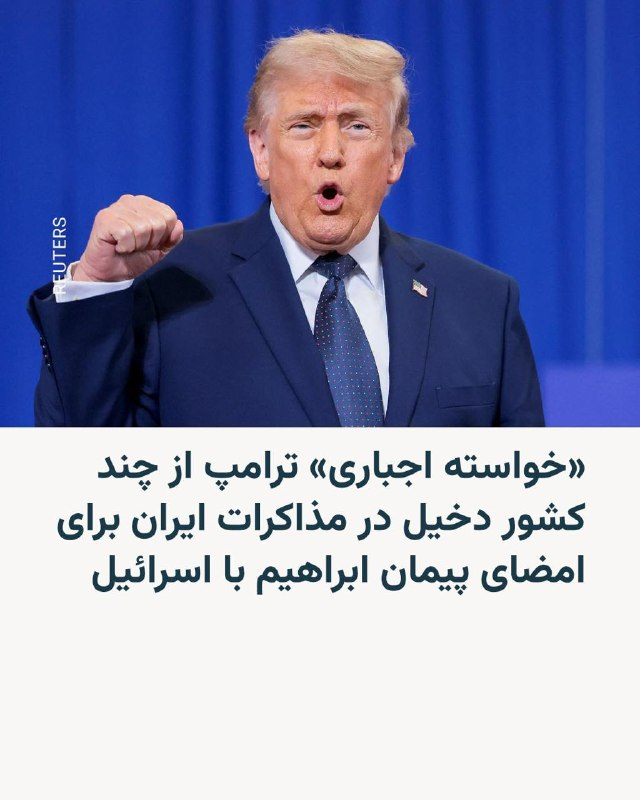

🔸دونالد ترامپ، رئیس جمهور آمریکا، روز دوشنبه در تازه‌ترین پیام خود در شبکه اجتماعی‌اش ضمن خبر دادن از پیشرفت «خوب» در مذاکره با ایران، از تمام کشورهای دخیل در این مذاکرات خواست پس از حصول توافق با ایران، بلافاصله به پیمان‌های ابراهیم بپیوندند.

🔸پیمان یا پیمان‌های ابراهیم طرحی بود که دونالد ترامپ در دوره اول خود برای تلاش در راه عادی‌سازی روابط میان اعراب و اسرائیل آغاز کرد و موفق شد تا چندین کشور از جمله بحرین و امارات متحده عربی را هم به این کار ترغیب کند.

🔸حال رئیس جمهور آمریکا روند توافق با جمهوری اسلامی را به این طرح پیوند زده و به گفته خود این «خواسته اجباری» را با دیگر کشورهای عرب خلیج فارس و همین طور ترکیه مطرح کرده که به‌فوریت و همزمان به پیمان ابراهیم بپیوندند.

@RadioFarda

## RadioFarda — post 157541

🔸در حالی که رئیس جمهور آمریکا در پیامی تازه در شبکه اجتماعی خود نوشته است که مذاکره با ایران «خوب پیش می‌رود»، رسانه‌ها در ایران از سفر هیئت عالی‌رتبه مذاکره‌کنندگان جمهوری اسلامی به قطر خبر می‌دهند. 🔸خبرگزاری صداوسیما روز دوشنبه نوشت: «رئیس مجلس شورای اسلامی…

## RadioFarda — post 157540

  

🔸در حالی که رئیس جمهور آمریکا در پیامی تازه در شبکه اجتماعی خود نوشته است که مذاکره با ایران «خوب پیش می‌رود»، رسانه‌ها در ایران از سفر هیئت عالی‌رتبه مذاکره‌کنندگان جمهوری اسلامی به قطر خبر می‌دهند.

🔸خبرگزاری صداوسیما روز دوشنبه نوشت: «رئیس مجلس شورای اسلامی امروز در صدر هیئتی رسمی برای رایزنی درباره روابط دوجانبه و تحولات منطقه‌ای و بین‌المللی به دوحه سفر کرد.»

🔸پیشتر مقامات دولت مسعود پزشکیان از محمدباقر قالیباف به عنوان رئیس هیئت مذاکره‌کننده نام برده‌اند، از همین رو سفر او در مقطعی که حرف از نزدیکی به توافق میان ایران و آمریکا به میان آمده است مهم جلوه می‌کند.
عباس عراقچی، وزیر امور خارجه، هم در این سفر قالیباف را همراهی می‌کند.

🔸قطر که پیشتر هم در مذاکرات این‌چنینی نقش میانجی را بازی کرده بود، از هفته گذشته به پاکستان پیوسته است که در هفته‌های گذشته نقش میانجی اصلی میان تهران و واشینگتن را داشته است.

@RadioFarda

## IranianMinds — post 20736

🔴 پست های جدید ترامپ :

@IranianMinds

## IranianMinds — post 20734

🔴 الحدث : ایران قبول کرد که اورانیوم خودشو از کشور خارج کنه و آماده ی اینکاره. @IranianMinds

## IranianMinds — post 20733

🔴 الحدث :

ایران قبول کرد که اورانیوم خودشو از کشور خارج کنه و آماده ی اینکاره.

@IranianMinds

## IranianMinds — post 20732

  <a href="telegram/content/IranianMinds_20732_1779724111.mp4" target="_blank">🎬 Download video</a>

🔴 تحلیلگر صداوسیما :

هر موقع که پولا اومد تو‌ حسابمون میریم پای میز مذاکره

+ رهبر موشلمین جهان رو به‌ پول فروختید ؟

@IranianMinds

## IranianMinds — post 20731

  

🔴 رویترز به نقل از منابع اسرائیلی:

نتانیاهو گفته فعلا نمی‌تواند روی تصمیمات ترامپ درباره ایران تاثیر بگذارد

اسرائیل تا حد زیادی از مذاکرات آمریکا و ایران کنار گذاشته شده
نتانیاهو نگران توافق احتمالی واشنگتن و تهران است

نتانیاهو می‌خواهد آزادی عمل نظامی برای حمله به ایران داشته باشد!

@IranianMinds

## IranianMinds — post 20730

🔴 سخنگوی اقلیم کردستان :

ترامپ هیچ سلاحی اصلا برای استفاده و رسوندن به گروهای مخالف جمهوری اسلامی به ما ارسال نکرده و اگه کرده باشه هم به دست ما نرسیده

آمریکا بیاد اعلام کنه که سلاح هارو برای کی فرستاده چون ما چیزی دریافت نکردیم.

@IranianMinds

## IranianMinds — post 20729

🔴 یک منبع ایرانی به المیادین:

هیئت ایرانی در دوحه پس از پایان دیدار‌های خود، امشب به تهران بازمی‌گردند.

@IranianMinds

## IranianMinds — post 20728

  

🔴 وال استریت ژورنال :

در مذاکرات ایران و آمریکا دو طرف سر مسئله هسته ای و لغو‌ تحریم ها به بن بست خوردن.

@IranianMinds

## IranianMinds — post 20727

💯 اگر هنوز ۵۰۰ هزارتومان رو نگرفتی همین الان عضو شو‌ و جایزتو بگیر
نیازی هم به واریز نیست

👍 تنها سایت مورد #تایید ما با بونوس های واقعی

🌐 Winro.io

## IranianMinds — post 20726

  <a href="telegram/content/IranianMinds_20726_1779724112.webm" target="_blank">🎬 Download video</a>

⭕️ تنها جایی که در لحظه عضویت بهت 500 هزارتومان موجودی میده اینجاس 
❌

🎉 کافیه فقط عضو بشی تا #وینرو بهت 
🤩 
🤩 
🤩 هزارتومان جایزه بده ، نیازی هم به واریز نیست.

⌛ پشتیبانی 24 ساعته

🍆تنها سایت مورد اعتماد ما با بونوس های کاملا واقعی و رویایی:

🌐 Winro.io

🌐 Winro.io
کانال بونوس های رایگان g4

📱 @winro_io

## IranianMinds — post 20725

  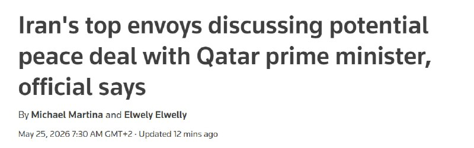

🔴 رویترز:

قالیباف و عراقچی در دوحه با نخست‌وزیر قطر درباره توافق احتمالی با آمریکا برای پایان جنگ گفت‌وگو کردند.

محور اصلی مذاکرات تنگه هرمز و ذخایر اورانیوم غنی‌شده ایران بود ، رئیس بانک مرکزی ایران هم در این نشست حضور داشت

درباره آزادسازی دارایی‌های بلوکه‌شده ایران در توافق احتمالی نیز صحبت شده است.

@IranianMinds

## IranianMinds — post 20724

  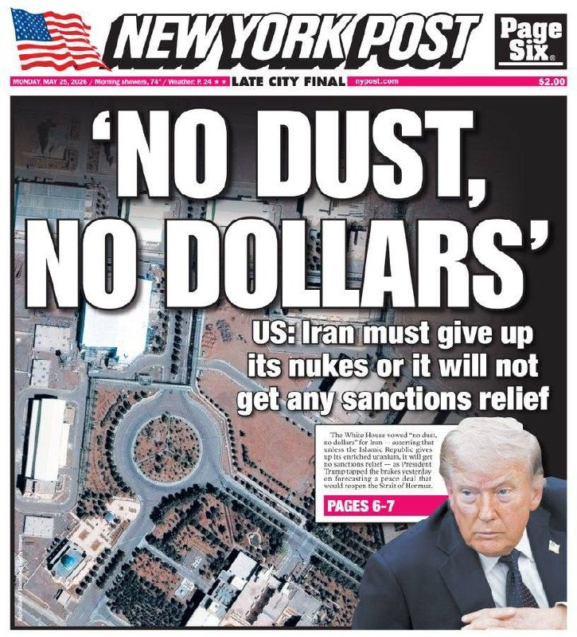

🔴کاور جدید مجله نیویورک‌پست:

نه گرد‌ و غبار،
نه دلارها.

@IranianMinds

## IranianMinds — post 20723

🔴 ترامپ به مجری فاکس‌نیوز: هرگز پول نقد به ایران نمی‌دهم

لارنس‌بی جونز مجری مطرح فاکس‌نیوز پس از گفت‌وگو با رئیس‌جمهور آمریکا اعلام کرد ترامپ به شدت شایعات مربوط به توافق هسته‌ای ضعیف را رد می‌کند و اعلام می‌دارد که هرگز «پول نقد» به تهران تحویل نخواهد داد.
رئیس‌جمهور ترامپ به او گفته است که منتقدانی که ادعای رویکرد نرم دارند، کاملاً اشتباه می‌کنند.

ترامپ افزود:
«آیا واقعاً فکر می‌کنید که من بعد از همه آن حرف‌هایی که زده‌ام درباره اینکه ایران هرگز به سلاح هسته‌ای دست نخواهد یافت، رئیس‌جمهور بشوم و بعد فقط پول نقد به آنها بدهم؟»

@IranianMinds

## IranianMinds — post 20722

🔴 دونالد ترامپ در پستی طولانی نوشت:

مذاکرات با جمهوری اسلامی ایران به‌خوبی پیش می‌رود!

این توافق یا باید یک «توافق بزرگ» برای همه طرف‌ها باشد، یا هیچ توافقی انجام نخواهد شد. در غیر این صورت به جبهه نبرد و تیراندازی بازمی‌گردیم، اما این بار بزرگ‌تر و قوی‌تر از قبل. کسی هم چنین چیزی را نمی‌خواهد!

من گفته‌ام که پس از تمام تلاش‌هایی که ایالات متحده برای حل این پازل بسیار پیچیده انجام داده، ضروری است که همه این کشورها حداقل به‌صورت همزمان به پیمان ابراهیم بپیوندند.

ممکن است یکی دو کشور دلیل موجهی برای عدم پیوستن داشته باشند که در آن صورت پذیرفته خواهد شد، اما اکثر کشورها باید آماده، مایل و قادر باشند تا این توافق با ایران را به رویدادی بسیار تاریخی‌تر از آنچه که در غیر این صورت می‌شد تبدیل کنند.

در صحبت با بسیاری از رهبران بزرگ کشورهای مذکور، آن‌ها اعلام کردند که به محض امضای سند، افتخار خواهند داشت که جمهوری اسلامی ایران نیز به عنوان بخشی از پیمان ابراهیم حضور داشته باشد. وای، این واقعاً چیزی خاص خواهد بود!

من به‌طور الزامی از همه کشورها می‌خواهم که فوراً پیمان ابراهیم را امضا کنند و اگر ایران توافق خود را با من به عنوان رئیس‌جمهور ایالات متحده آمریکا امضا کند، مایه افتخار خواهد بود که ایران نیز بخشی از این ائتلاف بی‌نظیر جهانی باشد.

@IranianMinds

## IranianMinds — post 20721

🔴یک مقام آمریکایی به واشنگتن‌پست:

ایران تا زمانی‌که از ذخایر هسته‌ای خود صرف‌نظر نکند، حتی یک دلار هم دریافت نخواهد کرد.

@IranianMinds

## BBCPersian — post 282030

  

🔻شبکه تلویزیونی و اینترنتی «منوتو» بعد از ۱۶ سال به کار خود پایان داد.

این رسانه فارسی‌زبان از سال ۲۰۱۰ در لندن با مدیریت کیوان و مرجان عباسی به روی آنتن ماهواره رفت و به یکی از پربیننده‌ترین تلویزیون‌های فارسی‌زبان تبدیل شد.

اما حدود دو سال و نیم پیش، به دلیل «مشکلات مالی» پخش تلویزیونیش را متوقف کرد و مدتی بعد، فعالیتش را محدودتر از سر گرفت.

مدیران این شبکه، علاوه بر محدودیت‌های مالی، این بار به «دگرگونی‌های بنیادین در عرصه رسانه‌ای و سیاسی» ایران اشاره کرده و گفته‌اند که فضا خصمانه‌تر و قطبی‌تر شده و مجموعه این شرایط، ادامه فعالیت را برای منوتو غیرممکن کرده است.

https://bbc.in/43uDwNI
@BBCPersian

## BBCPersian — post 282029

  

🔻بتسالل اسموتریچ، وزیر دارایی اسرائیل، خواستار تخریب ساختمان‌ها در بیروت برای مقابله با «تهدید پهپادهای انفجاری حزب‌الله» شد.

این وزیر راست افراطی اسرائیل در پستی در شبکه اجتماعی ایکس به کشته شدن یک سرباز اسرائیلی در حمله پهپادی امروز حزب‌الله در جنوب لبنان اشاره کرد و نوشت: «برای هر پهپاد انفجاری، ۱۰ ساختمان باید در بیروت فرو بریزد.»

او تاکید کرد که «پاسخ به یک تهدید قابل توجه باید قابل توجه باشد.»

آقای اسموتریچ نوشت: «شما با یک تهدید استراتژیک تنها با سپر دفاعی مقابله نمی‌کنید، بلکه باید با تغییر قوانین و معادله با آن مقابله کنید.»

📸AFP via Getty Images
https://bbc.in/43uAYz6
@BBCPersian

## BBCPersian — post 282028

🔻خبرگزاری فارس: پهپاد متخاصم در حریم خلیج فارس سرنگون شد

خبرگزاری فارس می‌گوید که پهپادهای رهگیر موسوم به آرش کمانگیر یک «پهپاد متخاصم» را بر فراز آب‌های خلیج فارس سرنگون کرده‌اند.

این خبرگزاری که به نهادهای امنیتی و نظامی نزدیک است نوشت: «این عملیات که با به‌کارگیری سامانه‌ای با قابلیت‌های پنهان انجام شد، پیامی روشن و قاطع از سوی ایران به شمار می‌رود. مقامات مربوطه تصریح کرده‌اند که این نشانه از طرف ماست تا دیگر هیچ پهپاد رادارگریزی نتواند بر آسمان خلیج فارس نفوذ کند.»

در این گزارش به نوع یا مبدا یا کشور سازنده پهپاد اشاره نشده است.

ایالات متحده می‌گوید که که محاصره دریایی ایران ادامه دارد اما نیروی دریایی سپاه امروز گفت که ۳۲ کشتی نفتکش، کانتینری یا تجاری پس از «اخذ مجوز با هماهنگی» این نیروها از تنگه هرمز عبور کرده‌اند.

سپاه دیروز هم گفت ۳۳ کشتی عبور کرده‌اند.

https://bbc.in/4v8Jxf0
@BBCPersian

## BBCPersian — post 282027

🔻نخست‌وزیر پاکستان با رئیس جمهور چین دیدار کرد

خبرگزاری دولتی شینهوا چین گزارش کرده که شهباز شریف، نخست‌وزیر پاکستان، در سفر خود به چین با شی جین پینگ، رئیس جمهور چین، دیدار کرده است.

سفر نخست‌وزیر پاکستان و فرمانده ارتش این کشور به چین در ادامه تلاش‌های دیپلماتیک چندین کشور برای پایان رسمی جنگ آمریکا و اسرائیل با ایران است.

پیش از این گزارش داده بود که فیلد مارشال عاصم منیر، مذاکره کننده ارشد پاکستان هم به پکن سفر کرده است.

آقای شریف پیش از این با لی چیانگ، نخست وزیر چین، دیدار کرده بود.

https://bbc.in/49hnc6r
@BBCPersian

## BBCPersian — post 282025

🔻ویشکا آسایش، بازیگر سینما، مجموعه مجسمه‌های برنزی ساخته و برای نخستین بار در نیویورک آنها را به نمایش گذاشته است.

نمایشگاه مجسمه‌های ویشکا آسایش از روز چهارشنبه (۲۰ مه / ۳۱ اردیبهشت) در گالری بیرند گکلر نیویورک افتتاح شده است.

بهمن کلباسی، خبرنگار بی‌بی‌سی در نیویورک با او در مورد مجسمه‌هایش گفتگو کرده است.

@BBCPersian

## BBCPersian — post 282024

  <a href="telegram/content/BBCPersian_282024_1779724116.mp4" target="_blank">🎬 Download video</a>

🔻‌رسانه‌های آمریکایی وقوع آتش‌سوزی مهیبی را در یک منطقه صنعتی در ساوت گیت در لس‌انجلس کانتی کالیفرنیا گزارش کردند. این آتش‌سوزی در یک مرکز صنعتی بازیافت لاستیک خودرو رخ داد.

در پی این آتش‌سوزی در روز یکشنبه (۲۴ مه)، مقام‌های محلی از مردم خواستند که به همراه حیوانات خانگی‌شان با در و پنجره‌های بسته داخل خانه‌ها بمانند.

علت آتش‌سوزی و اینکه آیا در زمان شروع آتش‌سوزی افرادی در محل حضور داشته‌اند یا خیر، تاکنون مشخص نشده است.

آتش‌نشانان آتش را مهار کردند و تاکنون هیچ مصدومی در این حادثه گزارش نشده است.

https://bbc.in/43etyAd
@BBCPersian

## BBCPersian — post 282023

‌ 🔻دونالد ترامپ، رئیس‌جمهور آمریکا، یک بار دیگر از پیشرفت در مذاکرات با ایران ابراز رضایت کرد. آقای ترامپ در پستی در شبکه اجتماعی خود، تروث سوشال، نوشت: «مذاکرات با ایران خوب پیش می‌رود! یا توافق عالی برای همه خواهد بود یا هیچ توافقی نخواهد بود.» او در عین…

## BBCPersian — post 282022

  

‌
🔻دونالد ترامپ، رئیس‌جمهور آمریکا، یک بار دیگر از پیشرفت در مذاکرات با ایران ابراز رضایت کرد.

آقای ترامپ در پستی در شبکه اجتماعی خود، تروث سوشال، نوشت: «مذاکرات با ایران خوب پیش می‌رود! یا توافق عالی برای همه خواهد بود یا هیچ توافقی نخواهد بود.»

او در عین حال هشدار داد که اگر توافق حاصل نشود، آمریکا به جبهه جنگ باز می‌گردد و «تیراندازی بزرگتر و شدیدتر از گذشته و هر زمان آغاز خواهد شد و کسی چنین چیزی را نمی‌خواهد.»

رئیس‌جمهور آمریکا همچنین مذاکرات با ایران را به پیمان ابراهیم پیوند داد و با اشاره دوباره به گفت‌و‌گوهایی که روز شنبه با رهبران عربستان، امارات، قطر، پاکستان، ترکیه، مصر، اردن و بحرین داشته است، گفت که به آنها گفته است:

«بعد از تلاش‌های آمریکا برای حل این مساله پیچیده (در مورد ایران) حداقل برای این کشورها باید اجباری باشد که همزمان پیمان ابراهیم را امضا کنند.»

📷GETTY
https://bbc.in/4wPXxf5
@BBCPersian

## BBCPersian — post 282020

  <a href="telegram/content/BBCPersian_282020_1779724117.mp4" target="_blank">🎬 Download video</a>

🔻سرخط خبرهای دوشنبه ۴ خرداد ۱۴۰۵
@BBCPersian

## BBCPersian — post 282019

  

🔻چهارمین جلسه ستاد ویژه ساماندهی فضای مجازی به ریاست محمدرضا عارف، معاون اول رئیس‌جمهور، و با حضور اعضای ستاد برگزار شد.

به گزارش پایگاه اطلاع‌رسانی دولت، در این جلسه «مصوبات مهمی درباره وضعیت اینترنت کشور تصویب شد که پس از تایید نهایی رئیس‌جمهور پزشکیان، برای اجرا به وزارت ارتباطات و فناوری اطلاعات ابلاغ می‌شود.»

جزئیات بیشتری از این مصوبات رسما منتشر نشده است اما خبرگزاری فارس نوشت که در این جلسه «طرح اتصال دوباره اینترنت بین‌‌الملل با ۹ رای موافق تصویب و برای تایید نهایی به دفتر مسعود پزشکیان ارسال شد.»

رفع فیلترینگ از وعده‌های انتخاباتی دولت پزشکیان بود که محقق نشد و از شروع جنگ اخیر اینترنت بین‌الملل به روی شهروندان در ایران جز برای کسانی که «اینترنت پرو»، سیم‌کارت «سفید»، یا دسترسی به استارلینک داشته‌اند مقدور بوده است.

قطع اینترنت بین‌المللی در ایران طولانی‌ترین قطع گسترده در تاریخ اینترنت است.

ادامه مطلب⬇️
📸NurPhoto via Getty Images
https://bbc.in/4uAWWMU
@BBCPersian

## BBCPersian — post 282018

  

🔻ایتامار بن گویر، وزیر امنیت ملی اسرائیل، خواستار بازگشت اسرائیل به «جنگی شدید» در لبنان شد.

این وزیر راست افراطی اسرائیل در حسابش در شبکه اجتماعی ایکس نوشت: «عادی‌سازی واقعیت پهپادهای انفجاری جایز نیست؛ وقت آن رسیده است که نخست‌وزیر روی میز ترامپ بکوبد و به او اطلاع دهد که ما در حال بازگشت به جنگ در لبنان هستیم.»

او در ادامه درخواست کرد: «ما باید برق لبنان را قطع کنیم، ضاحیه را فتح کنیم و به جنگی شدید بازگردیم.»

تقاضای این وزیر راست افراطی در حالی است که هفته گذشته آتش‌بس در لبنان تمدید شد و دور بعد مذاکرات صلح قرار است تا حدود یک هفته دیگر در واشنگتن برگزار شود.

پهپادهای ارزان‌قیمت مورد استفاده حزب‌الله در طول درگیری‌های اخیر به‌طور فزاینده‌ای از سیستم راداری اسرائیل عبور کرده‌ و خساراتی را برجا گذاشته‌اند.

📸Bloomberg via Getty Images
https://bbc.in/49Q61ZO
@BBCPersian

## BBCPersian — post 282017

  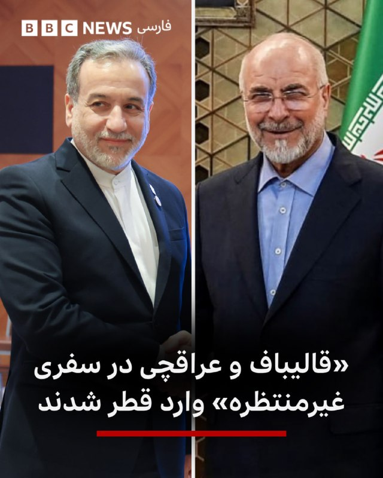

🔻خبرگزاری‌های رویترز و فرانسه به نقل از یک مقام آگاه، از سفر غیر‌منتظره محمد باقر قالیباف و عباس عراقچی، مذاکره‌کنندگان ارشد ایران، به دوحه خبر داده‌اند.

بر اساس این گزارش‌ها، رئیس مجلس و وزیر خارجه ایران برای گفت‌وگو با نخست‌وزیر قطر به دوحه سفر کرده‌اند.

رویترز نوشت که این گفت‌و‌گوها عمدتا درباره «تنگه هرمز و ذخایر اورانیوم غنی‌شده» ایران است.

رسانه‌های ایران گزارش داده بودند که عبدالناصر همتی، رئیس کل بانک مرکزی ایران، برای «بررسی آزادسازی اموال بلوکه‌شده و در راستای کمیسیون اقتصادی مذاکرات» به قطر سفر کرده است.

هیئتی از قطر هفته پیش به ایران سفر کرده بود.

یکی از خواسته‌های ایران در مذاکره با آمریکا آزاد شدن منابع مالی مسدودشده‌اش است.

📸Anadolu via Getty Images
https://bbc.in/4tYZR0B
@BBCPersian

## idfinfarsi — post 11643

  <a href="telegram/content/idfinfarsi_11643_1779724123.mp4" target="_blank">🎬 Download video</a>

‼️برای رفع تهدید: ارتش اسرائیل روز گذشته (یکشنبه) یک تروریست کلیدی از ستاد تولید سازمان تروریستی حماس را به هلاکت رساند

⭕️نیروهای ارتش اسرائیل تحت فرماندهی جنوب، روز گذشته (یکشنبه) در مرکز نوار غزه حمله کرده و محمد ابو ملوح، یکی از تروریست‌های کلیدی در ستاد تولید سازمان تروریستی حماس را به هلاکت رساندند.

⭕️ابو ملوح یکی از منابع اصلی دانش در سازمان تروریستی حماس بود و در طول دوره آتش‌بس، اقدام به تولید تسلیحاتی کرده بود که تهدیدی برای نیروهای ارتش اسرائیل در منطقه و شهروندان این کشور محسوب می‌شد.

⭕️نیروهای ارتش اسرائیل تحت فرماندهی جنوب مطابق با توافق در منطقه مستقر هستند و به فعالیت خود برای رفع هرگونه تهدید فوری ادامه خواهند داد.

## Dirty_Kids — post 390155

پست‌های رگباری لحظاتی پیش شیر AIبه‌باسن در تروث‌سوشال که نیاز به توضیح نداره و تصاویر گویاست:

@Dirty_Kids 👻

## Dirty_Kids — post 390154

  

«ریچارد گلدبرگ» مشاور ارشد بنیاد دفاع از دموکراسی‌ها در خصوص اون توییت طولانی ترامپ که به کشورهای قرمساق مسلمون منطقه گفته بود اگه می‌خواید من با جمهوی‌اسلامی تفاهم‌نامه امضا کنم اول باید شما به پیمان ابراهیم و صلح با اسرائیل بپیوندید، نوشته که:

«کشورهایی که ترامپ برای پیوستن به پیمان ابراهیم تحت فشارشون گذاشته دقیقاً همون پدرقحبه‌هایی هستند که حالا رامپ رو تحت فشار گذاشتن تا از پروژه‌ی آزادی دست بکشه و به جاش با رژیم قحبه‌ی روافض معامله کنه.

واکنش ترامپ در این شرایط کاملاً منطقی به نظر می‌رسه.
واقعاً اگر این کار انجام شه، یک دستاورد تاریخی خواهد بود و ضربه‌‌ی استراتژیک بسیار سنگین به رژیم کس‌پدر روافض وارد می‌کنه.»

@Dirty_Kids 👻

## Dirty_Kids — post 390153

  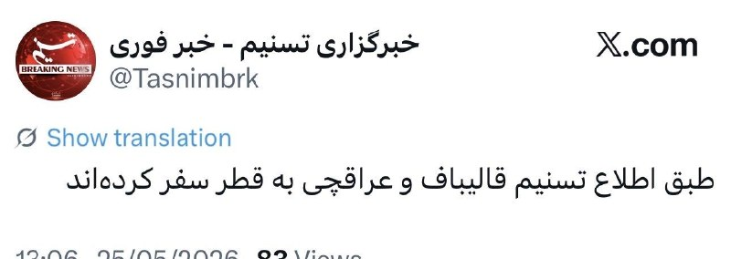

جالب اینکه هیچ کسمغز رافضی این سؤال به مغز نداشته‌ش خطور نمی‌کنه که،

چطور ممدباقر سوار هواپیما می‌شه تا کشور قرمساق قطر می‌ره، اما سه ماهه پاشو تو طویله‌ی بهارستان نذاشته و تو بانکر قایم شده.

@Dirty_Kids 👻

## Dirty_Kids — post 390152

  

🔴 وال استریت ژورنال:
مذاکرات ایران بر سر برنامه هسته‌ای و لغو تحریم‌ها به بن‌بست خورده.

@Dirty_Kids 👻

## Dirty_Kids — post 390151

  

ترامپ :
مذاکرات با ایران داره خوب پیش میره؛

یا یه توافق خفن درمیاد که به نفع همه‌ست، یا اصلاً توافقی در کار نیست و دوباره برمی‌گردیم به جنگ، اونم شدیدتر از قبل؛
من با رهبرای عربستان، قطر، امارات، ترکیه، مصر، پاکستان و بقیه حرف زدم و گفتم وقتشه همتون وارد توافق ابراهیم بشید.
اگه ایرانم با من توافق کنه، خیلی اتفاق بزرگی میشه که اونا هم به این جمع اضافه بشن.
به نظرم این میتونه بزرگ‌ترین و تاریخی‌ترین توافق خاورمیانه باشه؛ یه چیزی که منطقه رو قوی، پولدار و متحد کنه.

@Dirty_Kids 👻

## Dirty_Kids — post 390150

  <a href="telegram/content/Dirty_Kids_390150_1779724125.mp4" target="_blank">🎬 Download video</a>

مامانا با بچه هاشونم دارن این چالشو میرن

@Dirty_Kids 👻

## Dirty_Kids — post 390149

  <a href="telegram/content/Dirty_Kids_390149_1779724127.mp4" target="_blank">🎬 Download video</a>

کلیپ وایرال شده تو اینستاگرام فارسی

یه قر بدیم با دوغ آبعلی و تو جایی که شاه ساخته یعنی خوشبختیم همه‌چی اوکیه

@Dirty_Kids 👻

## Dirty_Kids — post 390148

  <a href="telegram/content/Dirty_Kids_390148_1779724129.mp4" target="_blank">🎬 Download video</a>

بررسی یه خط از شعر خوانده حکومتی محسن چاووشی

هروقت عرزشی بهتون گفت بی‌ادب این ویدیو‌رو بکوبید تو صورتش

اینا مداح‌ها و آخونداشون که راهنماشون هستن مثلا، تهه مفسد و بی ادبن

@Dirty_Kids 👻

## Dirty_Kids — post 390146

  <a href="telegram/content/Dirty_Kids_390146_1779724130.mp4" target="_blank">🎬 Download video</a>

نون‌شونو از مالیدن بدست آوردن

@Dirty_Kids 👻

## Dirty_Kids — post 390145

  <a href="telegram/content/Dirty_Kids_390145_1779724131.mp4" target="_blank">🎬 Download video</a>

🔴 رقص این دختر بچه ایرانی تو جشن پایان سالشون توی مدرسه علوی مشهد در سطح جهانی وایرال شده و تو ۲ روز بیش از ۴۰ میلیون بازدید داشته!

@Dirty_Kids 👻

## Dirty_Kids — post 390144

  <a href="telegram/content/Dirty_Kids_390144_1779724132.mp4" target="_blank">🎬 Download video</a>

تحلیلگر صداسیما: پول بشینه توی حساب جمهوری اسلامی میریم پای میز مذاکره

ریدن براتون :))))))

@Dirty_Kids 👻

## Hranews — post 113158

  

سرکوب و اعدام با اتهام نابخشودنیِِ جاسوسی/ مرتضی هامونیان

📡
📡
📡
📡
📡– هر بار حکومت بهانه‌ای تازه برای گرفتن جان انسان‌ها پیدا می‌کند؛ حکومتی که در تمام عمر خود نشان داده ارزشی برای حیات شهروندان قائل نیست. تازه‌ترین نمونه‌اش در جریان #جنگ آمریکا و اسرائیل با ایران آشکار شد؛ جایی که روشن شد سال‌ها بودجه‌های کلان پدافند غیرعامل یا صرف اموری نامعلوم شده یا اساساً کارکردی برای حفاظت از مردم نداشته است. نتیجه این شد که شهروندان زیر موشک‌باران، حتی از ابتدایی‌ترین امکان یعنی پناهگاهی امن برای حفظ جان خود نیز محروم بودند. حسام‌الدین آشنا، مقام امنیتی پیشین و رئیس مرکز بررسی‌های استراتژیک (زیر مجموعه‌ی نهاد ریاست جمهوری) در دولت‌های یازدهم و دوازدهم در نخستین برنامه‌ی «اسپرسو» با مجری‌گری محمد دلاوری –که از پلت‌فرم روبیکا پخش می‌شود—، با ارجاع به کشور سوئیس و وجود پناهگاه بزرگ اتمی در آن کشور می‌گوید که ما باید به حفظ جان مردم توجه می‌کردیم. اما آن‌چه در عمل رخ داد، درست نقطه‌ی مقابل حفاظت از جان مردم بود. نه تنها اراده‌ای برای حفظ جان شهروندان دیده نشد، بلکه حکومت هم‌زمان مسیر قانونی تازه‌ای نیز برای گرفتن جان انسان‌ها ایجاد کرد. حاصل آن، تصویب «قانون تشدید مجازات جاسوسی و همکاری با رژیم صهیونیستی و کشورهای متخاصم علیه امنیت و منافع ملی» بود؛ قانونی که در ظاهر با نام امنیت معرفی می‌شود، اما در عمل ابزار سرکوب دیگری در اختیار حاکمیت قرار می‌دهد تا به بهانه‌ی اتهام جاسوسی، دامنه‌ی اعدام و حذف مخالفان را گسترش دهد.(۱)

اگر در مقطع تابستان ۱۳۶۷، کشتار زندانیان سیاسی به صورت اعدام‌های فراقضایی رخ داد (تعبیری که عفو بین‌الملل در گزارش خود در آذر ۱۳۹۷ به دلیل خارج از رویه‌های قضایی بودن آن اعدام‌ها، به آن نسبت داد)، این بار قرار است با ابزاری قانونی و اتهامی که حیثیت و آبروی متهم را هدف قرار می‌دهد، مخالفین سیاسی را #اعدام و یا مرعوب کنند: اتهام جاسوسی و همکاری با اسرائیل و کشورهای متخاصم علیه امنیت و منافع ملی ایران. بر اساس تبصره‌ی اول ماده‌ی یک این قانون، آمریکا و اسرائیل به عنوان «دولت متخاصم» شناخته می‌شوند و تعیین متخاصم بودن سایر کشورها نیز به تشخیص شورای عالی امنیت ملی (شعام) واگذار شده است. این یعنی دست باز برای شعام که هر وقت بخواهد، کشوری را متخاصم اعلام کند و با این قانون، کم‌ترین مراوده با آن کشور می‌تواند حکم اعدام به همراه داشته باشد. بماند که اصولاً برای اعدام و اتهام‌زنی، نیازی به مراوده هم نیست. دستگاه‌های اطلاعاتی رنگارنگ جمهوری اسلامی با اتکا به اعترافات اخذشده تحت فشار و شکنجه، سناریوهای امنیتی خود را تولید می‌کنند و در غیاب دادرسی عادلانه، همان روایت‌ها مبنای صدور حکم قرار می‌گیرد. در چنین فضایی، رئیس دستگاه قضای نظام هم به مخالفین اعدام می‌گوید که تو غلط می‌کنی که می‌گویی فلانی اعدام نشود.

ادامه مطلب

ادامه و لینک به مطلب در وبسایت خط صلح

#مرتضی_هامونیان

↘️
@hranews_bot تماس ✉️ - @Hranews کانال هرانا 🆑

## Hranews — post 113157

  

گزارشی از آخرین وضعیت حمیدرضا درستکار در زندان شیبان اهواز

❗️
❗️
❗️
❗️
❗️– حمیدرضا درستکار، زندانی سیاسی اهل بهبهان، در حال تحمل دوران محکومیت خود در زندان شیبان اهواز است. وی در فروردین‌ماه امسال به صورت تنبیهی از زندان بهبهان به زندان شیبان منتقل شد.

به گزارش خبرگزاری هرانا، ارگان خبری مجموعه فعالان حقوق بشر در ایران، حمیدرضا درستکار در زندان شیبان اهواز محبوس است.

یک منبع نزدیک به خانواده این زندانی سیاسی به هرانا گفت: در جریان جنگ، حمیدرضا به‌دلیل طرح مطالبه تخلیه زندان، به «ایجاد آشوب و شورش در زندان» متهم و در ۱۵ فروردین‌ماه به‌صورت تنبیهی به زندان شیبان منتقل شد. این در حالی است که درخواست تخلیه زندان در آن شرایط، مطالبه‌ای مشترک میان تمامی زندانیان بوده است.

ادامه مطلب

#حمیدرضا_درستکار

↘️
@hranews_bot تماس ✉️ -  @Hranews  کانال هرانا 🆑

## Hranews — post 113153

گزارش تصویری؛ برگزاری برنامه نمادین نظامی برای کودکان بر خلاف پیمان‌نامه حقوق کودک

❗️
❗️
❗️
❗️
❗️– برخلاف تعهدات بین‌المللی ایران تحت عنوان الحاق به پیمان‌نامه #حقوق_کودک و تعهدات مربوط به عدم به‌کارگیری #کودکان در امور نظامی، برنامه‌ای نمادین تحت عنوان «اعزام به جبهه» با پوشاندن لباس نظامی به کودکان، قرار دادن سلاح در دست آنها، بازسازی صحنه‌های اعزام کودکان به جبهه جنگ و استفاده از دیگر نمادهای امور نظامی در حضور کودکان، در همدان برگزار شده است.

ادامه مطلب

↘️
@hranews_bot تماس ✉️ -  @Hranews  کانال هرانا 🆑

## Hranews — post 113152

  

امروز دوشنبه ۴ خرداد ۱۴۰۵، ستاد راهبری و ساماندهی فضای مجازی به ریاست محمدرضا عارف معاون اول رئیس‌جمهور، بازگشت #اینترنت به وضعیت پیش از دی‌ماه ۱۴۰۴ را تصویب کرد. این مصوبه به رئیس‌جمهور ارسال شده و در صورت تایید وی، جهت اجرا به وزارت ارتباطات ابلاغ خواهد شد./امتداد

↘️
@hranews_bot تماس ✉️ -  @Hranews  کانال هرانا 🆑

## manototv — post 105829

  <a href="telegram/content/manototv_105829_1779724134.mp4" target="_blank">🎬 Download video</a>

گفت‌وگو با کیوان عباسی:
«می‌گفت ایرانی‌ها باید بیشتر کنار هم بایستند…
و دوباره باور کنند که سرنوشت ایران را خود مردم ایران رقم می‌زنند.»

## alonews — post 122607

  <a href="telegram/content/alonews_122607_1779724135.webm" target="_blank">🎬 Download video</a>

👈شبکه CNN: توافق احتمالی ترامپ با ایران می‌تواند تقریباً به اندازه تصمیم او برای آغاز جنگ اختلاف‌برانگیز شود

🔴طرح کلی توافق پیشنهادی، بسیار کمتر از «تسلیم بی‌قید و شرط» است که ترامپ در مارس از ایران مطالبه می‌کرد. برخی از جمهوری‌خواهان می‌ترسند که بالعکس این ترامپ باشد که تسلیم ایران می‌شود

✅ @AloNews خبر جنگ

## alonews — post 122605

  <a href="telegram/content/alonews_122605_1779724135.webm" target="_blank">🎬 Download video</a>

👈ترامپ عکس‌هایی را که به جو بایدن و باراک اوباما درباره ایران تمسخر می‌کند، دوباره منتشر می‌کند

✅ @AloNews خبر جنگ

## alonews — post 122604

  <a href="telegram/content/alonews_122604_1779724136.mp4" target="_blank">🎬 Download video</a>

👈پاپ لئو چهاردهم : هوش مصنوعی باید خلع سلاح شه

✅ @AloNews خبر جنگ

## alonews — post 122603

  <a href="telegram/content/alonews_122603_1779724137.webm" target="_blank">🎬 Download video</a>

🔴فوری / الحدث : منابع نزدیک میگن ایران آماده‌ست اورانیوم با غنای بالا رو از کشور خارج کنه

✅ @AloNews خبر جنگ

## alonews — post 122602

  <a href="telegram/content/alonews_122602_1779724138.webm" target="_blank">🎬 Download video</a>

👈 الحدث به نقل از منابع عالی‌رتبه:
به احتمال زیاد فرمانده ارتش پاکستان به دوحه سفر خواهد کرد.

✅ @AloNews خبر جنگ

## alonews — post 122601

  <a href="telegram/content/alonews_122601_1779724138.webm" target="_blank">🎬 Download video</a>

👈 جنگنده‌های اسرائیلی در آسمان جنوب لبنان دیوار صوتی را شکستند.

✅ @AloNews خبر جنگ

## alonews — post 122600

  <a href="telegram/content/alonews_122600_1779724138.webm" target="_blank">🎬 Download video</a>

👈 ارتش اسرائیل (IDF): نیروهای دفاعی اسرائیل آغاز به حمله به سایت‌های زیرساختی حزب‌الله در منطقه صور و مناطق اضافی در جنوب لبنان کرده‌اند.

✅ @AloNews خبر جنگ

## alonews — post 122597

  <a href="telegram/content/alonews_122597_1779724138.mp4" target="_blank">🎬 Download video</a>

👈صحنه‌هایی از حملات اسرائیل به صور در جنوب لبنان

✅ @AloNews خبر جنگ

## alonews — post 122596

  <a href="telegram/content/alonews_122596_1779724140.webm" target="_blank">🎬 Download video</a>

👈کانال تلگرامی Fighterbomber که وابسته به نیروهای هوافضای روسیه است، قول می‌دهد که روسیه «کی‌یف را تمام خواهد کرد.»

✅ @AloNews خبر جنگ

## alonews — post 122595

  <a href="telegram/content/alonews_122595_1779724140.webm" target="_blank">🎬 Download video</a>

👈 یک منبع سعودی به سی‌ان‌ان گفت که عربستان سعودی تنها زمانی روابط خود را با اسرائیل عادی خواهد کرد که «مسیر غیرقابل بازگشتی» به سوی تشکیل دولت فلسطین وجود داشته باشد و تأکید کرد که موضع ریاض «همانند همیشه» باقی می‌ماند، با وجود پیشنهاد ترامپ درباره به رسمیت شناختن منطقه‌ای اسرائیل پس از احتمال توافق با ایران.

✅ @AloNews خبر جنگ

## alonews — post 122594

  <a href="telegram/content/alonews_122594_1779724140.webm" target="_blank">🎬 Download video</a>

👈الجزیره: هیئت ایرانی در قطر برای گفتگو درباره «حساس‌ترین مسائل حل نشده»

🔴مذاکره‌کنندگان ارشد ایران در حال سفر به قطر هستند؛ کشوری که نقشی محوری‌تر در گفتگوهای ایران و آمریکا ایفا می‌کند.

🔴عباس عراقچی، وزیر امور خارجه و محمدباقر قالیباف، رئیس مجلس، در حال گفتگو درباره حساس‌ترین مسائل حل‌نشده برای دستیابی به یک تفاهمنامه هستند.

🔴رئیس کل بانک مرکزی نیز در این هیئت حضور دارد که نشان می‌دهد تحرکی در جریان است و بحث‌هایی درباره رفع انسداد دارایی‌ها (که یکی از خواسته‌های اصلی ایران است) صورت می‌گیرد.

🔴منابعی به الجزیره گفته‌اند که بحث درباره سایر موضوعات از جمله ذخایر اورانیوم با غنای بالا باید به زمان دیگری موکول شود و تمرکز فعلی بر گام‌های اعتمادساز است.

🔴نقطه اختلاف دیگر، تنگه هرمز است. اسماعیل بقائی، سخنگوی وزارت امور خارجه ایران، پیشتر گفته بود که این موضوع بین ایران و عمان است و تهران خدمات امنیتی برای کشتیهای عبوری از این تنگه را ارائه میدهد.

✅ @AloNews خبر جنگ

## alonews — post 122593

  <a href="telegram/content/alonews_122593_1779724140.webm" target="_blank">🎬 Download video</a>

👈 ارتش اسرائیل (IDF) : پس از به صدا درآمدن آژیرهای خطر در ساعت ۱۶:۰۳ مبنی بر نفوذ هواپیمای متخاصم به چندین منطقه در شمال اسرائیل، یک پهپاد انفجاری که توسط حزب‌الله شلیک شده بود، در خاک اسرائیل، نزدیک مرز اسرائیل و لبنان سقوط کرد. هیچ تلفاتی گزارش نشده است.

🔴علاوه بر این، اندکی پیش، نیروی هوایی اسرائیل یک موشک شلیک شده توسط حزب‌الله به سمت خاک اسرائیل را رهگیری کرد.

🔴در حادثه‌ای دیگر، اندکی پیش، یک پهپاد انفجاری در خاک اسرائیل، نزدیک مرز اسرائیل و لبنان سقوط کرد.

✅ @AloNews خبر جنگ

## alonews — post 122592

  <a href="telegram/content/alonews_122592_1779724140.webm" target="_blank">🎬 Download video</a>

👈سناتور جمهوری‌خواه لیندسی گراهام:
پیشنهاد اخیر رئیس‌جمهور ترامپ که گسترش توافقنامه‌های ابراهیم را به عنوان بخشی از یک توافق مذاکره‌شده در مورد مناقشه ایران الزامی می‌کند، به سادگی درخشان است و منجر به مهم‌ترین تغییر در خاورمیانه در هزاران سال خواهد شد.

🔴با صلح عربستان سعودی و دیگر کشورهایی مانند پاکستان با اسرائیل، منطقه شاهد سطحی از ثبات خواهد بود که پیش از رئیس‌جمهور ترامپ هرگز تصور نمی‌شد و در نهایت به یکپارچگی منطقه‌ای منجر خواهد شد که خاورمیانه را به یک قدرت اقتصادی و منبع فرصت‌های خوب تبدیل می‌کند، به جای اینکه یک انبار باروت باشد.

🔴انتظار دارم متحدان عرب ما این را بپذیرند، همچنین دوستان ما در اسرائیل، با تمرکز بر این وظیفه، زیرا شکست گزینه‌ای نیست - که تحلیلی درست خواهد بود

✅ @AloNews خبر جنگ

## alonews — post 122591

  <a href="telegram/content/alonews_122591_1779724140.webm" target="_blank">🎬 Download video</a>

👈طبق گزارش مکو اسرائیل، ایران در طول آتش‌بس، بازسازی بخش‌هایی از صنعت موشکی و پهپادی خود را سریع‌تر از حد انتظار از سر گرفته است.

🔴بر اساس برآوردهای اسرائیل، ایران در حال بازسازی موشک‌ها، پرتابگرها، پهپادها و سامانه‌های دفاع هوایی در تأسیسات زیرزمینی موقت با استفاده از قطعات باقی‌مانده، حمایت روسیه و قطعات قاچاق شده چینی است.

🔴مقامات دفاعی اسرائیل معتقدند ایران می‌تواند تولید پهپاد را ظرف چند ماه از سر بگیرد و تولید موشک را ظرف یک سال به طور قابل توجهی گسترش دهد.

🔴فرمانده سنتکام، دریاسالار برد کوپر، شهادت داد که ۹۰٪ از پایه صنعتی دفاعی ایران نابود شده است، اما اطلاعات به‌روزشده نشان می‌دهد حدود دو سوم پرتابگرهای موشکی ایران سالم مانده و از تونل‌های زیرزمینی مجدداً مستقر شده‌اند.

✅ @AloNews خبر جنگ

## alonews — post 122590

  <a href="telegram/content/alonews_122590_1779724141.webm" target="_blank">🎬 Download video</a>

👈قیمت جدید لبنیات:

🔴شیر نایلونی: ۸۴ هزار تومان

🔴شیر بطری: ۹۸ هزار تومان

🔴پنیر یواف ۴۰۰ گرمی: ۲۰۳ هزار تومان

🔴ماست دبه‌ای ۲ کیلویی: ۲۲۸ هزار و ۷۰۰ تومان

✅ @AloNews خبر جنگ

## alonews — post 122589

  <a href="telegram/content/alonews_122589_1779724141.webm" target="_blank">🎬 Download video</a>

🔴فوری / وال استریت ژورنال: مذاکرات ایران رو بحث برنامه هسته‌ای و رفع تحریم‌ها به بن بست رسیده

✅ @AloNews خبر جنگ

## alonews — post 122588

  <a href="telegram/content/alonews_122588_1779724141.webm" target="_blank">🎬 Download video</a>

👈المیادین: هیئت ایرانی به ریاست قالیباف امشب به تهران باز می‌گردد

✅ @AloNews خبر جنگ

<!-- MSG END -->

<!-- NAV START -->

<a href="https://github.com/shahinsa98/aio-downloader/blob/main/telegram/content/archive_1.md" style="display:inline-block; padding:6px 12px; margin:0 4px; background-color:#2ea44f; color:white; text-decoration:none; border-radius:4px; font-weight:bold;">صفحه بعد</a>

<!-- NAV END -->
