# خواننده تلگرام

<!-- TOP_NAV START -->

<a href="https://github.com/shahinsa98/aio-downloader/blob/main/telegram/content/archive_1.md" style="display:inline-block; padding:6px 12px; margin:0 4px; background-color:#2ea44f; color:white; text-decoration:none; border-radius:4px; font-weight:bold;">صفحه بعد</a>

<!-- TOP_NAV END -->

<!-- MSG START -->

---
📅 بروزرسانی: 1405/03/03 20:54
---

## VahidOOnLine — post 241974

  

ارتش اسرائیل اعلام کرد ایال زمیر، رییس ستاد کل ارتش این کشور، پس از ارزیابی وضعیت میدانی، طرح‌های ادامه عملیات علیه حزب‌الله در لبنان را تایید کرده است.

زمیر گفت ارتش اسرائیل تحولات منطقه را به‌دقت زیر نظر دارد و آماده است فورا به درگیری‌های شدید بازگردد و حکومت «تروریستی» ایران و توانمندی‌های آن را بیش از پیش تضعیف کند.

او افزود: «امروز طرح‌های ادامه نبرد در جبهه شمالی را تصویب کردم و مصمم هستیم ضربات به حزب‌الله را عمیق‌تر کنیم.»
‌🏁 🇬🇧 IranintlTV

🤖 @VahidOOnLine

## VahidOOnLine — post 241973

  

لیندزی گراهام، سناتور جمهوریخواه در پیامی در شبکه ایکس نوشت: «اگر در نتیجه مذاکرات برای پایان دادن به درگیری با ایران، متحدان عرب و مسلمان آمریکا در منطقه به توافق‌های ابراهیم بپیوندند، این توافق می‌تواند به یکی از مهم‌ترین تحولات تاریخ خاورمیانه تبدیل شود.»

او افزود پیوستن عربستان سعودی، قطر و پاکستان به توافق‌های ابراهیم تحولی بزرگ برای منطقه و جهان خواهد بود و این اقدام را حرکتی درخشان از سوی رییس جمهور ترامپ توصیف کرد.
‌🏁 🇬🇧 IranintlTV

🤖 @VahidOOnLine

## VahidOOnLine — post 241972

  

♦️شبکه خبری العربیه، عصر یکشنبه سوم خرداد ماه به نقل از «منابع بلندپایه» گزارش کرد توافق میان تهران و واشنگتن به‌طور انحصاری از سوی پاکستان اعلام خواهد شد و نام آن «بیانیه اسلام‌آباد» خواهد بود.
به گفته این منابع، توافق اولیه میان آمریکا و ایران در قالب یک «تفاهم‌نامه» تنظیم شده و پس از آن مذاکرات درباره دستیابی به توافق نهایی بر سر مسائل مورد اختلاف آغاز خواهد شد.
العربیه به نقل از منابع خود گزارش کرد، مذاکرات مستقیم میان دو تهران و واشنگتن از پنجم ژوئن (پانزدهم خرداد ماه) در اسلام‌آباد آغاز می‌شود.
بر اساس این گزارش، پاکستان بدون نیاز به حضور طرف‌های مذاکره‌کننده، تفاهم‌نامه را اعلام خواهد کرد.
منابع العربیه همچنین اعلام کردند، دو طرف با آغاز مذاکرات درباره توافق نهایی، روسای هیات‌های مذاکره کننده خود را به اسلام‌آباد اعزام خواهند کرد.
‌🇸🇦 Indypersian

🤖 @VahidOOnLine

## VahidOOnLine — post 241971

  <a href="telegram/content/VahidOOnLine_241971_1779643444.mp4" target="_blank">🎬 Download video</a>

تماسی با خانواده جاویدنام مهدی اسکندریان:
«می‌گفت مهدی عاشق ایران بود…
و دختر کوچکش هنوز منتظر برگشتن پدرش به خانه است.»
‌🏁 🇬🇧 ManotoTV

🤖 @VahidOOnLine

## VahidOOnLine — post 241970

  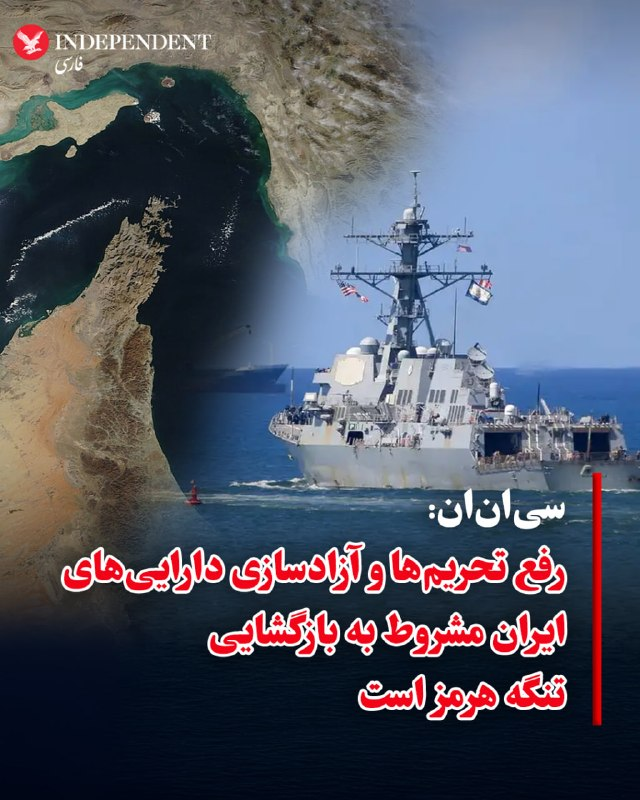

♦️یک مقام ارشد دولت آمریکا، روز یکشنبه سوم خرداد ماه، به شبکه سی‌ان‌ان گفت توافق میان ایالات متحده و ایران احتمالا امروز امضا نخواهد شد، زیرا جزئیات آن همچنان در حال مذاکره است.
به گفته این مقام، ایران در چارچوب این توافق به‌طور اصولی پذیرفته است که تنگه هرمز را بازگشایی کند و ذخایر اورانیوم با غنای بالای خود را کنار بگذارد.
سی‌ان‌ان به نقل از این مقام ارشد آمریکایی افزود نحوه دقیق کنار گذاشتن ذخایر اورانیوم و همچنین مدت زمان توقف غنی‌سازی در آینده هنوز نهایی نشده و مذاکرات درباره آن ادامه دارد.
این مقام آمریکایی تاکید کرد کاهش تحریم‌ها و آزادسازی دارایی‌های ایران تنها در صورتی انجام خواهد شد که تهران تنگه هرمز را بازگشایی کرده و به تعهدات خود برای مذاکره درباره محدودیت‌های برنامه هسته‌ای‌اش عمل کند.
به گفته این مقام، میزان دقیق منابع مالی‌ای که ایران در قالب این توافق دریافت خواهد کرد نیز هنوز مشخص نشده و همچنان در دست مذاکره است.
دونالد ترامپ، پیشتر در پیامی اعلام کرده بود محاصره علیه ایران تا زمان دستیابی، تایید و امضای توافق، «با قدرت و به طور کامل» ادامه خواهد داشت.
‌🇸🇦 Indypersian

🤖 @VahidOOnLine

## VahidOOnLine — post 241969

  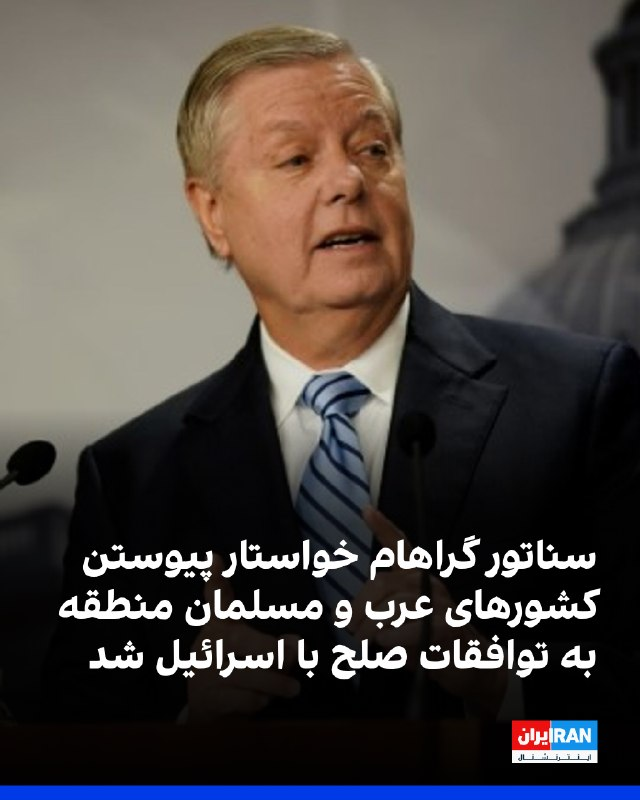

لیندزی گراهام، سناتور جمهوریخواه در پیامی در شبکه ایکس نوشت: «اگر در نتیجه مذاکرات برای پایان دادن به درگیری با ایران، متحدان عرب و مسلمان آمریکا در منطقه به توافق‌های ابراهیم بپیوندند، این توافق می‌تواند به یکی از مهم‌ترین تحولات تاریخ خاورمیانه تبدیل شود.»

گراهام در ادامه از ترامپ خواست در مسیر دستیابی به توافق با جمهوری اسلامی بر مواضع خود پافشاری کند و هم‌زمان بر پیوستن عربستان سعودی و دیگر کشورهای منطقه به توافق‌های ابراهیم به‌عنوان بخشی از مذاکرات تاکید داشت.
‌🏁 🇬🇧 IranintlTV

🤖 @VahidOOnLine

## VahidOOnLine — post 241968

  

♦️خبرگزاری تسنیم، وابسته به سپاه پاسداران، عصر یکشنبه سوم خرداد ماه در گزارشی نوشت: « علیرغم برخی گفتگوهای امروز، کارشکنی‌های آمریکا در برخی بندهای تفاهم از جمله موضوع آزادسازی اموال بلوکه شده ایران همچنان ادامه دارد و تا این لحظه این موضوعات حل نشده است.»
تسنیم با طرح این خبر نوشت: «در حال حاضر همچنان امکان منتفی شدن تفاهم وجود دارد و ایران تاکید کرده است که از خطوط قرمز خود برای احقاق حقوق مردم کوتاه نخواهد آمد.»
این خبر از این رسانه حکومتی در حالی منتشر می‌شود که ترامپ پیش‌تر در پیامی روابط واشنگتن و تهران را «در حال حرفه‌ای‌ و سازنده‌تر شدن» توصیف کرده بود.
‌🇸🇦 Indypersian

🤖 @VahidOOnLine

## VahidOOnLine — post 241967

  <a href="telegram/content/VahidOOnLine_241967_1779643447.mp4" target="_blank">🎬 Download video</a>

♦️هزاران گلبرگ گل سرخ رز ظهر یکشنبه سوم خرداد ماه، از دهانه گنبد پانتئون در رم بر سر بازدیدکنندگان از این معبد دوهزار ساله سرازیر شد. این آیین سنتی هر سال هم‌زمان با «عید پنطیکاست» (Pentecost) در این بنای تاریخی برگزار می‌شود.

در این مراسم، نیروهای آتش‌نشانی ایتالیا گلبرگ‌ها را از بالای گنبد پانتئون به داخل بنا رها می‌کنند تا در میان نور طبیعی و آواز گروه کر، فضای داخلی این معبد باستانی را بپوشاند.
این سنت مذهبی به نزول روح‌القدس بر حواریون حضرت عیسی، پنجاه روز پس از رستاخیز او، اشاره دارد. واژه «پنطیکاست» نیز در زبان یونانی به معنای «پنجاهمین» است.
به گزارش حساب رسمی معبد پانتئون، گلبرگ‌های سرخ در این آیین نماد «زبان‌های آتش» هستند که در کتاب اعمال رسولان از آن‌ها یاد شده و به باور مسیحیان، نشانه نور، ایمان و آغاز گسترش پیام مسیحیت در جهان به شمار می‌روند.
پانتئون (Pantheon) یکی از مشهورترین بناهای تاریخی رم در ایتالیاست. معبدی باستانی که حدود دوهزار سال پیش در دوران امپراتوری روم ساخته شد و امروز یکی از سالم‌ترین بناهای باقی‌مانده از روم باستان به شمار می‌رود.
‌🇸🇦 Indypersian

🤖 @VahidOOnLine

## VahidOOnLine — post 241966

  

♦️یک مقام ارشد دولت دونالد ترامپ روز یکشنبه سوم خرداد ماه به فاکس‌نیوز گفت واشنگتن در صورت ارائه امتیازهایی از سوی تهران در موضوع اورانیوم‌های غنی‌شده، ممکن است «امتیازهای قابل توجهی» در زمینه کاهش تحریم‌ها به ایران بدهد.

این مقام آمریکایی گفت: «اگر ایرانی‌ها در موضوع غنی‌سازی امتیازهای قابل توجهی بدهند، ما نیز در زمینه کاهش تحریم‌ها متقابل عمل خواهیم کرد.»

این مقام کاخ سفید به فاکس نیوز گفت طرح واشنگتن شامل رسیدگی به «تمام ذخایر مواد غنی‌شده ایران» است و تاکید کرد آمریکا شاهد «امتیازهای جدی» از سوی تهران در این زمینه بوده؛ امتیازهایی که به گفته او پیش‌تر مشاهده نشده بود.

این مقام همچنین گزارش‌ها درباره احتمال امضای توافق در روز یکشنبه را کم‌اهمیت خواند و گفت ساختار تصمیم‌گیری در جمهوری اسلامی «به اندازه کافی سریع حرکت نمی‌کند.»

او در ادامه با اشاره به موضوع تنگه هرمز گفت آمریکا با هرگونه دریافت عوارض برای عبور از این آبراه مخالف است و افزود: «موضع ما کاملا روشن است. ما فکر نمی‌کنیم دریافت عوارض، نتیجه‌ای قابل قبول باشد.»
‌🇸🇦 Indypersian

🤖 @VahidOOnLine

## WithYashar — post 12354

الجزیره: یه منبع ایرانی به ما گفته؛ آمریکا داره از چند تا توافق قبلی خودش عقب می‌کشه، مخصوصاً سر آزاد کردن پول‌های بلوکه‌شده ایران و مدل آتش‌بس لبنان؛

تو متن تفاهم‌نامه، اسرائیل میخواد دستش باز بمونه که هر وقت گفت «تهدید حس کردیم» دوباره تو لبنان عملیات بزنه و بهشون حمله کنه، ولی ایران مخالفه و میگه آتش‌بس باید واقعی، کامل و دائمی باشه.

پاکستان پیشنهاد داده فعلاً بخش‌هایی که توافق شده امضا بشه و بقیه اختلافات بعداً حل شه، ولی ایران گفته نه؛ یا همه بندها کامل و تضمینی حل میشه یا کلاً امضایی در کار نیست.
@withyashar

## WithYashar — post 12353

فاکس نیوز نقاط اختلاف در توافق ایران و آمریکا را اعلام کرد:

1. اسرائیل خواستار تضمین «آزادی عمل نظامی» علیه تهدیدها در لبنان است و ایران این را رد می‌کند.

2. تهران خواستار آزادسازی فوری دارایی‌های خود است و واشنگتن امتناع می‌کند و اصرار دارد که این موضوع به فرمول نهایی توافق مرتبط شود.»
@withyashar

## WithYashar — post 12352

جوزالم پست: ایران در اصل با یک توافق آتش‌بس با ایالات متحده موافقت کرده است که بر اساس آن، اورانیوم بسیار غنی‌شده خود را از بین خواهد برد
@withyashar

## WithYashar — post 12351

نعیم قاسم رهبر گروه تروریستی حزب الله:
ایران با رهبری مجتبی خامنه ای آمریکا و اسرائیل را ذلیل کرد
@withyashar 🤣

## WithYashar — post 12350

تسنیم: علیرغم برخی گفتگوهای امروز، کارشکنی‌ های آمریکا در برخی بندهای تفاهم از جمله موضوع آزادسازی اموال بلوکه شده ایران همچنان ادامه دارد و تا این لحظه این موضوعات حل نشده است.

بر این اساس، در حال حاضر همچنان امکان منتفی شدن تفاهم وجود دارد و ایران تاکید کرده است که از خطوط قرمز خود برای احقاق حقوق مردم کوتاه نخواهد آمد
@withyashar

## WithYashar — post 12349

علی هاشم خبرنگار الجزیره: کمتر از ۲۴ ساعت پس از ظهور خوش‌بینی در مورد امکان توافق‌نامه ایران و آمریکا، حال‌وهوای منفی دوباره سر برآورده است.
@withyashar

## WithYashar — post 12348

صداسیما : ترامپ چاره‌ای جز تسلیم شدن ندارد
@withyashar

## WithYashar — post 12347

رئیس ستاد کل ارتش اسرائیل:
ما آماده‌ایم که فوراً به نبرد با ایران بازگردیم
@withyashar

## mwarmonitor — post 9653

🔴سناتور لیندسی گراهام ؛ اگر در نتیجه این مذاکرات برای پایان دادن به درگیری ایران، متحدان عرب و مسلمان ما در منطقه موافقت کنند به «توافق‌های ابراهیم» بپیوندند، این توافق به یکی از مهم‌ترین و تأثیرگذارترین توافق‌ها در تاریخ خاورمیانه تبدیل خواهد شد.

🔸پیوستن عربستان سعودی، قطر و پاکستان به توافق‌های ابراهیم، دگرگونی عظیمی برای منطقه و جهان خواهد بود. این یک اقدام هوشمندانه از سوی رئیس‌جمهور ترامپ است.

🔸به عربستان سعودی و دیگر کشورها: اکنون زمان آن است که برای آینده یک خاورمیانه جدید جسور باشید. همان‌طور که رئیس‌جمهور ترامپ گفته است، انتظار می‌رود شما در واقع به توافق‌های ابراهیم بپیوندید و به‌طور مؤثر به مناقشه عربی–اسرائیلی پایان دهید. اگر از این مسیر که رئیس‌جمهور ترامپ پیشنهاد کرده است خودداری کنید، این موضوع پیامدهای جدی برای روابط آینده ما خواهد داشت و این پیشنهاد صلح را غیرقابل‌قبول خواهد کرد. همچنین در تاریخ به‌عنوان یک اشتباه محاسباتی بزرگ دیده خواهد شد.

🔸رئیس‌جمهور ترامپ: در رسیدن به یک توافق خوب با ایران قاطع بمان. به همان اندازه مهم، در اصرار بر پیوستن عربستان سعودی و دیگر کشورها به توافق‌های ابراهیم به‌عنوان بخشی از این مذاکرات نیز قاطع بمان.

🔹بار دیگر، این یک پیشنهاد بسیار هوشمندانه از سوی رئیس‌جمهور ترامپ است.

@mwarmonitor

## mwarmonitor — post 9652

🔴یک منبع ارشد ایرانی به رویترز گفته است که تهران با تحویل ذخیره اورانیوم بسیار غنی‌شده خود موافقت نکرده است و همچنین موضوع هسته‌ای ایران در توافق اولیه با آمریکا گنجانده نشده است. @mwarmonitor

## mwarmonitor — post 9651

🔴ایالات متحده و ایران به‌طور اصولی بر سر یک توافق به تفاهم رسیده‌اند که بر اساس آن تنگه هرمز دوباره بازگشایی شود و ایران متعهد شود اورانیوم بسیار غنی‌شده خود را دفع کند، یک مقام آمریکایی روز یکشنبه گفت. این مقام افزود که این توافق هنوز امضا نشده است. نیویورک…

## pm_afshaa — post 91407

  <a href="telegram/content/pm_afshaa_91407_1779643448.webm" target="_blank">🎬 Download video</a>

🔴الجزیره: یه منبع ایرانی به ما گفته؛ آمریکا داره از چند تا توافق قبلی خودش عقب می‌کشه، مخصوصاً سر آزاد کردن پول‌های بلوکه‌شده ایران و مدل آتش‌بس لبنان؛

تو متن تفاهم‌نامه، اسرائیل میخواد دستش باز بمونه که هر وقت گفت «تهدید حس کردیم» دوباره تو لبنان عملیات بزنه و بهشون حمله کنه، ولی ایران مخالفه و میگه آتش‌بس باید واقعی، کامل و دائمی باشه.

پاکستان پیشنهاد داده فعلاً بخش‌هایی که توافق شده امضا بشه و بقیه اختلافات بعداً حل شه، ولی ایران گفته نه؛ یا همه بندها کامل و تضمینی حل میشه یا کلاً امضایی در کار نیست.

💧 Rainbet.com the #1 Non-KYC Crypto Casino & Sportsbook @rainbetcom

😁 @Pm_Afshaa

## pm_afshaa — post 91406

  <a href="telegram/content/pm_afshaa_91406_1779643448.webm" target="_blank">🎬 Download video</a>

🔴سناتور لیندسی گراهام:
اگه این مذاکرات با ایران باعث بشه عربستان، قطر و پاکستان هم وارد توافق ابراهیم بشن، این میتونه یکی از بزرگ‌ترین و مهم‌ترین توافق‌های تاریخ خاورمیانه باشه؛ پیوستن این کشورها به توافق ابراهیم، کل منطقه و حتی دنیا رو متحول می‌کنه و این یه حرکت فوق‌العاده از طرف ترامپه.

💧 Rainbet.com the #1 Non-KYC Crypto Casino & Sportsbook @rainbetcom

😁 @Pm_Afshaa

## pm_afshaa — post 91405

  <a href="telegram/content/pm_afshaa_91405_1779643449.webm" target="_blank">🎬 Download video</a>

🔴یک مقام ارشد دولت آمریکا به فاکس‌نیوز:
شاهد انعطاف‌هایی از سمت تهران هستیم که قبلا ندیده بودیم.

💧 Rainbet.com the #1 Non-KYC Crypto Casino & Sportsbook @rainbetcom

😁 @Pm_Afshaa

## pm_afshaa — post 91404

  <a href="telegram/content/pm_afshaa_91404_1779643449.webm" target="_blank">🎬 Download video</a>

🔴روبیو، وزیر خارجه آمریکا:
این که ترامپ ممکنه با توافقی موافقت کنه که در نهایت موقعیت جمهوری اسلامی رو در برنامه هسته‌ای تقویت کنه، با توجه به مواضع و اقداماتی که تاکنون ازش دیدیم، کاملا مضحکه.

💧 Rainbet.com the #1 Non-KYC Crypto Casino & Sportsbook @rainbetcom

😁 @Pm_Afshaa

## pm_afshaa — post 91403

🔴رئیس ستاد کل ارتش اسرائیل:
ما آماده‌ایم که فوراً به نبرد با ایران بازگردیم

💧 Rainbet.com the #1 Non-KYC Crypto Casino & Sportsbook @rainbetcom

😁 @Pm_Afshaa

## pm_afshaa — post 91402

🔴نیویورک تایمز به نقل از یک مقام آمریکایی: مسائلی مانند ذخایر موشکی ایران و غنی سازی اورانیوم در مذاکرات بعدی مورد بحث قرار خواهد گرفت

💧 Rainbet.com the #1 Non-KYC Crypto Casino & Sportsbook @rainbetcom

😁 @Pm_Afshaa

## pm_afshaa — post 91401

  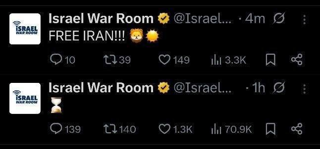

پست اتاق جنگ اسرائیل:
ایران آزاد

💧 Rainbet.com the #1 Non-KYC Crypto Casino & Sportsbook @rainbetcom

😁 @Pm_Afshaa

## pm_afshaa — post 91400

  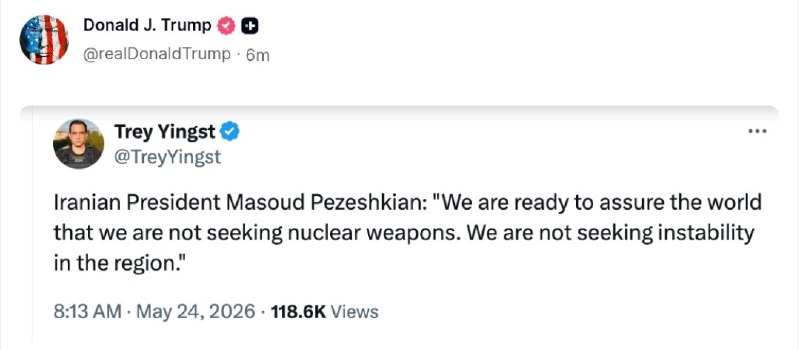

ترامپ تو تروث سوشال صحبت‌های امروز مسعود پزشکیان که گفته بود «ما آماده‌ایم به جهان اطمینان دهیم که به دنبال سلاح هسته‌ای نیستیم. ما به دنبال بی‌ثباتی در منطقه نیستیم» رو پست کرده

💧 Rainbet.com the #1 Non-KYC Crypto Casino & Sportsbook @rainbetcom

😁 @Pm_Afshaa

## pm_afshaa — post 91399

  <a href="telegram/content/pm_afshaa_91399_1779643451.webm" target="_blank">🎬 Download video</a>

خیلی وقته کسی پول به کانفیگ حجمی نمیده چون از‌ این‌جا « نامحدودشو » میخرن 
⬇️

یک ماهه 
✨ یک کاربر 
✨ حجم نامحدود 
♾️
فقط 
🍎 میلیون تومان

🔗 @whitelistsup

📢 @Whitelistconfig

## iaghapour — post 2629

  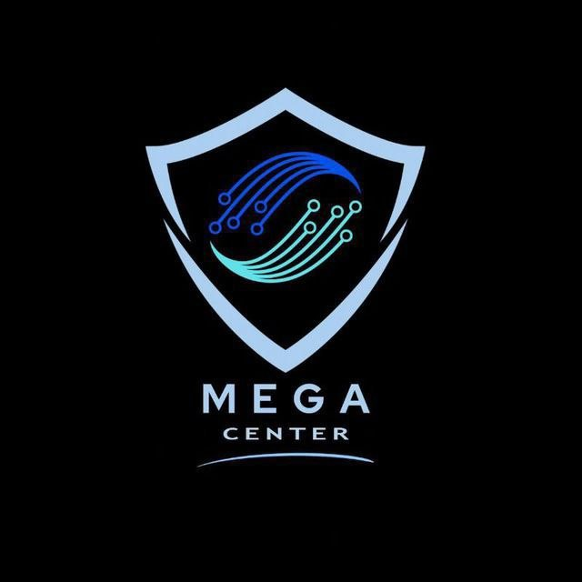

💠 Mega Center 💠

🪩📈 ابزار مورد نیاز شما در دنیای کریپتو و تریدینگ / احراز هویت پلتفرم های خارجی

از افتتاح حساب های ارزی بین المللی
تا پکیج مدارک لازم جهت احراز هویت صرافی ها و سایت های خارجی
صدور مستر کارت و ویزا کارت و خدمات
ارزی
سیم کارت های فیزیکی خارجی
خدمات وریفای تضمینی صرافی ها ، سایت های فریلنسری و گیمینگ
اکانت های اماده دیتاسنترها
آیپی رزیدنتال اختصاصی
اشتراک ویندسکرایب و ...

👨‍💻لینک دسترسی ها و ارتباط :
www.megacenterx.com      
www.megacenterx.com
www.megacenterx.com

https://t.me/megacenter0
https://t.me/megacenter0

@Megav_admin22
@Megav_admin22

در صورت بالا نیامدن سایت ، بدون وی پی ان امتحان نمایید ✅
سایت دارای اینماد و درگاه پرداخت اختصاصی و کریپتو ✅

## iaghapour — post 2628

  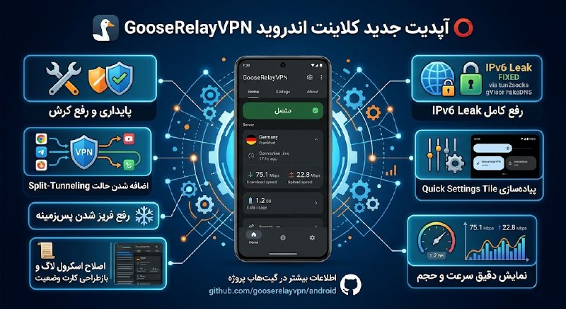

⭕️ آپدیت جدید کلاینت اندروید GooseRelayVPN

🔹این مخزن، کلاینت اندروید GooseRelayVPN است که هسته GooseRelay را از طریق Go mobile اجرا می‌کند و رابط کاربری کامل برای مدیریت VPN، پروفایل‌ها، لاگ‌ها و تنظیمات ارائه می‌دهد.

🛠 پایداری و رفع کرش

‏🌐 رفع کامل لو رفتن آی‌پی (IPv6 Leak) با موتور جدید tun2socks gVisor FakeDNS.

‏🎛 پیاده‌سازی کامل Quick Settings Tile.

‏📊 نمایش کاملاً دقیق سرعت و حجم مصرفی.

‏🗂 اضافه شدن حالت Bypass به بخش Split-Tunneling.

‏❄️ رفع فریز شدن برنامه در پس‌زمینه.

‏📜 اصلاح پرش ناگهانی اسکرول لاگ‌ها و بازطراحی کارت وضعیت اتصال در صفحه Home

🔗 اطلاعات بیشتر در گیت‌هاب پروژه

🆔 @iAghapour

## DEJradio — post 4922

  <a href="telegram/content/DEJradio_4922_1779643452.webm" target="_blank">🎬 Download video</a>

👑
🔺 تظاهرات ایرانیان میهن‌دوست در برلین در حمایت از شاهزاده رضا پهلوی و انقلاب شیر و خورشید؛ یکشنبه سوم خرداد ۱۴۰۵

#برلین #همبستگی
@DEJradio

## kianmeli1 — post 87639

  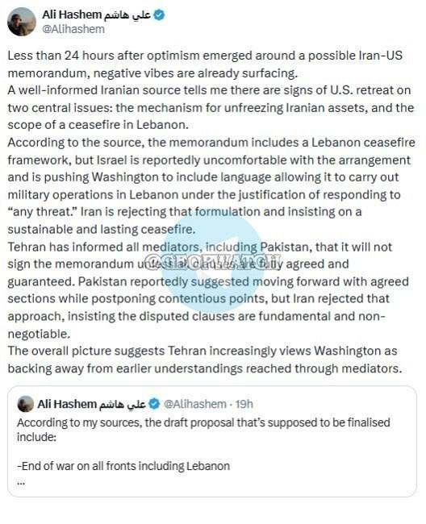

🔴علی هاشم از الجزیره:کمتر از 24 ساعت پس از ظهور خوش‌بینی‌ها درباره احتمال امضای یک یادداشت تفاهم بین ایران و آمریکا، احساسات منفی در حال بروز است. یک منبع مطلع ایرانی به من می‌گوید نشانه‌هایی از عقب‌نشینی آمریکا در دو موضوع اصلی وجود دارد: مکانیزم آزادسازی دارایی‌های ایران و دامنه آتش‌بس در لبنان.
https://t.me/kianmeli1

## IranIntlTV — post 338794

  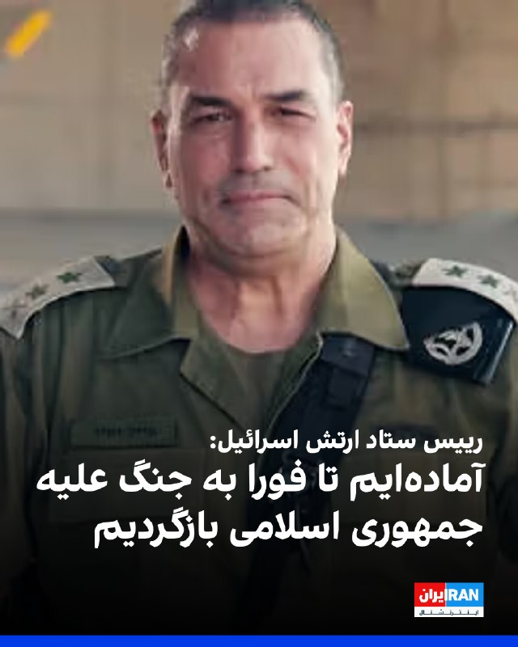

ارتش اسرائیل اعلام کرد ایال زمیر، رییس ستاد کل ارتش این کشور، پس از ارزیابی وضعیت میدانی، طرح‌های ادامه عملیات علیه حزب‌الله در لبنان را تایید کرده است.

زمیر گفت ارتش اسرائیل تحولات منطقه را به‌دقت زیر نظر دارد و آماده است فورا به درگیری‌های شدید بازگردد و حکومت «تروریستی» ایران و توانمندی‌های آن را بیش از پیش تضعیف کند.

او افزود: «امروز طرح‌های ادامه نبرد در جبهه شمالی را تصویب کردم و مصمم هستیم ضربات به حزب‌الله را عمیق‌تر کنیم.»
https://iranintl.com/202605240944

## IranIntlTV — post 338793

  

لیندزی گراهام، سناتور جمهوریخواه در پیامی در شبکه ایکس نوشت: «اگر در نتیجه مذاکرات برای پایان دادن به درگیری با ایران، متحدان عرب و مسلمان آمریکا در منطقه به توافق‌های ابراهیم بپیوندند، این توافق می‌تواند به یکی از مهم‌ترین تحولات تاریخ خاورمیانه تبدیل شود.»

او افزود پیوستن عربستان سعودی، قطر و پاکستان به توافق‌های ابراهیم تحولی بزرگ برای منطقه و جهان خواهد بود و این اقدام را حرکتی درخشان از سوی رییس جمهور ترامپ توصیف کرد.
https://iranintl.com/202605241273

## IranIntlTV — post 338792

  <a href="telegram/content/IranIntlTV_338792_1779643454.mp4" target="_blank">🎬 Download video</a>

هم‌زمان با مطرح شدن احتمال توافق میان تهران و واشینگتن، موج واکنش‌ها در اسرائیل افزایش یافته است. بنیامین نتانیاهو با اعلام نگرانی‌های خود به دونالد ترامپ، بر آزادی عمل اسرائیل در همه جبهه‌ها، به‌ویژه لبنان، تاکید کرده است.

گفت‌وگو با مئیر جاودانفر، تحلیل‌گر مسائل اسرائیل
@iranintltv

## IranIntlTV — post 338790

  <a href="telegram/content/IranIntlTV_338790_1779643456.mp4" target="_blank">🎬 Download video</a>

تیتر اول با نیوشا صارمی، یکشنبه ۳ خرداد
@iranintltv

## IranIntlTV — post 338789

  <a href="telegram/content/IranIntlTV_338789_1779643457.mp4" target="_blank">🎬 Download video</a>

هزاران نفر از ایرانیان ساکن ونکوور در محل آرت گالری این شهر تجمع کردند. شرکت‌کنندگان در این تجمع ضمن تاکید بر لزوم پایان دادن به خاموشی دیجیتال در ایران، از مقام‌های فیفا خواستند با همراهی با جمهوری اسلامی به عادی‌سازی جنایات این حکومت کمک نکنند.

گزارش مهسا مرتضوی، خبرنگار ایران‌اینترنشنال
@iranintltv

## ManotoTV — post 105810

  <a href="telegram/content/ManotoTV_105810_1779643458.mp4" target="_blank">🎬 Download video</a>

تماسی با خانواده جاویدنام مهدی اسکندریان:
«می‌گفت مهدی عاشق ایران بود…
و دختر کوچکش هنوز منتظر برگشتن پدرش به خانه است.»

## FarsiVOA — post 218548

تنگه هرمز ابزار چانه زنی جمهوری اسلامی در گفت‌وگو با صالح کامرانی کارشناس حقوق بین‌الملل

## FarsiVOA — post 218547

سرنوشت اروانیوم غنی شده در صورت امضای تفاهم نامه صلح بین امریکا و جمهوری اسلامی در گفتگو با احمد وخشیته پژوهشگر دانشگاه دوستی بین ملتها

## FarsiVOA — post 218546

در شرایطی که تنش‌های خاورمیانه و نگرانی درباره تنگه هرمز بالا گرفته، کی‌یر استارمر از توافق احتمالی آمریکا و ایران حمایت کرده و همزمان تلاش‌های دولتش برای نزدیک‌تر شدن به اتحادیه اروپا هم بیشتر شده؛ از همکاری‌های امنیتی و دفاعی تا هماهنگی بر سر بحران‌های منطقه‌ای و اقتصادی

## FarsiVOA — post 218545

🔺آکسیوس: کاخ سفید معتقد است نهایی شدن توافق با جمهوری اسلامی احتمالا چند روز طول می‌کشد

◾️وبسایت خبری آکسیوس روز یکشنبه ۳ خرداد به نقل از «یک مقام ارشد آمریکایی» گزارش داد کاخ سفید انتظار ندارد توافق با جمهوری اسلامی، در روز یکشنبه نهایی شود و رسیدن به مرحله نهایی احتمالا چند روزی بیشتر طول می‌کشد.

⬇️ بیشتر بخوانید:

https://ir.voanews.com/a/8153325.html

## FarsiVOA — post 218544

  <a href="telegram/content/FarsiVOA_218544_1779643460.mp4" target="_blank">🎬 Download video</a>

شهرام همایون در عمق میدان می‌گوید پروژه دولت در تبعید را به خاطر مخالفت رضا پهلوی متوقف کرده است با این حال نقدی به شخص او ندارد چرا که معتقد است او در شرایط «غیرعادی» است

## FarsiVOA — post 218543

🔺گراهام: برای آینده خاورمیانه جدید جسور باشیم

◾️لیندزی گراهام، سناتور جمهوری‌خواه گفت که پیوستن متحدان عرب و مسلمان به توافق‌نامه‌های ابراهیم، در نتیجه مذاکرات برای پایان دادن به درگیری رژیم ایران، این توافق‌نامه را به یکی از مهم‌ترین توافق‌ها در تاریخ خاورمیانه تبدیل خواهد کرد.

⬇️ بیشتر بخوانید:

https://ir.voanews.com/a/the-new-middle-east-abraham-accords-lindsay-graham/8153321.html

## FarsiVOA — post 218542

  <a href="telegram/content/FarsiVOA_218542_1779643461.mp4" target="_blank">🎬 Download video</a>

دونالد پتی، فضانورد آمریکایی، تصویری از شفق قطبی و طلوع زمین را از فضا منتشر کرد.

او در توضیح این تصویر نوشت: «تماشای شفق قطبی در طلوع زمین، هرگز تکراری نمی‌شود.»

@FarsiVOA

## FarsiVOA — post 218541

🔺اشتراک ‌نظر نتانیاهو و ترامپ: «رفع خطر هسته‌ای» پیش‌شرط توافق نهایی با جمهوری اسلامی است

◾️نخست وزیر اسرائیل روز یکشنبه ۳ خرداد با انتشار پستی در رسانه اجتماعی ایکس از گفت‌وگوی تلفنی با رئیس جمهوری آمریکا در شامگاه شنبه خبر داد.

⬇️ بیشتر بخوانید:

https://ir.voanews.com/a/8153320.html

## DW_Farsi — post 125103

  

🔶 پزشکیان: در مذاکره از عزت و سربلندی کشور کوتاه نمی‌‌آییم

رئیس‌ جمهور ایران در گفت‌وگو با خبرنگار صداوسیما با اشاره به مذاکرات جاری با آمریکا برای پایان بخشیدن به جنگ گفت، مذاکره‌کنندگان ایران آماده‌اند به دنیا این اطمینان را بدهند که جمهوری اسلامی "به دنبال سلاح هسته‌ای نیست".

مسعود پزشکیان در این سخنان در روز یکشنبه سوم خرداد گفت: «قطعا ما و تیم مذاکره‌کننده به هیچ‌وجه از عزت و سربلندی کشور کوتاه نخواهیم آمد.»

او مدعی شد که جمهوری اسلامی به "دنبال ناآرامی در منطقه نیست" و این اسرائيل است که "ناآرام‌کننده منطقه است و به دنبال نقشه بزرگ اسرائيل است.»

دونالد ترامپ، رئیس‌ جمهور آمریکا نیز در همین روز ادعای پزشکیان در مورد این که جمهوری اسلامی پیگیر "رسیدن به سلاح هسته‌ای" و "بی‌ثبات کردن منطقه" نیست را در شبکه تروث سوشال خود بازنشر کرد.
@dw_farsi

## Persian_Trend_Official — post 14873

🔴 کانال ۱۲ اسرائیل: دو مانع اصلی در توافق ایران و آمریکا باقی مانده است

♦️کانال ۱۲ اسرائیل مدعی شد هنوز دو نقطه اختلاف اصلی میان تهران و واشینگتن در مذاکرات باقی مانده است:

▪️ اسرائیل خواهان دریافت تضمین برای «آزادی عمل نظامی» علیه تهدیدات در لبنان است، اما ایران با این مسئله مخالفت می‌کند
▪️ تهران خواستار آزادسازی فوری دارایی‌های بلوکه‌شده خود است، اما آمریکا اصرار دارد این موضوع به توافق نهایی و اجرای کامل تعهدات گره بخورد

◼️این گزارش با روایت‌های قبلی درباره اختلافات مربوط به لبنان همخوانی دارد؛ جایی که اسرائیل تلاش می‌کند حق انجام حملات پیش‌دستانه علیه حزب‌الله را حفظ کند.

همزمان:
▪️ ایران ظاهراً تلاش می‌کند هرگونه توافق شامل توقف حملات علیه حزب‌الله و محدودشدن آزادی عمل اسرائیل در لبنان باشد.
در موضوع دارایی‌ها نیز:

▪️ ایران به‌دنبال دریافت فوری بخشی از منابع مالی بلوکه‌شده به‌عنوان «نشانه حسن نیت» است
▪️ واشینگتن نگران است آزادسازی فوری پول‌ها بدون پیشرفت واقعی در پرونده هسته‌ای، اهرم فشار آمریکا را از بین ببرد

🫆:Tony

📌 @persian_trend_official
پرشین ترند | متفاوت‌ترین کانال نظامی

## Persian_Trend_Official — post 14872

🔴علی هاشم خبرنگار الجزیره:

💢کمتر از ۲۴ ساعت پس از آنکه خوش‌بینی‌هایی درباره احتمال تفاهم ایران و آمریکا مطرح شد، نشانه‌های منفی از راه رسیده است.

▪️یک منبع آگاه ایرانی می‌گوید نشانه‌هایی از عقب‌نشینی آمریکا در دو موضوع اصلی دیده می‌شود: سازوکار آزادسازی دارایی‌های ایران و دامنه آتش‌بس در لبنان.

▪️به گفته این منبع، تفاهم شامل چارچوبی برای آتش‌بس در لبنان است، اما رژیم اسرائیل ظاهراً از این ترتیب ناراضی است و بر واشنگتن فشار می‌آورد که متنی را بگنجاند که به اسرائیل اجازه دهد با توجیه «پاسخ به هر تهدیدی»، عملیات نظامی در لبنان انجام دهد. ایران این سازوکار را رد می‌کند و بر آتش‌بسی پایدار و دائمی تأکید دارد.

▪️تهران به همه میانجی‌ها از جمله پاکستان اطلاع داده است که اگر همه بندهای تفاهم کاملاً مورد توافق و تضمین نشده باشد، آن را امضا نخواهد کرد.

▪️پاکستان پیشنهاد کرده که بندهای مورد توافق جلو برود و مسائل اختلافی به تعویق بیفتد، اما ایران این را ردو تأکید کرده است که بندهای مورد اختلاف، اساسی و غیرقابل مصالحه هستند.

💢تصویر کلی نشان می‌دهد که تهران به طور فزاینده‌ای بر این باور است که واشنگتن از تفاهم‌های قبلی که از طریق میانجی‌ها حاصل شده بود، عقب‌نشینی می‌کند./انتخاب

🫆:Tony

📌 @persian_trend_official
پرشین ترند | متفاوت‌ترین کانال نظامی

## Persian_Trend_Official — post 14871

  <a href="telegram/content/Persian_Trend_Official_14871_1779643462.webm" target="_blank">🎬 Download video</a>

🔴تسنیم

⭕️کارشکنی آمریکا در برخی بندهای تفاهم تا این لحظه ادامه دارد

💢 کسب اطلاع خبرنگار تسنیم حاکیست که علیرغم برخی گفتگوهای امروز، کارشکنی‌های آمریکا در برخی بندهای تفاهم از جمله موضوع آزادسازی اموال بلوکه شده ایران همچنان ادامه دارد و تا این لحظه این موضوعات حل نشده است.

💢 بر این اساس، در حال حاضر همچنان امکان منتفی شدن تفاهم وجود دارد و ایران تاکید کرده است که از خطوط قرمز خود برای احقاق حقوق مردم کوتاه نخواهد آمد.

🫆:Tony

📌 @persian_trend_official
پرشین ترند | متفاوت‌ترین کانال نظامی

## Persian_Trend_Official — post 14870

  <a href="telegram/content/Persian_Trend_Official_14870_1779643462.mp4" target="_blank">🎬 Download video</a>

⭕️ استاد خوش چشم، کارشناس صدا سیما: احتمال می‌دهم ظرف یک هفته آینده جنگ مجددا آغاز شود. +خب فعلا جنگ کنسل شد. 🗿 📝 Nick 📌 @persian_trend_official پرشین ترند | متفاوت‌ترین کانال نظامی

## RadioFarda — post 157523

  <a href="https://t.me/radiofarda/157523" target="_blank">📎 Download file</a>

📻بشنوید: ایستگاه ۱۹ با رادیوفردا، سوم خرداد ۱۴۰۵

@RadioFarda

## IranianMinds — post 20689

  <a href="telegram/content/IranianMinds_20689_1779643464.mp4" target="_blank">🎬 Download video</a>

فکر کنم بادیگاردش داشت میگفت: تموم کن این چرندیاتو دلقک😂

@IranianMinds

## IranianMinds — post 20688

  

🔴 صدور حکم اعدام برای یک دبیر زیست‌شناسی
 
به گزارش منابع حقوق بشری وحید قاسمی دبیر زیست‌شناسی شاغل در دبیرستان «بهشتی» شهرستان فریمان در جریان پرونده‌ای مرتبط با اعتراضات دی۴۰۴ بازداشت و برای او حکم اعدام صادر شده است.

کانون حقوق بشر ایران اعلام کرده وحید قاسمی روز ۲۸ بهمن‌ماه ۱۴۰۴ توسط نیروهای اطلاعات فراجا در محل تدریس خود بازداشت و به زندان وکیل‌آباد مشهد منتقل شد.

بر اساس این گزارش اتهامات این آموزگار «تشویق به حضور در اعتراضات»، «فعالیت تبلیغی علیه نظام»، «توهین به رهبری» و «توهین به مقدسات» بوده است.

این آموزگار هم‌اکنون در زندان وکیل‌آباد مشهد محبوس است اما جزئیات دقیقی درباره روند رسیدگی به پرونده وی منتشر نشده است.

کانون حقوق بشر ایران نوشته مهناز حداد کاخکی، مادر وحید قاسمی و آموزگار ۵۳ ساله، نیز به علت پیگیری وضعیت فرزندش دستگیر و به زندان وکیل‌آباد مشهد منتقل شده است.

@IranianMinds

## IranianMinds — post 20687

  

🔴 العربیه :

توافق احتمالی ایران و آمریکا احتمالا به عنوان اعلامیه اسلام آباد منتشر میشود.

@IranianMinds

## Dirty_Kids — post 390094

ابرتورم اینجوریه که

خونه‌ت ۱۰ میلیارده
ماشینت ۳ میلیارد
یخچالت نیم میلیارد
ماشین لیاسشویی و ظرفشویی هرکدوم ۲۰۰-۳۰۰ میلیون
کامپیوترت ۱۰۰ میلیون
مبل خونه ۷۰ میلیون

ولی حقوقت ماهی ۳۰ میلیون!
و تو با این حقوق، حتی هزینه تعمیرات اون بالاییها رو هم نمیتونی بدی!

@Dirty_Kids 👻

## Dirty_Kids — post 390093

  <a href="telegram/content/Dirty_Kids_390093_1779643466.mp4" target="_blank">🎬 Download video</a>

قحبه‌ ما پول کانفیگ نداریم بدیم ریدم تو محتوایی که میسازی

@Dirty_Kids 👻

## Dirty_Kids — post 390092

  <a href="https://t.me/Dirty_Kids/390092" target="_blank">📎 Download file</a>

✅ اپلیکیشن اندروید سایت جهانی دربی بت

💰اولین سایت جهانی با امکان شارژ و برداشت ریالی(کارت به کارت)

🔗 برای ورود فیلترشکن روی کشور مناسب قرار دهید مانند فنلاند و المان و....

😀Telegram Channel
👇
https://t.me/+bcynkEgSW2dlYTc0

## Dirty_Kids — post 390091

  

😤دنبال یه سایت شرط بندی بین المللی بودی که به ایرانیا خدمات بده؟!
⛔

👍دربی بت همون انتخاب  100%

💎ویژگی های سایت جهانی Derby Bet:

⬅️امکان شارژ امن با کارت بانکی

⬅️واریز اول دوبل شارژ می شوید(بونوس۱۰۰٪)

⬅️پر اپشن ترین سایت فعال در ایران

⬅️تسویه حساب کمتر از 5 دقیقه

⬅️برگشت بخشی از باخت به صورت هفتگی

🚨کد هدیه ثبت نام:GG007

⚠️برای دانلود اپلکیشن کلیک کنید
👉

🔔کانال دربی بت :

🪙https://t.me/+bcynkEgSW2dlYTc0

## Dirty_Kids — post 390090

  <a href="telegram/content/Dirty_Kids_390090_1779643468.mp4" target="_blank">🎬 Download video</a>

ویدیو وایرال شده از چت‌های علی کریمی

+ اکانتش از اول دست وحید اسماعیلی (لیدر استادیوم) بوده چیز جدیدی نیست
از همون موقع که ایلان ماسک این قابلیت رو اضافه کرد فوتبالیای پیگیر میدونستن

یه عده معتقد تهدید شده یه عده میگن از اول پروژه بوده، یه عده میگن فازش اینه ساید عوض میکنه، یه عده هم طرفدار داره


@Dirty_Kids 👻

## Dirty_Kids — post 390089

  

جلال رشیدی کوچی، نماینده سابق مجلس:

فکر میکنم ظرف 48 الی 72 ساعت آینده، اینترنت به حالت قبل جنگ برمیگرده — دیگه بخواد خیلی طول بکشه تا آخر هفته اینترنت بین‌الملل وصل میشه.

@Dirty_Kids 👻

## Hranews — post 113137

  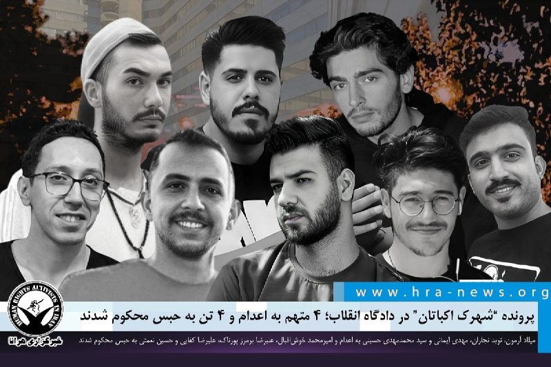

پرونده “شهرک اکباتان” در دادگاه انقلاب؛ ۴ متهم به اعدام و ۴ تن به حبس محکوم شدند

❗️
❗️
❗️
❗️
❗️– میلاد آرمون، نوید نجاران، مهدی ایمانی و سید محمدمهدی حسینی متهمان پرونده موسوم به “شهرک اکباتان” و از بازداشت شدگان اعتراضات سراسری ۱۴۰۱، توسط دادگاه انقلاب تهران به اتهام «#محاربه» به #اعدام محکوم شدند. امیرمحمد خوش‌اقبال، علیرضا برمرز پورناک، علیرضا کفایی و حسین نعمتی دیگر متهمان این پرونده نیز هرکدام به هفت سال حبس و مجازات های تکمیلی محکوم شدند. بخش دیگر این پرونده در دادگاه کیفری رسیدگی و چندی پیش منجر به صدور حکم #حبس و دیه برای برخی از متهمان شد.

به گزارش خبرگزاری هرانا، ارگان خبری مجموعه فعالان حقوق بشر در ایران، هشت تن از متهمان پرونده اکباتان توسط دادگاه انقلاب محکوم شدند.

براساس حکمی که توسط شعبه ۱۵ دادگاه انقلاب تهران به ریاست قاضی ابوالقاسم صلواتی صادر شده، میلاد آرمون، نوید نجاران، مهدی ایمانی و سید محمدمهدی حسینی از بابت اتهام «محاربه» اعدام محکوم شدند. همچنین امیرمحمد خوش‌اقبال، علیرضا برمرز پورناک، علیرضا کفایی و حسین نعمتی دیگر متهمان این پرونده نیز هرکدام به پنج سال زندان از بابت اتهام اجتماع و تبانی، دوسال حبس از بابت تبلیغ علیه نظام، دو سال منع فعالیت در فضای مجازی و دو سال منع اسکان در تهران و البرز محکوم شدند.
یک منبع مطلع از پرونده این افراد در گفت‌وگو با هرانا اعلام کرد که حکم صادره در روز جاری، بدون حضور و اطلاع وکلای پرونده، به‌صورت شفاهی به متهمان ابلاغ شده است. به گفته این منبع، حکم تاکنون به وکلای پرونده ابلاغ نشده؛ موضوعی که عملاً امکان ثبت درخواست تجدیدنظرخواهی را از آنان سلب کرده است.

ادامه مطلب

#میلاد_آرمون، #نوید_نجاران، #مهدی_ایمانی، #سید_محمدمهدی_حسینی، #امیرمحمد_خوش‌اقبال، #علیرضا_برمرز_پورناک، #علیرضا_کفایی، #حسین_نعمتی #اکباتان

↘️
@hranews_bot تماس ✉️ -  @Hranews  کانال هرانا 🆑

## manototv — post 105810

  <a href="telegram/content/manototv_105810_1779643470.mp4" target="_blank">🎬 Download video</a>

تماسی با خانواده جاویدنام مهدی اسکندریان:
«می‌گفت مهدی عاشق ایران بود…
و دختر کوچکش هنوز منتظر برگشتن پدرش به خانه است.»

## alonews — post 122396

  <a href="telegram/content/alonews_122396_1779643472.webm" target="_blank">🎬 Download video</a>

👈 آخرین قیمت نفت ۱۰۳.۵۴ دلار

✅ @AloNews خبر جنگ

## alonews — post 122395

  <a href="telegram/content/alonews_122395_1779643472.webm" target="_blank">🎬 Download video</a>

👈کانال ۱۲ اسرائیل هم اختلافات بین ایران و آمریکا رو تایید کرد

✅ @AloNews خبر جنگ

## alonews — post 122394

  <a href="telegram/content/alonews_122394_1779643472.webm" target="_blank">🎬 Download video</a>

👈فاکس نیوز نقاط اختلاف در توافق ایران و آمریکا را اعلام کرد:

🔴1. اسرائیل خواستار تضمین «آزادی عمل نظامی» علیه تهدیدها در لبنان است و ایران این را رد می‌کند.

🔴2. تهران خواستار آزادسازی فوری دارایی‌های خود است و واشنگتن امتناع می‌کند و اصرار دارد که این موضوع به فرمول نهایی توافق مرتبط شود.»

✅ @AloNews خبر جنگ

## alonews — post 122393

  <a href="telegram/content/alonews_122393_1779643472.webm" target="_blank">🎬 Download video</a>

👈پسر ترامپ: پدرم بهم قول داده نزاره ایران به سلاح هسته‌ای برسه

✅ @AloNews خبر جنگ

## alonews — post 122392

  <a href="telegram/content/alonews_122392_1779643473.webm" target="_blank">🎬 Download video</a>

👈 جوزالم پست: ایران در اصل با یک توافق آتش‌بس با ایالات متحده موافقت کرده است که بر اساس آن، اورانیوم بسیار غنی‌شده خود را از بین خواهد برد

✅ @AloNews خبر جنگ

## alonews — post 122391

  <a href="telegram/content/alonews_122391_1779643473.webm" target="_blank">🎬 Download video</a>

👈خبرنگار الجزیره: حملات هوایی اسرائیل شهرهای شرقیه، کوثریات الروز و زوتر الشرقیه در جنوب لبنان را هدف قرار داد

✅ @AloNews خبر جنگ

## alonews — post 122390

  <a href="telegram/content/alonews_122390_1779643473.webm" target="_blank">🎬 Download video</a>

👈 تسنیم: علیرغم برخی گفتگوهای امروز، کارشکنی‌ های آمریکا در برخی بندهای تفاهم از جمله موضوع آزادسازی اموال بلوکه شده ایران همچنان ادامه دارد و تا این لحظه این موضوعات حل نشده است.

🔴 بر این اساس، در حال حاضر همچنان امکان منتفی شدن تفاهم وجود دارد و ایران تاکید کرده است که از خطوط قرمز خود برای احقاق حقوق مردم کوتاه نخواهد آمد

✅ @AloNews خبر جنگ

## alonews — post 122389

  <a href="telegram/content/alonews_122389_1779643473.webm" target="_blank">🎬 Download video</a>

🔴فوری / علی هاشم خبرنگار الجزیره: کمتر از ۲۴ ساعت پس از ظهور خوش‌بینی در مورد امکان توافق‌نامه ایران و آمریکا، حال‌وهوای منفی دوباره سر برآورده است.

🔴 منبعی آگاه ایرانی به من می‌گوید که نشانه‌هایی از عقب‌نشینی آمریکا در دو مسئله مرکزی وجود دارد: مکانیسم برای از یخ‌زدگی خارج کردن دارایی‌های ایرانی و دامنه آتش‌بس در لبنان.

🔴 بر اساس گفته‌های این منبع، توافق‌نامه شامل چارچوبی برای آتش‌بس در لبنان است، اما گزارش شده است که اسرائیل با این چیدمان راحت نیست و واشنگتن را تحت فشار قرار می‌دهد تا بندی را اضافه کند که به آن اجازه دهد تحت توجیه پاسخ به «هرگونه تهدید»، عملیات نظامی در لبنان انجام دهد.

🔴ایران این فرمول‌بندی را رد کرده و بر یک آتش‌بس پایدار و ماندگار اصرار دارد.

🔴 تهران به تمام میانجی‌گران، از جمله پاکستان، اطلاع داده است که تا زمانی که تمام بندها به طور کامل توافق و تضمین نشوند، توافق‌نامه را امضا نخواهد کرد.

🔴 گزارش شده است که پاکستان پیشنهاد داده است با بخش‌های توافق‌شده پیش بروند و نقاط اختلاف را به تعویق بیندازند، اما ایران این رویکرد را رد کرده و اصرار دارد که بندهای مورد اختلاف بنیادین و غیرقابل مذاکره هستند.

🔴 تصویر کلی نشان می‌دهد که تهران فزاینده‌تر واشنگتن را در حال عقب‌نشینی از تفاهم‌های قبلی که از طریق میانجی‌گران حاصل شده بود، می‌بیند.

✅ @AloNews خبر جنگ

## alonews — post 122388

  <a href="telegram/content/alonews_122388_1779643473.webm" target="_blank">🎬 Download video</a>

👈رئیس ستاد کل ارتش اسرائیل:
ما آماده‌ایم که فوراً به نبرد با ایران بازگردیم.

✅ @AloNews خبر جنگ

## alonews — post 122387

  <a href="telegram/content/alonews_122387_1779643473.webm" target="_blank">🎬 Download video</a>

👈طبق گزارش فاکس نیوز، ترامپ می‌خواهد توافق پیشنهادی توسط مذاکره‌کنندگان او، از جمله استیو ویتکوف و جرد کوشنر، اجرا شود؛ اگر این شرایط برآورده نشوند، هیچ توافقی صورت نخواهد گرفت.

✅ @AloNews خبر جنگ

## alonews — post 122385

  <a href="telegram/content/alonews_122385_1779643474.webm" target="_blank">🎬 Download video</a>

👈تسنیم: کارشکنی آمریکا در برخی بندهای تفاهم تا این لحظه ادامه دارد

✅ @AloNews خبر جنگ

---
📅 بروزرسانی: 1405/03/03 19:50
---

## VahidOOnLine — post 241965

  

دونالد ترامپ جونیور، پسر ارشد رئیس‌جمهور آمریکا، در شبکه ایکس نوشت: این یک پیروزی بزرگ برای آمریکا است. ما باید کسانی را که هرگز راضی نمی‌شوند مگر با تهاجم زمینی به ایران، نادیده بگیریم. پدر من وعده داده بود که مانع دستیابی ایران به سلاح هسته‌ای شود و دقیقا در حال تحقق همین هدف است.
‌🏁 🇬🇧 IranintlTV

🤖 @VahidOOnLine

## VahidOOnLine — post 241964

  <a href="telegram/content/VahidOOnLine_241964_1779639613.mp4" target="_blank">🎬 Download video</a>

وزیران خارجه ۱۹ کشور عربی و اسلامی در بیانیه‌ای مشترک، اقدام منطقه موسوم به «سومالی‌لند» در افتتاح «سفارت» در اورشلیم را به‌شدت محکوم کردند.

در این بیانیه که روز یکشنبه سوم خرداد منتشر شد، این اقدام «غیرقانونی و مردود» خوانده شده و آمده است که افتتاح این دفتر، نقض آشکار قوانین بین‌المللی و قطعنامه‌های مربوط به مشروعیت بین‌المللی است.

وزیران خارجه کویت، مصر، عربستان سعودی، قطر، اردن، ترکیه، پاکستان، اندونزی، جیبوتی، سومالی، فلسطین، عمان، سودان، یمن، لبنان، موریتانی، الجزایر، بنگلادش و مراکش تاکید کردند که اورشلیم شرقی «سرزمین فلسطینی اشغال‌شده از سال ۱۹۶۷» است و هر اقدامی برای تغییر وضعیت حقوقی و تاریخی آن «باطل و بی‌اثر» است.

این کشورها همچنین حمایت کامل خود را از وحدت، حاکمیت و تمامیت ارضی جمهوری فدرال سومالی اعلام کردند و هرگونه اقدام یک‌جانبه علیه وحدت سرزمینی سومالی را مردود دانستند.
‌🏁 🇬🇧 ManotoTV

🤖 @VahidOOnLine

## VahidOOnLine — post 241963

  

♦️بنیامین نتانیاهو، نخست‌وزیر اسرائیل، روز یکشنبه اعلام کرد او و دونالد ترامپ، رئیس‌جمهوری آمریکا، توافق دارند که هرگونه توافق نهایی با ایران باید «تهدید هسته‌ای»
ناشی از جمهوری اسلامی را از میان بردارد.

نتانیاهو گفت تحقق این هدف مستلزم برچیدن تاسیسات غنی‌سازی اورانیوم ایران و خارج کردن مواد غنی‌شده هسته‌ای از خاک این کشور است.

نخست‌وزیر اسرائیل همچنین اعلام کرد ترامپ بار دیگر بر حق اسرائیل برای دفاع از خود در برابر تهدیدها در همه جبهه‌ها، از جمله لبنان،
تاکید کرده است.
‌🇸🇦 Indypersian

🤖 @VahidOOnLine

## VahidOOnLine — post 241962

  

یک مقام ارشد دولت آمریکا به فاکس‌نیوز گفت اگر ایران در موضوع اورانیوم غنی‌شده امتیازهای قابل‌توجهی بدهد، واشینگتن نیز در زمینه کاهش تحریم‌ها امتیازهای مهمی ارائه خواهد کرد.

او گزارش‌ها درباره احتمال امضای توافق در روز یکشنبه را کم‌اهمیت دانست و گفت ساختار تصمیم‌گیری در تهران «به آن سرعتی که لازم است عمل نمی‌کند.»

این مقام افزود برنامه آمریکا رسیدگی به تمام ذخایر اورانیوم غنی‌شده ایران است و اکنون انعطاف‌هایی از سوی تهران دیده می‌شود که پیش‌تر وجود نداشت.

او همچنین تاکید کرد آمریکا با اخذ عوارض در تنگه هرمز مخالف است.
‌🏁 🇬🇧 IranintlTV

🤖 @VahidOOnLine

## VahidOOnLine — post 241961

  

♦️کاظم غریب‌آبادی، معاون حقوقی و بین‌الملل وزارت امور خارجه جمهوری اسلامی، روز یکشنبه ۳ خرداد در پیامی در شبکه اجتماعی اکس اعلام کرد در سفر به عمان، پیام شفاهی عباس عراقچی، وزیر امور خارجه ایران، را به بدر البوسعیدی، وزیر خارجه عمان، منتقل کرده است.

غریب‌آبادی نوشت این پیام در چارچوب رایزنی‌ها و همکاری‌های مستمر میان تهران و مسقط ارائه شده و به گفتگوهای جاری ایران و آمریکا که با میانجی‌گری پاکستان در حال انجام است و همچنین تلاش‌ها برای موفقیت این مذاکرات مربوط می‌شود.

معاون  عراقچی همچنین اعلام کرد پس از این دیدار، نشست مفصلی میان هیات‌های ایرانی و عمانی درباره «اصول حاکم بر عبور شناورها از تنگه هرمز» برگزار شد.

غریب‌آبادی نوشت: «پس از این دیدار، نشست مبسوطی میان هیأت‌های عمانی و ایرانی برای بررسی مجموعه‌ای از اصول حاکم بر عبور شناورها در تنگه هرمز با رعایت امنیت و حاکمیت ملی دولت‌های ساحلی این تنگه و در پرتو قواعد قابل اعمال حقوق بین‌الملل برگزار شد.»
‌🇸🇦 Indypersian

🤖 @VahidOOnLine

## VahidOOnLine — post 241960

  

♦️در بحبوحه گمانه‌زنی‌ها درباره امضای توافق احتمالی پایان جنگ میان ایران و آمریکا، دونالد ترامپ نقل قولی از مسعود پزشکیان که گفته بود «آماده‌ایم به جهان اطمینان دهیم که به‌دنبال سلاح هسته‌ای و خواهان بی‌ثباتی در منطقه نیز نیستیم»، را در شبکه اجتماعی تروث سوشال بازنشر کرد.
پزشکیان، رئیس‌جمهوری اسلامی، روز یکشنبه در گفتگویی ویدیویی اعلام کرد ایران آماده است در چارچوب گفتگوها به جهان اطمینان دهد که به‌دنبال سلاح هسته‌ای و ایجاد ناآرامی در منطقه نیست.

ترامپ پیش‌تر در پیامی روابط واشنگتن و تهران را «در حال حرفه‌ای‌ و سازنده‌تر شدن» توصیف کرده بود.
‌🇸🇦 Indypersian

🤖 @VahidOOnLine

## VahidOOnLine — post 241959

  

♦️جنیفر جیکوب، خبرنگار شبکه خبری سی‌بی‌اس، روز یکشنبه سوم خرداد ماه به نقل از منابع آگاه گزارش داد کاخ سفید بر این باور است مجتبی خامنه‌ای رهبر جمهوری اسلامی، چارچوب کلی پیش‌نویس توافق میان تهران و واشنگتن را تایید کرده است.
بر اساس این گزارش، ایران پذیرفته است در ازای لغو محاصره و کاهش فشارهای آمریکا، ذخایر اورانیوم با غنای بالا را کنار بگذارد.
با این حال، مقام‌های آمریکایی تاکید کرده‌اند این پیش‌نویس هنوز باید مراحل تایید در ساختار رهبری جمهوری اسلامی را طی کند و واشنگتن خواهان تعهد رسمی تهران برای کنار گذاشتن اورانیوم با غنای بالا و حل‌وفصل دیگر مسائل هسته‌ای است.
سی‌بی‌اس همچنین گزارش داد جی‌دی ونس، استیو ویتکاف و جرد کوشنر در مذاکرات نقش دارند و آمریکا تلاش می‌کند همه متحدان خود در خاورمیانه را در روند مذاکرات دخیل کند.
‌🇸🇦 Indypersian

🤖 @VahidOOnLine

## VahidOOnLine — post 241958

  

دونالد ترامپ صحبت‌های مسعود پزشکیان را که گفته بود «آماده‌ایم به جهان اطمینان دهیم که به‌دنبال سلاح هسته‌ای نیستیم و خواهان بی‌ثباتی در منطقه نیز نیستیم»، در شبکه تروث سوشال بازنشر کرد.

ترامپ پیش‌تر نیز گفت روابط آمریکا با جمهوری اسلامی در حال حرفه‌ای‌تر و سازنده‌تر شدن است.
‌🏁 🇬🇧 IranintlTV

🤖 @VahidOOnLine

## VahidOOnLine — post 241957

  

به گزارش اکسیوس، یک مقام ارشد آمریکایی به خبرنگاران گفت کاخ سفید انتظار ندارد توافق برای پایان جنگ با جمهوری اسلامی یکشنبه نهایی شود و معتقد است تأیید آن از سوی رهبران جمهوری اسلامی، از جمله مجتبی خامنه‌ای، ممکن است چند روز زمان ببرد.

او افزود با وجود خوش‌بینی مقام‌های آمریکایی به دستیابی به توافق در روزهای آینده، مذاکرات هنوز نهایی نشده و همچنان احتمال شکست آن وجود دارد.

به گفته این مقام، این توافق می‌تواند از تشدید جنگ جلوگیری کرده و فشار بر بازار جهانی نفت را کاهش دهد، اما هنوز مشخص نیست آیا به توافقی پایدار، از جمله درباره خواسته‌های هسته‌ای ترامپ، منجر خواهد شد یا نه.
‌🏁 🇬🇧 IranintlTV

🤖 @VahidOOnLine

## VahidOOnLine — post 241956

  

♦️رسانه آکسیوس، روز یکشنبه سوم خرداد ماه، به نقل از یک مقام ارشد دولت دونالد ترامپ گزارش داد، «چند مورد جزئیات حل‌نشده» میان تهران و واشنگتن باقی‌مانده است و به همین دلیل توافق میان ایران و آمریکا احتمالا امروز امضا نخواهد شد.

این مقام آمریکایی به آکسیوس گفت هنوز بر سر برخی بخش‌های توافق «رفت‌وبرگشت» وجود دارد و اختلاف‌ها بیشتر بر سر عباراتی است که برای هر یک از دو طرف اهمیت دارد: «برخی کلمات برای ما مهم هستند و برخی کلمات برای آن‌ها.»

آکسیوس به نقل از این مقام ارشد کاخ سفید نوشت، ساختار تصمیم‌گیری در جمهوری اسلامی «سریع عمل نمی‌کند» و روند دریافت همه تاییدیه‌های لازم چند روز زمان خواهد برد.

به گفته این مقام، ارزیابی واشنگتن این است که «مجتبی خامنه‌ای»، رهبر جمهوری اسلامی، چارچوب کلی توافق را تایید کرده، اما اینکه این روند به توافق نهایی منجر شود، «همچنان یک سوال باز» است.
‌🇸🇦 Indypersian

🤖 @VahidOOnLine

## VahidOOnLine — post 241955

  

♦️محسن رضایی، فرمانده سابق سپاه پاسداران و مشاور مجتبی خامنه‌ای، روز یکشنبه سوم خرداد ماه، در مراسمی حکومتی با هشدار به آمریکا اعلام کرد، نیروهای مسلح جمهوری اسلامی در صورت ورود نیروهای آمریکایی به خلیج فارس و یا حمله به تنگه هرمز، علاوه بر شکستن هرگونه محاصره دریایی، دست به اقداماتی قاطع خواهند زد و «خروج از پیمان منع گسترش سلاح‌های هسته‌ای (NPT)» نیز یکی از گزینه‌های جدی روی میز تهران است.

رضایی همچنین گفت آمریکا باید با پذیرش شروط «منصفانه» ایران، از «خودکشی اقتصادی و نظامی» جلوگیری کند.
این اظهارات در حالی مطرح می‌شود که گزارش‌ها از احتمال نهایی شدن توافق میان دو طرف در آینده نزدیک خبر می‌دهند.

همزمان با سخنان محسن رضایی، دونالد ترامپ نیز صبح یکشنبه (به وقت آمریکا) تصویری ساخته با هوش مصنوعی را در شبکه اجتماعی تروث سوشال منتشر کرد که انهدام یک قایق سپاه پاسداران به دست پهپاد آمریکایی را نشان می‌دهد.
کارشناسان معتقدند با توجه به حساسیت شرایط در دو سو، تهران و واشنگتن تهدیدهای متقابل را تا پیش از رسیدن به توافق ادامه خواهند داد.
‌🇸🇦 Indypersian

🤖 @VahidOOnLine

## VahidOOnLine — post 241954

  

بنیامین نتانیاهو، نخست‌وزیر اسرائیل، اعلام کرد او و دونالد ترامپ توافق دارند هرگونه توافق نهایی با جمهوری اسلامی باید به‌طور کامل تهدید هسته‌ای را برطرف کند.

او گفت این به معنای برچیدن تاسیسات غنی‌سازی ایران و خارج کردن مواد هسته‌ای غنی‌شده از خاک این کشور است.

نتانیاهو افزود ترامپ بار دیگر بر حق اسرائیل برای دفاع از خود در برابر تهدیدها در همه جبهه‌ها، از جمله لبنان، تاکید کرده است.

او همچنین گفت سیاست او، همانند سیاست ترامپ، همچنان ثابت است؛ ایران نباید به سلاح هسته‌ای دست یابد.
‌🏁 🇬🇧 IranintlTV

🤖 @VahidOOnLine

## WithYashar — post 12346

دبیرکل حزب‌الله: خلع سلاح را نمی پذیریم
تحریم‌های آمریکا هرگز ما را تضعیف نخواهد کرد؛ اگر آمریکا بیش از این خوی وحشی‌گری به خود بگیرد، دیگر چیزی برایش در لبنان باقی نخواهد ماند
@withyashar

## WithYashar — post 12345

یک مقام آمریکایی به سی‌بی‌اس: ایران قبول کرده اورانیوم غنی شده‌ش رو به‌عنوان بخشی از توافق، دفن کنه
@withyashar

## WithYashar — post 12344

جروزالم پست: جنگ، ایران را فرو نپاشید. کنترل آن بر هرمز را تثبیت کرد، اتحادهایش را از نو ساخت و همان نهادهایی را که ایالات متحده هدف قرار داده بود، تقویت کرد
@withyashar

## WithYashar — post 12343

نیویورک تایمز به نقل از یک مقام آمریکایی: مسائلی مانند ذخایر موشکی ایران و غنی سازی اورانیوم در مذاکرات بعدی مورد بحث قرار خواهد گرفت.
@withyashar

## WithYashar — post 12342

حسین یکتا: علی خامنه ای توی دوران جنگ شبانه با حاج علی مالکی رفتن حموم، حضرت آقا گفت فقط به شرطی میذارم منو لیف بکشی که منم تورو لیف بزنم و کیسه بکشم. @withyashar

## WithYashar — post 12341

## mwarmonitor — post 9650

🔴رئیس ستاد ارتش اسرائیل: ما آماده‌ایم فوراً به نبرد شدید بازگردیم تا رژیم «تروریستی» ایران را تضعیف کنیم.

@mwarmonitor

## mwarmonitor — post 9649

  <a href="telegram/content/mwarmonitor_9649_1779639618.mp4" target="_blank">🎬 Download video</a>

❌برای رفع تهدید فوری: ارتش اسرائیل یک تروریست از سازمان تروریستی حماس را که در یورش به پایگاه زیکیم در کشتار ۷ اکتبر شرکت داشت، به هلاکت رساند

🔸در طول آخر هفته (جمعه)، نیروهای ارتش اسرائیل تحت فرماندهی جنوب، تروریست لؤی هشام محمود بصل را که به‌عنوان تک‌تیرانداز در گردان زیتون وابسته به سازمان تروریستی حماس فعالیت می‌کرد و تهدیدی فوری علیه نیروهای ما محسوب می‌شد، به هلاکت رساندند.

🔹بر اساس بررسی‌های اطلاعاتی، مشخص شد که این تروریست در یورش به پایگاه زیکیم در کشتار خونین ۷ اکتبر مشارکت داشته و در دوره اخیر نیز برای اجرای طرح‌های تروریستی علیه نیروهای ارتش اسرائیل در منطقه فعالیت می‌کرده است.

🔸نیروهای ارتش اسرائیل تحت فرماندهی جنوب مطابق با توافق در منطقه مستقر هستند و به فعالیت خود برای رفع هرگونه تهدید فوری ادامه خواهند داد.

@mwarmonitor

## mwarmonitor — post 9648

🔰مارک لوین ؛ همان‌طور که بیشتر مردم می‌دانند، من طرفدار بسیار پر و پا قرص ریگان هستم. در سال‌های ۱۹۷۶ و ۱۹۸۰ برای او تبلیغ کردم و ۸ سال در دولت او خدمت کردم. اما یکی از بزرگ‌ترین اشتباهات، عفو ۲.۳ میلیون مهاجر غیرقانونی بود. علاوه بر آن، این عفو پیش از آن انجام شد که دموکرات‌ها وعده دهند بودجه امنیت مرزی تأمین خواهد شد. دموکرات‌ها به‌سادگی از اجرای بخش خود از توافق خودداری کردند. ریگان بعدها گفت که این یک اشتباه بوده است.

🔸زمان‌بندی اهمیت دارد. من با یک توافق مخالفم. ماه‌هاست این را می‌گویم. به کسانی که خواهان توافق بودند تبریک می‌گویم؛ به نظر می‌رسد امروز روز شماست. و اگر توافقی انجام شود، رژیم ایران دست‌کم فعلاً باقی خواهد ماند. باید دید در طول زمان این موضوع چگونه پیش می‌رود. من نسبت به این‌که هر توافقی بتواند دشمن را مهار کند یا اجرا شود بسیار بدبین هستم، به دلایل متعدد؛ به‌ویژه بعد از ترک سمت ریاست‌جمهوری توسط ترامپ، یا این‌که تروریست‌ها دست از تروریسم بردارند.

🔹با این حال، فرض می‌کنم اگر توافقی وجود داشته باشد، رژیم ایران باید ابتدا تعهدات خود را انجام دهد — یعنی به‌عنوان شرط مقدم بر هرگونه رفع تحریم. معتقدم اگر این‌طور نباشد، اشتباه بزرگی خواهد بود. از جمله اینکه اگر رژیم ایران قصد عمل به تعهداتش را ندارد، باید از همان ابتدا مشخص شود، نه بعداً. و باید همین حالا خودش را آشکار کند.

🔸همچنین آزاد کردن میلیاردها و میلیاردها دلار برای آن‌ها — که پیش از جنگ مسدود شده بود — پس از رسیدن به دستشان تقریباً غیرقابل کنترل خواهد بود و برای تقویت رژیم استفاده خواهد شد. من در این مورد هیچ شکی ندارم. این همان چیزی است که هستند. این طرز فکر آن‌هاست. آن‌ها به هیچ‌کس جز خودشان پاسخگو نیستند.

🔹هیچ کشور خاورمیانه‌ای نباید برای یک توافق، تحت فشار قرار گیرد تا امنیت ملی خود را کاهش دهد. آیا حزب‌الله واقعاً زنده می‌ماند و دوباره در لبنان قدرت می‌گیرد و آزاد خواهد بود که به شلیک موشک به اسرائیل ادامه دهد؟ آیا ما چنین چیزی را می‌پذیریم؟ این موضوع باید کاملاً روشن باشد. «حق موجودیت اسرائیل» نباید فقط یک شعار باشد.

🔸تا این لحظه من هیچ چیزی درباره موشک‌های بالستیک نمی‌بینم، در حالی که این‌ها خطرناک‌ترین سلاح متعارف در زرادخانه رژیم ایران هستند. مهم خواهد بود که ببینیم این موضوع چگونه رسیدگی می‌شود.

🔹اگر توافقی انجام شود، من روی مجموعه‌ای از مسائل به‌طور جدی تمرکز خواهم کرد. همه ما باید همین کار را بکنیم. عجیب خواهد بود اگر نکنیم. این فقط یک دشمن خارجی هزاران کیلومتر دورتر نیست. در ۴۷ سال گذشته هزاران آمریکایی را کشته یا معلول کرده است.

🔸رئیس‌جمهور بارها قوی‌ترین استدلال را برای ضرورت و فوریت اقدام نظامی مطرح کرده است. همچنین بسیار مفیدتر و منطقی‌تر خواهد بود اگر سناتورها و نمایندگان کنگره که خواهان توافق هستند، دقیقاً توضیح دهند که از نظر آن‌ها سازوکار یک توافق چگونه باید باشد.

ادامه دارد...

@mwarmonitor

## mwarmonitor — post 9647

🔴ایالات متحده و ایران به‌طور اصولی بر سر یک توافق به تفاهم رسیده‌اند که بر اساس آن تنگه هرمز دوباره بازگشایی شود و ایران متعهد شود اورانیوم بسیار غنی‌شده خود را دفع کند، یک مقام آمریکایی روز یکشنبه گفت. این مقام افزود که این توافق هنوز امضا نشده است. نیویورک تایمز

@mwarmonitor

## FoxNewsTwitter — post 342185

‌Fox News (Twitter/X)

BREAKING: US offering 'significant' sanctions relief for 'serious' Iranian deal on nuclear material, doesn't expect to sign agreement Sunday, senior administration official tells Fox News' @TreyYingst

## pm_afshaa — post 91398

🔴یک مقام آمریکایی به سی‌بی‌اس: ایران قبول کرده اورانیوم غنی شده‌ش رو به‌عنوان بخشی از توافق، دفن کنه

💧 Rainbet.com the #1 Non-KYC Crypto Casino & Sportsbook @rainbetcom

😁 @Pm_Afshaa

## pm_afshaa — post 91397

جروزالم پست: جنگ، ایران را فرو نپاشید. کنترل آن بر هرمز را تثبیت کرد، اتحادهایش را از نو ساخت و همان نهادهایی را که ایالات متحده هدف قرار داده بود، تقویت کرد

💧 Rainbet.com the #1 Non-KYC Crypto Casino & Sportsbook @rainbetcom

😁 @Pm_Afshaa

## pm_afshaa — post 91396

🔴فاکس نیوز: یک مقام ارشد در دولت ترامپ گفته است که توافق ایران امروز امضا نخواهد شد، اما پیشرفت‌هایی در مذاکرات حاصل شده است.

«اگر ایرانی‌ها در مسئله غنی‌سازی امتیازات قابل توجهی بدهند، ما نیز در زمینه رفع تحریم‌ها امتیازات قابل توجهی خواهیم داد

💧 Rainbet.com the #1 Non-KYC Crypto Casino & Sportsbook @rainbetcom

😁 @Pm_Afshaa

## pm_afshaa — post 91395

  <a href="telegram/content/pm_afshaa_91395_1779639619.webm" target="_blank">🎬 Download video</a>

🔴نتانیاهو: پرزیدنت ترامپ و من توافق کردیم که هرگونه توافق نهایی با ایران باید خطر هسته‌ای رو به‌طور کامل از بین ببرد. این یعنی برچیدن (تخریب) سایت‌های غنی‌سازی هسته‌ای ایران و خارج کردن مواد هسته‌ای غنی‌شده‌ی اون از خاک این کشور.

💧 Rainbet.com the #1 Non-KYC Crypto Casino & Sportsbook @rainbetcom

😁 @Pm_Afshaa

## pm_afshaa — post 91394

  <a href="telegram/content/pm_afshaa_91394_1779639619.webm" target="_blank">🎬 Download video</a>

🔴پست جدید ترامپ:

یکی از بدترین توافق‌هایی که کشور ما تا به حال انجام داده، توافق هسته‌ای ایران بود که توسط باراک حسین اوباما و آماتورهای بی‌تجربه دولت او مطرح، امضا و اجرایی شد. این توافق، مسیری مستقیم برای دستیابی ایران به سلاح هسته‌ای بود. اما معامله‌ای که در حال حاضر توسط دولت ترامپ با ایران در حال مذاکره است، اصلاً این‌طور نیست؛ در واقع، دقیقاً عکس آن است!

مذاکرات به شکلی منظم و سازنده در حال پیشرفت است و من به نمایندگان خود اعلام کرده‌ام که برای رسیدن به توافق عجله نکنند، چرا که زمان به نفع ماست. محاصره (تحریم‌ها) تا زمان دستیابی، تأیید و امضای یک توافق، با قدرت و قوت تمام به قوت خود باقی خواهد ماند. هر دو طرف باید زمان کافی بگذارند و کار را درست انجام دهند. هیچ اشتباهی نباید رخ دهد!

رابطه ما با ایران در حال تبدیل شدن به رابطه‌ای بسیار حرفه‌ای‌تر و سازنده‌تر است. با این حال، آن‌ها باید درک کنند که نمی‌توانند سلاح یا بمب هسته‌ای بسازند یا به آن دست یابند.

من مایلم تا این لحظه از تمامی کشورهای خاورمیانه برای حمایت و همکاری‌شان تشکر کنم؛ همکاری‌هایی که با پیوستن آن‌ها به کشورهای توافق‌نامه تاریخی ابراهیم، بیش از پیش تقویت و مستحکم خواهد شد و کسی چه می‌داند، شاید جمهوری اسلامی ایران نیز مایل باشد به آن بپیوندد!

💧 Rainbet.com the #1 Non-KYC Crypto Casino & Sportsbook @rainbetcom

😁 @Pm_Afshaa

## pm_afshaa — post 91393

محسن رضایی:اگر دشمن به تنگه هرمز حمله کند، ما محاصره دریایی را می‌شکنیم و ممکن است از پیمان منع گسترش سلاح‌های هسته‌ای (NPT) خارج شویم

💧 Rainbet.com the #1 Non-KYC Crypto Casino & Sportsbook @rainbetcom

😁 @Pm_Afshaa

## mamlekate — post 103577

📝 دونالد ترامپ: عجله‌ای برای امضای توافق نداریم، زمان به نفع ماست

دونالد ترامپ رئیس‌جمهوری ایالات متحده، در حالی که همه منتظر انتشار جزئیات توافق با ایران هستند، پیام جدیدی بر صفحه تروت‌سوشال خود منتشر کرد.

@mamlekate

## VahidOnline — post 75686

  

رسانه آکسیوس، روز یکشنبه سوم خرداد ماه، به نقل از یک مقام ارشد دولت دونالد ترامپ گزارش داد، «چند مورد جزئیات حل‌نشده» میان تهران و واشنگتن باقی‌مانده است و به همین دلیل توافق میان ایران و آمریکا احتمالا امروز امضا نخواهد شد.

این مقام آمریکایی به آکسیوس گفت هنوز بر سر برخی بخش‌های توافق «رفت‌وبرگشت» وجود دارد و اختلاف‌ها بیشتر بر سر عباراتی است که برای هر یک از دو طرف اهمیت دارد: «برخی کلمات برای ما مهم هستند و برخی کلمات برای آن‌ها.»

آکسیوس به نقل از این مقام ارشد کاخ سفید نوشت، ساختار تصمیم‌گیری در جمهوری اسلامی «سریع عمل نمی‌کند» و روند دریافت همه تاییدیه‌های لازم چند روز زمان خواهد برد.

به گفته این مقام، ارزیابی واشنگتن این است که «مجتبی خامنه‌ای»، رهبر جمهوری اسلامی، چارچوب کلی توافق را تایید کرده، اما اینکه این روند به توافق نهایی منجر شود، «همچنان یک سوال باز» است.
@VahidOOnLine

📡 @VahidOnline

## VahidOnline — post 75685

  

بنیامین نتانیاهو، نخست‌وزیر اسرائیل، اعلام کرد او و دونالد ترامپ توافق دارند هرگونه توافق نهایی با جمهوری اسلامی باید به‌طور کامل تهدید هسته‌ای را برطرف کند.

او گفت این به معنای برچیدن تاسیسات غنی‌سازی ایران و خارج کردن مواد هسته‌ای غنی‌شده از خاک این کشور است.

نتانیاهو افزود ترامپ بار دیگر بر حق اسرائیل برای دفاع از خود در برابر تهدیدها در همه جبهه‌ها، از جمله لبنان، تاکید کرده است.

او همچنین گفت سیاست او، همانند سیاست ترامپ، همچنان ثابت است؛ ایران نباید به سلاح هسته‌ای دست یابد.
@VahidOOnLine

📡 @VahidOnline

## VahidOnline — post 75684

  

ترامپ سخنان پزشکیان را نشان داد: آماده‌ایم به جهان اطمینان بدهیم

ترامپ اسکرین‌شاتی از توییت خبرنگار فاکس‌نیوز رو پست کرده که نوشته بود:
مسعود پزشکیان، رئیس‌جمهور ایران: ما آماده‌ایم به جهان اطمینان بدهیم که به‌دنبال سلاح هسته‌ای نیستیم. ما به‌دنبال بی‌ثباتی در منطقه نیستیم.
realDonaldTrump

📡 @VahidOnline

## IranIntlTV — post 338788

  

دونالد ترامپ جونیور، پسر ارشد رئیس‌جمهور آمریکا، در شبکه ایکس نوشت: این یک پیروزی بزرگ برای آمریکا است. ما باید کسانی را که هرگز راضی نمی‌شوند مگر با تهاجم زمینی به ایران، نادیده بگیریم. پدر من وعده داده بود که مانع دستیابی ایران به سلاح هسته‌ای شود و دقیقا در حال تحقق همین هدف است.
https://iranintl.com/202605247103

## IranIntlTV — post 338787

  <a href="telegram/content/IranIntlTV_338787_1779639621.mp4" target="_blank">🎬 Download video</a>

با انتشار جزئیات توافق احتمالی واشینگتن و تهران، تد کروز، سناتور جمهوری‌خواه، آن را فاجعه‌بار خواند و یک مقام ارشد اسرائیل چنین توافقی را بد دانست. یک چهره رسانه‌ای حامی ترامپ هم به او هشدار داد با این توافق به سرنوشتی بدتر از کارتر و اوباما دچار خواهد شد.

گزارشی از مجتبا پورمحسن
@iranintltv

## IranIntlTV — post 338786

  <a href="https://t.me/IranintlTV/338786" target="_blank">📎 Download file</a>

🎧نسخه صوتی اخبار شبانگاهی | یکشنبه ۳ خرداد
@iranintlTV

## IranIntlTV — post 338785

ترامپ: زمان به نفع ماست، برای رسیدن به توافق عجله نداریم

دونالد ترامپ، رییس‌جمهوری آمریکا، مذاکرات تهران و واشینگتن را «سازنده» خواند و در عین حال تاکید کرد عجله‌ای برای دستیابی به توافق وجود ندارد.

ترامپ یک‌شنبه سوم خرداد در شبکه اجتماعی تروث‌سوشال نوشت: «مذاکرات به شکلی منظم و سازنده در حال پیشرفت است و من به نمایندگان خود اطلاع داده‌ام که برای رسیدن به توافق عجله نکنند، زیرا زمان به نفع ماست.»

او با انتقاد از باراک اوباما و «افراد کاملا آماتور» دولت او، برجام را «یکی از بدترین» توافق‌های تاریخ آمریکا خواند و افزود مذاکرات کنونی کاخ سفید با جمهوری اسلامی «دقیقا برعکس آن» است.

ترامپ تاکید کرد محاصره دریایی بنادر جنوبی ایران تا زمان «دستیابی به توافق و تایید و امضای آن» همچنان برقرار خواهد بود.

در روزهای اخیر، گمانه‌زنی‌ها در خصوص احتمال دستیابی تهران و واشینگتن به توافقی برای پایان جنگ بالا گرفته است.

ترامپ شامگاه دوم خرداد پس از گفت‌وگو با رهبران منطقه تایید کرد تنها «نهایی‌سازی متن» توافق با تهران باقی مانده است.

این موضوع واکنش‌های گسترده‌ای را در میان افکار عمومی و چهره‌های سیاسی به همراه داشته است.

شهروندان در پیام‌های خود به ایران‌اینترنشنال، از احتمال توافق میان جمهوری اسلامی و آمریکا ابراز ناامیدی کردند و آن را «خیانت» در حق مردم ایران و «پایمال کردن خون» جاویدنامان انقلاب ملی دانستند.

شماری از سناتورهای ارشد حزب جمهوری‌خواه آمریکا نیز از مفاد گزارش‌شده از توافق احتمالی انتقاد کردند و هشدار دادند این توافق تمام دستاوردهای عملیات «خشم حماسی» را از بین می‌برد.

ترامپ: تهران باید بپذیرد که نمی‌تواند به سلاح هسته‌ای دست یابد
رییس‌جمهوری ایالات متحده در ادامه پیام خود در تروث‌سوشال، با اشاره به مذاکرات جاری میان تهران و واشینگتن نوشت: «هر دو طرف باید وقت کافی بگذارند و این کار را درست انجام دهند. هیچ اشتباهی نباید رخ دهد.»

ترامپ اضافه کرد: «روابط ما با ایران در حال تبدیل شدن به رابطه‌ای حرفه‌ای‌تر و سازنده‌تر است. با این حال، آنها باید درک کنند که نمی‌توانند سلاح یا بمب هسته‌ای توسعه دهند یا به دست آورند.»

او همچنین از «حمایت و همکاری همه کشورهای خاورمیانه» قدردانی کرد و نوشت این رویکرد با پیوستن آن‌ها به پیمان ابراهیم تقویت خواهد شد.
ترامپ ادامه داد: «چه بسا شاید جمهوری اسلامی نیز بخواهد [به پیمان ابراهیم] بپیوندد.»

بنیامین نتانیاهو، نخست‌وزیر اسرائیل، سوم خرداد تصویری از خود و ترامپ در شبکه ایکس منتشر کرد که روی آن نوشته شده: «ایران هرگز به سلاح هسته‌ای دست نخواهد یافت.»

یک منبع اسرائیلی سوم خرداد به رویترز گفت ترامپ به‌روشنی به نتانیاهو اعلام کرده که در مذاکرات، بر خواسته همیشگی خود مبنی بر برچیدن برنامه هسته‌ای جمهوری اسلامی و خروج تمام اورانیوم غنی‌شده از ایران پافشاری خواهد کرد.

او افزود ترامپ تاکید کرده که بدون تحقق این شروط، «توافق نهایی را امضا نخواهد کرد».

در سوی دیگر، یک منبع ارشد حکومت ایران در مصاحبه با رویترز تاکید کرد تهران با انتقال ذخایر اورانیوم با غنای بالا موافقت نکرده و پرونده هسته‌ای بخشی از تفاهم اولیه با واشینگتن نیست.

محسن رضایی، مشاور نظامی مجتبی خامنه‌ای، هم تهدید کرد در صورت حمله آمریکا به تنگه هرمز، جمهوری اسلامی «محاصره دریایی را می‌شکند و ممکن است از ان‌پی‌تی خارج شود».

تاکید نتانیاهو بر آزادی عمل اسرائیل در تمامی جبهه‌ها
رویترز سوم خرداد به نقل از یک منبع سیاسی اسرائیل گزارش داد نتانیاهو در تماس تلفنی شب گذشته خود با ترامپ تاکید کرده که اسرائیل «آزادی عمل خود را برای مقابله با تهدیدها در همه جبهه‌ها، از جمله لبنان، حفظ خواهد کرد».

او افزود ترامپ نیز در این گفت‌وگو، موضع نتانیاهو را مورد تایید قرار داده و از آن حمایت کرده است.

ترامپ پیش‌تر گفت‌وگوی تلفنی خود با نخست‌وزیر اسرائیل را «خوب» ارزیابی کرده بود.

بنی گانتس، سیاستمدار برجسته اسرائیلی و وزیر پیشین دفاع این کشور، سوم خرداد هشدار داد توقف درگیری‌ها در لبنان به‌عنوان بخشی از توافق با جمهوری اسلامی، «اشتباهی راهبردی» خواهد بود که اسرائیل سال‌ها هزینه آن را خواهد پرداخت.

اول خرداد، اسماعیل بقایی، سخنگوی وزارت امور خارجه جمهوری اسلامی، اعلام کرده بود خاتمه جنگ در همه جبهه‌ها، از جمله لبنان، وضعیت تنگه هرمز و محاصره دریایی آمریکا، از محورهای اصلی گفت‌وگوهای حکومت ایران و ایالات متحده به شمار می‌روند.
 
🔗وب‌سایت ایران‌اینترنشنال
@iranintltv

## IranIntlTV — post 338784

  

یک مقام ارشد دولت آمریکا به فاکس‌نیوز گفت اگر ایران در موضوع اورانیوم غنی‌شده امتیازهای قابل‌توجهی بدهد، واشینگتن نیز در زمینه کاهش تحریم‌ها امتیازهای مهمی ارائه خواهد کرد.

او گزارش‌ها درباره احتمال امضای توافق در روز یکشنبه را کم‌اهمیت دانست و گفت ساختار تصمیم‌گیری در تهران «به آن سرعتی که لازم است عمل نمی‌کند.»

این مقام افزود برنامه آمریکا رسیدگی به تمام ذخایر اورانیوم غنی‌شده ایران است و اکنون انعطاف‌هایی از سوی تهران دیده می‌شود که پیش‌تر وجود نداشت.

او همچنین تاکید کرد آمریکا با اخذ عوارض در تنگه هرمز مخالف است.
https://iranintl.com/202605242847

## IranIntlTV — post 338783

  <a href="telegram/content/IranIntlTV_338783_1779639624.mp4" target="_blank">🎬 Download video</a>

هم‌زمان با مطرح شدن احتمال توافق میان تهران و واشینگتن، دونالد ترامپ، رییس‌جمهوری آمریکا، اعلام کرد محاصره دریایی تا زمان دست‌یابی و امضای یک توافق قطعی ادامه خواهد داشت. او در پیامی در شبکه اجتماعی تروث‌سوشال نوشت زمان به نفع آمریکا است و نمایندگانش نباید برای رسیدن به توافق عجله کنند.

مرضیه حسینی و اشکان صفایی، خبرنگاران ایران‌اینترنشنال، گزارش می‌دهند
@iranintltv

## IranIntlTV — post 338782

  

دونالد ترامپ صحبت‌های مسعود پزشکیان را که گفته بود «آماده‌ایم به جهان اطمینان دهیم که به‌دنبال سلاح هسته‌ای نیستیم و خواهان بی‌ثباتی در منطقه نیز نیستیم»، در شبکه تروث سوشال بازنشر کرد.

ترامپ پیش‌تر نیز گفت روابط آمریکا با جمهوری اسلامی در حال حرفه‌ای‌تر و سازنده‌تر شدن است.
https://iranintl.com/202605249014

## IranIntlTV — post 338781

  <a href="telegram/content/IranIntlTV_338781_1779639626.mp4" target="_blank">🎬 Download video</a>

یک شهروند با ارسال ویدیویی به ایران‌اینترنشنال می‌گوید یک خرید ساده مایحتاج برای خانه، ۹ میلیون تومان هزینه برداشته است.

## IranIntlTV — post 338780

  

به گزارش اکسیوس، یک مقام ارشد آمریکایی به خبرنگاران گفت کاخ سفید انتظار ندارد توافق برای پایان جنگ با جمهوری اسلامی یکشنبه نهایی شود و معتقد است تأیید آن از سوی رهبران جمهوری اسلامی، از جمله مجتبی خامنه‌ای، ممکن است چند روز زمان ببرد.

او افزود با وجود خوش‌بینی مقام‌های آمریکایی به دستیابی به توافق در روزهای آینده، مذاکرات هنوز نهایی نشده و همچنان احتمال شکست آن وجود دارد.

به گفته این مقام، این توافق می‌تواند از تشدید جنگ جلوگیری کرده و فشار بر بازار جهانی نفت را کاهش دهد، اما هنوز مشخص نیست آیا به توافقی پایدار، از جمله درباره خواسته‌های هسته‌ای ترامپ، منجر خواهد شد یا نه.
https://iranintl.com/202605248274

## IranIntlTV — post 338779

  

بنیامین نتانیاهو، نخست‌وزیر اسرائیل، اعلام کرد او و دونالد ترامپ توافق دارند هرگونه توافق نهایی با جمهوری اسلامی باید به‌طور کامل تهدید هسته‌ای را برطرف کند.

او گفت این به معنای برچیدن تاسیسات غنی‌سازی ایران و خارج کردن مواد هسته‌ای غنی‌شده از خاک این کشور است.

نتانیاهو افزود ترامپ بار دیگر بر حق اسرائیل برای دفاع از خود در برابر تهدیدها در همه جبهه‌ها، از جمله لبنان، تاکید کرده است.

او همچنین گفت سیاست او، همانند سیاست ترامپ، همچنان ثابت است؛ ایران نباید به سلاح هسته‌ای دست یابد.
https://iranintl.com/202605243871

## Shin_Persian — post 6208

↩️ Quoted tweet: Barak Ravid ✓ @BarakRavid Sun, 24 May 2026 14:52:25 UTC 🚨A senior Trump administration official says the agreement with Iran is not expected to be signed today 🚨The official said there are still several details to close. There is still back…

## Shin_Persian — post 6207

↩️ Quoted tweet:
Barak Ravid ✓ @BarakRavid
Sun, 24 May 2026 14:52:25 UTC

🚨A senior Trump administration official says the agreement with Iran is not expected to be signed today
🚨The official said there are still several details to close. There is still back and forth over certain parts of the deal. "some words that are important to us and some words

↩️ توییت نقل‌قول شده — برای پاسخ، پست زیر را ببینید.

فارسی

🚨 یک مقام ارشد دولت ترامپ می‌گوید انتظار نمی‌رود توافق با ایران امروز امضا شود.
🚨 این مقام گفت هنوز جزئیات متعددی برای نهایی شدن باقی مانده است. همچنان رفت و برگشت‌هایی بر سر بخش‌های خاصی از توافق وجود دارد. «برخی کلمات که برای ما مهم هستند و برخی کلمات...»

𝕏 · @shin_persian

## ManotoTV — post 105809

  <a href="telegram/content/ManotoTV_105809_1779639629.mp4" target="_blank">🎬 Download video</a>

وزیران خارجه ۱۹ کشور عربی و اسلامی در بیانیه‌ای مشترک، اقدام منطقه موسوم به «سومالی‌لند» در افتتاح «سفارت» در اورشلیم را به‌شدت محکوم کردند.

در این بیانیه که روز یکشنبه سوم خرداد منتشر شد، این اقدام «غیرقانونی و مردود» خوانده شده و آمده است که افتتاح این دفتر، نقض آشکار قوانین بین‌المللی و قطعنامه‌های مربوط به مشروعیت بین‌المللی است.

وزیران خارجه کویت، مصر، عربستان سعودی، قطر، اردن، ترکیه، پاکستان، اندونزی، جیبوتی، سومالی، فلسطین، عمان، سودان، یمن، لبنان، موریتانی، الجزایر، بنگلادش و مراکش تاکید کردند که اورشلیم شرقی «سرزمین فلسطینی اشغال‌شده از سال ۱۹۶۷» است و هر اقدامی برای تغییر وضعیت حقوقی و تاریخی آن «باطل و بی‌اثر» است.

این کشورها همچنین حمایت کامل خود را از وحدت، حاکمیت و تمامیت ارضی جمهوری فدرال سومالی اعلام کردند و هرگونه اقدام یک‌جانبه علیه وحدت سرزمینی سومالی را مردود دانستند.

## FarsiVOA — post 218540

  <a href="telegram/content/FarsiVOA_218540_1779639630.mp4" target="_blank">🎬 Download video</a>

ارتش اسرائیل اعلام کرد در آخر هفته یک نیروی حماس را که در یورش به پایگاه زیکیم در کشتار ۷ اکتبر شرکت داشت از بین برده است.

«لؤی هشام محمود بصل»، تک‌تیرانداز گردان زیتون وابسته به سازمان تروریستی حماس، در یورش به پایگاه زیکیم در ۷ اکتبر ۲۰۲۳ دخیل بود و در ماه‌های گذشته نیز تلاش می‌کرد علیه نیروهای اسرائیلی اقدامات تروریستی انجام دهد.

## FarsiVOA — post 218539

  <a href="telegram/content/FarsiVOA_218539_1779639631.mp4" target="_blank">🎬 Download video</a>

شهرام همایون در عمق میدان و در پاسخ به پرسش فهیمه خضر حیدری درباره فروش کاغد سفید در شبکه تلویزیونی‌اش می‌گوید مردم به او ایمان دارند و کاغذ سفید هم از او می‌خرند

## FarsiVOA — post 218538

در گفت‌وگو با بابک دربیکی، تحلیلگر سیاسی از لندن، به واکنش کشورهای منطقه به تفاهم اولیه آمریکا و جمهوری اسلامی پرداختیم؛ از امید به ثبات انرژی و بازگشایی تنگه هرمز گفتیم و بررسی کردیم چرا همزمان نگرانی‌ها درباره تثبیت موقعیت جمهوری اسلامی در صورتی که به روند صلح خاورمیانه نپیوندد پابرجاست.

## FarsiVOA — post 218537

در پی اعلام دونالد ترامپ مبنی بر اینکه چارچوب یک «یادداشت تفاهم صلح» با جمهوری اسلامی «تا حد زیادی مذاکره شده»، موجی از واکنش‌ها در آمریکا، اسرائیل، اروپا و کشورهای منطقه شکل گرفته است.

نخستین واکنش حساس از اسرائیل آمد؛ جایی که رسانه‌های اسرائیلی گزارش دادند بنیامین نتانیاهو درباره مفاد توافق احتمالی، از جمله تعویق رسیدگی به پرونده هسته‌ای جمهوری اسلامی و گنجاندن آتش‌بس لبنان، ابراز نگرانی کرده است.

تایمز اسرائیل نوشت نتانیاهو قرار است نشست کابینه امنیتی محدود را برای بررسی توافق در حال شکل‌گیری برگزار کند.

گزارش کامل را در وب‌سایت صدای آمریکا بخوانید.

@FarsiVOA

## FarsiVOA — post 218536

🔺دونالد ترامپ: عجله‌ای برای امضای توافق نداریم، زمان به نفع ماست

◾️دونالد ترامپ رئیس‌جمهوری ایالات متحده روز یکشنبه ۳ خرداد، در اشاره به توافق احتمالی با جمهوری اسلامی، در حساب کاربری خود در تروت‌سوشال نوشت: «توافق‌نامه اتمی ایران که توسط باراک حسین اوباما به همراه تیم تازه‌کار و ناآشنا به امور وی امضا شد، از بدترین توافق‌نامه‌هایی است که تاکنون در کشور ما امضا شده است.

⬇️ بیشتر بخوانید:

https://ir.voanews.com/a/trump-iran-deal-negotiation-israel/8153309.html

## FarsiVOA — post 218535

🔺ارتش اسرائیل: کشته شدن چهار تروریست حزب‌الله

◾️ارتش اسرائیل روز یکشنبه سوم خرداد، با انتشار ویدئویی در شبکه‌های اجتماعی نوشت: «نیروهای یگان چندبعدی به فعالیت خود برای رفع تهدیدات علیه غیرنظامیان و نیروهای ارتش اسرائیل در جنوب لبنان ادامه می‌دهند.»

⬇️ بیشتر بخوانید:

https://ir.voanews.com/a/israeli-army-hezbollah-attack/8153303.html

## FarsiVOA — post 218534

شهرام همایون در گفت‌وگو با فهیمه خضر حیدری در عمق میدان از تلاش‌های خود برای حفظ پرچم شیر و خورشید گفت: «این که گروهی این اواخر، تاج را به پرچم شیر و خورشید اضافه کرده‌اند آخرین تلاش‌ها برای ضربه زدن به یگانگی پرچم است»

## DW_Farsi — post 125102

  

🔶 بنی گانتس: آتش‌بس در لبنان نمی‌تواند بخشی از توافق با ایران باشد

بنی گانتس، وزیر دفاع پیشین اسرائيل با توجه به افزایش احتمال رسیدن به یک توافق میان ایران و آمریکا اعلام کرد که آتش‌بس در لبنان "به‌ هیچ‌ وجه" نباید بخشی از این توافق باشد.

او در پیامی در شبکه ایکس نوشت: «غیر ممکن است که درست در زمانی که افکار عمومی لبنان تازه شروع کرده بفهمد حزب‌الله [لبنان] به آن‌ها آسیب می‌زند، اسرائیل اجازه دهد این گروه به محافظ لبنان تبدیل شود.»

گانتس با اشاره به این که روستاهای جنوب لبنان تنها چند صد متر با شهرک‌های متولا، شلومی و مارگالیوت کشورش فاصله دارند متذکر شد: «اسرائیل بدون توجه به هر عامل خارجی، وظیفه دارد از ساکنان خود محافظت کند.»

او پذیرش آتش‌بس در لبنان به‌عنوان بخشی از توافق احتمالی با ایران را "یک اشتباه استراتژیک" خواند که بابت آن اسرائيل باید سال‌ها هزینه پرداخت کند: «این دقیقا همان موردی است که اسرائیل باید به آمریکا بگوید: نه.»
@dw_farsi

## DW_Farsi — post 125101

  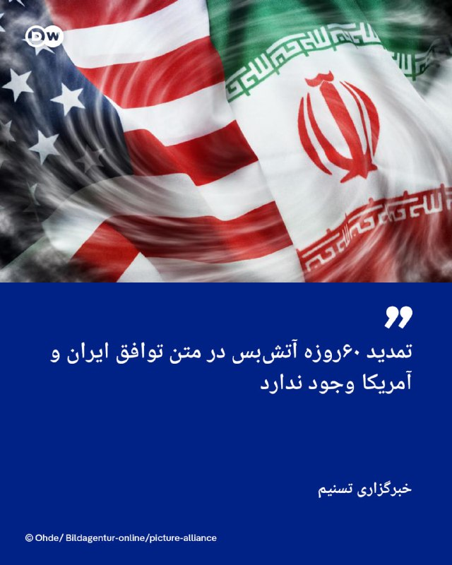

🔶 تسنیم: تمدید ۶۰روزه آتش‌بس در متن توافق ایران و آمریکا وجود ندارد

خبرگزاری تسنیم در خبری در روز یکشنبه سوم خرداد با اشاره به خبری که پیش از این در پایگاه خبری آکسیوس منتشر شده بود اعلام کرد، در متن توافق میان ایران و آمریکا از تمدید ۶۰روزه آتش‌بس سخنی به میان نیامده است.

تسنیم وابسته به سپاه پاسداران نوشت: «بر اساس شنیده‌ها از متن تفاهم احتمالی، برخلاف گزارش یک رسانه آمریکایی که می‌گوید، طبق تفاهم‌نامه آتش‌بس میان ایران و آمریکا به مدت ۶۰ روز تمدید می‌شود، این عبارت در متن وجود ندارد.»

این خبرگزاری همچنین نوشت که در این متن "تعبیری که به کار گرفته شده است، اعلام پایان جنگ در همه جبهه‌ها، از جمله لبنان است".

تسنیم با تأکید بر این که متن توافق هنوز نهایی نشده ادامه داد، بر پایه این متن، در "بازه ۳۰ روزه موضوع تنگه هرمز و محاصره دریایی پیش برده می‌شود و زمان ۶۰ روزه‌ای برای مذاکرات در مسئله هسته‌ای در نظر گرفته شده است".
@dw_farsi

## DW_Farsi — post 125100

  <a href="telegram/content/DW_Farsi_125100_1779639632.mp4" target="_blank">🎬 Download video</a>

🎥 گامی تاریخی در پاکستان؛ استخدام نخستین زندانبانان تراجنسیتی
 
سوبیا خان با آغاز به کار به عنوان نخستین زندانبان تراجنسیتی در ایالت "خیبر پختونخوا" پاکستان، تاریخ‌ساز شد.
این یک نقطه عطف مهم است، به‌ویژه از این جهت که افراد تراجنسیتی در این ایالت محافظه‌کار با وجود حمایت‌های قانونی اغلب با تبعیض مواجه هستند یا طرد می‌شوند.
@dw_farsi

## DW_Farsi — post 125099

  

🔶 آمادگی نیروهای بریتانیا برای "مین‌روبی احتمالی در تنگه هرمز"

صدها ملوان در عرشه کشتی پشتیبانی "لایم ‌بی" (RFA Lyme Bay) بریتانیا که در سواحل جبل‌الطارق لنگر انداخته در انتظار اعزام به مأموریت مین‌روبی در تنگه هرمز به سر می‌برند؛ مأموریتی که هنوز در هاله‌ای از ابهام قرار دارد.

خبرگزاری آسوشیتدپرس که این خبر را روز یکشنبه ۲۴ مه اعلام کرده می‌گوید، اکنون در جنوبی‌ترین نقطه شبه‌جزیره ایبری، در منطقه فرامرزی بریتانیا یعنی جبل‌الطارق، نیروی دریایی سلطنتی بریتانیا خود را برای انجام این کار آماده می‌کند؛ اما این اقدام تنها زمانی صورت خواهد گرفت که توافق صلح میان آمریکا و ایران حاصل شود.

در حالی که این توافق که آخرین خبرها امید به نهایی شدن آن‌ را بالا برده هنوز به دست نیامده، آسوشیتدپرس می‌گوید، این کشتی به‌زودی جبل‌الطارق را ترک می‌کند تا به ناوشکن بریتانیایی "اچ‌ام‌اس دراگون" و سایر کشتی‌های متحدان بپیوندد و پس از دریافت پشتیبانی هوایی، از طریق کانال سوئز راهی خلیج فارس شود.
@dw_farsi

## Persian_Trend_Official — post 14869

  <a href="telegram/content/Persian_Trend_Official_14869_1779639634.webm" target="_blank">🎬 Download video</a>

🔴 مقام ارشد دولت ترامپ: توافق با ایران امروز امضا نخواهد شد

یک مقام ارشد دولت ترامپ به آکسیوس گفته است:

▪️ انتظار نمی‌رود توافق با ایران امروز امضا شود، زیرا هنوز چندین جزئیات برای نهایی‌شدن باقی مانده است

▪️ ساختار تصمیم‌گیری در ایران در وضعیت فعلی با سرعت بالا عمل نمی‌کند و طی‌شدن مراحل تأیید توافق چند روز زمان خواهد برد

▪️ برداشت واشینگتن این است که «مجتبی خامنه‌ای» با چارچوب کلی توافق موافقت کرده، اما اینکه این روند نهایتاً به توافق نهایی منجر شود یا نه، همچنان نامشخص است

این اظهارات در حالی مطرح می‌شود که:

▪️ گزارش‌های متعددی از نزدیک‌شدن تهران و واشینگتن به یک تفاهم ۶۰ روزه منتشر شده است

▪️ اختلافات اصلی همچنان بر سر غنی‌سازی، ذخایر اورانیوم، تحریم‌ها و ضمانت‌های امنیتی باقی مانده

▪️ آمریکا و متحدان منطقه‌ای در تلاش‌اند قبل از بازگشت تنش نظامی، چارچوبی موقت برای مهار بحران ایجاد کنند

🫆:Tony

📌 @persian_trend_official
پرشین ترند | متفاوت‌ترین کانال نظامی

## RadioFarda — post 157522

  

🔸نخست‌وزیر اسرائیل روز یکشنبه گفت که او و دونالد ترامپ، رئیس‌جمهور آمریکا، بعد از یک تماس تلفنی در شامگاه شنبه توافق دارند که هرگونه توافق نهایی با ایران باید تهدید هسته‌ای ناشی از تهران را از بین ببرد.

🔸بنیامین نتانیاهو در پیامی در شبکه ایکس در توضیح بیشتر نوشت: «این یعنی برچیدن تأسیسات غنی‌سازی هسته‌ای ایران و خارج کردن مواد هسته‌ای غنی‌شده آن از خاک این کشور.»

🔸آژانس بین‌المللی انرژی اتمی گفته است ایران بیش از چهارصد کیلو اورانیوم غنی‌شده تا حد ۶۰ درصد دارد که به احتمال زیاد در تأسیسات زیرزمینی بمباران‌شده در جریان جنگ ۱۲ روزه مدفون است. ترامپ بارها گفته که ایران باید این مواد را به آمریکا تحویل دهد.

🔸نخست‌وزیر اسرائیل همچنین خبر داد که ترامپ همچنین بار دیگر بر حق اسرائیل برای دفاع از خود در برابر تهدیدها در تمامی جبهه‌ها، از جمله در لبنان، تأکید کرده است.

🔸رئیس‌جمهور آمریکا شامگاه شنبه اعلام کرد با سران کشورهای منطقه درباره مذاکرات با ایران تماس تلفنی داشته و افزود که به جداگانه با نخست‌وزیر اسرائیل گفت‌وگو کرده که «آن تماس نیز بسیار خوب پیش رفت».

@RadioFarda

## RadioFarda — post 157521

  

🔸رئیس‌جمهور آمریکا، روز یکشنبه اعلام کرد محاصره دریایی ایران تا زمان نهایی شدن و امضای توافق پایان جنگ به طور کامل برقرار خواهد ماند و واشینگتن عجله‌ای برای رسیدن به این توافق ندارد.

🔸او در شبکه اجتماعی خود، نوشت: «مذاکرات به شکلی منظم و سازنده در حال پیشرفت است و من به نمایندگانم اطلاع داده‌ام که برای رسیدن به توافق عجله نکنند، زیرا زمان به نفع ماست. محاصره تا زمانی که توافق حاصل، تأیید و امضا شود، به‌طور کامل برقرار و اجرایی باقی خواهد ماند.»

🔸آقای ترامپ گفت که آمریکا و ایران «باید وقت بگذارند و کار را درست انجام دهند. هیچ اشتباهی نباید رخ دهد».

🔸او در ادامه پیام خود نوشت: «روابط ما با ایران در حال تبدیل شدن به روابطی بسیار حرفه‌ای‌تر و سازنده‌تر است. با این حال، آنها باید درک کنند که نمی‌توانند سلاح یا بمب هسته‌ای تولید یا تهیه کنند.»

🔸رئیس‌جمهور آمریکا از کشورهای منطقه خاورمیانه بابت همکاری آنها تشکر کرد و افزود: «همکاری‌ای که با پیوستن آنها به کشورهای عضو توافق تاریخی ابراهیم بیش از پیش تقویت و مستحکم خواهد شد و چه کسی می‌داند، شاید جمهوری اسلامی ایران هم بخواهد به آن بپیوندد!»

@RadioFarda

## IranianMinds — post 20686

  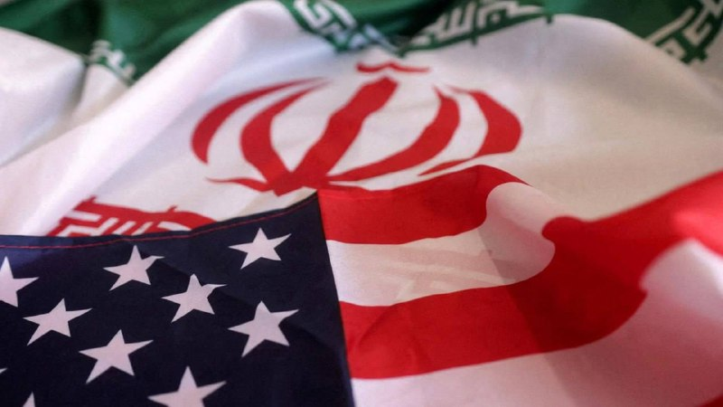

🔴 سی بی اس نیوز :

به گفته یک مقام ارشد کاخ سفید، ایران در جریان مذاکرات با آمریکا، به‌صورت کلی با کنار گذاشتن اورانیوم غنی‌شده با درصد بالا موافقت کرده است.

هنوز توافق نهایی امضا نشده ، دولت ترامپ معتقد است رهبر ایران چارچوب کلی توافق را تأیید کرده

دو طرف همچنان درباره نحوه نابودی یا انتقال اورانیوم در حال مذاکره هستند

@IranianMinds

## IranianMinds — post 20685

🎁 استارت کن و کانفیگتو رایگان بگیر 
⭐ویژه کاربران پرمیوم تلگرام 
⭐️ اگه اکانت تلگرامت پرمیوم باشه به محض استارت ربات بدون هیچ امتیاز و زیر مجموعه دایی جون بهت کانفیگ هدیه میده 
✔️ همچنین با اوردن دوستای پرمیومت امتیاز بیشتری میگیری 
🎁 @Daeijoonbot | استارت…

## IranianMinds — post 20684

  

🎁 استارت کن و کانفیگتو رایگان بگیر

⭐ویژه کاربران پرمیوم تلگرام

⭐️ اگه اکانت تلگرامت پرمیوم باشه به محض استارت ربات بدون هیچ امتیاز و زیر مجموعه دایی جون بهت کانفیگ هدیه میده

✔️ همچنین با اوردن دوستای پرمیومت امتیاز بیشتری میگیری

🎁 @Daeijoonbot | استارت کن و کانفیگ رایگان بگیر 
🌟

## IranianMinds — post 20683

## IranianMinds — post 20682

  

🔴 ترامپ‌ حرف های امروز‌ پزشکیان که گفته بود آماده ایم‌ به جهان اطمینان بدیم که به دنبال سلاح هسته ای نیستیم رو ریپوست کرده.

@IranianMinds

## BBCPersian — post 281959

🔻پلیس ترکیه روز یکشنبه (۲۴ مه/ ۳خرداد) با استفاده از اسپری فلفل، شکستن دروازه و عبور از موانع موقت، وارد دفتر مرکزی حزب جمهوری‌خواه خلق (سی‌اچ‌پی) شد.

پلیس سپس اوزگور اوزال، رهبر حزب جمهوری‌خواه خلق که روز پنجشنبه (۲۱ مه) با حکم دادگاه برکنار شده بود، را از ساختمان بیرون کرد.

هنگامی که هواداران حزب کپسول آتش‌نشانی را به سمت پلیس پرتاب کردند، ابری از دود در ورودی ساختمان دیده می‌شد. افرادی که ماسک زده بودند در فضای کم داخل ساختمان سرفه می‌کردند.

دادگاهی در ترکیه روز پنجشنبه اوزگور اوزل، رهبر حزب جمهوری‌خواه خلق را برکنار کرد و نتایج کنگره حزب جمهوری‌خواه خلق را که در سال ۲۰۲۳ در آن انتخاب شده بود، به دلیل تخلفات لغو کرد.

دادگاه، کمال قلیچدار اوغلو، رئیس سابق حزب جمهوری‌خواه خلق را که در انتخابات سراسری ۲۰۲۳ از رئیس‌جمهور طیب اردوغان شکست خورده بود، به جای اوزال بازگرداند.

اما طرفداران آقای اوزال ساختمان را ترک نکردند و حامیان کمال قلیچداراوغلو تلاش کردند وارد ساختمان حزب شوند که سرانجام پلیس وارد عمل شد و ساختمان را تحت کنترل خود درآورد.

bbc.in/42PlJAL
@BBCPersian

## idfinfarsi — post 11642

  <a href="telegram/content/idfinfarsi_11642_1779639637.mp4" target="_blank">🎬 Download video</a>

برای رفع تهدید فوری: ارتش اسرائیل یک تروریست از سازمان تروریستی حماس را که در یورش به پایگاه زیکیم در کشتار ۷ اکتبر شرکت داشت، به هلاکت رساند

در طول آخر هفته (جمعه)، نیروهای ارتش اسرائیل تحت فرماندهی جنوب، تروریست لؤی هشام محمود بصل را که به‌عنوان تک‌تیرانداز در گردان زیتون وابسته به سازمان تروریستی حماس فعالیت می‌کرد و تهدیدی فوری علیه نیروهای ما محسوب می‌شد، به هلاکت رساندند.

بر اساس بررسی‌های اطلاعاتی، مشخص شد که این تروریست در یورش به پایگاه زیکیم در کشتار خونین ۷ اکتبر مشارکت داشته و در دوره اخیر نیز برای اجرای طرح‌های تروریستی علیه نیروهای ارتش اسرائیل در منطقه فعالیت می‌کرده است.

نیروهای ارتش اسرائیل تحت فرماندهی جنوب مطابق با توافق در منطقه مستقر هستند و به فعالیت خود برای رفع هرگونه تهدید فوری ادامه خواهند داد.

## Dirty_Kids — post 390088

  <a href="telegram/content/Dirty_Kids_390088_1779639638.mp4" target="_blank">🎬 Download video</a>

پشمای شهرام همایون ریخت از دست این صدای امریکا (صدای ج.ا) 😂😂😂

شهرام همایون رفته تو برنامه این زنک فهیمه وسط برنامه، طنز مهران مدیری رو پخش کردن که مسخرش میکرد

شهرام همایون شدید قاطی میکنه!

@Dirty_Kids 👻

## Dirty_Kids — post 390087

  

رییس جمهور آمریکا
جو باراک ترامپ

@Dirty_Kids 👻

## Dirty_Kids — post 390086

  

🌪وقتی اینترنت طوفانیه فقط کافیه بادبان ها رو بکشی

⚫️100 هزار تومان تخفیف خرید اول 
🎁

⚫️پایین ترین قیمت گیگی 180 هزار تومان
🌐 

⚫️پورسانت %10 دائمی برای هر معرفی
💼

با بادبان، میتونی یه اتصال سریع، پایدار و امن
همراه با پشتیبانی ۲۴ ساعته داشته باشی
🚀

🛒کد تخفیف: badban4k

بادبان راهتو باز می‌کنه
⛵️
G3

🛡@BadBan_VPN | کانال 

🤖@BadBan_VPNBot | ربات 

📞@BadBan_VPNSupport | پشتیبانی

## Dirty_Kids — post 390085

ترامپ واقعا عموعه تهش ارثمون رو بالا کشید

@Dirty_Kids 👻

## Dirty_Kids — post 390084

‏بنظرم ایران با چین معامله کرده، گفته آمریکا برای من تایوان برای تو

@Dirty_Kids 👻

## Dirty_Kids — post 390083

حالا میره کوبا چنان انقلابی می‌کنه که کون هممون آتشفشان بشه.

@Dirty_Kids 👻

## Dirty_Kids — post 390082

  

پست جدید نتانیاهو کنار ترامپ:

ایران هرگز سلاح هسته‌ای نخواهد داشت.

@Dirty_Kids 👻

## Dirty_Kids — post 390081

  

دونالد ترامپ:
نمی‌تونم درباره توافق صحبت کنم؛ این کاملاً به من بستگی داره و اگه خبری هم باشه فقط خبرهای خوبی خواهد بود — من به عنوان یه املاکی اصلا معامله بدی انجام نمیدم.

@Dirty_Kids 👻

## manototv — post 105809

  <a href="telegram/content/manototv_105809_1779639642.mp4" target="_blank">🎬 Download video</a>

وزیران خارجه ۱۹ کشور عربی و اسلامی در بیانیه‌ای مشترک، اقدام منطقه موسوم به «سومالی‌لند» در افتتاح «سفارت» در اورشلیم را به‌شدت محکوم کردند.

در این بیانیه که روز یکشنبه سوم خرداد منتشر شد، این اقدام «غیرقانونی و مردود» خوانده شده و آمده است که افتتاح این دفتر، نقض آشکار قوانین بین‌المللی و قطعنامه‌های مربوط به مشروعیت بین‌المللی است.

وزیران خارجه کویت، مصر، عربستان سعودی، قطر، اردن، ترکیه، پاکستان، اندونزی، جیبوتی، سومالی، فلسطین، عمان، سودان، یمن، لبنان، موریتانی، الجزایر، بنگلادش و مراکش تاکید کردند که اورشلیم شرقی «سرزمین فلسطینی اشغال‌شده از سال ۱۹۶۷» است و هر اقدامی برای تغییر وضعیت حقوقی و تاریخی آن «باطل و بی‌اثر» است.

این کشورها همچنین حمایت کامل خود را از وحدت، حاکمیت و تمامیت ارضی جمهوری فدرال سومالی اعلام کردند و هرگونه اقدام یک‌جانبه علیه وحدت سرزمینی سومالی را مردود دانستند.

## alonews — post 122381

  <a href="telegram/content/alonews_122381_1779639642.mp4" target="_blank">🎬 Download video</a>

👈 جنگنده‌های اسرائیلی به زراریه، سومور (دره البقاع)، كفرسیر و سر الغربیّه در لبنان حمله کردند.

✅ @AloNews خبر جنگ

## alonews — post 122380

  <a href="telegram/content/alonews_122380_1779639644.webm" target="_blank">🎬 Download video</a>

👈دبیرکل حزب‌الله: خلع سلاح را نمی پذیریم

✅ @AloNews خبر جنگ

## alonews — post 122379

  <a href="telegram/content/alonews_122379_1779639644.webm" target="_blank">🎬 Download video</a>

👈سی‌بی‌اس نیوز: موضوعاتی نظیر ذخایر موشکی ایران و غنی‌سازی اورانیوم در مذاکرات آتی مورد بررسی قرار خواهد گرفت

✅ @AloNews خبر جنگ

## alonews — post 122378

  <a href="telegram/content/alonews_122378_1779639644.webm" target="_blank">🎬 Download video</a>

👈یک مقام آمریکایی به اکسیوس گفت: برخی از جزئیات توافق با ایران هنوز نهایی نشده است

✅ @AloNews خبر جنگ

## alonews — post 122377

  <a href="telegram/content/alonews_122377_1779639644.webm" target="_blank">🎬 Download video</a>

👈نیویورک تایمز به نقل از یک مقام آمریکایی: مسائلی مانند ذخایر موشکی ایران و غنی سازی اورانیوم در مذاکرات بعدی مورد بحث قرار خواهد گرفت.

✅ @AloNews خبر جنگ

## alonews — post 122376

  <a href="telegram/content/alonews_122376_1779639644.webm" target="_blank">🎬 Download video</a>

👈منابع به المیادین: ابتکار چین، تنگه هرمز را از نقطه تنش و اختلاف به نقطه‌ای برای توافق و حل‌وفصل به سود همه طرف‌ها تبدیل می‌کند

✅ @AloNews خبر جنگ

## alonews — post 122375

  <a href="telegram/content/alonews_122375_1779639645.webm" target="_blank">🎬 Download video</a>

👈یک منبع اسرائیلی به سی‌بی‌اس گفته که به واشنگتن اعلام کرده‌اند حتی در صورت توافق با ایران، آزادی عملشان در جبهه‌هایی مثل لبنان باید حفظ شود.

✅ @AloNews خبر جنگ

## alonews — post 122373

  <a href="telegram/content/alonews_122373_1779639645.webm" target="_blank">🎬 Download video</a>

👈اسرائیل دقایقی قبل حملات سنگینی در جنوب لبنان انجام داد

✅ @AloNews خبر جنگ

## alonews — post 122370

  <a href="telegram/content/alonews_122370_1779639645.webm" target="_blank">🎬 Download video</a>

👈معاون بین‌الملل وزارت خارجه: نشست مبسوطی میان هیئت‌های عمانی و ایرانی برای بررسی مجموعه‌ای از اصول حاکم بر عبور شناورها در تنگه هرمز با رعایت امنیت و حاکمیت ملی دولت‌های ساحلی این‌ تنگه و در پرتو قواعد قابل اعمال حقوق بین‌الملل برگزار شد.

✅ @AloNews خبر جنگ

## alonews — post 122369

  <a href="telegram/content/alonews_122369_1779639645.webm" target="_blank">🎬 Download video</a>

👈وال استریت ژورنال: توافق ایالات متحده و ایران برای بازگشایی تنگه هرمز امیدوار کننده است، اما کشتیران‌ها همچنان محتاط هستند و بازسازی تأسیسات تولیدی و ذخایر زمان‌بر خواهد بود

✅ @AloNews خبر جنگ

## alonews — post 122368

  <a href="telegram/content/alonews_122368_1779639645.webm" target="_blank">🎬 Download video</a>

👈نتانیاهو: توافق نهایی با ایران به معنای برچیدن تأسیسات غنی‌سازی هسته‌ای و حذف مواد هسته‌ای غنی‌شده است.

🔴توییت جدید نتانیاهو: من و رئیس جمهور ترامپ توافق کردیم که هرگونه توافق نهایی با ایران باید خطر هسته‌ای را از بین ببرد.

🔴این به معنای برچیدن سایت‌های غنی‌سازی هسته‌ای ایران و خارج کردن مواد هسته‌ای غنی‌شده از خاک آن است.

🔴رئیس جمهور ترامپ همچنین بر حق اسرائیل برای دفاع از خود در برابر تهدیدات در هر جبهه‌ای، از جمله لبنان، تأکید کرد.

🔴مشارکت بین ما و دو کشورمان در میدان نبرد ثابت شده و هرگز قوی‌تر از این نبوده است.

🔴سیاست من، مانند سیاست رئیس جمهور ترامپ، بدون تغییر باقی می‌ماند: ایران سلاح هسته‌ای نخواهد داشت.

✅ @AloNews خبر جنگ

## alonews — post 122367

  <a href="telegram/content/alonews_122367_1779639645.webm" target="_blank">🎬 Download video</a>

👈ترامپ سخنان پزشکیان علیه سلاح‌های هسته‌ای را بازنشر کرد

🔴پزشکیان درخصوص سلاح هسته ای گفته بود: ما آماده‌ایم به جهان اطمینان دهیم که به دنبال سلاح هسته‌ای نیستیم. ما به دنبال بی‌ثباتی در منطقه نیستیم

✅ @AloNews خبر جنگ

## alonews — post 122366

  <a href="telegram/content/alonews_122366_1779639646.webm" target="_blank">🎬 Download video</a>

👈فاکس نیوز: یک مقام ارشد در دولت ترامپ گفته است که توافق با ایران امروز امضا نخواهد شد، اما پیشرفت در مورد یک توافق را نشان داد.

«اگر ایرانیان در مورد مسئله غنی‌سازی تسهیلات قابل توجهی ایجاد کنند، ما نیز تسهیلات قابل توجهی در مورد تسکین تحریم‌ها ایجاد خواهیم کرد،» مقام مذکور گفت.
در مورد مسئله هسته‌ای، برنامه فعلی این است که با کل ذخیره مواد غنی‌سازی شده سر و کار داشته باشیم.

«اگر شما یک توافق نهایی دارید که در آن ایرانیان در حال غنی‌سازی هستند، پس شما یک توافق نهایی ندارید،» مقام مذکور افزود.

✅ @AloNews خبر جنگ

<!-- MSG END -->

<!-- NAV START -->

<a href="https://github.com/shahinsa98/aio-downloader/blob/main/telegram/content/archive_1.md" style="display:inline-block; padding:6px 12px; margin:0 4px; background-color:#2ea44f; color:white; text-decoration:none; border-radius:4px; font-weight:bold;">صفحه بعد</a>

<!-- NAV END -->
