# خواننده تلگرام

<!-- TOP_NAV START -->

<a href="https://github.com/shahinsa98/aio-downloader/blob/main/telegram/content/archive_1.md" style="display:inline-block; padding:6px 12px; margin:0 4px; background-color:#2ea44f; color:white; text-decoration:none; border-radius:4px; font-weight:bold;">صفحه بعد</a>

<!-- TOP_NAV END -->

<!-- MSG START -->

---
📅 بروزرسانی: 1405/02/30 12:01
---

## VahidOOnLine — post 241104

♦️مراسم سنتی «پیک‌نیک کنگره» روز سه شنبه در محوطه چمن جنوبی کاخ سفید با حضور رئیس‌جمهور و بانوی اول آمریکا برگزار شد.

این مراسم سنتی به صورت سالانه در فضایی غیررسمی برگزار می‌شود و اعضای کنگره آمریکا از هر دو حزب دموکرات و جمهوری‌خواه به همراه خانواده‌هایشان در کنار رئیس‌جمهور و بانوی اول ایالات متحده در آن شرکت می‌کنند.

 در تصاویری که کاخ سفید منتشر کرده است استقبال دونالد ترامپ و ملانیا ترامپ از مهمانان در فضای باز کاخ سفید و در حال تماشای اجرای موسیقی زنده دیده می‌شوند.
‌🇸🇦 Indypersian

🤖 @VahidOOnLine

## VahidOOnLine — post 241103

  

♦️سپاه پاسدران روز چهارشنبه ۳۰ اردیبهشت‌ماه با انتشار بیانیه خطاب به آمریکا و اسرائیل هشدار داد که در صورت حمله دوباره، «این بار جنگ به فراتر از منطقه کشیده خواهد شد.»

سپاه در این بیانیه مدعی تحمیل «شکست‌های بزرگ و راهبردی مکرر» به آمریکا و اسرائیل شده و نوشته است: «گرچه آنها با تمام توانایی‌های دو ارتش که پر هزینه‌ترین ارتش‌های جهان هستند به ما حمله کردند اما ما همه ظرفیت‌های انقلاب اسلامی را علیه آنان وارد عمل نکردیم، اما اینک اگر تجاوز به ایران تکرار شود جنگ منطقه‌ای که وعده داده شده بود، این‌بار به فراتر از منطقه کشیده خواهد شد و ضربات کوبنده ما در جاهایی که تصور آن را ندارید شما را به خاک سیاه خواهد نشاند.»

علی خامنه‌ای، رهبر پیشین جمهوری اسلامی که در موج اول حملات آمریکا و اسرائیل در بیت رهبری کشته شد، چند هفته پیش از آغاز حملات گفته بود «آمریکا بداند که در صورت حمله، این‌بار جنگ منطقه‌ای خواهد بود.»

سپاه در بیانیه خود بدون اشاره مستقیم به تهدیدهای رئیس جمهوری آمریکا نوشته است: «ما مرد جنگیم و قدرت ما را در میدان نبرد خواهید دید و نه در بیانیه‌های توخالی و صفحات مجازی.»

دونالد ترامپ دو روز پیش گفته بود در آستانه صدور فرمان حمله همه‌جانبه به ایران، با درخواست رهبران عربستان سعودی، قطر و امارات متحده عربی، این حمله را برای چند روز به تعویق انداخته است.
‌🇸🇦 Indypersian

🤖 @VahidOOnLine

## VahidOOnLine — post 241102

  

انور قرقاش، مشاور دیپلماتیک رییس امارات متحده عربی، در پیامی در شبکه اجتماعی ایکس، نیروهای نیابتی جمهوری اسلامی در عراق را مسئول حمله اخیر به نیروگاه هسته‌ای براکه معرفی کرد.

او نوشت این حمله «نشانه‌ای بسیار خطرناک از میزان تهدیدی است که منطقه با آن روبه‌روست؛ تهدیدی که از یک سو ناشی از فقدان دولت ملی و از سوی دیگر نتیجه نقض آشکار حقوق بین‌الملل است».

قرقاش افزود: «همان‌گونه که ربایش و ایجاد اختلال در تنگه هرمز تهدیدی برای اقتصاد جهانی و نظم بین‌المللی به شمار می‌رود، هدف قرار دادن براکه نیز اقدامی مجرمانه و نقض مستقیم حقوق بین‌الملل است.»

او یادآور شد: «از هرمز تا براکه، این تهدید دیگر تنها محدود به خلیج فارس نیست، بلکه کل نظام بین‌المللی را هدف قرار داده و بازتاب‌دهنده ذهنیت آشوب‌طلبی و باج‌خواهی است؛ ذهنیتی که برای امنیت ملت‌ها، حقوق بین‌الملل و ثبات اقتصاد جهانی ارزشی قائل نیست و تنها در پی بقا و تحمیل منطق تهاجمی خود است.»
‌🏁 🇬🇧 IranintlTV

🤖 @VahidOOnLine

## VahidOOnLine — post 241101

  

نت‌بلاکس، نهاد پایش‌کننده وضعیت اینترنت در جهان، چهارشنبه ۳۰ اردیبهشت، اعلام کرد هشتاد و دومین روز از قطع دیجیتال اینترنت در ایران سپری شده و این کشور پس از ۱۹۴۴ ساعت همچنان تا حد زیادی از اینترنت جهانی جدا مانده است.

این نهاد افزود در شرایطی که قطعی چند دقیقه‌ای اینترنت می‌تواند بحران‌زا باشد، ادامه این وضعیت در ایران به «نابودی معیشت‌ها و فرسایش حقوق شهروندان» منجر شده است.
‌🏁 🇬🇧 IranintlTV

🤖 @VahidOOnLine

## VahidOOnLine — post 241100

  <a href="telegram/content/VahidOOnLine_241100_1779265863.mp4" target="_blank">🎬 Download video</a>

بر اساس پیام‌های رسیده به ایران‌اینترنشنال، کمبود بنزین در بندرعباس و شماری از شهرهای جنوب استان کرمان باعث شکل‌گیری صف‌های طولانی در جایگاه‌های سوخت شده است.

به‌گفته شهروندان، برخی جایگاه‌ها بیش از ۱۵ لیتر بنزین عرضه نمی‌کنند و در مواردی قیمت آن در بازار آزاد به لیتری ۱۰۰ هزار تومان رسیده است. شهروندان می‌گویند ناچارند شب‌ها در صف‌های چند کیلومتری بمانند تا صبح نوبت سوخت‌گیری آنان برسد.

این وضعیت در بندرعباس، با وجود گرمای شدید و نیاز ضروری به کولر خودرو، نارضایتی گسترده‌ای ایجاد کرده است.
‌🏁 🇬🇧 IranintlTV

🤖 @VahidOOnLine

## VahidOOnLine — post 241099

  

♦️مسعود پزشکیان، رئیس جمهوری اسلامی روز چهارشنبه ۳۰ اردیبهشت ماه در همایش دولتی استانداران گفت با روش‌های گذشته نمی‌توان کشور را اداره کرد و اگر شیوه‌های قبلی راه‌گشا بود، بسیاری از مشکلات تا الان «حل شده بود».

این سخنان در حالی عنوان می‌شود که پزشکیان دو روز پیش هم با انتقاد از «عادی نمایی» شرایط گفته بود که ایران پس از جنگ اخیر با آمریکا و اسرائیل، با مشکلات بسیاری در عرصه‌های مالی، انرژی و نفت و گاز مواجه است و حملات هوایی به تاسیسات نفتی و کارخانه‌های فولاد، آسیب جدی به این صنایع وارد کرده است. رئیس دولت چهاردهم خطاب به منتقدان مذاکرات با آمریکا گفته بود: «گفت‌وگو نکنیم، چه کنیم؟»
‌🇸🇦 Indypersian

🤖 @VahidOOnLine

## VahidOOnLine — post 241098

  

به گزارش خبرگزاری‌های داخلی، حکم اعدام بهمن فرزانه، قاتل الهه حسین‌نژاد، بامداد چهارشنبه اجرا شده است.
الهه حسین‌نژاد، زن ۲۴ ساله، خرداد سال گذشته هنگام بازگشت به خانه در تهران ناپدید شد و حدود ۱۰ روز بعد پیکر او با چندین ضربه چاقو در بیابان‌های اطراف تهران پیدا شد.
خبرگزاری میزان، وابسته به قوه قضاییه جمهوری اسلامی، اعلام کرده این حکم پس از طی مراحل قانونی و با درخواست اولیای دم اجرا شده است.
‌🏁 🇬🇧 ManotoTV

🤖 @VahidOOnLine

## VahidOOnLine — post 241097

  

♦️کاترین ووترن، وزیر دفاع فرانسه روز چهارشنبه ۳۰ اردیبهشت ماه و پس از گزارش شبکه سی‌بس‌اس آمریکا مبنی بر شناسایی حداقل ۱۰ مین در تنگه هرمز گفت که فرانسه در حال حاضر هیچ اطمینانی ندارد که این منطقه اصلا مین‌گذاری شده باشد.

کاترین ووترن به رادیو فرانس انفو گفت: «در حال حاضر، من هیچ اطمینانی در این مورد ندارم، اما در هر صورت ما در حال آماده شدن برای لزوم پاکسازی احتمالی مین‌ها هستیم.»

وزیر دفاع فرانسه تاکید کرد «کشتی‌های مین‌روب به عنوان بخشی از یک ماموریت احتمالی به رهبری فرانسه و بریتانیا به منطقه اعزام شده‌اند و فرانسه یکی از این شناورها را در پایگاه نظامی خود در جیبوتی دارد.»

حدود ۱۰ روز پیش رسانه‌های آلمانی اعلام کرده بودند که این کشور هم کشتی‌ مین‌روب به منطقه اعزام کرده است.
‌🇸🇦 Indypersian

🤖 @VahidOOnLine

## VahidOOnLine — post 241096

♦️ولادیمیر پوتین و شی‌ جین‌پینگ، روسای جمهوری روسیه و چین، بیانیه مشترکی درباره تقویت «شراکت جامع و همکاری راهبردی» میان دو کشور امضا کردند.
این توافق که در جریان دیدار رسمی دو رهبر در پکن انجام شد و بر گسترش همکاری‌های سیاسی، اقتصادی، امنیتی و بین‌المللی میان مسکو و پکن تاکید دارد.
‌🇸🇦 Indypersian

🤖 @VahidOOnLine

## VahidOOnLine — post 241095

  

مسعود پزشکیان، رییس‌جمهور دولت جمهوری اسلامی، با اشاره به بحران اقتصادی در ایران، بار دیگر بر «صرفه‌جویی» مردم تاکید کرد و گفت: «امروز ضروری است برای مردم تبیین شود که لازمه عبور موفق از این شرایط، ایجاد تناسب میان داشته‌ها و خواسته‌هاست.»

او گفت: «با اسراف، افزایش بی‌رویه توقعات و بی‌توجهی به محدودیت‌ها نمی‌توان به اهداف بزرگ دست یافت.»
‌🏁 🇬🇧 IranintlTV

🤖 @VahidOOnLine

## VahidOOnLine — post 241094

  

زمین‌لرزه‌ای به بزرگی ۴.۷ بامداد چهارشنبه ۳۰ اردیبهشت حوالی لافت در استان هرمزگان را لرزاند. مرکز لرزه‌نگاری کشوری عمق این زلزله را ۲۰ کیلومتر اعلام کرده است. این زمین‌لرزه در بخش‌هایی از قشم، هرمز و مناطق روستایی بندرعباس نیز احساس شد. مقام‌های محلی می‌گویند تاکنون گزارشی از خسارت دریافت نشده، اما بررسی‌ها در مناطق نزدیک به کانون زلزله ادامه دارد.
‌🏁 🇬🇧 ManotoTV

🤖 @VahidOOnLine

## VahidOOnLine — post 241093

  <a href="telegram/content/VahidOOnLine_241093_1779265868.mp4" target="_blank">🎬 Download video</a>

دونالد ترامپ، رئیس‌جمهور آمریکا، بار دیگر مدعی شد که ایالات متحده جنگ با جمهوری اسلامی را «خیلی سریع» پایان خواهد داد و تهران «به‌شدت» خواهان توافق است.
ترامپ در جریان مراسم سالانه پیک‌نیک کنگره در محوطه جنوبی کاخ سفید گفت توافق با تهران «اتفاق خواهد افتاد و سریع هم اتفاق می‌افتد».
او همچنین مدعی شد با پایان این بحران، قیمت نفت «به‌شدت کاهش خواهد یافت».
این اظهارات پس از آن مطرح می‌شود که ترامپ اوایل هفته گفته بود تهران برای رسیدن به توافق «التماس» می‌کند و او تنها یک ساعت با صدور دستور حملات تازه علیه جمهوری اسلامی فاصله داشته است.
ترامپ گفت به درخواست متحدان خلیج فارس آمریکا، حملات را متوقف کرده تا به گفته او، «مذاکرات جدی» ادامه پیدا کند. با این حال، او هشدار داد اگر جمهوری اسلامی به توافق نرسد، آمریکا برای یک «حمله کامل» آماده است.
‌🏁 🇬🇧 ManotoTV

🤖 @VahidOOnLine

## VahidOOnLine — post 241092

  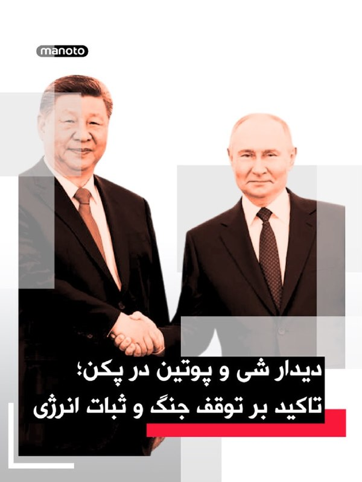

شی جین‌پینگ، رئیس‌جمهوری چین، در دیدار با ولادیمیر پوتین در پکن خواستار توقف فوری درگیری‌ها در خاورمیانه شد و گفت پایان جنگ می‌تواند به کاهش اختلال در عرضه انرژی و زنجیره‌های تجارت جهانی کمک کند.

شی جین‌پینگ روز چهارشنبه، ۲۰ مه ۲۰۲۶، در دیدار با ولادیمیر پوتین در تالار بزرگ خلق پکن گفت وضعیت خاورمیانه در مرحله‌ای حساس میان جنگ و صلح قرار دارد و توقف درگیری‌ها «فوری‌ترین ضرورت» است. او تأکید کرد بازگشت به جنگ قابل قبول نیست و مسیر مذاکره باید در اولویت قرار گیرد. به گفته رئیس‌جمهور چین، پایان زودهنگام درگیری‌ها می‌تواند از اختلال بیشتر در عرضه انرژی و عملکرد زنجیره‌های صنعتی و تجاری جلوگیری کند.

پوتین نیز در آغاز این دیدار گفت روابط روسیه و چین به سطحی «بی‌سابقه» رسیده و از شی جین‌پینگ دعوت کرد سال آینده به روسیه سفر کند. رئیس‌جمهوری روسیه همچنین همکاری دو کشور را عاملی برای «بازدارندگی و ثبات» در روابط بین‌الملل توصیف کرد.

بر اساس گزارش‌ها، دو طرف در این دیدار درباره انرژی، امنیت و روابط کلی مسکو و پکن گفت‌وگو کردند و با تمدید پیمان دوستی چین و روسیه موافقت کردند؛ پیمانی که نخستین‌ب
‌🏁 🇬🇧 ManotoTV

🤖 @VahidOOnLine

## VahidOOnLine — post 241091

  

جی‌دی ونس، معاون رئیس‌جمهور آمریکا، گفت واشینگتن در برابر جنگ با ایران دو مسیر پیش رو دارد: ادامه مذاکره یا ازسرگیری عملیات نظامی.

جی‌دی ونس در نشست خبری کاخ سفید گفت آمریکا در برابر ایران «دو مسیر» دارد.

به گفته ونس، مسیر اول مذاکره است. او گفت دونالد ترامپ از تیم خود خواسته با جمهوری اسلامی «تهاجمی» مذاکره کنند.

ونس گفت آمریکا در موضوع اصلی، یعنی جلوگیری از دستیابی ایران به سلاح هسته‌ای، پیشرفت زیادی داشته و واشینگتن فکر می‌کند تهران خواهان توافق است.

او مسیر دوم را ازسرگیری عملیات نظامی دانست و گفت: «گزینه دوم این است که کارزار نظامی را دوباره شروع کنیم تا اهداف آمریکا دنبال شود.»

ونس گفت این مسیر چیزی نیست که ترامپ بخواهد و فکر نمی‌کند جمهوری اسلامی هم خواهان آن باشد.

او در پایان گفت: «برای توافق، دو طرف لازم است.»
‌🏁 🇬🇧 ManotoTV

🤖 @VahidOOnLine

## VahidOOnLine — post 241090

  <a href="telegram/content/VahidOOnLine_241090_1779265870.mp4" target="_blank">🎬 Download video</a>

«سکوت ما همدستی با جمهوری اسلامی است»
‌🏁 🇬🇧 ManotoTV

🤖 @VahidOOnLine

## VahidOOnLine — post 241089

  

♦️میزان، خبرگزاری قوه قضائیه، از اجرای حکم اعدام قاتل الهه حسین‌نژاد، دختری که جسد او سال گذشته در بیابان‌های اطراف تهران پیدا شد، خبر داد و نوشت: «این حکم با درخواست اولیای دم و پس از طی تمامی مراحل قانونی و قضایی اجرا شد.»

 الهه حسین‌نژاد، زن ۲۴ ساله‌ در مسیر بازگشت از آرایشگاه به خانه در تهران ناپدید شد و حدود ۱۰ روز بعد پیکرش با چندین زخم چاقو در بیابان‌های اطراف تهران پیدا شد.

خانواده الهه حسین‌نژاد پیش از این اعلام کرده بود با آنکه خواستار قصاص قاتل است اما امکان پرداخت نصف دیه را ندارد.

اصغر جهانگیر، سخنگوی قوه قضائیه جمهوری اسلامی، روز سه‌شنبه نهم دی‌ماه اعلام کرد با دستور محسنی اژه‌ای، تفاصل دیه قاتل الهه حسین‌نژاد از «محلی غیر از بیت‌المال» پرداخت می‌شود تا امکان اجرای حکم قصاص او فراهم شود.

بر طبق قانون قصاص مندرج در قانون مجازات اسلامی ایران، اولیای دم (خانواده مقتول) زن، در صورت درخواست اجرای حکم قصاص قاتل مرد، باید نیمی از دیه او را بپردازند تا امکان اجرای حکم اعدام را پیدا کنند.
‌🇸🇦 Indypersian

🤖 @VahidOOnLine

## VahidOOnLine — post 241088

  

♦️چو هیون، وزیر امور خارجه کره جنوبی روز چهارشنبه ۳۰ اردیبهشت اعلام کرد یک نفتکش حامل نفت خام متعلق به این کشور «در هماهنگی با مقام‌های ایرانی در حال عبور از تنگه هرمز است.»

به گزارش خبرگزاری رویترز، وزیر امور خارجه کره جنوبی در یک جلسه استماع در مجلس این کشور با وجود اعلام ابن خبر، جزئیات بیشتری درباره نفتکش و چگونگی هماهنگی برای عبور آن نداد.

این خبر در حالی اعلام می‌شود که حدود سه هفته پیش یک کشتی باری کره جنوبی هدف یک حمله پهپادی قرار گرفت و به‌شدت آسیب دید. ریاست جمهوری کره جنوبی اعلام کرد بسیار بعید است این حمله از جایی به‌جز ایران انجام شده باشد.

پس از این «حادثه دریایی» کره جنوبی اعلام کرد مشارکت در عملیات بازگشایی تنگه هرمز به رهبری آمریکا را بررسی می‌کند.
‌🇸🇦 Indypersian

🤖 @VahidOOnLine

## VahidOOnLine — post 241087

  

نرگس باقری زمردی، مدیرکل دفتر مقررات صادرات و واردات وزارت صنعت، معدن و تجارت، در نامه‌ای به محمدعلی بهپوری، مدیرکل واردات گمرک ایران، اعلام کرد واردات مواد اولیه مرتبط با حوزه پتروشیمی و پلیمری از طریق «رویه کولبری و ملوانی» مجاز است.

تسنیم، خبرگزاری وابسته به سپاه پاسداران، نوشت بر اساس این ابلاغیه، «واردات این اقلام صرفا در چارچوب فهرست تعیین‌شده و با رعایت ضوابط و مقررات مربوط به رویه‌های ملوانی و کولبری امکان‌پذیر خواهد بود».

این رسانه حکومتی افزود این تصمیم در شرایطی اتخاذ شد که شماری از واحدهای تولیدی صنایع پتروشیمی و پلیمری طی ماه‌‌های اخیر در تامین برخی مواد اولیه با محدودیت روبه‌رو بوده‌اند.
‌🏁 🇬🇧 IranintlTV

🤖 @VahidOOnLine

## VahidOOnLine — post 241086

  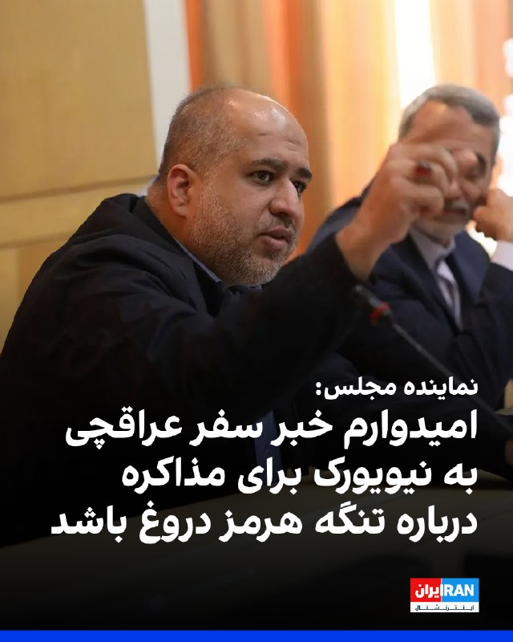

علی خضریان، عضو کمیسیون امنیت ملی مجلس، گفت مطلع شده است عباس عراقچی، وزیر خارجه جمهوری اسلامی، قرار است سفری به نیویورک داشته باشد و با کشورهای حوزه خلیج فارس درباره تنگه هرمز مذاکره کند.

او گفت: «امیدوارم این خبر دروغ باشد، چون برگزاری جلسه‌ای در نیویورک، یعنی در خاک دشمن، و کشورهای خلیج فارس نیز باید مورد بازخواست قرار بگیرند. چنین اقدامی جمهوری اسلامی را در موضع ضعف قرار می‌دهد.»
‌🏁 🇬🇧 IranintlTV

🤖 @VahidOOnLine

## VahidOOnLine — post 241085

  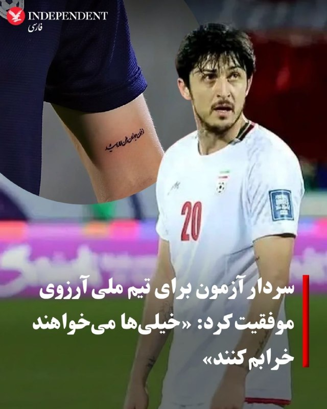

♦️سردار آزمون، مهاجم با سابقه تیم ملی فوتبال ایران روز سه‌‌شنبه ۲۹ اردیبهشت با انتشار یک روایتگر در اینستاگرام، برای نخستین بار به خط خوردن از فهرست کاروان ایران در جام جهانی آمریکا واکنش نشان داد.

مهاجم شباب الاهلی امارات در این پیام نوشت: ««درسته پیشتون نیستم ولی رفیقام که هستین دلیلی نمیشه بهتون آرزوی موفقیت نکنم... خیلی‌ها می‌خوان خرابم کنن ولی این حرفا اصلا درست نیست، موفق باشین بچه‌ها.»

سردار آزمون پس از کشتار هزاران نفر در جریان انقلاب ملی ایرانیان، عبارت معروف «از خون جوانان وطن لاله دمیده» عارف قزوینی را روی دستش خالکوبی کرد. این مهاجم باسابقه تیم ملی فوتبال ایران در دی ماه ۱۴۰۴ با انتشار ویدیویی از کشته شدگان اعتراضات نوشت: «این‌ها قصه نبودند، واقعی بودند. هیچ‌وقت شما را از یاد نمی‌بریم.»
قوه قضائیه جمهوری اسلامی اموال سردار آزمون را هم پس از این وقایع و «به‌اتهام همکاری با دشمن» توقیف کرد.

پس از حملات جمهوری اسلامی به امارات متحده عربی، انتشار عکسی از سردار آزمون با محمد بن رشید، آل مکتوم، امیر دبی خبرساز شد.
‌🇸🇦 Indypersian

🤖 @VahidOOnLine

## WithYashar — post 11731

  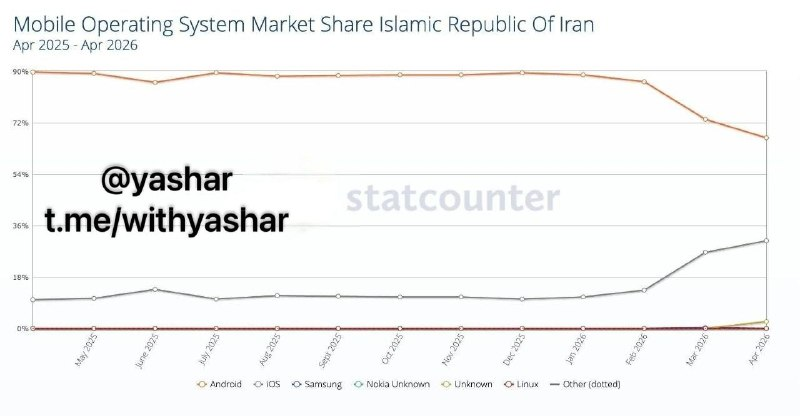

آمار نشون می‌ده در ۳ ماه گذشته یک پاکسازی طبقاتی دیجیتال در ایران رخ داده. در این مدت سهم اندروید از ترافیک اینترنت ۲۵٪ افت و آیفون ۱۸۰٪ رشد داشته. این به معنی خروج میلیون‌ها کاربر طبقه متوسط و پایین از فضای آنلاینه. اونی که آیفون داره از پس هزینه کانفیگ یا اینترنت پرو برمیاد، اونی که نداره، اونقدر دغدغه مالی مختلف داره که عطای اینترنت رو به لقاش می‌بخشه

@withyashar

## WithYashar — post 11730

وزیر نیروهای مسلح فرانسه اعلام کرد این کشور از وجود مین‌های دریایی در تنگه هرمز اطمینان ندارد.
@withyashar

## WithYashar — post 11729

مقامات کره جنوبی تأیید کردند نفتکش «یونیورسال وینر» این کشور که حامل دو میلیون بشکه نفت از کویت است، از تنگه هرمز عبور کرد.
@withyashar

## WithYashar — post 11728

وزارت خارجه روسیه اعلام کرد ایران از «پیمان منع گسترش سلاح‌های هسته‌ای» (ان‌پی‌تی) خارج نخواهد شد.
@withyashar

## WithYashar — post 11727

۳پا تروریستی : جنگ منطقه‌ای که وعده داده شده بود با تکرار تجاوز، به فراتر از منطقه کشیده خواهد شد
@withyashar

## WithYashar — post 11726

شاهزاده رضا پهلوی:

با دولت ترامپ و اعضای کنگره آمریکا در تماس هستم.

@withyashar

## WithYashar — post 11725

  

رادار کلادفلر خبر از افزایش ترافیک‌ اینترنت ایران می‌دهد؛ شروعی برای موج قوی تر فیلترینگ؟
@withyashar

## WithYashar — post 11724

فایننشال تایمز: شرکت سرمایه‌گذاری خطر پذیر ترامپ که در حوزه هوش مصنوعی، فناوری دفاعی و املاک فعالیت می‌کند، در حدود یک سال از ۲۰۰ میلیون دلار به ۳.۵ میلیارد دلار دارایی رسید؛ یعنی جهشی ۱۷ برابری
@withyashar

## WithYashar — post 11723

  <a href="telegram/content/WithYashar_11723_1779265874.mp4" target="_blank">🎬 Download video</a>

ترامپ بعد از زدن حرفهای همیشگی مانند رهبرشان مرده، نیروی نظامی ندارند و سلاح هستهی نباید داشته باشند
پس از سخنرانی ملانیا ترامپ در کاخ سفید، گفت: عجب سخنرانی فوق‌العاده‌ای بود، من هیچوقت دوس ندارم بعد از بانوی اول آمریکا صحبت کنم، چون باعث میشه خیلی خوب به نظر نرسم.
@withyashar

## WithYashar — post 11722

  <a href="telegram/content/WithYashar_11722_1779265876.mp4" target="_blank">🎬 Download video</a>

پوتین و شی بیانیۀ مشترک تعمیق روابط چین و روسیه را امضا کردند

شی: جهان به دلیل اقدامات یک‌جانبه و سلطه‌طلبانه دیگر پایدار نیست، بنابراین ما به دنبال یک نظام جهانی جدید هستیم.

پوتین: همکاری ما در امور سیاست خارجی یکی از عوامل اصلی ثبات در صحنه بین‌المللی است.
در شرایط پرتنش فعلی در صحنه بین‌المللی، هماهنگی نزدیک ما به ویژه مورد نیاز است.
@withyashar

## WithYashar — post 11721

فراخوان دادن هرکی با سیدعلی خاطره داشته بیاد تعريف کنه می‌خوایم سریال بسازیم
@withyashar 😬😂

## WithYashar — post 11720

  <a href="telegram/content/WithYashar_11720_1779265877.mp4" target="_blank">🎬 Download video</a>

ترامپ: ما در ایران کار فوق‌العاده‌ای انجام دادیم؛ فکر میکنم خیلی زود این کار تمام بشه و آنها سلاح هسته‌ای نخواهند داشت؛ امیدوارم این کار رو به روشی بسیار خوب انجام بدیم.
@withyashar

## WithYashar — post 11718

  <a href="telegram/content/WithYashar_11718_1779265879.mp4" target="_blank">🎬 Download video</a>

استقبال شی از پوتین در پکن چین
@withyashar

## WithYashar — post 11717

طبق گزارش نیویورک تایمز، آمریکا و اسرائیل پیش از جنگ با ایران درباره طرحی برای نصب محمود احمدی‌نژاد، رئیس‌جمهور سابق ایران، به عنوان رهبر جدید کشور گفتگو کردند.
گفته می‌شود احمدی‌نژاد در این طرح مشورت شده بود، اما پس از زخمی شدنش در حمله اسرائیل به منزلش در تهران در روز آغاز جنگ، این طرح از هم پاشید. مقامات آمریکایی گفتند این حمله با هدف آزاد کردن او از حصر خانگی انجام شده بود.
احمدی‌نژاد زنده ماند اما پس از آن از تلاش برای تغییر رژیم ناامید شد و از آن زمان تاکنون در انظار عمومی دیده نشده و محل اقامتش نامعلوم است.
@withyashar

## mwarmonitor — post 9334

🔴هدف اولیه جنگ، روی کار آوردن رئیس‌جمهور سابق تندرو به‌عنوان رهبر ایران بود. NYT 🔸به گفته مقام‌های آمریکایی، یک حمله اسرائیل که با هدف آزاد کردن محمود احمدی‌نژاد از حصر خانگی در تهران طراحی شده بود، بخشی از تلاشی برای ایجاد تغییر رژیم و رساندن او به قدرت…

## mwarmonitor — post 9333

  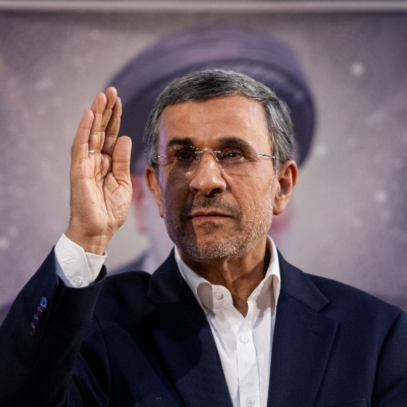

🔴هدف اولیه جنگ، روی کار آوردن رئیس‌جمهور سابق تندرو به‌عنوان رهبر ایران بود. NYT

🔸به گفته مقام‌های آمریکایی، یک حمله اسرائیل که با هدف آزاد کردن محمود احمدی‌نژاد از حصر خانگی در تهران طراحی شده بود، بخشی از تلاشی برای ایجاد تغییر رژیم و رساندن او به قدرت محسوب می‌شد.

@mwarmonitor

## mwarmonitor — post 9332

🔴اختصاصی آکسیوس: ترامپ به‌رغم تنش با متحدان، در اجلاس G7 در فرانسه شرکت می‌کند

🔰رئیس‌جمهور ترامپ ماه ژوئن برای گفتگو درباره هوش مصنوعی، تجارت و مبارزه با جرم و جنایت در نشست سران گروه ۷ (G7) در فرانسه شرکت خواهد کرد؛ اقدامی که یک مقام کاخ سفید آن را در گفتگو با اکسیوس تایید کرده است.

چرا این موضوع اهمیت دارد؟
هرچند حضور روسای جمهور آمریکا در اجلاس‌های سالانه گروه ۷ امری مرسوم و سنتی است، اما شرکت ترامپ در این نشست به دلیل خشم فزاینده او از اعضای این گروه (مانند بریتانیا، فرانسه، آلمان و ایتالیا) به خاطر همراهی نکردن با تلاش‌های جنگی او در ایران، قطعی نبود.
یک مقام کاخ سفید اعلام کرد که این نشست منجر به امضای قراردادهای رسمی نخواهد شد، بلکه هدف آن ایجاد اجماع و همسویی برای توافقات آینده است.
تولد ترامپ درست پیش از آغاز این اجلاس، در ۱۴ ژوئن (۲۴ خرداد) است و او ۸۰ ساله خواهد شد.
نگاهی دقیق‌تر به برنامه‌ها
این نشست که از ۱۵ تا ۱۷ ژوئن (۲۵ تا ۲۷ خرداد) در شهر «اویان-له-بن» (Évian-les-Bains) در جنوب شرقی فرانسه برگزار می‌شود، قطعاً موضوع ایران را در دستور کار خواهد داشت، اما ترامپ می‌خواهد روی مسائل اقتصادی و تجاری تمرکز کند:
پیوند زدن کمک‌های آمریکا با تجارت: به گفته این مقام مسئول، هدف این است که تجارت برای هر دو کشور سرمایه‌گذار و دریافت‌کننده سود متقابل داشته باشد.
توسعه هوش مصنوعی: ترویج و به‌کارگیری ابزارهای هوش مصنوعی توسعه‌یافته در آمریکا.
کاهش نفوذ چین: توافق برای کاهش سلطه چین بر زنجیره تامین مواد معدنی حیاتی.
امنیت و مهاجرت: مبارزه با قاچاق مواد مخدر و مهاجرت غیرقانونی.
انرژی و صادرات: ترویج صادرات آمریکا، کاهش موانع مقرراتی و افزایش تولید انرژی، به‌ویژه سوخت‌های فسیلی.
پشت صحنه (روابط ترامپ و ماکرون)
امانوئل ماکرون، رئیس‌جمهور فرانسه که گاهی هدف خشم و انتقادهای ترامپ قرار گرفته است، تلاش کرده با پیشنهاد یک شام مجلل پس از پایان اجلاس در کاخ ورسای (نماد شکوه و زرق‌وبرق سبک باروک فرانسوی که ترامپ شیفته آن است)، دل رئیس‌جمهور آمریکا را به دست آورد. هنوز مشخص نیست که آیا ترامپ در این ضیافت شام شرکت خواهد کرد یا خیر.
نگاه کلان: سایه جنگ ایران بر روابط متحدان
جنگ در ایران همچنان سایه سنگینی بر روابط میان ایالات متحده و تقریباً تمام متحدان اصلی‌اش در گروه ۷ و فراتر از آن انداخته است.
حتی اگر از اکنون تا اواسط ژوئن توافقی حاصل شود، احتمالاً همچنان مقداری دلخوری و تنش در فضا باقی خواهد ماند.
هیچ‌کدام از کشورهای اروپایی به آمریکا در تلاش برای تضمین عبور امن کشتی‌های تجاری از تنگه هرمز کمک نکرده‌اند؛ هرچند ترامپ گاهی گفته به کمک آن‌ها نیازی ندارد و چندین رهبر اروپایی نیز اعلام کرده‌اند که پس از پایان جنگ، مشارکت خواهند کرد.
در همین حال، روز سه‌شنبه و در جریان نشست وزرای دارایی این گروه در پاریس، اسکات بسنت (Scott Bessent)، وزیر خزانه‌داری آمریکا، از اعضای گروه ۷ خواست تا برای مبارزه با «تروریسم ایرانی» و «منابع مالی پشتیبان آن»، تحریم‌های بیشتری وضع کنند.

📌اسکات بسنت در نشست پاریس گفت:
«درهم‌شکستن تهدید تروریسم ایجاب می‌کند که همه شما قدم پیش بگذارید و به ما ملحق شوید. ما از همه متحدان خود در G7 و در واقع از تمام جهان می‌خواهیم که از رژیم تحریم‌ها پیروی کنند تا بتوانیم جریان مالی نامشروعی را که ماشین جنگی ایران را تغذیه می‌کند، متوقف کنیم و این پول را به مردم ایران بازگردانیم.»

@mwarmonitor

## pm_afshaa — post 91090

🔴کرملین:ویتکاف بارها تمایل خود را برای بازدید از مسکو ابراز کرده است، اما تاریخ آن هنوز تعیین نشده

💧 Rainbet.com the #1 Non-KYC Crypto Casino & Sportsbook @rainbetcom

😁 @Pm_Afshaa

## pm_afshaa — post 91089

سپاه:اگر حمله به ایران دوباره رخ دهد، جنگ فراتر از مرزهای منطقه گسترش خواهد یافت

💧 Rainbet.com the #1 Non-KYC Crypto Casino & Sportsbook @rainbetcom

😁 @Pm_Afshaa

## pm_afshaa — post 91088

🔴بهمن فرزانه؛ قاتل الهه حسین نژاد صبح امروز اعـدام شد

💧 Rainbet.com the #1 Non-KYC Crypto Casino & Sportsbook @rainbetcom

😁 @Pm_Afshaa

## iaghapour — post 2619

  

⭕️ شگفتی گوگل در Google I/O 2026؛ معرفی جمینای ۳.۵ فلش با سرعتی باورنکردنی!

در گام نخست، مدل جمینای ۳.۵ فلش عرضه شده است؛ مدلی که با وجود طراحی شدن برای سرعت بالا و هزینه کم، در کمال شگفتی توانسته مدل‌های پرچمدار و پرو نسل‌های قبل را در بنچمارک‌های تخصصی شکست دهد.

🔹 پادشاهی در بخش ایجنت‌ها: این مدل با توانایی برنامه‌ریزی بالا، می‌تواند چندین ایجنت را به صورت موازی برای پیشبرد پروژه‌های پیچیده و کدنویسی مستقر کند.

🔸 سرعت خیره‌کننده و کاهش هزینه‌ها: ساندار پیچای اعلام کرد این مدل با سرعت پردازش ۲۸۹ توکن در ثانیه، حدود ۴ برابر سریع‌تر از رقباست.

🔹 شکست رقبای سرسخت: جمینای ۳.۵ فلش در آزمون‌های تخصصیِ مربوط به کارهای ایجنتی، امتیاز بی‌نظیر ۱۶۵۶ را کسب کرده و عملاً رقیب سرسختی مثل کلود سونیت ۴.۶ آنتروپیک را پشت سر گذاشته است.

🔸 همچنین نسخه قدرتمندتر یعنی جمینای ۳.۵ پرو در ماه ژوئن ۲۰۲۶ رسماً عرضه خواهد شد.

جمینای ۳.۵ فلش هم‌اکنون به عنوان مدل پیش‌فرض در اپلیکیشن جمینای و بخش سرچ گوگل فعال شده است.

🧠 @NovinAIplus

## DEJradio — post 4758

  <a href="telegram/content/DEJradio_4758_1779265881.webm" target="_blank">🎬 Download video</a>

🚨
🔸 "جاسوس واقعی کسی است که به خامنه‌ای اطمینان داد از لونه موش بیرون بیاد.

فریبرز کرمی‌زند، افسر پیشین پلیس.

#موشعلی #جاسوسی
@DEJradio

## DEJradio — post 4757

  <a href="telegram/content/DEJradio_4757_1779265882.webm" target="_blank">🎬 Download video</a>

🔺📢 “سـ.ـپاهی‌های با اخلاص که در تجمعات جانفدا محور تبلیغات شدن، همون سرکوبگرای قاتل هستند که با وضو آدم کشتند...

پیام دریافتی

#تجمعات_حکومتی #IRGCterrorists
@DEJradio

## DEJradio — post 4756

  <a href="telegram/content/DEJradio_4756_1779265882.mp4" target="_blank">🎬 Download video</a>

🛩️
🔺 ‏ایالات متحده در حال اعزام نیروهای نظامی به دریای عمان است؛ اقدامی که نشان می‌دهد آمریکا در حال آماده‌سازی برای ازسرگیری جنگ با ایران است.

یک فروند هواپیمای شناسایی دریایی P-8A آمریکا بر فراز دریای عرب و خلیج عمان پرواز کرده و همزمان یک تانکر سوخت‌رسان KC-46A نیز در شمال خلیج عمان برای پشتیبانی از عملیات هوایی حضور داشته است.

پیش‌تر نیز ظهور ناگهانی یک فروند هواپیمای نظارتی دریایی P-8A Poseidon نیروی دریایی آمریکا در نزدیکی سواحل پاکستان، جغرافیای راهبردی تقابل جاری میان آمریکا و ایران را از تنگه هرمز به شمال دریای عرب گسترش داده و الگوهای نظارت دریایی را وارد مرحله‌ای از تشدید بالقوه و مهم کرده است.

#آتشبس #جنگ
@DEJradio

## DEJradio — post 4755

  <a href="telegram/content/DEJradio_4755_1779265884.webm" target="_blank">🎬 Download video</a>

🚨📢 سازمان اطلاعات داخلی آلمان هشدار داده جمهوری اسلامی ممکن است پس از پایان جنگ با اسرائیل و آمریکا، دامنه عملیات‌های امنیتی و تروریستی خود در اروپا را گسترش دهد.

بر اساس گزارش اختصاصی یوراکتیو، سازمان اطلاعات داخلی آلمان (BfV) اعلام کرده تهدید علیه مراکز یهودی و اسرائیلی، مخالفان جمهوری اسلامی و افرادی که حکومت ایران آن‌ها را «خائن» می‌داند، همچنان در سطح بالایی قرار دارد.

این نهاد امنیتی گفته شماری از افراد ساکن آلمان برای آموزش نظامی یا همکاری با نهادهای حکومتی به ایران سفر کرده‌اند و برخی از آن‌ها در ویدئوهای تبلیغاتی جمهوری اسلامی و بسیج ظاهر شده‌اند.

در این گزارش همچنین به نگرانی سرویس‌های امنیتی اروپا از استفاده جمهوری اسلامی از شبکه‌های نیابتی، گروه‌های وابسته به جرایم سازمان‌یافته و نیروهای کم‌هزینه محلی برای انجام حملات اشاره شده است.

به گفته منابع امنیتی، جمهوری اسلامی از مارس ۲۰۲۶ کارزاری با نام «حرکت أصحاب الیمین الإسلامیه» (HAYI) راه‌اندازی کرده که از طریق شبکه‌های اجتماعی اقدام به جذب نیرو در میان محافل طرفدار جمهوری اسلامی و جریان‌های افراطی شیعه می‌کند.

پژوهشگران امنیتی هشدار داده‌اند این مدل عملیات، شامل حملات ساده اما پرتعداد توسط افراد محلی و بعضاً نوجوانان، می‌تواند فشار گسترده‌ای بر سرویس‌های امنیتی اروپا وارد کند؛ به‌ویژه برای حفاظت از مراکز یهودی، مدارس و مراکز اجتماعی.

سازمان اطلاعات داخلی آلمان تأکید کرده است که جمهوری اسلامی در گذشته نیز از روش‌هایی در حد «تروریسم دولتی» استفاده کرده؛ از عملیات‌های شناسایی و مراقبت گرفته تا طراحی حملات علیه مخالفان و اهداف اسرائیلی و یهودی در اروپا.

#تروریسم #آلمان
@DEJradio

## DEJradio — post 4754

  <a href="telegram/content/DEJradio_4754_1779265884.mp4" target="_blank">🎬 Download video</a>

🔺🎥 پیام یک شهروند در واکنش به آموزش استفاده از سلاح به طرفداران نظام در خیابان‌ها: "این کـ...مشنگا هر روز جمع می‌شن اینجا آموزش تفنگ می‌دن".

#تروریسم
@DEJradio

## DEJradio — post 4753

  <a href="telegram/content/DEJradio_4753_1779265886.webm" target="_blank">🎬 Download video</a>

🔺📢 سی‌بی‌اس نیوز به نقل از مقام‌های آمریکایی اعلام کرد ارزیابی اطلاعاتی جدید آمریکا نشان می‌دهد نیروهای این کشور دست‌کم ۱۰ مین دریایی را در تنگه هرمز شناسایی کرده‌اند. پیش از این گزارش شده بود که مقام‌های آمریکایی بر اساس ارزیابی‌های اطلاعاتی معتقد بودند دست‌کم ۱۲ مین زیرسطحی در تنگه هرمز وجود دارد.

مقام‌ها گفته بودند مین‌هایی که ایران در این تنگه به کار گرفته، از نوع «Maham 3» و «Maham 7 Limpet Mine» ساخت ایران هستند. با این حال، یک مقام دیگر آمریکایی گفته بود تعداد مین‌ها کمتر از ۱۲ عدد است.

#تنگه_هرمز #محاصره_دریایی
@DEJradio

## IranIntlTV — post 338049

  

انور قرقاش، مشاور دیپلماتیک رییس امارات متحده عربی، در پیامی در شبکه اجتماعی ایکس، نیروهای نیابتی جمهوری اسلامی در عراق را مسئول حمله اخیر به نیروگاه هسته‌ای براکه معرفی کرد.

او نوشت این حمله «نشانه‌ای بسیار خطرناک از میزان تهدیدی است که منطقه با آن روبه‌روست؛ تهدیدی که از یک سو ناشی از فقدان دولت ملی و از سوی دیگر نتیجه نقض آشکار حقوق بین‌الملل است».

قرقاش افزود: «همان‌گونه که ربایش و ایجاد اختلال در تنگه هرمز تهدیدی برای اقتصاد جهانی و نظم بین‌المللی به شمار می‌رود، هدف قرار دادن براکه نیز اقدامی مجرمانه و نقض مستقیم حقوق بین‌الملل است.»

او یادآور شد: «از هرمز تا براکه، این تهدید دیگر تنها محدود به خلیج فارس نیست، بلکه کل نظام بین‌المللی را هدف قرار داده و بازتاب‌دهنده ذهنیت آشوب‌طلبی و باج‌خواهی است؛ ذهنیتی که برای امنیت ملت‌ها، حقوق بین‌الملل و ثبات اقتصاد جهانی ارزشی قائل نیست و تنها در پی بقا و تحمیل منطق تهاجمی خود است.»
https://iranintl.com/202605200793

## IranIntlTV — post 338048

  <a href="telegram/content/IranIntlTV_338048_1779265887.mp4" target="_blank">🎬 Download video</a>

دونالد ترامپ، رییس‌جمهوری آمریکا، اعلام کرد جنگ با جمهوری اسلامی به‌زودی پایان می‌یابد و مقام‌های تهران به‌شدت به دنبال توافق هستند. هم‌زمان جی‌دی ونس، معاون رییس‌جمهور آمریکا، هشدار داد اگر جمهوری اسلامی از فرصت مذاکره استفاده نکند، گزینه نظامی همچنان روی میز خواهد ماند.
گفت‌وگو با مرتضی کاظمیان، عضو تحریریه ایران‌اینترنشنال
@iranintltv

## IranIntlTV — post 338047

  <a href="telegram/content/IranIntlTV_338047_1779265888.mp4" target="_blank">🎬 Download video</a>

رجب طیب اردوغان، رییس‌جمهوری ترکیه، در گفت‌وگوی تلفنی با اورسولا فون درلاین، رییس کمیسیون اروپا، اعلام کرد آنکارا از حفظ آتش‌بس و برقراری صلح در منطقه حمایت می‌کند و خواستار بازگشایی فوری تنگه هرمز است.

نرگس هورخش، خبرنگار ایران‌اینترنشنال، گزارش می‌دهد
@iranintltv

## IranIntlTV — post 338046

  

نت‌بلاکس، نهاد پایش‌کننده وضعیت اینترنت در جهان، چهارشنبه ۳۰ اردیبهشت، اعلام کرد هشتاد و دومین روز از قطع دیجیتال اینترنت در ایران سپری شده و این کشور پس از ۱۹۴۴ ساعت همچنان تا حد زیادی از اینترنت جهانی جدا مانده است.

این نهاد افزود در شرایطی که قطعی چند دقیقه‌ای اینترنت می‌تواند بحران‌زا باشد، ادامه این وضعیت در ایران به «نابودی معیشت‌ها و فرسایش حقوق شهروندان» منجر شده است.
https://iranintl.com/202605207927

## IranIntlTV — post 338045

  <a href="telegram/content/IranIntlTV_338045_1779265890.mp4" target="_blank">🎬 Download video</a>

بر اساس پیام‌های رسیده به ایران‌اینترنشنال، کمبود بنزین در بندرعباس و شماری از شهرهای جنوب استان کرمان باعث شکل‌گیری صف‌های طولانی در جایگاه‌های سوخت شده است.

به‌گفته شهروندان، برخی جایگاه‌ها بیش از ۱۵ لیتر بنزین عرضه نمی‌کنند و در مواردی قیمت آن در بازار آزاد به لیتری ۱۰۰ هزار تومان رسیده است. شهروندان می‌گویند ناچارند شب‌ها در صف‌های چند کیلومتری بمانند تا صبح نوبت سوخت‌گیری آنان برسد.

این وضعیت در بندرعباس، با وجود گرمای شدید و نیاز ضروری به کولر خودرو، نارضایتی گسترده‌ای ایجاد کرده است.

## IranIntlTV — post 338044

  <a href="telegram/content/IranIntlTV_338044_1779265892.mp4" target="_blank">🎬 Download video</a>

ربات‌هایی که پیش‌تر تنها در فیلم‌های علمی‌تخیلی دیده می‌شدند، اکنون به فضای فروشگاه‌ها و زندگی روزمره مردم راه یافته‌اند. در تازه‌ترین نمونه از این تحولات، یک ربات انسان‌نما در جنوب آلمان به کار گرفته شده است.
فرزیا ثابتی، خبرنگار ایران‌اینترنشنال، گزارش می‌دهد
@iranintltv

## IranIntlTV — post 338043

  <a href="telegram/content/IranIntlTV_338043_1779265893.mp4" target="_blank">🎬 Download video</a>

محمدجواد اکبرین، عضو تحریریه ایران‌اینترنشنال، گفت واشینگتن در مذاکرات با تهران، شروطی مرتبط با منافع و مطالبات ایالات متحده مطرح می‌کند، اما شروط جمهوری اسلامی لزوما به ایران مربوط نیست. او افزود جمهوری اسلامی خواستار خروج آمریکا از منطقه و پایان جنگ در لبنان شده، در حالی که این موضوعات اساسا از سوژه مذاکرات خارج است.
@iranintltv

## IranIntlTV — post 338042

  <a href="https://t.me/IranintlTV/338042" target="_blank">📎 Download file</a>

🎧نسخه صوتی اخبار بامدادی | چهارشنبه ۳۰ اردیبهشت
@iranintlTV

## IranIntlTV — post 338041

  

مسعود پزشکیان، رییس‌جمهور دولت جمهوری اسلامی، با اشاره به بحران اقتصادی در ایران، بار دیگر بر «صرفه‌جویی» مردم تاکید کرد و گفت: «امروز ضروری است برای مردم تبیین شود که لازمه عبور موفق از این شرایط، ایجاد تناسب میان داشته‌ها و خواسته‌هاست.»

او گفت: «با اسراف، افزایش بی‌رویه توقعات و بی‌توجهی به محدودیت‌ها نمی‌توان به اهداف بزرگ دست یافت.»
https://iranintl.com/202605208827

## IranIntlTV — post 338040

  <a href="telegram/content/IranIntlTV_338040_1779265895.mp4" target="_blank">🎬 Download video</a>

شی جین‌پینگ، رییس‌جمهور چین، در دیدار با ولادیمیر پوتین، رییس‌جمهوری روسیه، تاکید کرد پایان جنگ ایران «ضرورتی فوق‌العاده» است. شی همچنین گفت پایان جنگ می‌تواند به ثبات در بازار انرژی کمک کند.

توماج طاهباز، خبرنگار ایران‌اینترنشنال، گزارش می‌دهد
@iranintltv

## IranIntlTV — post 338039

  <a href="telegram/content/IranIntlTV_338039_1779265897.mp4" target="_blank">🎬 Download video</a>

دادگاهی در ایالت کالیفرنیا دعوای ایلان ماسک علیه اوپن‌ای‌آی را رد کرد. هیئت منصفه این دادگاه اعلام کرد ماسک شکایت را دیر مطرح کرده و مهلت قانونی سه‌ ساله برای ثبت آن به پایان رسیده است.

گزارش حمید رشید، خبرنگار ایران‌اینترنشنال
@iranintltv

## IranIntlTV — post 338038

  <a href="telegram/content/IranIntlTV_338038_1779265898.mp4" target="_blank">🎬 Download video</a>

جاویدنامان انقلاب ملی ایرانیان
«حدیثه اکبرزاده» متولد ۲۳ دی‌ ۱۳۸۵، پنج روز قبل از زادروزش در اعتراضات ۱۸ دی‌ در فردیس کرج با شلیک نیروهای سرکوب خامنه‌ای به سینه‌اش کشته شد. نامش در حافظه‌ این سرزمین می‌ماند و یادش چراغ راه آزادی‌خواهان است.
@iranintltv

## IranIntlTV — post 338037

  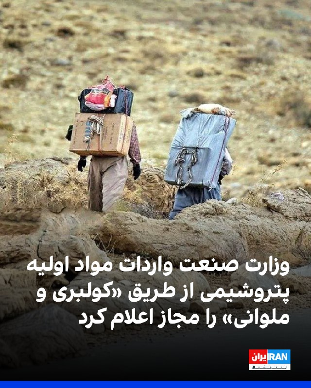

نرگس باقری زمردی، مدیرکل دفتر مقررات صادرات و واردات وزارت صنعت، معدن و تجارت، در نامه‌ای به محمدعلی بهپوری، مدیرکل واردات گمرک ایران، اعلام کرد واردات مواد اولیه مرتبط با حوزه پتروشیمی و پلیمری از طریق «رویه کولبری و ملوانی» مجاز است.

تسنیم، خبرگزاری وابسته به سپاه پاسداران، نوشت بر اساس این ابلاغیه، «واردات این اقلام صرفا در چارچوب فهرست تعیین‌شده و با رعایت ضوابط و مقررات مربوط به رویه‌های ملوانی و کولبری امکان‌پذیر خواهد بود».

این رسانه حکومتی افزود این تصمیم در شرایطی اتخاذ شد که شماری از واحدهای تولیدی صنایع پتروشیمی و پلیمری طی ماه‌‌های اخیر در تامین برخی مواد اولیه با محدودیت روبه‌رو بوده‌اند.
https://iranintl.com/202605209869

## IranIntlTV — post 338036

  <a href="telegram/content/IranIntlTV_338036_1779265900.mp4" target="_blank">🎬 Download video</a>

سازمان ملل متحد در گزارشی تازه هشدار داده تبعات جنگ در خاورمیانه اکنون از بازار انرژی فراتر رفته و از تورم و قیمت مواد غذایی تا رشد اقتصادی جهان را تحت تاثیر قرار داده است.

جزییات بیشتر با علیرضا محبی، خبرنگار ایران‌اینترنشنال
@iranintltv

## IranIntlTV — post 338035

  <a href="telegram/content/IranIntlTV_338035_1779265901.mp4" target="_blank">🎬 Download video</a>

شبکه ام‌تی‌وی لبنان گزارش داد حزب‌الله لبنان از جنبش‌های پیشاهنگی خود برای پرورش نسلی مطیع و آماده مرگ استفاده می‌کند. بر اساس این گزارش، این کودکان عمدتا فرزندان نیروهای حزب‌الله هستند و از برخی از آنها برای «جاسوسی» و «انتقال مهمات» استفاده می‌شود.
این گزارش همچنین تاکید کرد بخشی از این کودکان با وفاداری به روح‌الله خمینی و آرمان‌های او پرورش یافته‌اند.

گفت‌وگو با کامیار بهرنگ، عضو تحریریه ایران‌اینترنشنال
@iranintltv

## IranIntlTV — post 338034

  <a href="telegram/content/IranIntlTV_338034_1779265902.mp4" target="_blank">🎬 Download video</a>

میعاد ملکی، رییس پیشین دفتر هدف‌گذاری تحریم‌های وزارت خزانه‌داری آمریکا، گفت تحریم‌های جدید آمریکا علیه جمهوری اسلامی، انتقال درآمدهای نفتی و پتروشیمی را دشوارتر خواهد کرد. او همچنین گفت محاصره دریایی، تاثیر به‌مراتب بیشتری بر اقتصاد تهران خواهد داشت تا اقتصاد جهانی.
@iranintltv

## IranIntlTV — post 338033

  <a href="telegram/content/IranIntlTV_338033_1779265904.mp4" target="_blank">🎬 Download video</a>

دونالد ترامپ، رییس‌جمهوری آمریکا، گفت احتمال دارد ایالات متحده بار دیگر به جمهوری اسلامی حمله کند، اما هنوز تصمیم نهایی در این‌باره گرفته نشده است.

گفت‌وگو با شهرام خلدی، پژوهش‌گر تاریخ خاورمیانه و روابط بین‌الملل
@iranintltv

## IranIntlTV — post 338032

  <a href="telegram/content/IranIntlTV_338032_1779265905.mp4" target="_blank">🎬 Download video</a>

امید معماریان، تحلیل‌گر سیاسی در موسسه دان، گفت کاهش بخشی از نیروها و توان نظامی آمریکا در اروپا، هزینه‌های بیشتری بر سیاست‌های دفاعی و نظامی ناتو تحمیل خواهد کرد.
@iranintltv

## IranIntlTV — post 338031

  

علی خضریان، عضو کمیسیون امنیت ملی مجلس، گفت مطلع شده است عباس عراقچی، وزیر خارجه جمهوری اسلامی، قرار است سفری به نیویورک داشته باشد و با کشورهای حوزه خلیج فارس درباره تنگه هرمز مذاکره کند.

او گفت: «امیدوارم این خبر دروغ باشد، چون برگزاری جلسه‌ای در نیویورک، یعنی در خاک دشمن، و کشورهای خلیج فارس نیز باید مورد بازخواست قرار بگیرند. چنین اقدامی جمهوری اسلامی را در موضع ضعف قرار می‌دهد.»
https://iranintl.com/202605207168

## IranIntlTV — post 338030

  <a href="telegram/content/IranIntlTV_338030_1779265907.mp4" target="_blank">🎬 Download video</a>

بنابر گزارش وب‌سایت اتلتیک، فدراسیون جهانی فوتبال، فیفا، ممکن است به درخواست جمهوری اسلامی ورود پرچم شیر و خورشید به ورزشگاه‌های جام جهانی ۲۰۲۶ را ممنوع کند.

گفت‌وگو با عرفان قانعی‌فرد، تحلیل‌گر خاورمیانه
@iranintltv

## ManotoTV — post 105669

  

به گزارش خبرگزاری‌های داخلی، حکم اعدام بهمن فرزانه، قاتل الهه حسین‌نژاد، بامداد چهارشنبه اجرا شده است.
الهه حسین‌نژاد، زن ۲۴ ساله، خرداد سال گذشته هنگام بازگشت به خانه در تهران ناپدید شد و حدود ۱۰ روز بعد پیکر او با چندین ضربه چاقو در بیابان‌های اطراف تهران پیدا شد.
خبرگزاری میزان، وابسته به قوه قضاییه جمهوری اسلامی، اعلام کرده این حکم پس از طی مراحل قانونی و با درخواست اولیای دم اجرا شده است.

## ManotoTV — post 105668

  

زمین‌لرزه‌ای به بزرگی ۴.۷ بامداد چهارشنبه ۳۰ اردیبهشت حوالی لافت در استان هرمزگان را لرزاند. مرکز لرزه‌نگاری کشوری عمق این زلزله را ۲۰ کیلومتر اعلام کرده است. این زمین‌لرزه در بخش‌هایی از قشم، هرمز و مناطق روستایی بندرعباس نیز احساس شد. مقام‌های محلی می‌گویند تاکنون گزارشی از خسارت دریافت نشده، اما بررسی‌ها در مناطق نزدیک به کانون زلزله ادامه دارد.

## ManotoTV — post 105667

  <a href="telegram/content/ManotoTV_105667_1779265909.mp4" target="_blank">🎬 Download video</a>

دونالد ترامپ، رئیس‌جمهور آمریکا، بار دیگر مدعی شد که ایالات متحده جنگ با جمهوری اسلامی را «خیلی سریع» پایان خواهد داد و تهران «به‌شدت» خواهان توافق است.
ترامپ در جریان مراسم سالانه پیک‌نیک کنگره در محوطه جنوبی کاخ سفید گفت توافق با تهران «اتفاق خواهد افتاد و سریع هم اتفاق می‌افتد».
او همچنین مدعی شد با پایان این بحران، قیمت نفت «به‌شدت کاهش خواهد یافت».
این اظهارات پس از آن مطرح می‌شود که ترامپ اوایل هفته گفته بود تهران برای رسیدن به توافق «التماس» می‌کند و او تنها یک ساعت با صدور دستور حملات تازه علیه جمهوری اسلامی فاصله داشته است.
ترامپ گفت به درخواست متحدان خلیج فارس آمریکا، حملات را متوقف کرده تا به گفته او، «مذاکرات جدی» ادامه پیدا کند. با این حال، او هشدار داد اگر جمهوری اسلامی به توافق نرسد، آمریکا برای یک «حمله کامل» آماده است.

## ManotoTV — post 105666

  

شی جین‌پینگ، رئیس‌جمهوری چین، در دیدار با ولادیمیر پوتین در پکن خواستار توقف فوری درگیری‌ها در خاورمیانه شد و گفت پایان جنگ می‌تواند به کاهش اختلال در عرضه انرژی و زنجیره‌های تجارت جهانی کمک کند.

شی جین‌پینگ روز چهارشنبه، ۲۰ مه ۲۰۲۶، در دیدار با ولادیمیر پوتین در تالار بزرگ خلق پکن گفت وضعیت خاورمیانه در مرحله‌ای حساس میان جنگ و صلح قرار دارد و توقف درگیری‌ها «فوری‌ترین ضرورت» است. او تأکید کرد بازگشت به جنگ قابل قبول نیست و مسیر مذاکره باید در اولویت قرار گیرد. به گفته رئیس‌جمهور چین، پایان زودهنگام درگیری‌ها می‌تواند از اختلال بیشتر در عرضه انرژی و عملکرد زنجیره‌های صنعتی و تجاری جلوگیری کند.

پوتین نیز در آغاز این دیدار گفت روابط روسیه و چین به سطحی «بی‌سابقه» رسیده و از شی جین‌پینگ دعوت کرد سال آینده به روسیه سفر کند. رئیس‌جمهوری روسیه همچنین همکاری دو کشور را عاملی برای «بازدارندگی و ثبات» در روابط بین‌الملل توصیف کرد.

بر اساس گزارش‌ها، دو طرف در این دیدار درباره انرژی، امنیت و روابط کلی مسکو و پکن گفت‌وگو کردند و با تمدید پیمان دوستی چین و روسیه موافقت کردند؛ پیمانی که نخستین‌ب

## ManotoTV — post 105665

  

جی‌دی ونس، معاون رئیس‌جمهور آمریکا، گفت واشینگتن در برابر جنگ با ایران دو مسیر پیش رو دارد: ادامه مذاکره یا ازسرگیری عملیات نظامی.

جی‌دی ونس در نشست خبری کاخ سفید گفت آمریکا در برابر ایران «دو مسیر» دارد.

به گفته ونس، مسیر اول مذاکره است. او گفت دونالد ترامپ از تیم خود خواسته با جمهوری اسلامی «تهاجمی» مذاکره کنند.

ونس گفت آمریکا در موضوع اصلی، یعنی جلوگیری از دستیابی ایران به سلاح هسته‌ای، پیشرفت زیادی داشته و واشینگتن فکر می‌کند تهران خواهان توافق است.

او مسیر دوم را ازسرگیری عملیات نظامی دانست و گفت: «گزینه دوم این است که کارزار نظامی را دوباره شروع کنیم تا اهداف آمریکا دنبال شود.»

ونس گفت این مسیر چیزی نیست که ترامپ بخواهد و فکر نمی‌کند جمهوری اسلامی هم خواهان آن باشد.

او در پایان گفت: «برای توافق، دو طرف لازم است.»

## ManotoTV — post 105664

  <a href="telegram/content/ManotoTV_105664_1779265911.mp4" target="_blank">🎬 Download video</a>

«سکوت ما همدستی با جمهوری اسلامی است»

## FarsiVOA — post 218204

🔺رویترز: آمریکا نیروهای در دسترس ناتو در بحران‌ها را کاهش می‌دهد

▪️رویترز به نقل از سه منبع آگاه گزارش داد دولت دونالد ترامپ قصد دارد این هفته به متحدان ناتو اعلام کند که آمریکا بخشی از توانایی‌های نظامی خود را که در بحران‌ها یا جنگ‌های بزرگ در اختیار ناتو قرار می‌داد، کاهش خواهد داد.

▪️این تصمیم در چارچوب «مدل نیروی ناتو» مطرح شده است؛ سازوکاری که بر اساس آن، کشورهای عضو مشخص می‌کنند در صورت حمله نظامی یا بحران بزرگ، چه نیروها و قابلیت‌هایی را می‌توانند در اختیار ائتلاف بگذارند.

▪️ترکیب دقیق این نیروها محرمانه است، اما پنتاگون تصمیم گرفته تعهدات خود را به شکل قابل توجهی کاهش دهد.

▪️دونالد ترامپ پیش‌تر بارها اعضای ناتو را به کم‌کاری در هزینه‌های دفاعی متهم کرده بود.

⬇️ بیشتر بخوانید:
https://ir.voanews.com/a/8151972.html

## FarsiVOA — post 218203

🔺بسنت: آمریکا عجله‌ای برای تمدید آتش‌بس تجاری با چین ندارد

▪️وزیر خزانه‌داری آمریکا می‌گوید ایالات متحده عجله‌ای برای تمدید آتش‌بس تجاری با چین ندارد، اما مذاکرات پیرامون طیفی از مسائل دوجانبه مانند کاهش تعرفه‌های تجاری، سرمایه‌گذاری و هوش مصنوعی ادامه خواهد داشت.

▪️دونالد ترامپ رئیس‌جمهور آمریکا هفته گذشته طی سفری به پکن با همتای چینی خود دیدار و نتیجه مذاکرات را «عالی» توصیف کرد.

▪️دو کشور طی سال‌های گذشته جنگ تمام عیار اقتصادی و تجاری علیه همدیگر آغاز کرده، اما پارسال توافقاتی برای تعدیل تعرفه‌های تجاری تا نوامبر امسال انجام شد.

▪️قرار است شی جین‌پینگ رئیس‌جمهور چین در ماه سپتامبر، دو ماه مانده به پایان مهلت آتش‌بس تجاری، سفری به آمریکا داشته باشد.

⬇️ بیشتر بخوانید:
https://ir.voanews.com/a/8151971.html

## FarsiVOA — post 218202

🔺بحران در تأمین مواد اولیه؛ جمهوری اسلامی بخشی از واردات پتروشیمی را به کولبری و ملوانی سپرد

▪️در میانه اختلال در مسیرهای رسمی تجارت و فشار بر زنجیره تأمین صنایع، سازمان توسعه تجارت ایران واردات برخی مواد اولیه پتروشیمی و پلیمری را از طریق رویه‌های کولبری و ملوانی مجاز اعلام کرد.

▪️این تصمیم نشان می‌دهد بحران تأمین مواد اولیه در صنایع پایین‌دستی به مرحله‌ای رسیده که جمهوری اسلامی برای جبران کمبود، به مسیرهای مرزی و غیرمتعارف متوسل شده است.

▪️کولبری در ایران سال‌ها با فقر، ناامنی مرزی و برخوردهای خشونت‌آمیز همراه بوده است.

▪️پیش‌تر نیز سازمان توسعه تجارت ایران ممنوعیت صادرات محصولات شیمیایی، پلیمری و پتروشیمی را در شرایط اضطراری به گمرک ابلاغ کرده بود؛ تصمیمی که هدف آن تأمین نیاز داخلی اعلام شد.

⬇️ بیشتر بخوانید:
https://ir.voanews.com/a/8151970.html

## FarsiVOA — post 218201

🔺رویترز: دو نفتکش چینی با چهار میلیون بشکه نفت از تنگه هرمز خارج شدند

▪️رویترز گزارش داد دو نفتکش غول‌پیکر چینی، حامل مجموعاً چهار میلیون بشکه نفت خام خاورمیانه، روز چهارشنبه از تنگه هرمز خارج شده‌اند.

▪️بر اساس داده‌های ال‌اس‌ای‌جی و کپلر، این دو نفتکش از جمله شمار محدودی از ابرنفتکش‌هایی هستند که در ماه جاری، با حمل نفت خام عراق، از مسیر عبوری خارج شده‌اند که جمهوری اسلامی کشتی‌ها را به استفاده از آن ملزم کرده است.

▪️دو نفنکش چینی حامل نفت خام عراق و قطر هستند.

▪️چین که روابط دوستانه‌ای با جمهوری اسلامی دارد، به شدت به انرژی خاورمیانه وابسته است و حدود ۴۵ درصد نفت خود را از مسیر هرمز دریافت می‌کند.

⬇️ بیشتر بخوانید:
https://ir.voanews.com/a/8151969.html

## FarsiVOA — post 218200

  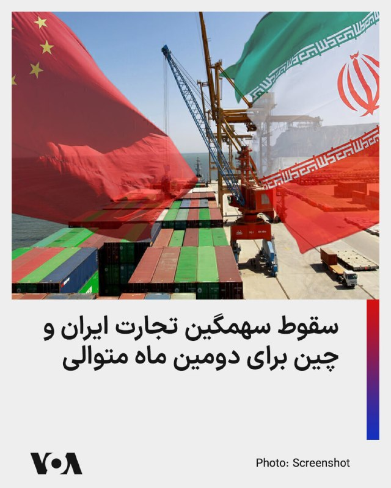

آمارهای گمرکی چین حاکی از افت ۷۰ درصدی تجارت دوجانبه با ایران بعد از آغاز عملیات مشترک نظامی آمریکا و اسرائیل علیه جمهوری اسلامی است.

طبق داده‌های گمرک چین، این کشور در ماه‌های مارس و آوریل به طور متوسط ماهانه ۲۰۰ میلیون دلار تجارت دوجانبه با ایران داشته؛ در حالی که در ماه‌های ژانویه و فوریه این رقم حدود ۷۰۰ میلیون دلار بود.

گمرک چین سال‌هاست که آمارهای خرید نفت از ایران را از داده‌های مربوط به تجارت دوجانبه خارج کرده، اما آمارهای کپلر نشان می‌دهد خرید روزانه نفت ایران توسط پالایشگاه‌های چینی نیز در ماه گذشته تنها ۱.۱۶ میلیون بشکه بوده که حدود ۳۰ درصد کمتر از ماه‌های گذشته است.

⬇️ بیشتر بخوانید:
https://ir.voanews.com/a/8151968.html

## FarsiVOA — post 218199

  

نیویورک‌تایمز گزارش داد اسرائیل در جریان طراحی یک طرح چندمرحله‌ای برای سرنگونی جمهوری اسلامی، محمود احمدی‌نژاد را به‌عنوان گزینه‌ای برای رهبری ایران پس از حذف علی خامنه‌ای و شماری از مقام‌های ارشد حکومت در نظر گرفته بود.

به نوشته این روزنامه، هنوز روشن نیست احمدی‌نژاد چگونه وارد این طرح شده یا چه میزان از جزئیات آن اطلاع داشته است. با این حال، بسیاری از مشاوران دونالد ترامپ این ایده را غیرواقع‌بینانه می‌دانستند و برخی مقام‌های آمریکایی به‌ویژه درباره امکان بازگرداندن احمدی‌نژاد به قدرت تردید داشتند.

نیویورک‌تایمز همچنین نوشت شماری از مقام‌های جمهوری اسلامی که در حمله به بیت رهبری کشته شدند، از نگاه کاخ سفید در میان چهره‌هایی قرار داشتند که آمادگی بیشتری برای گفت‌وگو درباره تغییر حکومت داشتند.

در همان دوره، رسانه‌های ایران ابتدا گزارش‌هایی درباره کشته‌شدن احمدی‌نژاد در حمله هوایی به خانه‌اش منتشر کردند؛ اما بعداً اعلام شد او زنده مانده است. تصاویر ماهواره‌ای نشان می‌داد خانه او آسیب جدی ندیده، اما پایگاه امنیتی ورودی کوچه کاملاً تخریب شده است.
@FarsiVOA

## DW_Farsi — post 124914

  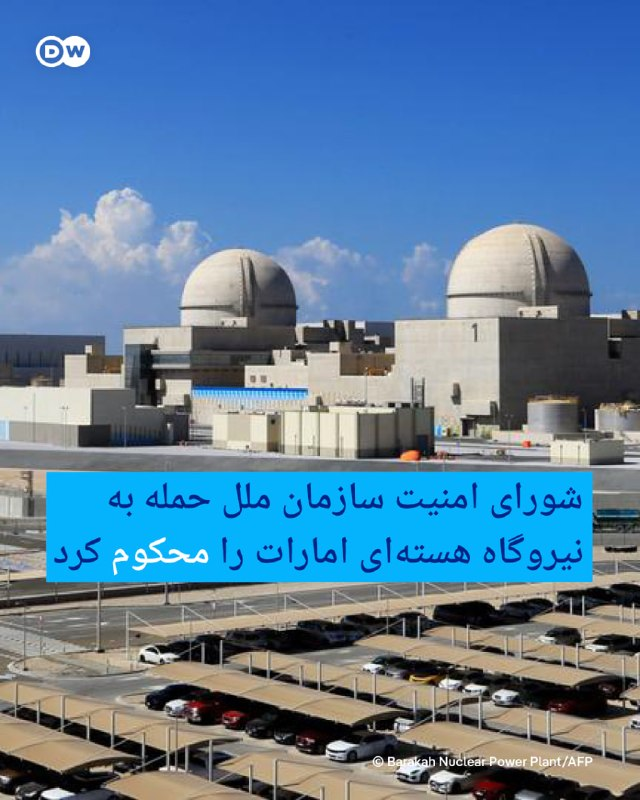

🔶 شورای امنیت سازمان ملل حمله به نیروگاه هسته‌ای امارات را محکوم کرد
 
روز سه‌شنبه اعضای شورای امنیت سازمان ملل شامل روسیه، حمله پهپادی اخیر به نیروگاه هسته‌ای "براکه" در امارات متحده عربی را محکوم کردند.
 
این حمله پهپادی که هیچ گروهی مسئولیت آن را بر عهده نگرفته است، روز یکشنبه یک ژنراتور برقی را در نزدیکی نخستین نیروگاه هسته‌ای جهان عرب در براکه در ابوظبی هدف قرار داد و باعث آتش‌سوزی شد، اما هیچ مصدومیت یا نشت مواد رادیواکتیو ایجاد نکرد.
در همین راستا واسیلی نبنزیا، سفیر روسیه در سازمان ملل متحد گفت: «حملاتی که تاسیسات هسته‌ای صلح‌آمیز در هر کشوری از جهان را هدف قرار می‌دهند، کاملا غیرقابل قبول هستند.»

او بدون نام بردن از عاملان احتمالی این حمله ادامه داد: «در این چارچوب، کشور ما [روسیه] اقدامات کسانی را که حمله علیه این نیروگاه در خاک امارات متحده عربی را انجام دادند و از این طریق خطرات تشدید تنش را ایجاد کردند، به‌طور قاطع محکوم می‌کند.»

او در عین حال مدعی شد که این حمله احتمالا اگر جنگ ایالات متحده و اسرائیل علیه جمهوری اسلامی انجام نمی‌شد، رخ نمی‌داد.

 
@dw_farsi

## DW_Farsi — post 124913

  

🔶 بقایی اظهارات فرمانده سنتکام درباره مدرسه میناب را "بی‌اساس" خواند
 
اسماعیل بقایی، سخنگوی وزارت خارجه جمهوری اسلامی، اظهارات برد کوپر، فرمانده نیروهای مرکزی ایالات متحده، سنتکام، در خصوص مدرسه ابتدایی شجره طیبه در میناب را "بی‌اساس و دروغی تکان‌دهنده" خواند.
 
فرمانده سنتکام روز سه‌شنبه در برابر کنگره ایالات متحده آمریکا اعلام کرده بود که تحقیقات نظامی صورت‌گرفته توسط آمریکا در خصوص انفجاردر این مدرسه "پیچیده است، چرا که این مدرسه در یک سایت فعال موشک‌های کروز ایران واقع شده بود".
 
بقایی در واکنش به این اظهارات در شبکه اجتماعی ایکس، این سخنان را " تحریف بی‌شرمانه" خواند و مدعی شد که این "تلاشی آشکار برای پنهان کردن واقعیت تلخ حملات موشکی ۲۸فوریه (نهم اسفند) است؛ حملاتی که به کشته شدن تراژیک بیش از ۱۷۰دانش‌آموز و معلمان‌شان انجامید".
 
سخنگوی وزارت خارجه جمهوری اسلامی، "هدف قرار دادن" این مدرسه را "نقض جدی حقوق بشردوستانه بین‌المللی و جنایت جنگی آشکار" توصیف کرد.
@dw_farsi

## DW_Farsi — post 124912

  

🔶 رای اولیه سنای آمریکا به محدود کردن اختیارات ترامپ در جنگ با ایران
 
برای نخستین بار، سنای آمریکا به قطعنامه‌ای رای داد که در صورت تصویب، قرار است دونالد ترامپ، رئیس جمهور آمریکا را به پایان دادن به جنگ ایران وادار کند.
 
سنای آمریکا روز سه‌شنبه به وقت محلی، با حمایت چهار نماینده جمهوری‌خواه، با ۵۰ رای موافق در برابر ۴۷ رای مخالف، به یک گام آیین‌نامه‌ای برای پیشبرد این طرح رای داد. اکنون این طرح می‌تواند در هفته‌های آینده مورد بحث قرار گیرد و به رای‌گیری نهایی گذاشته شود.
 
جمهوری‌خواهان پیش از این در سال جاری، هفت تلاش مشابه در سنا و سه مورد در مجلس نمایندگان را متوقف کرده بودند و اختیار تصمیم‌گیری درباره جنگ را در دست رئیس‌ جمهور نگه داشته بودند.
 
با این حال، این قطعنامه هنوز باید از موانع بزرگی عبور کند. حتی اگر هر دو مجلس به آن رای مثبت بدهند، ترامپ می‌تواند آن را وتو کند.
 
قطعنامه محدود کردن اختیارات ترامپ در جنگ با ایران را تیم کین، سناتور دموکرات ارائه کرده بود. او ترامپ را متهم کرده است که "پیشنهادهای صلح را نادیده می‌گیرد".
 
@dw_farsi

## DW_Farsi — post 124911

🔶 جام‌های ۱۹۵۸ و ۱۹۷۰؛ پله، مروارید سیاه برزیل و بازیکن قرن
 
اِدسون آرانتِس دو ناسیمنتو، ملقب به پله، روز ۲۳ اکتبر ۱۹۴۰ در شهری کوچک بین ریو دژانیرو و سائو پائولو در برزیل به دنیا آمد. او در سن ۱۱ سالگى توجه مربیان فوتبال را به خود جلب کرد و ۴ سال بعد به خدمت باشگاه صاحب‌نام سانتوس درآمد. پله در سال ۱۹۵۶ در حالی که ۱۶ سال بیشتر سن نداشت، اولین گل خود را براى این تیم به ثمر رساند.
 
پله خود در مورد آن روزها گفته است: «سیزده، چهارده ساله بودم و در باشگاه ‌"بائرو" بازی می‌کردم. ما برنده شدیم و جایزه‌‌ای بردیم و عکسم را در روزنامه‌ها چاپ کردند. آن موقع می‌دانستم که می‌خواهم فوتبالیست حرفه‌ای شوم.»
 
درخشش فوق‌العاده‌ پله در لیگ برزیل، زمینه‌ای بود برای دعوت از او به اردوی تیم ملی براى حضور در جام جهانى ۱۹۵۸ سوئد؛ تورنمنتی که در آن جهان با ستاره‌اى استثنایى آشنا شد.
 
قدرت دریبل‌زنى، دید وسیع و پاس‌هاى دقیق پله‌ ۱۷ ساله او را در کنار واوا و گارینشا، به یکی از سه عضو مثلث جادویی برزیل تبدیل کرد.
 
این ستا‌ره‌ نوظهور در مرحله‌ گروهی این رقابت‌ها مصدوم شد، اما به اصرار دیگر بازیکنان تیم ملی، در دیدارهاى حساس بعدى به میدان رفت.
 
پله در یک‌چهارم نهایى جام جهانی ۱۹۵۸، یک گل به وِلز زد، در دیدار نیمه‌نهایى، سه بار دروازه‌ فرانسه را گشود و در فینال هم دو گل از ۵ گل تیمش را به ثمر رساند. تیم ملی برزیل در دیدار نهایی ۵ بر ۲ سوئد میزبان مسابقات را شکست داد و بدین ترتیب پله در سن ۱۷ سالگی نخستین قهرمانی جهان را تجربه کرد.
 
@dw_farsi

## DW_Farsi — post 124910

  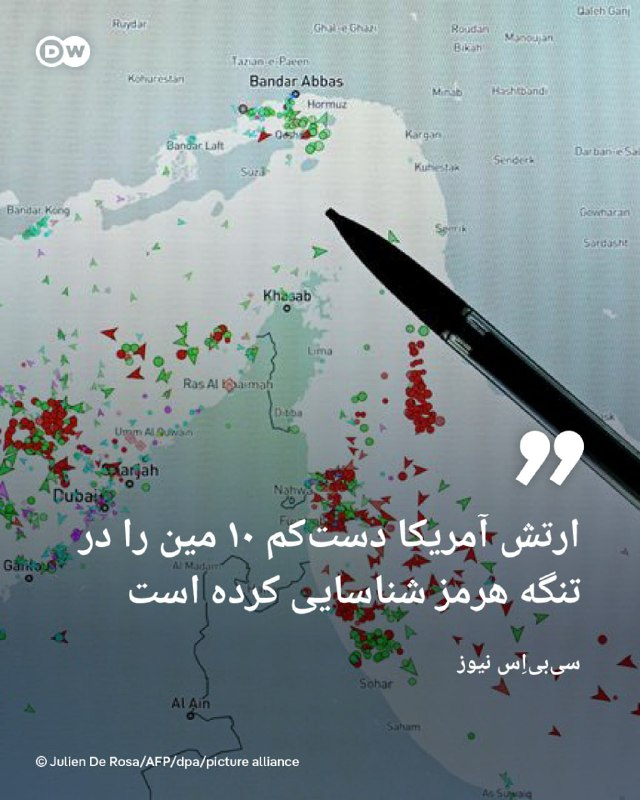

🔶 "ارتش آمریکا دست‌کم ۱۰ مین را در تنگه هرمز شناسایی کرده است"
 
سی‌بی‌اِس نیوز به نقل از مقام‌های ایالات متحده که نخواسته‌اند نام‌شان فاش شود، بر مبنای یک ارزیابی اطلاعاتی اخیر گزارش داده که نیروهای ارتش این کشور دست‌کم ۱۰ مین را در تنگه هرمز  شناسایی کرده‌اند.
 
سی‌بی‌اِس نیوز پیش‌تر در ماه مارس گزارش داده بود که بر اساس ارزیابی‌های اطلاعاتی آمریکا در آن زمان، دست‌کم ۱۲ مین زیرآبی در تنگه هرمز وجود داشته است. مقام‌های آمریکایی در ماه مارس گفته بودند مین‌هایی که اکنون جمهوری اسلامی در تنگه هرمز به کار گرفته، مین‌های چسبنده "مهام ۳" و "مهام ۷" ساخت ایران هستند. یک مقام دیگر ایالات متحده تعداد آن‌ها را کمتر از ۱۲ عدد اعلام کرده بود.
   
ایالات متحده هشدار داده است که عبور از مسیر عادی در تنگه هرمز می‌تواند به دلیل مین‌هایی که جمهوری اسلامی در تنگه هرمز کار گذاشته، "بسیار خطرناک" باشد.
 
پنتاگون پیش از این، تصویری گرافیکی منتشر کرده بود که نشان می‌داد جمهوری اسلامی در ۲۳ آوریل مین‌های جدیدی در تنگه هرمز کار گذاشته است.
 
@dw_farsi

## DW_Farsi — post 124909

🔶 ترامپ: جنگ با ایران را خیلی سریع پایان خواهیم داد
 
به گزارش خبرگزاری رویترز، دونالد ترامپ، رئیس ‌جمهور ایالات متحده، در کاخ سفید به اعضای کنگره گفته است که ایالات متحده، "جنگ با ایران را خیلی سریع" پایان خواهد داد.
 
همزمان دو مقام ایالات متحده به اکسیوس گفته‌اند که ترامپ، شامگاه دوشنبه جلسه‌ای با تیم ارشد امنیت ملی خود درباره ایران برگزار کرد که شامل ارائه گزارشی درباره گزینه‌های نظامی بود. بر اساس این گزارش، این جلسه چند ساعت پس از آن برگزار شد که ترامپ اعلام کرده بود حملات برنامه‌ریزی‌شده روز سه‌شنبه به ایران را متوقف کرده است.
 
ترامپ همچنان در تازه‌ترین اظهارنظرهای خود درباره جنگ ایران گفته است که جمهوری اسلامی تنها چند روز برای رسیدن به یک پیشرفت دیپلماتیک فرصت دارد.
 
او روز دوشنبه گفت که ضرب‌الاجل برای تعیین تکلیف این موضوع، "دو سه روز، شاید جمعه یا شنبه، یا اوایل هفته آینده" است.
 
به گفته مقام‌های ایالات متحده و منابع منطقه‌ای، تصمیم ترامپ برای خودداری از حمله تا حدی به دلیل نگرانی‌هایی بود که چند رهبر کشورهای خلیج فارس درباره حملات تلافی‌جویانه جمهوری اسلامی علیه تاسیسات نفتی و زیرساخت‌هایشان مطرح کرده بودند.
 
به گزارش اکسیوس، حاضران در جلسه با ترامپ، جی‌دی ونس، معاون او، مارکو روبیو، وزیر امور خارجه، استیو ویتکاف، فرستاده کاخ سفید، پیت هگست، وزیر دفاع، ژنرال دن کین، رئیس ستاد مشترک ارتش، جان رتکلیف، رئیس سازمان اطلاعات مرکزی آمریکا (سیا)، و دیگر مقام‌های ارشد بوده‌اند.
 
یک منبع منطقه‌ای نیز به اکسیوس گفته است که میانجی‌ها در تلاش هستند تا جمهوری اسلامی را متقاعد کنند موضعی انعطاف‌پذیرتر ارائه دهد که خواسته‌های هسته‌ای ایالات متحده را در بر بگیرد.
 
این در حالی است که ترامپ روز سه‌شنبه گفته بود: «ممکن است مجبور شویم یک ضربه بزرگ دیگر به ایران وارد کنیم. هنوز مطمئن نیستم. خیلی زود خواهید فهمید.»
 
این خبرگزاری پیش از این گزارش داده بود که ترامپ از زمان آغاز جنگ در ماه فوریه تا کنون "دست کم شش بار ضرب‌الاجل‌های اعلام‌شده را تمدید کرده و حمله‌های برنامه‌ریزی شده علیه جمهوری اسلامی را به تعویق انداخته است."
@dw_farsi

## DW_Farsi — post 124908

🔶 نمایش کلاشینکف روی آنتن؛ "بازگشت پروپاگاندای جنگی دهه شصت"
 
🔻 گزارشی از الینا فرهادی
 
در هفته‌های اخیر، آنتن شبکه‌های مختلف صدا و سیمای جمهوری اسلامی ایران شاهد تحولی بی‌سابقه و تامل‌برانگیز بوده است؛ قاب‌هایی که پیش از این به پادگان‌ها و رژه‌های نظامی محدود می‌شد، اکنون به برنامه‌های زنده، استودیوهای روتین و حتی دستان مجریان تلویزیونی راه یافته است.
 
از آموزش گام‌به‌گام باز و بسته کردن اسلحه کلاشنیکف تا نمایش تیربارهای سنگین و موشک‌اندازهای آرپی‌جی، رسانه رسمی حکومت ایران آشکارا یک "جامعه مسلح" و آماده برای بدترین سناریوها را تصویر می‌کند. بازوهای مدیریتی صداوسیما این روند را بخشی طبیعی از "آرایش جنگی رسانه ملی" در بحبوحه تنش‌های فزاینده منطقه‌ای می‌دانند. محسن برمهانی، معاون سیما، با صراحتی کم‌سابقه معتقد است در شرایط فعلی، وظیفه تلویزیون نه صرفا اطلاع‌رسانی، بلکه "تهییج و آموزش" برای مفاهیم جهاد و مقاومت است. در همین راستا، حسن عابدینی، معاون سیاسی این سازمان، نمایش اسلحه در دست مجریان و مهمانان را اقدامی "نمادین" برای بازنمایی آمادگی نیروهای داوطلب در برابر تهدیدات خارجی ارزیابی می‌کند.
 
 اما ناظران و حتی برخی رسانه‌های داخلی، این ویترین جدید را نشانه‌ای از یک بازآرایی استراتژیک با اهداف چندگانه داخلی و خارجی ارزیابی می‌کنند.
 
تحلیل‌گران مسائل سیاسی معتقدند این حجم از نظامی‌گری عریان بر صفحه تلویزیون، پیام پیچیده‌ای را حمل می‌کند که لزوما مخاطب خارجی یا دشمنان منطقه‌ای را هدف نگرفته است. منتقدان می‌گویند فراتر از نمایش بازدارندگی در برابر تهدیدهای بیرونی، این تصاویر پالس‌های مشخصی از ارعاب روانی را به جامعه معترض و مستعد بحران در داخل مخابره می‌کند؛ جامعه‌ای که زیر بار فشارهای خردکننده اقتصادی و انسداد سیاسی قرار دارد. در واقع، ابهام بزرگ اینجاست که آیا حاکمیت در حال آماده‌سازی هواداران خود برای یک رویارویی بزرگ نظامی است، یا آگاهانه بذر اضطراب اجتماعی را می‌پاشد تا هرگونه صدای مخالفت داخلی را در فضای گرگ‌ومیش "وضعیت جنگی" خفه کند؟
@dw_farsi

## Persian_Trend_Official — post 14515

  

💢واردات مواد اولیه پتروشیمی و پلیمری مجاز شد

💢مدیرکل دفتر مقررات صادرات و واردات وزارت صنعت، معدن و تجارت، در مکاتبه‌ای با مدیرکل واردات گمرک ایران، امکان واردات برخی مواد اولیه مرتبط با حوزه پتروشیمی و پلیمری از طریق رویه‌های ملوانی و کولبری را ابلاغ کرد.

🫆:Tony

📌 @persian_trend_official
پرشین ترند | متفاوت‌ترین کانال نظامی

## Persian_Trend_Official — post 14514

  <a href="telegram/content/Persian_Trend_Official_14514_1779265915.mp4" target="_blank">🎬 Download video</a>

کپشن با شما ...

📌 @persian_trend_official
پرشین ترند | متفاوت‌ترین کانال نظامی

## Persian_Trend_Official — post 14513

  

💢قاتل الهه حسین نژاد اعدام شد.

🫆:Tony
📌 @persian_trend_official
پرشین ترند | متفاوت‌ترین کانال نظامی

## RadioFarda — post 157374

ماجرای نزاع سیاسی امباپه و راست افراطی فرانسه چیست؟

🔸اظهارت اخیر کیلیان امباپه، فوق‌ستاره فوتبال فرانسه، دربارهٔ احتمال قدرت گرفتن حزب راست افراطی در این کشور، موجی از واکنش‌ها را برانگیخته است. این اظهارات در شرایطی مطرح شده که تنها یک سال به انتخابات ریاست‌جمهوری فرانسه باقی مانده و نامزدهای حزب راست افراطی در نظرسنجی‌ها پیشتازند.

🔸کیلیان امباپه که هرگز مخالفت خود با «اجتماع ملی»، حزب راست افراطی فرانسه، پنهان نکرده است، به تازگی در گفت‌وگویی با مجله ونتی‌فِر، اعلام کرده که نسبت به پیامدهای پیروزی احتمالی این حزب برای فرانسه نگران است.

🔸امباپه در این مصاحبه گفته است: «من می‌دانم این یعنی چه، و می‌دانم وقتی چنین افرادی قدرت را در دست بگیرند، چه پیامدهایی می‌تواند برای کشورم داشته باشد».

🔸اما هر بار که امباپه علیه حزب راست افراطی سخن گفته، رهبران این حزب، در واکنش درآمدهای زیاد ستارگان فوتبال را مطرح کرده‌اند و آنان را متهم کرده‌اند که وضعیت قشر کم‌درآمد را درک نمی‌کنند.

🔸به عنوان نمونه، ژوردن باردلا که اختلاف سنی چندانی با امباپه ندارد اما اکنون به اصلی‌ترین بخت راست افراطی فرانسه برای پیروزی در انتخابات ریاست‌جمهوری تبدیل شده، به کنایه گفته است: «باید به رأی هر فرد احترام گذاشت، مخصوصا وقتی این شانس را دارید که حقوق بسیار بسیار بالایی داشته باشید، میلیاردر یا میلیونر باشید، وقتی این امکان را دارید که با جت خصوصی رفت‌وآمد کنید».

جزئیات بیشتر در وب‌سایت رادیو فردا.

@RadioFarda

## RadioFarda — post 157373

ادعای نیویورک‌تایمز: محمود احمدی‌نژاد بخشی از طرح تغییر رژیم ایران بود

🔸روزنامه آمریکایی نیویورک‌تایمز می‌گوید در «تحقیقات خود» به این نتیجه رسیده که حملات هوایی آمریکا و اسرائیل به محل سکونت محمود احمدی‌نژاد، رئیس‌جمهور پیشین ایران، در اوایل جنگ اخیر، برای «آزادی او از حصر خانگی و بخشی از طرح تغییر رژیم» بوده است.

🔸این روزنامه در گزارشی اختصاصی که روز سه‌شنبه ۲۹ اردیبهشت منتشر شد، به‌نقل از «مقام‌های آمریکایی که در جریان این طرح قرار گرفته بودند»، نوشته است که این طرح که «احمدی‌نژاد نیز درباره آن مورد مشورت قرار گرفته بود، خیلی زود از مسیر خارج شد».

🔸به ادعای این روزنامه، بر اساس «طرح» آمریکا و اسرائیل، قرار بود احمدی‌نژاد تنها چند روز پس از آغاز جنگ علیه ایران و کشته شدن علی خامنه‌ای، رهبر پیشین جمهوری اسلامی، به قدرت برسد.

🔸نویسندگان این گزارش به اظهارات دونالد ترامپ، رئیس‌جمهور آمریکا، در روزهای ابتدایی جنگ اشاره کرده‌اند که گفته بود بهتر است «کسی از داخل» ایران ادارهٔ کشور را در دست بگیرد.

🔸نیویورک‌تایمز مدعی شده که مقامات آمریکایی به این روزنامه گفته‌اند این طرح «جسورانه» توسط اسرائیل طراحی و از سوی دولت آمریکا تأیید شده بود.

🔸این گزارش در عین حال می‌گوید مشخص نیست احمدی‌نژاد چگونه وارد این طرح شده، اما انتخاب او «غیرعادی» توصیف شده است؛ چراکه او در دوران ریاست‌جمهوری‌اش به اظهارات تند از جمله درباره «محو اسرائیل از نقشه جهان» شناخته می‌شد. او همچنین از حامیان سرسخت برنامه هسته‌ای ایران، منتقد آمریکا و حامی سرکوب اعتراضات داخلی بود.

🔸با این حال، به‌نوشتهٔ این روزنامه، این طرح به‌سرعت مختل شد به این دلیل که احمدی‌نژاد در روز نخست جنگ در اثر حمله هوایی اسرائیل به خانه‌اش در تهران زخمی شد.

🔸نیویورک تایمز همچنین گزارش داد که محل نگهداری فعلی و وضعیت احمدی‌نژاد پس از آن حمله مشخص نیست و آمریکا نیز از سرنوشت او اطلاعی ندارد.

🔸خبر حمله به محل زندگی محمود احمدی نژاد در شرق تهران در همان روزهای نخست حملات هوایی به تهران منتشر و کمی بعد تکذیب شده بود.

🔸رادیو فردا مستقلاً قادر به تأیید جزئیات این گزارش نیست. بخش قابل‌توجهی از این گزارش بر پایه نقل‌قول از «مقام‌های ناشناس» و «افراد نزدیک به احمدی‌نژاد» نوشته شده و هیچ سند رسمی یا مستقلی برای تأیید این ادعاها منتشر نشده است.

🔸کاخ سفید نیز در واکنش به این روایت، بدون اشاره مستقیم به احمدی‌نژاد، اعلام کرده هدف عملیات آمریکا صرفاً نابودی توان موشکی و هسته‌ای ایران بوده است. اسرائیل هم از اظهارنظر دربارهٔ این گزارش خودداری کرده است.

@RadioFarda

## RadioFarda — post 157372

  <a href="telegram/content/RadioFarda_157372_1779265917.mp4" target="_blank">🎬 Download video</a>

🔸ستاد فرماندهی مرکزی ایالات متحده (سنتکام) اعلام کرد از زمان اجرای محاصره دریایی جمهوری اسلامی ایران، نیروهای آمریکایی ۸۹ کشتی را وادار به تغییر مسیر کرده‌اند.

🔸سنتکام در پستی که ۲۹ اردیبهشت در شبکه ایکس منتشر شده، تأکید کرده که همچنان محاصره کامل آمریکا علیه ایران را اجرا می‌کنند و مانع جریان تجارت به بنادر ایران و از آن‌ها می‌شوند.

🔸آمریکا پس از شکست مذاکرات حضوری با ایران در پاکستان، در ۲۴ فروردین سال جاری، محاصرهٔ دریایی بنادر ایران را آغاز کرد.

@RadioFarda

## RadioFarda — post 157371

سفر پوتین به پکن؛ رئیس‌جمهور چین: ادامه درگیری‌ها در خاورمیانه «صلاح نیست»

در سفر ولادیمیر پوتین رئیس‌جمهور روسیه به پکن، رهبران دو کشور از پیشرفت روابط راهبردی میان دو طرف تمجید کردند. شی جین‌پینگ در این دیدار تأکید کرد که ادامه درگیری‌ها در خاورمیانه «صلاح نیست» و خواستار برقراری آتش‌بسی «جامع» شد.

بر اساس متن منتشرشده در خبرگزاری دولتی شینهوآ، شی جین‌پینگ،‌ رئیس‌جمهور چین، در دیدار با ولادیمیر پوتین گفت که دو کشور باید بر راهبرد بلندمدت تمرکز کرده و نظام حکمرانیِ جهانی را که به‌گفتهٔ او «عادلانه‌تر و منطقی‌تر» باشد، ترویج کنند.

شی در آغاز این دیدار در روز چهارشنبه ۳۰ اردیبهشت، گفت: «دلیل رسیدن روابط چین و روسیه به این سطح آن است که ما توانسته‌ایم اعتماد سیاسی متقابل و همکاری راهبردی را عمیق کنیم.»

او خطاب به پوتین افزود: «پایه‌های اعتماد متقابل در حال مستحکم‌تر شدن است» و «روابط چین و روسیه وارد مرحله‌ای جدید از پیشرفت بیشتر و توسعه سریع‌تر شده است.»

جزئیات بیشتر در وب‌سایت رادیوفردا.

@RadioFarda

## RadioFarda — post 157370

  <a href="telegram/content/RadioFarda_157370_1779265919.mp4" target="_blank">🎬 Download video</a>

🔸شی جین‌پینگ، رئیس‌جمهور چین، روز چهارشنبه در مراسمی رسمی در تالار بزرگ خلق در پکن، از همتای روس خود، ولادیمیر پوتین، استقبال کرد.

🔸قرار است رئیس‌جمهور روسیه در گفت‌وگو با همتای چینی‌اش مجموعه‌ای از موضوعات، از روابط متشنج دو کشور با غرب تا جنگ ایران و تأثیرش بر وضعیت جهانی انرژی را به بحث بگذارند.

🔸این دیدار درست پس از سفر رئیس‌جمهور آمریکا، به پایتخت چین انجام می‌شود.

🔸از این رو، نحوه برگزاری مراسم، و نتایج دیدار میان رهبران چین و روسیه با دقت مورد توجه و مقایسه قرار خواهد گرفت.

🔸پکن به مهمترین شریک تجاری مسکو تبدیل شده و چین حالا بزرگترین مشتری نفت و گاز روسیه به‌شمار می‌آید. با توجه به جنگ ایران، روسیه انتظار دارد میزان صادرات نفت و گازش به چین بیشتر هم بشود.

🔸بسته شدن تنگۀ هرمز انتقال حدود یک‌پنجم حامل‌های انرژی جهان را با اختلال مواجه کرده است؛ موضوعی که صنایع چین را هم تحت تأثیر قرار داده و به اهمیت توسعۀ شبکه‌های خط لولۀ سطحی به‌عنوان گزینه‌ای دیگر به موازات مسیرهای آبی و زیرآبی افزوده است.

@RadioFarda

## RadioFarda — post 157369

سفیر آمریکا در سازمان ملل: اقتصاد ایران در حال فروپاشی است

🔸مایک والتز، سفیر آمریکا در سازمان ملل، می‌گوید منابع مالی حکومت ایران «در حال تمام شدن» و اقتصاد این کشور «در وضعیت فروپاشی» است.

🔸او افزوده که با این حال جمهوری اسلامی «به‌جای روی آوردن به رویکردی تازه و صلح‌آمیز، دست به حملات مکرر و گستاخانه‌ای علیه زیرساخت‌های غیرنظامی برق زده و همچنان به راهبرد دستیابی به سلاح هسته‌ای چنگ زده که می‌تواند جهان را در تاریکی فرو ببرد.»

🔸او تأکید کرده که «ما نمی‌توانیم این را تحمل کنیم و هرگز تحمل نخواهیم کرد.»

🔸اسکات بسنت، وزیر خزانه‌داری ایالات متحده، هم روز سه‌شنبه ۲۹ اردیبهشت در یک نشست مبارزه با تأمین مالی تروریسم در پاریس، گفت که این وزارتخانه، حکومت ایران را از درآمدهایی که برای «برنامه‌های تسلیحاتی، گروه‌های نیابتی تروریستی و جاه‌طلبی‌های هسته‌ای خود استفاده می‌کرد، محروم کرده است.»

🔸او افزود که واشینگتن «ده‌ها میلیارد دلار از درآمد پیش‌بینی‌شده نفتی» جمهوری اسلامی را مختل کرده است.

@RadioFarda

## RadioFarda — post 157368

  

🔸رسانه‌ها در ایران از اجرای حکم اعدام قاتل الهه حسین‌نژاد، که جسد او اوایل خرداد سال گذشته در بیابان‌های اطراف تهران پیدا شد، خبر می‌دهند.

🔸ارگان رسمی قوه قضائیه ایران، میزان، با انتشار این خبر نوشته که این حکم با درخواست اولیای دم و پس از طی تمامی مراحل قانونی و قضایی اجرا شد.

🔸عصر چهارم خرداد ۱۴۰۴ الهه حسین‌نژاد ۲۴ ساله از سالن زیبایی که در آنجا مشغول به کار بود، بیرون آمد تا به خانه‌اش در اسلامشهر برود، اما ناپدید شد و وقتی خانواده‌اش اعلام شکایت کردند بررسی‌های تیم جنایی نشان می‌داد الهه از میدان آزادی سوار یک خودروی عبوری شده است.

🔸جست و جوها برای یافتن الهه سرانجام پس از ۱۱ روز نتیجه داد و با دستگیری راننده خودرو به نام بهمن ۳۷ ساله و اعتراف به قتل الهه، جسد او در بیابان‌های اطراف تهران پیدا شد. متهم نیز پس از محاکمه به اعدام محکوم شد.

🔸این قتل جنجال زیادی درباره امنیت زنان در ایران به پا کرد و تا مدت‌ها رسانه‌ها درباره آن مطالب مختلفی منتشر می‌کردند.

@RadioFarda

## IranianMinds — post 20424

‎⁨پرفکت⁩.npvt

## IranianMinds — post 20423

  <a href="https://t.me/IranianMinds/20423" target="_blank">📎 Download file</a>

رو اینترنت همراه اول تست کنید این رو

آموزش اتصال در اندروید

آموزش اتصال در آیفون

حتما شیر بدید بقیه هم متصل شن لطفا دانلود سنگین هم نزنید ❤️‍🔥

@IranianMinds

## IranianMinds — post 20422

🔴 سپاه :

اگه دوباره به ما حمله بشه ایندفه جنگ دیگه منطقه ای نیست و فرا منطقه ای میشه.

@IranianMinds

## IranianMinds — post 20421

  <a href="telegram/content/IranianMinds_20421_1779265921.mp4" target="_blank">🎬 Download video</a>

اینجا نه عراقه و نه لبنان متاسفانه ایرانه خودمونه …

@IranianMinds

## IranianMinds — post 20420

🔴 وزارت خارجه آمریکا :

رژیم ایران کاملا بی پول و ورشکست شده و تمام راه هایی که میتونست ازش کسب درآمد کنه رو بستیم و بقیه راه هارو هم داریم میبندیم

همچنین هرکسی اطلاعاتی از منابع مالی رژیم ایران بده بهمون ۱۵ میلیون دلار پاداش دریافت میکنه!

@IranianMinds

## IranianMinds — post 20419

  

🔴 طبق گفته‌ی خواهر الهه حسین‌نژاد؛ بهمن فرزانه (قاتل) امشب اعدام میشه. @IranianMinds

## IranianMinds — post 20418

  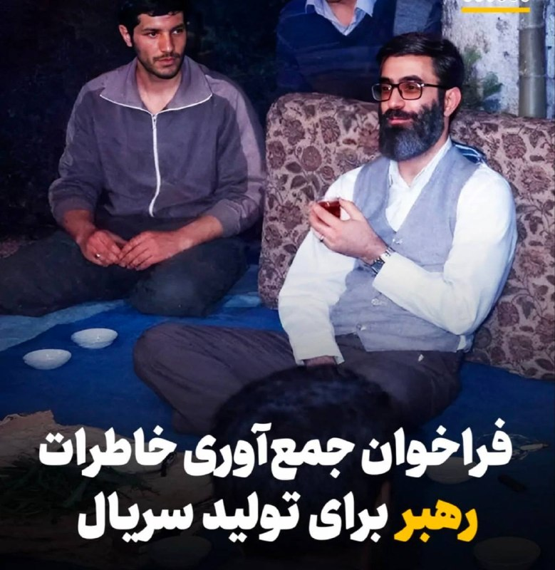

🔴 رسانه های حکومتی :

هرکی‌ با خامنه ای خاطره داره بیاد برامون تعریف کنه میخوایم سریال بسازیم ازش.

@IranianMinds

## BBCPersian — post 281590

🔻کاخ سفید شرکت ترامپ در اجلاس ماه آینده گروه هفت را تایید کرد

🔻کاخ سفید تایید کرده است که رئیس جمهور ترامپ علی‌رغم افزایش تنش با متحدانش، در اجلاس ماه آینده سران گروه هفت در فرانسه شرکت خواهد کرد.

پیش از این، تردیدهایی در مورد شرکت او در این رویداد در تفرجگاه اویان له بن در سواحل دریاچه ژنو وجود داشت.

گفته می‌شود آقای ترامپ مشتاق است که این نشست را بیش از آنچه که معمولاً گردهمایی‌های دیپلماتیک هستند، متمرکز بر تجارت کند.

میزبان او، رئیس جمهور امانوئل مکرون، پیش از این برنامه میزبانی شام پس از اجلاس در کاخ ورسای را به عنوان یک مشوق اضافی برای حضور آقای ترامپ پیشنهاد داد.

تاریخ‌های پیشنهادی این اجلاس قبلاً تغییر کرده بود تا با برنامه آقای ترامپ برای میزبانی یک مسابقه رزمی یو‌اف‌سی در کاخ سفید در هشتادمین سالگرد تولدش تداخل نداشته باشد.

https://bbc.in/3PsPDrq
@BBCPersian

## BBCPersian — post 281580

‌🖊آندره بیرناث
بی‌بی‌سی برزیل

🔻پایانی سرد، تاریک و تا حدی ملال‌آور. سرانجامی خشن و ویرانگر. یا شاید پایانی که آغازی دیگر در دل خود دارد؟

این موارد از برجسته‌ترین نظریه‌ها درباره این هستند که پایان جهان در آینده‌ای بسیار، بسیار دور ممکن است چه شکلی داشته باشد؛ البته اگر اصلا پایانی در کار باشد.

سرنوشت جهان یکی از اسرار‌آمیز‌ترین پرسش‌های علم است. حتی دانشمندان هم باور دارند که پرسش‌ها بیش از پاسخ‌هاست.

برای آنکه برخی از راه‌هایی که جهان ممکن است به پایان برسد را دریابیم ابتدا باید بفهمیم جهان چگونه آغاز شده است.

متن کامل خبر را از لینک زیر بخوانید:
https://bbc.in/4dSPuqm

📷Getty/ Fotograzia via Getty Images/ FlashMovie via GettyImages/ Arctic Images via Getty Images/ Fotograzia via Getty Images

@BBCPersian

## BBCPersian — post 281579

🔻نفتکش کره‌ جنوبی «با همکاری مقام‌های ایرانی» در حال عبور از تنگه هرمز است

🔻چو هیون، وزیر امور خارجه کره جنوبی، روز چهارشنبه گفت که یک نفتکش کره‌ای حامل نفت خام با همکاری مقام‌های ایرانی در حال عبور از تنگه هرمز است.

او در اظهارات خود در جلسه استماع پارلمان در سئول، جزئیات بیشتری در مورد این کشتی ارائه نکرد.

داده‌های کشتیرانی شرکت ال‌اس‌ای‌جی روز چهارشنبه نشان می‌دهد که ابرنفتکش یونیورسال وینر با پرچم کره جنوبی و حامل ۲ میلیون بشکه نفت خام کویت، در حال خروج از تنگه هرمز است.

عبور این نفتکش کره‌ای با همکاری مقام‌های ایران پس از آن صورت می‌گیرد که حدود دو هفته پیش (۱۴ اردیبهشت / ۴ مه) کشتی باری کره‌ای «اچ‌ام‌ام نامو» در نزدیکی تنگه هرمز هدف «دو پهپاد ناشناس» قرار گرفت.
https://bbc.in/3RwznWP
@BBCPersian

## BBCPersian — post 281571

‌🖊لوئیز آنتونیو آراخو
بی‌بی‌سی برزیل

🔻هم‌زمان با جنگ ایران، وب‌سایت «دیبریف» مصاحبه‌ای خیالی با کارل فون کلاوزویتس منتشر کرد؛ ژنرال و نظریه‌پرداز پروسی قرن نوزدهم که اندیشه‌هایش دوباره در تحلیل جنگ‌های مدرن مورد توجه قرار گرفته است.

بئاتریس هویزر، رئیس آکادمی ستاد کل نیروهای مسلح آلمان، می‌گوید کلاوزویتس نخستین متفکری بود که جنگ را نه از منظر اخلاق و الهیات، بلکه به عنوان پدیده‌ای سیاسی و اجتماعی برای فهم ماهیت آن بررسی کرد.

اندیشه‌های کلاوزویتس بر چهره‌هایی چون دوک ولینگتون و ولادیمیر لنین تاثیر گذاشت و ایده‌های او همچنان یکی از مهم‌ترین چارچوب‌های نظری برای تحلیل جنگ محسوب می‌شود.

ساندرو تیشیرا موئیتا، استاد علوم نظامی، می‌گوید ابهام درباره اهداف آمریکا در جنگ ایران نشان می‌دهد تحلیلگران همچنان از مفاهیم کلاوزویتس برای فهم استراتژی، قدرت و اهداف سیاسی در جنگ استفاده می‌کنند.

هیو استراون، استاد روابط بین‌الملل، می‌گوید مفهوم مشهور کلاوزویتس درباره «ادامه سیاست با ابزارهایی دیگر» همچنان برای فهم جنگ ایران کاربرد دارد؛

لینک خبر کامل:

https://bbc.in/49M0mUD
📷Getty Images/BBCImages

@BBCPersian

## Dirty_Kids — post 389791

  

‏به این میگن عقب‌نشینی استراتژیک.

@Dirty_Kids 👻

## Dirty_Kids — post 389790

خیلی دلم میخواد تو مترو با یه دختر دوست بشم، دیت اول با ماشینم برم دنبالش پشماش بریزه اون لحظه که تیبا ۲ رو میبینه و بفهمه هرکی سوار مترو میشه فقیر نیست.

@Dirty_Kids 👻

## Dirty_Kids — post 389789

  

فرزند ایران و کشته شده در راه وطن #امیرحسین_الوند

@Dirty_Kids 👻

## Dirty_Kids — post 389788

  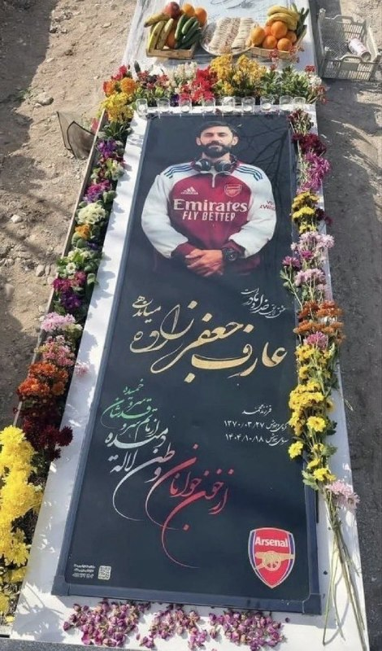

عارف‌ عزیز، آرسنال، تیم محبوبت قهرمان شد.

@Dirty_Kids 👻

## Dirty_Kids — post 389787

  

حاصل جفتگیری قالیباف و میرسلیم:

@Dirty_Kids 👻

## Hranews — post 113053

  

بر اساس آخرین داده‌های نت‌ بلاکس، قطع گسترده اینترنت در ایران وارد هشتاد و دومین روز خود شده و این کشور پس از بیش از ۱۹۴۴ ساعت، همچنان تا حد زیادی از دسترسی به اینترنت جهانی محروم است. این نهاد ناظر بر وضعیت دسترسی به #اینترنت در جهان اعلام کرد که در شرایطی که حتی اختلالات چند دقیقه‌ای در بسیاری از کشورها بحران تلقی می‌شود، تداوم این وضعیت در ایران رکوردهای بی‌سابقه‌ای را ثبت کرده است.

↘️
@hranews_bot تماس ✉️ - @Hranews کانال هرانا 🆑

## Hranews — post 113052

یک شهروند در شهرستان ری بازداشت شد؛ طرح ادعای ارتباط با اسرائیل

❗️
❗️
❗️
❗️
❗️– دادستان شهرستان ری از بازداشت یک شهروند در جنوب این شهرستان خبر داد. این مقام قضایی، مدعی همکاری اطلاعاتی فرد بازداشتی با سرویس جاسوسی اسرائیل شده است.

ادامه مطلب

↘️
@hranews_bot تماس ✉️ - @Hranews کانال هرانا 🆑

## Hranews — post 113051

پژمان جمشیدی به ۹۹ ضربه شلاق محکوم شد

❗️
❗️
❗️
❗️
❗️– وکیل مدافع پژمان جمشیدی، بازیگر سینما و تلویزیون، از صدور حکم ۹۹ ضربه #شلاق تعزیری توسط دادگاه کیفری تهران برای موکل خود خبر داد. به گفته وکیل، این رای از بابت اتهامی موسوم به «مادون زنا» صادر شده و اتهامات اصلی مطرح‌شده در این پرونده در دادگاه رد شده است.

#پژمان_جمشیدی

ادامه مطلب

↘️
@hranews_bot تماس ✉️ - @Hranews کانال هرانا 🆑

## Hranews — post 113050

  

متهم به قتل الهه حسین‌نژاد اعدام شد

❗️
❗️
❗️
❗️
❗️– مرکز رسانه قوه قضاییه از اجرای حکم #اعدام متهم به قتل الهه حسین‌نژاد، خبر داد.

#الهه_حسین‌نژاد

ادامه مطلب

↘️
@hranews_bot تماس ✉️ - @Hranews کانال هرانا 🆑

## manototv — post 105669

  

به گزارش خبرگزاری‌های داخلی، حکم اعدام بهمن فرزانه، قاتل الهه حسین‌نژاد، بامداد چهارشنبه اجرا شده است.
الهه حسین‌نژاد، زن ۲۴ ساله، خرداد سال گذشته هنگام بازگشت به خانه در تهران ناپدید شد و حدود ۱۰ روز بعد پیکر او با چندین ضربه چاقو در بیابان‌های اطراف تهران پیدا شد.
خبرگزاری میزان، وابسته به قوه قضاییه جمهوری اسلامی، اعلام کرده این حکم پس از طی مراحل قانونی و با درخواست اولیای دم اجرا شده است.

## manototv — post 105668

  

زمین‌لرزه‌ای به بزرگی ۴.۷ بامداد چهارشنبه ۳۰ اردیبهشت حوالی لافت در استان هرمزگان را لرزاند. مرکز لرزه‌نگاری کشوری عمق این زلزله را ۲۰ کیلومتر اعلام کرده است. این زمین‌لرزه در بخش‌هایی از قشم، هرمز و مناطق روستایی بندرعباس نیز احساس شد. مقام‌های محلی می‌گویند تاکنون گزارشی از خسارت دریافت نشده، اما بررسی‌ها در مناطق نزدیک به کانون زلزله ادامه دارد.

## manototv — post 105667

  <a href="telegram/content/manototv_105667_1779265927.mp4" target="_blank">🎬 Download video</a>

دونالد ترامپ، رئیس‌جمهور آمریکا، بار دیگر مدعی شد که ایالات متحده جنگ با جمهوری اسلامی را «خیلی سریع» پایان خواهد داد و تهران «به‌شدت» خواهان توافق است.
ترامپ در جریان مراسم سالانه پیک‌نیک کنگره در محوطه جنوبی کاخ سفید گفت توافق با تهران «اتفاق خواهد افتاد و سریع هم اتفاق می‌افتد».
او همچنین مدعی شد با پایان این بحران، قیمت نفت «به‌شدت کاهش خواهد یافت».
این اظهارات پس از آن مطرح می‌شود که ترامپ اوایل هفته گفته بود تهران برای رسیدن به توافق «التماس» می‌کند و او تنها یک ساعت با صدور دستور حملات تازه علیه جمهوری اسلامی فاصله داشته است.
ترامپ گفت به درخواست متحدان خلیج فارس آمریکا، حملات را متوقف کرده تا به گفته او، «مذاکرات جدی» ادامه پیدا کند. با این حال، او هشدار داد اگر جمهوری اسلامی به توافق نرسد، آمریکا برای یک «حمله کامل» آماده است.

## manototv — post 105666

  

شی جین‌پینگ، رئیس‌جمهوری چین، در دیدار با ولادیمیر پوتین در پکن خواستار توقف فوری درگیری‌ها در خاورمیانه شد و گفت پایان جنگ می‌تواند به کاهش اختلال در عرضه انرژی و زنجیره‌های تجارت جهانی کمک کند.

شی جین‌پینگ روز چهارشنبه، ۲۰ مه ۲۰۲۶، در دیدار با ولادیمیر پوتین در تالار بزرگ خلق پکن گفت وضعیت خاورمیانه در مرحله‌ای حساس میان جنگ و صلح قرار دارد و توقف درگیری‌ها «فوری‌ترین ضرورت» است. او تأکید کرد بازگشت به جنگ قابل قبول نیست و مسیر مذاکره باید در اولویت قرار گیرد. به گفته رئیس‌جمهور چین، پایان زودهنگام درگیری‌ها می‌تواند از اختلال بیشتر در عرضه انرژی و عملکرد زنجیره‌های صنعتی و تجاری جلوگیری کند.

پوتین نیز در آغاز این دیدار گفت روابط روسیه و چین به سطحی «بی‌سابقه» رسیده و از شی جین‌پینگ دعوت کرد سال آینده به روسیه سفر کند. رئیس‌جمهوری روسیه همچنین همکاری دو کشور را عاملی برای «بازدارندگی و ثبات» در روابط بین‌الملل توصیف کرد.

بر اساس گزارش‌ها، دو طرف در این دیدار درباره انرژی، امنیت و روابط کلی مسکو و پکن گفت‌وگو کردند و با تمدید پیمان دوستی چین و روسیه موافقت کردند؛ پیمانی که نخستین‌ب

## manototv — post 105665

  

جی‌دی ونس، معاون رئیس‌جمهور آمریکا، گفت واشینگتن در برابر جنگ با ایران دو مسیر پیش رو دارد: ادامه مذاکره یا ازسرگیری عملیات نظامی.

جی‌دی ونس در نشست خبری کاخ سفید گفت آمریکا در برابر ایران «دو مسیر» دارد.

به گفته ونس، مسیر اول مذاکره است. او گفت دونالد ترامپ از تیم خود خواسته با جمهوری اسلامی «تهاجمی» مذاکره کنند.

ونس گفت آمریکا در موضوع اصلی، یعنی جلوگیری از دستیابی ایران به سلاح هسته‌ای، پیشرفت زیادی داشته و واشینگتن فکر می‌کند تهران خواهان توافق است.

او مسیر دوم را ازسرگیری عملیات نظامی دانست و گفت: «گزینه دوم این است که کارزار نظامی را دوباره شروع کنیم تا اهداف آمریکا دنبال شود.»

ونس گفت این مسیر چیزی نیست که ترامپ بخواهد و فکر نمی‌کند جمهوری اسلامی هم خواهان آن باشد.

او در پایان گفت: «برای توافق، دو طرف لازم است.»

## manototv — post 105664

  <a href="telegram/content/manototv_105664_1779265928.mp4" target="_blank">🎬 Download video</a>

«سکوت ما همدستی با جمهوری اسلامی است»

## alonews — post 121240

  <a href="telegram/content/alonews_121240_1779265929.mp4" target="_blank">🎬 Download video</a>

👈شی جین‌پینگ: رئیس‌جمهور پوتین قبلاً برای بیست و پنجمین بار به چین سفر کرده است

🔴این به خودی خود نشان‌دهنده سطح بالا و ماهیت خاص روابط چین و روسیه است.

✅ @AloNews خبر جنگ

## alonews — post 121239

  <a href="telegram/content/alonews_121239_1779265931.mp4" target="_blank">🎬 Download video</a>

👈تصاویری از لحظه وقوع انفجار روز گذشته در دمشق

✅ @AloNews خبر جنگ

## alonews — post 121238

  <a href="telegram/content/alonews_121238_1779265932.webm" target="_blank">🎬 Download video</a>

👈بیانیه مشترک چین و روسیه:
ما از طرف‌های درگیر در خاورمیانه می‌خواهیم که وارد مذاکره شوند.

🔴هیچ کشوری یا مردمی درجه یک نیست و سلطه به هر شکلی غیرقابل قبول است

✅ @AloNews خبر جنگ

## alonews — post 121237

  <a href="telegram/content/alonews_121237_1779265932.webm" target="_blank">🎬 Download video</a>

👈 دو نفتکش چینی پس از دو ماه معطلی در خلیج فارس، روز چهارشنبه از تنگه هرمز عبور کردند.

✅ @AloNews خبر جنگ

## alonews — post 121236

  <a href="telegram/content/alonews_121236_1779265932.webm" target="_blank">🎬 Download video</a>

👈کشت خشخاش ممنوع شد

✅ @AloNews خبر جنگ

## alonews — post 121235

  <a href="telegram/content/alonews_121235_1779265932.webm" target="_blank">🎬 Download video</a>

👈پژمان جمشیدی از اتهام آدم ربایی و تجاوز به عنف تبرئه شده و به دلیل رابطه نامشروع به ۹۹ ضربه شلاق محکوم شده

✅ @AloNews خبر جنگ

## alonews — post 121234

  <a href="telegram/content/alonews_121234_1779265932.webm" target="_blank">🎬 Download video</a>

👈علی قلهکی، فعال رسانه‌ای: چین دیگر تمایلی به حفظ وضعیت فعلی تنگه هرمز توسط ایران ندارد و بنظر می‌رسد به زودی در بحث تنگه هرمز رودروی ایران قرار گیرد؛ آنها معتقدند ایران باید زودتر تنگه را «تعیین تکلیف» کند.

✅ @AloNews خبر جنگ

## alonews — post 121233

  <a href="telegram/content/alonews_121233_1779265933.webm" target="_blank">🎬 Download video</a>

👈گویا بخشی از اموال توقیف شده علی کریمی بدون مزایده به یک شخص دیگه واگذار شده!!!!

✅ @AloNews خبر جنگ

## alonews — post 121232

  <a href="telegram/content/alonews_121232_1779265933.webm" target="_blank">🎬 Download video</a>

👈وزارت خارجه روسیه: ایران از «پیمان منع گسترش سلاح‌های هسته‌ای» (ان‌پی‌تی) خارج نخواهد شد

✅ @AloNews خبر جنگ

## alonews — post 121231

  <a href="telegram/content/alonews_121231_1779265933.webm" target="_blank">🎬 Download video</a>

👈الجزیره: پوتین در پکن همان استقبالی که از ترامپ شد را دریافت کرد

🔴 تنها تفاوت در این بود که چه کسی در فرودگاه از او استقبال کرد؛ این فرد در مورد ترامپ، معاون رئیس‌جمهور بود و برای پوتین، وزیر امور خارجه

✅ @AloNews خبر جنگ

## alonews — post 121230

  <a href="telegram/content/alonews_121230_1779265933.webm" target="_blank">🎬 Download video</a>

👈شبکه ۱۲ اسرائیل :
- اسرائیل و آمریکا برنامه ریزی کردن احمدی‌نژاد رو به‌عنوان رهبر ایران سر کار بیارن

✅ @AloNews خبر جنگ

## alonews — post 121229

  <a href="telegram/content/alonews_121229_1779265933.webm" target="_blank">🎬 Download video</a>

👈سپاه پاسداران: با تکرار تجاوز دشمن، جنگ را فرامنطقه‌ای می‌کنیم

✅ @AloNews خبر جنگ

## alonews — post 121228

  <a href="telegram/content/alonews_121228_1779265933.webm" target="_blank">🎬 Download video</a>

👈پل مرقص، وزیر اطلاع‌رسانی لبنان در مصاحبه با «العربیه» گفت: «رئیس‌جمهور لبنان خواهان تثبیت آتش‌بس جهت موفقیت روند مذاکرات است.»

🔴او افزود لبنان با هدف دستیابی به حقوق حاکمیتی خود با ایالات متحده آمریکا همکاری می‌کند.
این وزیر لبنانی در ادامه گفت نبیه بری، رئیس پارلمان لبنان، «لحظه‌به‌لحظه» در جریان مذاکرات با اسرائیل طی دو روز گذشته قرار داشته است.

🔴مرقص افزود مذاکرات با اسرائیل با هماهنگی قانونی رئیس‌جمهور و نخست‌وزیر انجام می‌شود.

✅ @AloNews خبر جنگ

## alonews — post 121227

  <a href="telegram/content/alonews_121227_1779265933.webm" target="_blank">🎬 Download video</a>

👈رادار کلادفلر خبر از افزایش ترافیک‌ اینترنت ایران می‌دهد

✅ @AloNews خبر جنگ

## alonews — post 121226

  <a href="telegram/content/alonews_121226_1779265934.webm" target="_blank">🎬 Download video</a>

👈بدون شرح

✅ @AloNews خبر جنگ

## alonews — post 121225

  <a href="telegram/content/alonews_121225_1779265934.webm" target="_blank">🎬 Download video</a>

👈 میانجی‌های منطقه‌ای و مقامات آمریکایی به WSJ می‌گویند: موضع ایران در مذاکرات با آمریکا عمدتاً بدون تغییر نسبت به پیشنهادات قبلی باقی مانده است.

🔴ایران همچنان خواستار پایان خصومت‌ها، تسهیلات مالی، غرامت برای خسارات جنگ و نقشی در نظارت بر تنگه هرمز است، در حالی که با خواسته‌های آمریکا برای تعطیلی یا تعلیق بلندمدت برنامه هسته‌ای خود در تضاد باقی مانده است.

✅ @AloNews خبر جنگ

## alonews — post 121223

  <a href="telegram/content/alonews_121223_1779265934.webm" target="_blank">🎬 Download video</a>

👈مهر: قیمت خودرو روی کاغذ کاهش یافته، اما بازار همچنان آرام نشده و انتقادها از مدیریت فروش و عدم تناسب زیرساخت‌ها با تقاضای میلیونی ادامه دارد

✅ @AloNews خبر جنگ

## alonews — post 121222

  <a href="telegram/content/alonews_121222_1779265934.webm" target="_blank">🎬 Download video</a>

👈رادار کلادفلر خبر از افزایش ترافیک‌ اینترنت ایران می‌دهد؛ شروعی برای موج قوی تر فیلترینگ؟

✅ @AloNews خبر جنگ

## alonews — post 121221

  <a href="telegram/content/alonews_121221_1779265934.webm" target="_blank">🎬 Download video</a>

👈قوه قضاییه: کشت هرگونه گیاهان مخدر از جمله خشخاش مطلقاً ممنوع و جرم است و مرتکبان به مجازات قانونی محکوم می‌شوند.

✅ @AloNews خبر جنگ

## alonews — post 121220

  <a href="telegram/content/alonews_121220_1779265934.webm" target="_blank">🎬 Download video</a>

👈هند با هماهنگی ایران و آمریکا از خاورمیانه نفت می‌خواهد!

🔴بلومبرگ: هند برای اولین بار از آغاز جنگ علیه ایران، آماده اعزام نفتکش‌ها به تنگه هرمز و بارگیری نفت و LNG از خاورمیانه است.

🔴این اقدام با هدف کاهش بحران انرژی و کمبود سوخت انجام می‌شود، اما با هماهنگی دیپلماتیک با ایران و آمریکا همراه است

✅ @AloNews خبر جنگ

---
📅 بروزرسانی: 1405/02/30 08:20
---

## VahidOOnLine — post 241081

♦️شی جین‌پینگ، رئیس‌جمهوری چین روز چهارشنبه ۳۰ اردیبهشت و کمتر از یک هفته پس از دیدار با دونالد ترامپ، از ولادیمیر پوتین رئیس جمهوری روسیه استقبال کرد.
روسیه در قرن گذشته ابرقدرتی بود که برای مدت‌ها چین را در سایه خود قرار داده بود. روندی که به نظر می‌رسد هم‌اکنون با سرعت در حال تغییر است.
‌🇸🇦 Indypersian

🤖 @VahidOOnLine

## VahidOOnLine — post 241080

  

روسای جمهوری چین و روسیه در پکن دیدار کردند. شی جین‌پینگ در این دیدار با تاکید بر لزوم مذاکره برای رسیدگی به وضعیت خاورمیانه، خواستار توقف درگیری‌ها شد. او گفت پایان دادن به جنگ به کاهش اختلال در ثبات عرضه انرژی و نظم تجارت بین‌المللی کمک خواهد کرد.
دو طرف در این دیدار پیمان دوستی و همکاری چین و روسیه را تمدید کردند.
پوتین به شی گفت روابط میان روسیه و چین به سطحی بی‌سابقه رسیده است و از او دعوت کرد سال آینده به روسیه سفر کند.

‌🏁 🇬🇧 IranintlTV

🤖 @VahidOOnLine

## VahidOOnLine — post 241079

  

مایک والتز، سفیر آمریکا در سازمان ملل متحد در پستی در ایکس با اشاره به اینکه پول حکومت ایران رو به اتمام است و اقتصادش در حال فروپاشی است، گفت با این حال جمهوری اسلامی به جای تغییر رویه، مشغول اقدام‌های غیرقابل تحملی همچون حملات به زیرساخت‌های غیرنظامی است.
او گفت: «اما نیروهای نظامی جمهوری اسلامی به جای اتخاذ رویکردی جدید و مسالمت‌آمیز، درگیر حملات مکرر و بی‌ملاحظه، به زیرساخت‌های برق غیرنظامی، شده و به استراتژی سلاح‌های هسته‌ای پناه برده‌اند که خطر فرو بردن جهان در تاریکی را به همراه دارد.»
او افزود:«ما نمی‌توانیم این را تحمل کنیم و آن را تحمل نخواهیم کرد.»
والتز گفت: «رییس‌جمهوری ترامپ و ایالات متحده بارها و بارها در این درگیری مورد تردید قرار گرفته‌اند، اما به نظر من این بار دیگر روشن شده که رییس‌جمهوری در حال انجام اقداماتی است که برای تضمین آینده‌ای امن‌تر برای جهان ضروری است.»
سفیر آمریکا در سازمان ملل متحد افزود: «آنچه باید بر آن تمرکز کنیم، حکومتی است که به‌تازگی به یک نیروگاه هسته‌ای در یک کشور همسایه حمله کرده است.»

‌🏁 🇬🇧 IranintlTV

🤖 @VahidOOnLine

## VahidOOnLine — post 241078

  

♦️به گزارش فایننشال تایمز، ایران ناچار شده نفت خود را روی نفتکش‌های فرسوده‌ای که در خلیج فارس لنگر انداخته‌اند ذخیره کند، زیرا محاصره آمریکا به‌طور شدید توان صادرات نفت خام را محدود کرده است.
این نشریه با استناد به داده‌های سازمان «اتحاد علیه ایران هسته‌ای» گزارش داد که در حال حاضر حدود ۳۹ نفتکش حامل نفت و محصولات پتروشیمی ایران در خلیج فارس مستقر هستند؛ در حالی که پیش از اجرایی شدن این محاصره در ۱۳ آوریل، این رقم ۲۹ کشتی بود. تعداد زیادی از این کشتی‌ها در نزدیکی پایانه صادرات نفت ایران در جزیره خارگ تجمع کرده‌اند.
فایننشال تایمز همچنین ۱۳ نفتکش مشکوک دیگر را در نزدیکی بندر چابهار در خلیج عمان شناسایی کرده که در شرق تنگه هرمز قرار دارد و عملا در امتداد خط محاصره دریایی آمریکا واقع شده‌اند.
پیش از حملات آمریکا و اسرائیل، ایران ماهانه بین ۴۰ تا ۶۰ میلیون بشکه نفت صادر می‌کرد؛ حدود ۲ درصد از عرضه جهانی.
‌🇸🇦 Indypersian

🤖 @VahidOOnLine

## VahidOOnLine — post 241077

  <a href="telegram/content/VahidOOnLine_241077_1779252658.mp4" target="_blank">🎬 Download video</a>

♦️دو ماه و نیم پس از معرفی مجتبی خامنه‌ای به عنوان سومین رهبر نظام و در حالی که هنوز هیچ صدا و تصویر جدیدی از او منتشر نشده و رسانه‌های حکومتی با استفاده از هوش مصنوعی به تولید محتوا درباره او مشغولند، صداوسیما از «مشت گره کرده» منسوب به مجتبی خامنه‌ای رونمایی کرد. در دو ماه اخیر روایت‌های متعددی درباره وضعیت مجتبی خامنه‌ای که در روز نخست عملیات نظامی آمریکا و اسرائیل همراه با پدرش در مجموعه «بیت رهبری» هدف گرفته شده، منتشر شده است. در حالی که علی خامنه‌ای، رهبر سابق نیز هنوز دفن نشده، برخی منابع حکومتی ادعا کرده‌اند که پسرش زنده و سالم است اما برای اینکه مکان اختفای او شناسایی نشود، در انظار عمومی ظاهر نمی‌شود. به تدریج روایت‌هایی که بر سالم بودن او تاکید داشتند جای خود را به اینکه او مجروح شده تغییر پیدا کرد و بعد میزان و نوع جراحت موضوع روایت‌های متناقض شد. برآوردهای آمریکا و اسرائیل نیز در آغاز به احتمال مرگ یا در کما بودن او اشاره داشت و بعدا در بیشتر گزارش‌ها تاکید شد که مجتبی خامنه‌ای به شدت مجروح شده است. در این مدت، بیانیه‌‌هایی نوشتاری منسوب به او در صداوسیما قرائت شده است.
‌🇸🇦 Indypersian

🤖 @VahidOOnLine

## VahidOOnLine — post 241076

  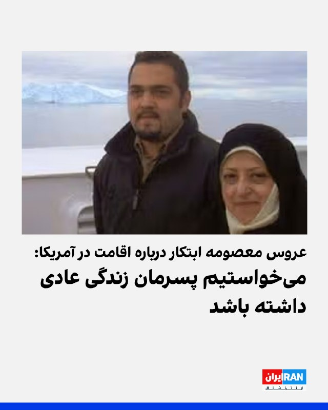

مریم طهماسبی، عروس معصومه ابتکار، گروگان‌گیر سفارت آمریکا در ایران و معاون پیشین رییس‌جمهور، در مصاحبه تلفنی با آسوشیتدپرس از یک بازداشتگاه مهاجرتی در تگزاس درباره علت اقامتشان در آمریکا گفت: «تنها چیزی که می‌خواستیم این بود که پسرمان زندگی عادی داشته باشد.»
او افزود: «من و همسرم، عیسی هاشمی، می‌خواهیم در حالی که پسرمان به دبیرستان بازمی‌گردد، تدریس را از سر بگیریم.»
طهماسبی گفت: «ما هرگز فکر نمی‌کردیم که دستگیر شویم. خانواده ما از طبقه متوسط است و هیچ ارتباطی با پول یا قدرت ندارد.»
عروس معصومه ابتکار خاطرنشان کرد: «فرض ما این بود که تا زمانی که از همه قوانین و مقررات پیروی کنیم، در امان خواهیم بود.»
به گزارش آسوشیتدپرس، این خانواده که یک دهه است در ایالات متحده زندگی می‌کنند، پس از دستگیری به دلیل ارتباط‌‌شان با معصومه ابتکار، خواستار آزادی خود از بازداشتگاه مهاجرتی شده‌اند.
یک قاضی فدرال پس از آن‌که این خانواده دادخواست‌هایی را علیه قانونی بودن بازداشت خود ارائه کرد، دولت را به طور موقت از اخراج آنها منع کرد. آنها از زمان دستگیری در اوایل آوریل در لس‌آنجلس، در مرکز مهاجرتی در ایالت تگزاس نگهداری می‌شوند.
‌🏁 🇬🇧 IranintlTV

🤖 @VahidOOnLine

## VahidOOnLine — post 241075

  <a href="telegram/content/VahidOOnLine_241075_1779252661.mp4" target="_blank">🎬 Download video</a>

♦️چارلز سوم، پادشاه بریتانیا، به همراه ملکه کامیلا در آغاز سفر سالانه خود به ایرلند شمالی، در رویدادی فرهنگی در «تامپسون داک» بلفاست شرکت کردند.
در این برنامه، آن‌ها در فضایی پرنشاط با موسیقی زنده و نمایش‌های فرهنگی ایرلندی همراه شدند؛ رویدادی که در آستانه برگزاری جشنواره موسیقی سنتی ایرلندی «Fleadh Cheoil» برگزار شد بزرگ‌ترین جشن سالانه موسیقی سنتی ایرلندی که امسال برای نخستین‌بار میزبانش شهر بلفاست خواهد بود.
پادشاه و ملکه همچنین از دستگاه‌های تقطیر تایتانیک «Titanic Distillers» بازدید کردند؛ جایی تاریخی که در ساختمان بازسازی‌شده‌ای قرار دارد که زمانی در ساخت کشتی تایتانیک نقش داشته و امروز به تولید ویسکی اختصاص یافته است.
‌🇸🇦 Indypersian

🤖 @VahidOOnLine

## VahidOOnLine — post 241074

  

سنای آمریکا با پیشبرد طرح محدود کردن اختیارات جنگی ترامپ در جنگ علیه جمهوری اسلامی موافقت کرد. اقدامات سنا در این زمینه تا کنون به تصویب نرسیده‌اند.

کوری بوکر، سناتور دموکرات، گفت: «باید همچنان به صحبت کردن ادامه دهیم تا سنا سرانجام برای پایان دادن به این جنگ اقدام کند.»
‌🏁 🇬🇧 IranintlTV

🤖 @VahidOOnLine

## VahidOOnLine — post 241073

  <a href="telegram/content/VahidOOnLine_241073_1779252663.mp4" target="_blank">🎬 Download video</a>

‌
خبرگزاری فرانسه گزارش داد شرکت هواپیماسازی ایرباس به دلیل پیامدهای جنگ آمریکا و اسرائیل با جمهوری اسلامی، از تیم‌های خود خواسته هزینه‌های «غیرضروری» را ۱۰ درصد کاهش دهند.

بر اساس سندی که خبرگزاری فرانسه مشاهده کرده، ایرباس اعلام کرده هدف این شرکت «توقف قابل توجه فعالیت‌ها و هزینه‌هایی است که برای عملیات و فعالیت‌های صنعتی کاملاً ضروری نیستند.»

در این یادداشت از کارکنان خواسته شده از ایجاد هزینه‌های جدید یا واگذاری فعالیت‌های غیرضروری به پیمانکاران خودداری کنند.

ایرباس همچنین بر کاهش هزینه‌هایی مانند رویدادهای داخلی، برنامه‌های تیمی، همایش‌ها و مشارکت در کنفرانس‌ها تاکید کرده است.
‌🏁 🇬🇧 ManotoTV

🤖 @VahidOOnLine

## VahidOOnLine — post 241072

  

♦️زمین‌لرزه‌ای به بزرگی ۴.۷ حوالی ساعت ۳:۱۲ بامداد چهارشنبه ۳۰ اردیبهشت، بندر لافت در استان هرمزگان را لرزاند.
این زمین‌لرزه علاوه بر لافت، در جزایر قشم و هرمز و همچنین برخی مناطق روستایی بندرعباس نیز احساس شده است. تاکنون گزارشی از خسارات احتمالی این زمین‌لرزه منتشر نشده است.
‌🇸🇦 Indypersian

🤖 @VahidOOnLine

## VahidOOnLine — post 241070

  

♦️نیویورک‌تایمز در گزارشی به نقل از منابع ناشناس که آنها را مقامات آمریکایی عنوان کرده، مدعی شد که هدف اولیه جنگ، «تلاش برای به رهبری رساندن محمود احمدی‌نژاد»، رئیس‌جمهوری اسبق ایران بوده است. در این گزارش، ادعا شده که در زمینه این طرح «با محمود احمدی‌نژاد مشورت شده بود» اما در نهایت این طرح به مشکل خورد. نیویورک‌تایمز ادعا کرده که محمود احمدی‌نژاد در جریان حمله روز نخست اسرائیل به خانه‌اش در تهران که هدف آن آزاد کردن او از آنچه «حصر خانگی» خوانده شده، بود زخمی شد. این درحالی است که منابع ایندیپندنت فارسی در همان روز خبر دادند که احمدی‌نژاد اندکی قبل از حمله از محل خارج شده بود. این منابع همچنین «حصر خانگی» رئیس‌جمهوری اسبق را نیز تکذیب کرده‌اند. نیویورک‌تایمز در ادامه به اختلافات احمدی‌نژاد و حاکمیت در سال‌های اخیر،  رد صلاحیت‌های او در انتخابات و محدودیت‌هایی برای حضور عمومی و رفت‌و‌آمد‌ها اشاره می‌کند و می‌نویسد که احمدی‌نژاد پس از این حمله روز نخست جنگ دیگر دیده نشده است.
‌🇸🇦 Indypersian

🤖 @VahidOOnLine

## VahidOOnLine — post 241068

  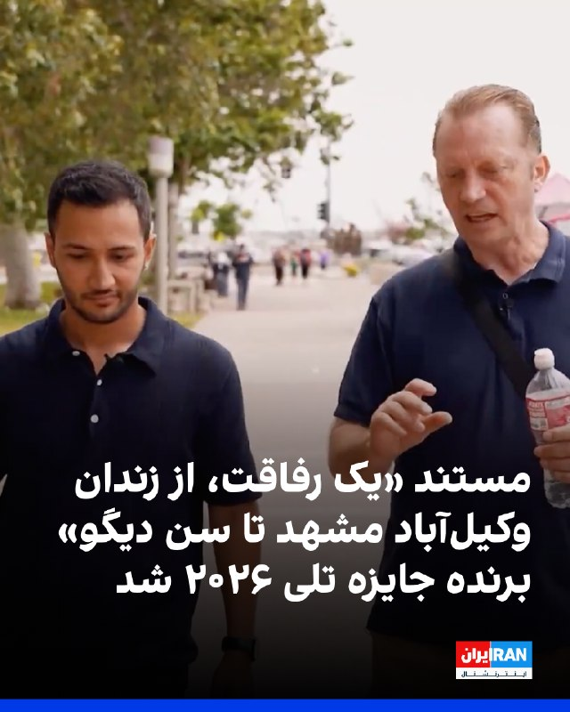

مستند «یک رفاقت از زندان وکیل‌آباد مشهد تا سن‌ دیگو» تهیه شده از سوی شبکه ایران‌اینترنشنال به کارگردانی اردوان روزبه، در بخش مستند و تحلیل سیاسی تلویزیونی برنده جایزه تلی سال ۲۰۲۶ شد.
جایزه تلی یک رقابت بین‌المللی در حوزه تولیدات ویدیویی، تلویزیونی، تبلیغات و محتوای دیجیتال است که از سال ۱۹۷۹ میلادی برگزار می‌شود و داورانی از شرکت‌هایی بزرگ مثل نتفلیکس و اچ.بی.او، هزاران اثر ارسالی را بررسی می‌کنند.
مستند «یک رفاقت: از زندان وکیل‌آباد مشهد تا سن‌ دیگو» امسال در رقابت با ۱۳ هزار اثر از از سراسر جهان برنده جایزه شد.
این مستند روایتگر داستان واقعی و غیرمنتظره دوستی میان مایکل وایت، کهنه‌سرباز آمریکایی، و مهدی وطن‌خواه، فعال سیاسی ایرانی است؛ دو زندانی که در بند عمومی زندان وکیل‌آباد مشهد با یکدیگر آشنا شدند.
مایکل وایت در سال ۲۰۱۸ پس از سفر به ایران بازداشت شد و در بازداشتگاه‌های امنیتی جمهوری اسلامی تحت بازجویی‌های سنگین، شکنجه روانی و فشار برای اعتراف اجباری قرار گرفت. او بعدها روایت کرد که بازجویان تلاش داشتند او را وادار کنند اعتراف کند برای آمریکا و اسرائیل جاسوسی می‌کرده است.

‌🏁 🇬🇧 IranintlTV

🤖 @VahidOOnLine

## VahidOOnLine — post 241067

  <a href="telegram/content/VahidOOnLine_241067_1779252665.mp4" target="_blank">🎬 Download video</a>

♦️دونالد ترامپ، رئیس‌جمهوری آمریکا روز سه‌شنبه در  سخنرانی برای قانونگذاران آمریکایی در کاخ سفید گفت: «ما به جنگ ایران خیلی سریع پایان می‌دهیم، آنها به شدت خواستار توافق هستند و خسته شده‌اند.» رئیس‌جمهوری آمریکا پیش‌بینی کرد که توافق با رزیم ایران سریع اتفاق می‌افتد و در نتیجه آن بهای نفت سقوط می‌کند.
‌🇸🇦 Indypersian

🤖 @VahidOOnLine

## FoxNewsTwitter — post 341976

  <a href="telegram/content/FoxNewsTwitter_341976_1779252666.mp4" target="_blank">🎬 Download video</a>

Fox News (Twitter/X)

Newly released NTSB footage shows the terrifying moment a UPS cargo plane lost an engine seconds after takeoff in Louisville, Kentucky.

The surveillance video captures the aircraft’s left engine and pylon separating from the wing shortly after the plane lifted off the runway.

The November 4, 2025, crash killed 14 people and remains under intense federal investigation as officials work to determine what caused the catastrophic failure.

## FoxNewsTwitter — post 341975

  

Fox News (Twitter/X)

A major Trump ally is now one step away from Alabama’s governor’s mansion.

Sen. Tommy Tuberville rolled through the Republican primary after months of campaigning as a close ally of President Trump and a fighter against the Washington establishment.

The race drew national attention as another early test of Trump’s strength with Republican voters — and Alabama Republicans delivered Tuberville a commanding victory.

Now the longtime senator heads into the general election with the GOP favored to hold the seat.

## FoxNewsTwitter — post 341974

  <a href="telegram/content/FoxNewsTwitter_341974_1779252668.mp4" target="_blank">🎬 Download video</a>

Fox News (Twitter/X)

“Bi means you like both.”

Rep. Thomas Massie cracks jokes after losing his primary race to Trump-endorsed former Navy SEAL Ed Gallrein, saying he may be “trans-partisan” because he doesn’t fully identify with either political side anymore.

The Kentucky congressman spent years carving out a reputation as one of the most independent Republicans in Washington — often frustrating both party leadership and President Trump.

But after a brutal Trump-backed challenge, Massie’s streak in Congress has now come to an end.

## FoxNewsTwitter — post 341973

  <a href="telegram/content/FoxNewsTwitter_341973_1779252670.mp4" target="_blank">🎬 Download video</a>

Fox News (Twitter/X)

"They tried to buy my vote. They couldn't buy it."

Rep. Thomas Massie delivers a fiery speech after losing his reelection bid, accusing powerful forces in Washington of trying for years to take him down.

Massie, who became a regular target of attacks from President Trump, said they "decided to buy the seat" after they couldn't buy his vote.

## FoxNewsTwitter — post 341972

  <a href="telegram/content/FoxNewsTwitter_341972_1779252672.mp4" target="_blank">🎬 Download video</a>

Fox News (Twitter/X)

"I would like to know how many more Americans we have to ask to die for this mistake."

That question from Rep. Seth Moulton sparked a fiery clash with CENTCOM Commander Admiral Brad Cooper during a tense hearing on Iran and U.S. military operations in the Middle East.

Cooper slammed Moulton's remark as "entirely inappropriate as the exchange escalated in front of lawmakers.

## pm_afshaa — post 91082

  <a href="telegram/content/pm_afshaa_91082_1779252674.webm" target="_blank">🎬 Download video</a>

🔴افشاگری عجیب نیویورک تایمز:
آمریکا و اسرائیل قبل از جنگ با ایران، طرحی رو برای نصب محمود احمدی‌نژاد به عنوان رهبر جدید کشور مورد بحث قرار دادن.

احمدی‌نژاد گزارشاً در مورد این طرح مشورت شده بود، اما پس از اینکه در حمله‌ای اسرائیل به خانه‌اش در تهران در روز آغازین جنگ مجروح شد، این طرح از هم پاشید. مقامات آمریکایی گفتن که این حمله با هدف آزاد کردن او از بازداشت خانگی انجام شده بود.

برنامه‌ریزان اسرائیلی ظاهراً پیش از درگیری با احمدی‌نژاد مشورت و توافق کرده و تلاش کردن اونو از حصر خانگی اجباری با حمله‌ای‌ اسرائیلی که نگهبانان خارج از اقامتگاهش در تهران رو هدف قرار داد، در روز اول جنگ آزاد کنن.

احمدی‌نژاد زنده موند اما به‌شدت زخمی شد و پس از آن ناامید از تلاش برای تغییر رژیم شد و از آن زمان به بعد به صورت عمومی دیده نشده و محل اقامت او نامشخصه.

💧 Rainbet.com the #1 Non-KYC Crypto Casino & Sportsbook @rainbetcom

😁 @Pm_Afshaa

## VahidOnline — post 75566

  <a href="telegram/content/VahidOnline_75566_1779252675.mp4" target="_blank">🎬 Download video</a>

پوتین هم به خدمت شی رسید.
J74wabx

📡 @VahidOnline

## VahidOnline — post 75565

  

ترجمه ماشین
تیتر نیویورک‌تایمز: هدف اولیه جنگ، روی کار آوردن رئیس‌جمهور تندروی پیشین به عنوان رهبر ایران بود

بخش‌های خبری مطلب:
به گفته مقامات آمریکایی، حمله اسرائیل که با هدف آزادی محمود احمدی‌نژاد از حبس خانگی در تهران طراحی شده بود، بخشی از تلاش‌ها برای تغییر رژیم و به قدرت رساندن او بود.

چند روز پس از آنکه حملات اسرائیل در آغازین روزهای جنگ، رهبر ایران و سایر مقامات ارشد را به قتل رساند، پرزیدنت ترامپ علناً اظهار داشت که بهتر است «شخصی از درون» ایران کنترل کشور را به دست بگیرد.
اکنون مشخص شده است که ایالات متحده و اسرائیل با در نظر داشتن شخصیتی خاص و بسیار غافلگیرکننده وارد این درگیری شدند: محمود احمدی‌نژاد، رئیس‌جمهور پیشین ایران که به دلیل دیدگاه‌های تندرو، ضداسرائیلی و ضدآمریکایی‌اش شناخته می‌شود.

اما بر اساس گفته‌های مقامات آمریکاییِ مطلع از این موضوع، این طرح جسورانه که توسط اسرائیلی‌ها تدوین شده بود و با آقای احمدی‌نژاد نیز درباره آن مشورت شده بود، به سرعت با شکست مواجه شد.

مقامات آمریکایی و یکی از نزدیکان آقای احمدی‌نژاد اعلام کردند که او در روز اول جنگ بر اثر حمله اسرائیل به خانه‌اش در تهران - که برای رهایی او از حصر خانگی طراحی شده بود - مجروح شد. آن‌ها گفتند که او از این حمله جان سالم به در برد، اما پس از این خطر جانی، نسبت به طرح تغییر رژیم دلسرد و ناامید شد.

او از آن زمان تاکنون در انظار عمومی دیده نشده است و مکان و وضعیت فعلی او نامشخص است.
...
اینکه آقای احمدی‌نژاد چگونه برای مشارکت در این طرح به کار گرفته شد، هنوز در هاله‌ای از ابهام قرار دارد.
...
سخنگوی موساد، سازمان اطلاعات خارجی اسرائیل، از اظهارنظر در این باره خودداری کرد.
...
مقامات آمریکایی گفتند که این حمله - که توسط نیروی هوایی اسرائیل انجام شد - به منظور کشتن نگهبانان مراقب آقای احمدی‌نژاد و به عنوان بخشی از طرحی برای رهایی او از حبس خانگی صورت گرفت.
این حمله آسیب چندانی به خانه آقای احمدی‌نژاد که در انتهای یک کوچه بن‌بست قرار داشت، وارد نکرد. اما پاسگاه امنیتی در ورودی کوچه مورد اصابت قرار گرفت. تصاویر ماهواره‌ای نشان می‌دهد که آن ساختمان ویران شده است.

در روزهای پس از آن، خبرگزاری‌های رسمی روشن کردند که او جان سالم به در برده است، اما «محافظان» او - که در واقع اعضای سپاه پاسداران انقلاب اسلامی بودند و همزمان وظیفه محافظت و نگهداری او در حبس خانگی را بر عهده داشتند - کشته شده‌اند.

مقاله‌ای در نشریه آتلانتیک در ماه مارس، با استناد به منابع ناشناس نزدیک به آقای احمدی‌نژاد، نوشت که رئیس‌جمهور پیشین پس از حمله به خانه‌اش از حصر دولتی آزاد شده است؛ این مقاله آن رویداد را «در عمل یک عملیات فرار از زندان» توصیف کرد.

پس از انتشار آن مقاله، یکی از نزدیکان آقای احمدی‌نژاد در گفتگو با نیویورک تایمز تأیید کرد که آقای احمدی‌نژاد این حمله را به عنوان تلاشی برای آزادی خود تلقی کرده است. این فرد مطلع گفت که آمریکایی‌ها آقای احمدی‌نژاد را شخصی می‌دانستند که می‌تواند ایران را رهبری کند و توانایی مدیریت «وضعیت سیاسی، اجتماعی و نظامی ایران» را دارد.
این فرد مطلع اظهار داشت که آقای احمدی‌نژاد می‌توانست در آینده نزدیک «نقش بسیار مهمی» در ایران ایفا کند و اشاره کرد که ایالات متحده او را شبیه به دلسی رودریگز می‌دید؛ کسی که پس از دستگیری آقای مادورو توسط نیروهای آمریکایی در ونزوئلا قدرت را به دست گرفت و از آن زمان همکاری نزدیکی با دولت ترامپ داشته است.
...

در چند سال گذشته آقای احمدی‌نژاد سفرهایی به خارج از ایران داشته است که به گمانه‌زنی‌ها دامن زده است.
به گزارش مجله نیولاینز، او در سال ۲۰۲۳ به گواتمالا و در سال‌های ۲۰۲۴ و ۲۰۲۵ به مجارستان سفر کرد. هر دو کشور روابط نزدیکی با اسرائیل دارند.
ویکتور اوربان، نخست‌وزیر مجارستان در آن زمان، روابط نزدیکی با آقای نتانیاهو دارد. در طول این سفرها به مجارستان، آقای احمدی‌نژاد در دانشگاهی مرتبط با آقای اوربان سخنرانی کرد.

او تنها چند روز قبل از آغاز حملات اسرائیل به ایران در ژوئن گذشته از بوداپست بازگشت. زمانی که آن جنگ درگرفت، او حضور علنی کمرنگی داشت و تنها چند بیانیه در شبکه‌های اجتماعی منتشر کرد. سکوت نسبی او در مورد جنگ با کشوری که آقای احمدی‌نژاد مدت‌ها آن را دشمن اصلی ایران می‌دانست، مورد توجه بسیاری در شبکه‌های اجتماعی ایران قرار گرفت.
...
nytimes

📡 @VahidOnline

## IranIntlTV — post 338026

  

شورای هماهنگی تشکل‌های صنفی فرهنگیان ایران آموزش نظامی به کودکان در برخی مساجد و پایگاه‌های بسیج در ایران را نقض آشکار کنوانسیون حقوق کودک دانست و هشدار داد این روند نگرانی‌های جدی در حوزه حقوق کودک ایجاد کرده است.
این شورا افزود: بر اساس استانداردهای بین‌المللی، مشارکت یا آماده‌سازی افراد زیر ۱۸ سال برای فعالیت‌های نظامی می‌تواند در تعارض با اصل «منافع عالی کودک» تلقی شود.
شورای هماهنگی تشکل‌های صنفی فرهنگیان هشدار داد تداوم این نوع برنامه‌ها، می‌تواند مصداقی از نظامی‌سازی فضای کودکی و نقض تعهدات بین‌المللی در حوزه حقوق کودک باشد و نیازمند بررسی مستقل و شفاف از سوی نهادهای مسئول و بین‌المللی است.

https://iranintl.com/202605201370

## IranIntlTV — post 338025

  

روسای جمهوری چین و روسیه در پکن دیدار کردند. شی جین‌پینگ در این دیدار با تاکید بر لزوم مذاکره برای رسیدگی به وضعیت خاورمیانه، خواستار توقف درگیری‌ها شد. او گفت پایان دادن به جنگ به کاهش اختلال در ثبات عرضه انرژی و نظم تجارت بین‌المللی کمک خواهد کرد.
دو طرف در این دیدار پیمان دوستی و همکاری چین و روسیه را تمدید کردند.
پوتین به شی گفت روابط میان روسیه و چین به سطحی بی‌سابقه رسیده است و از او دعوت کرد سال آینده به روسیه سفر کند.

https://iranintl.com/202605201022

## IranIntlTV — post 338024

  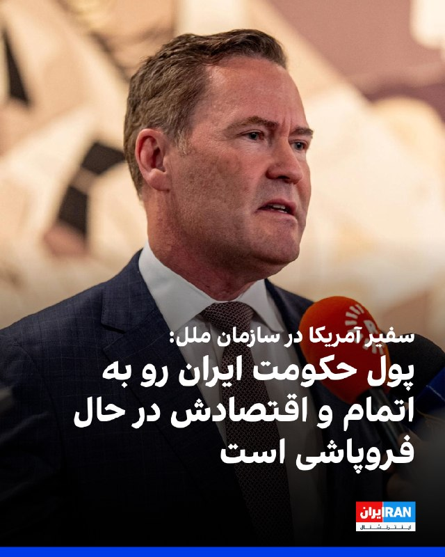

مایک والتز، سفیر آمریکا در سازمان ملل متحد در پستی در ایکس با اشاره به اینکه پول حکومت ایران رو به اتمام است و اقتصادش در حال فروپاشی است، گفت با این حال جمهوری اسلامی به جای تغییر رویه، مشغول اقدام‌های غیرقابل تحملی همچون حملات به زیرساخت‌های غیرنظامی است.
او گفت: «اما نیروهای نظامی جمهوری اسلامی به جای اتخاذ رویکردی جدید و مسالمت‌آمیز، درگیر حملات مکرر و بی‌ملاحظه، به زیرساخت‌های برق غیرنظامی، شده و به استراتژی سلاح‌های هسته‌ای پناه برده‌اند که خطر فرو بردن جهان در تاریکی را به همراه دارد.»
او افزود:«ما نمی‌توانیم این را تحمل کنیم و آن را تحمل نخواهیم کرد.»
والتز گفت: «رییس‌جمهوری ترامپ و ایالات متحده بارها و بارها در این درگیری مورد تردید قرار گرفته‌اند، اما به نظر من این بار دیگر روشن شده که رییس‌جمهوری در حال انجام اقداماتی است که برای تضمین آینده‌ای امن‌تر برای جهان ضروری است.»
سفیر آمریکا در سازمان ملل متحد افزود: «آنچه باید بر آن تمرکز کنیم، حکومتی است که به‌تازگی به یک نیروگاه هسته‌ای در یک کشور همسایه حمله کرده است.»

https://iranintl.com/202605208409

## IranIntlTV — post 338023

  

مریم طهماسبی، عروس معصومه ابتکار، گروگان‌گیر سفارت آمریکا در ایران و معاون پیشین رییس‌جمهور، در مصاحبه تلفنی با آسوشیتدپرس از یک بازداشتگاه مهاجرتی در تگزاس درباره علت اقامتشان در آمریکا گفت: «تنها چیزی که می‌خواستیم این بود که پسرمان زندگی عادی داشته باشد.»
او افزود: «من و همسرم، عیسی هاشمی، می‌خواهیم در حالی که پسرمان به دبیرستان بازمی‌گردد، تدریس را از سر بگیریم.»
طهماسبی گفت: «ما هرگز فکر نمی‌کردیم که دستگیر شویم. خانواده ما از طبقه متوسط است و هیچ ارتباطی با پول یا قدرت ندارد.»
عروس معصومه ابتکار خاطرنشان کرد: «فرض ما این بود که تا زمانی که از همه قوانین و مقررات پیروی کنیم، در امان خواهیم بود.»
به گزارش آسوشیتدپرس، این خانواده که یک دهه است در ایالات متحده زندگی می‌کنند، پس از دستگیری به دلیل ارتباط‌‌شان با معصومه ابتکار، خواستار آزادی خود از بازداشتگاه مهاجرتی شده‌اند.
یک قاضی فدرال پس از آن‌که این خانواده دادخواست‌هایی را علیه قانونی بودن بازداشت خود ارائه کرد، دولت را به طور موقت از اخراج آنها منع کرد. آنها از زمان دستگیری در اوایل آوریل در لس‌آنجلس، در مرکز مهاجرتی در ایالت تگزاس نگهداری می‌شوند.

## IranIntlTV — post 338022

  

سنای آمریکا با پیشبرد طرح محدود کردن اختیارات جنگی ترامپ در جنگ علیه جمهوری اسلامی موافقت کرد. اقدامات سنا در این زمینه تا کنون به تصویب نرسیده‌اند.

کوری بوکر، سناتور دموکرات، گفت: «باید همچنان به صحبت کردن ادامه دهیم تا سنا سرانجام برای پایان دادن به این جنگ اقدام کند.»
https://iranintl.com/202605201635

## IranIntlTV — post 338021

  

مستند «یک رفاقت از زندان وکیل‌آباد مشهد تا سن‌ دیگو» تهیه شده از سوی شبکه ایران‌اینترنشنال به کارگردانی اردوان روزبه، در بخش مستند و تحلیل سیاسی تلویزیونی برنده جایزه تلی سال ۲۰۲۶ شد.
جایزه تلی یک رقابت بین‌المللی در حوزه تولیدات ویدیویی، تلویزیونی، تبلیغات و محتوای دیجیتال است که از سال ۱۹۷۹ میلادی برگزار می‌شود و داورانی از شرکت‌هایی بزرگ مثل نتفلیکس و اچ.بی.او، هزاران اثر ارسالی را بررسی می‌کنند.
مستند «یک رفاقت: از زندان وکیل‌آباد مشهد تا سن‌ دیگو» امسال در رقابت با ۱۳ هزار اثر از از سراسر جهان برنده جایزه شد.
این مستند روایتگر داستان واقعی و غیرمنتظره دوستی میان مایکل وایت، کهنه‌سرباز آمریکایی، و مهدی وطن‌خواه، فعال سیاسی ایرانی است؛ دو زندانی که در بند عمومی زندان وکیل‌آباد مشهد با یکدیگر آشنا شدند.
مایکل وایت در سال ۲۰۱۸ پس از سفر به ایران بازداشت شد و در بازداشتگاه‌های امنیتی جمهوری اسلامی تحت بازجویی‌های سنگین، شکنجه روانی و فشار برای اعتراف اجباری قرار گرفت. او بعدها روایت کرد که بازجویان تلاش داشتند او را وادار کنند اعتراف کند برای آمریکا و اسرائیل جاسوسی می‌کرده است.

https://iranintl.com/2026051

## ManotoTV — post 105663

  <a href="telegram/content/ManotoTV_105663_1779252681.mp4" target="_blank">🎬 Download video</a>

‌
خبرگزاری فرانسه گزارش داد شرکت هواپیماسازی ایرباس به دلیل پیامدهای جنگ آمریکا و اسرائیل با جمهوری اسلامی، از تیم‌های خود خواسته هزینه‌های «غیرضروری» را ۱۰ درصد کاهش دهند.

بر اساس سندی که خبرگزاری فرانسه مشاهده کرده، ایرباس اعلام کرده هدف این شرکت «توقف قابل توجه فعالیت‌ها و هزینه‌هایی است که برای عملیات و فعالیت‌های صنعتی کاملاً ضروری نیستند.»

در این یادداشت از کارکنان خواسته شده از ایجاد هزینه‌های جدید یا واگذاری فعالیت‌های غیرضروری به پیمانکاران خودداری کنند.

ایرباس همچنین بر کاهش هزینه‌هایی مانند رویدادهای داخلی، برنامه‌های تیمی، همایش‌ها و مشارکت در کنفرانس‌ها تاکید کرده است.

## FarsiVOA — post 218198

  

قوه قضائیه جمهوری اسلامی اعلام کرد حکم قصاص متهم به قتل الهه حسین‌نژاد، پس از تأیید در دیوان عالی کشور و با درخواست اولیای دم، اجرا شده است. رسانه‌های داخلی نام متهم این پرونده را بهمن فرزانه اعلام کرده‌اند.

الهه حسین‌نژاد خرداد ۱۴۰۴ پس از سوار شدن به یک خودروی مسافرکش برای بازگشت به خانه ناپدید شد. چند روز بعد، پیکر او در بیابان‌های اطراف تهران پیدا شد.

در گزارش‌های رسمی ادعا شده متهم پس از بازداشت به قتل اعتراف کرده و کیفرخواست پرونده با اتهام قتل عمد، مخفی کردن جسد و صدمه به اموال مقتول به دادگاه کیفری یک استان تهران ارسال شده است.

اجرای این حکم در حالی اعلام می‌شود که گزارش تازه عفو بین‌الملل از افزایش شدید اعدام‌ها در ایران در سال ۲۰۲۵ خبر داده است.

بر اساس این گزارش، جمهوری اسلامی در سال ۲۰۲۵ دست‌کم ۲۱۵۹ نفر را اعدام کرده؛ رقمی که بیش از دو برابر آمار سال ۲۰۲۴ است و ایران را عامل اصلی جهش جهانی اعدام‌ها در بالاترین سطح ثبت‌شده طی ۴۴ سال گذشته معرفی می‌کند.

عفو بین‌الملل می‌گوید آمار جهانی اعدام‌ها در سال ۲۰۲۵، بدون احتساب چین، کره شمالی و ویتنام، به ۲۷۰۷ مورد رسیده است.
@FarsiVOA

## FarsiVOA — post 218197

⚡️سنتکام اعلام کرد که از زمان اجرای محاصره دریایی جمهوری اسلامی نیروهای آمریکایی ۸۹ کشتی را وادار به تغییر مسیر کرده‌اند. سنتکام گفت مانع هرگونه جریان تجاری به داخل و خارج از بنادر ایران شده است تا محاصره دریایی علیه جمهوری اسلامی به طور کامل اجرا شود.
@FarsiVOA

## Persian_Trend_Official — post 14512

حسین شریعتمداری : خاک بحرین متعلق به ایران است و مردم آن فارسی زبانند و خواستار الحاق این کشور به ایران هستند 💢دولت بحرین از جمهوری اسلامی ایران به سازمان ملل شکایت کرده و مدعی شده که ایران در امور داخلی بحرین دخالت می‌کند. 💢 اولا  بحرین متعلق به ایران است…

## Persian_Trend_Official — post 14511

حسین شریعتمداری : خاک بحرین متعلق به ایران است و مردم آن فارسی زبانند و خواستار الحاق این کشور به ایران هستند

💢دولت بحرین از جمهوری اسلامی ایران به سازمان ملل شکایت کرده و مدعی شده که ایران در امور داخلی بحرین دخالت می‌کند.

💢 اولا  بحرین متعلق به ایران است و مردم آن سامان خودشان را ایرانی می‌دانند. به زبان فارسی حرف می‌زنند و خواستار الحاق به وطن اصلی خود هستند.

💢ثانیاًً، حاکمان دست‌نشانده بحرین، خاک این جزیره ایرانی را برای حمله نظامی به ایران در اختیار آمریکا و رژیم صهیونیستی گذاشته‌اند. بنابراین، علاوه‌ بر خلع ید، باید محاکمه و مجازات هم بشوند.

🫆:Tony

📌 @persian_trend_official
پرشین ترند | متفاوت‌ترین کانال نظامی

## Persian_Trend_Official — post 14510

🔴 آزادی شهروند ایرانی دارای اقامت آمریکا پس از سال‌ها زندان

💢رسانه‌ها گزارش دادند «شهاب دلیلی» شهروند ایرانی دارای اقامت دائم آمریکا، پس از حدود ۱۰ سال از زندان ایران آزاد شده و به ایالات متحده بازگشته است.

▪️بر اساس گزارش‌ها:

▪️ دلیلی با اتهام «همکاری با دولت متخاصم» بازداشت شده بود
▪️ او پس از آزادی، از مسیر ارمنستان به آمریکا منتقل شده است
▪️ گفته می‌شود اکنون در کنار خانواده خود در واشینگتن حضور دارد
🫆:Tony

📌 @persian_trend_official
پرشین ترند | متفاوت‌ترین کانال نظامی

## Persian_Trend_Official — post 14509

  <a href="telegram/content/Persian_Trend_Official_14509_1779252682.mp4" target="_blank">🎬 Download video</a>

💢پوتین وارد تالار بزرگ خلق در پکن شد، جایی که قرار است با شی جین پینگ مذاکره کند

🫆:Tony

📌 @persian_trend_official
پرشین ترند | متفاوت‌ترین کانال نظامی

## Persian_Trend_Official — post 14508

  <a href="telegram/content/Persian_Trend_Official_14508_1779252684.webm" target="_blank">🎬 Download video</a>

💢نیویورک‌تایمز مدعی شد آمریکا و اسرائیل در روزهای ابتدایی عملیات مشترک نظامی علیه ایران، خانه محمود احمدی‌نژاد را هدف حمله هوایی قرار داده‌اند.

▪️بر اساس این گزارش:

▪️ هدف از این حمله، آزاد کردن احمدی‌نژاد از حصر خانگی و استفاده از او در پروژه تغییر نظام در ایران بوده است

▪️ احمدی‌نژاد به‌دلیل اختلاف با آیت‌الله خامنه‌ای تحت حصر قرار داشت

▪️ برنامه‌ریزان اسرائیلی پیش از آغاز جنگ با او ارتباط برقرار کرده بودند

در ادامه گزارش آمده:

▪️ حمله اسرائیل محافظان مستقر مقابل منزل احمدی‌نژاد در تهران را هدف قرار داده بود

▪️ احمدی‌نژادازحملهجانسالمبهدربردامازخمیشد

▪️ او پس از حمله نسبت به این طرح دچار تردید و ناامیدی شده است

💢طبق ادعای نیویورک‌تایمز:

▪️ طرح گسترده‌تر اسرائیل شامل حذف رهبران ارشد ایران، حمایت از ناآرامی‌های داخلی و ایجاد زمینه برای تشکیل دولت جایگزین بوده است

▪️ مقام‌های آمریکایی و اسرائیلی تصور می‌کردند برخی جریان‌های داخلی ایران پس از آغاز جنگ با واشینگتن همکاری خواهند کرد

🫆:Tony

📌 @persian_trend_official
پرشین ترند | متفاوت‌ترین کانال نظامی

## Persian_Trend_Official — post 14507

  <a href="telegram/content/Persian_Trend_Official_14507_1779252685.mp4" target="_blank">🎬 Download video</a>

صبحتون‌ بخیر ☕️🤍

📝 Nick
📌 @persian_trend_official
پرشین ترند | متفاوت‌ترین کانال نظامی

## Persian_Trend_Official — post 14506

  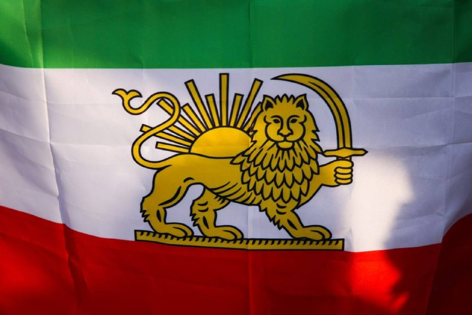

💢فیفا قصد دارد بار دیگر ورود پرچم «شیر و خورشید» پیش از انقلاب ایران و پوشاک مرتبط با آن را به استادیوم‌های جام جهانی در مسابقات ۲۰۲۶ ممنوع کند.

این پرچم همچنین در جام جهانی قطر ۲۰۲۲ محدود شده بود.

منبع: نیویورک تایمز

🫆:Tony

📌 @persian_trend_official
پرشین ترند | متفاوت‌ترین کانال نظامی

## Persian_Trend_Official — post 14505

  <a href="telegram/content/Persian_Trend_Official_14505_1779252686.webm" target="_blank">🎬 Download video</a>

🔴انتقاد تلویحی امارات از عربستان و قطر بر سر ارتباط با ایران

💢شبکه i24 گزارش داد «انور قرقاش» مشاور رئیس امارات، بدون نام بردن مستقیم از عربستان و قطر، به‌صورت تلویحی از ادامه ارتباط و تماس‌های این کشورها با ایران انتقاد کرده است.

بر اساس این گزارش:

▪️ ابوظبی نگران است فشار کشورهای عربی باعث توقف دوباره عملیات نظامی آمریکا علیه ایران شده باشد
▪️ برخی محافل اماراتی معتقدند عربستان و قطر در تلاش برای حفظ مسیر مذاکره با تهران هستند
▪️ این اختلاف می‌تواند نشانه شکاف در مواضع کشورهای خلیج فارس درباره نحوه برخورد با ایران باشد

🫆:Tony

📌 @persian_trend_official
پرشین ترند | متفاوت‌ترین کانال نظامی

## RadioFarda — post 157367

  <a href="https://t.me/radiofarda/157367" target="_blank">📎 Download file</a>

📻بشنوید: خبرهای ۸ صبح با رادیوفردا، ۳۰ اردیبهشت ۱۴۰۵‌

@RadioFarda

## BBCPersian — post 281561

  

🔻خبرگزاری‌ها در ایران صبح چهارشنبه - ۳۰ اردیبهشت - از اعدام مردی که «قاتل الهه حسین‌نژاد» معرفی شده خبر دادند.

جسد الهه حسین‌نژاد اوایل خرداد سال گذشته در بیابان‌های اطراف تهران پیدا شد و قوه قضائیه ایران در همان روزها اعلام کرد که پرونده قتل این زن ۲۴ ساله ساکن اسلامشهر در حومه تهران بزرگ را به شعبه ویژه بازپرسی ارجاع کرده و دو نفر هم در این رابطه بازداشت شدند.

براساس گزارش‌ها متهم اصلی مسافرکشی می‌کرده و الهه حسین‌نژاد را برای رساندن به مقصد سوار می‌کند و او را برای «موبایل گرانقیمتش» با «چاقو» به قتل می‌رساند.

کشف جسد او ۱۲ روز پس از قتلش خشم افکار عمومی برانگیخت و گروهی از کاربران در شبکه‌های اجتماعی نوشته‌اند: «این پرونده یک کشته و ۹۰ میلیون زخمی داشت.»
📸elahe.hoseinnejad
https://bbc.in/4ukVA8J
@BBCPersian

## BBCPersian — post 281560

  

🔻روزنامه آمریکایی نیویورک تایمز در گزارشی اختصاصی نوشته تحقیقات این رسانه نشان داده که در اوایل جنگ آمریکا و اسرائیل با ایران، یک حمله هوایی به محل سکونت محمود احمدی‌نژاد، رئیس جمهور سابق ایران، صورت گرفت که هدف آن آزادی او از حصر خانگی و بخشی از تسهیل روند تغییر رژیم بوده است.

نیویورک تایمز روز سه‌شنبه در گزارشی اختصاصی نوشت: «چند روز پس از آنکه حملات اسرائیل در نخستین موج‌های جنگ، رهبر جمهوری اسلامی ایران و دیگر مقام‌های ارشد را کشت، دونالد ترامپ علنا مطرح کرد که شاید بهتر باشد «فردی از داخل» ایران اداره کشور را به دست بگیرد. اکنون مشخص شده است که آمریکا و اسرائیل با گزینه‌ای مشخص و بسیار غافلگیرکننده وارد این درگیری شده بودند: محمود احمدی‌نژاد، رئیس‌جمهور پیشین ایران که به مواضع تند ضداسرائیلی و ضدآمریکایی‌اش شناخته می‌شود.»
ادامه مطلب⬇️

📸EPA-EFE/REX/Shutterstock
https://bbc.in/3RmWpzo
@BBCPersian

## BBCPersian — post 281559

  

🔻عباس عراقچی، وزیر خارجه ایران در واکنش به اظهارات تهدیدآمیز دونالد ترامپ، رئیس جمهور آمریکا، درباره احتمال از سرگیری حمله نظامی به ایران گفته است: «مطمئن باشید بازگشت به میدان جنگ با شگفتی‌های بسیار بیشتری همراه خواهد بود

آقای عراقچی در پست جدیدی در شبکه ایکس نوشته است: «ماه‌ها پس از آغاز جنگ علیه ایران، کنگره آمریکا به نابودی ده‌ها فروند هواپیما به ارزش میلیاردها دلار اذعان کرد. اکنون به‌طور رسمی تأیید شده است که نیروهای مسلح قدرتمند ما نخستین نیرویی در جهان بودند که جنگنده پیشرفته و پرآوازه F-35 را سرنگون کردند.»

او در پایان این پست مدعی شده است که: «با درس‌هایی که آموخته‌ایم و دانشی که به دست آورده‌ایم، مطمئن باشید بازگشت به میدان جنگ با شگفتی‌های بسیار بیشتری همراه خواهد بود.»

دونالد ترامپ، رئیس جمهور آمریکا، روز گذشته مدعی شد که در آستانه حمله نظامی بزرگ به ایران، او به درخواست رهبران منطقه، دستور لغو حمله را داده است.

📸GettyImages
https://bbc.in/4dI4AxY
@BBCPersian

## BBCPersian — post 281558

  

🔻مقامات اسپانیایی اعلام کردند که سه پلیس کانادایی به دلیل اتهام حمله به یک کارگر جنسی در جریان تعطیلاتشان در شهر بارسلون دستگیر شده‌ بودند.
پلیس تورنتو اعلام کرد که یکی از این افسران پس از بازگشت به کانادا از کار تعلیق شد.

اداره پلیس اعلام کرده که دو افسر دیگر نیز به محض بازگشت از کار تعلیق خواهند شد.

اداره پلیس تورنتو در ایمیلی به بی‌بی‌سی تاکید کرده است: «این اتهامات جدی هستند.» در این بیانیه ضمن تایید هویت و شغل این افراد، اعلام کرده است که این سه نفر در سفر غیر رسمی و اداری بوده‌اند و تا زمان تکمیل پرونده، اظهار نظر بیشتری نخواهد کرد.

مقامات اسپانیایی در ایمیلی به بی‌بی‌سی گفتند که اولین بار در ساعات اولیه چهارشنبه ۱۳ مه/ ۲۳ اردیبهشت، پس از در خواست کمک زنی از داخل یک تاکسی، از این حادثه مطلع شدند. پلیس اسپانیا، دو نفر از سه مظنون شناسایی شده را دستگیر کرد. نفر سوم که فرار کرده بود، چند روز بعد دستگیر شد. این زن به پلیس گفت که او یک کارگر جنسی است که قبلا با یکی از افسران قرار ملاقات گذاشته بود.

ادامه مطلب⬇️
📸GettyImages
https://bbc.in/4dymLpr
@BBCPersian

## BBCPersian — post 281557

  

🔻ساعتی پس از حضور فرمانده سنتکام در کنگره امریکا و اظهارات جدیدش درباره روند «پیچیده» تحقیقات مرتبط با این حمله، وزارت خارجه ایران ادعای فرماندهی مرکزی ایالات متحده آمریکا مبنی براینکه مدرس ابتدایی شجره طیبه میناب در محدوده یک مرکز فعال موشکی بوده است را «کاملا بی‌اساس و انحرافی» خواند.

اسماعیل بقایی، سخنگوی وزارت خارجه ایران عصر سه‌شنبه گفت: «این تحریف آشکار، تلاشی واضح برای پنهان کردن ماهیت واقعی حملات موشکی ۲۸ فوریه است که موجب قتل عام بیش از ۱۷۰ دانش‌آموز و معلمان‌شان شد.»

آقای بقایی همچنین گفته است: «فرماندهان نظامی و مقامات آمریکایی که مسئول صدور دستور و اجرای این حمله فاجعه‌بار بوده‌اند، باید طبق قوانین بین‌المللی کاملا پاسخگو و محاکمه شوند.»

📸Anadolu via Getty Images
https://bbc.in/4uru8q4
@BBCPersian

## BBCPersian — post 281556

  

🔻سنای آمریکا با ۵۰ رای موافق در برابر ۴۷ رای مخالف به راه یافتن طرح محدود کردن اختیارات جنگی دونالد ترامپ، به صحن این مجلس رای مثبت داد.

این طرح که با محتوایی مشابه پیش‌تر در سنا رای نیاورده بود، روز سه‌شنبه با پیوستن به سناتور جمهوری‌خواه به اقلیت دموکرات‌ها، تصویب شد.

این طرح رئیس جمهور آمریکا را مکلف می‌کند برای هرگونه اقدام نظامی دیگر علیه ایران ابتدا از کنگره تاییدیه بگیرد.

راه یافتن این طرح به مرحله بعدی و اجازه مطرح شدن در صحن اصلی سنا و تصویب آن در این مجلس که اکثریت ان در دست جمهوری‌خواهان است، خیلی زود عصر سه شنبه در رسانه‌های آمریکا مورد توجه قرار گرفت.

در جریان رای‌گیری، جان فترمن، سناتور دموکرات ایالت پنسیلوانیا، به جمهوری‌خواهان پیوست و به آن رای منفی داد؛ در مقابل، رند پال، سوزان کالینز، لیزا مورکوفسکی و بیل کسیدی، چهار سناتور جمهوری‌خواه، همراه با دموکرات‌ها به طرح رای مثبت دادند.

این نخستین بار بود که آقای کسیدی در این موضوع با دموکرات‌ها هم‌سو رای می‌داد.

📸Anadolu via Getty Images
https://bbc.in/4dkphAX
@BBCPersian

## manototv — post 105663

  <a href="telegram/content/manototv_105663_1779252693.mp4" target="_blank">🎬 Download video</a>

‌
خبرگزاری فرانسه گزارش داد شرکت هواپیماسازی ایرباس به دلیل پیامدهای جنگ آمریکا و اسرائیل با جمهوری اسلامی، از تیم‌های خود خواسته هزینه‌های «غیرضروری» را ۱۰ درصد کاهش دهند.

بر اساس سندی که خبرگزاری فرانسه مشاهده کرده، ایرباس اعلام کرده هدف این شرکت «توقف قابل توجه فعالیت‌ها و هزینه‌هایی است که برای عملیات و فعالیت‌های صنعتی کاملاً ضروری نیستند.»

در این یادداشت از کارکنان خواسته شده از ایجاد هزینه‌های جدید یا واگذاری فعالیت‌های غیرضروری به پیمانکاران خودداری کنند.

ایرباس همچنین بر کاهش هزینه‌هایی مانند رویدادهای داخلی، برنامه‌های تیمی، همایش‌ها و مشارکت در کنفرانس‌ها تاکید کرده است.

<!-- MSG END -->

<!-- NAV START -->

<a href="https://github.com/shahinsa98/aio-downloader/blob/main/telegram/content/archive_1.md" style="display:inline-block; padding:6px 12px; margin:0 4px; background-color:#2ea44f; color:white; text-decoration:none; border-radius:4px; font-weight:bold;">صفحه بعد</a>

<!-- NAV END -->
