# خواننده تلگرام

<!-- TOP_NAV START -->

<a href="https://github.com/shahinsa98/aio-downloader/blob/main/telegram/content/archive_1.md" style="display:inline-block; padding:6px 12px; margin:0 4px; background-color:#2ea44f; color:white; text-decoration:none; border-radius:4px; font-weight:bold;">صفحه بعد</a>

<!-- TOP_NAV END -->

<!-- MSG START -->

---
📅 بروزرسانی: 1405/02/29 15:43
---

## VahidOOnLine — post 240950

  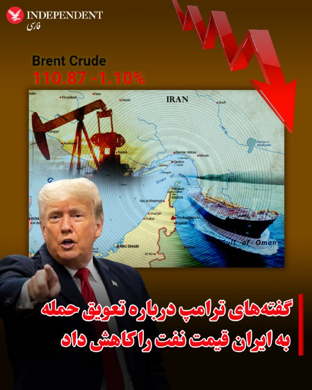

♦️یک روز پس از آنکه دونالد ترامپ اعلام کرد حمله گسترده به ایران را برای چند روز به تعویق می‌انداز، قیمت نفت در بازارهای جهانی حدود یک درصد کاهش یافت.

روز سه‌شنبه هر بشکه نفت خام دریای برنت با حدود ۳۰ سنت کاهش، در کانال ۱۱۰ دلار به فروش می‌رسد.

همزمان با توقف روند افزایشی قیمت نفت، شاخص بورس‌های آسیایی و اروپایی هم اندکی افزایش یافت.
‌🇸🇦 Indypersian

🤖 @VahidOOnLine

## VahidOOnLine — post 240949

  <a href="telegram/content/VahidOOnLine_240949_1779192790.mp4" target="_blank">🎬 Download video</a>

ولی‌الله حیاتی، معاون امنیتی استانداری خوزستان، بعدازظهر سه‌شنبه ۲۹ اردیبهشت گفت سقوط یک «پرتابه» یا «شی ناشناس» در یک منطقه مسکونی اندیمشک چهار مصدوم بر جا گذاشت.

به گزارش ایرنا، این مقام محلی گفت این حادثه به یک باب مغازه و دو خودرو خسارت وارد کرده و بازتاب گسترده‌ای در شبکه‌های اجتماعی این شهرستان داشته است.

حیاتی در توضیح جداگانه‌ای درباره صداهای شنیده‌شده در آسمان اندیمشک گفت: «صدای شلیک‌های اخیر در آسمان اندیمشک به دلیل تست پدافند هوایی است، لذا مردم نگران نباشند.»

با این حال رسانه‌های داخلی و مقام‌های جمهوری اسلامی هنوز توضیحی درباره ماهیت «شی ناشناس» یا «پرتابه» سقوط‌کرده ارائه نکرده‌اند و مشخص نیست این حادثه ارتباطی با تست پدافند هوایی داشته است یا نه.
‌🏁 🇬🇧 ManotoTV

🤖 @VahidOOnLine

## VahidOOnLine — post 240948

  <a href="telegram/content/VahidOOnLine_240948_1779192790.mp4" target="_blank">🎬 Download video</a>

سخنگوی وزارت خارجه قطر اعلام کرد دوحه همچنان با واشنگتن و تهران در تماس است و این رایزنی‌ها ادامه خواهد داشت.
ماجد الانصاری، در واکنش به تصمیم دونالد ترامپ برای تعویق حمله برنامه‌ریزی‌شده به ایران به درخواست قطر، عربستان سعودی و امارات، گفت این اقدام «نشانه پاسخ مثبت» بوده است.
او همچنین با اشاره به مذاکرات میان آمریکا و جمهوری‌اسلامی گفت قطر از تلاش‌های دیپلماتیک پاکستان برای نزدیک کردن طرف‌ها و یافتن راه‌حل حمایت می‌کند و این روند «به زمان بیشتری نیاز دارد».
الانصاری درباره روابط دوحه و تهران گفت قطر همچنان روابط مثبتی با جمهوری‌اسلامی دارد، اما در عین حال افزود حمله جمهوری‌اسلامی به قطر «تهدیدی برای روابط دو کشور» به شمار می‌رود
‌🏁 🇬🇧 ManotoTV

🤖 @VahidOOnLine

## VahidOOnLine — post 240947

  <a href="telegram/content/VahidOOnLine_240947_1779192791.mp4" target="_blank">🎬 Download video</a>

«صدای رشید مظاهری باشید»
‌🏁 🇬🇧 ManotoTV

🤖 @VahidOOnLine

## VahidOOnLine — post 240946

  

♦️ولی‌الله حیاتی، معاون امنیتی استانداری خوزستان بعدازظهر سه‌شنبه ۲۹ اردیبهشت‌ماه گفت در پی سقوط «پرتابه» ناشناس در یک منطقه مسکونی در اندیمشک، چهار نفر مصدوم شدند.

به گزارش ایرنا، این مقام محلی گفت: «سقوط شی ناشناس در مناطق مسکونی اندیمشک که منجر به خسارت به یک باب مغازه و دو خودرو و مصدومیت چهار نفر شد دقایقی پیش در شبکه های اجتماعی این شهرستان بازتاب گسترده داشت.

همین مقام امنیتی گفته است: «صدای شلیک های اخیر در آسمان اندیمشک بدلیل تست پدافند هوایی است لذا مردم نگران نباشند.»

رسانه‌های داخلی و مقام‌های جمهوری اسلامی هنوز جزئیاتی درباره «شی ناشناس» یا «پرتابه» نداده‌اند.
‌🇸🇦 Indypersian

🤖 @VahidOOnLine

## VahidOOnLine — post 240945

  <a href="telegram/content/VahidOOnLine_240945_1779192792.mp4" target="_blank">🎬 Download video</a>

«صدای فاطمه سپهری باشیم»
‌🏁 🇬🇧 ManotoTV

🤖 @VahidOOnLine

## VahidOOnLine — post 240944

  <a href="telegram/content/VahidOOnLine_240944_1779192793.mp4" target="_blank">🎬 Download video</a>

بر اساس گزارش‌ رسانه‌های حکومتی حمید خانی، پاسدار بازنشسته اهل شهرستان بروجن، در جریان عملیات خنثی‌سازی بمب‌های عمل‌نکرده باقی‌مانده از جنگ اخیر در تهران کشته شد. بر اساس گزارش‌ها، او به‌صورت داوطلبانه در بخش مهندسی قرارگاه خاتم‌الانبیا فعالیت می‌کرد.
‌🏁 🇬🇧 ManotoTV

🤖 @VahidOOnLine

## VahidOOnLine — post 240943

  

پس از گزارش رسانه‌ها درباره شنیدن صدای چند انفجار مهیب در جزیره قشم، معاون امنیتی استاندار هرمزگان اعلام کرد صدای انفجارهای شنیده‌شده ظهر امروز در جزیره قشم مربوط به خنثی‌سازی مهمات عمل‌نکرده بوده است.

او در پایان افزود: «از مردم جزیره قشم می‌خواهیم به هیچ‌وجه نگران نباشند و به شایعات فضای مجازی توجه نکنند.»

این در حالی است که در موارد مشابه، مقام‌های جمهوری اسلامی پیش از اجرای عملیات خنثی‌سازی مهمات عمل‌نکرده، نسبت به احتمال شنیده شدن صدای انفجار اطلاع‌رسانی می‌کردند، اما درباره عملیات امروز در قشم اطلاعیه قبلی منتشر نشده بود.
‌🏁 🇬🇧 IranintlTV

🤖 @VahidOOnLine

## VahidOOnLine — post 240942

  

ولی‌الله حیاتی، معاون امنیتی انتظامی استانداری خوزستان، ظهر سه‌شنبه اعلام کرد که صدای شلیک‌های شنیده‌شده در آسمان اندیمشک ناشی از «تست سامانه پدافند هوایی» بوده است.
حیاتی گفت بر اثر سقوط یک پرتابه در منطقه‌ای مسکونی، چهار شهروند مجروح شده‌اند که به گفته او در وضعیت پایدار قرار دارند و هم‌اکنون در مراکز درمانی تحت مداوا هستند.
او افزود: «با هوشیاری نیروهای مسلح و مدیریت استان، شرایط کاملا تحت کنترل است.»
‌🏁 🇬🇧 IranintlTV

🤖 @VahidOOnLine

## VahidOOnLine — post 240941

  <a href="telegram/content/VahidOOnLine_240941_1779192795.mp4" target="_blank">🎬 Download video</a>

قیمت جهانی نفت پس از آن کاهش یافت که دونالد ترامپ اعلام کرد حمله برنامه‌ریزی‌شده به ایران را به‌منظور فراهم شدن فرصت برای مذاکرات و پایان جنگ، متوقف کرده است.
بهای نفت برنت، شاخص جهانی قیمت نفت، با کاهش ۱.۵ درصدی به ۱۱۰ دلار و ۳۷ سنت در هر بشکه رسید.
همزمان، نفت خام وست‌تگزاس اینترمدیت آمریکا نیز برای تحویل ماه ژوئن با افت ۶۳ سنتی، ۱۰۸ دلار و ۳ سنت معامله شد. قرارداد فعال‌تر ماه ژوئیه این شاخص نیز با کاهش ۰.۸ درصدی به ۱۰۳ دلار و ۵۶ سنت رسید.
‌🏁 🇬🇧 ManotoTV

🤖 @VahidOOnLine

## VahidOOnLine — post 240940

  

♦️ محمد اکرمی‌نیا، سخنگوی ارتش جمهوری اسلامی روز سه‌شنبه ۲۹ اردیبهشت هشدار داد در صورت آغاز جنگ، ایران «جبهه‌های جدیدی» را علیه دشمنان بازخواهد کرد.

به گزارش خبرگزاری صداوسیما، این مقام نظامی گفت: «ارتش ایران، دوره آتش بس را به منزله دوران جنگ تلقی کرده و از این فرصت برای تقویت توان رزمی خود استفاده کرده است.»
‌🇸🇦 Indypersian

🤖 @VahidOOnLine

## VahidOOnLine — post 240939

  <a href="telegram/content/VahidOOnLine_240939_1779192795.mp4" target="_blank">🎬 Download video</a>

علیرضا رئیسی، معاون بهداشت وزارت بهداشت، اعلام کرد جمعیت ایران بر اساس آخرین آمار به ۸۶ میلیون و ۵۶۴ هزار نفر رسیده است.
به گفته او، از این تعداد ۴۳ میلیون و ۶۵۸ هزار نفر مرد و ۴۲ میلیون و ۹۰۶ هزار نفر زن هستند.
‌🏁 🇬🇧 ManotoTV

🤖 @VahidOOnLine

## VahidOOnLine — post 240938

  

الی کوهن، وزیر انرژی و عضو کابینه سیاسی-امنیتی اسرائیل، گفت: «رهبر جمهوری اسلامی پنهان شده و تحت فشار است. محاصره هرمز اقتصاد ایران را به سمت فروپاشی می‌برد و اگر تهران برنامه هسته‌ای را از سر بگیرد، اسرائیل حمله خواهد کرد.»

او افزود: «اسرائیل اجازه نخواهد داد جمهوری اسلامی به سلاح هسته‌ای نزدیک شود و برای حفظ برتری نظامی خود بیش از ۱۰۰ میلیارد دلار سرمایه‌گذاری خواهد کرد.»
‌🏁 🇬🇧 IranintlTV

🤖 @VahidOOnLine

## VahidOOnLine — post 240937

  

در ادامه لفاظی‌های تهدیدآمیز مقام‌های حکومت، محمد اکرمی‌نیا، سخنگوی ارتش جمهوری اسلامی، گفت در صورت حمله مجدد دشمن، «با ابزارها و شیوه‌های جدید، جبهه‌های جدیدی را علیه آنها خواهیم گشود».

او اضافه کرد: «جمهوری اسلامی محاصره‌پذیر و قابل شکست نیست.»
‌🏁 🇬🇧 IranintlTV

🤖 @VahidOOnLine

## VahidOOnLine — post 240936

  

♦️ علیرضا رئیسی، معاون وزارت بهداشت دولت مسعود پزشکیان روز سه‌شنبه ۲۹ اردیبهشت اعلام کرد جمعیت ایران براساس آخرین سرشماری به ۸۶ میلیون و ۵۶۴ هزار نفر رسیده است.

این مقام دولتی با هشدار درباره سرعت گرفتن روند پیری جمعیت در سال گذشته اعلام کرد: «نسبت تولد به فوت در کشور که در سال ۱۴۰۳ معادل ۲.۱۴ بود، در سال ۱۴۰۴ به ۱.۹۸ سقوط کرده است. این یعنی اکنون به ازای هر دو فوتی، حتی دو تولد هم ثبت نمی‌شود.»
‌🇸🇦 Indypersian

🤖 @VahidOOnLine

## VahidOOnLine — post 240935

  <a href="telegram/content/VahidOOnLine_240935_1779192797.mp4" target="_blank">🎬 Download video</a>

ویدیوی ارسال‌شده به ایران‌اینترنشنال، شعارنویسی در حمایت از شاهزاده رضا پهلوی را روی یکی از دیوارهای شهر کیش نشان می‌دهد.
‌🏁 🇬🇧 IranintlTV

🤖 @VahidOOnLine

## VahidOOnLine — post 240934

  

♦️ ابراهیم عزیزی، رئیس کمیسیون امنیت ملی و سیاست خارجی مجلس شورای اسلامی روز سه‌شنبه ۲۹ اردیبهشت به خبرگزاری ایسنا گفت تنگه هرمز «برای همیشه در اختیار و مدیریت» ایران باقی می‌ماند و تا ابد یک اهرم اقتصادی، سیاسی، و نظامی تمام‌عیار» خواهد بود.

این سخنان در حالی عنوان می‌شود که جمهوری اسلامی ایران تلاش می‌کند حاکمیت خود را این آبراه راهبردی با اهمیت جهانی اعمال کند. جامعه جهانی، ازجمله کشورهای حاشیه جنوب خلیج فارس، اروپا، آمریکا و همچنین ترکیه خواستار بازگشایی فوری تنگه هرمز هستند و می‌گویند ایران حق ندارد بابت تردد کشتی‌ها، پول یا امتیازی بگیرد.
‌🇸🇦 Indypersian

🤖 @VahidOOnLine

## VahidOOnLine — post 240933

  <a href="telegram/content/VahidOOnLine_240933_1779192799.mp4" target="_blank">🎬 Download video</a>

بر پایه گزارش‌های منتشر شده حامد تیزرویان، فعال محیط زیست و عکاس شناخته شده بازداشت شده است. آقای تیزرویان ۱۴ اردیبهشت در ساری بازداشت شده و با وجود سپری شدن حدود دو هفته، از نهاد بازداشت کننده یا دلیل دستگیری او اطلاعی در دست نیست.
وسایل الکترونیکی از جمله تلفن همراه حامد تیزرویان هنگام بازداشت او ضبط شده است. حامد تیزرویان، عکاس حیات وحش و دانشجوی دکترای تنوع زیستی دانشگاه شهید بهشتی، پیش‌تر تصاویری کم‌نظیر از گونه‌های در معرض خطر انقراض از جمله خرس قهوه‌ای و مرال ثبت کرده است. او همچنین در ساخت دست‌کم ۱۰ پاسگاه محیط‌بانی در محدوده جنگل‌های هیرکانی مشارکت داشته و طی سال‌های گذشته در زمینه آموزش و آگاهی‌رسانی درباره حفاظت از محیط زیست، به‌ویژه جنگل‌های هیرکانی، فعالیت مستمر داشته است. فعالان محیط زیست نگران سرنوشت آقای تیزرویان هستند. صفحه اینستاگرام حامد تیزرویان نیز آذر سال گذشته، پس از انتشار مطالبی انتقادی درباره عملکرد مدیران دولتی در مهار آتش‌سوزی جنگل‌های الیمالات مازندران، برای چند روز مسدود شده بود.
‌🏁 🇬🇧 ManotoTV

🤖 @VahidOOnLine

## VahidOOnLine — post 240932

  

رسانه‌های ایران گزارش دادند حمید خانی، عضو پیشین سپاه پاسداران، در جریان ماموریت خنثی‌سازی بمب‌های عمل‌نکرده ناشی از حملات مشترک اسرائیل و آمریکا در تهران کشته شده است. بر اساس این گزارش‌ها، او به صورت داوطلبانه در بخش مهندسی قرارگاه خاتم‌الانبیا فعالیت می‌کرده است.

جزئیات بیشتری درباره زمان دقیق حادثه و نحوه وقوع آن منتشر نشده است.
‌🏁 🇬🇧 IranintlTV

🤖 @VahidOOnLine

## VahidOOnLine — post 240931

  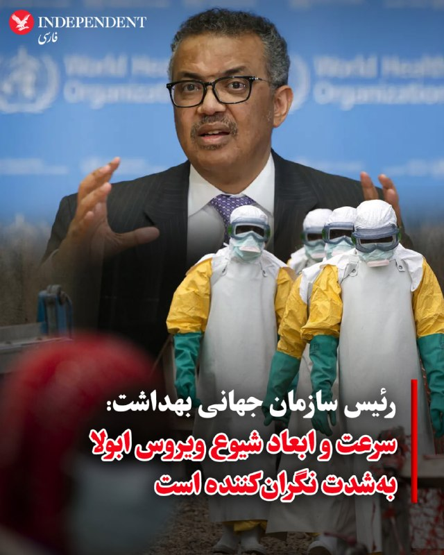

♦️ تدروس ادهانوم قبریسوس، رئیس سازمان جهانی بهداشت روز سه‌شنبه ۲۹ اردیبهشت اعلام کرد سرعت و ابعاد شیوع ویروس ابولا در کشور جمهوری دموکراتیک کنگو، بسیار نگران‌کننده است.

رئیس سازمان جهانی بهداشت در دومین روز مجمع عمومی کشورهای عضو این نهاد بین‌المللی گفت امروز برای بررسی وضعیت شیوع این بیماری یک کمیته فوق‌العاده تشکیل خواهد شد.

از هفته گذشته تاکنون دست‌کم ۱۰۳ نفر براثر ابتلا به سویه بوندیبوگیو ویروس ابولا در جمهوری دموکراتیک کنگو جان خود را از دست داده‌اند.

کارشناسان سازمان جهانی بهداشت می‌گویند واکسنی که برای سویه «زئیر» این ویروس در سال‌های قبل به‌کار گرفته شده بود، ممکن است در پیشگیری از گونه جدید موثر باشد.
‌🇸🇦 Indypersian

🤖 @VahidOOnLine

## WithYashar — post 11647

افشاگری وال‌استریت ژورنال : چند مقام خلیج فارس از برخی کشورهایی که ترامپ به آن‌ها اشاره کرده بود گفتند از طرح قریب‌الوقوعی که او درباره حمله به ایران توصیف کرده بود، اطلاعی نداشتند.
@withyashar

## WithYashar — post 11646

  <a href="https://t.me/withyashar/11646" target="_blank">📎 Download file</a>

کتاب ممنوعه «در پشت پرده های انقلاب»، اعترافات «جعفر شفیع زاده» فرمانده پیشین واحد مخصوص انقلاب اسلامی ایران و محافظ آیت الله خمینی در نوفل لوشاتو و تهران.
@withyashar

## WithYashar — post 11645

مهر: تو قشم صدای انفجار شنیده شد
@withyashar

## WithYashar — post 11644

دادگاه نتانیاهو امروز به دلایل جلسات امنیتی بازم لغو شد.
@withyashar

## WithYashar — post 11643

😾

## WithYashar — post 11642

سخنگوی ارتش: ارتش ایران، دوره آتش بس را به منزله دوران جنگ تلقی کرده و از این فرصت برای تقویت توان رزمی خود استفاده کرده است.

اگر دشمن حماقت کند و مجدداً در دام اسرائیل گرفتار شود و دست به تجاوزی دیگر به ایران عزیز ما بزند، با ابزارها و شیوه‌های جدید جبهه‌های جدیدی را علیه آنها خواهیم گشود.
@withyashar

## WithYashar — post 11641

اتاق جنگ با شما : پالایشگاه بندرعباس تخلیه شد همین الان
@withyashar

## WithYashar — post 11640

## WithYashar — post 11639

  <a href="telegram/content/WithYashar_11639_1779192800.mp4" target="_blank">🎬 Download video</a>

بمب اتمی کره شمالی
@withyashar

## WithYashar — post 11638

من سریع خوندم فک کردم میگه پاکستان میده به اونا ، در جواب پس یه ویدیو میبینیم با هم

## WithYashar — post 11637

عمو اینکه جمهوری اسلامی به پاکستان گفته که ما سه تا بمب اتم داریم ، اگر حمله ای صورت بگیره کشور های همسایه پودر میشن واقعیه؟ ازشون واقعا برمیاد همه چی.

## WithYashar — post 11636

عمو اینکه جمهوری اسلامی به پاکستان گفته که ما سه تا بمب اتم داریم ، اگر حمله ای صورت بگیره کشور های همسایه پودر میشن واقعیه؟
ازشون واقعا برمیاد همه چی.

## WithYashar — post 11635

روزنامه واشنگتن پست به نقل از یک مقام پاکستانی: ایران می‌خواهد پیش از اعلام توافق هسته‌ای، به توافقی برای پایان دادن به جنگ دست یابد.
واشنگتن می‌خواهد توافق بر سر همه مسائل را یکجا اعلام کند.
@withyashar

## mwarmonitor — post 9304

  

🔴دیروز هتل تاریخی عامریها کاشان را به خاطر «حجاب» پلمب کردند؛ مسافران سرگردان شدند و ۹۰ نفر از پرسنل بیکار

📝 به شهربازی بزرگ تناقضات خوش آمدید؛ جایی که خط‌کش‌های قانون، پلاستیکی هستند و متناسب با زاویه دوربین مصلحت، کش می‌آیند. یک روز قفل سنگین پلمب را بر درِ هتل تاریخی عامری‌ها می‌کوبند و ۹۰ کارگر را به جرم دیدن چند تار مو آواره می‌کنند، و روز دیگر در میدان‌های شهر، بلندگوها شعار سوزناک «بی‌حجاب هم خواهر ماست» سر می‌دهند. این دیگر نه شریعت است و نه قانون، بلکه یک دکانداریِ عریان است؛ تار موی شما اگر در حال زندگی عادی باشد، جرم مشهود و مستوجب نابودی است، اما اگر جلو لنز صداوسیما و روی جیپ‌های صورتیِ کارناوال‌های سفارشی باشد، جلوه‌ای از همبستگی ملی! مرز بین مجرم و شهروند نمونه در این سیستم، فقط به یک چیز بستگی دارد: اینکه چقدر ویترین تبلیغاتی آقایان را پر کنید. پرده‌های این سیرک سال‌هاست افتاده، اما بازیگرانش هنوز فکر می‌کنند مردم محو تماشای شعبده‌بازیِ ناشیانه‌شان هستند.

@mwarmonitor

## mwarmonitor — post 9303

🔴چند مقام خلیج فارس از برخی کشورهایی که ترامپ به آن‌ها اشاره کرده بود گفتند از طرح قریب‌الوقوعی که او درباره حمله به ایران توصیف کرده بود، اطلاعی نداشتند. وال‌استریت ژورنال @mwarmonitor

## mwarmonitor — post 9302

🔴چند مقام خلیج فارس از برخی کشورهایی که ترامپ به آن‌ها اشاره کرده بود گفتند از طرح قریب‌الوقوعی که او درباره حمله به ایران توصیف کرده بود، اطلاعی نداشتند. وال‌استریت ژورنال

@mwarmonitor

## mwarmonitor — post 9301

🇹🇷ترکیه به دنبال نشست سران ناتو برای دستیابی به یک پیشرفت در زمینه نهایی شدن خرید جنگنده‌های F-35 از آمریکا است.

@mwarmonitor

## mwarmonitor — post 9300

صدای انفجار در قشم

## mwarmonitor — post 9299

🇮🇱ارتش اسرائیل (IDF) به ساکنان ۱۲ شهر و روستای جنوب لبنان دستور تخلیه صادر کرده است.

@mwarmonitor

## mwarmonitor — post 9298

🔴بلومبرگ : روبل روسیه در صدر بهترین ارزهای جهانی قرار گرفته است، به‌طوری‌که از ابتدای ماه آوریل تاکنون حدود ۱۲٪ در برابر دلار آمریکا تقویت شده است.

@mwarmonitor

## mwarmonitor — post 9297

🔴«نیویورک تایمز» می‌گوید: سرنگونی یک فروند جنگنده F-15E و آسیب‌دیدن یک فروند F-35 نشان داد که تاکتیک‌های نیروی هوایی آمریکا تا حد زیادی قابل پیش‌بینی شده‌اند.

@mwarmonitor

## mwarmonitor — post 9296

🔴انور قرقاش ؛ «اختلاط نقش‌ها در جریان این تجاوز وحشیانه ایران گیج‌کننده است و کشورهای منطقه پیرامون خلیج فارس را نیز در بر می‌گیرد. در نتیجه نقش قربانی با نقش میانجی در هم آمیخته شده و برعکس، و دوست به جای اینکه پشتیبان و حامی باشد، به میانجی تبدیل شده است.

🔸در این مرحله که خطرناک‌ترین دوره در تاریخ خلیج فارسِ معاصر است، و در میانه این تجاوز خائنانه، موضع خاکستری خطرناک‌تر از بی‌موضعی است.»

@mwarmonitor

## mwarmonitor — post 9294

  

✈️نیروی هوایی آمریکا (USAF)

بوئینگ KC-135 استراتوتانکر (سوخت‌رسان) – ۱ فروند
AE04EA 61-0276 – REACH 756
AE07BA 62-3557 – REACH 164

✈️پروازهای REACH 756 و REACH 164 امروز صبح از فرودگاه بن گوریون تل‌آویو به سمت پایگاه هوایی RAF Mildenhall در بریتانیا در حرکت هستند.

@mwarmonitor

## FoxNewsTwitter — post 341921

  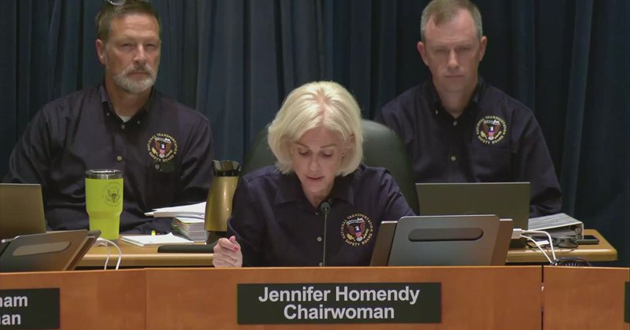

Fox News (Twitter/X)

WATCH LIVE: NTSB holds hearing on deadly UPS cargo plane crash https://twitter.com/i/broadcasts/1AxRnaOWzmjxl

## FoxNewsTwitter — post 341920

  

Fox News (Twitter/X)

RT @foxnewspolitics: FIRST ON FOX: Democratic Maine Senate candidate Graham Platner's deleted Reddit account reveals graphic posts about masturbating in portable toilets and praising explicit military restroom graffiti — the latest in a growing trail of vulgar comments that could define his race against Susan Collins.

Platner has dismissed past controversies as 'joking' and 's***posting,' but GOP strategists say the pattern raises fundamental questions about his judgment and fitness for office.

He became Democrats' presumptive nominee after Gov. Janet Mills dropped out last month.

## FoxNewsTwitter — post 341916

Fox News (Twitter/X)

Firefighters spring into action as a dust fire rapidly spreads in Southern California, triggering evacuations.

By Monday afternoon, crews said the fire had already grown to more than 800 acres before nearly doubling in size.

Around 500 personnel were battling the flames alongside five helicopters and three air tankers as residents were ordered to evacuate and thick smoke filled the sky.

## FoxNewsTwitter — post 341915

  <a href="telegram/content/FoxNewsTwitter_341915_1779192804.mp4" target="_blank">🎬 Download video</a>

Fox News (Twitter/X)

NEW: The clock is still ticking on Iran.

President Trump is giving Tehran more time after requests came in from regime officials to delay military action and continue negotiations, but he’s still threatening a massive strike if a deal falls apart.

The U.S. is now in what officials are calling a “temporary pause” to see whether diplomacy can still work.

Iran says “dialogue does not equal surrender” and is mocking President Trump for repeatedly setting deadlines and then extending them.

@TreyYingst reports.

## pm_afshaa — post 91023

زلزله شدید در خرم اباد لرستان

💧 Rainbet.com the #1 Non-KYC Crypto Casino & Sportsbook @rainbetcom

😁 @Pm_Afshaa

## pm_afshaa — post 91022

  <a href="telegram/content/pm_afshaa_91022_1779192806.webm" target="_blank">🎬 Download video</a>

🔴وال‌استریت ژورنال:
چند مقام خلیج فارس از برخی کشورهایی که ترامپ به آنها اشاره کرده بود گفتن از طرح قریب‌الوقوعی که او درباره حمله به ایران توصیف کرده بود، اطلاعی نداشتن.

💧 Rainbet.com the #1 Non-KYC Crypto Casino & Sportsbook @rainbetcom

😁 @Pm_Afshaa

## pm_afshaa — post 91021

حیاتی، معاون امنیتی خوزستان :امروز تو اندیمشک داشتیم سامانه پدافند هوایی رو تست می‌کردیم که یه پرتابه‌اش به یه ساختمون مسکونی خورد و 4 نفر زخمی شدن

💧 Rainbet.com the #1 Non-KYC Crypto Casino & Sportsbook @rainbetcom

😁 @Pm_Afshaa

## pm_afshaa — post 91020

  <a href="telegram/content/pm_afshaa_91020_1779192806.webm" target="_blank">🎬 Download video</a>

🔴دادگاه نتانیاهو امروز به دلایل جلسات امنیتی بازم لغو شد.

💧 Rainbet.com the #1 Non-KYC Crypto Casino & Sportsbook @rainbetcom

😁 @Pm_Afshaa

## pm_afshaa — post 91019

  <a href="telegram/content/pm_afshaa_91019_1779192807.webm" target="_blank">🎬 Download video</a>

🔴بورس ایران بعد از 80 روز فعالیتش رو از سر گرفت و معاملات بازار سهام صبح امروز آغاز شد.

با این حال، بیش از 40 نماد مرتبط با شرکت‌های آسیب‌دیده در جنگ هنوز بازگشایی نشدن و ارزش صف فروش به بیش از 10 همت رسیده. همچنین نمادهای بانکی و خودرویی فعال شدن، اما بسیاری از نمادهای بزرگ بازار در محدوده منفی معامله میشن.

💧 Rainbet.com the #1 Non-KYC Crypto Casino & Sportsbook @rainbetcom

😁 @Pm_Afshaa

## pm_afshaa — post 91018

  <a href="telegram/content/pm_afshaa_91018_1779192807.webm" target="_blank">🎬 Download video</a>

🔴دموکرات‌های سنای آمریکا امروز قصد دارن برای هشتمین بار درباره قطعنامه « محدود کردن اختیارات جنگی ترامپ» رأی‌گیری کنن؛

قطعنامه‌ای که به مشارکت نیروهای آمریکا در جنگ با جمهوری اسلامی بدون مجوز کنگره پایان میده.

💧 Rainbet.com the #1 Non-KYC Crypto Casino & Sportsbook @rainbetcom

😁 @Pm_Afshaa

## pm_afshaa — post 91017

  <a href="telegram/content/pm_afshaa_91017_1779192808.webm" target="_blank">🎬 Download video</a>

🔴غریب‌آبادی، معاون عراقچی:
جمهوری اسلامی در پیشنهاد اخیرش به آمریکا، مجموعه‌ای از مطالبات از جمله حق غنی‌سازی، پایان جنگ در همه جبهه‌ها، رفع محاصره دریایی، آزادسازی دارایی‌های بلوکه‌شده، جبران خسارت‌های جنگ و خروج نیروهای آمریکایی از اطراف ایران رو مطرح کرده.

💧 Rainbet.com the #1 Non-KYC Crypto Casino & Sportsbook @rainbetcom

😁 @Pm_Afshaa

## pm_afshaa — post 91016

🔴نشریه AFP : همزمان با سفر پوتین به چین، روسیه قصد داره رزمایش نیروهای هسته‌ایشو برگزار کنه

💧 Rainbet.com the #1 Non-KYC Crypto Casino & Sportsbook @rainbetcom

😁 @Pm_Afshaa

## DEJradio — post 4734

🚨 هر توافقی با جمهوری اسلامی باید به تأیید کنگرۀ آمریکا برسد

لیندزی گراهام، سناتور جمهوری‌خواه آمریکایی تأکید کرد هر توافقی میان واشینگتن و جمهوری اسلامی باید برای تأیید به کنگره ارائه شود.
او همچنین خواستار پایان غنی‌سازی اورانیوم و توقف پشتیبانی جمهوری اسلامی از گروه‌های نیابتی شد.
دونالد ترامپ اعلام کرده حملۀ برنامه‌ریزی‌شده علیه جمهوری اسلامی را به درخواست رهبران چند کشور عربی به تعویق انداخته است.

#ترامپ #توافق #لیندسی_گراهام
@DEJradio

## DEJradio — post 4733

  <a href="telegram/content/DEJradio_4733_1779192808.webm" target="_blank">🎬 Download video</a>

🚨📢 ‏بر اساس گزارش منابع میدانی روز سه‎شنبه ۲۹ اردیبهشت ۱۴۰۵ توپ‌های ضدهوایی و راکت‌های پدافند در یزد، دزفول، بوشهر، اهواز و اندیمشک فعال شدند. منابع محلی می‌گویند در آسمان صدای پهپاد شنیدند. هنوز به طور رسمی اعلام نشده است که چرا پدافند فعال شد اما شامگاه دوشنبه ۲۸ اردیبهشت نیز گزارش شد که در بعضی شهرها پدافند فعال شد.

استانداری خوزستان اعلام کرده است که به علت سقوط پرتابه در اندیمشک چهار نفر مجروح شدند. گفته می‌شود این پرتابه مهمات پدافند خودی بوده که روی خانه‌های مردم سقوط کرده است.

#خوزستان #پدافند
@DEJradio

## DEJradio — post 4732

🚨 شرکت هندی جریمۀ نقض تحریم‌های جمهوری اسلامی را می‌پردازد

وزارت خزانه‌داری آمریکا اعلام کرد شرکت هندی آدانی اینترپرایزس، با پرداخت ۲۷۵ میلیون دلار برای بستان پروندۀ نقض احتمالی تحریم‌های جمهوری اسلامی موافقت کرده است.
بنا بر گزارش‌ها، در این پرونده به ۳۲ مورد نقض احتمالی تحریم‌های جمهوری اسلامی اشاره شده است.
این شرکت هندی بین سال‌های ۲۰۲۳ تا ۲۰۲۵ محموله‌های گاز مایع با منشأ احتمالی ایران را از طریق واسطه‌هایی در دبی خریده بود.

#تحریم #جمهوری_اسلامی
@DEJradio

## DEJradio — post 4731

⭕️ 
🧨 صدای انفجار در جزیرۀ قشم شنیده شد

رسانه‌های حکومتی در ایران گزارش دادند ظهر سه‌شنبه صدای انفجار در جزیرۀ قشم از سوی ساکنان محلی شنیده شده است.
معاون امنیتی استانداری هرمزگان مدعی شد صدای انفجار مربوط به خنثی‌سازی مهمات عمل‌نکردۀ جنگ چهل روزه بود.

#قشم #انفجار
@DEJradio

## DEJradio — post 4730

⭕️ یک نمایندۀ مجلس گفت مذاکره نتیجه نمی‌دهد

اسماعیل کوثری، نمایندۀ مجلس شورای اسلامی و از فرماندهان پیشین سپاه پاسداران، گفت جمهوری اسلامی «قطعا و یقینا» از طریق مذاکره به نتیجه نمی‌رسد.
او همچنین مدعی شد دونالد ترامپ جنگ را باخته و تلاش می‌کند خود را پیروز نشان دهد.
کوثری گفت تلاش‌ برای دستیابی به نتیجه «شدنی نیست».

#مذاکرات #سپاه_تروریستی_پاسداران

@DEJradio

## DEJradio — post 4729

⭕️ نیویورک تایمز: جمهوری اسلامی الگوهای پروازی جنگنده‌های آمریکا را بررسی کرده است

نشریۀ نیویورک تایمز، به نقل از مقام‌های آمریکایی گزارش داد فرماندهان جمهوری اسلامی، احتمالا با کمک روسیه، الگوهای پروازی جنگنده‌ها و بمب‌افکن‌های آمریکایی را بررسی کرده‌اند.
به نوشتۀ این روزنامۀ آمریکایی، سرنگونی یک جنگندۀ اف-۱۵ئی و اصابت آتش زمینی به یک جنگنده اف-۳۵ سبب شده مقام‌های جمهوری اسلامی فکر کنند تاکتیک‌های پروازی آمریکا قابل پیش‌بینی است.
بنا بر این گزارش، جمهوری اسلامی بخش زیادی از تسلیحات باقی‌ماندۀ خود را جابه‌جا کرده و تلاش دارد توانایی مقاومت در برابر آمریکا را به نیروهایش القا کند.
نیویورک تایمز به نقل از یک مقام نظامی آمریکا نوشت جمهوری اسلامی در طول آتش‌بس یک‌ماهه، ده‌ها پایگاه موشکی آسیب‌دیده را از زیر آوار خارج کرده است.

#جنگ #روسیه #جمهوری_اسلامی
@DEJradio

## DEJradio — post 4728

⭕️ فرماندۀ پیشین سپاه گفت آمریکا می‌خواهد جمهوری اسلامی تلسیم شود

محسن رضایی، فرماندۀ پیشین سپاه پاسداران در واکنش به تعویق حمله به جمهوری اسلامی نوشت آمریکا با تعیین و لغو ضرب‌الاجل نظامی تلاش داردجمهوری اسلامی را تسلیم کند.
مشاور مجتبی خامنه‌ای، در شبکۀ اجتماعی اکس مدعی شد «مشت آهنین نیروهای مسلح» آمریکا را به عقب‌نشینی وادار می‌کند.

#مذاکرات #تسلیم
@DEJradio

## DEJradio — post 4727

⭕️ قطر، عربستان و امارات برای توافق با جمهوری اسلامی در تماس‌اند

دونالد ترامپ گفت قطر، عربستان سعودی و امارات متحده عربی با آمریکا و جمهوری اسلامی در تماس‌اند و احتمال رسیدن به توافق وجود دارد.
رئیس جمهوری آمریکا افزود این کشورها مستقیما با مقام‌های آمریکایی و تهران گفت‌وگو می‌کنند.
ترامپ همچنین گفت اگر آمریکا بتواند بدون بمباران شدید، با تهران به نتیجه برسد، بسیار خشنود می‌شود.

#مذاکرات #امارات #عربستان
@DEJradio

## DEJradio — post 4726

⭕️ تهران برای مذاکرات هسته‌ای مشکلی ندارد

هاکان فیدان، وزیر امور خارجۀ ترکیه، اعلام کرد جمهوری اسلامی دربارۀ پذیرش اصل مذاکرات هسته‌ای مشکل بنیادی ندارد.
فیدان گفت اختلاف‌ها بیشتر بر سر نوع امتیازهایی است که تهران در برابر توافق احتمالی دریافت می‌کند.
به گفتۀ وزیر امور خارجۀ ترکیه، مقامات جمهوری اسلامی همچنین در مورد چگونگی اجرای توافق و تضمین آن، خواسته‌هایی دارند.

#مذاکرات #ترکیه #جمهوری_اسلامی
@DEJradio

## DEJradio — post 4725

⭕️ اسرائیل برای احتمال ازسرگیری جنگ با جمهوری اسلامی آماده می‌شود

بنا بر گزارش آی۲۴ نیوز، بنیامین نتانیاهو، نخست‌وزیر اسرائیل اخیرا دو نشست کابینۀ امنیتی را به‌صورت پیاپی برگزار کرده است.
مقام‌های اسرائیل اعلام کردند این کشور در آماده‌باش کامل قرار دارد.
بنا بر گزارش‌ها، اسرائیل خود را برای تصمیم احتمالی دونالد ترامپ درمورد ازسرگیری جنگ تا پایان هفته آماده می‌کند.
این آمادگی‌ها، در پی گفت‌وگوی تلفنی ۳۰ دقیقه‌ای ترامپ و نتانیاهو سرگرفته است.
برپایۀ این گزارش، هماهنگی‌های فشرده میان واشینگتن و اورشلیم برای گزینه‌های گوناگون ادامه دارد.

#جنگ #اسرائیل #جمهوری_اسلامی
@DEJradio

## DEJradio — post 4724

⭕️ بورس ایران پس از ۸۰ روز تعطیلی آغاز به کار کرد

رسانه‌های داخل ایران گزارش دادند معاملات بورس تهران صبح سه‌شنبه ۲۹ اردیبهشت پس از ۸۰ روز توقف ازسر گرفته شد.
بنا بر گزارش‌ها، بیش از ۴۰ نماد که شرکت‌های آنها در حملات آمریکا و اسرائیل آسیب دیده‌ است، فعلا بازگشایی نمی‌شود.
گزارش‌ها نشان می‌دهد اکثر نمادهای بازگشایی نشده، مربوط به صنایع پتروشیمی و فولاد است.
تاکنون تنها بخشی از نمادهای بانکی، خودرویی و شماری از صندوق‌های اهرمی وارد معاملات شده‌ است.

#جنگ #بورس
@DEJradio

## DEJradio — post 4723

⭕️ ادعای غریب‌آبادی در مورد شروط جمهوری اسلامی برای پایان جنگ با آمریکا

کاظم غریب‌آبادی، معاون وزیر امور خارجۀ جمهوری اسلامی، ادعا کرد تهران در مذاکرات اخیر با آمریکا خواستار حفظ حق غنی‌سازی، خروج نیروهای آمریکایی از پیرامون ایران و پایان جنگ در همۀ جبهه‌ها از جمله لبنان شده است.
غریب‌آبادی همچنین رفع تحریم‌ها، آزادسازی دارایی‌های بلوکه شده، پایان محاصرۀ دریایی و پرداخت خسارت‌های جنگی از سوی آمریکا را از دیگر شروط جمهوری اسلامی عنوان کرد.
غریب‌آبادی این اظهارات را در نشست کمیسیون امنیت ملی و سیاست خارجی مجلس مطرح کرد.
به‌خلاف گفته‌های این مقام حکومتی، منابع خارجی می‌گویند تهران از برخی خواسته‌های پیشین خود از جمله در مورد دریافت خسارت جنگی، عقب‌نشینی کرده است.

#جنگ #غنی‌سازی #مذاکرات
@DEJradio

## DEJradio — post 4722

⭕️ 
🔴 گفت‌وگوی وزرای خارجۀ قطر و ترکیه برای رفع بحران جمهوری اسلامی

محمد بن عبدالرحمن آل ثانی، نخست‌وزیر و وزیر امور خارجۀ قطر، در تماس تلفنی با هاکان فیدان، وزیر خارجۀ ترکیه، درمورد آخرین تحولات منطقه گفت‌وگو کرد.
این دو مقام منطقه‌ای دربارۀ آتش‌بس میان آمریکا و جمهوری اسلامی و روند تحولات در خاورمیانه، رایزنی کردند.
وزیر امور خارجۀ قطر بر ضرورت پشتیبانی از همۀ طرف‌ها از تلاش‌های میانجی‌گرانه وهمچنین بر ادامۀ مسیر مذاکرات برای جلوگیری از تشدید تنش‌ها تاکید کرده است.
قطر و ترکیه پیش از جنگ چهل روزه نیز تلاش‌های بسیاری برای دور نگه داشتن جمهوری اسلامی از حملات آمریکا و اسرائیل انجام داده بودند.

#قطر #ترکیه #جمهوری_اسلامی
@DEJradio

## DEJradio — post 4721

🚨
🌐 نت‌بلاکس گزارش داد جمهوری اسلامی در پی گسترش سانسور دیجیتال فراتر از مرزهای ایران است

نت‌بلاکس روز سه‌شنبه اعلام کرد قطعی سراسری اینترنت در ایران به روز هشتاد و یکم رسیده و از ۱۹۲۰ ساعت فراتر رفته است.
این نهاد جهانی پایش اینترنت افزود جمهوری اسلامی همزمان تلاش می‌کند کنترل دیجیتال خود را به خارج از مرزهای ایران گسترش دهد.
به گزارش نت‌بلاکس، مقامات رژیم از جمله تلاش دارند کابل‌های اینترنتی سایر کشورها را در تنگۀ هرمز تحت کنترل بگیرند. بنا بر این گزارش، جمهوری اسلامی همچنین بر شرکت‌های فناوری برای تبعیت از قوانین رژیم، فشار می‌آورد.
نت‌بلاکس همچنین به عملیات اخیر یوروپل اشاره کرد که در آن بیش از ۱۴ هزار پست و لینک مرتبط با سپاه پاسداران، در فضای آنلاین شناسایی شد و هدف قرار گرفت.

#جمهوری_اسلامی #سانسور
@DEJradio

## DEJradio — post 4720

🚨
🔴 سخنگوی دولت گفت «منویات رهبری» در مسألۀ اینترنت مهم است

فاطمه مهاجرانی، سخنگوی دولت مسعود پزشکیان مدعی شد دولت طرفدار محدودیت اینترنت نیست و به دنبال «گره‌گشایی» در این حوزه است.
او تاکید کرد این اقدامات با در نظر گرفتن «منویات رهبری» و ملاحظات موجود انجام خواهد شد.
فاطمه مهاجرانی همچنین ادعا کرد محدودیت‌های اخیر اینترنت، ناشی از شرایط جنگی است.

#اینترنت #موشتبا
@DEJradio

## DEJradio — post 4719

  <a href="telegram/content/DEJradio_4719_1779192808.webm" target="_blank">🎬 Download video</a>

🔺📌 ‏ملخ جهنده؛ روایتی از فرارهای احمدرضا رادان

یکی از فرماندهان جنایتکار نظام که مردم ایران مشتاقانه در انتظار شنیدن خبر به هلاکت رسیدن او هستند، احمدرضا رادان، قاتل فرزندان ملت است؛ او تا این لحظه از دو جنگ ۱۲ روزه و ۴۰ روزه جان سالم به در برده است اما چگونه؟

رادان فردی بسیار ترسو اما موذی است و به‌ محض آن‌که خطری را احساس کند، از حضور در محل‌های ثابت خود، مانند منزل و دفتر کارش، خود داری می‌کند. این در حالی است که به فرماندهان زیرمجموعه و نیروهای خود دستور می‌دهد حتماً در محل کار حضور داشته باشند اینگونه سازمان خود را فعال نشان میدهد. به هلاکت رسیدن تعداد زیادی از سرداران و نیروهای فراجا در مقرهای خود، تأییدی بر همین موضوع است.

مأموریت‌ها در نیروی انتظامی عمدتاً روتین و روزمره‌اند و از سوی فرماندهان رده‌های پایین‌تر نیز قابل اجرا و نظارت هستند؛ بنابراین، برخلاف سایر فرماندهان ارشد در دیگر سازمان‌های نیروهای مسلح که درگیر جنگ‌اند و باید شخصاً دستورات را صادر و بر اجرای آن نظارت کنند و این باعث لو رفتن مکان آنها می‌شود، نیازی به حضور فیزیکی یا حضور دائمی رادان پشت شبکه‌های ارتباطی و بی‌سیم وجود ندارد.

از سوی دیگر، رادان یکی از بی‌اخلاق‌ترین و بزدل‌ترین فرماندهان جمهوری اسلامی است و هنگام خطر هیچ ابایی ندارد از این‌که جان مردم عادی را سپر خود کند او در جنگ ۱۲ روزه در بیمارستان سجاد تهران و در جنگ ۴۰ روزه در یکی از ایستگاه‌های متروی تهران، شب ها را همراه با ترس سپری می کرد.
یک بار جستی ملخک...

#احمدرضا_رادان #جنگ۱۲روزه #جنگ۴۰روزه
@DEJradio

## DEJradio — post 4718

  <a href="telegram/content/DEJradio_4718_1779192809.webm" target="_blank">🎬 Download video</a>

🚨
🔺 واکنش مثبت بازار اروپا به تعویق حمله به جمهوری اسلامی

بازارهای اروپایی روز سه‌شنبه به تعلیق حملۀ آمریکا به جمهوری اسلامی واکنش مثبت نشان دادند.
پس از اظهارات شامگاه دوشنبۀ دونالد ترامپ، درمورد توقف حملۀ برنامه‌ریزی‌شده به جمهوری اسلامی، شاخص‌های بازار سهام اروپا اندکی افزایش یافت.
شاخص استوکس ۶۰۰ اروپا صبح سه‌شنبه با رشد ۰.۲ درصدی به ۶۱۱ واحد رسید.
به گزارش خبرگزاری رویترز، بازارهای اروپایی به دلیل وابستگی بالا به واردات نفت، در هفته‌های اخیر عملکرد ضعیف‌تری نسبت به بازارهای جهانی داشته‌اند.

#اروپا #ترامپ #جنگ
@DEJradio

## DEJradio — post 4717

  <a href="telegram/content/DEJradio_4717_1779192809.webm" target="_blank">🎬 Download video</a>

🔸
🔺 بریتانیا خواستار بازگشایی بی‌درنگ تنگۀ هرمز شد

ایووت کوپر، وزیر امور خارجۀ بریتانیا، هشدار داد ادامه بسته‌ماندن تنگۀ هرمز می‌تواند بحران جهانی غذا را تشدید کند.
کوپر گفت دنیا دیگر نمی‌تواند برای بازگشایی این آبراه صبر کند و میلیون‌ها نفر ممکن است با خطر گرسنگی روبه‌رو شوند.
وزارت امور خارجۀ بریتانیا اعلام کرد طرح‌هایی برای «ماموریت چندملیتی تنگۀ هرمز» با هدف پشتیبانی از بازگشایی بی‌درنگ این مسیر در حال بررسی است.

#بریتانیا #تنگه_هرمز
@DEJradio

## DEJradio — post 4716

  

💀
🚨 کشته‌شدن یک سـ.ـپاهی درعملیات خنثی‌سازی بمب

حمید خانی سـ.ـپاهی بازنشسته از شهرستان بروجن، که به‌صورت داوطلبانه در بخش مهندسی قرارگاه خاتم‌الانبیا مشغول کار بود در عملیات خنثی‌سازی بمب‌های عمل‌نکرده برجای مانده از جنگ ۴۰ روزه در تهران کشته شد.

#IRGCterrorists #حذف_هدفمند #جنگ۴۰روزه
@DEJradio

## DEJradio — post 4715

  <a href="telegram/content/DEJradio_4715_1779192810.webm" target="_blank">🎬 Download video</a>

👑
🔺 شاهزاده رضا پهلوی: «برای انجام نقش خودم به بهترین نحو، باید کاملا موضع فراجناحی و بی‌طرف داشته باشم. نه به نفع پادشاهی و نه به نفع جمهوری؛ به نفع دموکراسی!»

نشست آینده تکنولوژی در ایران
سان‌فرانسیسکو، ۲۶ اردیبهشت ۲۵۸۵/۱۴۰۵

#شاهزاده_رضا_پهلوی #ایران_را_پس_میگیریم
@DEJradio

## kianmeli1 — post 87492

  <a href="telegram/content/kianmeli1_87492_1779192811.mp4" target="_blank">🎬 Download video</a>

🔴وزیر دارایی اسرائیل:
من اینجا به طور قاطع می‌گویم: اگر حزب‌الله تسلیم نشود، ما بخش‌های بیشتری از جنوب لبان را تصرف خواهیم کرد
https://t.me/kianmeli1

## kianmeli1 — post 87491

  

🔴هزینه آموزش رانندگی با افزایش ۵۶ درصدی به ساعتی ۶۰۰ هزار تومان رسید و مجموع هزینه دریافت گواهینامه در شرایط فعلی حدود ۱۵ میلیون تومان برآورد می‌شود
https://t.me/kianmeli1

## kianmeli1 — post 87489

🔴حالتان از این همه تناقض و دورویی بهم نمی‌خورد؟

✍️ياشار سلطاني
دیروز هتل تاریخی عامری‌ها کاشان را به‌خاطر «حجاب» پلمب کردند؛ مسافران سرگردان شدند و ۹۰ نفر از پرسنل بیکار!

‏اما همزمان، شب‌ها در میدان‌ها و مراسم‌هایی مثل جان فدا⁩، شعار «بی‌حجاب هم خواهر ماست» تکرار می‌شود و همان زنان با آزادترین پوشش در قاب رسمی دیده می‌شوند.

‏اگر حجاب قانون است، چرا اجرای آن این‌قدر مقطعی و گزینشی است؟

‏حالتان از این همه تناقض و دورویی بهم نمی‌خورد؟
https://t.me/kianmeli1

## kianmeli1 — post 87480

  <a href="telegram/content/kianmeli1_87480_1779192813.mp4" target="_blank">🎬 Download video</a>

🔴وضعیت فعلی کشور
https://t.me/kianmeli1

## kianmeli1 — post 87479

  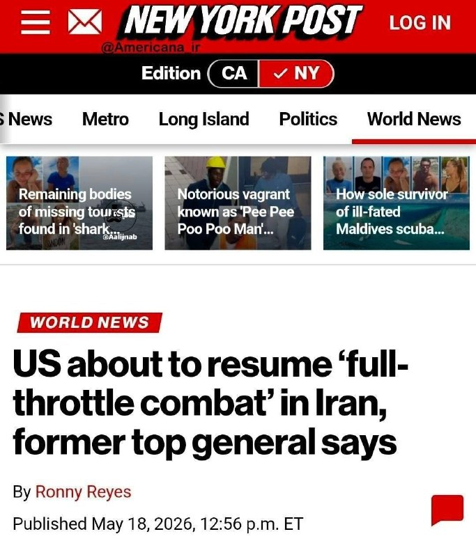

🔴نیویورک پست به‌نقل از یک ژنرال ارشد بازنشسته آمریکایی اعلام کرد که ایالات متحده در آستانه ازسرگیری نبرد با ایران با تمام توان است
https://t.me/kianmeli1

## kianmeli1 — post 87478

  

🔴خبرنگار بلومبرگ:

آمریکا هفته گذشته حدود ۹.۹ میلیون بشکه نفت از ذخایر استراتژیک نفت(SPR) خود را به بازار تزریق کرد

این یک رکورد بی‌سابقه در جریان روزانه‌ی بیش از ۱.۴ میلیون بشکه در روز است.

دومین هفته‌ی متوالی است که نرخ تخلیه ذخایر استراتژیک رکورد می‌زند.
https://t.me/kianmeli1

## kianmeli1 — post 87477

  <a href="telegram/content/kianmeli1_87477_1779192815.mp4" target="_blank">🎬 Download video</a>

🔴مداح: بزنید که امتحانا مجازی شه!!

در حال حاضر کشور توسط مداحان با کارناوال شبانه کنترل میشود
https://t.me/kianmeli1

## kianmeli1 — post 87476

🔴اسرائیل به شدت خواهان ورود امارات به جنگ مستقیم علیه ایران است «یکی از دلایل» این است که امارات قطب سرمایه گذاری نباشد و تبدیل به کشوری نامطمئن برای سرمایه گذاران شود و در عوض اسرائیل به قطب اقتصادی و سرمایه گذاری تبدیل شود https://t.me/kianmeli1

## kianmeli1 — post 87475

🔴اسرائیل به شدت خواهان ورود امارات به جنگ مستقیم علیه ایران است

«یکی از دلایل» این است که امارات قطب سرمایه گذاری نباشد و تبدیل به کشوری نامطمئن برای سرمایه گذاران شود و در عوض اسرائیل به قطب اقتصادی و سرمایه گذاری تبدیل شود
https://t.me/kianmeli1

## IranIntlTV — post 337920

  <a href="telegram/content/IranIntlTV_337920_1779192817.mp4" target="_blank">🎬 Download video</a>

یک شهروند با ارسال پیامی به ایران‌اینترنشنال می‌گوید در قشم سوخت به بازار سیاه منتقل شده و مردم نمی‌توانند بنزین پیدا کنند.

## IranIntlTV — post 337918

  <a href="telegram/content/IranIntlTV_337918_1779192818.mp4" target="_blank">🎬 Download video</a>

دومین جلسه رسیدگی به پرونده متهمان حمله با چاقو به پوریا زراعتی، مجری تلویزیون ایران‌اینترنشنال، در حال برگزاری است. دادستان بریتانیا در نشست دوشنبه گفت «ناندیتو بادیا» و «جورج استانا»، دو متهم رومانیایی این پرونده، به‌عنوان عوامل نیابتی جمهوری اسلامی عمل کردند.
گفت‌وگو با تاج‌الدین سروش، عضو تحریریه ایران‌اینترنشنال

@iranintltv

## IranIntlTV — post 337917

روزنامه فایننشال تایمز گزارش داد در پی محاصره دریایی آمریکا، صادرات نفت ایران به شرق آسیا متوقف شده و بخش قابل توجهی از نفت خام روی نفتکش‌های قدیمی در خلیج فارس ذخیره شده است.
گفت‌وگو با آرش آزرمی، دبیر بخش اقتصادی ایران‌اینترنشنال
@iranintltv

## IranIntlTV — post 337916

  

🔻مریم عبدالهی، همسر رشید مظاهری، با انتشار پستی در اینستاگرام از زندانی بودن دروازه‌بان پیشین استقلال و تیم ملی فوتبال ایران در سلول انفرادی زندان ارومیه خبر داد.

🔹رشید مظاهری پس از کشتار معترضان از سوی جمهوری اسلامی در ۱۸ و ۱۹ دی، با انتشار ویدیویی در پنجم اسفند، علی خامنه‌ای را مسئول کشتار مردم معرفی کرده بود. پس از انتشار آن پست، هیچ خبری از وضعیت مظاهری منتشر نشد.

🔹مریم عبدالهی در پستی که در اینستاگرام منتشر کرد، نوشت: «ماه‌هاست برای آزادی رشید می‌جنگم و پیگیر وضعیتش هستم، اما امروز فهمیدم او را به زندان مرکزی ارومیه و در شرایط بسیار سخت انفرادی منتقل کرده‌اند.»

🔹او همچنین نوشت: «رشید همیشه برای حق ایستاد و اکنون هزینه همین ایستادگی را با حبس در انفرادی می‌دهد. اما این سکوت ظالمانه دیگر کافی است. از جامعه ورزش، رسانه‌ها و مردم وطن‌پرست می‌خواهم بیش از گذشته صدای رشید مظاهری باشند. ما فقط شفافیت و رسیدگی فوری و عادلانه می‌خواهیم. او برای حق ایستاد و من هم تا زمان آزادی‌اش با تمام توان کنار او می‌ایستم و عقب‌نشینی نمی‌کنم.»

@iranintltvsport

## IranIntlTV — post 337915

  

پس از گزارش رسانه‌ها درباره شنیدن صدای چند انفجار مهیب در جزیره قشم، معاون امنیتی استاندار هرمزگان اعلام کرد صدای انفجارهای شنیده‌شده ظهر امروز در جزیره قشم مربوط به خنثی‌سازی مهمات عمل‌نکرده بوده است.

او در پایان افزود: «از مردم جزیره قشم می‌خواهیم به هیچ‌وجه نگران نباشند و به شایعات فضای مجازی توجه نکنند.»

این در حالی است که در موارد مشابه، مقام‌های جمهوری اسلامی پیش از اجرای عملیات خنثی‌سازی مهمات عمل‌نکرده، نسبت به احتمال شنیده شدن صدای انفجار اطلاع‌رسانی می‌کردند، اما درباره عملیات امروز در قشم اطلاعیه قبلی منتشر نشده بود.
https://iranintl.com/202605195385

## IranIntlTV — post 337914

  <a href="telegram/content/IranIntlTV_337914_1779192820.mp4" target="_blank">🎬 Download video</a>

یک شهروند با ارسال پیامی به ایران‌اینترنشنال می‌گوید: «باورم نمی‌شود در قرن ۲۱، یک حکومت نزدیک به سه ماه است که اینترنت را به روی مردم قطع کرده، این موضوع برای هیچ سازمان بین‌المللی اهمیت ندارد؟»

## IranIntlTV — post 337913

  

ولی‌الله حیاتی، معاون امنیتی انتظامی استانداری خوزستان، ظهر سه‌شنبه اعلام کرد که صدای شلیک‌های شنیده‌شده در آسمان اندیمشک ناشی از «تست سامانه پدافند هوایی» بوده است.
حیاتی گفت بر اثر سقوط یک پرتابه در منطقه‌ای مسکونی، چهار شهروند مجروح شده‌اند که به گفته او در وضعیت پایدار قرار دارند و هم‌اکنون در مراکز درمانی تحت مداوا هستند.
او افزود: «با هوشیاری نیروهای مسلح و مدیریت استان، شرایط کاملا تحت کنترل است.»
https://iranintl.com/202605193667

## IranIntlTV — post 337912

  

رسانه‌های ایران از شنیده شدن صدای انفجار در قشم در ظهر روز سه‌شنبه خبر دادند. خبرگزاری مهر گزارش داد که هنوز هیچ‌یک از نهادهای رسمی درباره علت وقوع این صداها اظهارنظر نکرده‌اند.

@iranintltv

## IranIntlTV — post 337911

  <a href="telegram/content/IranIntlTV_337911_1779192822.mp4" target="_blank">🎬 Download video</a>

سرخط خبرهای سه‌شنبه ۲۹ اردیبهشت
@iranintltv

## IranIntlTV — post 337910

  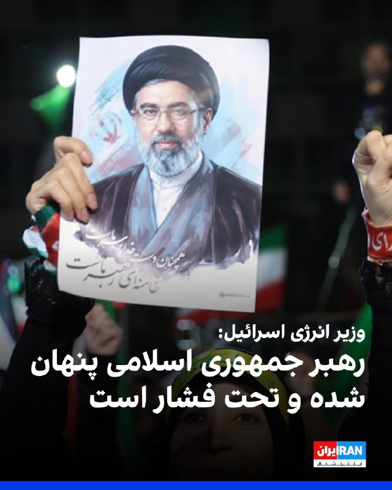

الی کوهن، وزیر انرژی و عضو کابینه سیاسی-امنیتی اسرائیل، گفت: «رهبر جمهوری اسلامی پنهان شده و تحت فشار است. محاصره هرمز اقتصاد ایران را به سمت فروپاشی می‌برد و اگر تهران برنامه هسته‌ای را از سر بگیرد، اسرائیل حمله خواهد کرد.»

او افزود: «اسرائیل اجازه نخواهد داد جمهوری اسلامی به سلاح هسته‌ای نزدیک شود و برای حفظ برتری نظامی خود بیش از ۱۰۰ میلیارد دلار سرمایه‌گذاری خواهد کرد.»
https://iranintl.com/202605196327

## IranIntlTV — post 337909

  

🔻روزنامه نیویورک‌پست گزارش داد قیمت بلیت‌های جام جهانی ۲۰۲۶ به‌طور قابل توجهی کاهش یافته است.

🔹بر اساس این گزارش، برگزارکنندگان جام جهانی در ایالات متحده، کانادا و مکزیک با استقبال کمتر از انتظار هواداران روبه‌رو شده‌اند و همین مسئله باعث افت قیمت بلیت‌ها شده است.

🔹نیویورک‌پست نوشت برخی بلیت‌ها که پیش‌تر با قیمت‌های بسیار بالا عرضه شده بودند، اکنون با کاهش چشمگیر قیمت فروخته می‌شوند. نگرانی درباره هزینه بالای سفر، اقامت و حمل‌ونقل در شهرهای میزبان از جمله دلایل کاهش تقاضا عنوان شده است.

🔹این گزارش همچنین به نگرانی مقام‌های فیفا درباره تصاویر ورزشگاه‌های نیمه‌خالی اشاره کرده و نوشته است برگزارکنندگان در تلاش‌اند با کاهش قیمت‌ها و طرح‌های تشویقی، فروش بلیت‌ها را افزایش دهند.

🔹جام جهانی ۲۰۲۶ برای نخستین‌بار با حضور ۴۸ تیم برگزار خواهد شد و گستردگی جغرافیایی مسابقات، چالش‌های تازه‌ای برای هواداران ایجاد کرده است.

@iranintltvsport

## IranIntlTV — post 337908

  <a href="telegram/content/IranIntlTV_337908_1779192825.mp4" target="_blank">🎬 Download video</a>

مهدی پیرصالحی، رییس سازمان غذا و دارو، هشدار داد افزایش قیمت دارو می‌تواند باعث نارضایتی عمومی شود و به همین دلیل بیمه‌ها باید پوشش بیشتری برای بیماران فراهم کنند.

گفت‌وگو با منصوره حسینی‌یگانه، عضو تحریریه ایران‌اینترنشنال

@iranintltv

## IranIntlTV — post 337907

  <a href="telegram/content/IranIntlTV_337907_1779192827.mp4" target="_blank">🎬 Download video</a>

یکی از اعضای شورای شهر زنجان هنگام تحصن کارگران برای درخواست افزایش حقوق، با خودروی دولتی از روی پای یک پارکبان معترض عبور کرد.

گفت‌وگو با آیه دریس، عضو تحریریه ایران‌اینترنشنال
@iranintltv

## IranIntlTV — post 337906

  

در ادامه لفاظی‌های تهدیدآمیز مقام‌های حکومت، محمد اکرمی‌نیا، سخنگوی ارتش جمهوری اسلامی، گفت در صورت حمله مجدد دشمن، «با ابزارها و شیوه‌های جدید، جبهه‌های جدیدی را علیه آنها خواهیم گشود».

او اضافه کرد: «جمهوری اسلامی محاصره‌پذیر و قابل شکست نیست.»
https://iranintl.com/202605192299

## IranIntlTV — post 337905

شرکت آلکاتل اعلام کرد تعمیر کابل‌های اینترنت زیردریایی در خلیج فارس را به‌دلیل ناامنی و تهدیدهای سپاه پاسداران متوقف کرده‌ است. این شرکت تاکید کرد سپاه از اپراتورهای خارجی خواسته برای نگه‌داری این زیرساخت‌ها به جمهوری اسلامی هزینه حفاظت بپردازند.
گفت‌وگو با علی‌حسین قاضی‌زاده، عضو تحریریه ایران‌اینترنشنال
@iranintltv

## IranIntlTV — post 337904

  <a href="telegram/content/IranIntlTV_337904_1779192829.mp4" target="_blank">🎬 Download video</a>

ویدیوی ارسال‌شده به ایران‌اینترنشنال، شعارنویسی در حمایت از شاهزاده رضا پهلوی را روی یکی از دیوارهای شهر کیش نشان می‌دهد.

## IranIntlTV — post 337903

  <a href="telegram/content/IranIntlTV_337903_1779192830.mp4" target="_blank">🎬 Download video</a>

شرکت آلکاتل اعلام کرده تعمیر کابل‌های اینترنت زیردریایی در خلیج فارس را به‌دلیل شرایط ناامن و تهدیدهای منتسب به سپاه پاسداران متوقف کرده است. این تصمیم در حالی گرفته شده که موضوع تامین امنیت و هزینه حفاظت از زیرساخت‌های ارتباطی همچنان محل اختلاف با اپراتورهای خارجی است و نگرانی‌ها درباره اختلال در شبکه‌های اینترنتی و مالی در صورت آسیب به کابل‌ها افزایش یافته است.
@iranintltv

## IranIntlTV — post 337902

  <a href="telegram/content/IranIntlTV_337902_1779192831.mp4" target="_blank">🎬 Download video</a>

روزنامه اسرائیل هیوم در گزارشی تحلیلی نوشت احتمال ازسرگیری جنگ میان جمهوری اسلامی و آمریکا بالاست. هم‌زمان، دونالد ترامپ، رییس‌جهوری آمریکا، در گفت‌وگو با نیویورک پست گفت پس از دریافت پاسخ اخیر تهران درباره مذاکرات، تمایلی به دادن امتیاز بیشتر به جمهوری اسلامی ندارد.
جزییات بیشتر با اشکان صفایی، خبرنگار ایران‌اینترنشنال
@iranintltv

## IranIntlTV — post 337901

  <a href="telegram/content/IranIntlTV_337901_1779192833.mp4" target="_blank">🎬 Download video</a>

مستند «تمرین‌هایی برای یک انقلاب» ساخته پگاه آهنگرانی، برنده جایزه ویژه هیات داوران مستند گلدن گلوبز شد. این مستند با استفاده از تصاویر آرشیوی، روایت وقایع پس از انقلاب ۵۷ تا امروز را با زندگی شخصی فیلمساز پیوند می‌دهد.
لی‌لی نیکفر، خبرنگار ایران‌اینترنشنال، گزارش می‌دهد
@iranintltv

## IranIntlTV — post 337900

🔻نیویورک‌تایمز: جمهوری اسلامی از فرصت آتش‌بس برای احیای توان موشکی خود استفاده کرد

نیویورک‌تایمز گزارش داد جمهوری اسلامی در دوره آتش‌بس شکننده میان تهران و واشینگتن، بازسازی بخشی از توان موشکی خود را آغاز کرده و هم‌زمان برای احتمال ازسرگیری درگیری‌ها آماده می‌شود.

بر اساس این گزارش، جمهوری اسلامی از این فرصت برای بازگشایی ده‌ها محل استقرار موشک‌های بالستیک که در جریان حملات هدف قرار گرفته بودند، استفاده کرده است.

جابه‌جایی پرتابگرهای متحرک موشکی و تطبیق تاکتیک‌های نظامی برای دور تازه احتمالی جنگ نیز از دیگر اقدام‌های تهران عنوان شده است.

یک مقام نظامی آمریکا به نیویورک‌تایمز گفت بسیاری از موشک‌های بالستیک جمهوری اسلامی در تاسیسات زیرزمینی عمیق در دل کوه‌های گرانیتی نگهداری می‌شدند و آمریکا در حملات خود عمدتا ورودی این مراکز را هدف قرار داده بود.

به گفته او، فروریختن دهانه این تاسیسات باعث مدفون شدن آن‌ها شد، اما ساختار اصلی سایت‌ها از بین نرفت و اکنون حکومت ایران بخش قابل توجهی از این مراکز را دوباره بازگشایی کرده است.

این مقام آمریکایی افزود تهران همچنین بسیاری از تسلیحات باقی‌مانده خود را جابه‌جا کرده و در میان مقام‌های جمهوری اسلامی این باور تقویت شده که می‌توانند در برابر آمریکا مقاومت کنند؛ چه از طریق بستن موثر تنگه هرمز، چه با حمله به زیرساخت‌های انرژی کشورهای خلیج فارس و چه با تهدید هواپیماهای آمریکایی.

جمهوری اسلامی در انتظار جنگی کوتاه اما شدید

نیویورک‌تایمز نوشت با وجود ادامه مذاکرات، مقام‌های جمهوری اسلامی خود را برای احتمال ازسرگیری حملات آماده کرده‌اند و هشدار داده‌اند در صورت وقوع جنگ تازه، هزینه سنگینی به همسایگان و اقتصاد جهانی تحمیل خواهند کرد.

حمیدرضا عزیزی، پژوهشگر مسائل امنیتی ایران در موسسه آلمانی امور بین‌الملل و امنیت، به این روزنامه گفت مقام‌های جمهوری اسلامی در دور نخست جنگ، خود را برای یک درگیری طولانی‌مدت حدود سه ماهه آماده کرده بودند و به همین دلیل استفاده از موشک‌ها را محدود کردند تا بتوانند هفته‌ها حملات را ادامه دهند.

اما به گفته او، اگر جنگ دوباره آغاز شود، رهبران جمهوری اسلامی انتظار یک نبرد «کوتاه اما بسیار شدید» را دارند؛ جنگی که می‌تواند با حملات هماهنگ به زیرساخت‌های انرژی ایران همراه باشد.

به نوشته نیویورک‌تایمز، جمهوری اسلامی ممکن است در دور تازه درگیری‌ها روزانه ده‌ها یا حتی صدها موشک شلیک کند تا «محاسبات طرف مقابل را تغییر دهد».

تهدید خلیج فارس و باب‌المندب

این گزارش افزود که کشورهای عربی خلیج فارس در صورت آغاز دوباره جنگ، ممکن است با حملات شدیدتر به زیرساخت‌های انرژی خود روبه‌رو شوند. هدف قرار دادن میادین نفتی، پالایشگاه‌ها و بنادر نفتی، یکی از مهم‌ترین ابزارهای تهران برای وارد آوردن فشار بر اقتصاد جهانی توصیف شده است.

نیویورک‌تایمز همچنین به افزایش تهدیدهای لفظی علیه امارات متحده عربی اشاره کرد و نوشت برخی مقام‌ها و تحلیلگران نزدیک به جمهوری اسلامی معتقدند امارات با میزبانی پایگاه‌های نظامی آمریکا، در حملات علیه حکومت ایران نقش داشته است.

مهدی خراطیان، تحلیلگر نزدیک به نهادهای امنیتی جمهوری اسلامی، ماه گذشته گفته بود: «ما حتما باید امارات را به دوران شترسواری برگردانیم و می‌توانیم این کار را بکنیم. اگر لازم باشد، ابوظبی را اشغال خواهیم کرد.»

این روزنامه همچنین نوشت جمهوری اسلامی ممکن است علاوه بر تنگه هرمز، بر تنگه باب‌المندب نیز فشار وارد کند. آبراهی راهبردی میان دریای سرخ و خلیج عدن که حدود یک‌دهم تجارت جهانی از آن عبور می‌کند و در نزدیکی مناطق تحت کنترل حوثی‌های مورد حمایت جمهوری اسلامی قرار دارد.

به نوشته نیویورک‌تایمز، اگر تهران احساس کند کنترلش بر تنگه هرمز در خطر است، ممکن است تلاش کند آمریکا را هم‌زمان در دو جبهه دریایی درگیر کند.

این گزارش در پایان افزود اگرچه حوثی‌ها وعده داده‌اند در صورت وقوع جنگ منطقه‌ای از تهران حمایت کنند، اما در دور قبلی درگیری‌ها واکنش محتاطانه‌ای نشان دادند. موضوعی که تحلیلگران آن را ناشی از نگرانی این گروه درباره کاهش ذخایر نظامی‌اش می‌دانند.

🔗 وب‌سایت ایران اینترنشنال

@iranintltv

## Shin_Persian — post 6082

  

Shin ✓ @hey_itsmyturn
Tue, 19 May 2026 10:06:08 UTC

Earlier today:
"AA activity in Andimeshk"
Adds:
"Something reportedly crashed in the Andimeshk Bazaar"
Also adds:
"Apparently 2-3 citizens were severely wounded due to the AA fire" [???]

Khuzestan Province, #Iran

فارسی

امروز کمی پیش:
«فعالیت پدافند هوایی در اندیمشک»
می‌افزاید:
«گزارش شده که چیزی در بازار اندیمشک سقوط کرده است»
همچنین می‌افزاید:
«ظاهراً ۲-۳ شهروند بر اثر شلیک پدافند هوایی به شدت مجروح شده‌اند» [؟؟؟]

استان خوزستان، #Iran_

𝕏 · @shin_persian

## Shin_Persian — post 6081

  

Shin ✓ @hey_itsmyturn
Tue, 19 May 2026 09:46:48 UTC

Now @ 0946Z
Blast was heard in Qeshm island, eyewitness reports it was likely from the sea
Hormozgan Province, #Iran

فارسی

هم‌اکنون @ ۰۹۴۶ زولو (۱۳:۱۶ به وقت تهران)
صدای انفجار در جزیره قشم شنیده شد، گزارش‌های شاهدان عینی حاکی از آن است که احتمالاً از سمت دریا بوده است.
استان هرمزگان، #Iran

𝕏 · @shin_persian

## Shin_Persian — post 6080

  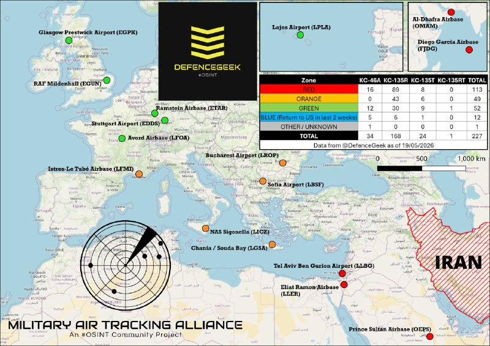

DefenceGeek 🇬🇧 @DefenceGeek Tue, 19 May 2026 09:04:39 UTC UPDATE: US Air Force Tanker Fleet 19/05/2026 (Ceasefire Day 42) #FreeIran‌ --- Operation EPIC FURY / Project FREEDOM --- Another weekly update. Overall tanker numbers remain around the same from…

## Shin_Persian — post 6079

DefenceGeek 🇬🇧 @DefenceGeek
Tue, 19 May 2026 09:04:39 UTC

UPDATE: US Air Force Tanker Fleet 19/05/2026 (Ceasefire Day 42) #FreeIran‌
--- Operation EPIC FURY / Project FREEDOM ---

Another weekly update. Overall tanker numbers remain around the same from my last update, although we're starting to see a growing number of airframes previously deployed into the region returning from CONUS after rest/maintenance.

Usual rule, exact distribution I won't give out for now on the off chance that hostilities begin again in the coming days/weeks.

@MATA_osint @vcdgf555 @steffanwatkins @ArmchairAdml @TheIntelFrogbu @jamjake01 @Andyyyyrrrr @Saint1Mil @rocketron101 @Faytuks

فارسی

به‌روزرسانی: ناوگان تانکرهای نیروی هوایی ایالات متحده (USAF) ۱۴۰۵/۰۲/۲۹ (روز ۴۲ آتش‌بس) #FreeIran‌
--- عملیات خشم حماسی (Operation EPIC FURY) / پروژه آزادی ---

یک به‌روزرسانی هفتگی دیگر. تعداد کل تانکرها نسبت به آخرین به‌روزرسانی من تقریباً در همان سطح باقی مانده است، هرچند شاهد بازگشت تعداد فزاینده‌ای از هواگردهایی هستیم که پیش‌تر در منطقه مستقر بودند و پس از استراحت/تعمیرات از ایالات متحده (CONUS) باز می‌گردند.

طبق روال معمول، توزیع دقیق را فعلاً به دلیل احتمال ناچیز از سرگیری درگیری‌ها در روزها یا هفته‌های آینده اعلام نخواهم کرد.

@MATA_osint @vcdgf555 @steffanwatkins @ArmchairAdml @TheIntelFrogbu @jamjake01 @Andyyyyrrrr @Saint1Mil @rocketron101 @Faytuks_

𝕏 · @shin_persian

## ManotoTV — post 105634

  <a href="telegram/content/ManotoTV_105634_1779192836.mp4" target="_blank">🎬 Download video</a>

ولی‌الله حیاتی، معاون امنیتی استانداری خوزستان، بعدازظهر سه‌شنبه ۲۹ اردیبهشت گفت سقوط یک «پرتابه» یا «شی ناشناس» در یک منطقه مسکونی اندیمشک چهار مصدوم بر جا گذاشت.

به گزارش ایرنا، این مقام محلی گفت این حادثه به یک باب مغازه و دو خودرو خسارت وارد کرده و بازتاب گسترده‌ای در شبکه‌های اجتماعی این شهرستان داشته است.

حیاتی در توضیح جداگانه‌ای درباره صداهای شنیده‌شده در آسمان اندیمشک گفت: «صدای شلیک‌های اخیر در آسمان اندیمشک به دلیل تست پدافند هوایی است، لذا مردم نگران نباشند.»

با این حال رسانه‌های داخلی و مقام‌های جمهوری اسلامی هنوز توضیحی درباره ماهیت «شی ناشناس» یا «پرتابه» سقوط‌کرده ارائه نکرده‌اند و مشخص نیست این حادثه ارتباطی با تست پدافند هوایی داشته است یا نه.

## ManotoTV — post 105633

  <a href="telegram/content/ManotoTV_105633_1779192836.mp4" target="_blank">🎬 Download video</a>

سخنگوی وزارت خارجه قطر اعلام کرد دوحه همچنان با واشنگتن و تهران در تماس است و این رایزنی‌ها ادامه خواهد داشت.
ماجد الانصاری، در واکنش به تصمیم دونالد ترامپ برای تعویق حمله برنامه‌ریزی‌شده به ایران به درخواست قطر، عربستان سعودی و امارات، گفت این اقدام «نشانه پاسخ مثبت» بوده است.
او همچنین با اشاره به مذاکرات میان آمریکا و جمهوری‌اسلامی گفت قطر از تلاش‌های دیپلماتیک پاکستان برای نزدیک کردن طرف‌ها و یافتن راه‌حل حمایت می‌کند و این روند «به زمان بیشتری نیاز دارد».
الانصاری درباره روابط دوحه و تهران گفت قطر همچنان روابط مثبتی با جمهوری‌اسلامی دارد، اما در عین حال افزود حمله جمهوری‌اسلامی به قطر «تهدیدی برای روابط دو کشور» به شمار می‌رود

## ManotoTV — post 105632

  <a href="telegram/content/ManotoTV_105632_1779192837.mp4" target="_blank">🎬 Download video</a>

«صدای رشید مظاهری باشید»

## ManotoTV — post 105631

  <a href="telegram/content/ManotoTV_105631_1779192838.mp4" target="_blank">🎬 Download video</a>

«صدای فاطمه سپهری باشیم»

## ManotoTV — post 105630

  <a href="telegram/content/ManotoTV_105630_1779192839.mp4" target="_blank">🎬 Download video</a>

بر اساس گزارش‌ رسانه‌های حکومتی حمید خانی، پاسدار بازنشسته اهل شهرستان بروجن، در جریان عملیات خنثی‌سازی بمب‌های عمل‌نکرده باقی‌مانده از جنگ اخیر در تهران کشته شد. بر اساس گزارش‌ها، او به‌صورت داوطلبانه در بخش مهندسی قرارگاه خاتم‌الانبیا فعالیت می‌کرد.

## ManotoTV — post 105629

  <a href="telegram/content/ManotoTV_105629_1779192839.mp4" target="_blank">🎬 Download video</a>

قیمت جهانی نفت پس از آن کاهش یافت که دونالد ترامپ اعلام کرد حمله برنامه‌ریزی‌شده به ایران را به‌منظور فراهم شدن فرصت برای مذاکرات و پایان جنگ، متوقف کرده است.
بهای نفت برنت، شاخص جهانی قیمت نفت، با کاهش ۱.۵ درصدی به ۱۱۰ دلار و ۳۷ سنت در هر بشکه رسید.
همزمان، نفت خام وست‌تگزاس اینترمدیت آمریکا نیز برای تحویل ماه ژوئن با افت ۶۳ سنتی، ۱۰۸ دلار و ۳ سنت معامله شد. قرارداد فعال‌تر ماه ژوئیه این شاخص نیز با کاهش ۰.۸ درصدی به ۱۰۳ دلار و ۵۶ سنت رسید.

## ManotoTV — post 105628

  <a href="telegram/content/ManotoTV_105628_1779192840.mp4" target="_blank">🎬 Download video</a>

علیرضا رئیسی، معاون بهداشت وزارت بهداشت، اعلام کرد جمعیت ایران بر اساس آخرین آمار به ۸۶ میلیون و ۵۶۴ هزار نفر رسیده است.
به گفته او، از این تعداد ۴۳ میلیون و ۶۵۸ هزار نفر مرد و ۴۲ میلیون و ۹۰۶ هزار نفر زن هستند.

## ManotoTV — post 105627

  <a href="telegram/content/ManotoTV_105627_1779192840.mp4" target="_blank">🎬 Download video</a>

بر پایه گزارش‌های منتشر شده حامد تیزرویان، فعال محیط زیست و عکاس شناخته شده بازداشت شده است. آقای تیزرویان ۱۴ اردیبهشت در ساری بازداشت شده و با وجود سپری شدن حدود دو هفته، از نهاد بازداشت کننده یا دلیل دستگیری او اطلاعی در دست نیست.
وسایل الکترونیکی از جمله تلفن همراه حامد تیزرویان هنگام بازداشت او ضبط شده است. حامد تیزرویان، عکاس حیات وحش و دانشجوی دکترای تنوع زیستی دانشگاه شهید بهشتی، پیش‌تر تصاویری کم‌نظیر از گونه‌های در معرض خطر انقراض از جمله خرس قهوه‌ای و مرال ثبت کرده است. او همچنین در ساخت دست‌کم ۱۰ پاسگاه محیط‌بانی در محدوده جنگل‌های هیرکانی مشارکت داشته و طی سال‌های گذشته در زمینه آموزش و آگاهی‌رسانی درباره حفاظت از محیط زیست، به‌ویژه جنگل‌های هیرکانی، فعالیت مستمر داشته است. فعالان محیط زیست نگران سرنوشت آقای تیزرویان هستند. صفحه اینستاگرام حامد تیزرویان نیز آذر سال گذشته، پس از انتشار مطالبی انتقادی درباره عملکرد مدیران دولتی در مهار آتش‌سوزی جنگل‌های الیمالات مازندران، برای چند روز مسدود شده بود.

## FarsiVOA — post 218136

  <a href="telegram/content/FarsiVOA_218136_1779192841.mp4" target="_blank">🎬 Download video</a>

لحظه زیر گرفتن عابران توسط یک خودرو در ایتالیا؛ رد تروریستی بودن حادثه از سوی مقامات امنیتی؛

مقامات ایتالیا رسماً اعلام کردند که حمله روز گذشته با خودرو به عابران پیاده در شهر مودنا، یک اقدام تروریستی نبوده است.

این حمله توسط فردی به نام «سلیم الکودری» انجام شده بود.

بر اساس گزارش خبرگزاری‌های رسمی از جمله رویترز، این حادثه هیچ کشته‌ای نداشته، اما ۸ نفر زخمی شده‌اند که حال ۴ نفر از آن‌ها وخیم گزارش شده است.

بر اساس بیانیه دستگاه‌های امنیتی و قضایی ایتالیا، بررسی‌ها نشان می‌دهد این اقدام ناشی از «مشکلات روحی و روانی» شدید ضارب بوده و هیچ انگیزه تروریستی یا سازمان‌یافته‌ای پشت آن نبوده است.
@FarsiVOA

## FarsiVOA — post 218135

  

خبرگزاری میزان، وابسته به قوه قضائیه جمهوری اسلامی، گزارش داد با دستور مقام قضایی، اموال ۵۲ نفر در استان زنجان به اتهام ارتباط با شبکه‌های «همکار با دشمن» توقیف شده است.

علی فرجی، رئیس کل دادگستری زنجان، گفت این اموال شامل وجوه بانکی و ارزی، اموال منقول و غیرمنقول و طلاست و قرار است برای بازسازی اماکن آسیب‌دیده از جنگ هزینه شود. به گفته او، هفت نفر از متهمان در بازداشت هستند و تعدادی دیگر خارج از کشور به سر می‌برند.

این اقدام در ادامه موج گسترده‌تری از پرونده‌سازی‌های قضایی پس از جنگ انجام می‌شود. سخنگوی قوه قضائیه پیش‌تر گفته بود بر اساس قانون تشدید مجازات جاسوسی و همکاری با اسرائیل و دولت‌های متخاصم، همکاری اطلاعاتی می‌تواند با توقیف اموال و حتی اعدام همراه باشد.

در هفته‌های گذشته نیز قوه قضائیه از صدور دستور توقیف اموال ده‌ها نفر، از جمله کارکنان رسانه‌های فارسی‌زبان خارج از کشور، خبر داده بود.
@FarsiVOA

## FarsiVOA — post 218134

🔺قطر: جمهوری اسلامی حق ندارد مانع عبور کشتی‌ها از تنگه هرمز شود

▪️ماجد انصاری، سخنگوی وزارت خارجه قطر با تأکید بر حق عبور امن از تنگه هرمز اعلام کرد که هیچ کشوری، از جمله حکومت ایران، حق ندارد مانع عبور یا موجب بسته شدن این تنگه برای کشتیرانی دریایی شود.

▪️انصاری روز سه‌شنبه در یک نشست خبری در دوحه گفت: «بر اساس قواعد حقوق بین‌الملل، عبور امن از تنگه هرمز حق دولت قطر است.»

▪️در حالی که مقامات جمهوری اسلامی از ایجاد سازوکاری برای کنترل تنگه هرمز از سوی حکومت ایران خبر داده‌اند، این مقام قطری گفت: «هیچ تغییری در وضعیت موجود مربوط به آزادی کشتیرانی در تنگه هرمز قابل پذیرش نیست.»

⬇️ بیشتر بخوانید:
https://ir.voanews.com/a/8151599.html

## FarsiVOA — post 218133

  

عضو انجمن شرکت‌های حمل‌ونقل بین‌المللی ایران با بیان اینکه ایستایی کامیون‌ها در مرز بازرگان به ۲۰ روز رسیده است، هزینه این توقف را ماهانه ۱۰ میلیون دلار برآورد کرد.

احسان ملک‌زاده، در گفت‌وگو با خبرگزاری مهر اعلام کرد که هم‌اکنون حدود سه هزار کامیون در صف خروج مرز بازرگان قرار دارند. وی افزود که در سایر مرزها نیز کامیون‌ها بین ‍پنج تا ۱۰ روز در انتظار خروج از کشور می‌مانند.

او مهم‌ترین عامل توقف کامیون‌ها در مرز بازرگان را «ظرفیت محدود پذیرش از طرف ترکیه» اعلام کرد و مدعی شد این کشور «تنها حدود ۲۵۰ کامیون از ایران» در روز پذیرش می‌کند.

جمهوری اسلامی پس از آنکه به دلیل اخلال در تنگه هرمز، با محاصره دریایی از سوی ایالات متحده آمریکا روبه‌رو شد، ناچار از توسل به حمل و نقل جاده‌ای شد.

روز دوشنبه ۲۸ اردیبهشت، فرماندهی مرکزی ایالات متحده، سنتکام، اعلام کرد که اجرای محاصره دریایی آمریکا علیه بنادر ایران همچنان ادامه دارد. این محاصره دست‌کم تا زمان رفع اختلال در تردد کشتی‌ها از سوی جمهوری اسلامی ادامه خواهد داشت.
@FarsiVOA

## FarsiVOA — post 218132

  

رویترز به نقل از وب‌سایت خبری دلفی گزارش داد یک جنگنده ناتو روز سه‌شنبه یک پهپاد با منشأ احتمالی اوکراینی را در حریم هوایی استونی سرنگون کرده است.

هانو پِوکور، وزیر دفاع استونی، به دلفی گفت این پهپاد در حریم هوایی استونی شناسایی و هدف قرار گرفت. ناتو تا زمان انتشار گزارش رویترز به درخواست این خبرگزاری برای اظهارنظر پاسخ نداده بود.

این رخداد تازه‌ترین مورد از مجموعه نقض‌های حریم هوایی در منطقه بالتیک و مرزهای شرقی ناتو در نزدیکی روسیه است. به نوشته رویترز، این حادثه در ادامه مجموعه‌ای از ورود پهپادهای اوکراینی یا مشکوک به اوکراینی به حریم هوایی کشورهای عضو ناتو رخ داده است؛ بحرانی که در لتونی ابتدا به استعفای وزیر دفاع و سپس به استعفای نخست‌وزیر و فروپاشی دولت ائتلافی انجامید.

این حادثه در حالی رخ داده که حملات پهپادی روسیه و اوکراین در هفته‌های اخیر شدت گرفته و خطر ورود پهپادهای سرگردان یا منحرف‌شده به حریم هوایی کشورهای عضو ناتو را افزایش داده است.
@FarsiVOA

## FarsiVOA — post 218131

  

ارتش اسرائیل در تازه‌ترین هشدار خود از ساکنان ۱۲ روستا در جنوب لبنان خواست فوراً این مناطق را ترک کنند.

بر اساس متن هشدار منتشرشده، این دستور شامل روستاها و مناطق طُول، نبطیه التحتا، حبوش، البازوریه، طیر دبا، کفر حونه، عین قانا، لبایا، جبشیت، الشهابیه، برج الشمالی در صور و حومین الفوقا می‌شود؛ مناطقی که بیشتر آنها در نواحی نبطیه و صور قرار دارند.

در این هشدار از ساکنان خواسته شده به دلیل حضور عناصر حزب‌الله و تجهیزات نظامی در این مناطق، دست‌کم هزار متر از محل‌های مشخص‌شده فاصله بگیرند.

ارتش اسرائیل اعلام کرده هر فردی که در نزدیکی عناصر حزب‌الله، تأسیسات یا تجهیزات نظامی این گروه بماند، جان خود را در معرض خطر قرار می‌دهد.
@FarsiVOA

## FarsiVOA — post 218130

🔺آمریکا ۱۱ مقام سیاسی و نظامی کوبا و نهاد اطلاعاتی هاوانا را تحریم کرد

▪️آمریکا تحریم‌های تازه‌ای علیه ۱۱ مقام سیاسی و نظامی کوبا و همچنین نهاد اصلی اطلاعاتی این کشور اعمال کرد؛ اقدامی که در ادامه تشدید فشار دولت دونالد ترامپ بر حکومت کمونیستی هاوانا انجام می‌شود.

▪️وزارت خارجه آمریکا نیز وزارت کشور کوبا و پلیس ملی انقلابی این کشور را هدف قرار داده است؛ نهادی که واشنگتن آن را به سرکوب اعتراضات و استفاده از بازداشتگاه‌های سیار متهم کرده است.

▪️ترامپ روز اول مه فرمانی اجرایی امضا کرد که به دولت اختیار گسترده‌تری برای تحریم افراد و نهادهای فعال در اقتصاد کوبا می‌دهد و امکان اعمال تحریم‌های ثانویه علیه مؤسسات مالی خارجی طرف معامله با نهادهای تحریم‌شده کوبایی را فراهم می‌کند.

⬇️ بیشتر بخوانید:
https://ir.voanews.com/a/8151597.html

## FarsiVOA — post 218129

  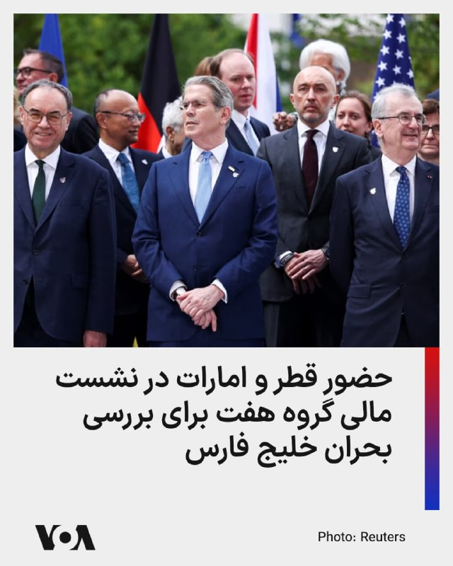

🔺حضور قطر و امارات در نشست مالی گروه هفت برای بررسی بحران خلیج فارس

▪️رویترز گزارش داد مقام‌هایی از قطر و امارات متحده عربی در نشست وزیران دارایی گروه هفت در پاریس حضور یافتند تا درباره بحران خلیج فارس و پیامدهای اقتصادی جنگ با جمهوری اسلامی گفت‌وگو کنند.

▪️وزیر دارایی فرانسه در این باره گفت حضور مقام‌های قطر و امارات بخشی از تلاش گروه هفت برای بررسی پیامدهای جنگ در خاورمیانه و کمک به کشورهایی است که بیشترین آسیب را از بحران دیده‌اند.

▪️دعوت از کشورهای غیرعضو به نشست‌های مالی گروه هفت سابقه دارد؛ اما حضور قطر و امارات در پاریس از آن جهت مهم است که دو کشور مستقیماً در معرض پیامدهای بحران خلیج فارس، اختلال در تنگه هرمز، حملات پهپادی و فشار بر بازار انرژی قرار گرفته‌اند.

⬇️ بیشتر بخوانید:
https://ir.voanews.com/a/8151595.html

## FarsiVOA — post 218127

  <a href="telegram/content/FarsiVOA_218127_1779192845.mp4" target="_blank">🎬 Download video</a>

تصاویری از خارج کردن کودکان از «مرکز اسلامی» سن‌دیگو پس از تیراندازی مرگبار در این مکان؛

مقام‌های آمریکایی گفتند تیراندازی روز دوشنبه در یک «مرکز اسلامی» در شهر سن‌دیگو واقع در ایالت کالیفرنیا، سه مرد، از جمله یک نگهبان امنیتی را کشت. پلیس در یک نشست خبری گفت این نگهبان امنیتی به نظر می‌رسد که نقش مهمی در جلوگیری از وخیم‌تر شدن حمله داشت.

دونالد ترامپ، رئيس‌جمهوری آمریکا در یک کنفرانس خبری که عصر دوشنبه برگزار شد گفت گزارشی از این حمله را دریافت می‌کند. ای‌بی‌سی به نقل از مقامات گزارش داد که اجساد قربانیان مقابل ساختمان مرکز اسلامی پیدا شد.

پیش‌تر مقامات پلیس اعلام کرده بودند که مظنونان تیراندازی، دو نوجوان به نام‌های کین کلارک و کیلب وازکز، بر اثر شلیک گلوله به خود جان باخته‌اند.

تاکنون انگیزه‌ای برای این حمله اعلام نشده است. با این حال، دو مقام ارشد پلیس گفتند بازرسان در حال بررسی نوشته‌هایی با محتوای احتمالی ضداسلامی هستند که در خودروی محل پیدا شدن اجساد مظنونان کشف شده است. فعلا این تیراندازی به عنوان «جرم ناشی از نفرت» قلمداد شده است.
@FarsiVOA

## FarsiVOA — post 218126

🔺تماس‌های تلفنی وزیر خارجه قطر با همتایان خود در عربستان و ترکیه

▪️وزیر خارجه قطر با همتایان خود در عربستان سعودی و ترکیه تماس تلفنی گرفت و درباره تحولات منطقه گفت‌وگو کرد.

▪️این دومین تماس تلفنی وزرای خارجه قطر و عربستان سعودی در ۲۴ ساعت گذشته است. به گزارش وزارت خارجه قطر، در جریان این تماس، از جمله «آتش‌بس میان ایالات متحده و جمهوری اسلامی، و تلاش‌ها با هدف کاهش تنش‌ها» بررسی شده است.

▪️روز سه‌شنبه وزیر خارجه قطر با وزیر خارجه ترکیه نیز درباره تحولات منطقه تلفنی گفت‌وگو کرد.

▪️دونالد ترامپ، رئیس‌جمهور آمریکا، پیشتر اعلام کرده بود حمله برنامه‌ریزی شده در روز سه‌شنبه به ایران را درخواست رهبران قطر، عربستان سعودی و امارات به تعویق انداخته تا نتیجه مذاکرات مشخص شود.

⬇️ بیشتر بخوانید:
https://ir.voanews.com/a/8151594.html

## FarsiVOA — post 218125

  

رئیس کمیسیون سلامت، محیط زیست و خدمات شهری شورای شهر تهران از تداوم «تنش آبی» در پایتخت ایران خبر داد و اعلام کرد: «با وجود بارندگی‌های اخیر، وضعیت ذخایر سدهای تأمین‌کننده آب تهران همچنان نگران‌کننده است.»

مهدی پیرهادی در گفت‌وگو با ایسنا، گفت استان‌های تهران و قم حدود ۳۰ درصد کاهش بارندگی را تجربه کرده‌اند و کاهش منابع آب زیرزمینی باعث شده تهران همچنان تحت تأثیر بحران خشکسالی سال‌های اخیر قرار داشته باشد.

این عضو شورای شهر تهران ادامه داد که علاوه بر تهران و قم، شرایط آبی در دیگر استان‌های کشور، مانند مرکزی، خراسان رضوی، اصفهان، زنجان و همدان همچنان «نامناسب» است.

او افزود: «نزدیک به ۱۰ استان کشور که جمعیتی حدود ۳۵ میلیون نفر را در خود جای داده‌اند، هنوز با کمبود بارش نسبت به میانگین بلندمدت مواجهند.»
@FarsiVOA

## FarsiVOA — post 218124

  

پلیس ضدتروریسم ترکیه ۱۱۰ نفر را به ظن فعالیت در حمایت از گروه «دولت اسلامی» (داعش) در عملیاتی که عمدتا در استانبول انجام شد، بازداشت و مقداری سلاح ضبط کرد.

خبرگزاری دولتی آناتولی ترکیه روز سه‌شنبه گزارش داد که این افراد متهم هستند که در انجمن‌های غیرقانونی کلاس‌هایی برای آموزش کودکان با ایدئولوژی داعش سازمان‌دهی کرده‌اند.

بر اساس این گزارش، این افراد همچنین متهمند برای داعش پول جمع‌آوری و تلاش کرده‌اند اعضای جدیدی برای این گروه جذب کنند. عملیات پلیس ضدتروریسم ترکیه با هماهنگی دفتر دادستانی کل استانبول انجام شده است.

هفته گذشته نیز پلیس ترکیه ۳۲۴ نفر دیگر را در جریان یورش‌هایی در ۴۷ استان به ظن ارتباط با داعش بازداشت کرده بود.

در هفتم آوریل، یک مهاجم در جریان درگیری مسلحانه خارج از کنسولگری اسرائیل در استانبول کشته و دو نفر دیگر زخمی شدند. وزیر کشور ترکیه گفت یکی از مهاجمان به «سازمانی که از دین سوءاستفاده می‌کند» مرتبط بوده است. رسانه‌های ترکیه گزارش داده‌اند که این سازمان داعش بوده است.
@FarsiVOA

## FarsiVOA — post 218123

🔺قطع اینترنت از ۱۹۲۰ ساعت گذشت؛ شرق از حضور اطلاعات سپاه در تشکیلات تازه مدیریت اینترنت خبر داد

▪️نت‌بلاکس اعلام کرد خاموشی اینترنت در ایران پس از ۱۹۲۰ ساعت وارد روز هشتاد و یکم شده است.

▪️این نهاد ناظر بر اختلالات اینترنت همچنین نوشت جمهوری اسلامی، هم‌زمان با قطع گسترده دسترسی کاربران ایرانی، در تلاش است دامنه «خفگی دیجیتال» خود را به بیرون از مرزهای ایران گسترش دهد.

▪️دولت پزشکیان در میانه طولانی‌ترین دوره قطعی اینترنت در ایران، ساختار تازه‌ای با عنوان «ستاد ویژه ساماندهی و راهبری فضای مجازی کشور» ایجاد کرد.

▪️شرق، می‌نویسد اعضای این ستاد فقط محدود به وزارت ارتباطات یا نهادهای اجرایی نیستند، و دادستان کل کشور، وزارت اطلاعات، دبیر شورای عالی امنیت ملی، و اطلاعات سپاه در این ساختار حضور دارند.

⬇️ بیشتر بخوانید:
https://ir.voanews.com/a/8151593.html

## FarsiVOA — post 218122

🔺وزیر خارجه بریتانیا: جهان دیگر نمی‌تواند برای بازگشایی تنگه هرمز صبر کند

▪️ایووت کوپر، وزیر خارجه بریتانیا، هشدار داد جهان دیگر نمی‌تواند برای بازگشایی تنگه هرمز صبر کند و ادامه بسته‌ماندن این آبراه، امنیت غذایی کشورهای آسیب‌پذیر را با بحران جدی‌تری روبه‌رو می‌کند.

▪️وزارت خارجه بریتانیا اعلام کرد برنامه‌هایی برای «مأموریت چندملیتی تنگه هرمز» در حال پیشبرد است تا در صورت دستیابی به توافق، از بازگشایی فوری و بدون محدودیت این مسیر حمایت شود.

▪️کوپر تأکید کرد بحران‌هایی مانند بحران جمهوری اسلامی در مرزها متوقف نمی‌شوند و راه‌حل آنها نیز نیازمند همکاری بین‌المللی است.

⬇️ بیشتر بخوانید:
https://ir.voanews.com/a/8151592.html

## DW_Farsi — post 124869

  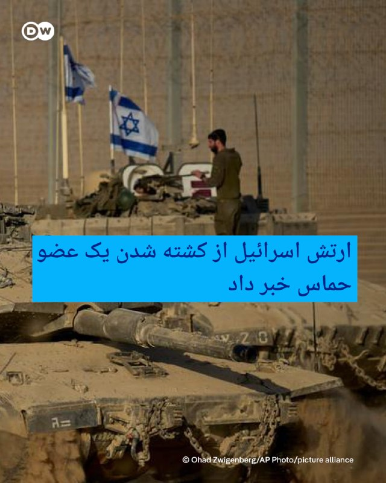

🔶 ارتش اسرائیل از کشته شدن یک عضو حماس خبر داد
 
سخنگوی ارتش اسرائیل سه‌شنبه ۱۹ مه (۲۹ اردیبهشت) اعلام کرد نیروهای تیپ ۱۸۸ در جنوب نوار غزه، "یکی از اعضای سازمان تروریستی حماس را که به مواضع نظامیان اسرائیلی نزدیک شده و تهدیدی فوری محسوب می‌شده، هدف قرار دادند".
 
ارتش اسرائیل اعلام کرد که این فرد، "در حملات ۷ اکتبر وارد خاک اسرائیل شده بود و در روزهای اخیر نیز قصد اجرای عملیات تروریستی علیه نیروهای اسرائیلی را داشت".
 
ارتش اسرائیل در پیام خود در شبکه ایکس (توئیتر سابق) نوشت، این فرد که از "خط زرد" عبور کرده بود، شناسایی شد و نیروی هوایی اسرائیل با هماهنگی نیروهای زمینی او را از "حذف کرد".
 
به نوشته تایمز اسرائیل، ارتش این کشور جزییاتی در مورد هویت و نام این عضو حماس ذکر نکرده است.
@dw_farsi

## DW_Farsi — post 124868

  

📸 کاریکاتور هفته:

پخش برنامه‌هایی از صداوسیما که در آنها مجریان سلاح گرم در دست می‌گیرند یا کار با آنها را به مخاطبان آموزش می‌دهند علاوه بر تأکید بر فضای نظامی و نظامی‌گری، آن‌هم در زمان آتش‌بس که انتظار ترجیح مسیر دیپلماسی به نفع مردم می‌رود، به باور بسیاری از شهروندان و کارشناسان سیاسی با هدف تهدید و ارعاب مردم است؛ مردمی که دی ماه گذشته در جمعیتی انبوه و میلیونی با حضور در خیابانهای کشور عبور از رژیم را درخواست کردند اما با رگبار گلوله و کشتاری جمعی روبرو شدند.
 
به نظر می‌رسد با توجه به وخیم‌تر شدن بحران اقتصادی، عدم تغییر سیاست‌های عامل این بحران همراه با سرکوب بیرحمانه و موج اعدام‌ها، حکومت تنها راه مقابله با آتش خشم و عصبانیت عمومی را تهدید مردم داخل خانه‌هایشان دیده است.
 
این موضوع دستمایه مانا نیستانی در طراحی کاریکاتور هفته برای دویچه وله فارسی بوده است.

@dw_farsi

## DW_Farsi — post 124867

  

📸 عکس روز: مهر مادری
 
یک میمون بِربِر (عجمی) در بزرگ‌ترین پارک آزاد میمون‌ها در آلمان نوزادش را که چند ساعت پیش چشم به جهان گشوده، به آغوش کشیده است. این پارک به نام "آفن‌برگ زالِم" بیش از ۲۰ هکتار را در برمی‌گیرد و خانه حدود ۲۰۰ میمون عجمی است که آزادانه در آن زندگی و تردد می‌کنند. امسال انتظار می‌رود حدود ۱۵ نوزاد میمون عجمی در این پارک متولد شوند.
@dw_farsi

## DW_Farsi — post 124866

  

🔶 حامد تیزرویان، عکاس و فعال محیط زیست، بازداشت شد

خبرنامه دانشگاه امیرکبیر سه‌شنبه ۲۹ اردیبهشت (۱۹ مه) گزارش داد که حامد تیزرویان، دانشجوی دکترای مهندسی محیط زیست دانشگاه ملی (بهشتی)، روز ۱۴ اردیبهشت‌ماه در مازندران بازداشت شده و وضعیت او نامشخص است.
 
حامد تیزرویان متولد ۱۳۷۰ از فعالان و محققان شناخته‌شده محیط زیست در ایران است و در زمینه عکاسی حیات وحش نیز فعالیت دارد. در خبرنامه امیرکبیر آمده است که تیزرویان توسط ماموران اداره اطلاعات مازندران بازداشت شده و هم اکنون به صورت بلاتکلیف در زندان شهر ساری به سر می‌برد.
 
صفحه اینستاگرام این عکاس شناخته‌شده با بیش از ۷۰ هزار دنبال‌کننده اکنون از دسترس خارج شده است.
 
آنگونه که این خبرنامه به نقل از منابع آگاه نوشته است، این فعال محیط زیست پس از سرکوب و کشتارهای دی‌ماه، "مطالب صریحی در شبکه‌های اجتماعی درباره این جنایت‌ها منتشر کرده بود".
 
"اجتماع و تبانی با هدف اقدام علیه امنیت ملی" اتهامی است که علیه تیزرویان عنوان شده است. 
@dw_farsi

## DW_Farsi — post 124865

🔶 دنیس اکرت با نامی جدید و برای تیم ایران به جام جهانی می‌رود
 
دنیس اکرت آیِنسا، فوتبالیست متولد بن آلمان، درجام جهانی فوتبال ۲۰۲۶ برای تیم ملی ایران بازی خواهد کرد، اما با نام جدید "دنیس درگاهی".
 
او جایگزین سردار آزمون شده که حدود دو ماه پیش توسط فدراسیون فوتبال ایران از فهرست تیم ملی کنار گذاشته شد.
 
بنا به گزارش "ورزش۳" اکرت آیِنسا روز دوشنبه ۱۸ مه (۲۸ اردیبهشت) راهی ترکیه شد تا به اردوی آماده‌سازی تیم ملی ایران برای جام جهانی بپیوندد. گفته می‌شود فیفا مجوز حضور او در تیم ملی ایران را صادر کرده است.
 
این بازیکن نام خانوادگی "درگاهی" را از پدر ایرانی‌تبارش گرفته است. آناهیتا درگاهی، عمه او‌، از چهره‌های شناخته‌شده سینمای ایران است. مادر این بازیکن ۲۹ ساله اهل اسپانیاست.
 
دنیس اکرت آیِنسا از سال ۲۰۲۴ در باشگاه بلژیکی استاندارد لیژ بازی می‌کند. او که سابقهٔ بازی برای تیم ملی زیر ۱۹ سال آلمان را دارد، برای تیم‌هایی مانند سلتاویگو در لالیگا و همچنین اینگولشتات در لیگ‌های دوم و سوم آلمان به میدان رفته است.
 
اکرت  ۲۹ اسفند ۱۴۰۴ برای اولین بار توسط امیر قلعه‌نویی، سرمربی تیم ملی، برای انجام دو بازی دوستانه مقابل نیجریه و کاستاریکا، در لیست سی‌وپنج‌ نفرهٔ تیم فوتبال ایران قرار گرفت.
@dw_farsi

## DW_Farsi — post 124864

🔶 هرانا: از آغاز جنگ بیش از ۵۰ نفر در ایران اعدام شده‌اند
 
هرانا، مجموعه فعالان حقوق بشر ایران، روز سه‌شنبه ۱۹ مه (۲۹ اردیبهشت) در گزارشی اعلام کرد از زمان شروع حملات آمریکا و اسرائیل علیه ایران در روز نهم اسفند ۱۴۰۴ تا هفته گذشته، دست‌کم چهار هزار و ۲۳ مورد بازداشت و ۵۰ مورد اعدام را در ایران ثبت کرده است.
 
این گزارش با عنوان "میان موشک و سرکوب" بر پایه ۱۷۷ منبع تأییدشده، شامل گزارش‌های منابع آزاد و شبکه میدانی مجموعه فعالان حقوق بشر در داخل کشور، در ۲۴۰ صفحه و به دو زبان فارسی و انگلیسی منتشر شده است. 
 
این نهاد حقوق بشری تأکید کرده که این گزارش با هدف ارائه روایت جامع از کل درگیری تهیه نشده و یافته‌های آن "صرفاً به رویدادهایی محدود می‌شود که در داده‌های این نهاد مستندسازی و راستی‌آزمایی شده‌اند". 
 
به نوشته هرانا نهادهای امنیتی با اتهاماتی چون "جاسوسی"، "تهدید علیه امنیت ملی" و "ارتباط یا ارسال مطالب مربوط به جنگ به رسانه‌های خارجی" شهروندان را بازداشت یا اعدام کرده‌اند. از ۵۰ مورد حکم اعدام که به اجرا گذاشته شده، ۳۲ مورد با اتهامات سیاسی و امنیتی مرتبط بوده‌اند.
 
در این گزارش تصریح شده که مقامات جمهوری اسلامی از جنگ "برای تشدید روایت‌های امنیتی و توجیه بازداشت‌ها، محدودیت آزادی بیان و اعمال خشونت علیه غیرنظامیان استفاده کرده‌اند". در گزارش هرانا همچنین به خاموشی اینرنت به عنوان ابزاری برای سرکوب اشاره شده است.
 
هرانا در گزارش خود به آسیب‌های شهروندان در حملات آمریکا و اسرائیل به ایران اشاره کرده و آورده که در این راستا دست‌کم سه هزار و ۶۳۶ مورد مرگ را مستند کرده است؛ شامل ۱۷۰۱ غیرنظامی، ۱۲۲۱ نیروی نظامی و ۷۱۴ فرد که هویت یا وضعیت آنان قابل شناسایی نبوده است. در این گزارش به کشته شدن ۳۰۷ کودک و زخمی شدن ۲ هزار ۲۱۳ کودک اشاره شده است.
 
مجموعه فعالان حقوق بشر ایران در گزارش خود شماری از الگوهای نگران‌کننده را برجسته کرده و در مورد آن‌ها هشدار داده است، از جمله "ضعف در راستی‌آزمایی اهداف"، "استفاده محدود از نظارت انسانی در برخی فناوری‌های هدف‌گیری"، "هشدار ناکافی پیش از حملات" و "به‌کارگیری تسلیحات انفجاری سنگین در مناطق پرجمعیت".
@dw_farsi

## DW_Farsi — post 124863

  

🔶 غریب‌آبادی: خواستار حفظ غنی‌سازی، پایان جنگ در همه جبهه‌ها و خروج نیروهای آمریکایی شدیم
 
کاظم غریب‌آبادی روز سه‌شنبه ۱۹ مه (۲۹ اردیبهشت) با حضور در کمیسیون امنیت ملی و سیاست خارجی مجلس شورای اسلامی، نمایندگان را در جریان روند مذاکرات تهران و واشنگتن و تصمیم‌های اتخاذشده قرار داد. بنا بر گزارش‌ رسانه‌های داخلی ایران، جزئیات اجلاس وزرای امور خارجه کشورهای عضو بریکس که اخیرا با حضور عباس عراقچی در هند برگزار شده بود و نیز اهداف سفر وزیر کشور پاکستان به ایران در نشست غریب‌آبادی با اعضای این کمیسیون مورد بحث و تبادل نظر قرار گرفت.
 
معاون حقوقی و بین‌الملل وزارت خارجه ایران در نشست به این کمیسیون گفت که "حق غنی‌سازی اورانیوم و برخورداری از حقوق هسته‌ای صلح‌آمیز"، "پایان جنگ در همه جبهه‌ها از جمله لبنان" و "آزادسازی دارایی‌های ایران" از موارد ذکرشده در پیشنهاد جمهوری اسلامی به ایالات متحده بوده است.
 
غریب‌آبادی در این نشست ضمن ارائه گزارش از روند مذاکرات و طرح پیشنهادی جمهوری اسلامی به طرف آمریکایی بر "ایستادگی تصمیم‌گیران و اعضای تیم مذاکره‌کننده ایران بر روی اصول" تأکید کرد.
 
@dw_farsi

## DW_Farsi — post 124862

🔶 مرکل، زلنسکی و والسا، جزو نخستین برندگان "نشان لیاقت اروپا"
 
پارلمان اروپا قرار است روز سه‌شنبه ۱۹ ماه مه (۲۹ اردیبهشت) برای نخستین بار "نشان لیاقت اروپا" را به اولین دریافت‌کنندگان آن اعطا کند.
 
آنگلا مرکل، صدراعظم سابق آلمان، ولودیمیر زلنسکی، رئیس جمهور اوکراین و لخ والسا، رئیس جمهور پیشین لهستان، از جمله نخستین برندگان این نشان هستند. زلنسکی شخصاً در مراسم اهدای جایزه در استراسبورگ حضور نخواهد داشت.
 
اتحادیه اروپا اعلام کرده است که این جایزه برای قدردانی از افرادی اعطا می‌شود که در روند همگرایی اروپا نقش داشته‌اند یا در ترویج ارزش‌های بنیادین این اتحادیه کوشیده و از آنها دفاع کرده‌اند.
 
مرکل، زلنسکی و والسا قرار است بالاترین سطح از سه سطح این نشان افتخار را دریافت کنند. دیگر شخصیت‌های شناخته‌شده، از جمله پیترو پارولین، دیپلمات ارشد واتیکان، مایا ساندو، رئیس جمهور مولداوی و ژان-کلود تریشه، رئیس پیشین بانک مرکزی اروپا، سطوح پایین‌تر این نشان را دریافت خواهند کرد.
 
ولفگانگ شوسل، صدراعظم پیشین اتریش و اعضای گروه راک ایرلندی "یوتو" (U2) نیز این جایزه را دریافت خواهند کرد.
@dw_farsi

## DW_Farsi — post 124861

🔶 دیدار پوتین و شی در پکن؛ اندک‌زمانی پس از ترامپ
 
چند روز پس از سفر دونالد ترامپ، رئیس جمهور آمریکا، ولادیمیر پوتین، رئیس کرملین، نیز سه‌شنبه ۱۹ مه (۲۹ اردیبهشت) سفر دو روزه‌ای به چین را آغاز می‌کند. دمیتری پسکوف، سخنگوی کرملین، گفت پوتین با هیأتی متشکل از وزیران و مدیران شرکت‌های دولتی و خصوصی به این سفر می‌رود.
 
به گفت پسکوف، گفت‌وگوها که به دعوت شی جین‌پینگ، رئیس جمهور چین، انجام می‌شود، بر گسترش "شراکت راهبردی ممتاز" میان دو کشور متمرکز خواهد بود.
 
بر اساس اطلاعات رسمی مسکو، روس‌ها و چینی‌ها قصد دارند در مجموع حدود ۴۰ سند امضا کنند. این اسناد از جمله به همکاری در حوزه‌های صنعت، تجارت، حمل‌ونقل و ساخت‌وساز مربوط می‌شوند. همچنین انتظار می‌رود تجاوز نظامی روسیه به اوکراین و نیز جنگ آمریکا و اسرائیل علیه ایران از موضوعات گفت‌وگوها باشد.
 
کرملین تأکید کرده است که سفر پوتین هیچ ارتباطی با دیدار ترامپ از چین ندارد. یوری اوشاکوف، مشاور سیاست خارجی پوتین، گفت تاریخ این سفر از ماه فوریه تعیین شده بوده است.
 
به گفته اوشاکوف، بیست‌وپنجمین سالگرد امضای پیمان حسن همجواری و همکاری دوستانه میان دو کشور نیز از دلایل این سفر است. طبق اعلام کرملین، پوتین همچنین قصد دارد درباره سفر هفته گذشته ترامپ به چین اطلاعات بیشتری کسب کند.
 
در پکن نیز این روایت رد نشده است. با این حال رسانه‌های دولتی چین بر توالی غیرمعمول این دیدارها تأکید کرده‌اند. روزنامه گلوبال تایمز، نزدیک به حزب کمونیست چین، نوشت که پکن بیش از پیش در حال تبدیل شدن به یکی از کانون‌های دیپلماسی جهانی است.
@dw_farsi

## Persian_Trend_Official — post 14473

  

💢برای ۸۱ روز، جمهوری اسلامی اینترنت را در ایران خاموش کرده تا صدای مردم را خفه کند.

🫆:Tony

📌 @persian_trend_official
پرشین ترند | متفاوت‌ترین کانال نظامی

## Persian_Trend_Official — post 14472

  

🔴 گزارش‌ها از وقوع انفجار در دمشق 💢خبرنگار الحدث از وقوع یک انفجار با منشأ نامشخص در نزدیکی منطقه «باب شرقی» دمشق خبر داد. ▪️فارس مدعی شد انفجار ناشی از خودرو بمب گذاری شده بوده است. 🫆:Tony 📌 @persian_trend_official پرشین ترند | متفاوت‌ترین کانال نظامی

## Persian_Trend_Official — post 14471

🔴 گزارش‌ها از وقوع انفجار در دمشق

💢خبرنگار الحدث از وقوع یک انفجار با منشأ نامشخص در نزدیکی منطقه «باب شرقی» دمشق خبر داد.

▪️فارس مدعی شد انفجار ناشی از خودرو بمب گذاری شده بوده است.

🫆:Tony

📌 @persian_trend_official
پرشین ترند | متفاوت‌ترین کانال نظامی

## Persian_Trend_Official — post 14470

  <a href="telegram/content/Persian_Trend_Official_14470_1779192852.webm" target="_blank">🎬 Download video</a>

💢شنیده شدن صدای انفجار در جزیره قشم ▪️ظهر سه شنبه شنیده شدن صدای انفجار در جزیره قشم از سوی ساکنان محلی گزارش شده است. 🔹اخبار تکمیلی متعاقباً منتشر خواهد شد./خبرگزاری مهر 🫆:Tony 📌 @persian_trend_official پرشین ترند | متفاوت‌ترین کانال نظامی

## Persian_Trend_Official — post 14469

  <a href="telegram/content/Persian_Trend_Official_14469_1779192852.webm" target="_blank">🎬 Download video</a>

💢شنیده شدن صدای انفجار در جزیره قشم

▪️ظهر سه شنبه شنیده شدن صدای انفجار در جزیره قشم از سوی ساکنان محلی گزارش شده است.

🔹اخبار تکمیلی متعاقباً منتشر خواهد شد./خبرگزاری مهر

🫆:Tony

📌 @persian_trend_official
پرشین ترند | متفاوت‌ترین کانال نظامی

## Persian_Trend_Official — post 14468

  <a href="telegram/content/Persian_Trend_Official_14468_1779192852.mp4" target="_blank">🎬 Download video</a>

💢ویدیویی منتسب به چوپان عراقی که از پرواز هواپیما های اسرائیلی منتشر کرد و به گفته رسانه ها پیش زمینه لو رفتن پایگاه مخفی اسرائیل در خاک عراق شد.

🫆:Tony

📌 @persian_trend_official
پرشین ترند | متفاوت‌ترین کانال نظامی

## RadioFarda — post 157348

  

🔸روزنامه شرق در گزارشی درباره ستاد تازه‌تشکیل‌شدهٔ «ساماندهی فضای مجازی» به ریاست معاون اول رئیس‌جمهور ایران، نوشت که از برخی اعضای دولت «خواسته شده» تا درباره جزئیات و مأموریت‌های این ساختار با رسانه‌ها مصاحبه نکنند.

🔸در این گزارش که روز سه‌شنبه ۲۹ اردیبهشت و با عنوان «حکمرانی دیجیتال در سایه ابهام» منتشر شده، آمده است: ستادی که قرار است به گفته رئیس‌جمهور، به «چندصدایی» و «موازی‌کاری» در حکمرانی اینترنت پایان دهد، «خود به یکی از مبهم‌ترین و پرحاشیه‌ترین ساختارهای سیاست‌گذاری دیجیتال کشور تبدیل شده است».

🔸شرق نوشته که «دستور» محمدرضا عارف به خودداری اعضای دولت از صحبت با رسانه‌ها درباره این ستاد، در حالی است که با تشکیل این ستاد، «شائبه‌ها درباره شکل‌گیری یک مرکز تازه قدرت در سیاست اینترنت ایران، پررنگ‌تر» و «آشفتگی در حکمرانی فضای مجازی» ایران، نمایان‌تر شده است.

🔸این روزنامه به نقل از کارشناسان و منتقدان تأکید کرده که در شرایطی که خود رئیس‌جمهور ریاست شورای عالی فضای مجازی و شورای عالی امنیت ملی را نیز برعهده دارد، «به راحتی می‌تواند گره کوری که در اینترنت ایجاد شده است را باز کند».

@Radiofarda

## RadioFarda — post 157347

  <a href="https://t.me/radiofarda/157347" target="_blank">📎 Download file</a>

📻بشنوید: ساعت ۱۴ با رادیوفردا، ۲۹ اردیبهشت ۱۴۰۵‌

@Radiofarda

## RadioFarda — post 157346

  

🔸ایووت کوپر، وزیر خارجه بریتانیا روز سه‌شنبه ۲۹ اردیبهشت هشدار داد که جهان دیگر نمی‌تواند بیش از این برای بازگشایی تنگه هرمز صبر کند و ادامه بسته‌ماندن آن امنیت غذایی کشورهای آسیب‌پذیر را با بحران جدی‌تری روبه‌رو می‌کند.

🔸وزارت خارجه بریتانیا روز سه‌شنبه اعلام کرد کوپر در کنفرانس جهانی مشارکت‌ها در لندن، با اشاره به پیامدهای بحران جنگ ایران بر انرژی، کود کشاورزی و قیمت مواد غذایی، خواستار فشار فوری بین‌المللی برای بازگشایی تنگه هرمز شده است.

🔸ایووت کوپر در کنفرانس جهانی مشارکت‌ها در لندن هشدار داد که جهان در آستانه یک بحران غذایی جهانی قرار دارد و نمی‌توان اجازه داد ده‌ها میلیون نفر به‌دلیل بسته‌ماندن یک مسیر بین‌المللی کشتیرانی که ایران آن را «گروگان» گرفته با گرسنگی روبه‌رو شوند.

🔸کوپر تأکید کرد چالش‌های جهانی، مانند بحران ایران، در مرزها متوقف نمی‌شوند و راه‌حل‌های آنها نیز متوقف نمی‌شوند و نیازمند همکاری بین‌المللی است.

@RadioFarda

## RadioFarda — post 157345

  

🔸قطر روز سه‌شنبه ۲۹ اردیبهشت اعلام کرد که مذاکرات میان آمریکا و ایران برای رسیدن به توافق به زمان بیشتری نیاز دارد.

🔸ماجد الانصاری، سخنگوی وزارت خارجه قطر، در یک نشست خبری گفت: «ما از تلاش دیپلماتیک پاکستان که جدیت خود را در گردهم آوردن طرف‌ها و یافتن راه‌حل نشان داده حمایت می‌کنیم و معتقدیم این روند به زمان بیشتری نیاز دارد».

🔸این اظهارات یک روز پس از آن مطرح شد که دونالد ترامپ، رئیس‌جمهور آمریکا، گفت حمله روز سه‌شنبه به ایران را برای دادن فرصت به این روند به تعویق انداخته است.

🔸ایران و ایالات متحده از زمان آتش‌بس شکننده میان دو کشور در ۱۹ فروردین امسال، درگیر یک دور مذاکره مستقیم و همچنین تبادل پیام‌هایی از طریق پاکستان بوده‌اند تا به توافقی برای پایان جنگ دست یابند.

@RadioFarda

## RadioFarda — post 157339

🔸ایرنا، خبرگزاری دولت جمهوری اسلامی روز سه‌شنبه ۲۹ اردیبهشت تصاویری از یک زن بدون «حجاب رسمی» مورد تایید حکومت در فضای خصوصی منزل را منتشر کرد و ساعتی بعد آنها را از روی سایت این خبرگزاری حذف کرد.

🔸انتشار این تصاویر در قالب یک گزارش تصویری صورت گرفت که واکنش‌هایی‌ را در شبکه‌های اجتماعی به‌دنبال داشت.

🔸در این گزارش تصویری خبرگزاری دولت عکس‌هایی از سارا کنعانی، نویسنده و هنرمند ۳۷ ساله اهل تهران را که در روزهای جنگ ۴۰ روزه نوزادی را که در بیمارستان رها شده بود، به طور موقت به سرپرستی گرفته و نام این دختر را آهو گذاشته منتشر کرده است.

🔸 انتشار تصاویر بدون حجاب مورد تایید حکومت در منزل شخصی این هنرمند در حالی رخ داده است که تاکنون هیچ‌گونه اعلام رسمی درباره تغییر در سیاست‌های مرتبط با حجاب در رسانه‌های ایران منتشر نشده است.

🔸 در ماه‌های گذشته رسانه‌های حکومتی تصاویر و گزارش‌های بسیاری از زنان بدون حجاب در رویدادهای حکومتی منتشر کرده‌اند.

🔸 چرخش سیاست حکومت در قبال حجاب با واکنش‌های افراد تندرو همراه شده است.

@RadioFarda

## RadioFarda — post 157337

مرگ‌ومیر ابولا در شرق کنگو به ۱۳۱ نفر افزایش یافت؛ ابراز نگرانی سازمان جهانی بهداشت

🔸مقام‌های جمهوری دموکراتیک کنگو روز سه‌شنبه ۲۹ اردیبهشت اعلام کردند که در ۲۴ ساعت گذشته ۲۶ مورد مرگ مشکوک دیگر بر اثر ابولا در شرق این کشور ثبت شده و رئیس سازمان جهانی بهداشت نسبت به گسترش این شیوع عمیقاً ابراز نگرانی کرده است.

🔸با این موارد جدید، شمار قربانیان مرتبط با این شیوع در شرق کنگو به ۱۳۱ نفر رسیده است. بر اساس بولتن روزانه مقامات بهداشتی، ۵۱۶ مورد مشکوک و ۳۳ مورد تأییدشده در کنگو گزارش شده و دو مورد تأییدشده نیز در کشور همسایه، اوگاندا، ثبت شده است.

🔸تدروس آدهانوم گبریسوس، مدیرکل سازمان جهانی بهداشت، روز شنبه شیوع سویه نادر «بوندیبوگیو» از این ویروس را یک وضعیت اضطراری بهداشت عمومی با نگرانی بین‌المللی اعلام کرد. این موضوع کارشناسان را نگران کرده، زیرا ویروس توانسته که طی هفته‌ها بدون شناسایی در منطقه‌ای پرجمعیت از کنگو گسترش یابد.

🔸ژان-ژاک مویِمبه، مدیر مؤسسه ملی تحقیقات زیست‌پزشکی کنگو، به خبرگزاری رویترز گفت که شهر بوتِمبو در استان کیوو شمالی، با جمعیتی چندصد هزار نفری، روز دوشنبه نخستین دو مورد تأییدشده خود را ثبت کرده است.

🔸ابولا از طریق تماس مستقیم با مایعات بدن افراد یا حیوانات آلوده منتقل می‌شود و علائمی مانند تب بالا، استفراغ و خونریزی داخلی و خارجی ایجاد می‌کند.

🔸به گفته سازمان جهانی بهداشت، نرخ مرگ‌ومیر متوسط این بیماری حدود ۵۰ درصد است، هرچند در شیوع‌های گذشته بین ۲۵ تا ۹۰ درصد متغیر بوده است.

🔸تدروس روز سه‌شنبه در ژنو به اعضای مجمع جهانی بهداشت گفت: «من عمیقاً نگران مقیاس و سرعت این همه‌گیری هستم»، و به تعداد موارد گزارش‌شده در مناطق شهری و میان کارکنان بهداشتی اشاره کرد.

🔸نسخه کامل این گزارش را در وب‌سایت رادیوفردا بخوانید.

@RadioFarda

## RadioFarda — post 157336

  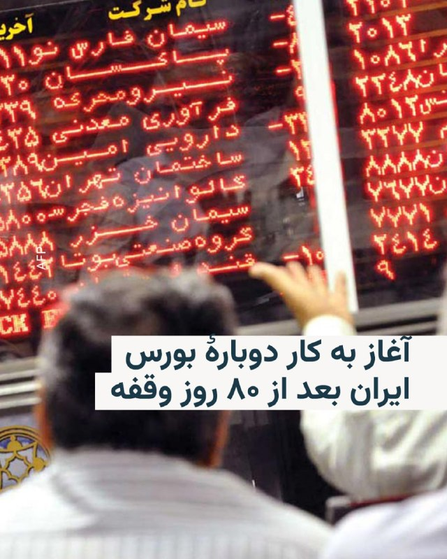

🔸رسانه‌های ایران از آغاز به‌کار دوبارهٔ بورس کشور بعد از ۸۰ روز تعطیلی خبر می‌دهند.

🔸بر اساس این گزارش‌ها، نخستین معاملات بازار سهام در سال ۱۴۰۵ از ساعت ۹ صبح سه‌شنبه ۲۹ اردیبهشت در تالار معاملات بورس تهران آغاز شد.

🔸با این حال روزنامه «دنیای اقتصاد» نوشته بیش از ۴۰ نماد که شرکت‌های آن‌ها در جریان حملات آمریکا و اسرائیل دچار آسیب شده بودند، فعلاً بازگشایی نخواهند شد.

🔸بر اساس این گزارش، عمده نمادهای متوقف در گروه‌های شیمیایی و فلزات اساسی قرار دارند که به‌دلیل بمباران کارخانه‌های پتروشیمی و فولاد امکان فعالیت ندارند. تنها نمادهای بانکی و خودرویی در میان نمادهای آغاز معاملات امروز قرار دارند.

🔸تعدادی از نمادهای صندوق‌های اهرمی نیز که پیشتر گفته شده بود باز نمی‌شوند قرار است امروز بازگشایی شوند ولی محدودیت فروش ۱۰۰ هزار واحد دارند.

@RadioFarda

## RadioFarda — post 157335

  <a href="telegram/content/RadioFarda_157335_1779192856.mp4" target="_blank">🎬 Download video</a>

🔸تصاویری از یک گله قوچ اوریال در پارک ملی سالوک در خراسان‌شمالی که مشغول گشت‌وگذار هستند، منتشر شده است.

🔸قوچ‌ اوریال یا گوسفند وحشی اوریال گروهی از زیرگونه‌های گوسفند وحشی است که در مناطق کوهستانی و تپه‌ماهوری زندگی می‌کند.

🔸گوسفند وحشی به دو گروه زیرگونه‌ای تقسیم می‌شود که گروه غربی آن گوسفند وحشی ارمنی و گروه شرقی آن گوسفند وحشی اوریال است.

🔸گوسفند وحشی اوریال در پاکستان، کشمیر، شمال غربی هندوستان، افغانستان، تاجیکستان، ازبکستان، قزاقستان و ترکمنستان پراکنده است و در ایران در شمال خراسان رضوی، خراسان شمالی، شرق گلستان و شمال شرق استان سمنان دیده می‌شود.

🔸 پارک ملی سالوک در جنوب بجنورد در خراسان‌شمالی واقع شده و زیستگاه پرندگان و حیوانات بسیاری همچون آهو، قوچ، میش است.

@RadioFarda

## IranianMinds — post 20383

🔴 وال استریت ژورنال :

ترامپ گفت حمله برنامه‌ریزی‌شده به ایران را متوقف کرده چون رهبران کشورهای خلیج فارس خواستند زمان بیشتری برای مذاکرات بدهند تا شاید به توافق برسند. او دستور داده ارتش آماده باشد ولی فعلاً حمله انجام نشود.

چند مقام خلیج فارس بعد این گفتند که اصلا اژ طرح حمله قریب‌ الوقوع مطلع نبوده‌اند.

@IranianMinds

## IranianMinds — post 20382

🔴 معاون امنیتی استان خوزستان :

امروز داشتیم پدافند هامونو تست میکردیم که به اشتباه یکی از پرتابه ها خورد به یک ساختمون مسکونی و چندین نفر زخمی شدن.

@IranianMinds

## IranianMinds — post 20381

  

🔴حمید خانی،تروریست بازنشسته سپاه پاسداران از شهرستان بروجن، به صورت داوطلبانه حین خنثی‌سازی بمب‌های عمل نکرده اسرائیل و آمریکا در تهران به هلاکت رسید.

@IranianMinds

## IranianMinds — post 20380

  

🔴 اکانت اسرائیل به فارسی:

بسیجی‌های زیادی از به درک واصل شدن خامنه‌ای خوشحالن، نه؟
هر شب تو خیابون عروسی دارن…

@IranianMinds

## IranianMinds — post 20379

  

این چی بود من دیدم

@IranianMinds

## IranianMinds — post 20378

  <a href="telegram/content/IranianMinds_20378_1779192860.webm" target="_blank">🎬 Download video</a>

💥 با هر ثبت نام 
🅰️
🅰️
🅰️ هزار تومن جایزه بگیرید

✔️ میتونید شرط‌بندی کنید و بونوس را به موجودی واقعی تبدیل کنید

⚽️  پوشش کامل مسابقات ورزشی 

💯  پیش‌بینی با بهترین ضرایب 

⭐️ تجربه سریع و حرفه‌ای

💰پرداخت مستقیم و سریع بدون واسطه، بدون دردسر، واریز و برداشت در سریع‌ترین زمان ممکن

☑️ کانال تلگرام: 

➡️ @winro_io  

🎁 هدیه خود را با ثبت نام در سایت دریافت کنید: 

➡️ Winro.io
R29
سایت اصلی در روزهای آینده بازگشایی خواهد شد A
💎

## IranianMinds — post 20377

🔴 پاکستان :

احتمال اینکه جنگ مجدد شروع بشه خیلی کمه و دو طرف دارن به توافق میرسن.

@IranianMinds

## BBCPersian — post 281479

🖊انکور شاه, سردبیر واحد چین جهانی بی‌بی‌سی

سپتامبر گذشته، زمانی که شی جین‌پینگ، رئیس‌جمهور چین، و ولادیمیر پوتین، رئیس‌جمهور روسیه، در میدان تیان‌آن‌من پکن قدم می‌زدند، به نظر می‌رسید درباره این احتمال صحبت می‌کنند که پیوند اعضا بتواند عمر انسان را به‌طور چشمگیری افزایش دهد.

شنیده شده که مترجم ولادیمیر پوتین گفت: «اعضای بدن انسان می‌تواند به‌طور مداوم پیوند زده شود. هرچه بیشتر زندگی کنید، جوان‌تر می‌شوید و حتی به جاودانگی می‌رسید.»

و مترجم شی جین‌پینگ پاسخ داد: «برخی پیش‌بینی می‌کنند که در این قرن، انسان‌ها ممکن است تا ۱۵۰ سال عمر کنند.»

آلبوم را ورق بزنید و برای خواندن مطلب کامل، به لینک زیر مراجعه کنید:
https://bbc.in/4wELpgO
📷Sputnik/ Kremlin/ PA/Shutterstock/China News Service/VCG/AFP/ Getty Images/BBCImages

## BBCPersian — post 281478

🔻انتقاد احزاب مخالف هند از دولت در پی افزایش قیمت سوخت

دومین افزایش قیمت سوخت در یک هفته در هند، باعث انتقاد احزاب مخالف از دولت شده است.

مالیکارجون خارگه، رهبر حزب کنگره، گفت که این اقدام بار بیشتری بر دوش مردم خواهد گذاشت.

دولت می‌گوید که این افزایش‌ قیمت‌ها برای پوشش هزینه‌های ناشی از گرانی بین‌المللی سوخت ضروری است.

افزایش اخیر زیر یک روپیه است، یعنی کمتر از افزایش قیمتی که در روز جمعه اعلام شده بود. اما بیم آن می‌رود که قیمت‌ها افزایش یابد و به‌تدریج بر تورم تاثیر بگذارد.

جنگ آمریکا و اسرائیل با ایران و محدود شدن رفت‌و‌آمد در تنگه هرمز، بسیاری از کشورها را با چالش افزایش هزینه سوخت مواجه کرده است.

دیروز هم گزارش‌هایی از اعتراضات و ناآرامی در چند کشور آفریقایی در پی افزایش قیمت سوخت منتشر شد.

بسیار از کشورهای آفریقایی هم برای تامین سوخت خود به‌شدت به واردات از خلیج فارس وابسته هستند.

https://bbc.in/3Ppv2En
@BBCPersian

## BBCPersian — post 281476

  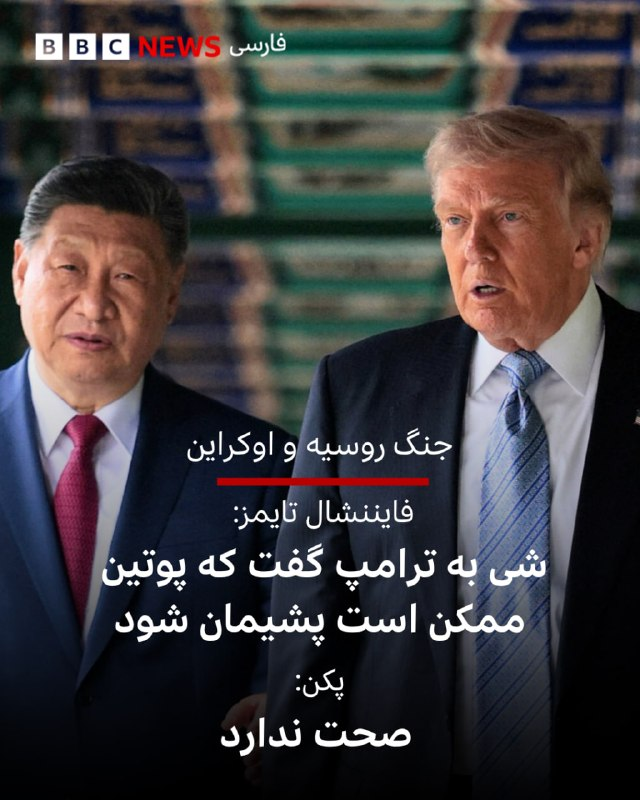

🔺در آستانه سفر ولادیمیر پوتین به پکن، وزارت خارجه چین نقل قول نسبت داده شده به شی جین‌پینگ در مورد همتای روسش را تکذیب کرد.

روزنامه فایننشال تایمز نوشته بود که رئیس‌جمهور چین به دونالد ترامپ گفته است که ولادیمیر پوتین ممکن است در نهایت از حمله به اوکراین «پشیمان» شود.

گوو جیاکون، سخنگوی وزارت امور خارجه چین، امروز در پاسخ خبرنگاران گفت:

«چین پیش‌تر اطلاعات مربوط به دیدار روسای جمهور چین و آمریکا را منتشر کرده است. گزارشی که شما به آن اشاره کردید با واقعیت‌ها سازگار نیست و کاملا ساختگی است.»

چین همچنین اصابت یک پهپاد روسی به یکی از کشتی‌های باریش در دریای سیاه را کم‌اهمیت جلوه داد.

نیروی دریایی اوکراین دیروز عکسی را منتشر کرد که می‌گفت محل اصابت یک پهپاد گران (شاهد) روسی به عرشه یک کشتی باری چینی را نشان می‌دهد.

گوو جیاکون گفت: «کشتی مورد نظر در جزایر مارشال ثبت شده و خدمه‌ چینی داشته است.»

او گفت که سفارت چین در اوکراین با خدمه چینی در تماس بوده و هیچ‌کس آسیب ندیده است.

📸Reuters

https://bbc.in/4tJWJWm
@BBCPersian

## BBCPersian — post 281475

🔻سخنگوی شورای شهر تهران اعلام کرد کرایه مترو و اتوبوس از روز چهارشنبه به روال قبل از جنگ برمی‌گردد و استفاده رایگان از حمل‌ونقل عمومی دیگر تمدید نمی‌شود.

علیرضا نادعلی، سخنگوی شورای شهر تهران، امروز در حاشیه جلسه شورای شهر تهران گفت که طرح «اصلاح نظام یکپارچه بلیت الکترونیک حمل‌ونقل عمومی» با رأی اعضای شورا تصویب و برای بررسی بیشتر به کمیسیون‌های تخصصی ارجاع شده است.

به گفته او، این طرح با امضای ۱۰ عضو شورا به ریاست رئیس شورای شهر ارائه شد و در جلسه امروز ۱۳ رأی موافق کسب کرد.

سخنگوی شورای شهر تهران افزود تا زمان تعیین تکلیف نهایی این طرح، ادامه رایگان بودن خدمات مترو و اتوبوس در دستور کار نخواهد بود.

@BBCPersian

## BBCPersian — post 281474

  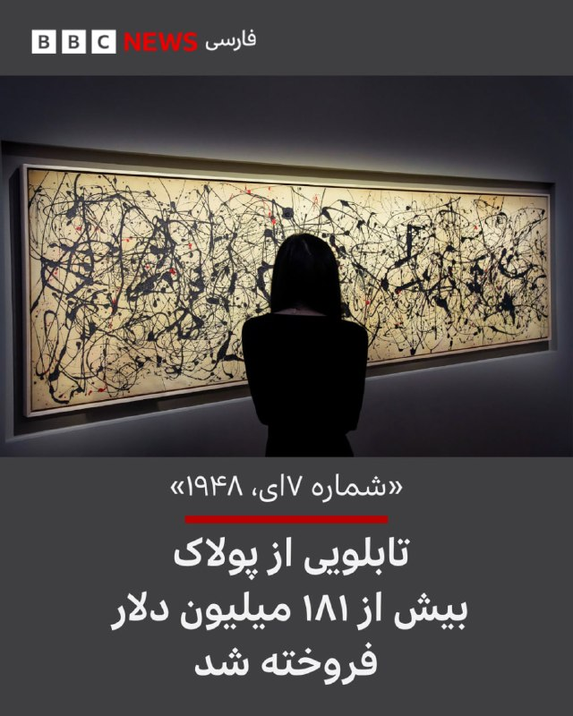

🔻تابلویی از جکسون پولاک، هنرمند برجسته آمریکایی، در حراجی نیویورک به قیمت رکوردشکن ۱۸۱/۲ میلیون دلار فروخته شد.

به این ترتیب، این نقاشی به چهارمین اثر هنری گران‌قیمت تاریخ حراج‌ها تبدیل شد و در عین حال، رکورد تازه‌ای را هم برای آثار پولاک برجا گذاشت؛ قیمت فروش آن، تقریباً سه برابر رکورد قبلی فروش آثار این نقاش اکسپرسیونیست انتزاعی است.

این اثر با عنوان «شماره ۷ اِی، ۱۹۴۸» ترکیبی از چکه‌های رنگ سیاه با رگه‌هایی از رنگ قرمز را بر روی بومی عظیم به طول بیش از سه متر به تصویر می‌کشد.

در حراجی دوشنبه‌شب مؤسسه کریستی، در کمتر از سه ساعت آثاری هنری به ارزش بیش از یک میلیارد دلار به فروش رفت.

مراسم حراجی دیشب همچنین شاهد ثبت چند رکورد دیگر، از جمله برای آثار خوان میرو و مارک روتکو بود.

📸Reuters
@BBCPersian

## BBCPersian — post 281473

🔻بقایی اتهام صدر‌اعظم آلمان به ایران درباره حمله به تاسیسات هسته‌ای امارات را رد کرد

سخنگوی وزارت خارجه اتهام صدراعظم آلمان را تکذیب کرد که گفته بود ایران در حمله به نزدیکی نیروگاه هسته‌ای امارات متحده عربی نقش داشته است.

اسماعیل بقایی به زبان آلمانی در شبکه ایکس، فریدریش مرتس را به «ریاکاری» متهم کرد: «حملات آشکار آمریکا و اسرائیل به تاسیسات هسته‌ای ایمن ایران (تحت نظارت آژانس) محکوم نمی‌شود، بلکه با بهانه‌هایی توجیه می‌شود. اما وقتی عملیات پرچم دروغین انجام می‌شود که حتی خود امارات رسما به ایران نسبت نداده است، همان صداها ناگهان زبان 'حقوق بین‌الملل' و 'امنیت منطقه' را به کار‌ می‌گیرند.»

آقای بقایی در ادامه نوشت: «اگر حمله به تأسیسات هسته‌ای تهدیدی برای مردم منطقه است، این اصل باید برای همه کشورها یکسان باشد نه فقط زمانی که مصالح سیاسی غرب اقتضا کند.»

فریدریش مرتس، صدر‌اعظم آلمان، دیروز «حملات هوایی تازه ایران به امارات و دیگر شرکا» را محکوم کرد و گفته بود که حمله به «تاسیسات هسته‌ای» تهدیدی برای امنیت مردم سراسر منطقه است.

امارات متحده روز یکشنبه گفت که در حمله پهپادی، ژانراتور برق بیرون محوطه نیروگاه هسته‌ای براکه در نزدیکی ابوظبی آتش گرفته است. امارات در بیانیه‌هایش نامی از کشوری نبرد و فقط گفت پهپاد از «مرز غربی» وارد شده بود.

https://bbc.in/4eVQ6MZ
@BBCPersian

## BBCPersian — post 281472

🔻بورس تهران در غیاب بعضی نمادها، بعد از ۸۰ روز آغاز به کار کرد

معاملات سهام در بازار بورس تهران بعد از ۸۰ روز تعطیلی فعالیت خود را از سر گرفت؛ بازار بورس بعد از حملات آمریکا و اسرائیل به ایران در نهم اسفند ماه پارسال و آغاز جنگ تعطیل شده بود.

با وجود بازگشایی بازار سرمایه، معاملات بطور کامل از سر گرفته نشده و بر اساس اعلام سازمان بورس، ۴۲ نماد همچنان بسته مانده‌اند و آغاز معاملات آنها به زمان دیگری موکول شده است.

نمادهایی که بسته مانده‌اند حدود ۳۵ درصد ارزش بازار را شامل می‌شوند و بعضی شرکت‌های متولی این نمادها در جریان جنگ آمریکا و اسرائیل با ایران آسیب دیدند.

در ساعات ابتدایی فعالیت امروز بازار، معاملات پرنوسان بود و تا ساعت ۱۰ و نیم صبح بوقت محلی(تهران) شاخص کل ۴۰۸۰ واحد افت کرد.

به گزارش رسانه‌های اقتصادی تهران، شاخص کل بورس تا ساعت ۱۰ صبح تهران به عدد ۳ میلیون و ۷۱۰ هزار واحد رسید.

شاخص کل در اوایل بهمن ماه پارسال تا رقم ۴‌/۴ میلیون واحد هم پیش رفته بود.

حجت‌اله صیدی، رئیس سازمان بورس و اوراق بهادار تهران امروز در مراسم بازگشایی معاملات بورس «ابهام ناشی از شرایط جنگ» و «گزارش مالی شرکت‌ها» را دلیل بسته ماندن ۸۰ روزه بورس عنوان کرد.

بنابر اعلام سازمان بورس بیش از ۵۰۰ شرکت در معاملات امروز حضور داشتند.

https://bbc.in/3RxuaOu
@BBCPersian

## BBCPersian — post 281471

🔻افزایش ساعات فعالیت دو فرودگاه اصلی در تهران

به گفته مجید اخوان، سخنگوی سازمان هواپیمایی کشوری در ایران ساعات فعالیت دو فرودگاه اصلی در تهران، یعنی مهرآباد و امام خمینی، افزایش یافته است.

بر این اساس، این دو فرودگاه از ساعت ۴:۳۰ صبح تا نه و نیم شب فعالیت خواهند داشت و «تمامی پروازهای داخلی و بین‌المللی می‌توانند طبق اطلاعیه هوانوردی صادرشده از سوی سازمان هواپیمایی کشوری، در این دو فرودگاه انجام شود.»

به گفته آقای اخوان با افزایش ساعات کاری فرودگاه‌ها، تاخیر در پروازها «کاهش خواهد یافت.»

پروازهای خارجی از ایران که از زمان شروع جنگ در نهم اسفند سال گذشته متوقف شده بود، در اوایل اردیبهشت از سر گرفته شد.

آمریکا و اسرائیل در طول جنگ شماری از فرودگاه‌ها و هواپیماهای ایران را هدف حملات هوایی قرار دادند.

https://bbc.in/4umE58h
@BBCPersian

## BBCPersian — post 281470

🔻رئیس کمیسیون امنیت ملی مجلس ایران: تنگه هرمز تا ابد اهرم استراتژیک خواهد بود

رئیس کمیسیون امنیت ملی و سیاست خارجی مجلس شورای اسلامی گفت که تنگه هرمز «برای همیشه در اختیار و مدیریت» ایران باقی خواهد ماند.

ابراهیم عزیزی به خبرگزاری ایسنا گفت که تنگه هرمز «یک اهرم اقتصادی، سیاسی و نظامی تمام‌عیار است که تا ابد در اختیار و مدیریت ملت رشید و با اقتدار ایران خواهد بود.»

او با هشدار به کشورهایی که «به هر دلیلی سودای قدرت‌نمایی در تنگه هرمز دارند»،‌ افزود: «با اقتدار کامل پیش می‌رویم و با هیچ‌کس تعارف نداریم.»

آقای عزیزی تاکید کرد که کنترل و مدیریت این آبراه از «حقوق مسلم ایران» است و هشدار داد که «هرگونه اقدام خصمانه یا تلاش برای محدود کردن نفوذ و حاکمیت ایران در این منطقه، با پاسخ قاطع و مقتدرانه مواجه خواهد شد.»

https://bbc.in/3RhcGpK
@BBCPersian

## idfinfarsi — post 11608

  <a href="telegram/content/idfinfarsi_11608_1779192861.mp4" target="_blank">🎬 Download video</a>

🎬 Video

## idfinfarsi — post 11607

در شبانه‌روز گذشته در جنوب لبنان: ارتش اسرائیل بیش از ۲۵ انبار تسلیحات و پرتابگر متعلق به سازمان تروریستی حزب‌الله را هدف قرار داد

ارتش اسرائیل به فعالیت خود برای رفع تهدیدها علیه شهروندان اسرائیل و نیروهای ارتش در جنوب لبنان ادامه می‌دهد.

در شبانه‌روز گذشته، ارتش اسرائیل بیش از ۲۵ زیرساخت متعلق به سازمان تروریستی حزب‌الله را در چندین منطقه در جنوب لبنان هدف قرار داد.

از جمله زیرساخت‌های هدف قرار داده‌شده: انبارهای تسلیحات، مراکز فرماندهی و دیگر زیرساخت‌هایی بودند که از آن‌ها تروریست‌های این گروه برای پیشبرد طرح‌های تروریستی علیه نیروهای ارتش اسرائیل و کشور اسرائیل استفاده می‌کردند.

همچنین، ارتش اسرائیل تروریست‌ها را در منطقه رشته‌کوه کریستوفنی در جنوب لبنان هدف قرار داد و پرتابگرهایی را که پیش‌تر به سوی نیروهای ارتش اسرائیل و خاک این کشور شلیک کرده بودند، منهدم کرد.

## Dirty_Kids — post 389737

🔴 یه نفر دیگه از نیرو های سپاه پاسداران در عملیات خنثی‌سازی بمب های عمل نکرده امریکا و اسرائیل دیروز منفجر شد.

@Dirty_Kids 👻

## Dirty_Kids — post 389736

  

قال موش‌علی: دفن نخواهم شد و تشییع جنازه نخواهیم گرفت :)))

@Dirty_Kids 👻

## Dirty_Kids — post 389735

  

بعید نیست ترامپ چند روز دیگه‌ همچین توییتی بزنه: 😂😂

@Dirty_Kids 👻

## Dirty_Kids — post 389734

  <a href="telegram/content/Dirty_Kids_389734_1779192864.mp4" target="_blank">🎬 Download video</a>

از کیرشناسی تا شاعری 🔞 تا آخر ببینید

بعد همین جنده‌ها با این ادبیات میان میگن شما بی‌ادبید

@Dirty_Kids 👻

## Dirty_Kids — post 389733

  <a href="telegram/content/Dirty_Kids_389733_1779192864.mp4" target="_blank">🎬 Download video</a>

🔴 چند روز پیش دريک | Drake رپرِ معروف کانادایی یهو سه تا آلبوم داد بیرون که حسابی ترکوند؛

نکته جالبش اینجا بود که تو ترک Don't worry از آلبوم Iceman، به یه دختر ایرانی اشاره کرده!

دختر، تو خوب میدونی بین ما چه خبره، من با یه چشم به هم زدن میام پیشت

میخواد بره اونور میخواد پارتی رو ببینه

گفت ایرانیه و شروع کرد فارسی حرف زدن

نمیدونم این روزا چمه واقعاً چمه

@Dirty_Kids 👻

## Dirty_Kids — post 389732

  <a href="telegram/content/Dirty_Kids_389732_1779192866.mp4" target="_blank">🎬 Download video</a>

آخی دلم خنک شد
تا آخر ببینید ؛))

@Dirty_Kids 👻

## Dirty_Kids — post 389731

  

🔴 وزیر کار دولت رئیسی: ایران هیچوقت دچار ابَرتورم نمیشه، چون وقتی قیمتا از یه حدی بالاتر بره مردم دیگه نمیتونن خرید کنن، فروشنده‌هام دیگه نمیتونن گرون کنن و در نتیجه همه چی ارزون و درست میشه.

@Dirty_Kids 👻

## Dirty_Kids — post 389730

  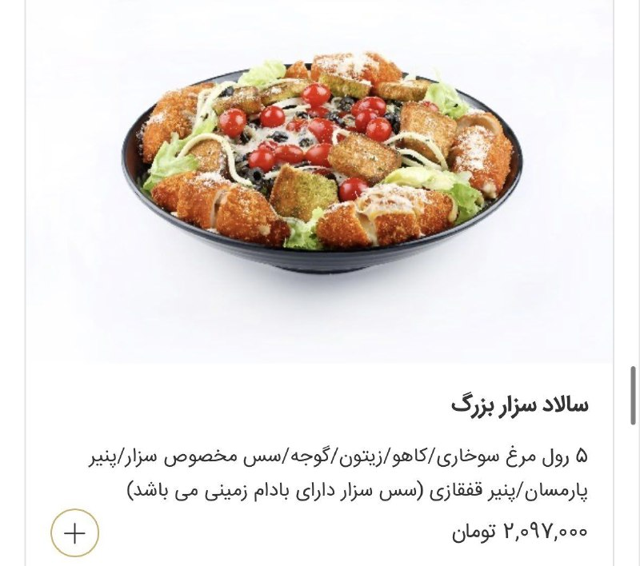

سالاد وارد کانال ۲ میلیون تومن شد

@Dirty_Kids 👻

## Dirty_Kids — post 389729

  <a href="https://t.me/Dirty_Kids/389729" target="_blank">📎 Download file</a>

📱 اپلیکیشن اندروید بدون فیلتر ریتزوبت

➖➖➖➖➖

🔹 ثبت نام آسان 
✅
🔹 رابط کاربری بسیار راحت و سریع 
✅
🔹 درگاه پرداخت کارت به کارت 
✅
🔹 درگاه پرداخت دلاری سریع 
✅
🔹 بونوس ۱۰۰ درصدی اولین واریز 
✅
🔹 بونوس ۱۰۰ درصدی واریز یکشنبه ها 
✅

➖➖➖➖➖
🌐 https://RitzoBet.com

⚡️ @RitzoBet_ir

## Dirty_Kids — post 389728

  <a href="telegram/content/Dirty_Kids_389728_1779192868.webm" target="_blank">🎬 Download video</a>

⚠️ برای #شرطبندی های فوتبال از سایت معتبر و بین المللی استفاده کنید ✅

🏴󠁧󠁢󠁥󠁮󠁧󠁿 چلسی 
🔢
🔢 
⚽️تاتنهام

سایت #ریتزوبت ، چهار سال هستش داخل ایران فعالیت میکنه 
✅

لایسنس بین المللی داره ، روش های شارژ و برداشت متنوع داره و بونوس 100% ورزشی و کش بک های جذاب
💎

⏪ اپلیکیشن بدون فیلتر ریتزوبت 
📱
⏩
R29

✅ لینک بدون‌ فیلتر ریتزوبت
🤣

🆔 @RitzoBet_ir 
🇮🇷

## Dirty_Kids — post 389727

  

🔴 توی کرج یه عروسی به طرز عجیبی بهم خورد! حالا داستان چی بوده؟

یه پسر شب عروسیش می بینه ۱۱ تا پسر جوون اومدن مراسمش و هیچکدوم رو نمی‌شناسه، هی از این و اون سوال می‌کنه می بینه کسی نمیشناستشون.
خلاصه میره به دختره میگه تو اینارو می‌شناسی؟ میگه آره دوستای معمولی و مثل داداشمن، تازه یه چند تای دیگم هستن که نیومدن.
داماد بدبختم پشماش می‌ریزه و همونجا با یه خداحافظی دختر رو ترک می‌کنه.

@Dirty_Kids 👻

## Dirty_Kids — post 389725

  

یه مسافر که شباهت زیادی به مایکل جکسون داشته، تو یه اتوبوس توی مکزیک دیده شد.
یعنی ممکنه زنده باشه؟😐

@Dirty_Kids 👻

## Dirty_Kids — post 389724

  <a href="telegram/content/Dirty_Kids_389724_1779192869.mp4" target="_blank">🎬 Download video</a>

اظهار نظر محمدحسین عظیمی (دبیر کل جبهه انقلاب اسلامی) در مورد مسیح علی‌نژاد و گلشیفته فراهانی: عامل دستگاه امنیتی در ایران بودند!

@Dirty_Kids 👻

## Dirty_Kids — post 389723

  

🌪وقتی اینترنت طوفانیه... کافیه بادبان ها رو بکشی تا

⚫️با بالاترین کیفیت ممکن
⚡️ 

⚫️100 هزار تومان شارژ هدیه 
🎁

⚫️پایین ترین قیمت گیگی 250
🌐 

⚫️و ارائه پورسانت %10 در ازای هر معرفی
💼

بتونی یه اتصال پایدار با پشتیبانی 24 ساعته داشته باشی
🚀

بادبان راهتو باز می‌کنه
⛵️

R29

🛡@BadBan_VPN | کانال 

🤖@BadBan_VPNBot | ربات 

📞@BadBan_VPNSupport | پشتیبانی

## Dirty_Kids — post 389722

  <a href="telegram/content/Dirty_Kids_389722_1779192871.mp4" target="_blank">🎬 Download video</a>

دیگه صرف نداره یدونه یدونه این حشریارو عقد کنن، بصورت گوسفندی گله‌وار عقدشون میکنن برن جهاد نکاح

@Dirty_Kids 👻

## Hranews — post 113037

یک کارگر معدن نگین طبس بر اثر گازگرفتگی جان‌ باخت

❗️
❗️
❗️
❗️
❗️– دبیر اجرایی خانه کارگر طبس اعلام کرد که یک #کارگر_معدن نگین واقع در منطقه معدنی پرورده این شهر، به دلیل کمبود تجهیزات مناسب کار بر اثر گازگرفتگی جان خود را از دست داده است.

ادامه مطلب

#جواد_پسرکلو

↘️
@hranews_bot تماس ✉️ - @Hranews کانال هرانا 🆑

## Hranews — post 113036

  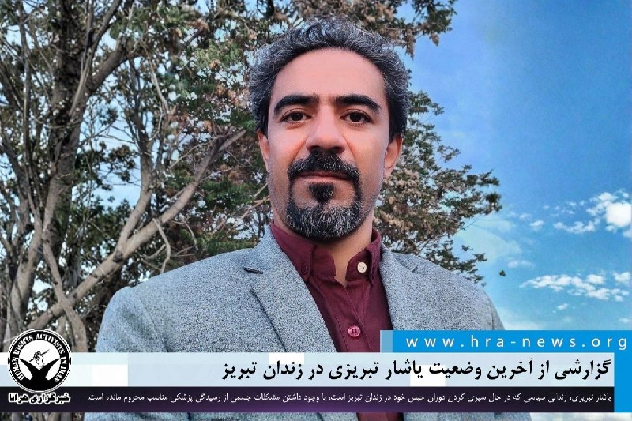

محروم از درمان؛ گزارشی از آخرین وضعیت یاشار تبریزی در زندان تبریز

❗️
❗️
❗️
❗️
❗️– یاشار تبریزی، فعال مدنی محبوس در زندان تبریز، با وجود ابتلا به عفونت چشم و بیماری قلبی، از دسترسی به رسیدگی پزشکی تخصصی و اعزام به مراکز درمانی خارج از زندان محروم مانده است. وی در حال سپری کردن دوران محکومیت هفت ماه حبس خود در این زندان است.

به گزارش خبرگزاری هرانا، ارگان خبری مجموعه فعالان حقوق بشر در ایران، #یاشار_تبریزی، با وجود داشتن مشکلات جسمی از رسیدگی پزشکی مناسب محروم مانده است.

یک منبع مطلع و نزدیک به خانواده آقای تبریزی با تأیید این خبر به هرانا گفت: در زمان بازداشت، ضربه‌ای به چشم چپ آقای تبریزی وارد شده که منجر به عفونت شده است. با وجود نیاز به رسیدگی تخصصی، وی تاکنون به بیمارستانی خارج از زندان اعزام نشده و صرفاً خدمات محدود بهداری زندان را دریافت می‌کند. او همچنین از بیماری‌های قلبی رنج می‌برد و از این نظر نیز در وضعیت جسمانی نامساعدی قرار دارد.

ادامه مطلب

↘️
@hranews_bot تماس ✉️ - @Hranews کانال هرانا 🆑

## Hranews — post 113035

دستکم ۹ روزنامه‌نگار در ایران زندانی هستند

❗️
❗️
❗️
❗️
❗️– فدراسیون بین‌المللی روزنامه‌نگاران در تازه‌ترین گزارش خود اعلام کرد که دست‌کم ۹ روزنامه‌نگار در ایران به نام های رضا ولی‌زاده، محمد پارسی، آرتین غضنفری، سمیه حیدری، پدرام علمداری، کیانوش درویشی، مسلم زارعی، امیرحسین رضایی و حامد تیزرویان، در زندان به‌سر می‌برند. این نهاد همچنین به تداوم محدودیت‌ها علیه فعالان رسانه‌ای در کشور اشاره کرده است.

ادامه مطلب

#رضا_ولی‌زاده #محمد_پارسی #آرتین_غضنفری
#سمیه_حیدری #پدرام_علمداری #کیانوش_درویشی
#مسلم_زارعی #امیرحسین_رضایی #حامد_تیزرویان

↘️
@hranews_bot تماس ✉️ - @Hranews کانال هرانا 🆑

## Hranews — post 113034

شهرستان دماوند؛ یک شهروند به دلیل استفاده از استارلینک بازداشت شد

❗️
❗️
❗️
❗️
❗️– فرمانده انتظامی شهرستان دماوند از #بازداشت یک شهروند در این شهرستان به دلیل آنچه استفاده از “تجهیزات استارلینک” عنوان کرده است، خبر داد. به گفته وی، از این فرد سه دستگاه استارلینک و تجهیزات مربوطه ضبط شده است.

ادامه مطلب

↘️
@hranews_bot تماس ✉️ - @Hranews کانال هرانا 🆑

## Hranews — post 113033

  

روز دوشنبه، هرانا با انتشار گزارشی در ۲۴۰ صفحه و به دو زبان فارسی و انگلیسی، به بررسی درگیری نظامی میان ایالات متحده و اسرائیل با ایران، در بازه زمانی ۹ اسفند ۱۴۰۴ تا ۱۹ فروردین ۱۴۰۵ پرداخت؛ دوره‌ای که طی آن هزاران حمله در نقاط مختلف کشور ثبت شده است. داده‌های مستندشده نشان می‌دهد این عملیات‌ها طیف گسترده‌ای از اهداف، از زیرساخت‌های نظامی تا مراکز غیرنظامی، را دربر گرفته و در بسیاری موارد فراتر از اهداف اعلام‌شده گسترش یافته‌اند.

بر اساس یافته‌های این گزارش، بخش قابل توجهی از این حملات با آسیب مستقیم به غیرنظامیان و زیرساخت‌های حیاتی همراه بوده است. مراکز درمانی، آموزشی، مناطق مسکونی و زیرساخت‌های انرژی و آب از جمله اهداف یا آسیب‌دیدگان این حملات بوده‌اند؛ موضوعی که نگرانی‌های جدی درباره رعایت اصول حقوق بین‌الملل بشردوستانه ایجاد می‌کند.

هم‌زمان، پیامدهای داخلی این درگیری‌ها نیز قابل توجه بوده است؛ از جمله افزایش بازداشت‌ها، تشدید سرکوب‌های امنیتی، رشد اعدام‌ها و محدودیت‌های گسترده ارتباطی. این روندها نشان می‌دهد که اثرات این مخاصمه تنها به میدان جنگ محدود نمانده و ابعاد اجتماعی، اقتصادی و حقوق بشری گسترده‌تری را در داخل کشور به همراه داشته است.

📎 گزارش را به زبان فارسی مطالعه کنید

📎 دانلود مستقیم فایل پی دی اف فارسی از تلگرام

📎 Complete report in English

📎Direct download of the English PDF

↘️
@hranews_bot تماس ✉️ - @Hranews کانال هرانا 🆑

## Hranews — post 113032

  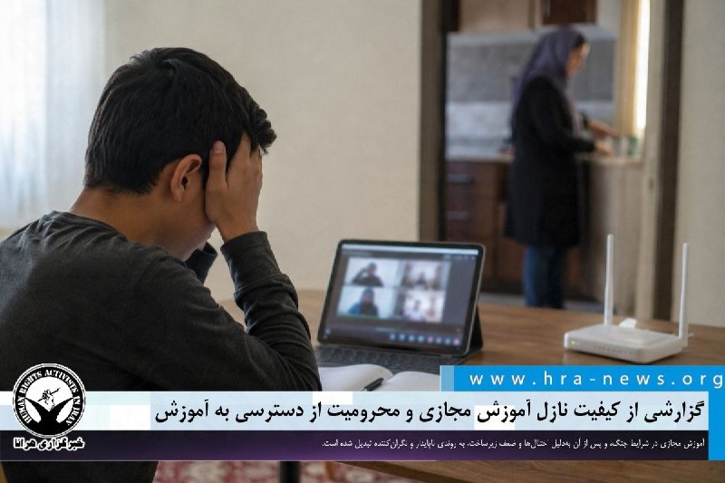

گزارشی از کیفیت نازل آموزش مجازی و محرومیت از دسترسی به آموزش

❗️
❗️
❗️
❗️
❗️– در شرایطی که آموزش مجازی قرار بود راهکاری موقت برای ادامه تحصیل دانش‌آموزان در دوران بحران جنگ باشد، اکنون بسیاری از خانواده‌ها و معلمان می‌گویند این شیوه بیش از آنکه جایگزینی پایدار برای مدرسه باشد، به تجربه‌ای فرساینده و بی‌ثبات تبدیل شده است. گزارش پیش رو که توسط هرانا و بر اساس گفت‌وگو با خانواده‌های دانش‌آموزان، معلمان، مدیران مدارس و کارشناسان آموزشی تهیه شده، تلاش دارد ابعاد بحران آموزش غیرحضوری در ایران را بررسی کند؛ بحرانی که از اختلال گسترده اینترنت و ضعف زیرساخت‌های آموزشی تا کمبود تجهیزات، فشار اقتصادی بر خانواده‌ها و نبود برنامه‌ریزی روشن برای یک دوره نامعلوم پیش رو را در بر می‌گیرد.

به گزارش خبرگزاری هرانا، ارگان خبری مجموعه فعالان حقوق بشر در ایران، تبدیل «آموزش مجازی» از یک راهکار موقت به یک بستر اجباری و فرساینده، نظام آموزشی کشور با چالش‌های ساختاری عمیقی مواجه شده است.

بررسی‌های میدانی و گزارش‌های دریافتی هرانا نشان می‌دهد که اختلالات تعمدی و ساختاری در شبکه اینترنت، فقدان زیرساخت‌های پلتفرمی، قطع مکرر برق، تبعیض در توزیع امکانات رقمی (دیجیتال) و سیاست‌گذاری‌های متناقض مسئولان، نه تنها کیفیت یادگیری را به حداقل رسانده، بلکه حق دسترسی برابر به آموزش مندرج در اسناد حقوق بشری و قوانین داخلی را به شکلی جدی نقض کرده است.

ادامه مطلب

#آموزش_مجازی #دانش‌آموزان

↘️
@hranews_bot تماس ✉️ - @Hranews کانال هرانا 🆑

## Hranews — post 113031

  

اخیراً در یکی از برنامه‌های صدا و سیما که به موضوع ازدواج و تبلیغ شیوه‌های سنتی مرتبط با آن می‌پردازد، نمونه‌هایی از کودک‌همسری به نمایش گذاشته شده و استفاده از ادبیات تبعیض‌آمیز علیه زنان و دختران نیز در آن مشاهده می‌شود. در این برنامه، زوج‌هایی حضور یافته‌اند که به نظر می‌رسد مصداق ازدواج دختران زیر ۱۸ سال یا «کودک‌همسری» باشند. همچنین مجری زن برنامه، در سخنان خود، سنت‌هایی را ترویج می‌کند که در آن‌ها تولد نوزاد پسر نوعی امتیاز تلقی می‌شود. این موضوعات، به‌ویژه در ادامه تبلیغات آشکار و پنهان برای ازدواج افراد زیر ۱۸ سال در رسانه‌های دولتی، نگرانی‌های جدی فعالان حوزه حقوق کودک و حقوق زنان را برانگیخته است.
#کودک‌همسری #زنان

↘️
@hranews_bot تماس ✉️ - @Hranews کانال هرانا 🆑

## manototv — post 105634

  <a href="telegram/content/manototv_105634_1779192873.mp4" target="_blank">🎬 Download video</a>

ولی‌الله حیاتی، معاون امنیتی استانداری خوزستان، بعدازظهر سه‌شنبه ۲۹ اردیبهشت گفت سقوط یک «پرتابه» یا «شی ناشناس» در یک منطقه مسکونی اندیمشک چهار مصدوم بر جا گذاشت.

به گزارش ایرنا، این مقام محلی گفت این حادثه به یک باب مغازه و دو خودرو خسارت وارد کرده و بازتاب گسترده‌ای در شبکه‌های اجتماعی این شهرستان داشته است.

حیاتی در توضیح جداگانه‌ای درباره صداهای شنیده‌شده در آسمان اندیمشک گفت: «صدای شلیک‌های اخیر در آسمان اندیمشک به دلیل تست پدافند هوایی است، لذا مردم نگران نباشند.»

با این حال رسانه‌های داخلی و مقام‌های جمهوری اسلامی هنوز توضیحی درباره ماهیت «شی ناشناس» یا «پرتابه» سقوط‌کرده ارائه نکرده‌اند و مشخص نیست این حادثه ارتباطی با تست پدافند هوایی داشته است یا نه.

## manototv — post 105633

  <a href="telegram/content/manototv_105633_1779192874.mp4" target="_blank">🎬 Download video</a>

سخنگوی وزارت خارجه قطر اعلام کرد دوحه همچنان با واشنگتن و تهران در تماس است و این رایزنی‌ها ادامه خواهد داشت.
ماجد الانصاری، در واکنش به تصمیم دونالد ترامپ برای تعویق حمله برنامه‌ریزی‌شده به ایران به درخواست قطر، عربستان سعودی و امارات، گفت این اقدام «نشانه پاسخ مثبت» بوده است.
او همچنین با اشاره به مذاکرات میان آمریکا و جمهوری‌اسلامی گفت قطر از تلاش‌های دیپلماتیک پاکستان برای نزدیک کردن طرف‌ها و یافتن راه‌حل حمایت می‌کند و این روند «به زمان بیشتری نیاز دارد».
الانصاری درباره روابط دوحه و تهران گفت قطر همچنان روابط مثبتی با جمهوری‌اسلامی دارد، اما در عین حال افزود حمله جمهوری‌اسلامی به قطر «تهدیدی برای روابط دو کشور» به شمار می‌رود

## manototv — post 105632

  <a href="telegram/content/manototv_105632_1779192874.mp4" target="_blank">🎬 Download video</a>

«صدای رشید مظاهری باشید»

## manototv — post 105631

  <a href="telegram/content/manototv_105631_1779192875.mp4" target="_blank">🎬 Download video</a>

«صدای فاطمه سپهری باشیم»

## manototv — post 105630

  <a href="telegram/content/manototv_105630_1779192876.mp4" target="_blank">🎬 Download video</a>

بر اساس گزارش‌ رسانه‌های حکومتی حمید خانی، پاسدار بازنشسته اهل شهرستان بروجن، در جریان عملیات خنثی‌سازی بمب‌های عمل‌نکرده باقی‌مانده از جنگ اخیر در تهران کشته شد. بر اساس گزارش‌ها، او به‌صورت داوطلبانه در بخش مهندسی قرارگاه خاتم‌الانبیا فعالیت می‌کرد.

## manototv — post 105629

  <a href="telegram/content/manototv_105629_1779192877.mp4" target="_blank">🎬 Download video</a>

قیمت جهانی نفت پس از آن کاهش یافت که دونالد ترامپ اعلام کرد حمله برنامه‌ریزی‌شده به ایران را به‌منظور فراهم شدن فرصت برای مذاکرات و پایان جنگ، متوقف کرده است.
بهای نفت برنت، شاخص جهانی قیمت نفت، با کاهش ۱.۵ درصدی به ۱۱۰ دلار و ۳۷ سنت در هر بشکه رسید.
همزمان، نفت خام وست‌تگزاس اینترمدیت آمریکا نیز برای تحویل ماه ژوئن با افت ۶۳ سنتی، ۱۰۸ دلار و ۳ سنت معامله شد. قرارداد فعال‌تر ماه ژوئیه این شاخص نیز با کاهش ۰.۸ درصدی به ۱۰۳ دلار و ۵۶ سنت رسید.

## manototv — post 105628

  <a href="telegram/content/manototv_105628_1779192877.mp4" target="_blank">🎬 Download video</a>

علیرضا رئیسی، معاون بهداشت وزارت بهداشت، اعلام کرد جمعیت ایران بر اساس آخرین آمار به ۸۶ میلیون و ۵۶۴ هزار نفر رسیده است.
به گفته او، از این تعداد ۴۳ میلیون و ۶۵۸ هزار نفر مرد و ۴۲ میلیون و ۹۰۶ هزار نفر زن هستند.

## manototv — post 105627

  <a href="telegram/content/manototv_105627_1779192878.mp4" target="_blank">🎬 Download video</a>

بر پایه گزارش‌های منتشر شده حامد تیزرویان، فعال محیط زیست و عکاس شناخته شده بازداشت شده است. آقای تیزرویان ۱۴ اردیبهشت در ساری بازداشت شده و با وجود سپری شدن حدود دو هفته، از نهاد بازداشت کننده یا دلیل دستگیری او اطلاعی در دست نیست.
وسایل الکترونیکی از جمله تلفن همراه حامد تیزرویان هنگام بازداشت او ضبط شده است. حامد تیزرویان، عکاس حیات وحش و دانشجوی دکترای تنوع زیستی دانشگاه شهید بهشتی، پیش‌تر تصاویری کم‌نظیر از گونه‌های در معرض خطر انقراض از جمله خرس قهوه‌ای و مرال ثبت کرده است. او همچنین در ساخت دست‌کم ۱۰ پاسگاه محیط‌بانی در محدوده جنگل‌های هیرکانی مشارکت داشته و طی سال‌های گذشته در زمینه آموزش و آگاهی‌رسانی درباره حفاظت از محیط زیست، به‌ویژه جنگل‌های هیرکانی، فعالیت مستمر داشته است. فعالان محیط زیست نگران سرنوشت آقای تیزرویان هستند. صفحه اینستاگرام حامد تیزرویان نیز آذر سال گذشته، پس از انتشار مطالبی انتقادی درباره عملکرد مدیران دولتی در مهار آتش‌سوزی جنگل‌های الیمالات مازندران، برای چند روز مسدود شده بود.

## alonews — post 121082

  <a href="telegram/content/alonews_121082_1779192878.webm" target="_blank">🎬 Download video</a>

👈 "بریتیش ایرویز" پروازها به اسرائیل رو تا ۱ آگوست به حالت تعلیق درآورد

✅ @AloNews خبر جنگ

## alonews — post 121081

  <a href="telegram/content/alonews_121081_1779192878.webm" target="_blank">🎬 Download video</a>

👈ادعای یک منبعِ اسرائیلی : یه هواپیمای مرتبط با موساد به ابوظبی، "امارات" رفته

🔴 درباره‌ هماهنگی برای اقدام مشترک در صورت حمله احتمالی به ایران صحبت کنن

✅ @AloNews خبر جنگ

## alonews — post 121080

  <a href="telegram/content/alonews_121080_1779192878.webm" target="_blank">🎬 Download video</a>

👈وال استریت ژورنال: ترامپ گفت که پس از درخواست رهبران کشورهای حاشیه خلیج فارس برای زمان بیشتر جهت مذاکره، حمله برنامه‌ریزی‌شدهٔ آمریکا به ایران را متوقف کرده است.

🔴با این حال، چندین مقام عرب خلیج فارس بعداً گفتند که از وجود هرگونه طرح حملهٔ قریب‌الوقوع آمریکا بی‌اطلاع بوده‌اند.

✅ @AloNews خبر جنگ

## alonews — post 121079

  <a href="telegram/content/alonews_121079_1779192878.webm" target="_blank">🎬 Download video</a>

👈نماینده جمهوری‌خواه توماس ماسی:
من انتظار این را نداشتم، اما انتخابات من به نقطه عطفی برای کل کشور ما تبدیل شده است.

🔴امروز ما تاریخ‌سازی می‌کنیم.

✅ @AloNews خبر جنگ

## alonews — post 121078

  <a href="telegram/content/alonews_121078_1779192879.webm" target="_blank">🎬 Download video</a>

👈هم اکنون زلزله در استان لرستان

✅ @AloNews خبر جنگ

## alonews — post 121077

  <a href="telegram/content/alonews_121077_1779192879.mp4" target="_blank">🎬 Download video</a>

👈رویترز به نقل از یک منبع نظامی گزارش داد که یک خودروی بمب‌گذاری شده در نزدیکی مرکز مدیریت تسلیحات سوریه (وابسته به وزارت دفاع) در پایتخت منفجر شده است.

🔴 همچنین منابع محلی از شنیده شدن صدای تیراندازی خبر می‌دهند.

✅ @AloNews خبر جنگ

## alonews — post 121076

  <a href="telegram/content/alonews_121076_1779192880.webm" target="_blank">🎬 Download video</a>

👈 وال استریت ژورنال : چندین مقام از کشورهای خلیج فارس که ترامپ هنگام گفتن اینکه تصمیم گرفته حمله‌ای که برای امروز علیه ایران برنامه‌ریزی شده بود را به تعویق بیندازد، به آنها اشاره کرد، گفتند که از برنامه‌های حمله فوری علیه ایران که رئیس‌جمهور ترامپ ادعا می‌کند، مطلع نبوده‌اند.

✅ @AloNews خبر جنگ

## alonews — post 121075

  <a href="telegram/content/alonews_121075_1779192880.mp4" target="_blank">🎬 Download video</a>

👈ارتش اسرائیل بیش از ۲۵ هدف وابسته به حزب‌الله رو هدف قرار داد

✅ @AloNews خبر جنگ

## alonews — post 121074

  <a href="telegram/content/alonews_121074_1779192881.webm" target="_blank">🎬 Download video</a>

👈نیویورک پست به نقل از منابع پاکستانی:
ما همچنان معتقدیم که مذاکرات غیرمستقیم جاری میان واشنگتن و تهران پیشرفت خواهد کرد.

🔴نسبت به امکان دستیابی به توافقی دوستانه میان ایالات متحده و ایران خوش‌بین هستیم.

✅ @AloNews خبر جنگ

## alonews — post 121073

  <a href="telegram/content/alonews_121073_1779192881.webm" target="_blank">🎬 Download video</a>

👈صدای انفجار در قشم مربوط به خنثی‌سازی مهمات عمل‌نکرده اسرائیل و آمریکا بود

🔴معاون سیاسی استاندار هرمزگان: صدای انفجارهای شنیده شده ظهر امروز در جزیره قشم، ناشی از عملیات خنثی‌سازی مهمات عمل‌نکرده متعلق به اسرائیل و آمریکا بوده است؛ ممکن است طی ساعات آینده نیز عملیات انهدام مهمات عمل نکرده ادامه داشته باشد.

✅ @AloNews خبر جنگ

## alonews — post 121072

  <a href="telegram/content/alonews_121072_1779192881.webm" target="_blank">🎬 Download video</a>

👈نیویورک‌تایمز: مقامات نظامی آمریکا می‌گویند که ایران تاکنون تاب‌آوری فوق‌العاده‌ای از خود نشان داده و هم‌چنان توانایی واردکردن آسیب‌های جدی به منطقه و اقتصاد جهانی را دارد.

✅ @AloNews خبر جنگ

## alonews — post 121070

  <a href="telegram/content/alonews_121070_1779192881.webm" target="_blank">🎬 Download video</a>

👈دیروز هتل تاریخی عامری‌های کاشان به علت بی حجابی پلمپ شد

✅ @AloNews خبر جنگ

## alonews — post 121069

  <a href="telegram/content/alonews_121069_1779192882.webm" target="_blank">🎬 Download video</a>

👈آی ۲۴ اسرائیل:
انور قرقاش، مشاور رئیس‌ امارات طی اظهارنظری بدون نام بردن از عربستان سعودی و قطر به دلیل تماس‌های مستمرشان با ایران، این احتمال را پیش می‌کشد که ابوظبی برای درخواست از ترامپ جهت خودداری حمله علیه ایران، تحت فشار قرار گرفته است.

🔴قرقاش گفت: «آشفتگی نقش‌ها در جریان این تجاوز(!) ایران حیرت‌آور است و کشورهای پیرامون منطقهٔ عرب خلیج فارس را در بر می‌گیرد. نقش قربانی با نقش میانجی و بالعکس در هم آمیخته است، در حالی که دوست به جای اینکه متحدی استوار و حامی باشد، به میانجی تبدیل شده است.

🔴«در خطرناک‌ترین مرحله از تاریخ معاصر خلیج فارس، در میان این تجاوز(!)، موضع خاکستری از بی‌عملی کامل هم خطرناک‌تر است.»

✅ @AloNews خبر جنگ

## alonews — post 121068

  <a href="telegram/content/alonews_121068_1779192882.webm" target="_blank">🎬 Download video</a>

👈سخنگوی وزارت امور خارجه قطر: عبور اخیر دو نفتکش حامل گاز مایع قطری از تنگه هرمز به معنای بازگشت دریانوردی به حالت عادی نیست

✅ @AloNews خبر جنگ

## alonews — post 121067

  <a href="telegram/content/alonews_121067_1779192882.webm" target="_blank">🎬 Download video</a>

👈فرماندار اسلامشهر: عملیات خنثی‌سازی مهمات عمل‌نکرده، چهارشنبه ۳۰ اردیبهشت از ساعت ۷ تا ۱۰ صبح انجام می‌شود؛ مردم در صورت شنیدن صدای انفجار نگران نباشند.

✅ @AloNews خبر جنگ

## alonews — post 121066

  

استوری سردار آزمون و آرزوی موفقیت برای بازیکنای تیم ملی

@AloSport

## alonews — post 121065

  <a href="telegram/content/alonews_121065_1779192883.webm" target="_blank">🎬 Download video</a>

👈سازمان عفو بین‌الملل:
تعداد اعدام‌ها تو جهان تو سال 2025 به بالاترین سطح ثبت‌شده تو 44 سال گذشته رسیده و اعدام‌های انجام شده به‌دست جمهوری اسلامی، اصلی‌ترین عامل این افزایش بوده.

✅ @AloNews خبر جنگ

## alonews — post 121064

  <a href="telegram/content/alonews_121064_1779192883.webm" target="_blank">🎬 Download video</a>

👈وال‌استریت ژورنال: چند مقام خلیج فارس از برخی کشورهایی که ترامپ به آن‌ها اشاره کرده بود گفتند از طرح قریب‌الوقوعی که او درباره حمله به ایران توصیف کرده بود، اطلاعی نداشتند.

✅ @AloNews خبر جنگ

## alonews — post 121063

  <a href="telegram/content/alonews_121063_1779192883.webm" target="_blank">🎬 Download video</a>

👈حیاتی، معاون امنیتی خوزستان:

🔴امروز تو اندیمشک داشتیم سامانه پدافند هوایی رو تست می‌کردیم که یه پرتابه‌اش به یه ساختمون مسکونی خورد و 4 نفر زخمی شدن.

✅ @AloNews خبر جنگ

<!-- MSG END -->

<!-- NAV START -->

<a href="https://github.com/shahinsa98/aio-downloader/blob/main/telegram/content/archive_1.md" style="display:inline-block; padding:6px 12px; margin:0 4px; background-color:#2ea44f; color:white; text-decoration:none; border-radius:4px; font-weight:bold;">صفحه بعد</a>

<!-- NAV END -->
