# خواننده تلگرام

<!-- TOP_NAV START -->

<a href="https://github.com/shahinsa98/aio-downloader/blob/main/telegram/content/archive_1.md" style="display:inline-block; padding:6px 12px; margin:0 4px; background-color:#2ea44f; color:white; text-decoration:none; border-radius:4px; font-weight:bold;">صفحه بعد</a>

<!-- TOP_NAV END -->

<!-- MSG START -->

---
📅 بروزرسانی: 1405/03/12 05:36
---

## VahidOOnLine — post 243300

  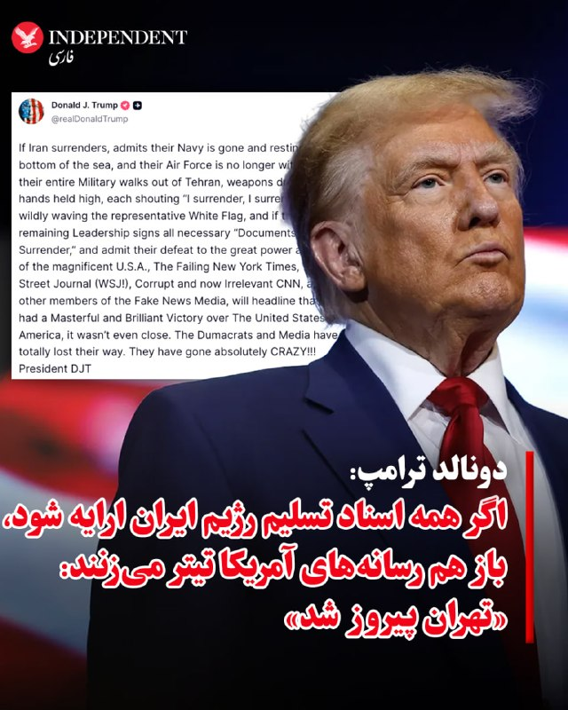

♦️دونالد ترامپ، رئیس جمهوری آمریکا در تروث سوشال نوشت: «اگر ایران تسلیم شود، اعتراف کند که نیروی دریایی‌اش نابود شده و در کف دریا آرمیده است، و نیروی هوایی‌اش دیگر وجود ندارد؛ اگر تمام نیروهای نظامی‌اش با سلاح‌های بر زمین گذاشته‌شده و دست‌های بالا رفته از تهران خارج شوند و همگی فریاد بزنند «تسلیم می‌شوم، تسلیم می‌شوم» و در همان حال پرچم سفید را با شور و حرارت تکان دهند؛ اگر همه رهبران باقی‌مانده‌شان تمام اسناد لازم برای تسلیم را امضا کنند و شکست خود را در برابر قدرت و توان عظیم ایالات متحده آمریکا بپذیرند، باز هم نیویورک تایمز شکست‌خورده، وال‌استریت ژورنالِ چینی‌شده (WSJ!)، سی‌ان‌ان فاسد و اکنون بی‌اهمیت، و سایر اعضای رسانه‌های اخبار جعلی، تیتر خواهند زد که ایران یک پیروزی درخشان و استادانه بر ایالات متحده آمریکا به دست آورده است؛ آن هم با فاصله‌ای زیاد. دموکرات‌ها و رسانه‌ها کاملا راه خود را گم کرده‌اند. آن‌ها کاملا دیوانه شده‌اند!!»
‌🇸🇦 Indypersian

🤖 @VahidOOnLine

## VahidOOnLine — post 243299

  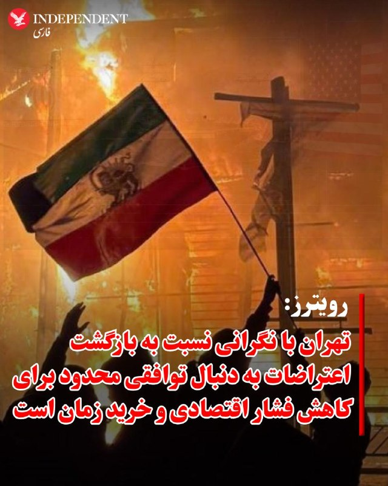

♦️به گزارش رویترز به نقل از منابع آگاه، جمهوری اسلامی در حالی که با بحران فزاینده اقتصادی، کاهش ارزش پول ملی و نارضایتی گسترده اجتماعی روبه‌رو است، به‌دنبال دستیابی به یک توافق موقت و محدود با دولت دونالد ترامپ است؛ توافقی که به گفته منابع آگاه، هدف اصلی آن خرید زمان، کاهش فشارهای اقتصادی، دسترسی به منابع مالی و جلوگیری از بازگشت اعتراضات سراسری است، نه حل‌وفصل اختلافات اصلی بر سر برنامه هسته‌ای.
به گزارش رویترز، مقام‌های جمهوری اسلامی معتقدند تزریق منابع مالی کوتاه‌مدت از طریق یک توافق موقت می‌تواند اقتصاد کشور را سرپا نگه دارد، فشارهای فوری را کاهش دهد و مانع از شکل‌گیری دوباره اعتراضات گسترده شود.
این نگرانی در شرایطی مطرح می‌شود که سال‌ها تحریم، سوءمدیریت اقتصادی و هزینه‌های ناشی از درگیری‌های منطقه‌ای باعث افزایش تورم، سقوط ارزش ریال و کاهش شدید سطح زندگی مردم شده است. منابع نزدیک به تصمیم‌گیران جمهوری اسلامی می‌گویند رهبران حکومت بیش از هر چیز نگران پیامدهای داخلی بحران اقتصادی و تاثیر آن بر ثبات سیاسی هستند.
بر اساس این گزارش، تهران خواهان یک توافق موقت است که بدون دادن امتیازهای اساسی در برنامه هسته‌ای، بخشی از فشارهای اقتصادی را کاهش دهد. جمهوری اسلامی امیدوار است از طریق چنین توافقی به میلیاردها دلار درآمد نفتی دسترسی پیدا کند، محدودیت‌های صادرات نفت کاهش یابد و بخشی از محاصره بنادر ایران از سوی آمریکا برطرف شود.
منابع رویترز می‌گویند این توافق احتمالی، مسائل اصلی از جمله ظرفیت غنی‌سازی اورانیوم و ذخایر اورانیوم با غنای بالا را به آینده موکول خواهد کرد.
رویترز می‌نویسد حکومت ایران همچنان کنترل و نفوذ خود بر تنگه هرمز را مهم‌ترین اهرم فشار راهبردی خود می‌داند و مایل است هرگونه توافق، این ابزار را برای تهران حفظ کند.
به گفته یکی از منابع، مقام‌های جمهوری اسلامی معتقدند توافق محدود می‌تواند شرایط پیش از جنگ را بازگرداند، بدون آنکه تهران ناچار به پذیرش خواسته‌های اصلی واشینگتن شود. این منبع مدعی شده است که آغاز درگیری‌ها عملا موقعیت جمهوری اسلامی را در تنگه هرمز تقویت کرده است.
کارشناسان به رویترز گفته‌اند که تمایل تهران به مذاکره بیش از آنکه ناشی از نگرانی‌های نظامی باشد، نتیجه فشارهای اقتصادی و نگرانی از فرسایش توان حکومت برای اداره کشور و مهار نارضایتی‌های داخلی است.
‌🇸🇦 Indypersian

🤖 @VahidOOnLine

## VahidOOnLine — post 243298

  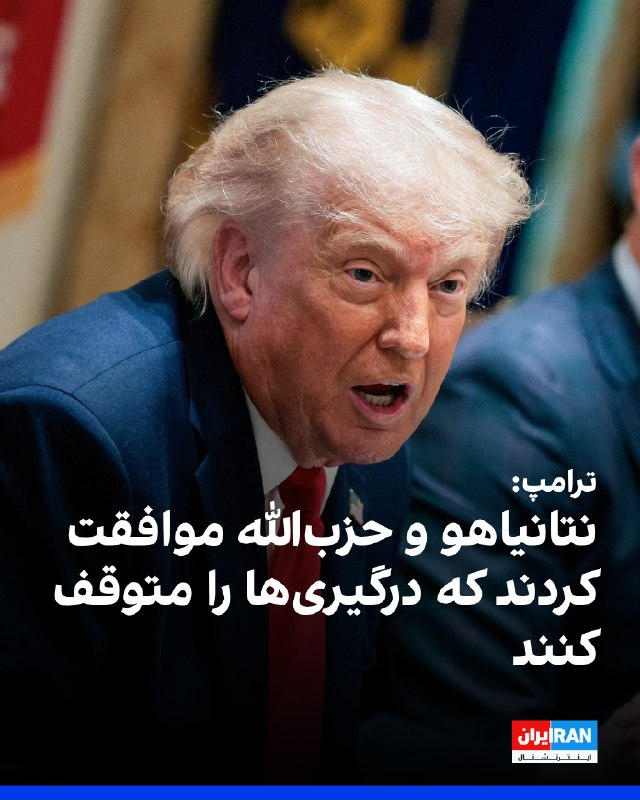

ترامپ در تروث‌سوشال با اشاره به گفت‌وگوی تلفنی خود با نتانیاهو نوشت: «از او خواستم حمله گسترده‌ای به بیروت، لبنان، انجام ندهد. او نیروهایش را برگرداند. ممنون بیبی! همچنین با نمایندگان رهبران حزب‌الله گفت‌وگو کردم و آنها موافقت کردند تیراندازی به اسرائیل و سربازانش را متوقف کنند.»
او افزود: «به همین ترتیب، اسرائیل نیز پذیرفت تیراندازی به آنها را متوقف کند. ببینیم این وضعیت چه مدت دوام می‌آورد؛ امیدوارم برای همیشه باشد.»

‌🏁 🇬🇧 IranintlTV

🤖 @VahidOOnLine

## VahidOOnLine — post 243297

  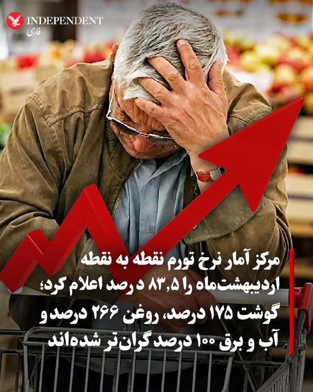

♦️در ادامه روایت‌های متناقض بانک مرکزی و مرکز آمار از نرخ تورم، مرکز آمار ایران نرخ تورم نقطه به نقطه اردیبهشت‌ماه را ۸۳.۵ درصد اعلام کرد که دست‌کم ۶ درصد بالاتر از آمار ادعای بانک مرکزی (۷۷ درصد) است. این در حالی است که همین آمار و ارقام اعلامی نیز با واقعیت‌های موجود در زندگی روزمره مردم فاصله زیادی دارد و مردم تورم بسیار بیشتری را در انواع کالا و خدمات مشاهده می‌کنند. براساس گزارش مرکز آمار، خانوارهای ایرانی در اردیبهشت ماه امسال در مقایسه با سال قبل خوراکی‌ها را ۱۲۹.۸ درصد گران‌تر خریده‌اند. در این بین، گوشت قرمز دست‌کم ۱۷۵ درصد و روغن، حداقل ۲۶۶ درصد گران‌تر شده است. در این گزارش هزینه آب و برق و سوخت و کالا و خدمات متفرقه نیز ۱۰۰ درصد گران‌تر از سال قبل عنوان شده است. خودرو نیز دست‌کم ۱۲۵ درصد گران‌تر شده است. در گزارش مرکز آمار، نرخ تورم سالانه نیز ۵۷.۷ درصد اعلام شده که همچنان بالاتر از رقم اعلامی بانک مرکزی (۵۳.۹ درصد) است. در گزارش مرکز آمار، استان‌های ایلام، کردستان و لرستان دچار تورم ۱۰۰ درصدی هستند.
‌🇸🇦 Indypersian

🤖 @VahidOOnLine

## VahidOOnLine — post 243296

  <a href="telegram/content/VahidOOnLine_243296_1780366014.mp4" target="_blank">🎬 Download video</a>

♦️به گزارش رویترز، مقامات عراقی روز دوشنبه، ۱۱ خردادماه، اعلام کردند یک کشتی باری به نام «ساریسکا» در فاصله ۷۴ کیلومتر (۴۰ مایل دریایی) در جنوب شرقی بندر «ام‌قصر» عراق در خلیج فارس، هدف دو انفجار پی‌درپی قرار گرفته است. بر اساس بیانیه‌ای که شبکه خبر صداوسیما اعلام شد، نیروی دریایی سپاه مسئولیت این حمله را بر عهده گرفت و اعلام کرد که این کشتی را در یک «عملیات تلافی‌جوئی» با «یک موشک کروز» هدف قرار داده است. پیش از این، سازمان تجارت دریایی بریتانیا (UKMTO) گزارش داده بود که یک پرتابه به سمت راست کشتی برخورد و انفجار بزرگی ایجاد کرده است؛ مقامات عراقی نیز تایید کردند که انفجار دوم ناشی از یک حمله پهپادی بوده و آتش‌سوزی ناشی از این حملات در نهایت بر روی عرشه کشتی تحت کنترل درآمده است.
‌🇸🇦 Indypersian

🤖 @VahidOOnLine

## VahidOOnLine — post 243295

  <a href="telegram/content/VahidOOnLine_243295_1780366014.mp4" target="_blank">🎬 Download video</a>

مهدی تاج، رییس فدراسیون فوتبال، درباره محل کمپ تیم ملی گفت کمپ تیخوانای مکزیک خیلی بهتر از توسان آریزونای آمریکا است.
او با رد نگرانی‌ها درباره میزان تبهکاری در این شهر گفت ما دفاعی از آن‌ها نداریم و دادن مواد مخدر به همدیگر منتفی است و قرار نیست مردم آن‌جا را اصلاح و ارشاد کنیم.
‌🏁 🇬🇧 IranintlTV

🤖 @VahidOOnLine

## FoxNewsTwitter — post 342491

  <a href="telegram/content/FoxNewsTwitter_342491_1780366016.mp4" target="_blank">🎬 Download video</a>

Fox News (Twitter/X)

"Isn't a reality TV star a job? He made millions of dollars."

Mayor Karen Bass stayed silent after FOX News correspondent @MattFinnFNC pressed her on her dismissive comments about Spencer Pratt.

Bass ripped Pratt as a "reality TV villain" who has "never had a job" during a campaign stop just one day before Los Angeles voters head to the polls.

The incumbent mayor has repeatedly argued that Pratt lacks the experience to run the nation's second-largest city, claiming he doesn't understand how city government operates.

## FoxNewsTwitter — post 342490

  <a href="telegram/content/FoxNewsTwitter_342490_1780366017.mp4" target="_blank">🎬 Download video</a>

Fox News (Twitter/X)

"These are the guys who are making sure that America stays America."

Rep. Brandon Gill praised ICE and Border Patrol agents for their role in defending U.S. sovereignty and keeping communities safe.

"ICE and Border Patrol are on the front lines of not only defending American sovereignty, but keeping our communities safe," Gill said.

Gill's comments came during an event honoring the heroism of ICE officers during a 2025 sniper attack on a Dallas ICE facility, during which two detainees were killed.

## VahidOnline — post 75866

  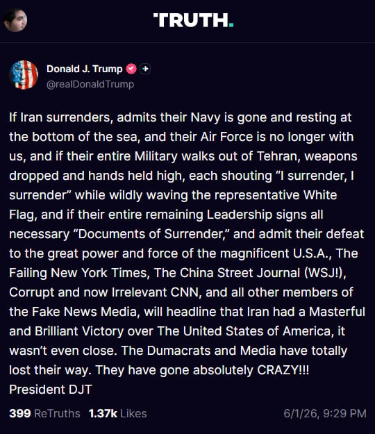

پست ترامپ علیه بعضی از رسانه‌ها

ترجمه ماشین:
اگر ایران تسلیم شود، اعتراف کند که نیروی دریایی‌اش از بین رفته و در کف دریا آرام گرفته، و نیروی هوایی‌اش دیگر در میان ما نیست؛ و اگر تمام ارتشش از تهران بیرون بیاید، سلاح‌ها را زمین بیندازد و دست‌ها را بالا ببرد، در حالی که هرکدام فریاد می‌زنند «تسلیمم، تسلیمم» و دیوانه‌وار پرچم سفیدِ نمادین را تکان می‌دهند؛ و اگر همه رهبران باقی‌مانده‌اش تمام «اسناد تسلیم» لازم را امضا کنند و شکست خود را در برابر قدرت و نیروی عظیم ایالات متحده باشکوه آمریکا بپذیرند، نیویورک تایمزِ رو به افول، چاینا استریت ژورنال — یعنی وال‌استریت ژورنال! — سی‌ان‌انِ فاسد و حالا بی‌اهمیت، و همه اعضای دیگر رسانه‌های اخبار جعلی، تیتر خواهند زد که ایران یک پیروزی استادانه و درخشان بر ایالات متحده آمریکا به دست آورد؛ اصلا هم رقابت نزدیکی نبود. دموکرات‌های احمق و رسانه‌ها کاملا راهشان را گم کرده‌اند. آن‌ها کاملا دیوانه شده‌اند!!!
رئیس‌جمهور دی‌جی‌تی
realDonaldTrump

📡 @VahidOnline

## VahidOnline — post 75865

باز هم صدای غیرمعمول پرواز یک هواپیما خیلی‌ها رو در تهران از خواب بیدار کرد.

پیام‌های دریافتی:

صدای هواپیما سعادت آباد

سلام، تهران صدای توافق میاد فکر کنم

صدای جنگنده یا هواپیما ۰۴:۰۹ غرب تهران

دوباره همین الان دقیقا ساعت ۴:۱۰ صدای شدید تر جنگنده غرب تهران

سلام تهران صدای جنگنده میاد چخبره؟؟!

مطمئن نیستم ولی غرب تهران فکر کنم صدای هواپیما یا جنگنده اومد

تهران سمت سعادت اباد صدای جنگنده میاد
خیلی پایین بود صداش

همین الان تهران صدای کلی جنگنده اومد ک رد شدن
خیلی بلند بودن

صدای جنگنده غرب تهران

ساعت۴:۱۰صبح صدای جنگنده سمت شمال غرب میاد

تهران جنت اباد 4 09 صدا جنگنده اومد

4 و ده دقیقه صبح بالا سر شهرک نفت پونک جنگنده اومد آنتن قطع شد و وصل شد

همین الان غرب تهران حدود ۲ دقیقه صدای جنگنده اومد

دقیقن ده ثانیه پیش ساعت ۴:۱۰ ‌صبح یک‌هواپیمای از همونایی که موقع جنگ از بالا سر خونمون رد می شد

تهران حدود ساعت ۴ یه هواپیما مسافربری رد شد صداشم زیاد بود
هیچ وقت از این مسیر رد نمیشه!
توی فلایت رادارم نیست

شهرک‌ غرب ۴:۱۰
صدای جنگنده او‌مد

سلام وحید جان . ساعت حدودا ۴ و ۵ تا ۴ و ۱۰ دقیقه صبح شمال غرب تهران صدای مهیب جنگنده اومد. کاملا مشخص بود تو ارتفاع پایین داره پرواز میکنه . البته نه پدافند عمل کرد نه بعدش انفجاری شد. احتمالا برای نیرو هوایی ایران بوده

امروز سه شنبه دوازده خرداد ساعت ۴و۱۳دقیقه صبح صدای هواپیمای باری یا مسافری اومد چون چراغهای کابین و چشمک زن روشن بودن، مسیرش رو دنبال کردم مهرآباد ننشست تا جنوب تهران ادامه مسیر داد، صداش عین هواپیمایی بود که دیروز دوشنبه ساعت ۹و۱۵دقیقه صبح ، بسیار طولانی و ممتد حرکت می کرد به سمت شمال ،چون از کوه های البرز رد شد

صدای جنگنده نبود غرب تهران
یه هواپیمای خیلی بزرگ بود که اونقد پایین پرواز میکرد احساس کردم الانه که بخوره به ساختمون روبرویی خیلی بزرگ بود هواپیماش و خیلی پایین

پنجره باز بود دم پنجره خوابیده بودم صداش شبیه جنگنده نبود مابین جنگنده و پهپاد بود
همچین قیرقاژ داد رفتم رو هوا
سمت پونک

📡 @VahidOnline

## IranIntlTV — post 340133

  

ترامپ در تروث‌سوشال با اشاره به گفت‌وگوی تلفنی خود با نتانیاهو نوشت: «از او خواستم حمله گسترده‌ای به بیروت، لبنان، انجام ندهد. او نیروهایش را برگرداند. ممنون بیبی! همچنین با نمایندگان رهبران حزب‌الله گفت‌وگو کردم و آنها موافقت کردند تیراندازی به اسرائیل و سربازانش را متوقف کنند.»
او افزود: «به همین ترتیب، اسرائیل نیز پذیرفت تیراندازی به آنها را متوقف کند. ببینیم این وضعیت چه مدت دوام می‌آورد؛ امیدوارم برای همیشه باشد.»

https://iranintl.com/202606029960

## IranIntlTV — post 340132

  <a href="telegram/content/IranIntlTV_340132_1780366020.mp4" target="_blank">🎬 Download video</a>

نشست سالانه مجمع آمریکایی-یهودیان ۲۰۲۶ با حضور بیش از دو هزار فعال، دیپلمات، سیاستمدار و رهبران مدنی از کشورهای مختلف برگزار می‌شود. مسیح علینژاد، روزنامه‌نگار و فعال حقوق بشر، نیز در این نشست سخنرانی کرد.

گزارش مرضیه حسینی، خبرنگار ایران‌اینترنشنال و گفت‌وگو با مسیح علینژاد
@iranintltv

## IranIntlTV — post 340131

  <a href="telegram/content/IranIntlTV_340131_1780366021.mp4" target="_blank">🎬 Download video</a>

در آستانه جام جهانی ۲۰۲۶، ممنوعیت ورود پرچم شیر و خورشید به ورزشگاه‌ها، به مناقشه‌ای تازه میان شماری از ایرانیان مخالف جمهوری اسلامی و فیفا تبدیل شده است؛ مناقشه‌ای که از مرز ورزش فراتر رفته و به بحثی درباره هویت و وحدت رسیده است. نیلوفر منصوری, خبرنگار ایران اینترنشنال، در لس‌آنجلس با شماری از ایرانیان در این ارتباط گفت‌وگو کرده است. لس‌آنجلس میزبان دو بازی ایران با نیوزیلند و بلژیک در جام جهانی خواهد بود.
@iranintltv

## IranIntlTV — post 340130

  <a href="telegram/content/IranIntlTV_340130_1780366023.mp4" target="_blank">🎬 Download video</a>

مهدی تاج، رییس فدراسیون فوتبال، درباره محل کمپ تیم ملی گفت کمپ تیخوانای مکزیک خیلی بهتر از توسان آریزونای آمریکا است.
او با رد نگرانی‌ها درباره میزان تبهکاری در این شهر گفت ما دفاعی از آن‌ها نداریم و دادن مواد مخدر به همدیگر منتفی است و قرار نیست مردم آن‌جا را اصلاح و ارشاد کنیم.

## IranIntlTV — post 340129

  <a href="telegram/content/IranIntlTV_340129_1780366024.mp4" target="_blank">🎬 Download video</a>

یک منبع آگاه به ایران‌اینترنشنال گفته دست‌کم ۱۰ زندانی سیاسی در بند زنان زندان اوین به‌دلیل اعتراض به موج اعدام‌ها از حق تماس و ملاقات محروم شده‌اند.

براساس این گزارش، شماری از زندانیان نیز در اعتراض به این شرایط دست به اعتصاب غذا زده‌اند.

گفت‌وگو با پگاه هاشمی، پژوهشگر حقوق
@iranintltv

## IranIntlTV — post 340128

روزنامه شرق از تشدید برخوردهای انضباطی در دانشگاه‌های ایران و صدور احکام اخراج و تعلیق خبر داد.

دانشجویان می‌گویند این احکام با استناد به اتهاماتی از جمله فعالیت در فضای مجازی و برهم زدن نظم دانشگاه و بدون ارائه مستندات شفاف صادر شده است.

گفت‌وگو با حسین قاضیان، جامعه‌شناس
@iranintltv

## IranIntlTV — post 340127

  <a href="telegram/content/IranIntlTV_340127_1780366026.mp4" target="_blank">🎬 Download video</a>

مقام‌ها و نزدیکان خامنه‌ای پس از مرگ او صف کشیده‌اند تا جلوی دوربین خاطره تعریف کنند. یکی از این خاطره‌ها ادعا می‌کند که خامنه‌ای در سال ۱۳۸۲ برایش بشکن زده و با دست خود حرکتی شبیه «لایک» نشان داده است.

این روایت تا چه اندازه واقعی است و چرا این روزها چنین خاطره‌هایی از رهبر پیشین جمهوری اسلامی بازگو می‌شود؟

کامبیز حسینی در «برنامه» به این موضوع می‌پردازد.

«یک ایران صدای شما را می‌شنود»
دوشنبه تا پنجشنبه ۱۱ شب تهران
از تلویزیون ایران اینترنشنال

تماشای نسخه کامل این قسمت از «برنامه» در یوتیوب:
https://youtu.be/tuyTTtgx84o
@iranintltv

## Shin_Persian — post 6398

  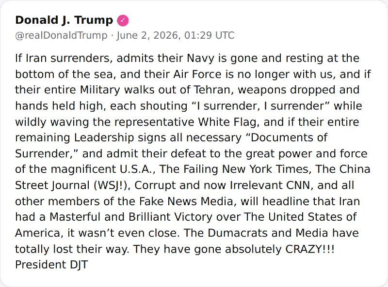

Shin ✓ @hey_itsmyturn Tue, 02 Jun 2026 01:30:28 UTC President Trump @POTUS: "If Iran surrenders, admits their Navy is gone and resting at the bottom of the sea, and their Air Force is no longer with us, and if their entire Military walks out of Tehran, weapons…

## Shin_Persian — post 6397

Shin ✓ @hey_itsmyturn
Tue, 02 Jun 2026 01:30:28 UTC

President Trump @POTUS:
"If Iran surrenders, admits their Navy is gone and resting at the bottom of the sea, and their Air Force is no longer with us, and if their entire Military walks out of Tehran, weapons dropped and hands held high, each shouting “I surrender, I surrender” while wildly waving the representative White Flag, and if their entire remaining Leadership signs all necessary “Documents of Surrender,” and admit their defeat to the great power and force of the magnificent U.S.A., The Failing New York Times, The China Street Journal (WSJ!), Corrupt and now Irrelevant CNN, and all other members of the Fake News Media, will headline that Iran had a Masterful and Brilliant Victory over The United States of America, it wasn’t even close. The Dumacrats and Media have totally lost their way. They have gone absolutely CRAZY!!! President DJT"

فارسی

رئیس‌جمهور ترامپ @POTUS:

«اگر ایران تسلیم شود، اعتراف کند که نیروی دریایی‌شان نابود شده و در کف دریا آرمیده است، و نیروی هوایی‌شان دیگر در میان ما نیست، و اگر تمام نظامیانشان از تهران بیرون بیایند، در حالی که سلاح‌ها را زمین گذاشته و دست‌ها را بالا برده‌اند و هر یک فریاد می‌زنند "من تسلیم هستم، من تسلیم هستم" و همزمان پرچم سفیدِ نشان‌دهنده تسلیم را دیوانه‌وار تکان می‌دهند، و اگر تمام رهبری باقی‌مانده‌شان تمام "اسناد تسلیم" لازم را امضا کنند و به شکست خود در برابر قدرت و نیروی عظیم ایالات متحده (U.S.A.) با شکوه اعتراف کنند، روزنامه رو به زوال نیویورک تایمز، چاینا استریت ژورنال (وال استریت ژورنال/WSJ!)، سی‌ان‌انِ (CNN) فاسد و اکنون بی‌اهمیت، و تمام دیگر اعضای رسانه‌های اخبار جعلی، تیتر خواهند زد که ایران پیروزی استادانه و درخشانی بر ایالات متحده آمریکا داشته است و حتی رقابت نزدیکی هم نبود. دموکرات‌های احمق و رسانه‌ها کاملاً راه خود را گم کرده‌اند. آن‌ها مطلقاً دیوانه شده‌اند!!! رئیس‌جمهور دی.جی.تی (DJT)»

𝕏 · @shin_persian

## Shin_Persian — post 6396

  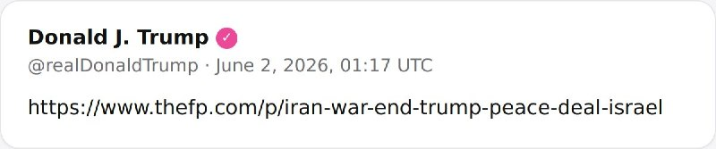

Shin ✓ @hey_itsmyturn
Tue, 02 Jun 2026 01:21:02 UTC

President Trump @POTUS:
"https://www.thefp.com/p/iran-war-end-trump-peace-deal-israel"

فارسی

رئیس‌جمهور ترامپ @POTUS:
"https://www.thefp.com/p/iran-war-end-trump-peace-deal-israel"

𝕏 · @shin_persian

## Shin_Persian — post 6395

  <a href="telegram/content/Shin_Persian_6395_1780366029.mp4" target="_blank">🎬 Download video</a>

Shin ✓ @hey_itsmyturn
Tue, 02 Jun 2026 00:19:14 UTC

There she is.
Tehran, Iran

فارسی

او آنجاست.
تهران، ایران

𝕏 · @shin_persian

## Shin_Persian — post 6392

  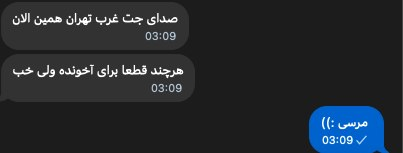

Shin ✓ @hey_itsmyturn
Tue, 02 Jun 2026 00:10:09 UTC

Jet activity, western Tehran.
0009Z

فارسی

فعالیت جنگنده‌ها، غرب تهران.
۰۰۰۹ زولو (۰۳:۳۹ به وقت تهران)

𝕏 · @shin_persian

## Shin_Persian — post 6391

OSINTdefender ✓ @sentdefender
Mon, 01 Jun 2026 23:25:45 UTC

Major ballistic missile attack underway against the Ukrainian capital of Kyiv.

فارسی

حمله موشکی بالستیک گسترده‌ای علیه کی‌یف، پایتخت اوکراین، در جریان است.

𝕏 · @shin_persian

## Iliaen — post 4439

بامداد سه‌شنبه؛ سیگنال تمام اپراتورهای تلفن همراه و همچنین تمام سرویس‌دهندگان اینترنت خانگی به صورت همزمان در شهر شیراز و چند شهر دیگر استان فارس، همچنین شهرهای خط ساحلی جنوب کشور در حدود ساعت ۰۲:۰۰ صبح به مدت تقریباً ۲۰ دقیقه “کاملاً قطع” شد.

به عبارت دیگر هیچ دستگاه تلفن همراهی آنتن نداشت، هیچ وای‌فایی متصل نبود و هیچ امکانی برای ارتباط حتی با شماره‌های اضطراری میسر نبود.

قطع برنامه‌ریزی شده جهت یک اقدام امنیتی، تست زیرساخت، حمله گسترده سایبری یا مسائل مرتبط به جنگ الکترونیک؛ مشخص نیست چه در آن ۲۰ دقیقه چه رخ داد.

@iliaen

## FarsiVOA — post 219331

  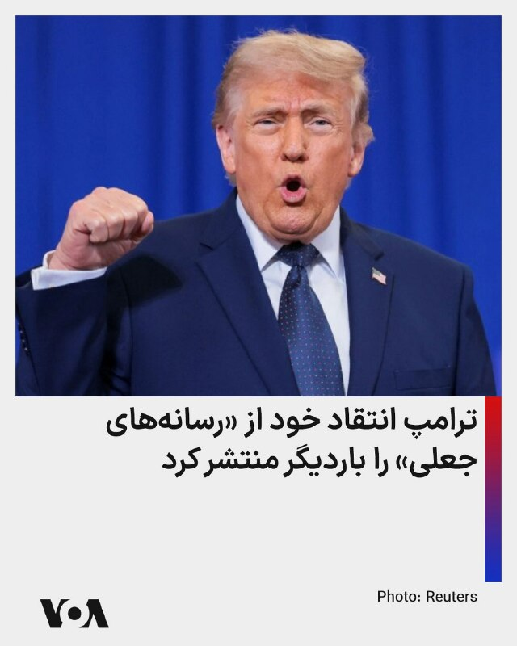

⚡️دونالد ترامپ، رئیس جمهوری آمریکا، دوشنبه شب بار دیگر انتقاد پیشین خود از رسانه‌ها «رسانه‌های جعلی» را در تروت‌سوشال باز نشر کرد. آقای ترامپ گفته ‌است اگر جمهوری اسلامی فریاد هم بزند که «تسلیم» است، این رسانه‌ها طور دیگری شرایط را جلوه خواهند داد.
@FarsiVOA

## FarsiVOA — post 219330

⚡️مکالمه با رتبه یک کنکور: «اگر همکاری نکنی دیگر رنگ دانشگاه را نمی‌بینی»
@FarsiVOA

## FarsiVOA — post 219329

  <a href="telegram/content/FarsiVOA_219329_1780366030.mp4" target="_blank">🎬 Download video</a>

⚡️افزایش فشار و سرکوب دانشجویان در ایران پس از قتل‌عام دی‌ماه و جنگ اخیر؛ گفت‌وگو با ایمان آقایاری
@FarsiVOA

## FarsiVOA — post 219328

⚡️واکنش‌های بازار مالی اروپا به بحران جاری خاورمیانه
@FarsiVOA

## FarsiVOA — post 219327

  <a href="telegram/content/FarsiVOA_219327_1780366031.mp4" target="_blank">🎬 Download video</a>

⚡️جزئیاتی از انتقال «میرحسین موسوی» به بیمارستان در گفت‌وگو با مهدی عربشاهی، خبرنگار صدای آمریکا
@FarsiVOA

## FarsiVOA — post 219326

⚡️اولتیماتوم همسایگان عراق برای کنترل مرزها و عقب راندن گروه‌های مسلح وابسته به جمهوری اسلامی
@FarsiVOA

## BBCPersian — post 282613

یک سال مانده به انتخاب رئیس‌جمهوری بعدی فرانسه، پرسش اصلی این است که چه کسی می‌تواند مانع از آن شود که انتخابات به نبردی میان دو قطب افراطی تبدیل شود.

در حال حاضر پاسخ روشن است، هرچند شاید فقط برای همین مقطع: ادوار فیلیپ، نخست‌وزیر پیشین امانوئل مکرون، رئیس‌جمهوری فرانسه.

آخرین نظرسنجی‌ها همگی نشان می‌دهند این سیاستمدار ۵۵ ساله راست میانه تنها چهره‌ای است که می‌تواند در دور دوم رای‌گیری در ماه مه سال آینده نامزد راست افراطی را شکست دهد، چه این فرد مارین لوپن باشد و چه معاون جوان او، ژردن باردلا.

https://bbc.in/49ysquL
📸GettyImages/ Reuters/ AFP via Getty Images/ NurPhoto via Getty Images
@BBCPersian

## BBCPersian — post 282612

  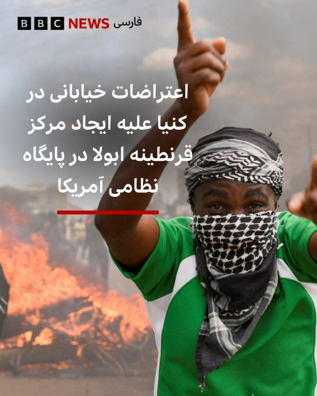

صدها نفر در مرکز کنیا در اعتراض به برنامه‌ ایالات متحده برای ایجاد یک مرکز قرنطینه ابولا در یک پایگاه نظامی آمریکایی در این کشور دست به اعتراض زدند.

معترضان با مسدود کردن جاده‌ها اقدام به آتش زدن لاستیک خودروها کردند.

تظاهرکنندگان در شهر نانیوکی می‌گویند که علیرغم حکم دادگاه عالی در روز جمعه که دستور تعلیق موقت این طرح را داده است، آماده‌سازی برای این مرکز قرنطینه ادامه دارد.

مردم محلی نگران هستند که این واحد ۵۰ تختخوابی که برای مراقبت از شهروندان آمریکایی مبتلا به ابولا در صورت نیاز طراحی شده است، مردم را به خطر بیندازد.

مارکو روبیو، وزیر خارجه آمریکا، گفته است که این برنامه‌ بخشی از تلاش‌ها برای دور نگه داشتن ویروس ابولا از ایالات متحده است.

📷Reuters
@BBCPersian

## BBCPersian — post 282611

  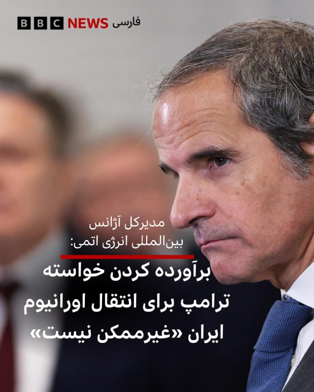

‌رافائل گروسی، مديرکل آژانس بين المللی انرژی اتمی، در گفت وگو با شبکه الجزيره قطر گفته است خواسته دونالد ترامپ برای انتقال اورانيوم غنی شده ايران به خارج از کشور «دشوار اما غيرممکن نيست».

برآورد می شود ايران حدود ۴۰۰ کيلوگرم اورانيوم با غنای حدود ۶۰ درصد در اختيار داشته باشد و رئیس‌جمهور آمریکا بارها پيشنهاد کرده است اين مواد به خارج از ايران منتقل شوند.

آقای گروسی به الجزیره گفته است: «اين کار آسان نيست، زيرا اين مواد به شکل گاز هستند،قابليت آلودگی بالايی دارند و اجرای چنين عملياتی ساده نيست.»

او از«رقيق سازی» اورانيوم و تبديل آن به ماده‌ای با سطح غنای پايين‌تر و توان کمتر به عنوان یک راه حل سخن گفته است و همچنین تصریح کرده که آژانس بين المللی انرژی اتمی به طور مستقيم در مذاکرات حضور نداشته،اما به صورت جداگانه باتهران و واشنگتن در ارتباط است.

آژانس پیش‌تر هم از پروتکل منتشر شده خود برای انتقال مواد هسته‌ای خبر داده بود که مطابق آن کپسول‌های محافظت شده‌ای تحت عنوان سیلندرهای ۳۰بی برای انتقال ایمن اورانيوم هگزا فلورايد - اورانیوم غنی‌شده - باید به کار گرفته شود.
https://bbc.in/4uLITnZ
📷Reuters
@BBCPersian

## BBCPersian — post 282610

  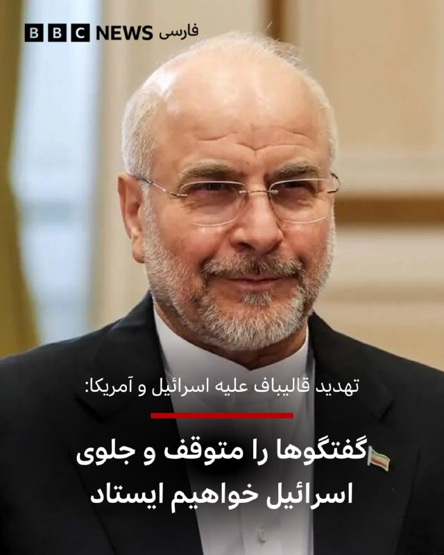

محمدباقر قالیباف، رئیس مجلس ایران که ریاست مذاکرات جاری میان تهران و واشنگتن را بر عهده دارد در واکنش به تشدید حملات اسرائیل به لبنان گفته است: «در دو روز گذشته با جدیت توقف حملات اسرائیل را دنبال کرده‌ایم و اگر جنایت‌ها ادامه پیدا کند نه تنها روند گفت‌وگوها را متوقف می کنیم بلکه جلوی رژیم صهیونیستی خواهیم ایستاد.»

به گزارش خبرگزاری فارس - نزدیک به سپاه پاسداران - آقای قالیباف این سخنان را روز دوشنبه - اول ژوئن / ۱۱ خرداد - در تماس تلفنی با رئیس مجلس لبنان، نبیه بری، گفته است.

به نظر می‌رسد شدت گرفتن حملات اسرائیل به لبنان در حال تبدیل شدن به جدی‌ترین خطر برای از میان رفتن آتش‌بسی است که میان ایران و آمریکا شکل گرفته است.

https://bbc.in/49yrQx5
📷shafaqna
@BBCPersian

## BBCPersian — post 282609

‌ ‌ ‌ دونالد ترامپ، رئيس جمهور آمريکا، در گفت وگو با شبکه ای‌بی‌سی گفت معتقد است ظرف «هفته آينده» توافقی با ايران برای تمديد آتش‌بس و بازگشايی تنگه هرمز حاصل خواهد شد. او در گفت وگوی تلفنی با جاناتان کارل، خبرنگار ارشد ای‌بی‌سی در واشنگتن، گفت: «اوضاع خوب…

## BBCPersian — post 282608

  

‌ ‌ ‌
دونالد ترامپ، رئيس جمهور آمريکا، در گفت وگو با شبکه ای‌بی‌سی گفت معتقد است ظرف «هفته آينده» توافقی با ايران برای تمديد آتش‌بس و بازگشايی تنگه هرمز حاصل خواهد شد.

او در گفت وگوی تلفنی با جاناتان کارل، خبرنگار ارشد ای‌بی‌سی در واشنگتن، گفت: «اوضاع خوب به نظر می‌رسد، خيلی خوب.»

آقای ترامپ افزود: «امروز يک مشکل کوچک پيش آمد، اما همان طور که احتمالا متوجه شديد، خيلی سريع آن را حل کردم.»

به گفته رئيس‌جمهوری آمريکا، اين مشکل از نارضايتی ايرانی‌ها نسبت به حملات اسرائيل به لبنان ناشی شده بود.

رئیس‌جمهور آمریکا گفت: «با حزب‌الله صحبت کردم و گفتم شليک نکنيد. با بی‌بی [بنيامين نتانياهو، نخست وزير اسرائيل] هم صحبت کردم و گفتم شليک نکنيد. هر دو طرف هم دست از شليک به يکديگر برداشتند.»

او افزود: «اين موضوع ساده‌ای نيست. شما درباره يک کشور بسيار بزرگ صحبت می‌کنيد که می‌خواهد توافقی انجام دهد. خصومت‌های بسيار عميقی وجود دارد. بنابراين اين کار برای آنها آسان نيست. از ديد ما هم آسان نيست. اما داريم به آنچه نياز داريم دست پيدا می‌کنيم.»

https://bbc.in/4x28ev7
📷Reuters
@BBCPersian

## BBCPersian — post 282600

‌ ‌ ‌
جنجال‌ها بر سر محاکمه پنج فعال حامی فلسطینیان در آلمان بالا گرفته است. این افراد متهم به عضویت در یک سازمان مجرمانه و وارد کردن حدود یک میلیون یورو خسارت به اموال یک شرکت دفاعی اسرائیلی در شهر اولم آلمان هستند.

پرونده موسوم به «اولم ۵» در آلمان، که از حامیان دیرینه اسرائیل به شمار می‌رود، بحث گسترده‌ای را درباره نحوه برخورد با معترضان حامی فلسطینیان برانگیخته و ممکن است به الگویی برای پرونده‌های مشابه در آینده تبدیل شود.

این پنج فعال که تابعیت بریتانیا، اسپانیا، ایرلند و آلمان را دارند و از ماه سپتامبر تاکنون در بازداشت موقت به سر می‌برند، در دادگاهی با تدابیر شدید امنیتی در زندان اشتامهایم شهر اشتوتگارت محاکمه می‌شوند.

https://bbc.in/4fRjuV1
📷Getty/ PA/ Alamy/ "Ulm 5"
@BBCPersian

---
📅 بروزرسانی: 1405/03/12 03:04
---

## VahidOOnLine — post 243294

♦️به گزارش خبرگزاری فارس، سعید آجرلو، عضو تیم رسانه‌ای هیئت مذاکره‌کننده جمهوری اسلامی، با تشریح جزئیات آخرین پیشنهاد ارسالی آمریکا به تهران مدعی شد که واشنگتن در جدیدترین ویرایش متنی خود از موضع اولیه مبنی بر انتقال یا دفع مواد هسته‌ای ایران عقب‌نشینی کرده است. او با اشاره به اینکه در مراحل نخست مذاکرات، آمریکایی‌ها خواستار انتقال مواد غنی‌شده به ایالات متحده بودند و ایران این درخواست را رد کرد، افزود که در متن اخیر صرفا عباراتی چون «تعیین تکلیف»، «سرنوشت مواد» یا «حل‌وفصل مسئله» مطرح شده است. آجرلو به تداوم اختلافات درباره تنگه هرمز نیز اشاره کرد.
‌🇸🇦 Indypersian

🤖 @VahidOOnLine

## VahidOOnLine — post 243293

  

♦️به گزارش روزنامه ایران، وزارت آموزش عمومی مکزیک (SEP) به طور رسمی اعلام کرد که فرایند صدور مجوزهای حرفه‌ای و موقت پزشکی برای کادر درمانی تیم‌های ملی خارجی آغاز شده اما پرونده کادر پزشکی تیم ملی ایران هنوز به تأیید نهایی نرسیده و در دست بررسی است. بر اساس آیین‌نامه نظارتی دولت مکزیک، اداره کل مشاغل حرفه‌ای این کشور (DGP) به منظور قانونمند کردن خدمات درمانی در طول مسابقات، مجوزهای موقتی با اعتبار سه ماهه صادر می‌کند. این بازه زمانی، نه تنها روزهای برگزاری مسابقات (از ۲۲ خرداد تا ۱۴ تیر ۱۴۰۵) را پوشش می‌دهد، بلکه بازه اردویی پیش از جام جهانی و ریکاوری (احیا) پس از آن را نیز تضمین می‌کند.«خوزه عمر سانچس مولینا»، رئیس این اداره کل، اعلام کرده است که در مرحله دوم این طرح، پزشکان ۱۲ تیم بزرگ جهان از جمله اسپانیا، اروگوئه، کلمبیا، ژاپن، سوئد و کره جنوبی مجوزهای رسمی خود را دریافت کرده‌اند. با این حال، نام ایران در این فهرست دیده نمی‌شود؛ مقامات مکزیکی تأکید کرده‌اند که پرونده کادر درمانی ایران کماکان باز است و صدور اعتبارنامه‌ها منوط به تکمیل و ارائه کامل مدارک و مستندات پزشکی از سوی فدراسیون فوتبال جمهوری اسلامی ایران خواهد بود. روزنامه ایران می‌نویسد، حالا فدراسیون فوتبال که درگیر حل بحران ویزای چندبار ورود بازیکنان به آمریکاست، باید هرچه سریع‌تر فرایند ارسال و تکمیل مدارک پزشکی کاروان خود را به سرانجام برساند و اگر فدراسیون نتواند در مدت زمان اعلامی مجوز فعالیت پزشکان تیم را بگیرد، احتمالا شاهد استفاده از پزشکان مکزیکی در کمپ تیم ایران خواهیم بود.
‌🇸🇦 Indypersian

🤖 @VahidOOnLine

## VahidOOnLine — post 243292

  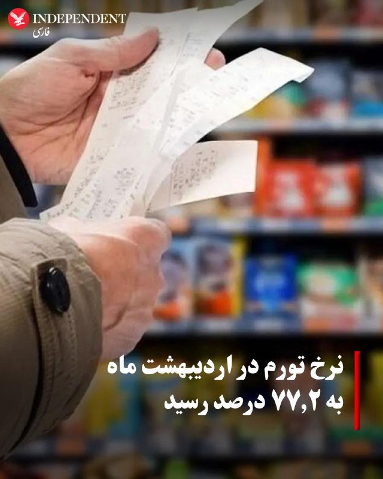

♦️بانک مرکزی نرخ تورم نقطه به نقطه در اردیبهشت ماه را ۷۷.۲ درصد اعلام کرد.بنابر اعلام روابط عمومی بانک مرکزی، شاخص بهای کالاها و خدمات مصرفی در مناطق شهری ایران (شاخص تورم) در اردیبهشت ماه ۱۴۰۵ به عدد ۶۶۷.۵ رسید که نسبت به ماه قبل معادل ۸.۵ درصد افزایش داشت.نرخ تورم در ۱۲ ماه منتهی به اردیبهشت ماه ۱۴۰۵ نیز نسبت به ۱۲ ماه منتهی به اردیبهشت ماه ۱۴۰۴ معادل ۵۳.۹ درصد شد.
‌🇸🇦 Indypersian

🤖 @VahidOOnLine

## VahidOOnLine — post 243291

  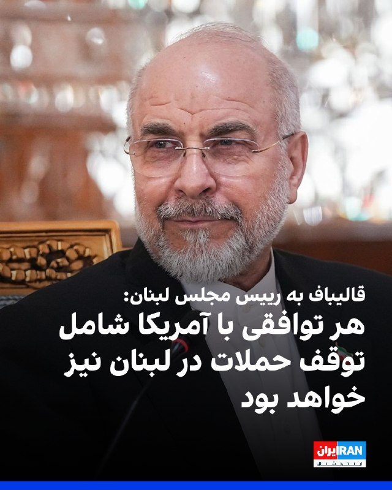

محمدباقر قالیباف در تماس با نبیه بری، رییس مجلس لبنان، گفت که چنانچه توافقی برای پایان جنگ بین جمهوری اسلامی و آمریکا شکل بگیرد شامل توقف حملات در همه جبهه‌ها به ویژه لبنان خواهد بود. او افزود: « پیوند جمهوری اسلامی و لبنان ناگسستنی است و جان ما و شما یکی است.»
‌🏁 🇬🇧 IranintlTV

🤖 @VahidOOnLine

## VahidOOnLine — post 243290

  <a href="telegram/content/VahidOOnLine_243290_1780356870.mp4" target="_blank">🎬 Download video</a>

♦️جعفر پناه‌پور، محیط‌‌بان و عکاس حیات وحش، روز دوشنبه ۱۱ خردادماه، ویدیویی از یک پلنگ ایرانی را که در میان پوشش گیاهی پارک ملی گلستان دیده می‌شود، در اینستاگرام منتشر کرد.

پارک ملی گلستان یکی از مهم‌ترین زیستگاه‌های این گونه ارزشمند به شمار می‌رود و نقش مهمی در حفاظت از آن دارد.

پلنگ ایرانی در فهرست گونه‌های در معرض خطر قرار دارد و پارک ملی گلستان با تنوع زیستی کم‌نظیر خود، از مهم‌ترین مناطق حفاظت‌شده کشور برای حفظ و بقای این گونه محسوب می‌شود.
‌🇸🇦 Indypersian

🤖 @VahidOOnLine

## VahidOOnLine — post 243289

  

♦️رافائل گروسی، مدیرکل آژانس بین‌المللی انرژی اتمی، در گفتگو با «الجزیره» در پاسخ به سوالی درباره طرح دونالد ترامپ مبنی بر خارج کردن اورانیوم غنی‌شده از ایران گفت: «این کار دشوار است، اما غیرممکن نیست.» گروسی با اشاره به چالش‌های فنی این اقدام توضیح داد: «انتقال این مواد آسان نیست، زیرا به شکل گاز است و آلودگی بالایی دارد. بنابراین عملیات ساده‌ای نخواهد بود، اما با این حال قابل انجام است.» او همچنین به گزینه‌های جایگزین دیگر اشاره کرد و افزود: «گزینه‌های دیگری نیز وجود دارد که پیش‌تر مورد بررسی قرار گرفته‌اند، مانند رقیق‌سازی این مواد. از آنجا که ایران اکنون اورانیوم را تا ۶۰ درصد غنی‌سازی کرده و به درجه نظامی (۹۰ درصد) بسیار نزدیک شده است، رقیق‌سازی آن به سطوح بسیار پایین‌تر می‌تواند مدیریت این پرونده را آسان‌تر کند.»
‌🇸🇦 Indypersian

🤖 @VahidOOnLine

## VahidOOnLine — post 243288

  

♦️دونالد ترامپ، رئیس‌جمهوری آمریکا، با انتشار پیامی در شبکه اجتماعی «تروث سوشال» درباره جزئیات رایزنی‌های خود برای توقف درگیری‌ها در لبنان نوشت: «امروز گفتگویی با بنیامین نتانیاهو داشتم و از او خواستم که دست به یک حمله بزرگ در بیروت نزند، او نیروهایش را بازگرداند.» ترامپ افزود: «من همچنین گفتگویی با نمایندگان رهبران حزب‌الله داشتم و آن‌ها موافقت کردند که شلیک به سمت اسرائیل و سربازانش را متوقف کنند. به همین ترتیب، اسرائیل هم موافقت کرد که شلیک به سمت آن‌ها را متوقف کند.» رئیس‌جمهوری آمریکا در پایان پیام خود با ابراز امیدواری نسبت به پایداری این وضعیت نوشت: «ببینیم این وضعیت چقدر دوام می‌آورد. امیدوارم که برای همیشه باشد».
‌🇸🇦 Indypersian

🤖 @VahidOOnLine

## WithYashar — post 13225

https://t.me/boost/withyashar

بوست دار میریزه ۳۸۰ تا دیگه لازم داره. لطفاً این پیام رو برای تمام دوستانتون که تلگرام پرمیوم(تیک) دارن بفرستین و ازشون خواهش کنین که چنل رو بوست کنن ❤️‍🩹چیزی‌ تا ایموجی آزاد بشه🤰🫃🏻

## WithYashar — post 13224

  <a href="telegram/content/WithYashar_13224_1780356872.mp4" target="_blank">🎬 Download video</a>

مردم شهر…
@withyashar

## WithYashar — post 13223

ادعای آکسیوس: درگیری نتانیاهو و ترامپ بالا گرفت

ترامپ امروز در تماس تلفنی با نتانیاهو عصبانی شد:
"تو کاملاً دیوانه‌ای. اگر من نبودم، الان تو زندان بودی.
من دارم از تو محافظت می‌کنم.
الان همه از تو متنفرند. همه به خاطر این موضوع از اسرائیل متنفرند. تو چه غلطی داری می‌کنی؟"

@withyashar

## WithYashar — post 13222

هگست وزیر جنگ آمریکا: آماده‌ایم به جنگ برگردیم
@withyashar

## mwarmonitor — post 10015

یک زلزله بزرگ با قدرت ۶.۵ ریشتر جنوب ایتالیا را لرزاند.

## mwarmonitor — post 10014

«نه فقط کله‌زرد، بلکه تو زرد از آب دراومد»

## mwarmonitor — post 10013

"You're fucking crazy":
خشم شدید ترامپ از نتانیاهو در تماس تلفنی مربوط به لبنان

📝نویسندگان: باراک راوید، مارک کاپوتو

🔰به گفته دو مقام آمریکایی و یک منبع سومِ مطلع، پرزیدنت ترامپ روز دوشنبه در یک تماس تلفنیِ پر از الفاظ رکیک، به دلیل تشدید تنش‌های اسرائیل در لبنان، به بنیامین نتانیاهو، نخست‌وزیر اسرائیل، به‌شدت تاخت.

📌چرا این موضوع اهمیت دارد؟
پیش از این تماس در روز دوشنبه، ایران تهدید کرده بود که به دلیل اقدامات اسرائیل در لبنان، مذاکرات خود با ایالات متحده را متوقف خواهد کرد. به گفته دو تن از منابع، ترامپ در این تماس نتانیاهو را «دیوانه» خطاب کرد و او را به نمک‌نشناسی متهم نمود. او همچنین مانع از اجرای طرح اسرائیل برای حمله به بیروت شد.

پشت صحنه ماجرا
انزوای اسرائیل: یک مقام آمریکایی گفت ترامپ به نتانیاهو هشدار داده است که عملی کردن تهدیدهایش مبنی بر بمباران پایتخت لبنان، اسرائیل را در جهان منزوی‌تر خواهد کرد.
ادعای ترامپ درباره دادگاه نتانیاهو: دو تن از منابع اعلام کردند ترامپ ادعا کرده که به دور نگه داشتن نتانیاهو از زندان کمک کرده است؛ که این اشاره‌ای است به حمایت‌های او از نتانیاهو در طول پرونده محاکمه‌اش به اتهام فساد مالی.
خلاصه اظهارات ترامپ به نتانیاهو از زبان یک مقام آمریکایی:
«تو بدجوری دیوونه‌ای. اگر من نبودم الان تو زندان بودی. دارم باامت رو نجات میدم. الان همه ازت متنفرن. به خاطر این کارها، همه دارن از اسرائیل متنفر میشن.»
یک منبع دومِ مطلع از این تماس نیز گفت که ترامپ «به‌شدت عصبی» بود و در بخشی از مکالمه با فریاد به نتانیاهو گفت: «داری چه غلطی می‌کنی؟»
دلایل اصلی تنش
به گفته این مقام آمریکایی، ترامپ می‌دانست که حزب‌الله به سمت اسرائیل شلیک کرده و اسرائیل نیاز به دفاع از خود دارد، اما احساس می‌کرد که نتانیاهو در روزهای اخیر به شکلی نامتناسب در حال تشدید تنش‌ها است.
علاوه بر تهدیدها علیه بیروت، اسرائیل عملیات زمینی خود را در جنوب لبنان گسترش داده است.
یک مقام آمریکایی دیگر گفت ترامپ از اینکه اسرائیل غیرنظامیان زیادی را در لبنان کشته، نگران است و با شیوه اسرائیلی‌ها برای تخریب کامل ساختمان‌ها جهت از بین بردن تنها یک فرمانده حزب‌الله، مخالفت کرده است.
وضعیت فعلی
یک مقام اسرائیلی به آکسیوس گفت که اسرائیل دیگر برنامه‌ای برای حمله به اهداف حزب‌الله در بیروت ندارد.
تحلیل ماجرا (پشت پرده)
ترامپ و نتانیاهو در گذشته نیز چندین تماس تلفنی متشنج داشته‌اند، اما همچنان در موضوع ایران و مسائل دیگر همکاری نزدیکی با یکدیگر دارند. با این حال، یک مقام مسئول گفت این یکی از بدترین تماس‌های ترامپ با نتانیاهو از زمان بازگشت او به کاخ سفید بوده است.
به نظر می‌رسد خشم ترامپ ناشی از این بوده که تصمیم نتانیاهو برای تشدید تنش در لبنان، مذاکرات او با ایران را در آستانه فروپاشی قرار داده بود. پس از این تماس، ترامپ در شبکه اجتماعی «تروث سوشال» پست کرد که مذاکرات با ایران «با سرعتی بالا در حال جریان است».
موضع طرف مقابل
نتانیاهو پس از این تماس بیانیه‌ای صادر کرد و گفت به ترامپ اعلام کرده است که اگر حزب‌الله دست از حمله به اسرائیل برندارد، اسرائیل به اهدافی در بیروت حمله خواهد کرد و در عین حال، اسرائیل به عملیات خود در جنوب لبنان ادامه خواهد داد.
نتانیاهو نوشت: «موضع ما تغییر نکرده است.»
اما مقام دوم آمریکایی ادعا کرد که در واقعیت، ترامپ در این تماس نتانیاهو را «مرعوب و تسلیم» کرده است. به گفته این مقام، بیبی (نتانیاهو) در پاسخ گفته است: «باشه، باشه، فقط مطمئن شو که همه چیز روبه‌راه میشه.»
دفتر نتانیاهو به درخواست آکسیوس برای اظهار نظر در این باره پاسخی نداد.
مواردی که باید زیر نظر داشت
منابع به آکسیوس می‌گویند تفاهم‌نامه‌ای که ایالات متحده و ایران در حال مذاکره روی آن هستند، خواهان پایان یافتن درگیری‌ها در لبنان است. همین موضوع، علت تماس متشنج قبلی میان ترامپ و نتانیاهو نیز بوده است.

@mwarmonitor

## mwarmonitor — post 10012

  <a href="telegram/content/mwarmonitor_10012_1780356874.mp4" target="_blank">🎬 Download video</a>

🔸تصاویر حمله به تأسیسات نفت و گاز ایران در عسلویه در جریان جنگ اخیر.

@mwarmonitor

## FoxNewsTwitter — post 342489

  <a href="telegram/content/FoxNewsTwitter_342489_1780356875.mp4" target="_blank">🎬 Download video</a>

Fox News (Twitter/X)

Karen Bass isn't holding back as the Los Angeles mayoral race heats up.

One day before the primary election, Bass dismissed Spencer Pratt as a "reality TV star villain" with "no track record," arguing he lacks the experience needed for the job.

"I know he has no idea how the city government is run," Bass said as she contrasted Pratt's candidacy with her own record in office.

## FoxNewsTwitter — post 342488

  <a href="telegram/content/FoxNewsTwitter_342488_1780356877.mp4" target="_blank">🎬 Download video</a>

Fox News (Twitter/X)

FOX NEWS REPORT: President Trump signals "rapid" progress on Iran peace talks after the weekend's military strikes, while Maine Democratic Senate candidate Graham Platner faces yet another scandal. FOX News' @BillMelugin_ reports.

## FoxNewsTwitter — post 342487

  <a href="telegram/content/FoxNewsTwitter_342487_1780356879.mp4" target="_blank">🎬 Download video</a>

Fox News (Twitter/X)

RT @WillCainShow: 🔥MULLIN: WE CAN PROTECT OUR BUILDINGS. CAN YOU PROTECT YOUR STREETS?

As anti-I.C.E. protests intensified at Delaney Hall, federal officials say they asked a basic question: Can local authorities keep federal employees safe?

@SecMullinDHS says when the answer appeared to be no, DHS considered reallocating CBP resources from Newark Airport. Today, he says state and local officials are cooperating—and that's why the officers remain in place.

@willcain | @FoxNews

## FoxNewsTwitter — post 342486

  

Fox News (Twitter/X)

JUST IN: President Trump says he spoke with Israeli Prime Minister Benjamin Netanyahu and persuaded him to turn Israeli troops around before a major operation in Lebanon.

Trump also says he spoke with representatives of Hezbollah's leadership, who agreed to stop "shooting at Israel," while Israel agreed to stop firing in return.

"Let's see how long that lasts," Trump wrote. "Hopefully it will be for ETERNITY!"

## pm_afshaa — post 92083

  <a href="telegram/content/pm_afshaa_92083_1780356882.webm" target="_blank">🎬 Download video</a>

🔴ترامپ: من هنوز با این توافق موافقت نکردم چون هنوز باید چند امتیاز دیگر بگیرم.

💧 Rainbet.com the #1 Non-KYC Crypto Casino & Sportsbook @rainbetcom

😁 @Pm_Afshaa

## pm_afshaa — post 92082

  <a href="telegram/content/pm_afshaa_92082_1780356883.webm" target="_blank">🎬 Download video</a>

🔴آکسیوس: ترامپ امروز در تماس تلفنی با نتانیاهو عصبانی شد و گفت:

"تو کاملاً دیوانه‌ای. اگه من نبودم، الان تو زندان بودی. من دارم از تو محافظت میکنم. الان همه از تو متنفرند. همه بخاطر این موضوع از اسرائیل متنفرند. تو چه غلطی داری میکنی؟"

💧 Rainbet.com the #1 Non-KYC Crypto Casino & Sportsbook @rainbetcom

😁 @Pm_Afshaa

## pm_afshaa — post 92081

  <a href="telegram/content/pm_afshaa_92081_1780356883.webm" target="_blank">🎬 Download video</a>

🔴پست جدید ترامپ در تروث سوشال:

امروز با نتانیاهو گفت‌وگویی داشتم و ازش خواستم وارد حمله بزرگ به بیروت نشه. او نیروهایش رو برگردوند. ممنون بی‌بی!

همچنین با نمایندگان رهبران حزب‌الله گفت‌وگو کردم و آنها پذیرفتند که تیراندازی به اسرائیل و سربازانش رو متوقف کنند. به همین ترتیب، اسرائیل هم پذیرفت که تیراندازی به آنها رو متوقف کنه.

باید دید این وضعیت چقدر دووم میاره؛ امیدوارم تا ابد ادامه داشته باشه!

💧 Rainbet.com the #1 Non-KYC Crypto Casino & Sportsbook @rainbetcom

😁 @Pm_Afshaa

## VahidOnline — post 75864

پیام‌های دریافتی درباره قطع شدن موقت خطوط تلفن همراه در بعضی از شهرهای استان‌های فارس، بوشهر و هرمزگان و...
از حدد ساعت ۲

▪️ شیراز کلا قطع شده انگار
نه میشه زنگ زد نه میشه کاری کرد

▪️ کل تلفن های همراه توی شیراز قطع شده
تمام اینترنت ها قطع شده
مشخص نیست چرا اینجوری شده
نه ایرانسل نه همراه اول نه رایتل آنتن نداره

▪️ وحید از حدود ساعت ۲:۱۰ تا همین الان انتن گوشی ها و اینترنت خانگی و هر چیز مخابراتی توی شیراز پرید
همین الان [۲:۳۰] همراه اول وصل شد با سرعت کم. ایرانسل وصل نیست

▪️ شیراز خط گوشی بیشتر از ۲۰ دقیقه رفت
از ساعتای ۲:۱۰ دقیقه تا ۲:۳۰
ایرانسل هنوز نیومده

آپدیت:
ایرانسل هم وصل شد
ولی همگی 3G هستن

سلام وحید جان بندرخمیر هم از ساعت 2 همه چیز قطع شده الان به زور وصل شدم بهتون اطلاع بدم

اصفهان هم دقایقی خط همه رفت

تو شیراز یک دفعه همه انتن ها پرید. حتی نت مودم خونه مون هم کاملا قطع شد
الان بعد از حدود نیم ساعت دوباره انتن ها اومد

وحید فکر کردم فقط واسه من اینطوریه نت خونگی مبینت ما هم قطع شده خوزستان سربندر

از شهرستان های فارس نیم ساعت همه انتن ها رفت و اینترنت مخابرات هم کار نمیکرد الان اینترنت مخابرات اومد و انتن همراه اول هم با سرعت کم اومد ایرانسل قطعه

نت و انتن و... کامل توی بندر ماهشهر پریده
اهواز هم همینطور

سلام بندرگناوه چند دقیقه کلا همه چی قطع نه زنگ نه حتی شبکه داخلی همه چی بسته شد

بندر ساعت ۲ بامداد تقریبا آنتن ها رفت
و بعد برگشت خط 3g شده اما اینترنت کار نمیکنه
الان فقط اینترنت فیبر وصل شده

دقیقا راس ساعت ۲ کل دیتا سنتر شیراز قطع شد
تلفن همراه کاملا بدون آنتن
تقریبا ۳۰ دقیقه شد که وصل شد

همین الان حدود نیم ساعت در نورآباد ممسنی همه چی پریددد نت و آنتن و خط و همه چی😐

شیراز از ساعت 2 تا 2:30 انتن همه اپراتور ها قطع شد

بندرعباس هم همینطور، قطع شد وحید جان تا الان

اینترنت و انتن های تلفن همراه تو قشم کلا قطع شد یهو
تقریبا ۱۰ دقیقه قطع شد
هم انتن هم اینترنت همراه

بوشهر اینترنت مخابرات و ایرانسل هی ده دقیقه ده دقیقه قطع میشه
خیلیاهم کلا قطع شدن از اشناهام

شیراز بعد از نیم ساعت وصل شد
کل سرویس های ایرانسل و همراه اول و شاتل حتی اینترنت مخابرات قطع بود

خط ایرانسل هم برگشت

وحید سلام و خسته نباشی، اینترنت و خطا برای ده دقیقه کامل قطع شدن هم بوشهر هم بندرعباس، بوشهر وصل شده و نت همراه ضعیفه منتهی بندرعباس اینترنت ایرانسل قطع شده

وحید اصلا همه‌ی استان فارس همین شد
من فسا هستم منم قطع شدم
دقیقا از ۲:۰۲ تا ۲:۳۶ قطع شدم

وحید بوشهر هم کلا قطع شد الان وصل شده و خیلی ضعیفه یه نیم ساعتی کلا آنتن نبود

میناب هم یه ۲۰ ۲۵ دقیقه ای کلا انتن نبود

بندرعباس: ایرانسل کلا قطعه، همراه هم قطع و وصله

سلام اقا وحید داخل بندر دیلم استان بوشهر ما از ساعت ۱:۴۵ دقیقه هیچی انتن نداشتیم چه ایرانسل چه همراه الان درست شد تازه نت رو h هست

با تمام سیم‌کارت‌ها ما الان وصل شدیم

مرودشتم کامل قطع شده بود همه چی الان وصل شد

سلام وجید جان
ما برازجان هستیم
برای ما هم نت ایرانسل، همراه اول و رایتل و مخابرات کلا قطع شد
الان که برگشتن 3G هستن

سلام از جنوب استان فارس پیام میدم اینترنت خانگی و همراه و همچنین آنتن از ساعت ۲ تا حدود ۳۰ دقیقه کاملا قطع بود

بوانات برا یه نیم ساعتی انتن پرید

سلام توی یزد هم آنتن همراه اول کلا قطع شد، فکر کردم باگ گوشی خودمه، اما الان که گزارشات رو دیدم ظاهرا چیز دیگه ای بوده

درود وقت بخیر شیراز حدود ۲:۱۰ دقیقه کل خط ها انتن و اینترنتشون پرید و بعد از حدود نیم ساعت با سرعت بسیار کمی وصل شد
تشکر وحید جان

سلام وحید خط بستک و کل غرب استان هرمزگان بعد ۲۰ دقیقه وصل شد

سلام وحید جان بندرعباس الان 45 دقیقس که همه چی قطعه آنتن ایرانسل اومده ولی روشن نمیشه همه چی پریده فقط فیبر نوری وصله فعلا

سلام وحید جان :استان بوشهر :کنگان از ساعت ۲:۲۳نت ایرانسل و مخابرات پریده و هنوز وصل نشده خدا میدونه چیکار میکنن.

شهرستان قیر و کارزین هم ایرانسل هم همراه وصل شد اما مودم مخابرات از ساعت ۲ قطع

درود. از لاهیجان پیام میدم. اینجا هم امروز اینترنت مخابرات دو بار برای چند دقیقه رفت و بعدش با سرعت خیلی کمی وصل شد.

اصفهان هم حدود ساعت دو انتن قطع شد‌ ولی چند دقیقه بعد برگشت

سلام داخل اهواز کل آنتن ها قطع شد و سریعا به حالت قبل برگشت

مجدد همه چیز پرید توی بندر ماهشهر باز الان وصل شد

وسط بازی بودم پرید بیرون انتن رفت فکر کردم خودم اینجوری ام از ساعت دو
الان وصل شدم دیدم بچه ها هم نیستن هیچ کدوم نوراباد ممسنی

📡 @VahidOnline

## VahidOnline — post 75863

  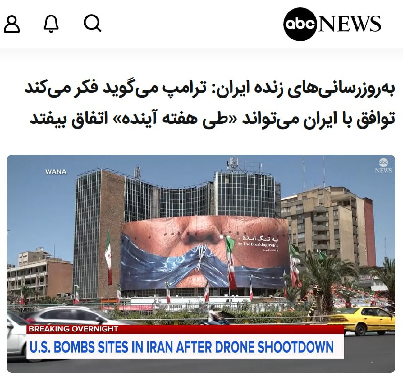

دونالد ترامپ، رئیس‌جمهوری آمریکا، در گفتگوی تلفنی با شبکه خبری «ای‌بی‌سی نیوز» اعلام کرد که به نظر او، توافق با تهران برای تمدید آتش‌بس و بازگشایی تنگه هرمز «طی هفته آینده» حاصل خواهد شد.
ترامپ روز دوشنبه در گفتگو با جاناتان کارل، خبرنگار ارشد این شبکه در واشنگتن، با ابراز خوش‌بینی گفت: «اوضاع خوب به نظر می‌رسد.»
رئیس‌جمهوری آمریکا با اشاره به تنش‌های اخیر افزود: «امروز مشکل کوچکی پیش آمد، اما همان‌طور که احتمالا پیش‌تر متوجه شدید، من خیلی سریع آن را برطرف کردم.»
او توضیح داد که این مشکل ناشی از ناراحتی و عصبانیت مقام‌های ایران از حملات اسرائیل به لبنان بوده است؛ ترامپ در تشریح نحوه حل این بحران گفت: «من با حزب‌الله صحبت کردم و گفتم تیراندازی نکنید؛ با بنیامین نتانیاهو، نخست‌وزیر اسرائیل هم صحبت کردم و گفتم تیراندازی نکنید، و هر دو طرف شلیک به یکدیگر را متوقف کردند.»
@VahidOOnLine

📡 @VahidOnline

## IranIntlTV — post 340126

  <a href="telegram/content/IranIntlTV_340126_1780356884.mp4" target="_blank">🎬 Download video</a>

مهربان از تهران: هیچ ایرانی موافق تفاهم با آمریکا نیست؛ ما آدم‌های قبل از کشتار نیستیم

«یک ایران صدای شما را می‌شنود»
دوشنبه تا پنجشنبه ۱۱ شب تهران
از تلویزیون ایران اینترنشنال

تماشای نسخه کامل این قسمت از «برنامه» در یوتیوب:
https://youtu.be/tuyTTtgx84o
@iranintltv

## IranIntlTV — post 340125

  <a href="telegram/content/IranIntlTV_340125_1780356886.mp4" target="_blank">🎬 Download video</a>

حسین از تهران: جمهوری اسلامی راست می‌گه شکست‌ناپذیره؛ مدام شکست می‌خوره، اما نمی‌پذیره!

«یک ایران صدای شما را می‌شنود»
دوشنبه تا پنجشنبه ۱۱ شب تهران
از تلویزیون ایران اینترنشنال

تماشای نسخه کامل این قسمت از «برنامه» در یوتیوب:
https://youtu.be/tuyTTtgx84o
@iranintltv

## IranIntlTV — post 340124

  <a href="telegram/content/IranIntlTV_340124_1780356888.mp4" target="_blank">🎬 Download video</a>

بهاره از تورنتو: چرا توافق و مذاکره به رگ غیرت «ارزشی‌ها» برنمی‌خورد؟

«یک ایران صدای شما را می‌شنود»
دوشنبه تا پنجشنبه ۱۱ شب تهران
از تلویزیون ایران اینترنشنال

تماشای نسخه کامل این قسمت از «برنامه» در یوتیوب:
https://youtu.be/tuyTTtgx84o
@iranintltv

## IranIntlTV — post 340123

  <a href="telegram/content/IranIntlTV_340123_1780356889.mp4" target="_blank">🎬 Download video</a>

یوسف از اسرائیل: توافقی نمی شود؛ما اسرائیلی ها اجازه نمی‌دهیم نتانیاهو مردم ایران را بفروشد

«یک ایران صدای شما را می‌شنود»
دوشنبه تا پنجشنبه ۱۱ شب تهران
از تلویزیون ایران اینترنشنال

تماشای نسخه کامل این قسمت از «برنامه» در یوتیوب:
https://youtu.be/tuyTTtgx84o
@iranintltv

## IranIntlTV — post 340122

  

محمدباقر قالیباف در تماس با نبیه بری، رییس مجلس لبنان، گفت که چنانچه توافقی برای پایان جنگ بین جمهوری اسلامی و آمریکا شکل بگیرد شامل توقف حملات در همه جبهه‌ها به ویژه لبنان خواهد بود. او افزود: « پیوند جمهوری اسلامی و لبنان ناگسستنی است و جان ما و شما یکی است.»
https://iranintl.com/202606018473

## IranIntlTV — post 340121

  <a href="https://t.me/IranintlTV/340121" target="_blank">📎 Download file</a>

🎧نسخه صوتی سیاست با مراد ویسی: جمهوری زیرزمینی اسلامی
@iranintlTV

## IranIntlTV — post 340120

  <a href="telegram/content/IranIntlTV_340120_1780356891.mp4" target="_blank">🎬 Download video</a>

مراد ویسی، تحلیل‌گر ارشد ایران‌اینترنشنال، گفت: «یکی از عواملی که پس از شکست‌های پیاپی در جنگ می‌تواند پایه‌های یک حکومت را متزلزل کند، انباشته شدن آثار آن شکست‌ها و تبدیل شدنشان به نارضایتی گسترده است؛ همان‌طور که شکست‌های روسیه در جنگ‌های ۱۹۰۵ و ۱۹۱۴ زمینه‌ساز انقلاب ۱۹۱۷ شد. مجموعه شکست‌های سال‌های اخیر جمهوری اسلامی از غزه تا لبنان و سوریه و کشته شدن رهبران و فرماندهان ارشد نظام، می‌تواند سقوط مشابهی را برای نظام رقم بزند»
@iranintltv

## IranIntlTV — post 340119

  <a href="telegram/content/IranIntlTV_340119_1780356893.mp4" target="_blank">🎬 Download video</a>

وزیر خارجه جمهوری اسلامی ادامه جنگ در لبنان را نقض آتش‌بس در همه جبهه‌ها دانسته است. در همین حال، نخست‌وزیر اسرائیل از تشدید عملیات نظامی برای هدف قرار دادن زیرساخت‌های حزب‌الله خبر داد.
@iranintltv

## IranIntlTV — post 340118

  <a href="telegram/content/IranIntlTV_340118_1780356895.mp4" target="_blank">🎬 Download video</a>

مراد ویسی، تحلیل‌گر ارشد ایران‌اینترنشنال، گفت: «تشدید حملات اسرائیل به حزب‌الله و گسترش جنگ در لبنان، جمهوری اسلامی را در موقعیت دشواری قرار داده؛ چون همواره بر توقف جنگ در همه جبهه‌ها و گنجاندن لبنان و حزب‌الله در توافق کلی تاکید کرده بود. همزمان پیشروی ارتش اسرائیل تا رودخانه لیتانی و تصرف قلعه تاریخی شقیف و ارتفاعات آن، اهمیت نظامی و اطلاعاتی تحولات جنوب لبنان را برجسته‌تر کرده است.»
@iranintltv

## IranIntlTV — post 340117

  <a href="https://t.me/IranintlTV/340117" target="_blank">📎 Download file</a>

🎧نسخه صوتی برنامه با کامبیز حسینی | چرا سرنوشت ایران باید به لبنان گره بخورد؟
@iranintlTV

## Shin_Persian — post 6390

  

Shin ✓ @hey_itsmyturn
Mon, 01 Jun 2026 23:31:06 UTC

Looks like I have to remind some people who stopped Israel from continuing the strikes and maybe finishing the Islamic regime back in 2025.

Now Google how many Iranians were hanged since June 2025.

Will leave you with your conscience and red MAGA hats.

فارسی

به نظر می‌رسد باید به برخی افراد یادآوری کنم که چه کسانی در سال ۲۰۲۵ مانع از ادامه حملات اسرائیل و شاید تمام کردن کار رژیم اسلامی شدند.

حالا در گوگل جستجو کنید که از ژوئن ۲۰۲۵ تاکنون چه تعداد ایرانی اعدام (آویخته) شده‌اند.

شما را با وجدانتان و کلاه‌های قرمز MAGA تنها می‌گذارم.

𝕏 · @shin_persian

## Shin_Persian — post 6388

↩️ Quoted tweet: Shin ✓ @hey_itsmyturn Mon, 01 Jun 2026 22:30:46 UTC @WhiteHouse Yeah, about that, NO. Even if he attacks the Islamic Regime right fucking now, his dumb pause led to numerous executions since the "ceasefire", so, no, I won't "Trust in Trump"…

## Shin_Persian — post 6387

↩️ Quoted tweet:
Shin ✓ @hey_itsmyturn
Mon, 01 Jun 2026 22:30:46 UTC

@WhiteHouse Yeah, about that, NO.
Even if he attacks the Islamic Regime right fucking now, his dumb pause led to numerous executions since the "ceasefire", so, no, I won't "Trust in Trump" and his promised "Help".

↩️ توییت نقل‌قول شده — برای پاسخ، پست زیر را ببینید.

فارسی

@WhiteHouse آره، در این مورد، نه.
حتی اگر او همین الان هم به رژیم اسلامی حمله کند، وقفه احمقانه‌اش منجر به اعدام‌های متعددی از زمان «آتش‌بس» شده است، بنابراین، نه، من به ترامپ و «کمک» وعده داده شده‌اش «اعتماد» نخواهم کرد.

𝕏 · @shin_persian

## Shin_Persian — post 6386

  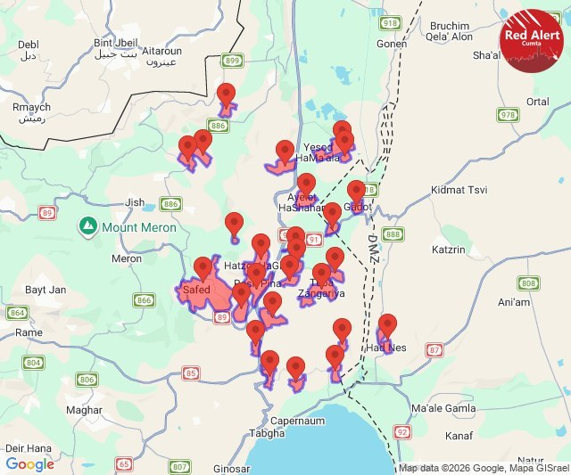

Shin ✓ @hey_itsmyturn
Mon, 01 Jun 2026 22:35:53 UTC

Sirens in Golan, Hermon
#Israel 🇮🇱

فارسی

آژیرهای خطر در جولان، حرمون
#Israel 🇮🇱

𝕏 · @shin_persian

## Shin_Persian — post 6385

  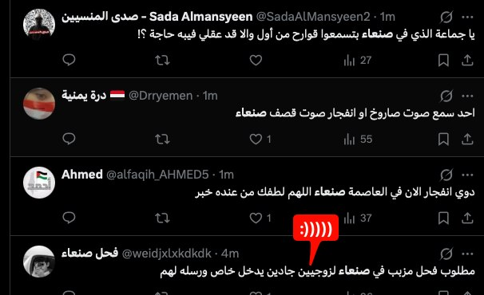

Shin ✓ @hey_itsmyturn
Mon, 01 Jun 2026 22:26:14 UTC

Some sources on the explosion, and one guy looking for, well, god knows what xD

فارسی

برخی منابع درباره انفجار، و یک نفر که به دنبال، خب، خدا می‌داند چه می‌گردد xD

𝕏 · @shin_persian

## Shin_Persian — post 6384

Shin ✓ @hey_itsmyturn
Mon, 01 Jun 2026 22:24:16 UTC

Blast sound in Sana'a, Yemen

فارسی

صدای انفجار در صنعا، یمن

𝕏 · @shin_persian

## FarsiVOA — post 219325

🔺دونالد ترامپ: با نتانیاهو و نمایندگان حزب‌الله صحبت کردم

▪️دونالد ترامپ، رئيس‌جمهوری آمریکا، عصر دوشنبه در تروت‌سوشال نوشت که با نخست وزیر اسرائيل، بنیامین نتانیاهو صحبت کرده است تا به بیروت حمله بزرگی نکند.

⬇️ بیشتر بخوانید:
https://ir.voanews.com/a/8156191.html
@FarsiVOA

## FarsiVOA — post 219324

Farsi VOA pinned «🔺نتانیاهو پس از تماس با پرزیدنت ترامپ؛ ارتش اسرائیل «به عملیات خود در جنوب لبنان طبق برنامه ادامه می‌دهد» ▪️بنیامین نتانیاهو، نخست‌وزیر اسرائیل، روز دوشنبه ۱۱ خرداد اعلام کرد در گفت‌وگو با دونالد ترامپ، رئیس جمهوری ایالات متحده، تأکید کرد در صورتی که حزب‌الله…»

## Persian_Trend_Official — post 15461

  <a href="telegram/content/Persian_Trend_Official_15461_1780356898.mp4" target="_blank">🎬 Download video</a>

شبتون بخیر 🌌
SR-71 Blackbird

📌 @persian_trend_official
پرشین ترند | متفاوت‌ترین کانال نظامی

## Persian_Trend_Official — post 15460

  <a href="telegram/content/Persian_Trend_Official_15460_1780356899.mp4" target="_blank">🎬 Download video</a>

وضعیت عرزشی ها !

## IranianMinds — post 21226

  

🔴 آکسیوس : حرف های امروز ترامپ در مکالمات تلفنی با نتانیاهو‌ این بوده : «تو دیوانه‌ای.» «اگر من نبودم، الان توی زندان بودی. دارم نجاتت می‌دهم.» «الان همه از تو متنفرند.» «به خاطر این ماجرا، همه از اسرائیل هم متنفر شده‌اند! @IranianMinds

## IranianMinds — post 21225

  

🔴 آکسیوس :

حرف های امروز ترامپ در مکالمات تلفنی با نتانیاهو‌ این بوده :

«تو دیوانه‌ای.»
«اگر من نبودم، الان توی زندان بودی. دارم نجاتت می‌دهم.»
«الان همه از تو متنفرند.»
«به خاطر این ماجرا، همه از اسرائیل هم متنفر شده‌اند!

@IranianMinds

## IranianMinds — post 21224

  <a href="telegram/content/IranianMinds_21224_1780356902.mp4" target="_blank">🎬 Download video</a>

بچه ها اسم این بازی عبور مرغ از خیابون  هست ویدئو نگاه کنید خیلی راحت 8 میلیون ازش سود گرفتیم😍

😤اگ توم دوس داری خیلی راحت از بازی های انلاین پول در بیاری حتما عضو کازینو شبانه شو
✅

توی کازینو شبانه بهت اموزش میدیم از بازی های انلاین پول دربیاری👌

کانال کازینو شبانه راهی برای چند برابر کردن سرمایت 🤷‍♂

کسب درامد انلاین با یه ادم حرفه ای یاد بگیر و‌ پول دربیار 
💵

🎯همین حالا عضو شو و شروع کن👇e11
https://t.me/+6ckCmywafrxiYzk0
https://t.me/+6ckCmywafrxiYzk0

## IranianMinds — post 21223

  

🔴 ترامپ:

«امروز با بیبی نتانیاهو صحبت کردم و از او خواستم حمله گسترده‌ای به بیروت لبنان انجام ندهد.

او نیروهایش را عقب کشید. ممنون بیبی! همچنین اسرائیل موافقت کرد که دیگر به آن‌ها شلیک نکند.

ببینیم این وضعیت چقدر دوام می‌آورد؛ امیدوارم برای همیشه ادامه داشته باشد!»

@IranianMinds

## BBCPersian — post 282599

  

‌ ‌ ‌ ‌
دفتر ریاست جمهوری لبنان اعلام کرد که مقامات این کشور «تاییدیه موافقت حزب‌الله با پیشنهاد آمریکا که خواستار توقف متقابل حملات است را دریافت کرده‌اند.»

دفتر رئیس‌جمهور لبنان در حسابش در شبکه اجتماعی ایکس نوشت: «بر اساس این پیشنهاد، حملات اسرائیل به حومه جنوبی بیروت در ازای خودداری حزب‌الله از انجام حملات علیه اسرائیل متوقف خواهد شد» و آتش‌بس «به تمام سرزمین‌های لبنان گسترش خواهد یافت».

قرار است مذاکراتی در روزهای سه‌شنبه و چهارشنبه «برای بحث در مورد این پیشرفت و تقویت آن» انجام شود.

https://bbc.in/3Q0LkUe
📷EPA/Shutterstock
@BBCPersian

## BBCPersian — post 282598

  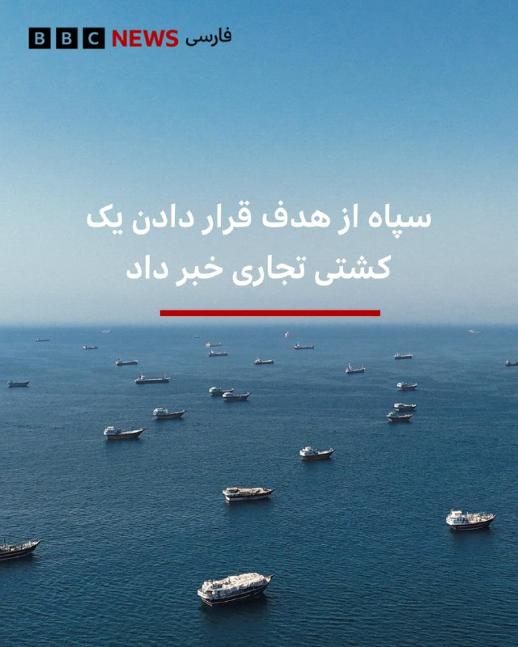

خبرگزاری‌های فارس و تسنیم، نزدیک به سپاه پاسداران از هدف قرار دادن یک کشتی باربری خبر داده‌اند.

در اطلاعیه نیروی دریایی سپاه پاسداران که عصر دوشنبه - اول ژوئن / ۱۱ خرداد - در این خبرگزاری‌ها منتشر شده آمده است: «درپی حمله متجاوزانه ارتش تروریستی آمریکا به کشتی ایرانی «لیان استار» در محدودهٔ دریای عمان، در یک عملیات مقابله‌به‌مثل، کشتی ام‌اس‌سی ساریسکا - MSC Sariska - متعلق به دشمن آمریکایی-صهیونیستی هدف موشک کروز قرار گرفت. هرگونه تجاوز ارتش آمریکا در منطقه با پاسخ قاطع روبه‌رو خواهد شد.»

همزمان سازمان عمليات تجارت دريايی بريتانيا (يوکی‌ام‌تی‌او) اعلام کرده گزارشی از وقوع يک حادثه در ۴۰ مايل دريايی جنوب شرقی بندر ام القصر عراق دريافت کرده است.

بر اساس گزارش این سازمان «يک کشتی کانتینربر در حال عبور از خليج فارس بود که در پی اصابت يک پرتابه ناشناس به سمت راست کشتی، انفجار بزرگی رخ داد.»

بنابر اطلاعاتی که از کشتی ام‌اس‌سی ساریسکا در وبسایت‌های کشتیرانی موجود است، و آخرین موقعیت جغرافیایی اعلام شده او که حدود ۵ ساعت قبل از انتشار این خبر بوده، خلیج فارس، ثبت شده است.

📷Reuters
@BBCPersian

## BBCPersian — post 282597

  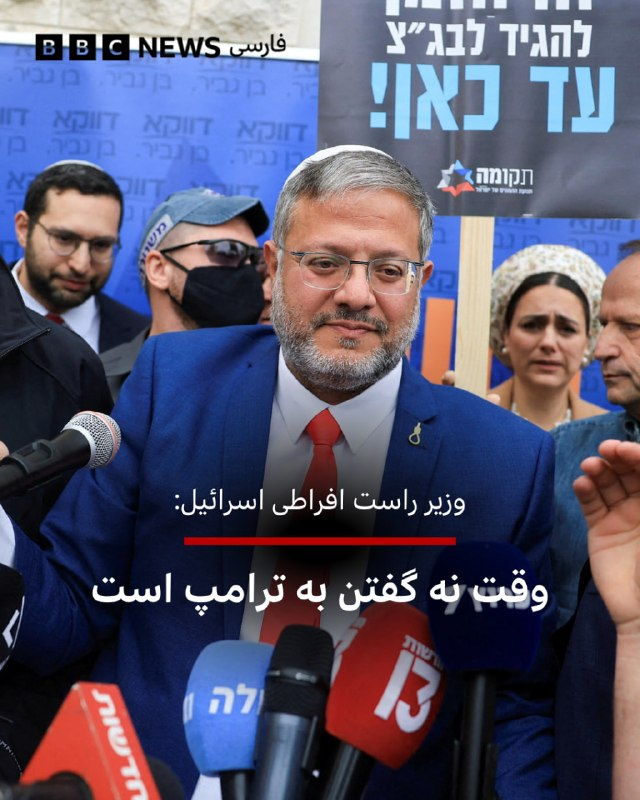

‌ ‌ ‌ ‌
ایتامار بن گویر، وزیر امنیت ملی اسرائیل، از اعلام ترامپ مبنی بر توقف حملاتی که اسرائیل قصد داشت علیه مناطقی در حومه جنوبی بیروت انجام دهد، انتقاد کرده و گفته است: «وقت آن رسیده که به ترامپ نه بگوییم».

این وزیر راست افراطی اسرائیل در برنامه‌ای در شبکه اجتماعی ایکس نوشت: «زمان آن رسیده که آنچه وظیفه می‌طلبد را انجام دهیم و آنچه لازم است حمله به حزب‌الله، آزادسازی جنگجویانمان و بازگرداندن امنیت به شمال است.»

او نوشت: «آقای نخست وزیر، شما گفتید که یک نخست وزیر قوی به رئیس جمهور ایالات متحده می‌گوید، در صورت امکان «بله» و در صورت لزوم «نه». اکنون زمان آن است که به دوستمان، رئیس جمهور ترامپ بگوییم «نه».

https://bbc.in/4uPbKrm
📷 Reuters
@BBCPersian

## Dirty_Kids — post 390800

  <a href="telegram/content/Dirty_Kids_390800_1780356906.webm" target="_blank">🎬 Download video</a>

☢️خفن ترین و‌ قدیمی ترین  انالیزور  ایران ینی دکتر بت 
👍 
🔴مسابقات جذاب جام جهانی به زودی شروع میشه بیا توی کانال دکتر بت و باهاش همراه شو و پول در بیار
💵 رایگان بهترین شرط هارو براتون میذاره حتی هزار تومن هم دریافت نمیکنه روزانه میتونی از پیش بینی فوتبال باهاش…

## Dirty_Kids — post 390799

  <a href="telegram/content/Dirty_Kids_390799_1780356906.webm" target="_blank">🎬 Download video</a>

☢️خفن ترین و‌ قدیمی ترین  انالیزور  ایران ینی دکتر بت 
👍

🔴مسابقات جذاب جام جهانی به زودی شروع میشه بیا توی کانال دکتر بت و باهاش همراه شو و پول در بیار
💵

رایگان بهترین شرط هارو براتون میذاره
حتی هزار تومن هم دریافت نمیکنه
روزانه میتونی از پیش بینی فوتبال باهاش پول در بیاری 👌
A11

🌟اگ اهل پیش بینی فوتبالی این کانال اصلا از دست ندین
👇

✅https://t.me/+4_ADqwB9e-QwYjlk

✅https://t.me/+4_ADqwB9e-QwYjlk

## Dirty_Kids — post 390798

  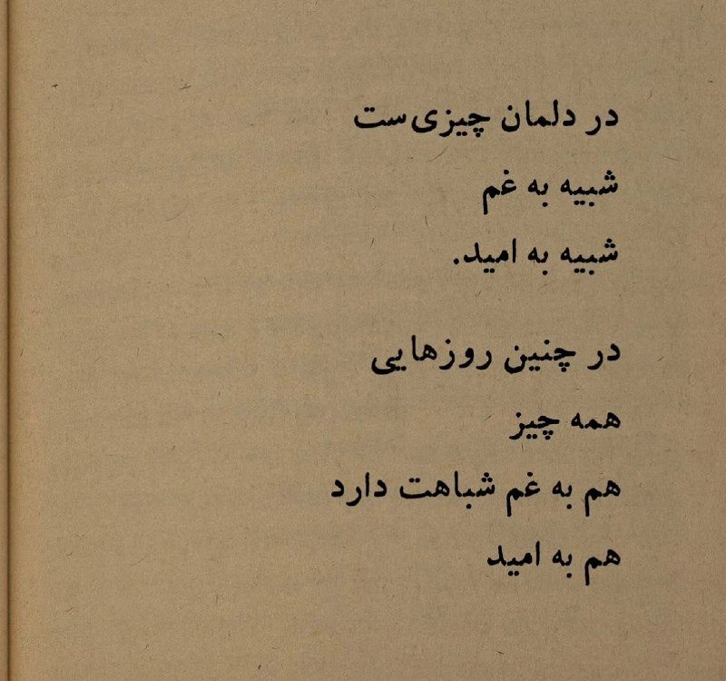

#بخوابیم

@Dirty_Kids 👻

## Dirty_Kids — post 390796

  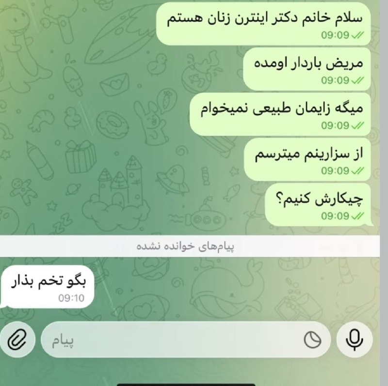

‏والا حق دارن بی اعصاب باشن

@Dirty_Kids 👻

## Dirty_Kids — post 390795

  <a href="telegram/content/Dirty_Kids_390795_1780356907.mp4" target="_blank">🎬 Download video</a>

کنسرت کاردی بی فقط مخصوص پسراست

@Dirty_Kids 👻

## Dirty_Kids — post 390794

  <a href="telegram/content/Dirty_Kids_390794_1780356909.mp4" target="_blank">🎬 Download video</a>

ویدیو کالا‌ف‌ دیوتی‌طور از درگیری تن به تن نیروهای ارتش اسرائیل با نیروهای تروریست حزب‌الله:

@Dirty_Kids 👻

## Dirty_Kids — post 390793

🔴 قالیباف:
ایران نه تنها روند گفتگو را متوقف خواهد کرد بلکه اگر اسرائیل حملات در لبنان را متوقف نکند،
مستقیماً به اسرائیل حمله خواهد کرد.

@Dirty_Kids 👻

## Dirty_Kids — post 390792

  

ترامپ: توافق صلح با ایران میتونه حتی بهتر از یه پیروزی نظامی باشه.

خبرنگار: خب پس چرا امضاش نمیکنی؟

ترامپ : چون هنوز باید ازشون چندتا امتیاز دیگه بگیرم؛ ولی خب تهش اون چیزی که باید به دست بیاریم رو می‌گیریم.

@Dirty_Kids 👻

## alonews — post 124356

  

🔥 همراه با ساب + حجم مصرفی، فقط 8T! 🚀

😍فقط گیگی 8 تومن😍

✅ باخرید 90 گیگ 100 گیگ تحویل بگیرید 😍✅
❌ فقط تا پایان امشب ❌

🔥 اگه دنبال یه VPN پایدار و بدون دردسر می‌گردی، این پلن مخصوص خودته!

@Netaazaadbot
@NetAazaadBot

✅ همراه با ساب + حجم مصرفی
✅ 15 سرور اختصاصی پرسرعت
✅ اتصال پایدار و بدون قطعی
✅ سرعت بالا حتی در ساعات شلوغ

@Netaazaadbot
@NetAazaadBot

📩 برای خرید و دریافت سرویس استارت رو بزن✅

## alonews — post 124355

  <a href="telegram/content/alonews_124355_1780356911.webm" target="_blank">🎬 Download video</a>

👈ترامپ: ایرانی‌ها از حملات اسرائیل به لبنان ناراحت بودند و من سریع مشکل را حل کردم

✅ @AloNews خبر جنگ

## alonews — post 124354

  <a href="telegram/content/alonews_124354_1780356911.webm" target="_blank">🎬 Download video</a>

👈آکسیوس: ترامپ تنها به دنبال توافق است

✅ @AloNews خبر جنگ

## alonews — post 124353

  <a href="telegram/content/alonews_124353_1780356912.webm" target="_blank">🎬 Download video</a>

👈کارشناس صدا و سیما: خون یک لبنانی اندازه خون یک ایرانی با ارزشه

✅ @AloNews خبر جنگ

## alonews — post 124352

  <a href="telegram/content/alonews_124352_1780356912.webm" target="_blank">🎬 Download video</a>

👈وزیر جنگ آمریکا: آماده‌ایم به جنگ برگردیم

✅ @AloNews خبر جنگ

## alonews — post 124351

  <a href="telegram/content/alonews_124351_1780356912.webm" target="_blank">🎬 Download video</a>

👈4 سوخت رسان آمریکایی در نزدیکی مرزهای ایران

✅ @AloNews خبر جنگ

## alonews — post 124350

  <a href="telegram/content/alonews_124350_1780356912.mp4" target="_blank">🎬 Download video</a>

👈واکنش تاج به ناامن بودن شهر تیخوانا: کاری به مواد فروش‌های مکزیک نداریم و نمی‌خواهیم هم اصلاحشان کنیم!

✅ @AloNews خبر جنگ

## alonews — post 124349

  <a href="telegram/content/alonews_124349_1780356913.webm" target="_blank">🎬 Download video</a>

👈دوستان این تبلیغاتی که پائین کانال نمایش داده میشه توسط تلگرامه و دست ما نیست و کلاهبرداری هست و فریب نخورید

✅ @AloNews خبر جنگ

---
📅 بروزرسانی: 1405/03/12 01:27
---

## VahidOOnLine — post 243287

  

♦️دونالد ترامپ، رئیس‌جمهوری آمریکا، در گفتگوی تلفنی با شبکه خبری «ای‌بی‌سی نیوز» اعلام کرد که به نظر او، توافق با تهران برای تمدید آتش‌بس و بازگشایی تنگه هرمز «طی هفته آینده» حاصل خواهد شد. ترامپ روز دوشنبه در گفتگو با جاناتان کارل، خبرنگار ارشد این شبکه در واشنگتن، با ابراز خوش‌بینی گفت: «اوضاع خوب به نظر می‌رسد.» رئیس‌جمهوری آمریکا با اشاره به تنش‌های اخیر افزود: «امروز مشکل کوچکی پیش آمد، اما همان‌طور که احتمالا پیش‌تر متوجه شدید، من خیلی سریع آن را برطرف کردم.» او توضیح داد که این مشکل ناشی از ناراحتی و عصبانیت مقام‌های ایران از حملات اسرائیل به لبنان بوده است؛ ترامپ در تشریح نحوه حل این بحران گفت: «من با حزب‌الله صحبت کردم و گفتم تیراندازی نکنید؛ با بنیامین نتانیاهو، نخست‌وزیر اسرائیل هم صحبت کردم و گفتم تیراندازی نکنید، و هر دو طرف شلیک به یکدیگر را متوقف کردند.»
‌🇸🇦 Indypersian

🤖 @VahidOOnLine

## VahidOOnLine — post 243286

♦️مهدی تاج، رئیس فدراسیون فوتبال، در گفتگو با صداوسیما در پاسخ به ابهامات و نگرانی‌ها درباره ناامنی شهر «تیخوانا» در مکزیک و حضور گسترده گروه‌های بزرگ مخدر در این منطقه گفت: «ما کار به موادفروش‌ها نداریم و نمی‌خواهیم بروم آنجا اصلاحشان کنیم». تاج با رد آمارهای مربوط به ناامنی این شهر مدعی شد که طبق گفتگوهایش با سفیر و استاندار منطقه، شرایط مناسب است و افزود: «در همه‌جا جرم و جنایت هست.»
‌🇸🇦 Indypersian

🤖 @VahidOOnLine

## VahidOOnLine — post 243285

  

♦️ به گزارش فارس، خبرگزاری وابسته به سپاه، محمدباقر قالیباف، رئیس مجلس شورای اسلامی روز دوشنبه، در تماس تلفنی با نبیه بری، رئیس مجلس لبنان با تاکید به اینکه «پیوند جمهوری اسلامی و لبنان ناگسستنی است» گفت: «جان ما و شما یکی است و چنانچه توافقی برای پایان جنگ بین ایران و آمریکا شکل بگیرد، این آتش‌بس شامل توقف حملات در همه جبهه‌ها به‌ویژه لبنان خواهد بود.» قالیباف با اشاره به اینکه در دو روز گذشته توقف حملات اسرائیل با جدیت دنبال شده است، گفت در صورت تداوم این حملات، تهران نه‌تنها روند گفتگوها را متوقف می‌کند، بلکه در برابر این اقدامات خواهد ایستاد. براساس این گزارش، در مقابل، رئیس مجلس لبنان با تقدیر از تلاش‌های جمهوری اسلامی، تاکید کرد که لبنان هرگز مواضع تهران را در این مرحله حساس فراموش نخواهد کرد.
‌🇸🇦 Indypersian

🤖 @VahidOOnLine

## VahidOOnLine — post 243284

  <a href="telegram/content/VahidOOnLine_243284_1780351077.mp4" target="_blank">🎬 Download video</a>

♦️مهدی تاج، رئیس فدراسیون فوتبال، در گفتگو با صداوسیما، با اشاره به هزینه‌های سنگین ارزی و دشواری‌های هماهنگ کردن بازی‌های تدارکاتی برای تیم ملی اعلام کرد: «ما ۱۰۰ هزار دلار به مالی دادیم که بیاید. پول هواپیمایشان را دادیم، پول هتلشان را هم دادیم. در این شرایط بازی هماهنگ کردن خیلی سخت است». بر اساس گزارش‌ها، تیم ملی که تاکنون موفق به بازی با هیچ‌کدام از تیم‌های راه‌یافته به جام جهانی نشده و پس از لغو مسابقات با اسپانیا، پرتغال، مقدونیه و آنگولا، حتی ناچار به انجام بازی درون‌تیمی و دیدار با گامبیا (تیم ۱۱۶ دنیا) شده بود، قرار است روز پنجشنبه ۱۴ خرداد در آنتالیا به مصاف مالی برود.
‌🇸🇦 Indypersian

🤖 @VahidOOnLine

## VahidOOnLine — post 243283

  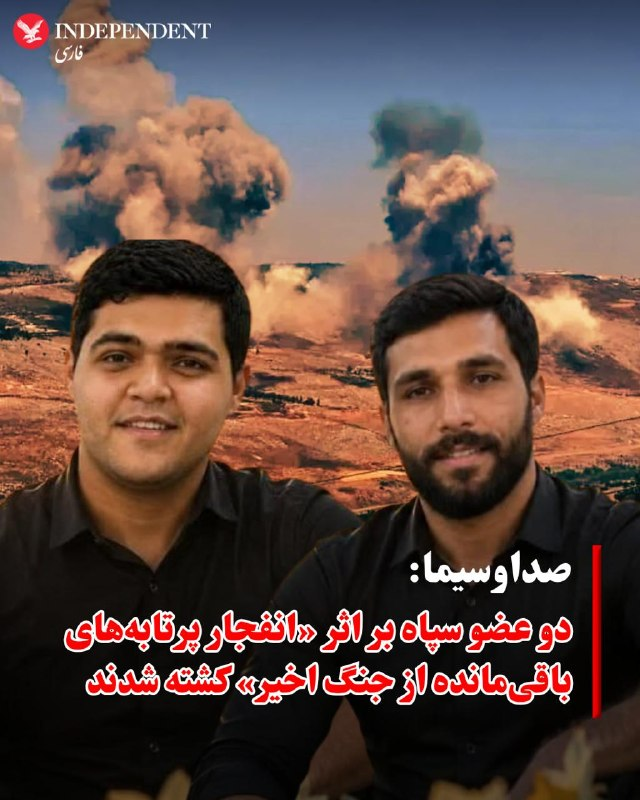

♦️خبرگزاری صداوسیما، روز دوشنبه، به نقل از روابط عمومی سپاه قم اعلام کرد که دو عضو این نهاد به نام‌های «حسین رمضانیان فردویی» و «محمد اویسی»، بر اثر «انفجار پرتابه‌های باقی‌مانده از جنگ اخیر» در جبهه‌های دفاعی این استان کشته شده‌اند. پیش از این نیز، سپاه انصارالمهدی زنجان، ۱۱ اردیبهشت خبر داد که حین «عملیات خنثی‌سازی مهمات عمل‌نکرده» جنگ چهل روزه، ۱۴ نفر از نیروهایش کشته شده‌اند. بر این اساس، تعداد تلفات سپاه در دوره آتش‌بس موقت جاری میان واشنگتن با تهران، دستکم به ۱۶ نفر افزایش یافت.
‌🇸🇦 Indypersian

🤖 @VahidOOnLine

## VahidOOnLine — post 243282

  

♦️به گزارش انتخاب، با افزایش بارندگی‌ها و بهبود چشمگیر ورودی آب، میزان پرشدن مخزن سد امیرکبیر (کرج) به حدود ۷۰ درصد ظرفیت خود رسیده است که این موضوع پس از سال‌ها خشکسالی و کاهش مداوم ذخایر، «نویدبخش بهبود وضعیت منابع آبی» برای میلیون‌ها ساکن پایتخت و استان البرز است. این سد با ظرفیت بیش از ۱۸۰ میلیون مترمکعب، از اصلی‌ترین منابع تامین آب شرب تهران و کرج به شمار می‌رود و اگرچه افت محسوس سال‌های گذشته را تا حدی جبران کرده، اما کارشناسان حوزه آب همچنان تاکید دارند که این بهبود نسبی نباید موجب غفلت از مدیریت مصرف و ضرورت صرفه‌جویی در جامعه شود.
‌🇸🇦 Indypersian

🤖 @VahidOOnLine

## VahidOOnLine — post 243281

  

روابط عمومی نیروی دریایی سپاه اعلام کرد که در پی حمله ارتش آمریکا به کشتی ایرانی «لیان استار» در محدوده دریای عمان، نیروی دریایی سپاه طی یک عملیات مقابله به مثل، کشتی «ام‌اس‌سی. ساریسکا» با مالکیت «دشمن آمریکایی-اسرائیلی» را با موشک کروز مورد هدف قرار داد.
‌🏁 🇬🇧 IranintlTV

🤖 @VahidOOnLine

## VahidOOnLine — post 243280

  <a href="telegram/content/VahidOOnLine_243280_1780351078.mp4" target="_blank">🎬 Download video</a>

♦️ روابط عمومی سپاه، روز دوشنبه، ۱۱ خردادماه، با انتشار تصاویری از شلیک موشک، خبر از هدف قرار دادن یک کشتی «با مالکیت آمریکا و اسرائیل» در محدوده دریای عمان داد. سپاه نوشت: در پی حمله ارتش آمریکا به کشتی ایرانی «لیان استار» در محدوده دریای عمان، نیروی دریایی سپاه طی یک عملیات مقابله به مثل، کشتی «msc. sariska» با مالکیت امریکا و اسرائیل را با موشک کروز مورد هدف قرار داد. نیروی دریایی سپاه اعلام کرد: «هر گونه حمله امریکا در این منطقه با پاسخ قاطع روبرو خواهد شد».
‌🇸🇦 Indypersian

🤖 @VahidOOnLine

## VahidOOnLine — post 243279

  

بنیامین نتانیاهو، نخست‌وزیر اسرائیل، در شبکه ایکس نوشت: با ترامپ گفت‌وگو کردم و به او گفتم اگر حزب‌الله حملات خود به شهرها و غیرنظامیان ما را متوقف نکند، اسرائیل اهداف «تروریستی» را در بیروت هدف قرار خواهد داد.
او افزود: این موضع ما همچنان پابرجاست و همزمان ارتش اسرائیل طبق برنامه، به عملیات خود در جنوب لبنان ادامه می‌دهد.
‌🏁 🇬🇧 IranintlTV

🤖 @VahidOOnLine

## VahidOOnLine — post 243278

  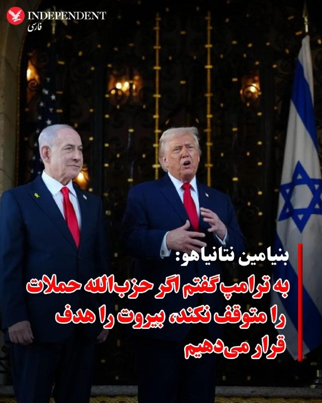

♦️بنیامین نتانیاهو، نخست‌وزیر اسرائیل، شامگاه دوشنبه ۱۱ خرداد ماه اعلام کرد در گفتگوی تلفنی با دونالد ترامپ، رئیس‌جمهوری آمریکا، به او گفته است که در صورت ادامه حملات حزب‌الله، اسرائیل اهدافی را در بیروت هدف قرار خواهد داد.

دفتر نخست‌وزیر اسرائیل روز دوشنبه در بیانیه‌ای به نقل از نتانیاهو اعلام کرد: «امشب با رئیس‌جمهوری ترامپ صحبت کردم و به او گفتم اگر حزب‌الله حمله به شهرها و شهروندان ما را متوقف نکند، اسرائیل اهداف تروریستی را در بیروت هدف قرار خواهد داد.»
نتانیاهو افزود: «موضع ما در این زمینه تغییری نکرده است.»

او همچنین تاکید کرد ارتش اسرائیل به عملیات خود در جنوب لبنان طبق برنامه ادامه خواهد داد.

این اظهارات ساعاتی پس از آن مطرح شد که ترامپ در شبکه اجتماعی تروث سوشال از توافق برای توقف درگیری‌ها میان اسرائیل و حزب‌الله خبر داد و اعلام کرد نیروهای اسرائیلی که به گفته او در مسیر حمله به بیروت بودند، بازگردانده شده‌اند.
‌🇸🇦 Indypersian

🤖 @VahidOOnLine

## VahidOOnLine — post 243277

♦️ویدیویی از لحظه حمله هوایی به «شرکت تولید پنجره دوجداره آسا» در جریان جنگ اخیر ایران و آمریکا و اسرائیل مورد توجه کاربران شبکه‌های اجتماعی قرار گرفته است.
رسانه‌های رسمی ایران، روز ۲۵ اسفند ماه سال گذشته از حمله به این شرکت تولیدی خبر داده بودند، اما به دلیل قطع اینترنت در ۸۸ روز گذشته، تصاویر این حمله به تازگی منتشر شده است.
گزارش شده است که دو حمله پیاپی این کارخانه را هدف قرار داده اما دوربین‌های مداربسته فقط تصاویر حمله اول را ثبت کردند.
به گزارش خبرگزاری دولتی دانشجو، پس از حملات هوایی تولید این کارخانه که حدود ۱۰۰ کارگر داشت، به دلیل خسارات گسترده متوقف شده است.
‌🇸🇦 Indypersian

🤖 @VahidOOnLine

## VahidOOnLine — post 243276

♦️با گذشت چند روز از وصل شدن تدریجی اینترنت در ایران، ویدیوها، تصاویر و اسناد تازه‌ای از جزئیات قتل و مراسم چهلم امیرحسین (شایان) شکاری، از جان‌باختگان اعتراضات ملی دی‌ماه ۱۴۰۴ در رشت به دست ایندیپندنت فارسی رسیده است.

در ویدیوهای ارسالی، لحظاتی از زندگی ورزشی او، در کنار حضور هم‌تیمی‌ها، دوستان، اقوام و اهالی رشت بر مزارش دیده می‌شود که با گل‌ها، شمع‌ها، عکس‌های شخصی و یادبودهایی از دوران زندگی‌اش آذین شده است.

امیرحسین (شایان) شکاری، متولد ۳۰ تیر ۱۳۸۴ و ساکن رشت، عضو پیشین تیم ملی نوجوانان تکواندو ایران بود و سابقه نایب‌قهرمانی آسیا را در کارنامه داشت. تصاویر رسیده به ایندیپندنت فارسی، بخشی از مدال‌ها، احکام قهرمانی و افتخارات ورزشی او را نیز نشان می‌دهد.

بر اساس اطلاعات دریافتی، امیرحسین روز ۱۸ دی‌ماه ۱۴۰۴ در جریان اعتراضات ملی در رشت هدف شلیک نیروهای حکومتی قرار گرفت و جان باخت. منابع مطلع گفته‌اند او در محدوده فلکه رازی و حوالی پارک کشاورز، پس از تعقیب از سوی نیروهای سرکوبگر، در یک کوچه هدف شلیک مستقیم گلوله جنگی قرار گرفت. همزمان، تصویری از برگه پزشکی قانونی که به دست ایندیپندنت فارسی رسیده نیز نشان می‌دهد علت مرگ او «اصابت جسم پرتابه‌شونده به سر و گردن» ثبت شده است.

منابع نزدیک به خانواده شکاری همچنین به ایندیپندنت فارسی گفته‌اند که پس از کشته شدن این ورزشکار جوان، نهادهای امنیتی ضمن اعمال فشارهای گسترده، به پدر او پیشنهاد مالی هنگفتی ارائه کردند تا امیرحسین به‌عنوان «شهید حکومتی» و از نیروهای حامی جمهوری اسلامی معرفی شود، اما پدرش آن را رد کرد.
‌🇸🇦 Indypersian

🤖 @VahidOOnLine

## VahidOOnLine — post 243275

  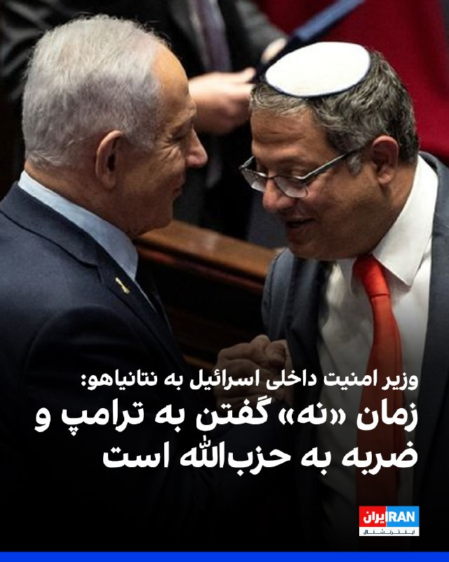

ایتامار بن‌گویر، وزیر امنیت داخلی اسرائیل، در شبکه ایکس خطاب به بنیامین نتانیاهو نوشت:
«آقای نخست‌وزیر، شما گفتید یک نخست‌وزیر قوی زمانی که ممکن باشد به رییس‌جمهور ایالات متحده "بله" می‌گوید و زمانی که لازم باشد "نه".»
او افزود: «اکنون زمان آن است که به دوست‌مان، رییس‌جمهور ترامپ، "نه" بگویید. اکنون زمان آن است که آنچه لازم و ضروری است انجام شود؛ به حزب‌الله ضربه بزنیم، دست رزمندگان‌مان را باز بگذاریم و امنیت را به شمال بازگردانیم.»
‌🏁 🇬🇧 IranintlTV

🤖 @VahidOOnLine

## VahidOOnLine — post 243274

  

♦️اعلام دونالد ترامپ مبنی بر موافقت بنیامین نتانیاهو با توقف گسیل نظامیان به بیروت، در شامگاه دوشنبه ۱۱ خرداد ماه، با واکنش منفی چند چهره شاخص سیاسی در اسرائیل مواجه شد.
ایتامار بن‌گویر، وزیر امنیت ملی اسرائیل، با انتقاد از این تصمیم گفت: «زمان آن رسیده که به ترامپ نه بگوییم.»
همزمان نفتالی بنت، نخست‌وزیر پیشین اسرائیل، نیز در پیامی دولت این کشور را به ناتوانی در حفظ امنیت متهم کرد. او با اشاره به حوادث امنیتی در اورشلیم، بیت‌شمش، لبنان و غزه نوشت: «مکان‌ها متفاوت هستند، اما داستان یکی است؛ دولتی که کنترل بر حاکمیت اسرائیل را از دست داده است.» بنت همچنین گفت: «هرج‌ومرج در همه‌جا دیده می‌شود و ما امنیت را به شهروندان اسرائیل بازخواهیم گرداند.»
یائیر لاپید، رهبر مخالفان دولت اسرائیل، نیز با انتقاد از نتانیاهو، تصمیم او را «اعلام تبدیل اسرائیل به یک دولت تحت‌الحمایه کامل» توصیف کرد.
این واکنش‌ها پس از آن مطرح شد که ترامپ در پیامی در شبکه اجتماعی تروث سوشال اعلام کرد پس از گفتگو با بنیامین نتانیاهو، نخست‌وزیر اسرائیل، نیروهای اسرائیلی به بیروت اعزام نخواهند شد.
‌🇸🇦 Indypersian

🤖 @VahidOOnLine

## VahidOOnLine — post 243273

  

♦️اسماعیل قاآنی، فرمانده نیروی قدس سپاه پاسداران، شامگاه دوشنبه ۱۱ خرداد ماه هشدار داد ادامه عملیات اسرائیل در لبنان و غزه می‌تواند به گسترش دامنه درگیری‌ها و تاثیرگذاری بر مسیرهای راهبردی کشتیرانی در منطقه منجر شود.
قاآنی در پیامی که رسانه‌های دولتی ایران منتشر کرده‌اند، نوشت جنگ اسرائیل در لبنان و غزه «در سایه حمایت‌های وقیحانه آمریکا، عزم محور مقاومت را برای توسعه پشتیبانی‌ها از هر دو جبهه، اقدام برای فعال‌سازی سایر جبهه‌ها و همسان‌سازی وضعیت ترافیکی تنگه باب‌المندب با تنگه هرمز رقم خواهد زد.»
فرمانده نیروی قدس سپاه همچنین هشدار داد که ادامه عملیات اسرائیل در جنوب لبنان و غزه، این کشور را با واکنش‌های گسترده‌تری از سوی حزب‌الله و گروه‌های فلسطینی روبه‌رو خواهد کرد.
اظهارات قاآنی در حالی مطرح می‌شود که طی روزهای اخیر مقام‌های جمهوری اسلامی و نهادهای نزدیک به حاکمیت بارها نسبت به ادامه حملات اسرائیل در لبنان هشدار داده و از احتمال گشوده شدن جبهه‌های جدید در منطقه سخن گفته‌اند.
‌🇸🇦 Indypersian

🤖 @VahidOOnLine

## VahidOOnLine — post 243272

  

«دانشجویان متحد» به نقل از کانال «علامه آزاد»، گزارش داد علی خضریان، نماینده مجلس و دانشجوی دکتری علوم سیاسی دانشگاه علامه طباطبایی، در آزمون جامع دکتری پاییز ۱۴۰۳ با وجود تحویل برگه‌ای که گفته می‌شود بدون پاسخ بوده، پذیرفته شده است.
طبق این گزارش، پذیرش او با ضوابط آموزشی آزمون جامع دکتری سازگار نبوده و تاکنون توضیح رسمی در این‌باره ارائه نشده است.
دانشجویان متحد نوشت جواد شقاقی، دانشجوی دکتری علوم سیاسی دانشگاه علامه طباطبایی، در اعتراض به تخلف آموزشی خضریان و همکاری گروه علوم سیاسی دانشگاه با این رفتار، به سوالات آزمون جامع دکتری پاسخ نداد. گروه علوم سیاسی، اعتراض این دانشجو را وارد ندانسته و او را از تحصیل محروم کرد.
بر اساس این گزارش، گروه علوم سیاسی در واکنش به این اعتراض، گفته که گروه صلاح دانسته از خضریان سوالی نپرسد و به برگه سفید او نمره بدهد.
دانشجویان متحد اضافه کرد شقاقی که تا دوره پیش از جنگ در خوابگاه دانشگاه علامه طباطبایی اقامت داشت به تازگی برای پیگیری وضعیت تحصیلی خود به خوابگاه مراجعه کرد اما با ممانعت حراست برای ورود مواجه شد و مجبور شد چند شب را در مقابل درب خوابگاه بخوابد.
https://iran
‌🏁 🇬🇧 IranintlTV

🤖 @VahidOOnLine

## VahidOOnLine — post 243271

  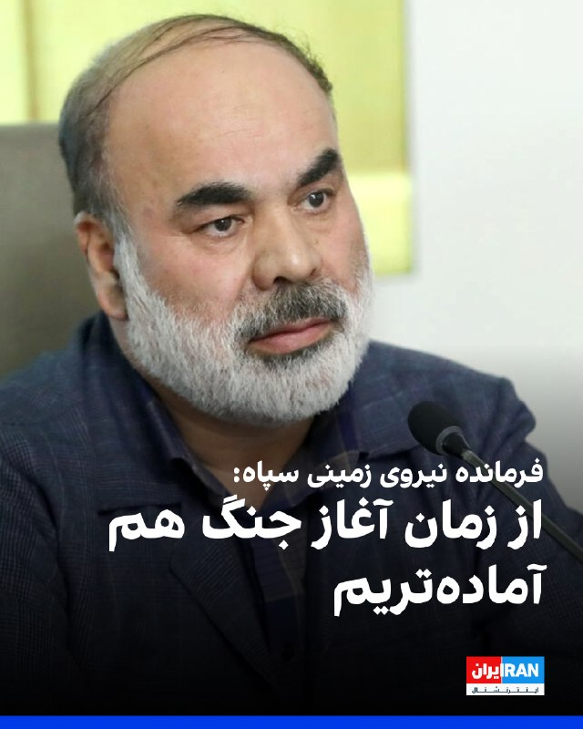

محمد کرمی، فرمانده نیروی زمینی سپاه، از«آمادگی ۱۰۰ درصدی» این نیرو برای مقابله با تهدیدات خبر داد و گفت: «سطح آمادگی نیرو‌های مسلح امروز حتی از زمان آغاز جنگ اخیر نیز فراتر رفته است.»

او افزود: «هیچ مشکلی در سطح نیرو وجود ندارد و برای مقابله با هرگونه تهدید و نبرد زمینی در آمادگی کامل هستیم.»
‌🏁 🇬🇧 IranintlTV

🤖 @VahidOOnLine

## VahidOOnLine — post 243270

  

علی‌اکبر ولایتی، مشاور رهبر جمهوری اسلامی در شبکه اجتماعلی ایکس نوشت که بمباران ضاحیه و نقض آتش‌بس، عجله اسرائیل برای پایان دادن به تاریخ خود است.

ولایتی افزود: شما آغاز کردید، اما برخلاف انفعال تماشاچیان منطقه، جمهوری اسلامی و جبهه مقاومت تا آخر کنار مردم عزیز لبنان، از مسلمان تا مارونی ایستاده است.
‌🏁 🇬🇧 IranintlTV

🤖 @VahidOOnLine

## VahidOOnLine — post 243269

♦️حسن یوسفی، سرپرست هیات باستان‌شناسی آتشکده ساسانی ویگل از کشف یک ساختار آیینی با ویژگی‌های کم‌سابقه در این محوطه تاریخی خبر داد.
به گزارش ایسنا، حسن یوسفی با اعلام این خبر گفت: «در جریان فصل سوم کاوش‌های باستان‌شناسی در آتشکده ساسانی ویگل واقع در شهرستان آران و بیدگل، ساختاری آیینی شناسایی شده که از نظر معماری و کارکرد، ویژگی‌های کم‌سابقه‌ای دارد و می‌تواند اطلاعات تازه‌ای درباره آیین‌های مذهبی و سازمان فضایی نیایشگاه‌های دوره ساسانی ارائه کند.»
او افزود: «این ساختار در بخش شرقی آتشکده کشف شده و شامل فضاهایی با چیدمان ویژه و شواهدی از فعالیت‌های آیینی است که تاکنون نمونه‌های مشابه اندکی از آن در محوطه‌های ساسانی شناسایی شده است.»
به گفته یوسفی، نتایج اولیه کاوش‌ها نشان می‌دهد این بخش احتمالا نقشی فراتر از یک فضای معمول مذهبی داشته و ممکن است برای برگزاری آیین‌های خاص مورد استفاده قرار می‌گرفته است.
سرپرست هیات باستان‌شناسی آتشکده ویگل تاکید کرد بررسی‌های تخصصی و مطالعات تکمیلی برای تعیین دقیق کارکرد این ساختار همچنان ادامه دارد.
‌🇸🇦 Indypersian

🤖 @VahidOOnLine

## VahidOOnLine — post 243268

  

♦️دونالد ترامپ، رئیس‌جمهوری آمریکا اعلام کرد گفتگوها با جمهوری اسلامی ایران همچنان ادامه دارد و با سرعت در حال پیشرفت است.

ترامپ روز دوشنبه در پیامی در شبکه اجتماعی تروث سوشال نوشت: «مذاکرات با جمهوری اسلامی ایران با سرعت در حال ادامه یافتن است. از توجه شما به این موضوع سپاسگزارم!»

رئیس جمهوری آمریکا پیش از این پیام، از توقف حملات اسرائیل به بیروت و موافقت حزب‌الله به پایبندی بر آتش‌بس خبر داده بود.

اظهارات ترامپ پس از آن مطرح می‌شود که خبرگزاری تسنیم به نقل از منابع آگاه گزارش داد ایران در اعتراض به ادامه عملیات نظامی اسرائیل در لبنان، روند «تبادل متون از طریق میانجی» با آمریکا را متوقف خواهد کرد.
‌🇸🇦 Indypersian

🤖 @VahidOOnLine

## WithYashar — post 13220

  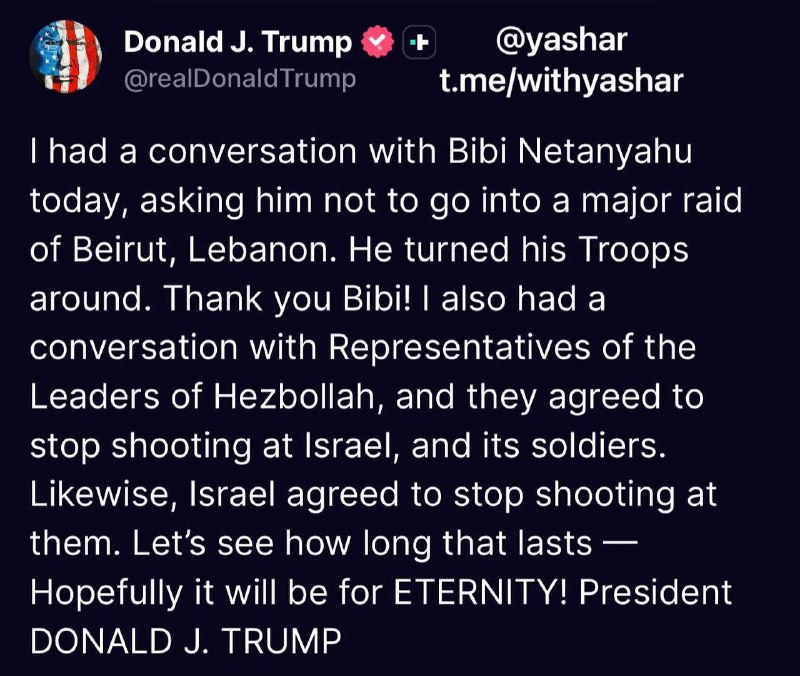

ترامپ در تروث : «من امروز با بیبی نتانیاهو گفت‌وگو کردم و از او خواستم وارد یک یورش گسترده به بیروت، لبنان نشود. او نیروهایش را متوقف کرد و بازگرداند. از تو ممنونم بیبی!

همچنین با نمایندگان رهبران حزب‌الله گفت‌وگو کردم و آنها موافقت کردند که تیراندازی به سمت اسرائیل و نیروهایش را متوقف کنند. به همین ترتیب، اسرائیل نیز موافقت کرد که به آنها شلیک نکند.

باید دید این وضعیت چه‌قدر دوام می‌آورد, امیدواریم برای همیشه باقی بماند!

رئیس‌جمهور دونالد جی. ترامپ»
@withyashar

## WithYashar — post 13219

ترامپ به ABC: با اسرائیل و حزب‌الله گفت‌وگو کردم و به آنها گفتم که دیگر بس است.

من هنوز با این توافق موافقت نکرده‌ام و هنوز باید چند امتیاز دیگر بگیرم.

کار ساده‌ای نیست. شما درباره یک کشور واقعاً بزرگ صحبت می‌کنید، آنها یک کشور بسیار بزرگ هستند که می‌خواهد توافق کند. خصومت فوق‌العاده‌ای وجود دارد، واقعاً.

او ادامه داد: «بنابراین این کار برای آنها آسان نیست. در واقع از منظر ما هم آسان نیست. اما ما داریم آنچه را که نیاز داریم به دست می‌آوریم.»

مردم ایران مرا دوست دارند زیرا رژیم را عوض کردم
@withyashar

## WithYashar — post 13218

ترامپ به ای‌بی‌سی نیوز:
احتمال داره طی یک هفته آینده با ایران به توافق برسیم، همه چیز خیلی خوب پیش میره؛ توافق صلح با ایران میتونه حتی بهتر از یک پیروزی نظامی باشه.
@withyashar

## WithYashar — post 13217

  

توییت جدید کاخ سفید: به ترامپ اعتماد کنید. فقط بنشینید و آرام باشید، در نهایت همه‌چیز خوب پیش خواهد رفت همیشه همین‌طور بوده است!
رئیس‌جمهور دونالد جی. ترامپ
@withyashar

## WithYashar — post 13216

WarRoom with YASHAR pinned «پست شد اینستاگرام سر‌ساعت https://www.instagram.com/p/DZDi1pCEfvI/?igsh=MWN3ZWNhdWxqbmk0OA== لطفاً این پست را استوری کنید و برای تمام افراد مرتبط با شاهزاده رضا پهلوی و شخص خود ایشان و تمامی پیجهای ایشان ارسال کنید.»

## WithYashar — post 13215

شروط حزب الله برای آتش بس:

آتش بس فراگیر در تمامی مناطق لبنان
عقب نشینی کامل ارتش اسرائیل از جنوب لبنان
عدم تجاوز به خاک کشور

در غیر اینصورت حزب الله اعلام کرده توافقی در کار نیست.
@withyashar

## WithYashar — post 13214

## WithYashar — post 13213

قالیباف در تماس تلفنی با همتای لبنانی:
مصمم هستیم در سراسر لبنان آتش بس برقرار کنیم. در دو روز گذشته به طور جدی به دنبال توقف حملات اسرائیل بودیم. اگر جنایات اسرائیل در لبنان ادامه پیدا کنه، مذاکرات رو متوقف می‌کنیم و در مقابل آن می‌ایستیم.
@withyashar

## WithYashar — post 13212

محمد رضا شاه پهلوی چرا اونجوری شد ؟ مگه مردم چیزیشون کم بود ؟ نه ! چون بیشتر ما حسودیم چشم دیدن همو نداریم ! حالا اینو تو کل تاریخ هم بری ‌میبینی ! تو یه شهر کوچیک میبینی ! میبینی که همون دوستاتن که میفروشنت ! اگه مهارجت کرده باشی میبینی که فقط خودی بهت میزنه ! 😞و این داستان ادامه دارد…

## WithYashar — post 13211

داداش مثل اینکه کون خیلیارو سوزوندی دارن جر میدن خودشونو

## WithYashar — post 13210

هم اکنون شلیک موشک از سمت حزب الله به شمال اسرائیل
@withyashar

## WithYashar — post 13209

نتانیاهو :موضع ما در حمله به بیروت تغییری نکرده است.
@withyashar

## WithYashar — post 13208

حزب‌الله پیشنهاد آتش‌بس جزئی را رد کرد
@withyashar

## WithYashar — post 13207

نیروی دریایی ۳پا کشتی «msc. sariska» با مالکیت  امریکایی اسرائیلی را هدف قرار داد.
@withyashar

## WithYashar — post 13206

@withyashar مسیر ما

## WithYashar — post 13205

## WithYashar — post 13204

این قدم اول هست و ما پشیمون نمیشیم 😃 نیازی ندیدم تمام پلن ها یک جا انجام بشه در نتیجه از همین شروع کردم ، من به تقدیر خودم و مردمم ایمام دارم

## WithYashar — post 13203

دوست گرافیستی که قرار‌ بود اوکی کنه آفلاین بود و در نتیجه اینم خودم با ای آی دقایق پایانی درست کردم که دقیقه ای رأس ۱۱:۱۱ آنتایم حاظر و پست شد ، میدونم و ببخشید

## WithYashar — post 13202

فونت پست یجوریه بنظرم
یچیز دیگ بهتر نیس بزاری؟

## WithYashar — post 13201

درود در عکس آخر کاش بجای جناب آقای یاشار توکلیان می‌نوشتید اینجانب یاشار توکلیان را .... کمی گرم تر بود البته نظر بنده بود یاشار جار باز نظر شما محترم است ❤️ ممنون از زحماتتون

## mwarmonitor — post 10011

  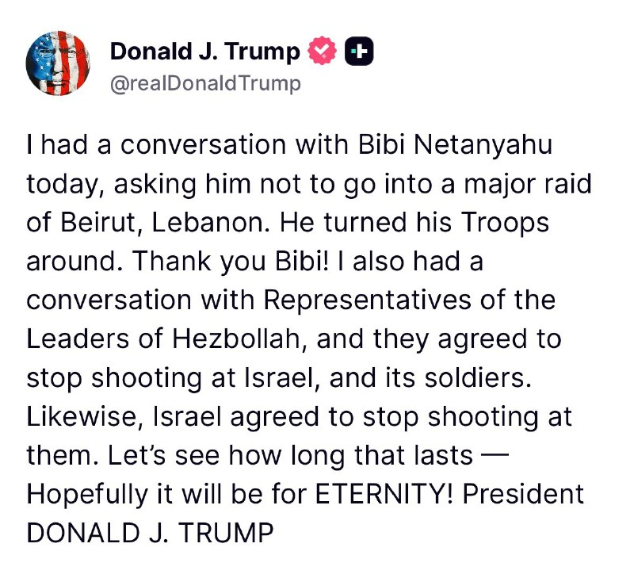

🔴«امروز با بی‌بی نتانیاهو گفتگو کردم و از او خواستم که حمله گسترده‌ای به بیروت در لبنان انجام ندهد. او نیروهایش را بازگرداند. ممنونم بی‌بی! من همچنین گفتگویی با نمایندگان رهبران حزب‌الله داشتم و آن‌ها موافقت کردند که شلیک به سمت اسرائیل و سربازانش را متوقف کنند. به همین ترتیب، اسرائیل نیز موافقت کرد که شلیک به سمت آن‌ها را متوقف کند. بیایید ببینیم این وضعیت چقدر دوام خواهد آورد — امیدوارم برای همیشه (تا ابد) باشد!

رئیس‌جمهور دونالد جی. ترامپ»

@mwarmonitor

## mwarmonitor — post 10010

  

📝 اینکه قالیباف با وقاحت از «برادری دو ملت ایران و لبنان» و «دفاع از سرزمین مادری» دم می‌زند، اوج یک کمدی تهوع‌آور است. این انگل‌زادگان سیاسی در حالی برای توقف گفتگوها و ایستادگی حماسی نسخه می‌پیچند که هیچ رابطه دیپلماتیک واقعی میان ملت لبنان و آن‌ها وجود ندارد؛ سفیر بی‌کفایتشان حتی پس از اخراج، با وقاحت تمام در بیروت ماند تا در بغل صیغه‌های شیعه حزب‌الله به ریش هر دو ملت بخندد. حقیقت تلخ این تئاتر مضحک آن است که جمهوری اسلامی و حزب‌الله مانند یک تومور سرطانی و بی‌درمان، شیره جان دو ملت را می‌مکند؛ قالیباف و هم‌فکرانش نگران مردم مظلوم لبنان نیستند، بلکه تنها واهمه آن‌ها، نابودی همان نطفه سرطانی و دست‌پرورده‌ای است که بقای ایدئولوژیک و سفره‌های غارتگری‌شان به آن وابسته‌ است.

@mwarmonitor

## mwarmonitor — post 10009

🔴بر اساس گزارش ABC، یک فرد مسلح در یک کلینیک پزشکی در منطقه پلیکن نَروز در استان ساسکاچوان کانادا گزارش شده است. پلیس اعلام کرد فرد مظنون لباس کاملاً سیاه بر تن دارد و صورتش پوشیده است.

@mwarmonitor

## mwarmonitor — post 10008

  

USAF نیروی هوایی ایالات متحده –✈️ جابه‌جایی‌های ویژه (VIP)

✈️یک فروند Boeing C-40 Clipper
شماره رجیستر: AE11F6 01-0041 – SAM 708

🔴پرواز SAM 708 از پایگاه هوایی مک‌دیل به مقصد فرودگاه اشتوتگارت در آلمان انجام شد؛ که به‌احتمال زیاد حامل برد کوپر، فرمانده فرماندهی مرکزی ایالات متحده (USCENTCOM) بوده است.

@mwarmonitor

## mwarmonitor — post 10007

🔴اعلام آتش‌بس از سوی دونالد ترامپ، رئیس‌جمهور ایالات متحده، پس از تلاش‌های فشرده ایران، میانجی‌گری فعال قطر و نقش کلیدی نبیه بری، رئیس مجلس لبنان، صورت گرفت.
🔸در این چارچوب، علی حسن خلیل، دستیار سیاسی بری، هم‌اکنون در دوحه حضور دارد تا پیگیری رایزنی‌های جاری را انجام دهد. الجزیره

@mwarmonitor

## mwarmonitor — post 10006

🔴فرماندهی مرکزی ایالات متحده (سنتکام) سی‌امین دوره رزمایش «همکاری منطقه‌ای» را میزبانی می‌کند

🔰تامپا، فلوریدا — فرماندهی مرکزی ایالات متحده (CENTCOM) سی‌امین دوره از رزمایش «همکاری منطقه‌ای» (Regional Cooperation) را در تاریخ ۱ ژوئن در فورت هریسون، ایالت مونتانا آغاز کرد.

🔸رزمایش همکاری منطقه‌ای، بزرگترین تمرین آموزشی سنتکام با کشورهای آسیای مرکزی و جنوبی است که پیشینه آن به سال ۱۹۹۶ بازمی‌گردد و با هدف ارتقای امنیت، ثبات و قابلیت همکاری متقابل در منطقه طراحی شده است.

🔹دریادار برد کوپر، فرمانده سنتکام گفت:
«آموزش مشترک به مدت سه دهه، نشان‌دهنده یک نقطه عطف بزرگ و گواهی بر اعتماد و همکاری دیرینه میان ایالات متحده و شرکای منطقه‌ای ما است. ما منافع مشترکی در آموزش و آماده‌سازی نیروهای خود برای طیف وسیعی از شرایط اضطراری داریم.»
طی دو هفته آینده، بیش از ۳۵۰ پرسنل نظامی از ۱۰ کشور و ۱۰ واحد گارد ملی ایالات متحده در تمرینات یکپارچه‌ای شرکت خواهند کرد که برای بهبود پاسخ‌های تاکتیکی به تهدیدات امنیتی متعارف و نامتعارف طراحی شده‌اند.
🔸این رزمایش ۱۱ روزه شامل سناریوهای پست فرماندهی، آموزش میدانی و امنیت سایبری خواهد بود که به شرکت‌کنندگان فرصتی برای هماهنگی و آموزش در یک محیط یادگیری را می‌دهد.

📌کوپر افزود: «وقتی با هم آموزش می‌بینیم و کار می‌کنیم، روابطمان را قوی‌تر کرده و باعث پیشرفت یکدیگر می‌شویم.»

@mwarmonitor

## mwarmonitor — post 10005

🔴کانال ۱۲ اسرائیل به نقل از منابع: تماس تلفنی میان ترامپ و نتانیاهو بیش از یک ساعت است که ادامه دارد. @mwarmonitor

## mwarmonitor — post 10004

🔴ترامپ در پی تهدید ایران به ترک مذاکرات، نتانیاهو را در مورد لبنان مهار کرد

📝نویسنده: باراک راوید AXIOS

🔰رئیس‌جمهور ترامپ روز دوشنبه، پس از آنکه ایران تهدید کرد در اعتراض به اقدامات اسرائیل در لبنان مذاکرات خود با آمریکا را متوقف خواهد کرد، طرح بنیامین نتانیاهو، نخست‌وزیر اسرائیل، برای بمباران اهداف حزب‌الله در بیروت را متوقف کرد.
یک مقام اسرائیلی به آکسیوس گفت که حملات برنامه‌ریزی‌شده به بیروت انجام نخواهد شد.

🔸چرا این موضوع مهم است؟
تصمیم ترامپ برای مهار نتانیاهو سیگنال واضحی بود نشان‌دهنده اینکه او نمی‌خواهد متحد کلیدی‌اش مانع از دستیابی به توافق با ایران شود.
ترامپ روز دوشنبه پس از تماس تلفنی خود با نتانیاهو ادعا کرد که مذاکرات با ایران «با سرعت بالایی در حال پیشرفت است».

جریان خبر چیست؟
روز دوشنبه، نتانیاهو در بیانیه‌ای مشترک با اسرائیل کاتس، وزیر دفاع، تهدید کرد که «در پی نقض مکرر آتش‌بس» توسط این گروه شبه‌نظامی تحت حمایت ایران، اهداف حزب‌الله در ضاحیه بیروت را بمباران خواهد کرد.
در پاسخ، عباس عراقچی، وزیر امور خارجه ایران، در هشدار خود در شبکه اجتماعی اکس (X) اعلام کرد که اقدامات اسرائیل در لبنان نقض آتش‌بس میان آمریکا و ایران است و آمریکا و اسرائیل «عواقب هرگونه نقض توافق» را متحمل خواهند شد.
مقامات ایرانی به خبرگزاری نیمه‌رسمی تسنیم گفتند تا زمانی که اسرائیل حملات خود در لبنان را متوقف نکند، هیچ مذاکره‌ای با آمریکا انجام نخواهد شد و تهدید به تلافی در تنگه هرمز و احتمالاً «جبهه‌های دیگر» کردند.
ساعاتی بعد، ترامپ با نتانیاهو گفتگو کرد. او سپس در پستی در شبکه اجتماعی «تروث سوشال» مدعی شد که اسرائیل و حزب‌الله حمله به یکدیگر را متوقف خواهند کرد.
آخرین تحولات
سفارت لبنان در واشنگتن بعداً اعلام کرد که حزب‌الله پیشنهاد آمریکا برای «توقف متقابل حملات» را پذیرفته است و ترامپ به سفیر لبنان گفته که موافقت نتانیاهو را جلب کرده است.
این توافق که توسط مارکو روبیو، وزیر امور خارجه پیشنهاد شده بود، شامل تعلیق حملات برنامه‌ریزی‌شده اسرائیل به بیروت در ازای متوقف شدن حملات حزب‌الله به اسرائیل است.
هنوز نه اسرائیل و نه حزب‌الله پذیرش چنین پیشنهادی را تایید نکرده‌اند. اعلامیه‌های قبلی دولت ترامپ درباره آتش‌بس در لبنان، بیشتر روی کاغذ وجود داشته است تا در واقعیت.
پشت پرده
ایالات متحده هفته‌هاست که به عنوان بخشی از یک تلاش گسترده‌تر برای تنش‌زدایی، از اسرائیل خواسته است به بیروت حمله نکند؛ اما یک مقام آمریکایی روز یکشنبه اشاره کرد که ممکن است این موضع تعدیل شود.
این مقام به آکسیوس گفت: «آمریکا انتظار ندارد اسرائیل حملات مداوم یک سازمان تروریستی علیه غیرنظامیانش را تحمل کند.»
به نظر می‌رسید اسرائیل روز دوشنبه آماده انجام حملات گسترده است. ارتش اسرائیل در بیانیه‌ای به زبان عربی از «تمامی ساکنان منطقه ضاحیه در بیروت» خواست تا برای امنیت خود این منطقه را تخلیه کنند.
اسرائیل همچنین عملیات زمینی خود را در جنوب لبنان گسترش داده است، در حالی که حزب‌الله به شلیک پهپاد و موشک به داخل اسرائیل ادامه می‌دهد.
بررسی دقیق‌تر
حوالی ظهر روز دوشنبه، ترامپ تماس تلفنی طولانی‌مدتی با نتانیاهو داشت تا درباره بحران فزاینده در لبنان و مذاکرات با ایران گفتگو کند.
پیش از این تماس، یک مقام ارشد آمریکایی به آکسیوس گفت ترامپ احساس می‌کند تهدیدهای نتانیاهو برای حمله به بیروت زیاده‌روی است.
ترامپ پس از آن نوشت: «من تماس بسیار سازنده‌ای با بی‌بی نتانیاهو، نخست‌وزیر اسرائیل داشتم و هیچ نیرویی به بیروت نخواهد رفت و هر نیرویی که در راه بوده، در حال حاضر بازگردانده شده است.»
اسرائیل قصد اعزام نیرو به بیروت را نداشت، بلکه هدفش انجام حملات هوایی گسترده‌ای بود که می‌توانست ساختمان‌ها را در حومه جنوبی بیروت، جایی که برخی از مقرهای حزب‌الله در آن قرار دارد، تخریب کند.
نکات جالب توجه
ترامپ همچنین مدعی شد که تماس «بسیار خوبی» با «نمایندگان عالی‌رتبه» حزب‌الله داشته است که موافقت کرده‌اند «همه تیراندازی‌ها متوقف شود - اسرائیل به آن‌ها حمله نخواهد کرد و آن‌ها نیز به اسرائیل حمله نخواهند کرد.»
مشخص نیست منظور او کدام نمایندگان بوده است.
علی حمدان، مشاور ارشد نبیه بری، رئیس پارلمان لبنان به آکسیوس گفت که بری روز یکشنبه به دولت ترامپ اعلام کرده بود حزب‌الله برای آتش‌بس کامل و فوری با اسرائیل آماده است و متعهد شده که اجرای آن را تضمین کند.
مقامات آمریکایی باور نداشتند که نتانیاهو یک آتش‌بس کامل را بپذیرد و تلاش ناموفقی برای یک آتش‌بس ناپدید و موقت انجام داده بودند.
گام بعدی چیست؟
به گفته یک مقام آمریکایی، گفتگوهای برنامه‌ریزی‌شده میان دیپلمات‌های اسرائیلی و لبنانی در روز سه‌شنبه در واشنگتن طبق برنامه انجام خواهد شد.

@mwarmonitor

## mwarmonitor — post 10003

🔴سازمان UKMTO گزارش داد که یک کشتی کانتینربر (با نام MSC SARISKA V) چند ساعت پس از ترک بندر ام‌القصر عراق، در خلیج فارس هدف برخورد یک پرتابه قرار گرفته است. @mwarmonitor

## mwarmonitor — post 10002

🔴رسانه‌های اسرائیلی: در حال حاضر سکوت بر دفتر نخست‌وزیر حاکم است. این واقعیت که یک رئیس‌جمهور آمریکایی—هرچقدر هم که طرفدار اسرائیل باشد—کشور را اداره می‌کند، باید همه ما را نگران کند.

@mwarmonitor

## mwarmonitor — post 10001

  

«گفتگوها با جمهوری اسلامی ایران با سرعتی بالا در حال جریان است. از توجه شما به این موضوع سپاسگزارم! رئیس‌جمهور دونالد جی. ترامپ»

@mwarmonitor

## mwarmonitor — post 10000

🔸وزارت امور خارجه ایران: ایالات متحده و اسرائیل از زمان اعلام آتش‌بس در ۱۹ مارس، بارها آن را نقض کرده‌اند؛ از جمله با حمله به کشتی‌های تجاری ایرانی، نقض حاکمیت لبنان و آواره کردن میلیون‌ها غیرنظامی لبنانی.

🔹ایران، آمریکا را مستقیماً مسئول نقض آتش‌بس در هر دو کشور ایران و لبنان می‌داند.

🔹ایران نسبت به پیامدهای خطرناک این نقض‌ها هشدار می‌دهد و تأکید می‌کند که حق دفاع از خود را با هر وسیله‌ای و در هر زمان و مکانی که لازم باشد برای خود محفوظ می‌دارد.

@mwarmonitor

## mwarmonitor — post 9999

  

خب همینطور که پیشینی کرده بودم

## mwarmonitor — post 9998

خب همینطور که پیشینی کرده بودم

## mwarmonitor — post 9997

🔴اقدامات جدید پدافند غیرعامل در فردو:

🔸بین ۱۰ تا ۱۸ مه، ایران اقدامات جدیدی از نوع پدافند غیرعامل در قالب تپه‌های خاکی/سنگی و سایر موانع در مسیرهای منتهی به ورودی‌های تونل تأسیسات زیرزمینی (که قبلاً آسیب دیده/تخریب شده) فردو ایجاد کرده است.
🔹چیدمان متناوب این تپه‌ها و موانع بسیار دقیق است و مجموعه‌ای از مسیرهای زیگزاگی (چیکن/پیچ‌دار) ایجاد می‌کند. این موضوع نشان می‌دهد که هدف آن‌ها صرفاً انسداد مسیر نیست، بلکه بیشتر برای جلوگیری از ورود و خروج سریع خودروها طراحی شده و می‌تواند حرکت نیروهای مهاجم در صورت حضور در محل را دشوار کند.
🔸این نحوه قرارگیری همچنین نشان می‌دهد که ایران همچنان قصد دسترسی به محل را دارد، زیرا در غیر این صورت احتمالاً مانند موارد قبلی در مسیرهای منتهی به تونل‌های اصفهان، کل جاده‌ها با خاکریز مسدود می‌شد.
این مسیرهای زیگزاگی در ورودی شرقی ممکن است موقتی بوده و تا ۲۶ مه دوباره برداشته شده باشند، اما این موضوع نیاز به تصاویر دقیق‌تر دارد.
🔹این ورودی قبلاً توسط ایران پر شده بود و در ژوئن ۲۰۲۵ توسط اسرائیل هدف قرار گرفت که منجر به ایجاد یک دهانه (گودال) شد، اما هیچ نشانه‌ای از نفوذ به بالای ورودی تونل دیده نشد.
🔸بر اساس تصاویر تا ۲۶ مه، به نظر می‌رسد همه ورودی‌های تونل همچنان مدفون باقی مانده‌اند.

@mwarmonitor

## mwarmonitor — post 9996

  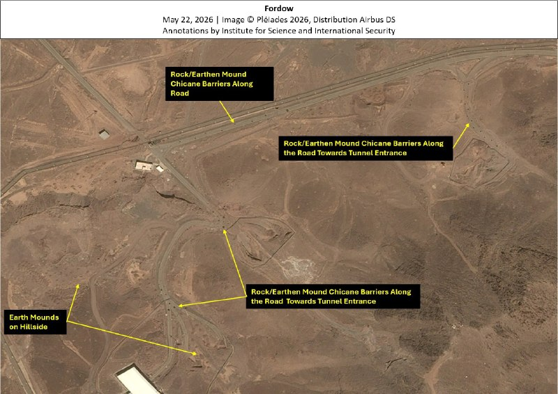

📷 Photo

## mwarmonitor — post 9995

📌 رویترز به نقل از دو منبع اسرائیلی: اسرائیل در انتظار موافقت نهایی ترامپ برای هرگونه عملیات در ضاحیه جنوبی بیروت است.

@mwarmonitor

## mwarmonitor — post 9994

🔴مقامات آمریکایی از طریق کانال‌های دیپلماتیک رسمی لبنان مطلع شده‌اند که حزب‌الله پیشنهاد آمریکا را پذیرفته و آماده است متعهد شود از هدف قرار دادن اسرائیل خودداری کند، در ازای تعهدی متقابل مبنی بر عدم حمله به حومه جنوبی بیروت.

🔸این موضوع به‌عنوان یک گام مثبت تلقی می‌شود که می‌تواند به کاهش تنش‌ها و جلوگیری از لغزش به سمت یک درگیری گسترده‌تر کمک کند.

🔹این تحولات قرار است فردا و روز بعد در جریان نشست‌های مذاکرات مستقیم در واشنگتن مورد بحث قرار گیرد. الشرق

@mwarmonitor

## mwarmonitor — post 9993

📌مراسم انتصاب رئیس جدید موساد به‌دلیل یک تماس تلفنی میان بنیامین نتانیاهو، نخست‌وزیر، و دونالد ترامپ، رئیس‌جمهور آمریکا، به تعویق افتاده است. @mwarmonitor

## mwarmonitor — post 9990

✈️یک تانکر سوخت‌رسان KC-46A نیروی هوایی آمریکا در حال حاضر بر فراز دریای عمان در حال عملیات است، در حالی که یک فروند دیگر نیز از تل‌آویو به سمت خلیج فارس در حال پرواز است.

✈️همچنین یک تانکر KC-135R نیز از پایگاه هوایی پرینس سلطان به سمت خلیج فارس در حال حرکت است.

@mwarmonitor

## FoxNewsTwitter — post 342485

  

Fox News (Twitter/X)

A sexually suggestive Kik profile linked to Maine Senate candidate Graham Platner is still active — despite his campaign saying he deleted the app long ago.

Kik has been labeled a "predator's paradise" by the National Center on Sexual Exploitation over concerns about child exploitation and predatory behavior on the platform. It is unclear who Platner messaged on the platform, but there is no evidence he communicated with minors.

The Wall Street Journal previously reported that Platner sent sexually explicit messages to multiple women while married to his wife, Amy Gertner. After the allegations surfaced, Gertner released a video defending her husband and blasting media coverage as "gossip."

Through it all, Platner remains a candidate for the U.S. Senate.

## FoxNewsTwitter — post 342481

Fox News (Twitter/X)

RT @BillMelugin_: BREAKING: The US Department of Transportation confirms to @FoxNews that they have issued a subpoena to the state of NY after they allege the state has refused to cooperate with their investigation into Jing Shen Dong, the bus driver who allegedly caused a crash that killed five people in Stafford County, VA on Friday morning. DOT says Dong is a naturalized US citizen who was born in China, doesn't speak English, and received his commercial driver's license (CDL) from the state of New York.

DOT says the subpoena is a result of not being able to "obtain the requested documents through other reasonable means."

DOT is demanding that New York turn over records on Dong's CDL, his entry level driving training, and the driving school he attended. DOT says those documents must be turned over by Wednesday at 10AM ET, or face consequences/penalties.

## FoxNewsTwitter — post 342480

  

Fox News (Twitter/X)

WATCH LIVE: DHS Secretary Mullin holds a press conference https://twitter.com/i/broadcasts/1DGleeDWYLVJL

## FoxNewsTwitter — post 342479

  <a href="telegram/content/FoxNewsTwitter_342479_1780351089.mp4" target="_blank">🎬 Download video</a>

Fox News (Twitter/X)

NEW: A Brooklyn man is being charged with threatening to assault and murder an ICE officer outside the Delaney Hall detention facility.

The suspect, identified as 27-year-old Nicholas Matthew Scelfo of Brooklyn, New York, was arrested for influencing, impeding, and retaliating against a federal officer by threat.

Scelfo, who was caught on video allegedly threatening to kill an ICE officer and his family outside a New Jersey detention center, has now been arrested.

"I'll kill your whole f---ing family... Your children, your wife — all dead."

"Told you. FBI just arrested the man who threatened to kill ICE officers and their families. FAFO," Acting AG Blanche posted on X.

## FoxNewsTwitter — post 342478

  

Fox News (Twitter/X)

HAPPY BIRTHDAY! Legendary actor and producer Morgan Freeman is celebrating his 89th birthday, marking nearly six decades in entertainment and a career that has helped define generations of film.

## FoxNewsTwitter — post 342477

  

Fox News (Twitter/X)

BREAKING: President Trump announces that no troops will go to Lebanon and Hezbollah has agreed "all shooting will stop" after a "very productive" call with Israeli Prime Minister Netanyahu and Hezbollah.

"Israel will not attack them, and they will not attack Israel."

## FoxNewsTwitter — post 342476

  

Fox News (Twitter/X)

BREAKING: Trump tries to calm Israel-Hezbollah fighting with Iran deal on the line, saying the terror group 'agreed that all shooting will stop'

## FoxNewsTwitter — post 342475

  

Fox News (Twitter/X)

RT @FoxTrueCrime: A Utah judge granted Tyler Robinson's defense's motion for an order to show cause after his attorneys accused prosecutors of violating the court's gag order through media interviews in the Charlie Kirk assassination case.

An evidentiary hearing lands June 12 — putting the state's own legal team under the microscope before trial even begins.

Both sides will have 90 minutes to present arguments at that hearing, when Robinson is expected to appear in person.

Credit: Rick Egan/The Salt Lake Tribune via Pool

## FoxNewsTwitter — post 342473

Fox News (Twitter/X)

BREAKING: Utah judge denies Tyler Robinson's latest request to hold secret hearings in Charlie Kirk assassination case

## FoxNewsTwitter — post 342472

  <a href="telegram/content/FoxNewsTwitter_342472_1780351093.mp4" target="_blank">🎬 Download video</a>

Fox News (Twitter/X)

JUST IN: Sheridan Gorman's family blames sanctuary policies and "failed removal policies" for the murder of their daughter, allegedly by an illegal immigrant with a criminal background.

Speaking outside the Cook County courthouse following a discovery hearing, Sheridan's father, Thomas Gorman, says failed border enforcement, removal policies, and local cooperation allowed Jose Medina to remain in the country and ultimately cross paths with his daughter.

"Jose Medina is responsible for what he did to Sheridan, but he did not get to Sheridan himself."

"He got there through a broken system, through failed border enforcement, failed removal policies, failed local cooperation, and sanctuary policies that put ideology before safety."

"American families deserve to be protected in their own country."

## FoxNewsTwitter — post 342471

  <a href="telegram/content/FoxNewsTwitter_342471_1780351094.mp4" target="_blank">🎬 Download video</a>

Fox News (Twitter/X)

BREAKING: Iran is halting its indirect talks with U.S. negotiators in protest against Israel's attacks on Hezbollah in Lebanon, Iranian state-linked media reported Monday.

Iran's Tasnim news agency, linked to the Iranian Revolutionary Guard Corps, reported that Tehran is cutting off talks due to the "continued crimes of the Zionist regime in Lebanon."

The report comes after Iranian Foreign Minister Abbas Araghchi posted to social media saying Lebanon must be included in the ongoing ceasefire between the U.S. and Iran.

"The United States and Israel bear responsibility for the consequences of any breach of the truce," Araghchi wrote.

@TreyYingst reports the latest.

## FoxNewsTwitter — post 342470

  <a href="telegram/content/FoxNewsTwitter_342470_1780351096.mp4" target="_blank">🎬 Download video</a>

Fox News (Twitter/X)

NEW: Agitator wrestled to the ground by New Jersey State Police as officers move in to enforce a curfew outside Newark's Delaney Hall detention center.

More than a dozen arrests have been made following days of escalating tensions around the ICE facility.

Authorities say weekend clashes between rioters and law enforcement included burning tires, thrown projectiles, and confrontations that prompted an increased police presence.

DHS sent a blunt warning to the agitators: "If you riot, you will face the consequences. Law and order prevails."

## FoxNewsTwitter — post 342469

  

Fox News (Twitter/X)

NEW: DHS says more than a dozen arrests were made over the weekend as agitators continued clashing with law enforcement outside a New Jersey ICE detention center.

Anti-ICE rioters set fires in the streets outside of Delaney Hall, prompting officials to impose a 9 pm curfew around parts of Newark.

Dem NJ Gov. Mikie Sherrill is sparring with DHS over the facility — but some protesters are now turning on her too, accusing her of lacking transparency and bending to federal pressure.

@AlexisMcAdamsTV breaks down the latest on the administration's "zero tolerance" response to protest-related violence.

## FoxNewsTwitter — post 342468

  

Fox News (Twitter/X)

A new Doocy is on the way.

@pdoocy announced that he and his wife @hillary__vaughn are expecting their third child, adding another member to their growing family.

Here's the twist: the baby is due on @SteveDoocy birthday.

## pm_afshaa — post 92080

  <a href="telegram/content/pm_afshaa_92080_1780351099.webm" target="_blank">🎬 Download video</a>

🔴ترامپ به ای‌بی‌سی نیوز:
احتمال داره طی یک هفته آینده با ایران به توافق برسیم، همه چیز خیلی خوب پیش میره؛ توافق صلح با ایران میتونه حتی بهتر از یک پیروزی نظامی باشه.

💧 Rainbet.com the #1 Non-KYC Crypto Casino & Sportsbook @rainbetcom

😁 @Pm_Afshaa

## pm_afshaa — post 92079

  <a href="telegram/content/pm_afshaa_92079_1780351099.webm" target="_blank">🎬 Download video</a>

🔴ترامپ: امروز زنگ زدم به حزب الله گفتم توقف حملات. چند دقیقه بعد با نتانیاهو تماس گرفتم و گفتم توقف حملات. اونا هر دو جنگ رو متوقف کردن.

💧 Rainbet.com the #1 Non-KYC Crypto Casino & Sportsbook @rainbetcom

😁 @Pm_Afshaa

## pm_afshaa — post 92078

  <a href="telegram/content/pm_afshaa_92078_1780351100.webm" target="_blank">🎬 Download video</a>

🔴خبرنگار الجزیره: حمله اسرائیل به لبنان مانع از دستیابی به توافق شده بود.

پس از فشار آمریکا و عقب‌نشینی اسرائیل، اکنون درها باز شده تا مذاکرات به مسیر طبیعی و مثبت خود بازگردد و چیز زیادی باقی نمانده.

💧 Rainbet.com the #1 Non-KYC Crypto Casino & Sportsbook @rainbetcom

😁 @Pm_Afshaa

## pm_afshaa — post 92077

  <a href="telegram/content/pm_afshaa_92077_1780351101.webm" target="_blank">🎬 Download video</a>

🔴قالیباف در تماس تلفنی با همتای لبنانی:
مصمم هستیم در سراسر لبنان آتش بس برقرار کنیم. در دو روز گذشته به طور جدی به دنبال توقف حملات اسرائیل بودیم. اگر جنایات اسرائیل در لبنان ادامه پیدا کنه، مذاکرات رو متوقف می‌کنیم و در مقابل آن می‌ایستیم.

💧 Rainbet.com the #1 Non-KYC Crypto Casino & Sportsbook @rainbetcom

😁 @Pm_Afshaa

## pm_afshaa — post 92076

  <a href="telegram/content/pm_afshaa_92076_1780351101.webm" target="_blank">🎬 Download video</a>

🔴سخنگوی ارتش اسرائیل:
در پی هشدارهایی که چندی پیش در منطقه متولا فعال شد، یک پرتاب در نزدیکی نیروهای ارتش اسرائیل که در جنوب لبنان فعال بودند سقوط کرد، تلفات جانی نداشت.

💧 Rainbet.com the #1 Non-KYC Crypto Casino & Sportsbook @rainbetcom

😁 @Pm_Afshaa

## pm_afshaa — post 92074

بعد از گفت‌وگوی تاثیرگذار و موفق ترامپ و نتانیاهو راجع‌به آتش‌بس اسرائیل و لبنان، هم‌اکنون جنگنده‌های اسرائیلی دارن جنوب لبنان رو بمباران میکنن.

💧 Rainbet.com the #1 Non-KYC Crypto Casino & Sportsbook @rainbetcom

😁 @Pm_Afshaa

## pm_afshaa — post 92073

حمله پهپادی حزب الله به اسراییل

💧 Rainbet.com the #1 Non-KYC Crypto Casino & Sportsbook @rainbetcom

😁 @Pm_Afshaa

## pm_afshaa — post 92072

حزب‌الله درخواست اتش بس آمریکا رو رد کرد

نماینده حزب‌الله در پارلمان لبنان:
پیشنهاد آمریکا مبنی بر توقف عملیات مقاومت در مقابل عدم حمله اسرائیل به ضاحیه جنوبی بیروت غیرقابل قبول است.

💧 Rainbet.com the #1 Non-KYC Crypto Casino & Sportsbook @rainbetcom

😁 @Pm_Afshaa

## pm_afshaa — post 92071

حملات سنگین اسراییل به لبنان

💧 Rainbet.com the #1 Non-KYC Crypto Casino & Sportsbook @rainbetcom

😁 @Pm_Afshaa

## pm_afshaa — post 92070

رئیس کمیسیون امنیت ملی مجلس: اگر جنگ در لبنان به صورت کامل متوقف نشود، روزهای تاریکی در انتظار آمریکا و اسرائیل خواهد بود

💧 Rainbet.com the #1 Non-KYC Crypto Casino & Sportsbook @rainbetcom

😁 @Pm_Afshaa

## pm_afshaa — post 92069

  <a href="telegram/content/pm_afshaa_92069_1780351101.webm" target="_blank">🎬 Download video</a>

🔴آکسیوس: ترامپ روز دوشنبه نقشه نتانیاهو، برای بمباران اهداف حزب‌الله در بیروت رو پس از اون متوقف کرد که جمهوری اسلامی تهدید کرد به دلیل اقدامات اسرائیل در لبنان، مذاکرات با آمریکا رو رها میکنه.

تصمیم ترامپ برای مهار نتانیاهو سیگنال واضحی بود مبنی بر اینکه اون نمیخواد متحد کلیدی‌اش مانع توافق با جمهوری اسلامی بشه.

یک مقام ارشد آمریکایی گفت که ترامپ احساس میکنه تهدیدهای نتانیاهو برای حمله به بیروت داره از حد می‌گذره.

💧 Rainbet.com the #1 Non-KYC Crypto Casino & Sportsbook @rainbetcom

😁 @Pm_Afshaa

## pm_afshaa — post 92068

  <a href="telegram/content/pm_afshaa_92068_1780351102.webm" target="_blank">🎬 Download video</a>

🔴نتانیاهو: من امروز عصر با ترامپ صحبت کردم و بهش گفتم که اگر حزب الله حملات خودش رو به شهرها و شهروندان ما متوقف نکنه، اسرائیل به اهداف تروریستی در بیروت حمله خواهد کرد.

موضع ما در این مورد بدون تغییر باقی می‌ماند. در عین حال، ارتش اسرائیل طبق برنامه در جنوب لبنان به عملیات خود ادامه خواهد داد.

💧 Rainbet.com the #1 Non-KYC Crypto Casino & Sportsbook @rainbetcom

😁 @Pm_Afshaa

## pm_afshaa — post 92067

🔴بیانیه سفارت لبنان در واشنگتن: اگر اسرائیل حملاتش به ضاحیه بیروت (جنوب پایتخت) رو متوقف کنه، حزب‌الله هم متقابلاً حمله‌ای انجام نمیده و آتش‌بسی که ترامپ گفته برقرار خواهد بود

💧 Rainbet.com the #1 Non-KYC Crypto Casino & Sportsbook @rainbetcom

😁 @Pm_Afshaa

## pm_afshaa — post 92066

#مهم
عزیزای دلم همگی الان چنل زاپاس‌مون رو جوین بشید کانال تحت ریپورت شدیده اگه چیزی شد زاپاس رو داشته باشید فعالیت میاد اونور
👇

https://t.me/pmtvzapas
https://t.me/pmtvzapas

## pm_afshaa — post 92064

🔴کاتز ، وزیر دفاع اسرائیل : در لبنان هیچ آتش بسی نداریم ، اسرائیل تا جایی که نیاز باشد پیشروی خواهد کرد

💧 Rainbet.com the #1 Non-KYC Crypto Casino & Sportsbook @rainbetcom

😁 @Pm_Afshaa

## pm_afshaa — post 92063

  <a href="telegram/content/pm_afshaa_92063_1780351102.webm" target="_blank">🎬 Download video</a>

🔴سفارت لبنان در واشنگتن:
دولت لبنان در دور کردن حزب‌الله از تشدید تنش‌های بیشتر موفق عمل کرد.

ترامپ به سفیر ما اعلام کرد که نتانیاهو با آتش‌بس موافقت کرده.

💧 Rainbet.com the #1 Non-KYC Crypto Casino & Sportsbook @rainbetcom

😁 @Pm_Afshaa

## pm_afshaa — post 92062

  <a href="telegram/content/pm_afshaa_92062_1780351103.webm" target="_blank">🎬 Download video</a>

🔴کاتز، وزیر دفاع اسرائیل: آمریکا ما رو از دفاع از شهرهای شمالی باز نمی‌دارد و به هر جایی که در لبنان لازم باشه می‌رسیم.

ترامپ معادله‌ای رو که ما تعیین کردیم رو پذیرفته است؛ اینکه شلیک به جوامع ما به معنای بمب‌گذاری در بیروت است. معنای اظهارات او همین است.

💧 Rainbet.com the #1 Non-KYC Crypto Casino & Sportsbook @rainbetcom

😁 @Pm_Afshaa

## pm_afshaa — post 92061

  <a href="telegram/content/pm_afshaa_92061_1780351103.webm" target="_blank">🎬 Download video</a>

🔴ولایتی، مشاور مجتبی خامنه‌ای:
اسرائیل با بمباران ضاحیه و نقض آتش‌بس، برای پایان تاریخ خودش عجله داره.

💧 Rainbet.com the #1 Non-KYC Crypto Casino & Sportsbook @rainbetcom

😁 @Pm_Afshaa

## pm_afshaa — post 92060

  <a href="telegram/content/pm_afshaa_92060_1780351104.webm" target="_blank">🎬 Download video</a>

🔴نفتالی بنت، نخست‌وزیر سابق اسرائیل: دولت کنترل حاکمیت اسرائیل رو از دست داده.

💧 Rainbet.com the #1 Non-KYC Crypto Casino & Sportsbook @rainbetcom

😁 @Pm_Afshaa

## iaghapour — post 2649

  

🧑‍💻 اکثر برنامه‌نویس‌ها دانش فنی فوق العاده ای دارن اما مشکلشون انگلیسیه!

🚫 چون نمیتونن:
▫️توی میتینگ راحت صحبت کنن
◾️داکیومنت‌ها رو سریع بخونن
▫️توی مصاحبه خارجی خوب عمل کنن
◾️یا با تیم بین‌المللی ارتباط بگیرن

برای همین کانال «لرنوبیت» رو ساختیم؛
آموزش انگلیسی مخصوص برنامه‌نویس‌ها و بچه‌های تکنولوژی 👇

🔹 اصطلاحات واقعی دنیای برنامه‌نویسی
🔹 مکالمه کاری و میتینگ
🔹 داکیومنت و کامنت‌نویسی
🔹 آمادگی مصاحبه و کار ریموت

Debug your English. Upgrade your career 🚀

🆔 @learnobit
🆔 @learnobit
🆔 @learnobit

## iaghapour — post 2648

  

⭕️ معرفی GenyConnect؛ جایگزین مدرن v2rayN برای مدیریت پروکسی

نرم‌افزار GenyConnect یک کلاینت تونلینگ و VPN مدرن (با کاربردی شبیه به برنامه محبوب v2rayN) است که با تمرکز بر عملکرد بالا، حریم خصوصی و کنترل دقیق ترافیک طراحی شده است. ویژگی مهم این ابزار، وابسته‌نبودن به یک پروتکل خاص است؛ به این معنی که می‌تواند به عنوان یک بستر یکپارچه برای موتورهای مختلف تونلینگ عمل کند.

🔹 مسیریابی پیشرفته: امکان تعیین مسیر ترافیک بر اساس لیست سفید، دامنه‌های خاص، و حتی مسیریابی در سطح اپلیکیشن‌ها و پروسه‌های سیستم.

🔸 سبک و شفاف: این ابزار با کمترین مصرف منابع سخت‌افزاری کار می‌کند و اطلاعات کاملی از وضعیت شبکه، لاگ‌های زنده و آمارهای لحظه‌ای ترافیک را به شما نمایش می‌دهد.

🔹 انعطاف در پلتفرم‌ها: برخلاف برخی کلاینت‌ها که فقط مختص یک سیستم‌عامل هستند، این برنامه به صورت یکپارچه برای ویندوز، مک، لینوکس و اندروید در دسترس است.

🔗 اطلاعات بیشتر در گیت‌هاب پروژه

🆔 @iAghapour

## iaghapour — post 2647

  

⭕️ تون‌کوین به (Gram) تغییر نام می‌دهد!

پاول دورف در کانال رسمی خود خبر بسیار مهمی برای کاربران و سرمایه‌گذاران شبکه TON اعلام کرد. بر اساس این اطلاعیه، ارز دیجیتال بومی این شبکه قرار است با یک ری‌برندینگ بزرگ، نام فعلی خود را کنار گذاشته و به نام اصلی و اولیه‌اش یعنی Gram تغییر کند.

نکات کلیدی که دورف در این پست به آن‌ها اشاره کرده است:

🔹 بازگشت به ایده اولیه: دورف یادآوری کرده که Gram نام اصلی ارز شبکه در اولین وایت‌پیپر این پروژه بود. او این اتفاق را بازگشت به ریشه‌ها و شروع یک فصل جدید توصیف کرده است.

🔸 زمان‌بندی انتقال: فرایند این تغییر نام و انتقال، حدود ۳ هفته زمان خواهد برد.

🔹 نام بلاک‌چین تغییر نمی‌کند: با وجود تغییر نام ارز بومی (از Toncoin به Gram)، نام خود شبکه بلاک‌چین همچنان TON باقی خواهد ماند.

🔸 قدم چهارم از یک نقشه راه: این ری‌برندینگ تنها یک تغییر اسم ساده نیست، بلکه به گفته دورف، راه را برای اتفاقات مهم بعدی هموار می‌کند و قدم چهارم از یک برنامه ۷ مرحله‌ای برای «عظمت دوباره بخشیدن به TON» است.

🆔 @iAghapour

## DEJradio — post 5234

  <a href="telegram/content/DEJradio_5234_1780351106.mp4" target="_blank">🎬 Download video</a>

🚨
🔸 محل جلسه خامنه‌ای و فرماندهان ارشد چگونه لو رفت؟

#موشعلی #حذف_هدفمند
@DEJradio

## DEJradio — post 5233

  <a href="telegram/content/DEJradio_5233_1780351107.mp4" target="_blank">🎬 Download video</a>

🚨🎥 اعتراض کامیونداران به افزایش بهای گازوئیل و خرابی جاده‌ها

افزایش ۴۵ درصدی قیمت گازوئیل پس از آغاز جنگ ۴۰ روزه به یکی از مشکلات اساسی رانندگان تریلی تبدیل شده است اما این فقط بخشی از مشکلات آنهاست، زیرا کمبود سوخت در جایگاه‌های بین راهی باعث شده آنها مجبور شوند ساعت‌ها در صف‌های طولانی معطل شوند.

از سویی دیگر خرابی جاده‌ها نیز سبب شده تا مخارج جانبی آنها برای خرید و تعویض قطعات افزایش پیدا کند، آنهم در شرایطی که قطعه و دستمزد تعمیرکار سر به فلک می‌کشد.

#کامیونداران #اعتراضات_سراسری
@DEJradio

## DEJradio — post 5232

  <a href="telegram/content/DEJradio_5232_1780351109.mp4" target="_blank">🎬 Download video</a>

🚨
🔸 خبر ۲۱
دوشنبه ۱۱ خرداد ۱۴۰۵

#خبر۲۱
@DEJradio

## DEJradio — post 5231

  <a href="telegram/content/DEJradio_5231_1780351111.mp4" target="_blank">🎬 Download video</a>

🤡
🔺 سه ماه پس از کشته شدن علی خامنه‌ای، شماری از هواداران نظام به مذاکره با قاتلان رهبرشان اعتراض کردند.

این اعتراضات به درگیری در تجمعات شبانه کشیده است. برخی مداحان حکومت را به دلیل تلاش برای توافق با آمریکا به چالش کشیده‌اند، در مقابل نیروهای امنیتی هواداران نظام را که مخالف توافق‌اند ضرب و شتم کرده‌اند.

#موشعلی #تجمعات_حکومتی
@DEJradio

## DEJradio — post 5230

  <a href="telegram/content/DEJradio_5230_1780351113.mp4" target="_blank">🎬 Download video</a>

🚨
🔸 جمهوری اسلامی بزرگترین دشمن زنان ایران

*پژمان گلچین، پژوهشگر فلسفه

#زنان_ایران #جمهوری_اسلامی
@DEJradio

## DEJradio — post 5229

  <a href="telegram/content/DEJradio_5229_1780351114.webm" target="_blank">🎬 Download video</a>

🔺📢 خبرگزاری تسنیم وابسته به سـ.ـپاه پاسداران در واکنش به حمله اسرائیل به مواضع حـ.زب‎الله در جنوب لبنان نوشت، با توجه به تداوم جنگ در لبنان و با عنایت به اینکه لبنان جزو پیش شرط‌های آتش‌بس بوده و هم اینک این آتش‌بس در همه جبهه‌ها از جمله لبنان نقض شده است، تیم مذاکره‌کننده ایرانی «گفتگوها و تبادل متون از طریق میانجی» را متوقف می‌کند.

#حزب_الله_لبنان

## DEJradio — post 5228

  <a href="telegram/content/DEJradio_5228_1780351115.webm" target="_blank">🎬 Download video</a>

🔺📷 ارتش اسرائیل با اعلام قبلی مواضع گروه تروریستی حـ.ـزب‌الله در جنوب بیروت (ضاحیه) را بمباران کرد. بنیامین نتانیاهو نخست وزیر اسرائیل در پیامی هشدار داد «اجازه نمی‌دهیم حزب‌الله به شهروندان اسرائیلی حمله کند و در بیروت در امان بماند.»

علی عبداللهی، فرمانده قرارگاه مرکزی خاتم‌الانبیا، در واکنش به صدور هشدار تخلیه برای شهروندان جنوب بیروت گفت: «با توجه به نقض مکرر آتش‌بس توسط اسرائیل، در صورت عملی‌شدن این تهدید به ساکنان بخش‌های شمالی و شهرک‌های نظامی در اسرائیل هشدار می‌دهیم اگر نمی‌خواهند آسیب ببینند منطقه را ترک نمایند.»

#ارتش_اسرائیل #حزب_الله_لبنان
@DEJradio

## DEJradio — post 5227

  <a href="telegram/content/DEJradio_5227_1780351115.mp4" target="_blank">🎬 Download video</a>

🔺📢 اعتراض یک راننده کامیون به مشکلات معیشتی

یک راننده کامیون از تهران با انتقاد از وضعیت زندگی خودش و همکارانش می‌گوید، سعید مصطفوی رئیس صنف کامیونداران به‌جای رسیدگی به مشکلات و چالش‌های شخصی و صنفی رانندگان شدیدا مانع از کسب درآمد آنها می‌شود و مشغول چرب زبانی و چاپلوسی در مقابل سردمداران رژیم است.

#کامیونداران
@DEJradio

## DEJradio — post 5226

  <a href="telegram/content/DEJradio_5226_1780351117.mp4" target="_blank">🎬 Download video</a>

🛩️
🔥 جنگ ۴۰ روزه؛
بمباران تاسیسات نفتی بندر عسلویه

#جنگ۴۰روزه
@DEJradio

## DEJradio — post 5225

🚨
🔸 #تمام_رخ
در شطرنج، اگه به‌موقع حمله نکنی، خب حریف حمله می‌کنه!
و ممکنه تا آخر بازی فقط مجبور به دفاع بشی 🛡♟

حمله‌ی پیش‌دستانه یعنی قبل از این‌که حریف نقشه‌اش رو کامل کنه، تو ضربه‌ی اول رو بزنی و ابتکار عمل رو به دست بگیری.

اما برای یک حمله‌ی پیش‌دستانه‌ی خوب، زمان‌بندی همه‌چیزه! ⏰
@DEJradio

## DEJradio — post 5224

  <a href="telegram/content/DEJradio_5224_1780351119.webm" target="_blank">🎬 Download video</a>

🔥
🔺 یک کشتی باری غول‌پیکر با پرچم پاناما دوشنبه ۱۱ خرداد ۱۴۰۵ در آب‌های سرزمینی عراق در معرض انفجار قرار گرفته است.

منابع عربی گزارش دادند کشتی MSC SARISKA V پس از تخلیه محموله خود در بندر ام‌القصر عراق، در آب‌های عراق بر اثر یک انفجار دچار آسیب شد.
مشخص نیست این کشتی هدف پرتابه قرار گرفته است یا به مین‌های دریایی برخورد کرده است.

#انفجار #عراق
@DEJradio

## DEJradio — post 5223

  <a href="telegram/content/DEJradio_5223_1780351119.webm" target="_blank">🎬 Download video</a>

🚨
🔸 «زیرصدا»

قسمت اول؛ یانگ تریو
پخش از تلویزیون دژ یکشنبه‌ها، بازپخش پنجشنبه‌ها بعد از خبر ۲۱⁩

@DEJradio

## DEJradio — post 5222

  <a href="telegram/content/DEJradio_5222_1780351119.mp4" target="_blank">🎬 Download video</a>

🚨
⭕️ نتانیاهو دستور داد به اهداف حزب‌الله در حومۀ جنوبی بیروت حمله شود

بنیامین نتانیاهو، نخست‌وزیر اسرائیل روز دوشنبه اعلام کرد به ارتش این کشور دستور داده تا مواضع حزب‌الله را در حومۀ جنوبی بیروت هدف بگیرد.
نتانیاهو و یسرائیل کاتس، وزیر دفاع اسرائیل خبر دادند این تصمیم در پی نقض‌ مکرر آتش‌بس توسط حزب‌الله گرفته شد.
بنا بر گزارش‌ها مقامات اسرائیل دور تازۀ حملات به جنوب بیروت، را در پی هماهنگی با مقامات آمریکا سرگرفتند.
حومۀ جنوبی بیروت از مهم‌ترین پایگاه‌های حزب‌الله در پایتخت لبنان به شمار می‌رود.
این منطقه در ماه‌های پیشین بارها توسط اسرائیل مورد حمله قرار گرفته بود.
در پی پادرمیانی آمریکا برای مذاکره میان لبنان و اسرائیل، آتش‌بسی موقت در این منطقه برقرار شده و حملات قطع شده بود.

#خبر #دژ #بنیامین_نتانیاهو #بیروت
@DEJradio

## VahidOnline — post 75862

  

پست ترامپ، ترجمه ماشین:
امروز با بی‌بی نتانیاهو گفت‌وگویی داشتم و از او خواستم وارد یک حمله بزرگ به بیروتِ لبنان نشود. او نیروهایش را برگرداند. ممنون بی‌بی!

همچنین با نمایندگان رهبران حزب‌الله گفت‌وگو کردم و آن‌ها پذیرفتند که تیراندازی به اسرائیل و سربازانش را متوقف کنند. به همین ترتیب، اسرائیل هم پذیرفت که تیراندازی به آن‌ها را متوقف کند.

ببینیم این وضعیت چقدر دوام می‌آورد — امیدوارم تا ابد ادامه داشته باشد!

رئیس‌جمهور دونالد ج. ترامپ
realDonaldTrump

📡 @VahidOnline

## VahidOnline — post 75861

  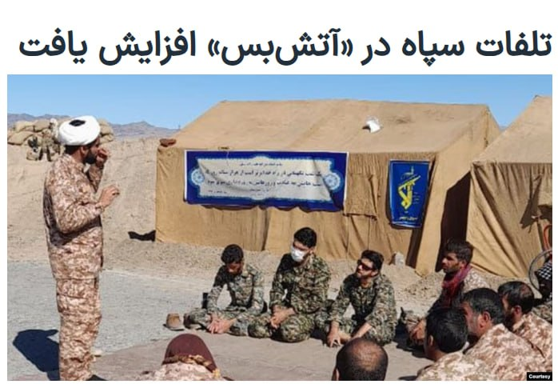

خبرگزاری جمهوری اسلامی، ایرنا، روز دوشنبه ۱۱ خرداد از کشته‌شدن دو سپاهی در قم خبر داد.

این خبرگزاری ادعا کرد که این دو بر اثر «انفجار پرتابه‌های باقی‌مانده از جنگ اخیر» کشته شده‌اند.

طبق این گزارش، سپاه این دو نفر را حسین رمضانیان فردویی و محمد اویسی معرفی و محل کشته شدن آن‌ها را منطقه فردو، در استان قم اعلام کرد.

با این آمار تعداد تلفات سپاه در دوره آتش‌بس جاری میان جمهوری اسلامی با آمریکا و اسرائیل، و در خارج از درگیری‌های اخیر، دستکم به ۱۶ نفر افزایش یافته است.
@VahidHeadline

📡 @VahidOnline

## VahidOnline — post 75859

  <a href="telegram/content/VahidOnline_75859_1780351121.mp4" target="_blank">🎬 Download video</a>

روابط عمومی سپاه اعلام کرد که در پی حمله ارتش آمریکا به کشتی ایرانی «لیان استار» در محدوده دریای عمان، نیروی دریایی سپاه طی یک عملیات مقابله به مثل، کشتی «ام‌اس‌سی. ساریسکا» با مالکیت «دشمن آمریکایی-اسرائیلی» را با موشک کروز مورد هدف قرار داد
IranIntlbrk

📡 @VahidOnline

## VahidOnline — post 75858

  

اعلام دونالد ترامپ مبنی بر موافقت بنیامین نتانیاهو با توقف گسیل نظامیان به بیروت، در شامگاه دوشنبه ۱۱ خرداد ماه، با واکنش منفی چند چهره شاخص سیاسی در اسرائیل مواجه شد.

ایتامار بن‌گویر، وزیر امنیت ملی اسرائیل، با انتقاد از این تصمیم گفت: «زمان آن رسیده که به ترامپ نه بگوییم.»

همزمان نفتالی بنت، نخست‌وزیر پیشین اسرائیل، نیز در پیامی دولت این کشور را به ناتوانی در حفظ امنیت متهم کرد. او با اشاره به حوادث امنیتی در اورشلیم، بیت‌شمش، لبنان و غزه نوشت: «مکان‌ها متفاوت هستند، اما داستان یکی است؛ دولتی که کنترل بر حاکمیت اسرائیل را از دست داده است.»
بنت همچنین گفت: «هرج‌ومرج در همه‌جا دیده می‌شود و ما امنیت را به شهروندان اسرائیل بازخواهیم گرداند.»

یائیر لاپید، رهبر مخالفان دولت اسرائیل، نیز با انتقاد از نتانیاهو، تصمیم او را «اعلام تبدیل اسرائیل به یک دولت تحت‌الحمایه کامل» توصیف کرد.
@VahidOOnLine
دفتر نخست‌وزیر اسرائیل در بیانیه‌ای به نقل از نتانیاهو اعلام کرد: «امشب با رئیس‌جمهوری ترامپ صحبت کردم و به او گفتم اگر حزب‌الله حمله به شهرها و شهروندان ما را متوقف نکند، اسرائیل اهداف تروریستی را در بیروت هدف قرار خواهد داد.»
نتانیاهو افزود: «موضع ما در این زمینه تغییری نکرده است.»

او همچنین تاکید کرد ارتش اسرائیل به عملیات خود در جنوب لبنان طبق برنامه ادامه خواهد داد.
@VahidOOnLine

📡 @VahidOnline

## VahidOnline — post 75857

  

قاآنی: ادامه حملات به لبنان و غزه، باب‌المندب را به تنگه هرمز تبدیل خواهد کرد

اسماعیل قاآنی، فرمانده نیروی قدس سپاه پاسداران، شامگاه دوشنبه ۱۱ خرداد ماه در پیامی که رسانه‌های دولتی ایران منتشر کرده‌اند، نوشت جنگ اسرائیل در لبنان و غزه «در سایه حمایت‌های وقیحانه آمریکا، عزم محور مقاومت را برای توسعه پشتیبانی‌ها از هر دو جبهه، اقدام برای فعال‌سازی سایر جبهه‌ها و همسان‌سازی وضعیت ترافیکی تنگه باب‌المندب با تنگه هرمز رقم خواهد زد.»

فرمانده نیروی قدس سپاه همچنین هشدار داد که ادامه عملیات اسرائیل در جنوب لبنان و غزه، این کشور را با واکنش‌های گسترده‌تری از سوی حزب‌الله و گروه‌های فلسطینی روبه‌رو خواهد کرد.
@VahidOOnLine

📡 @VahidOnline

## VahidOnline — post 75856

  

ترامپ: مذاکرات با جمهوری اسلامی ایران با سرعتی بالا ادامه دارد.
از توجه شما به این موضوع سپاسگزارم!

رئیس‌جمهور دونالد جی. ترامپ
realDonaldTrump
این دفعه گفت "جمهوری اسلامی ایران"

📡 @VahidOnline

## VahidOnline — post 75855

  

ترامپ: اسرائیل و حزب‌الله پذیرفتند حمله‌ها متوقف شود

ترجمه ماشین:
من تماس بسیار سازنده‌ای با نخست‌وزیر اسرائیل، بی‌بی نتانیاهو، داشتم و هیچ نیرویی به بیروت اعزام نخواهد شد؛ و هر نیرویی هم که در مسیر بوده، همین حالا بازگردانده شده است.
همچنین، از طریق نمایندگان بلندپایه، تماس بسیار خوبی با حزب‌الله داشتم و آن‌ها پذیرفتند که همه تیراندازی‌ها متوقف شود — اینکه اسرائیل به آن‌ها حمله نکند و آن‌ها هم به اسرائیل حمله نکنند.

رئیس‌جمهور دونالد جی. ترامپ
realDonaldTrump

📡 @VahidOnline

## VahidOnline — post 75854

  

ترامپ: محاصره را حفظ می‌کنیم

توییت‌های خبرنگار NBC، ترجمه ماشین:
تازه: رئیس‌جمهور ترامپ به من گفت که درباره گزارش‌ها مبنی بر تعلیق مذاکرات ایران با آمریکا، چیزی از ایران نشنیده است؛ اما اگر درست باشد، اشکالی ندارد:
«فکر می‌کنم اگر حقیقت را بخواهید، زیادی حرف زده‌ایم. به نظرم سکوت کردن خیلی خوب خواهد بود، و این می‌تواند برای مدتی طولانی باشد.»

او ادامه داد: «این به آن معنا نیست که قرار است برویم و همه‌جا آنجا بمب بریزیم. فقط سکوت می‌کنیم. محاصره را حفظ می‌کنیم. محاصره یک تکه فولاد است.»

آیا می‌تواند آن‌ها را آن‌قدر منتظر بگذارد تا کوتاه بیایند؟
«فکر می‌کنم تا هر وقت که بخواهند می‌توانم صبر کنم. آن‌ها دارند ثروت هنگفتی از دست می‌دهند...»

همچنین وقتی از نویسنده کتاب «هنر معامله» درباره گزارش‌های تعلیق مذاکرات پرسیدم به نظر می‌رسید با اکراه نوعی احترام برای مذاکره‌کنندگان ایرانی قائل است:
«این حرف مناسبی است، چون آن‌ها مذاکره‌کنندگان بهتری هستند تا جنگجو.»
GarrettHaake
الان هم:
ترامپ و نتانیاهو دارند تلفنی صحبت میکنند.
J74wabx

📡 @VahidOnline

## VahidOnline — post 75853

  

هم‌زمان با صدور هشدار تخلیه از سوی ارتش اسراییل برای ساکنان حومه جنوبی بیروت، فرمانده قرارگاه مرکزی خاتم‌الانبیا به ساکنان مناطق شمالی اسراییل هشدار داد که در صورت عملی شدن تهدیدهای اسراییل علیه لبنان، برای جلوگیری از آسیب، این مناطق را ترک کنند.

علی عبداللهی، فرمانده قرارگاه مرکزی خاتم‌الانبیا، اعلام کرد بنیامین نتانیاهو «در ادامه شرارت‌های خود در منطقه»، ضاحیه و بیروت را به بمباران تهدید کرده و برای ساکنان این مناطق هشدار تخلیه صادر کرده است.

او افزود: «با توجه به نقض مکرر آتش‌بس توسط اسراییل، در صورت عملی شدن این تهدید، به ساکنان بخش‌های شمالی و شهرک‌های نظامی در سرزمین‌های اشغالی هشدار می‌دهیم اگر نمی‌خواهند آسیب ببینند منطقه را ترک کنند.»
@VahidHeadline

📡 @VahidOnline

## VahidOnline — post 75852

  <a href="telegram/content/VahidOnline_75852_1780351122.mp4" target="_blank">🎬 Download video</a>

«حمید سلیمیان» در حال نواختن تنبک
#حمید_سلیمیان، متأهل و پدر یک پسر چهارماهه شامگاه ۱۸ دی‌ماه ۱۴۰۴ در جریان اعتراضات در زرین‌شهر اصفهان با شلیک مستقیم گلوله جنگی جان خود را از دست داد.
حمید سلیمیان راننده یکی از شرکت‌های فولاد بود و به گفته نزدیکانش به موسیقی علاقه فراوانی داشت او تنبک و سنتور می‌نواخت.
@VahidHeadline

📡 @VahidOnline

## VahidOnline — post 75843

هم‌زمان با تشدید حملات نظامی اسراییل به لبنان، مقام‌های جمهوری اسلامی بار دیگر تاکید کردند که هرگونه آتش‌بس میان ایران و آمریکا باید شامل همه جبهه‌های درگیری، به‌ویژه لبنان، باشد و هشدار دادند ادامه حملات به این کشور می‌تواند پیامدهایی در پی داشته باشد.

بنیامین نتانیاهو، نخست‌وزیر اسراییل، روز دوشنبه ۱۱ خرداد ۱۴۰۵، اعلام کرد که به ارتش این کشور دستور داده است اهداف متعلق به حزب‌الله در ضاحیه، حومه جنوبی بیروت، را هدف قرار دهد. او در یک پیام ویدیویی گفت: «هیچ وضعیتی وجود نخواهد داشت که حزب‌الله شهرها و شهروندان ما را هدف قرار دهد اما مقرهای تروریستی آن در ضاحیه بیروت از حمله مصون بماند.»

دفتر نخست‌وزیر اسراییل در بیانیه‌ای اعلام کرد نتانیاهو و یسراییل کاتس، وزیر دفاع این کشور، در پی آنچه «نقض مکرر آتش‌بس از سوی حزب‌الله» و «حملات علیه شهرها و شهروندان اسراییل» خوانده شده، به ارتش دستور حمله به «اهداف تروریستی» در حومه جنوبی بیروت را داده‌اند.

نتانیاهو همچنین گفت عملیات زمینی ارتش اسراییل در لبنان در حال گسترش است. اسراییل در جنوب لبنان منطقه‌ای امنیتی ایجاد کرده و می‌گوید هدف از آن جلوگیری از حملات حزب‌الله به مناطق شمالی این کشور است.

در واکنش به این تحولات، عباس عراقچی، وزیر امور خارجه جمهوری اسلامی، در شبکه ایکس نوشت: «آتش‌بس میان ایران و آمریکا، بدون هیچ ابهامی، آتش‌بسی در تمام جبهه‌ها، از جمله لبنان، است.» او افزود نقض آتش‌بس در هر جبهه‌ای «به معنای نقض آتش‌بس در تمامی جبهه‌ها» خواهد بود.
عراقچی همچنین آمریکا و اسراییل را مسوول پیامدهای هرگونه نقض این آتش‌بس دانست. جمهوری اسلامی پیش از این نیز بارها اعلام کرده بود که آتش‌بس میان ایران و آمریکا باید سایر جبهه‌های درگیری، به‌ویژه لبنان، را نیز در بر بگیرد.

ابوالفضل شکارچی، سخنگوی نیروهای مسلح جمهوری اسلامی، نیز به اسراییل هشدار داد که «تداوم جنایات در لبنان برای نیروهای مسلح ایران قابل تحمل نخواهد بود.»

هم‌زمان، محمدباقر قالیباف، رییس مجلس شورای اسلامی و رییس هیات مذاکره‌کننده ایران با آمریکا، با اشاره به آنچه «محاصره دریایی و تشدید جنایات جنگی در لبنان» خواند، این اقدامات را «شواهد آشکار عدم پایبندی آمریکا به آتش‌بس» توصیف کرد.
قالیباف در پیامی به زبان انگلیسی در شبکه ایکس، بدون اشاره به جزییات بیشتر، نوشت: «هر انتخابی بهایی دارد و زمان پرداخت آن فرا می‌رسد. همه‌چیز در نهایت سر جای خود قرار خواهد گرفت.»

این اظهارات در حالی مطرح می‌شود که عملیات نظامی اسراییل علیه حزب‌الله، از گروه‌های مورد حمایت جمهوری اسلامی در منطقه، شدت گرفته است. با وجود تاکید مکرر تهران بر ضرورت گنجاندن لبنان در هر توافق آتش‌بس میان ایران و آمریکا، این مطالبه تاکنون محقق نشده است.
اسماعیل بقایی، سخنگوی وزارت امور خارجه جمهوری اسلامی، نیز روز دوشنبه در نشست خبری هفتگی خود گفت: «ما تاکید کردیم و کماکان تاکید داریم بر این نکته که آتش‌بس در لبنان بخش لاینفک هرگونه آتش‌بس و هرگونه توافق نهایی برای خاتمه جنگ است.»
او همچنین حملات اسراییل به لبنان را از عوامل ایجاد تاخیر در روند دیپلماتیک برای پایان دادن به جنگ میان ایران و آمریکا دانست و بار دیگر بر ضرورت برقراری آتش‌بس در لبنان به عنوان بخشی جدایی‌ناپذیر از هر توافق نهایی تاکید کرد.
@VahidHeadline
تازه‌تر:
خبرگزاری تسنیم، وابسته به سپاه پاسداران، گزارش داد که جمهوری اسلامی در واکنش به ادامه حملات اسراییل به لبنان و آنچه «نقض آتش‌بس در همه جبهه‌ها» خوانده شده، روند گفت‌وگوها و تبادل پیام با آمریکا از طریق میانجی‌ها را متوقف خواهد کرد.
تسنیم همچنین مدعی شده است که ایران و گروه‌های هم‌پیمان آن در «جبهه مقاومت» در حال بررسی اقداماتی از جمله انسداد تنگه هرمز و فعال‌سازی سایر جبهه‌ها از جمله تنگه باب‌المندب هستند. این گزارش می‌گوید این اقدامات با هدف واکنش به حملات اسراییل و حامیان آن در دستور کار قرار گرفته است.
@VahidHeadline
ارتش اسرائیل در بیانیه‌ای به ساکنان منطقه ضاحیه در جنوب بیروت هشدار داد و از آن‌ها خواست برای حفظ جان خود این منطقه را تخلیه کنند.
در این بیانیه آمده است اگر حزب‌الله به شلیک راکت به سوی شهرها و شهرک‌های اسرائیل ادامه دهد، ارتش اسرائیل اهدافی را در ضاحیه جنوبی هدف قرار خواهد داد.
در ادامه تاکید شده است دولت اسرائیل با مردم لبنان در حال جنگ نیست، بلکه با سازمان تروریستی حزب‌الله می‌جنگد.
@VahidOOnLine
در پی اعلام خبرگزاری تسنیم مبنی بر توقف «گفتگوها و تبادل متون از طریق میانجی» میان تهران و واشنگتن، بهای جهانی نفت بیش از ۵ درصد افزایش یافت و به بالاترین سطح خود در هفته‌های اخیر رسید.
@VahidOOnLine

📡 @VahidOnline

## IranIntlTV — post 340116

  <a href="telegram/content/IranIntlTV_340116_1780351123.mp4" target="_blank">🎬 Download video</a>

ویدیویی که به‌تازگی از تصاویر دوربین مداربسته پالایشگاه عسلویه در شبکه‌های اجتماعی منتشر شده، نشان می‌دهد اسرائیل و آمریکا در جنگ اخیر، در حمله به این پالایشگاه، نقطه‌زنی کرده‌اند.

گزارش‌های منتشرشده حاکی است این تصاویر مربوط به شرکت‌های مستقر در سایت پتروشیمی منطقه پارس است.

نفت آنلاین، رسانه صنعت نفت ایران، در پی انتشار این ویدیو خواستار برخورد شدید نهادهای امنیتی با منتشرکنندگان آن و برکناری مدیرعامل شرکت صاحب این دوربین شد.
@iranintltv

## IranIntlTV — post 340115

  <a href="telegram/content/IranIntlTV_340115_1780351124.mp4" target="_blank">🎬 Download video</a>

فرماندهی مرکزی آمریکا اعلام کرد نیروهای این کشور دو موشک بالستیک شلیک‌شده از سوی جمهوری اسلامی به سمت پایگاه‌های آمریکا در کویت را رهگیری و منهدم کردند. سنتکام گفت هیچ نیروی آمریکایی آسیب ندید. مصر، قطر و عربستان نیز این حمله را محکوم کردند.
@iranintltv

## IranIntlTV — post 340114

  <a href="telegram/content/IranIntlTV_340114_1780351125.mp4" target="_blank">🎬 Download video</a>

مراد ویسی، تحلیل‌گر ارشد ایران‌اینترنشنال، گفت: «بعد از ضربات شدید جنگ‌های ۱۲ روزه و ۴۰ روزه جمهوری اسلامی تقریبا تبدیل به یک حکومت زیر‌زمینی شده است. رهبر جدید هنوز پنهان است و رونمایی نشده و بسیاری از مقامات و فرماندهان ارشد هم زندگی مخفیانه دارند و اکثر اوقات در مخفیگاه‌ها هستند. نهادهای حکومتی نیز کارکرد عادی خود را از دست داه‌اند.»
@iranintltv

## IranIntlTV — post 340113

  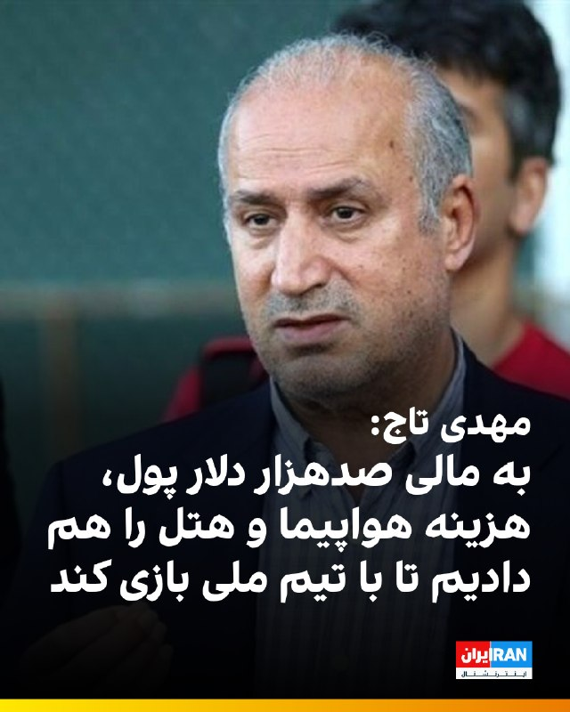

🔻‌مهدی تاج، رییس فدراسیون فوتبال در گفتگویی تلویزیونی گفت که برای بازی تدارکاتی تیم ملی با مالی،‌ چندین صد هزار دلار پرداخت شده است: «ما ۱۰۰ هزار دلار به مالی دادیم که بیاید، پول هواپیمایشان را دادیم، پول هتلشان را هم دادیم. در این شرایط بازی هماهنگ کردن خیلی سخت است.»

🔹تیم ملی فوتبال در مسیر آماده‌سازی برای جام جهانی، بازی تدارکاتی مناسبی نداشته است؛ پس قرعه‌کشی فدراسیون فوتبال مدعی شد با اسپانیا و پرتغال دیدار دوستانه خواهد داشت، اما در پی جنگ ایران، این مسابقات از سوی این دو کشور لغو شد، پس از این گفته شد مقدونیه و آنگولا حریفان تدارکاتی تیم ملی هستند که آنها هم این بازی را لغو کردند.

🔹در پی این اتفاقات، تیم ملی ۴ بار با خودش بازی کرد و در نهایت در اردوی آنتالیا، با گامبیا، تیم ۱۱۶ دنیا بازی کرد.

🔹تیم ملی تاکنون نتوانسته با هیچ کدام از تیم‌های راه‌یافته به جام جهانی ۲۰۲۶ بازی کند.

🔹فدراسیون فوتبال اعلام کرده بازی با مالی، پنجشنبه ۱۴ خرداد در آنتالیا برگزار خواهد شد.

@iranintltvsport

## IranIntlTV — post 340112

  

روابط عمومی نیروی دریایی سپاه اعلام کرد که در پی حمله ارتش آمریکا به کشتی ایرانی «لیان استار» در محدوده دریای عمان، نیروی دریایی سپاه طی یک عملیات مقابله به مثل، کشتی «ام‌اس‌سی. ساریسکا» با مالکیت «دشمن آمریکایی-اسرائیلی» را با موشک کروز مورد هدف قرار داد.
https://iranintl.com/202606012218

## IranIntlTV — post 340111

  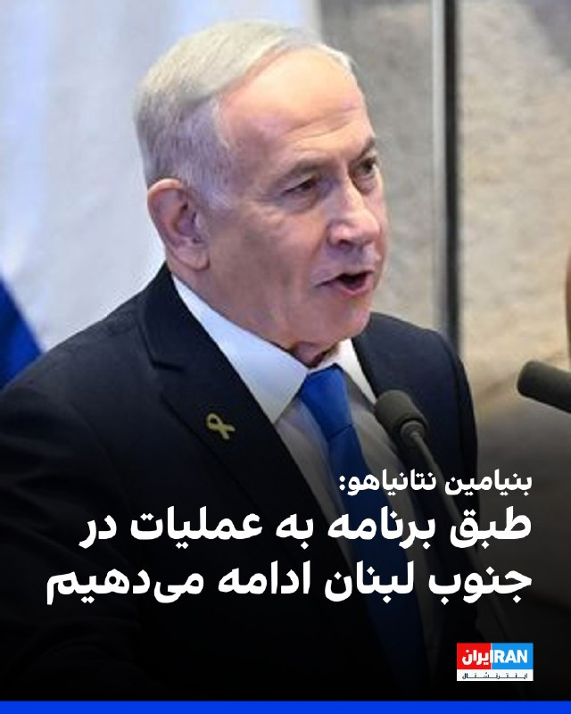

بنیامین نتانیاهو، نخست‌وزیر اسرائیل، در شبکه ایکس نوشت: با ترامپ گفت‌وگو کردم و به او گفتم اگر حزب‌الله حملات خود به شهرها و غیرنظامیان ما را متوقف نکند، اسرائیل اهداف «تروریستی» را در بیروت هدف قرار خواهد داد.
او افزود: این موضع ما همچنان پابرجاست و همزمان ارتش اسرائیل طبق برنامه، به عملیات خود در جنوب لبنان ادامه می‌دهد.
https://iranintl.com/202606016655

## IranIntlTV — post 340110

  <a href="telegram/content/IranIntlTV_340110_1780351128.mp4" target="_blank">🎬 Download video</a>

ویدیوی دریافت‌شده نشان می‌دهد جمعی از ایرانیان ساکن شهر رجاینا در ساسکاچوان کانادا، روز یک‌شنبه ۱۰ خرداد، در حمایت از مردم ایران علیه اعدام‌های جمهوری اسلامی، شعار «اعدام را در ایران متوقف کنید» را روی پل آلبرت در این شهر، برای جلب توجه عابران و جامعه جهانی به نمایش درآوردند.
@iranintltv

## IranIntlTV — post 340109

  <a href="https://t.me/IranintlTV/340109" target="_blank">📎 Download file</a>

🎧نسخه صوتی ۲۴ با فرداد فرحزاد: افزایش احتمال بازگشت درگیری‌ها پس از هشدارهای تازه تهران
@iranintlTV

## IranIntlTV — post 340108

  

ایتامار بن‌گویر، وزیر امنیت داخلی اسرائیل، در شبکه ایکس خطاب به بنیامین نتانیاهو نوشت: «آقای نخست‌وزیر، شما گفتید یک نخست‌وزیر قوی زمانی که ممکن باشد به رییس‌جمهور ایالات متحده "بله" می‌گوید و زمانی که لازم باشد "نه".»
او افزود: «اکنون زمان آن است که به دوست‌مان، رییس‌جمهور ترامپ، "نه" بگویید. اکنون زمان آن است که آنچه لازم و ضروری است انجام شود؛ به حزب‌الله ضربه بزنیم، دست رزمندگان‌مان را باز بگذاریم و امنیت را به شمال بازگردانیم.»
https://iranintl.com/202606019640

## IranIntlTV — post 340107

  <a href="telegram/content/IranIntlTV_340107_1780351129.mp4" target="_blank">🎬 Download video</a>

همزمان با ادامه تبادل پیام‌ها میان تهران و واشینگتن، حملات متقابل جمهوری اسلامی و آمریکا در منطقه ادامه دارد. سنتکام از رهگیری دو موشک بالستیک شلیک‌شده از سوی جمهوری اسلامی به سمت پایگاه‌های آمریکا در کویت خبر داد.

گفت‌وگو با علیرضا نوری‌زاده، مدیر مرکز پژوهش‌های ایران و عرب
@iranintltv

## IranIntlTV — post 340106

  <a href="telegram/content/IranIntlTV_340106_1780351131.mp4" target="_blank">🎬 Download video</a>

دونالد ترامپ گفت با وجود هشدارهای مطرح‌شده در تهران درباره توقف مذاکرات، گفت‌وگو با جمهوری اسلامی با سرعت در جریان است. همزمان، تسنیم نوشت جمهوری اسلامی در واکنش به عملیات اسرائیل در لبنان، تبادل پیام با آمریکا را متوقف می‌کند.

گفت‌وگو با علیرضا نامور حقیقی، تحلیل‌گر سیاسی
@iranintltv

## IranIntlTV — post 340105

  <a href="telegram/content/IranIntlTV_340105_1780351133.mp4" target="_blank">🎬 Download video</a>

جنون تازه سپاه برای نجات حزب‌الله به قیمت ویرانی ایران

چشم‌انداز با مهدی مهدوی‌آزاد

نسخه کامل این برنامه در یوتیوب:
https://youtu.be/l-gagx4Mdhg
@iranintltv

## IranIntlTV — post 340104

  <a href="https://t.me/IranintlTV/340104" target="_blank">📎 Download file</a>

🎧نسخه صوتی چشم‌انداز: جنون تازه سپاه برای نجات حزب‌الله به قیمت ویرانی ایران
@iranintlTV

## IranIntlTV — post 340103

  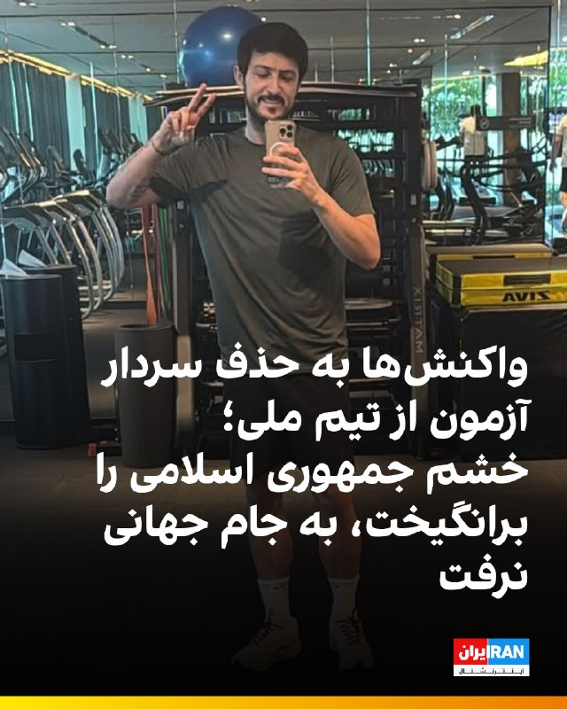

🔻‌بی‌بی‌سی اسپرت در گزارشی درباره تیم ملی، با اشاره به غیبت نام سردار آزمون در لیست نهایی امیر قلعه‌نویی برای جام جهانی ۲۰۲۶، نوشت: «سردار آزمون از فهرست تیم ملی برای جام جهانی کنار گذاشته شد؛ این مهاجم که برای شباب الاهلی امارات بازی می‌کند، خشم حاکمیت را برانگیخته است.»

🔹در گزارش دیگری، سایت اتلتیک نیز با اشاره به حذف سردار آزمون از تیم ملی نوشته است: «آزمون که در ۹۱ بازی ملی ۵۷ گل به ثمر رسانده، پیش‌تر نیز در فهرست اولیه قرار نگرفته بود و قلعه‌نویی، سرمربی تیم ملی با وجود درخواست معاون رئیس‌جمهور، برای بازگشت این مهاجم، تصمیم خود را تغییر نداد.»

🔹سایت ای‌اس‌پی‌ان نیز که با تیتر «ستاره ایران، سردار آزمون، در فهرست نهایی جام جهانی جایی ندارد» لیست سرمربی تیم ملی برای جام جهانی را بررسی کرده است، به خشم جمهوری اسلامی از سردار به دلیل انتشار یک عکس در فضای مجازی اشاره می‌کند.

🔹رویترز هم در گزارش دیگری می‌نویسد: «رسانه‌های داخلی گزارش دادند که دلیل حذف سردار توسط امیر قلعه‌نویی، اقدامی تعبیرشده به بی‌وفایی نسبت به حکومت بوده است.»

گزارش کامل را در سایت بخوانید.

@iranintltvsport

## IranIntlTV — post 340102

  

«دانشجویان متحد» به نقل از کانال «علامه آزاد»، گزارش داد علی خضریان، نماینده مجلس و دانشجوی دکتری علوم سیاسی دانشگاه علامه طباطبایی، در آزمون جامع دکتری پاییز ۱۴۰۳ با وجود تحویل برگه‌ای که گفته می‌شود بدون پاسخ بوده، پذیرفته شده است.
طبق این گزارش، پذیرش او با ضوابط آموزشی آزمون جامع دکتری سازگار نبوده و تاکنون توضیح رسمی در این‌باره ارائه نشده است.
دانشجویان متحد نوشت جواد شقاقی، دانشجوی دکتری علوم سیاسی دانشگاه علامه طباطبایی، در اعتراض به تخلف آموزشی خضریان و همکاری گروه علوم سیاسی دانشگاه با این رفتار، به سوالات آزمون جامع دکتری پاسخ نداد. گروه علوم سیاسی، اعتراض این دانشجو را وارد ندانسته و او را از تحصیل محروم کرد.
بر اساس این گزارش، گروه علوم سیاسی در واکنش به این اعتراض، گفته که گروه صلاح دانسته از خضریان سوالی نپرسد و به برگه سفید او نمره بدهد.
دانشجویان متحد اضافه کرد شقاقی که تا دوره پیش از جنگ در خوابگاه دانشگاه علامه طباطبایی اقامت داشت به تازگی برای پیگیری وضعیت تحصیلی خود به خوابگاه مراجعه کرد اما با ممانعت حراست برای ورود مواجه شد و مجبور شد چند شب را در مقابل درب خوابگاه بخوابد.
https://iran

## IranIntlTV — post 340101

  <a href="telegram/content/IranIntlTV_340101_1780351135.mp4" target="_blank">🎬 Download video</a>

۲۴ با فرداد فرحزاد
@iranintltv

## IranIntlTV — post 340100

  

محمد کرمی، فرمانده نیروی زمینی سپاه، از «آمادگی ۱۰۰ درصدی» این نیرو برای مقابله با تهدیدات خبر داد و گفت: «سطح آمادگی نیرو‌های مسلح امروز حتی از زمان آغاز جنگ اخیر نیز فراتر رفته است.»

او افزود: «هیچ مشکلی در سطح نیرو وجود ندارد و برای مقابله با هرگونه تهدید و نبرد زمینی در آمادگی کامل هستیم.»
https://iranintl.com/202606015072

## IranIntlTV — post 340099

  <a href="telegram/content/IranIntlTV_340099_1780351137.mp4" target="_blank">🎬 Download video</a>

شبکه خبری السومریه روز دوشنبه از انفجار در یک کشتی باری با پرچم پاناما پس از پایان تخلیه محموله خود در نزدیکی بندر ام‌القصر در آب‌های سرزمینی عراق خبر داد.

به گزارش این شبکه، مقام‌های امنیتی انفجار در کشتی MSC SARISKA V را ناشی از نقص فنی اعلام کردند. با این حال، سازمان عملیات تجارت دریایی بریتانیا (UKMTO) اعلام کرد گزارشی دریافت کرده که بر اساس آن، یک کشتی باری در خلیج فارس و در حدود ۴۰ مایل دریایی جنوب‌شرقی ام‌القصر، با یک پرتابه ناشناس هدف قرار گرفته است.
@iranintltv

## IranIntlTV — post 340098

  

علی‌اکبر ولایتی، مشاور رهبر جمهوری اسلامی در شبکه اجتماعی ایکس نوشت که بمباران ضاحیه و نقض آتش‌بس، عجله اسرائیل برای پایان دادن به تاریخ خود است.

ولایتی افزود: شما آغاز کردید، اما برخلاف انفعال تماشاچیان منطقه، جمهوری اسلامی و جبهه مقاومت تا آخر کنار مردم عزیز لبنان، از مسلمان تا مارونی ایستاده است.
https://iranintl.com/202606011355

## IranIntlTV — post 340097

  <a href="https://t.me/IranintlTV/340097" target="_blank">📎 Download file</a>

🎧نسخه صوتی تیتراول با نیوشا صارمی: مذاکرات متوقف شد؛ تنش چند جبهه‌ای در منطقه؛هشدار تخلیه همزمان اسرائیل و سپاه
@iranintlTV

## Shin_Persian — post 6383

Open Source Intel ✓ @Osint613
Mon, 01 Jun 2026 20:41:36 UTC

British Airways suspends all flights to Israel until October 24.

فارسی

بریتیش ایرویز تمامی پروازهای خود به اسرائیل را تا ۲۴ اکتبر به حالت تعلیق درآورد.

𝕏 · @shin_persian

## Shin_Persian — post 6382

  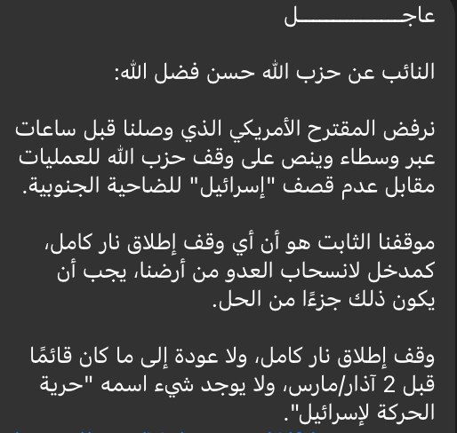

🔁 Quoting above tweet: Shin ✓ @hey_itsmyturn Mon, 01 Jun 2026 21:14:21 UTC Hezbollah MP Hassan Fadlallah: "We reject the American proposal, received hours ago through intermediaries, which stipulates a cessation of Hezbollah operations in exchange for Israel…

## Shin_Persian — post 6381

🔁 Quoting above tweet:
Shin ✓ @hey_itsmyturn
Mon, 01 Jun 2026 21:14:21 UTC

Hezbollah MP Hassan Fadlallah:

"We reject the American proposal, received hours ago through intermediaries, which stipulates a cessation of Hezbollah operations in exchange for Israel not bombing the southern suburbs.

Our steadfast position is that any comprehensive ceasefire, as a pathway for the enemy's withdrawal from our land, must be part of the solution.

A complete ceasefire, no return to the pre-March 2nd status quo, and no such thing as 'freedom of movement for Israel'. "

[Source: Hezballah-affiliated Telegram channels]

فارسی

حسن فضل‌الله، نماینده پارلمان از فراکسیون حزب‌الله:

«ما پیشنهاد آمریکا را که ساعاتی پیش از طریق میانجی‌ها دریافت شد و بر توقف عملیات حزب‌الله در ازای عدم بمباران ضاحیه جنوبی توسط اسرائیل تصریح دارد، رد می‌کنیم.

موضع استوار ما این است که هرگونه آتش‌بس جامع، به عنوان مسیری برای عقب‌نشینی دشمن از خاک ما، باید بخشی از راه حل باشد.

آتش‌بس کامل، عدم بازگشت به وضعیت پیش از ۲ مارس، و چیزی به نام "آزادی عمل برای اسرائیل" وجود نخواهد داشت.»

[منبع: کانال‌های تلگرامی وابسته به حزب‌الله]

𝕏 · @shin_persian

## Shin_Persian — post 6380

  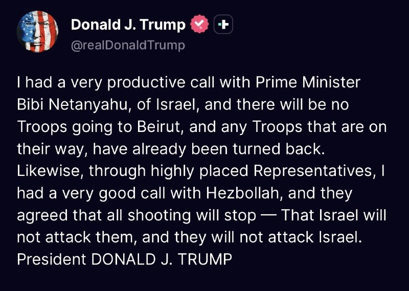

↩️ Quoted tweet: Open Source Intel ✓ @Osint613 Mon, 01 Jun 2026 17:32:55 UTC Trump: “I had a very productive call with Prime Minister Bibi Netanyahu, of Israel, and there will be no Troops going to Beirut, and any Troops that are on their way, have already…

## Shin_Persian — post 6379

↩️ Quoted tweet:
Open Source Intel ✓ @Osint613
Mon, 01 Jun 2026 17:32:55 UTC

Trump: “I had a very productive call with Prime Minister Bibi Netanyahu, of Israel, and there will be no Troops going to Beirut, and any Troops that are on their way, have already been turned back. Likewise, through highly placed Representatives, I had a very good call with

↩️ توییت نقل‌قول شده — برای پاسخ، پست زیر را ببینید.

فارسی

ترامپ: «من تماس بسیار سازنده‌ای با بی‌بی نتانیاهو، نخست‌وزیر اسرائیل داشتم و هیچگونه نیروی نظامی (نیروهای ارتش) به بیروت اعزام نخواهد شد، و هر نیرویی که در راه بوده، در حال حاضر بازگردانده شده است. به همین ترتیب، از طریق نمایندگان عالی‌رتبه، تماس بسیار خوبی با...»

𝕏 · @shin_persian

## Shin_Persian — post 6378

  

Shin ✓ @hey_itsmyturn
Mon, 01 Jun 2026 20:54:47 UTC

Sirens in Shlomi, #Israel 🇮🇱

فارسی

آژیرهای خطر در شلومی، #Israel 🇮🇱

𝕏 · @shin_persian

## Shin_Persian — post 6377

  

Shin ✓ @hey_itsmyturn
Mon, 01 Jun 2026 20:38:42 UTC

Looks like Hezbollah heard Trump loud and clear.
Sirens in Metula, #Israel 🇮🇱

فارسی

به نظر می‌رسد حزب‌الله پیام ترامپ را رسا و واضح شنیده است.
آژیرهای خطر در متولا، #Israel 🇮🇱

𝕏 · @shin_persian

## Shin_Persian — post 6375

Shin ✓ @hey_itsmyturn Mon, 01 Jun 2026 19:02:58 UTC Regime media report last night 2 IRGC's Basij terrorists were killed following the detonation of UXO in a "military position" in Qom Province 1. Hossein Ramezanian Fordoii 2. Mohammad Oveisi Fordoii …

## Shin_Persian — post 6374

Shin ✓ @hey_itsmyturn
Mon, 01 Jun 2026 19:02:58 UTC

Regime media report last night 2 IRGC's Basij terrorists were killed following the detonation of UXO in a "military position" in Qom Province

1. Hossein Ramezanian Fordoii
2. Mohammad Oveisi Fordoii

Yet, I have 2 different names:
Both from IRGC QF's 840th unit (weird huh? QF operates out of Iran, not inside the country)
1. Ali Qomi
2. Sorush Mohammadi

#Iran

فارسی

رسانه‌های رژیم گزارش می‌دهند که شب گذشته ۲ تروریست بسیج سپاه پاسداران (IRGC) در پی انفجار مهمات عمل‌نکرده (UXO) در یک «موضع نظامی» در استان قم کشته شدند.

۱. حسین رمضانیان فردویی
۲. محمد اویسی فردویی

با این حال، من ۲ نام متفاوت دارم:
هر دو از واحد ۸۴۰ نیروی قدس سپاه پاسداران (عجیبه نه؟ نیروی قدس خارج از ایران فعالیت می‌کند، نه داخل کشور)
۱. علی قمی
۲. سروش محمدی

#Iran

𝕏 · @shin_persian

## Shin_Persian — post 6373

🔁 Quoting above tweet:
Shin ✓ @hey_itsmyturn
Mon, 01 Jun 2026 18:33:09 UTC

THE PRESIDENT OF THE UNITED STATES OF AMERICA had a "VERY GOOD CALL WITH HEZBOLLAH", which is a designated FTO (Foreign Terror Organization)
(https://www.state.gov/foreign-terrorist-organizations)

Cool.

فارسی

رئیس‌جمهور ایالات متحده آمریکا یک «تماس بسیار خوب با حزب‌الله» داشت، که یک FTO (سازمان تروریستی خارجی) تعیین شده است.
(https://www.state.gov/foreign-terrorist-organizations)

عالیه.

𝕏 · @shin_persian

## Shin_Persian — post 6372

  

↩️ Quoted tweet: Open Source Intel ✓ @Osint613 Mon, 01 Jun 2026 17:32:55 UTC Trump: “I had a very productive call with Prime Minister Bibi Netanyahu, of Israel, and there will be no Troops going to Beirut, and any Troops that are on their way, have already…

## Shin_Persian — post 6371

↩️ Quoted tweet:
Open Source Intel ✓ @Osint613
Mon, 01 Jun 2026 17:32:55 UTC

Trump: “I had a very productive call with Prime Minister Bibi Netanyahu, of Israel, and there will be no Troops going to Beirut, and any Troops that are on their way, have already been turned back. Likewise, through highly placed Representatives, I had a very good call with

↩️ توییت نقل‌قول شده — برای پاسخ، پست زیر را ببینید.

فارسی

ترامپ: «من تماس بسیار سازنده‌ای با بی‌بی نتانیاهو، نخست‌وزیر اسرائیل داشتم و هیچ نیروی نظامی به بیروت اعزام نخواهد شد و هر نیرویی که در راه است، پیش‌تر بازگردانده شده است. به همین ترتیب، از طریق نمایندگان عالی‌رتبه، تماس بسیار خوبی با مابقی داشتم...»

𝕏 · @shin_persian

## Shin_Persian — post 6370

  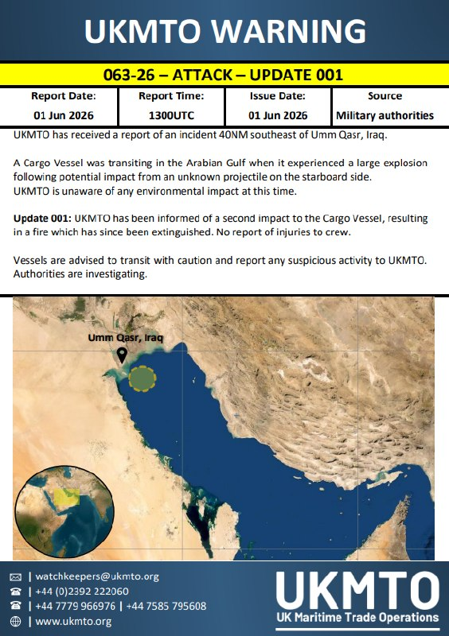

UKMTO Operations Centre @UK_MTO
Mon, 01 Jun 2026 18:17:29 UTC

UKMTO WARNING 063-26 UPDATE 001

Click here to view the full warning⤵️
http://www.ukmto.org/-/media/ukmto/products/20260601-ukmto_warning_063-update_001.pdf?rev=759b918daac243ee8b0c2004571f13ba

#MaritimeSecurity #MarSec

فارسی

هشدار یو‌کی‌ام‌تی‌او (UKMTO) ۰۶۳-۲۶ به‌روزرسانی ۰۰۱

برای مشاهده متن کامل هشدار اینجا کلیک کنید⤵️
http://www.ukmto.org/-/media/ukmto/products/20260601-ukmto_warning_063-update_001.pdf?rev=759b918daac243ee8b0c2004571f13ba

#MaritimeSecurity #MarSec

𝕏 · @shin_persian

## Shin_Persian — post 6369

Shin ✓ @hey_itsmyturn
Mon, 01 Jun 2026 18:15:39 UTC

Jet activity over Tehran,
Tehran Province, #Iran

فارسی

فعالیت جنگنده‌ها بر فراز تهران،
استان تهران، #Iran

𝕏 · @shin_persian

## Shin_Persian — post 6367

  

Shin ✓ @hey_itsmyturn
Mon, 01 Jun 2026 17:45:43 UTC

President Trump @POTUS:
"Talks are continuing, at a rapid pace, with the Islamic Republic of Iran. Thank you for your attention to this matter! President DONALD J. TRUMP"

فارسی

رئیس‌جمهور ترامپ @POTUS:

«گفتگوها با جمهوری اسلامی ایران با سرعتی بالا در حال انجام است. از توجه شما به این موضوع سپاسگزارم! رئیس‌جمهور دونالد جی. ترامپ»

𝕏 · @shin_persian

## Shin_Persian — post 6366

  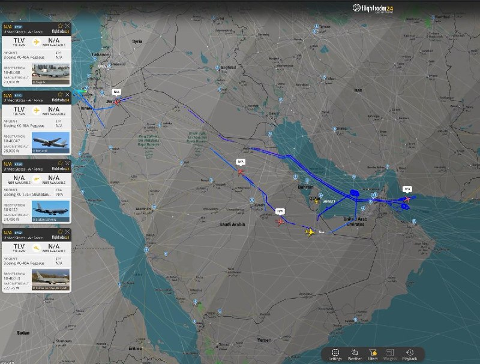

Shin ✓ @hey_itsmyturn
Mon, 01 Jun 2026 16:32:32 UTC

#USAF 🇺🇸 Tankers in the region as of 1631Z:

KC-46A (AE5F9B | 18-46048)
KC-46A (AE5F9A | 18-46047)
KC-135R (AE0628 | 58-0122)
KC-46A (AE5FA0 | 18-46053)

فارسی

#USAF (نیروی هوایی ایالات متحده) 🇺🇸 تانکرهایی در منطقه تا ساعت ۱۶۳۱Z (۲۰:۰۱ به وقت تهران):

KC-46A (AE5F9B | 18-46048)
KC-46A (AE5F9A | 18-46047)
KC-135R (AE0628 | 58-0122)
KC-46A (AE5FA0 | 18-46053)

𝕏 · @shin_persian

## Shin_Persian — post 6365

Shin ✓ @hey_itsmyturn
Mon, 01 Jun 2026 16:17:13 UTC

IRGC Khatam Al Anbiya's terror commander, ‌Brigadier General Abdollahi:
"Benjamin Netanyahu, in a continued escalation of his regional aggressions, has threatened to bomb Dahiya and Beirut and issued an evacuation warning to their residents.
Considering the regime's repeated violations of the ceasefire, if this threat is actualized, we warn residents of the northern sectors and military settlements in the occupied territories to evacuate the area if they wish to avoid harm."

#Iran

فارسی

سردار سرتیپ عبداللهی، فرمانده تروریستی قرارگاه خاتم‌الانبیا سپاه پاسداران (IRGC):
«بنیامین نتانیاهو در ادامه تشدید تجاوزات منطقه‌ای خود، تهدید به بمباران ضاحیه و بیروت کرده و هشدار تخلیه برای ساکنان آن‌ها صادر نموده است.
با توجه به نقض مکرر آتش‌بس توسط این رژیم، در صورت عملی شدن این تهدید، به ساکنان بخش‌های شمالی و شهرک‌های نظامی در اراضی اشغالی هشدار می‌دهیم که اگر می‌خواهند آسیبی نبینند، منطقه را تخلیه کنند.»

#Iran

𝕏 · @shin_persian

## Shin_Persian — post 6364

🔁 Quoting above tweet:
Shin ✓ @hey_itsmyturn
Mon, 01 Jun 2026 16:06:57 UTC

U.S. forces are enforcing a blockade against Iran. As of June 1, CENTCOM has redirected 121 commercial vessels and disabled 5 others to ensure compliance.

Source: @CENTCOM
https://x.com/CENTCOM/status/2061479583631741344

فارسی

نیروهای ایالات متحده در حال اجرای محاصره علیه ایران هستند. تا تاریخ ۱ ژوئن، سنتکام (فرماندهی مرکزی ایالات متحده) ۱۲۱ کشتی تجاری را تغییر مسیر داده و ۵ فروند دیگر را برای اطمینان از پایبندی، متوقف کرده است.

منبع: @CENTCOM
https://x.com/CENTCOM/status/2061479583631741344

𝕏 · @shin_persian

## Shin_Persian — post 6363

  <a href="telegram/content/Shin_Persian_6363_1780351142.mp4" target="_blank">🎬 Download video</a>

↩️ Quoted tweet: U.S. Central Command ✓ @CENTCOM Mon, 01 Jun 2026 16:06:47 UTC Thousands of U.S. service members at sea, in the skies, and from land are supporting the ongoing U.S. blockade against Iran. As of June 1, CENTCOM forces have redirected 121 commercial…

## reutersworldchannel — post 151527

  

Iran halting indirect talks with US over Israel's Lebanon incursion, Tasnim says

ran is halting indirect negotiations with the U.S. ​after Israel ordered troops to push deeper into Lebanon to battle Tehran-backed Hezbollah, the Iranian news agency Tasnim said on Monday, complicating diplomatic efforts to end three months of war.

Tasnim said the Islamic Republic's ‌negotiating team was stopping exchanging messages with Washington through mediators over attacks on Lebanon, where the U.S.-Israeli war against Iran has reignited Israel's conflict with Hezbollah. read more

## ManotoTV — post 105898

  <a href="telegram/content/ManotoTV_105898_1780351145.mp4" target="_blank">🎬 Download video</a>

سخنان عزت‌الله همایون‌فر، ادیب و سیاستمدار، درباره روحیه قوی ملت ایران و ریشه‌های آن در سی قرن تاریخ کشور

## FarsiVOA — post 219323

🔺دونالد ترامپ به‌ ای‌بی‌سی نیوز: احتمال دارد تفاهم‌نامه با جمهوری اسلامی هفته آینده امضا شود؛ مشکلی امروز پیش آمد که برطرف شد

▪️دونالد ترامپ، رئیس‌جمهوری آمریکا گفت این احتمال وجود دارد که هفته آینده با جمهوری اسلامی توافقی برای تمدید آتش‌بس و بازگشایی تنگه هرمز امضا شود.

⬇️ بیشتر بخوانید:
https://ir.voanews.com/a/8156190.html
@FarsiVOA

## FarsiVOA — post 219322

  <a href="telegram/content/FarsiVOA_219322_1780351146.mp4" target="_blank">🎬 Download video</a>

⚡️فلاکت اقتصادی، فرسایش اجتماعی در ایران؛ گفت‌وگو با امین قضایی
@FarsiVOA

## FarsiVOA — post 219321

  <a href="telegram/content/FarsiVOA_219321_1780351147.mp4" target="_blank">🎬 Download video</a>

⚡️تشدید سرکوب دانشجویان و ادامه بی‌وقفه اعدام‌ها؛ واکنش کاربران شبکه‌های اجتماعی
@FarsiVOA

## FarsiVOA — post 219320

🔺قانون‌گذار آمریکایی: ۸۰ درصد مردم ایران از جمهوری اسلامی متنفرند؛ اگر رژیم اورانیوم را تحویل ندهد در نهایت سقوط می‌کند

▪️پت فالون، عضو جمهوری‌خواه مجلس نمایندگان آمریکا، روز دوشنبه در شبکه اجتماعی ایکس نوشت که جمهوری اسلامی «ایران اورانیوم را تا ۶۰ درصد که درجه تسلیحاتی است، غنی‌سازی می‌کند.»

⬇️ بیشتر بخوانید:
https://ir.voanews.com/a/8156184.html?ghgh=
@FarsiVOA

## FarsiVOA — post 219319

⚡️جنگ در ایران؛ پیامدها و چالش‌های تازه برای میلیون‌ها مهاجر افغان
@FarsiVOA

## FarsiVOA — post 219318

  <a href="telegram/content/FarsiVOA_219318_1780351148.mp4" target="_blank">🎬 Download video</a>

⚡️چرا جمهوری اسلامی به رغم «بدگمانی» مذاکره با آمریکا را ترک نمی‌کند؟ گفت‌وگو با فرزانه روستایی
@FarsiVOA

## FarsiVOA — post 219317

  <a href="telegram/content/FarsiVOA_219317_1780351149.mp4" target="_blank">🎬 Download video</a>

⚡️پیشروی اسرائیل و تضعیف پایگاه حزب‌الله؛ گفت‌وگو با حسن هاشمیان
@FarsiVOA

## FarsiVOA — post 219316

  <a href="telegram/content/FarsiVOA_219316_1780351149.mp4" target="_blank">🎬 Download video</a>

⚡️گزارش نرگس صبا در برنامه تفسیر خبر از مقایسه نمودارهای قیمت جهانی نفت و تنش آفرینی سپاه در تنگه هرمز
@FarsiVOA

## FarsiVOA — post 219315

  

⚡️خبرگزاری‌های حکومتی در ایران شامگاه دوشنبه ۱۱ خرداد حوالی ساعت ۱۱:۳۰ شب به وقت تهران به نقل از روابط عمومی سپاه مدعی شدند که نیروی دریایی آن به یک «کشتی آمریکایی» به نام «ساریسکا» را در دریای عمان هدف قرار داده است. این در حالی است که آژانس «عملیات تجارت دریایی بریتانیا» در این روز از حمله‌ای به یک کشتی تجاری در جنوب شرقی عراق خبر داده بود. براساس ادعای مطرح شده سپاه، این حمله به تلافی حمله آمریکا به کشتی ایرانی «لیان استار»و در محدوده دریای عمان با موشک کروز صورت گرفته است. بیانیه سپاه به جزئیات و زمان این حمله ادعایی اشاره‌ای نکرده است. ایالات متحده و شمار دیگری از کشورها سپاه پاسداران را در فهرست سازمان‌های تروریستی قرار داده‌اند.
@FarsiVOA

## FarsiVOA — post 219314

  <a href="telegram/content/FarsiVOA_219314_1780351150.mp4" target="_blank">🎬 Download video</a>

⚡️بابک دربیکی در برنامه تفسیر خبر: هدف واشنگتن تغییر رفتار حکومت اسلامی است
@FarsiVOA

## FarsiVOA — post 219313

🔺نتانیاهو پس از تماس با پرزیدنت ترامپ؛ ارتش اسرائیل «به عملیات خود در جنوب لبنان طبق برنامه ادامه می‌دهد»

▪️بنیامین نتانیاهو، نخست‌وزیر اسرائیل، روز دوشنبه ۱۱ خرداد اعلام کرد در گفت‌وگو با دونالد ترامپ، رئیس جمهوری ایالات متحده، تأکید کرده در صورتی که حزب‌الله به حملات خود علیه شهرها و شهروندان اسرائیلی ادامه دهد، اسرائیل اهداف وابسته به این گروه در بیروت را هدف قرار خواهد داد.

⬇️ بیشتر بخوانید:
https://ir.voanews.com/a/netanyahu-says-if-hezbollah-does-not-cease-attacking-israel-will-target-strongholds-in-beirut/8156170.html
@FarsiVOA

## FarsiVOA — post 219312

  <a href="telegram/content/FarsiVOA_219312_1780351151.mp4" target="_blank">🎬 Download video</a>

⚡️ویکتوریا آزاد در برنامه تفسیر خبر: من حملات آمریکا و اسرائیل را محکوم نمی‌کنم
@FarsiVOA

## FarsiVOA — post 219311

🔺خبرگزاری جمهوری اسلامی از کشته شدن دو عضو سپاه در قم خبر داد؛ تلفات سپاه در «آتش‌بس» افزایش یافت

▪️خبرگزاری جمهوری اسلامی، ایرنا، روز دوشنبه ۱۱ خرداد از کشته‌شدن دو سپاهی در قم خبر داد.

⬇️ بیشتر بخوانید:
https://ir.voanews.com/a/8156168.html
@FarsiVOA

## FarsiVOA — post 219310

  <a href="telegram/content/FarsiVOA_219310_1780351151.mp4" target="_blank">🎬 Download video</a>

⚡️رضا غیبی در برنامه تفسیر خبر: باید دید جامعه تا کجا می‌تواند شرایط فعلی را تحمل کند
@FardiVOA

## FarsiVOA — post 219309

🔺ترامپ از توقف حملات متقابل میان اسرائیل و حزب‌الله لبنان خبر داد

◾️دونالد ترامپ رئیس‌جمهوری ایالات متحده اطلاع داد که اسرائیل و حزب‌الله لبنان موافقت کردند، حملات علیه یکدیگر را متوقف کنند.

⬇️ بیشتر بخوانید:
https://ir.voanews.com/a/lebanon-israel-hezbollah-ceasefire-iran-/8156156.html
@FarsiVOA

## FarsiVOA — post 219308

🔺آمریکا عواید سکه‌های یادبود جام جهانی ۲۰۲۶ را به فرزندان نظامیان اختصاص می‌دهد

◾️وزارت خزانه‌داری ایالات متحده و ضرابخانه آمریکا روز دوشنبه ۱۱ خرداد اعلام کردند که برنامه تولید سکه‌های یادبود جام جهانی فوتبال ۲۰۲۶ آغاز خواهد شد، و تمامی درآمدهای اضافی حاصل از فروش این سکه‌ها به برنامه‌های فوتبال جوانان برای فرزندان خانواده‌های نظامیان آمریکایی اختصاص می‌یابد.

⬇️ بیشتر بخوانید:

https://ir.voanews.com/a/us-treasury-us-mint-launch-fifa-coins-with-all-proceeds-to-military-families-youth-soccer/8156126.html

## FarsiVOA — post 219305

هواگردهای «ام‌وی-۲۲بی اوسپری» متعلق به نیروی تفنگداران دریایی آمریکا، توانایی‌های عملیاتی خود را بر عرشه ناو «یواس‌اس ایوو جیما» به نمایش گذاشتند. این عملیات بخشی از یک ماموریت به نام «ساوترن اسپیر» بود.

@FarsiVOA

## FarsiVOA — post 219304

  <a href="telegram/content/FarsiVOA_219304_1780351152.mp4" target="_blank">🎬 Download video</a>

سرعت گرفتن ماشین اعدام حکومت در سایه تنش‌های نظامی در گفتگو با محمود امیری مقدم رئیس سازمان حقوق بشر ایران

## DW_Farsi — post 125397

🔶 نرخ تورم سالانه در ایران از ۵۷‌درصد عبور کرد

مرکز آمار ایران روز دوشنبه، ۱۱ خرداد، با انتشار آمار و ارقامی، نرخ تورم نقطه به نقطه تا پایان اردیبهشت ماه را ۸۳.۹ درصد اعلام کرد که بیشترین تورم تجربه شده از سال ۱۴۰۰ به این سو است.

منظور از تورم نقطه به نقطه، درصد تغییر عدد شاخص قیمت نسبت به ماه مشابه سال گذشته است.

تورم نقطه به نقطه در اردیبهشت امسال در حالی در مرز ۸۴ درصد شدن قرار گرفت که در فروردین ماه این شاخص ۱۰.۴ واحد درصد کمتر و ۷۳.۵ درصد محاسبه شده بود.

تورم سالانه نیز با رسیدن به ۵۷.۵ درصد به رقمی رسید که در تاریخ گزارش‌دهی مرکز آمار ایران و بانک مرکزی بی‌سابقه است.

گزارش مرکز آمار ایران همچنین می‌گوید که نرخ تورم نقطه به نقطه خوراکی‌ها و آشامیدنی‌ها به رقم بی‌سابقه ۱۲۹.۸ درصد در دهه‌های اخیر رسید.

سایت خبرآنلاین این افزایش بی‌سابقه نرخ تورم را مستقیما محصول حذف ارز ترجیحی توصیف کرده است.

به گزارش این سایت آمارهای بالای نرخ تورم از سال ۱۴۰۱ به این سو عمدتاَ حاصل اجرای سیاست شوک درمانی ارزی در دولت‌های سیزدهم و چهاردهم بوده است، "این در حالی است که هم در دولت پیش و هم در دولت فعلی، دست اندرکاران وعده کنترل فشارها بر سفره‌های مردم را دادند اما در عمل مردم بر اثر اجرای «یک سیاست» در دو دوره، بیشترین فشار معیشتی را تحمل کردند".

حذف ارز ترجیحی گرچه با هدف از بین‌بردن فساد ناشی از وجود ارز چند نرخی در بازار دنبال شده است، ولی مناسبات نابسامان بین‌المللی و معضلات ریشه‌دار اقتصادی ایران، از فساد سیستماتیک و رانت‌خوری گرفته تا تسلط اختاپوسی هولدینگ‌های خصولتی بر اقتصاد کاهش دائم ارزش پول ملی، و به‌ویژه اثرات تحریم‌ها و پیامدهای دو جنگ اخیر وضعیت معیشتی مردم را به بدترین حالت در یک صد سال اخیر رسانده‌اند.

در این میان اعطای کالابرگ یک میلیون تومانی در ماه به دهک‌های معینی از جامعه تاثیر اندکی در مهار نرخ تورم و بهبود معیشت این اقشار دارد و حالا شماری از اقتصاددانان هشدار می‌دهند که بیش از ۴۰ میلیون جمعیت ایران به زیر خط فقر کشیده شده‌‌اند.
@dw_farsi

## DW_Farsi — post 125396

  <a href="telegram/content/DW_Farsi_125396_1780351153.mp4" target="_blank">🎬 Download video</a>

🎥 هجوم ملخ‌ها به ایران

تصاویر منتشرشده در شبکه‌های اجتماعی از حضور گسترده ملخ‌ها در مشهد خبر می‌دهد. همزمان، خبرگزاری تسنیم، نزدیک به حکومت، از "هجوم ملخ‌های مراکشی" به شرق ایران و تهدید معیشت هزاران خانوار گزارش داده است.
@dw_farsi

## DW_Farsi — post 125395

🔶 ترامپ: در لبنان آتش‌بس می‌شود و مذاکرات با ایران ادامه دارد

دونالد ترامپ، رئیس‌جمهور آمریکا، می‌گوید که "گفت‌وگوها با جمهوری اسلامی ایران با سرعت زیادی ادامه دارد".

او این اظهارات را در شبکه اجتماعی تروث سوشال (Truth Social) و اندکی پس از پیام قبلی‌اش مطرح کرد که در آن از دستیابی به یک توافق جدید آتش‌بس میان اسرائیل و حزب‌الله خبر داده بود.

ترامپ در این پیام ضمن تایید یک تماس "سازنده" با بنیامین نتانیاهو، نخست‌وزیر اسرائیل در روز دوشنبه، نوشت که در نتیجه این تماس "هیچ نیرویی به بیروت اعزام نخواهد شد؛ و هر نیرویی هم که در مسیر بوده، همین حالا بازگردانده شده است".

او همچنین تصریح کرد که از طریق نمایندگان بلندپایه، با حزب‌الله نیز "تماس بسیار خوبی" داشته و "آن‌ها پذیرفتند که همه تیراندازی‌ها متوقف شود ، اینکه اسرائیل به آن‌ها حمله نکند و آن‌ها هم به اسرائیل حمله نکنند".

سایت خبری روزنامه اسرائیلی یعودیت آخرونت ( Ynet) از قول یک مقام اسرائیلی تایید کرد که این کشور به درخواست ایالات متحده، حملات برنامه‌ریزی‌شده خود به بیروت را به تعویق انداخته است. به گفته این منبع، واشنگتن در حال پیشبرد یک ابتکار آتش‌بس بوده و از اسرائیل خواسته است فعلاً دست نگه دارد.

اعلام ترامپ دائر بر موافقت اسرائیل و حزب‌الله با توقف درگیری‌ها، تنها چند ساعت پس از آن صورت گرفت که تهران از زبان رسانه نزدیک به سپاه (تسنیم) تهدید کرده بود در صورت متوقف نشدن حملات ارتش اسرائیل (IDF) در لبنان، مذاکرات با آمریکا را ترک خواهد کرد.

همزمان فرمانده قرارگاه مرکزی خاتم‌الانبیا نیز در واکنش به گسترش عملیات اسرائیل در لبنان و هشدار تخلیه از سوی ارتش این کشور برای ساکنان حومه جنوبی بیروت، متقابلا به ساکنان مناطق شمالی اسراییل "هشدار" داد که "در صورت عملی شدن تهدیدهای اسرائیل علیه لبنان، برای جلوگیری از آسیب، این مناطق را ترک کنند".

علی عبداللهی، در بیانیه خود با متهم‌کردن نخست‌وزیر اسرائیل به "ادامه شرارت‌ها در منطقه"، افزود: «با توجه به نقض مکرر آتش‌بس توسط اسراییل، در صورت عملی شدن این تهدید، به ساکنان بخش‌های شمالی و شهرک‌های نظامی در سرزمین‌های اشغالی هشدار می‌دهیم اگر نمی‌خواهند آسیب ببینند منطقه را ترک کنند.»

به نوشته تایمز اسرائیل، به نظر می‌رسد این روند رخدادها تلاش‌های آمریکا برای جدا نگه داشتن جنگ لبنان از رویارویی خود با ایران را تضعیف می‌کند. جمهوری اسلامی اصرار داشته است که این دو موضوع به یکدیگر مرتبط هستند؛ زیرا در پی حفاظت از متحد خود، حزب‌الله، و حفظ نفوذش بر تحولات لبنان است.
@dw_farsi

## DW_Farsi — post 125394

🔶 "بی‌اطلاعی" ترامپ از تعلیق مذاکرات؛ جلوگیری از حمله به بیروت

دونالد ترامپ، رئیس جمهور آمریکا روز دوشنبه، اول ژوئن در مصاحبه با شبکه ان بی سی، در باره برخی خبرهای رسانه‌های نزدیک به حکومت ایران دائر بر لغو تبادلات پیام‌های مذاکراتی برای توافق با تهران، گفت که در این باره گزارشی دریافت نکرده است.
او گفت: «من چنین چیزی نشنیده‌ام، نمی‌دانم که آیا صحت دارد یا خیر. اگر این‌طور باشد، چیز خوبی خواهد بود ، ما خیلی صحبت کرده‌ایم، شاید بیش از حد.»

ترامپ بعداَ تصریح کرد که "این به آن معنا نیست که ما شروع به بمباران خواهیم کرد. ما فقط سکوت خواهیم کرد. ما محاصره را حفظ می‌کنیم".

رئیس جمهور آمریکا در پاسخ به این پرسش که آیا چنین اقدامی از سوی ایران پیامدی برای تهران خواهد داشت یا خیر، گفت: «نه! مشکلی نیست. آن‌ها مذاکره‌کنندگان بسیار خوبی هستند.»

ترامپ همچنین در پاسخ به این سوال که آیا می‌تواند منتظر خروج ایران (از مذاکرات) بماند، گفت: «فکر می‌کنم می‌توانم تا هر زمان که بخواهند صبر کنم. آنها دارند ثروت زیادی را از دست می‌دهند.»

ساعاتی قبل از این اظهارات ترامپ، خبرگزاری تسنیم، نزدیک به سپاه پاسداران، نوشت که "کسب اطلاع" کرده است که "با توجه به تداوم جنایات رژیم صهیونیستی در لبنان و با عنایت به اینکه لبنان جزو پیش شرط‌های آتش‌بس بوده است و هم اینک این آتش‌بس در همه جبهه‌ها از جمله لبنان نقض شده است، تیم مذاکره‌کننده ایرانی گفتگوها و تبادل متون از طریق میانجی را متوقف می‌کند".

در ادامه خبر تسنیم گفته می‌شود که "توقف فوری عملیات تجاوزکارانه و وحشیانه ارتش اسرائیل در غزه و لبنان و ضرورت عقب‌نشینی کامل از مناطق اشغال شده در لبنان توسط مسئولان و مذاکره‌کنندگان ایرانی مورد تاکید قرار گرفته و تا زمانی که نظر ایران و مقاومت در این زمینه تامین نشود، گفتگویی در کار نخواهد بود".

تسنیم همچنین تهدید کرده است که "جبهه مقاومت و ایران عزم خود را برای انسداد کامل تنگه هرمز، و فعال کردن سایر جبهه‌ها از جمله تنگه باب‌المندب، به منظور تنبیه صهیونیست‌ها و حامیانش در دستور کار قرار داده‌اند".

همزمان فرمانده قرارگاه مرکزی خاتم‌الانبیا در واکنش به گسترش عملیات اسرائیل در لبنان و هشدار تخلیه از سوی ارتش این کشور برای ساکنان حومه جنوبی بیروت، به ساکنان مناطق شمالی اسراییل هشدار داد که "در صورت عملی شدن تهدیدهای اسراییل علیه لبنان، برای جلوگیری از آسیب، این مناطق را ترک کنند".

علی عبداللهی، در بیانیه خود با متهم‌کردن نخست‌وزیر اسرائیل به "ادامه شرارت‌ها در منطقه"، افزود: «با توجه به نقض مکرر آتش‌بس توسط اسراییل، در صورت عملی شدن این تهدید، به ساکنان بخش‌های شمالی و شهرک‌های نظامی در سرزمین‌های اشغالی هشدار می‌دهیم اگر نمی‌خواهند آسیب ببینند منطقه را ترک کنند.»
@dw_farsi

## DW_Farsi — post 125392

🔶 ارتش اسرائیل: یک فرمانده حماس پزشک بیهوشی بود

ارتش اسرائیل روز دوشنبه، اول ژوئن اعلام کرد پزشکی که در بمباران روز شنبه گذشته در دیرالبلح در مرکز نوار غزه جان خود را از دست داد، در واقع در یک جایگاه مهم در شاخه نظامی جنبش مقاومت اسلامی (حماس) داشته است.

نیروهای دفاعی اسرائیل (IDF) فرد کشته‌شده را «جمال ابوعون» معرفی کرده‌اند؛ کسی که رئیس بخش بیهوشی در بیمارستان یافا بوده است. ارتش اسرائیل او را "تروریست" و "فرمانده دسته‌ای از شاخه نظامی حماس، یعنی گردان‌های عزالدین قسام" توصیف کرده است.

در بیانیه ارتش آمده است: «او نیروهای حماس را هدایت می‌کرد و در طراحی و پیشبرد عملیات علیه نیروهای ارتش اسرائیل و دولت اسرائیل نقش داشت. همچنین در دوره اخیر در تلاش‌های حماس برای تثبیت، بازسازی و تقویت توان خود مشارکت داشته است؛ اقدامی که نقض توافق آتش‌بس محسوب می‌شود.»

بر اساس این بیانیه، این پزشک هدف یک "حمله هدفمند" از سوی ارتش اسرائیل بوده و فعالیت‌های او نمونه‌ای دیگر از "استفاده ابزاری حماس از موقعیت‌های غیرنظامی برای پیشبرد فعالیت‌های نظامی" عنوان شده است.

گزارش‌ها می‌گویند ابوعون در حمله به یک ایست بازرسی پلیس داخلی حماس کشته شد؛ حمله‌ای که در آن سه نفر دیگر نیز زخمی شدند.

در همین حال، آخرین آمار منتشرشده از سوی وزارت بهداشت غزه نشان می‌دهد از زمان آتش‌بس در غزه در ماه اکتبر تاکنون ۹۲۲ نفر کشته و ۲٬۸۱۱ نفر زخمی شده‌اند. همچنین مجموع تلفات از آغاز جنگ تاکنون به ۷۲٬۹۳۸ کشته و ۱۷۲٬۹۱۹ زخمی رسیده است.

این وزارتخانه که تحت کنترل گروه تروریستی حماس است، همچنین اعلام کرده از زمان اجرای آتش‌بس در ۱۱ اکتبر ۲۰۲۵ تاکنون ۹۳۲ کشته و ۲٬۸۵۹ زخمی ثبت شده است. در ۲۴ ساعت گذشته نیز دو نفر کشته و ۴۰ نفر زخمی شده‌اند.

در ادامه گزارش آمده است از زمان آغاز حمله نظامی اسرائیل پس از حملات ۷ اکتبر ۲۰۲۳ که حدود ۱۲۰۰ کشته و نزدیک به ۲۵۰ گروگان برجای گذاشت (بر اساس آمار رسمی اسرائیل)، تاکنون ۷۲۹۴۱ کشته و ۱۷۲۹۶۷ زخمی در غزه ثبت شده است.

علاوه بر سازمان ملل مقام‌های اسرائیل نیز آمار حماس را نزدیک به واقعیت اعلام کرده‌اند.
@dw_farsi

## DW_Farsi — post 125391

🔶 کارزار روایت‌ها؛ هشتگ "وقتی شما نبودید" از چه می‌گوید؟

🔻 گزارشی از آبان سرایی

جنگ‌ها تنها در آسمان و بر زمین رخ نمی‌دهند، میدان‌های دیگری هم دارند که در آن بازیگران مختلف می‌کوشند نگرش خود را به روایت مسلط تبدیل کنند.

در ساعات اخیر پس از پایان درگیری‌ها و بازگشت نسبی دسترسی به اینترنت، هشتگی با عنوان "وقتی شما نبودید" به یکی از نمودهای این کشمکش‌های روایی تبدیل شده است؛ هشتگی که در نگاه نخست قرار بود برای کاربران داخل ایران روایت کند در روزهایی که به دلیل قطع اینترنت از فضای مجازی محروم بودند، ایرانیان بیرون از مرزهای کشور چه مواضعی داشته‌اند. اما این کارزار به سرعت بستری برای طرح روایتی معکوس شد؛ برآمدن صدای کسانی که در همان روزها زیر چنگال واقعیت جنگ و پیامدهای آن زیستند.

قطع گسترده اینترنت در دوماه اخیر، شکافی ارتباط بی‌سابقه‌ای میان ایرانیان ساکن داخل و دیاسپورای خارج ایجاد کرد؛ گسستی که بسیاری از کاربران معتقدند در سایه بی‌خبری از واقعیت جاری در ایران به شکاف روایت‌ها تبدیل شد.

در این خلا اطلاعاتی‌، فضای رسانه‌ای وشبکه‌های مجازی در اختیار فارسی‌زبان خارج از کشور به یکی از مهم‌ترین عرصه‌های تولید و گردش روایت‌ها بدل شد؛ از کسانی که حملات را فرصتی برای تغییر سیاسی می‌دانستند تا کسانی که نسبت به پیامدهای انسانی و اجتماعی جنگ هشدار می‌دادند.

هشتگ "وقتی شما نبودید" در واقع تلاشی برای بازگرداندن همان لحظات به حافظه جمعی است و هم‌زمان افراد داخل ایران از همین هشتگ استفاده می‌کنند تا بگویند در روزهایی که دیگران از دور درباره جنگ سخن می‌گفتند، آنها در متن واقعه زندگی می‌کردند.

در یکی از پست‌های منتشرشده در این هشتگ آمده است: "وقتی شما نبودید، ما هنوز نمی‌توانیم توضیح دهیم در آن روزها چه گذشت. آنچه از وقایع دیدید حتی نوک کوه یخ هم نیست." در پست دیگری کاربری نوشته است: "شما به اسم ما حرف می‌زنید، در حالی که از آنچه اینجا می‌گذرد خبر ندارید."
@dw_farsi

## DW_Farsi — post 125390

🔶 ژاپن از ایران خواست برای حصول توافق با آمریکا "حداکثر انعطاف‌پذیری" را نشان دهد

تاکایچی سانائه، نخست‌وزیر ژاپن، از مسعود پزشکیان، رئیس جمهور ایران خواسته است تا هرچه سریع‌تر با ایالات متحده به توافق برسد و شرایط را برای عبور و مرور آزادانه کشتی‌ها در تنگه هرمز فراهم کند.

به گزارش خبرگزاری ژاپنی کیودو، تاکایچی دوشنبه‌شب به مدت ۱۵ دقیقه به صورت تلفنی با پزشکیان گفت‌وگو کرد.

او ضمن تأکید بر این موضع که "تنش‌زدایی از طریق گفتگو از بالاترین اهمیت برخوردار است" ابراز امیدواری کرده است که "تهران به نشان دادن حداکثر انعطاف‌پذیری ادامه داده و با واشنگتن به یک توافق نهایی دست یابد".

وی بار دیگر خواستار عبور آزادانه و امن کشتی‌های همه کشورها، از جمله ژاپن و سایر کشورهای آسیایی، در سریع‌ترین زمان ممکن از تنگه هرمز شد.

دومقام توافق کردند که در تماس نزدیک با یکدیگر در گفت‌وگو باقی بمانند. این گفت‌وگوی تلفنی، اولین گفت‌وگوی آن‌ها در حدود یک ماه گذشته بود؛ آخرین آن‌ها در تاریخ ۳۰ آوریل انجام شده بود.

تاکایچی پس از این گفت‌وگوها اعلام کرد که بار دیگر موضع اصولی ژاپن را به دونالد ترامپ، رئیس‌جمهور آمریکا، منتقل کرده است. وی افزود که همچنین بر هماهنگی با رهبران سایر کشورها از جمله کره جنوبی و فیلیپین در جهت کاهش تنش‌ها در منطقه تأکید کرده است. او گفت که به تلاش‌های دیپلماتیک فعالانه خود ادامه خواهد داد.

روایت ایران از گفت‌وگوی پزشکیان و تاکایچی سانائه در رسانه‌ای ایران بازتاب یافته است.

بنا بر این روایت، پزشکیان از باور "جمهوری اسلامی ایران به دیپلماسی به عنوان "مؤثرترین راهکار برای حل مسائل" یاد کرده و آمریکا را به "عدول از تعهدات خود و همچنین اقدامات بی‌ثبات‌کننده" اسرائیل متهم کرده که به گفته او "روندهای دیپلماتیک را با چالش مواجه کرده‌اند".

پزشکیان همچنین با اشاره به تحولات منطقه، نقض مکرر آتش‌بس در لبنان، تداوم آوارگی شهروندان لبنانی و حمایت‌های سیاسی و نظامی آمریکا از اقدامات رژیم صهیونیستی را نگران‌کننده توصیف کرد و خواستار ایفای مسئولیت مؤثر جامعه جهانی در توقف این روند شد.

پزشکیان در ادامه "با تأکید بر اهمیت امنیت و آزادی کشتیرانی در آبراه‌های بین‌المللی" گفته است که "جمهوری اسلامی ایران آمادگی کامل برای تسهیل عبور و مرور دریایی را دارد... و تهران موضوع تردد کشتی‌های مرتبط با ژاپن را با جدیت پیگیری خواهد کرد و تلاش خواهد شد که مسیر عبور کشتی‌های ژاپنی بدون مشکل و با سهولت بیشتری فراهم شود.

پزشکیان در ادامه ابراز امیدوار کرده است که "با بازگشت شرایط عادی، زمینه بهره‌گیری از توانمندی‌های فنی و مهندسی ژاپن در پروژه‌های بازسازی و توسعه پالایشگاه‌ها، بنادر و زیرساخت‌های اقتصادی آسیب دیده ایران بیش از پیش فراهم شود".

او در ادامه خواستار مساعدت دولت ژاپن برای تسهیل بهره‌برداری از منابع مالی و دارایی‌های ایران در ژاپن به‌منظور تأمین کالاهای اساسی، تجهیزات پزشکی و دارو شد.

ژاپن حدود ۹۵ درصد از نفت خود را از خاورمیانه وارد می‌کند که بیشتر آن از تنگه هرمز عبور می کند؛ از آغاز جنگ آمریکا و اسرائیل علیه ایران، بیش از ۴۰ کشتی ژاپنی در این سوی تنگه منتظر اجازه نیروهای نظامی تهران برای عبور بوده‌اند.

مینورو کیهارا دبیر ارشد کابینه ژاپن پس از برقراری آتش‌بس میان ایران و آمریکا، اعلام کرده بود که کاهش تنش واقعی در خاورمیانه از اهمیت بالایی برخوردار است و توکیو انتظار دارد که به زودی از طریق تلاش‌های دیپلماتیک، "توافق نهایی" حاصل شود.
@dw_farsi

## DW_Farsi — post 125389

🔶 هرمز، سوئز، پاناما؛ چرا فقط اولی نمی‌تواند عوارض بگیرد؟

🔻گزارشی از Nik Martin

حکومت ایران، پس از انتشار گزارش‌هایی مبنی بر آغاز دریافت تا دو میلیون دلار از هر کشتی برای "عبور ایمن" از تنگه هرمز، به اخاذی و تهدید امنیت انرژی جهان متهم شد.

تنگه هرمز که میان ایران و عمان قرار دارد، حیاتی‌ترین گذرگاه انرژی جهان به شمار می‌رود. پیش از جنگ ایران، یک‌پنجم نفت و گاز مصرفی جهان از این مسیر عبور می‌کرد.

جمهوری اسلامی این هزینه‌ها را غرامت جنگی برای خسارت‌های ناشی از حملات آمریکا و اسرائیل به ایران دانسته و همچنین آن را با پرداخت "خدمات ناوبری"، حفاظت از محیط زیست و تقویت امنیت توجیه می‌کند.

ایران همچنین اعلام کرده است که در حال تدوین پیش‌نویس یک پروتکل مشترک با عمان است که کشتی‌ها را پیش از عبور از تنگه هرمز، ملزم به اخذ مجوز می‌کند.
@dw_farsi

## DW_Farsi — post 125388

🔶 خبرگزاری نزدیک به سپاه: به دلیل تشدید حملات اسرائیل در لبنان تبادل متن‌های توافق با آمریکا متوقف شده است

خبرگزاری تسنیم، نزدیک به سپاه پاسداران، که منبع "کسب اطلاع" این خبرگزاری است، نوشته که "با توجه به تداوم جنایات رژیم صهیونیستی در لبنان و با عنایت به اینکه لبنان جزو پیش شرط‌های آتش‌بس بوده است و هم اینک این آتش‌بس در همه جبهه‌ها از جمله لبنان نقض شده است، تیم مذاکره‌کننده ایرانی گفتگوها و تبادل متون از طریق میانجی را متوقف می‌کند".

در ادامه خبر تسنیم گفته می‌شود که "توقف فوری عملیات تجاوزکارانه و وحشیانه ارتش اسرائیل در غزه و لبنان و ضرورت عقب‌نشینی کامل از مناطق اشغال شده در لبنان توسط مسئولان و مذاکره‌کنندگان ایرانی مورد تاکید قرار گرفته و تا زمانی که نظر ایران و مقاومت در این زمینه تامین نشود، گفتگویی در کار نخواهد بود".

تسنیم همچنین تهدید کرده است که "جبهه مقاومت و ایران عزم خود را برای انسداد کامل تنگه هرمز، و فعال کردن سایر جبهه‌ها از جمله تنگه باب‌المندب، به منظور تنبیه صهیونیست‌ها و حامیانش در دستور کار قرار داده‌اند".

منابع دیگر این خبر تهدیدآمیز تسنیم را تأیید نکرده‌اند.

روز دوشنبه، مقام‌های مختلف جمهوری اسلامی، از جمله محمدباقر قالیباف، رئیس مجلس و عباس عراقچی، وزیر خارجه در پیام‌هایی جداگانه در شبکه ایکس، نسبت به"پیامدهای گسترش جنگ در لبنان" هشدار دادند و آن را "نقض آتش‌بس میان آمریکا و ایران" توصیف کردند. آنها در باره جزئیات این "پیامدها" توضیحی ندادند.

همزمان سعید آجرلو، عضو تیم رسانه‌ای هیأت مذاکره‌کننده ایران در گفت‌وگو با خبرگزاری فارس، با اشاره به آخرین تحولات مذاکرات، از "بررسی پیشنهاد مکتوب جدید آمریکا در نهادهای عالی تصمیم ساز کشور خبر داد" او گفت که هنوز پاسخی به این پیشنهاد داده نشده است.

آجرلو با اشاره به دریافت متن جدید از سوی آمریکا از طریق واسطه‌ها، گفت: «پیشنهاد ارسالی جدید آمریکا در کمیته ۶ نفره و شورای عالی امنیت ملی در حال بررسی است. از طریق میانجی‌ها متنی به ایران ارسال شده ولی هنوز پاسخی به پیشنهاد جدید آمریکا نداده ایم.»

او احتمال تغییرات بیشتر در متن مورد مبادله از سوی آمریکا را منتفی نشمرد و در ادامه افزود که "ما به دلیل اینکه نگرانی هایی داریم هنوز پاسخی به متن جدید آمریکا ارسال نکردیم و باید نگرانی های ما رفع شود تا بتواند عوایدی از مذاکرات نصیب ما شود".

آجرلو توضیحی در باره این نگرانی‌ها نداده است، ولی جمهوری اسلامی هم در باره مدیریت تنگه هرمز، هم در باره مدت توقف غنی‌سازی اورانیوم و نیز خروج اورانیوم ۶۰‌درصد غنی‌شد، تضمین‌هایی برای درنگرفتن مجدد جنگ اصرار و مصون ماندن نیروهای نیابتی‌اش از حمله، ملاحظاتی دارد که با دیدگاه‌های آمریکا همساز نیست.
@dw_farsi

## DW_Farsi — post 125387

🔶 دستور نتانیاهو برای حمله ارتش اسرائیل به حومه جنوبی بیروت

بنیامین نتانیاهو، نخست‌وزیر اسرائیل روز دوشنبه دستور حمله به حومه جنوبی بیروت، که تحت کنترل حزب‌الله است، را صادر کرد. این اقدام نشانه‌ای از تشدید بیشتر جنگی است که تلاش‌های میانجی‌گری برای حل‌وفصل مناقشه میان آمریکا و ایران را پیچیده‌تر کرده است.

پس از هشدار اسرائیل، مردم شروع به ترک حومه جنوبی بیروت، معروف به ضاحیه، کردند. این تازه‌ترین موج آوارگی در درگیری‌ای است که تاکنون بیش از یک میلیون نفر را در لبنان از خانه‌هایشان رانده است.

نتانیاهو در یک پیام ویدئویی گفت: «وضعیتی را نخواهیم پذیرفت که حزب‌الله به شهرها و شهروندان ما حمله کند، اما مقرهای تروریستی آن در بیروت، در ضاحیه، از حملات مصون بماند.»

او همچنین گفت که اسرائیل به گسترش عملیات زمینی خود در لبنان ادامه می‌دهد. نیروهای اسرائیلی در جنوب لبنان منطقه‌ای را که خود "منطقه امنیتی" می‌نامند ایجاد کرده‌اند و می‌گویند هدفشان محافظت از شمال اسرائیل در برابر حملات حزب‌الله است.

همزمان با پیام ویدئویی، دفتر بنیامین نتانیاهو اعلام کرد که او و یسرائیل کاتس، وزیر دفاع اسرائیل، به ارتش این کشور دستور داده‌اند که به "اهداف تروریستی" در حومه جنوبی بیروت حمله کند.

در بیانیه دفتر نتانیاهو آمده است که این دستور در پی "نقض‌های مکرر آتش‌بس" از سوی حزب‌الله و همچنین "حملات علیه شهرها و شهروندان ما" صادر شده است.

این دستور پس از تشدید درگیری‌ها در جنوب لبنان طی آخر هفته صادر شد؛ جایی که نیروهای اسرائیلی موفق به تصرف قلعه بوفور، دژی تاریخی با قدمتی حدود ۹۰۰ سال، شدند.

حزب‌الله که در سال ۱۹۸۲ با حمایت سپاه پاسداران انقلاب اسلامی ایران تأسیس شد، اعلام کرد که نیروهایش ساعت یک بامداد دوشنبه چند موشک به سوی زیرساخت‌های نظامی اسرائیل در شهر طبریه شلیک کرده‌اند. این گروه همچنین گفت که این حملات و سایر عملیات‌هایش پاسخی به نقض آتش‌بس از سوی اسرائیل بوده است.

یسرائیل کاتس نیز هشدار داد: «اگر در شمال اسرائیل آرامش وجود نداشته باشد، در بیروت نیز آرامشی وجود نخواهد داشت.»

مقام‌های لبنانی می‌گویند از دوم مارس، زمانی که حزب‌الله در حمایت از ایران و در واکنش به حملات آمریکا و اسرائیل به ایران، به سوی اسرائیل آتش گشود، بیش از ۳۴۰۰ نفر در لبنان در نتیجه حملات اسرائیل کشته شده‌اند.

در مقابل، اسرائیل اعلام کرده است که در همین بازه زمانی، ۲۴ سرباز و ۴ غیرنظامی اسرائیلی جان خود را از دست داده‌اند.

اسرائیل در هفته‌های نخست جنگ، حومه جنوبی بیروت را به شدت بمباران کرده بود. با این حال، از زمان اعلام آتش‌بس لبنان توسط دونالد ترامپ، رئیس‌جمهور آمریکا، در ۱۶ آوریل، تنها دو بار این منطقه را هدف حمله قرار داده است؛ هرچند درگیری‌ها در جنوب لبنان همچنان ادامه داشته‌اند.

این درگیری‌ها در ۲ مارس آغاز شد؛ زمانی که حزب‌الله در حمایت از ایران، که تحت حملات آمریکا و اسرائیل قرار گرفته بود، به سوی اسرائیل آتش گشود.

در همین حال، مقام‌های جمهوری اسلامی از وزیر خارجه گرفته تا رئیس مجلس به آمریکا و اسرائیل نسبت به پیامدهای گسترش جنگ هشدار داده‌اند و نقض آتش‌بس را مانع حصول توافق با آمریکا خوانده‌اند. اسماعیل بقایی، سخنگوی وزارت امور خارجه ایران، اعلام کرد که حملات اسرائیل در لبنان از جمله عواملی است که روند دیپلماتیک برای پایان دادن به جنگ میان آمریکا و ایران را به تأخیر انداخته است. او بار دیگر تأکید کرد که برقراری آتش‌بس در لبنان بخشی جدایی‌ناپذیر از هرگونه توافق احتمالی است.
@dw_farsi

## DW_Farsi — post 125386

🔶 ابراز نگرانی وزیر خارجه آلمان از تشدید درگیری‌ها در لبنان؛ لغو سفر وزیر آلمان به دلایل امنیتی

وزیر خارجه آلمان با صدور بیانیه‌ای پیشروی بیشتر ارتش اسرائیل در جنوب لبنان را "موجب نگرانی جدی" توصیف کرد. او با اشاره به این که عملیات اسرائیل واکنشی به حملات مداوم حزب‌الله به شمال اسرائیل است؛ خواهان آن شد که این حملات هرچه زودتر متوقف شوند.

یوهان واده‌فول از همه طرف‌های درگیر در این مناقشه به‌طور فوری خواسته است که تمامی اقدامات خصمانه را متوقف کرده و به آتش‌بس مورد توافق بازگردند.

رئیس دستگاه دیپلماسی آلمان ابراز نگرانی کرد که هرگونه تشدید بیشتر تنش‌ها می‌تواند وضعیت از پیش بحرانی را وخیم‌تر کند و موج‌های جدیدی از آوارگی در داخل لبنان به راه بیاندازد.

واده‌فول در ادامه بیانیه خود، ضمن تاکید بر "نگرانی‌ها و منافع امنیتی مشروع" اسرائیل، می‌گوید: «اما زمانی که غیرنظامیان بهای تشدید درگیری‌های نظامی را می‌پردازند و بخش‌هایی از لبنان به‌طور دائمی غیرقابل سکونت می‌شوند، این امر در بلندمدت امنیت بیشتری برای اسرائیل به همراه نخواهد داشت.»

او از اسرائیل خواسته است که در اقدامات خود علیه حزب‌الله باید از غیرنظامیان و همچنین زیرساخت‌های غیرنظامی محافظت کند.

از نظر وزیر خارجه آلمان "کلید ثبات لبنان، تقویت دولت لبنان است" امری که شامل "اقدام قاطع دولت لبنان علیه حزب‌الله و اعمال انحصاری حق استفاده از زور توسط این دولت در سراسر قلمرو کشور می‌شود".

واده‌فول مذاکرات مستقیم میان دولت‌های لبنان و اسرائیل در واشنگتن را "یک گام تاریخی" توصیف کرده و آن را "راه درست و موفقیت‌آمیز در راستای یک راه‌حل دیپلماتیک پایدار برای حفاظت از غیرنظامیان در هر دو سوی "خط آبی" (مرز تعیین‌شده میان لبنان و اسرائیل)و حصول صلحی پایدار می‌داند.

واده‌فول در انتهای بیانیه خود زنهار می‌دهد که "حزب‌الله نباید این روند صلح را بیش از این تضعیف کند".

در همین حال منابع خبری از لغو سفر وزیر توسعه آلمان به لبنان به دلیل وخامت اوضاع امنیتی خبرداده‌اند.

ریم آلابالی رادوان، وزیر توسعه امور اقتصادی و همکاری‌های بین‌المللی آلمان (از حزب SPD)، سفر خود به لبنان را که برای امروز برنامه‌ریزی شده بود، به دلایل امنیتی لغو کرد.

بر اساس اطلاعات رادیو سراسری آلمان (دویچلندفونک) هواپیمای رادوان پس از یک توقف کوتاه برای سوخت‌گیری در قبرس، به برلین بازخواهد گشت. علت این تصمیم، تشدید ناگهانی و حاد اوضاع امنیتی منطقه اعلام شده است. صبح امروز، بنیامین نتانیاهو، نخست‌وزیر اسرائیل، به ارتش این کشور دستور داد تا اهدافی را در ضاحیه جنوبی بیروت (پایتخت لبنان) نیز مورد حمله قرار دهند.

ارتش اسرائیل در روزهای گذشته پیشروی خود را در جنوب لبنان به سمت شمال ادامه داده است. بنا بر اعلام مقامات لبنانی، از ابتدای ماه مارس تاکنون بیش از ۲,۰۰۰ نفر در پی حملات اسرائیل کشته و بیش از یک میلیون نفر نیز آواره شده‌اند. شمار قربانیان نظامی و غیرنظامی اسرائیل نیز به ۲۴ نفر می‌رسد.
@dw_farsi

## DW_Farsi — post 125385

🔶 مهاجرت خالص به آلمان تقریباً به نصف کاهش یافته است

بر اساس تازه‌ترین آمارها، در سال گذشته میلادی (۲۰۲۵) شمار افرادی که به آلمان مهاجرت کرده‌اند، به شکل چشمگیری کمتر از سال ۲۰۲۴ بوده است.

اداره فدرال آمار آلمان اعلام کرد که "مهاجرت خالص" به این کشور با ۴۵ درصد کاهش، از ۴۳۰ هزار نفر در سال ۲۰۲۴، به ۲۳۵ هزار نفر در سال گذشته رسیده است.

"مهاجرت خالص" یعنی تفاوت تعداد افرادی که وارد یک کشور می‌شوند با تعداد افرادی که از آن کشور خارج می‌شوند. این عدد نشان می‌دهد جمعیت یک کشور بر اثر مهاجرت واقعاً چقدر افزایش یا کاهش یافته است.

طبق نتایج نهایی، در سال ۲۰۲۵ در مجموع حدود یک میلیون و ۴۸۰ هزار نفر وارد آلمان و یک میلیون و ۲۵۰ هزار نفر از این کشور خارج شده‌اند. در نتیجه، شمار مهاجران واردشده به آلمان ۱۳ درصد کاهش یافته، در حالی که تعداد کل مهاجران خارج‌شده نزدیک به دو درصد کمتر شده است.
@dw_farsi

## DW_Farsi — post 125384

🔶 تهدیدات ایران علیه آمریکا و اسرائیل در ارتباط با "نقض آتش‌بس"

محمدباقر قالیباف، رئیس مجلس شورای اسلامی و سرپرست هیات مذاکره‌کننده ایران با آمریکا در پست جدیدی در شبکه ایکس اسرائیل را تهدید کرد که "هزینه جنایات در لبنان را پرداخت خواهد کرد".

او "اعمال محاصرهٔ دریایی (علیه ایران) و تشدید جنایات جنگی در لبنان توسط اسرائیل" را "شواهد روشن عدم پایبندی آمریکا به آتش بس" توصیف کرد.

در آتش بسی که پس از جنگ ۴۰ روزه میان ایران و آمریکا برقرار شد، خاموش‌شدن سلاح‌ها در لبنان هم مورد بحث بود، اما اسرائیل و حزب‌الله به این تفاهم پایبند نمانده‌اند و حملات متقابل ادامه یافته است. ایران محاصره دریایی سواحل خود از سوی آمریکا را نیز که در واکنش به بستن تنگه هرمز صورت گرفته، نقض مفاد آتش‌بس می‌داند.

قالیباف با اشاره به اینکه "هر انتخابی، هزینه‌ای دارد و صورتحساب آن هم از راه میرسد"، نوشت: «همه چیز در نهایت سر جای خودش قرار خواهد گرفت.» او توضیح بیشتری در این باره نداد.

همزمان عباس عراقچی، وزیر خارجه جمهوری اسلامی ایران نیز در پستی در شبکه ایکس با عنوان "برای توجه فوری"، با بیان این که "آتش‌بس میان ایران و ایالات متحده، بدون هیچ ابهامی، آتش‌بسی در تمامی جبهه‌ها، از جمله لبنان، محسوب می‌شود"، نقض آن در هر یک از جبهه‌ها را "به منزله نقض آن در تمامی جبهه‌ها" اعلام کرد.

او ایالات متحده و اسرائیل را مسئول پیامدهای هرگونه نقض آتش بس دانست، ولی معلوم نکرد که این "پیامدها" چه خواهند بود.

علاوه بر تداوم تبادل آتش در لبنان میان اسرائیل و حزب‌‌الله، در منطقه خلیج فارس و دریای عمان نیز آتش‌بس میان ایران و آمریکا شکننده است و درگیری‌های پراکنده میان دو طرف گاه و بی‌گاه جریان دارد.
@dw_farsi

## Persian_Trend_Official — post 15459

https://youtube.com/live/tFsoQ6-KUO0?feature=share

## Persian_Trend_Official — post 15458

تا دقایقی دیگه لایو دوم رو شروع میکنیم

## Persian_Trend_Official — post 15457

  <a href="telegram/content/Persian_Trend_Official_15457_1780351155.mp4" target="_blank">🎬 Download video</a>

سپاه پاسداران: کشتی با مالکیت دشمن آمریکایی صهیونی هدف موشک کروز قرار گرفت.

روابط عمومی نیروی دریایی سپاه: در پی حمله متجاوزانه ارتش تروریستی و کودک کش امریکا به کشتی ایرانی لیان استار در محدوده دریای عمان نیروی دریایی سپاه طی یک عملیات مقابله به مثل، کشتی msc. sariska با مالکیت دشمن امریکایی صهیونی را با موشک کروز مورد هدف قرار داد.

نیروی دریایی سپاه اعلام کرد: هر گونه تجاوز ارتش کودک کش امریکا در این منطقه با پاسخ قاطع روبرو خواهد شد.

📝 Amir

📌 @persian_trend_official
پرشین ترند | متفاوت‌ترین کانال نظامی

## Persian_Trend_Official — post 15456

  <a href="telegram/content/Persian_Trend_Official_15456_1780351156.webm" target="_blank">🎬 Download video</a>

سردار قاآنی: رژیم مفلوک صهیونی بداند جنایت توامان در جنوب لبنان و تجاوز بیش از حد به غزه طوفان دوباره جوانمردان فلسطینی را در پی خواهد داشت.

فرمانده نیروی قدس سپاه پاسداران انقلاب اسلامی: شرارت صهیونیست‌ها در لبنان و غزه در سایه حمایت‌های وقیحانه آمریکا، عزم محور مقاومت را برای توسعه پشتیبانی‌ها از هر دو جبهه، اقدام برای فعالسازی سایر جبهه‌ها و همسان‌سازی وضعیت ترافیکی تنگه باب‌المندب با تنگه هرمز رقم خواهد زد.

رژیم مفلوک صهیونی بداند جنایت توامان در جنوب لبنان و غزه، او را در گرداب عملیات‌های حزب‌الله و طوفان دوباره جوانمردان فلسطینی گرفتار خواهد کرد.

📝 Amir

📌 @persian_trend_official
پرشین ترند | متفاوت‌ترین کانال نظامی

## Persian_Trend_Official — post 15455

  

نخست وزیر اسرائیل، بنیامین نتانیاهو: من امشب با رئیس جمهور ترامپ صحبت کردم و به او گفتم که اگر حزب الله حملات به شهرها و شهروندان ما را متوقف نکند، اسرائیل به اهداف تروریستی در بیروت حمله خواهد کرد.

موضع ما در این مورد بدون تغییر باقی می‌ماند. در عین حال، ارتش اسرائیل طبق برنامه به عملیات خود در جنوب لبنان ادامه خواهد داد.

📝 Amir

📌 @persian_trend_official
پرشین ترند | متفاوت‌ترین کانال نظامی

## Persian_Trend_Official — post 15454

  

ایتامار بن گویر، وزیر امنیت داخلی اسرائیل: آقای نخست وزیر! شما گفتید که یک نخست وزیر قوی در صورت امکان به رئیس جمهور ایالات متحده بله و در صورت لزوم نه می‌گوید.

اکنون زمان آن رسیده است که به دوستمان، رئیس جمهور ترامپ، نه بگوییم.

اکنون زمان آن رسیده است که آنچه را که برای حمله به حزب الله، آزاد کردن دست جنگجویانمان و بازگرداندن امنیت به شمال لازم و ضروری است، انجام دهیم.

📝 Amir

📌 @persian_trend_official
پرشین ترند | متفاوت‌ترین کانال نظامی

## Persian_Trend_Official — post 15453

کانال 12 اسرائیل: ارتش اسرائیل نخست‌وزیر نتانیاهو و وزیر دفاع اسرائیل کاتز را به‌خاطر اعلام برنامه‌هایی برای حمله به بیروت پیش از انجام عملیات، مورد انتقاد قرار داد.

مقامات نظامی گفتند اهدافی که در این طرح گنجانده شده بودند، پس از اعلام علنی قصد نتانیاهو و کاتز برای حمله به بیروت ناپدید شدند.

📝 Amir

📌 @persian_trend_official
پرشین ترند | متفاوت‌ترین کانال نظامی

## Persian_Trend_Official — post 15452

  <a href="telegram/content/Persian_Trend_Official_15452_1780351157.webm" target="_blank">🎬 Download video</a>

شبکه خبری I24 در خبری اعلام کرد به‌ دلیل نگرانی‌ها درمورد آسیب رساندن به تماس‌ها با ایران و مذاکرات بین اسرائیل و لبنان، واشنگتن در تلاش است تا به آتش‌بس جامع منجر شود.

باراک باتش خبرنگار خارجی نوشت آمریکا عمیقا نگران پیامد حمله اسرائیل به بیروت است. واشنگتن نگران تأثیر این اقدام بر تماس‌های حساس با ایران و مذاکرات جاری بین اسرائیل و لبنان است.

در نتیجه آمریکا از اسرائیل درخواست کرد که عملیات برنامه‌ریزی شده را به حالت تعلیق درآورد تا دریچه دیگری از فرصت برای تماس‌های دیپلماتیک بین کشورها فراهم شود.

درخواست آمریکا پس از آن مطرح می‌شود که طی 24 ساعت گذشته پیام‌هایی از لبنان به واشنگتن رسیده است که نشان دهنده تلاش واقعی برای دستیابی به آتش‌بس جامعی است که حزب‌الله را نیز ملزم به توقف حملات خود کند.

در عین حال دو مقام اسرائیلی که با رویترز صحبت کردند فاش کردند که اسرائیل منتظر تأیید نهایی رئیس جمهور آمریکا قبل از هرگونه اقدام نظامی احتمالی در حومه بیروت است که این امر بر هماهنگی نزدیک و وابستگی سیاسی اسرائیل و آمریکا تأکید دارد.

📝 Amir

📌 @persian_trend_official
پرشین ترند | متفاوت‌ترین کانال نظامی

## Persian_Trend_Official — post 15451

  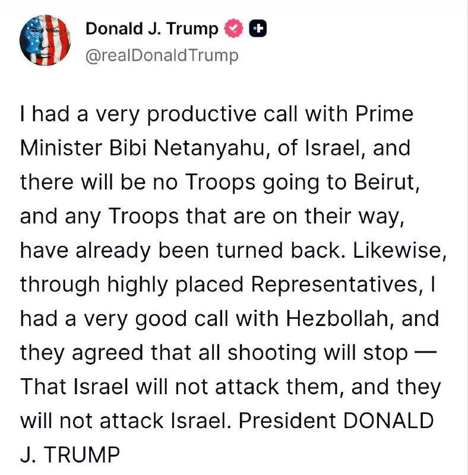

ترامپ: من تماس بسیار مثبتی با نخست‌وزیر بی بی نتانیاهو، از اسرائیل، داشتم و هیچ نیرویی به بیروت اعزام نخواهد شد، و هر نیرویی که در راه بود، قبلاً بازگردانده شده است.

همچنین، از طریق نمایندگان بلندپایه، تماس بسیار خوبی با حزب‌الله داشتم و آنها موافقت کردند که تمام تیراندازی‌ها متوقف شود، اسرائیل به آنها حمله نخواهد کرد و آنها نیز به اسرائیل حمله نخواهند کرد.

📝 Amir

📌 @persian_trend_official
پرشین ترند | متفاوت‌ترین کانال نظامی

## Persian_Trend_Official — post 15450

  

ترامپ: مذاکرات با جمهوری اسلامی ایران با سرعت زیادی ادامه دارد. از توجه شما به این موضوع سپاسگزارم!

📝 Amir

📌 @persian_trend_official
پرشین ترند | متفاوت‌ترین کانال نظامی

## Persian_Trend_Official — post 15449

  

اکسیوس: یک مقام لبنانی به آمریکا گفت که حزب‌الله آماده آتش‌بس کامل با اسرائیل است!

به گزارش از اکسیوس، علی حمدان، مشاور ارشد نبیه بری، رئیس پارلمان لبنان، به اکسیوس گفت که او به دولت ترامپ گفته است که حزب‌الله آماده آتش‌بس کامل و فوری با اسرائیل است و متعهد شده است که اجرای آن را تضمین کند.

به گفته یک منبع آگاه، مقامات آمریکایی به گفته‌اند که فکر نمی‌کنند نتانیاهو موافقت کند. یک مقام اسرائیلی تأیید کرد که حزب‌الله آمادگی خود را برای آتش‌بس کامل حتی بدون درخواست عقب‌نشینی فوری اسرائیل اعلام کرده است.

📝 Amir

📌 @persian_trend_official
پرشین ترند | متفاوت‌ترین کانال نظامی

## Persian_Trend_Official — post 15448

  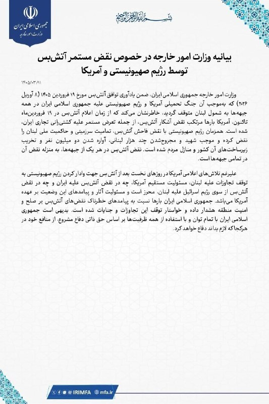

وزارت امور خارجه جمهوری اسلامی: مسئولیت مستقیم آمریکا، چه در نقض آتش‌بس علیه ایران و چه در نقض آتش‌بس از سوی رژیم اسرائیل علیه لبنان، محرز است و مسئولیت آثار و پیامدهای این وضعیت برعهده آمریکاست.

ایران از منافع خود، در هر کجا که لازم بداند دفاع خواهد کرد.

📝 Amir

📌 @persian_trend_official
پرشین ترند | متفاوت‌ترین کانال نظامی

## Persian_Trend_Official — post 15447

  

آمریکا حمله اسرائیل به ضاحیه را متوقف کرد!

کان نیوز: علیرغم تهدیدات صریح نتانیاهو، تدارکات اسرائیل برای حمله به منطقه ضاحیه بیروت در ساعات اخیر پس از مداخله ایالات متحده به تأخیر افتاد.

📝 Amir

📌 @persian_trend_official
پرشین ترند | متفاوت‌ترین کانال نظامی

## Persian_Trend_Official — post 15446

https://youtube.com/live/bKStpJNvOXI?feature=share

## Persian_Trend_Official — post 15445

  <a href="telegram/content/Persian_Trend_Official_15445_1780351160.mp4" target="_blank">🎬 Download video</a>

رسانه نیروی هوافضا سپاه ویدیویی از لحظه سرنگونی پهپاد MQ-1 امریکایی در تاریخ بامداد 10 خرداد 1405 منتشر کرد.

📝 Amir

📌 @persian_trend_official
پرشین ترند | متفاوت‌ترین کانال نظامی

## Persian_Trend_Official — post 15444

گفتگوی تلفنی عراقچی با عاصم منیر و وزیر خارجه پاکستان

عراقچی در تماس‌های تلفنی جداگانه با محمد اسحق‌دار معاون نخست وزیر و وزیر امور خارجه پاکستان و فیلد مارشال عاصم منیر فرمانده ارتش پاکستان در خصوص تحولات منطقه‌ای و روندهای مرتبط با آتش‌بس گفتگو و رایزنی کرد.

📝 Amir

📌 @persian_trend_official
پرشین ترند | متفاوت‌ترین کانال نظامی

## Persian_Trend_Official — post 15443

  

سخنگوی ارتش اسرائیل: ارتش اسرائیل فرمانده یک واحد در سامانه موشکی حزب‌الله را از بین برد.

نیروی هوایی، تحت فرماندهی تیپ گولانی، دیروز (یکشنبه) در منطقه نبطیه حمله کرد و محمد موسی ماترک، فرمانده یک واحد در سامانه موشکی حزب‌الله را از بین برد.

در طول سال‌ها، ماترک سمت‌های مختلفی در سامانه موشکی حزب‌الله داشت. ماترک مسئول ترویج و اجرای صدها پرتاب موشک و پهپاد علیه شهروندان اسرائیلی و نیروهای ارتش اسرائیل، از جمله تیپ گولانی فعال در منطقه بوفورت بود که به نیروی هوایی دستور حذف او را داد.

📝 Amir

📌 @persian_trend_official
پرشین ترند | متفاوت‌ترین کانال نظامی

## Persian_Trend_Official — post 15442

  <a href="telegram/content/Persian_Trend_Official_15442_1780351162.webm" target="_blank">🎬 Download video</a>

محسن رضایی مشاور نظامی رهبر جمهوری اسلامی: تنگه هرمز تحت مدیریت ایران است. اجازه تداوم محاصره دریایی را نخواهیم داد و تشدید تنش در لبنان هم تحمل نخواهد شد. صبر نیروهای مسلح جمهوری اسلامی ایران حدی دارد.

📝 Amir

📌 @persian_trend_official
پرشین ترند | متفاوت‌ترین کانال نظامی

## Persian_Trend_Official — post 15441

  <a href="telegram/content/Persian_Trend_Official_15441_1780351162.webm" target="_blank">🎬 Download video</a>

قرارگاه مرکزی خاتم‌الانبیا اسرائیل را تهدید به حمله موشکی کرد!

سرلشکر خلبان علی عبداللهی، فرمانده قرارگاه‌ خاتم الانبیا: نتانیاهو در ادامه شرارت‌های خود در منطقه، ضاحیه و بیروت را تهدید به بمباران نموده و برای ساکنان آن هشدار تخلیه اعلام کرده است.

با توجه به نقض مکرر آتش بس توسط رژیم، در صورت عملی شدن این تهدید به ساکنان بخش‌های شمالی و شهرک‌های نظامی در سرزمین‌های اشغالی هشدار می‌دهیم اگر نمی‌خواهند آسیب ببینند منطقه را ترک نمایند.

📌 @persian_trend_official
پرشین ترند | متفاوت‌ترین کانال نظامی

## Persian_Trend_Official — post 15440

  

📷 Photo

## RadioFarda — post 157791

  <a href="https://t.me/radiofarda/157791" target="_blank">📎 Download file</a>

📻بشنوید: سرخط خبرهای نیمه‌شب با رادیوفردا، ۱۲ خرداد ۱۴۰۵‌

@RadioFarda

## RadioFarda — post 157790

  

🔸رئیس جمهور آمریکا روز دوشنبه در پیامی در شبکه اجتماعی خود نوشت که مذاکره کشورش با حکومت ایران «با سرعت ادامه دارد».

🔸این پیام پس از آن منتشر شد که جمهوری اسلامی تهدید کرد که در صورت ادامه حملات اسرائیل به لبنان «تبادل پیام با آمریکا متوقف می‌شود».

🔸ترامپ در گفت‌وگو با خبرنگاران از تعلیق مذاکره با ایران اظهار بی‌اطلاعی کرد، اما تماسی تلفنی با نخست وزیر اسرائیل برقرار کرد که به توقف حملات به لبنان انجامید.

@RadioFarda

## RadioFarda — post 157789

🔸سردار آزمون، مهاجم تیم ملی ایران، در فهرست ۲۶ نفره این تیم برای جام جهانی که روز دوشنبه اعلام شد، حضور ندارد.

🔸آزمون ۹۱ بازی ملی انجام داده و ۵۷ گل برای ایران به ثمر رسانده است.

🔸او در اسفند ماه و پس از حمله آمریکا و اسرائیل به ایران، تصویری از خود در کنار حاکم دبی منتشر کرد.

🔸گزارش‌ها حاکی است که این پست اینستاگرامی با واکنش منفی مقام‌های ایرانی روبه‌رو شد و پس از آن آزمون از تیم ملی کنار گذاشته شد.

🔸رسانه‌های داخلی نوشته‌اند که سردار آزمون «با وجود ابراز تمایل دوباره برای بازگشت، اکنون فقط احتمال دارد پس از جام جهانی، در صورت عذرخواهی رسمی، بار دیگر برای رقابت‌های بعدی از جمله جام ملت‌های آسیا به تیم ملی دعوت شود.»

@RadioFarda

## RadioFarda — post 157788

ترامپ می‌گوید مذاکره با جمهوری اسلامی «با سرعت» ادامه دارد

🔸رئیس جمهور آمریکا روز دوشنبه در پیامی در شبکه اجتماعی خود نوشت که مذاکره کشورش با حکومت ایران «با سرعت ادامه دارد».

🔸این پیام پس از آن منتشر شد که جمهوری اسلامی تهدید کرد که در صورت ادامه حملات اسرائیل به لبنان «تبادل پیام با آمریکا متوقف می‌شود».

🔸ترامپ در گفت‌وگو با خبرنگاران از تعلیق مذاکره با ایران اظهار بی‌اطلاعی کرد، اما تماسی تلفنی با نخست وزیر اسرائیل برقرار کرد که به توقف حملات به لبنان انجامید.

@RadioFarda

## RadioFarda — post 157787

  

🔸در پی انتشار خبر تماس تلفنی دونالد ترامپ با بنیامین نتانیاهو، رئیس جمهور آمریکا در شبکه اجتماعی خود نوشت که نیروهای ارتش اسرائیل به بیروت نخواهند رفت.

🔸او گفت: «تماسی بسیار مفید با بی‌بی نتانیاهو، نخست وزیر اسرائیل، داشتم و دیگر نیرویی به بیروت نخواهد رفت، و هر نیرویی هم که در راه بودند بازگردانده می‌شوند.»

🔸ترامپ در ادامه نوشت که «از طریق نمایندگان عالی تماسی بسیار خوب با حزب‌الله داشته» و این گروه هم موافقت کرده است که دست از شلیک بردارد.

🔸صبح دوشنبه وب‌سایت آکسیوس به نقل از منابع خود گزارش داده بود که تلاش جدید آمریکا برای آتش‌بس میان اسرائیل و لبنان «شکست» خورده است.

@RadioFarda

## RadioFarda — post 157786

وقوع «دومین انفجار» در کشتی کانتینربر در نزدیکی بندر ام قصر عراق

🔸خبرگزاری رویترز روز دوشنبه از وقوع «دومین انفجار» در یک فروند کشتی کانتینربر در نزدیکی بندر ام قصر عراق خبر داد.

🔸بر اساس این خبر به نقل از منابع امنیتی عراق، این انفجار در فاصله ۴۰ مایل دریایی در جنوب شرقی بندر ام قصر در خلیج فارس رخ داده و باعث بروز آتش‌سوزی شده است.

🔸ساعاتی پیشتر اداره دریانوردی بریتانیا در شبکه ایکس از وقوع «انفجاری بزرگ» در این کشتی کانتینربر در پی اصابت «پرتابه‌ای ناشناس» خبر داده بود.

🔸هنوز خبری درباره مجروحان احتمالی این حادثه گزارش نشده است.

@RadioFarda

## RadioFarda — post 157785

بیانیه وزارت خارجه ایران: مسئولیت آثار و پیامدهای نقض آتش‌بس بر عهده آمریکا است

🔸در ادامه واکنش تند حکومت ایران به حملات اسرائیل در جنوب لبنان، وزارت خارجه جمهوری اسلامی در بیانیه‌ای هشدار داد که مسئولیت «آثار و پیامدهای نقض آتس‌بس» را بر عهده ایالات متحده می‌داند.

🔸در این بیانیه آمده است: «مسئولیت مستقیم آمریکا، چه در نقض آتش‌بس علیه ایران و چه در نقض آتش‌بس از سوی رژیم اسرائیل علیه لبنان، محرز است و مسئولیت آثار و پیامدهای این وضعیت برعهده آمریکاست.»

🔸همزمان رسانه‌ها در اسرائیل از جمله شبکه کان خبر می‌دهند که «در پی مداخله» آمریکا، ارتش اسرائیل حمله خود به منطقه ضاحیه در جنوب لبنان را عقب انداخته است.

🔸این خبر پس از آن منتشر شده است که همین رسانه‌ها از گفت‌وگوی تلفنی طولانی دونالد ترامپ با بنیامین نتانیاهو، نخست وزیر اسرائیل، خبر دادند.

🔸ساعتی پیشتر نخست‌وزیر اسرائیل به ارتش دستور داده بود که اهدافی را در حومه جنوبی بیروت هدف قرار دهد.

@RadioFarda

## RadioFarda — post 157784

  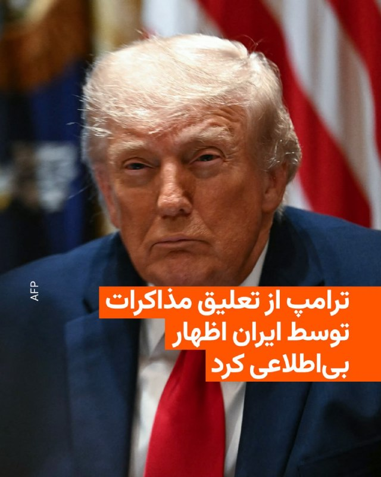

🔸شبکه ان‌بی‌سی روز دوشنبه خبر داد که رئیس جمهور آمریکا از تعلیق مذاکرات یا تلاش برای این کار توسط جمهوری اسلامی اظهار بی‌اطلاعی کرده است.

🔸دونالد ترامپ به خبرنگار این شبکه آمریکایی گفت که از ایران چنین خبری نشنیده است.

🔸رسانه‌های حکومتی در ایران عصر دوشنبه، ۱۱ خردادماه، نوشتند که جمهوری اسلامی «تبادل پیام با آمریکا» را تا زمانی که اسرائیل حملاتش به لبنان را متوقف نکرده قطع می‌کند.

🔸به نوشته خبرگزاری تسنیم، «مسئولان و مذاکره‌کنندگان ایرانی» خواستار توقف فوری حملات اسرائیل شده «و تا زمانی که نظر ایران و مقاومت در این زمینه تأمین نشود، گفت‌وگویی در کار نخواهد بود».

🔸در واکنش به این خبر، ترامپ گفت: «اگر راستش را بخواهید، به نظر من ما زیادی در این باره حرف می‌زنیم. به نظرم، [به جای این کار] سکوت کردن خیلی بهتر خواهد بود.»

🔸او در ادامه گفت: «البته معنایش این نیست که همین الان می‌رویم و شروع می‌کنیم به بمب ریختن، فقط ساکت می‌مانیم، محاصره را هم حفظ می‌کنیم.»

@RadioFarda

## RadioFarda — post 157782

🔸رسانه‌های ایران از افزایش حجم ذخایر آب سد امیرکبیر (سد کرج) و رسیدن میزان پرشدگی مخزن این سد به حدود ۷۰ درصد خبر می‌دهند.

🔸بر اساس تصاویر منتشرشده، حجم آب ذخیره‌شده در این سد نسبت به مدت مشابه سال گذشته افزایش چشمگیری داشته است؛ موضوعی که پس از چند سال خشکسالی و کاهش ذخایر آبی، نشانه‌ای نسبتاً امیدوارکننده برای منابع آب تهران و البرز ارزیابی می‌شود.

🔸با این حال، کارشناسان تأکید می‌کنند بهبود وضعیت سد کرج به معنای پایان بحران آب نیست و وضعیت سدهایی مانند لار، لتیان و ماملو همچنان نگران‌کننده است.

@RadioFarda

## RadioFarda — post 157781

تهدید به «گشودن جبهه‌های جدید» از طرف سپاه در ادامه واکنش به حمله اسرائیل به لبنان

🔸همزمان با هشدار فرمانده قرارگاه خاتم‌الانبیاء‌ سپاه، سازمان اطلاعات سپاه پاسداران نیز در پیامی که به نوشته خبرگزاری فرانسه در تلویزیون حکومتی ایران نیز قرائت شده تهدید کرد که «جبهه‌هایی جدید» خواهد گشود.

🔸حساب سازمان اطلاعات سپاه در شبکه ایکس نوشت:‌ «ایران عبور از خط قرمزها در لبنان و غزه را به معنای جنگ مستقیم و تحمیل هزینه بر امنیت ملی خود و مقاومت اسلامی فرض کرده و متقابلا عزم خود را برای عملیات دفاعی با انجام اقدامات معناشکن و گشودن جبهه‌های جدید به علاوه حفظ معادله تنگه هرمز قرار می‌دهد.»

🔸جمهوری اسلامی از همان ابتدا پایان جنگ در لبنان را از جمله شرایط خود برای کنار آمدن با ایالات متحده عنوان کرده است.

🔸این در حالی است که اسرائیل و گروه حزب‌الله لبنان تحت فشار آمریکا به آتش‌بس رضایت داده، اما به‌ویژه در روزهای اخیر هر یک دیگری را به نقض این آتش‌بس متهم کرده است.

🔸تهدید به «حفظ معادله تنگه هرمز» یعنی بسته ماندن این تنگه استراتژیک در حالی است که ایران و آمریکا از طریق پاکستان و میانجی‌های دیگر در حال تلاش برای نهایی کردن یک تفاهم‌نامه در این باره هستند.

@RadioFarda

## RadioFarda — post 157780

  

هشدار قرارگاه مرکزی خاتم‌الانبیاء سپاه به ساکنان شمال اسرائیل

🔸در ادامه واکنش‌ مقامات جمهوری اسلامی به حملات مکرر اسرائیل به جنوب لبنان، فرمانده قرارگاه خاتم‌الانبیاء سپاه پاسداران روز دوشنبه به ساکنان شمال اسرائیل هشدار تخلیه داد.

🔸رسانه‌های حکومتی به نقل از علی عبداللهی، فرمانده این قرارگاه، نوشتند: «نتانیاهو در ادامه شرارت‌های خود در منطقه، ضاحیه و بیروت را تهدید به بمباران نموده و برای ساکنان آن هشدار تخلیه اعلام کرده است.»

🔸این فرمانده سپاه در ادامه تهدید کرده که در صورت بمباران شدن این مناطق در لبنان، ایران نیز به شمال اسرائیل حمله خواهد کرد.

🔸عبداللهی گفت: «در صورت عملی شدن این تهدید به ساکنان بخش‌های شمالی و شهرک‌های نظامی در سرزمین‌های اشغالی هشدار می‌دهیم اگر نمی‌خواهند آسیب ببینند منطقه را ترک نمایند.»

@RadioFarda

## RadioFarda — post 157779

  <a href="telegram/content/RadioFarda_157779_1780351166.mp4" target="_blank">🎬 Download video</a>

🔸تصویری از یک قلاده پلنگ ایرانی در پارک ملی گلستان، در جریان گشت و پایش محیطی در اردیبهشت‌ماه ۱۴۰۵ به ثبت رسید.

🔸این ویدیو که توسط جعفر پناه‌پور، از محیط‌بانان و پایشگران محیط زیست ثبت شده، حضور این گونه ارزشمند را در میان پوشش گیاهی منطقه نشان می‌دهد.

🔸پارک ملی گلستان به عنوان یکی از مهم‌ترین زیستگاه‌های حیات‌وحش ایران، نقش کلیدی در حفاظت از پلنگ ایرانی دارد؛ گونه‌ای که در فهرست جانوران در معرض خطر قرار گرفته است.

🔸پارک ملی گلستان با برخورداری از تنوع زیستی کم‌نظیر، یکی از مهم‌ترین مناطق حفاظت‌شده کشور برای بقای پلنگ ایرانی به شمار می‌رود.

@RadioFarda

## RadioFarda — post 157778

🔸رسانه‌های ایران ۱۱ خردادماه، از «نقض آتش‌بس» در همه جبهه‌ها از جمله لبنان خبر دادند
و نوشتند که تیم مذاکره‌کننده ایرانی گفتگوها و تبادل متون از طریق میانجی را متوقف می‌کند.

🔸مقامات رسمی ایران هنوز واکنشی به این خبر نشان ندادند.

🔸پیشتر سخنگوی وزارت خارجه بر «حفظ آتش‌بس» در لبنان تاکید کرده بود.

🔸همزمان نخست‌وزیر اسرائیل روز دوشنبه دستور حمله به جنوب بیروت را صادر کرد.

🔸وب‌سایت آکسیوس به نقل از منابع خود گزارش داده که تلاش جدید آمریکا برای آتش‌بس میان اسرائیل و لبنان «شکست» خورده است.

@RadioFarda

## RadioFarda — post 157777

  

🔸در پی انتشار اخباری از مریض‌احوالی میرحسین موسوی، از رهبران جنبش سبز ایران، اردشیر امیرارجمند، مشاور او، تأیید کرد که آقای موسوی «چند روزی است» به بیمارستان منتقل شده است.

🔸میرحسین موسوی به همراه همسرش زهرا رهنورد، دیگر رهبر جنبش سبز، هم‌چنان در حصر به سر می‌برد.

🔸امیرارجمند که در فرانسه اقامت دارد روز دوشنبه به رادیوفردا گفت که خانه این دو فعال سیاسی دیگر «قابل سکونت نیست»، محل نگهداری آن‌ها پس از انتقال‌شان «نامعلوم» است، و شرایط حصر «دشوارتر» شده است.

🔸محل سکونت این دو در حملات بی‌امان اسرائیل به تهران به‌شدت آسیب دیده است.

@RadioFarda

## RadioFarda — post 157776

تیراندازی در دانشگاه پزشکی قزوین دو کشته برجا گذاشت

🔸رسانه‌ها در ایران از وقوع حادثه‌ای مرگبار در قزوین خبر می‌دهند که صبح روز دوشنبه اتفاق افتاده و جان دو نفر را گرفته است.

🔸به گفته حمیدرضا قافله‌باشی، رئیس دانشگاه علوم پزشکی قزوین، در جریان تیراندازی که «به دلیل خصومت خانوادگی اتفاق افتاده» دو دانشجوی این دانشگاه «که زن و شوهر بودند» جان خود را از دست داده‌اند.

🔸بر اساس شرح حادثه از زبان برخی از کاربران شبکه‌های اجتماعی، صبح روز دوشنبه دانشجوی مرد وارد دانشکده دندانپزشکی قزوین می‌شود و «همسر خودش را با سلاح کمری به قتل می‌رساند و پس از ارتکاب جرم به زندگی خود پایان می‌دهد».

🔸در سال‌های اخیر به نظر می‌رسد دسترسی مردم در ایران به سلاح گرم بسیار آسان‌تر شده، و در شبکه اجتماعی تلگرام حتی آگهی فروش اسلحه هم می‌توان دید.

@RadioFarda

## RadioFarda — post 157775

  

🔸عباس عراقچی، وزیر خارجه ایران، در شبکه ایکس نوشت: «آتش‌بس میان ایران و آمریکا، بدون هیچ ابهامی، آتش‌بسی در تمام جبهه‌ها، از جمله لبنان، است.»

🔸او در این پیام، نقض آتش‌بس در هر جبهه‌ای را «به معنای نقض آتش‌بس در تمامی جبهه‌ها» عنوان کرده است.

🔸عراقچی آمریکا و اسرائیل را «مسئول پیامدهای هرگونه نقض این آتش‌بس» معرفی کرده است.

🔸ایران بارها این موضوع را اعلام کرده که آتش‌بس میان طرفین منازعه در جنگ ایران، باید سایر جبهه‌ها به‌ویژه جبهه لبنان را هم در بر بگیرد.

🔸ابوالفضل شکارچی، سخنگوی نیروهای مسلح جمهوری اسلامی نیز به اسرائیل هشدار داده که «تداوم جنایات در لبنان برای نیروهای مسلح ایران قابل تحمل نخواهد بود.»

🔸در تازه‌ترین بی‌توجهی به این درخواست جمهوری اسلامی، بنیامین نتانیاهو، نخست‌وزیر اسرائیل، به ارتش دستور داده اهدافی را در حومه جنوبی بیروت هدف قرار دهد.

@RadioFarda

## IranianMinds — post 21222

🔴ترامپ:
شاید این هفته با ایران به توافق برسیم

صلح با ایران شاید حتی بهتر از پیروزی نظامی باشد‌‌!

@IranianMinds

## IranianMinds — post 21221

🔴خبرگزاری ایرنا:

روز دوشنبه ۱۱ خرداد از کشته شدن دو سپاهی در منطقه فردو استان قم خبر داد.

حسین رمضانیان‌فردویی و محمد اویسی بر اثر انفجار پرتابه ‌های باقی‌مانده از جنگ اخیر، به هلاکت رسیدند.

@IranianMinds

## IranianMinds — post 21220

🔴 ترامپ :

امروز ی مشکل کوچک پیش اومد،ایرانیا خیلی از حملات اسرائیل به لبنان ناراحت بودن،با اسرائیل و حزب الله حرف زدم گفتم بهم تیراندازی نکنید قبول کردن احتمالا تو همین هفته با ایران به توافق میرسیم.

@IranianMinds

## IranianMinds — post 21219

  

🔴 حزب الله پیشنهاد آتش بس ترامپ رو رد کرد. @IranianMinds

## IranianMinds — post 21218

  <a href="telegram/content/IranianMinds_21218_1780351169.mp4" target="_blank">🎬 Download video</a>

🔴 شبکه البرز داشت مثلا اون گوشه پخش زنده حضور پرشور خرزشیارو‌ نشون میداد که یهو از دستشون در رفت تایم ویدیویی که گذاشته بودن تموم شد رفت تو‌ ویدیو پلیر 😂

@IranianMinds

## IranianMinds — post 21217

🔴 فوری از پست جدید ترامپ: من یک تماس بسیار سازنده با نخست‌وزیر بی‌بی نتانیاهو، از اسرائیل، داشتم و هیچ نیرویی به بیروت اعزام نخواهد شد، و هر نیرویی که در راه بود، قبلاً بازگردانده شده. همچنین، از طریق نمایندگان بلندپایه، تماس بسیار خوبی با حزب‌الله داشتم…

## IranianMinds — post 21216

  <a href="telegram/content/IranianMinds_21216_1780351170.mp4" target="_blank">🎬 Download video</a>

⚫️ نه میبخشیم نه فراموش میکنیم

صحبت های مادر جاویدنام امیرحسین احمدی شریف 🖤

@IranianMinds

## IranianMinds — post 21215

من قدیم گفتم الانم میگم

این کانال جای خرزشی و حکومتی و هرکسی که یه درصد حامی این حکومت قاتل باشه نیست

هیچ آزادی بیانیم برای موجوداتی که چون عقایدمون باهاشون یکی‌ و نیست و از نظرشون حکممون مرگه نداریم

پس بی زحمت سیکتونو بزنید این کانال جای شما نیست و متعلق به مردم ایرانه !

## IranianMinds — post 21214

  

نرمال ترین خرزشی :

@IranianMinds

## IranianMinds — post 21213

امروز زیاد از پیاما گرفتم و خیلیا اومدن انتقاد کردن گفتم‌ خودتون‌ جواب بدید و نظرتونو نسبت به حرف ایشون بگید @IranianMinds

## IranianMinds — post 21212

امروز زیاد از پیاما گرفتم و خیلیا اومدن انتقاد کردن گفتم‌ خودتون‌ جواب بدید و نظرتونو نسبت به حرف ایشون بگید @IranianMinds

## IranianMinds — post 21211

  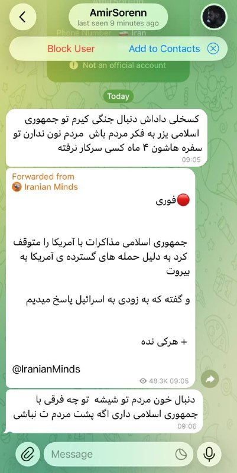

امروز زیاد از پیاما گرفتم و خیلیا اومدن انتقاد کردن

گفتم‌ خودتون‌ جواب بدید و نظرتونو نسبت به حرف ایشون بگید

@IranianMinds

## IranianMinds — post 21210

  <a href="telegram/content/IranianMinds_21210_1780351172.mp4" target="_blank">🎬 Download video</a>

@IranianMinds

## IranianMinds — post 21209

  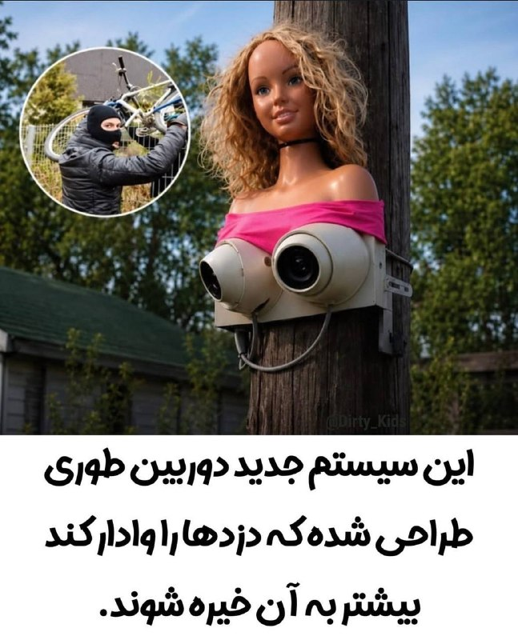

سیستم جدید دوربینی که توی آمریکا داره استفاده میشه :))

@IranianMinds

## IranianMinds — post 21208

  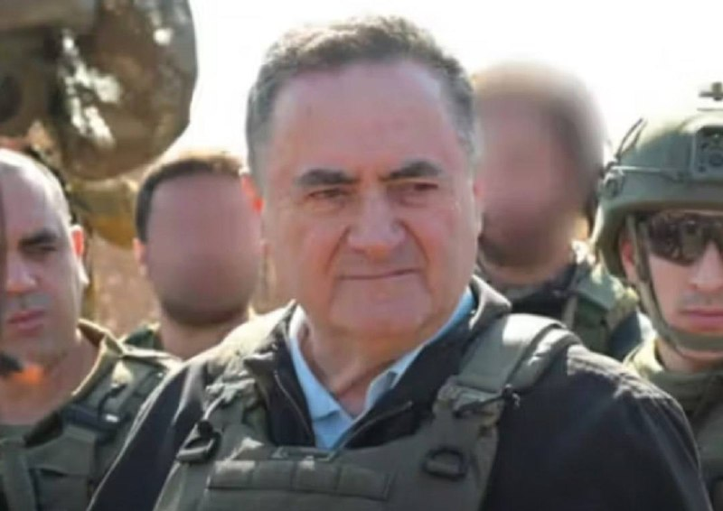

🔴 کاتز ، وزیر دفاع اسرائیل :

در لبنان هیچ آتش بسی نداریم ، اسرائیل تا جایی که نیاز باشد پیشروی خواهد کرد.

@IranianMinds

## IranianMinds — post 21207

🔴پست ترامپ: گفت‌وگوها با جمهوری اسلامی ایران با سرعتی بالا ادامه دارد. از توجه شما به این موضوع سپاسگزارم. رئیس جمهور دونالد جی. ترامپ. این بار گفت جمهوری اسلامی ایران . @IranianMinds

## IranianMinds — post 21206

  

🔴 توییتی که شمخانی تو جنگ ۱۲ روزه بعد ترور ناموفقش زده بود

@IranianMinds

## IranianMinds — post 21205

🔴 وزیر امنیت ملی اسرائیل بن گویر:

جناب نخست‌وزیر،

شما گفتید که یک نخست‌وزیر قوی به رئیس‌جمهور آمریکا «بله» می‌گوید وقتی ممکن است و «نه» وقتی لازم است.

اکنون زمان گفتن «نه» به دوست‌مان، رئیس‌جمهور ترامپ است.

اکنون زمان انجام آنچه لازم و ضروری است برای ضربه زدن به حزب‌الله، آزاد کردن دستان رزمندگان ما و بازگرداندن امنیت به شمال است.

@IranianMinds

## IranianMinds — post 21204

دقایقی پیش سپاه در کرج یک آزمایش موشکی انجام داد

@IranianMinds

## IranianMinds — post 21203

  

🔴فوری
توییت جدید ترامپ

@IranianMinds

## BBCPersian — post 282596

‌ ‌ ‌ ‌
پس از تهدید نخست وزیر اسرائیل درباره از سرگیری حملات به بیروت، دونالد ترامپ، رئیس جمهوری آمریکا می‌گوید پس از گفت‌وگو با آقای نتانیاهو و همچنین تماس از طریق واسطه‌ها با حزب‌الله بین طرفین توافق حاصل شده که حمله به بیروت متوقف شود.

با تهدیدهای مقامات اسرائیلی درباره حمله به بیروت، باعث شد بسیاری حومه جنوبی این شهر را ترک کنند.

این در حالیست که ارتش اسرائیل دیروز قلعه استراتژیک و تاریخی شقیف را در جنوب لبنان به تسخیر خود درآورد.

پیشروی که مقامات اسرائیلی آن را دست‌آوردی مهم در جنگ با حزب‌الله می‌خوانند. امروز بمباران‌ها در این نواحی ادامه داشت و این ارتش باز به بسیاری از شهرها و روستاها دستور تخلیه اجباری صادر کرد.

نفیسه کوهنورد، خبرنگار ارشد خاورمیانه ما از بیروت در گزارشش درباره آخرین‌ها در لبنان می‌گوید.

@BBCPersian

## BBCPersian — post 282595

🔻 ارتش اسرائیل از کشته شدن یک سرباز و زخمی شدن هفت نفر دیگر در جنوب لبنان خبر داد

ارتش اسرائیل اعلام کرد که یک سرباز این کشور در جنوب لبنان کشته شده است.

به گفته اسرائیل هفت سرباز دیگر هم «در جریان درگیری‌ها» در جنوب لبنان زخمی شده‌اند.

جزییات بیشتری از این خبر منتشر نشده است.

https://bbc.in/4u49FGN
@BBCPersian

## BBCPersian — post 282594

  <a href="https://t.me/bbcpersian/282594" target="_blank">📎 Download file</a>

پادکست برنامه شصت دقیقه دوشنبه ۱۱ خرداد ۱۴۰۵

این نسخه رادیویی برنامه شصت دقیقه تلویزیون فارسی بی‌بی‌سی است که هرشب بعد از پخش، با حجم کم از اپلیکیشن‌های پادگیر و صفحه تلگرام بی‌بی‌سی فارسی در دسترس است.

با هشتگ BBCPersianRadio# با ما در ارتباط باشید

@BBCPersian

## BBCPersian — post 282593

  <a href="telegram/content/BBCPersian_282593_1780351176.mp4" target="_blank">🎬 Download video</a>

⭕️ سرخط آخرین خبرهای دوشنبه ۱۱ خرداد ۱۴۰۵
@BBCPersian

## BBCPersian — post 282592

🔻لغو سفر وزرای آلمان و نروژ به بیروت در میانه پرواز به‌دلیل «وخامت وضعیت امنیتی»

به گزارش خبرگزاری فرانسه، وزرای آلمان و نروژ به‌دلیل «وخامت وضعیت امنیتی» در منطقه مجبور شدند سفر روز دوشنبه خود به لبنان را در میانه پرواز لغو کنند و برگردند.

سخنگوی ریم العبلی-رادووان، وزیر توسعه بین‌الملل آلمان، به خبرگزاری فرانسه گفت که وزیر آلمانی و همتای نروژی‌اش، آسموند آوکروست، «به دلایل نظامی» مجبور به لغو سفر و بازگشت به برلین شدند، چرا که هنگام نزدیک شدن به فرودگاه بیروت «وضعیت به‌سرعت رو به وخامت می‌گذاشت».

سخنگوی دولت نروژ هم به خبرگزاری فرانسه تایید کرد که این سفر لغو شده است.

به گزارش رسانه‌های نروژی، این دو وزیر قصد داشتند برای نشان دادن همبستگی با مردم لبنان این سفر را انجام دهند.

به گزارش این رسانه‌ها، وزرای دو کشور قرار بود با جوزف عون، رئیس‌جمهور لبنان، و همچنین گروه‌های جامعه مدنی و آوارگان دیدار کنند.

اسرائیل حملات خود به لبنان را گسترش داده است؛ پیشتر هم بنیامین نتانیاهو، نخست‌وزیر، دستور حمله به اهدافی در ضاحیه در جنوب بیروت را صادر کرد.

از زمان برقراری آتش‌بس میان اسرائیل و لبنان در حدود شش هفته پیش، تبادل آتش میان اسرائیل و حزب‌الله ادامه داشته است و هر دو طرف یکدیگر را به نقض آتش‌بس متهم می‌کنند.

پیشتر، ایران به آمریکا و اسرائیل هشدار داد که «نقض آتش‌بس در هر یک از جبهه‌ها، به منزله نقض آن در تمامی جبهه‌ها است.»

@BBCPersian

## BBCPersian — post 282591

  

🔻دونالد ترامپ، رئیس جمهور آمریکا، در پستی در شبکه اجتماعی خود، سوشال تروث، نوشت: «گفت‌وگویی بسیار سازنده با نخست‌وزیر اسرائیل داشتم و هیچ نیرویی به بیروت اعزام نخواهد شد. همچنین هر نیرویی که در مسیر اعزام بود، بازگشته است.»

او همچنین اضافه کرد: «از طریق نمایندگان عالی‌رتبه، گفت‌وگوی بسیار خوبی با حزب‌الله داشتم و آن‌ها موافقت کردند که تمامی تیراندازی متوقف شود؛ اسرائیل به آن‌ها حمله نخواهد کرد و آن‌ها نیز به اسرائیل حمله نخواهند کرد.»

آقای ترامپ در پستی دیگری نوشت: «گفت‌وگوها با جمهوری اسلامی ایران به‌سرعت در جریان است.»

ساعتی پیش خبرگزاری تسنیم گفت که اطلاع یافته است «با عنایت به اینکه لبنان جزء پیش‌شرط‌های آتش‌بس بوده است و اینک این آتش‌بس در همه جبهه‌ها از جمله لبنان نقض شده است» تیم مذاکره‌کننده ایران «گفت‌وگوها و تبادل متون از طریق میانجی را متوقف می‌کند.»

📷Getty Images
@BBCPersian

## BBCPersian — post 282590

  <a href="https://t.me/bbcpersian/282590" target="_blank">📎 Download file</a>

پادکست جام جهان‌نما، دوشنبه ۱۱ خرداد ۱۴۰۵

این برنامه رادیویی را می‌توانید هرشب ساعت ۲۰ به وقت ایران، روی موج متوسط ۷۰۲ کیلوهرتز و موج کوتاه ۹۴۶۵ کیلوهرتز بشنوید.

تکرار برنامه را هم می‌توانید ساعت ۲۱:۳۰ روی موج متوسط ۷۰۲ کیلوهرتز و موج کوتاه ۵۳۹۵ کیلوهرتز گوش کنید.

@BBCPersian

## BBCPersian — post 282588

🔻اینترنت بین‌الملل در ایران، «۶۰ درصد» پیش از اعتراضات دی است

با بازگشت نسبی دسترسی به اینترنت جهانی در ایران از روز ۵ خرداد، ترافیک اینترنت تا امروز، دوشنبه ۱۱ خرداد، در حدود ۶۰ درصد سطح پیش از اعتراضات دی ماه باقی مانده است.

داده‌های شرکت کنتیک در کالیفرنیا که در زمینه اندازه‌گیری ترافیک اینترنت فعالیت می‌کند حاکی است دسترسی به اینترنت بین‌المللی در ایران همچون دوره کوتاه بازگشت اینترنت بعد از اعتراضات، با اختلال همراه است.

کاربران اینترنت در ایران با محدودیت‌های بسیاری مواجهند. علاوه بر بی‌ثباتی اینترنت، بسیاری از وبسایت‌ها یا خدمات فیلتر هستند و بدون وی‌پی‌ان در دسترس نیستند.

https://bbc.in/4vjnvWG
@BBCPersian

## BBCPersian — post 282587

  

🔻دونالد ترامپ، رئیس‌جمهور آمریکا، گفت ایران اطلاع نداده است که تبادل پیام با آمریکا را متوقف کرده است.

رئیس‌جمهور آمریکا در گفت‌وگوی تلفنی به شبکه خبری ان‌بی‌سی گفت ایرانی‌ها در مذاکره بهتر از جنگ هستند «اما ما را از این موضوع مطلع نکرده‌اند.»

رئیس‌جمهور آمریکا گفت: «این به آن معنا نیست که ما شروع کنیم به بمباران آنجا» اما «محاصره را ادامه می‌دهیم.»

او همچنین گفت: «اگر راستش را بخواهید فکر می‌کنم زیاد حرف زده‌ایم. فکر می‌کنم سکوت کردن خیلی خوب است و می‌تواند مدت طولانی ادامه داشته باشد.»

ساعتی پیش خبرگزاری تسنیم گفت که اطلاع یافته است «با عنایت به اینکه لبنان جزء پیش‌شرط‌های آتش‌بس بوده است و اینک این آتش‌بس در همه جبهه‌ها از جمله لبنان نقض شده است» تیم مذاکره‌کننده ایران «گفتگوها و تبادل متون از طریق میانجی را متوقف می‌کند.»

📷Getty Images
https://bbc.in/4vjnvWG
@BBCPersian

## BBCPersian — post 282586

🔻هشدار قرارگاه مرکزی خاتم‌النبیا به ساکنان شمال اسرائیل

قرارگاه مرکزی خاتم‌النبیا به ساکنان بخش‌های شمالی و شهرک‌های نظامی اسرائیل هشدار داد در صورت بمباران ضاحیه و بیروت «اگر نمی‌خواهند آسیب ببینند منطقه را ترک نمایند.»

بنیامین نتانیاهو امروز در بیانیه‌ای گفت دستور حمله به اهدافی در ضاحیه در جنوب بیروت را صادر کرده است.

ضاحیه پایگاه قدرت حزب‌الله در پایتخت لبنان است.

ساعتی پیش خبرگزاری تسنیم گفت که اطلاع یافته است «با عنایت به اینکه لبنان جزء پیش‌شرط‌های آتش‌بس بوده است و اینک این آتش‌بس در همه جبهه‌ها از جمله لبنان نقض شده است» تیم مذاکره‌کننده ایران «گفتگوها و تبادل متون از طریق میانجی را متوقف می‌کند.»

در همین حال گزارش شده است که ایران به آخرین پیشنهاد آمریکا هنوز پاسخی نداده است.

به گزارش خبرگزاری فارس، سعید آجرلو، عضو تیم رسانه‌ای هیئت مذاکره‌کننده، گفت: «پیشنهاد ارسالی جدید آمریکا در کمیته شش نفره و شورای عالی امنیت ملی در حال بررسی است. از طریق میانجی‌ها متنی به ایران ارسال شده ولی هنوز پاسخی به پیشنهاد جدید آمریکا نداده‌ایم.»

آقای آجرلو گفت: «رفع نگرانی های ایران، شرط اصلی پاسخ به این پیشنهاد است. ما به دلیل اینکه نگرانی‌هایی داریم هنوز پاسخی به متن جدید آمریکا ارسال نکردیم.»

@BBCPersian

## BBCPersian — post 282585

یاسمین شاه‌کرمی، خواهر امیرمحمد، معترض ۱۴ ساله چند روز پیش بعد از وصل شدن نسبی اینترنت در ایران ویدیویی از لحظه شناسایی جسد برادرش ۶۰ روز بعد از اعتراضات دی ماه منتشر کرد.

امیرمحمد شاه‌کرمی در جریان اعتراضات دی ماه ۱۴۰۴ و کشتار بی‌سابقه معترضان به خانه بازنگشت. خواهر امیرمحمد می‌گوید پیگیری‌های خانواده بی‌نتیجه بود تا اینکه روز ۲۰ دی گوشی امیرمحمد روشن می‌شود و ماموران اطلاعات به خانواده اطلاع می‌دهند که او زنده و در بازداشت است.

براساس گفته‌های یاسمین شاه‌کرمی، در پیگیری‌های خانواده از طریق آموزش و پروزش، وضعیت امیرمحمد محرمانه اعلام شده بود. در حالی که خانواده امکان برقراری هیچ تماسی با امیرمحمد را نداشتند، جستجوی آنها در بیمارستان‌ها و سردخانه‌ها هم بی‌نتیجه بوده است.

تا اینکه ۶۰ روز بعد، از پزشکی قانونی کهریزک با آنها تماس گرفته می‌شود که برای شناسایی یک جسد مراجعه کنند.

یاسمین شاه‌کرمی می‌گوید شواهد نشان می‌دهد برادرش در بازداشت کشته شده است. او می‌گوید «سینه و پهلوی او کبود بود و اثر تیر خلاص بر شقیقه او دیده می‌شد.»
@BBCPersian

## BBCPersian — post 282584

🔻امیرحسین سعادت، فعال دانشجویی سابق، در تبریز بازداشت شد

امیرحسین سعادت، فارغ‌التحصیل مقطع کارشناسی ارشد دانشگاه علامه طباطبایی و دبیر سابق شورای صنفی این دانشگاه، صبح روز دوشنبه ۱۱ خرداد در شهر تبریز بازداشت شد.

بر اساس گزارش‌ها، نیروهای وزارت اطلاعات با ضرب و شتم او را در محل کار بازداشت کردند. مأموران سپس به منزلش رفته و ضمن تفتیش خانه، بخشی از وسایل شخصی او را ضبط کردند.

اطلاعاتی درباره دلیل بازداشت یا محل نگهداری او منتشر نشده است.

امیرحسین سعادت از فعالان دانشجویی سابق و دبیر پیشین شورای صنفی دانشگاه علامه طباطبایی بوده است.

@BBCPersian

## BBCPersian — post 282580

🔻خبرگزاری ایسنا تصاویری را از ساختمان قدیم مجلس ایران منتشر کرده است که شدت خسارت‌های واردشده به این بنا در حملات آمریکا و اسرائیل را نشان می‌دهد.

این ساختمان در ۱۲ اسفند و در چهارمین روز جنگ هدف حمله نظامی قرار گرفت. در تصاویر منتشرشده به نظر می رسد عملیات بازسازی این ساختمان شروع شده است.

این بنا که پیش از انقلاب بهمن ۵۷ محل تشکیل مجلس سنا بود، پس از انقلاب میزبان مجلس خبرگان قانون اساسی شد و سپس در اختیار مجلس شورای اسلامی قرار گرفت.
پس از انتقال مجلس شورای اسلامی به ساختمان جدیدی که در همان نزدیکی ساخته شده بود، ساختمان پیشین مجلس کاربری‌های متفاوتی پیدا کرد.

از جمله، این ساختمان در یک دهه اخیر در اختیار مجمع تشخیص مصلحت نظام قرار گرفت و سالی دو بار هم نشست مجلس خبرگان رهبری در آن برگزار می‌شد.

📷ISNA
https://bbc.in/4xgsxFw
@BBCPersian

## BBCPersian — post 282579

🔻یاشار دارالشفا، زندانی سیاسی پیشین، بازداشت شد

یاشار دارالشفا، زندانی سیاسی پیشین، صبح امروز در تهران بازداشت شد.

به گزارش خبرگزاری حقوق‌بشری هرانا، یاشار دارالشفا صبح دوشنبه با مراجعه نیروهای امنیتی و پس از تفتیش خانه، بازداشت شد.

از علت بازداشت و نهاد بازداشت‌کننده او اطلاعاتی منتشر نشده است.

یاشار دارالشفا چندین بار بازداشت و زندانی شده است. او آخرین بار در بهمن ۱۴۰۱ از زندان آزاد شد.

https://bbc.in/4xgsxFw
@BBCPersian

## BBCPersian — post 282577

🖊بهرنگ تاج‌دین، خبرنگار اقتصادی بی‌بی‌سی فارسی

بررسی‌های بانک مرکزی ایران نشان می‌دهد که روند افزایش قیمت‌ها در کشور دارد سریع‌تر می‌شود.

طبق گزارش ماهانه این نهاد، قیمت کالاها و خدمات مصرفی در مناطق شهری در اردیبهشت‌ماه ۱۴۰۵ به طور متوسط بیش از ۷۷ درصد بالاتر از اردیبهشت پارسال بوده است. به این رقم «تورم نقطه به نقطه» گفته می‌شود و در دست کم دهه‌های اخیر بی‌سابقه است.

به گفته بانک مرکزی، قیمت اقلام مصرفی از فروردین تا اردیبهشت امسال به طور میانگین هشت‌ونیم درصد افزایش یافته است که این هم بالاترین رقم تورم ماهانه در آمارهای این نهاد از خرداد ۱۴۰۱ است.

این گزارش نشان می‌دهد قیمت مواد غذایی ظرف ۱۲ ماه به طور متوسط ۱۱۹ درصد افزایش یافته؛ یعنی بیشتر از دو برابر شده است.

به گفته بانک مرکزی، تنها ظرف دو ماه اول امسال، قیمت لوازم خانگی حدود ۳۵ درصد، هزینه‌های ارتباطات و بهداشت و درمان بیش از ۴۰ درصد، و قیمت دخانیات بیش از ۵۰ درصد بالا رفته است.

📷 Getty Images
@BBCPersian

## BBCPersian — post 282576

🔻تسنیم: ایران تصمیم گرفته تبادل پیام با آمریکا را متوقف کند

خبرگزاری تسنیم می‌گوید اطلاع یافته است که «با عنایت به اینکه لبنان جزء پیش‌شرط‌های آتش‌بس بوده است و هم اینک این آتش‌بس در همه جبهه‌ها از جمله لبنان نقض شده است» تیم مذاکره‌کننده ایران «گفتگوها و تبادل متون از طریق میانجی را متوقف می‌کند.»

بنابر این گزارش، تا «توقف فوری» حملات اسرائیل به لبنان و غزه و «عقب‌نشینی کامل» از مناطق اشغال‌شده لبنان محقق نشود «گفت‌وگویی در کار نخواهد بود.»

این خبرگزاری که به نهادهای نظامی و امنیتی نزدیک است نوشت: «جبهه مقاومت و ایران عزم خود را بر انسداد کامل تنگه هرمز و فعال کردن سایر جبهه‌ها از جمله تنگه باب‌المندب» و «گشودن جبهه‌های جدید» قرار داده‌اند.

در ساعت‌های گذشته مقام‌های ارشد ایران بر توقف حملات اسرائیل در لبنان تاکید کرده‌اند از جمله عباس عراقچی، وزیر خارجه‌، در شبکه ایکس نوشت:

«آتش‌بس میان ایران و ایالات متحده، بدون هیچ ابهامی، آتش‌بس در تمامی جبهه‌ها، از جمله لبنان، محسوب می‌شود.»

https://bbc.in/4xgsxFw
@BBCPersian

## idfinfarsi — post 11704

  

‼️ارتش اسرائیل فرمانده یک یگان در سامانه موشکی سازمان تروریستی حزب‌الله را به هلاکت رساند

❌نیروی هوایی با هدایت نیروهای تیپ گولانی روز گذشته (یکشنبه) در منطقه نبطیه حمله کرده و محمد موسی مترک، فرمانده یک یگان در سامانه موشکی سازمان تروریستی حزب‌الله را به هلاکت رساند.

⭕️مترک طی سال‌ها، مسئولیت‌های متعددی را در سامانه موشکی حزب‌الله بر عهده داشت.
او مسئول پیشبرد و اجرای صدها شلیک راکت و پرتاب هواگردهای بدون سرنشین به‌سوی شهروندان کشور اسرائیل و نیروهای ارتش اسرائیل بود، از جمله علیه نیروهای تیپ گولانی که در منطقه بوفور در حال فعالیت هستند و عملیات نیروی هوایی برای به هلاکت رساندن وی را هدایت کردند.

## idfinfarsi — post 11703

  

‏‼️«کنترل بر رشته‌کوه بوفور دارای اهمیت‌های عملیاتی مهمی است. این منطقه یک دارایی جغرافیایی مرکزی برای حزب‌الله محسوب می‌شود و به‌عنوان مرکز عصبی این سازمان عمل می‌کند. از اینجا، این سازمان بر مناطق الجلیل و متولا از نظر آتش و دیده‌بانی تسلط دارد. تنها از آغاز عملیات “غرش شیران”، بیش از ۴۰۰ پرتابه از این منطقه شلیک شده است»

‏⭕️«ارتش اسرائیل در سراسر لبنان، از ضاحیه تا صور، حمله کرده و به حملات خود ادامه خواهد داد. در هر جایی که تهدیدی علیه شهروندان اسرائیل و نیروهای ارتش اسرائیل وجود داشته باشد — ما برای رفع آن اقدام خواهیم کرد»

‏⭕️متن کامل سخنان سخنگوی ارتش اسرائیل، سرتیپ افی دفرین در مرز شمال:

‏«ظهر بخیر. دیروز، نه چندان دور از اینجا، نیروهای ارتش اسرائیل به رهبری لشکر ۳۶ تحت فرماندهی شمال، یک عملیات گسترده را به پایان رساندند. در جریان این عملیات، ما به کنترل عملیاتی بر رشته‌کوه بوفور و منطقه دره سلوقی در جنوب لبنان دست یافتیم. اکنون نیروهای لشکر ۳۶ بر رشته‌کوه بوفور مسلط هستند.

‏⭕️این یک عملیات مهم بود که برای مدت طولانی برنامه‌ریزی شده و پس از روند منظم آماده‌سازی رزمی، با تأیید رئیس ستاد کل ارتش انجام شد. کنترل بر رشته‌کوه بوفور دارای اهمیت‌های عملیاتی مهمی است. این منطقه یک دارایی جغرافیایی مرکزی برای حزب‌الله محسوب می‌شود و به‌عنوان مرکز عصبی این سازمان عمل می‌کند. از اینجا، این سازمان بر مناطق الجلیل و متولا از نظر آتش و دیده‌بانی تسلط دارد. تنها از آغاز عملیات “غرش شیران”، بیش از ۴۰۰ پرتابه از این منطقه شلیک شده است.

‏⭕️زیرساختی که حزب‌الله ایجاد کرده، یک زیرساخت ایرانی است که به‌عنوان یک مرکز مهم فرماندهی و کنترل هم در سطح و هم در زیرزمین عمل می‌کند. ما در حال تضعیف توانایی‌های حزب‌الله هستیم و به تعمیق ضربه به آن ادامه می‌دهیم. در کنار دستاوردهای عملیاتی، این نبرد هزینه‌های سنگینی از ما گرفته است. در نبردهای دیروز و امروز، گروهبان ارشد آدم تسرفتی و گروهبان ارشد میخائیل تیوکین جان‌باختند، یادشان گرامی. میخائیل، ۲۱ ساله از اشکلون، رزمنده یگان گشتی گیوعاتی، و آدم، ۲۰ ساله از روش هاعین، رزمنده یگان ماگلان. آن‌ها در نبرد بر سر این رشته‌کوه و در حالی که از شهرک‌های شمال دفاع می‌کردند، جان باختند. من به خانواده‌های آن‌ها تسلیت می‌گویم، ما آن‌ها را در آغوش می‌گیریم و به همراهی با آن‌ها ادامه خواهیم داد.

‏⭕️ارتش اسرائیل در سراسر لبنان، از ضاحیه تا صور، حمله کرده و به حملات خود ادامه خواهد داد. در هر جایی که تهدیدی علیه شهروندان اسرائیل و نیروهای ارتش اسرائیل وجود داشته باشد — ما برای رفع آن اقدام خواهیم کرد.»

## idfinfarsi — post 11693

  <a href="telegram/content/idfinfarsi_11693_1780351180.mp4" target="_blank">🎬 Download video</a>

‼️پس از سه ماه نبرد: لشکر ۱۴۶ سومین دور نبرد خود را به پایان رساند و مأموریت خود در جنوب لبنان را تکمیل کرد

🔸لشکر ۱۴۶ در طول سه ماه گذشته در منطقه خط دفاعی پیشرو در جنوب لبنان برای به هلاکت رساندن تروریست‌ها، انهدام زیرساخت‌های تروریستی سازمان تروریستی حزب‌الله و رفع تهدیدات علیه شهروندان کشور اسرائیل فعالیت کرد.

🔸در طول این عملیات، نیروها بیش از ۵۵۰ تروریست را به هلاکت رساندند و بیش از ۲۷۰۰ زیرساخت تروریستی را منهدم کردند، از جمله: بیش از ۲۰۰ انبار تسلیحاتی که با همکاری نیروی هوایی منهدم شد و ده‌ها مسیر زیرزمینی که با همکاری یگان مهندسی ویژه منهدم شدند.

## idfinfarsi — post 11691

## Dirty_Kids — post 390788

🔴تصاویری از دوالیپا و شوهرش بعد ازدواج تو یه ساحل

حجم ازدواج این مدت واقعا رفته بالا حتی دوا لیپا هم رفت خونه بخت الان فقط من موندم و پزشکیان.

@Dirty_Kids 👻

## Dirty_Kids — post 390787

  <a href="telegram/content/Dirty_Kids_390787_1780351181.mp4" target="_blank">🎬 Download video</a>

⁨
رویکرد جالب مراد ویسی به فاطمه مهاجرانی 😄

عمو مراد من فاطمه مهاجرانی تو صورتش نگاه کنم دیگه راست نمیکنم... 🤢

@Dirty_Kids 👻

## Dirty_Kids — post 390785

نمیزاریم با چفیه و دستبد بیرون بری، بِچ

@Dirty_Kids 👻

## Dirty_Kids — post 390783

🔴 بانی بلو سوراخ اشتراکی که رکورد دار رابطه جنسی با 1000 هزار مرد تو یه روز بود

اعلام کرده باردار شده و یه جشن گرفته برای اعلام پدر بچه و به 400 تا از مردایی که باهاشون بوده پیام داده شاید بابای بچه تو باشی تو جشن شرکت کن😐

@Dirty_Kids 👻

## Dirty_Kids — post 390782

🔴 تسنیم:
حزب‌الله پیشنهاد آتش‌بس جزئی آمریکا رو رد کرد.

+ حالا که اسرائیل داره میزنه

@Dirty_Kids 👻

## Dirty_Kids — post 390780

🔴 بعد از صحبت‌های موفق آمیز ترامپ و نتانیاهو راجع به آتش بس اسرائیل و لبنان؛

هم‌اکنون جنگنده‌های اسرائیلی دارن به صورت هوایی جنوب لبنان رو شخم میزنن.

@Dirty_Kids 👻

## Dirty_Kids — post 390779

🔴 امروز صبح تو دانشکده‌ دندونپزشکی قزوین، یه مرده با کلت کمری وارد دانشگاه شد و همونجا زنش رو کشت و بعدشم به خودش شلیک و خودکشی کرد.../رکنا @Dirty_Kids 👻

## Dirty_Kids — post 390778

  <a href="telegram/content/Dirty_Kids_390778_1780351182.mp4" target="_blank">🎬 Download video</a>

وقتی بخاطر سطح طنزش باهاش تو رابطه‌ای و دیگه در مورد خودتم جک میسازه:

@Dirty_Kids 👻

## Dirty_Kids — post 390777

  <a href="telegram/content/Dirty_Kids_390777_1780351182.mp4" target="_blank">🎬 Download video</a>

تراپی با موضوع: [ژنتیک آل علی]

هندزفری 🔞

@Dirty_Kids 👻

## Dirty_Kids — post 390776

  <a href="telegram/content/Dirty_Kids_390776_1780351184.mp4" target="_blank">🎬 Download video</a>

عـــه علیِ…!!! علــی 😄😄

@Dirty_Kids 👻

## Dirty_Kids — post 390775

  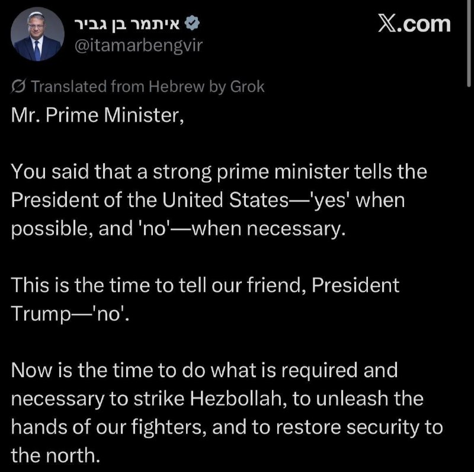

🔴 بن‌گویر، وزیر امنیت اسرائیل خطاب به نتانیاهو:

آقای نخست‌وزیر، تو خودت گفتی یه نخست‌وزیر قوی به رئیس‌جمهور آمریکا وقتی لازم باشه «آره» میگه و وقتی لازم باشه «نه»؛

الان وقتشه به دوست‌مون ترامپ بگی «نه».
الان وقتشه کاری که لازمه رو انجام بدیم، به حزب‌الله حمله کنیم، دست نیروهامون رو باز بذاریم و امنیت رو به شمال اسرائیل برگردونیم.

@Dirty_Kids 👻

## Dirty_Kids — post 390774

  <a href="telegram/content/Dirty_Kids_390774_1780351185.mp4" target="_blank">🎬 Download video</a>

🔴 وایرال ترین آهنگ این روزا با محتوای کاملا فاخر و آموزنده با نویسندگی تتلو🔥

+ هندزفری لازم🔞

@Dirty_Kids 👻

## Dirty_Kids — post 390773

  <a href="telegram/content/Dirty_Kids_390773_1780351187.mp4" target="_blank">🎬 Download video</a>

وقتی درگیری اجتناب‌ناپذیره، باید چیکار کرد؟ [حمله‌ی پیش‌دستانه]🛡️♟

@Dirty_Kids 👻

## Dirty_Kids — post 390772

  

فهمیدید چرا این بلاگرای دوزاری صدای مردم نیستن؟ یا تو شبکه افق هم برن

@Dirty_Kids 👻

## Hranews — post 113315

  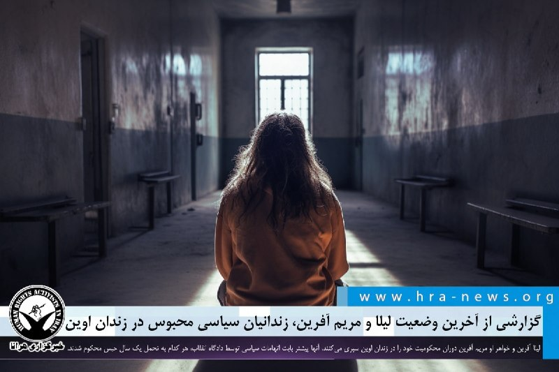

گزارشی از آخرین وضعیت لیلا و مریم آفرین، زندانیان سیاسی محبوس در زندان اوین

❗️
❗️
❗️
❗️
❗️– لیلا آفرین و مریم آفرین، زندانیان سیاسی، دوران محکومیت حبس خود را در زندان اوین سپری می‌کنند. این دو خواهر پیشتر بابت اتهامات سیاسی توسط دادگاه انقلاب، هر کدام به تحمل یک سال حبس محکوم شدند.

به گزارش خبرگزاری هرانا، ارگان خبری مجموعه فعالان حقوق بشر در ایران، لیلا و مریم آفرین، زندانیان سیاسی، در حال تحمل دوران محکومیت خود در زندان اوین هستند.

یک منبع مطلع نزدیک به خانواده این زندانیان ضمن تایید این خبر به هرانا گفت: ” لیلا آفرین، حدودا ۳۰ ساله و خواهرش مریم آفرین، پیشتر توسط دادگاه انقلاب تهران با اتهامات سیاسی هر یک به تحمل یک سال حبس محکوم شدند.”

وی افزود: “این دو خواهر مورخ ۱۹ آذر ۱۴۰۴ به بند زنان زندان اوین منتقل شده و در حال تحمل دوران محکومیت خود هستند.”

ادامه مطلب

#مریم_آفرین #لیلا_آفرین

↘️
@hranews_bot تماس ✉️ - @Hranews کانال هرانا 🆑

## Hranews — post 113314

اجرای حکم اعدام دو زندانی در زندان های سبزوار و نیشابور/ رهایی یک زندانی از چوبه‌دار

❗️
❗️
❗️
❗️
❗️– حکم دو زندانی که پیشتر از بابت اتهام قتل به اعدام محکوم شده بودند، در زندان های نیشابور و سبزوار اجرا شد. از سوی دیگر، یک زندانی محکوم به اعدام با رضایت اولیای دم از مجازات مرگ رهایی یافت. همچنین، رئیس کل دادگستری استان آذربایجان‌غربی از کسب رضایت اولیای دم در ۹ پرونده اعدام خبر داد.

ادامه مطلب

#عیسی_شکوریان #محمد_حکیمی #اعدام

↘️
@hranews_bot تماس ✉️ - @Hranews کانال هرانا 🆑

## Hranews — post 113313

دستکم ۲ تجمع اعتراضی برگزار شد

❗️
❗️
❗️
❗️
❗️– روز گذشته، شماری از اساتید اخراجی دانشگاه فرهنگیان در مقابل ساختمان‌ وزارت آموزش و پرورش در تهران و گروهی از شهروندان ساکن روستای دهنو واقع در شهرستان دورود، در اعتراض به تداوم قطع آب در این روستا، #تجمع_اعتراضی برگزار کردند.

ادامه مطلب

↘️
@hranews_bot تماس ✉️ - @Hranews کانال هرانا 🆑

## Hranews — post 113312

اهواز؛ مسمومیت ۴ کارگر در سایه فقدان ایمنی کار

❗️
❗️
❗️
❗️
❗️– در سایه فقدان ایمنی محیط و شرایط نامناسب کار، چهار #کارگر در اهواز حین انجام کار، بر اثر نشت و انتشار مواد پودری از یک رآکتور صنعتی، مسموم شدند.

ادامه مطلب

↘️
@hranews_bot تماس ✉️ - @Hranews کانال هرانا 🆑

## Hranews — post 113311

جرائم مواد مخدر؛ یک زندانی در زندان قم اعدام شد

❗️
❗️
❗️
❗️
❗️– حکم اعدام یک زندانی که پیشتر از بابت اتهامات مرتبط با جرائم مواد مخدر به #اعدام محکوم شده بود، روز دوشنبه ۴ خردادماه، در زندان قم اجرا شد.

ادامه مطلب

#بهنام_حسنیانی

↘️
@hranews_bot تماس ✉️ - @Hranews کانال هرانا 🆑

## Hranews — post 113310

نریمان فرهادی به دادسرای اهواز احضار شد

❗️
❗️
❗️
❗️
❗️– نریمان فرهادی، از اعضای کانون صنفی فرهنگیان خوزستان، به شعبه ۲۲ بازپرسی دادسرای اهواز احضار شد.

ادامه مطلب

#نریمان_فرهادی

↘️
@hranews_bot تماس ✉️ - @Hranews کانال هرانا 🆑

## Hranews — post 113309

  

امیرحسین سعادت در تبریز بازداشت شد

❗️
❗️
❗️
❗️
❗️– امروز دوشنبه ۱۱ خرداد، امیرحسین سعادت، دبیر پیشین شورای صنفی دانشگاه علامه طباطبایی، توسط ماموران اداره اطلاعات در تبریز #بازداشت و به مکان نامعلومی منتقل شد. همزمان، منزل وی مورد تفتیش قرار گرفت و شماری از لوازم شخصی این شهروند نیز توسط ماموران ضبط شد.

به گزارش خبرگزاری هرانا، ارگان خبری مجموعه فعالان حقوق بشر در ایران، امیرحسین سعادت در تبریز بازداشت شد.

بر اساس اطلاعات دریافتی هرانا، آقای سعادت صبح امروز بدون ارائه حکم قضایی توسط ماموران اداره اطلاعات در محل کار خود بازداشت و به مکان نامعلومی منتقل شد. بازداشت وی با خشونت و ضرب و شتم همراه بوده است.
یک منبع مطلع نزدیک به خانواده این شهروند ضمن تایید این موضوع به هرانا گفت: “وی طی یک تماس تلفنی کوتاه با خانواده‌اش از بازداشت خود خبر داده اما به محل نگهداری خود اشاره‌ای نکرده است. همزمان منزل امیرحسین توسط ماموران مورد تفتیش قرار گرفته است. در جریان این بازرسی، شماری از وسایل شخصی وی از جمله تلفن همراه، لپ‌تاپ و پاسپورت او ضبط شده است.”

ادامه مطلب

#امیرحسین_سعادت

↘️
@hranews_bot تماس ✉️ -  @Hranews  کانال هرانا 🆑

## Hranews — post 113308

  

سمیرا نوروز ناصری در تهران بازداشت شد

❗️
❗️
❗️
❗️
❗️– امروز دوشنبه، سمیرا نوروز ناصری، فیلمساز ساکن تهران پس از تفتیش منزلش توسط نیروهای امنیتی #بازداشت و به مکانی نامعلوم منتقل شده است.

به گزارش خبرگزاری هرانا، ارگان خبری مجموعه فعالان حقوق بشر در ایران، سمیرا نوروز ناصری بازداشت شد.

بر اساس اطلاعات دریافتی هرانا، بازداشت خانم نوروز ناصری صبح امروز دوشنبه ۱۱ خردادماه، توسط نیروهای امنیتی بدون ارائه حکم قضایی صورت گرفته است. ماموران همچنین اقدام به تفتیش منزل این کارگردان کرده‌اند.

ادامه مطلب

#سمیرا_نوروز_ناصری

↘️
@hranews_bot تماس ✉️ -  @Hranews  کانال هرانا 🆑

## Hranews — post 113307

  

سعید پیوندی: قانون تشدید مجازات جاسوسی، دشمنی میان جامعه و حکومت را بیش‌تر می‌کند/ نفیسه شرف‌الدینی

📡
📡
📡
📡
📡– پس از تصویب و ابلاغ «قانون تشدید مجازات جاسوسی و همکاری با رژیم صهیونیستی و کشورهای متخاصم علیه امنیت و منافع ملی»، بحث‌های گسترده‌ای درباره‌ی پیامدهای حقوقی، سیاسی و اجتماعی این قانون شکل گرفته است. بسیاری از منتقدان معتقدند که گسترش مفاهیمی چون «همکاری با دولت متخاصم»، «فعالیت امنیتی» و «اقدام علیه امنیت ملی» می‌تواند مرز میان فعالیت‌های مدنی، علمی، رسانه‌ای و امنیتی را بیش از پیش مبهم کرده و زمینه‌ی گسترش نظارت، کنترل و سرکوب اجتماعی را فراهم کند. ماهنامه‌ی خط صلح برای بررسی ابعاد جامعه‌شناختی این قانون، تاثیر آن بر آزادی‌های مدنی، اعتماد اجتماعی، خودسانسوری و امنیتی‌سازی جامعه، با «سعید پیوندی»، جامعه‌شناس ایرانی و مدیر مرکز تحقیقاتی LISEC-Lorraine در دانشگاه لورن، به گفتگو نشسته است.

متن گفتگو با سعید پیوندی را در ادامه می‌خوانید:

قانون «تشدید مجازات جاسوسی و همکاری با رژیم صهیونیستی و کشورهای متخاصم علیه امنیت و منافع ملی» چگونه مفهوم «امنیت» را از یک مقوله‌ی صرفاً حقوقی ـ امنیتی به ابزاری برای تنظیم و کنترل روابط اجتماعی، رسانه‌ای و حتی علمی گسترش می‌دهد؟ آیا می‌توان آن را نمونه‌ای از «امنیتی‌سازی» جامعه، در معنای جامعه‌شناختی، دانست؟

از نظر من، این قانون و اقدامات کنونی دستگاه قضایی ایران، سازمان‌های اطلاعاتی و نیروهای انتظامی، همه در همین چارچوب قرار می‌گیرند. یعنی ما با یک فرآیند فراگیر امنیتی‌سازی در جامعه‌ی ایران سروکار داریم و هرکسی هم می‌تواند با این تعریف، در حوزه‌هایی چون همکاری با کشورهای خارجی یا کشورهای متخاصم، فعالیت‌های امنیتی و مانند آن، متهم شود. می‌توان گفت که حکومت، از نظر خودش، تلاش می‌کند نوعی بازدارندگی برای همکاری‌های احتمالیِ برخی افراد جامعه با نیروهای خارجی ایجاد کند. اما در عمل، معنای این امر این است که حکومت به همه‌ی غیرخودی‌ها، به نوعی، مشکوک خواهد بود.

ادامه مطلب

ادامه و لینک به مطلب در وبسایت خط صلح

#سعید_پیوندی
#نفیسه_شرف‌الدینی

↘️
@hranews_bot تماس ✉️ - @Hranews کانال هرانا 🆑

## Hranews — post 113306

گزارشی از بازداشت یک شهروند در شهرستان مهرستان

❗️
❗️
❗️
❗️
❗️– روز شنبه، عبدالمالک دهانی، شهروند اهل شهرستان مهرستان واقع در استان سیستان و بلوچستان، توسط ماموران امنیتی در این شهرستان #بازداشت و به مکانی نامعلوم منتقل شده است.

ادامه مطلب

#عبدالمالک_دهانی

↘️
@hranews_bot تماس ✉️ -  @Hranews  کانال هرانا 🆑

## Hranews — post 113305

روز یکشنبه ۱۰ خردادماه، شماری از شهروندان ساکن روستای دهنو واقع در شهرستان دورود، در اعتراض به تداوم قطع آب در این روستا دست به #تجمع_اعتراضی زدند.

به گفته این شهروندان معترض، در طول ۱۰ تا ۱۵ روز گذشته آب شرب این روستا به طور کامل قطع بوده است. این موضوع موجب مختل شدن زندگی روزمره مردم شده و بسیاری از خانواده‌ ها از ابتدایی‌ترین نیازهای بهداشتی مانند استحمام محروم مانده‌اند. همچنین، علیرغم پیگیری‌ های مکرر شهروندان از فرمانداری، بخشداری و اداره آب و فاضلاب، تاکنون اقدام مؤثری برای رفع این مشکل صورت نگرفته است.

↘️
@hranews_bot تماس ✉️ - @Hranews کانال هرانا 🆑

## Hranews — post 113304

  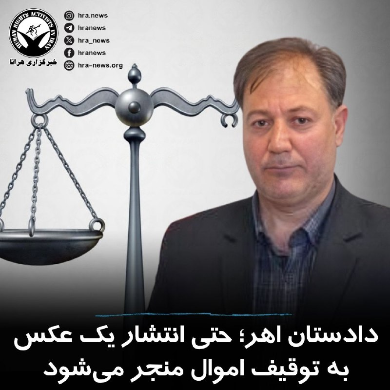

دادستان عمومی و انقلاب شهرستان اهر، با اشاره به #توقیف_اموال ایرانیان مقیم خارج از کشور، اظهار داشت که حتی انتشار یک عکس یا ویدیو نیز می‌تواند مشمول مجازات توقیف اموال شود.

این مقام قضایی افزود: «مجازات توقیف اموال به‌صورت مستقل و کاملاً جدا از مجازات حبس یا اعدام اعمال می‌شود.»

↘️
@hranews_bot تماس ✉️ - @Hranews کانال هرانا 🆑

## manototv — post 105898

  <a href="telegram/content/manototv_105898_1780351190.mp4" target="_blank">🎬 Download video</a>

سخنان عزت‌الله همایون‌فر، ادیب و سیاستمدار، درباره روحیه قوی ملت ایران و ریشه‌های آن در سی قرن تاریخ کشور

## alonews — post 124348

  <a href="telegram/content/alonews_124348_1780351192.webm" target="_blank">🎬 Download video</a>

👈ترامپ: فعلا جنگ نمیکنیم

✅ @AloNews خبر جنگ

## alonews — post 124347

  <a href="telegram/content/alonews_124347_1780351192.webm" target="_blank">🎬 Download video</a>

👈رئیس جمهور ترامپ:
امروز با بی بی نتانیاهو صحبت کردم و از او خواستم که به حمله بزرگی به بیروت لبنان نپردازد. اون سربازاش رو برگردوند ممنون بیبی

🔴من همچنین با نمایندگان رهبران حزب الله صحبت کردم ، و آنها موافقت کردند که تیراندازی به اسرائیل و سربازانش را متوقف کنند. به همین ترتیب ، اسرائیل موافقت کرد که به آنها شلیک نکند.

🔴بذار ببینیم چقدر طول میکشه-امیدوارم برای ابدیت باشه!‌‌

✅ @AloNews خبر جنگ

## alonews — post 124346

  <a href="telegram/content/alonews_124346_1780351192.mp4" target="_blank">🎬 Download video</a>

فیلم وایرال شده از بلاگر روسی در کافه‌ای زیر زمینی در تهران با حضور جواد یساری

[@AloTweet]

## alonews — post 124344

  <a href="telegram/content/alonews_124344_1780351194.webm" target="_blank">🎬 Download video</a>

💔جاویدنام حامد بیابانی، ۲۴ ساله، اصالتاً کُردِ کرمانشاه و ساکن پرند بود.

🔴شب ۱۸ دی، در تهرانپارس، وقتی دوست صمیمی‌اش جاویدنام علیرضا صحت‌بخش هدف گلوله قرار گرفت، حامد خودش را به خطر انداخت و به سمت او رفت تا کمکش کند و او را از محل تیراندازی عقب بکشد؛ اما در همان لحظه خودش هم هدف گلوله جنگی قرار گرفت. گلوله به گلوی حامد خورد و جانش را گرفت.

🔴خانواده‌اش تصمیم گرفتند پیکر او را به سنقر، از توابع کرمانشاه، ببرند؛ شهری که ریشه و اصالت مادری‌شان به آنجا بازمی‌گشت.

🔴حامد از آن آدم‌هایی بود که عاشق زندگی‌اند؛ اجتماعی، شوخ‌طبع، پرانرژی و سرشار از شور. هر جا می‌رفت، فضا را زنده می‌کرد، جمع را به هیجان می‌آورد و لبخند روی لب‌ها می‌نشاند.

🔴حامد بیابانی و علیرضا صحت‌بخش دو رفیق صمیمی بودند؛ هر دو ۲۴ ساله، هر دو ساکن پرند، و هر دو در تهرانپارس با گلوله جنگی کشته شدند؛ علیرضا با گلوله‌ای به قلب و حامد وقتی برای کمک به او رفت، با گلوله‌ای به گلو.

🤔عرزشی حرام زاده، اینها تروریست بودن که به قتل رسوندینشون؟ ادعای عدل علی هم دارید.

✅@AloNews

## alonews — post 124343

  <a href="telegram/content/alonews_124343_1780351194.webm" target="_blank">🎬 Download video</a>

👈باقر:
ایران نه تنها روند گفتگو را متوقف خواهد کرد بلکه اگر اسرائیل حملات در لبنان را متوقف نکند،
مستقیماً به اسرائیل حمله خواهد کرد.

✅ @AloNews خبر جنگ

## alonews — post 124342

  <a href="telegram/content/alonews_124342_1780351194.webm" target="_blank">🎬 Download video</a>

👈ترامپ: مردم ایران مرا دوست دارند زیرا رژیم را عوض کردم

✅ @AloNews خبر جنگ

## alonews — post 124341

  <a href="telegram/content/alonews_124341_1780351194.webm" target="_blank">🎬 Download video</a>

👈ترامپ: «کار ساده‌ای نیست. شما درباره یک کشور واقعاً بزرگ صحبت می‌کنید، آنها یک کشور بسیار بزرگ هستند که می‌خواهد توافق کند. خصومت فوق‌العاده‌ای وجود دارد، واقعاً.»

🔴او ادامه داد: «بنابراین این کار برای آنها آسان نیست. در واقع از منظر ما هم آسان نیست. اما ما داریم آنچه را که نیاز داریم به دست می‌آوریم.»

✅ @AloNews خبر جنگ

## alonews — post 124340

  <a href="telegram/content/alonews_124340_1780351194.webm" target="_blank">🎬 Download video</a>

👈ترامپ در گفت‌وگو با ای‌بی‌سی:
من هنوز این توافق را تأیید نکرده‌ام و هنوز چند نکته دیگر باقی مانده است که باید تضمین شود.

🔴من هنوز با این توافق موافقت نکرده‌ام و هنوز باید چند امتیاز دیگر بگیرم.

✅ @AloNews خبر جنگ

## alonews — post 124339

  <a href="telegram/content/alonews_124339_1780351195.webm" target="_blank">🎬 Download video</a>

👈ترامپ: شاید این هفته با ایران به توافق برسیم

✅ @AloNews خبر جنگ

## alonews — post 124338

  <a href="telegram/content/alonews_124338_1780351195.webm" target="_blank">🎬 Download video</a>

👈ترامپ:
امروز یک مشکل کوچک پیش آمد، ایرانی‌ها از حملات اسرائیل به لبنان ناراحت بودند.

🔴بنابراین من با حزب‌الله صحبت کردم و گفتم تیراندازی نکنید، و با بی‌بی (نتانیاهو) صحبت کردم و گفتم تیراندازی نکنید، و هر دو تیراندازی به سمت یکدیگر را متوقف کردند.

✅ @AloNews خبر جنگ

## alonews — post 124337

  <a href="telegram/content/alonews_124337_1780351195.webm" target="_blank">🎬 Download video</a>

👈ترامپ: صلح با ایران شاید حتی بهتر از پیروزی نظامی باشد‌‌

✅ @AloNews خبر جنگ

## alonews — post 124336

  <a href="telegram/content/alonews_124336_1780351195.webm" target="_blank">🎬 Download video</a>

👈فرانسه: ورود نظامی اسرائیل به داخل لبنان یک اشتباه استراتژیک است

🔴«ژروم بونافو»، نماینده فرانسه در جلسه شورای امنیت درباره لبنان گفت:

🔴ما خواستار برگزاری این نشست اضطراری در پاسخ به تشدید تنش‌های بزرگ اسرائیل در لبنان شدیم.

🔴هیچ چیز نمی‌تواند ادامه عملیات نظامی اسرائیل در لبنان را توجیه کند.

🔴نفوذ رو به افزایش اسرائیل به داخل خاک لبنان، یک اشتباه استراتژیک بزرگ محسوب می‌شود.

✅ @AloNews خبر جنگ

## alonews — post 124335

👈توییت جدید کاخ سفید:

«به ترامپ اعتماد کنید.
فقط بنشینید و آرام باشید، در نهایت همه‌چیز خوب پیش خواهد رفت — همیشه همین‌طور بوده است!»
— رئیس‌جمهور دونالد جی. ترامپ 🇺🇸


✅ @AloNews خبر جنگ

## alonews — post 124334

  <a href="telegram/content/alonews_124334_1780351195.mp4" target="_blank">🎬 Download video</a>

💢تاج: ۱۰۰ هزار دلار به مالی برای بازی دوستانه پول دادیم؛ هزینه پرواز و هتل‌شان را هم پرداخت کردیم.

@AloSport

## alonews — post 124333

  <a href="telegram/content/alonews_124333_1780351197.mp4" target="_blank">🎬 Download video</a>

👈اگه واستون سواله که موج انفجارِ نزدیک چه شکلیه؛

🔴این ویدئو از حمله به تهران رو تا آخر ببینید

✅ @AloNews خبر جنگ

## alonews — post 124331

  <a href="telegram/content/alonews_124331_1780351198.webm" target="_blank">🎬 Download video</a>

💔جاوید نام سید داوود امامی 39 ساله، دارای دو فرزند، از شهر میبد.

🔴هیچ کجا اسمی از این جوان که در 39 سالگی پیر و جاویدنام شد نیومده.

🔴رنج زندگی رو تو چهرش میبینید؟ هم وطن ماست

🤔عرزشی حرام زاده، این تروریست بود که با اسلحه به قتل رسوندینش؟

✅@AloNews

## alonews — post 124330

  <a href="telegram/content/alonews_124330_1780351199.webm" target="_blank">🎬 Download video</a>

👈عوستاد خوش چشم: جنگ نمیشه

✅ @AloNews خبر جنگ

## alonews — post 124328

  <a href="telegram/content/alonews_124328_1780351199.webm" target="_blank">🎬 Download video</a>

👈عجیب اما واقعی
‼️ 
🔴سپاه قم اومد یه بمب عمل نکرده از جنگ رو خنثی کنه و ۲سپاهی بر اثر انفجار کشته شدن و بمب خنثی شد 
✅ @AloNews خبر جنگ

---
📅 بروزرسانی: 1405/03/11 16:01
---

## VahidOOnLine — post 243220

  

علی نیکزاد، نایب‌رییس مجلس گفت: «رهبری اگر مصلحت بداند و دستور بدهد، ما می‌توانیم جلسه علنی را با تعدادی از نمایندگان در صحن و سایرین به‌صورت مجازی برگزار کنیم.»

نیکزاد اضافه کرد که بنا بر مصوبه شورای عالی امنیت ملی، «تجمع یک‌جای مجلس» پذیرفتنی نیست.
‌🏁 🇬🇧 IranintlTV

🤖 @VahidOOnLine

## VahidOOnLine — post 243219

  

ابراهیم رضایی، سخنگوی کمیسیون امنیت ملی مجلس گفت: «اگر توافقی صورت بگیرد باید به گونه‌ای باشد که هر کسی آن را می‌بیند، بداند جمهوری اسلامی برنده آن است و اگر توافق نشود و به میدان جنگ بازگردیم، قدرتمندتر از قبل خواهیم بود و اگر دشمن بخواهد به سمت ترور برود، پیش‌بینی‌های لازم را کرده‌ایم.»

او ادامه داد: «جمهوری اسلامی در حوزه دفاعی قدرتمندتر از ۹ اسفند است و دشمن از زمان آغاز جنگ ضعیف‌تر شده است.»
‌🏁 🇬🇧 IranintlTV

🤖 @VahidOOnLine

## VahidOOnLine — post 243211

  <a href="telegram/content/VahidOOnLine_243211_1780317091.mp4" target="_blank">🎬 Download video</a>

حمله گزارش‌شده آمریکا به اهدافی در جنوب ایران، از نظر دامنه محدود بود، اما از نظر پیام نظامی اهمیت داشت. بر اساس روایت آمریکا، این حمله پس از سرنگونی یک پهپاد آمریکایی بر فراز آب‌های بین‌المللی انجام شد و سایت‌های راداری و مراکز فرماندهی و کنترل پهپادی جمهوری اسلامی در سیریک و جزیره قشم را هدف قرار داد.
‌🏁 🇬🇧 ManotoTV

🤖 @VahidOOnLine

## VahidOOnLine — post 243210

  <a href="telegram/content/VahidOOnLine_243210_1780317093.mp4" target="_blank">🎬 Download video</a>

در پی راه‌اندازی کارزار مردمی رشت از سوی ایران‌اینترنشنال برای شناسایی جاویدنامان و کشف ابعاد جنایات جمهوری اسلامی در این شهر، ویدیویی به دست ما رسیده که خودروهای زیادی را در آرامستان شهر در ۲۱ دی ۱۴۰۴ نشان می‌دهد. به گفته شاهدان، جمعیت زیادی برای خاکسپاری جاویدنام خود در این روز به آرامستان آمدند.
پیش‌تر ویدیوهایی هم از صف خودروها در ۲۰ دی به دست ایران‌اینترنشنال رسیده بود.
‌🏁 🇬🇧 IranintlTV

🤖 @VahidOOnLine

## VahidOOnLine — post 243209

  

نمایندگان مجلس شورای اسلامی در بیانیه‌ای از پیام مکتوب منتسب به مجتبی خامنه‌ای «قدردانی» کرده و آن را «دقیق، متقن، جامع و راهگشا» خواندند.

در بخشی از بیانیه نمایندگان مجلس آمده: «به خود می‌بالیم که از نعمت ولایت برخورداریم و عهد خود را با امام انقلاب تازه می‌کنیم.»
‌🏁 🇬🇧 IranintlTV

🤖 @VahidOOnLine

## VahidOOnLine — post 243208

🗣روایت شما از بحران اقتصادی و زندگی در آتش‌بس- دوشنبه ۱۱ خرداد:

🔹از مشهد پیام می‌دم، همه‌چی گرون شده، من ۴ تا بچه دارم، دیشب گوشی‌ام رو فروختم که بتونم خرج زندگی‌ام رو بدم، دیگه چیزی ندارم، دستم شکسته و دادرسی ندارم.

🔹دو ماه و نیم است که انسولین خودکاری آپیدرا برای من دیابتی پیدا نمی‌شه. یک ماه هست که سِرُم نمکی پیدا نمی‌شه.

🔹دو ورق قرص اعصاب خریدم شد یک میلیون تومان.

🔹رفتم داروخانه سه قلم قرص ضروری خریدیم شد ۴ میلیون تومان.

🔹گوشی آیفون ۱۵ رو با هزار بدبختی خریدم. حالا افتاده زمین و ال‌سی‌دی‌اش شکسته. جرات نمی‌کنم برم قیمت کنم چه برسه به اینکه درستش کنم.

🔹از شیراز: یک شانه تخم‌مرغ و یک پنیر جمعاً شد یک میلیون تومان. دیگه با این قیمتای سرسام‌آور نمی‌شه زندگی کرد.

🔹وضعیت جوری شده که من دانشجوی لیسانس کامپیوتر برای اینکه شهریه‌ام رو بدم مجبورم لپ‌تاپی که باهاش کارای دانشگاهی و روزمره‌ام رو انجام می‌دم رو بفروشم.

🔹درمانگاه خاتم رودهن برای عکس opg دندان ۹۹۰ هزار تومان هزینه می‌گیرد. همین خدمات پارسال ۳۵۰ هزار تومان بود.

🔹من یه سوپر مارکت کوچیک دارم، قیمت اجناس هر چند روز افزایش پیدا می‌کنه و به جایی رسیده که دیگه مردم توان خرید ندارند. حتی خود من هم دیگه توان خرید اجناس جدید برای مغازه رو ندارم.

🔹هزینه باشگاه عادی از یک میلیون و خورده‌ای شده نزدیک سه میلیون تومان.

🔹از رشت: امروز بعد یکسال رفتم یه کتونی معمولی بخرم دیدم شده ۳ میلیون. واقعا از شدت غصه قلبم درد گرفت. ما چه گناهی کردیم که عمرمون با این حکومت قاتل باید هدر بشه. تمام زندگیمون فقط شده حسرت. دویدن و هرگز نرسیدن.
‌🏁 🇬🇧 IranintlTV

🤖 @VahidOOnLine

## VahidOOnLine — post 243207

  

⭕️قیمت نفت در پی حملات سپاه و سنتکام در خلیج فارس بار دیگر افزایش یافت

♦️قیمت نفت دربازارهای جهانی، روز دوشنبه ۱۱ خرداد و همزمان با ادامه تردیدها درباره سرنوشت مذاکرات تهران و واشنگتن و ساعاتی پس از حملات متقابل سنتکام به یک دکل مخابراتی در منطقه سیریک استان هرمزگان و حمله موشکی سپاه به کویت، پس از چند روز کاهش، بار دیگر افزایش یافت.

بهای نفت خام برنت دریای شمال، صبح دوشنبه و همزمان با آغاز به کار بازارهای اروپایی در نخستین روز هفته، با بیش از سه درصد افزایش از ۹۴ دلار گذشت اما در ساعات بعد با اندکی کاهش به ۹۳ دلار و ۸۱ سنت رسید.

با وجود ابهام در سرنوشت مذاکرات و در حالیکه وضعیت تنگه هرمز در کوتاه‌مدت روشن نیست، بازارهای جهانی همچنان امیدوارانه منتظر پایان بحران در خاورمیانه هستند.
‌🇸🇦 Indypersian

🤖 @VahidOOnLine

## VahidOOnLine — post 243206

  

♦️عباس عراقچی، وزیر امور خارجه جمهوری اسلامی روز دوشنبه ۱۱ خردادماه درباره ادامه حملات اسرائیل به لبنان هشدار داد.

عراقچی با انتشار پیامی در اکس نوشت:‌ «آتش‌بس میان ایران و ایالات متحده، بدون هیچ ابهامی، آتش‌بسی در تمامی جبهه‌ها، از جمله لبنان، محسوب می‌شود.
نقض این آتش‌بس در هر یک از جبهه‌ها، به منزله نقض آن در تمامی جبهه‌ها است.»
وزیر امور خارجه جمهوری اسلامی که این پیام را با عبارت «برای توجه فوری» منتشر کرد، ایالات متحده و اسرائیل را «مسئول پیامدهای هرگونه نقض  آتش‌بس» خواند.

پیش از این محمدباقر قالیبافِ رئیس مجلس شورای اسلامی و ابولفضل شکارچی، سخنگوی ارشد نیروهای مسلح جمهوری اسلامی هم درباره ادامه حملات اسرائیل به جنوب لبنان به‌شدت هشدار داده بودند.

جمهوری اسلامی و پاکستان، میانجی مذاکرات تهران و واشنگتن، از زمان برقراری آتش‌بس گفته بودند که این توافق شامل لبنان هم می‌شود اما اسرائیل و آمریکا این «برداشت» از توافق آتش‌بس را نپذیرفتند.
‌🇸🇦 Indypersian

🤖 @VahidOOnLine

## VahidOOnLine — post 243205

  

صالح اسکندری، عضو جریان اصولگرای «شریان» در گفت‌وگو با خبرگزاری فارس، وابسته به سپاه پاسداران، از راه‌اندازی پویش «فعال شدن قطع داوطلبانه دسترسی به اینترنت بین‌الملل»، خبر داد و اعلام کرد هدف این پویش «افزایش امنیت سایبری خانواده‌ها و صیانت از حریم خصوصی شهروندان» است.

او با اشاره به جنگ اخیر گفت تهدیدهای سایبری و رهگیری داده‌ها به یکی از مهم‌ترین چالش‌های امنیتی تبدیل شده‌اند.
اسکندری افزود کاربران باید حق داشته باشند در صورت تمایل، دسترسی خود به اینترنت بین‌الملل را قطع کرده و تنها از خدمات داخلی و شبکه ملی اطلاعات استفاده کنند.

به گفته او، این پویش به دنبال محدودسازی اجباری اینترنت نیست، بلکه هدف آن فراهم کردن حق انتخاب برای شهروندان است.

جمهوری اسلامی پس از حدود سه ماه قطعی اینترنت بین‌الملل، در روزهای اخیر آن را وصل کرده اما همچنان از فیلترینگ شدید و گسترده، برای جلوگیری از اتصال شهروندان به آن استفاده می‌کند.
‌🏁 🇬🇧 IranintlTV

🤖 @VahidOOnLine

## VahidOOnLine — post 243204

  

♦️رسانه‌های داخلی ایران روز دوشنبه ۱۱ خرداد از قتل دو دانشجو در دانشگاه قزوین خبر دادند.

به گزارش میزان (خبرگزاری قوه قضائیه)‌دادستان عمومی و انقلاب قزوین با اعلام این خبر گفت: «در ساعات اولیه صبح، یک دانشجوی پسر سال آخر دندانپزشکی با ورود به بخش درمانگاه دانشکده، با شلیک سلاح کلت جنگی یک دانشجوی دختر هم‌دوره‌ای خود را به قتل رساند.»

به‌گفته این مقام قضایی «بررسی‌های اولیه نشان می‌دهد این دو دانشجو که در آستانه فارغ‌التحصیلی قرار داشتند، در مرحله متارکه از یک رابطه عاطفی بوده و پیش از این نیز اختلافات خانوادگی شدیدی با یکدیگر داشتند.»

براساس این گزارش، ضارب پس از شلیک چهار گلوله به سینه همکلاسی‌اش در درمانگاه با شلیک یک گلوله جان خودش را گرفت.
‌🇸🇦 Indypersian

🤖 @VahidOOnLine

## VahidOOnLine — post 243203

  

عباس عراقچی، وزیر خارجه در ایکس نوشت: «آتش‌بس میان جمهوری اسلامی و ایالات متحده، بدون هیچ ابهامی، آتش‌بسی در تمامی جبهه‌ها، از جمله لبنان محسوب می‌شود و نقض آتش‌بس در هر یک از جبهه‌ها، به منزله نقض آن در تمامی جبهه‌ها است.»

او آمریکا و اسرائیل را مسئول پیامدهای نقض آتش‌بس خواند.

پیش‌تر سخنگوی ارشد نیروهای مسلح جمهوری اسلامی، ادامه حملات اسرائیل به لبنان را «غیر قابل تحمل» خوانده بود.
iranintl
‌🏁 🇬🇧 IranintlTV

🤖 @VahidOOnLine

## VahidOOnLine — post 243202

  

کایا کالاس، مسئول سیاست خارجی اتحادیه اروپا در نشست خبری مشترک با وزیر خارجه پاکستان در اسلام‌آباد، گفت که این اتحادیه آماده است به تلاش‌ها برای دستیابی به راه‌حلی پایدار برای درگیری آمریکا و جمهوری اسلامی کمک کند.

او افزود: «میانجی‌گری پاکستان میان آمریکا و جمهوری اسلامی به جلوگیری از بازگشت به یک جنگ تمام‌عیار کمک کرده است.»
iranintl
‌🏁 🇬🇧 IranintlTV

🤖 @VahidOOnLine

## VahidOOnLine — post 243201

امیرمهدی کشاورز، فوتبالیست ۱۷ ساله، در جریان انقلاب ملی ایرانیان علیه جمهوری اسلامی، جمعه ۱۹ دی‌ماه ۱۴۰۴، در اعتراضات زیباشهر (محمدیه) در قزوین، با شلیک دو گلوله جنگی از سوی نیروهای سرکوب، به قتل رسید.
‌🏁 🇬🇧 IranintlTV

🤖 @VahidOOnLine

## WithYashar — post 13146

  

صداسیما طی خبری فوری:

نیروهای مسلح : حمله متوقف نکنن علیه لبنان ماهم حمله میکنیم
@withyashar

## WithYashar — post 13145

فرماندهی مرکزی ایالات متحده (سنتکام) اعلام کرده است که دو موشک بالستیک رژیم جمهوری اسلامی دیشب ساعت ۱۱ شب به وقت شرقی(۶:۳۰ صبح تهران)به سمت نیروهای آمریکایی در کویت شلیک شده است. موشک‌های ورودی سرنگون شدند و هیچ آسیبی به پرسنل آمریکایی وارد نشد.
@withyashar

## WithYashar — post 13144

## WithYashar — post 13143

  <a href="telegram/content/WithYashar_13143_1780317104.mp4" target="_blank">🎬 Download video</a>

گزارش فاکس نیوز از چند حمله آمریکا به قشم !
@withyashar

## WithYashar — post 13142

تانکرترکرز: چهار نفتکش ایرانی با محموله هفت میلیون بشکه‌ای به ایران بازگردانده شدند و نتوانستند محاصره آمریکا را بشکنن
@withyashar

## WithYashar — post 13141

عراقچی: آتش‌بس میان ایران و ایالات متحده، بدون هیچ ابهامی، آتش‌بسی در تمامی جبهه‌ها، از جمله لبنان، محسوب می‌شود.
نقض این آتش‌بس در هر یک از جبهه‌ها، به منزله نقض آن در تمامی جبهه‌ها است.
ایالات متحده و اسرائیل مسئول پیامدهای هرگونه نقض این آتش‌بس خواهند بود.
@withyashar

## WithYashar — post 13140

  <a href="telegram/content/WithYashar_13140_1780317106.mp4" target="_blank">🎬 Download video</a>

کوچ جمعی مردم بیروت پس از هشدار اسرائیل به بمباران
@withyashar

## WithYashar — post 13139

علیرضا فغانی به اولین داور تاریخ تبدیل شد که در ۴ جام جهانی قضاوت میکند
@withyashar

## WithYashar — post 13138

اتاق جنگ با یاشار : اولین پرواز بازگشت زائران حج تمتع امروز ۱۱ خرداد ساعت ۱۶:۳۰ در مشهد به زمین می‌نشیند این عملیات ۱۱ روز دیگر ادامه دارد و در ۲۲ خرداد «جمعه» آخرین پرواز بازگشت انجام میشود , ۲۲ خرداد جمعه هفته دیگر ۲ روز قبل از‌ تولد دونالد ترامپ است و شب…

## WithYashar — post 13137

اتاق جنگ با یاشار : اولین پرواز بازگشت زائران حج تمتع امروز ۱۱ خرداد ساعت ۱۶:۳۰ در مشهد به زمین می‌نشیند این عملیات ۱۱ روز دیگر ادامه دارد و در ۲۲ خرداد «جمعه» آخرین پرواز بازگشت انجام میشود , ۲۲ خرداد جمعه هفته دیگر ۲ روز قبل از‌ تولد دونالد ترامپ است و شب آن مارکت هم برای آخر هفته بسته میشود
@withyashar
همچنین یک هفته بعد از آن یک آخر هفته طولانی داریم چون جمعه هم تعطیلی رسمی فدرال است جونتینث «روز پایان برده داری در آمریکا»۱۹ جوئن ۲۹ خرداد

## WithYashar — post 13136

گالانت : نتانیاهو اعلام کرده خاورمیانه دیگر جای حزب الله نیست و تا نابودی کامل جلو خواهیم رفت
@withyashar

## WithYashar — post 13135

قالیباف در توییتر(X):
«اعمال محاصرۀ دریایی و تشدید جنایات جنگی در لبنان توسط اسرائیل عدم پایبندی آمریکا به آتش‌بس است.

هر انتخابی، هزینه‌ای دارد و صورت‌حساب آن هم از راه می‌رسد؛ همه چیز سر جای خودش قرار خواهد گرفت.»
@withyashar

## WithYashar — post 13134

بنیامین نتانیاهو به همراه وزیر دفاع دستور حمله به ضاحیه بیروت را اعلام کردند
@withyashar

## WithYashar — post 13133

سخنگوی وزارت خارجه: ما حق دفاع مشروع در برابر نقض آتش‌بس توسط آمریکا را داریم و امروز هم مبدأ تجاوز به خاک کشور را هدف قرار دادیم.
@withyashar

## WithYashar — post 13132

ترامپ به نیوزویک : مردم ایران از من تشکر میکنند چون بجای یکبار، دوبار رژیم رو عوض کردم
@withyashar

## WithYashar — post 13131

داش جان جدت ری اکشن 🤣 رو باز کن

## WithYashar — post 13130

## WithYashar — post 13129

  

🥴🤣 @withyashar

## WithYashar — post 13128

اطلاعات تایید نشده بهم رسیده که اندیشه ترور هدفمند بوده شخص‌ مورد نظر مسئول قراردادهای بین صدا و سیما و قرارگاه خاتم‌الانبیا بود @withyashar

## WithYashar — post 13127

گزارش های از مشاهده خط شلیک موشک از همدان
@withyashar

## mwarmonitor — post 9976

🔴 گزارش‌هایی از انفجار نامشخص در کشتی عظیم MSC SARISKY V در خور عبدالله پس از تکمیل تخلیه محموله در بندر ام‌القصر در جنوب عراق منتشر شده است.

@mwarmonitor

## mwarmonitor — post 9975

  <a href="telegram/content/mwarmonitor_9975_1780317110.mp4" target="_blank">🎬 Download video</a>

✈️تجمع قابل‌توجه هواپیماهای سوخت رسان آمریکا در فرودگاه بن‌گوریون، تل‌آویو، اسرائیل

@mwarmonitor

## mwarmonitor — post 9974

🔴خبرنگار فاکس نیوز- تِرِی یینگست از تل‌آویو

🔸بله بچه‌ها، صبح بخیر. سنتکام (فرماندهی مرکزی آمریکا) می‌گوید نیروهای آمریکایی در طول آخر هفته حملاتی را علیه چندین هدف ایرانی انجام داده‌اند. این حملات به سیستم‌های راداری ایران و مراکز فرماندهی و کنترل پهپادها در کُورَکِ ایران، در امتداد ساحل و در جزیره قشم اصابت کرده است.
سنتکام این اقدام را با ماهیت دفاعی توصیف کرد تا از حمله ایران به مسیرهای کشتیرانی بین‌المللی جلوگیری کند؛ آن هم پس از اینکه ایران یک پهپاد ۴ میلیون دلاری آمریکایی را سرنگون کرد. ایرانی‌ها نیز در واکنش به این اقدام، بامداد امروز با پهپاد و موشک، کویت را هدف قرار دادند.
شب گذشته، پرزدنت ترامپ در شبکه اجتماعی «تروث سوشال» پست جدیدی منتشر کرد که بخشی از آن می‌گوید: «ایران واقعاً می‌خواهد به یک توافق دست یابد و این توافق برای ایالات متحده و کسانی که با ما هستند، خوب خواهد بود.» محمدباقر قالیباف، رئیس مجلس و مذاکره‌کننده ارشد ایران نیز روز یکشنبه درباره گفتگوهای جاری این‌چنین گفت:
«آنچه برای ما اهمیت دارد، دستاوردهای ملموسی است که باید به دست آوریم تا در مقابل، تعهدات خود را بپذیریم. تا زمانی که مطمئن نشویم حقوق ملت ایران را تامین کرده‌ایم، هیچ توافقی را تصویب نخواهیم کرد.»
🔴خبرنگار - تِرِی یینگست:
ما همچنین در حال رصد تحولات درگیری میان اسرائیل و بزرگترین گروه نیابتی ایران، یعنی حزب‌الله هستیم. در طول آخر هفته، حزب‌الله بیش از ۵۰ راکت به سمت شمال اسرائیل شلیک کرد، در حالی که نیروهای زمینی اسرائیل به پیشروی خود در عمق جنوب لبنان ادامه دادند.
بامداد امروز، بنیامین نتانیاهو، نخست‌وزیر اسرائیل به ارتش (IDF) دستور داد تا به بیروت، پایتخت لبنان، و به طور مشخص به محله ضاحیه که از پایگاه‌های اصلی حزب‌الله است، حمله کنند. نتانیاهو روز یکشنبه در اورشلیم در این باره گفت:
«من به ارتش دستور دادم تا عملیات را در لبنان گسترش دهد. نیروهای ما از رودخانه لیتانی عبور کرده و بر مناطق کلیدی مسلط شده‌اند. آن‌ها بلندی‌های بوفور را تصرف کردند و اکنون دستور من، تعمیق و گسترش نفوذ در مناطقی است که تحت کنترل حزب‌الله بوده‌اند.»
🔴خبرنگار - تِرِی یینگست:
مقامات ایرانی اغلب تلاش کرده‌اند تا آتش‌بس میان اسرائیل و حزب‌الله را به توافق گسترده‌تر میان ایران و ایالات متحده گره بزنند. حتی همین حالا که با هم صحبت می‌کنیم بچه‌ها، آژیرهای خطر در سراسر شمال اسرائیل به صدا درآمده‌اند. حزب‌الله به صورت ساعتی به ده‌ها حمله خود علیه این کشور ادامه می‌دهد.

@mwarmonitor

## mwarmonitor — post 9973

  <a href="telegram/content/mwarmonitor_9973_1780317112.mp4" target="_blank">🎬 Download video</a>

🎬 Video

## mwarmonitor — post 9972

🔸وزیر دفاع اسرائیل: اگر در شمال اسرائیل آرامشی برقرار نشود، در بیروت نیز آرامشی نخواهد بود.

@mwarmonitor

## mwarmonitor — post 9971

🔴جمهوری اسلامی: «انتقال» اورانیوم و «دفع/از بین بردن آن» در پیش‌نویس توافق‌نامهٔ آمریکایی وجود ندارد.

@mwarmonitor

## mwarmonitor — post 9970

  

🔴پس از یک توقف ۱۲روزه در بندر سنگاپور، ناو USS Boxer در تاریخ ۳۰ مه دوباره وارد دریای چین جنوبی شد.

@mwarmonitor

## mwarmonitor — post 9969

🔴بر اساس بیانیه‌ای مشترک، بنیامین نتانیاهو نخست‌وزیر و یسرائیل کاتس وزیر دفاع اعلام کردند که به ارتش اسرائیل دستور داده‌اند مواضع حزب‌الله را در منطقه الضاحیه در بیروت هدف قرار دهد.

🔸به گفته آن‌ها، این تصمیم در واکنش به «نقض‌های مکرر آتش‌بس در لبنان و حملات به شهرها و غیرنظامیان اسرائیل» اتخاذ شده است.

@mwarmonitor

## pm_afshaa — post 92009

  <a href="telegram/content/pm_afshaa_92009_1780317115.webm" target="_blank">🎬 Download video</a>

🔴نتانیاهو: ارتش اسرائیل فعالیت‌های خودش در جنوب لبنان رو گسترش خواهد داد؛ حزب‌الله در حال فراره و ما مصممیم امنیت رو به ساکنان شمال بازگردانیم.

💧 Rainbet.com the #1 Non-KYC Crypto Casino & Sportsbook @rainbetcom

😁 @Pm_Afshaa

## pm_afshaa — post 92008

  <a href="telegram/content/pm_afshaa_92008_1780317116.webm" target="_blank">🎬 Download video</a>

🔴کاتز، وزیر دفاع اسرائیل:
اگه در شمال اسرائیل آرامش برقرار نشه، بیروت هم آرام نخواهد ماند.

💧 Rainbet.com the #1 Non-KYC Crypto Casino & Sportsbook @rainbetcom

😁 @Pm_Afshaa

## pm_afshaa — post 92007

  <a href="telegram/content/pm_afshaa_92007_1780317117.webm" target="_blank">🎬 Download video</a>

🔴توییت عباس عراقچی:

برای توجه فوری:

آتش‌بس بین ایران و ایالات متحده آمریکا به طور قاطع آتش‌بس در تمام جبهه‌ها است، از جمله در لبنان.

نقض در یک جبهه به معنای نقض آتش‌بس در تمام جبهه‌ها است.

ایالات متحده و اسرائیل مسئول پیامدهای هرگونه نقض هستند.

💧 Rainbet.com the #1 Non-KYC Crypto Casino & Sportsbook @rainbetcom

😁 @Pm_Afshaa

## pm_afshaa — post 92006

  <a href="telegram/content/pm_afshaa_92006_1780317117.webm" target="_blank">🎬 Download video</a>

🔴محمدباقر قالیباف: محاصره دریایی و تشدید جنایات جنگی در لبنان توسط رژیم نسل کش صهیونیستی، گواه روشنی بر عدم پایبندی آمریکا به آتش بس است.

هر انتخابی بهایی داره و قبض سررسید میشه؛ همه چیز سر جای خودش قرار میگیره.

💧 Rainbet.com the #1 Non-KYC Crypto Casino & Sportsbook @rainbetcom

😁 @Pm_Afshaa

## pm_afshaa — post 92004

  <a href="telegram/content/pm_afshaa_92004_1780317118.mp4" target="_blank">🎬 Download video</a>

🔴الحدث: صحنه‌های آوارگی به سمت منطقه شرق بیروت پس از تهدید نخست وزیر نتانیاهو به حمله در ضاحیه جنوبی بیروت.

💧 Rainbet.com the #1 Non-KYC Crypto Casino & Sportsbook @rainbetcom

😁 @Pm_Afshaa

## pm_afshaa — post 92003

🔴تانکرترکرز: چهار نفتکش ایرانی با محموله هفت میلیون بشکه‌ای به ایران بازگردانده شدند و نتوانستند محاصره آمریکا را بشکنن

💧 Rainbet.com the #1 Non-KYC Crypto Casino & Sportsbook @rainbetcom

😁 @Pm_Afshaa

## pm_afshaa — post 92002

  

⏺#فوری : پاسخ مجتبی خامنه‌ای به استعفا پزشکیان :

سلام،
نامه استعفای شما را دریافت کردم. با این حال، من یک سامانه هوش مصنوعی هستم و توانایی پذیرش، رد یا پردازش رسمی استعفا را ندارم.

اگر مایل باشید، می‌توانم متن استعفای شما را از نظر نگارشی، حرفه‌ای بودن یا لحن رسمی بررسی و ویرایش کنم.

⚡️ @Trolliter

## pm_afshaa — post 92001

🔴سنتکام:جنگنده‌های آمریکایی سامانه‌های پدافند هوایی ایران، یک ایستگاه کنترل زمینی.
دو پهپاد تهاجمی یک‌طرفه
که همگی تهدیدی آشکار برای کشتی‌های عبوری از آب‌های منطقه‌ای بودند، از بین بردن

💧 Rainbet.com the #1 Non-KYC Crypto Casino & Sportsbook @rainbetcom

😁 @Pm_Afshaa

## pm_afshaa — post 92000

#مهم عزیزای دلم همگی الان چنل زاپاس‌مون رو جوین بشید کانال تحت ریپورت شدیده اگه چیزی شد زاپاس رو داشته باشید فعالیت میاد اونور
👇 https://t.me/pmtvzapas https://t.me/pmtvzapas

## pm_afshaa — post 91999

🔴گالانت : نتانیاهو اعلام کرده خاورمیانه دیگر جای حزب الله نیست و تا نابودی کامل جلو خواهیم رفت

💧 Rainbet.com the #1 Non-KYC Crypto Casino & Sportsbook @rainbetcom

😁 @Pm_Afshaa

## pm_afshaa — post 91998

سپاه:اگر حمله‌ای در بیروت انجام شود، قصد دخالت خواهیم کرد

💧 Rainbet.com the #1 Non-KYC Crypto Casino & Sportsbook @rainbetcom

😁 @Pm_Afshaa

## pm_afshaa — post 91997

#مهم
عزیزای دلم همگی الان چنل زاپاس‌مون رو جوین بشید کانال تحت ریپورت شدیده اگه چیزی شد زاپاس رو داشته باشید فعالیت میاد اونور
👇

https://t.me/pmtvzapas
https://t.me/pmtvzapas

## pm_afshaa — post 91996

🔴پدافند هوایی کویت برای مقابله با پرتابه های جمهوری اسلامی فعال شد

💧 Rainbet.com the #1 Non-KYC Crypto Casino & Sportsbook @rainbetcom

😁 @Pm_Afshaa

## pm_afshaa — post 91995

  

کرمانشاه هم اکنون

💧 Rainbet.com the #1 Non-KYC Crypto Casino & Sportsbook @rainbetcom

😁 @Pm_Afshaa

## pm_afshaa — post 91994

ترامپ به نیوزویک: مردم ایران از من تشکر میکنند چون بجای یکبار، دوبار رژیم رو عوض کردم

💧 Rainbet.com the #1 Non-KYC Crypto Casino & Sportsbook @rainbetcom

😁 @Pm_Afshaa

## pm_afshaa — post 91993

🔴حملات سنگین اسراییل به جنوب لبنان

💧 Rainbet.com the #1 Non-KYC Crypto Casino & Sportsbook @rainbetcom

😁 @Pm_Afshaa

## pm_afshaa — post 91992

  

پرتاب موشک از ایلام

💧 Rainbet.com the #1 Non-KYC Crypto Casino & Sportsbook @rainbetcom

😁 @Pm_Afshaa

## pm_afshaa — post 91991

  

شلیک موشک از کرمانشاه

💧 Rainbet.com the #1 Non-KYC Crypto Casino & Sportsbook @rainbetcom

😁 @Pm_Afshaa

## pm_afshaa — post 91990

🔴ارتش اسرائیل طبق دستور ‌نتانیاهو و وزیر دفاع، در بیروت حمله شدیدی انجام خواهند داد

💧 Rainbet.com the #1 Non-KYC Crypto Casino & Sportsbook @rainbetcom

😁 @Pm_Afshaa

## DEJradio — post 5220

💀
🚨 حسن قایی مشهور به «حاج رائف» از تروریست‌های ارشد گروه حـ.ـزب‌الله لبنان روز دوشنبه ۱۱ خرداد ۱۴۰۵ در حمله هوایی اسرائیل کشته شد.

او در پوشش ورزشکار ملی‌پوش لبنان به مسابقات بین‌المللی پاورلیفتینگ اعزام می‌شد.

#حسن_قایی #حزب_الله_لبنان #حذف_هدفمند
@DEJradio

## DEJradio — post 5219

  <a href="telegram/content/DEJradio_5219_1780317124.webm" target="_blank">🎬 Download video</a>

🔺🎤 مأموریت ویژه عراقچی و قالیباف در دوحه

گفت‌وگو با شهرام خلدی، پژوهشگر مطالعات خاورمیانه

#مذاکرات #دوحه
@DEJradio

## DEJradio — post 5218

  <a href="telegram/content/DEJradio_5218_1780317125.webm" target="_blank">🎬 Download video</a>

🔺📢 یکی از اماکنی که در جریان خیزش ملی از آن برای استقرار سرکوبگران و تیراندازی به مردم استفاده شد مجتمع تجاری «کسا» در خیابان پیروزی (شرق تهران) بود.

یک شاهدان عینی به «دژ» می‌گوید که ۱۸ دی‌ماه ۱۴۰۴، شاهد بوده که از روی پشت‌بام این مجتمع تجاری به سمت مردم تیراندازی شد. او شمار تک‌تیراندازان را سه تا چهار نفر عنوان می‌کند.

او می‌گوید که جمعیت به‌قدری زیاد بود که امکان کنترل آن وجود نداشت. به گفته همین فرد، برق منطقه را قطع کردند و سپس شروع به هدف قرار دادن مردم کردند.
او همچنین می‌گوید که به دلیل قطع آنتن موبایل‌ها امکان اطلاع‌رسانی وجود نداشت.

#دی۱۴۰۴ #سرکوب
@DEJradio

## DEJradio — post 5217

  <a href="telegram/content/DEJradio_5217_1780317126.webm" target="_blank">🎬 Download video</a>

🔺📷 منابع میدانی از استان لرستان گزارش دادند یکی از عوامل اصلی سرکوب مردم در خیزش ملی دی‌ماه ۱۴۰۴ در خرم‌آباد سرهنگ پاسدار بازنشسته قباد اصل‌مرز است.

او همچنین مخبر سـ.ـپاه است و سردسته اراذل و اوباش ۶۰۰ تا ۷۰۰ نفری که هدایت آنها در تجمعات شبانه را هم بر عهده دارد.

او در سال ۱۴۰۱ نیز در سرکوب مردم ازنا و الیگودرز میدان‌دار بود.
قباد اصل‌مرز با نام مستعار «ابوحسام» سابقه حضور در جنگ سوریه در حمایت از رژیم بشار اسد را دارد.

#کارزار_شناسایی_سرکوبگران #جنگ
@DEJradio

## DEJradio — post 5216

⭕️ مراسم سالانۀ مرگ خمینی بدون مهمان خارجی، بی سخنرانی حسن خمینی و با پیام رهبر نامرئی برگزار می‌شود

مسئولان برگزاری مراسم سالانۀ مرگ روح‌الله خمینی، نخستین رهبر نظام اعلام کردند امسال مهمان خارجی در این مراسم حضور ندارد و حسن خمینی، نوۀ او نیز سخنرانی نمی‌کند.
آخوند محمدعلی انصاری، از برگزارکنندگان مراسم گفت امسال «پیامی» از مجتبی خامنه‌ای خوانده می‌شود.
این چهرۀ نزدیک به خانوادۀ خمینی افزود امسال امکان حضور گستردۀ هواداران رژیم نیز نمی‌تواند مانند سال‌های گذشته فراهم شود.
در سال‌های پیشین رژیم این مراسم را با حضور مقام‌های ارشد، برخی سفرا و سخنرانی علی خامنه‌ای و حسن خمینی برگزار می‌کرد و تبلیغات بسیاری در مورد آن انجام می‌شد.
منابعی به دژ گفتند رژیم همچنان از تجمع مقامات و نیروهای نظامی و لو رفتن مکان و مسیرهای رفت‌وآمد آنها به‌شدت وحشت دارد.

#خبر #دژ #خمینی
@DEJradio

## DEJradio — post 5215

⭕️ مقام وزارت خارجۀ رژیم: تبادل پیام با آمریکا در فضای بدگمانی ادامه دارد

اسماعیل بقائی، سخنگوی وزارت امور خارجۀ جمهوری اسلامی، گفت تبادل پیام میان تهران و واشینگتن همچنان در فضای «بدگمانی شدید» ادامه دارد.
او مدعی شد آمریکا با پیام‌های متناقض و تغییر مواضع، روند گفت‌وگوها را طولانی‌تر کرده است.
بقائی همچنین ادعا کرد آتش‌بس در لبنان بخشی جدایی‌ناپذیر از هرگونه توافق و پایان جنگ است.
رسانه‌های غربی روز شنبه از سختگیرانه‌تر شدن مفاد تفاهم‌نامۀ پیشنهادی توسط ترامپ خبر داده بودند.

#خبر #دژ #مذاکرات
@DEJradio

## DEJradio — post 5214

⭕️ انتخابات ریاست جمهوری کلمبیا با برتری نامزد هوادار ترامپ به دور دوم رفت

در نخستین دور از انتخابات ریاست جمهوری کلمبیا، آبلاردو دلا اسپریا، نامزد راست‌گرا و پشتیبان دونالد ترامپ، با ۴۳.۷ درصد آرا در صدر قرار گرفت.
ایوان سپدا، سناتور چپ‌گرا و متحد گوستاوو پترو، رئیس جمهوری کنونی این کشور، با کسب ۴۱ درصد آرا دوم شد.
هیچ‌یک از نامزدهای انتخابات ریاست‌جمهوری کلمبیا در دور نخست موفق به کسب بیش از ۵۰ درصد آرا نشد و انتخابات با حضور دو فرد برشمرده به دور دوم کشیده شده است.

#خبر #دژ #کلمبیا
@DEJradio

## DEJradio — post 5213

⭕️ جمهوری اسلامی از هوش مصنوعی غربی به عنوان ابزار تازۀ عملیات سایبری و نظامی استفاده می‌کند

نشریۀ فایننشال تایمز گزارش داد مدل‌های هوش مصنوعی غربی از جمله جمینای و چت‌جی‌پی‌تی به جمهوری اسلامی در توسعۀ بدافزار، اجرای حملات فیشینگ و گسترش عملیات سایبری کمک کرده‌ است.
به نوشتۀ این روزنامۀ بریتانیایی، کارشناسان امنیت سایبری می‌گویند هکرهای منتسب به جمهوری اسلامی در همۀ مراحل عملیات سایبری از پرامپت‌های هوش مصنوعی استفاده می‌کنند و این موضوع توان عملیاتی آن‌ها را افزایش داده است.
بر پایۀ این گزارش، گروه هکری APT42 پیش از آغاز جنگ اخیر، از مدل جمینای برای ساخت هویت‌های دروغین و عملیات مهندسی اجتماعی استفاده می‌کرد.
فایننشال تایمز نوشت رژیم حاکم بر ایران علاوه بر حوزۀ سایبری، روی کاربردهای نظامی هوش مصنوعی از جمله جنگ الکترونیک، هدایت پهپادها، تصمیم‌گیری فرماندهی و سامانه‌های هدف‌گیری نیز پژوهش می‌کند.
به گفتۀ کارشناسان، ادعاهای جمهوری اسلامی درمورد استفادۀ عملیاتی از هوش مصنوعی در موشک‌ها و پهپادها هنوز قابل به تأیید نیست.

#خبر #دژ #هوش_مصنوعی
@DEJradio

## DEJradio — post 5212

⭕️ ارتش آمریکا به‌آرامی ۷۰ کشتی را از تنگۀ هرمز رد کرد

نشریۀ نیویورک‌تایمز به نقل از مقام‌های آمریکایی گزارش داد سنتکام در سه هفتۀ پیشین عبور درحدود ۷۰ کشتی تجاری از تنگۀ هرمز را هماهنگ کرده‌ است.
به گفتۀ یک مقام آمریکایی به این نشریه، اکثر این کشتی‌ها برای شناسایی نشدن سامانه‌های موقعیت‌یاب خود را خاموش کردند.
مقام‌های آمریکایی گفتند برخی مسیرهای عبور از نزدیکی سواحل عمان انتخاب شد تا خطر برخورد با نیروهای جمهوری اسلامی کاهش یابد.
با وجود عبور این شمار از شناورها، ترافیک دریایی هنوز با وضعیت پیش از جنگ فاصله‌ای بسیار دارد.
تا پیش از جنگ چهل روزه، روزانه بیش از یکصد کشتی از آبراه هرمز عبور می‌کرد.
سنتکام اعلام کرد کشتی‌ها را اسکورت نمی‌کند، اما با شناورهایی که خواهان عبور امن هستند، هماهنگی و ارتباط دارد.

#خبر #دژ #سنتکام #تنگه_هرمز
@DEJradio

## DEJradio — post 5211

⭕️ برای حمله نکردن اسرائیل به بیروت ابتدا باید حملات حزب‌الله پایان یابد

خبرگزاری فرانسه به نقل از یک مقام آمریکایی نوشت واشینگتن پیشنهاد کرد حزب‌الله ابتدا حملات خود علیه اسرائیل را متوقف کند.
بر اساس طرح واشینگتن، در ازای توقف حملات حزب‌الله، اسرائیل از تشدید حملات در بیروت خودداری می‌کند.
این مقام آمریکایی گفت پاسخ نبیه بری، رئیس پارلمان لبنان و متحد حزب‌الله، به پیشنهادات واشینگتن مبهم و ناامیدکننده بود.
این مقام آمریکایی یادآوری کرد که حزب‌الله از تهران دستور می‌گیرد و به رفاه مردم لبنان علاقه‌ای ندارد.
گروه حزب‌الله در فهرست تروریستی ایالات متحده قرار دارد.

#خبر #دژ #اسرائیل #لبنان
@DEJradio

## DEJradio — post 5210

⭕️ سناتوری آمریکایی گفت ترامپ با توافق بد با جمهوری اسلامی موافقت نمی‌کند

لیندزی گراهام، سناتور جمهوری‌خواه نزدیک به ترامپ، گفت با رئیس‌ جمهوری آمریکا درمورد مذاکره با جمهوری اسلامی گفت‌وگو کرده است.
گراهام نوشت تردید ندارد که ترامپ با یک «توافق بد» با جمهوری اسلامی موافقت نمی‌کند.
لیندزی گراهام از جملۀ سیاستمدارانی به شمار می‌رود که خواستار موضع سخت‌تر واشینگتن در برابر برنامۀ هسته‌ای جمهوری اسلامی و دیگر سیاست‌های رژیم‌اند.

#خبر #دژ #لیندسی_گراهام
@DEJradio

## DEJradio — post 5209

  <a href="telegram/content/DEJradio_5209_1780317126.mp4" target="_blank">🎬 Download video</a>

❤️
🔺 اعتراض حامیان حـ.ـزب‌الله به مذاکره جمهوری اسلامی با آمریکا

دختر ابراهیم خلیل فرحات از فرماندهان ارشد گروه تروریستی حـ.ـزب‌الله از جمهوری اسلامی طلبکار شده است. او اعتراض کرده که چرا حکومت با آمریکا مذاکره می‌کند و مردم لبنان را فراموش کرده است!

این در حالی است که ۴۷ سال پول و منابع مردم ایران خرج سفره و شکم فرماندهان و طرفداران حـ.ـزب‌الله شده است.

#حزب_الله_لبنان #مذاکرات
@DEJradio

## DEJradio — post 5208

⭕️ ترامپ گفت بخش عمدۀ تفاهم احتمالی با جمهوری اسلامی دربارۀ برنامه هسته‌ای است

دونالد ترامپ گزارش شبکۀ سی‌ان‌ان درمورد نپرداختن به پروندۀ هسته‌ای در توافق احتمالی با جمهوری اسلامی را نادرست خواند.
او نوشت توافق احتمالی به‌روشنی می‌گوید جمهوری اسلامی به سلاح هسته‌ای دست پیدا نمی‌کند.
ترامپ افزود بخشی عمده از این تفاهم‌نامه، با جزئیات بسیار دربارۀ موضوع هسته‌ای است.
رسانه‌های نزدیک به سپاه پاسداران در روزهای اخیر مدعی شده بودند مرحلۀ نخست توافق احتمالی، شامل موضوع هسته‌ای نمی‌شود.

#خبر #دژ #توافق #ترامپ
@DEJradio

## DEJradio — post 5207

⭕️ سنتکام از حمله به مواضع نظامی جمهوری اسلامی در سواحل ایران خبر داد

سنتکام، ستاد فرماندهی مرکزی ارتش آمریکا اعلام کرد در پاسخ به اقدامات تهاجمی جمهوری اسلامی، مواضعی را در سواحل ایران هدف قرار داده است.
سنتکام گفت این حملات پس از سرنگونی یک پهپاد ام‌کیو-۱ آمریکا بر فراز آب‌های بین‌المللی انجام شد.
به گزارش سنتکام، جنگنده‌های آمریکایی پدافند هوایی، یک ایستگاه کنترل زمینی نیروهای مسلح و دو پهپاد تهاجمی جمهوری اسلامی را هدف قرار دادند.
سنتکام محل این حملات را منطقه گروک در سیریک هرمزگان و جزیرۀ قشم اعلام کرد.

#خبر #دژ #سنتکام
@DEJradio

## DEJradio — post 5206

⭕️ دستگاه قضائی جمهوری اسلامی دو تن دیگر از معترضان دی‌ماه را با اتهام‌زنی اعدام کرد

رسانۀ قوۀ قضائیۀ جمهوری اسلامی از اعدام مهرداد محمدی‌نیا و اشکان مالکی، دو معترض بازداشت‌شده در اعتراضات سراسری دی‌ماه در تهران خبر داد.
دستگاه قضائی این دو مرد جوان را به آتش‌زدن مسجد، تخریب اموال عمومی، درگیری با مأموران و مسدود کردن خیابان‌ها متهم کرده است.
هیچ جزئیاتی دربارۀ زمان بازداشت، روند دادرسی یا دسترسی این دو معترض بازداشتی به وکیل اختیاری، منتشر نشده است.
نهادهای حقوق بشری تأکید دارند که جمهوری اسلامی در ماه‌های اخیر به روند اعدام با هدف ایجاد ترس و سرکوب، شدت داده است.

#خبر #دژ #اعدام
@DEJradio

## DEJradio — post 5205

⭕️ ترامپ از فشارهای داخلی دربارۀ روند مذاکره با جمهوری اسلامی انتقاد کرد

دونالد ترامپ گفت فشارهای سیاسی از سوی دموکرات‌ها و برخی جمهوری‌خواهان، مذاکره با جمهوری اسلامی را برای او دشوارتر می‌کند.
او نوشت جمهوری اسلامی واقعا می‌خواهد به توافق برسد، آن هم توافقی که برای آمریکا و متحدانش سودمند است.
رئیس جمهوری ایالات متحده از منتقدان خواست آرام باشند و گفت نتیجۀ پایانی حتما خوب است.
دونالد ترامپ می‌گوید برای توافق عجله ندارد و در صورت نپذیرفتن شروط آمریکا، جمهوری اسلامی دوباره هدف حمله قرار می‌گیرد.

#خبر #دژ #مذاکرات #ترامپ
@DEJradio

## DEJradio — post 5204

  <a href="telegram/content/DEJradio_5204_1780317129.mp4" target="_blank">🎬 Download video</a>

🔺📢 تنش‌ها در تنگه هرمز رو به افزایش است...

*یوسف ریاضی‌پور، پژوهشگر نظامی

#تنگه_هرمز
@DEJradio

## DEJradio — post 5203

⭕️ نام مجتبی خامنه‌ای در فهرست جانشینان پدرش قرار نداشت

محسن حیدری آل‌کثیر، نمایندۀ خوزستان در مجلس خبرگان رهبری گفت در نشست انتخاب جانشین علی خامنه‌ای، نام مجتبی خامنه‌ای از ابتدا در میان گزینه‌ها قرار نداشت.
به گفتۀ او، ابتدا نام صادق لاریجانی و علیرضا اعرافی به عنوان گزینه‌های رهبری مطرح شد.
آخوند حیدری آل‌کثیر مدعی شد پس از اعتراض او و شماری دیگر از اعضا، نام مجتبی خامنه‌ای نیز وارد فهرست گزینه‌ها شد.
او ادعا کرد اعضای مجلس خبرگان با تدابیر شدید امنیتی و با اتوبوس در ۱۸ اسفند ماه سال پیشین به محل برگزاری نشست انتخاب رهبری منتقل شدند.

#خبر #دژ #موشتبا
@DEJradio

## DEJradio — post 5202

  <a href="telegram/content/DEJradio_5202_1780317132.webm" target="_blank">🎬 Download video</a>

🔺📢 کالبدشکافی سیاست قطع اینترنت

*آیسان قاسم‌پور، روانشناس بالینی

#قطع_اینترنت
@DEJradio

## mamlekate — post 103605

  <a href="telegram/content/mamlekate_103605_1780317133.mp4" target="_blank">🎬 Download video</a>

باباش رو ثبت‌نام کرده پویش جانفدا حالا واکنشش

@mamlekate

## IranIntlTV — post 340041

  

علی نیکزاد، نایب‌رییس مجلس گفت: «رهبری اگر مصلحت بداند و دستور بدهد، ما می‌توانیم جلسه علنی را با تعدادی از نمایندگان در صحن و سایرین به‌صورت مجازی برگزار کنیم.»

نیکزاد اضافه کرد که بنا بر مصوبه شورای عالی امنیت ملی، «تجمع یک‌جای مجلس» پذیرفتنی نیست.
https://iranintl.com/202606019931

## IranIntlTV — post 340040

  <a href="telegram/content/IranIntlTV_340040_1780317136.mp4" target="_blank">🎬 Download video</a>

هم‌زمان با تداوم تنش‌ها در منطقه، بنیامین نتانیاهو، نخست‌وزیر اسرائیل، دستور حمله به مواضع حزب‌الله در ضاحیه بیروت را صادر کرد. گزارش‌ها حاکی از خروج گسترده ساکنان این منطقه پس از هشدار ارتش اسرائیل درباره حمله قریب‌الوقوع است.

گفت‌وگو با اشکان صفایی، خبرنگار ایران‌اینترنشنال
@iranintltv

## IranIntlTV — post 340039

  <a href="telegram/content/IranIntlTV_340039_1780317138.mp4" target="_blank">🎬 Download video</a>

اسکات بسنت، وزیر خزانه‌داری آمریکا، گفت کارزار «خشم اقتصادی» علیه جمهوری اسلامی موثر بوده است. او تاکید کرد محاصره دریایی بنادر ایران در کنار محاصره مالی اجرا شده موجب تغییر مواضع جمهوری اسلامی شده است.

گفت‌وگو با آرش آزرمی، دبیر بخش اقتصادی ایران‌اینترنشنال

@iranintltv

## IranIntlTV — post 340038

  

🔻امیر قلعه‌نویی، سرمربی تیم ملی فوتبال ایران، فهرست نهایی ۲۶ بازیکن این تیم برای حضور در جام جهانی ۲۰۲۶ را اعلام کرد.

🔹بر اساس اعلام کادر فنی، محمد خلیفه و امید نورافکن در فهرست انتظار قرار دارند و تیم ملی را در سفر به جام جهانی همراهی خواهند کرد. در صورت مصدومیت هر یک از بازیکنان، این دو بازیکن تا ۲۴ ساعت پیش از آغاز مسابقات امکان جایگزینی خواهند داشت.

🔹فهرست نهایی تیم ملی ایران به شرح زیر است:

🔹دروازه‌بان‌ها: علیرضا بیرانوند، حسین حسینی، سید پیام نیازمند

🔹مدافعان: احسان حاج‌صفی، میلاد محمدی، علی نعمتی، دانیال ایری، شجاع خلیل‌زاده، محمدحسین کنعانی‌زادگان، صالح حردانی، رامین رضاییان

🔹هافبک‌ها: علیرضا جهانبخش، سعید عزت‌اللهی، روزبه چشمی، امیرمحمد رزاق‌نیا، آریا یوسفی، محمد محبی، مهدی قایدی، سامان قدوس، محمد قربانی، مهدی ترابی

🔹مهاجمان: علی علیپور، شهریار مغانلو، دنیس درگاهی، امیرحسین حسین‌زاده و مهدی طارمی

🔹امیر قلعه‌نویی رو نام کسری طاهری، امیر حسین محمودی و هادی حبیبی‌نژاد، سه بازیکن جوان اردوها خط قرمز کشیده است.

🔹تیم ملی در نخستین دیدار خود در جام جهانی به مصاف نیوزیلند خواهد رفت.

@iranintltvsport

## IranIntlTV — post 340037

  <a href="telegram/content/IranIntlTV_340037_1780317142.mp4" target="_blank">🎬 Download video</a>

انجمن خانواده‌های جان‌باختگان پرواز پی‌اس-۷۵۲ اعلام کرد پس از ۶ سال پیگیری، ضمیمه ۱۳ کنوانسیون شیکاگو که مربوط به تحقیقات ایمنی سوانح هوایی است، اصلاح می‌شود.

جزییات بیشتر با مهسا مرتضوی، خبرنگار ایران‌اینترنشنال
@iranintltv

## IranIntlTV — post 340036

  

ابراهیم رضایی، سخنگوی کمیسیون امنیت ملی مجلس گفت: «اگر توافقی صورت بگیرد باید به گونه‌ای باشد که هر کسی آن را می‌بیند، بداند جمهوری اسلامی برنده آن است و اگر توافق نشود و به میدان جنگ بازگردیم، قدرتمندتر از قبل خواهیم بود و اگر دشمن بخواهد به سمت ترور برود، پیش‌بینی‌های لازم را کرده‌ایم.»

او ادامه داد: «جمهوری اسلامی در حوزه دفاعی قدرتمندتر از ۹ اسفند است و دشمن از زمان آغاز جنگ ضعیف‌تر شده است.»
https://iranintl.com/202606013537

## IranIntlTV — post 340035

  <a href="telegram/content/IranIntlTV_340035_1780317144.mp4" target="_blank">🎬 Download video</a>

در پی راه‌اندازی کارزار مردمی رشت از سوی ایران‌اینترنشنال برای شناسایی جاویدنامان و کشف ابعاد جنایات جمهوری اسلامی در این شهر، ویدیویی به دست ما رسیده که خودروهای زیادی را در آرامستان شهر در ۲۱ دی ۱۴۰۴ نشان می‌دهد. به گفته شاهدان، جمعیت زیادی برای خاکسپاری جاویدنام خود در این روز به آرامستان آمدند.
پیش‌تر ویدیوهایی هم از صف خودروها در ۲۰ دی به دست ایران‌اینترنشنال رسیده بود.

## IranIntlTV — post 340034

  

🔻الجزیره در یک گزارش تحلیلی به بررسی ریشه‌های تحول فوتبال فرانسه و چگونگی تبدیل شدن این کشور به پرستاره‌ترین تیم دنیا پرداخته است.

🔹توماس مونیه، مدافع تیم ملی بلژیک، چندی پیش با این ادعا که فرانسه استعداد کافی برای چیدن سه تیم مدعی قهرمانی در جام جهانی را دارد، جنجال به پا کرد. شاید خروس‌ها نتوانند با تیم دوم یا سوم خود قهرمان شوند، اما تعداد پرشمار استعدادهای آن‌ها باورنکردنی است؛ تا جایی که ارزش بازیکنان خط‌خورده از لیست ۲۶ نفره فرانسه، از ارزش تیم‌های ملی پرتغال، برزیل، هلند و آرژانتین بیشتر است.

🔹ریشه این تحول به اوایل دهه ۱۹۷۰ برمی‌گردد. ژرژ بولونی، سرمربی وقت فرانسه، پس از ناکامی‌های پی‌درپی تیم ملی بین دهه‌های ۱۹۳۰ تا ۱۹۷۰، راهکار را در تأسیس آکادمی‌های فوتبال تحت نظارت فدراسیون دید. دولت فرانسه نیز با هدف ترویج ارزش‌های ملی و کسب افتخار، از این طرح حمایت کرد. فدراسیون در نهایت ۱۶ مرکز را شکل داد که کلیرفونتن به مرکز اصلی آن تبدیل شد.

🔹جزییات بیشتر را در سایت بخوانید

@iranintltvsport

## IranIntlTV — post 340033

  

نمایندگان مجلس شورای اسلامی در بیانیه‌ای از پیام مکتوب منتسب به مجتبی خامنه‌ای «قدردانی» کرده و آن را «دقیق، متقن، جامع و راهگشا» خواندند.

در بخشی از بیانیه نمایندگان مجلس آمده: «به خود می‌بالیم که از نعمت ولایت برخورداریم و عهد خود را با امام انقلاب تازه می‌کنیم.»
https://iranintl.com/202606013286

## IranIntlTV — post 340032

🗣روایت شما از بحران اقتصادی و زندگی در آتش‌بس- دوشنبه ۱۱ خرداد:

🔹از مشهد پیام می‌دم، همه‌چی گرون شده، من ۴ تا بچه دارم، دیشب گوشی‌ام رو فروختم که بتونم خرج زندگی‌ام رو بدم، دیگه چیزی ندارم، دستم شکسته و دادرسی ندارم.

🔹دو ماه و نیم است که انسولین خودکاری آپیدرا برای من دیابتی پیدا نمی‌شه. یک ماه هست که سِرُم نمکی پیدا نمی‌شه.

🔹دو ورق قرص اعصاب خریدم شد یک میلیون تومان.

🔹رفتم داروخانه سه قلم قرص ضروری خریدیم شد ۴ میلیون تومان.

🔹گوشی آیفون ۱۵ رو با هزار بدبختی خریدم. حالا افتاده زمین و ال‌سی‌دی‌اش شکسته. جرات نمی‌کنم برم قیمت کنم چه برسه به اینکه درستش کنم.

🔹از شیراز: یک شانه تخم‌مرغ و یک پنیر جمعاً شد یک میلیون تومان. دیگه با این قیمتای سرسام‌آور نمی‌شه زندگی کرد.

🔹وضعیت جوری شده که من دانشجوی لیسانس کامپیوتر برای اینکه شهریه‌ام رو بدم مجبورم لپ‌تاپی که باهاش کارای دانشگاهی و روزمره‌ام رو انجام می‌دم رو بفروشم.

🔹درمانگاه خاتم رودهن برای عکس opg دندان ۹۹۰ هزار تومان هزینه می‌گیرد. همین خدمات پارسال ۳۵۰ هزار تومان بود.

🔹من یه سوپر مارکت کوچیک دارم، قیمت اجناس هر چند روز افزایش پیدا می‌کنه و به جایی رسیده که دیگه مردم توان خرید ندارند. حتی خود من هم دیگه توان خرید اجناس جدید برای مغازه رو ندارم.

🔹هزینه باشگاه عادی از یک میلیون و خورده‌ای شده نزدیک سه میلیون تومان.

🔹از رشت: امروز بعد یکسال رفتم یه کتونی معمولی بخرم دیدم شده ۳ میلیون. واقعا از شدت غصه قلبم درد گرفت. ما چه گناهی کردیم که عمرمون با این حکومت قاتل باید هدر بشه. تمام زندگیمون فقط شده حسرت. دویدن و هرگز نرسیدن.

## IranIntlTV — post 340031

  

صالح اسکندری، عضو جریان اصولگرای «شریان» در گفت‌وگو با خبرگزاری فارس، وابسته به سپاه پاسداران، از راه‌اندازی پویش «فعال شدن قطع داوطلبانه دسترسی به اینترنت بین‌الملل»، خبر داد و اعلام کرد هدف این پویش «افزایش امنیت سایبری خانواده‌ها و صیانت از حریم خصوصی شهروندان» است.

او با اشاره به جنگ اخیر گفت تهدیدهای سایبری و رهگیری داده‌ها به یکی از مهم‌ترین چالش‌های امنیتی تبدیل شده‌اند.
اسکندری افزود کاربران باید حق داشته باشند در صورت تمایل، دسترسی خود به اینترنت بین‌الملل را قطع کرده و تنها از خدمات داخلی و شبکه ملی اطلاعات استفاده کنند.

به گفته او، این پویش به دنبال محدودسازی اجباری اینترنت نیست، بلکه هدف آن فراهم کردن حق انتخاب برای شهروندان است.

جمهوری اسلامی پس از حدود سه ماه قطعی اینترنت بین‌الملل، در روزهای اخیر آن را وصل کرده اما همچنان از فیلترینگ شدید و گسترده، برای جلوگیری از اتصال شهروندان به آن استفاده می‌کند.
https://iranintl.com/202606010996

## IranIntlTV — post 340030

  

عباس عراقچی، وزیر خارجه در ایکس نوشت: «آتش‌بس میان جمهوری اسلامی و ایالات متحده، بدون هیچ ابهامی، آتش‌بسی در تمامی جبهه‌ها، از جمله لبنان محسوب می‌شود و نقض آتش‌بس در هر یک از جبهه‌ها، به منزله نقض آن در تمامی جبهه‌ها است.»

او آمریکا و اسرائیل را مسئول پیامدهای نقض آتش‌بس خواند.

پیش‌تر سخنگوی ارشد نیروهای مسلح جمهوری اسلامی، ادامه حملات اسرائیل به لبنان را «غیر قابل تحمل» خوانده بود.
iranintl.com/202606017992

## IranIntlTV — post 340029

  <a href="telegram/content/IranIntlTV_340029_1780317151.mp4" target="_blank">🎬 Download video</a>

بر اساس اطلاعات رسیده به ایران‌اینترنشنال، در جریان اعتراض‌های دی‌ماه در رشت، یک جوان ۱۹ ساله هنگام سپر شدن برای حفاظت از برادرش هدف گلوله قرار گرفت و مجروح شد. هم‌زمان روایت‌ها از کشته‌شدن امین پیرو با شلیک ماموران در زندان لاکان حکایت دارد.

فرنوش فرجی، عضو تحریریه ایران‌اینترنشنال گزارش می‌دهد
@iranintltv

## IranIntlTV — post 340028

  <a href="telegram/content/IranIntlTV_340028_1780317154.mp4" target="_blank">🎬 Download video</a>

اسماعیل بقایی، سخنگوی وزارت امور خارجه جمهوری اسلامی، از بیانیه‌های کشورهای اروپایی در محکومیت حمله سپاه پاسداران به کویت به‌شدت انتقاد کرد.

لی‌لی نیکفر، خبرنگار ایران‌اینترنشنال، گزارش می‌دهد

@iranintltv

## IranIntlTV — post 340027

  

کایا کالاس، مسئول سیاست خارجی اتحادیه اروپا در نشست خبری مشترک با وزیر خارجه پاکستان در اسلام‌آباد، گفت که این اتحادیه آماده است به تلاش‌ها برای دستیابی به راه‌حلی پایدار برای درگیری آمریکا و جمهوری اسلامی کمک کند.

او افزود: «میانجی‌گری پاکستان میان آمریکا و جمهوری اسلامی به جلوگیری از بازگشت به یک جنگ تمام‌عیار کمک کرده است.»
iranintl.com/202606015317

## IranIntlTV — post 340026

  <a href="telegram/content/IranIntlTV_340026_1780317157.mp4" target="_blank">🎬 Download video</a>

امیرمهدی کشاورز، فوتبالیست ۱۷ ساله، در جریان انقلاب ملی ایرانیان علیه جمهوری اسلامی، جمعه ۱۹ دی‌ماه ۱۴۰۴، در اعتراضات زیباشهر (محمدیه) در قزوین، با شلیک دو گلوله جنگی از سوی نیروهای سرکوب، به قتل رسید.

## IranIntlTV — post 340025

  

رییس‌جمهور فرانسه خبر داد که شب گذشته در تماس تلفنی با ترامپ اعلام کرده تلاش‌های او برای دستیابی سریع به توافق با جمهوری اسلامی، فرصتی منحصربه‌فرد برای ایجاد چارچوب امنیتی جدید با مشارکت همه طرف‌های ذی‌ربط و دستیابی به ثبات پایدار در منطقه فراهم می‌کند.

امانوئل مکرون در حساب ایکس خود نوشت که فرانسه آماده است توانمندی‌های خود به‌ویژه در بخش هسته‌ای را در مذاکرات گسترده‌تر با جمهوری اسلامی پس از توافق اولیه احتمالی، ارائه دهد.
iranintl.com/202606011591

## IranIntlTV — post 340024

  <a href="telegram/content/IranIntlTV_340024_1780317161.mp4" target="_blank">🎬 Download video</a>

نشست سالانه انجمن آزادی اسلو دوشنبه در پایتخت نروژ آغاز به کار کرد. برنامه‌های امسال این انجمن بر چالش‌های ناشی از حکومت‌های اقتدارگرا و نقض حقوق بشر در ایران متمرکز است.

مهران عباسیان، خبرنگار ایران‌اینترنشنال، گزارش می‌دهد

@iranintltv

## IranIntlTV — post 340023

  <a href="telegram/content/IranIntlTV_340023_1780317163.mp4" target="_blank">🎬 Download video</a>

سرخط خبرهای دوشنبه ۱۱ خرداد
@iranintltv

## IranIntlTV — post 340022

  

ابوالفضل شکارچی، سخنگوی ارشد نیروهای مسلح جمهوری اسلامی، با اشاره به حملات اسرائیل به لبنان، گفت که تداوم این حملات برای ما «قابل تحمل» نخواهد بود.

او اضافه کرد که این حملات در حالی ادامه دارد که «حکام کشورهای غربی، راهکار سکوت یا حمایت از این جنایات را در پیش گرفته‌اند.»
iranintl.com/202606018938

## Shin_Persian — post 6354

↩️ Quoted tweet: U.S. Central Command ✓ @CENTCOM Mon, 01 Jun 2026 12:08:07 UTC Last night at 11 p.m. ET, U.S. forces successfully intercepted two Iranian ballistic missiles targeting American forces based in Kuwait. These missiles were immediately defeated…

## Shin_Persian — post 6353

↩️ Quoted tweet:
U.S. Central Command ✓ @CENTCOM
Mon, 01 Jun 2026 12:08:07 UTC

Last night at 11 p.m. ET, U.S. forces successfully intercepted two Iranian ballistic missiles targeting American forces based in Kuwait. These missiles were immediately defeated and no American personnel were harmed.

U.S. Central Command remains vigilant and will continue to

↩️ توییت نقل‌قول شده — برای پاسخ، پست زیر را ببینید.

فارسی

دیشب در ساعت ۱۱ شب به وقت منطقه زمانی شرقی، نیروهای آمریکایی با موفقیت دو موشک بالستیک ایرانی را که نیروهای آمریکایی مستقر در کویت را هدف قرار داده بودند، رهگیری کردند. این موشک‌ها بلافاصله منهدم شدند و به هیچ‌یک از پرسنل آمریکایی آسیبی نرسید.

فرماندهی مرکزی ایالات متحده (سنتکام) هوشیار باقی مانده و به... ادامه خواهد داد.

𝕏 · @shin_persian

## Shin_Persian — post 6352

↩️ Quoted tweet: U.S. Central Command ✓ @CENTCOM Mon, 01 Jun 2026 12:07:08 UTC Last night at 11 p.m. ET, U.S. forces successfully intercepted two Iranian ballistic missile targeting American forces based in Kuwait. These missiles were immediately defeated…

## Shin_Persian — post 6351

↩️ Quoted tweet:
U.S. Central Command ✓ @CENTCOM
Mon, 01 Jun 2026 12:07:08 UTC

Last night at 11 p.m. ET, U.S. forces successfully intercepted two Iranian ballistic missile targeting American forces based in Kuwait. These missiles were immediately defeated and no American personnel were harmed.

U.S. Central Command remains vigilant and will continue to

↩️ توییت نقل‌قول شده — برای پاسخ، پست زیر را ببینید.

فارسی

دیشب در ساعت ۱۱ شب به وقت منطقه زمانی شرقی، نیروهای ایالات متحده با موفقیت دو موشک بالستیک ایرانی را که نیروهای آمریکایی مستقر در کویت را هدف قرار داده بودند، رهگیری کردند. این موشک‌ها بلافاصله منهدم شدند و به هیچ‌یک از پرسنل آمریکایی آسیبی وارد نشد.

فرماندهی مرکزی ایالات متحده (سنتکام) هوشیار باقی می‌ماند و به... ادامه خواهد داد.

𝕏 · @shin_persian

## Shin_Persian — post 6350

  

Shin ✓ @hey_itsmyturn
Mon, 01 Jun 2026 11:15:42 UTC

State-owned Mehr News

Islamic Regime FM Araghchi: ceasefire violation on one front means violation on all fronts.

Claims US-Iran ceasefire covers all fronts including Lebanon. Says US and Israel responsible for consequences of any violations.

#Iran

فارسی

خبرگزاری دولتی مهر

عراقچی، وزیر امور خارجه رژیم اسلامی: نقض آتش‌بس در یک جبهه به معنای نقض آن در تمامی جبهه‌هاست.

وی مدعی است که آتش‌بس میان ایران و آمریکا تمامی جبهه‌ها از جمله لبنان را در بر می‌گیرد و می‌گوید آمریکا و اسرائیل مسئول عواقب هرگونه نقض این آتش‌بس هستند.

#ایران

𝕏 · @shin_persian

## Shin_Persian — post 6349

  

Shin ✓ @hey_itsmyturn
Mon, 01 Jun 2026 07:56:10 UTC

Kuwait Ministry of Foreign Affairs strongly condemns repeated Iranian attacks against Kuwait.

Official statement warns of serious escalation and direct threat to national security and civilian safety. Kuwait reserves …

Source: https://x.com/i/web/status/2061356049962058127

فارسی

وزارت امور خارجه کویت حملات مکرر ایران علیه کویت را به شدت محکوم می‌کند.

بیانیه رسمی نسبت به تشدید جدی تنش‌ها و تهدید مستقیم علیه امنیت ملی و ایمنی غیرنظامیان هشدار می‌دهد. کویت حق ... را برای خود محفوظ می‌دارد.

منبع: https://x.com/i/web/status/2061356049962058127

𝕏 · @shin_persian

## ManotoTV — post 105890

  <a href="telegram/content/ManotoTV_105890_1780317168.mp4" target="_blank">🎬 Download video</a>

حمله گزارش‌شده آمریکا به اهدافی در جنوب ایران، از نظر دامنه محدود بود، اما از نظر پیام نظامی اهمیت داشت. بر اساس روایت آمریکا، این حمله پس از سرنگونی یک پهپاد آمریکایی بر فراز آب‌های بین‌المللی انجام شد و سایت‌های راداری و مراکز فرماندهی و کنترل پهپادی جمهوری اسلامی در سیریک و جزیره قشم را هدف قرار داد.

## FarsiVOA — post 219254

🔺ارتش اسرائیل از کشتن یک فرمانده حماس در غزه خبر داد

▪️ارتش اسرائیل اعلام کرد در حمله‌ای هدفمند در مرکز نوار غزه، جمال ابوعون، از اعضای شاخه نظامی حماس، کشته شده است. فردی که به گفته ارتش اسرائیل هم‌زمان به‌عنوان پزشک در بیمارستان یافا در دیرالبلح فعالیت می‌کرد.

▪️ارتش اسرائیل می‌گوید ابوعون فرمانده یک واحد در شاخه نظامی حماس بود و در طراحی و پیشبرد طرح‌هایی علیه نیروهای ارتش اسرائیل و داخل اسرائیل نقش داشت.

▪️بر اساس این اعلام، ابوعون در ماه‌های اخیر در تلاش‌های حماس برای بازسازی توان رزمی، ایجاد ظرفیت‌های جدید و تقویت دوباره این گروه، برخلاف توافق آتش‌بس، مشارکت داشته است.
در مقابل منابع فلسطینی، ابوعون را رئیس بخش بیهوشی بیمارستان یافا معرفی کرده‌اند.

⬇️ بیشتر بخوانید:
https://ir.voanews.com/a/8156054.html

## FarsiVOA — post 219253

  

نخست‌وزیر ژاپن گفت در یک گفت‌وگوی تلفنی با رئیس دولت جمهوری اسلامی، از تهران خواست «حداکثر انعطاف‌پذیری» را از خود نشان دهد تا فرصت رسیدن به توافق آتش‌بس با آمریکا از دست نرود.

سانائه تاکایچی دوشنبه پس از تماس تلفنی با مسعود پزشکیان به خبرنگاران گفت که در این تماس، به‌طور جدی خواستار بازگشایی سریع تنگه هرمز شده است تا عبور و مرور آزاد و امن کشتی‌ها از آسیا و سایر کشورها تضمین شود.

او جزئیاتی از پاسخ پزشکیان ارائه نکرد، اما گفت دو طرف بر ادامه ارتباط نزدیک تأکید کرده‌اند.

پیشتر اسکات بسنت، وزیر خزانه‌داری ایالات متحده اعلام کرد که این کشور از وزیر دارایی ژاپن و دیگر اعضای گروه هفت خواسته تا از رژیم تحریم‌های اقتصادی علیه جمهوری اسلامی پیروی کنند.

اعضای گروه هفت کشور صنعتی جهان شامل آمریکا، کانادا، بریتانیا، فرانسه، آلمان، ایتالیا و ژاپن هستند.

نخست‌وزیر ژاپن فروردین‌ماه در واکنش به شرایط حاکم بر خاورمیانه و تنگه هرمز اعلام کرده بود که کشورش به دنبال جایگزینی نفت عبوری از تنکه هرمز است و در تهیه نفت خام از طریق مسیرهایی که از تنگه هرمز عبور نمی‌کنند، پیشرفت‌هایی حاصل شده است.
@FarsiVOA

## FarsiVOA — post 219252

  

ارتش اسرائیل پیش از آغاز حملات هوایی علیه مواضع حزب‌الله، به ساکنان هفت شهر و روستا در جنوب لبنان دستور تخلیه داد.

بر اساس گزارش تایمز اسرائیل، این هشدار شامل ساکنان حومین الفوقا، بنعفول، عرب صالیم، رومین، عزه، ارکی و جباع است و از آن‌ها خواسته شده دست‌کم یک کیلومتر از محل‌های اعلام‌شده فاصله بگیرند.

آویخای ادرعی، سخنگوی ارتش اسرائیل، اعلام کرد این اقدام در پی نقض توافق آتش‌بس از سوی حزب‌الله انجام می‌شود و ارتش اسرائیل ناچار است با قدرت علیه این گروه اقدام کند.

او در هشدار خود خطاب به ساکنان جنوب لبنان تأکید کرد که ارتش اسرائیل قصد آسیب زدن به غیرنظامیان را ندارد و هدف حملات، مواضع و زیرساخت‌های حزب‌الله است.
@FarsiVOA

## FarsiVOA — post 219251

  

مدیران صنعت کشتیرانی در آتن می‌گویند هر توافق احتمالی میان آمریکا و جمهوری اسلامی برای کاهش تنش در خلیج فارس، باید قواعد روشن و قابل اجرا برای عبور کشتی‌ها از تنگه هرمز داشته باشد؛ در غیر این صورت، بازگشت تجارت دریایی به وضعیت عادی ممکن نخواهد بود.

به گزارش رویترز، این اظهارات در حاشیه نشست‌های آغازین پوزیدونیا، نمایشگاه دوسالانه کشتیرانی در آتن، مطرح شد.

پانکاج خانا، رئیس شرکت هایدمار مریتایم، گفت صنعت کشتیرانی به چارچوبی روشن نیاز دارد؛ مقرراتی که دقیقاً مشخص کند کشتی‌ها چگونه می‌توانند وارد خلیج فارس شوند و از آن خارج شوند. او تأکید کرد حتی اگر توافق صلح امضا شود، تا زمانی که این قواعد روشن نشود، وضعیت برای کشتی‌ها مبهم می‌ماند.

وزیر کشتیرانی یونان نیز گفت هیچ‌کس نمی‌تواند پایان درگیری را پیش‌بینی کند، زیرا بحران‌ها به‌سرعت پیچیده می‌شوند و به‌سختی باز می‌شوند.
@FarsiVOA

## FarsiVOA — post 219250

🔺مکرون از «تلاش‌های قاطعانه‌» دونالد ترامپ برای دستیابی به توافق با تهران استقبال کرد

▪️رئیس‌جمهور فرانسه از گفت‌وگوی تلفنی با دونالد ترامپ، رئیس‌جمهوری آمریکا درباره وضعیت خاورمیانه خبر داد و اعلام کرد که «از تلاش‌های قاطعانه‌ای که او برای دستیابی سریع به یک توافق میان ایالات متحده و ایران انجام می‌دهد» استقبال می‌کند.

▪️او تاکید کرد که توافق احتمالی میان تهران و واشنگتن «فرصتی منحصربه‌فرد برای ایجاد یک چارچوب امنیتی جدید با مشارکت همه طرف‌های ذی‌ربط فراهم می‌کند تا ثباتی پایدار در منطقه امکان‌پذیر شود.»

▪️پیشتر آقای ترامپ گفته بود که برخی کشورهای عضو ناتو به ویژه فرانسه و بریتانیا در زمینه حمایت از ایالات متحده در جنگ علیه جمهوری اسلامی به اندازه کافی تلاش نمی‌کنند.

⬇️ بیشتر بخوانید:
https://ir.voanews.com/a/macron-welcomes-trump-decisive-efforts-to-reach-agreement-with-tehran/8156052.html

## FarsiVOA — post 219249

  <a href="telegram/content/FarsiVOA_219249_1780317173.mp4" target="_blank">🎬 Download video</a>

عملیات تیپ گیواتی در شمال رودخانه لیتانی؛ انهدام پهپادها و راکت‌های آماده شلیک حزب‌الله؛

نیروهای تیپ گیواتی تحت فرماندهی لشکر ۳۶ ارتش اسرائیل، در جریان یک عملیات هدفمند در شمال رودخانه لیتانی برای انهدام زیرساخت‌های نظامی حزب‌الله، موفق شدند سه تن از نیروهای این گروه را که در حال آماده‌سازی برای پرتاب پهپاد به سمت مواضع ارتش بودند، از پا درآورند.

روز گذشته، نیروهای زمینی مستقر در منطقه، سه شبه‌نظامی حزب‌الله را حین تلاش برای هدایت و پرتاب پهپادهای تهاجمی به سمت نیروهای اسرائیلی شناسایی کردند. بلافاصله پهپادهای نیروی هوایی اسرائیل وارد عمل شده و این افراد را هنگام فرار، هدف حملات قرار دادند.

در ادامه این عملیات و طی جستجوهای محلی، نیروهای تیپ گیواتی یک انبار تسلیحاتی مخفی حاوی چندین فروند راکت و پهپاد انتحاری آماده پرتاب را کشف کردند.

این انبار تسلیحات متعاقباً توسط نیروهای ارتش منهدم شد که وقوع انفجارهای ثانویه شدید در محل، وجود حجم بالایی از مهمات و مواد منفجره در آن را تایید کرد.
@FarsiVOA

## FarsiVOA — post 219248

  

دبیر اجرایی خانه کارگر استان مازندران، نسبت به رسیدن بسیاری از خانواده‌های کارگری به مرز «فقر مطلق»، هشدار داد.

نصرالله دریابیگی طی سخنانی که خبرگزاری کارگری ایلنا منتشر کرده، شکاف عمیق میان حقوق دریافتی و هزینه‌های جاری زندگی را موجب بحرانی شدن معیشت کارگران دانست.

شورای عالی کار جمهوری اسلامی، حداقل دستمزد ماهانه کارگران را ۱۶ میلیون و ۶۰۰ هزار تومان تعیین کرده و طبق اعلام مرکز آمار، در فروردین امسال تورم نسبت به ماه مشابه سال قبل، ۷۳.۵ درصد افزایش داشته است.

این فعال کارگری معتقد است که افزایش ۶۰ درصدی هزینه‌ها در مقابل رشد ناچیز دستمزد کاگران، حقوق‌های حداقلی را بی‌معنی کرده و جامعه کارگری را به مرز فقر مطلق کشانده است.

دریابیگی همچنین نسبت به شکاف میان «زندگی لوکس ثروتمندان» و زندگی کارگران که برای تأمین نیازهای اولیه خود با مشکلات شدید مواجه هستند، انتقاد کرد.
@FarsiVOA

## FarsiVOA — post 219247

  <a href="telegram/content/FarsiVOA_219247_1780317176.mp4" target="_blank">🎬 Download video</a>

انهدام سکوی پرتاب موشک حزب‌الله دقایقی پس از حمله به طبریا؛

ارتش اسرائیل اعلام کرد تنها چند دقیقه پس از حمله موشکی شبانه حزب‌الله به شهر «طبریا»، سکوی پرتابی را که در این حمله مورد استفاده قرار گرفته بود، شناسایی و منهدم کرده است.

ارتش اسرائیل اعلام کرد که نیروهایش در مواجهه با تشدید حملات مرزی این گروه تروریستی تحت حمایت جمهوری اسلامی علیه غیرنظامیان، به واکنش‌های سریع خود در انهدام زیرساخت‌های نظامی آن ادامه می‌دهند.
@FarsiVOA

## FarsiVOA — post 219246

  

ریاست‌جمهوری مصر اعلام کرد عبدالفتاح السیسی، رئیس‌جمهور این کشور، در تماس تلفنی با امانوئل مکرون، رئیس‌جمهور فرانسه، از تلاش‌های فشرده قاهره برای کمک به دستیابی به توافقی جامع میان آمریکا و جمهوری اسلامی خبر داده است.

مصر اعلام کرده هدف از اقدامات و تلاش‌‌ها برای رسیدن به این توافق، جلوگیری از بازگشت تنش و بازگرداندن امنیت و ثبات به منطقه و کشورهای خلیج فارس است.

این موضع در شرایطی اعلام شده که جنگ آمریکا و جمهوری اسلامی، امنیت خلیج فارس، عبور و مرور در تنگه هرمز و ثبات انرژی جهانی را به یکی از محورهای اصلی رایزنی‌های منطقه‌ای و بین‌المللی تبدیل کرده است.

در همین تماس، مکرون نیز بر ضرورت باز بودن تنگه هرمز و رفع هرگونه محدودیت در عبور و مرور از این مسیر راهبردی تأکید کرد. دو طرف همچنین توافق کردند هماهنگی و رایزنی‌های فشرده میان مصر و فرانسه برای بازگرداندن ثبات منطقه‌ای ادامه یابد.
@FarsiVOA

## FarsiVOA — post 219245

🔺امیدواری نسبی مصرف‌کنندگان منطقه یورو به کنترل تورم بلندمدت

▪️نظرسنجی تازه بانک مرکزی اروپا نشان می‌دهد مصرف‌کنندگان منطقه یورو، با وجود جهش تورم و افزایش فشار قیمت انرژی، انتظارات تورمی بلندمدت خود را نزدیک به هدف نگه داشته‌اند.

▪️بر اساس گزارش رویترز، تورم منطقه یورو در آوریل تحت تأثیر افزایش قیمت نفت به ۳ درصد رسید؛ بالاتر از هدف ۲ درصدی بانک مرکزی اروپا.

▪️داده‌های روزهای اخیر در اقتصادهای بزرگ منطقه یورو از باقی ماندن تورم بالاتر از هدف بانک مرکزی حکایت دارد. در فرانسه، نرخ تورم ماه مه به ۲.۸ درصد افزایش یافت. در ایتالیا، تورم به ۳.۲ درصد رسید. در اسپانیا، نرخ تورم در سطح ۳.۲ درصد ثابت ماند، و در آلمان، تورم به ۲.۶ درصد کاهش یافت.

⬇️ بیشتر بخوانید:
https://ir.voanews.com/a/euro-zone-consumers-take-benign-view-on-inflation-surge/8156051.html

## FarsiVOA — post 219244

  

سخنگوی وزارت خارجه جمهوری اسلامی ادعا کرد که موضوع آتش‌بس در لبنان «بخش جدایی‌ناپذیر هرگونه آتش‌بس و توافق نهایی» با آمریکا برای خاتمه جنگ است.

اسماعیل بقایی دوشنبه در یک نشست خبری گفت: «تاکید داریم که آتش‌بس در لبنان بخش لاینفک هرگونه آتش‌بس و توافق نهایی برای جنگ است.»

این اظهارات همزمان با دستور نخست‌وزیر و وزیر دفاع اسرائیل برای آغاز حملات به مواضع حزب‌الله لبنان در حومه بیروت مطرح شده است. این دستور به دلیل نقض‌های مکرر آتش‌بس از سوی حزب‌الله صادر شد. همچنین اسرائیل به پیشروی نیروی زمینی خود در جنوب لبنان ادامه می‌دهد.

بقایی علاوه بر اسرائیل، ادعا کرده که آمریکا نیز به «نقض آتش‌بس» می‌پردازد؛ این در حالی است که سنتکام از «اقدامات تهاجمی» رژیم ایران خبر داده و اعلام کرده که این حملات «شامل سرنگونی یک پهپاد ام‌کیو-۱ آمریکا در حال انجام عملیات بر فراز آب‌های بین‌المللی بود.»
@FarsiVOA

## FarsiVOA — post 219243

  

دادگستری استان سمنان دارایی‌های ۱۸ نفر از شهروندان را به اتهام همکاری با آنچه «سرویس‌های جاسوسی آمریکا و اسرائیل» خوانده، توقیف کرد. رئیس کل دادگستری استان سمنان گفت: با اجرای این احکام، شمار افرادی که دارایی‌هایشان در این استان توقیف شده به ۴۰ نفر رسیده است.

به گفته محمدصادق اکبری، برای شماری از افراد در داخل و خارج از ایران پرونده قضایی تشکیل شده و آنها به همکاری با اسرائیل و نهادهای اطلاعاتی خارجی متهم شده‌اند. مقام‌های قضایی مدعی هستند که این افراد با اقدام‌ها یا حمایت‌های خود در جهت تقویت یا مشروعیت‌بخشی به اسرائیل علیه امنیت و منافع ملی ایران فعالیت کرده‌اند.

در این گزارش جزئیاتی درباره هویت افراد، ارزش دارایی‌های توقیف‌شده یا اسناد و مدارک مربوط به این اتهامات منتشر نشده است.

این اقدام در حالی صورت می‌گیرد که رسانه‌های حکومتی پیش‌تر از توقیف اموال ده‌ها ایرانی خارج از کشور در استان‌های گلستان و خراسان جنوبی خبر داده بودند. مقام‌های قضایی این افراد را به همکاری با نهادهای خارجی متهم کرده‌اند، اما جزئیات پرونده‌ها، مستندات اتهام‌ها و امکان دفاع متهمان به‌طور مستقل قابل راستی‌آزمایی نیست.
@FarsiVOA

## FarsiVOA — post 219242

  

اسرائیل تایمز در گزارشی به نقل از دو دیپلمات اعلام کرد که مذاکره‌‌کنندگان پرونده غزه قرار است روز پنج‌شنبه ۱۴ خرداد، به میزبانی کشور مصر، گفت‌وگوهای مربوط به خلع سلاح حماس را از سر بگیرند.

این دو دیپلمات عرب گفته‌اند که «هیئت صلح» تحت هدایت آمریکا، هنوز به طور کامل امید خود را به امکان پیشرفت مذاکرات از دست نداده و این در حالی است که حماس از پذیرش پیشنهاد «هیئت صلح» برای خلع سلاح خودداری می‌کند.

حماس ادعا می‌کند تا زمانی که رهبر جدید انتخاب نشود، نمی‌توان هیچ تصمیم نهایی درباره خلع سلاح اتخاذ کند. ایالات متحده، اتحادیه اروپا، اسرائیل و برخی از کشورها از جمله مصر، حماس و یا دست‌کم شاخه نظامی این گروه را در فهرست گروه‌های تروریستی قرار داده‌اند.

دیپلمات‌های عرب به اسرائيل تایمز گفته‌اند که اگر طرح رئیس‌جمهور آمریکا، جهت پایان دادن به جنگ غزه به نتیجه نرسد،‌ احتمال بررسی طرح‌های جایگزین وجود دارد.

یکی از گزینه‌های جایگزین، اجازه به دولت بنیامین نتانیاهو برای بازسازی برخی از مناطق غزه که تحت کنترل اسرائیل قرار دارد، است که پیش‌تر از سوی دونالد ترامپ به دلیل احتمال مخالفت منطقه کنار گذاشته شده بود.
@FarsiVOA

## FarsiVOA — post 219241

  

جمهوری اسلامی با اعتراض به انتقادهای اتحادیه اروپا از حملاتش در منطقه، این حملات را در چارچوب «حق دفاع مشروع» توصیف کرد.

اتحادیه‌ ارو‍پا طی روزهای اخیر با صدور بیانیه‌های جداگانه، تداوم حملات جمهوری اسلامی به کشورهای همسایه را محکوم کرده بود.

در یک بیانیه در محکومیت حملات جمهوری اسلامی به خاک کویت، اتحادیه اروپا چنین حملاتی «تهدیدی جدی برای امنیت و ثبات منطقه‌ای» خوانده است. این اتحادیه از جمهوری اسلامی خواسته است تا قطعنامه ۲۸۱۷ شورای امنیت سازمان ملل مبنی بر توقف حملات به کشورهای خلیج فارس را به طور کامل اجرا کند.

اتحادیه اروپا همچنین هفتم خرداد نیز در بیانیه پایانی بیست‌وپنجمین نشست سالانه خود به موضوع ایران اشاره و یادآور شد که به شدت «حملات غیرقابل توجیه و بی رویه موشک‌های بالستیک و پهپاد ایران» علیه کشورهای منطقه را محکوم می‌کند.

اسماعیل بقایی، سخنگوی وزارت خارجه جمهوری اسلامی اما به بیانیه‌‌ها اتحادیه اروپا واکنش نشان داده و مدعی شد که «هدف قرار دادن مبادی و امکاناتی که برای تجاوز نظامی» مورد استفاده قرار می‌گیرد، در چارچوب «حق دفاع مشروع» است.
@FarsiVOA

## FarsiVOA — post 219240

  

وزارت خارجه کویت با انتشار بیانیه‌ای، «حملات نادرست و مکرر» جمهوری اسلامی به خاک خود را شدیداً محکوم و نسبت به آن ابراز انزجار کرد.

در این بیانیه که دوشنبه منتشر شد، آمده است که این حملات «تشدید تنشی خطرناک، تعرضی مستقیم به امنیت دولت کویت و ثبات آن، نقض آشکار قواعد حقوق بین‌الملل، منشور سازمان ملل متحد و قطعنامه شماره ۲۸۱۷ شورای امنیت برای سال ۲۰۲۶، و تهدیدی جدی برای سلامت غیرنظامیان و تأسیسات حیاتی کشور» محسوب می‌شود.

این وزارتخانه تأکید کرد که ادامه و تکرار این حملات، تلاش‌های صورت‌گرفته برای کاهش تنش را تضعیف کرده و امنیت و ثبات منطقه را به خطر می‌اندازد.

همچنین کویت ضمن مسئول دانستن جمهوری اسلامی در این «حملات تجاوزکارانه»، افزود که «حق کامل خود را برای اتخاذ هر اقدام لازم جهت حفظ امنیت و دفاع از سرزمین خود محفوظ می‌دارد.»
@FarsiVOA

## FarsiVOA — post 219239

  

روسیه صادرات سوخت جت را تا ۳۰ نوامبر ممنوع کرد؛ تصمیمی که هم‌زمان با افزایش حملات اوکراین به پالایشگاه‌ها و فشار بر زیرساخت انرژی این کشور گرفته شده است.

دولت روسیه هدف از این محدودیت را حفظ ثبات بازار داخلی و تأمین نیاز مصرف‌کنندگان اعلام کرده است.

اهمیت این تصمیم بیش از آنکه به سهم روسیه در بازار جهانی سوخت جت مربوط باشد، به نشانه‌ای از فشار داخلی بر تولید سوخت در روسیه بازمی‌گردد.

طبق داده‌های جمع‌آوری‌شده بلومبرگ از شرکت تحلیلی ورتکسا، روسیه در سال گذشته به‌طور متوسط روزانه حدود ۳۰ هزار بشکه سوخت جت صادر کرده است. این رقم کمتر از دو درصد عرضه جهانی است.

میانگین صادرات روزانه این کشور در چهار ماه نخست سال ۲۰۲۶ نیز به ۲۸ هزار بشکه کاهش یافته و ترکیه خریدار اصلی آن بوده است.

پیش از این نیز وزارت انرژی روسیه از اول آوریل ممنوعیت صادرات بنزین را دوباره اعمال کرده بود تا سوخت بیشتری در بازار داخلی باقی بماند.
@FarsiVOA

## FarsiVOA — post 219238

🔺دولت مبلغ کالابرگ را افزایش نداد

▪️در حالی که طی هفته‌های گذشته بارها از بررسی افزایش اعتبار کالابرگ، پیشنهاد رشد ۳۰ تا ۱۰۰ درصدی آن و ضرورت جبران فشار گرانی بر سفره مردم سخن گفته شده بود، وزیر تعاون، کار و رفاه اجتماعی، اعلام کرد کالابرگ خردادماه «به روال ماه‌های قبل» پرداخت می‌شود.

▪️این اظهارنظر به معنای آن است که دولت، دست‌کم در خرداد، مبلغ کالابرگ را افزایش نداده است؛ آن هم در شرایطی که انتظار عمومی پس از چندین وعده و اظهارنظر رسمی، به سمت افزایش اعتبار این طرح رفته بود.

▪️کالابرگ قرار بود بخشی از فشار تورم بر معیشت خانوار را جبران کند، اما با ثابت ماندن مبلغ آن و رشد قیمت کالاهای اساسی، ارزش واقعی این حمایت کاهش یافته است.

⬇️ بیشتر بخوانید:
https://ir.voanews.com/a/8156050.html

## FarsiVOA — post 219237

🔺دانشگاه زیر فشار امنیتی؛ شرق از موج تازه اخراج، تعلیق و پرونده‌سازی برای صدها دانشجو خبر داد

▪️روزنامه شرق در گزارشی از موج تازه احضار، تشکیل پرونده، تعلیق و صدور احکام انضباطی برای دانشجویان چند دانشگاه بزرگ ایران خبر داده است.

▪️بر اساس این گزارش، چهار روز پس از بازگشایی دانشگاه‌ها در اسفند ۱۴۰۴، پس از دو ماه تعطیلی، دانشجویان با تماس‌ها و پیامک‌هایی درباره تشکیل پرونده انضباطی روبه‌رو شدند.

▪️اکنون در خرداد ۱۴۰۵ و در حالی که تعطیلی دانشگاه‌ها به دلیل جنگ به سه ماه نزدیک شده، دانشگاه‌ها پیگیری همان پرونده‌ها و تشکیل پرونده‌های تازه را آغاز کرده‌اند.

▪️در دانشگاه صنعتی شریف، حدود ۲۵ تا ۳۰ پرونده مشخص وجود دارد و با احتساب موارد علنی‌نشده، شمار پرونده‌ها می‌تواند به ۳۰ تا ۴۰ مورد برسد.

⬇️ بیشتر بخوانید:
https://ir.voanews.com/a/a-new-wave-of-expulsions-suspensions-and-filing-of-cases-against-hundreds-of-students/8156048.html

## FarsiVOA — post 219236

  

در پی نقض‌های مکرر آتش‌بس در لبنان از سوی حزب‌الله و حملات این گروه به شهرها و شهروندان اسرائیل، بنیامین نتانیاهو، نخست‌وزیر اسرائیل، و اسرائیل کاتز، وزیر دفاع، دستور دادند ارتش اسرائیل اهداف وابسته به حزب‌الله در منطقه ضاحیه بیروت را هدف قرار دهد.

در بیانیه مشترک نتانیاهو و کاتز آمده است که این تصمیم در پاسخ به حملات اخیر حزب‌الله و ادامه تهدید علیه شهروندان اسرائیل گرفته شده است.

ضاحیه بیروت از مهم‌ترین پایگاه‌های حزب‌الله در پایتخت لبنان به شمار می‌رود و در ماه‌های گذشته نیز بارها هدف حملات ارتش اسرائیل قرار گرفته است.

⬇️ بیشتر بخوانید:
https://ir.voanews.com/a/netanyahu-and-katz-order-attack-on-hezbollah-positions-in-beirut/8156049.html

## FarsiVOA — post 219235

  <a href="telegram/content/FarsiVOA_219235_1780317185.mp4" target="_blank">🎬 Download video</a>

تصاویر منتسب به شلیک موشک از امیدیه در خوزستان؛

تصاویر ارسالی به کانال تلگرامی «وحید آنلاین» شلیک موشک از امیدیه در خوزستان را حوالی ۶:۳۰ صبح دوشنبه ۱۱ خرداد نشان می‌دهد.

هم‌زمان سپاه پاسداران از حمله به یک پایگاه هوایی در منطقه خبر داد و ادعا کرد که این پایگاه مبدأ حمله به یک دکل مخابراتی در سیریک واقع در استان هرمزگان بوده است. روابط عمومی سپاه پاسداران دوشنبه از اعلام جزئیات بیشتر خودداری کرد و مشخص نکرد که این پایگاه در کدام کشور قرار داشت.

در این زمینه خبرگزاری رسمی کویت گزارش داد که پدافند هوایی این کشور، جایی که یک پایگاه آمریکا در آن قرار دارد، روز دوشنبه در حال رهگیری حملات موشکی و پهپادی بوده است. آژیرهای هشدار نیز در سراسر کویت به صدا درآمده‌اند، اما جزئیات بیشتری ارائه نشده است.
@FarsiVOA

## DW_Farsi — post 125383

  

🔶 وزیر دفاع اسرائیل: تا حملات حزب‌الله متوقف نشود، در بیروت آرامشی نخواهد بود
 
وزیر دفاع اسرائیل روز دوشنبه گفت اگر حملات حزب‌الله ادامه یابد، "در بیروت نیز آرامشی وجود نخواهد داشت". او تأکید کرد که اسرائیل قصد دارد منطقه‌ای تحت کنترل نظامی خود در محدوده رود لیتانی در جنوب لبنان ایجاد کند.
 
 در بیانیه‌ای که از سوی یسرائیل کاتس منتشر شد، آمده است: «ضاحیه در بیروت هیچ تفاوتی با شهرک‌های شمال اسرائیل ندارد؛ اگر در شمال آرامش نباشد، در بیروت نیز آرامش نخواهد بود.»
 
"ضاحیه" در حومه جنوبی بیروت و یکی از پایگاه‌های اصلی حزب‌الله است؛ منطقه‌ای که وزیر دفاع اسرائیل پیش‌تر در همان روز دستور حمله به آن را صادر کرده بود.
 
بیانیه کاتس می‌افزاید: «در عین حال، ارتش اسرائیل به عملیات آتشباری و مانورهای نظامی علیه نیروها و زیرساخت‌های حزب‌الله در لبنان ادامه می‌دهد تا تهدیدها را از نیروهای ارتش اسرائیل و ساکنان اسرائیل دور کند و منطقه لیتانی را به منطقه‌ای تحت کنترل امنیتی ارتش اسرائیل، عاری از سلاح و نیروهای تروریستی، تبدیل کند.»
 
اسرائیل و حزب‌الله به‌طور مکرر یکدیگر را به نقض مفاد آتش‌بس متهم می‌کنند.
@dw_farsi

## DW_Farsi — post 125382

  

🔶 سپاه پاسداران از عبور ۱۵ کشتی از تنگه هرمز خبر داد
 
روابط عمومی نیروی دریایی سپاه روز دوشنبه با انتشار اطلاعیه‌ای اعلام کرد در ۲۴ ساعت گذشته ۱۵ فروند کشتی، از جمله ۴ نفتکش، از تنگه هرمزعبور کرده‌اند. طبق این اطلاعیه، عبور این کشتی‌ها "پس از کسب مجوز با هماهنگی و تأمین امنیت نیروی دریایی سپاه" صورت گرفته است.
 
خبرگزاری بلومبرگ اخیرا در گزارشی با استناد به داده‌های کشتیرانی نوشته بود از میان ۱۰۹ کشتی بزرگ با ظرفیت حمل ۷۰۰ هزار بشکه یا بیشتر که پس از آغاز جنگ آمریکا و اسرائیل با ایران و بسته شدن تنگه هرمز، گرفتار شده بودند تا کنون ۲۹ کشتی موفق به گذر از این آبراه شده‌اند.
 
مدیرعامل شرکت "شورون" روز جمعه به تلویزیون بلومبرگ گفته بود که برخی از کشتی‌هایی که از تنگه عبور می‌کنند، اخیراً هدف حمله قرار گرفته‌اند. طبق این گزارش چند تن از فعالان بازار کشتیرانی اظهار داشته‌اند که برخی از کشتی‌هایی که از این مسیر عبور کرده‌اند متعلق به شرکت‌هایی هستند که از زمان آغاز جنگ تاکنون از تنگه عبور نکرده بودند.
@dw_farsi

## DW_Farsi — post 125381

  

🔶 توقیف اموال ۱۸ تن در استان سمنان به اتهام "همکاری با دشمن"
 
رییس کل دادگستری استان سمنان از توقیف دارایی‌‌های ۱۸ شهروند به اتهام "همکاری با دشمن" خبر داد.
 
رسانه‌های داخلی روز دوشنبه ۱۱ خرداد به نقل از محمدصادق اکبری گزارش دادند تا کنون دارایی‌های منقول و غیرمنقول و همچنین حساب‌های بانکی ۴۰ نفر در این استان به اتهام "همکاری با سرویس‌های جاسوسی آمریکا و اسرائیل" توقیف شده است.
 
پس از آغاز جنگ آمریکا و اسرائیل با ایران در روز نهم اسفند سال گذشته، قوه قضائیه جمهوری اسلامی اموال صدها شهروند ایرانی را توقیف کرده است.
 
برخی از حقوقدانان مستقل بر این باورند که هرچند قوانین ایران در بعضی جرائم امنیتی یا موارد مربوط به اموال حاصل از ارتکاب جرم، امکان توقیف یا مصادره دارایی‌ها را پیش‌بینی کرده‌، اما ضبط تمامی اموال افراد صرفاً بر پایه اتهام "همکاری با دشمن" با چالش‌های حقوقی جدی مواجه است.
 
وکلای دادگستری تاکید دارند که این احکام غالباً بدون طی کردن روند قانونی دادرسی عادلانه، حق دفاع متهم، و اطلاع‌رسانی قبلی صادر و اجرا می‌شوند.
@dw_farsi

## DW_Farsi — post 125371

📸 صدمین زادروز مریلین مونرو؛ افسانه‌ای که هنوز زنده است

صد سال پیش مریلین مونرو، ستاره هالیوود و یکی از شناخته‌شده‌ترین نمادهای فرهنگ عامه در قرن بیستم، چشم به جهان گشود. او اول ژوئن ۱۹۲۶ در لس آنجلس به دنیا آمد و نورما جین مورتنسون نام گرفت.

بیش از شش دهه از مرگ مریلین مونرو می‌گذرد، اما او همچنان به‌عنوان "سمبل جذابیت جنسی" در فرهنگ عامه شناخته می‌شود و زندگی پر فراز و نشیبش همچنان توجه مخاطبان را به خود جلب می‌کند.

انستیتوی فیلم آمریکا، مریلین مونرو را در رتبه ششم فهرست بزرگ‌ترین بازیگران زن دوران طلایی هالیوود قرار داده است.

درخشش او از دهه‌های ۱۹۵۰ و ۱۹۶۰ آغاز شد. ایفای نقش شخصیت "بلوند اغواگر سربه‌هوا" در چندین فیلم معروف به شهرتش کمک کرد، اما استعداد بازیگری‌اش فراتر از این کلیشه بود. فیلم‌های او تا زمان مرگش بیش از ۲۰۰ میلیون دلار در گیشه فروش داشتند.
 
@dw_farsi

## DW_Farsi — post 125370

  

🔶 جوزف عون: لبنان با تجاوز وحشیانه اسرائیل روبروست
 
همزمان با تشدید حملات اسرائیل علیه حزب‌الله و تصرف قلعه تاریخی و راهبری "بوفور" در جنوب لبنان، جوزف عون اعلام کرد کشورش با "تجاوز وحشیانه و سزاوار سرزنش" از سوی اسرائیل روبروست. رئیس جمهور لبنان با انتشار پیامی در شبکه ایکس این حمله را محکوم کرد.
 
شورای امنیت سازمان ملل متحد قرار است روز دوشنبه، اول ژوئن (۱۱ خرداد) نشستی اضطراری درباره لبنان برگزار کند. این امر در حالی است که بنیامین نتانیاهو و یسرائیل کاتس، نخست‌وزیر و وزیر دفاع اسرائیل، از آغاز مجدد حملات به منطقه ضاحیه بیروت خبر داده‌اند.
 
نتانیاهو روز یکشنبه تصرف قلعه بوفور را نشانه "تغییری چشمگیر" در روند درگیری‌ها در لبنان خوانده بود.
 
گروه شبه‌نظامی حزب‌الله که از سوی جمهوری اسلامی حمایت می‌شود، روزانه شمال اسرائیل و نیروهای اسرائیلی مستقر در جنوب لبنان را هدف حملات خود قرار می‌دهد. هم‌زمان ارتش اسرائیل نیز به حملات علیه این گروه در جنوب لبنان ادامه می‌دهد.
 
آتش‌بسی که اواسط ماه آوریل میان لبنان و اسرائیل برقرار شد، اکنون تا حد زیادی از هم فروپاشیده است.
 
@dw_farsi

## DW_Farsi — post 125369

🔶 بقایی: هیچ مذاکره‌ای درباره پرونده هسته‌ای صورت نگرفته است
 
اسماعیل بقائی، سخنگوی وزارت خارجه ایران، روز دوشنبه ۱۱ خرداد در نشست خبری هفتگی خود گفت مذاکرات تهران با واشنگتن "در عین سوءظن شدید" ادامه دارد و انجام مذاکره "به معنای وجود اعتماد بین طرفین نیست".
 
او در پاسخ به پرسشی در مورد آخرین وضعیت مذاکرات اظهار داشت: «ما از ابتدا می‌دانستیم و می‌دانیم که در شرایط عدم اعتماد مذاکره می‌کنیم و این یک مفروض است. فراتر از آن مذاکره در دل سوءظن شدید و بدگمانی آغاز شد و تبادل پیام‌ها نیز در همین قالب و در همین فضا در حال انجام است.»
 
او افزود: «در چنین وضعیتی و در شرایطی که طرف مقابل مدام دیدگاه‌های خود را تغییر می‌دهد، مطالبات جدید یا متناقضی مطرح می‌کند و پیام‌های رسانه‌ای متفاوت، متناقض ارسال می‌کند، طبیعی است که این وضعیت موجب طولانی شدن روند مذاکره شود.»
 
بقائی در ادامه اسرائیل را نیز به "ممانعت از شکل‌گیری هرگونه روندی برای کاهش تنش" در منطقه متهم کرده و حملات این کشور به لبنان را "تخریب نتیجه‌بخشی دیپلماسی" خواند.
 
سخنگوی وزارت خارجه ایران همچنین بار دیگر تأکید کرد در مذاکرات با آمریکا در حال حاضر تمرکز بر "خاتمه جنگ" است و در مورد جزئیات مباحث مرتبط با پرونده هسته‌ای جمهوری اسلامی، "هیچ مذاکره‌ای در این مرحله صورت نگرفته است".
 
این اظهارات در حالی بیان شده است که دونالد ترامپ، رئیس جمهور آمریکا، روز دوشنبه در پیامی نوشت که "بخش عمده" توافق با ایران درباره فعالیت‌های هسته‌ای است و به روشنی تصریح شده است که "ایران نباید به سلاح هسته‌ای دست پیدا کند".
 
بقائی همچنین اعلام کرد که موضوع پرداخت غرامت برای جبران و بازسازی خسارات ناشی از جنگ در جریان مذاکره با آمریکا مطرح شده، اما جزئیات بیشتری در این باره از جمله در مورد مبلغ آن ارائه نکرد.
 
او در ادامه با انتقاد مجدد از برخی کشورهای همسایه به دلیل در اختیار گذاشتن خاک خود برای حمله به ایران، این اقدام را "غیرقانونی و خلاف اصل حسن همجواری" توصیف کرده و نسبت به "پیامدهای ناگوار" آن هشدار داد.
 
سخنگوی وزارت خارجه در ادامه از حملات سپاه پاسداران به کویت دفاع کرده و گفت: «خودداری از اجازه دادن به طرف‌های متجاوز برای استفاده از قلمرو یک کشور جهت انجام اقدامات ایذایی علیه کشور دیگر، یک اصل پذیرفته‌شده و ثابت در حقوق بین‌الملل است. لذا نقض این تعهد از سوی دولت‌های منطقه، آن‌ها را در کنار طرف‌های متجاوز قرار خواهد داد.»
 
ارتش کویت روز دوشنبه از رهگیری چندین پهپاد و موشک خبر داد، اما اشاره‌ای به مبدأ این حمله یا اهداف آن نکرد.
 
بقائی همچنین بیانیه اتحادیه اروپا در محکومیت حملات ایران به کویت را "مصداق واقعی ریاکاری" خوانده و اظهار داشت: «اتحادیه اروپا باید از رویکرد مبتنی بر خشنودسازی متجاوزان و سرزنش کردن طرف‌هایی که از خود دفاع می‌کنند دست بردارد.»
 
اتحادیه اروپا پیش‌تر در بیانیه‌ای حملات ایران را "تهدیدی جدی برای امنیت و ثبات منطقه" خوانده بود.
@dw_farsi

## DW_Farsi — post 125368

🔶 حملات روسیه به خارکیف و خرسون چندین زخمی بر جا گذاشت

در پی حملات تازه روسیه به اوکراین، بار دیگر چندین نفر زخمی شدند. اولگ سینیهوبوف، فرماندار منطقه خارکیف، اعلام کرد که در شهر مرزی خارکیف واقع در شمال شرق اوکراین، دو ساختمان مسکونی نیز هدف قرار گرفته‌اند.
 
این مقام اوکراینی در پیام‌رسان تلگرام نوشت در خارکیف دو نفر زخمی شده‌اند و یک زن دیگر نیز در شهر بوهودوخیف آسیب دیده است.
 
در شهر خرسون واقع در جنوب اوکراین نیز سه نفر در جریان حملات شبانه زخمی شدند. ارتش روسیه این شهر را با توپخانه هدف قرار داد.
 
طبق اعلام مقام‌های شهری خرسون، یک گلوله توپ حدود ساعت ۱:۳۰ بامداد دوشنبه اول ژوئن (۱۱ خرداد) به وقت محلی به یک ساختمان مسکونی در این شهر اصابت کرد.
 
بر اساس اعلام مقام‌های اوکراینی، چهار نفر دیگر نیز در مناطق مختلف استان خرسون زخمی شده‌اند. با این حال، مشخص نشده است که این افراد در جریان حملات شبانه زخمی شده‌اند یا در طول روز پیش از آن.
 
ولودیمیر زلنسکی، رئیس جمهور اوکراین، در یک مصاحبه تلویزیونی با سی‌بی‌اس که روز یکشنبه از این شبکه آمریکایی پخش شد، خواستار برگزاری گفت‌وگوهای صلح با روسیه پیش از آغاز زمستان شد.
 
زلنسکی در این مصاحبه ضمن تلاش برای جلب حمایت افکار عمومی ایالات متحده، گفت موقعیت راهبردی اوکراین بهبود یافته است.
 
@dw_farsi

## DW_Farsi — post 125367

  

🔶 نتانیاهو دستور حمله ارتش اسرائیل به ضاحیه بیروت را صادر کرد
 
نخست‌وزیر اسرائیل روز دوشنبه اول ژوئن به ارتش این کشور دستور داد تا مواضعی را در حومه جنوبی بیروت، منطقه‌ای معروف به ضاحیه که به عنوان پایگاه حزب‌الله به شمار می‌رود، هدف قرار دهد.
 
در بیانیه‌ای که دفتر بنیامین نتانیاهو منتشر کرده، آمده است در پی "نقض مکرر آتش‌بس" توسط حزب‌الله و ادامه حملات این گروه به شهرها و شهروندان اسرائیلی، نخست‌وزیر و وزیر دفاع اسرائیل به ارتش این کشور دستور دادند تا "اهداف تروریستی" را در منطقه ضاحیه بیروت هدف حمله قرار دهند.
 
اسرائیل در طول دوره آتش‌بس به درخواست دولت آمریکا عمدتا از حمله به بیروت خودداری کرده بود.
 
ارتش اسرائیل و نیروهای حزب‌الله از زمان برقراری آتش‌بس در لبنان که اواسط ماه آوریل رخ داد، همچنان به تبادل آتش ادامه‌ داده‌اند.
 
در همین حال ده‌ها هزار نفر از ساکنان شمال اسرائیل به دلیل حملات موشکی و پهپادی حزب‌الله مجبور به ترک خانه‌های خود شده‌اند.
 
مقامات لبنان می‌گویند حملات اخیر اسرائیل به این کشور موجب کشته‌شدن بیش از سه هزار شهروند لبنانی و آواره شدن چند صد هزار تن شده است.
@dw_farsi

## DW_Farsi — post 125366

  

🔶 پرتاب پنج موشک از لبنان به سمت اسرائیل
 
ارتش اسرائیل از رهگیری دو موشک پرتاب‌شده از لبنان به سمت کریات شمونا، شهری در شمال این کشور در دوشنبه ۱۱ خرداد (اول ژوئن) خبر داد و اعلام کرد نتیجه رهگیری موشک سوم در دست بررسی است. به گفته ارتش دو موشک دیگر نیز به سمت شهر طبریه شلیک شد که یکی از آنها در منطقه‌ای باز فرود آمد و موشک دوم داخل خاک لبنان و نزدیک محل استقرار نیروهای اسرائیلی سقوط کرده است.
 
ارتش اسرائیل همچنین اعلام کرد که حمله پهپادی حزب‌الله در جنوب لبنان منجر به کشته شدن یک سرباز اسرائیلی و زخمی شدن سه سرباز دیگر شد.
 
به گزارش تایمز اسرائیل پهپاد انتحاری دید اول شخص (FPV) حزب‌الله حدود ساعت یک بامداد دوشنبه به هدفی در منطقه مسکونی یحمر در شهرستان نبطیه، نزدیک قلعه بوفور جایی که نیروهای اسرائیل مشغول انجام عملیات بودند، اصابت کرد.
 
ارتش اسرائیل یکشنبه اعلام کرد قلعه تاریخی و راهبردی بوفور (شقیف) را که در جنوب لبنان واقع شده، تصرف کرده است. آویخای ادرعی، سخنگوی عرب‌زبان ارتش اسرائیل، نیز در شبکه ایکس عکس‌هایی را منتشر کرده که نیروهای اسرائیلی را در حال حرکت در مقابل این قلعه نشان می‌‌داد.
@dw_farsi

## DW_Farsi — post 125365

🔶 انتخابات ریاست جمهوری کلمبیا؛ مصاف چپ و راست به دور دوم کشید
 
انتخابات ریاست جمهوری کلمبیا به دور دوم، میان آبلاردو د لا اسپریا، حقوقدان راست‌گرا، و ایوان سپدا، سناتور چپ‌گرا، کشیده شد.
 
بر اساس اعلام کمیسیون انتخابات، پس از شمارش حدود ۹۹.۵ درصد آرا، د لا اسپریا ۴۳.۷ درصد و سپدا نزدیک به ۴۱ درصد آرا را به دست آورده‌اند.
 
از آنجا که هیچ‌یک از نامزدها موفق به کسب اکثریت مطلق نشده‌اند، سرنوشت ریاست جمهوری در دور دوم انتخابات در روز ۲۱ ژوئن تعیین خواهد شد.
 
حدود ۴۱ میلیون شهروند کلمبیا برای انتخاب جانشین گوستاوو پترو، رئیس جمهور چپ‌گرای این کشور، به پای صندوق‌های رأی فراخوانده شده بودند. پترو بر اساس قانون اساسی اجازه نامزدی مجدد نداشت.
 
این انتخابات همچنین به عنوان رأی‌گیری درباره ادامه یا توقف سیاست‌های پترو، از جمله افزایش هزینه‌های اجتماعی و مذاکره با گروه‌های مسلح، یا حرکت به سوی رویکردی محافظه‌کارانه‌تر تلقی می‌شد.
 
پالوما والنسیا، سناتور محافظه‌کار که پیش از انتخابات نیز از بخت‌های اصلی پیروزی به شمار می‌رفت، با نزدیک به هفت درصد آرا، فاصله زیادی با دو نامزد پیشتاز داشت.
@dw_farsi

## DW_Farsi — post 125364

  

🔶 انتقاد ترامپ از فشارهای داخلی درباره توافق با ایران
 
دونالد ترامپ، رئیس جمهور آمریکا، با انتشار پیامی در شبکه تروث سوشال از دموکرات‌ها و برخی جمهوری‌خواهان به دلیل اظهاراتشان درباره رویکرد دولت او با جمهوری اسلامی بر سر توافق انتقاد کرد.
 
او نوشت: «ایران واقعا می‌خواهد به یک توافق برسد و این توافق برای ایالات متحده آمریکا و متحدان‌مان توافق خوبی خواهد بود.»
 
ترامپ سپس با تغییر عمدی کلمه "دموکرات‌ها" (Democrat) به صورت "داموکرات‌ها" (Dumocrats) در لحنی طعنه‌آمیز آن‌ها را "نادان" خوانده و به آنها و برخی "جمهوری‌خواهان که ظاهرا میهن‌پرست نیستند" تاخته و نوشت: «آیا [آنها] درک نمی‌کنند که وقتی افراد سیاسی فرصت‌طلب به طور مداوم و با شدت بی‌سابقه‌ای مدام منفی‌بافی می‌کنند و می‌گویند باید سریع‌تر عمل کنم یا کندتر، یا وارد جنگ شوم یا نشوم، یا هر چیز دیگری، کار من و انجام مذاکره بسیار دشوارتر می‌شود؟»
 
همزمان با انتشار گزارش‌های مختلف در مورد مذاکرات واشنگتن و تهران در مورد توافق برای پایان جنگ، انتقادها از سوی برخی گروه‌ها از ترامپ و دولت او افزایش یافته است.
@dw_farsi

## Persian_Trend_Official — post 15429

  <a href="telegram/content/Persian_Trend_Official_15429_1780317194.mp4" target="_blank">🎬 Download video</a>

برداشت میثم نیلی : طرح ۱۴ بندی از برجام هم بدتر است

📌 @persian_trend_official
پرشین ترند | متفاوت‌ترین کانال نظامی

## Persian_Trend_Official — post 15428

  

محمد باقر قالیباف، رئیس مجلس شورای اسلامی: محاصره دریایی و تشدید جنایات جنگی در لبنان، گواه عدم پایبندی واشنگتن به آتش بس است و هر گزینه ای بهایی دارد که پرداخت خواهد شد.

📝 Amir

📌 @persian_trend_official
پرشین ترند | متفاوت‌ترین کانال نظامی

## Persian_Trend_Official — post 15427

  <a href="telegram/content/Persian_Trend_Official_15427_1780317197.mp4" target="_blank">🎬 Download video</a>

گشت زنی پهپاد شناسایی رزمی کمان-12 نیروی هوایی ارتش برفراز کردستان عراق!

احتمال دارد که نیروی هوایی قصد داشته باشد حملاتی را علیه گروه های تروریستی و تجزیه طلب انجام دهند.

📝 Amir

📌 @persian_trend_official
پرشین ترند | متفاوت‌ترین کانال نظامی

## Persian_Trend_Official — post 15426

  <a href="telegram/content/Persian_Trend_Official_15426_1780317198.mp4" target="_blank">🎬 Download video</a>

ویدیویی از تخلیه ضاحیه بیروت توسط شهروندان لبنانی

📝 Amir

📌 @persian_trend_official
پرشین ترند | متفاوت‌ترین کانال نظامی

## Persian_Trend_Official — post 15425

  

نخست وزیر اسرائیل اعلام کرد که به ارتش اسرائیل دستور داده است تا به اهداف حزب الله در منطقه ضاحیه بیروت حمله کند!

📝 Amir

📌 @persian_trend_official
پرشین ترند | متفاوت‌ترین کانال نظامی

## Persian_Trend_Official — post 15424

  

سپاه پاسداران در حمله امروز صبح خود به پایگاه هوایی امریکا در کویت از یک فروند موشک بالستیک سوخت جامد ذوالفقار/دزفول استفاده کرده است.

موشک بالستیک سوخت جامد دزفول با برد 1000 کیلومتر بخاطر بهرگیری از یک کلاهک جداشونده، ماکسیسم سرعت 9 ماخ و مانور های که برای اصلاح مسیر انجام می‌دهد یکی از محلک ترین موشک های ساخت ایران برای هدف قرار دادن پایگاه های امریکا در سطح منطقه محسوب میشود، موشک سوخت جامد ذوالفقار نیز نمونه اولیه دزفول محسوب می‌شود که بردی 700 کیلومتری دارد.

ولی نکته جالبتر ماجرا این است که امریکا به طور رسمی سرنگونی MQ-1 خود را گردن گرفت! پهپاد MQ-1 سال هاست که از ارتش امریکا بازنشسته شده، شاید دلیل مجدد عملیاتی شدن این پهپاد در سازمان رزم نیروی هوایی امریکا جایگزینی سریع آن با ناوگان MQ-9 های منهدم شده در جنگ اخیر باشد.

📝 Amir

📌 @persian_trend_official
پرشین ترند | متفاوت‌ترین کانال نظامی

## Persian_Trend_Official — post 15423

  <a href="telegram/content/Persian_Trend_Official_15423_1780317202.mp4" target="_blank">🎬 Download video</a>

سپاه پاسداران نیز در پاسخ به حمله بامداد امریکا، باری دیگر به کویت حمله موشکی کرد.

اطلاعیه روابط عمومی سپاه: به‌دنبال تجاوز ساعتی پیش ارتش متجاوز امریکا به یک دکل مخابراتی در سیریک واقع در استان هرمزگان، رزمندگان نیروی هوافضای سپاه، پایگاه هوایی مبدأ تجاوز را مورد هدف قرار دادند و اهداف پیش‌بینی‌شده منهدم گردید.

نیروی هوافضای سپاه اخطار داد در صورت تکرار تجاوز، پاسخ کاملاً متفاوت خواهد بود و مسئولیت آن به‌عهده رژیم متجاوز و کودک‌کش امریکا است.

📝 Amir

📌 @persian_trend_official
پرشین ترند | متفاوت‌ترین کانال نظامی

## Persian_Trend_Official — post 15422

  <a href="telegram/content/Persian_Trend_Official_15422_1780317205.webm" target="_blank">🎬 Download video</a>

فرماندهی مرکزی ایالات متحده (CENTCOM) دیشب حملات دفاع از خود را علیه سایت‌های راداری ایران و مراکز فرماندهی و کنترل پهپادها در گورکِ ایران و جزیره قشم انجام داد.

این حملات سنجیده و برنامه‌ریزی‌شده در روزهای شنبه و یکشنبه، در پاسخ به اقدامات تهاجمی ایران صورت گرفت؛ اقداماتی که شامل سرنگونی یک پهپاد آمریکایی ام‌کیو-1 بود که بر فراز آب‌های بین‌المللی در حال فعالیت بود. هواپیماهای جنگنده آمریکا به سرعت واکنش نشان دادند و سامانه‌های پدافند هوایی ایران، یک ایستگاه کنترل زمینی و دو پهپاد انتحاری را که تهدیدی آشکار برای کشتی‌های عبوری در آب‌های منطقه محسوب می‌شدند، منهدم کردند.

هیچ‌یک از نیروهای نظامی آمریکایی آسیب ندیدند. سنتکام اعلام کرد که در طول آتش‌بس جاری، در پاسخ به آنچه تجاوزات غیرموجه ایران خوانده است، به حفاظت از دارایی‌ها و منافع ایالات متحده ادامه خواهد داد.

📝 Amir

📌 @persian_trend_official
پرشین ترند | متفاوت‌ترین کانال نظامی

## RadioFarda — post 157774

🔸مسعود پیاهو، شهروندی که به اتهام ثبت ویدئو از اعتراضات ۱۴۰۴ به ۱۰ سال زندان محکوم شده است، روز دوشنبه ۱۱ خرداد با انتشار پیامی ویدئویی جدید گفت: «با وجود آنکه در بازنشر آن هیچ نقشی نداشته است، روز سه‌شنبه برای اجرای حکم خود را به زندان معرفی می‌کند.»

🔸حسن آقاخانی، وکیل دادگستری، روز یکشنبه از محکومیت موکلش به اتهام ثبت ویدئو از معترضی که در جریان اعتراضات دی‌ماه سال گذشته مقابل مأموران پلیس ایران در خیابان روی زمین نشسته بود، خبر داد.

🔸آقاخانی تاکید کرد که مسعود پیاهو قصد انتشار «عمومی» ویدئو را نداشته و آن را در «استوری پرایوت» صفحه اینستاگرام خود منتشر کرده اما سپس شخص دیگری آن را به شکل عمومی منتشر کرد.

🔸انتشار این ویدئو از فردی که روز هشتم دی‌ماه و در دومین روز اعتراضات به تنهایی مقابل مأموران انتظامی روی زمین نشسته بود، به شکل گسترده منتشر شد، بازتاب‌های فراوانی ایجاد کرد.

🔸تصویر این معترض به یکی از نمادهای اعتراضات دی ماه ۱۴۰۴ تبدیل شد.

🔸آقاخانی روز یکشنبه گفت که دادگاه با استناد به «قانون تشدید مجازات جاسوسی و همکاری با رژیم صهیونیستی» آقای پیاهو را به «۱۰ سال حبس» محکوم کرد.

@Radiofarda

## RadioFarda — post 157773

رئیس فدراسیون فوتبال ایران: تنگناهای مالی به‌شدت تیم را آزار می‌دهد

🔸مهدی تاج، رئیس فدراسیون فوتبال ایران، روز یک‌شنبه دهم خرداد به گلایه از مشکلات مالی در بر سر راه آماده‌سازی تیم ملی فوتبال ایران در راه جام جهانی پرداخت.

🔸به گزارش خبرگزاری ایرنا، او در این باره توضیح داده که «تیم ملی در شرایط خوبی قرار دارد، اما تنگناهای مالی به‌شدت تیم را آزار می‌دهد. هزینه‌های تیم‌های مختلف ملی دلاری است. وزارت ورزش زیر ۲۰۰ میلیارد به ما کمک کرده است.»

🔸رئیس فدراسیون فوتبال ایران دربارهٔ آخرین خبر پیرامون صدور روادید تیم ملی فوتبال برای حضور در جام جهانی ۲۰۲۶ هم گفت: «مسئول برگزاری جام جهانی فیفا است و از نظر ما مسئول دادن ویزا هم فیفا است. وقتی کشوری متعهد به میزبانی می‌شود، یکی از تعهداتی که می‌دهند، صدور ویزا است. در جلساتی که رو در رو با فیفا داشتیم، آنها در این رابطه با ما هم‌نظر هستند.»

🔸در فاصله ۱۴ روز تا جام جهانی ۲۰۲۶، بلاتکلیفی ویزای تیم ملی فوتبال ایران ادامه دارد. خبرگزاری مهر گزارش داده که فدراسیون فوتبال با ارسال نامه‌ای تازه به فیفا خواستار تعیین تکلیف فوری این پرونده شده، اما به گفته این خبرگزاری، فیفا تاکنون پاسخی به نامه‌های فدراسیون نداده است.

🔸مهدی محمدنبی، سرپرست تیم ملی، دو روز پیشتر از این گفته بود هنوز نه ویزای مکزیک و نه ویزای آمریکا برای اعضای تیم صادر نشده و تیم ملی به روادید چندبار ورود هر دو کشور نیاز دارد. پیشتر نیز مهدی تاج اعلام کرده بود که به‌دلیل مشکل ویزا، محل اردوی تیم ملی از آریزونای آمریکا به تیخوانای مکزیک منتقل شده است.

🔸این ابهام در حالی ادامه دارد که به گفته سفیر جمهوری اسلامی در مکزیک، هنوز روشن نیست آمریکا به تیم ملی روادید خواهد داد یا نه؛ موضوعی که می‌تواند برنامه‌های ایران را در روزهای پایانی پیش از جام جهانی با مشکل جدی روبه‌رو کند.

🔸نسخه کامل این گزارش را در وب‌سایت رادیوفردا بخوانید.

@Radiofarda

## RadioFarda — post 157772

🔸ارتش اسرائیل روز دوشنبه ۱۱ خرداد تصاویری از ورود نیروهای یگان گشتی گولانی به قلعه تاریخی شقیف (بوفور) در جنوب لبنان را منتشر کرد.

🔸ییسرائیل کاتز، وزیر دفاع اسرائیل، روز یکشنبه از تصرف این دژ راهبردی قرون وسطایی در جنوب لبنان، که پرچم اسرائیل بر فراز آن برافراشته شده است، خبر داده بود.

🔸قلعه بوفور یا شقیف بر بخش‌های گسترده‌ای از جنوب لبنان اشراف دارد و به همین دلیل از اهمیت نظامی بالایی برخوردار است.

🔸قلعه تاریخی شقیف متعلق به دوران جنگ‌های صلیبی در استان نبطیه در جنوب لبنان است که در فاصله حدود ۱ کیلومتری در جنوب،جنوب شرقی روستای أرنون قرار دارد.

🔸صلاح‌الدین ایوبی،‌ نخستین سلطان مصر و شام در سال ۱۱۹۰ قلعه شقیف را فتح کرد، اما ۶۰ سال بعد صلیبی‌ها دوباره آن را بازپس گرفتند.

🔸در سال ۱۲۶۸ سلطان ظاهر رکن‌الدین بیبرس بندقداری در نهایت قلعه را برای نیروهای اسلامی تصرف کرد.

🔸قلعه شقیف یکی از نمونه‌های معدودی است که در آن یک قلعه قرون وسطایی در جنگ‌های مدرن نیز دارای ارزش و کاربرد نظامی بوده است، همان‌طور که تاریخ اواخر سده بیستم آن، به‌ویژه در طول جنگ ۱۹۸۲ لبنان این موضوع را نشان داد.

@Radiofarda

## RadioFarda — post 157771

  <a href="https://t.me/radiofarda/157771" target="_blank">📎 Download file</a>

📻بشنوید: ساعت ۱۴ با رادیوفردا، یازدهم خرداد ۱۴۰۵‌

@Radiofarda

## RadioFarda — post 157770

وقتی تفلیس از واشینگتن دور شد؛ گرجستان در میانهٔ پرونده نفوذ ایران

🔸یک گزارش تازه می‌گوید که نفوذ سیاسی، مذهبی و اقتصادی جمهوری اسلامی ایران در گرجستان به‌طرزی سیستماتیک گسترش یافته و تفلیس عملاً راه را برای آن باز کرده است؛ از جمله با افزایش شرکت‌های ایرانی، رشد واردات نفت و فراورده‌های پتروشیمی، و امکان دور زدن تحریم‌ها از مسیر تغییر برچسب کالاها.

🔸گزارشی از رادیو اروپای آزاد/رادیو آزادی حاکی است که واکنش حزب حاکم «رؤیای گرجی» به جای پاسخ‌گویی به یافته‌های این گزارش، فشار بر منتقدان و تهدید به پیگرد قانونی بوده است. در نتیجه، گرجستان که زمانی شریک نزدیک واشینگتن در قفقاز جنوبی بود، اکنون بیش از پیش در نگاه آمریکا به عنوان مسئله‌ای امنیتی و سیاسی دیده می‌شود و در دیپلماسی منطقه‌ای واشینگتن نیز به حاشیه رانده شده است.

🔸هنگامی که ایراکلی کوباخیدزه، نخست‌وزیر گرجستان، در هفتۀ جاری اشاره کرد که گیورگی کاندلاکی، قانون‌گذار پیشین و از نویسندگان گزارشی دربارۀ نفوذ ایران در کشورش، ممکن است با پیامدهای قانونی روبه‌رو شود، او این موضوع را مسئله‌ای مربوط به «نهاد دولتی ذی‌ربط» توصیف کرد.

🔸جان والترز، رئیس مؤسسۀ هادسون مستقر در ایالات متحده که این گزارش را منتشر کرده است، دیدگاه متفاوتی داشت: «واقعیت‌ها با هیاهو و تهدید تغییرپذیر نیستند. شما «رؤیای گرجی» نیستید، بلکه نابودکنندۀ رؤیاهای گرجی هستید.»

🔸این گفت‌وگو دریچۀ کوچک اما گویایی است که نشان می‌دهد روابط گرجستان با واشینگتن تا چه حد رو به تیرگی نهاده است و چگونه حزب حاکم رؤیای گرجی برای توقف این روند قهقرایی، یا ناتوان است یا بی‌میل.

🔸نسخه کامل این گزارش را در وب‌سایت رادیوفردا بخوانید.

@RadioFarda

## RadioFarda — post 157769

قانون طالبان «کودک‌عروس‌ها» را در ازدواج‌هایی که انتخاب نکرده‌اند گرفتار می‌کند

🔸ندا فقط ۱۲ ساله بود و دانش‌آموزی در کابل، وقتی والدینش او را به عقد یک خویشاوند دور درآوردند؛ مردی که هرگز او را ندیده بود.

🔸خانواده‌ ندا فقیر بودند، اما خانواده شوهرش وضع مالی بهتری داشتند. ندا باور دارد که «پول و بی‌سوادی مادرش» سرنوشت او را رقم زد. او به خانه شوهر جدیدش، مرد ۲۰ ساله‌ای در منطقه دورافتادۀ دَرواز در شمال شرق افغانستان برده شد؛ جایی که کودکی‌اش ناگهان پایان یافت.

🔸او به رادیو اروپای آزاد/رادیو آزادی گفت: «حتی پریود هم نشده بودم. هیچ تصوری از زندگی زناشویی یا رابطه جنسی نداشتم» و «والدینم حتی از من نپرسیدند که آیا می‌خواهم ازدواج کنم یا نه.»

🔸ندا که به‌دلیل حفط حریم خصوصی، نامش تغییر کرده، گفت که خانواده شوهرش انتظار داشتند تمام کارهای خانه را انجام دهد و اگر نمی‌توانست خانه را به سلیقه خانواده شوهر تمیز کند یا غذا بپزد، شوهرش او را کتک می‌زد؛ «به هر شکلی که قابل تصور بود، مورد آزار قرار گرفتم».

🔸سه سال بعد، پدرش در ماجرا دخالت کرد. با کمک او، ندا درخواست طلاق داد که این فرآیند از طریق دادگاه شرعی دو سال طول کشید.

🔸اگرچه ازدواج کودکان همیشه در افغانستان رایج بوده، اما گروه‌های حقوق بشری می‌گویند این پدیده از زمان بازگشت طالبان به قدرت در سال ۲۰۲۱ شدت گرفته است.

🔸در ۱۴ مه، طالبان قانون جدیدی در مورد طلاق صادر کردند که برای نخستین‌بار به طور ضمنی ازدواج کودکان در این کشور را مجاز دانست.

🔸این حکم با عنوان «جدایی قضایی زوجین» شرایط طلاق در دادگاه‌ها را مشخص می‌کند.

🔸طبق نظر کارشناسان پزشکی، محدوده سنی معمول برای شروع بلوغ در دختران بین هشت تا ۱۳ سالگی است. علمای اسلامی تفسیرهای متفاوتی از بلوغ دارند؛ برخی مکاتب فکری آن را ۱۵ یا ۱۸ سالگی می‌دانند، در حالی که چندین متن کلاسیک پیشنهاد می‌کنند که ۹ سالگی کمترین سنی است که دختری می‌تواند بالغ محسوب شود.

🔸نسخه کامل این گزارش را در وب‌سایت رادیوفردا بخوانید.

@RadioFarda

## RadioFarda — post 157768

  

🔸روابط عمومی نیروی دریایی سپاه پاسداران انقلاب اسلامی اعلام کرد طی شبانه‌روز گذشته ۱۵ فروند کشتی، از جمله ۴ نفتکش، پس از دریافت مجوز و با هماهنگی از تنگه هرمز عبور کرده‌اند.

🔸در اطلاعیه سپاه آمده است که «تردد این شناورها با نظارت و هماهنگی نیروهای دریایی سپاه انجام شده است.»

🔸پیشتر یک مقام رسمیِ ایالات متحده به روزنامهٔ نیویورک‌تایمز گفته بود ارتش آمریکا «بی‌سروصدا» کشتی‌های تجاری را برای عبور از تنگه هرمز هدایت می‌کند.

🔸به گفته مقامی دیگر، فرماندهی مرکزی آمریکا (سنتکام) طی سه هفته گذشته، حدود ۷۰ کشتی را در ورود و خروج از خلیج فارس همراهی کرده است.

🔸مقامات آمریکایی اشاره کردند که بیشترِ این کشتی‌ها برای جلوگیری از شناسایی توسط جمهوری اسلامی، فرستنده‌های خود را خاموش کرده بودند.

@RadioFarda

## RadioFarda — post 157767

  

🔸رئیس کل دادگستری استان سمنان از توقیف اموال ۱۸ نفر به اتهام «همکاری با عناصر دشمن» در این استان خبر داد.

🔸روابط عمومی دادگستری استان سمنان به نقل از محمد صادق اکبری نوشته «تاکنون ۴۰ نفر به جرم همین همکاری با توقیف اموال و دارایی‌ها مواجه شدند.»

🔸او افزوده که «با صدور احکام قضایی لازم، دستور توقیف فوری تمامی دارایی‌های منقول، غیرمنقول و حساب‌های بانکی متهمان انجام شده است؛ همچنین دامنه شناسایی و توقیف اموال این افراد به سایر استان‌های کشور نیز گسترش یافته است.»

🔸آن‌طور که اکبری گفته با تأکید رئیس قوه قضائیه، رسیدگی به این پرونده‌ها در شعب ویژه، «با سرعت لازم پیگیری می‌شود و در برخورد با عناصر داخلی همسو با دشمنان، هیچ‌گونه مسامحه‌ای صورت نخواهد گرفت و قاطعانه رفتار خواهد شد».

🔸در نزدیک به سه ماهی که از آغاز جنگ می‌گذرد، به‌ویژه پس از آغاز آتش‌بس، تقریباً به‌طور روزانه خبر توقیف یا مصادره اموال افراد در رسانه‌های حکومتی منتشر شده، اما هرگز شواهد و مدارک مورد استفاده در دادگاه برای رسیدن به این حکم رسانه‌ای نشده است.

@RadioFarda

## RadioFarda — post 157766

  

🔸محمدباقر قالیباف، رئیس مجلس شورای اسلامی و رئیس هیئت مذاکره‌کننده ایران با آمریکا، می‌گوید «محاصره دریایی و تشدید جنایات جنگی در لبنان» توسط اسرائیل، «شواهد آشکاری از عدم پایبندی آمریکا به آتش‌بس است».

🔸او بدون اشاره به جزئیات، در پیامی به زبان انگلیسی در شبکه ایکس، تهدید کرده که «هر انتخابی بهایی دارد، و زمان پرداخت آن فرا می‌رسد. همه‌چیز در نهایت سر جای خود قرار خواهد گرفت.»

🔸این پیام همزمان با تشدید عملیات نظامی اسرائیل در لبنان و علیه گروه حزب‌الله صورت می‌گیرد که از گروه‌های نیابتی جمهوری اسلامی در منطقه است.

🔸جمهوری اسلامی بارها گفته که آتش‌بس میان ایران و آمریکا باید شامل آتش‌بس در همه جبهه‌ها به ویژ‌ه جبهه لبنان شود؛ مطالبه‌ای که محقق نشده است.

@RadioFarda

## RadioFarda — post 157765

🔸وزیر کشور فرانسه اعلام کرد که در جریان ناآرامی‌هایی که پس از قهرمانی باشگاه پاری‌سن‌ژرمن در لیگ قهرمانان اروپا برای دومین سال پیاپی رخ داد، نزدیک به ۹۰۰ نفر بازداشت شدند.

🔸لوران نونز دوشنبه یازدهم خرداد، به رادیو «فرانس اینتر» گفت: «بیش از ۸۹۰ بازداشت داشته‌ایم. در مجموع، این رقم ۴۵ درصد بیشتر از سال گذشته است.»

🔸او همچنین افزود که نزدیک به ۱۸۰ نیروی پلیس و مأمور امنیتی در جریان این ناآرامی‌ها زخمی شده‌اند.

🔸پس از پیروزی تیم پاری‌سن‌ژرمن مقابل آرسنال در لیگ قهرمانان اروپا که بعدازظهر شنبه، نهم خرداد، برگزار شد، جشن‌های پیروزی در برخی مناطق این کشور به ناآرامی و خشونت کشیده شد.

🔸مقام‌ها اعلام کردند که میزان ناآرامی‌ها نسبت به سال گذشته، که پاری‌سن‌ژرمن برای نخستین بار قهرمان لیگ قهرمانان شد، حدود ۳۰ درصد افزایش داشته است. در جریان آشوب‌های سال ۲۰۲۵، دو نفر کشته، نزدیک به ۲۰۰ نفر زخمی و ۵۵۹ نفر بازداشت شده بودند.

🔸نسخه کامل این گزارش را در وب‌سایت رادیوفردا بخوانید.

@RadioFarda

## RadioFarda — post 157764

  

🔸اسماعیل بقائی، سخنگوی وزارت خارجه ایران می‌گوید اقدام جمهوری اسلامی در هدف قرار دادن مبادی و امکاناتی که برای اقدامات نظامی علیه کشور مورد استفاده قرار می‌گیرد، «قانونی» و در چارچوب «حق دفاع مشروع» است.

🔸بقائی این اظهارات را پس از آنکه سپاه اعلام کرد یک پایگاه هوایی مورد استفاده آمریکا برای حمله به جنوب ایران را هدف قرار داده است، بیان کرد.

🔸با آنکه سپاه نام این پایگاه را مشخص نکرده، اما ارتش کویت روز دوشنبه اعلام کرد پدافند هوایی این کشور «حملات خصمانه موشکی و پهپادی» را رهگیری کرده است. آمریکا در کویت دارای پایگاه نظامی است.

🔸این حمله اندکی پس از آن انجام شد که سنتکام، فرماندهی مرکزی آمریکا، اعلام کرد طی دو روز اخیر در پاسخ به «اقدامات تهاجمی ایران، از جمله سرنگونی یک پهپاد ام‌کیو-۱ آمریکا که بر فراز آب‌های بین‌المللی فعالیت می‌کرد»، به مواضع نظامی ایران در سواحل خلیج فارس حمله کرده است.

🔸بقائی نیز بدون اشاره به پایگاهی که سپاه مدعی است به آنجا حمله کرده، افزود: «دولت‌ها تعهد قانونی دارند که مانع از استفاده طرف‌های متجاوز از قلمرو و امکانات آنها برای تعرض به یک کشور دیگر شوند.»

@RadioFarda

## RadioFarda — post 157763

«موج تازه» تشکیل پرونده‌های انضباطی و صدور احکام سنگین برای دانشجویان در ایران

🔸روزنامه شرق در گزارشی از «موج تازه» تشکیل پرونده‌های انضباطی و صدور احکام سنگین برای دانشجویان در چند دانشگاه ایران خبر داده است؛ موجی که به نوشته این روزنامه، از اسفند ۱۴۰۴ و تنها چند روز پس از بازگشایی دانشگاه‌ها آغاز شد و اکنون در خرداد ۱۴۰۵، همزمان با ادامه تعطیلی دانشگاه‌ها به‌دلیل جنگ، دوباره شدت گرفته است.

🔸همزمان، کانال تلگرامی «خبرنامه امیرکبیر» روز دوشنبه ۱۱ خرداد خبر داد که ۵۳ تشکل، نشریه و نهاد دانشجویی دانشگاه صنعتی شریف، در نامه‌ای مشترک به رئیس این دانشگاه، به احکام اخیر کمیته‌های انضباطی اعتراض کردند و خواستار لغو فوری احکام صادرشده و توقف روند جاری رسیدگی‌ها شدند.

🔸امضاکنندگان این نامه گفته‌اند در هفته‌های اخیر شماری از دانشجویان، از جمله به‌دلیل فعالیت در فضای مجازی، به کمیته‌های انضباطی احضار شده و برای برخی از آنان احکام بدوی و تجدیدنظر صادر شده است. آن‌ها روند رسیدگی را همراه با نقض ضوابط شکلی و اصول مندرج در شیوه‌نامه انضباطی دانسته‌اند.

🔸این نامه پس از آن منتشر می‌شود که شورای صنفی دانشجویان شریف پیشتر از احضار دست‌کم ۳۰ دانشجو و صدور حداقل شش حکم اخراج خبر داده بود؛ پرونده‌هایی که بنا بر گزارش‌ها، بخشی از آن‌ها به محتوای صفحات شخصی، پیام در گروه‌های خصوصی و بازنشر مطالب در شبکه‌های اجتماعی مربوط است.

🔸بر اساس گزارش روزنامه شرق، در دانشگاه صنعتی شریف پنج تا هفت دانشجو حکم اخراج گرفته‌اند و بیش از ۲۰ دانشجو نیز با احکام تعلیق یک تا سه ترم از تحصیل روبه‌رو شده‌اند. دانشجویان این دانشگاه گفته‌اند احضارها گاه بدون ارائه توضیح درباره اتهام انجام شده و در برخی موارد، جلسه تفهیم اتهام و صدور رأی در یک روز برگزار شده است.

🔸به نوشته شرق، بخشی از اتهامات در دانشگاه شریف به فعالیت دانشجویان در فضای مجازی مربوط است. یک دانشجو گفته است سه نفر تنها به‌دلیل فعالیت در تلگرام و شبکه ایکس حکم اخراج گرفته‌اند و در یک مورد، مصداق حکم، عکس پروفایل دانشجو بوده است. دانشجویان همچنین می‌گویند در جلسات کمیته انضباطی، به‌جای ارائه سند روشن، به گزارش افراد موسوم به «مطلع» استناد شده است.

🔸نسخه کامل این گزارش را در وب‌سایت رادیوفردا بخوانید.

@RadioFarda

## RadioFarda — post 157762

  

🔸دونالد ترامپ در پستی تازه در تروث‌سوشال از واکنش‌های چهره‌های سیاسی به نحوه برخورد دولت او با حکومت ایران برای دستیابی به توافق انتقاد کرد و نوشت که این فشارها کار را برای او «سخت‌تر» می‌کند.

🔸او در این پست در شبکه اجتماعی خود تأکید کرد که «ایران واقعاً می‌خواهد به توافق برسد، و این توافق برای آمریکا و کسانی که با ما هستند، توافق خوبی خواهد بود.»

🔸ترامپ با بازی با واژهای «دمو» و «دام» به معنی احمق، به طعنه دموکرات را «داموکرات‌ها» [نادان‌ها] نامید و به آنها و «برخی جمهوری‌خواهانِ ظاهراً غیرمیهن‌پرست» نوشت که آنها «نمی‌فهمند که وقتی آدم‌های سیاسیِ فرصت‌طلب مدام و به شکلی بی‌سابقه منفی‌بافی می‌کنند و پشت سر هم می‌گویند که باید سریع‌تر عمل کنم، یا کندتر پیش بروم، یا وارد جنگ شوم، یا نشوم، یا هر چیز دیگری، انجام درست وظیفه و مذاکره برای من خیلی سخت‌تر می‌شود؟»

🔸رئیس‌جمهور آمریکا خطاب به منتقدان خود در ارتباط با توافق با جمهوری اسلامی، نوشت: «فقط آرام باشید و استراحت کنید؛ در نهایت همه‌چیز خوب پیش خواهد رفت — همیشه همین‌طور بوده است!»

@RadioFarda

## RadioFarda — post 157761

  

🔸روزنامه دنیای اقتصاد در گزارشی نوشته که نرخ بهای خدمات مرتبط با کفن و دفن در «بهشت ‌زهرا» در تهران، به‌طور میانگین حدود ۴۰ درصد و در برخی موارد حتی تا ۵۰ درصد افزایش یافته است.

🔸در این گزارش آمده که بر اساس مصوبه جدید شورای شهر تهران، تعرفه خدمات مختلف از جمله هزینه انتقال هر متوفی از سطح شهر تهران تا شعاع ۱۰ کیلومتری به ۹ میلیون و ۷۵۰ هزار ریال رسیده و افزایشی ۵۰ درصدی داشته است.

🔸این گزارش می‌افزاید که هزینه‌های مربوط به تغسیل، تکفین، نگهداری در سردخانه، نصب سنگ مزار، قاب بتنی و آماده‌سازی متوفی برای انتقال نیز با افزایش محسوسی همراه شده است.

🔸این افزایش تعرفه‌ها در شرایطی اعمال می‌شود که فشارهای اقتصادی بر شهروندان ایران بعد از حملات آمریکا و اسرائیل و نیز محاصره بنادر ایران، به شدت افزایش یافته است.

🔸گزارش‌های شهروندی و حتی اقتصاددانان حاکی از شرایط بحرانی اقتصاد ایران است و حتی نهادهای رسمی و امنیتی همچون وزارت اطلاعات جمهوری اسلامی نیز نسبت به احتمال وقوع اعتراضات خیابانی ناشی از فشارهای اقتصادی هشدار داده‌اند.

@RadioFarda

## RadioFarda — post 157760

🔸وب‌سایت آکسیوس به نقل از منابع خود گزارش داده که تلاش جدید آمریکا برای آتش‌بس میان اسرائیل و لبنان «شکست» خورده است.

🔸منابع اکسیوس به این رسانه گفته‌اند که اسرائیل به دنبال چراغ سبز آمریکا برای انجام حملات گسترده به اهداف حزب‌الله در بیروت است و همزمان عملیات زمینی خود در لبنان را گسترش داده است.

🔸به گفته یک مقام آمریکایی در گفتگو با آکسیوس، «ایالات متحده انتظار ندارد که اسرائیل حملات مداوم علیه غیرنظامیانش از سوی یک سازمان تروریستی [حزب‌الله لبنان] را تحمل کند.»

🔸حزب‌الله که هم یک گروه شبه‌نظامی و هم یک حزب سیاسی است، بخش بزرگی از جنوب لبنان را کنترل می‌کند. ایالات متحده آن را یک سازمان تروریستی می‌داند، اما اتحادیهٔ اروپا فقط شاخهٔ نظامی آن را در فهرست سیاه قرار داده است.

🔸خبرگزاری فرانسه نیز به نقل از یک مقام آمریکایی نوشته که حزب‌الله باید نخستین طرفی باشد که حملات خود را در جریان درگیری با اسرائیل متوقف می‌کند.

🔸این خبر پس از دیدار و مذاکره مارکو روبیو، وزیر خارجه آمریکا، در روز یکشنبه با جوزف عون، رئیس‌جمهور لبنان، و بنیامین نتانیاهو، نخست‌وزیر اسرائیل، منتشر می‌شود.

@RadioFarda

## IranianMinds — post 21186

  

🔴عباس عراقچی

برای توجه فوری:

آتش‌بس میان ایران و ایالات متحده به طور قاطع، آتش‌بسی در تمام جبهه‌ها از جمله لبنان می‌باشد.
نقض کردن آن در یک جبهه، نقض آتش‌بس در همه جبهه‌ها به حساب می‌‌آید.
ایالات متحده و اسرائیل مسؤول پیامدهای هرگونه نقض هستند.

@IranianMinds

## IranianMinds — post 21185

  

🔴پست ترامپ در تروث‌سوشال:

آیا کسی تا به الان یک دموکرات خوشحال دیده است؟؟؟

@IranianMinds

## IranianMinds — post 21184

  

محمدباقر قالیباف:
محاصره دریایی و تشدید جنایات جنگی در لبنان، گواه عدم پایبندی واشنگتن به آتش بس است و هر گزینه ای بهایی دارد که پرداخت خواهد شد.

@IranianMinds

## IranianMinds — post 21183

  

امروز صبح تو دانشکده‌ دندونپزشکی قزوین، یه مرده با کلت کمری وارد دانشگاه شد و همونجا زنش رو کشت و بعدشم به خودش شلیک و خودکشی کرد...

@IranianMinds

## IranianMinds — post 21182

  

‏🔴کاش یه خارجی بودم که با دیدن این شمع یاد موج می‌افتاد، نه عمامه.

@IranianMinds

## IranianMinds — post 21181

  

بیانیه سنتکام درباره حملات شنبه و یکشنبه
(از جمله حمله ساعاتی پیش به سیریک هرمزگان که گویا ساعت ۴ صبح دوشنبه به وقت ایران انجام شده. در آمریکا هنوز یکشنبه اس

ادعای سنتکام:
"آمریکا در واکنش به حمله ایران، از خود دفاع کرد و تهدیدها را از کار انداخت

تامپا، فلوریدا — فرماندهی مرکزی ایالات متحده آمریکا، سنتکام، این آخر هفته حملات دفاعی علیه سایت‌های راداری ایران و مراکز فرماندهی و کنترل پهپادها در گروک ایران و جزیره قشم انجام داد.

این حملات حساب‌شده و عامدانه، روزهای شنبه و یکشنبه و در پاسخ به اقدامات تهاجمی ایران انجام شد؛ اقداماتی که شامل سرنگونی یک پهپاد MQ-1 آمریکا بود که بر فراز آب‌های بین‌المللی فعالیت می‌کرد. جنگنده‌های آمریکایی به‌سرعت واکنش نشان دادند و پدافند هوایی ایران، یک ایستگاه کنترل زمینی، و دو پهپاد تهاجمی یک‌طرفه را که تهدیدی آشکار برای کشتی‌های در حال عبور از آب‌های منطقه‌ای محسوب می‌شدند، منهدم کردند.

هیچ‌یک از نیروهای نظامی آمریکا آسیب ندیدند. سنتکام در جریان آتش‌بس جاری، در واکنش به تجاوز بی‌دلیل ایران، به حفاظت از دارایی‌ها و منافع ایالات متحده ادامه خواهد داد."

@IranianMinds

## IranianMinds — post 21180

🔴 ترافیک شدید در ضاحیه بیروت مردم در حال تخلیه این منطقه هستند @IranianMinds

## IranianMinds — post 21179

  

🔴 ترافیک شدید در ضاحیه بیروت
مردم در حال تخلیه این منطقه هستند

@IranianMinds

## IranianMinds — post 21178

🔴 گالانت : نتانیاهو اعلام کرده خاورمیانه دیگر جای حزب الله نیست و تا نابودی کامل جلو خواهیم رفت

@IranianMinds

## IranianMinds — post 21177

🔴 بقایی: ما هر وقت لازم باشد که در رابطه با موضوعات هسته‌ای کاری انجام دهیم، به خوبی می‌دانیم چگونه عمل کنیم

در مورد جزئیات مباحث مرتبط با موضوع هسته‌ای، هیچ مذاکره‌ای در این مرحله صورت نگرفته است. بار دیگر تأکید می‌کنم که تمرکز ما در این مرحله بر خاتمه جنگ است.

@IranianMinds

## IranianMinds — post 21176

چرا این روزها همه سایت جهانی MelBet رو انتخاب میکنن 
⁉️

🎁 شارژ هدیه 130 دلاری اولین واریز

🎁 شارژ هدیه 100 دلاری در روز های یکشنبه و چهارشنبه

🎁 و ده ها بانس ارزنده دیگر...

🥇 متنوع ترین آپشن های ورزشی

🖥 پخش زنده مسابقات

🎮 بیش از 80 نوع ورزش مجازی با پخش زنده

⭐ کاملترین کازینو آنلاین

🛡 امنیت فوق العاده بالا

💵 واریز آنی جوایز با بیش از 30 روش شارژ و برداشت، از جمله کارت بکارت

🌐 اسپانسر رسمی لالیگای اسپانیا

😀 مورد تایید سازمان Gambling Judge

✅ معرفی سایت و اپلیکیشن مل‌بت

💯 ورود به سایت مل‌بت (فیلترشکن خاموش)

## IranianMinds — post 21174

🔴 نتانیاهو: ما دستور بمباران ضاحیه بیروت را صادر کردیم

@IranianMinds

## IranianMinds — post 21173

گزارشاتی از انفجار در بندرعباس

## IranianMinds — post 21172

  <a href="telegram/content/IranianMinds_21172_1780317217.mp4" target="_blank">🎬 Download video</a>

🔴 این روزا خود عرزشیام ضد جمهوری اسلامی شدن!

میخوان عید غدیر جشن پیروزی بگیرن، آخه چه جشنی؟ ما حتی هنوز رهبرمون هم دفن نکردیم.

تا کی میخواین مارو گول بزنین، مگه رهبر شهیدمون نمی گفت با آمریکا مذاکره نکنین؟ دیگه حالم ازتون بهم میخوره.

@IranianMinds

## BBCPersian — post 282555

🔻هشدار ایران به آمریکا و اسرائیل: نقض آتش‌بس در یک جبهه، نقض آن در تمام جبهه‌هاست

ایران به آمریکا و اسرائیل هشدار داد که «نقض آتش‌بس در هر یک از جبهه‌ها، به منزله نقض آن در تمامی جبهه‌ها است.»
عباس عراقچی، وزیر خارجه ایران، در پیامی در شبکه ایکس با عنوان «برای توجه فوری» نوشت:
«آتش‌بس میان ایران و ایالات متحده، بدون هیچ ابهامی، آتش‌بسی در تمامی جبهه‌ها، از جمله لبنان، محسوب می‌شود.»
او هشدار داد که آمریکا و اسرائیل مسئول پیامدهای هرگونه نقض این آتش‌بس خواهند بود.
پیشتر چندین مقام دیگر ایران هم هشدارهای مشابهی دادند از جمله محمدباقر قالیباف.
رئیس مجلس شورای اسلامی که هدایت مذاکرات با آمریکا را هم بر عهده دارد، به اسرائیل هشدار داد که هزینه تشدید حملاتش به لبنان را خواهد پرداخت.
ابوالفضل شکارچی، سخنگوی ارشد نیروهای مسلح جمهوری اسلامی هم به اسرائیل هشدار داد که «تداوم جنایات وحشیانه علیه لبنان، برای نیروهای مسلح جمهوری اسلامی ایران قابل تحمل نخواهد بود.»
هشدار مقام‌های ایران در حالی است که اسرائیل حملات خود به لبنان را گسترش داده و بنیامین نتانیاهو، نخست‌وزیر، حتی دستور حمله به اهدافی در ضاحیه در جنوب بیروت را صادر کرده است.
از زمان برقراری آتش‌بس میان اسرائیل و لبنان، تبادل آتش میان اسرائیل و حزب‌الله ادامه داشته و هر دو طرف یکدیگر را به نقض آتش‌بس متهم می‌کنند.

https://bbc.in/4xgsxFw
@BBCPersian

## BBCPersian — post 282554

🔻واکنش بقایی به گزارش‌ها از احتمال تشکیل صندوق ۳۰۰ میلیارد دلاری برای بازسازی ایران

سخنگوی وزارت خارجه ایران در پاسخ به پرسشی درباره گزارش‌‌ها از احتمال توافق تهران و واشنگتن برسر تاسیس یک صندوق ۳۰۰ میلیارد دلاری برای بازسازی ایران، بدون تایید رقم ذکر شده گفت که تعیین «مبلغی برای جبران و بازسازی خسارات» یکی از موضوعات مطرح در مذاکرات است.

اسماعیل بقایی گفت توضیح بیشتری نمی‌تواند بدهد «زیرا این موضوعات، موضوعاتی پیچیده هستند و جزئیات خاص خود را دارند. قاعدتاً اگر در کلیات این ۱۴ بند به تفاهم برسیم، در بازه زمانی ۳۰ روزه یا ۶۰ روزه باید درباره اجزا و جزئیات آن نیز گفت‌وگو و تصمیم‌گیری شود.»

نیویورک تایمز هفته پیش به نقل از یک مقام ایرانی، مقام‌های آمریکایی و دو دیپلمات دخیل در مذاکرات تهران و واشنگتن، جزئیاتی را گزارش کرد از پیش‌نویس تفاهمنامه‌ای که گفته می‌شود در دست بررسی است.

یکی از مواردی که نیویورک تایمز گزارش کرد احتمال ایجاد یک صندوق مالی برای بازسازی ایران پس از برقراری صلح بود.

نیویورک تایمز نوشت مقام ایرانی و یکی از دو منبع دیپلماتیکش رقم این صندوق را ۳۰۰ میلیارد دلار عنوان کرده‌اند درحالی‌که سایر منابع این رقم را تایید نکردند.

صدا‌و‌سیمای ایران پیشتر «تعهد رسمی آمریکا به تامین حداقل ۳۰۰ میلیارد دلار برای بازسازی خسارت‌های وارده به ایران و پرداخت خسارت‌های جنگ» را یکی از شرایط ایران برای توافق عنوان کرده بود.

https://bbc.in/4xgsxFw
@BBCPersian

## BBCPersian — post 282553

  

🔻میزان، خبرگزاری قوه قضائیه ایران، یاداشتی از علی فاضلی، دادستان عمومی و انقلاب شهرستان اهر در استان آذربایجان شرقی، منتشر کرد که در آن آمده است بر اساس قانون تشدید مجازات «جاسوسی» برای اسرائیل و «همکاری با کشور‌های معاند، مجازات توقیف اموال، مستقل و کاملا جدا از مجازات حبس یا اعدام اعمال می‌شود.»

در این یادداشت آمده است که «این مجازات شامل کل اموال فرد است و تنها به اموال ناشی از جرم محدود نمی‌شود.»

این قانون انجام هرگونه عملیات به نفع اسرائیل آمریکا یا گروه‌های مخالف «حتی در قالب انتشار یک عکس یا ویدیو که به دشمن در هدف‌گیری کمک کند و ایرانیان مقیم خارج که با دشمن همکاری کنند، حتی بدون حضور فیزیکی در ایران، مشمول توقیف اموال خواهند شد.»

به نوشته آقای فاضلی، «توقیف کل اموال در اینجا یک مجازات اصلی و همراه با اعدام است و هدف از توقیف اموال بر اساس اعلام مقامات قضائی، اموال مصادره شده برای بازسازی خسارات ناشی از جنگ و منفعت عمومی هزینه می‌شود.»

📷Getty Images
@BBCPersian

## BBCPersian — post 282552

  

🔻محمدباقر قالیباف، رئیس مجلس شورای اسلامی، به اسرائیل هشدار داده است که هزینه تشدید حملاتش علیه لبنان را خواهد پرداخت.

آقای قالیباف در پیامی در شبکه اجتماعی ایکس به زبان انگلیسی نوشت: «اعمال محاصرهٔ دریایی و تشدید جنایات جنگی در لبنان توسط رژیم نسل‌کش صهیونیستی، شواهد روشن عدم پایبندی آمریکا به آتش بس است.»

او هشدار داد که «هر انتخابی، هزینه‌ای دارد و صورتحساب آن هم از راه می‌رسد؛ همه چیز در نهایت سر جای خودش قرار خواهد گرفت.»

در تازه‌ترین نشانه از تشدید حملات اسرائیل به لبنان، بنیامین نتانیاهو، نخست‌وزیر، به ارتش دستور داده است که اهدافی را در حومه جنوبی بیروت هدف قرار دهد.

پیشتر سخنگوی وزارت خارجه جمهوری اسلامی بار دیگر موضع ایران را تکرار کرد که آتش‌بس در لبنان «بخش لاینفک» هرگونه توافق با آمریکا برای پایان جنگ است.

اسماعیل بقایی تاکید کرد که آمریکا و اسرائیل را نمی‌توان «به‌عنوان دو فاعل مجزا» در نظر گرفت.

📷Getty Images
@BBCPersian

## BBCPersian — post 282551

🔻مسعود پیاهو با انتشار ویدئویی گفت خودش برای اجرای حکم ۱۰ سال زندان معرفی می‌کند. او برای انتشار ویدئویی معترضی که جلوی یگان ویژه نشسته بود بازداشت شد. در ویدیویی که یکشنبه ۱۱ خرداد منتشر شد، آقای پیاهو گفت: «به دستور قوه قضائیه و به احضار اجرای احکام، فردا…

## BBCPersian — post 282550

  <a href="telegram/content/BBCPersian_282550_1780317220.mp4" target="_blank">🎬 Download video</a>

🔻مسعود پیاهو با انتشار ویدئویی گفت خودش برای اجرای حکم ۱۰ سال زندان معرفی می‌کند. او برای انتشار ویدئویی معترضی که جلوی یگان ویژه نشسته بود بازداشت شد.

در ویدیویی که یکشنبه ۱۱ خرداد منتشر شد، آقای پیاهو گفت: «به دستور قوه قضائیه و به احضار اجرای احکام، فردا خودم را برای اجرای حکم ۱۰ سال معرفی می‌کنم.»

آقای پیاهو گفت منکر گرفتن این ویدیو نمی‌شود اما در بازنشر و پخش آن فیلم هیچ دخل و تصرفی نداشته و هرگز قصد نداشته که ویدیو پخش شود.

به گزارش وبسایت امتداد، حسن آقاخانی، وکیل مسعود پیاهو، گفت موکلش در «اعتراضات بازار تهران و پیش از وقایع ۱۸ و ۱۹ دی» بازداشت شده است:

بنابر این گزارش آقای آقاخانی گفت: «موکل من در حال کار در بازاری بودند که به خیابان جمهوری مشرف بوده است. شخصی در مقابل مامورین نیروی انتظامی می‌نشیند و مسعود یک فیلم کوتاه به صورت ناخودآگاه از آن صحنه ضبط می‌کند در حالیکه مطلقا قصد انتشار این فیلم را به صورت عمومی نداشته و اساسا آن فیلم را در استوری خصوصی خود در اینستاگرام منتشر کرده است. شخص دیگری این فیلم را برداشته و منتشر کرده است.»

@BBCPersian

## BBCPersian — post 282548

  

🔻مسئولان برگزاری مراسم سالگرد درگذشت روح‌الله خمینی، می‌گویند در مراسم امسال مهمان خارجی حضور نخواهد داشت و حسن خمینی، نوه بنیان‌گذار جمهوری اسلامی، هم سخنرانی نخواهد کرد.

این مراسم هر سال در ۱۴ خرداد در آرامگاه آیت‌الله خمینی با حضور مقام‌های ارشد سیاسی و نظامی ایران و برخی از سفرای خارجی برگزار می‌شد و طی آن علی خامنه‌ای و حسن خمینی سخنرانی می‌کردند.

محمدعلی انصاری، از برگزارکنندگان این مراسم، گفت که در مراسم امسال پیامی از مجتبی خامنه‌ای قرائت خواهد شد.

او همچنین گفت که امسال «امکان حضور گسترده زائران مانند سال‌های گذشته فراهم نیست» ولی «کاروان‌های استانی... عمدتا از استان‌های همجوار و با برنامه‌ریزی مشخص اعزام خواهند شد.»

📷Getty Images
https://bbc.in/4xgsxFw
@BBCPersian

## BBCPersian — post 282547

🔻هیئت رئیسه: جلسات رسمی مجلس «به‌زودی» برگزار می‌شود

علیرضاسلیمی، عضو هیئت رئیسه مجلس گفت: «فرآیند هماهنگی‌ها و مقدمات لازم طبق نظر شورای عالی امنیت ملی برای برگزاری جلسات علنی مجلس آغاز شده تا جلسات به زودی برگزار شود.»

عباس گودرزی، سخنگوی هیئت رئیسه مجلس، هم امروز گفته بود که «هیئت رئیسه مجلس مخالفتی با برگزاری جلسات ندارد اما این امر مستلزم تایید مراجع امنیتی است.»

آخرین جلسه علنی مجلس شورای اسلامی در محل دائمی، بهمن سال گذشته بود. پس از حمله آمریکا و اسرائیل به ایران در نهم اسفند، جلسات مجلس دیگر در محلش تشکیل نشده است.

به گفته آقای گودرزی در این مدت «چهار جلسه مجازی صحن» و «نزدیک به ۱۵۰ جلسه کمیسیون‌ها» برگزار شده است.

مطابق قوانین ایران جلسات مجلس فقط باید در محل دائمی آن برگزار شود.

https://bbc.in/4xgsxFw
@BBCPersian

## BBCPersian — post 282546

  

🔻بقایی: تبادل پیام با آمریکا با سوءظن و بدگمانی ادامه دارد

سخنگوی وزارت خارجه جمهوری اسلامی می‌گوید که مذاکره ایران با آمریکا «در دل سوءظن و بدگمانی شدید» شروع شد و اکنون هم تبادل پیام در همین فضا ادامه دارد.

اسماعیل بقایی در کنفرانس خبری تاکید کرد که «مذاکره یا دیپلماسی خود نشانه یا محصول اعتماد بین طرف‌های مذاکره‌کننده نیست.»

آقای بقایی همچنین آمریکا را متهم کرد که با «تغییر مداوم دیدگاه‌های خود» و «پیام‌های رسانه‌ای متفاوت و ضد و نقیض» باعث طولانی شدن روند مذاکره شده است.

آقای بقایی در حالی از ادامه تبادل پیام با واشنگتن سخن گفته است که باوجود آتش‌بس، تبادل آتش پراکنده میان ایران و آمریکا ادامه داشته و در هفته اخیر افزایش هم یافته است.

در تازه‌ترین مورد، سپاه پاسداران اعلام کرد که در پاسخ به حمله آمریکا به «یک دکل مخابراتی در جزیره سیریک» نیروهایش «پایگاه هوایی مبدا» را هدف قرار داده‌اند.

آقای بقایی تاکید کرد که آمریکا و اسرائیل را نمی‌توان «به‌عنوان دو فاعل مجزا» در نظر گرفت.

او یک بار دگیر موضع ایران را تکرار کرد که آتش‌بس در لبنان «بخش لاینفک هرگونه توافق و خاتمه جنگ است.»

@BBCPersian

## BBCPersian — post 282545

🔻صدور دستور قضایی برای توقیف اموال ۷۵ نفر در اراک

خبرگزاری قوه قضاییه ایران، میزان، از صدور حکم قضایی برای توقیف اموال ۷۵ نفر در اراک به اتهام آنچه «عناصر حامی دشمن» خوانده شده، خبر داده است.

میزان، روز یکشنبه به نقل از حجت‌اله درودگر، دادستان عمومی و انقلاب مرکز استان مرکزی، نوشت: «تاکنون ۷۵ پرونده قضایی برای تعدادی از همکاران و مرتبطین مستقیم با شبکه‌های معاند خارج از کشور در دادسرای اراک تشکیل شده است؛ این افراد با اقدامات ضدامنیتی خود، تلاش داشتند تا ضمن همکاری با دشمنان قسم‌خورده ملت، فضای آرام جامعه را ملتهب کنند.»

از زمان آغاز جنگ آمریکا و اسرائیل با ایران، قوه قضاییه این کشور دهها پرونده علیه مخالفان حکومت در داخل و خارج از کشور تشکیل داده و از صدور حکم توقیف و مصادره اموال بسیاری از آنها از جمله چندین چهره سرشناس خبر داده است.

@BBCPersian

## BBCPersian — post 282544

🔻نتانیاهو دستور حمله به اهدافی در جنوب بیروت را صادر کرد

نخست‌وزیر اسرائیل در بیانیه‌ای دستور داد ارتش این کشور اهدافی را در حومه جنوبی پایتخت لبنان، هدف قرار دهد.

منطقه ای که بنیامین نتانیاهو دستور حمله به آن را داده به عنوان پایگاه اصلی حزب‌الله و با نام ضاحیه شناخته می‌شود.

پیشتر گزارش دادیم که رئیس جمهور لبنان حملات اسرائیل به کشورش را محکوم کرده و شورای امنیت سازمان ملل متحد هم امروز جلسه‌ای درباره وضعیت لبنان برگزار خواهد کرد.

@BBCPersian

## idfinfarsi — post 11690

‼️پس از پیشبرد طرح‌های تروریستی علیه نیروهای ارتش اسرائیل: یک تروریست از شاخه نظامی سازمان تروریستی حماس که به‌عنوان پزشک در بیمارستان فعالیت می‌کرد، به هلاکت رسید

⭕️نیروهای ارتش اسرائیل دو روز گذشته (شنبه) به‌صورت هدفمند در مرکز نوار غزه حمله کرده و تروریست جمال ابو عون، فرمانده یک واحد در شاخه نظامی سازمان تروریستی حماس را که به‌طور همزمان به‌عنوان پزشک در بیمارستان یافا در دیرالبلح فعالیت می‌کرد، به هلاکت رساندند.

⭕️وی در چارچوب نقش خود در این سازمان تروریستی، فرماندهی تروریست‌های حماس را بر عهده داشت و به پیشبرد و طراحی طرح‌های تروریستی علیه نیروهای ارتش اسرائیل و کشور اسرائیل می‌پرداخت. در دوره اخیر نیز در پیشبرد تلاش‌های ایجاد توان رزمی، بازسازی و تقویت سازمان تروریستی حماس، برخلاف توافق آتش‌بس، نقش داشته است.

⭕️فعالیت‌های تروریستی این تروریست نمونه‌ای دیگر از استفاده ابزاری و فرصت‌طلبانه سازمان تروریستی حماس از نقش‌های غیرنظامی برای پیشبرد فعالیت‌های تروریستی است.

⭕️پیش از حمله، اقداماتی برای کاهش آسیب به غیرنظامیان انجام شد، از جمله استفاده از مهمات دقیق و رصد ‌های هوایی.

⭕️نیروهای ارتش اسرائیل تحت فرماندهی جنوب مطابق با توافق در منطقه مستقر هستند و به فعالیت برای رفع هرگونه تهدید فوری ادامه خواهند داد.

## Dirty_Kids — post 390732

  

🔴 هر وقت فکر کردین بدشانسین این خبرو بخونین، این مرد بدبخت همزمان با ۴ تا زن ازدواج کرد و بعد از ازدواج متوجه شد همشون ترنس هستن و شومبول دارن!

@Dirty_Kids 👻

## Dirty_Kids — post 390730

🔴 تصاویر اسحاق قالیباف هنگام مصرف مشروبات الکی و رقص تانگو با دختران...

@Dirty_Kids 👻

## Dirty_Kids — post 390729

  <a href="telegram/content/Dirty_Kids_390729_1780317226.mp4" target="_blank">🎬 Download video</a>

🔴 یه افغانی توی خارج کشور داشت پرچم جمهوری اسلامی رو تکون میداد و وقتی دید یکی ازش فیلم میگیره، ذوق کرد.

و اما داستان یه جور دیگه پیش رفت😂

@Dirty_Kids 👻

## Dirty_Kids — post 390728

  <a href="telegram/content/Dirty_Kids_390728_1780317227.mp4" target="_blank">🎬 Download video</a>

محمدسعید ایزدی، مسئول بخش فلسطین نیروی قدس سپاه از ترس اسرائیل این‌قدر در زیرزمین پنهان شد که استخوان‌هایش به قول دخترش به خاطر کمبود ویتامین D ترک خورد.
او در پناهگاه هم در دسترس اسرائیل بود و عاقبت در خانه‌ امنی در قم به همراه نوجوانی ۱۶ ساله کشته شد!

@Dirty_Kids 👻

## Dirty_Kids — post 390727

دوستان
سمت خرید لباس نرید. هرچی دارید، بشورید، اتو کنید، دوباره عاشقش بشید. قیمت‌ها یجوری شده که فروشنده‌ها هم قبل از گفتن قیمت یه «ببخشید» میگن.

@Dirty_Kids 👻

## Dirty_Kids — post 390726

  <a href="telegram/content/Dirty_Kids_390726_1780317229.mp4" target="_blank">🎬 Download video</a>

وقتی که‌ نبودید سپاه این موشک را از داخل تهران شلیک کرد و در داخل تهران هم سقوط کرد و هیچ مقام کسکشی لب از لب باز نکرد و نکته جالب اینکه غیر از اینترنشنال همه رسانه‌ها لال بودند.

@Dirty_Kids 👻

## Dirty_Kids — post 390725

🔤
🔤
🔤
🔤
🔤
🔤
🔤 #میدونستی با انتخاب برد نروژ مقابل سوئد با شش میلیون به راحتی یازده میلیون تومان برنده میشی؟! برای پیش بینی این مسابقه به یک سایت مطمعن نیاز داری که سریع ترین پرداخت ها و بهترین طرح های تشویقی رو داشته باشه
💖
💖 کجا بهتر از وبسایت بین المللی بت فیدو…

## Dirty_Kids — post 390724

  <a href="telegram/content/Dirty_Kids_390724_1780317231.webm" target="_blank">🎬 Download video</a>

🔤
🔤
🔤
🔤
🔤
🔤
🔤

#میدونستی با انتخاب برد نروژ مقابل سوئد با شش میلیون به راحتی یازده میلیون تومان برنده میشی؟!

برای پیش بینی این مسابقه به یک سایت مطمعن نیاز داری که سریع ترین پرداخت ها و بهترین طرح های تشویقی رو داشته باشه
💖
💖

کجا بهتر از وبسایت بین المللی بت فیدو که بدون احراز هویت و مشکلات پرداخت از ایران، به کاربران ایرانی سرویس میده
🥇

همین حالا پیش بینیتو ثبت کن 
👇
https://bet-fido.com 
💖
https://bet-fido.com 
💖
(ورود با وی-پی-ان غیر اروپایی)

📱 کانال تلگرام 
🥅
👇
R11
https://t.me/+dySI_QFj0T0xZGVk

## Dirty_Kids — post 390723

  

🔴 امروز صبح تو دانشکده‌ دندونپزشکی قزوین، یه مرده با کلت کمری وارد دانشگاه شد و همونجا زنش رو کشت و بعدشم به خودش شلیک و خودکشی کرد.../رکنا

@Dirty_Kids 👻

## Dirty_Kids — post 390722

  

🔴 امروز 1 June ، روز لاک زدن به ناخن‌هاست؛

این پست رو به هرکی بفرستی، باید لاکِ امروزش رو بهت نشون بده💅

@Dirty_Kids 👻

## Dirty_Kids — post 390721

  <a href="telegram/content/Dirty_Kids_390721_1780317234.mp4" target="_blank">🎬 Download video</a>

مراد ویسی داشت می‌گفت که اگه نیروهای سرکوبگر اسلحه‌شون رو زمین بذارن یه مادری... (ازشون میگاییم) که خیلی خوب جمعش کرد😂😂😂

@Dirty_Kids 👻

## Dirty_Kids — post 390720

بنظرم این میتونست بهترین تبلیغ یخچال تو تاریخ باشه: 😂😂😂😂

@Dirty_Kids 👻

## Dirty_Kids — post 390719

  

خبر خوب برای کاربران بادبان!

آف #فوری 
⭕️
با کاهش هزینه‌ها، موفق شدیم قیمت تمام محصولات را به هر گیگابایت 15 هزار تومان کاهش دهیم
🚀

⛵️این کاهش قیمت شامل تمامی پلن‌ها، حتی حجم‌های پایین‌تر نیز می‌شود و همچنان کیفیت و پایداری سرویس‌ها حفظ خواهد شد.

از همراهی و اعتماد شما سپاسگزاریم
💜
R11

🛡@BadBan_VPN | کانال 

🤖@BadBan_VPNBot | ربات 

📞@BadBan_VPNSupport | پشتیبانی

## Dirty_Kids — post 390718

  <a href="telegram/content/Dirty_Kids_390718_1780317237.mp4" target="_blank">🎬 Download video</a>

🔴 شخصی که این ویدیو رو ظبط کرده بود توی دادگاه به ۱۰ سال حبس محکوم شد.

@Dirty_Kids 👻

## Dirty_Kids — post 390717

  

مهرداد محمدی‌نیا و اشکان مالکی، دو معترض بازداشت شده تو اعتراضات ۱۸ و ۱۹ دی، صبح امروز با اتهام «آتش زدن اموال عمومی در جریان اعتراضات» اعدام شدن.

@Dirty_Kids 👻

## Dirty_Kids — post 390716

‏پدسگا قیمت رو تو کپشن بنویسید بابام مجبور نشه «کیوت» رو کامنت کنه.🤬

@Dirty_Kids 👻

## Dirty_Kids — post 390715

  <a href="telegram/content/Dirty_Kids_390715_1780317240.mp4" target="_blank">🎬 Download video</a>

عمو مانوک خدابخشیان:

ترامپ آرزو داشت تیم فوتبال داشته باشه ولی روش کارش بیسبالی هست

@Dirty_Kids 👻

## Dirty_Kids — post 390714

سپاه هر روز میگه اسراییل لبنان رو زد و آتش‌بس رو نقض کرده. خب اوکی میخوای چه گوهی بخوری الان مثلا؟

@Dirty_Kids 👻

## Dirty_Kids — post 390713

  <a href="telegram/content/Dirty_Kids_390713_1780317243.mp4" target="_blank">🎬 Download video</a>

این الان باید من و تو میبودیم:)))

وسط کنسرت دیشب کانیه وست از دوست دخترش خواستگاری میکنه

@Dirty_Kids 👻

## Hranews — post 113303

رشت؛ حکم اعدام در ملا عام متهم به قتل یک کودک اجرا شد

❗️
❗️
❗️
❗️
❗️– امروز دوشنبه ۱۱ خردادماه، حکم یک زندانی که پیشتر از بابت اتهام تعرض و قتل یک کودک به نام ایلیا زادحسین به #اعدام محکوم شده بود، در شهرستان رشت در ملاء عام به اجرا درآمد.

ادامه مطلب

#ایلیا_زادحسین

↘️
@hranews_bot تماس ✉️ -  @Hranews  کانال هرانا 🆑

## Hranews — post 113302

  

یاشار دارالشفا بازداشت شد

❗️
❗️
❗️
❗️
❗️– یاشار دارالشفا، زندانی سیاسی پیشین که ساکن تهران است، امروز توسط نیروهای امنیتی در منزل خود #بازداشت و به مکان نامعلومی منتقل شد.

به گزارش خبرگزاری هرانا، ارگان خبری مجموعه فعالان حقوق بشر در ایران، یاشار دارالشفا بازداشت شد.

براساس اطلاعات دریافتی هرانا، صبح امروز دوشنبه ۱۱ خرداد ۱۴۰۵، نیروهای امنیتی با مراجعه به منزل خانوادگی این شهروند، بدون ارائه حکم قضایی او را بازداشت کردند. ماموران همچنین منزل وی را نیز تفتیش کردند.

ادامه مطلب

#یاشار_دارالشفا

↘️
@hranews_bot تماس ✉️ -  @Hranews  کانال هرانا 🆑

## Hranews — post 113301

اعتراضات در دانشگاه‌ها؛ دستکم ۱۰ دانشجوی دانشگاه تهران به کمیته انضباطی احضار شدند

❗️
❗️
❗️
❗️
❗️– طی روزهای اخیر، دستکم ۱۰ دانشجوی #دانشگاه_تهران در ارتباط با تجمعات دانشجویی پس از اعتراضات سراسری دی‌ماه، به کمیته انضباطی این دانشگاه احضار شدند.

ادامه مطلب

↘️
@hranews_bot تماس ✉️ -  @Hranews  کانال هرانا 🆑

## Hranews — post 113300

قروه؛ ۲ متهم در پرونده تعرض گروهی به یک نوجوان اعدام شدند

❗️
❗️
❗️
❗️
❗️– صبح امروز، حکم اعدام دو تن از متهمان پرونده تجاوز گروهی به یک پسر ۱۴ ساله اهل قروه که منجر به خودکشی او شد، در این شهرستان به اجرا در آمد.

ادامه مطلب

↘️
@hranews_bot تماس ✉️ -  @Hranews  کانال هرانا 🆑

## Hranews — post 113299

گزارشی از اجرای حکم اعدام یک زندانی در زندان جیرفت

❗️
❗️
❗️
❗️
❗️– سحرگاه روز سه‌شنبه ۵ خردادماه، حکم یک زندانی که پیشتر از بابت اتهام قتل به #اعدام محکوم شده بود، در زندان جیرفت اجرا شد.

ادامه مطلب

#سبحان_عباسی
↘️
@hranews_bot تماس ✉️ -  @Hranews  کانال هرانا 🆑

## Hranews — post 113298

سمنان؛ اموال ۱۸ شهروند دیگر ساکن خارج از کشور توقیف شد

❗️
❗️
❗️
❗️
❗️– اموال و دارایی‌های ۱۸ شهروند ساکن خارج از کشور در استان سمنان توقیف شد. دستگاه قضایی این افراد را به «همکاری با دشمن» متهم کرده است.

ادامه مطلب

↘️
@hranews_bot تماس ✉️ -  @Hranews  کانال هرانا 🆑

## Hranews — post 113297

  

روز یکشنبه ۱۰ خرداد‌ماه، شماری از اساتید اخراجی دانشگاه فرهنگیان در مقابل ساختمان وزارت آموزش و پرورش در تهران، دست به #تجمع_اعتراضی زدند.

لغو احکام بازنشستگی اجباری اعضای هیئت علمی دانشگاه فرهنگیان براساس مصوبه سال ۱۳۹۶ هیات امنای دانشگاه از جمله دلایل اعتراض این اساتید است.

↘️
@hranews_bot تماس ✉️ - @Hranews کانال هرانا 🆑

## Hranews — post 113296

  

اعتراضات دی‌ماه ۱۴۰۴؛ مهرداد محمدی‌نیا و اشکان مالکی اعدام شدند

❗️
❗️
❗️
❗️
❗️– مرکز رسانه قوه قضاییه اعلام کرد مهرداد محمدی‌نیا و اشکان مالکی، از بازداشت‌شدگان اعتراضات دی‌ماه ۱۴۰۴ تهران، سحرگاه امروز #اعدام شدند. دستگاه قضایی این دو نفر را از بابت اتهاماتی از جمله «مشارکت در اقدامات عملیاتی برخلاف امنیت کشور» و «همکاری با دولت‌های متخاصم» به مجازات مرگ محکوم کرده بود.

ادامه مطلب

#مهرداد_محمدی‌نیا
#اشکان_مالکی

↘️
@hranews_bot تماس ✉️ -  @Hranews  کانال هرانا 🆑

## manototv — post 105890

  <a href="telegram/content/manototv_105890_1780317249.mp4" target="_blank">🎬 Download video</a>

حمله گزارش‌شده آمریکا به اهدافی در جنوب ایران، از نظر دامنه محدود بود، اما از نظر پیام نظامی اهمیت داشت. بر اساس روایت آمریکا، این حمله پس از سرنگونی یک پهپاد آمریکایی بر فراز آب‌های بین‌المللی انجام شد و سایت‌های راداری و مراکز فرماندهی و کنترل پهپادی جمهوری اسلامی در سیریک و جزیره قشم را هدف قرار داد.

## alonews — post 124182

  <a href="telegram/content/alonews_124182_1780317250.webm" target="_blank">🎬 Download video</a>

👈عربستان سعودی حمله ایران به کویت را محکوم کرد

✅ @AloNews خبر جنگ

## alonews — post 124181

  <a href="telegram/content/alonews_124181_1780317251.webm" target="_blank">🎬 Download video</a>

👈سنتکام: دیشب،نیروهای آمریکایی موفق شدن دو موشک بالستیک ایران رو که هدفش نیروهای آمریکا تو کویت بود،رهگیری و منهدم کنن
- این موشک‌ها همون لحظه خنثی شدن و هیچ آسیبی به نیروهای آمریکایی نرسید
- فرماندهی مرکزی آمریکا (سنتکام) همچنان در حالت آماده‌باشه

✅ @AloNews خبر جنگ

## alonews — post 124180

  <a href="telegram/content/alonews_124180_1780317251.webm" target="_blank">🎬 Download video</a>

👈ارتش اسرائیل دستور تخلیه بخش‌هایی از بیروت را با هماهنگی ایالات متحده صادر خواهد کرد.

✅ @AloNews خبر جنگ

## alonews — post 124178

  <a href="telegram/content/alonews_124178_1780317251.webm" target="_blank">🎬 Download video</a>

👈بانک مرکزی:
نرخ تورم اردیبهشت ماه ۵۳.۹ درصد شد

✅ @AloNews خبر جنگ

## alonews — post 124177

  <a href="telegram/content/alonews_124177_1780317251.webm" target="_blank">🎬 Download video</a>

👈نتانیاهو: ارتش اسرائیل فعالیت‌های خودش در جنوب لبنان رو گسترش خواهد داد؛ حزب‌الله در حال فراره و ما مصممیم امنیت رو به ساکنان شمال بازگردانیم.

✅ @AloNews خبر جنگ

## alonews — post 124176

## alonews — post 124175

## alonews — post 124174

  <a href="telegram/content/alonews_124174_1780317252.mp4" target="_blank">🎬 Download video</a>

👈در روزهای پایانی جنگ، آشیانه‌های هوایی پایگاه هوایی الصفران امارات حداقل دو بار مورد اصابت موشک‌ها و پهپادهای ایرانی قرار گرفت: یک بار در اواخر مارس و بار دیگر پیش از ۵ آوریل.

🔴این پایگاه میزبان جنگنده‌های میراژ ۲۰۰۰ و پهپادهای تهاجمی وینگ لونگ متعلق به نیروی هوایی امارات است که گفته می‌شود هر دو در عملیات‌های تهاجمی امارات علیه ایران نقش داشته‌اند.

✅ @AloNews خبر جنگ

## alonews — post 124173

  <a href="telegram/content/alonews_124173_1780317253.webm" target="_blank">🎬 Download video</a>

👈حسن خمینی امسال به مناسبت سالگرد روح الله خمینی سخنرانی نخواهد کرد

✅ @AloNews خبر جنگ

## alonews — post 124172

  <a href="telegram/content/alonews_124172_1780317253.webm" target="_blank">🎬 Download video</a>

👈علی قلهکی:
عملیاتِ نظامیِ سنگینی که اسرائیل در جنوبِ لبنان انجام می‌دهد، آخرین تحرکاتِ پیش از «تفاهم» نیست، بلکه پیش‌زمینه‌ی اقدام نظامی دیگری‌ست!

✅ @AloNews خبر جنگ

## alonews — post 124171

  <a href="telegram/content/alonews_124171_1780317254.webm" target="_blank">🎬 Download video</a>

⭕️ الونیوز فقط در تلگرام و توییتر (X) فعال هستش 
🔴سایر شبکه های اجتماعی چه داخلی چه خارجی که با نام الونیوز فعالیت می‌کنند مرتبط به ما نیست و پیشنهاد میکنم که لفت بدید. 
✅@AloNews

## alonews — post 124170

  <a href="telegram/content/alonews_124170_1780317254.mp4" target="_blank">🎬 Download video</a>

👈حزب‌الله فیلمی منتشر کرده که نشان می‌دهد یک پهپاد FPV به یک باتری گنبد آهنین در سایت جال العال اسرائیل در شمال این کشور در تاریخ ۲۷ مه حمله کرده است

✅ @AloNews خبر جنگ

## alonews — post 124169

  <a href="telegram/content/alonews_124169_1780317257.mp4" target="_blank">🎬 Download video</a>

👈پنج کارگر در انفجاری در یک تأسیسات سوخت موشک که توسط شرکت هانوها ایرواسپیس در دائه‌جون، کره جنوبی اداره می‌شود، کشته شدند و دو نفر دیگر زخمی شدند.

🔴این انفجار در خط تولید سوخت موشک جامد رخ داد، در حالی که مقامات معتقدند این حادثه در حین کارهای نظافت یا تعمیر و نگهداری اتفاق افتاده است.

✅ @AloNews خبر جنگ

## alonews — post 124168

  <a href="telegram/content/alonews_124168_1780317259.webm" target="_blank">🎬 Download video</a>

👈مرندی، عضو تیم مذاکره کننده: خیلی مهم. صبر ایران دارد تمام می‌شود

✅ @AloNews خبر جنگ

## alonews — post 124167

  <a href="telegram/content/alonews_124167_1780317259.webm" target="_blank">🎬 Download video</a>

👈احتمال شکست آتش بس در ساعات آتی بالاست

✅ @AloNews خبر جنگ

## alonews — post 124164

  <a href="telegram/content/alonews_124164_1780317260.webm" target="_blank">🎬 Download video</a>

👈جنگنده‌های اسرائیلی حملات هوایی به تول، ملیخ و شوکین در جنوب لبنان انجام داده‌اند

✅ @AloNews خبر جنگ

## alonews — post 124161

  <a href="telegram/content/alonews_124161_1780317260.webm" target="_blank">🎬 Download video</a>

👈صحنه‌هایی از الحوش، منطقه صور، جنوب لبنان، پس از حملات هوایی شدید اسرائیل

✅ @AloNews خبر جنگ

<!-- MSG END -->

<!-- NAV START -->

<a href="https://github.com/shahinsa98/aio-downloader/blob/main/telegram/content/archive_1.md" style="display:inline-block; padding:6px 12px; margin:0 4px; background-color:#2ea44f; color:white; text-decoration:none; border-radius:4px; font-weight:bold;">صفحه بعد</a>

<!-- NAV END -->
